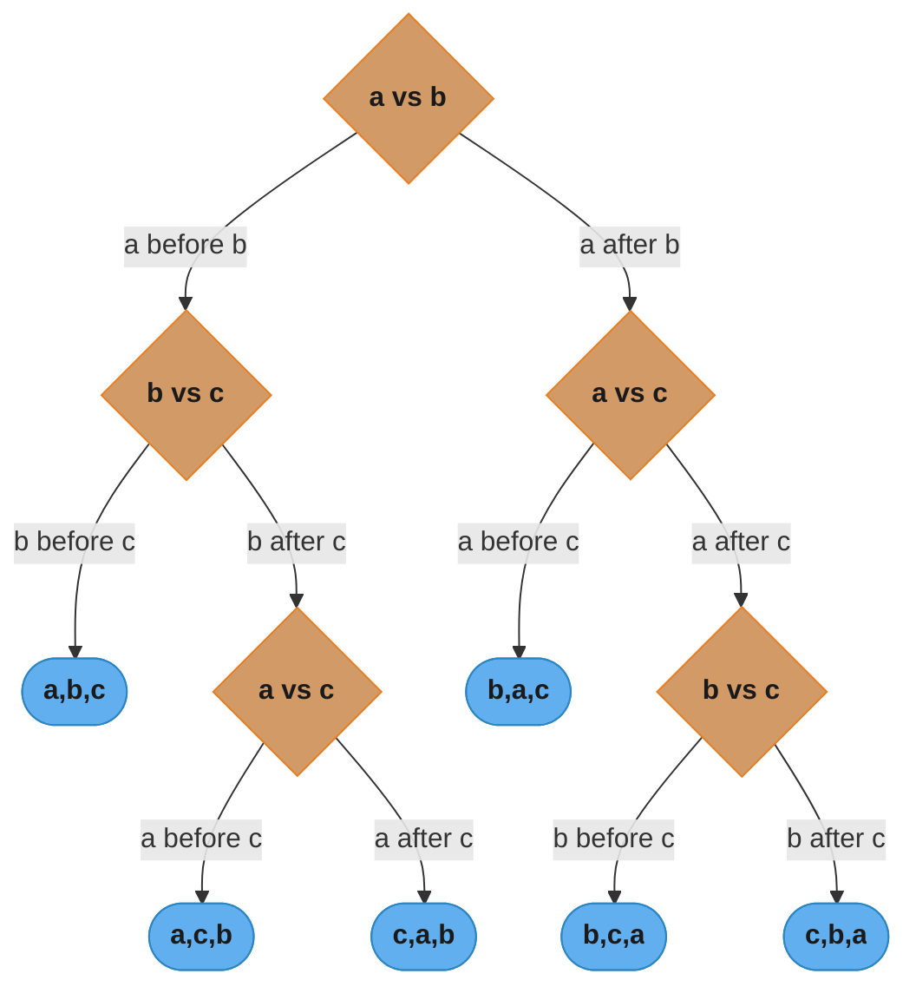
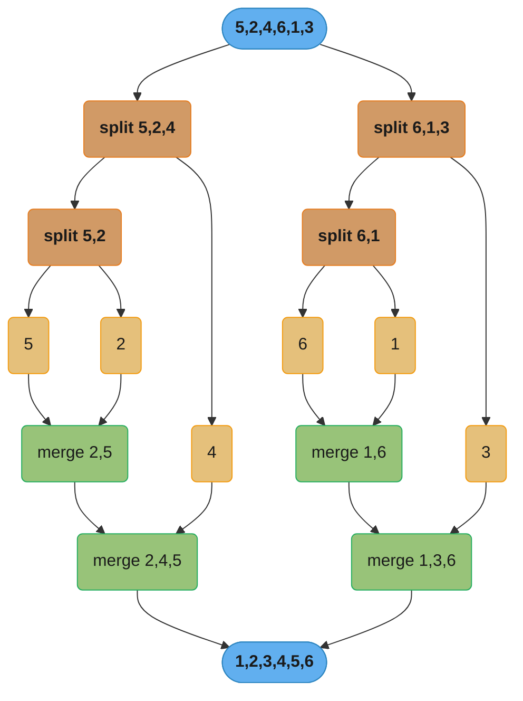
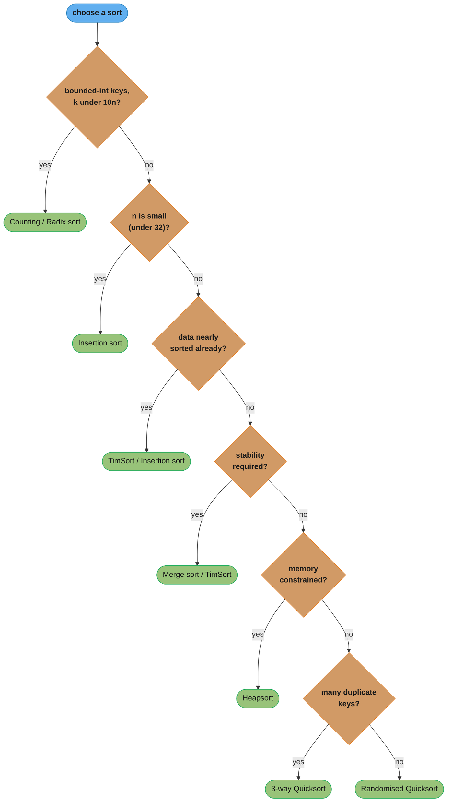

# Sorting and Searching

> Putting things in order and finding things fast — the two most pervasive operations in all of computing.

---

## 1. Concept Overview

Sorting transforms an unordered collection into an ordered one. Searching locates a target within a collection. Together they underpin databases (B-tree inserts maintain order; binary search drives index lookups), operating systems (process schedulers maintain run-queue order), compilers (symbol tables are sorted for O(log n) lookup), and nearly every interview coding problem.

This module covers comparison-based sorting (merge sort, quicksort, heapsort), non-comparison sorting (counting sort, radix sort), binary search and its variants, and the fundamental lower bound proof that no comparison sort can do better than Ω(n log n).

---

## 2. Intuition

> **One-line analogy**: Sorting is like organizing a library — comparison sort is alphabetizing by reading each title, while non-comparison sort is routing books directly to pre-labeled shelves without ever comparing two titles.

**Mental model**: Every comparison sort operates by deciding "which of A and B comes first?" The decision tree for all possible orderings of n elements has n! leaves. A binary tree of depth d has at most 2^d leaves, so d ≥ log₂(n!) ≈ n log n. This is why Ω(n log n) is the floor — any algorithm that makes fewer comparisons cannot distinguish all n! permutations.

**Why it matters**: Sorting is O(n log n) in practice and worth its cost when: subsequent binary searches each save O(n) → O(log n), sort-merge joins process large datasets, or the sorted order itself is the deliverable. Searching is ubiquitous because almost all data retrieval reduces to "find this key."

**Key insight**: Binary search is not just for sorted arrays. The real pattern is: *binary search on an answer space*. Whenever you can check "is X feasible?" in O(f(n)), binary search over the answer range finds the minimum feasible X in O(f(n) · log(range)) — used for capacity planning, rope cutting, and many "find minimum maximum" problems.

---

## 3. Core Principles

**Comparison sort lower bound**: Any comparison-based sort requires Ω(n log n) comparisons in the worst case. Proof: the decision tree has n! leaves, minimum height ≥ log₂(n!) ≥ n log₂ n − n (Stirling) = Ω(n log n).



*A concrete decision tree for 3 elements (a, b, c): each diamond is one comparison, each pill is one of the 3! = 6 possible orderings. The tree needs height ≥ log₂(6) ≈ 2.58, so at least 3 comparisons — the same counting argument scales to n log n comparisons for n elements.*

**Stability**: A sort is stable if equal elements maintain their original relative order. Merge sort and insertion sort are naturally stable. Quicksort and heapsort are not (without extra bookkeeping). Stability matters for multi-key sorts (sort by department, then by salary within department).

**In-place vs auxiliary space**: In-place sorts (quicksort, heapsort) use O(log n) or O(1) extra space (excluding recursion stack). Merge sort requires O(n) auxiliary space for the merge buffer — a real constraint for large-n or memory-constrained environments.

**Adaptive sorts**: Some sorts exploit existing order in the input. Insertion sort is O(n) on nearly-sorted input (each element travels a short distance). TimSort (Python's `list.sort()`, Java's `Arrays.sort()` for objects) achieves O(n) on already-sorted data by detecting "runs" and merging them — this is why sorting an almost-sorted list is faster in practice.

**Non-comparison sorts**: When keys are bounded integers (or can be mapped to them), counting sort achieves O(n + k) where k is the key range, and radix sort achieves O(d(n + k)) where d is the number of digits. They bypass the Ω(n log n) lower bound because they do not use comparisons — they use array indexing (key-as-index).

---

## 4. Types / Architectures / Strategies

### Comparison Sorts

| Sort | Best | Average | Worst | Space | Stable | Notes |
|------|------|---------|-------|-------|--------|-------|
| Merge sort | O(n log n) | O(n log n) | O(n log n) | O(n) | Yes | Predictable; used for external sort |
| Quicksort | O(n log n) | O(n log n) | O(n²) | O(log n) | No | Fast in practice; cache-friendly |
| Heapsort | O(n log n) | O(n log n) | O(n log n) | O(1) | No | Consistent; poor cache behaviour |
| Insertion sort | O(n) | O(n²) | O(n²) | O(1) | Yes | Best for small n (≤32) or nearly sorted |
| TimSort | O(n) | O(n log n) | O(n log n) | O(n) | Yes | Python's built-in; detects runs |
| Intro sort | O(n log n) | O(n log n) | O(n log n) | O(log n) | No | C++ `std::sort`; hybrid quick/heap/insertion |

### Non-Comparison Sorts

| Sort | Time | Space | Stable | Constraint |
|------|------|-------|--------|------------|
| Counting sort | O(n + k) | O(k) | Yes | Keys are non-negative integers in [0, k) |
| Radix sort (LSD) | O(d(n + k)) | O(n + k) | Yes | Keys decomposable into d digits, each in [0, k) |
| Bucket sort | O(n + k) avg | O(n + k) | Depends | Keys uniformly distributed in a range |

### Binary Search Variants

| Variant | Returns | Use case |
|---------|---------|----------|
| Standard | Index or -1 | Exact match |
| Left bound (lower_bound) | First index where arr[i] ≥ target | First occurrence, insert position |
| Right bound (upper_bound) | First index where arr[i] > target | Last occurrence, count of target |
| Answer-space search | Minimum feasible value | "Find min X such that condition(X)" |

---

## 5. Architecture Diagrams

### Merge Sort — Divide and Merge



*Each level performs O(n) merge work across log n levels, giving O(n log n) total — divide (orange) recursively halves the array down to single-element base cases (gold), then merge (green) recombines them in sorted order back up to the final output (blue).*

### Quicksort — Partition Around Pivot

```
Input: [3, 6, 8, 10, 1, 2, 1], pivot = last element (1)
Lomuto partition:
  i=-1, j scans 0..5
  arr[j]=3 > 1: skip
  arr[j]=6 > 1: skip
  arr[j]=8 > 1: skip
  arr[j]=10> 1: skip
  arr[j]=1 <= 1: swap arr[++i]=arr[0] with arr[4] -> [1, 6, 8, 10, 3, 2, 1]
  arr[j]=2 > 1: skip
  swap pivot (arr[6]) with arr[i+1=1] -> [1, 1, 8, 10, 3, 2, 6]
         ^pivot at index 1^
  Recurse on [1] and [8, 10, 3, 2, 6]

Worst case: sorted input, always pick last as pivot
  -> pivot lands at index 0 or n-1 every time
  -> n recursive calls each doing O(n) work = O(n^2)
```

### Counting Sort

```
Input: [4, 2, 2, 8, 3, 3, 1], k=9

Step 1 — count occurrences:
  count = [0, 1, 2, 2, 1, 0, 0, 0, 1]
           idx:0  1  2  3  4  5  6  7  8

Step 2 — prefix sums (cumulative positions):
  count = [0, 1, 3, 5, 6, 6, 6, 6, 7]

Step 3 — place elements (right-to-left for stability):
  Input[6]=1 -> output[count[1]-1=0]=1, count[1]=0
  Input[5]=3 -> output[count[3]-1=4]=3, count[3]=4
  ...
  Output: [1, 2, 2, 3, 3, 4, 8]
```

### Binary Search — Left Bound

```
arr = [1, 2, 2, 2, 3, 4], target = 2

lo=0, hi=5
  mid=2, arr[2]=2 >= target: hi=2
lo=0, hi=2
  mid=1, arr[1]=2 >= target: hi=1
lo=0, hi=1
  mid=0, arr[0]=1 < target: lo=1
lo=1, hi=1 -> return 1  (first index of 2)
```

---

## 6. How It Works — Detailed Mechanics

### Merge Sort

```python
from __future__ import annotations
from typing import List


def merge_sort(arr: List[int]) -> List[int]:
    if len(arr) <= 1:
        return arr
    mid = len(arr) // 2
    left = merge_sort(arr[:mid])
    right = merge_sort(arr[mid:])
    return _merge(left, right)


def _merge(left: List[int], right: List[int]) -> List[int]:
    result: List[int] = []
    i = j = 0
    while i < len(left) and j < len(right):
        if left[i] <= right[j]:   # <= preserves stability
            result.append(left[i]); i += 1
        else:
            result.append(right[j]); j += 1
    result.extend(left[i:])
    result.extend(right[j:])
    return result
```

**In-place merge sort** (bottom-up, avoids recursion overhead):

```python
def merge_sort_inplace(arr: List[int]) -> None:
    n = len(arr)
    width = 1
    while width < n:
        for lo in range(0, n, 2 * width):
            mid = min(lo + width, n)
            hi = min(lo + 2 * width, n)
            _merge_into(arr, lo, mid, hi)
        width *= 2


def _merge_into(arr: List[int], lo: int, mid: int, hi: int) -> None:
    left = arr[lo:mid]
    right = arr[mid:hi]
    i = j = 0; k = lo
    while i < len(left) and j < len(right):
        if left[i] <= right[j]:
            arr[k] = left[i]; i += 1
        else:
            arr[k] = right[j]; j += 1
        k += 1
    while i < len(left): arr[k] = left[i]; i += 1; k += 1
    while j < len(right): arr[k] = right[j]; j += 1; k += 1
```

### Quicksort with Randomised Pivot

```python
import random


def quicksort(arr: List[int], lo: int = 0, hi: int = -1) -> None:
    if hi == -1:
        hi = len(arr) - 1
    if lo >= hi:
        return
    pivot_idx = _partition(arr, lo, hi)
    quicksort(arr, lo, pivot_idx - 1)
    quicksort(arr, pivot_idx + 1, hi)


def _partition(arr: List[int], lo: int, hi: int) -> int:
    # Randomise pivot to avoid O(n^2) on sorted input
    rand_idx = random.randint(lo, hi)
    arr[rand_idx], arr[hi] = arr[hi], arr[rand_idx]
    pivot = arr[hi]
    i = lo - 1
    for j in range(lo, hi):
        if arr[j] <= pivot:
            i += 1
            arr[i], arr[j] = arr[j], arr[i]
    arr[i + 1], arr[hi] = arr[hi], arr[i + 1]
    return i + 1
```

**Three-way partition (Dutch National Flag)** — handles many duplicate keys, degrades from O(n log n) to O(n) when all keys equal:

```python
def quicksort_3way(arr: List[int], lo: int, hi: int) -> None:
    if lo >= hi:
        return
    lt, gt = lo, hi
    pivot = arr[lo]
    i = lo + 1
    while i <= gt:
        if arr[i] < pivot:
            arr[lt], arr[i] = arr[i], arr[lt]; lt += 1; i += 1
        elif arr[i] > pivot:
            arr[i], arr[gt] = arr[gt], arr[i]; gt -= 1
        else:
            i += 1
    # arr[lo..lt-1] < pivot, arr[lt..gt] == pivot, arr[gt+1..hi] > pivot
    quicksort_3way(arr, lo, lt - 1)
    quicksort_3way(arr, gt + 1, hi)
```

### Counting Sort

```python
def counting_sort(arr: List[int], k: int) -> List[int]:
    """Sort arr where all values in [0, k). O(n+k) time and space."""
    count = [0] * k
    for x in arr:
        count[x] += 1
    # prefix sums: count[i] = number of elements <= i
    for i in range(1, k):
        count[i] += count[i - 1]
    output = [0] * len(arr)
    # right-to-left preserves stability
    for x in reversed(arr):
        count[x] -= 1
        output[count[x]] = x
    return output
```

### Radix Sort (LSD)

```python
def radix_sort(arr: List[int]) -> List[int]:
    """LSD radix sort. All values must be non-negative."""
    if not arr:
        return arr
    max_val = max(arr)
    exp = 1
    while max_val // exp > 0:
        arr = _counting_sort_by_digit(arr, exp)
        exp *= 10
    return arr


def _counting_sort_by_digit(arr: List[int], exp: int) -> List[int]:
    k = 10
    count = [0] * k
    for x in arr:
        count[(x // exp) % 10] += 1
    for i in range(1, k):
        count[i] += count[i - 1]
    output = [0] * len(arr)
    for x in reversed(arr):
        digit = (x // exp) % 10
        count[digit] -= 1
        output[count[digit]] = x
    return output
```

### Binary Search — All Variants

```python
def binary_search(arr: List[int], target: int) -> int:
    """Returns index of target, or -1 if not found."""
    lo, hi = 0, len(arr) - 1
    while lo <= hi:
        mid = lo + (hi - lo) // 2   # avoids integer overflow
        if arr[mid] == target:
            return mid
        elif arr[mid] < target:
            lo = mid + 1
        else:
            hi = mid - 1
    return -1


def lower_bound(arr: List[int], target: int) -> int:
    """First index i such that arr[i] >= target. Returns len(arr) if all < target."""
    lo, hi = 0, len(arr)
    while lo < hi:
        mid = lo + (hi - lo) // 2
        if arr[mid] < target:
            lo = mid + 1
        else:
            hi = mid
    return lo


def upper_bound(arr: List[int], target: int) -> int:
    """First index i such that arr[i] > target. Returns len(arr) if all <= target."""
    lo, hi = 0, len(arr)
    while lo < hi:
        mid = lo + (hi - lo) // 2
        if arr[mid] <= target:
            lo = mid + 1
        else:
            hi = mid
    return lo


def count_occurrences(arr: List[int], target: int) -> int:
    return upper_bound(arr, target) - lower_bound(arr, target)
```

**Answer-space binary search** — "minimum capacity C such that operation is feasible":

```python
def min_feasible(lo: int, hi: int, is_feasible) -> int:
    """
    Binary search on answer space [lo, hi].
    is_feasible(x) returns True if x is a valid answer.
    Assumes: if is_feasible(x) is True, then is_feasible(x+1) is also True.
    Returns the minimum x in [lo, hi] that is feasible.
    """
    while lo < hi:
        mid = lo + (hi - lo) // 2
        if is_feasible(mid):
            hi = mid
        else:
            lo = mid + 1
    return lo


# Example: Koko eating bananas (LeetCode 875)
# Find minimum eating speed k such that Koko can finish all piles in h hours.
def min_eating_speed(piles: List[int], h: int) -> int:
    import math
    def can_finish(speed: int) -> bool:
        return sum(math.ceil(p / speed) for p in piles) <= h
    return min_feasible(1, max(piles), can_finish)
```

---

## 7. Real-World Examples

**TimSort in CPython**: Python's `list.sort()` and `sorted()` use TimSort — a hybrid merge/insertion sort that detects natural runs (already-sorted sub-sequences) and merges them with a galloping strategy. On real-world data (log files, timestamps, partially-ordered records), TimSort is O(n) because it exploits existing order. The minimum run size is 32–64 elements; shorter runs are extended via insertion sort before merging.

**External sort (databases)**: When sorting data that doesn't fit in RAM (multi-TB datasets), PostgreSQL and MySQL use external merge sort: split into chunks that fit in memory, sort each chunk, write to disk, then k-way merge the sorted runs. The sort-merge join is directly built on this: sort both relations on the join key, then merge in one pass.

**Quicksort in C++ `std::sort`**: C++'s `std::sort` uses Introsort — start with quicksort, but if recursion depth exceeds 2·log(n) (pathological pivot selection), switch to heapsort to guarantee O(n log n). For small partitions (≤16 elements), switch to insertion sort. This hybrid achieves the best of all three algorithms.

**Binary search in distributed systems**: Consistent hashing (used in DynamoDB, Cassandra, Redis Cluster) distributes keys to nodes by finding the first node with a virtual-node hash ≥ key hash — this is exactly `lower_bound` on the sorted ring of virtual node positions.

**Database index lookups**: A B+Tree index on a column of 10 million rows has height ~4 (fanout ~100). Finding a row requires 4 comparisons — equivalent to binary search on a sorted array of 10 million elements (log₂(10M) ≈ 23), but with far better disk I/O characteristics because each node is a full disk page (~4–8 KB).

---

## 8. Tradeoffs

### Sorting Algorithm Selection

| Criterion | Best choice | Why |
|-----------|-------------|-----|
| General purpose, memory available | TimSort / merge sort | Stable, O(n log n) worst case, adaptive |
| General purpose, memory tight | Introsort / heapsort | O(1) extra space, O(n log n) guaranteed |
| Many duplicate keys | 3-way quicksort | O(n) when all keys equal; avoids O(n log n) overhead |
| Nearly sorted data | Insertion sort or TimSort | O(n) on almost-sorted; simple and cache-friendly |
| Small n (≤32) | Insertion sort | Low constant factors; no recursion overhead |
| Integer keys, bounded range | Counting or radix sort | O(n) beats O(n log n) when k is small |
| Stable sort of objects (Java) | `Arrays.sort(Object[])` → TimSort | Java's primitive `Arrays.sort` uses dual-pivot quicksort (not stable) |

### Comparison Sort vs Non-Comparison Sort

| Aspect | Comparison sort | Non-comparison sort |
|--------|----------------|---------------------|
| Time complexity | Ω(n log n) lower bound | O(n + k) or O(d·(n + k)) |
| Applicability | Any totally ordered domain | Bounded non-negative integers (or mappable to them) |
| Space | O(1) – O(n) depending on algorithm | O(n + k) |
| Stability | Depends on algorithm | Counting and LSD radix are stable |
| Practical limit | Suitable for all general use | Efficient only when k ≪ n (k = key range) |

---

## 9. When to Use / When NOT to Use



*A routing view of the Section 8 selection table and the prose below: walk the checks top-to-bottom to land on the right algorithm for your constraints; each branch is justified in detail in the paragraphs that follow.*

**Use merge sort when**: stability is required; worst-case O(n log n) is mandatory; sorting linked lists (merge sort works naturally on lists, quicksort does not); external sort (merge is inherently parallelisable and sequential-I/O-friendly).

**Use quicksort when**: memory is constrained (in-place); you want the fastest average-case for arrays; you control the data (or use randomised pivot to neutralise adversarial inputs); duplicate keys can be handled with 3-way partition.

**Use heapsort when**: O(n log n) worst case + O(1) space is mandatory and you don't care about cache performance. Rarely the first choice in practice because cache misses make it slower than quicksort by 2–5×.

**Use counting/radix sort when**: keys are non-negative integers with bounded range k ≤ 10n (otherwise the O(n + k) benefit disappears). Typical: sorting integers in [0, 10^6], sorting strings of fixed length.

**Do NOT use quicksort when**: stability is required (quicksort is not stable); input is adversarial and pivot randomisation is not used (sorted input → O(n²)).

**Do NOT use counting sort when**: the key range k is much larger than n — e.g., sorting 1000 64-bit integers requires 2^64 buckets.

**Use binary search when**: the data is sorted (or can be kept sorted). Binary search finds a value in a sorted array of 1 billion elements in 30 comparisons.

**Use answer-space binary search when**: you have a monotonic feasibility function — any problem phrased as "find minimum X such that condition(X)" with a monotone condition is a candidate.

---

## 10. Common Pitfalls

### Pitfall 1 — Off-by-one in binary search (infinite loop)

```python
# BROKEN: lo + hi can overflow in other languages; but the real bug is the termination condition
def broken_binary_search(arr, target):
    lo, hi = 0, len(arr) - 1
    while lo < hi:                   # BUG: terminates at lo==hi, may miss final element
        mid = (lo + hi) // 2
        if arr[mid] < target:
            lo = mid + 1
        else:
            hi = mid - 1             # BUG: can skip the actual answer if arr[mid]==target
    return lo if arr[lo] == target else -1
```

```python
# FIX: use lo <= hi for exact search; or lo < hi with careful hi = mid for bound search
def fixed_binary_search(arr, target):
    lo, hi = 0, len(arr) - 1
    while lo <= hi:                  # includes single-element case
        mid = lo + (hi - lo) // 2   # overflow-safe even in languages with fixed int width
        if arr[mid] == target:
            return mid
        elif arr[mid] < target:
            lo = mid + 1
        else:
            hi = mid - 1
    return -1
```

### Pitfall 2 — Choosing a bad pivot for quicksort on sorted input

```python
# BROKEN: always pick last element as pivot; sorted input -> O(n^2)
def broken_quicksort(arr, lo, hi):
    if lo >= hi:
        return
    pivot = arr[hi]           # always last -> degenerate partition on sorted array
    i = lo - 1
    for j in range(lo, hi):
        if arr[j] <= pivot:
            i += 1
            arr[i], arr[j] = arr[j], arr[i]
    arr[i + 1], arr[hi] = arr[hi], arr[i + 1]
    p = i + 1
    broken_quicksort(arr, lo, p - 1)
    broken_quicksort(arr, p + 1, hi)
```

```python
# FIX: randomise pivot before partition
import random

def fixed_quicksort(arr, lo, hi):
    if lo >= hi:
        return
    rand_idx = random.randint(lo, hi)
    arr[rand_idx], arr[hi] = arr[hi], arr[rand_idx]  # swap random element to end
    pivot = arr[hi]
    i = lo - 1
    for j in range(lo, hi):
        if arr[j] <= pivot:
            i += 1
            arr[i], arr[j] = arr[j], arr[i]
    arr[i + 1], arr[hi] = arr[hi], arr[i + 1]
    p = i + 1
    fixed_quicksort(arr, lo, p - 1)
    fixed_quicksort(arr, p + 1, hi)
```

### Pitfall 3 — Applying counting sort when key range >> n

```python
# BROKEN: caller doesn't check key range; k = max(arr) + 1 can be huge
def broken_use_counting(arr):
    k = max(arr) + 1              # if arr = [0, 10**9] -> k = 10^9, allocates 4 GB
    count = [0] * k               # MemoryError or extreme slowdown
    ...
```

```python
# FIX: gate on key range vs n; fall back to comparison sort if k >> n
def smart_sort(arr):
    if not arr:
        return arr
    k = max(arr) - min(arr) + 1
    if k <= 10 * len(arr):          # heuristic: counting sort only pays off when k <= 10n
        return counting_sort_shifted(arr)
    return sorted(arr)              # Python's TimSort; O(n log n)
```

### Pitfall 4 — Merge sort on large linked list without tail recursion (stack overflow)

```python
# BROKEN: recursive merge sort on 10^6-node linked list overflows call stack
# Python default recursion limit is 1000; even with sys.setrecursionlimit, 
# 10^6 frames exhaust memory.
# FIX: use bottom-up (iterative) merge sort for linked lists — O(1) call stack
```

### Pitfall 5 — Binary search on a non-monotone function

```python
# BROKEN: trying to binary-search for a local minimum in a non-monotone array
# without establishing the monotone invariant.
# If condition(x) is True, False, True (not monotone), binary search gives wrong answer.

# FIX: only apply answer-space binary search when the feasibility function is provably monotone.
# Before coding: verify "if condition(mid) is True, then condition(mid+1) is also True."
# If not provable, binary search does not apply.
```

---

## 11. Technologies & Tools

| Tool / Library | Language | Sorting Algorithm | Notes |
|----------------|----------|-------------------|-------|
| `list.sort()` / `sorted()` | Python | TimSort | Stable; O(n) best case (already sorted) |
| `Arrays.sort(int[])` | Java | Dual-pivot quicksort | Not stable; faster than single-pivot for primitives |
| `Arrays.sort(Object[])` | Java | TimSort | Stable (required by Java spec for objects) |
| `std::sort` | C++ | Introsort (hybrid quick/heap/insertion) | Not stable |
| `std::stable_sort` | C++ | Merge sort (guaranteed stable) | O(n log n), uses O(n) memory |
| `bisect` module | Python | Binary search | `bisect_left` = lower_bound, `bisect_right` = upper_bound |
| `sortedcontainers.SortedList` | Python | B-tree-based sorted list | O(log n) insert/delete/search; mutable sorted sequence |

---

## 12. Interview Questions with Answers

**Q1: What is the comparison-sort lower bound and how is it proved?**
Ω(n log n). Any comparison-based sort's execution can be modeled as a decision tree where each internal node is a comparison and each leaf is a permutation outcome. To distinguish all n! permutations, the tree needs n! leaves, so height ≥ log₂(n!) ≈ n log₂n − n = Ω(n log n). This is a worst-case bound — no algorithm can do better for arbitrary data.

**Q2: Why does quicksort perform better than merge sort in practice despite the same asymptotic complexity?**
Two reasons: cache behaviour and constant factors. Quicksort partitions in-place on contiguous memory — the inner loop accesses sequential addresses, which maximises L1/L2 cache hits. Merge sort allocates an O(n) auxiliary array and copies data across two buffers, causing more cache misses. Additionally, quicksort has no memory allocation overhead, and modern CPUs can pipeline its comparisons efficiently. Measured constant factor for quicksort is ~2–3× smaller than merge sort's.

**Q3: What are the four properties needed for a stable sort, and which standard algorithms are stable?**
A sort is stable if equal elements preserve their input order. Stable: merge sort, insertion sort, counting sort (with right-to-left scan), LSD radix sort, TimSort. Not stable: quicksort, heapsort. Stability is required for multi-key sort (e.g., sort records by name then by department — sort by department first with a stable sort, then sort by name; the department order is preserved within equal names).

**Q4: When does counting sort beat merge sort and when does it not?**
Counting sort is O(n + k) where k is the key range. It beats merge sort's O(n log n) when k = O(n log n), i.e., roughly k ≤ 10n–100n. For sorting 1M integers in [0, 10M], counting sort uses 40 MB (10M × 4B) and completes in one pass — faster than O(n log n). For sorting 1K 64-bit integers, k = 2^64 — completely infeasible; use comparison sort.

**Q5: What is the difference between lower_bound and upper_bound, and when do you need each?**
`lower_bound(target)` returns the first index where `arr[i] >= target` — the leftmost position target could be inserted to keep order. `upper_bound(target)` returns the first index where `arr[i] > target` — one past the last occurrence. Number of occurrences = `upper_bound - lower_bound`. Use `lower_bound` to find the first occurrence or an insertion point; use `upper_bound` to find the end of a range or count duplicates.

**Q6: How does randomised quicksort avoid the O(n²) worst case on sorted input?**
By randomly shuffling the pivot choice. In each partition call, swap a random element into the pivot position before partitioning. The expected depth of the recursion tree becomes O(log n) because the probability of picking the globally worst pivot at every level is (1/n)^(n/2) — exponentially small. The expected number of comparisons is 2n ln n ≈ 1.39 n log₂ n, matching the best-case performance of deterministic quicksort.

**Q7: What is 3-way quicksort and when should you use it?**
3-way quicksort (Dutch National Flag partition) partitions the array into three sections: < pivot, == pivot, > pivot. Recursion only proceeds on the < and > sections, skipping all equal elements. If the input has many duplicates (e.g., sorting 10M integers where values are in [0, 1000]), standard 2-way quicksort still recurses into equal-element sub-arrays — O(n log n). 3-way quicksort degrades to O(n) for fully identical arrays and to O(n k log k) where k is the number of distinct values — a significant practical win for low-cardinality data.

**Q8: Explain the answer-space binary search pattern with a concrete example.**
Instead of searching for a value in an array, binary search over the space of possible answers. The condition: "is X a feasible answer?" must be monotone (if X works, X+1 works). Example: "Find the minimum number of days to ship all packages within a weight capacity." Feasibility check: simulate loading packages day by day with capacity mid — if it finishes in ≤ D days, mid is feasible. Binary search over capacity [max(weight), sum(weights)] in O(log(sum) × n) = O(n log(sum)) — far faster than linear scan over O(sum) values.

**Q9: What is TimSort and why is it the practical choice for general-purpose sorting?**
TimSort is a hybrid merge + insertion sort. It scans the input for "natural runs" (ascending or descending sequences) and merges them with a strategy that is O(n) for already-sorted input and O(n log n) for random input. The galloping mode accelerates merges when one run dominates the other. Invented by Tim Peters for CPython in 2002. Also used in Java (for object arrays), V8 (JavaScript), Swift, and Rust. Its advantage is adaptive behaviour: real-world data is rarely random — logs, timestamps, and records often have significant existing order.

**Q10: How does binary search apply to database index lookups?**
A B+Tree index on 10 million rows with branching factor 100 has height ≤ 4. Each lookup is 4 node reads (4 disk I/Os or 4 cache lookups). Equivalent to binary search on a sorted 10M-element array (log₂(10M) ≈ 23 comparisons) — but B+Tree is better because each node is a full 4–8 KB disk page; the branching factor trades comparisons for I/O. The leaf page contains the sorted values, so range queries walk the leaf level sequentially rather than doing repeated binary searches.

**Q11: Can you sort a linked list in O(n log n) with O(1) extra space?**
Yes — bottom-up merge sort. Instead of top-down recursive splitting (which requires O(log n) call stack), iterate with run widths 1, 2, 4, 8, ... Scan the list in pairs of runs of current width and merge in-place by pointer relinking. Each level takes O(n), log n levels → O(n log n) total, O(1) extra space (just a few pointers). This is not possible with quicksort, which requires random access for pivot selection.

**Q12: What is the expected number of comparisons in quicksort and how is it derived?**
2n ln n ≈ 1.39 n log₂ n. Each pair (i, j) where i < j is compared at most once (when one of them is chosen as a pivot before the other). The probability that element i is compared with element j equals 2/(j − i + 1) (either i or j is the first pivot chosen among them). Summing over all pairs: Σ_{i<j} 2/(j−i+1) = 2 Σ_{k=1}^{n} (n−k+1)/k ≈ 2n Σ 1/k ≈ 2n ln n.

**Q13: How do you handle integer overflow in the midpoint calculation for binary search?**
The naive `mid = (lo + hi) / 2` overflows when `lo + hi > INT_MAX` (2^31 − 1 in 32-bit integers). Fix: `mid = lo + (hi - lo) / 2`. In Python this is not a practical concern (arbitrary precision integers), but in Java/C/C++ it is critical. Overflow-safe alternative: `mid = (lo + hi) >>> 1` (unsigned right shift in Java). This is a famous bug that existed in Java's standard library `Arrays.binarySearch` for over a decade (reported by Joshua Bloch in 2006).

**Q14: When should you use radix sort over counting sort?**
Radix sort is counting sort applied digit-by-digit. Use radix sort when: keys have a large range but small number of digits (e.g., 64-bit integers have 8 bytes = 8 radix-256 digits); you need a stable sort of multi-field keys (LSD radix sort: sort by least significant field first, then more significant — stability propagates the order). Counting sort is simpler and sufficient when the range k is small enough directly (e.g., grades 0–100). Radix sort's complexity is O(d × (n + b)) where b is the base (256 is typical); for 32-bit integers with b=256, d=4 passes.

**Q15: How do you find the k-th smallest element efficiently?**
Quickselect: partition around a random pivot; if pivot lands at position k, return it; otherwise recurse only on the side containing rank k. Expected O(n) time, O(n²) worst case. Median-of-medians pivot selection guarantees O(n) worst case but with large constants — rarely used in practice. For streaming k-th smallest, use a max-heap of size k: push each element; if size > k, pop the max. After the stream, the heap root is the k-th smallest. Cost: O(n log k).

**Q16: What is the significance of the merge step in external sort?**
In external sort, sorted runs are written to disk and then k-way merged using a min-heap of size k. Each heap operation is O(log k); the total number of elements is N, so merge cost is O(N log k). The I/O benefit: sequential reads from k files into a small buffer — the I/O pattern is sequential (fast), not random. This is why merge sort, not quicksort, is used for external sorting: merge can be driven by sequential I/O, while quicksort's partitioning requires random writes.

**Q17: How does Python's `bisect` module work and what are its pitfalls?**
`bisect.bisect_left(arr, x)` returns the leftmost index where x could be inserted to keep arr sorted — equivalent to `lower_bound`. `bisect.bisect_right(arr, x)` (or `bisect.bisect(arr, x)`) returns one past the rightmost — equivalent to `upper_bound`. Pitfall: `bisect` assumes the list is already sorted; it does not check. Calling `bisect_left` on an unsorted list returns a meaningless result with no error. Second pitfall: `bisect` works on any comparable type, but the comparison must be consistent with the sort key used.

**Q18: How does dual-pivot quicksort (Java's Arrays.sort for primitives) differ from single-pivot?**
Dual-pivot quicksort uses two pivots (p1 ≤ p2) to partition into three sections: < p1, between p1 and p2, > p2. This reduces the average number of comparisons from 2n ln n to ~1.9n ln n and produces more balanced partitions. Java's implementation (by Vladimir Yaroslavskiy) is empirically 10–20% faster than single-pivot quicksort for primitive arrays due to fewer swaps and better branch prediction. It is not stable and cannot be used for Object[] (where stability is required by Java spec — hence Objects use TimSort).

---

## 13. Best Practices

**Use the standard library first**: Python's `sorted()` / `list.sort()` (TimSort), Java's `Arrays.sort()`, and C++'s `std::sort` are battle-hardened. Only implement a custom sort when: you need a specific algorithm for a specific constraint, you're writing low-level infrastructure, or you're solving an interview problem that asks for the algorithm.

**Prefer lower_bound / upper_bound over ad-hoc binary search**: Rolling your own binary search with custom termination conditions is error-prone. The two-template approach (`lo < hi` with `hi = mid` for lower_bound; `lo <= hi` with `hi = mid - 1` for standard) covers all cases.

**Always randomise quicksort pivots**: Never implement production quicksort without randomised pivot selection. Sorted input is extremely common in practice (sorted logs, already-indexed DB results), and deterministic last-element pivot turns it into O(n²).

**Check the invariant for answer-space binary search**: Before writing the binary search, write down the monotone invariant and verify it algebraically. If `is_feasible(mid)` being True does not guarantee `is_feasible(mid+1)` is True, binary search is inapplicable.

**For nearly-sorted data, prefer insertion sort or TimSort over quicksort**: If you know the data has bounded displacement (each element is at most k positions from its sorted position), insertion sort runs in O(n·k) — O(n) for small k.

---

## 14. Case Study

### Scenario: External Sort of a 100 GB Log File

A log-processing system must sort a 100 GB access log by (timestamp, user_id) to enable efficient range queries. Available RAM: 4 GB.

**Approach**: Two-phase external merge sort.

**Phase 1 — Create sorted runs**:

```python
from __future__ import annotations
import heapq
import os
from typing import Iterator


def create_sorted_runs(input_path: str, run_prefix: str, mem_limit_bytes: int) -> list[str]:
    """
    Read input_path in chunks of mem_limit_bytes, sort each chunk, write to temp file.
    Returns list of sorted run file paths.
    """
    run_files: list[str] = []
    run_idx = 0
    buffer: list[tuple[int, str]] = []
    buffer_bytes = 0

    with open(input_path) as f:
        for line in f:
            ts, uid = parse_log_line(line)
            buffer.append((ts, uid))
            buffer_bytes += len(line)
            if buffer_bytes >= mem_limit_bytes:
                run_path = f"{run_prefix}_{run_idx}.tmp"
                buffer.sort()                       # TimSort: O(n log n), stable
                with open(run_path, "w") as rf:
                    for entry in buffer:
                        rf.write(format_entry(entry) + "\n")
                run_files.append(run_path)
                buffer.clear()
                buffer_bytes = 0
                run_idx += 1

    if buffer:
        run_path = f"{run_prefix}_{run_idx}.tmp"
        buffer.sort()
        with open(run_path, "w") as rf:
            for entry in buffer:
                rf.write(format_entry(entry) + "\n")
        run_files.append(run_path)

    return run_files


def parse_log_line(line: str) -> tuple[int, str]:
    parts = line.strip().split(",", 1)
    return int(parts[0]), parts[1]


def format_entry(entry: tuple[int, str]) -> str:
    return f"{entry[0]},{entry[1]}"
```

**Phase 2 — k-way merge using min-heap**:

```python
def kway_merge(run_files: list[str], output_path: str) -> None:
    """
    Merge sorted run files into a single sorted output.
    Uses a min-heap of size len(run_files) — O(N log k) total.
    """
    handles = [open(p) for p in run_files]
    heap: list[tuple[int, str, int]] = []   # (timestamp, uid, file_index)

    # Seed the heap with first entry from each run
    for idx, fh in enumerate(handles):
        line = fh.readline()
        if line:
            ts, uid = parse_log_line(line)
            heapq.heappush(heap, (ts, uid, idx))

    with open(output_path, "w") as out:
        while heap:
            ts, uid, idx = heapq.heappop(heap)
            out.write(format_entry((ts, uid)) + "\n")
            # Advance the exhausted run's file handle
            line = handles[idx].readline()
            if line:
                nts, nuid = parse_log_line(line)
                heapq.heappush(heap, (nts, nuid, idx))

    for fh in handles:
        fh.close()
    for p in run_files:
        os.remove(p)
```

**BROKEN version — using in-memory sort with no chunking**:

```python
# BROKEN: loads entire 100 GB into memory
def broken_sort(input_path: str, output_path: str) -> None:
    with open(input_path) as f:
        all_lines = f.readlines()           # 100 GB -> OOM kill
    all_lines.sort()
    with open(output_path, "w") as f:
        f.writelines(all_lines)
```

```python
# FIX: two-phase external merge sort — memory bounded by chunk size
def fixed_sort(input_path: str, output_path: str, mem_gb: int = 3) -> None:
    run_files = create_sorted_runs(input_path, "/tmp/sort_run", mem_gb * 1024 ** 3)
    kway_merge(run_files, output_path)
    # Result: sorts 100 GB with 4 GB RAM; ~25 run files, heap of size 25
```

**Capacity and performance**:

| Metric | Value |
|--------|-------|
| Input size | 100 GB |
| Memory limit | 4 GB (use 3 GB for safety) |
| Number of sorted runs | ~34 (100 / 3 ≈ 34) |
| Phase 1 time | O(n log n) per chunk × 34 chunks ≈ O(N log (N/k)) |
| Phase 2 heap ops | N total, O(log k) each = O(N log k) = O(N log 34) ≈ 5N comparisons |
| Disk I/O | 3 passes: 1 read + 1 write (Phase 1) + 1 read (Phase 2) |
| Total sort time (SSD, 500 MB/s) | ~100 GB / 500 MB/s × 3 passes ≈ 600 seconds |

**Discussion questions**:
1. How would you handle multi-level merging if the number of run files exceeds available file handles?
2. What if the log entries have duplicate timestamps — how does stability affect the output?
3. How would you parallelise Phase 1 across multiple machines?

---

## See Also

- [complexity_analysis_and_big_o](../complexity_analysis_and_big_o/) — the Ω(n log n) lower bound derivation and Master theorem for D&C recurrences
- [heaps_and_priority_queues](../heaps_and_priority_queues/) — heapsort, k-way merge with min-heap
- [dynamic_programming](../dynamic_programming/) — DP + binary search (patience sorting / LIS in O(n log n))
- [`database/`](../../database/) — sort-merge join, external sort in PostgreSQL
- [`python/collections_and_data_structures`](../../python/collections_and_data_structures/) — TimSort internals, `bisect` module details
- [`java/collections_internals`](../../java/collections_internals/) — dual-pivot quicksort for primitives, TimSort for objects
- [DSA Pattern Playbooks](../dsa_patterns/) — apply this technique: [Modified Binary Search](../dsa_patterns/modified_binary_search.md) (binary search on a sorted array, and binary search on the answer space)
