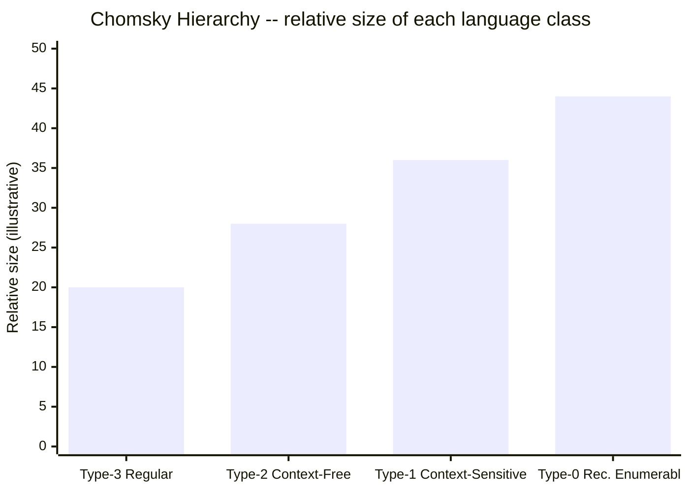
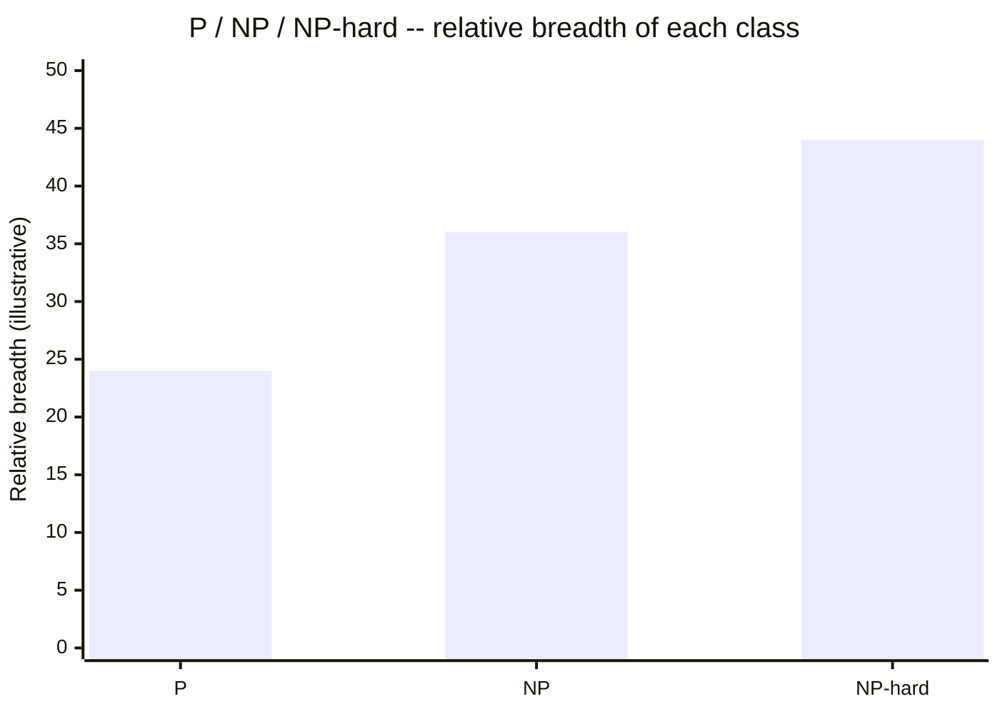
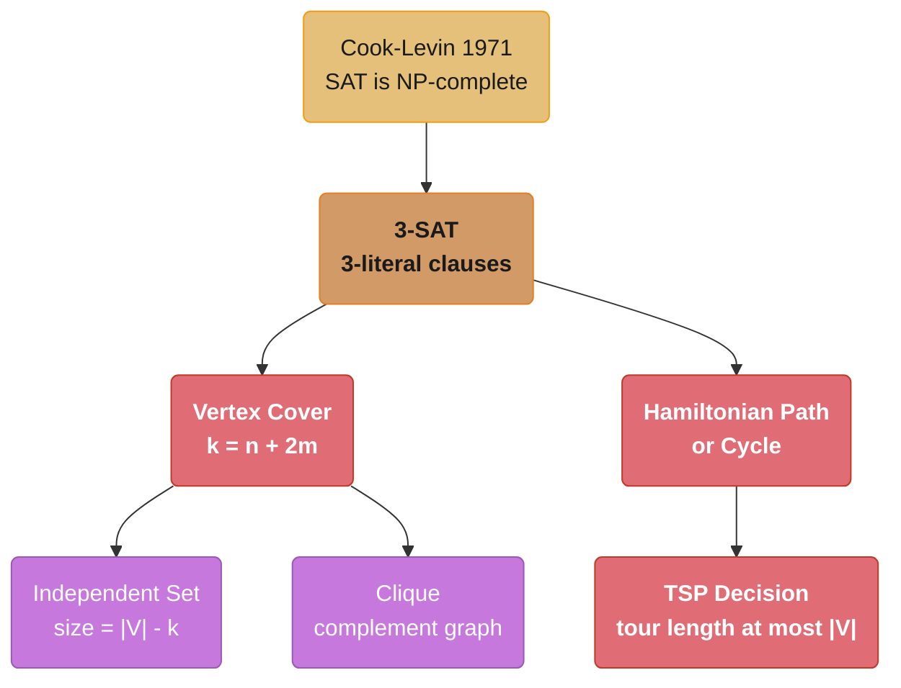
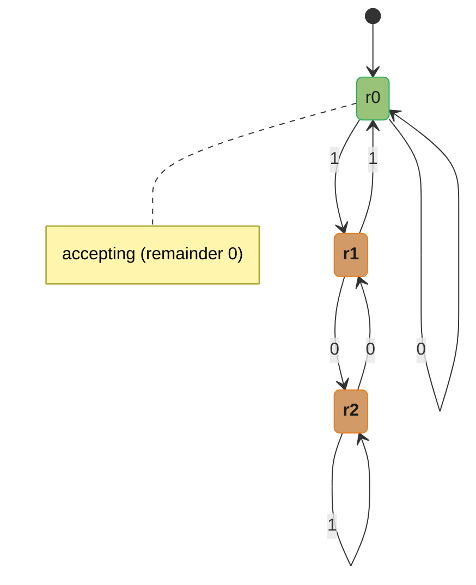
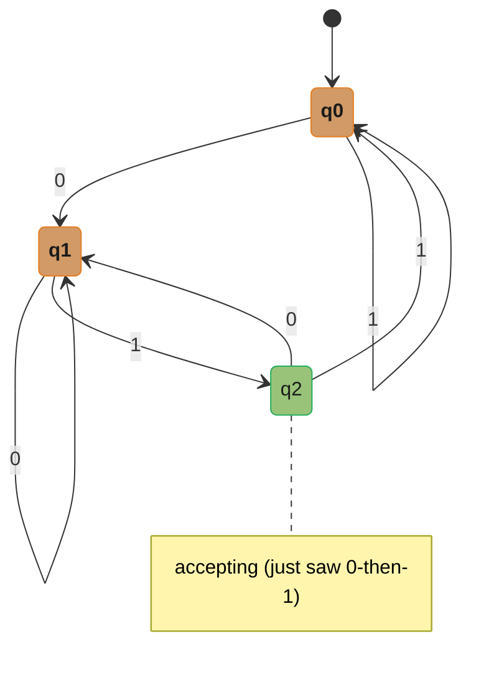
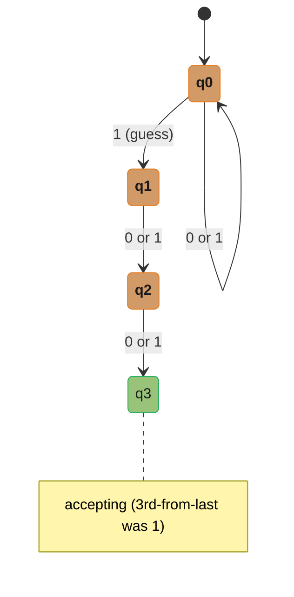
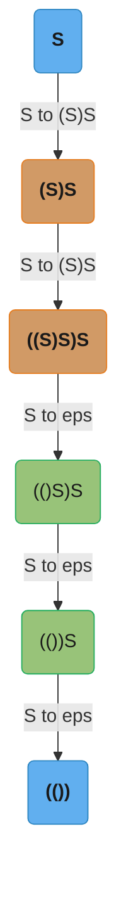
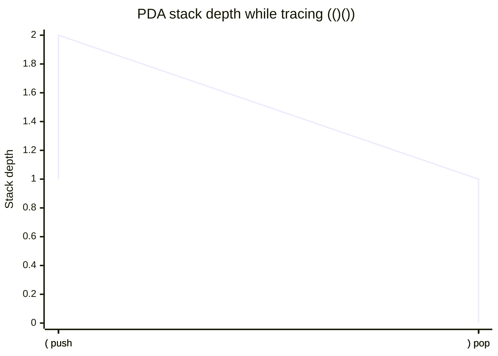
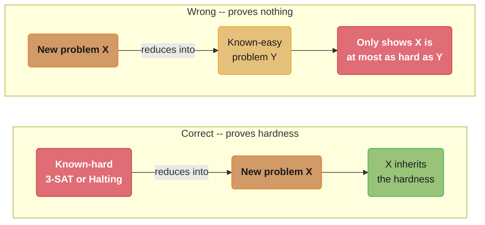
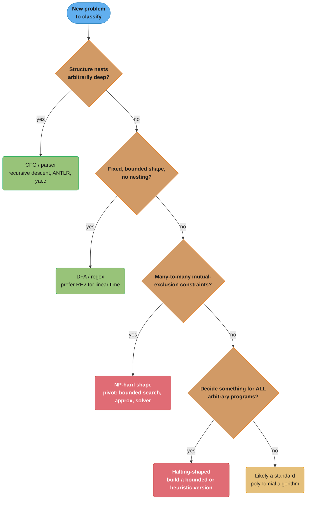

# Theory of Computation

---

## 1. Concept Overview

Theory of Computation (TOC) answers three questions that sit underneath every other module in this repository: **what can be computed at all** (computability), **with how much machinery** (the automata hierarchy — finite memory, a stack, an unbounded tape), and **what can be computed efficiently** (complexity — P vs NP). Every other CS Fundamentals module assumes an algorithm exists and asks how fast it runs; this module is where you learn that some problems have no algorithm at all, and others almost certainly have no *efficient* one.

The practical payoff is recognition, not derivation. You will not re-derive the Cook-Levin theorem in an interview. You will recognize that a regex engine is a compiled DFA, that a JSON parser is a pushdown automaton in disguise, that a "detect any infinite loop" static analyzer is asking you to solve the halting problem, and that a scheduling-with-conflicts question is graph coloring wearing a business-logic costume. This module assumes the asymptotic-notation vocabulary from [Complexity Analysis & Big-O](../complexity_analysis_and_big_o/README.md) — "polynomial vs exponential" is the same distinction that separates P from everything harder.

---

## 2. Intuition

> **One-line analogy**: automata theory is a ladder of toy machines, each rung granting a little more memory — none, then a stack, then an unbounded tape — and climbing the ladder is how you discover exactly how much memory a problem needs before it can be solved at all.

**Mental model**: every language (every yes/no question about strings) can be classified by the *minimum machine* that recognizes it. A finite automaton (no memory beyond "which state am I in") recognizes fixed-shape patterns like phone numbers or "ends in 01". A pushdown automaton (one stack) recognizes anything with unbounded *nested* structure, like balanced brackets or arithmetic expressions. A Turing machine (an unbounded read/write tape) recognizes anything any real computer can compute — and, remarkably, even a Turing machine cannot decide certain questions about *itself*, no matter how much time you give it.

**Why it matters**: a lexer that tries to validate nested brackets with a regular expression will fail on inputs the author never tested, not because the regex was written badly but because the task is provably impossible for that machine class. A candidate who spends 30 minutes hunting for a polynomial algorithm to a disguised NP-complete problem has failed the interview's real test — recognizing the shape and pivoting to a practical fallback (bounded search, approximation, a real solver) is the senior-engineer move.

**Key insight**: computational power is a question of *memory shape*, not speed, and it is a completely different axis from *efficiency*. A problem can be perfectly decidable (a Turing machine will always give you the right answer eventually) yet still be practically infeasible (NP-hard, exponential in the worst case) — and a problem can be efficiently *checkable* (NP) while nobody knows whether it is efficiently *solvable* (P). Interviews routinely test both axes, and conflating them is the single most common theory mistake senior candidates make.

---

## 3. Core Principles

- **Alphabet, string, language**: an alphabet Σ is a finite set of symbols (e.g. `{0,1}`); a string is a finite sequence of symbols; a **language** is a *set* of strings, possibly infinite (e.g. "all binary strings divisible by 3").
- **DFA — 5-tuple (Q, Σ, δ, q0, F)**: Q = finite states, Σ = alphabet, δ: Q×Σ→Q a **total** transition function (exactly one next state per state/symbol pair), q0 = start state, F = accept states. `L(M)` is every string that drives q0 to some state in F.
- **NFA acceptance is existential**: δ: Q×(Σ∪{ε})→P(Q) may offer zero, one, or many next states (including silent ε-moves); an NFA accepts a string if **at least one** computation path ends in F — not all paths need to.
- **Determinism vs nondeterminism is a recurring, non-uniform axis**: sometimes determinism is "free" (NFA and DFA recognize the exact same language class; nondeterministic and deterministic Turing machines do too, modulo a time cost) and sometimes it is **not** free (a deterministic PDA is strictly weaker than a nondeterministic one). Never assume the pattern generalizes without checking which machine class you are in.
- **Decidable vs Turing-recognizable**: a language is **decidable** (recursive) if some TM always halts and correctly answers yes/no. It is **Turing-recognizable** (recursively enumerable, semi-decidable) if some TM halts and says "yes" on every yes-instance, but may run forever on a no-instance. A language is decidable if and only if both it and its complement are recognizable.
- **Reduction (informal)**: "A reduces to B" (written A ≤p B) means a fast algorithm for B would give you a fast algorithm for A. Reductions **transport** hardness or impossibility from a problem you already understand onto a problem you don't — the direction of transport is the single most-confused idea in this module (see §6.8).
- **P, NP, NP-hard, NP-complete**: P = solvable in polynomial time. NP = a proposed YES-answer is *verifiable* in polynomial time. NP-hard = at least as hard as every problem in NP (via polynomial-time reduction) — an NP-hard problem need not even be decidable. NP-complete = NP-hard **and** inside NP, i.e. the hardest problems that are still efficiently checkable.

---

## 4. Types / Formal Models of Computation

| Model | Extra memory | Recognizes | Determinism costs power? |
|---|---|---|---|
| DFA | none (finite control only) | Regular languages | n/a — the canonical deterministic form |
| NFA / ε-NFA | none, but nondeterministic control | Regular languages (same class as DFA) | No — Kleene's theorem: NFA = DFA in power |
| Regular expression | none | Regular languages (same class again) | No — equivalent by construction (§6.3) |
| Context-free grammar (CFG) | unbounded, but LIFO-shaped | Context-free languages | n/a — grammars are not "deterministic/nondeterministic" |
| Pushdown automaton (PDA) | one stack, nondeterministic | Context-free languages | — (this is the more powerful variant) |
| Deterministic PDA (DPDA) | one stack, deterministic | **Strict subset** of context-free (deterministic CFLs) | **Yes** — DPDA is strictly weaker than PDA |
| Linear-bounded automaton (LBA) | tape bounded by input length | Context-sensitive languages | Open problem ("the LBA problem": is DLBA = LBA?) |
| Turing machine (TM) | unbounded tape | Turing-recognizable languages (decidable languages are the well-behaved subset) | No — an NTM's language power equals a DTM's (possibly exponential slowdown) |
| Universal Turing machine | unbounded tape | Simulates any other TM given its description | The theoretical basis for stored-program computers |

**One witness language per rung** — the fastest way to sanity-check where an unfamiliar language sits in the Chomsky hierarchy is to know one example that lives on each rung and nowhere lower:

| Chomsky type | Machine | Witness language | Why it fails one level down |
|---|---|---|---|
| Type 3 — Regular | DFA / NFA | `(ab)*`, "ends in 01" | n/a — floor of the hierarchy |
| Type 2 — Context-free | PDA | `{aⁿbⁿ : n ≥ 0}` | Not regular — pumping lemma (§6.4) |
| Type 1 — Context-sensitive | Linear-bounded automaton | `{aⁿbⁿcⁿ : n ≥ 0}` | Not context-free — CFL pumping lemma |
| Type 0 — Recursively enumerable | Turing machine | Any decidable language | Decidable ⊊ recognizable in general |
| (recognizable only) | TM that may loop forever | The Halting Problem | Not decidable — no TM always halts correctly |
| (not even recognizable) | none | Complement of the Halting Problem | If it were recognizable, Halting would be decidable |

---

## 5. Architecture Diagrams

### The Chomsky Hierarchy as Nested Power



Each bar's length is the *relative size* of that language class — every regular language is context-free, every context-free language is context-sensitive, every context-sensitive language is decidable, and every decidable language is recursively enumerable. The containments are all strict: the witness-language table above gives one string set that lives on each rung and no lower one.

### The P / NP / NP-hard Landscape





NP-hard is drawn as the outermost band because it is **not** a subset of NP in general — the Halting Problem is NP-hard (any 3-SAT instance reduces to it: build a program that brute-forces all assignments and halts iff one satisfies the formula) yet it is not even decidable, let alone verifiable in polynomial time. NP-complete is the thin band where NP-hard and NP overlap: SAT, 3-SAT, Vertex Cover, Hamiltonian Path, and TSP-decision all live there. The reduction tree below the bars shows the standard chain every textbook proof follows — everything traces back to Cook-Levin, because that is the one proof that had to start from nothing.

---

## 6. How It Works — Detailed Mechanics

### 6.1 Building a DFA From Scratch

**Example A — binary numbers divisible by 3.** Track the running remainder mod 3 as you read bits left to right (most-significant bit first): reading bit `b` from remainder `r` gives new remainder `(2r + b) mod 3`, because appending a bit doubles the value and adds the bit.


*r0 is both the start state and the only accepting state, since a remainder of 0 means the number read so far is divisible by 3.*

Three states are necessary and sufficient — one per residue class mod 3. This is the same trick behind streaming checksum and CRC computation: a DFA can do bounded modular arithmetic on an input of unbounded length using *constant* memory, because the only fact that matters about the past is the current remainder.

#### Decoding `(2r + b) mod 3`

**The idea behind it.** "Appending one bit to a binary number doubles it and then adds the bit — so if you only ever need the remainder, you only ever need to keep the remainder, and the whole unbounded number can be thrown away as you read it."

That last clause is the entire reason a *finite* machine can process an *infinite* set of inputs. The state is not a compressed copy of the number; it is the only fact about the number that the question depends on.

| Symbol | What it actually is |
|--------|---------------------|
| `r` | The DFA's state. One of exactly three values: 0, 1, 2 |
| `b` | The next input symbol, read as the integer 0 or 1 |
| `2r` | Appending a bit shifts the number left one place, i.e. multiplies by 2 |
| `+ b` | The new low bit lands in the ones place |
| `mod 3` | Wrap back into `{0, 1, 2}` so the state set stays finite |
| accepting state | Remainder 0 means "divisible by 3, accept if the input ends here" |

**Walk one example with real numbers.** Feed `101101` (decimal 45, and 45 = 3 × 15) through the rule one bit at a time:

```
  bit read   arithmetic                new r   value so far   check
  --------   -----------------------   -----   ------------   -----------------
     1       (2*0 + 1) mod 3 = 1         1            1        1  mod 3 = 1  ok
     0       (2*1 + 0) mod 3 = 2         2           10 = 2    2  mod 3 = 2  ok
     1       (2*2 + 1) mod 3 = 2         2          101 = 5    5  mod 3 = 2  ok
     1       (2*2 + 1) mod 3 = 2         2         1011 = 11  11  mod 3 = 2  ok
     0       (2*2 + 0) mod 3 = 1         1        10110 = 22  22  mod 3 = 1  ok
     1       (2*1 + 1) mod 3 = 0         0       101101 = 45  45  mod 3 = 0  ok

  ends in r0 -> ACCEPT.  The machine never stored 45, only the running remainder.
```

**Why the memory stays constant no matter how long the input gets.** A 10-bit input and a 10-million-bit input both run in the same three states, using the same two integers of storage. The machine has no counter that can overflow because it has no counter at all — every fact about the prefix collapses into one of three buckets. That is precisely the boundary that §6.4 formalizes: a language is regular exactly when "everything the past matters for" fits in a *fixed* number of buckets, and `{aⁿbⁿ}` fails because tracking n needs an unbounded number of them.

**Example B — strings ending in "01".** Track only "what would let me accept if the string ended right now": no useful progress (`q0`), just saw a 0 (`q1`), or just saw 0-then-1 (`q2`, accepting).


*Trace on `1101`: q0 -(1)-> q0 -(1)-> q0 -(0)-> q1 -(1)-> q2 -- accept.*

Both examples need exactly 3 states. That is not a coincidence of these two problems — it reflects how much "memory of the past" the language actually requires, which is precisely what subset construction measures in general (§6.2).

### 6.2 Subset Construction — NFA to DFA

Subset construction builds one DFA state per **reachable set of NFA states**: starting from the NFA's start state, for every DFA state (a *set* S of NFA states) and every input symbol, the next DFA state is the union of wherever each member of S can go on that symbol. A DFA state is accepting if its set contains any NFA accept state.

```python
from __future__ import annotations

State = str
NFA = dict[tuple[State, str], set[State]]   # (state, symbol) -> set of next states


def subset_construction(nfa: NFA, start: State, accept: set[State], alphabet: str):
    """Classic NFA -> DFA conversion. Worst case: 2^|NFA states| reachable subsets."""
    start_set = frozenset({start})
    dfa: dict[frozenset, dict[str, frozenset]] = {}
    dfa_accept: set[frozenset] = set()
    frontier = [start_set]
    seen = {start_set}

    while frontier:
        current = frontier.pop()
        dfa[current] = {}
        if current & accept:
            dfa_accept.add(current)
        for symbol in alphabet:
            nxt = frozenset().union(*(nfa.get((s, symbol), set()) for s in current))
            dfa[current][symbol] = nxt
            if nxt not in seen:
                seen.add(nxt)
                frontier.append(nxt)

    return dfa, start_set, dfa_accept
```

**Worked example — "is the 3rd-from-last symbol a 1?"** This NFA needs only 4 states: stay in `q0` freely, but on a `1` also *guess* that this is the target symbol and branch to `q1`; two more symbols must follow to confirm the guess (`q1 -> q2 -> q3`, accepting).


*The two edges out of q0 on `1` are the nondeterministic branch: stay in q0, or guess this is the 3rd-from-last symbol and advance toward q3.*

Running `subset_construction` on this NFA and checking every string up to length 7 against the direct definition (`len(s) >= 3 and s[-3] == "1"`) confirms it exactly:

```python
nfa: NFA = {
    ("q0", "0"): {"q0"},
    ("q0", "1"): {"q0", "q1"},
    ("q1", "0"): {"q2"}, ("q1", "1"): {"q2"},
    ("q2", "0"): {"q3"}, ("q2", "1"): {"q3"},
}
dfa, start, accepting = subset_construction(nfa, "q0", {"q3"}, "01")
len(dfa)         # 8   -- exactly 2^3, matching the worst-case bound
len(accepting)   # 4   -- half the subsets contain q3
```

```
  DFA state (= NFA subset)     on 0    on 1    accept?
  --------------------------------------------------------
  A = {q0}                      A       B       no
  B = {q0,q1}                   C       D       no
  C = {q0,q2}                   E       F       no
  D = {q0,q1,q2}                 G       H       no
  E = {q0,q3}                    A       B       yes
  F = {q0,q1,q3}                  C       D       yes
  G = {q0,q2,q3}                  E       F       yes
  H = {q0,q1,q2,q3}                G       H       yes
```

A 4-state NFA became an **8 = 2³**-state DFA. In general, the "nth-from-last symbol is 1" language needs an (n+1)-state NFA but a minimal 2ⁿ-state DFA — this exact family is the standard proof that subset construction's exponential worst case is tight, not just a loose upper bound.

#### Decoding the 2ⁿ Blowup

**Stated plainly.** "A DFA state has to record *which* NFA states you might currently be sitting in — and the number of possible answers to 'which subset of n things' is 2ⁿ, so the state count is a power set, not a multiple."

The exponent is not pessimism about the algorithm. It is a direct count of the subsets, and the "nth-from-last symbol" family actually reaches it, so no cleverer conversion can avoid it in general.

| Symbol | What it actually is |
|--------|---------------------|
| `n` | How many states the nondeterministic machine has |
| subset `S` | Everywhere the NFA could simultaneously be after reading the input so far |
| `2ⁿ` | The size of the power set — each NFA state is independently in S or not |
| `frozenset` (in the code) | The immutable subset used as a dictionary key. One key = one DFA state |
| reachable subsets | Usually far fewer than 2ⁿ; the worst case is when all of them occur |
| accepting DFA state | `current & accept` is non-empty — the NFA *could* be accepting right now |

**Walk one example with real numbers.** The "nth-from-last symbol is 1" family, which hits the bound exactly:

```
  n      NFA states (n+1)      DFA states (2^n)      blowup factor
  ----   ------------------    ------------------    -------------------
   3            4                        8              2.0x
   4            5                       16              3.2x
  10           11                    1,024             93x
  20           21                1,048,576             49,932x
  30           31            1,073,741,824             34,636,833x

  n = 30: an NFA you could draw on one page becomes a DFA with 1.07 BILLION
  states. At a conservative 16 bytes per state that is ~17 GB of transition
  table -- the machine does not fit in memory, though the NFA fits in a tweet.
```

**Why this is the whole regex-engine tradeoff, not a footnote.** Building the DFA up front buys guaranteed linear-time matching — one table lookup per input character, no backtracking possible — but only if the table can be built at all, and the row above shows patterns where it cannot. The two production answers are exactly the two branches of this table: simulate the NFA directly and accept possibly-exponential *time* (backtracking engines like PCRE and `java.util.regex`, hence the ReDoS incident in §10, Pitfall 3), or build DFA states **lazily and cached** as input demands them, which is what RE2 does — you pay only for subsets actually reached, keeping the common case linear while never materializing the full 2ⁿ table.

### 6.3 Regex, NFA, and DFA Are Exactly Equivalent — Kleene's Theorem

Kleene's theorem says regular expressions, NFAs, and DFAs all describe precisely the same class of languages, and each direction is a constructive algorithm, not just an existence proof:

| Conversion | Algorithm | Cost |
|---|---|---|
| Regex → NFA | Thompson's construction | Linear in pattern size |
| NFA → DFA | Subset construction (§6.2) | Up to 2ⁿ states (worst case) |
| DFA → Regex | State elimination | Can blow up regex length exponentially |

This equivalence is *why* two regex engines can implement the same pattern language with wildly different performance profiles: a backtracking engine directly simulates the NFA (flexible enough to bolt on backreferences, but can explore exponentially many paths), while a compiled engine builds the DFA up front and simulates it in guaranteed linear time (no backtracking possible, but no backreferences either). See §7 and §10 for what this means in production.

### 6.4 The Pumping Lemma — Proving a Language Is Not Regular

**Statement**: for any regular language L, there is a pumping length p such that every string w ∈ L with |w| ≥ p can be split w = xyz where |xy| ≤ p, |y| ≥ 1, and xyⁱz ∈ L for **every** i ≥ 0.

**Why it's true**: a DFA for L has some fixed number of states, say p. Any string of length ≥ p forces the DFA to revisit some state within its first p symbols (pigeonhole principle) — the loop between the two visits is `y`, and looping it 0, 2, 3, ... times keeps landing back on the same state, so the string is still accepted.

**The adversary game**: to prove L is *not* regular, assume it is, let p be the (unknown) pumping length, and pick one string in L of length ≥ p that you control. The lemma guarantees *some* split works if L is regular — your job is to show that **every possible split** xyz (there are only a bounded number, since |xy| ≤ p) fails to keep xyⁱz in L for some i. That contradiction proves L is not regular.

**Worked proof — `{aⁿbⁿ : n ≥ 0}` is not regular**: pick `w = aᵖbᵖ` (length 2p ≥ p, and it's in the language). Since |xy| ≤ p, xy sits entirely within the leading block of a's, so y = `a^k` for some k ≥ 1. Pumping down to i = 0 gives `a^(p-k) bᵖ`, which has fewer a's than b's — not in the language. Contradiction, so `{aⁿbⁿ}` is not regular.

#### Decoding the Pumping Lemma, Quantifier by Quantifier

**What the formula is telling you.** "If a language is regular, then every long enough string in it contains a chunk near the front that you can repeat any number of times — or delete entirely — and always land back inside the language. So if you can exhibit one long string where *no* chunk survives that treatment, the language was never regular."

The statement reads as quantifier soup because four quantifiers alternate: *there exists* p, *for all* long w, *there exists* a split, *for all* i. Who gets to choose what — and in what order — is the entire skill.

| Symbol | What it actually is |
|--------|---------------------|
| `L` | The set of strings you are testing. Here, all `a`s followed by equally many `b`s |
| `p` | Secretly the DFA's state count. **The adversary picks it, and you never learn its value** |
| `w` | A string in L with `\|w\| ≥ p`. **You** pick it — this is your one lever, so pick well |
| `w = xyz` | The adversary picks the split. You must beat *every* legal one |
| `\|xy\| ≤ p` | The constraint that pins `y` inside your string's opening block |
| `\|y\| ≥ 1` | Rules out the cheat of pumping nothing |
| `xyⁱz` | The pumped string. `i = 0` deletes y; `i = 2` doubles it |
| "for every i ≥ 0" | You only need **one** value of i to fail. `i = 0` is almost always easiest |
| `∈ L` | Passes the membership rule. Your goal is to show the pumped string does not |

**Who chooses what, in order.** The alternation is a two-player game, and the moves strictly alternate:

```
  move 1  ADVERSARY   picks p, and does not tell you the value
  move 2  YOU         pick w in L with |w| >= p          <- your only real decision
  move 3  ADVERSARY   picks any split xyz obeying |xy| <= p and |y| >= 1
  move 4  YOU         pick any i >= 0 and show x y^i z is NOT in L

  you win  =  you have an answer for EVERY move-3 split
  the point of a good move 2 is to leave the adversary no good splits at all
```

**Walk one example with real numbers.** `L = {aⁿbⁿ}`. Suppose the adversary's hidden p happens to be 4 — the argument must not depend on that, but fixing it makes every split enumerable. You pick `w = a⁴b⁴ = "aaaabbbb"`, length 8 ≥ 4, and in L. Because `|xy| ≤ 4`, the split cannot reach past the fourth character, so `y` is pure `a`s. There are exactly 10 legal splits, and `i = 0` kills all 10:

```
  w = a a a a b b b b        p = 4, so x and y live entirely inside the first 4 chars

    x        y        x y^0 z (delete y)   a's   b's   in L?
  -------  -------   ------------------   ----  ----  ------
  ""       "a"       aaabbbb                3     4    no
  ""       "aa"      aabbbb                 2     4    no
  ""       "aaa"     abbbb                  1     4    no
  ""       "aaaa"    bbbb                   0     4    no
  "a"      "a"       aaabbbb                3     4    no
  "a"      "aa"      aabbbb                 2     4    no
  "a"      "aaa"     abbbb                  1     4    no
  "aa"     "a"       aaabbbb                3     4    no
  "aa"     "aa"      aabbbb                 2     4    no
  "aaa"    "a"       aaabbbb                3     4    no

  10 of 10 splits fail.  Every deletion removes only a's, so a's drop to 4-k
  while b's stay pinned at 4 -- and 4-k can never equal 4 because k >= 1.
```

The argument never used `p = 4` except to make the list finite. For any p, `y = a^k` with `k ≥ 1`, deleting it yields `a^(p−k) b^p` with strictly fewer a's than b's. The lemma promised *some* split would survive if L were regular; none does; therefore L is not regular.

**Why `|xy| ≤ p` is the clause that does all the work, and `i = 0` the move that ends it.** Without `|xy| ≤ p`, the adversary could set `y = "ab"` straddling the boundary — pumping that preserves the count balance, and the proof collapses. The clause forces `y` into the opening block, which is exactly why you choose a `w` whose first p characters are all one symbol: it strips the adversary of every interesting split before the game starts. Choose `w = (ab)^p` instead and you hand back the straddling split and lose. Then `i = 0` finishes it, because deletion changes the counts in one direction only, needing no case analysis about whether repeating could somehow re-balance. A "proof" that tests a single convenient split rather than all of them proves nothing — that omission, not the algebra, is where these arguments actually fail.

**Corollary — balanced parentheses are not regular either**: the identical argument applies to `w = "("^p ")"^p`. Any split's `y` is pure `"("`, so pumping down strictly reduces the open-paren count while leaving the close-paren count fixed — the pumped string is unbalanced. **No regular expression can match arbitrarily nested balanced parentheses**, because doing so requires counting unbounded depth, and the pumping lemma proves regular languages cannot count past a fixed bound. See §10 Pitfall 1 for the broken-regex / working-parser code that follows directly from this proof.

### 6.5 Context-Free Grammars and Pushdown Automata

A context-free grammar for balanced parentheses needs one rule: `S -> ( S ) S | ε`. Unlike a regular grammar (restricted to `A -> aB` or `A -> a`), a CFG's right-hand side can contain an unbounded, self-referential mix of terminals and nonterminals — that recursive self-reference is exactly the "memory" a regex lacks.


*Each arrow applies one grammar rule to the leftmost remaining S, until only terminal parentheses are left.*

A **pushdown automaton** recognizes the same language operationally: push a marker on `(`, pop on `)`, reject immediately if a pop finds an empty stack, and accept if the stack is exactly empty when input ends (PDAs may accept by final state or by empty stack — the two definitions are provably equivalent). Tracing `"(()())"`:



The stack never goes negative and ends at depth 0 exactly when input is exhausted — accept. This single counter is all the "memory" a DFA is missing; a DFA cannot track it because the counter is unbounded, while a DFA's state set must be fixed and finite. (One subtlety worth flagging: CFGs can be **ambiguous** — more than one derivation tree for the same string, e.g. a naive `E -> E + E | E * E | id` grammar for arithmetic — which real parsers resolve with precedence/associativity rules layered on top of the grammar.)

### 6.6 Turing Machines and the Church-Turing Thesis

A Turing machine is the 7-tuple (Q, Σ, Γ, δ, q0, q_accept, q_reject): finite states, an input alphabet, a (larger) tape alphabet including a blank symbol, and a transition function δ: Q×Γ → Q×Γ×{L,R} that reads a tape cell, writes a new symbol, moves the head, and changes state — repeated for as long as needed, with no bound on tape length or run time.

```
  tape:   ...  _  1  0 [1] 1  _  _  ...      (head is on the bracketed cell)
  state:  q_scan_right   (looking rightward for the next 0)
```

That unbounded tape is what buys a TM the ability to recognize languages no PDA can, such as `{aⁿbⁿcⁿ : n ≥ 0}`: repeatedly cross off one leading `a`, the next `b`, and the next `c` in a single left-to-right pass, then rewind and repeat; accept only if every pass finds all three symbols and the tape empties out evenly. A single stack cannot do this because it would need to compare *two* independent counts (b's against a's, then c's against b's) but a stack only remembers one LIFO history.

**Church-Turing thesis**: any function computable by an intuitive, step-by-step mechanical procedure is computable by a Turing machine. It **cannot be formally proven**, because "intuitively computable" is not itself a formal mathematical object — but it is strongly supported by the fact that every alternative model ever proposed (Church's lambda calculus, Gödel/Kleene's general recursive functions, Post machines, register machines, and every real programming language) has been proven **exactly equivalent** in power to the Turing machine. In interviews and algorithms courses, treat it as the working definition of "computable": if a Turing machine cannot do it, no real computer can either.

### 6.7 Decidability and the Halting Problem

**The claim**: no algorithm can decide, for an arbitrary program P and input x, whether P halts on x. This is not "we haven't found the algorithm yet" — it is proven impossible for any algorithm that could ever be written.

**Diagonalization proof sketch**: suppose a halting decider `H(P, x)` exists (always halts, correctly returns true/false). Build:

```python
def D(P):
    if H(P, P):      # does P halt when given its own source as input?
        loop_forever()
    else:
        return "halts"
```

Now ask whether `D(D)` halts. If `H(D, D)` says "yes, halts", then `D` runs `loop_forever()` — contradiction. If `H(D, D)` says "no, loops", then `D` returns immediately — also a contradiction. Either answer from H is wrong, so no such H can exist.

**Why this is diagonalization** — imagine listing every program P1, P2, P3, ... and recording, for each pair, whether Pi halts on input Pj:

```
                     input=P1   input=P2   input=P3   input=P4   ...
  P1 halts?             Y          N          Y          N       ...
  P2 halts?             N          Y          Y          N       ...
  P3 halts?             Y          Y          N          Y       ...
  P4 halts?             N          N          Y          Y       ...

  D(Pi) := the OPPOSITE of Pi's answer on itself (flip every diagonal cell)
  D disagrees with P1 on input P1, with P2 on input P2, with P3 on input P3, ...
  so D's row matches NO row in the table -- yet D is a legitimate program, so it
  MUST appear somewhere in the enumeration.  Contradiction => no such table exists.
```

This is the same self-reference trick Cantor used to prove the reals are uncountable. Note the asymmetry: the halting problem is **Turing-recognizable** (a simulator that runs P on x and says "halts" the moment it observes a halt is a valid semi-decider — it just never says "no"), but not decidable, because there is no way to distinguish "still running" from "will run forever" without an oracle.

#### Decoding Decidability — Stated Without a Single Symbol

**What this actually says.** "Decidable means a program exists that always finishes and always gives the right yes-or-no answer. Recognizable means a program exists that says yes correctly when the answer is yes, but is allowed to run forever instead of saying no. Undecidable means no program of the first kind can exist — ever, on any hardware, with any budget."

The three words are routinely used as synonyms in engineering conversation and they are not. Almost every confusion about the halting problem comes from collapsing "recognizable" into "decidable."

| Term | The behavior that defines it |
|------|------------------------------|
| Decidable | Runs on any input, always stops, answer always correct |
| Recognizable (semi-decidable) | On a yes-instance it stops and says yes. On a no-instance it may run forever |
| Not even recognizable | No program confirms yes-instances in finite time |
| Undecidable | Not a gap in current knowledge. Proven impossible, permanently |
| The halting question | Recognizable, but undecidable |
| The complement | Not even recognizable — you can never observe "it never stopped" |

**Walk one example with real numbers — where "recognizable" runs out.** Suppose you build the obvious checker: simulate the program and report the moment it stops.

```
  simulate P on x, reporting after a budget of steps

  P stops after         50 steps    -> simulator says "HALTS" at step 50        correct
  P stops after  1,000,000 steps    -> simulator says "HALTS" at step 1,000,000 correct
  P never stops                     -> simulator is still running at step
                                       1,000,000 ... 10^12 ... 10^100 ...
                                       and has learned NOTHING new at any point

  the simulator at step 10^100 cannot tell these two cases apart:
      (a) P halts at step 10^100 + 1     -> answer should be YES
      (b) P never halts                  -> answer should be NO
  no amount of extra waiting separates them, so the simulator can never say "NO"
```

Adding a timeout does not fix this — it changes the question. "Does P halt within 10 million steps?" is perfectly decidable (run it 10 million steps and look), but it is a *different* question from "does P halt", and a program that answers the first while claiming to answer the second is simply wrong on every input that needed 10 million and one steps.

**Why this lands on real tools rather than staying in the textbook.** Any request of the form "flag every program in this repo that has an infinite loop", "prove this build script always terminates", or "detect all malware by deciding whether it ever executes the payload" is the halting problem in a costume, and the correct engineering response is not a better algorithm — it is to change the question. The three standard changes are: bound it (model checkers explore up to N steps — see TLA+ in §11), accept one-sided error (static analyzers report *possible* infinite loops and tolerate false positives), or restrict the language until termination becomes provable (total-functional languages, Rust's borrow checker on a restricted grammar, SQL without recursive CTEs). Rice's theorem sharpens the warning: **every** non-trivial semantic property of a program's behavior — not just halting — is undecidable, so "does this code ever leak a secret" is in the same boat as "does this code ever stop."

### 6.8 Reductions — and Which Direction They Go

A **reduction** A ≤p B means: given a polynomial-time algorithm for B, you can build a polynomial-time algorithm for A by transforming any A-instance into a B-instance, solving it with B's algorithm, and translating the answer back. The single most common student error is running this backwards.

**To prove X is undecidable**: reduce a *known* undecidable problem (the Halting Problem) **into** X — show that if X were decidable, the Halting Problem would be too. You build a hypothetical decider for X and use it to construct a decider for Halting, which cannot exist.

**To prove X is NP-hard**: reduce a *known* NP-complete problem (3-SAT) **into** X in polynomial time — show that if X had a polynomial algorithm, 3-SAT would too. Reducing X *to* an easy problem proves nothing about X's hardness — it can only show X is *at most* as hard as that easy problem, which is the opposite conclusion.

**The one-sentence check**: before writing a reduction, ask "if I could solve X quickly, could I use that to solve 3-SAT (or Halting) quickly?" If yes, the direction is correct.


*The arrow direction is everything: reducing a known-hard problem into the new one transports hardness onto it, while reducing the new problem into something easy only bounds it from above.*

### 6.9 P vs NP and NP-Completeness

**Cook-Levin theorem (1971)**: Boolean satisfiability (SAT) is NP-complete — it was the *first* problem ever proven NP-complete, and every other NP-completeness proof reduces from SAT (or 3-SAT) rather than starting over. The proof encodes an arbitrary NP verifier's entire computation — its tape contents, head position, and state at every one of a polynomial number of time steps — as one giant Boolean formula that is satisfiable exactly when some certificate makes the verifier accept. Because the encoding works for *any* poly-time verifier, SAT can simulate every problem in NP.

**3-SAT → Vertex Cover, concretely**: given a 3-SAT formula with n variables and m clauses, build a graph with (a) one edge per variable connecting a `xᵢ` vertex to a `¬xᵢ` vertex (covering that edge forces the cover to include at least one of the two — the "choose true or false" gadget), and (b) one triangle per clause (any vertex cover of a triangle needs at least 2 of its 3 vertices), with cross-edges wiring each triangle vertex to the matching literal vertex in its variable gadget. The formula is satisfiable **iff** this graph has a vertex cover of size exactly `n + 2m`.

#### Decoding the Vertex Cover Budget `n + 2m`

**The idea behind it.** "The cover size is not a magic constant — it is the exact minimum forced by the gadgets: one vertex per variable because each variable edge needs one end, plus two per clause because every triangle needs two of its three corners. Hit that budget exactly and there is no slack left to cheat with."

The whole reduction hinges on that lack of slack. If the budget were even one larger, a cover could exist without corresponding to a satisfying assignment, and the "iff" would break.

| Symbol | What it actually is |
|--------|---------------------|
| `n` | How many `xᵢ` the formula has. One two-vertex gadget each |
| `m` | How many 3-literal clauses. One triangle each |
| variable gadget | Covering it forces choosing exactly one — that choice **is** the truth assignment |
| clause triangle | Any cover needs 2 of 3; the one left out must be covered from elsewhere |
| cross-edge | Forces the uncovered corner's literal to be the one you set true |
| `n + 2m` | The budget: 1 per variable edge + 2 per triangle. Exactly the forced minimum |
| "iff" | Both directions proven — satisfiable → cover exists, and cover exists → satisfiable |

**Walk one example with real numbers.** Take `(x1 ∨ ¬x2 ∨ x3) ∧ (¬x1 ∨ x2 ∨ x3)`, so `n = 3`, `m = 2`:

```
  graph size
    variable vertices  = 2n      = 2 * 3 = 6      (x1, ~x1, x2, ~x2, x3, ~x3)
    clause vertices    = 3m      = 3 * 2 = 6      (three corners per triangle)
    total vertices               = 12
    edges = n (variable) + 3m (triangle sides) + 3m (cross) = 3 + 6 + 6 = 15

  budget
    k = n + 2m = 3 + (2 * 2) = 7

  a satisfying assignment: x1 = T, x2 = T, x3 = T
    from each variable gadget, take the TRUE literal vertex   -> x1, x2, x3    = 3
    clause 1 (x1, ~x2, x3): x1 is true, so LEAVE OUT the x1 corner, take 2     = 2
    clause 2 (~x1, x2, x3): x2 is true, so LEAVE OUT the x2 corner, take 2     = 2
                                                                        total = 7  ok

  the left-out corners are safe: the x1 corner's cross-edge runs to vertex x1,
  which is already in the cover -- and it is in the cover precisely BECAUSE
  x1 was assigned true.  That is the link the whole reduction is built on.
```

**Why an exact budget rather than an upper bound.** Ask for a cover of size at most 8 and the correspondence dies: a cover could take both ends of a variable edge — meaning "x1 is true AND false" — and still fit. The budget of exactly `n + 2m` leaves zero spare vertices, so every legal cover is forced to spend one per variable edge and two per triangle, which is exactly the structure of a truth assignment satisfying every clause. The same tightness argument reappears one paragraph down in the TSP reduction: weight-1 edges for real edges and weight-2 otherwise, with a threshold of exactly `|V|` — any tour touching even one weight-2 edge costs at least `|V| + 1`, so fitting the budget forces the tour to be Hamiltonian in the original graph.

**Hamiltonian Path/Cycle and TSP-decision**: 3-SAT also reduces to Hamiltonian path via a separate gadget chain (per-variable "diamond" widgets traversable in two directions, wired through per-clause junctions — see Sipser's *Introduction to the Theory of Computation* for the full construction). Hamiltonian Cycle reduces cleanly to **TSP-decision**: given graph G, build a complete graph with edge weight 1 for original edges and 2 otherwise, and ask "is there a tour of total weight ≤ |V|?" Any tour using even one weight-2 edge costs at least |V|+1, so a tour of weight ≤ |V| must use only original edges — i.e. it is exactly a Hamiltonian cycle in G.

**Decision vs optimization**: TSP-decision ("is there a tour ≤ B?") is in NP because a proposed tour's length is checkable in polynomial time; the *optimization* version ("find the shortest tour") has no such bounded certificate to check against and is NP-hard without being classified inside NP in the same way — a subtlety worth stating explicitly in interviews.

---

## 7. Real-World Examples

**RE2 vs backtracking regex engines.** Google's RE2 (and its Java port `re2j`) compiles patterns into an automaton and simulates it directly, guaranteeing linear-time matching in the pattern's length — the price is dropping backreferences and lookaround, which require more than regular power to express. `java.util.regex`, PCRE, and Python's `re` instead simulate the NFA via backtracking, which supports those richer features but can take exponential time on adversarial input. See [Regex Engine and ReDoS](../../java/strings_and_text/regex_engine_and_redos.md) for the full backtracking-vs-DFA mechanics and [Strings and Text](../../java/strings_and_text/README.md) for the surrounding Java string internals.

**Parsers are pushdown automata with a tree bolted on.** ANTLR (LL(*)) and yacc/bison (LALR) both generate parsers that are operationally pushdown automata: an explicit or implicit stack tracks nested grammar rules while building an AST. This is precisely why "just use a regex" fails for JSON, XML, HTML, or any programming-language grammar — none of those languages are regular, and the moment you need to validate nesting, you need at least a CFG.

**Protocol state machines are literal DFAs.** TCP's connection lifecycle (`LISTEN → SYN_SENT → ESTABLISHED → FIN_WAIT → CLOSED`, etc.) and the TLS 1.3 handshake are both finite-state machines with a small, fixed number of states and well-defined transitions — exactly the DFA model, just drawn as a protocol diagram instead of a textbook exercise.

**Package manager dependency resolution is SAT in a trench coat.** Resolving "install package A, which needs B ≥ 2.0 and C < 3.0, which conflicts with D" is Boolean satisfiability over version constraints — NP-hard in general. OCaml's `opam` explicitly calls out to a SAT/ASP solver (`aspcud`/`mccs`); Dart's package manager popularized the PubGrub algorithm; pip's modern resolver does backtracking search for the same reason. These systems don't dodge NP-hardness — they exploit the fact that real dependency graphs are far more structured than worst-case instances.

**Register allocation is graph coloring.** A compiler assigns each live variable to one of a fixed number of physical registers such that no two variables live at the same time share a register — vertices are variables, edges connect variables with overlapping lifetimes, and colors are registers. GCC and LLVM both implement variants of Chaitin's graph-coloring allocator, using heuristics (not exact algorithms) precisely because register allocation with a fixed color count is NP-complete.

**Modern SAT solvers rout the "NP-complete means impossible" myth daily.** CDCL (Conflict-Driven Clause Learning) solvers — MiniSat, Glucose, CryptoMiniSat, Kissat — solve real hardware-verification and software-model-checking SAT instances with millions of variables and clauses, because industrial instances have exploitable structure that worst-case complexity theory says nothing about. Intel and AMD use SAT-based equivalence checking to verify chip designs against their specifications before tape-out.

---

## 8. Tradeoffs

### Automata Hierarchy: Power, Cost, and Decidable Questions About the Machines Themselves

| Model | Extra memory | Membership test | Equivalence decidable? | Emptiness decidable? |
|---|---|---|---|---|
| DFA | none | O(n) | Yes (minimize, then compare) | Yes |
| NFA | none (nondeterministic) | O(n × states) simulated, or convert first | Yes | Yes |
| DPDA | 1 stack, deterministic | O(n) | Yes (harder, but decidable) | Yes |
| PDA | 1 stack, nondeterministic | O(n³) typical (CYK-style) | **No** (undecidable) | Yes |
| LBA (context-sensitive) | tape bounded by input | PSPACE | **No** (undecidable) | **No** (undecidable) |
| Turing machine | unbounded tape | Undecidable in general | **No** (Rice's theorem) | **No** (undecidable) |

#### Decoding the Membership-Test Column: O vs. Θ vs. Ω

**Stated plainly.** "Big-O is a ceiling — the cost is *at most* this. Omega is a floor — *at least* this. Theta is both at once, which is the only one of the three that actually pins down how fast something is."

The table above uses `O` throughout, and that is a deliberate, weaker claim than most readers hear. `O(n³)` for PDA membership means the CYK algorithm never exceeds cubic; it does not claim cubic is required, and it does not forbid a faster algorithm on structured inputs.

| Symbol | What it actually is |
|--------|---------------------|
| `O(f)` | Upper bound. `f` is a ceiling the cost stays under, beyond some input size |
| `Ω(f)` | Lower bound. The cost never drops below `f`. Used for impossibility claims |
| `Θ(f)` | Both bounds at once: `O(f)` and `Ω(f)` together. The tight answer |
| `n` in this table | The string being tested for membership — not the machine's size |
| `states` in `O(n × states)` | A second, independent input. Fixed per machine, so often treated as a constant |
| "beyond some input size" | All three ignore constants and small n. `O(n)` may lose to `O(n²)` on n = 10 |

**Walk one example with real numbers.** The same claim stated three ways, on DFA membership testing a 1,000,000-character input:

```
  DFA membership: one table lookup per input character, always exactly n lookups

    O(n)      "at most linear"        TRUE   -- and also technically true: O(n^2), O(2^n)
    Omega(n)  "at least linear"       TRUE   -- you must read every character to decide
    Theta(n)  "exactly linear"        TRUE   -- both bounds meet; THIS is the real claim

  why the loose ones are still "true" statements
    n = 1,000,000    actual work    1,000,000 lookups
                     O(n) ceiling   1,000,000        tight
                     O(n^2) ceiling 1,000,000,000,000  true, and useless -- a million-fold
                                                       overstatement that no one can act on

  NFA membership, O(n * states), for a 20-state NFA
    n * states = 1,000,000 * 20 = 20,000,000 steps   -- linear in n, 20x the DFA constant
    the alternative (convert first) costs up to 2^20 = 1,048,576 DFA states to build,
    then 1,000,000 lookups: worth it only if the machine is reused across many inputs
```

**Why an interview answer of "O" where "Θ" was meant is a real error.** Saying "comparison sorting is `O(n log n)`" is a true but weak statement; the meaningful claim is that comparison sorting is `Ω(n log n)` — no algorithm can beat it — which is what makes the bound interesting, and it is proven by a decision-tree counting argument, not by inspecting any particular algorithm. The pattern generalizes across this whole module: `O` describes an algorithm you have, `Ω` describes a limit no algorithm can cross, and `Θ` claims you have found an algorithm that meets the limit. That is also why "undecidable" is categorically different from every row above — it is not a large `Ω`, it is the absence of any `O` at all.

### The P / NP Landscape

| Class | Verifiable in poly time? | Solvable in poly time (known)? | Example |
|---|---|---|---|
| P | Yes (trivially — solving is verifying) | Yes | Shortest path, sorting, 2-coloring (bipartiteness) |
| NP | Yes | Unknown — believed no for NP-complete members | SAT, 3-coloring, subset sum |
| NP-complete | Yes (it lives inside NP) | Unknown; one poly algorithm here solves all of NP | 3-SAT, vertex cover, Hamiltonian path, TSP-decision |
| NP-hard (outside NP) | Not necessarily | No — often not even decidable | Halting problem |
| Undecidable | n/a | Proven: no algorithm exists, ever | Halting problem, Post correspondence problem |

---

## 9. When to Use / When NOT to Use


*The four questions map onto the four subsections below -- follow whichever "yes" branch fires first and it names the machine model or fallback strategy to reach for.*

**Reach for a DFA / regular expression when:**
- The pattern has a fixed, bounded shape with no nesting — phone numbers, log-line prefixes, a compiler's lexical tokens (identifiers, numeric literals).
- You need guaranteed linear-time matching and can live without backreferences/lookaround — choose RE2/RE2-J.
- You are modeling a protocol or workflow with a small, fixed number of states (§7).

**Reach for a CFG / parser (recursive descent, or a generator like ANTLR/yacc) when:**
- Structure nests arbitrarily deep — JSON, XML, HTML, arithmetic expressions, any programming-language grammar.
- You need an actual parse tree out of the input, not just an accept/reject verdict.

**Recognize NP-hard structure and change strategy when:**
- The question asks for an optimal or feasible assignment under many-to-many mutual-exclusion constraints — scheduling, coloring, covering, partitioning — and it resembles a canonical NP-complete problem (see §14).
- **Do not** keep hunting for a polynomial DP or greedy exact solution once you've sketched a plausible reduction from a known NP-complete problem. Pivot to: bounded exact search (bitmask DP, backtracking with pruning) for small n; a stated approximation algorithm with a proven ratio; or a real solver (SAT/ILP/CP-SAT) at production scale.

**Respect the decidability boundary when:**
- Asked to build a general analyzer that always correctly detects infinite loops, unreachable code from arbitrary control flow, or "will this crash" for *arbitrary* programs — that is the halting problem wearing a code-review costume, and no such algorithm exists.
- **Do** build bounded or heuristic versions instead: fixed-iteration simulators, timeouts, and type systems / linters that soundly reject a conservative subset of bad programs (accepting some false positives) rather than trying to decide the full undecidable question.

---

## 10. Common Pitfalls

### Pitfall 1: "A Regex Can Match Balanced Parentheses" (It Cannot)

**BROKEN** — a regex that appears to handle nesting, but only up to a fixed depth baked into the pattern:

```python
import re

# BROKEN: "this regex validates nested parentheses" -- it only unrolls 2 levels
NEST_2 = re.compile(r'^(\((\(\))*\))*$')

NEST_2.match("(())")     # matches   -- depth 2, looks fine
NEST_2.match("()")       # matches   -- depth 1, looks fine
NEST_2.match("((()))")   # NO match  -- depth 3 is invisible to this pattern
```

You could extend the pattern to unroll depth 3, then depth 4 — but never *all* depths with one fixed-size expression, because the pumping lemma (§6.4) proves no regular language can count unbounded nesting. This is not a skill issue; it is a proven impossibility for this machine class.

**FIX** — use the CFG-equivalent recognizer: a stack (here, a plain counter, since the only information that matters is *how many* opens are still unmatched):

```python
def is_balanced(s: str) -> bool:
    """PDA-equivalent recognizer -- a counter is a stack when the only symbol pushed
    is a single kind of marker. Handles ANY nesting depth, unlike NEST_2 above."""
    depth = 0
    for ch in s:
        if ch == '(':
            depth += 1
        elif ch == ')':
            depth -= 1
            if depth < 0:
                return False
    return depth == 0

is_balanced("((()))")              # True  -- depth 3, no problem
is_balanced("(" * 50 + ")" * 50)   # True  -- depth 50, still no problem
```

### Pitfall 2: Assuming Determinism Never Costs Power

NFA = DFA and NTM = DTM in language-recognition power, so it is tempting to assume determinism is always "free". It is not: a **deterministic** PDA is strictly weaker than a nondeterministic one — recognizing even-length palindromes (`ww^R`) requires *guessing* where the string's midpoint is, which a DPDA cannot do without external help. This is precisely why real parsers restrict themselves to the deterministic context-free subset (LL/LALR grammars) rather than accepting arbitrary CFGs — determinism there is a deliberate, costly restriction, not a free equivalence.

### Pitfall 3: Catastrophic Backtracking in Production (ReDoS)

A backtracking regex engine simulating an NFA can explore exponentially many paths on a pathological pattern/input pair — this is ReDoS (Regular expression Denial of Service), and it is a real, repeatedly-exploited production incident class, not a theoretical curiosity. On **July 2, 2019**, a single regular expression in Cloudflare's Web Application Firewall triggered catastrophic backtracking across its entire global edge network: CPU usage spiked toward 100% on every edge machine, and the resulting outage lasted **27 minutes** (13:42–14:09 UTC), degrading traffic for a large fraction of the web that sits behind Cloudflare. The fix class is exactly the DFA-vs-backtracking distinction from §6.3: guaranteed-linear engines (RE2, RE2/J) cannot exhibit this failure mode at all, because they never backtrack. See [Regex Engine and ReDoS](../../java/strings_and_text/regex_engine_and_redos.md) for the pattern shapes that trigger it and mitigation code.

### Pitfall 4: Reducing in the Wrong Direction

A frequent mistake when proving hardness: reducing the *new, unfamiliar* problem to a *known-easy* problem and concluding the new problem is hard. This proves the opposite — if X reduces to an easy problem Y, X is *at most* as hard as Y, i.e. plausibly **easy**, not hard. The correct direction (§6.8) is always known-hard ≤p new-problem: assume a fast algorithm for the new problem exists, and show it would give you a fast algorithm for 3-SAT (or Halting). If you catch yourself writing "I'll turn my problem into an instance of [easy problem]" while trying to prove NP-hardness, you have the arrow backwards.

### Pitfall 5: "NP-Complete Means Practically Impossible"

NP-completeness is a statement about the **worst case**, not about every instance you will ever see. Real SAT solvers (Kissat, CryptoMiniSat) close industrial verification instances with millions of clauses; package managers resolve NP-hard dependency graphs on every `pip install`; production timetabling systems (§14) solve graph-coloring-shaped problems with thousands of courses using CP-SAT/ILP solvers, not brute force. Treating "this is NP-complete" as "give up" throws away the entire practical toolkit — heuristics, approximation algorithms, bounded exact search, and modern solvers — that the field has built specifically because worst-case hardness does not mean average-case or structured-case hardness.

---

## 11. Technologies & Tools

| Tool | Category | What it does | Notes |
|---|---|---|---|
| RE2 / `com.google.re2j` | Regex engine | Guaranteed linear-time matching via automaton simulation | Immune to ReDoS; drops backreferences/lookaround |
| `java.util.regex`, PCRE, Python `re` | Regex engine | Backtracking NFA simulation | Flexible (backreferences, lookaround) but exponential worst case |
| ANTLR | Parser generator | Builds an LL(*) recursive-descent parser from a grammar | Popular for DSLs, SQL dialects, config languages |
| yacc / bison | Parser generator | Builds an LALR (bottom-up) parser | Classic Unix toolchain; used inside many compilers |
| MiniSat, Glucose, CryptoMiniSat, Kissat | SAT solver | CDCL search for a satisfying assignment | Kissat has topped recent SAT competitions; handles millions of clauses |
| Z3 | SMT solver | Satisfiability modulo theories (arithmetic, arrays, bitvectors) | Widely used in program verification and symbolic execution |
| OR-Tools CP-SAT, Gurobi, CPLEX | ILP / constraint solver | Solves NP-hard scheduling, coloring, and packing at scale | Backbone of real timetabling, routing, and assignment systems (§14) |
| `dk.brics.automaton` | Automata library (Java) | Explicit DFA/NFA construction and minimization | Used inside Apache Lucene for regex-based queries |
| TLA+, Coq | Formal methods | Model checking / interactive proof assistants | Bounded model checking sidesteps undecidability by checking only up to N steps |

---

## 12. Interview Questions with Answers

**Can a regular expression match arbitrarily nested balanced parentheses?**
No — no regular expression can recognize arbitrarily nested balanced parentheses. Matching requires counting unbounded nesting depth, and the pumping lemma proves regular languages cannot count past a fixed bound (§6.4). Engines that appear to do it are secretly using a stack-based extension (PCRE's `(?R)` recursion) or a hand-written parser — reach for a CFG and a stack the moment nesting is unbounded.

**Is an NFA more powerful than a DFA?**
No — NFAs and DFAs recognize exactly the same class of languages, just with possibly different state counts. Subset construction converts any n-state NFA into an equivalent DFA, though the DFA may need up to 2ⁿ states in the worst case (§6.2). NFAs are a design convenience (easier to build from a regex via Thompson's construction), not a power boost — contrast this with PDAs, where determinism genuinely does cost expressive power.

**Does the fact that P vs NP is unsolved mean NP-complete problems can never be solved in practice?**
No — NP-completeness is a worst-case guarantee, and real NP-complete instances are solved routinely by modern solvers. CDCL SAT solvers close industrial instances with millions of clauses, and package managers resolve NP-hard dependency graphs on every install (§7). In an interview, "NP-complete" should trigger a pivot to heuristics, approximation, or bounded exact search — not a claim that the problem is hopeless.

**Is the halting problem unsolved because no one has found the right algorithm yet?**
No — the halting problem is proven undecidable, meaning no algorithm can ever solve it for all inputs, regardless of future cleverness. Turing's 1936 diagonalization argument shows that any hypothetical decider `H` leads to a program `D(D)` that halts if and only if it doesn't — a direct contradiction (§6.7). Distinguish "we haven't found an algorithm" (an open engineering problem) from "provably no algorithm exists" (a closed mathematical result).

**Does "NP-hard" mean a problem is not in NP?**
Not necessarily — NP-hard means at least as hard as every problem in NP, and NP-hard problems can sit inside or outside NP. NP-complete is the narrower label for NP-hard problems that are *also* inside NP, like SAT and vertex cover; the halting problem is NP-hard (any 3-SAT instance reduces to it) yet undecidable, so it is not in NP at all. "NP-hard" is purely a lower bound on difficulty via reduction — it says nothing about decidability.

**Are all exponential-time problems NP-complete?**
No — NP-complete describes only problems whose solutions verify in polynomial time, and some problems are far harder than that. EXPTIME-complete problems (such as generalized board games on an n×n board) provably require exponential time under any algorithm, and undecidable problems like the halting problem have no time bound at all because no algorithm ever finishes correctly. "Exponential" describes the best known runtime; "NP-complete" describes verification difficulty — the two are independent axes.

**Is a nondeterministic pushdown automaton (NPDA) equivalent in power to a deterministic one (DPDA)?**
No — unlike the DFA/NFA case, deterministic PDAs are strictly weaker than nondeterministic ones. Recognizing even-length palindromes requires guessing the string's midpoint before continuing, something a DPDA cannot do without knowing where the middle is in advance, so palindromes are context-free but not deterministic-context-free. This asymmetry is exactly why real-world parsers (LL/LALR) restrict themselves to a deterministic CFG subset instead of accepting arbitrary grammars.

**Are nondeterministic Turing machines more powerful than deterministic ones?**
No — a deterministic TM can simulate any nondeterministic TM by exploring its entire computation tree breadth-first, so they recognize exactly the same languages, though possibly with an exponential slowdown. This is precisely the mechanism behind the open P vs NP question: an NTM can guess-and-verify a certificate in polynomial time (that's the definition of NP), but simulating that nondeterminism deterministically is only known to take exponential time. Nondeterminism costs no computability power, but may cost efficiency.

**What is the formal definition of a DFA, and what makes it "deterministic"?**
A DFA is the 5-tuple (Q, Σ, δ, q0, F): states, input alphabet, a total transition function, a start state, and accept states. "Deterministic" means δ: Q×Σ→Q is a genuine function — exactly one next state defined for every state/symbol pair, with no missing transitions (a missing transition is really an implicit edge to a non-accepting trap state). When building a DFA by hand, check every state has an outgoing edge for every alphabet symbol before calling it complete.

**How does the subset construction algorithm convert an NFA into an equivalent DFA, and what is its worst-case cost?**
Subset construction builds one DFA state per reachable *set* of NFA states, computed by simulating all of the NFA's nondeterministic branches in parallel. Starting from the NFA's start state, each DFA transition is the union of every NFA transition out of the current set on that symbol, and a set is accepting if it contains any NFA accept state (§6.2). The worst-case blow-up is 2ⁿ DFA states for an n-state NFA — the verified "3rd-from-last symbol is 1" example needs a 4-state NFA but exactly 2³ = 8 DFA states — always cite this bound when discussing regex engine memory.

**State the pumping lemma for regular languages precisely.**
For any regular language L, there is a pumping length p such that every string w ∈ L with length at least p splits as w = xyz, where |xy| ≤ p, |y| ≥ 1, and xyⁱz ∈ L for every i ≥ 0. It follows from the pigeonhole principle: a DFA with p states must repeat a state within the first p symbols of any string that long, and the loop between the repeated visits is the pumpable `y`. Use it as a proof-by-contradiction tool — pick an adversarial string and show *every* possible split fails, which concludes the language is not regular.

**What is Kleene's theorem, and why does it matter for regex engines?**
Kleene's theorem states that DFAs, NFAs, and regular expressions all describe exactly the same class of languages — the regular languages. Regex-to-NFA uses Thompson's construction (linear time), NFA-to-DFA uses subset construction (up to exponential blow-up), and DFA-to-regex uses state elimination; all three directions are constructive algorithms (§6.3). This equivalence is why engines can choose either a flexible backtracking-NFA simulation or a guaranteed-linear compiled-DFA simulation for the very same pattern.

**What is a context-free grammar, and how does it differ from a regular grammar?**
A context-free grammar has production rules `A -> γ` where A is a single nonterminal and γ is any string of terminals and nonterminals, with no further restriction. A regular grammar restricts the right-hand side to a single terminal optionally followed by one nonterminal (`A -> aB` or `A -> a`), which is exactly expressive enough for regular languages; dropping that restriction lets a CFG describe unbounded self-referential nesting, like `S -> (S)S | ε` for balanced parentheses. Whenever a language needs to remember an unbounded count or nesting depth, you need at least a CFG.

**How does a pushdown automaton (PDA) use its stack to accept a context-free language?**
A PDA is a finite automaton plus a single stack, and it accepts by combining state transitions with stack pushes and pops. For balanced parentheses it pushes a marker on `(` and pops on `)`, rejecting immediately on a pop from an empty stack, and accepting if the stack is empty exactly when input ends (§6.5); PDAs may accept by final state or by empty stack, and the two definitions are provably equivalent. The stack is exactly the extra memory a DFA lacks — enough to count an unbounded, but LIFO-ordered, nesting depth.

**What is the Church-Turing thesis, and can it be proven?**
The Church-Turing thesis claims that any function computable by an intuitive, step-by-step mechanical procedure is computable by a Turing machine. It cannot be formally proven, because "intuitively computable" is not itself a formal definition, but every alternative formalism proposed — lambda calculus, general recursive functions, register machines, real programming languages — has been proven exactly equivalent in power to Turing machines (§6.6). Treat it as the working definition of "computable": if a Turing machine can't do it, no real computer can either.

**What is the difference between a decidable language and a Turing-recognizable one?**
A decidable language has a Turing machine that always halts and correctly says yes or no; a Turing-recognizable language only guarantees halting on YES instances. The halting problem itself is recognizable — a simulator can say "halts" the moment it observes a halt — but not decidable, because it may run forever on a non-halting input without ever getting to say "no" (§6.7); a language is decidable exactly when both it and its complement are recognizable. When a problem seems undecidable, check whether a bounded-time "semi-algorithm" is an acceptable practical substitute.

**When proving a problem is NP-hard, which direction does the reduction go?**
You reduce a known NP-complete problem *into* the new problem, not the other way around. Showing "the new problem reduces to a known-easy problem" only proves the new problem is at most as hard as that easy one; to prove hardness, you must show a fast algorithm for the new problem would give you a fast algorithm for 3-SAT (§6.8). Before writing a reduction, ask "if I could solve X quickly, could I use that to solve 3-SAT quickly?" — if yes, the direction is correct.

**What is the Cook-Levin theorem, and why does it matter?**
The Cook-Levin theorem proves that Boolean satisfiability (SAT) is NP-complete, making it the first problem ever proven NP-complete and the anchor for every other such proof. The proof encodes an arbitrary NP verifier's entire computation — tape, head position, and state at every step — as one Boolean formula that is satisfiable exactly when the verifier accepts some certificate, which is why SAT can simulate any problem in NP (§6.9). Every other NP-completeness proof (3-SAT, vertex cover, Hamiltonian path, TSP) reduces from SAT rather than starting over — Cook-Levin is the one proof that had to be done from scratch.

**Name four canonical NP-complete problems and the general shape of their reductions from 3-SAT.**
3-SAT, vertex cover, Hamiltonian path, and TSP-decision are four canonical NP-complete problems, each reachable from 3-SAT by a gadget-based reduction. 3-SAT reduces to vertex cover with a 2-vertex gadget per variable and a 3-vertex triangle per clause, wired so a size-(n+2m) cover exists exactly when the formula is satisfiable (§6.9); Hamiltonian path and TSP-decision follow a separate gadget chain. In interviews, naming the target problem and the one-sentence gadget idea is usually enough to demonstrate you recognize the reduction technique — full gadget construction is rarely required.

**Is every context-free language also regular?**
No — context-free languages properly contain the regular languages, with plenty of languages in between. `{aⁿbⁿ : n ≥ 0}` is context-free (a trivial one-rule CFG generates it) but not regular, proven by the pumping lemma (§6.4); every regular language is trivially context-free, since any regular-grammar rule is already in valid CFG form. The witness-language table in §4 gives one example that separates each rung of the Chomsky hierarchy from the one below it.

**Why should recognizing that a problem is NP-complete change your approach in a coding interview?**
Recognizing NP-completeness should make you stop searching for a polynomial exact algorithm and instead propose exponential-with-pruning, bitmask DP for small n, or a stated approximation. Interviewers who pose a disguised NP-complete problem (graph coloring, conflict-based scheduling, subset-sum-shaped packing) are usually testing whether you can recognize the structure and explain *why* no efficient exact algorithm is known, not whether you can invent one on the spot (§14). Name the target NP-complete problem (or sketch the reduction), then pivot immediately to a bounded-input or approximate strategy — that pivot is what reads as senior.

---

## 13. Best Practices

1. **State which machine model you're assuming** before claiming a language is or isn't regular — DFA, NFA, and regex are equivalent; CFG/PDA is strictly more powerful, and conflating the two is the single most common theory slip.
2. **Pick the pumping-lemma adversary string strategically** (usually `aᵖbᵖ`-shaped) so that *every* possible split fails, not just one convenient split.
3. **Reduce FROM a known-hard problem INTO the new one** when proving NP-hardness or undecidability, and verify the transformation itself runs in polynomial time.
4. **Keep decidability and efficiency on separate axes**: "undecidable" means proven impossible for all inputs; "NP-hard" means no known efficient algorithm, but the problem is still perfectly decidable.
5. **Treat "this looks NP-complete" as a complete, senior-level interview answer** — name the reduction, then propose a practical fallback (bounded exact search, approximation, or a real solver).
6. **Default to a DFA/regex for flat, fixed-depth matching**; reach for a CFG-based parser the instant nesting or recursion is unbounded.
7. **Prefer a guaranteed-linear-time engine (RE2, RE2/J) for attacker-controlled patterns or inputs**, or cap input length and add a match timeout if you must keep a backtracking engine.
8. **Memorize one witness language per Chomsky rung** (regular / context-free-not-regular / context-sensitive-not-context-free) to sanity-check where an unfamiliar language sits.
9. **Budget for the theoretical worst case when simulating nondeterminism** (2ⁿ DFA states, exponential NTM simulation) even when typical inputs behave far better in practice.

---

## 14. Case Study: Recognizing NP-Completeness — Exam Scheduling as Graph Coloring

**Setup**: a university needs to schedule final exams for 40 courses into a fixed number of time slots such that no two courses sharing at least one student are scheduled in the same slot. Model courses as vertices and draw an edge between any two courses that share a student; assigning a time slot is exactly assigning a **color**, and the question "can this be done with k slots?" is exactly the graph k-coloring decision problem.


*The shared-student edges built from the roster feed directly into the k-coloring decision the scheduler must answer.*

**The k=2 case is a trap — it's actually easy.** Checking whether 2 slots suffice is exactly checking whether the conflict graph is **bipartite**, solvable in O(V+E) with a single BFS/DFS 2-coloring pass (color each vertex the opposite of its parent; a same-colored edge means "no"). See [Graphs, Tries, and Advanced Structures](../graphs_tries_and_advanced_structures/README.md) for the traversal mechanics this reuses.

**The moment k ≥ 3, the decision problem is NP-complete** (Karp, 1972). The reduction sketch follows the same shape as §6.9's vertex-cover construction: a small gadget forces each variable's two literal-vertices to take exactly one "true" color and one "false" color, and a per-clause gadget can only be legally colored if at least one of its three literal-vertices was colored "true" — so a valid 3-coloring of the whole graph exists exactly when the originating 3-SAT formula is satisfiable. No amount of cleverness turns this into a polynomial exact algorithm for general graphs; that is precisely what NP-completeness rules out (absent a proof that P = NP).

**BROKEN belief**: "a greedy coloring in a reasonable vertex order gets close to the true minimum number of slots." This is false in a way that is easy to demonstrate on a *2-colorable* graph:

```python
Graph = dict[str, set[str]]

def greedy_coloring(graph: Graph, order: list[str]) -> dict[str, int]:
    """Assigns each vertex the smallest color unused by an already-colored neighbor.
    Bounded by (max degree + 1) colors, but NOT guaranteed close to the minimum."""
    color: dict[str, int] = {}
    for v in order:
        used = {color[n] for n in graph[v] if n in color}
        c = 0
        while c in used:
            c += 1
        color[v] = c
    return color

# 6-course bipartite conflict graph (edge a_i -- b_j whenever i != j); chromatic number = 2
graph: Graph = {
    "a1": {"b2", "b3"}, "a2": {"b1", "b3"}, "a3": {"b1", "b2"},
    "b1": {"a2", "a3"}, "b2": {"a1", "a3"}, "b3": {"a1", "a2"},
}

good_order = ["a1", "a2", "a3", "b1", "b2", "b3"]
bad_order  = ["a1", "b1", "a2", "b2", "a3", "b3"]   # interleaved -- adversarial

max(greedy_coloring(graph, good_order).values()) + 1   # 2 -- optimal
max(greedy_coloring(graph, bad_order).values()) + 1     # 3 -- 50% worse, same graph
```

Both runs were verified against the graph above: the natural order finds the optimal 2 colors, while the interleaved order forces a 3rd color on a graph that never needed one. Vertex order alone — nothing about the graph's true structure — caused the difference. **FIX**: for practical scheduling, use a smarter heuristic (DSATUR — always color the vertex with the most differently-colored neighbors next) to shrink this gap, or drop to exact search when n is small enough to afford it:

```python
def can_k_color(graph: Graph, k: int) -> dict[str, int] | None:
    """Exact backtracking search -- returns a valid k-coloring if one exists, else None.
    Exponential worst case (k^V); only practical for interview-sized graphs (V <~ 25-30)."""
    vertices = list(graph)
    color: dict[str, int] = {}

    def backtrack(i: int) -> bool:
        if i == len(vertices):
            return True
        v = vertices[i]
        for c in range(k):
            if all(color.get(n) != c for n in graph[v]):
                color[v] = c
                if backtrack(i + 1):
                    return True
                del color[v]
        return False

    return dict(color) if backtrack(0) else None
```

**Practical resolution at real scale**: universities don't hand-roll backtracking for thousands of courses — production timetabling systems (UniTime, and the academic "International Timetabling Competition" benchmark suite) model the problem as an ILP/constraint-satisfaction instance and hand it to a solver like OR-Tools CP-SAT or Gurobi, which exploit cutting planes and learned clauses to solve NP-hard instances far larger than brute force could ever reach, without ever needing a polynomial exact algorithm to exist.

**Complexity comparison**:

| Approach | Time | Finds true minimum k? | Practical scale |
|---|---|---|---|
| Greedy (arbitrary order) | O(V + E) | No — provably arbitrarily far off (2 vs 3 above) | Any size |
| DSATUR (saturation-degree greedy) | O(V²) | Usually close, not guaranteed | Any size |
| Exact backtracking | O(kⱽ) worst case | Yes | V ≲ 25-30 |
| ILP / CP-SAT (Gurobi, OR-Tools) | NP-hard, fast in practice via cutting planes | Yes, given enough time | Thousands of courses (real timetabling) |

**Discussion Q&As**:

**Why does a graph needing only 2 colors ever get colored with 3 by a real scheduler?**
Because a naive greedy scheduler processes courses in enrollment or alphabetical order rather than a coloring-aware order, and greedy coloring's quality depends entirely on vertex order — as shown above, the exact same graph goes from 2 to 3 colors purely by reordering the input, with no change to the actual conflicts.

**If 3-coloring is NP-complete, why can real universities still schedule exams?**
Because real conflict graphs are far sparser and more structured than the adversarial graphs used in NP-completeness proofs, and production solvers (CP-SAT, Gurobi) exploit that structure with cutting planes and learned constraints — worst-case hardness is a statement about the hardest possible instance, not about the instances that show up in practice.

---

## See Also

- [Complexity Analysis & Big-O](../complexity_analysis_and_big_o/README.md) — the polynomial-vs-exponential vocabulary that P vs NP and the automata hierarchy are built on
- [Graphs, Tries, and Advanced Structures](../graphs_tries_and_advanced_structures/README.md) — the traversal and graph-representation mechanics reused by the coloring and Hamiltonian-path reductions in §6.9 and §14
- [Strings and Text](../../java/strings_and_text/README.md) — Java's regex engine internals, compact strings, and surrogate pairs
- [Regex Engine and ReDoS](../../java/strings_and_text/regex_engine_and_redos.md) — the full backtracking-vs-DFA mechanics and mitigation code behind §6.3, §7, and §10 Pitfall 3
