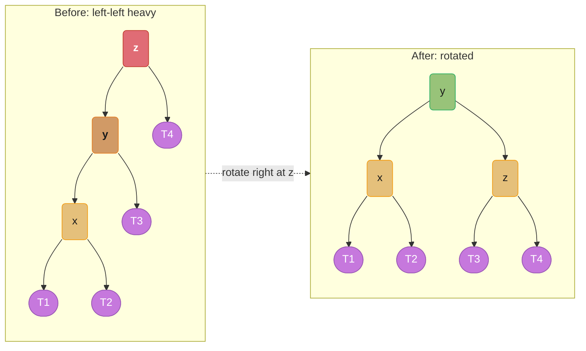
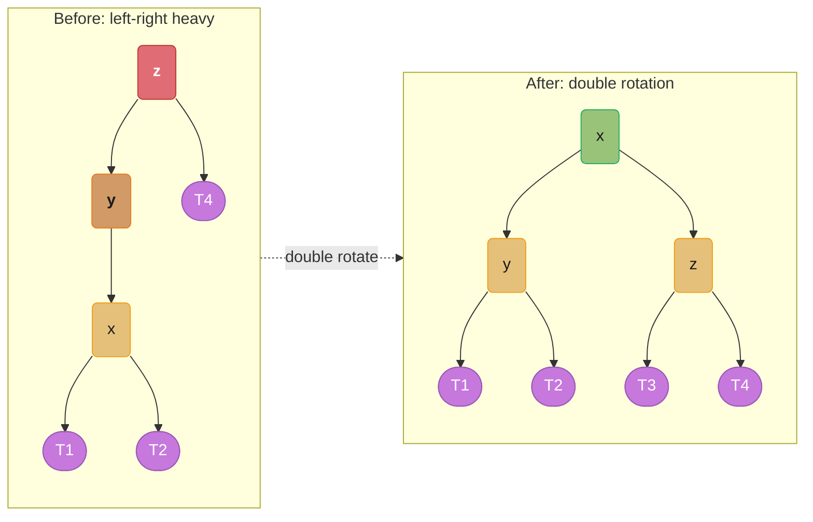
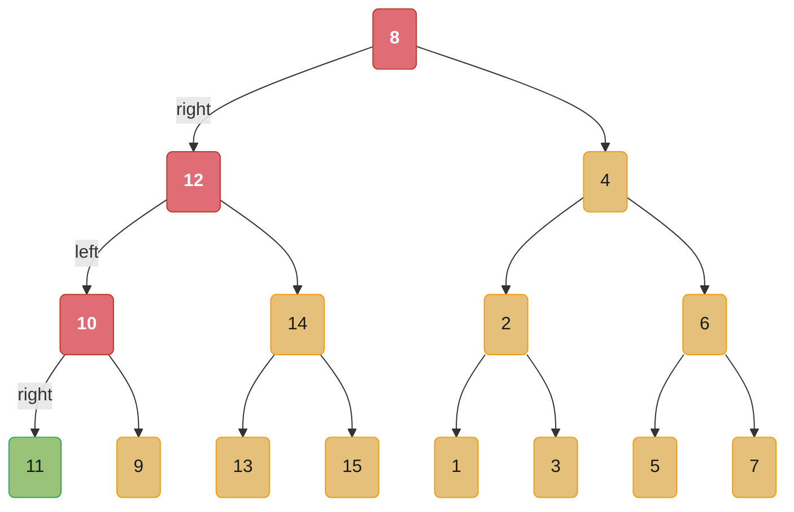
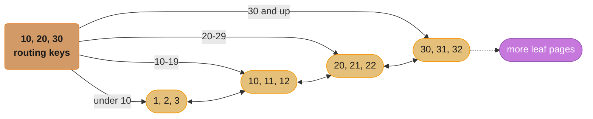
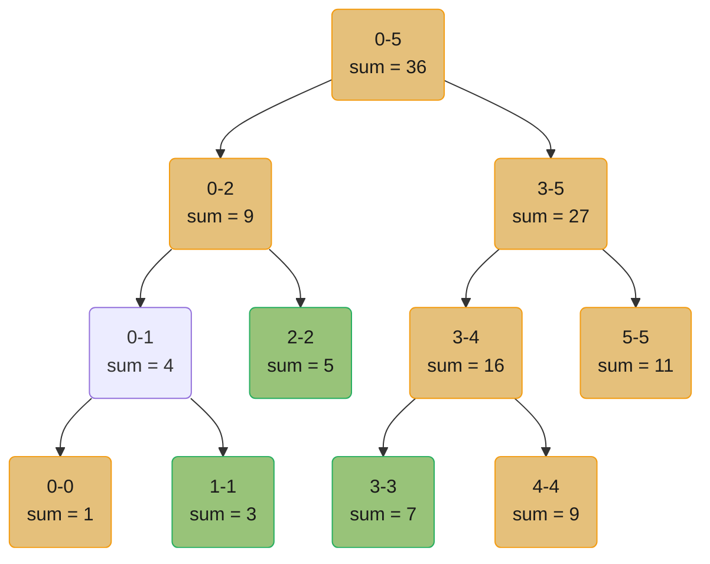
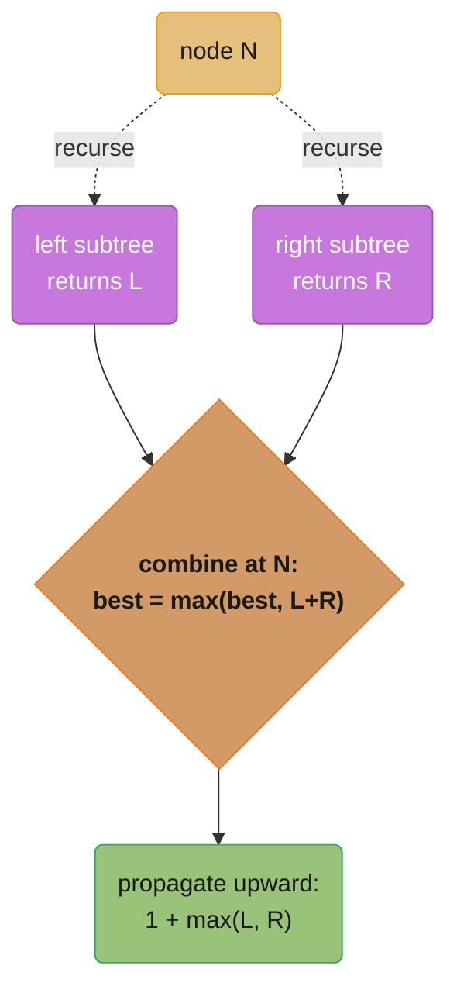
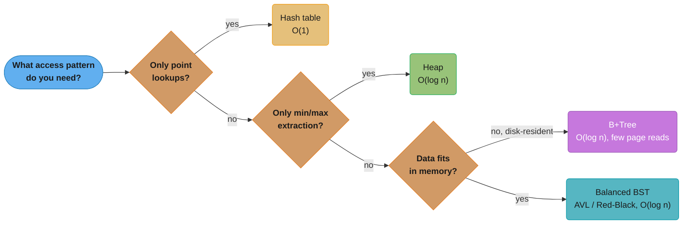

# Trees & Binary Search Trees

---

## 1. Concept Overview

Trees are hierarchical data structures where each node has zero or more children, with a single root and no cycles. They are the most ubiquitous structured data organisation in computing: file systems, HTML/XML DOM, arithmetic expression trees, decision trees, routing tables, and the indexes that make databases fast.

A **binary tree** allows at most two children per node (left and right). A **binary search tree (BST)** adds an invariant: all keys in the left subtree are less than the root's key; all keys in the right subtree are greater. This invariant allows O(log n) search, insertion, and deletion — **if the tree is balanced**.

Without balancing, a BST degenerates to a linked list on sorted input (O(n) operations). **Self-balancing BSTs** (AVL, red-black) maintain O(log n) height automatically. **B-trees** and **B+trees** are the multi-way balanced trees used in database indexes, where each node holds dozens of keys to minimise disk page reads.

---

## 2. Intuition

> **One-line analogy**: A BST is a binary decision at every node — "go left if smaller, go right if larger" — like a binary search encoded as a tree that remembers its structure.

**Mental model**: A balanced BST of n elements has height ~log₂ n. Every operation (search, insert, delete) makes one decision per level → O(log n) total decisions. The tree is efficient because each comparison cuts the remaining search space in half — the same reason binary search is O(log n) on an array.

**Why it matters**: Trees appear in almost every system and interview problem category: (a) traversal problems (in-order, BFS level-order), (b) BST validation and manipulation, (c) tree DP (diameter, max path sum), (d) lowest common ancestor, (e) segment trees for range queries. Tree DP is arguably the hardest interview sub-topic — the key is identifying the right recursive return value.

**Key insight**: For tree problems, recursive solutions naturally mirror the tree structure. The pattern is always: "What information do I need from the left subtree? From the right subtree? How do I combine them?" Defining the recursive function's return value precisely is the hardest part.

---

## 3. Core Principles

- **BST invariant**: for every node N, all keys in N's left subtree are < N.key, all keys in N's right subtree are > N.key (for strict BST; ≤ variants exist).
- **In-order traversal of a BST gives sorted order**: left → root → right produces the keys in ascending order. This is why `TreeMap.entrySet()` iteration is O(n) in sorted order.
- **Height determines performance**: a balanced tree has height O(log n). An unbalanced tree has height O(n) worst case (sorted insertion). All BST operations are O(height).
- **AVL invariant**: at every node, the heights of the left and right subtrees differ by at most 1. Height ≤ 1.44 × log₂(n+2) ≈ O(log n).
- **Red-black invariant**: (a) root is black, (b) leaves (nulls) are black, (c) red nodes have only black children, (d) all paths from root to leaf have the same number of black nodes. Height ≤ 2 log₂(n+1) ≈ O(log n).
- **B-tree**: each node holds t-1 to 2t-1 keys; all leaves are at the same depth; good for disk I/O because a node fills a disk page.
- **Tree DP**: for problems where the answer at a node depends on both children (max path sum, diameter), use a helper that returns both the "local answer" (passing through the node) and the "propagatable value" (best single path upward).

---

## 4. Types / Architectures

### 4.1 Binary Tree Traversal Orders

| Order | Pattern | Use case |
|-------|---------|---------|
| Pre-order | root → left → right | Serialise tree, copy tree |
| In-order | left → root → right | BST sorted output, BST validation |
| Post-order | left → right → root | Delete tree, evaluate expression tree |
| Level-order (BFS) | level by level using queue | Level-order serialisation, min depth, zigzag |

### 4.2 Balanced BST Families

| Structure | Height | Insert/Search/Delete | Notes |
|-----------|--------|---------------------|-------|
| BST (no balancing) | O(n) worst | O(n) worst | Degrades on sorted input |
| AVL tree | ≤ 1.44 log n | O(log n) | Stricter balance than RB; more rotations |
| Red-black tree | ≤ 2 log n | O(log n) | Used in Java TreeMap, Linux scheduler |
| B-tree (order t) | O(log_t n) | O(log n) | Disk-optimised; t node keys per page |
| B+tree | O(log_t n) | O(log n) | All data in leaves; linked leaves for range scan |
| Skip list | O(log n) expected | O(log n) | Redis sorted sets; easier than BST to implement |

### 4.3 AVL Rotation (Conceptual)

**Left-Left case (single right rotation at z):**



**Left-Right case (left-rotate y, then right-rotate z):**



Red marks the unbalanced node that triggers the rotation, orange is the pivot doing the work, purple subtrees are re-parented but never modified, and green is the new balanced root after the fix.

---

## 5. Architecture Diagrams

### BST Search Path (n=15, balanced)



Red traces the decision path; green marks the target found. Search for 11 follows 8 -> right -> 12 -> left -> 10 -> right -> 11: 4 comparisons, matching log2(15) ≈ 4.

### B+Tree Leaf Linked List (Database Index)



Internal nodes (orange) hold only routing keys; leaf nodes (gold) hold the actual keys and data pointers and are linked left-to-right. That linked list is what enables a range scan to cost O(k + log n): one O(log n) descent to the first leaf, then O(k) sideways steps.

### Segment Tree for Range Sum

Array: `[1, 3, 5, 7, 9, 11]`, indexed 0-5. Each node stores the sum over its index range; leaves are single elements.



`rangeSum(1, 3)` decomposes into the three green nodes: `tree[1,1] + tree[2,2] + tree[3,3] = 3 + 5 + 7 = 15`. Build is O(n); query and update are each O(log n).

---

## 6. How It Works — Detailed Mechanics

### 6.1 BST Implementation

```python
from __future__ import annotations
from typing import Optional

class TreeNode:
    def __init__(self, val: int, left: Optional['TreeNode'] = None,
                 right: Optional['TreeNode'] = None) -> None:
        self.val = val
        self.left = left
        self.right = right

def search(root: Optional[TreeNode], target: int) -> Optional[TreeNode]:
    """O(h) where h = height. O(log n) balanced, O(n) unbalanced."""
    while root:
        if target == root.val:
            return root
        root = root.left if target < root.val else root.right
    return None

def insert(root: Optional[TreeNode], val: int) -> TreeNode:
    if not root:
        return TreeNode(val)
    if val < root.val:
        root.left = insert(root.left, val)
    elif val > root.val:
        root.right = insert(root.right, val)
    return root

def inorder(root: Optional[TreeNode]) -> list[int]:
    """In-order traversal: produces sorted sequence for BST."""
    result: list[int] = []
    def _walk(node: Optional[TreeNode]) -> None:
        if not node:
            return
        _walk(node.left)
        result.append(node.val)
        _walk(node.right)
    _walk(root)
    return result
```

### 6.2 Level-Order Traversal (BFS)

```python
from collections import deque

def level_order(root: Optional[TreeNode]) -> list[list[int]]:
    """O(n) time and space. Returns nodes grouped by level."""
    if not root:
        return []
    result: list[list[int]] = []
    queue: deque[TreeNode] = deque([root])
    while queue:
        level_size = len(queue)
        level: list[int] = []
        for _ in range(level_size):
            node = queue.popleft()
            level.append(node.val)
            if node.left:
                queue.append(node.left)
            if node.right:
                queue.append(node.right)
        result.append(level)
    return result
```

### 6.3 Tree DP — Diameter and Max Path Sum

Both functions below share one recursive pattern: at every node, combine the two children's results into a local answer, but propagate only a single best arm upward. This is the return-value design decision called out in §2 and §3 — get it right and both problems fall out of the same template.



Dotted edges are the recursive descent; solid edges are values returning. The orange node is exactly `best[0] = max(best[0], left + right)` in `diameter_of_binary_tree` and `best[0] = max(best[0], node.val + left + right)` in `max_path_sum` below — the green node is the `return 1 + max(left, right)` / `return node.val + max(left, right)` line that keeps climbing.

```python
def diameter_of_binary_tree(root: Optional[TreeNode]) -> int:
    """
    Diameter = longest path between any two nodes (may not pass through root).
    Key: recursive helper returns the longest arm (single-path downward).
    The diameter at each node = left_arm + right_arm.
    O(n) time, O(h) space.
    """
    best = [0]
    def arm_length(node: Optional[TreeNode]) -> int:
        if not node:
            return 0
        left = arm_length(node.left)
        right = arm_length(node.right)
        best[0] = max(best[0], left + right)   # diameter through this node
        return 1 + max(left, right)             # longest arm upward
    arm_length(root)
    return best[0]

def max_path_sum(root: Optional[TreeNode]) -> int:
    """
    Maximum path sum between any two nodes (values can be negative).
    Same pattern: helper returns max single-path downward.
    O(n) time.
    """
    best = [float('-inf')]
    def max_gain(node: Optional[TreeNode]) -> float:
        if not node:
            return 0.0
        left = max(max_gain(node.left), 0.0)   # ignore negative sub-paths
        right = max(max_gain(node.right), 0.0)
        best[0] = max(best[0], node.val + left + right)  # path through node
        return node.val + max(left, right)      # best single arm upward
    max_gain(root)
    return int(best[0])
```

### 6.4 Lowest Common Ancestor

```python
def lowest_common_ancestor(root: Optional[TreeNode],
                            p: TreeNode, q: TreeNode) -> Optional[TreeNode]:
    """
    For a general binary tree (not necessarily BST).
    Post-order: if both children return non-null, this node is the LCA.
    O(n) time, O(h) space.
    """
    if not root or root is p or root is q:
        return root
    left = lowest_common_ancestor(root.left, p, q)
    right = lowest_common_ancestor(root.right, p, q)
    if left and right:
        return root   # p in left subtree, q in right (or vice versa) → LCA here
    return left or right   # one of them found; propagate upward
```

### 6.5 Validate BST (In-Order with Bounds)

```python
def is_valid_bst(root: Optional[TreeNode]) -> bool:
    """
    BROKEN: checking only parent-child relationship misses the global invariant.
    FIX: pass min/max bounds through the recursion.
    O(n) time, O(h) space.
    """
    def validate(node: Optional[TreeNode],
                 lo: float, hi: float) -> bool:
        if not node:
            return True
        if not (lo < node.val < hi):
            return False
        return (validate(node.left, lo, node.val) and
                validate(node.right, node.val, hi))
    return validate(root, float('-inf'), float('inf'))
```

---

## 7. Real-World Examples

**Java `TreeMap` (red-black tree)** — all operations are O(log n) and the map iterates in sorted key order. Used when you need `floorKey(k)` (largest key ≤ k), `ceilingKey(k)`, or `subMap(lo, hi)` range queries. Slower than `HashMap` for pure point lookups but essential for ordered operations.

**PostgreSQL B+Tree index** — a B+Tree with page size 8 KB and branching factor ~200 (for integer keys). A table of 1 billion rows has a B+Tree of height ~ceil(log₂₀₀(10⁹)) ≈ 4. Any row lookup costs 4 page reads regardless of table size. Leaf pages are linked in sorted order, enabling range scans in O(k + log n) for k matching rows.

**Linux Completely Fair Scheduler** — the runqueue is a red-black tree keyed by virtual runtime. The leftmost node (minimum virtual runtime) is the next task to run — O(log n) extraction. O(log n) re-insertion when a task becomes runnable again. The red-black tree's O(2 log n) height bound keeps scheduling latency bounded at ~hundreds of nanoseconds.

**React's Fiber tree** — React's virtual DOM is a tree of Fiber nodes (one per component). Reconciliation is a tree DFS (depth-first). Each Fiber has pointers to child, sibling, and return (parent) — a linked structure enabling interruptible traversal (suspend and resume), which is the key to React Concurrent Mode.

---

## 8. Tradeoffs

### BST vs Hash Table vs Array

| Need | Best Choice | Reason |
|------|-------------|--------|
| O(1) point lookup | Hash table | No ordering needed |
| O(log n) ordered lookup | Balanced BST | Maintains sorted order |
| Range queries [lo, hi] | BST or B+Tree | Hash table requires O(n) scan |
| Floor/ceiling (nearest key) | BST | Hash table cannot do this |
| Sorted iteration | BST | O(n) in-order traversal |
| Disk I/O minimised | B+Tree | High branching factor = few page reads |

### AVL vs Red-Black Tree

| Dimension | AVL | Red-Black |
|-----------|-----|-----------|
| Balance constraint | Height diff ≤ 1 | Longest path ≤ 2 × shortest |
| Search speed | Faster (stricter balance) | Slightly slower |
| Insert/delete | More rotations (slower) | Fewer rotations (faster) |
| Memory | 1 height/balance field | 1 color bit |
| Used in | Databases, lookup-heavy | OS schedulers, Java TreeMap |

---

## 9. When to Use / When NOT to Use

**Use a BST when:**
- You need sorted iteration, range queries, floor/ceiling lookups.
- Keys are ordered and orderable (integers, strings, timestamps).
- Concurrent operations with ordering guarantees (ConcurrentSkipListMap in Java).

**Do NOT use a BST when:**
- You only need point lookups — use a hash table (O(1) vs O(log n)).
- Data is accessed in random (non-sequential) order on disk — use a B+Tree with large pages.
- You need a simple priority queue — use a heap (simpler, same O(log n) insert/extract-min).

**Putting it together:**



This consolidates the two lists above and the BST-vs-Hash-vs-Array row from §8 into one routing decision: point lookups peel off to a hash table, pure min/max needs peel off to a heap, and what remains splits on memory residency between an in-memory balanced BST and a disk-optimised B+Tree.

---

## 10. Common Pitfalls

### Pitfall 1: Validating a BST by Checking Only Parent-Child

```python
# BROKEN: only checks parent-child pair, not the global BST invariant
def is_bst_broken(root: Optional[TreeNode]) -> bool:
    if not root:
        return True
    if root.left and root.left.val >= root.val:
        return False
    if root.right and root.right.val <= root.val:
        return False
    return is_bst_broken(root.left) and is_bst_broken(root.right)
# BROKEN for: root=10, left=5, left.right=6 (valid child), but 6 > 5 and 6 < 10 -> wrongly True
# Tree:  10
#        /
#       5
#        \
#         6    <- 6 > 5 and 6 < 10 but the subtree is valid? Actually this IS a valid BST.
# Real broken case:  10 -> left=5 -> right=15  (15 > 10 — violates BST but passes local check)
# FIX: use bounds (lo, hi) as shown in §6.5 above
```

### Pitfall 2: Off-by-One in Iterative In-Order

```python
# BROKEN: forgetting to push the current node when backtracking
def inorder_iterative_broken(root):
    stack, result = [], []
    while root or stack:
        while root:
            stack.append(root)
            root = root.left
        root = stack.pop()
        result.append(root.val)
        root = root.right   # correct — this is NOT broken; shown for contrast
    return result
# Actually the iterative in-order is tricky — the template above is correct.
# BROKEN pattern: forgetting root = root.right after processing, causing infinite loop.
```

### Pitfall 3: Tree DP — Forgetting to Reset Global State Between Test Cases

```python
# BROKEN: best is a module-level variable — persists across calls in LeetCode tests
best = 0
def diameter_broken(root):
    def helper(node):
        global best   # BROKEN: not reset between test cases
        ...
    helper(root)
    return best

# FIX: use a closure list (or class attribute) that is local to each call
def diameter(root):
    best = [0]   # list used as mutable closure — reset each call ✓
    def helper(node):
        ...
        best[0] = max(best[0], ...)
    helper(root)
    return best[0]
```

---

## 11. Technologies & Tools

| Tool / Class | Language | Notes |
|-------------|---------|-------|
| `TreeMap` | Java | Red-black BST; O(log n) all ops; `floorKey`, `ceilingKey`, `subMap` |
| `TreeSet` | Java | Set backed by a red-black BST |
| `SortedDict` | Python (`sortedcontainers`) | O(log n) lookup + sorted iteration; not in stdlib |
| `bisect` module | Python | Binary search on sorted lists; O(log n) |
| B+Tree index | Databases | PostgreSQL, MySQL InnoDB use B+Tree for indexes |
| `java.util.PriorityQueue` | Java | Min-heap — NOT a BST despite the name |
| Segment tree | Competitive / interview | Range queries + point updates in O(log n) |
| Fenwick/BIT | Competitive / interview | Prefix sums in O(log n); simpler than segment tree |

---

## 12. Interview Questions with Answers

**Q1: What is the in-order traversal of a BST and why is it important?**
In-order traversal visits nodes in left-root-right order. For a BST, this produces keys in ascending sorted order. This property is used to: (a) validate a BST (in-order should produce a strictly increasing sequence), (b) find the k-th smallest element (traverse until k elements visited), (c) convert a BST to a sorted array. It is also the basis for the in-order successor/predecessor operations.

**Q2: What is the time complexity of BST search, insert, and delete?**
O(h) where h is the height. For a balanced BST (AVL, red-black): h = O(log n), so all operations are O(log n). For a degenerate BST (sorted insertion): h = O(n), so all operations are O(n). The key point: the BST is only O(log n) if balanced.

**Q3: How does a BST degenerate, and how do self-balancing trees prevent it?**
Inserting elements in sorted (or reverse-sorted) order always adds to the rightmost (or leftmost) path, creating a linked list of height n. Self-balancing trees (AVL, red-black) perform rotations after each insert/delete to restore the height invariant. AVL rotates when a node's subtree height difference exceeds 1. Red-black rotates and recolors to maintain the 4-5 color invariants.

**Q4: What is the difference between a B-tree and a B+tree?**
In a B-tree, every node (internal and leaf) stores key-value pairs. In a B+tree, only leaf nodes store data pointers; internal nodes store only keys for routing. All leaf nodes in a B+tree are linked in a sorted doubly-linked list, enabling efficient range scans. Databases use B+trees because (a) higher branching factor (internal nodes can store more keys, fewer disk reads per lookup) and (b) range scans are O(k + log n) by following the leaf chain.

**Q5: How do you find the lowest common ancestor (LCA) of two nodes in a binary tree?**
Post-order traversal with early termination. Base case: if the current node is null, p, or q, return it. Recurse on both children. If both return non-null, the current node is the LCA. If only one returns non-null, propagate that upward. O(n) time, O(h) space. For a BST, the LCA is the first node where p and q diverge: traverse from root; if both p and q are less than the current node, go left; if both are greater, go right; otherwise the current node is the LCA. O(h) time.

**Q6: What is a segment tree and when do you need it?**
A complete binary tree where each node stores an aggregate (sum, min, max) of a range of array elements. Build: O(n). Point update: O(log n). Range query: O(log n). Use when you need both range queries and point updates on an array — a sorted array gives O(log n) query but O(n) update. A segment tree is the right tool for: range sum, range minimum/maximum, and problems combining queries and updates. Space: O(4n) for the tree array.

**Q7: How does Java's `TreeMap.floorKey(k)` work?**
It traverses the red-black tree from the root, maintaining a running candidate for the largest key ≤ k. At each node: if the node's key ≤ k, update the candidate and go right (there may be a larger valid key). If the node's key > k, go left. Return the last valid candidate. O(log n). The same pattern applies to `ceilingKey` (smallest key ≥ k), `lowerKey` (<), and `higherKey` (>).

**Q8: What is the time complexity of building a BST from a sorted array?**
O(n) if done correctly (insert the middle element as root, recurse on left and right halves — same as the "convert sorted array to BST" problem). If you insert elements one by one in sorted order: O(n²) because each insert appends to the end of a degenerate tree. The recursive balanced-build approach produces a balanced BST of height log n.

**Q9: How do you serialise and deserialise a binary tree?**
Pre-order traversal with explicit null markers. Serialise: append node.val for non-null nodes, append "#" for null. Deserialise: consume the sequence recursively — if the first token is "#", return null; otherwise create a node with that value and recurse for left and right. O(n) time and space. BFS-based serialisation (level order) is also valid and is the format used by LeetCode.

**Q10: What is the height and number of nodes in a complete binary tree?**
Height = floor(log₂ n). Number of nodes in a perfect binary tree of height h = 2^(h+1) - 1. A complete binary tree has all levels full except possibly the last, which is filled left to right. Checking if a binary tree is complete can be done in O(n) with BFS: level-order traversal; once a null node is encountered, all subsequent nodes must also be null.

**Q11: How do you find the k-th smallest element in a BST efficiently?**
In-order traversal counting up to k. O(h + k) time — traverse down to the leftmost node, then visit k nodes in order. With an augmented BST (each node stores the size of its subtree), you can do it in O(h) = O(log n): if k ≤ left-subtree-size, recurse left; if k == left-subtree-size + 1, the root is the k-th element; otherwise recurse right with k - left-subtree-size - 1.

**Q12: What is a self-balancing BST used for in the Linux kernel?**
The Completely Fair Scheduler (CFS) uses a red-black tree (`rb_tree`) as the run queue. Each runnable task is a node keyed by virtual runtime (vruntime). The leftmost node is always the next task to schedule (smallest vruntime = least CPU time received). `rb_leftmost` is O(log n); insertion after a task preempts is O(log n). The red-black tree is preferred over a heap because it supports efficient deletion of arbitrary nodes (when a task becomes unrunnable) in O(log n), which a heap cannot do efficiently.

**Q13: What is the difference between a tree's depth and its height?**
The **depth** of a node is the number of edges from the root to that node (root has depth 0). The **height** of a node is the number of edges on the longest downward path from that node to a leaf (leaves have height 0). The **height of the tree** is the height of the root. Some textbooks define these as the number of nodes rather than edges — always clarify in interviews. Both are equivalent for complexity analysis.

**Q14: How would you implement an order-statistic tree?**
An order-statistic tree is a BST where each node also stores the size of its subtree. Operations: select (find k-th smallest), rank (find the rank of a key). Select: O(log n) by comparing k to the left-subtree size. Rank: O(log n) by accumulating left-subtree sizes along the path. Implemented by augmenting a red-black tree (Java has no built-in; Python's `sortedcontainers.SortedList` provides similar functionality).

**Q15: When would you choose a skip list over a balanced BST?**
A skip list is a probabilistic data structure with O(log n) expected operations and O(n) space. Advantages over BST: simpler to implement correctly (no rotations), easy to make lock-free for concurrent access, supports efficient range scans. Redis sorted sets use a skip list for exactly this: simpler concurrent implementation with O(log n) ZADD/ZRANK/ZRANGE. Disadvantages: probabilistic worst case; more memory per element (multiple forward pointers).

**Q16: What is the complexity of finding all nodes in a BST within a range [lo, hi]?**
O(log n + k) where k is the number of nodes in the range. Navigate to the leftmost node ≥ lo in O(log n), then in-order traverse until the value exceeds hi, collecting k nodes in O(k). The B+tree's linked leaf list gives the same O(log n + k) complexity for database range scans.

**Q17: How do you construct a binary tree from its pre-order and in-order traversals?**
Pre-order: first element is the root. In-order: the root divides it into left and right subtrees. Algorithm: pop the first element of pre-order (it's the root); find its position in in-order; elements to the left form the left subtree, right side forms the right subtree; recurse. O(n²) with linear search or O(n) with a hash map for O(1) index lookups. The hash map from value to in-order index reduces the construction to O(n).

**Q18: Explain the four cases of AVL tree insertion imbalance and how to fix them.**
After an insertion, an ancestor node may become unbalanced (|left_height - right_height| > 1). Four cases: (1) **Left-Left**: new node in left child's left subtree — single right rotation at the unbalanced node. (2) **Right-Right**: new node in right child's right subtree — single left rotation. (3) **Left-Right**: new node in left child's right subtree — left rotate the left child, then right rotate the unbalanced node. (4) **Right-Left**: new node in right child's left subtree — right rotate the right child, then left rotate the unbalanced node. After insertion, only O(1) rotations needed (AVL: at most 2).

---

## 13. Best Practices

1. **Use `TreeMap`/`SortedDict` when you need sorted order** — hash map for pure point lookup.
2. **For tree DPs, define the helper's return value before coding** — "what does it return?" is 80% of the solution.
3. **Use in-order traversal to validate or extract BST data** — it directly uses the BST invariant.
4. **Use a dummy root or sentinel to simplify edge cases** in tree construction.
5. **For LCA, use the post-order pattern**: process children before the current node.
6. **Always check empty/single-node trees** as base cases in recursive solutions.
7. **Use a deque for level-order BFS** — Python `collections.deque`, Java `ArrayDeque`.
8. **For range queries with updates, reach for a segment tree** — not a sorted array.

---

## 14. Case Study: Design a Leaderboard with Range Queries

**Scenario**: implement a leaderboard supporting: (1) `addScore(player, score)`, (2) `top(k)` — sum of scores of the top-k players, (3) `reset(player)` — reset player's score to 0.

```python
from sortedcontainers import SortedList

class Leaderboard:
    """
    addScore: O(log n). top(k): O(k). reset: O(log n).
    Uses a sorted list (backed by a balanced BST) for ordered queries.
    """

    def __init__(self) -> None:
        self._scores: dict[str, int] = {}
        self._sorted: SortedList[int] = SortedList()

    def addScore(self, player_id: str, score: int) -> None:
        if player_id in self._scores:
            self._sorted.discard(self._scores[player_id])  # O(log n)
        self._scores[player_id] = self._scores.get(player_id, 0) + score
        self._sorted.add(self._scores[player_id])  # O(log n)

    def top(self, k: int) -> int:
        return sum(self._sorted[-k:])   # O(k) — slice from end (highest scores)

    def reset(self, player_id: str) -> None:
        if player_id in self._scores:
            self._sorted.discard(self._scores[player_id])
            del self._scores[player_id]
```

**BROKEN — using sort on every top(k) call**:
```python
# BROKEN: O(n log n) per top(k) call — sorting the entire player dict each time
class Leaderboard_Broken:
    def __init__(self): self._scores = {}
    def addScore(self, pid, score): self._scores[pid] = self._scores.get(pid, 0) + score
    def top(self, k):
        return sum(sorted(self._scores.values(), reverse=True)[:k])  # O(n log n) each call
    def reset(self, pid): del self._scores[pid]
# With 100K players and 10K top() calls: 10K × 100K × log(100K) = 10^9 × 17 ≈ infeasible
# FIX: maintain a sorted structure (SortedList / BST) → O(k) per top() call
```

---

## See Also

- [heaps_and_priority_queues](../heaps_and_priority_queues/README.md) — heap is a complete binary tree; compare heap vs BST for priority operations
- [graphs_tries_and_advanced_structures](../graphs_tries_and_advanced_structures/README.md) — trie = prefix tree; segment tree; Fenwick tree
- [complexity_analysis_and_big_o](../complexity_analysis_and_big_o/README.md) — BST height O(log n) derivation; Master theorem for tree recursion
- [`database/indexing_deep_dive`](../../database/indexing_deep_dive/README.md) — B+Tree in PostgreSQL/MySQL; clustered vs secondary indexes
- [`java/collections_internals`](../../java/collections_internals/README.md) — Java TreeMap red-black tree internals
- [DSA Pattern Playbooks](../dsa_patterns/README.md) — apply these structures: [Tree BFS](../dsa_patterns/tree_bfs.md), [Tree DFS](../dsa_patterns/tree_dfs.md)
