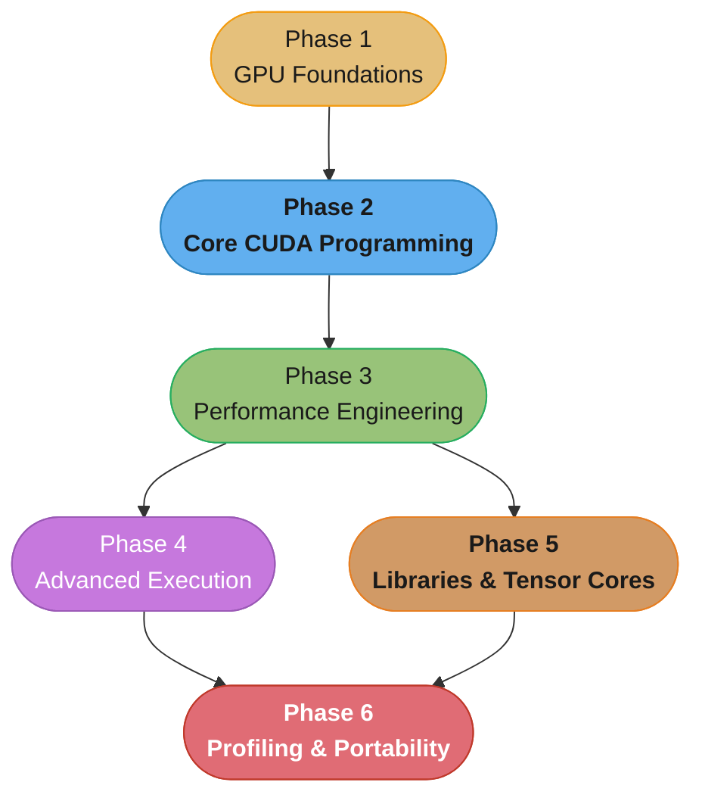

# GPGPU & CUDA Programming — Senior Engineer & Interview Prep Guide

A comprehensive, one-stop reference for mastering **general-purpose GPU programming with CUDA** — from the SIMT execution model and GPU hardware architecture through the core CUDA programming model, the performance-engineering discipline that dominates senior GPU interviews (coalescing, shared-memory tiling, occupancy, warp primitives), advanced execution (streams, CUDA graphs, multi-GPU/NCCL), the library and Tensor-Core ecosystem, and the profiling/debugging/portability toolchain. Covers everything a senior GPU / CUDA / ML-infrastructure / HPC engineer is expected to know in technical interviews — from the **kernel author's** viewpoint.

> **No runtime application** — all content is Markdown with executable-shaped CUDA C++, PTX, and Python (CuPy / Numba / Triton / PyTorch) code blocks. Concepts are shown in CUDA C++ and Python side-by-side where both teach; in C++ alone where the concept is inherently C++ (WMMA, PTX, `__launch_bounds__`); in Python alone where inherently Python (Triton, CuPy).

---

## Intuition

> **One-line analogy**: A CPU is a handful of Formula-1 cars — each astonishingly fast, latency-optimized, wrong for moving 50,000 people. A GPU is a fleet of 50,000 bicycles: individually slow, but if your problem is *"move 50,000 people one mile"* it wins by three orders of magnitude. CUDA programming is the art of restating your problem as *"50,000 people, one mile."*

**Mental model**: A GPU hides latency with parallelism instead of caches. A CPU spends its transistor budget on out-of-order execution, branch prediction, and deep caches to make *one* thread fast. A GPU spends that budget on *thousands* of ALUs and keeps them busy by oversubscribing each core with many warps: when one warp stalls on a 400-cycle memory load, the scheduler instantly swaps in another that is ready. So GPU performance is not about making any single thread fast — it is about (1) exposing enough parallel work to hide latency, and (2) feeding that work from memory fast enough that the ALUs never starve. Almost every CUDA optimization — coalescing, shared-memory tiling, occupancy tuning, using Tensor Cores — is a variation on *keep the compute units fed and busy.*

**Why it matters**: Every performance-critical workload of the last decade — deep-learning training and inference, scientific simulation, video/image processing, cryptography, ranking — runs on GPUs. The engineer who can write, read, and *optimize* a CUDA kernel is the one who turns a model that costs \$4M/year to serve into one that costs \$1M, or a simulation that takes a week into one that takes an afternoon. Interviews test whether you understand the *mechanics* underneath the speedup — why an uncoalesced access is 8× slower, what a bank conflict actually is, why occupancy plateaus — not just that "the GPU is faster."

**Key insight**: The hardest problems in GPU programming are not "how do I launch a kernel" — they are **memory movement, divergence, and occupancy**. Where does the data live (register → shared → L2 → HBM, each ~10× slower than the last), and are your 32 threads in a warp touching contiguous addresses? Do the threads in a warp all take the same branch, or does divergence serialize them? And are there enough resident warps to hide the latency you can't avoid? Master those three axes and the rest is API surface. This section is the roofline model made concrete: **is your kernel memory-bound or compute-bound, and what is the one number that would move it toward the roof?**

---

## 1. Section Overview

This section covers:

- **GPU Foundations** — why GPUs exist (throughput vs latency, SIMT vs SIMD, Amdahl/Gustafson), SM/warp/register hardware architecture across generations (Volta → Hopper → Blackwell), and the nvcc → PTX → SASS compilation toolchain
- **Core CUDA Programming** — the kernel/grid/block/thread model, warp execution and divergence, the full memory model (global/shared/local/constant/texture/register), and memory management/transfer (pinned, unified, async)
- **Performance Engineering** (the interview core) — memory coalescing, shared-memory tiling and bank conflicts, occupancy and launch configuration, synchronization and atomics, the canonical parallel patterns (reduction/scan/histogram), and warp-level primitives (shuffle, vote, cooperative groups)
- **Advanced Execution & Multi-GPU** — streams and concurrency, CUDA graphs, multi-GPU programming with NCCL/NVLink/P2P, and dynamic parallelism / advanced kernel structures
- **Libraries, Tensor Cores & Ecosystem** — Tensor Cores and mixed precision (WMMA, FP16/BF16/TF32/FP8), the math/DNN libraries (cuBLAS/cuDNN/CUTLASS/Thrust), the Python GPU ecosystem (CuPy/Numba/PyCUDA/PyTorch extensions), and kernel DSLs (OpenAI Triton)
- **Profiling, Correctness & Portability** — Nsight Systems/Compute profiling and roofline analysis, debugging and numerical correctness (compute-sanitizer, determinism), and cross-vendor portability (HIP/ROCm, SYCL, Metal, WebGPU)

**Primary platform:** NVIDIA CUDA. One dedicated module surveys cross-vendor portability (HIP/ROCm, SYCL/oneAPI, Metal, WebGPU); the rest is CUDA-native.

---

## 2. Scope & Non-Overlap Boundary

This section is deliberately scoped to the **kernel author's** view of the GPU and **not to duplicate** the GPU material that already lives in the ML and LLM sections. Where a topic is covered elsewhere at a different altitude, this section **cross-references it and adds only the CUDA-kernel angle**:

| Already covered in... | CUDA section does NOT re-teach | CUDA section DOES cover |
|-----------------------|--------------------------------|--------------------------|
| [`llm/case_studies/design_gpu_inference_platform.md`](../llm/case_studies/design_gpu_inference_platform.md) | Multi-tenant serving, KV-cache paging, autoscaling on MBU, GPU-fleet economics | The *kernels* underneath — GEMV/attention/quantized-matmul kernel engineering |
| [`llm/optimization_and_quantization/gpu_architecture_and_roofline.md`](../llm/optimization_and_quantization/) | Roofline used to reason about *transformer inference* cost | Roofline as a *kernel-optimization* loop; per-kernel arithmetic intensity |
| [`ml/gpu_and_hardware_optimization/`](../ml/gpu_and_hardware_optimization/) | Training-time hardware use (gradient checkpointing, mixed-precision training recipes, multi-GPU training strategy) | Writing and optimizing the CUDA kernels themselves; the SIMT/memory/occupancy mechanics |
| [`ml/distributed_training/`](../ml/distributed_training/) | Data/model/pipeline parallelism strategy, ZeRO, FSDP | NCCL collectives and NVLink/P2P from the CUDA-programming viewpoint |
| [`devops/ml_platform_and_gpu_infrastructure/`](../devops/ml_platform_and_gpu_infrastructure/) | GPU Operator, MIG/time-slicing, Karpenter GPU pools on Kubernetes | On-device MIG/streams as a *programming* concern; not cluster operations |

**CUDA owns**: the SIMT execution model, GPU hardware architecture from the programmer's viewpoint, the CUDA C++ / PTX programming model, kernel-level performance engineering (coalescing, shared memory, occupancy, warp primitives, Tensor Cores), streams/graphs/multi-GPU as programming constructs, the CUDA library and Python-GPU ecosystems, kernel profiling/debugging, and GPU portability.

---

## 3. Module Table

| # | Module Directory | Phase | Difficulty | Key Topics |
|---|-----------------|-------|------------|------------|
| 1 | [gpu_computing_foundations](gpu_computing_foundations/) | 1 — GPU Foundations | Beginner | Throughput vs latency, SIMT vs SIMD, Amdahl/Gustafson, host/device model, PCIe vs NVLink, when the GPU wins |
| 2 | [gpu_hardware_architecture](gpu_hardware_architecture/) | 1 — GPU Foundations | Intermediate | SM anatomy, CUDA cores, warp schedulers, register file, L1/L2/HBM, generations (Volta→Blackwell), compute capability, Tensor Cores |
| 3 | [cuda_toolkit_and_compilation](cuda_toolkit_and_compilation/) | 1 — GPU Foundations | Intermediate | nvcc pipeline, PTX vs SASS, fatbin/JIT, `compute_XX`/`sm_XX`, `__CUDA_ARCH__`, driver vs runtime API, nvrtc, CMake |
| 4 | [cuda_programming_model_and_kernels](cuda_programming_model_and_kernels/) | 2 — Core CUDA | Beginner | `<<<grid,block>>>`, thread hierarchy, `threadIdx`/`blockIdx`, 1D/2D/3D indexing, grid-stride loops, `__global__`/`__device__`/`__host__` |
| 5 | [warps_and_simt_execution](warps_and_simt_execution/) | 2 — Core CUDA | Intermediate | warp=32, lockstep, warp scheduling, divergence + predication, `__syncwarp`, active mask, independent thread scheduling |
| 6 | [cuda_memory_model_and_hierarchy](cuda_memory_model_and_hierarchy/) | 2 — Core CUDA | Intermediate | global/shared/local/constant/texture/register, scope + lifetime, unified virtual addressing, L1/L2/HBM, `__restrict__` |
| 7 | [memory_management_and_data_transfer](memory_management_and_data_transfer/) | 2 — Core CUDA | Intermediate | `cudaMalloc`/`cudaMemcpy`, pinned vs pageable, unified memory (prefetch/advise), zero-copy, async copy, error checking |
| 8 | [memory_coalescing_and_access_patterns](memory_coalescing_and_access_patterns/) | 3 — Performance Engineering | Advanced | Coalesced vs strided, 128-byte transactions, alignment, AoS vs SoA, vectorized loads (`float4`), the transpose problem |
| 9 | [shared_memory_and_bank_conflicts](shared_memory_and_bank_conflicts/) | 3 — Performance Engineering | Advanced | Tiling, 32 banks, conflicts + padding, broadcast, dynamic shared memory, shared-mem GEMM tile |
| 10 | [occupancy_and_launch_configuration](occupancy_and_launch_configuration/) | 3 — Performance Engineering | Advanced | Occupancy, register/shared-mem limits, occupancy calculator, block-size tuning, latency hiding, register spilling, `__launch_bounds__` |
| 11 | [synchronization_and_atomics](synchronization_and_atomics/) | 3 — Performance Engineering | Advanced | `__syncthreads`, races, `atomicAdd`/CAS, memory fences, atomic contention, `cuda::atomic`, cooperative-groups intro |
| 12 | [parallel_patterns_reduction_scan_histogram](parallel_patterns_reduction_scan_histogram/) | 3 — Performance Engineering | Advanced | Reduction ladder, scan/prefix-sum, histogram, the canonical optimization walkthroughs |
| 13 | [warp_level_primitives_and_cooperative_groups](warp_level_primitives_and_cooperative_groups/) | 3 — Performance Engineering | Advanced | `__shfl_*_sync`, vote/ballot, warp-aggregated atomics, cooperative groups, grid sync, warp reduction |
| 14 | [streams_events_and_concurrency](streams_events_and_concurrency/) | 4 — Advanced Execution | Advanced | Streams, async, events/timing, overlap compute+transfer, default vs per-thread-default stream, priorities, callbacks |
| 15 | [cuda_graphs](cuda_graphs/) | 4 — Advanced Execution | Advanced | Graph capture, instantiate, launch-overhead reduction, graph update, when it wins |
| 16 | [multi_gpu_programming_and_nccl](multi_gpu_programming_and_nccl/) | 4 — Advanced Execution | Advanced | P2P, NVLink/NVSwitch, GPUDirect, device selection, NCCL collectives, data/model decomposition |
| 17 | [dynamic_parallelism_and_advanced_kernels](dynamic_parallelism_and_advanced_kernels/) | 4 — Advanced Execution | Advanced | Device-side launch, nested parallelism, persistent kernels, producer-consumer, when it helps vs hurts |
| 18 | [tensor_cores_and_mixed_precision](tensor_cores_and_mixed_precision/) | 5 — Libraries & Tensor Cores | Advanced | WMMA/`mma`, FP16/BF16/TF32/FP8, matrix fragments, loss scaling, cuBLAS/cuDNN TC paths, when TC engages |
| 19 | [cuda_math_and_dnn_libraries](cuda_math_and_dnn_libraries/) | 5 — Libraries & Tensor Cores | Intermediate | cuBLAS, cuDNN, CUTLASS, cuFFT, cuSPARSE, cuRAND, Thrust; library-vs-custom-kernel; CUTLASS templating |
| 20 | [python_gpu_ecosystem](python_gpu_ecosystem/) | 5 — Libraries & Tensor Cores | Intermediate | CuPy, Numba CUDA, PyCUDA, PyTorch custom CUDA/C++ extensions, `torch.compile`/Inductor, DLPack |
| 21 | [triton_and_kernel_dsls](triton_and_kernel_dsls/) | 5 — Libraries & Tensor Cores | Advanced | Triton programming model, block-level abstraction, autotuning, Triton vs CUDA C++, where Triton wins/loses |
| 22 | [profiling_and_performance_analysis](profiling_and_performance_analysis/) | 6 — Profiling & Production | Advanced | Nsight Systems vs Compute, roofline, achieved occupancy, DRAM throughput, warp-stall reasons, guided analysis |
| 23 | [debugging_correctness_and_numerics](debugging_correctness_and_numerics/) | 6 — Profiling & Production | Advanced | cuda-gdb, compute-sanitizer (memcheck/racecheck/synccheck/initcheck), error macros, FP/FMA, determinism, fast-math |
| 24 | [gpu_portability_hip_sycl_and_beyond](gpu_portability_hip_sycl_and_beyond/) | 6 — Profiling & Production | Intermediate | HIP/ROCm, SYCL/oneAPI, Metal, WebGPU, legacy OpenCL, `hipify`, portability-vs-peak-performance tradeoff |

---

## 4. 6-Phase Learning Path



Phase 3 (Performance Engineering, colored green as the "active" interview core) is the hinge the whole path pivots on: everything before it builds the mental model, and Phases 4/5 fan out in parallel afterward before both converge on Phase 6.

```
Phase 1 — GPU Foundations (why GPUs compute the way they do)
+------------------------------------------------------------+
|  gpu_computing_foundations     gpu_hardware_architecture   |
|  cuda_toolkit_and_compilation                              |
+------------------------------------------------------------+
                               |
                               v
Phase 2 — Core CUDA Programming
+------------------------------------------------------------+
|  cuda_programming_model_and_kernels   warps_and_simt_      |
|  cuda_memory_model_and_hierarchy      execution            |
|  memory_management_and_data_transfer                       |
+------------------------------------------------------------+
                               |
                               v
Phase 3 — Performance Engineering (the interview core)
+------------------------------------------------------------+
|  memory_coalescing_and_access_patterns                     |
|  shared_memory_and_bank_conflicts                          |
|  occupancy_and_launch_configuration                        |
|  synchronization_and_atomics                               |
|  parallel_patterns_reduction_scan_histogram                |
|  warp_level_primitives_and_cooperative_groups              |
+------------------------------------------------------------+
                               |
            +------------------+------------------+
            v                                     v
Phase 4 — Advanced Execution          Phase 5 — Libraries & Tensor Cores
+----------------------------+        +--------------------------+
|  streams_events_and_       |        |  tensor_cores_and_mixed_ |
|  concurrency               |        |  precision               |
|  cuda_graphs               |        |  cuda_math_and_dnn_      |
|  multi_gpu_programming_and_|        |  libraries               |
|  nccl                      |        |  python_gpu_ecosystem    |
|  dynamic_parallelism_and_  |        |  triton_and_kernel_dsls  |
|  advanced_kernels          |        |                          |
+-------------+--------------+        +------------+-------------+
              |                                    |
              +------------------+-----------------+
                                 v
Phase 6 — Profiling, Correctness & Portability
+------------------------------------------------------------+
|  profiling_and_performance_analysis                        |
|  debugging_correctness_and_numerics                        |
|  gpu_portability_hip_sycl_and_beyond                       |
+------------------------------------------------------------+
```

**Dependencies to note:**
- Phase 2 (Core CUDA) depends on the SIMT/hardware mental model from Phase 1 — you cannot reason about coalescing without knowing what a warp is.
- Phase 3 (Performance Engineering) is where interviews live and depends on the full memory model (Phase 2, module 6). Study coalescing → shared memory → occupancy in order; each builds on the last.
- Phases 4 and 5 can be studied in parallel after Phase 3; streams/graphs and Tensor Cores/libraries are independent tracks that both consume the performance fundamentals.
- Phase 6 (Profiling) is best interleaved *throughout* — the profiler is how you verify every Phase 3 optimization. It is placed last only so the roofline/metrics vocabulary is fully grounded.
- The case studies (see [case_studies/README.md](case_studies/README.md)) integrate Phases 2–6 end-to-end: the tiled-GEMM case study alone touches coalescing, shared memory, occupancy, and Tensor Cores.

---

## Learning Paths

This section is exhaustive by design — 24 modules from the SIMT model and GPU hardware through the full performance-engineering discipline, advanced execution, the library/Tensor-Core ecosystem, and the profiling/portability toolchain. That is the right depth for a reference and the wrong shape for someone two weeks from an interview. So there are **two ways through it**; the browser learning game's **Study** view surfaces both as a **Full / Interview** toggle (Full is the default).

### Full Path (24 modules)

The complete curriculum in the order above — see [6-Phase Learning Path](#4-6-phase-learning-path). Use it for genuine mastery: foundations, core CUDA, the full performance-engineering phase, advanced execution (graphs, multi-GPU, dynamic parallelism), the complete library and Python/Triton ecosystem, and the portability survey. Nothing is dropped.

### Interview-Specific Path (16 modules)

A ruthless cut to what a **senior GPU / CUDA / ML-infra interview** actually probes, anchored on the performance-engineering core. Same learning order, ~33% fewer modules. Each group below says why it earns interview time. This subset is kept in sync with `game/app.js` (`STUDY_PATHS.cuda.interview`) — same modules, same order.

| Group | Modules | Why it's tested |
|-------|---------|-----------------|
| Foundations | [gpu_computing_foundations](gpu_computing_foundations/), [gpu_hardware_architecture](gpu_hardware_architecture/) | Throughput-vs-latency, SIMT, and the SM/warp/memory hierarchy are the substrate every "why is this kernel slow" question sits on |
| Core CUDA | [cuda_programming_model_and_kernels](cuda_programming_model_and_kernels/), [warps_and_simt_execution](warps_and_simt_execution/), [cuda_memory_model_and_hierarchy](cuda_memory_model_and_hierarchy/), [memory_management_and_data_transfer](memory_management_and_data_transfer/) | Thread indexing, warp divergence, the memory spaces, and host/device transfer are table-stakes — you must be able to write a correct kernel before optimizing one |
| Performance Engineering | [memory_coalescing_and_access_patterns](memory_coalescing_and_access_patterns/), [shared_memory_and_bank_conflicts](shared_memory_and_bank_conflicts/), [occupancy_and_launch_configuration](occupancy_and_launch_configuration/), [synchronization_and_atomics](synchronization_and_atomics/), [parallel_patterns_reduction_scan_histogram](parallel_patterns_reduction_scan_histogram/), [warp_level_primitives_and_cooperative_groups](warp_level_primitives_and_cooperative_groups/) | The single highest-signal CUDA topic — coalescing, bank conflicts, occupancy, atomics, reduction/scan, and warp shuffle come up in nearly every senior GPU screen |
| Concurrency | [streams_events_and_concurrency](streams_events_and_concurrency/) | Overlapping compute with transfer, and stream semantics, are the classic "hide the PCIe cost" question |
| Tensor Cores | [tensor_cores_and_mixed_precision](tensor_cores_and_mixed_precision/) | Mixed precision and when Tensor Cores actually engage is near-universal for any DL-infra role |
| Profiling & Correctness | [profiling_and_performance_analysis](profiling_and_performance_analysis/), [debugging_correctness_and_numerics](debugging_correctness_and_numerics/) | "How would you find the bottleneck" (Nsight, roofline, warp-stall reasons) and "how would you catch a race" (compute-sanitizer) separate senior from mid |

**Deliberately deferred to the Full Path** (valuable, lower interview yield): `cuda_toolkit_and_compilation` (PTX/SASS depth — assumed, rarely probed directly), `cuda_graphs`, `multi_gpu_programming_and_nccl`, `dynamic_parallelism_and_advanced_kernels`, `cuda_math_and_dnn_libraries`, `python_gpu_ecosystem`, `triton_and_kernel_dsls`, and `gpu_portability_hip_sycl_and_beyond`. A niche flagged in an interview (e.g. "have you written a Triton kernel?" or "how do you shard across 8 GPUs?") is a bonus, not a gate — reach for these once the 16 above are solid.

---

## Knowledge-Question Map

The highest-frequency CUDA *knowledge* questions mapped to the file that answers them. For *design/optimize* ("optimize this GEMM", "implement a fast reduction") questions, use the interview-prep shortcuts in [case_studies/README.md](case_studies/README.md).

| Interview question | Where the answer lives |
|--------------------|------------------------|
| Why is a GPU faster than a CPU, and when is it *not* worth using one? | [gpu_computing_foundations](gpu_computing_foundations/) |
| What is an SM, a warp, and the register file — and how do they bound occupancy? | [gpu_hardware_architecture](gpu_hardware_architecture/) |
| What is the difference between PTX and SASS, and what does nvcc actually produce? | [cuda_toolkit_and_compilation](cuda_toolkit_and_compilation/) |
| Given a 1D array, write the index math to map threads to elements (and handle N not a multiple of blockDim). | [cuda_programming_model_and_kernels](cuda_programming_model_and_kernels/) |
| What is warp divergence and how does it hurt performance? | [warps_and_simt_execution](warps_and_simt_execution/) |
| Walk through the memory spaces (register/shared/local/constant/global) — latency, scope, lifetime. | [cuda_memory_model_and_hierarchy](cuda_memory_model_and_hierarchy/) |
| Pinned vs pageable vs unified memory — when does each matter and why? | [memory_management_and_data_transfer](memory_management_and_data_transfer/) |
| What is memory coalescing, and why is an uncoalesced access up to 8-32× slower? | [memory_coalescing_and_access_patterns](memory_coalescing_and_access_patterns/) |
| What is a shared-memory bank conflict, and how does the padding trick fix it? | [shared_memory_and_bank_conflicts](shared_memory_and_bank_conflicts/) |
| What is occupancy, is higher always better, and what caps it? | [occupancy_and_launch_configuration](occupancy_and_launch_configuration/) |
| How do atomics work on a GPU, and why can atomic contention destroy throughput? | [synchronization_and_atomics](synchronization_and_atomics/) |
| Optimize a parallel reduction — walk the ladder from divergent to warp-shuffle. | [parallel_patterns_reduction_scan_histogram](parallel_patterns_reduction_scan_histogram/) |
| What does `__shfl_down_sync` do, and how does a warp-level reduction avoid shared memory? | [warp_level_primitives_and_cooperative_groups](warp_level_primitives_and_cooperative_groups/) |
| How do you overlap a `cudaMemcpy` with kernel execution using streams? | [streams_events_and_concurrency](streams_events_and_concurrency/) |
| When do CUDA graphs help, and what overhead do they remove? | [cuda_graphs](cuda_graphs/) |
| What is an all-reduce, and how does NCCL use NVLink/ring/tree algorithms? | [multi_gpu_programming_and_nccl](multi_gpu_programming_and_nccl/) |
| When do Tensor Cores actually engage, and what precisions do they support (FP16/BF16/TF32/FP8)? | [tensor_cores_and_mixed_precision](tensor_cores_and_mixed_precision/) |
| When should you write a custom kernel vs call cuBLAS/cuDNN/CUTLASS? | [cuda_math_and_dnn_libraries](cuda_math_and_dnn_libraries/) |
| Triton vs CUDA C++ — what does Triton abstract away and what do you give up? | [triton_and_kernel_dsls](triton_and_kernel_dsls/) |
| Is my kernel memory-bound or compute-bound, and how would Nsight Compute tell you? | [profiling_and_performance_analysis](profiling_and_performance_analysis/) |
| How do you catch a data race or out-of-bounds access in a kernel? | [debugging_correctness_and_numerics](debugging_correctness_and_numerics/) |

---

## Study Plan

A 5-week plan over the Interview-Specific Path. Each week pairs modules with one or two case studies to rehearse the "optimize X" format.

| Week | Focus | Modules | Case study |
|------|-------|---------|------------|
| 1 | Foundations + kernel basics | [gpu_computing_foundations](gpu_computing_foundations/), [gpu_hardware_architecture](gpu_hardware_architecture/), [cuda_programming_model_and_kernels](cuda_programming_model_and_kernels/) | skim [Port a CPU Pipeline to GPU](case_studies/port_a_cpu_pipeline_to_gpu.md) |
| 2 | Warps + memory model | [warps_and_simt_execution](warps_and_simt_execution/), [cuda_memory_model_and_hierarchy](cuda_memory_model_and_hierarchy/), [memory_management_and_data_transfer](memory_management_and_data_transfer/) | [Port a CPU Pipeline to GPU](case_studies/port_a_cpu_pipeline_to_gpu.md) (full) |
| 3 | Performance core I | [memory_coalescing_and_access_patterns](memory_coalescing_and_access_patterns/), [shared_memory_and_bank_conflicts](shared_memory_and_bank_conflicts/), [occupancy_and_launch_configuration](occupancy_and_launch_configuration/) | [Optimize Matrix Multiplication](case_studies/optimize_matrix_multiplication_kernel.md) |
| 4 | Performance core II | [synchronization_and_atomics](synchronization_and_atomics/), [parallel_patterns_reduction_scan_histogram](parallel_patterns_reduction_scan_histogram/), [warp_level_primitives_and_cooperative_groups](warp_level_primitives_and_cooperative_groups/) | [High-Performance Reduction](case_studies/implement_high_performance_reduction.md), [2D Convolution & Stencil](case_studies/accelerate_2d_convolution_and_stencil.md) |
| 5 | Streams, Tensor Cores, profiling | [streams_events_and_concurrency](streams_events_and_concurrency/), [tensor_cores_and_mixed_precision](tensor_cores_and_mixed_precision/), [profiling_and_performance_analysis](profiling_and_performance_analysis/), [debugging_correctness_and_numerics](debugging_correctness_and_numerics/) | [Flash Attention Kernel](case_studies/build_a_flash_attention_kernel.md), [Optimize LLM Inference Kernels](case_studies/optimize_llm_inference_kernels.md) |

---

## 5. GPU Architecture & Compute-Capability Reference

Worked examples target recent NVIDIA data-center GPUs; this is the quick reference for the generations and their compute capabilities, referenced throughout the section.

| Generation | Example GPU | Compute Capability | Headline features for the kernel author |
|-----------|-------------|--------------------|------------------------------------------|
| Volta | V100 | 7.0 | Independent thread scheduling; 1st-gen Tensor Cores (FP16); `__syncwarp` becomes necessary |
| Turing | T4, RTX 20xx | 7.5 | 2nd-gen Tensor Cores (INT8/INT4); improved unified memory |
| Ampere | A100, RTX 30xx | 8.0 / 8.6 | 3rd-gen Tensor Cores + TF32 + BF16; async copy (`cp.async`); 40 MB L2; MIG |
| Ada Lovelace | L4, L40S, RTX 40xx | 8.9 | 4th-gen Tensor Cores + FP8; large L2 |
| Hopper | H100, H200 | 9.0 | 4th-gen Tensor Cores + FP8; Tensor Memory Accelerator (TMA); thread-block clusters; distributed shared memory |
| Blackwell | B100/B200, GB200 | 10.0 | 5th-gen Tensor Cores + FP4/FP6; 2nd-gen Transformer Engine; larger NVLink domains |

Constants worth memorizing (used throughout): **warp = 32 threads**; a coalesced global access moves data in **128-byte** transactions (32 threads × 4 bytes); shared memory has **32 banks** of 4 bytes; the register file is **64K 32-bit registers per SM** (256 KB); max **1024 threads/block**; a stall on global memory is **~400-800 cycles**; HBM3 bandwidth is **~3 TB/s** on H100.

---

## 6. Top Interview Topics by Category

### Execution Model
1. **What is the difference between SIMT and SIMD?** Both execute one instruction across many data lanes, but SIMT (GPU) presents a *per-thread* programming model: each of the 32 threads in a warp has its own registers and program counter (on Volta+), and the hardware — not the compiler — manages divergence by masking inactive lanes. SIMD (CPU AVX) exposes fixed-width vector registers the programmer packs explicitly.
2. **What is warp divergence?** When threads in the same warp take different branches, the warp executes *both* paths serially with inactive lanes masked off — so a fully divergent `if/else` in a 32-thread warp can halve throughput. Minimize by making branch decisions align to warp boundaries.
3. **Why is occupancy not the same as performance?** Occupancy (resident warps ÷ max warps) is a *capacity* for latency hiding, not a throughput measure. Beyond the point where memory latency is hidden, more occupancy does nothing — and pushing for it can force register spills that make things worse. The classic result: many kernels peak at 50-60% occupancy.

### Memory
1. **What is memory coalescing?** When the 32 threads of a warp access consecutive, aligned global addresses, the hardware services them in a single 128-byte transaction. A strided or scattered access pattern issues many partial transactions, wasting bandwidth — often the single biggest cause of a slow kernel.
2. **What is a bank conflict?** Shared memory is split into 32 banks; if multiple threads in a warp access different addresses in the *same* bank, those accesses serialize. The classic fix is padding a shared array to 33 columns so the stride no longer maps rows to the same bank.
3. **Pinned vs pageable memory?** `cudaMemcpy` from pageable host memory forces the driver to stage through a pinned bounce buffer; allocating pinned memory (`cudaHostAlloc`) directly lets the DMA engine transfer at full PCIe/NVLink bandwidth and enables async overlap with streams.

### Performance Engineering
1. **How do you optimize a matrix multiply on a GPU?** Start naive (each thread computes one output, reads A/B from global) → tile into shared memory to reuse loaded data → register-block so each thread computes a micro-tile → use Tensor Cores for the mixed-precision inner product. Each step raises arithmetic intensity toward the compute roof.
2. **Walk through optimizing a parallel reduction.** From interleaved addressing (divergent, bank-conflicted) → sequential addressing → first-add-during-load → unroll the last warp → `__shfl_down_sync` warp reduction → grid-level via cooperative groups. Each rung removes a specific inefficiency.
3. **Is this kernel memory-bound or compute-bound?** Compute arithmetic intensity (FLOPs ÷ bytes) and compare to the GPU's ridge point (peak FLOP/s ÷ peak bandwidth). Below the ridge → memory-bound (optimize access patterns); above → compute-bound (optimize instruction mix / use Tensor Cores). Nsight Compute plots this directly.

### Libraries & Precision
1. **When do Tensor Cores engage?** Only for specific matrix-multiply shapes and supported precisions (FP16/BF16/TF32/FP8/INT8), invoked via `mma`/WMMA intrinsics or automatically inside cuBLAS/cuDNN when dimensions are multiples of 8/16. TF32 is the default for FP32 matmul on Ampere+ unless you opt out.
2. **Custom kernel vs cuBLAS?** cuBLAS/cuDNN/CUTLASS are hand-tuned to within a few percent of peak for standard ops — beat them only when you can *fuse* operations (e.g. FlashAttention fuses softmax into the matmul) to avoid round-trips to HBM, which is the whole point of custom kernels.

---

## 7. Cross-Reference Map

| Module | Also See |
|--------|----------|
| [gpu_hardware_architecture](gpu_hardware_architecture/) | [`ml/gpu_and_hardware_optimization`](../ml/gpu_and_hardware_optimization/), [`llm/optimization_and_quantization`](../llm/optimization_and_quantization/) |
| [occupancy_and_launch_configuration](occupancy_and_launch_configuration/) | [profiling_and_performance_analysis](profiling_and_performance_analysis/), [case_studies/cross_cutting/roofline_and_arithmetic_intensity.md](case_studies/cross_cutting/roofline_and_arithmetic_intensity.md) |
| [tensor_cores_and_mixed_precision](tensor_cores_and_mixed_precision/) | [`llm/optimization_and_quantization`](../llm/optimization_and_quantization/), [`ml/model_compression_and_efficiency`](../ml/model_compression_and_efficiency/) |
| [multi_gpu_programming_and_nccl](multi_gpu_programming_and_nccl/) | [`ml/distributed_training`](../ml/distributed_training/), [`devops/ml_platform_and_gpu_infrastructure`](../devops/ml_platform_and_gpu_infrastructure/) |
| [triton_and_kernel_dsls](triton_and_kernel_dsls/) | [`llm/inference_engines`](../llm/inference_engines/), [`llm/vllm_deep_dive`](../llm/vllm_deep_dive/) |
| [profiling_and_performance_analysis](profiling_and_performance_analysis/) | [`llm/case_studies/design_gpu_inference_platform.md`](../llm/case_studies/design_gpu_inference_platform.md) |
| [cuda_math_and_dnn_libraries](cuda_math_and_dnn_libraries/) | [`ml/gpu_and_hardware_optimization`](../ml/gpu_and_hardware_optimization/), [`cs_fundamentals/computer_architecture_and_memory_hierarchy`](../cs_fundamentals/computer_architecture_and_memory_hierarchy/) |

---

## 8. Build Status & Implementation Tracker

> **BUILD COMPLETE.** All 24 modules + 6 principal case studies + 5 cross-cutting primitives authored (2026-07-07). `game/extract.py` yields 425 CUDA MCQs across all 24 modules; `game/app.js` wiring (`SECTION_LABELS`/`STUDY_ORDER`/`STUDY_PATHS`) and root `README.md`/`CLAUDE.md` registration are in place. No NEXT UP pointer remains. Future additions should follow the "Adding a New CUDA Module" steps in `CLAUDE.md` and flip new rows below.
>
> Authoring convention reminder for future chunks: follow the Conventions Reminder below; flip each new file `pending` → `done` on completion.

### Chunk Plan

| Chunk | Contents | Status |
|-------|----------|--------|
| **0 — Scaffold** | `cuda/README.md`, `cuda/CLAUDE.md`, `case_studies/README.md` skeleton, `game/app.js` wiring, root `README.md` + `CLAUDE.md` references | done |
| **1** | Phase 1 modules 1–3 + cross-cutting roofline + memory-hierarchy reference | done |
| **2** | Phase 2 modules 4–7 + cross-cutting error-handling/launch-config | done |
| **3** | Phase 3 modules 8–13 (the core) + cross-cutting nsight-workflow + numerics | done |
| **4** | Phase 4 modules 14–17 (streams, graphs, multi-GPU, dynamic parallelism) | done |
| **5** | Phase 5 modules 18–21 (Tensor Cores, libraries, Python, Triton) | done |
| **6** | Phase 6 modules 22–24 (profiling, debugging, portability) | done |
| **7** | Case studies 1–6 + finalize `case_studies/README.md` | done |
| **8** | Finalize Learning Paths / Knowledge-Question Map / Study Plan; root counts; memory; verification | done |

### Module File Status

| # | Module | Phase | Chunk | Status | Q&A Target |
|---|--------|-------|-------|--------|-----------|
| 1 | `gpu_computing_foundations/README.md` | 1 | 1 | done | 15 |
| 2 | `gpu_hardware_architecture/README.md` | 1 | 1 | done | 15 |
| 3 | `cuda_toolkit_and_compilation/README.md` | 1 | 1 | done | 15 |
| 4 | `cuda_programming_model_and_kernels/README.md` | 2 | 2 | done | 15 |
| 5 | `warps_and_simt_execution/README.md` | 2 | 2 | done | 15 |
| 6 | `cuda_memory_model_and_hierarchy/README.md` | 2 | 2 | done | 15 |
| 7 | `memory_management_and_data_transfer/README.md` | 2 | 2 | done | 15 |
| 8 | `memory_coalescing_and_access_patterns/README.md` | 3 | 3 | done | 18 |
| 9 | `shared_memory_and_bank_conflicts/README.md` | 3 | 3 | done | 18 |
| 10 | `occupancy_and_launch_configuration/README.md` | 3 | 3 | done | 18 |
| 11 | `synchronization_and_atomics/README.md` | 3 | 3 | done | 15 |
| 12 | `parallel_patterns_reduction_scan_histogram/README.md` | 3 | 3 | done | 15 |
| 13 | `warp_level_primitives_and_cooperative_groups/README.md` | 3 | 3 | done | 15 |
| 14 | `streams_events_and_concurrency/README.md` | 4 | 4 | done | 15 |
| 15 | `cuda_graphs/README.md` | 4 | 4 | done | 15 |
| 16 | `multi_gpu_programming_and_nccl/README.md` | 4 | 4 | done | 15 |
| 17 | `dynamic_parallelism_and_advanced_kernels/README.md` | 4 | 4 | done | 15 |
| 18 | `tensor_cores_and_mixed_precision/README.md` | 5 | 5 | done | 18 |
| 19 | `cuda_math_and_dnn_libraries/README.md` | 5 | 5 | done | 15 |
| 20 | `python_gpu_ecosystem/README.md` | 5 | 5 | done | 15 |
| 21 | `triton_and_kernel_dsls/README.md` | 5 | 5 | done | 15 |
| 22 | `profiling_and_performance_analysis/README.md` | 6 | 6 | done | 18 |
| 23 | `debugging_correctness_and_numerics/README.md` | 6 | 6 | done | 15 |
| 24 | `gpu_portability_hip_sycl_and_beyond/README.md` | 6 | 6 | done | 15 |

### Case Study & Cross-Cutting File Status

| File | Chunk | Status |
|------|-------|--------|
| `case_studies/cross_cutting/roofline_and_arithmetic_intensity.md` | 1 | done |
| `case_studies/cross_cutting/cuda_memory_hierarchy_reference.md` | 1 | done |
| `case_studies/cross_cutting/cuda_error_handling_and_launch_config_patterns.md` | 2 | done |
| `case_studies/cross_cutting/nsight_profiling_workflow.md` | 3 | done |
| `case_studies/cross_cutting/numerical_precision_and_determinism.md` | 3 | done |
| `case_studies/optimize_matrix_multiplication_kernel.md` | 7 | done |
| `case_studies/implement_high_performance_reduction.md` | 7 | done |
| `case_studies/build_a_flash_attention_kernel.md` | 7 | done |
| `case_studies/accelerate_2d_convolution_and_stencil.md` | 7 | done |
| `case_studies/port_a_cpu_pipeline_to_gpu.md` | 7 | done |
| `case_studies/optimize_llm_inference_kernels.md` | 7 | done |

### Conventions Reminder (for future chunk agents)

```
MODULE TEMPLATE — 14-section canonical scheme (matches the rest of the repo):
  ## 1. Concept Overview
  ## 2. Intuition     (> blockquote analogy + Mental model + Why it matters + Key insight)
  ## 3. Core Principles
  ## 4. Types / Architectures / Strategies
  ## 5. Architecture Diagrams        (Mermaid for flows/lifecycles; ASCII grids for
                                      coalescing/bank-conflict/warp-mask/tiling layouts)
  ## 6. How It Works — Detailed Mechanics   (real CUDA C++ / PTX / Python; concrete numbers)
  ## 7. Real-World Examples
  ## 8. Tradeoffs                    (comparison tables)
  ## 9. When to Use / When NOT to Use
  ## 10. Common Pitfalls             (# BROKEN -> # FIX pattern, at least 1 required)
  ## 11. Technologies & Tools        (comparison table)
  ## 12. Interview Questions with Answers  (bold Q, plain A; targets in tables above)
  ## 13. Best Practices
  ## 14. Case Study   (scenario + diagram + real kernel + BROKEN/FIX + metrics + Discussion Qs)

QUALITY BAR:
  - 700-1000 lines per module README
  - Q&A minimum per the tables above (18 for: memory_coalescing_and_access_patterns,
    shared_memory_and_bank_conflicts, occupancy_and_launch_configuration,
    tensor_cores_and_mixed_precision, profiling_and_performance_analysis; 15 elsewhere)
  - At least 1 BROKEN->FIX block in §10 and at least 1 in §14 (uncoalesced->coalesced;
    bank-conflict->padded; divergent->predicated; no-error-check->CUDA_CHECK)
  - Dual CUDA C++ + Python where both teach; C++-only where inherent (WMMA/PTX);
    Python-only where inherent (Triton/CuPy)
  - Concrete numbers everywhere (warp=32, 128-byte transaction, 32 banks, 64K regs/SM,
    ~400-800 cycle global latency, HBM3 ~3 TB/s, 1024 threads/block) — no "a few"/"some"
  - Diagrams: Mermaid preferred for flows/lifecycles; ASCII (fenced, no lang tag) for
    coalescing grids, bank-conflict maps, warp-divergence masks, tiling layouts.
    Validate ASCII with .claude/skills/visual-intuition-diagrams/diagram_tools.py check
  - No emojis; --- between every top-level section; em-dash in §6 heading
  - Cross-link via relative paths: ../ml/..., ../llm/..., ../cs_fundamentals/...

CASE STUDY TEMPLATE — 11-section principal template (matches llm/ml):
  Reference file: ../llm/case_studies/design_gpu_inference_platform.md
  Intuition -> 1. Requirements Clarification -> 2. Scale Estimation -> 3. High-Level Architecture
  -> 4. Component Deep Dives -> 5. Design Decisions & Tradeoffs -> 6. Real-World Implementations
  -> 7. Technologies & Tools -> 8. Operational Playbook -> 9. Common Pitfalls & War Stories
  -> 10. Capacity Planning -> 11. Interview Discussion Points (10+ Q&As)
  900-1100 lines; min 4 cross-refs to cross_cutting/; real kernel code in §4;
  broken-then-fix once; §6 names actual libraries/companies; §9 has quantified impact.

MAINTENANCE RULE when completing a chunk:
  1. Flip Status "pending" -> "done" for each completed file in the tables above
  2. Advance the NEXT UP pointer at the top of §8
  3. Update case_studies/README.md if new case studies were added
  4. Re-run `python3 game/extract.py` and confirm questions/cuda.json grows
  5. Update root README.md and CLAUDE.md counts if the total changed
  6. Update the cuda-section.md memory file if structure changed
```

---

## Getting Started

Recommended order for interview preparation:

1. **Week 1 — Foundations + kernel basics**: Phase 1, then `cuda_programming_model_and_kernels`. The SIMT model and thread indexing are the vocabulary everything else uses.
2. **Week 2 — Core CUDA**: finish Phase 2 (warps, memory model, transfers). You should be able to write a correct, if unoptimized, kernel.
3. **Week 3-4 — Performance Engineering**: Phase 3 in order (coalescing → shared memory → occupancy → atomics → reduction/scan → warp primitives). This is the interview core; profile every optimization.
4. **Week 5 — Advanced + ecosystem + profiling**: streams, Tensor Cores, and Nsight profiling; skim the libraries and Triton.
5. **Review**: work the case studies end-to-end — see [case_studies/README.md](case_studies/README.md) for the guided path; the tiled-GEMM and reduction studies are the two most-asked.

Each module follows the standard 14-section template. See [`../llm/foundations_and_architecture/README.md`](../llm/foundations_and_architecture/README.md) as the format reference, and [`../llm/case_studies/design_gpu_inference_platform.md`](../llm/case_studies/design_gpu_inference_platform.md) for the principal case-study format.
