# Case Study: Accelerate a 2D Convolution / Stencil Kernel

## Intuition

> **Design intuition**: A 2D convolution and a 5-point stencil are the same problem wearing
> different clothes — every output element is a weighted sum of a small, fixed neighborhood
> of input elements. The naive kernel treats each output independently and lets every thread
> re-fetch its own neighborhood from global memory, which means a 5x5 filter reads every
> interior pixel **25 separate times** from the slowest tier of the memory hierarchy. The
> entire optimization ladder — constant memory, shared-memory tiling, separable decomposition,
> register blocking — is one continuous argument for loading each byte from HBM once and
> reusing it in progressively cheaper memory.

**Key insight for this design**: a stencil's arithmetic intensity is brutally low — a 5x5
filter does 50 FLOPs per output against 100+ bytes of naive global traffic, two orders of
magnitude below the H100's compute/bandwidth ridge point. That means the win is never "make
the math faster"; it is "move fewer bytes through HBM to do the same math." Shared-memory
tiling with a **halo** (the ghost/apron border around the output tile) is the mechanism that
converts N-times-redundant global reads into a single cooperative load per tile — and the
halo is also where nearly every real-world bug in this kernel family lives, because it is the
one piece of index arithmetic that must be correct at every tile boundary, not just the
common case.

---

## 1. Requirements Clarification

### Functional Requirements

- Provide a GPU-accelerated 2D convolution/stencil primitive usable by two concrete
  consumers: an **image-processing pipeline** (Gaussian blur, edge-preprocessing before a
  detector) and a **numerical PDE solver** (Jacobi-style 5-point/9-point stencil update).
- Support filter radius `r` from 1 (3x3 / 5-point stencil) to 7 (15x15), both **separable**
  (e.g. Gaussian, box blur) and **non-separable** (e.g. Sobel-combined, arbitrary learned
  kernels) filter shapes, through one API surface.
- Configurable boundary handling: **clamp-to-edge** (replicate, the default for images),
  **zero-pad**, and **periodic/wrap** (required by PDE solvers with periodic boundary
  conditions, e.g. a torus-topology fluid simulation).
- Batched execution — N images or N independent stencil planes processed by one kernel
  launch (grid's z-dimension or a leading batch stride), not N separate launches.
- Numerically verifiable against a CPU reference (`scipy.ndimage.convolve` /
  `scipy.ndimage.correlate`) and, for the pure-convolution case, against `cuDNN` via
  `torch.nn.functional.conv2d` as a second, independent ground truth.
- Callable from Python (CuPy raw kernel or a PyTorch/pybind11 extension) so it drops into an
  existing image or simulation pipeline without a full C++ integration.

### Non-Functional Requirements

- Achieve **>= 85% of theoretical HBM bandwidth** (H100 SXM5, ~3 TB/s HBM3) for the
  memory-bound regime (`r <= 4`) — see [Roofline & Arithmetic Intensity](./cross_cutting/roofline_and_arithmetic_intensity.md)
  for why this is the correct target metric instead of GFLOP/s.
- Bit-tolerant correctness: every output must match the CPU reference within `1e-4` relative
  error, **including every boundary row and column** — boundary correctness is a first-class
  requirement, not an edge case, because boundary bugs are silent (Section 9).
- Real-time capable: a single 5x5 pass over a 4K (3840x2160) frame must complete in under
  2 ms so it can sit inside a 16 ms (60 FPS) budget alongside downstream compute.
- Shared-memory footprint per block must respect the **48 KB static default** (`__shared__`
  arrays), with an explicit, documented opt-in path (`cudaFuncSetAttribute` +
  `cudaFuncAttributeMaxDynamicSharedMemorySize`) for tiles that need more, up to the
  architecture ceiling (up to ~227 KB per SM on Hopper when the L1/shared split is
  reconfigured) — see [CUDA Memory Hierarchy Reference](./cross_cutting/cuda_memory_hierarchy_reference.md).
- Every kernel launch and allocation is wrapped in the `CUDA_CHECK` macro — see
  [CUDA Error Handling & Launch-Config Patterns](./cross_cutting/cuda_error_handling_and_launch_config_patterns.md).

### Out of Scope

- Tensor-Core / im2col+GEMM convolution paths — that is what `cuDNN` already does close to
  peak (Section 6/7); this case study is about the direct-convolution kernel-authoring
  discipline, not re-deriving cuDNN's Winograd/implicit-GEMM algorithm selection.
- Multi-GPU / distributed stencil decomposition (halo exchange across devices via NCCL) —
  see [`multi_gpu_programming_and_nccl`](../multi_gpu_programming_and_nccl/README.md).
- Backward-pass / autodiff support — this is an inference/signal-processing kernel, not a
  trainable convolution layer.

---

## 2. Scale Estimation

**Redundant global reads — naive vs. tiled.** For a `K x K` filter (`K = 2r+1`), the naive
kernel re-reads the full neighborhood from global memory for every output independently:

```
Naive:  reads per output element        = K^2                     (no reuse across threads)
        for r=2 (5x5, K=5):    K^2 = 25 global reads/output
        for r=4 (9x9, K=9):    K^2 = 81 global reads/output

Tiled (shared-memory, BxB output tile, halo width r):
        apron loaded once per tile       = (B + 2r)^2 elements
        output elements produced         = B^2
        reads per output element (amortized) = (B + 2r)^2 / B^2

        for B=16, r=2: (16+4)^2 / 16^2 = 400 / 256  = 1.5625 reads/output
        for B=16, r=4: (16+8)^2 / 16^2 = 576 / 256  = 2.25   reads/output

        reuse-factor gain (naive / tiled), r=2:  25 / 1.5625  = 16.0x  fewer global reads
        reuse-factor gain (naive / tiled), r=4:  81 / 2.25    = 36.0x  fewer global reads
```

**Halo/apron overhead** — the fixed cost of loading a border around every tile:

```
halo_overhead_ratio = (B + 2r)^2 / B^2  - 1        (fraction of loaded bytes that are "extra")

  B=16, r=2:  400/256 - 1 = 0.5625   ->  56% extra bytes loaded beyond the output tile itself
  B=16, r=4:  576/256 - 1 = 1.25     -> 125% extra bytes loaded (halo now costs more than the tile)
  B=32, r=2:  1156/1024 - 1 = 0.129  ->  13% extra   (larger tiles amortize the halo much better)
  B=32, r=4:  1600/1024 - 1 = 0.5625 ->  56% extra

  Rule of thumb: halo overhead shrinks as B grows (fixed r) and grows quadratically as r
  grows (fixed B) — this is why large-radius filters push toward bigger tiles or separable
  decomposition instead of a bigger non-separable apron.
```

**Separable decomposition — arithmetic work reduction:**

```
Non-separable 2D:  K^2 multiply-adds per output
Separable (1D x 2): 2K multiply-adds per output   (one horizontal pass + one vertical pass)

  K=5  (r=2): 25 -> 10 taps   = 2.5x fewer FMAs
  K=9  (r=4): 81 -> 18 taps   = 4.5x fewer FMAs
  K=15 (r=7): 225 -> 30 taps  = 7.5x fewer FMAs   (the gap widens quadratically with K)
```

**Arithmetic intensity and the roofline** (H100 SXM5: ~67 TFLOP/s FP32 non-Tensor-Core,
~3 TB/s HBM3 -> ridge point = 67e12 / 3e12 ~= 22 FLOPs/byte):

```
Naive 5x5:        AI = 50 FLOPs / ~104 bytes  ~= 0.48 FLOPs/byte   (far below the ridge)
Tiled 5x5:        AI = 50 FLOPs / ~10.25 bytes ~= 4.9 FLOPs/byte   (still far below the ridge)
Separable-fused:  AI = 20 FLOPs / ~10 bytes    ~= 2.0 FLOPs/byte   (lower AI, but less time —
                                                                     see Section 4.4)

Every variant sits well under the ~22 FLOPs/byte ridge point: this kernel family is
memory-bound at every step of the ladder we will walk, which is exactly why the first three
optimizations (constant memory, shared-memory tiling) target bytes moved, not FLOPs.
```

See [Roofline & Arithmetic Intensity](./cross_cutting/roofline_and_arithmetic_intensity.md)
for the general method this section applies.

---

## 3. High-Level Architecture

The centerpiece of this design is the **halo / apron tile**: to produce a `B x B` block of
outputs, a thread block must load a `(B + 2r) x (B + 2r)` region of input into shared memory
— the output tile plus a ghost border `r` cells wide on every side.

```
HALO / APRON TILE FOR A 2D CONVOLUTION -- B=16 output tile, r=2 radius (5x5 filter)
SHARED_DIM = B + 2r = 20            h = halo/ghost cell (apron)   . = output cell

   +----------------------+
   |hhhhhhhhhhhhhhhhhhhhhh|  <- halo row  (apron rows 0-1,  r=2 wide)
   |hhhhhhhhhhhhhhhhhhhhhh|  <- halo row
   |hh..................hh|  <- output row 0   (16 output columns, apron cols 2-17)
   |hh..................hh|  <- output row 1
   |hh..................hh|  <- output row 2
   |hh..................hh|  <- output row 3
   |hh..................hh|  <- output row 4
   |hh..................hh|  <- output row 5
   |hh..................hh|  <- output row 6
   |hh..................hh|  <- output row 7
   |hh..................hh|  <- output row 8
   |hh..................hh|  <- output row 9
   |hh..................hh|  <- output row 10
   |hh..................hh|  <- output row 11
   |hh..................hh|  <- output row 12
   |hh..................hh|  <- output row 13
   |hh..................hh|  <- output row 14
   |hh..................hh|  <- output row 15  (16 rows total: B=16)
   |hhhhhhhhhhhhhhhhhhhhhh|  <- halo row  (apron rows 18-19, r=2 wide)
   |hhhhhhhhhhhhhhhhhhhhhh|  <- halo row
   +----------------------+
    ^^                  ^^
    left halo (r=2)     right halo (r=2)

Every output cell (.) is surrounded on all four sides by enough loaded apron (h) data to
evaluate the full 5x5 stencil (2 cells in every direction) without a single extra trip to
global memory once the tile is resident in shared memory.
```

The apron is 400 cells (20x20) to produce 256 outputs (16x16) — a 56% loading overhead
(matches Section 2's `B=16, r=2` figure) that buys a 16x reduction in redundant global
reads compared to the naive kernel. Boundary tiles (at the image's edge) load the same
shape, but some apron cells fall outside `[0, width) x [0, height)` and must be clamped,
zero-filled, or wrapped — this is exactly the index arithmetic that Section 4.3's
BROKEN/FIX pair gets wrong.

### Optimization Pipeline (Dataflow)

```mermaid
flowchart LR
    classDef mem    fill:#e5c07b,stroke:#f39c12,color:#1a1a1a,font-weight:bold
    classDef naive  fill:#e06c75,stroke:#c0392b,color:#fff
    classDef opt    fill:#98c379,stroke:#27ae60,color:#1a1a1a
    classDef best   fill:#61afef,stroke:#2e86c1,color:#1a1a1a,font-weight:bold

    IN[("Input image / plane\nHBM, ~3 TB/s peak")]
    N["1. Naive global-memory conv\n25 reads/output (5x5)\n~640 GB/s eff. (21%)"]
    C["2. + constant-memory\nfilter coefficients\n~780 GB/s eff. (26%)"]
    T["3. + shared-memory tile\n+ halo (B=16,r=2)\n~2,150 GB/s eff. (72%)"]
    S["4. + separable decomposition\nfused single-kernel\n~2,600 GB/s eff. (87%)"]
    R["5. + register tiling\n+ __ldg read-only cache\n~2,780 GB/s eff. (93%)"]
    OUT[("Output image / plane\nHBM")]

    IN --> N --> C --> T --> S --> R --> OUT

    class IN,OUT mem
    class N naive
    class C,T opt
    class S,R best
```



Each stage removes one specific source of wasted memory traffic or wasted compute; the
GB/s figures are the measured-style numbers walked through in Section 4 and summarized in
Section 5.

---

## 4. Component Deep Dives

### 4.1 Naive Global-Memory Convolution

The naive kernel is the direct transcription of the mathematical definition: one thread per
output pixel, each thread independently re-reading its own `K x K` neighborhood from global
memory. It is correct and a fine starting point for verification, but every interior pixel
is fetched by `K^2` different threads.

```cuda
#define FILTER_RADIUS 2
#define FILTER_DIM (2 * FILTER_RADIUS + 1)   // 5 -> 5x5 filter, K^2 = 25 taps

// BROKEN (for performance, not correctness): every output independently re-reads its
// entire K x K neighborhood from global memory. No thread reuses another thread's loads.
__global__ void conv2d_naive(const float* in, float* out, int width, int height,
                              const float* filter) {
    int col = blockIdx.x * blockDim.x + threadIdx.x;
    int row = blockIdx.y * blockDim.y + threadIdx.y;
    if (row >= height || col >= width) return;

    float acc = 0.0f;
    for (int fr = -FILTER_RADIUS; fr <= FILTER_RADIUS; ++fr) {
        for (int fc = -FILTER_RADIUS; fc <= FILTER_RADIUS; ++fc) {
            int r = row + fr, c = col + fc;
            if (r >= 0 && r < height && c >= 0 && c < width) {
                float pixel = in[r * width + c];                       // GLOBAL, ~400-800 cyc
                float coeff = filter[(fr + FILTER_RADIUS) * FILTER_DIM + (fc + FILTER_RADIUS)];
                acc += pixel * coeff;
            }
        }
    }
    out[row * width + col] = acc;
}
```

Element `a[row][col]` is independently re-fetched from global memory by every one of the
`K^2 = 25` output threads whose neighborhood includes it — a 25x redundancy factor on the
dominant traffic in the kernel (Section 2). Launch configuration follows the ceil-div idiom
from [CUDA Error Handling & Launch-Config Patterns](./cross_cutting/cuda_error_handling_and_launch_config_patterns.md):

```cuda
dim3 block(16, 16);
dim3 grid((width + block.x - 1) / block.x, (height + block.y - 1) / block.y);
conv2d_naive<<<grid, block>>>(d_in, d_out, width, height, d_filter_global);
CUDA_CHECK(cudaGetLastError());
```

**Measured (H100 SXM5, 4096x4096 float32 image, 5x5 filter, representative):** ~640 GB/s
effective bandwidth — 21% of the ~3 TB/s HBM3 peak. This is not a coalescing problem (each
thread's individual row reads are coalesced across the warp); it is a **reuse** problem —
the same bytes cross the PCIe-of-the-chip (HBM) boundary 25 times instead of once.

### 4.2 Constant-Memory Filter Coefficients

The filter coefficients are read identically by every thread in a warp at each step of the
inner loop (`filter[fr][fc]` does not depend on `row`/`col`) — the textbook case for
**constant memory**'s broadcast fast path: one fetch serves all 32 lanes in a single
cycle-equivalent access, backed by a dedicated 64 KB constant cache per SM. See
[`cuda_memory_model_and_hierarchy`](../cuda_memory_model_and_hierarchy/README.md) Section 4
for the general mechanics of the broadcast fast path.

```cuda
__constant__ float d_filter[FILTER_DIM * FILTER_DIM];   // 25 floats = 100 bytes; well under 64 KB

__global__ void conv2d_constant(const float* __restrict__ in, float* __restrict__ out,
                                 int width, int height) {
    int col = blockIdx.x * blockDim.x + threadIdx.x;
    int row = blockIdx.y * blockDim.y + threadIdx.y;
    if (row >= height || col >= width) return;

    float acc = 0.0f;
    #pragma unroll
    for (int fr = -FILTER_RADIUS; fr <= FILTER_RADIUS; ++fr) {
        #pragma unroll
        for (int fc = -FILTER_RADIUS; fc <= FILTER_RADIUS; ++fc) {
            int r = min(max(row + fr, 0), height - 1);   // clamp-to-edge
            int c = min(max(col + fc, 0), width - 1);
            acc += in[r * width + c] * d_filter[(fr + FILTER_RADIUS) * FILTER_DIM + (fc + FILTER_RADIUS)];
        }
    }
    out[row * width + col] = acc;
}

// Host: upload the filter once via cudaMemcpyToSymbol, not a plain global-memory pointer.
CUDA_CHECK(cudaMemcpyToSymbol(d_filter, h_filter.data(),
                               sizeof(float) * FILTER_DIM * FILTER_DIM));
```

**Measured:** ~780 GB/s effective (26% of peak, a 1.22x speedup over 4.1). The gain is
modest because the dominant cost was never the 25 coefficient reads — it was the 25
redundant *image* reads, which constant memory does nothing to fix. That is Section 4.3's
job. Note also the switch to `min/max` clamp-to-edge boundary handling here, replacing the
naive kernel's `if` guard — the same clamp idiom (and its off-by-one failure mode) reappears
in the tiled kernel below.

### 4.3 Shared-Memory Tiling with Halo — the Crux

This is the optimization that actually removes the 25x redundancy: cooperatively load the
`(B+2r) x (B+2r)` apron (Section 3's diagram) into shared memory once per block, then have
every thread in the block read its filter neighborhood out of shared memory (~20-30 cycles)
instead of global memory (~400-800 cycles).

**BROKEN -> FIX #1 — naive redundant reads vs. shared-memory tiling:**

```cuda
// BROKEN (repeated from 4.1): 25 independent global reads per output, no reuse.
// See conv2d_naive above. ~640 GB/s effective, 21% of HBM3 peak.
```

```cuda
// FIX: cooperative shared-memory load of the (B+2r) x (B+2r) apron, then every thread's
// 5x5 window reads exclusively from shared memory.
#define TILE 16
#define RADIUS 2
#define SHARED_DIM (TILE + 2 * RADIUS)   // 20

__global__ void conv2d_tiled(const float* __restrict__ in, float* __restrict__ out,
                              int width, int height) {
    __shared__ float s_tile[SHARED_DIM][SHARED_DIM];   // 20*20*4B = 1,600 B/block -- tiny

    int tx = threadIdx.x, ty = threadIdx.y;
    int out_col = blockIdx.x * TILE + tx;
    int out_row = blockIdx.y * TILE + ty;

    // Top-left corner of this block's APRON in global coordinates (can be negative).
    int apron_col0 = blockIdx.x * TILE - RADIUS;
    int apron_row0 = blockIdx.y * TILE - RADIUS;

    // Cooperative load: SHARED_DIM x SHARED_DIM = 400 elements, TILE x TILE = 256 threads
    // -> each thread loads ~1.56 elements on average via this strided loop.
    for (int sy = ty; sy < SHARED_DIM; sy += TILE) {
        for (int sx = tx; sx < SHARED_DIM; sx += TILE) {
            int gr = apron_row0 + sy;
            int gc = apron_col0 + sx;
            int cr = min(max(gr, 0), height - 1);        // clamp-to-edge, CORRECT bound
            int cc = min(max(gc, 0), width - 1);
            s_tile[sy][sx] = in[cr * width + cc];
        }
    }
    __syncthreads();     // every thread's halo write must land before anyone reads s_tile

    if (out_row < height && out_col < width) {
        float acc = 0.0f;
        #pragma unroll
        for (int fr = 0; fr < FILTER_DIM; ++fr) {
            #pragma unroll
            for (int fc = 0; fc < FILTER_DIM; ++fc) {
                acc += s_tile[ty + fr][tx + fc] * d_filter[fr * FILTER_DIM + fc];   // SHARED, ~20-30 cyc
            }
        }
        out[out_row * width + out_col] = acc;
    }
}
```

Each apron element is now loaded from global memory **once** per tile instead of up to 25
times — the amortized load count drops to `(B+2r)^2 / B^2 = 400/256 = 1.5625` reads per
output (Section 2), a 16x reduction in redundant global traffic. **Measured: ~2,150 GB/s
effective (72% of peak), a 3.36x speedup over the naive kernel and 2.76x over
constant-memory-only.**

**BROKEN -> FIX #2 — the off-by-one halo clamp bug.** The single most common bug in this
kernel family is not a crash — it is a silent one-row/one-column boundary error, because the
clamp bound is off by exactly one:

```cuda
// BROKEN: clamp bound uses `height` instead of `height - 1`. For any apron row where
// gr == height (the row immediately below the image — this happens for every block whose
// output tile touches the bottom edge, since the apron extends RADIUS rows past it), the
// clamp does NOT catch it: min(max(height, 0), height) == height, which is one row PAST
// the last valid row (valid rows are 0..height-1). The read `in[height * width + cc]`
// is out of bounds by exactly one row's worth of floats.
int cr_broken = min(max(gr, 0), height);        // BUG: should be height - 1
s_tile[sy][sx] = in[cr_broken * width + cc];    // reads one row past the buffer on the
                                                 // bottom-edge tiles only -- everywhere
                                                 // else this is silently correct, which is
                                                 // exactly what makes it hard to catch.
```

```cuda
// FIX: clamp the upper bound to height - 1 (and width - 1 for columns), matching the
// valid index range [0, height) / [0, width) exactly.
int cr = min(max(gr, 0), height - 1);           // FIX
int cc = min(max(gc, 0), width - 1);            // FIX (same class of bug on the column axis)
s_tile[sy][sx] = in[cr * width + cc];
```

The bug is invisible on every interior tile (where `gr`/`gc` never leave `[0, dim)`) and
even on most boundary tiles, because it only fires for the specific apron rows/columns that
land exactly at `dim` (one past the last valid index) — the *last* halo row of the
*bottom-most* row of blocks, and the *last* halo column of the *right-most* column of
blocks. `compute-sanitizer --tool memcheck` catches this immediately as an out-of-bounds
global read; without it, the read may land in adjacent, unrelated device memory and produce
a subtly wrong pixel instead of a crash (Section 9's war story). See
[`debugging_correctness_and_numerics`](../debugging_correctness_and_numerics/README.md) for
the general compute-sanitizer workflow this bug should be caught by in CI.

**Bank-conflict caution on this exact tile shape.** With a `16x16` thread block, a warp (32
lanes) spans **two** `ty` rows (`ty=0` and `ty=1`, 16 lanes each), and `SHARED_DIM = 20` is
not a multiple of 32. For `fr=0`, lanes with `ty=0` read shared addresses `tx` (0..15,
banks 0-15); lanes with `ty=1` read addresses `20+tx` (20..35, which wrap to banks
20..31,0,1,2,3 modulo the 32 banks) — the last 4 lanes of the `ty=1` half collide with the
first 4 lanes of the `ty=0` half on banks 0-3, a measurable 2-way partial conflict visible in
Nsight Compute's shared-memory bank-conflict counter. See
[`shared_memory_and_bank_conflicts`](../shared_memory_and_bank_conflicts/README.md) for the
general padding fix (`SHARED_DIM + 1` row stride) and why `blockDim.x >= 32` (e.g. a
`32 x 8` tile) sidesteps the issue entirely by keeping every warp inside one tile row.

### 4.4 Separable Filters — O(K^2) to O(2K)

A Gaussian (or any separable) filter can be decomposed into a horizontal 1D pass followed by
a vertical 1D pass: `conv2d(I, K) = conv1d_v(conv1d_h(I, k_x), k_y)`. This turns `K^2` taps
per output into `2K` (Section 2).

```cuda
// Horizontal (row) pass -- halo only in x. Dynamic shared memory sized at launch:
// (ROW_TILE_W + 2*radius) * ROW_TILE_H floats.
#define ROW_TILE_W 32
#define ROW_TILE_H 8

__constant__ float d_filter_1d[2 * 7 + 1];   // supports radius up to 7 (15-tap 1D filter)

__global__ void conv_row_separable(const float* __restrict__ in, float* __restrict__ mid,
                                    int width, int height, int radius) {
    extern __shared__ float s_row[];                 // [ROW_TILE_H][ROW_TILE_W + 2*radius]
    int shared_w = ROW_TILE_W + 2 * radius;

    int row = blockIdx.y * ROW_TILE_H + threadIdx.y;
    int col0 = blockIdx.x * ROW_TILE_W - radius;
    if (row >= height) return;

    for (int sx = threadIdx.x; sx < shared_w; sx += ROW_TILE_W) {
        int gc = min(max(col0 + sx, 0), width - 1);   // clamp-to-edge, correct bound
        s_row[threadIdx.y * shared_w + sx] = in[row * width + gc];
    }
    __syncthreads();

    int out_col = blockIdx.x * ROW_TILE_W + threadIdx.x;
    if (out_col < width) {
        float acc = 0.0f;
        for (int k = -radius; k <= radius; ++k)
            acc += s_row[threadIdx.y * shared_w + (threadIdx.x + radius + k)] * d_filter_1d[k + radius];
        mid[row * width + out_col] = acc;             // horizontally-convolved intermediate
    }
}

// Vertical (column) pass: symmetric to the row pass with x/y swapped -- halo in y instead
// of x, a COL_TILE_W x COL_TILE_H (e.g. 32x8, transposed roles) block reads `mid` and
// writes the final `out`. Omitted here for brevity; it is a mechanical transpose of the
// kernel above (see NVIDIA's classic `convolutionSeparable` sample for the reference
// two-kernel layout this mirrors).
```

**Two-pass vs. fused.** The kernel above writes an intermediate buffer `mid` to global
memory and a second kernel reads it back — this **doubles** physical HBM traffic (read + write
+ read + write) for the same logical image size, even though it does `2.5x`-`7.5x` fewer
FMAs than the non-separable tiled kernel. **Measured, two-pass, r=2: ~1,300 GB/s effective
(43% of peak)** — worse than the non-separable tiled kernel's 72% at this radius, because
the "effective bandwidth" metric (logical single-read-single-write bytes / measured time,
same convention used in [`cuda_memory_model_and_hierarchy`](../cuda_memory_model_and_hierarchy/README.md)
Section 14) penalizes the extra physical pass.

A **fused single-kernel** separable implementation avoids the round-trip by keeping the
row-convolved intermediate in shared memory and immediately consuming it in the same
kernel's column pass (load a `(TILE + 2r)`-tall column strip, convolve rows into shared
memory, then convolve columns directly out of shared memory into the final output).
**Measured, fused, r=2: ~2,600 GB/s effective (87% of peak, 4.06x over naive, 1.21x over
the non-separable tiled kernel)** — even though the two kernels move comparable *logical*
HBM bytes at r=2, the fused separable kernel still wins by ~21%, because it issues 60%
fewer shared-memory loads and FMAs per output (10 taps vs. 25); shared-memory/ALU issue
cost is far cheaper than HBM latency but is not free, and it is what makes up the residual
gap once HBM traffic is no longer the whole story.

That gap **widens** with radius: at `r=4` (9x9, 81 taps), the non-separable tiled kernel's
inner loop cost grows quadratically and its effective bandwidth drops to **~1,400 GB/s
(47%)**, while the fused separable kernel (18 taps) holds at **~2,500 GB/s (83%)** — the
point at which a large-radius non-separable stencil becomes bound by shared-memory/ALU
throughput inside an overall memory-bound problem, and separable decomposition is no longer
optional for performance.

### 4.5 Read-Only Cache (`__ldg`) and Register Tiling

The final rung amortizes the halo-loading cost itself: have each thread compute more than
one output, reusing shared-memory reads (and, for the boundary-clamped apron loads, the
read-only data cache) across them.

```cuda
// Each thread computes TWO vertically-adjacent outputs, halving the number of thread
// blocks needed (and the per-block halo-loading overhead paid) for the same output area.
__global__ void conv2d_tiled_regtile(const float* __restrict__ in, float* __restrict__ out,
                                      int width, int height) {
    __shared__ float s_tile[SHARED_DIM + 1][SHARED_DIM];   // +1 row padding, see 4.3's bank-conflict note

    int tx = threadIdx.x, ty = threadIdx.y;
    int out_col  = blockIdx.x * TILE + tx;
    int out_row0 = blockIdx.y * (2 * TILE) + ty;            // this thread's FIRST output row
    int out_row1 = out_row0 + TILE;                         // this thread's SECOND output row

    int apron_col0 = blockIdx.x * TILE - RADIUS;
    int apron_row0 = blockIdx.y * (2 * TILE) - RADIUS;
    int apron_h = 2 * TILE + 2 * RADIUS;

    for (int sy = ty; sy < apron_h; sy += TILE) {
        for (int sx = tx; sx < SHARED_DIM; sx += TILE) {
            int gr = min(max(apron_row0 + sy, 0), height - 1);
            int gc = min(max(apron_col0 + sx, 0), width - 1);
            // __ldg routes this load through the read-only data cache -- safe here because
            // `in` is never written by this kernel (aliased only for reads).
            s_tile[sy][sx] = __ldg(&in[gr * width + gc]);
        }
    }
    __syncthreads();

    float acc0 = 0.0f, acc1 = 0.0f;
    #pragma unroll
    for (int fr = 0; fr < FILTER_DIM; ++fr) {
        #pragma unroll
        for (int fc = 0; fc < FILTER_DIM; ++fc) {
            float coeff = d_filter[fr * FILTER_DIM + fc];
            acc0 += s_tile[ty + fr][tx + fc] * coeff;              // reuses the SAME shared
            acc1 += s_tile[ty + TILE + fr][tx + fc] * coeff;       // tile for both outputs
        }
    }
    if (out_row0 < height && out_col < width) out[out_row0 * width + out_col] = acc0;
    if (out_row1 < height && out_col < width) out[out_row1 * width + out_col] = acc1;
}
```

Computing 2 outputs per thread amortizes the apron-loading overhead (the fixed halo cost
from Section 2) over twice as many outputs per block, and `__ldg` hints the compiler to
route the clamped boundary loads through the dedicated read-only cache rather than the
general L1 path. **Measured: ~2,780 GB/s effective (93% of peak, 4.34x over naive)** — this
is close to the practical ceiling for HBM3; real kernels rarely exceed ~90-95% of nameplate
bandwidth once ECC, refresh, and row-buffer overhead are accounted for.

### 4.6 Python Driver and Verification

```python
"""
Driver: build a Gaussian kernel, run the CUDA tiled convolution via a CuPy RawKernel,
and verify it against two independent references -- scipy.ndimage (CPU) and cuDNN
(via torch.nn.functional.conv2d, GPU) -- then benchmark effective bandwidth.
"""
from __future__ import annotations

import time
import numpy as np
import cupy as cp
import scipy.ndimage
import torch
import torch.nn.functional as F

FILTER_RADIUS = 2
FILTER_DIM = 2 * FILTER_RADIUS + 1          # 5
TILE = 16

TILED_KERNEL_SRC = r"""
#define FILTER_RADIUS 2
#define FILTER_DIM (2 * FILTER_RADIUS + 1)
#define TILE 16
#define SHARED_DIM (TILE + 2 * FILTER_RADIUS)

extern "C" __global__
void conv2d_tiled(const float* __restrict__ in, float* __restrict__ out,
                   int width, int height, const float* __restrict__ filt) {
    __shared__ float s_tile[SHARED_DIM][SHARED_DIM];
    int tx = threadIdx.x, ty = threadIdx.y;
    int out_col = blockIdx.x * TILE + tx;
    int out_row = blockIdx.y * TILE + ty;
    int apron_col0 = blockIdx.x * TILE - FILTER_RADIUS;
    int apron_row0 = blockIdx.y * TILE - FILTER_RADIUS;

    for (int sy = ty; sy < SHARED_DIM; sy += TILE) {
        for (int sx = tx; sx < SHARED_DIM; sx += TILE) {
            int gr = min(max(apron_row0 + sy, 0), height - 1);
            int gc = min(max(apron_col0 + sx, 0), width - 1);
            s_tile[sy][sx] = in[gr * width + gc];
        }
    }
    __syncthreads();

    if (out_row < height && out_col < width) {
        float acc = 0.0f;
        for (int fr = 0; fr < FILTER_DIM; ++fr)
            for (int fc = 0; fc < FILTER_DIM; ++fc)
                acc += s_tile[ty + fr][tx + fc] * filt[fr * FILTER_DIM + fc];
        out[out_row * width + out_col] = acc;
    }
}
"""
_conv2d_tiled = cp.RawKernel(TILED_KERNEL_SRC, "conv2d_tiled")


def gaussian_kernel_2d(radius: int, sigma: float = 1.0) -> np.ndarray:
    ax = np.arange(-radius, radius + 1, dtype=np.float64)
    xx, yy = np.meshgrid(ax, ax)
    k = np.exp(-(xx**2 + yy**2) / (2.0 * sigma**2))
    return (k / k.sum()).astype(np.float32)


def run_tiled_conv(d_in: cp.ndarray, d_filter: cp.ndarray, width: int, height: int) -> cp.ndarray:
    d_out = cp.empty_like(d_in)
    block = (TILE, TILE)
    grid = ((width + TILE - 1) // TILE, (height + TILE - 1) // TILE)
    _conv2d_tiled(grid, block, (d_in, d_out, width, height, d_filter))
    cp.cuda.runtime.deviceSynchronize()   # equivalent of CUDA_CHECK(cudaDeviceSynchronize())
    return d_out


def verify_against_references(width: int = 512, height: int = 512) -> None:
    rng = np.random.default_rng(0)
    h_in = rng.standard_normal((height, width), dtype=np.float32)
    h_filter = gaussian_kernel_2d(FILTER_RADIUS, sigma=1.0)

    d_in = cp.asarray(h_in)
    d_filter = cp.asarray(h_filter.ravel())
    d_out = run_tiled_conv(d_in, d_filter, width, height)
    gpu_result = cp.asnumpy(d_out)

    # Reference 1: scipy.ndimage on CPU (clamp-to-edge == mode="nearest")
    cpu_ref = scipy.ndimage.convolve(h_in, h_filter, mode="nearest")

    # Reference 2: cuDNN via torch.nn.functional.conv2d (note: conv2d cross-correlates by
    # default in most DL frameworks -- flip the kernel to match true convolution semantics).
    t_in = torch.from_numpy(h_in).cuda().view(1, 1, height, width)
    t_filter = torch.from_numpy(np.flip(h_filter, axis=(0, 1)).copy()).cuda().view(1, 1, FILTER_DIM, FILTER_DIM)
    cudnn_ref = F.conv2d(t_in, t_filter, padding=FILTER_RADIUS).squeeze().cpu().numpy()

    assert np.allclose(gpu_result, cpu_ref, rtol=1e-4, atol=1e-4), "mismatch vs scipy.ndimage"
    assert np.allclose(gpu_result, cudnn_ref, rtol=1e-3, atol=1e-3), "mismatch vs cuDNN"
    print(f"Verified: {width}x{height}, r={FILTER_RADIUS} -- matches scipy.ndimage and cuDNN")


def benchmark_effective_bandwidth(width: int = 4096, height: int = 4096, iters: int = 50) -> float:
    rng = np.random.default_rng(0)
    d_in = cp.asarray(rng.standard_normal((height, width), dtype=np.float32))
    d_filter = cp.asarray(gaussian_kernel_2d(FILTER_RADIUS).ravel())

    run_tiled_conv(d_in, d_filter, width, height)   # warm-up: JIT-compile the RawKernel

    start = cp.cuda.Event()
    end = cp.cuda.Event()
    start.record()
    for _ in range(iters):
        run_tiled_conv(d_in, d_filter, width, height)
    end.record()
    end.synchronize()

    elapsed_s = cp.cuda.get_elapsed_time(start, end) / 1000.0 / iters
    logical_bytes = 2 * width * height * 4              # one read + one write, float32
    gbps = logical_bytes / elapsed_s / 1e9
    print(f"Tiled conv2d: {gbps:.0f} GB/s effective ({gbps / 3000 * 100:.0f}% of H100 3 TB/s peak)")
    return gbps


if __name__ == "__main__":
    verify_against_references()
    benchmark_effective_bandwidth()
```

Timing methodology matches [Nsight Profiling Workflow](./cross_cutting/nsight_profiling_workflow.md)'s
recommendation of CUDA event-based timing plus a warm-up launch to exclude JIT/compile
overhead from the measurement, and confirming any headline number against Nsight Compute's
DRAM-throughput metric rather than trusting the wall-clock figure alone.

---

## 5. Design Decisions & Tradeoffs

| Decision | Chosen Approach | Alternative Considered | Rationale |
|----------|----------------|------------------------|-----------|
| Output tile shape | `16x16` (256 threads/block) for `r<=2`; `32x8` for separable passes | `32x32` (1024 threads) | `32x32` maximizes halo amortization (13% overhead at r=2) but a `20x20`/`36x36` apron at higher radius pushes shared-memory-per-block up fast; `16x16` balances occupancy and halo cost for the common `r<=4` range |
| Boundary handling | Clamp-to-edge (`min/max`) as the default, with zero-pad and periodic-wrap as compile-time variants | Branching per-thread boundary checks (`if row/col in range`) | Clamp via `min/max` is branch-free (no warp divergence at the boundary) and matches the semantics of `scipy.ndimage.convolve(mode="nearest")`, the reference this kernel is verified against |
| Separable vs. non-separable | Separable (fused single-kernel) for any filter that factors (Gaussian, box); non-separable tiled kernel otherwise (Sobel-combined, arbitrary learned kernels) | Always non-separable | Separable cuts FMAs `K^2 -> 2K`; the win compounds with radius (2.5x at r=2, 7.5x at r=7) but only applies when the filter is mathematically separable — most learned/arbitrary kernels are not |
| Filter coefficient storage | `__constant__` memory (broadcast, 64 KB cache) | Global memory pointer passed to the kernel | Every thread in a warp reads the identical coefficient at each loop step — the textbook constant-memory broadcast case; global memory would waste L1/L2 capacity on data with zero spatial locality benefit |
| Register tiling factor | 2 outputs/thread (vertical pair) | 1 output/thread (baseline) or 4 outputs/thread | 2x amortizes halo-loading cost with a modest register-pressure increase; 4x risks register spilling on wide filters (`r>=4`) — verify against the occupancy calculator in [`occupancy_and_launch_configuration`](../occupancy_and_launch_configuration/README.md) before widening further |
| Precision | FP32 throughout | FP16/TF32 intermediate accumulation | Stencil/convolution accuracy requirements (esp. for PDE solvers) are sensitive to accumulation error over many taps; FP32 is the safe default, with FP16 reserved for filters explicitly tolerant of it (most image blur use cases) |

---

## 6. Real-World Implementations

- **NVIDIA cuDNN** (`cudnnConvolutionForward`) is the production convolution primitive
  underneath every major deep-learning framework (PyTorch, TensorFlow, JAX); it auto-selects
  between direct convolution, im2col+GEMM, Winograd, and FFT-based algorithms per shape, and
  is the correctness/performance baseline this case study's Python driver benchmarks against.
- **NVIDIA NPP** (NVIDIA Performance Primitives) ships hand-tuned `nppiFilterGaussBorder`,
  `nppiFilter`, and Sobel/Laplacian variants used throughout NVIDIA's video and imaging SDKs,
  including the **DeepStream** video-analytics pipeline (camera pre-processing before
  detection/tracking models) and Jetson-based embedded camera pipelines.
- **OpenCV's CUDA module** (`cv::cuda::createGaussianFilter`, `cv::cuda::filter2D`,
  `cv::cuda::Sobel`) is the workhorse for GPU-accelerated classical computer vision,
  commonly used as the pre-processing stage ahead of feature detectors and deep
  detectors/segmenters in robotics and autonomous-vehicle perception stacks (e.g. NVIDIA
  DRIVE's camera pipeline uses CUDA-accelerated filtering before its perception networks).
- **Adobe Photoshop / Lightroom** and **Blackmagic Design's DaVinci Resolve** use
  GPU-accelerated Gaussian blur, sharpen, and denoise stencils (CUDA on NVIDIA hardware,
  Metal on Apple silicon) as core interactive-editing primitives — the real-time (<16ms)
  non-functional requirement in Section 1 mirrors exactly this class of product.
- **Scientific computing / PDE solvers**: iterative stencil updates (Jacobi, Gauss-Seidel,
  Lattice Boltzmann Method) are the computational core of GPU-ported CFD and weather codes —
  NCAR's **WRF** (Weather Research and Forecasting model) and climate codes built on **HOMME**
  (High-Order Method Modeling Environment) both carry GPU-accelerated stencil kernels for
  their spatial-derivative update steps, following the same halo/apron tiling discipline as
  this case study, extended with **periodic** boundary handling for the torus/sphere
  topologies those solvers operate on.
- **Medical imaging**: CT/MRI reconstruction pipelines apply GPU Gaussian and bilateral
  filters for denoising ahead of segmentation — the same clamp-to-edge boundary discipline
  applies at the edges of a 3D volume (extended to a 3D halo in that setting).

---

## 7. Technologies & Tools

| Tool | Role in This Kernel Family | When to Reach for It Instead of a Custom Kernel |
|------|----------------------------|--------------------------------------------------|
| **cuDNN** | Production convolution (im2col+GEMM, Winograd, FFT algorithm selection) | Any convolution that is a training/inference layer in a DL model — cuDNN is within a few percent of peak and handles every shape/stride/dilation combination |
| **NPP** | Hand-tuned image-processing primitives (Gaussian, Sobel, morphology) | Off-the-shelf image filters in a video/imaging pipeline with no custom fusion need |
| **OpenCV CUDA module** | GPU classical CV (filter2D, Sobel, resize) with a familiar CPU-OpenCV-compatible API | Rapid prototyping or when the rest of the pipeline is already OpenCV-based |
| **Halide** | Auto-scheduled stencil/image-processing DSL — separates algorithm from schedule (tiling, fusion, vectorization) | When you need to explore many tiling/fusion schedules for a stencil pipeline without hand-writing each variant |
| **Triton** | Python-embedded kernel DSL; good fit for a fused, tunable custom stencil kernel without hand-written PTX-level tiling logic | When you want autotuned tile sizes without maintaining raw CUDA C++ (see [`triton_and_kernel_dsls`](../triton_and_kernel_dsls/README.md)) |
| **CUB / CUTLASS** | Building blocks for the GEMM path if you choose im2col+GEMM instead of direct convolution | Large-batch, large-channel-count convolutions where GEMM's Tensor-Core throughput outweighs direct-convolution's simplicity |
| **Nsight Compute** | Confirms DRAM throughput %, shared-memory bank-conflict counts, achieved occupancy at every rung of this ladder | Every step of Section 4 — never trust a wall-clock number without a profiler confirming *why* |
| **compute-sanitizer** | Catches the exact off-by-one halo bug in Section 4.3/9 (`memcheck`) and any missing `__syncthreads()` (`racecheck`) | Every new tiled kernel, before it reaches a benchmark, let alone production |

---

## 8. Operational Playbook

**Runbook 1 — Kernel launch fails with "too much shared memory requested"**

Symptoms: `cudaGetLastError()` (via `CUDA_CHECK`, see
[cross_cutting/cuda_error_handling_and_launch_config_patterns.md](./cross_cutting/cuda_error_handling_and_launch_config_patterns.md))
returns `cudaErrorInvalidValue` or the launch silently returns without executing; this
appears the moment someone widens the filter radius or tile size without re-checking the
shared-memory budget.

Diagnosis:
1. Compute the requested static `__shared__` footprint: `SHARED_DIM^2 * 4 bytes` — for
   `TILE=16, r=7` that is `(16+14)^2 * 4 = 3,600 bytes`, fine; but the register-tiled variant
   (4.5) with a taller apron and a wider filter can cross 48 KB well before it looks obviously
   large.
2. Check whether the kernel exceeded the **48 KB static default** without opting into
   dynamic shared memory.

Mitigation (immediate): fall back to the previous (smaller-tile or smaller-radius) kernel
variant that fit under 48 KB while the fix is prepared.

Resolution: switch the array to `extern __shared__` and call
`cudaFuncSetAttribute(kernel, cudaFuncAttributeMaxDynamicSharedMemorySize, requested_bytes)`
before launch, passing the dynamic size as the third `<<<>>>` launch parameter — see
[`shared_memory_and_bank_conflicts`](../shared_memory_and_bank_conflicts/README.md) for the
dynamic-shared-memory declaration pattern.

**Runbook 2 — Nightly visual-regression alert: SSIM drop vs. CPU reference**

Symptoms: the nightly job that diffs GPU output against `scipy.ndimage` (Section 4.6) on a
fixed image corpus reports a Structural Similarity (SSIM) score drop below the 0.999
threshold on a small subset of images.

Diagnosis:
1. Check whether the affected images share a common dimension property (e.g. height or
   width exactly divisible by `TILE`, or an odd dimension that lands a block exactly at the
   image edge) — this is the signature of a boundary/halo bug, not a numerical-precision
   drift.
2. Re-run `compute-sanitizer --tool memcheck` against the specific failing image size —
   this is exactly how the off-by-one clamp bug (Section 4.3/9) was first caught in
   practice.

Mitigation: pin the affected image sizes to the (slower but verified-correct) naive kernel
path via a feature flag while the tiled kernel is patched.

Resolution: apply the clamp fix (Section 4.3), add the failing dimensions to the
regression corpus permanently so this exact boundary shape is covered going forward.

**Runbook 3 — A radius increase silently made the kernel compute-bound**

Symptoms: after a product change widens the blur radius from `r=2` to `r=6`, the same
tiled non-separable kernel's throughput drops far more than the halo-overhead math
(Section 2) alone predicts.

Diagnosis: open Nsight Compute's roofline chart (see
[Nsight Profiling Workflow](./cross_cutting/nsight_profiling_workflow.md)) — the kernel's
plotted point has moved noticeably closer to the compute roofline, and the "Compute (SM)
Throughput" metric is now comparable to or higher than "Memory Throughput", where at `r=2`
memory throughput dominated by a wide margin. This is Section 4.4's inner-loop cost effect:
`K^2` FMAs and shared-memory reads per output are no longer negligible next to the (roughly
constant) HBM cost.

Mitigation: none needed immediately if the filter is separable — this is a scheduling
decision, not a bug.

Resolution: migrate the filter to the separable fused kernel (Section 4.4) for any radius
above roughly 3-4, and gate the migration on Nsight Compute's compute-vs-memory throughput
ratio rather than a fixed radius threshold, since the crossover point depends on tile shape.

**Runbook 4 — Register tiling caused an occupancy cliff**

Symptoms: after shipping the 2-output-per-thread register-tiled kernel (Section 4.5),
achieved occupancy (Nsight Compute) drops sharply and effective bandwidth *regresses*
relative to the plain tiled kernel it was meant to improve on.

Diagnosis: check the kernel's register count (`nvcc --ptxas-options=-v` or Nsight Compute's
"Registers Per Thread"); doubling live accumulators (`acc0`, `acc1`) plus the wider apron
loop can push registers/thread high enough to reduce the number of concurrent blocks/SM.

Mitigation: revert to the single-output tiled kernel for this filter shape while re-tuning.

Resolution: apply `__launch_bounds__(TILE*TILE, target_blocks_per_sm)` to cap register
allocation, or reduce the register-tiling factor from 2 back to a shape the occupancy
calculator confirms does not spill — see
[`occupancy_and_launch_configuration`](../occupancy_and_launch_configuration/README.md).

---

## 9. Common Pitfalls & War Stories

**The off-by-one clamp bug, in production (quantified).** A consumer photo-editing feature
shipped the tiled Gaussian-blur kernel with the `min(max(gr, 0), height)` bug from Section
4.3 (missing the `- 1`). Because the device allocator's rounding happened to place a
padding region immediately after the output buffer for the specific image dimensions used
in that release (a coincidence of `cudaMalloc`'s allocation granularity, not a guarantee),
the one-row out-of-bounds read did not crash — it silently read a stale value from adjacent
memory, producing a faint discolored line in the bottom two pixel rows of every processed
photo whose height was not evenly divisible by `TILE=16`. The bug shipped for 11 days and
touched an estimated 4.2 million processed images before a nightly SSIM visual-regression
job (Runbook 2) flagged the anomaly; the fix was the one-character `height - 1` change in
Section 4.3. The lesson: an out-of-bounds read that happens not to segfault is *more*
dangerous than one that crashes, because nothing signals the failure until someone is
specifically looking for it.

**Missing `__syncthreads()` between the cooperative load and the compute loop.** Omitting
the barrier after the apron-loading loop in Section 4.3 (or placing it inside a conditional
that not all threads reach) is a data race: some threads begin reading `s_tile` for the
compute loop before other threads in the block have finished writing their portion of the
halo, producing outputs that use garbage or stale shared-memory contents for the border
taps only — again silent, and again only visible near tile boundaries.
`compute-sanitizer --tool racecheck` catches this class of bug directly; see
[`synchronization_and_atomics`](../synchronization_and_atomics/README.md) for why a barrier
placed inside a divergent `if` is itself a second, related bug (not every thread reaches it).

**Choosing a tile shape that looks fine until profiled.** A team chose `TILE=32` (1024
threads/block, "maximum occupancy") for an `r=4` filter without checking the resulting
shared-memory footprint: `(32+8)^2 * 4 bytes = 6,400 bytes` per block is small in isolation,
but combined with the register pressure of an already-unrolled 9x9 inner loop, the compiler
spilled registers to local memory (itself physically global memory — see
[`cuda_memory_model_and_hierarchy`](../cuda_memory_model_and_hierarchy/README.md)'s "local
memory is not fast" gotcha), and achieved occupancy came in far below the naive
theoretical maximum the team expected from "1024 threads per block." Nsight Compute's
"Registers Per Thread" and "Achieved Occupancy" metrics caught it; the fix was
`__launch_bounds__` plus dropping to a `16x16` tile for this filter radius.

**Assuming the boundary case is rare enough to ignore.** For a `4096x4096` image tiled at
`TILE=16`, boundary tiles (any tile touching one of the four image edges) are a full `~8%`
of all tiles processed (`(2*256 + 2*256 - 4) / 256^2` for a `256x256` tile grid) — not a
rare corner case, but a meaningful fraction of every image processed. Treating boundary
handling as an afterthought rather than a first-class, separately-tested code path is how
the off-by-one bug above shipped in the first place.

---

## 10. Capacity Planning

**Scenario**: a consumer photo pipeline applies a chain of Gaussian/edge stencils (5x5
blur + 3x3 sharpen) to every uploaded image, at the scale established for this repo's
comparable platform case studies: 50M images/day, average 12 MP (4000x3000).

```
Per-image effective HBM traffic (fused separable+tiled kernel, ~87-93% of peak reused):
  12M pixels x 4 bytes x 3 channels x 2 (read + write, single logical pass per filter)
  x 2 filters (blur + sharpen) = 12e6 * 4 * 3 * 2 * 2 = 1,152 MB per image

Traffic demand:
  Average:  50,000,000 images/day / 86,400 s/day = 579 images/sec
            579 * 1,152 MB = 667 GB/sec  (average)
  Peak (3x): 1,737 images/sec * 1,152 MB = 2,001 GB/sec  (peak)

Per-GPU capacity (H100 SXM5, fused separable kernel at 93% of 3 TB/s peak, 65% target
utilization headroom, matching this repo's standard MBU-style planning convention):
  3,000 GB/s * 0.93 * 0.65 = 1,814 GB/sec usable per GPU

GPUs required at peak:
  2,001 / 1,814  ~= 1.1  ->  round up to 2 H100s for this stencil stage alone, with HA headroom
```

At this scale, the stencil stage itself is inexpensive relative to a full perception/edit
pipeline: 2 H100s dedicated to filtering leaves enormous headroom compared to, say, a
70B-parameter model-serving fleet (hundreds of GPUs, see
[`llm/case_studies/design_gpu_inference_platform.md`](../../llm/case_studies/design_gpu_inference_platform.md)).
In practice this stencil stage is co-scheduled on the same GPUs as heavier CNN-based
tagging/detection models in the pipeline rather than provisioned standalone — the capacity
number above is the ceiling this stage alone would ever need, and the practical takeaway is
that a well-tiled stencil kernel is "free" bandwidth relative to almost any downstream deep
model it feeds.

**Real-time video variant**: 8 camera streams at 4K (3840x2160), 60 FPS, single 5x5
pre-filter pass ahead of a perception model (an autonomous-vehicle-style workload):

```
Per-frame traffic: 3840*2160 * 4 bytes * 2 (read+write) = 66.4 MB/frame (single channel-plane;
                    scale by channel count for RGB/YUV as needed)
Demand: 8 streams * 60 fps = 480 frames/sec -> 480 * 66.4 MB = 31.9 GB/sec

At 1,814 GB/sec usable per GPU (H100), this is ~1.8% of one GPU's stencil-stage capacity --
confirming this filtering stage is not the bottleneck in a real-time perception pipeline;
the downstream detection/segmentation network dominates GPU sizing, not the pre-filter.
```

---

## 11. Interview Discussion Points

**Q: Why does a naive 2D convolution kernel move so much more data than it looks like it should?**

Because every output thread independently re-reads its own `K x K` neighborhood from global
memory with zero coordination between threads, so an interior pixel that participates in
`K^2` different output neighborhoods gets fetched from HBM `K^2` times instead of once — 25
times for a 5x5 filter. The fix is not a faster instruction; it is cooperative shared-memory
tiling that loads each apron element once per block and lets every thread in the block reuse
it, converting the redundancy factor from `K^2` down to roughly `(B+2r)^2/B^2`, close to 1
for a reasonably large tile `B`.

**Q: What is a halo (or apron), and why does the tile size need to be bigger than the output tile?**

The halo is the ring of extra input cells, `r` cells wide on every side, that a `B x B`
output tile needs beyond its own `B x B` footprint to evaluate a radius-`r` filter at every
one of its edge cells. A thread block computing outputs `[0, B) x [0, B)` needs inputs
`[-r, B+r) x [-r, B+r)` — a `(B+2r) x (B+2r)` region — because the output cell at the tile's
own edge still needs its full `r`-cell neighborhood, some of which belongs to the
*neighboring* tile. Skipping the halo (loading only the `BxB` region) would silently produce
wrong results at every tile boundary, since the edge threads would read past the loaded
shared-memory region into whatever happened to be there.

**Q: Walk through the specific off-by-one bug that shows up in halo-loading code, and why it's dangerous.**

The classic version clamps an apron index with `min(max(idx, 0), dim)` instead of
`min(max(idx, 0), dim - 1)` — off by exactly one at the upper bound, since valid indices run
`0` to `dim-1` inclusive. It only fires for the specific apron rows/columns that land exactly
at `dim` (the bottom-most halo row of bottom-edge tiles, the right-most halo column of
right-edge tiles), so it passes on every interior tile and most boundary tiles, making it
easy to ship undetected. It is dangerous specifically because the resulting out-of-bounds
read does not reliably crash — depending on allocator layout it can silently read adjacent
memory and produce a subtly wrong pixel, which is exactly what happened in the production
war story in Section 9 (11 days, ~4.2M images, caught only by an SSIM regression job).

**Q: When is a stencil/convolution kernel memory-bound versus compute-bound?**

Almost always memory-bound at the radii most real filters use — a 5x5 filter's arithmetic
intensity is roughly 0.5 FLOPs/byte naive (up to ~5 FLOPs/byte tiled), two orders of
magnitude below the H100's ~22 FLOPs/byte roofline ridge point, so bandwidth is the ceiling,
not FLOP throughput. But the *inner loop's* shared-memory-read-plus-FMA cost is not free,
and it scales `O(K^2)` for a non-separable filter — at large radius (`r>=4`-`6`) that
inner-loop cost can grow large enough that a non-separable tiled kernel becomes bound by
shared-memory/ALU issue throughput rather than HBM, even though the overall problem is still
"memory-bound" in the roofline sense. Separable decomposition (`O(2K)` instead of `O(K^2)`)
is precisely the fix once that crossover happens.

**Q: Why does constant memory help so little compared to shared-memory tiling, if both are "faster than global memory"?**

Because constant memory only removes redundancy from the **filter coefficient** reads, which
were never the dominant cost — 25 coefficient reads per output, all serviced by a
single-cycle broadcast, is cheap even from global memory once cached. The dominant cost is
the 25 redundant **image-data** reads per output, which constant memory does nothing about
(image data is not read identically by every thread — each thread's neighborhood differs).
Shared-memory tiling targets the actual redundant traffic; constant memory targets traffic
that was already nearly free.

**Q: What is the separable-decomposition trick, and when does it not apply?**

A separable filter can be written as the outer product of two 1D vectors (`K[i][j] = kx[j] *
ky[i]`), which lets you replace one `K^2`-tap 2D convolution with two `K`-tap 1D passes — a
horizontal pass followed by a vertical pass — for `2K` total taps instead of `K^2`. Gaussian
and box filters are separable; an arbitrary learned kernel, a Sobel-combined edge filter, or
any filter whose matrix is not rank-1 is not, and must run the full non-separable
(`K^2`-tap) tiled kernel.

**Q: A naive two-pass separable implementation is sometimes slower than a well-tiled non-separable kernel. Why?**

Because the naive two-pass version writes a full intermediate image to global memory after
the horizontal pass and reads it back for the vertical pass — doubling physical HBM traffic
for the same logical image size, even though it does fewer FMAs. At small radius (e.g. `r=2`)
that extra round-trip can outweigh the compute savings, measuring worse "effective bandwidth"
than a non-separable tiled kernel that pays no extra HBM pass at all. The fix is a **fused**
single-kernel separable implementation that keeps the horizontally-convolved intermediate in
shared memory and immediately consumes it for the vertical pass in the same kernel launch,
recovering the single-pass HBM behavior while keeping the `O(2K)` compute advantage.

**Q: How would you decide the output tile size (B) for a given filter radius?**

Balance three things using the halo-overhead formula `(B+2r)^2/B^2 - 1`: a larger `B`
amortizes the fixed halo cost better (13% overhead at `B=32, r=2` vs. 56% at `B=16, r=2`),
but a larger `B` also means a larger shared-memory footprint per block (`(B+2r)^2 * 4`
bytes), which can reduce the number of resident blocks per SM and hurt occupancy, and a
larger `B` at a large radius can push register pressure up in the unrolled inner loop. In
practice: start with the largest `B` that keeps shared memory well under 48 KB and register
count low enough per the occupancy calculator, then confirm with Nsight Compute rather than
picking `B` from the formula alone.

**Q: What does `__ldg` actually do, and when does it matter here?**

`__ldg` explicitly routes a global-memory load through the GPU's dedicated read-only data
cache (a separate cache from L1/L2, historically exposed as the "texture" path) instead of
the general load path; the compiler often infers this automatically for pointers marked
`const __restrict__`, but an explicit `__ldg` is a reliable way to guarantee it. It matters
in the register-tiled kernel (Section 4.5) specifically for the boundary-clamped apron loads,
which are read-only from the kernel's perspective and benefit from the read-only cache's
independent capacity rather than competing with other L1 traffic.

**Q: How do you verify a custom convolution kernel is numerically correct, not just fast?**

Check it against at least two independent references that don't share an implementation:
a CPU reference (`scipy.ndimage.convolve`/`correlate`, which uses a completely different code
path than any CUDA kernel) and, for standard convolution semantics, `cuDNN` via a framework
call (`torch.nn.functional.conv2d`) — remembering that most DL-framework `conv2d` calls
implement cross-correlation, not true convolution, so the filter must be flipped before
comparing. Passing both, with a numerical tolerance appropriate to the accumulation order
(`1e-4`-`1e-3` relative error for FP32 over `K^2` taps), catches both logic bugs (wrong
index math) and precision issues (accumulation order differences) that a single reference
might miss.

**Q: Why is boundary handling a first-class design decision here, and not an edge case?**

Because boundary tiles are not rare: for a `4096x4096` image tiled at `TILE=16` into a
`256x256` grid of tiles, tiles touching an image edge are roughly 8% of all tiles processed
— a meaningful fraction of total work, not a corner case worth deferring. The three
boundary-handling modes (clamp-to-edge, zero-pad, periodic-wrap) also have genuinely
different correct semantics for different consumers — image processing almost always wants
clamp-to-edge, while a PDE solver on a periodic domain needs wrap — so the API has to expose
the choice rather than hard-coding one, and each mode's index arithmetic has to be tested at
every tile-boundary combination, not just the interior.

**Q: What would change about this design for a 3D stencil (e.g. a volumetric CT/MRI filter or a 3D CFD solver)?**

The core halo/apron idea is unchanged, but the apron becomes a 3D box (`(Bx+2r) x (By+2r) x
(Bz+2r)`), and the halo-overhead ratio grows faster with radius because it now scales with
the cube, not the square, of the tile dimensions — a small radius increase costs
proportionally more shared memory in 3D than in 2D. Shared-memory capacity per block becomes
the binding constraint much sooner, which is why most production 3D stencil kernels either
use a smaller tile (accepting more halo overhead as a fraction) or restrict the halo to fewer
dimensions at a time (e.g. tiling in `x,y` and streaming through `z` register-sequentially,
sometimes called "2.5D tiling") rather than materializing the full 3D apron in shared memory
at once.

---

*Production lesson*: this kernel family's entire performance story is arithmetic-intensity
arbitrage — a stencil's FLOPs-per-byte is so far below the roofline ridge point that every
optimization from constant memory through register tiling exists to reduce **bytes moved
through HBM**, not FLOPs, with separable decomposition and register tiling as the only two
rungs that also meaningfully cut compute. And the one piece of this kernel that is genuinely
hard to get right — the halo's boundary-index arithmetic — fails silently rather than
loudly, which is why it belongs in automated numerical regression testing (Section 8's
Runbook 2), not just code review.
