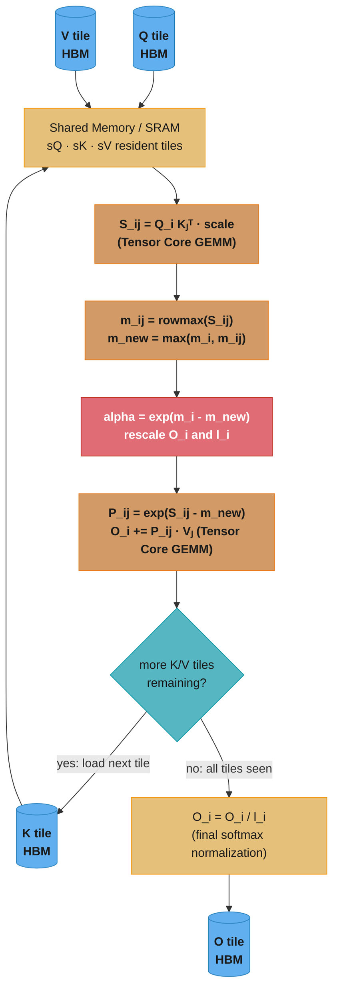
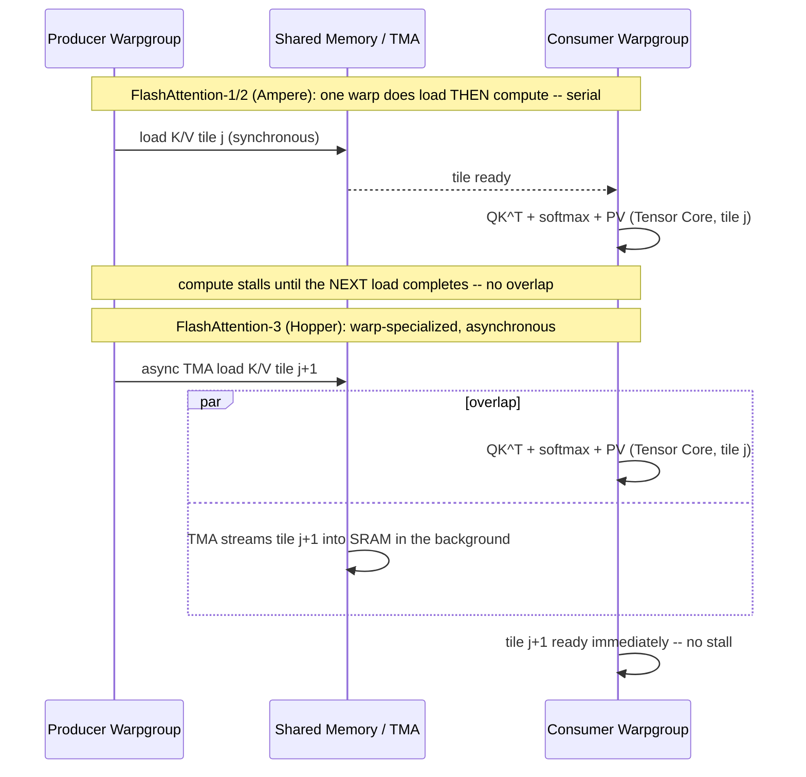

# Case Study: Build a FlashAttention Kernel

## Intuition

> **Design intuition**: Naive attention is a factory that builds a giant intermediate warehouse — the full `N x N` score matrix — just to read it once, transform it, and throw it away. Every unit stored and retrieved from that warehouse costs a slow trip to HBM (off-chip memory), and for long sequences the warehouse is bigger than the useful work done inside it. FlashAttention's insight is to never build the warehouse at all: stream `Q`, `K`, `V` through on-chip SRAM in tiles, keep a running (online) softmax as each tile arrives, and only ever write the final `[N, d]` output to HBM. The math computed is *identical* to standard attention — this is not an approximation — only the memory traffic pattern changes.

**Key insight**: Naive attention is **memory-bound** because materializing `S = QK^T` and `P = softmax(S)` forces `O(N^2)` bytes of HBM writes and reads that carry almost no arithmetic per byte moved. FlashAttention is **IO-aware**: by tiling the computation to fit in on-chip SRAM (shared memory + registers) and using the online-softmax recurrence to combine partial results correctly across tiles, it fuses the entire attention computation — QK^T, softmax, and PV — into a single kernel that touches HBM only for `Q`, `K`, `V`, and `O`. HBM traffic drops from `O(N^2)` to roughly `O(N^2/M)` where `M` is the tile size, and the kernel's arithmetic intensity rises enough to approach the compute roof instead of the memory roof.

**Non-overlap note**: this file is the **kernel** underneath [`../../llm/case_studies/design_gpu_inference_platform.md`](../../llm/case_studies/design_gpu_inference_platform.md). That case study designs the *serving platform* around attention as a black box — multi-tenant scheduling, PagedAttention KV-cache paging, MBU-based autoscaling, LoRA multiplexing across GPUs. It never asks how the attention operator itself achieves its throughput. This file cracks that box open: it builds the fused CUDA/Triton kernel that makes attention fast in the first place, so that the serving platform has a fast primitive to schedule around. Read the platform case study for *how many GPUs and how to route requests*; read this one for *what happens inside a single attention call on a single GPU*.

---

## 1. Requirements Clarification

### Functional Requirements

- Compute **exact** scaled dot-product attention `softmax(QK^T / sqrt(d)) V` for a batch of `(Q, K, V)` tensors — no approximation, no sparsity shortcuts. Numerical output must match a naive PyTorch reference to within floating-point tolerance.
- Support both **causal** (decoder, left-to-right) and **non-causal** (encoder, bidirectional) masking.
- Support **forward pass** for both training and inference, and a **backward pass** for training (gradient w.r.t. `Q`, `K`, `V`).
- Support **FP16 and BF16** input/output dtypes with FP32 internal accumulation (the standard mixed-precision training/inference setup).
- Support sequence lengths from `N = 128` (short prompts) to `N = 128K` (long-context models) without the memory blowing up superlinearly.
- Support the standard head dimensions used in production models: `d = 64`, `d = 128` (LLaMA, GPT-family), and `d = 256` (some MoE variants).
- Support **multi-query (MQA)** and **grouped-query (GQA)** attention shapes where the number of K/V heads is smaller than the number of Q heads (the K/V load is shared across a group of Q heads) — this is orthogonal to the fusion technique itself but affects the launch grid.
- Support **variable-length sequences within a batch** (ragged/packed batching, no wasted compute on padding tokens) via a cumulative-sequence-length index (`cu_seqlens`), the standard interface `flash-attn`'s `varlen` entry point exposes.
- Expose both a **fixed-shape entry point** (`[B, H, N, D]` dense tensors, simplest to reason about) and a **KV-cache-append entry point** for decode (append one new token's `K`/`V` to an existing cache and attend against the whole cache in one call) — the two call patterns share the same fused-kernel core but differ in grid shape.

### Non-Functional Requirements

- **Correctness first**: bitwise-exact-in-spirit (tolerance-bounded) agreement with the mathematical definition of attention — this is a fused *exact* kernel, not an approximation like linear attention or sparse attention.
- **Memory**: peak activation memory for the forward pass must be `O(N)` per sequence, not `O(N^2)` — this is the entire point of the exercise. The `N x N` score matrix must never be materialized in HBM.
- **Throughput target**: on an A100 (312 TFLOP/s FP16 Tensor Core peak), a production-grade kernel should sustain 50-73% of peak FLOP/s for realistic shapes (`N=4096`, `d=128`) — this is the actual measured range for FlashAttention-2 on A100. On H100, FlashAttention-3 sustains 63-75% of the 989 TFLOP/s FP16 peak (1.5 PFLOP/s with FP8 sparsity variants excluded).
- **Latency**: for inference decode (`N_query=1` against a growing KV cache), the kernel must remain HBM-bandwidth-bound on the KV-cache read (this is the fundamentally different regime from training-time attention — see [Design a Multi-Tenant GPU Inference Platform §2](../../llm/case_studies/design_gpu_inference_platform.md) for how that shapes fleet sizing).
- **Portability**: must compile and run correctly on Ampere (A100, compute capability 8.0) and Hopper (H100, compute capability 9.0), with Hopper able to additionally exploit warp-specialization, the Tensor Memory Accelerator (TMA), and FP8.
- **Determinism boundary**: forward-pass results must be reproducible run-to-run on the *same* GPU architecture and kernel build; bit-identical reproduction across different GPU architectures, tile sizes, or kernel versions is explicitly not required (floating-point accumulation order legitimately differs) — see [`./cross_cutting/numerical_precision_and_determinism.md`](./cross_cutting/numerical_precision_and_determinism.md) for what determinism guarantee is actually achievable and how to test for it.

### Out of Scope

- Multi-tenant scheduling, request batching policy, KV-cache paging across requests (owned by [`design_gpu_inference_platform.md`](../../llm/case_studies/design_gpu_inference_platform.md) and by vLLM's PagedAttention, which is a *scheduling* structure that sits on top of a fast attention kernel like this one).
- Approximate/sparse attention variants (sliding window, ALiBi decay, linear attention/SSMs) — those trade exactness for asymptotic complexity and are covered in [`../../llm/foundations_and_architecture/attention_mechanisms.md`](../../llm/foundations_and_architecture/attention_mechanisms.md) and [`../../llm/foundations_and_architecture/state_space_models_and_linear_attention.md`](../../llm/foundations_and_architecture/state_space_models_and_linear_attention.md).
- Quantized (INT8/FP8) attention variants beyond the FP8 mention in FlashAttention-3 — full quantized-kernel treatment lives in `optimize_llm_inference_kernels.md`.
- The transformer architecture itself (why attention, multi-head projection, positional encoding) — see [`../../llm/foundations_and_architecture/README.md`](../../llm/foundations_and_architecture/README.md); this file assumes `softmax(QK^T/sqrt(d))V` is already understood and focuses purely on how to *compute it fast on a GPU*.

---

## 2. Scale Estimation

### The Core Argument: Naive Attention Is Memory-Bound

Naive (two-pass) attention writes and reads the full `N x N` intermediate matrices to and from HBM three times: once to write `S = QK^T`, once to read `S` back for the softmax, once to write `P = softmax(S)`, and once to read `P` back for the `PV` matmul.

```
Naive attention HBM traffic for the S/P intermediates, per (batch, head):

  write S = QK^T           : N^2 elements
  read  S  (for softmax)   : N^2 elements
  write P = softmax(S)     : N^2 elements
  read  P  (for PV)        : N^2 elements
  --------------------------------------------------
  Total S/P traffic        : 4 x N^2 elements = 8 x N^2 bytes (fp16, 2B/elem)

Worked example: N = 8192, fp16
  8 x 8192^2 = 536,870,912 bytes = 512 MiB    <- PER HEAD, S/P traffic ONLY
                                                  (excludes Q/K/V/O, which are
                                                  only O(N x d), much smaller)

Scale to a GPT-3-class model: H = 32 heads/layer, L = 80 layers
  512 MiB x 32 heads x 80 layers = 1.28 TiB of HBM traffic
  for the S/P intermediates alone, for ONE forward pass over ONE sequence

At H100 HBM3 bandwidth (~3 TB/s):
  1.28 TiB / 3 TB/s = 1,441 GB / 3,000 GB/s ~= 480 ms

Compare to the actual matmul FLOPs for the same shapes:
  QK^T + PV FLOPs = 4 x N^2 x d = 4 x 8192^2 x 128 ~= 34.4 GFLOP per head
  x 32 heads x 80 layers = 88.1 TFLOP total compute
  At H100 FP16 Tensor Core peak (~989 TFLOP/s): 88.1 / 989 ~= 89 ms of PURE compute

  480 ms of S/P HBM traffic vs. 89 ms of matmul compute: the naive kernel is
  ~5.4x MORE TIME-DOMINATED by moving the intermediate matrix than by doing
  the actual arithmetic. This is the textbook definition of memory-bound.
```

### FlashAttention: HBM Traffic Drops by the Tile-Size Factor

FlashAttention never writes `S` or `P` to HBM — they live only in on-chip SRAM (shared memory) and registers, tile by tile. HBM traffic becomes: read `Q` once, re-read `K`/`V` tiles once per outer `Q`-tile iteration, write `O` once.

```
FlashAttention HBM traffic, per (batch, head), tile size Br = Bc = M:

  Q read once                        : N x d elements
  K, V re-read per Q-tile            : (N / Br) x N x d x 2 (K and V) elements
  O written once                     : N x d elements
  --------------------------------------------------------------------------
  Dominant term (K/V re-reads)       : O(N^2 x d / M)     <- the N^2 term SHRINKS
                                                               by the tile size M

Worked example: N = 8192, d = 128, M = Br = 128, fp16
  K/V re-reads = (8192/128) x 8192 x 128 x 2 x 2 bytes
               = 64 x 8192 x 128 x 4 bytes
               = 268,435,456 bytes = 256 MiB     <- per head

  Compare: naive S/P traffic was 512 MiB per head (and that excluded the
  actual QK^T/PV matmul cost, which both kernels pay identically).
  FlashAttention's 256 MiB of K/V re-reads is already smaller than just the
  intermediate-matrix traffic naive attention pays on top of its own matmuls
  — and critically, FlashAttention's number keeps SHRINKING as tile size M
  grows, while naive attention's O(N^2) term is FIXED regardless of tile size
  (there is no tile size in the naive algorithm; S and P are simply too big
  for SRAM and must live in HBM).

  At H100 HBM3 (~3 TB/s): 256 MiB x 32 heads x 80 layers = 640 GiB total
  640 GiB / 3 TB/s ~= 229 ms  <- vs. naive's 480 ms for S/P alone
  Total wall time is now dominated by the ~89 ms of Tensor Core matmul work
  plus this reduced HBM traffic, overlapped via double-buffered tile loads —
  pushing the kernel toward the COMPUTE roof instead of the memory roof.
```

### Why This Is an Arithmetic-Intensity Argument

Arithmetic intensity is FLOPs moved per byte of HBM traffic. Naive attention's `S`/`P` traffic does essentially zero extra FLOPs per byte beyond the softmax's elementwise `exp` — an intensity near the bottom of the roofline, deep in memory-bound territory. FlashAttention fuses `QK^T`, softmax, and `PV` into one pass over each tile: for a `Br x Bc` block it performs `2 x Br x Bc x d` FLOPs (QK^T) plus softmax plus `2 x Br x Bc x d` FLOPs (PV) while only moving a `Bc x d` K/V tile (plus the resident `Q`/`O` tile) from HBM — arithmetic intensity now scales with `Br`, and grows as the tile size grows. See [`./cross_cutting/roofline_and_arithmetic_intensity.md`](./cross_cutting/roofline_and_arithmetic_intensity.md) for the formal ridge-point derivation of where a kernel crosses from memory-bound to compute-bound.

### Shared-Memory Tile Footprint (the "KV size numbers")

```
Per-CTA (thread block) shared memory budget for Br = Bc = 128, d = 128, fp16:

  sQ  tile: 128 rows x 128 dim x 2 bytes = 32,768 bytes  = 32 KiB
  sK  tile: 128 rows x 128 dim x 2 bytes = 32,768 bytes  = 32 KiB
  sV  tile: 128 rows x 128 dim x 2 bytes = 32,768 bytes  = 32 KiB
  O accumulator (fp32, resident in registers or shared): 128 x 128 x 4 bytes = 65,536 bytes = 64 KiB
  running m_i, l_i (fp32, one per query row): 128 x 4 bytes x 2 = 1,024 bytes (negligible)
  --------------------------------------------------------------------------
  Total per CTA                                          ~= 160 KiB (161,792 bytes)

Budget check against hardware limits:
  A100:  164 KB usable shared memory/SM (192 KB physical, minus L1 carve-out)
         160 KiB fits with ~4 KB headroom -> exactly ONE resident CTA per SM
         at this tile size; occupancy is capped by shared memory, not registers.
  H100:  227 KB usable shared memory/SM
         160 KiB leaves ~67 KB headroom -> room for double-buffering K/V tiles
         (prefetch tile j+1 while computing on tile j) without exceeding budget.

This is why tile size is a first-order design decision (see Section 5): a
tile size chosen purely to maximize arithmetic intensity can blow the shared
memory budget and collapse occupancy to a single resident block per SM.
```

See also: [`./cross_cutting/cuda_memory_hierarchy_reference.md`](./cross_cutting/cuda_memory_hierarchy_reference.md) for the full registers/shared/L2/HBM latency-bandwidth table this section's numbers are drawn from.

### Training/Prefill vs. Decode: Two Different Roofline Regimes

Everything above analyzes the **prefill** regime — a full `N`-token sequence attending to itself, where `N` is large enough that the `O(N^2)` intermediate matters. **Decode** (one new token attending to a growing KV cache during autoregressive generation) is a fundamentally different shape: the query tile is a single row (`Br = 1`), so there is no `N^2` term to eliminate at all — the entire cost is reading the accumulated KV cache once from HBM.

```
Decode-step KV-cache read, per layer, GQA with H_kv key/value heads:

  bytes_per_token = 2 (K and V) x H_kv x d x 2 bytes (fp16)

  LLaMA-3 70B: H_kv = 8 (grouped-query, 64 query heads / 8 groups), d = 128
  bytes_per_token = 2 x 8 x 128 x 2 = 4,096 bytes/token/layer
  x 80 layers = 327,680 bytes = 320 KiB/token, whole-model KV cache

  At context length N = 32,768: 320 KiB x 32,768 = 10 GiB of KV cache to read
  from HBM for EVERY decode step, regardless of how fused the attention kernel
  is -- there is no intermediate matrix to eliminate in decode; Br=1 means the
  "fusion" win from Sections 4a-4d essentially does not apply, because naive
  decode attention never materializes an N x N matrix in the first place
  (only an N x 1 x N score vector, already tiny).

  At H100 HBM3 (~3 TB/s): 10 GiB / 3 TB/s ~= 3.3 ms per decode step, PURELY
  from reading the KV cache -- this is why decode is bandwidth-bound on KV-
  cache size, not on attention kernel fusion, and why GQA (fewer K/V heads)
  is the dominant lever for decode throughput, not tiling strategy.
```

This is the precise reason [`design_gpu_inference_platform.md`](../../llm/case_studies/design_gpu_inference_platform.md) sizes its GPU fleet around KV-cache HBM occupancy (MBU) rather than kernel FLOP/s: at decode time, this file's fusion technique has already done its job during prefill, and the remaining bottleneck is a pure memory-bandwidth problem over the KV cache that PagedAttention's paging strategy manages, not a kernel-fusion problem this file's tiling addresses.

---

## 3. High-Level Architecture



The critical property this diagram makes visible: **there is no arrow from `QK`, `RM`, `RESC`, or `PV` back to HBM.** `S_ij`, `P_ij`, the running max `m_i`, and the running denominator `l_i` all stay inside the shared-memory/register loop for the entire inner iteration over `K`/`V` tiles — HBM traffic is limited to the `Q`/`K`/`V` tile loads and the single final `O` write. The red `RESC` node marks the online-softmax rescale step as the correctness-critical operation (Section 9 catalogs the bugs that happen when it is implemented wrong).

### Where This Sits in a Model's Forward Pass

```
Transformer decoder layer (one of L layers)
+----------------------------------------------------------+
|  LayerNorm -> [Q,K,V projections] -> FlashAttention kernel |  <- this case study
|             (this file)            -> output projection    |
|  Residual add -> LayerNorm -> FFN -> Residual add           |
+----------------------------------------------------------+

FlashAttention is invoked once per layer, per forward pass, per training step
(and once per decode step at inference, against a growing KV cache). Everything
above and below the kernel — projections, LayerNorm, FFN, the KV cache paging
strategy across requests — is out of scope here; see Section 1's "Out of Scope."
```

---

## 4. Component Deep Dives

### 4a. The Naive Two-Pass Attention — and Why It Is HBM-Bound

The textbook attention implementation computes the full score matrix, applies softmax as a separate kernel launch (or a separate pass within one kernel), then does the `PV` matmul:

```python
# BROKEN (for anything beyond short sequences): materialize-then-softmax
# attention. Mathematically correct, but the full N x N score matrix is
# written to and read from HBM THREE separate times (see Section 2 for the
# exact byte counts).
def naive_attention(q, k, v, scale):
    s = (q @ k.transpose(-2, -1)) * scale     # [B, H, N, N] materialized in HBM
    p = torch.softmax(s, dim=-1)              # reads all of s, writes all of p
    return p @ v                              # reads all of p, plus v

# At N = 32,768, d = 128, fp16, B = 1, H = 32:
#   s and p are each 32768^2 x 2 bytes = 2.1 GiB PER HEAD
#   -> 68 GiB total for 32 heads just for the intermediate score matrix.
#   A single H100 (80 GB HBM) cannot hold this alongside model weights and
#   the KV cache -> torch.cuda.OutOfMemoryError at long context, well before
#   the model itself would be memory-constrained.
```

The failure mode is not subtle: it is a hard `OutOfMemoryError` at long context, and even when it fits (short sequences), it is slow because — as shown in Section 2 — the S/P HBM traffic dominates wall-clock time over the actual matmul FLOPs. Every optimization in this file exists to eliminate this materialization.

### 4b. Tiling Q/K/V Into Shared Memory

The fix starts with the same trick used in every tiled-GEMM kernel (see `optimize_matrix_multiplication_kernel.md`): partition the problem into blocks that fit in on-chip SRAM. Split `Q` into row-tiles of size `Br` (the "outer loop," one CTA per `Q`-tile) and split `K`/`V` into column-tiles of size `Bc` (the "inner loop," streamed one tile at a time into shared memory). For each `Q`-tile, the kernel loops over all `K`/`V` tiles, computing a `Br x Bc` block of scores at a time — small enough that `S_ij` and `P_ij` for that block live entirely in registers/shared memory and never need to be written back to HBM.

This alone is not sufficient, though: softmax is a *row-wise* normalization over the **entire** row of `N` scores, and the kernel is only looking at `Bc` columns at a time. Naively normalizing each block independently would produce the wrong answer — this is exactly the problem the online-softmax trick solves.

### 4c. The Online-Softmax Rescaling Trick — the Mathematical Heart

Standard softmax requires the row max and row sum of the **whole** row before it can normalize any element (`softmax(x)_i = exp(x_i - max(x)) / sum_j exp(x_j - max(x))`). The online-softmax recurrence lets the kernel process `K`/`V` tiles one at a time, maintaining a **running max** `m_i` and **running (rescaled) sum** `l_i` per query row, and correcting the previously-accumulated output whenever the running max changes.

For query-tile row `i`, processing `K`/`V` tile `j` (`S_ij` = this block's `Br x Bc` scores):

```
m_ij      = rowmax(S_ij)                       # local max of this block, per row
m_i_new   = max(m_i, m_ij)                     # updated running max

P_ij      = exp(S_ij - m_i_new)                # this block's probabilities,
                                                # rescaled against the NEW max
l_ij      = rowsum(P_ij)

alpha     = exp(m_i - m_i_new)                 # correction factor for
                                                # everything accumulated so far

l_i_new   = alpha * l_i + l_ij                 # rescale old denominator, add new
O_i_new   = alpha * O_i + P_ij @ V_j            # rescale old numerator, add new

m_i <- m_i_new ;  l_i <- l_i_new ;  O_i <- O_i_new
```

After the last `K`/`V` tile: `O_i <- O_i / l_i` — a single final division, done once per row, not once per tile. The correction factor `alpha = exp(m_i - m_i_new)` is what makes this *exactly* equal to a one-pass softmax over the full row: whenever a later tile reveals a bigger max than everything seen so far, the entire accumulated numerator and denominator are rescaled down by `exp(old_max - new_max)` before the new tile's contribution is added, so the final result is identical to having known the true global max from the start. This is the same idea as "log-sum-exp" streaming aggregation used in numerically stable softmax implementations, extended to also carry a running weighted sum (`O_i`), not just a running scalar.

### 4d. The Fused Kernel — CUDA C++ Sketch

Before the code, the causal early-exit referenced throughout this section (`hi_tile` in the CUDA sketch below, `hi` in the Triton kernel) is easiest to see as a grid over `(Q-tile, K-tile)` pairs:

```
Causal tile-skip grid: Q-tile row i vs. K-tile column j (6 tiles shown, Br=Bc)

       j=0    j=1    j=2    j=3    j=4    j=5
i=0  [ D  ][ .  ][ .  ][ .  ][ .  ][ .  ]
i=1  [ F  ][ D  ][ .  ][ .  ][ .  ][ .  ]
i=2  [ F  ][ F  ][ D  ][ .  ][ .  ][ .  ]
i=3  [ F  ][ F  ][ F  ][ D  ][ .  ][ .  ]
i=4  [ F  ][ F  ][ F  ][ F  ][ D  ][ .  ]
i=5  [ F  ][ F  ][ F  ][ F  ][ F  ][ D  ]

F = fully computed, no in-block masking needed (j < i: every key in the tile
    precedes every query in the tile)
D = diagonal block, computed WITH in-block masking (j == i: some keys in the
    tile follow some queries in the tile -- the partial-mask case)
. = SKIPPED ENTIRELY -- never loaded from HBM, never multiplied (j > i: every
    key in the tile follows every query in the tile, contributing nothing)
```

At 6 tiles per row, 15 of 36 blocks are `F`, 6 are `D`, and 15 are skipped (`.`) — as the number of tiles grows, the skipped fraction approaches one half, matching the "roughly half the FLOPs" claim in Sections 5 and 9. The CUDA and Triton kernels below implement exactly this grid: the outer loop over `j` simply never executes past `i` (the `hi_tile`/`hi` bound), so the `.` cells cost nothing — not a masked-to-zero computation, but a loop iteration that never happens.

```cuda
// Simplified FlashAttention forward kernel (single head, illustrative).
// One CTA owns one Q-tile of Br rows; loops over all Bc-wide K/V tiles.
// NOTE: for clarity this sketch gives one thread per query row and lets that
// thread own the full d-wide accumulator in registers -- real kernels instead
// tile threads across BOTH Br and d and route the QK^T/PV GEMMs through
// Tensor Cores (mma.sync / wgmma fragments -- see Section 4e), which is why
// production kernels (FlashAttention-2/3, CUTLASS FMHA) look more like a
// templated GEMM than this sketch. The MATH -- the online-softmax recurrence
// -- is identical in both.

#define BR 128          // query tile rows
#define BC 128          // key/value tile cols
#define D  128          // head dimension

__global__ void flash_attention_fwd(
    const half*  __restrict__ Q,   // [N, D]
    const half*  __restrict__ K,   // [N, D]
    const half*  __restrict__ V,   // [N, D]
    float*       __restrict__ O,   // [N, D] output (fp32)
    int N, float scale /* = 1/sqrt(D) */, bool causal)
{
    extern __shared__ half smem[];
    half* sQ = smem;                 // [BR][D]
    half* sK = sQ + BR * D;          // [BC][D]
    half* sV = sK + BC * D;          // [BC][D]

    int tid        = threadIdx.x;                  // 0..BR-1: one query row/thread
    int q_tile     = blockIdx.x;                   // which Br-row block of Q
    int row_global = q_tile * BR + tid;

    float m_i = -INFINITY;           // running row max
    float l_i = 0.0f;                // running row denominator
    float acc[D];                    // running (unnormalized) output row
    for (int d = 0; d < D; ++d) acc[d] = 0.0f;

    for (int d = 0; d < D; ++d)
        sQ[tid * D + d] = Q[row_global * D + d];
    __syncthreads();

    // Causal early-exit: never scan K/V tiles entirely past the diagonal
    // (see Section 5 -- this halves the FLOPs for causal attention).
    int hi_tile = causal ? (q_tile + 1) : ((N + BC - 1) / BC);

    for (int j = 0; j < hi_tile; ++j) {
        for (int c = tid; c < BC; c += blockDim.x)
            for (int d = 0; d < D; ++d) {
                sK[c * D + d] = K[(j * BC + c) * D + d];
                sV[c * D + d] = V[(j * BC + c) * D + d];
            }
        __syncthreads();

        // S_ij = Q_i . K_j^T * scale (this row against all BC columns of the tile)
        float s_row[BC];
        float m_ij = -INFINITY;
        for (int c = 0; c < BC; ++c) {
            if (causal && (j * BC + c) > row_global) { s_row[c] = -INFINITY; continue; }
            float dot = 0.0f;
            for (int d = 0; d < D; ++d)
                dot += __half2float(sQ[tid * D + d]) * __half2float(sK[c * D + d]);
            s_row[c] = dot * scale;
            m_ij = fmaxf(m_ij, s_row[c]);
        }

        // --- online-softmax update (Section 4c) ---
        float m_new = fmaxf(m_i, m_ij);
        float alpha = __expf(m_i - m_new);          // rescale factor for OLD state
        float l_ij  = 0.0f;
        float p_row[BC];
        for (int c = 0; c < BC; ++c) {
            p_row[c] = __expf(s_row[c] - m_new);
            l_ij += p_row[c];
        }
        l_i = alpha * l_i + l_ij;

        for (int d = 0; d < D; ++d) {
            float pv = 0.0f;
            for (int c = 0; c < BC; ++c)
                pv += p_row[c] * __half2float(sV[c * D + d]);
            acc[d] = alpha * acc[d] + pv;            // rescale old + accumulate new
        }
        m_i = m_new;
        __syncthreads();   // sK/sV about to be overwritten by the next tile's load
    }

    for (int d = 0; d < D; ++d)
        O[row_global * D + d] = acc[d] / l_i;        // final normalization
}
```

### The Triton Implementation — How Real FlashAttention Kernels Are Often Written

Triton's block-level programming model maps naturally onto this tiling structure: `tl.load`/`tl.store` express the shared-memory tile loads, and `tl.dot` compiles to Tensor Core `mma`/`wgmma` instructions automatically. This is close to the structure of the official Triton FlashAttention tutorial kernel and the Triton backend shipped with several production inference engines.

```python
import torch
import triton
import triton.language as tl


@triton.jit
def _flash_attn_fwd_kernel(
    Q, K, V, O,                       # pointers, [B, H, N, D] contiguous
    stride_qb, stride_qh, stride_qn, stride_qd,
    stride_kb, stride_kh, stride_kn, stride_kd,
    stride_vb, stride_vh, stride_vn, stride_vd,
    stride_ob, stride_oh, stride_on, stride_od,
    N, D: tl.constexpr,
    scale: tl.constexpr,
    BLOCK_M: tl.constexpr,             # Br
    BLOCK_N: tl.constexpr,             # Bc
    CAUSAL: tl.constexpr,
):
    pid_m  = tl.program_id(0)          # which Q-tile this program instance owns
    pid_bh = tl.program_id(1)          # which (batch, head)

    q_offset = pid_bh * stride_qh
    k_offset = pid_bh * stride_kh
    v_offset = pid_bh * stride_vh
    o_offset = pid_bh * stride_oh

    m_range = pid_m * BLOCK_M + tl.arange(0, BLOCK_M)
    d_range = tl.arange(0, D)

    q_ptrs = Q + q_offset + m_range[:, None] * stride_qn + d_range[None, :] * stride_qd
    q = tl.load(q_ptrs, mask=m_range[:, None] < N, other=0.0)   # resident Q tile

    m_i = tl.full((BLOCK_M,), value=float("-inf"), dtype=tl.float32)  # running max
    l_i = tl.zeros((BLOCK_M,), dtype=tl.float32)                      # running denom
    acc = tl.zeros((BLOCK_M, D), dtype=tl.float32)                    # running O_i

    # Causal early-exit: never scan past the diagonal block (Section 5)
    hi = (pid_m + 1) * BLOCK_M if CAUSAL else N

    for start_n in range(0, hi, BLOCK_N):
        n_range = start_n + tl.arange(0, BLOCK_N)
        k_ptrs = K + k_offset + n_range[:, None] * stride_kn + d_range[None, :] * stride_kd
        v_ptrs = V + v_offset + n_range[:, None] * stride_vn + d_range[None, :] * stride_vd
        k = tl.load(k_ptrs, mask=n_range[:, None] < N, other=0.0)
        v = tl.load(v_ptrs, mask=n_range[:, None] < N, other=0.0)

        s = tl.dot(q, tl.trans(k)) * scale               # [BLOCK_M, BLOCK_N] -- Tensor Core GEMM
        if CAUSAL:
            causal_mask = m_range[:, None] >= n_range[None, :]
            s = tl.where(causal_mask, s, float("-inf"))

        m_ij  = tl.max(s, axis=1)                        # local row max, this tile
        m_new = tl.maximum(m_i, m_ij)                     # updated running max
        alpha = tl.exp(m_i - m_new)                       # rescale factor, old state
        p     = tl.exp(s - m_new[:, None])                # this tile's unnorm. probs

        l_i = alpha * l_i + tl.sum(p, axis=1)             # updated running denominator
        acc = acc * alpha[:, None] + tl.dot(p.to(v.dtype), v)  # rescale + accumulate -- Tensor Core GEMM
        m_i = m_new

    acc = acc / l_i[:, None]                              # final softmax normalization

    o_ptrs = O + o_offset + m_range[:, None] * stride_on + d_range[None, :] * stride_od
    tl.store(o_ptrs, acc, mask=m_range[:, None] < N)


def flash_attention(q, k, v, causal=False, block_m=128, block_n=128):
    """q, k, v: [B, H, N, D] contiguous CUDA tensors (fp16/bf16). Returns fp32 O."""
    B, H, N, D = q.shape
    o = torch.empty((B, H, N, D), device=q.device, dtype=torch.float32)
    scale = 1.0 / (D ** 0.5)
    grid = (triton.cdiv(N, block_m), B * H)
    _flash_attn_fwd_kernel[grid](
        q, k, v, o,
        *q.stride(), *k.stride(), *v.stride(), *o.stride(),
        N, D, scale, block_m, block_n, causal,
    )
    return o
```

```python
# FIX (paired with the BROKEN naive_attention in 4a): fused, tiled, online-
# softmax attention -- S and P never leave SRAM/registers; HBM only ever
# sees Q, K, V, and O.
o = flash_attention(q, k, v, causal=True)
# Identical math (exact softmax attention) to naive_attention(q, k, v, scale),
# but O(N) activation memory instead of O(N^2), and no OOM at N = 32,768.
```

### Backward Pass: Recompute Instead of Store

Training requires gradients w.r.t. `Q`, `K`, `V`. The naive instinct — save `P_ij` from the forward pass so the backward pass can reuse it — reintroduces exactly the `O(N^2)` memory the forward kernel worked to eliminate (Section 9 catalogs this as a common first-draft mistake). The fix stores only the scalar-per-row logsumexp `L_i = m_i + ln(l_i)` from the forward pass (`O(N)` memory, negligible) and recomputes `S_ij`/`P_ij` inside the backward kernel's own tile loop:

```python
# Backward pass sketch (Triton-shaped pseudocode). dO is the incoming gradient
# w.r.t. O; L is the O(N) logsumexp saved from the forward pass -- NOT the
# O(N^2) P matrix.
def flash_attention_bwd(q, k, v, o, do, L, scale, causal):
    dq = torch.zeros_like(q)
    dk = torch.zeros_like(k)
    dv = torch.zeros_like(v)

    for j in range(num_kv_tiles):                       # outer loop over K/V tiles now
        k_j, v_j = k[j], v[j]
        dk_j = torch.zeros_like(k_j)
        dv_j = torch.zeros_like(v_j)

        for i in range(num_q_tiles_touching(j, causal)):  # inner loop over Q tiles
            q_i, o_i, do_i, L_i = q[i], o[i], do[i], L[i]

            s_ij = (q_i @ k_j.transpose(-2, -1)) * scale  # RECOMPUTED, not stored
            p_ij = torch.exp(s_ij - L_i[:, None])         # exact: L_i already
                                                           # encodes the true row max/sum

            dv_j += p_ij.transpose(-2, -1) @ do_i
            dp_ij = do_i @ v_j.transpose(-2, -1)
            d_i = (do_i * o_i).sum(-1, keepdim=True)      # row-wise D_i = rowsum(dO * O)
            ds_ij = p_ij * (dp_ij - d_i) * scale           # softmax gradient identity

            dq[i] += ds_ij @ k_j                           # accumulate across all j tiles
            dk_j  += ds_ij.transpose(-2, -1) @ q_i

        dk[j] += dk_j
        dv[j] += dv_j
    return dq, dk, dv
```

The recompute costs roughly the same FLOPs as the forward pass's `QK^T` a second time — but that extra compute is cheap relative to the HBM traffic it avoids, which is the identical memory-bound argument from Section 2 applied to backward. This is also why FlashAttention's backward pass is the more complex of the two kernels to implement correctly: it needs `d_i = rowsum(dO * O)` (the softmax Jacobian-vector-product identity) computed once per row and broadcast into every tile's local gradient calculation, whereas the forward pass's online-softmax recurrence has no equivalent extra term.

### Multi-Query and Grouped-Query Attention: Launch Grid Changes

MQA (a single shared K/V head for all query heads) and GQA (K/V heads shared across a *group* of query heads, e.g. LLaMA-3 70B's 64 query heads mapped to 8 KV heads, an 8:1 ratio) do not change the tiling or online-softmax algorithm at all — they change which `K`/`V` tile a given `Q`-tile's kernel invocation loads. In the Triton kernel from Section 4d, this is a one-line change to the head-index computation: `kv_head = q_head // (num_q_heads // num_kv_heads)` before computing `k_offset`/`v_offset`, so that 8 query heads in a group all read identical `K`/`V` tiles from HBM (and, ideally, the same tiles stay resident in L2 cache across those 8 invocations rather than each independently re-reading from HBM). The forward/backward math is otherwise unchanged — this is purely a memory-traffic optimization on top of the fusion technique, reducing the KV-cache HBM footprint by the group ratio (8x for LLaMA-3 70B's decode-time KV cache, directly reducing the 320 KiB/token figure from this section's decode-regime analysis).

### 4e. Tensor Cores for the QK^T and PV Matmuls

Both matmuls inside the tile loop — `S_ij = Q_i K_j^T` and `O_i += P_ij V_j` — are ordinary small GEMMs (`Br x d` by `d x Bc`, and `Br x Bc` by `Bc x d`), and both are dispatched to Tensor Cores rather than scalar CUDA cores whenever the shapes and dtypes qualify (FP16/BF16 inputs, dimensions that are multiples of 8 or 16). In hand-written CUDA C++ this means loading `sQ`/`sK`/`sV` fragments with `wmma::load_matrix_sync` and issuing `wmma::mma_sync` (Ampere, `mma.sync.aligned.m16n8k16` at the PTX level) or, on Hopper, `wgmma.mma_async` warpgroup-wide asynchronous MMA instructions that additionally pull operands directly from shared memory without a register round-trip. In Triton, this mapping is implicit: `tl.dot(q, tl.trans(k))` and `tl.dot(p, v)` in the kernel above compile straight to the same `mma`/`wgmma` instruction selection the compiler would choose for a hand-tuned GEMM.

The reason this matters for FlashAttention specifically (beyond "matmuls are faster on Tensor Cores") is that FlashAttention-2 explicitly restructured the *non-matmul* work — the softmax rescale, the max/sum reductions — to be as cheap as possible relative to the matmul portion, because Tensor Core throughput on Ampere/Hopper is roughly an order of magnitude higher than the scalar/SFU throughput used for `exp` and reductions. A kernel that spends too much relative time on `RM`/`RESC` (Section 3's diagram) squanders the raw GEMM speed Tensor Cores provide — this is why FlashAttention-2 reduced non-matmul FLOPs and why FlashAttention-3 goes further and overlaps softmax computation on one warpgroup with Tensor Core GEMM work on another (Section 6). See [`../tensor_cores_and_mixed_precision/`](../tensor_cores_and_mixed_precision/) for the WMMA/`mma` programming model and precision-format details this section assumes.

---

## 5. Design Decisions & Tradeoffs

| Decision | Chosen Approach | Alternative Considered | Rationale |
|----------|-----------------|-------------------------|-----------|
| Tile size (`Br`, `Bc`) | 128 x 128 (FlashAttention-2 default for `d=128`) | Larger (256x256) for higher arithmetic intensity | 128x128 fits the ~160 KiB shared-memory footprint (Section 2) within one A100 SM's 164 KB budget; 256x256 would roughly quadruple shared memory and collapse occupancy well before the intensity gain paid off |
| Backward-pass activation storage | Store only the `O(N)` per-row logsumexp `L_i = m_i + ln(l_i)`; recompute `S_ij`/`P_ij` on the fly during backward | Store the full `O(N^2)` `P` matrix from the forward pass | Storing `P` defeats the entire memory point of FlashAttention — it OOMs at the same `N` naive attention would; recomputing costs extra FLOPs but those FLOPs are cheap relative to the HBM traffic saved (the same memory-bound argument from Section 2, applied to backward) |
| Precision | FP16/BF16 storage, FP32 internal accumulation for `S`, `P`, `m_i`, `l_i`, `O_i` | Full FP16 accumulation throughout | FP16 accumulation of a sum over `N` terms loses precision catastrophically at long context (the running sum `l_i` can silently underflow/round); FP32 accumulators cost negligible extra register pressure and eliminate this class of bug — see [`./cross_cutting/numerical_precision_and_determinism.md`](./cross_cutting/numerical_precision_and_determinism.md) |
| Causal masking | Skip entire `K`/`V` tiles that lie fully above the diagonal (early loop exit, as in the CUDA/Triton sketches above) | Compute the full `Br x Bc` block for every tile, then mask invalid entries to `-inf` | Skipping tiles cuts total FLOPs roughly in half for causal (decoder) attention, since on average half of all `(query, key)` pairs are masked out; masking-after-compute wastes that half of the matmul work entirely |
| Warp organization | FlashAttention-3: warp-specialization — dedicated "producer" warpgroups issue asynchronous TMA loads while "consumer" warpgroups run the `mma`/softmax pipeline | FlashAttention-1/2: uniform warps that both load and compute (SIMT-style, same warps do everything) | On Hopper, warp-specialization overlaps the traditionally serial load -> compute -> softmax -> compute chain across separate warpgroups, hiding softmax's non-matmul latency behind the next tile's Tensor Core GEMM — impossible on Ampere, which lacks TMA and asynchronous warpgroup MMA |
| Implementation language | Both: hand-written CUDA C++ for the reference/production kernel; Triton for portability and rapid iteration | CUTLASS-templated C++ only | CUTLASS/hand-written CUDA gets the last few percent of peak FLOP/s and full control over warp-specialization; Triton reaches ~90-95% of hand-tuned performance with 5-10x less code and compiles to multiple GPU vendors — see [`../triton_and_kernel_dsls/`](../triton_and_kernel_dsls/) for the full tradeoff |
| Fusion granularity | Single fused kernel for the entire `QK^T -> softmax -> PV` chain, one kernel launch | Separate kernels for `QK^T`, softmax, and `PV` (naive Section 4a structure) | Separate kernels force every intermediate through HBM (Section 2's entire argument); a single fused kernel is the mechanism, not just an optimization detail |
| GQA/MQA handling | Change the KV-head index computation in the existing kernel (Section 4's "Launch Grid Changes" subsection) | Write a separate specialized kernel for GQA shapes | GQA is purely a change to which tile is loaded, not to the tiling or online-softmax algorithm — a second kernel would duplicate the entire correctness surface (Section 9's bug catalog) for no algorithmic benefit |

---

## 6. Real-World Implementations

**FlashAttention (Dao, Fu, Ermon, Rudra, Ré — Stanford, 2022)**, "FlashAttention: Fast and Memory-Efficient Exact Attention with IO-Awareness," introduced the tiling + online-softmax fusion described in this file. It reported 2-4x wall-clock speedup and 5-20x memory reduction over standard PyTorch attention on GPT-2/BERT-scale training, and directly enabled context lengths (8K-16K at the time) that were previously infeasible due to `O(N^2)` activation memory.

**FlashAttention-2 (Dao, 2023)** restructured the parallelization to also split work across the sequence-length dimension (not just batch x heads), which matters enormously for long-context, small-batch inference where batch x heads alone leaves most SMs idle. It also reduced non-matmul FLOPs (Section 4e) and improved the inner-loop work partitioning between warps. Measured result: ~2x over FlashAttention-1, reaching 50-73% of A100's theoretical FP16 peak FLOP/s versus FlashAttention-1's 25-40%.

**FlashAttention-3 (Shah, Bikshandi, Karrenbauer, Li, Dao et al., 2024)** is Hopper-specific: it exploits warp-specialization (Section 5), asynchronous data movement via the **Tensor Memory Accelerator (TMA)**, and FP8 low-precision execution with an incoherent-processing technique to control quantization error. It reaches 63-75% of H100's 989 TFLOP/s FP16 peak (1.2-1.5x over FlashAttention-2 on the same hardware) and up to ~1.3 PFLOP/s in FP8 mode.



The diagram makes the FlashAttention-3 win concrete: on Ampere, the warp that computes tile `j` is the same warp that must then block waiting to load tile `j+1` — load and compute are serialized. On Hopper, a dedicated producer warpgroup issues the tile `j+1` load asynchronously via TMA *while* a separate consumer warpgroup is still computing on tile `j`, so the load latency is hidden behind compute rather than adding to the critical path — the mechanism behind FlashAttention-3's 1.2-1.5x improvement over FlashAttention-2 on identical Hopper hardware running the identical online-softmax algorithm.

**The Triton implementation** shown in Section 4d is close to the official Triton tutorial's `06-fused-attention.py`, which OpenAI maintains as a reference kernel and which several inference engines use directly (particularly on hardware where a hand-tuned CUDA extension is unavailable or unmaintained, e.g. some AMD ROCm deployments via Triton's HIP backend).

**CUTLASS's fused multi-head attention example** (`cutlass/examples/41_fused_multi_head_attention`, NVIDIA) is the templated-C++ reference implementation that maps this same tiling structure onto CUTLASS's GEMM abstraction, and several production kernels (including early FlashAttention CUDA backends) build directly on CUTLASS's warp-level MMA primitives rather than hand-rolling `wmma` calls.

**vLLM** ships a fork of FlashAttention's CUDA kernels (`vllm-flash-attn`) as the compute primitive underneath its own **PagedAttention** — PagedAttention is a KV-cache *memory layout* (non-contiguous paged blocks for multi-request batching), not a competing fusion technique; it calls into FlashAttention-style fused kernels per page. This is the precise seam between this file and [`design_gpu_inference_platform.md`](../../llm/case_studies/design_gpu_inference_platform.md): PagedAttention decides *which pages* to feed the kernel, FlashAttention decides *how fast the kernel runs once fed*.

**xFormers' `memory_efficient_attention`** (Meta) implemented a very similar tiled, IO-aware attention kernel independently and around the same period, and was the default fast-attention backend for Stable Diffusion and many training frameworks before FlashAttention became the more widely adopted standard; the two approaches converged on nearly identical tiling/online-softmax designs.

**PyTorch's `torch.nn.functional.scaled_dot_product_attention` (SDPA)**, since PyTorch 2.0, auto-dispatches to whichever fused backend is available and fastest for the given shapes/dtypes/hardware — FlashAttention's CUDA kernels, xFormers' memory-efficient backend, or a fallback "math" (naive, Section 4a) implementation when neither fused kernel supports the requested configuration (e.g. certain attention bias shapes).

**AMD's Composable Kernel (CK) FlashAttention port** and Triton's ROCm/HIP backend bring the same tiling and online-softmax design to AMD MI-series GPUs, following the non-overlap boundary noted in [`README.md` §2](../README.md) — the CUDA-native focus of this section means the ROCm-specific programming details live in [`../gpu_portability_hip_sycl_and_beyond/`](../gpu_portability_hip_sycl_and_beyond/), while the algorithm this file describes is identical across vendors: fuse, tile, and never materialize the `N x N` matrix.

**Flash-Decoding (Dao, Häggström, Rush et al., 2023)** extends this file's fusion technique specifically to the decode-regime bottleneck identified in Section 2: at `Br=1` (single query token) the standard FlashAttention parallelization — one CTA per Q-tile — launches far too few CTAs to occupy a full GPU, since there is only one Q-tile total per (batch, head). Flash-Decoding instead splits the *KV-cache dimension* across multiple CTAs (each handling a slice of the cached `K`/`V`), computes partial online-softmax results per slice, and does a final lightweight reduction across slices to combine them — turning an under-parallelized decode step into one with enough concurrent CTAs to saturate the GPU's SMs, directly addressing the low-occupancy failure mode that plain FlashAttention hits at `Br=1`.

---

## 7. Technologies & Tools

| Tool | Role | Notes |
|------|------|-------|
| `flash-attn` (Dao-AILab/flash-attention) | Reference CUDA implementation, PyPI package with CUDA extension | The canonical hand-tuned CUDA kernel most inference engines and training frameworks import directly |
| Triton (OpenAI) | Python-embedded kernel DSL | `tl.dot` auto-maps to Tensor Core `mma`/`wgmma`; official tutorial kernel is the reference Triton FlashAttention |
| CUTLASS (NVIDIA) | Templated C++ GEMM/attention library | `examples/41_fused_multi_head_attention`; the substrate several production CUDA attention kernels are built on |
| cuDNN | NVIDIA's fused-attention operator (`cudnnFlashAttentionForward`) | Vendor-maintained fused MHA, used when a framework prefers a closed-source, hardware-optimized path over an open kernel |
| xFormers (Meta) | `memory_efficient_attention` | Independent IO-aware attention implementation; still used where its specific bias/mask shapes are supported and FlashAttention's are not |
| PyTorch SDPA | `torch.nn.functional.scaled_dot_product_attention` | Auto-dispatches to FlashAttention / xFormers / math backend; the practical entry point for most model code |
| Nsight Compute | Kernel-level profiler | Verifies achieved occupancy, DRAM throughput, and Tensor Core utilization match the design's predictions (Section 8) |
| vLLM / SGLang | Inference engines | Integrate FlashAttention-family kernels as the compute primitive beneath PagedAttention-style KV-cache scheduling |
| PyTorch FlexAttention | Compiler-generated fused attention (`torch.compile`-backed) | Lets users express custom score/mask modifications (ALiBi, sliding window) in plain PyTorch while still compiling down to a fused, tiled kernel — narrows the gap between "wants a custom attention variant" and "must hand-write a fused kernel" |
| JAX Pallas | JAX's Triton-like kernel DSL | JAX's own FlashAttention reference kernel is written in Pallas, mirroring the Triton kernel's block-level structure for the JAX/TPU-and-GPU ecosystem |
| Nsight Systems | Timeline-level profiler | Confirms kernel launches overlap correctly with host-side work and other streams — the system-level complement to Nsight Compute's per-kernel metrics |

---

## 8. Operational Playbook

### Correctness Validation

Every new kernel version (a precision change, a tile-size change, a port to a new GPU architecture) must pass a tolerance-bounded numerical comparison against a naive FP32 reference before it is considered correct — not a bitwise comparison, because FP16/BF16 accumulation order legitimately differs between the naive and fused implementations.

```python
import torch

def validate_flash_attention(flash_fn, N=4096, d=128, B=2, H=8, causal=True):
    q = torch.randn(B, H, N, d, device="cuda", dtype=torch.float16)
    k = torch.randn(B, H, N, d, device="cuda", dtype=torch.float16)
    v = torch.randn(B, H, N, d, device="cuda", dtype=torch.float16)

    ref = torch.nn.functional.scaled_dot_product_attention(
        q.float(), k.float(), v.float(), is_causal=causal
    )  # fp32 reference via the math backend
    out = flash_fn(q, k, v, causal=causal)

    torch.testing.assert_close(out.float(), ref, atol=2e-2, rtol=2e-2)
    # atol/rtol are loosened from the fp32 default (1e-5) to account for
    # legitimate fp16 accumulation-order differences -- NOT to paper over bugs.
    # A gradient check (finite differences on Q/K/V) is run identically for
    # the backward pass before any kernel version ships.
```

### Profile -> Fix -> Re-Measure Loop

Every tile-size or warp-organization change is validated with Nsight Compute before and after, checking three metrics against the design's predictions from Section 2: `sm__throughput.avg` (compute utilization, should approach the Tensor Core roof for large `N`), `dram__bytes.sum` (should scale as `O(N^2/M)`, not `O(N^2)` — a regression here means `S`/`P` leaked back to HBM somewhere), and `l1tex__data_bank_conflicts` (a nonzero count on the shared-memory tile loads flags padding bugs, Section 9). See [`./cross_cutting/nsight_profiling_workflow.md`](./cross_cutting/nsight_profiling_workflow.md) for the full guided-analysis walkthrough this loop follows.

### Benchmark Harness

```python
import time, torch

def benchmark(flash_fn, naive_fn, seq_lens=(512, 1024, 2048, 4096, 8192, 16384, 32768)):
    for N in seq_lens:
        q = torch.randn(1, 32, N, 128, device="cuda", dtype=torch.float16)
        k, v = torch.randn_like(q), torch.randn_like(q)

        torch.cuda.synchronize(); t0 = time.perf_counter()
        for _ in range(20): flash_fn(q, k, v, causal=True)
        torch.cuda.synchronize(); flash_ms = (time.perf_counter() - t0) / 20 * 1000

        try:
            torch.cuda.synchronize(); t0 = time.perf_counter()
            for _ in range(5): naive_fn(q, k, v, 1.0 / (128 ** 0.5))
            torch.cuda.synchronize(); naive_ms = (time.perf_counter() - t0) / 5 * 1000
        except torch.cuda.OutOfMemoryError:
            naive_ms = float("inf")   # expected at large N -- see Section 4a

        flops = 4 * 32 * N * N * 128       # QK^T + PV, causal factor ignored for simplicity
        tflops = flops / (flash_ms / 1000) / 1e12
        print(f"N={N:6d}  flash={flash_ms:8.2f}ms ({tflops:6.1f} TFLOP/s)  naive={naive_ms:8.2f}ms")
```

### Rollout Playbook for a New Kernel Version in a Serving Stack

A new FlashAttention build (new CUDA toolkit version, new tile size, new GPU architecture target) is never deployed fleet-wide directly: (1) it is validated offline against Section 8's correctness harness across the production model's shapes; (2) it is canaried on a small subset of serving replicas (matching the pattern in [`design_gpu_inference_platform.md`'s incident playbook](../../llm/case_studies/design_gpu_inference_platform.md)) while comparing output-quality metrics (perplexity on a golden eval set, or exact-match rate against the previous kernel version's outputs within tolerance) and p99 TTFT; (3) only after a bake period with no quality or latency regression does the new kernel version roll out fleet-wide. A CUDA-toolkit/PyTorch ABI mismatch in the compiled extension is the most common canary-stage failure — it typically manifests as either an immediate `undefined symbol` load error or, worse, silently wrong numerical output if the ABI mismatch happens to be binary-compatible but semantically different (e.g. a differing `half` type layout) — which is why the correctness harness runs in CI against every supported (CUDA version, PyTorch version, GPU architecture) combination, not just once at merge time.

### Cross-Architecture CI Matrix

Because the correctness harness (Section 8) and the kernel's own tile-size/warp-organization choices (Section 5) both vary by GPU architecture, the CI matrix that gates a kernel release covers every supported combination explicitly rather than assuming one architecture's pass implies another's:

| CUDA Toolkit | GPU Architecture | Warp Organization | FP8 Support | CI Status Gate |
|--------------|-------------------|--------------------|-------------|-----------------|
| 11.8 | Ampere (A100, cc 8.0) | Uniform warps (FlashAttention-1/2 style) | No | Correctness (Section 8) + benchmark regression < 3% |
| 12.x | Ampere (A100, cc 8.0) | Uniform warps | No | Same as above |
| 12.x | Hopper (H100, cc 9.0) | Warp-specialized (FlashAttention-3, TMA) | Yes | Correctness (both FP16 and FP8 tolerance bands) + benchmark regression < 3% |
| 12.x | Ada Lovelace (L40S, cc 8.9) | Uniform warps (no TMA) | Yes (4th-gen Tensor Core) | Correctness + benchmark regression < 5% (secondary-tier architecture, wider tolerance) |

A release blocks fleet-wide rollout (Rollout Playbook, above) if any cell in this matrix fails, not just the architecture the change was originally written for — the Hopper warp-specialization path and the Ampere uniform-warp path are different code paths sharing the same online-softmax math, and a bug fix validated only on Ampere has shipped broken to Hopper more than once in kernel-development history across the ecosystem this file describes.

---

## 9. Common Pitfalls & War Stories

**Missing max-subtraction before `exp` — silent overflow to `inf`/`NaN`.** If the online-softmax update omits subtracting the running max before exponentiating (or a first-tile edge case leaves `m_i` uninitialized as `0` instead of `-inf`), scores of even moderate magnitude (`S_ij` around 40-60, common with unscaled or poorly-initialized `Q`/`K` projections) overflow FP16's `exp` range and produce `inf`, which then poisons every subsequent tile's rescale factor with `NaN`. One team's training run consumed roughly 380 A100-GPU-hours (~$2,800 at typical cloud spot pricing) before a downstream loss-spike alert caught the corrupted gradients — the kernel had produced plausible-looking (non-`NaN`) outputs for the first several thousand steps because early training scores stayed small, and only diverged once weights grew large enough to push scores past the FP16 `exp` ceiling.

**Incorrect rescale of the running accumulator — the single most dangerous bug class in this kernel.** Forgetting to multiply the *previous* accumulator `acc`/`l_i` by the correction factor `alpha = exp(m_i - m_new)` before adding the new tile's contribution produces output that is subtly, silently wrong rather than `NaN` — and the bug is invisible whenever the sequence fits in a single `K`/`V` tile (`N <= Bc`), because there is no "previous" accumulator to rescale in that case. It only surfaces once `N > Bc` triggers a second loop iteration, which is exactly why the correctness harness in Section 8 must test multiple sequence lengths straddling the tile boundary (`N = Bc - 1`, `N = Bc`, `N = Bc + 1`, `N = 3*Bc`), not just one large `N`.

**Missing shared-memory padding on the transposed load — a 4x slowdown, not a correctness bug.** When `sK` is staged into shared memory in a layout that a later transpose-style access reads column-wise (needed to feed `K^T` into the `QK^T` GEMM), failing to pad the tile's leading dimension by one element causes a 32-way bank conflict on that access pattern — every one of the 32 threads in a warp lands on the same shared-memory bank. This does not change the numerical result, only the wall-clock time, which is why it is easy to miss without profiling: a kernel that "works" but silently runs 4x slower than it should. See [`../shared_memory_and_bank_conflicts/`](../shared_memory_and_bank_conflicts/) for the padding fix (pad the tile's stride to `D+1` elements) and [`./cross_cutting/cuda_memory_hierarchy_reference.md`](./cross_cutting/cuda_memory_hierarchy_reference.md) for why the 32-bank structure causes this specific failure mode.

**Oversized tile causing occupancy collapse.** A team increased `Br`/`Bc` from 128 to 256 expecting the higher arithmetic intensity (Section 2) to translate directly into higher throughput, and measured a 40% *slowdown* instead. Nsight Compute traced it to register usage per thread jumping from roughly 64 to 130 (the wider tile requires proportionally more registers for the `S_ij`/`P_ij` row buffers), forcing register spilling to local memory (itself routed through the L1/L2 hierarchy, not free) and collapsing resident CTAs per SM from 2 to effectively fractional occupancy. The lesson generalizes beyond this kernel: a design change that improves one term of the roofline argument (arithmetic intensity) can still lose on wall-clock time if it degrades a different resource (occupancy/latency hiding) more than it gains — see [`../occupancy_and_launch_configuration/`](../occupancy_and_launch_configuration/) for the occupancy-vs-register-pressure tradeoff in general.

**Computing the full block then masking for causal attention, instead of early-exiting.** A first implementation computed every `Br x Bc` block for every `(query-tile, key-tile)` pair and applied the causal mask afterward (`s = where(mask, s, -inf)`), which is numerically correct but wastes roughly half of all matmul FLOPs — every block entirely above the diagonal is computed in full only to be discarded. The fix (Section 4d/4e's `hi_tile`/`hi` early-exit) skips those blocks' `K`/`V` loads and matmuls entirely, which is a pure performance fix with zero numerical difference — a good example of a correctness-preserving optimization that is easy to miss because the "mask afterward" version looks simpler and is not wrong, merely slow.

**Storing the full `P` matrix in the backward pass "to keep it simple."** A backward-pass implementation that stores `P_ij` from the forward pass (instead of recomputing it from the stored `O(N)` logsumexp, Section 5) defeats the entire memory argument this kernel exists to make: it OOMs at exactly the sequence length naive attention would have OOM'd at, just one training step later (forward succeeds, backward fails). The fix is mechanical once understood — store `L_i = m_i + ln(l_i)` (one float per query row) and recompute `S_ij = Q_i K_j^T \cdot scale`, `P_ij = exp(S_ij - L_i)` inside the backward kernel's own tile loop — but it is a common first-draft mistake precisely because "just save what you already computed" feels like the natural instinct for a backward pass.

**Wrong KV-head index under GQA — silent cross-head contamination.** A GQA-aware kernel that computes `kv_head` from `q_head` incorrectly (an off-by-one in the grouping arithmetic, or forgetting to change the index computation when porting a plain-MHA kernel to a GQA model) causes some query heads to attend against a *different* group's K/V weights than intended. The output is not `NaN` and not obviously wrong — the model still produces fluent-looking text, because every head still computes a mathematically valid attention operation, just against the wrong key/value head — making this bug detectable only by comparing per-head outputs against a reference implementation, not by any output-plausibility check. This is why the correctness harness (Section 8) must be run per-model-architecture (checking the actual `H_kv`/`H_q` ratio in use), not just once against a generic MHA shape.

**Non-vectorized Q/K/V loads leaving coalescing bandwidth on the table.** A first-draft tile-loading loop that reads one `half` (2 bytes) per thread per iteration, rather than a vectorized `float4`/`uint4` load pulling 8 contiguous FP16 elements (16 bytes) per instruction, under-utilizes the 128-byte coalesced-transaction width the hardware provides for aligned, contiguous accesses. This does not affect correctness — it is purely a bandwidth-utilization pitfall — but on a kernel already carefully re-engineered to minimize HBM traffic (Section 2), leaving 4-8x of available load bandwidth unused by skipping vectorized loads undoes a meaningful fraction of the fusion's benefit; see the coalescing/vectorized-load treatment in `memory_coalescing_and_access_patterns/README.md` for the general pattern this kernel's `Q`/`K`/`V` tile loads should follow.

**Nondeterministic outputs across runs at fixed seed.** Floating-point addition is not associative, and different tile sizes, warp counts, or GPU architectures accumulate the running sum `l_i` and output `O_i` in a different order — producing bit-different (though tolerance-close) results run-to-run on different hardware, and sometimes run-to-run on the *same* hardware if the kernel uses any atomic-add reduction path. Tests must compare with a tolerance (`atol`/`rtol`, Section 8), never bitwise equality, and any claim of "determinism" must specify which axis is held fixed (same GPU architecture, same tile size, same kernel binary) — see [`./cross_cutting/numerical_precision_and_determinism.md`](./cross_cutting/numerical_precision_and_determinism.md) for the full reproducibility-knobs reference.

---

## 10. Capacity Planning

### Shared-Memory Budget Determines Maximum Resident Tile Size (and Hence Occupancy)

```
Given an SM's usable shared memory budget S_sm, and a tile requiring
roughly 3 x Br x d x 2 bytes (sQ/sK/sV, fp16) + Br x d x 4 bytes (O acc, fp32)
+ small scalars, solve for the largest Br that keeps at least one CTA
resident, and for how many CTAs can be resident simultaneously:

  bytes_per_CTA(Br) ~= Br x d x (3 x 2 + 4) = Br x d x 10 bytes   (Br = Bc assumed)

  A100 (S_sm = 164 KB = 167,936 bytes), d = 128:
    Br_max = 167,936 / (128 x 10) = 131 -> Br = 128 fits (161,792 bytes used,
    Section 2), Br = 256 does NOT fit in a single CTA's realistic budget once
    other per-thread state (registers spilled to shared, etc.) is accounted for
    -> occupancy = 1 resident CTA/SM at Br=128 on A100

  H100 (S_sm = 227 KB = 232,448 bytes), d = 128:
    Same Br=128 tile (161,792 bytes) leaves 70,656 bytes headroom
    -> enough for a SECOND buffered K/V tile (double-buffering, ~65,536 bytes
    for sK+sV alone) -> prefetch tile j+1 while computing on tile j, hiding
    HBM latency behind compute -> this is a large part of why FlashAttention-2/3
    kernels are tuned per-architecture rather than using one universal tile size
```

### Throughput Planning: GPUs Needed for a Training Run

```
Given: a training run needs to process P tokens total, using a model with
L layers, H attention heads/layer, head dim d, at sequence length N.

Attention FLOPs per token (forward + backward ~= 3x forward, standard rule of thumb):
  forward_flops_per_seq  = 4 x L x H x N^2 x d      (QK^T + PV, both directions)
  train_flops_per_seq    = 3 x forward_flops_per_seq (fwd + bwd, backward ~2x fwd)

Worked example: L=80, H=32, d=128, N=8192 (GPT-3-scale training context):
  forward_flops_per_seq = 4 x 80 x 32 x 8192^2 x 128 ~= 8.8e15 FLOP per sequence
  train_flops_per_seq   = 3 x 8.8e15 ~= 2.64e16 FLOP per sequence

At a target of P = 300B training tokens, N = 8192 tokens/sequence:
  num_sequences = 300e9 / 8192 ~= 36.6M sequences
  total_attention_flops = 36.6e6 x 2.64e16 ~= 9.67e23 FLOP

At H100 sustained (FlashAttention-3, ~70% of 989 TFLOP/s FP16 peak = 692 TFLOP/s
per GPU, attention layers only -- the rest of the model's FLOPs are additional):
  GPU-seconds for attention alone = 9.67e23 / 692e12 ~= 1.40e9 GPU-seconds
  GPU-days = 1.40e9 / 86,400 ~= 16,150 GPU-days
  On a 1,024-H100 cluster: 16,150 / 1,024 ~= 15.8 days JUST for attention FLOPs
  (total training wall-time is longer once FFN/embedding FLOPs and communication
  overhead are added -- this isolates the fraction attributable to attention,
  which is why a 1.5x kernel speedup (FA2 -> FA3) is worth ~5 cluster-days here)
```

### Memory Savings Translated to Maximum Context Length

The `O(N)` vs. `O(N^2)` activation-memory gap from Section 1's requirements is easiest to reason about as "how long a context can this GPU fit," holding everything else (model weights, optimizer state) fixed:

```
Available activation-memory budget for attention intermediates on one H100
(80 GB HBM), after subtracting model weights + optimizer state + gradients
for a 7B-parameter model in mixed precision (~56 GB), leaves roughly 24 GB
per GPU (single-GPU, no activation checkpointing, illustrative budget):

  Naive attention (Section 4a): S and P both O(N^2), fp16, per head
    max N such that 2 x N^2 x 2 bytes x H_heads <= 24 GB budget
    at H_heads = 32: N^2 <= 24e9 / (2 x 2 x 32) = 1.875e8  ->  N <= ~13,700
    Naive attention hits its memory ceiling around N ~= 13K-14K on this budget.

  FlashAttention (Section 4b-4d): activations are O(N) per head (the running
  m_i, l_i, O_i state, not the discarded S_ij/P_ij tiles), so the SAME 24 GB
  budget supports context lengths bounded by other terms (KV cache, sequence
  packing) rather than by attention's own intermediate memory at all -- this
  is precisely how 100K+ token context windows became practical: not a
  smarter attention *approximation*, but removing attention's activation
  memory as the limiting term entirely.
```

### Decode-Regime Capacity: Bandwidth-Bound on KV-Cache Size, Not Kernel Choice

```
Given a target of T tokens/sec sustained decode throughput per GPU, and the
per-token KV-cache read cost from Section 2's decode-regime analysis:

  time_per_decode_step = kv_cache_bytes_at_context_N / hbm_bandwidth

  LLaMA-3 70B, N = 32,768, H100 (~3 TB/s):
    kv_cache_bytes = 10 GiB (Section 2)  ->  time_per_step ~= 3.3 ms/step
    max decode steps/sec (single sequence, KV-bandwidth-bound) ~= 303 steps/sec

  Batching B concurrent sequences shares the KV-cache read cost across the
  batch IF the kernel/scheduler batches the HBM read (continuous batching,
  as in vLLM) rather than serializing per-sequence reads:
    effective tokens/sec at B=32 concurrent sequences, same context length
    ~= 303 x 32 = 9,696 tokens/sec/GPU (upper bound; real systems achieve
    60-70% of this due to scheduling and other-layer overhead -- consistent
    with the 65% target MBU used for fleet sizing in
    design_gpu_inference_platform.md)
```

This is precisely why a faster attention *kernel* (FlashAttention-3 vs -2) has a much smaller effect on decode throughput than it does on prefill/training throughput: decode's bottleneck is HBM bandwidth over the KV cache, which kernel fusion does not change (Section 2's decode-regime note) — the levers that matter there are GQA/MQA (fewer KV-cache bytes per token), quantized KV-cache storage (INT8/FP8, halving or quartering the bytes), and batching strategy (PagedAttention), not tile size or warp-specialization. Kernel-fusion technique and KV-cache-bandwidth technique are complementary, not substitutes — this file optimizes the former, `design_gpu_inference_platform.md` operationalizes the latter at fleet scale.

At production LLM scale, the gap between a memory-bound naive attention kernel and an IO-aware fused kernel is not a marginal percentage — it is the difference between a training run that fits in a monthly cluster budget and one that does not, and between an inference deployment that meets its TTFT SLA and one that OOMs at the context lengths customers actually send.

---

## 11. Interview Discussion Points

**Q: Why is naive (unfused) attention memory-bound rather than compute-bound?**

Because materializing the `N x N` score matrix `S` and probability matrix `P` in HBM forces roughly `8 x N^2` bytes of memory traffic (write `S`, read `S`, write `P`, read `P`) that carries almost no arithmetic per byte — the softmax's `exp` and normalization are cheap relative to a full HBM round trip. At `N=8192`, `d=128` on an H100, that S/P traffic alone takes about 480 ms while the actual `QK^T`/`PV` matmul FLOPs take about 89 ms — the memory movement dominates wall-clock time by more than 5x, the textbook signature of a memory-bound kernel.

**Q: What is FlashAttention's core algorithmic idea, in one sentence?**

Tile `Q`, `K`, `V` into blocks that fit in on-chip SRAM, and use an online (running) softmax recurrence to combine each tile's partial contribution into the final result — so the `N x N` intermediate matrices never have to be written to or read from HBM at all, only `Q`, `K`, `V`, and the final `O` do.

**Q: Walk through the online-softmax update equations.**

For each new `K`/`V` tile `j`, compute the local block scores `S_ij`, take its row max `m_ij`, and update the running max `m_new = max(m_i, m_ij)`. Compute a correction factor `alpha = exp(m_i - m_new)` that rescales everything accumulated from previous tiles. Rescale the running denominator `l_i <- alpha * l_i + rowsum(exp(S_ij - m_new))` and the running output `O_i <- alpha * O_i + exp(S_ij - m_new) @ V_j`. After the last tile, divide once: `O_i <- O_i / l_i`. The correction factor is what makes this mathematically identical to a one-pass softmax computed with perfect knowledge of the global row max from the start.

**Q: Why can't you just normalize each tile's softmax independently and average the results?**

Because softmax's normalization constant (the row sum of `exp`) depends on every element in the row, not just the elements in the current tile — normalizing tile `j` in isolation would divide by the wrong denominator (too small, since it excludes all other tiles' contributions), producing systematically incorrect probabilities that don't sum to 1 across the true full row. The online-softmax recurrence solves this by deferring normalization to a single final step and instead carrying a running, correctly-rescaled numerator and denominator through the loop.

**Q: How does FlashAttention avoid storing the `O(N^2)` probability matrix during the backward pass?**

It stores only the per-row logsumexp value `L_i = m_i + ln(l_i)` computed during the forward pass — `O(N)` memory total, not `O(N^2)` — and recomputes `S_ij` and `P_ij = exp(S_ij - L_i)` on the fly inside the backward kernel's own tile loop. This trades extra FLOPs (recomputing the forward matmuls a second time) for HBM/memory savings, which is a good trade because the kernel is memory-bound in the first place — the same argument that motivates the forward-pass fusion applies symmetrically to backward.

**Q: What changed between FlashAttention-1 and FlashAttention-2?**

FlashAttention-2 restructured parallelism to also split work across the sequence-length dimension (not only batch x heads), which matters for long-context/small-batch workloads where batch x heads alone under-utilizes the GPU's SMs. It also reduced non-matmul FLOPs (fewer redundant rescaling operations) and improved the work split between warps within a thread block. The measured result was roughly 2x wall-clock improvement, reaching 50-73% of A100's FP16 peak versus FlashAttention-1's 25-40%.

**Q: What does FlashAttention-3 add that is specific to Hopper, and why can't it run on Ampere?**

It uses warp-specialization (dedicated producer warpgroups that issue asynchronous loads via the Tensor Memory Accelerator, and separate consumer warpgroups that run the `mma`/softmax pipeline), which overlaps the traditionally serial "load tile, then compute" chain across independent warpgroups, and it exploits FP8 with an incoherent-processing technique to bound quantization error. Both TMA and warpgroup-wide asynchronous `wgmma` instructions are Hopper (compute capability 9.0) hardware features with no Ampere equivalent, which is why FlashAttention-3's specific implementation is Hopper-only even though the underlying online-softmax algorithm is architecture-agnostic.

**Q: Why does causal masking let you skip roughly half the computation?**

In causal (decoder) attention, query position `i` can only attend to key positions `j <= i`, so any `(query-tile, key-tile)` block that lies entirely above the diagonal (every key position in the block is greater than every query position) contributes nothing and can be skipped without computing it at all — not computed-then-masked. Since on average half of all `(query, key)` position pairs across the full sequence satisfy `j > i`, skipping those blocks' loads and matmuls roughly halves total FLOPs and HBM traffic relative to naively computing every block and masking afterward.

**Q: How do Tensor Cores get used inside a kernel like this?**

The two matmuls in the tile loop — `Q_i K_j^T` and `P_ij V_j` — are ordinary small GEMMs with FP16/BF16 operands and FP32 accumulation, which is exactly the shape Tensor Cores accelerate. In hand-written CUDA C++ this means `wmma::load_matrix_sync`/`wmma::mma_sync` (or Hopper's `wgmma.mma_async`); in Triton, `tl.dot(q, k_transposed)` and `tl.dot(p, v)` compile to the same underlying `mma`/`wgmma` PTX instructions without the kernel author writing any fragment-management code explicitly.

**Q: Why does FlashAttention care about minimizing "non-matmul FLOPs," when Tensor Cores don't even execute those?**

Because Tensor Core throughput on Ampere/Hopper (hundreds of TFLOP/s) is roughly an order of magnitude higher than the scalar/SFU throughput used for the softmax's `exp` calls and the max/sum reductions — so even though non-matmul work is a small fraction of total FLOPs, it can dominate wall-clock time if it isn't kept proportionally small or overlapped with matmul work. FlashAttention-2 explicitly reduced the count of rescaling operations for this reason, and FlashAttention-3's warp-specialization goes further by overlapping non-matmul work on one warpgroup with Tensor Core GEMM work on another, so neither has to wait for the other.

**Q: When would you choose Triton over hand-written CUDA C++ for a kernel like this, and what do you give up?**

Triton is the right default when development velocity, portability across GPU vendors, or rapid experimentation with tile sizes/fusion boundaries matters more than the last 5-10% of peak throughput — the official Triton FlashAttention kernel typically reaches 90-95% of a hand-tuned CUDA/CUTLASS implementation's performance with a small fraction of the code. Hand-written CUDA C++ (or CUTLASS) is worth the extra effort when that last margin matters at fleet scale (a few percent on millions of GPU-hours is real money) or when the kernel needs architecture-specific features Triton doesn't yet expose as cleanly, such as FlashAttention-3's Hopper warp-specialization.

**Q: You increase the tile size expecting a speedup from higher arithmetic intensity, but the kernel gets slower. What's your first hypothesis?**

Occupancy collapse from either shared-memory over-commitment or register spilling: a larger tile requires proportionally more shared memory (for `sQ`/`sK`/`sV`) and more registers per thread (for the wider `S_ij`/`P_ij` row buffers), and if that pushes past the SM's budget, either the number of resident CTAs per SM drops (fewer warps to hide memory latency) or the compiler spills registers to local memory (itself routed through the cache hierarchy, adding real memory traffic that was supposed to have been eliminated). The fix is to profile achieved occupancy and registers-per-thread with Nsight Compute before and after the tile-size change, not to assume "bigger tile, more arithmetic intensity" is monotonically better — it is one term in a multi-term tradeoff.

**Q: How would you validate correctness after porting this kernel to a new GPU architecture?**

Run the tolerance-bounded comparison against a naive FP32 reference (Section 8) across a matrix of sequence lengths that specifically straddle the tile-size boundary (`N` just below, at, and just above `Bc`), both causal and non-causal masks, and the production model's actual head dimensions — not just one large `N`, because the online-softmax rescale bug (Section 9) is invisible whenever a sequence fits inside a single tile and only appears once a second loop iteration triggers a rescale. A gradient check via finite differences validates the backward pass's logsumexp-recompute path independently, since it is a separate code path with its own class of bugs (Section 9's "stored full `P` matrix" pitfall).

**Q: Does FlashAttention help inference decode as much as it helps training/prefill?**

Not nearly as much, because decode's dominant cost is fundamentally different: with a single query token (`Br=1`) attending to a large KV cache, there is no `O(N^2)` intermediate matrix to eliminate in the first place — the bottleneck is simply reading the accumulated KV cache from HBM once per step, which costs about 3.3 ms for a 10 GiB KV cache on H100 regardless of how the attention math is fused. The levers that actually move decode throughput are GQA/MQA (fewer KV-cache bytes per token), quantized KV-cache storage, and batching (PagedAttention) — FlashAttention's fusion technique matters most where the `N^2` term is large, which is prefill and training, not single-token decode.

**Q: How does grouped-query attention (GQA) change the kernel, and why doesn't it change the online-softmax math?**

GQA only changes which `K`/`V` tile a given query head's kernel invocation loads — a group of query heads (8, for LLaMA-3 70B's 64-query/8-KV-head ratio) all index into the same shared KV head instead of each having its own. The tiling and online-softmax recurrence are completely unaffected, because they operate identically regardless of whether the `K`/`V` values being tiled are unique to this query head or shared across a group; GQA is a memory-traffic optimization (fewer KV-cache bytes to store and re-read) layered on top of the fusion technique, not a change to the fusion technique itself.

---

*Production lesson*: the entire FlashAttention family exists to answer one question — where does the intermediate `N x N` matrix live? — and every subsequent refinement (FlashAttention-2's parallelism restructuring, FlashAttention-3's warp-specialization and FP8) is a further answer to the follow-up question: once `S`/`P` never touch HBM, what is the *next* bottleneck, and how do you push the kernel closer to the compute roof? This is the roofline model made operational: identify the dominant cost, restructure the algorithm (not just the code) to move it off the critical path, re-measure, repeat.
