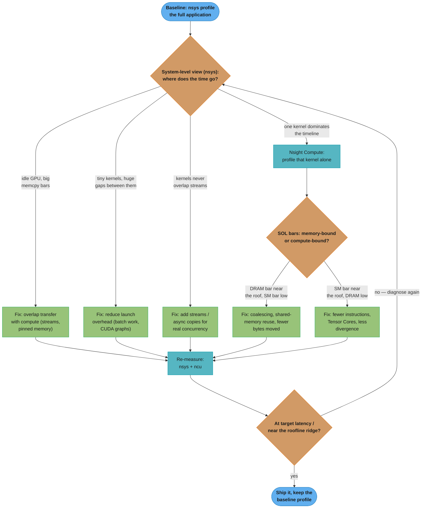

# Nsight Profiling Workflow

A CUDA kernel is either fast because you measured and fixed the actual bottleneck, or it is
"fast" because you guessed and it happened to work on your test input. Every case study in
this section that touches performance leans on the same disciplined loop: **profile, form a
hypothesis about the bottleneck, apply one targeted fix, re-measure.** This file is the
reusable reference for that loop and for the two tools — Nsight Systems and Nsight Compute —
that make it possible to do it with evidence instead of intuition.

Read this before the §4 optimization walkthrough of any case study; every one of them cites
back to this file instead of re-explaining the tool.

---

## The Profiling Loop

The single biggest failure mode in GPU optimization is skipping straight to a fix — usually
"add more threads" or "use shared memory" — without first establishing *what* is slow. A
kernel that is compute-bound gains nothing from better coalescing; a kernel that is
launch-overhead-bound gains nothing from a faster inner loop. The loop below forces the
diagnosis to happen before the fix, and forces the fix to be verified before you move on.



*Every arrow in this diagram is one iteration of the loop — a single hypothesis, a single
fix, one re-measurement. Never apply two changes between two measurements; if the second
re-run improves, you will not know which change did it, and if it regresses, you cannot
attribute the regression either.* The loop always starts at the system level (`nsys`) and
only narrows into `ncu` once a specific kernel is implicated — reversing that order (running
`ncu --set full` on the whole application) buries the one slow kernel in noise and costs
10-100x more profiling overhead than it needs to.

---

## Nsight Systems vs Nsight Compute

The two tools answer different questions and neither substitutes for the other.

| | Nsight Systems (`nsys`) | Nsight Compute (`ncu`) |
|---|---|---|
| **Question it answers** | "Where in the *timeline* does time go?" | "Why is *this specific kernel* slow?" |
| **Scope** | Whole application: CPU threads, CUDA API calls, memcpy, kernel launches, NVTX ranges, multi-stream/multi-GPU activity | One kernel launch (or a filtered set), instrumented in depth |
| **Overhead** | Low (~1-5%) — safe to run on a full production-shaped workload | High (10-100x slowdown per replayed kernel) — never run on more than the kernels you need |
| **Output** | A timeline (`.nsys-rep`) viewed in the GUI or summarized with `nsys stats` | A per-kernel metric report (`.ncu-rep`) with SOL bars, occupancy, stalls, roofline |
| **Finds** | Transfer-bound gaps, launch-overhead gaps (many tiny kernels), missing stream overlap, CPU-side serialization before a launch, NVTX-annotated phase breakdown | Coalescing waste, bank conflicts, low occupancy causes, warp stall reasons, whether a kernel is memory- or compute-bound |
| **Does NOT tell you** | Why an individual kernel is slow internally | Whether the *application* overlaps compute and transfer, or has launch-overhead problems across many kernels |
| **Reach for it when...** | You do not yet know *which* part of the run is slow — start every investigation here | `nsys` has already pointed at one dominant kernel and you need to know *why* |

**Rule of thumb:** `nsys` is the map, `ncu` is the microscope. Never point the microscope at
the whole city. A common anti-pattern is running `ncu --set full` on an entire training step
or inference request — this can turn a 50ms step into a 30-second replay and drowns the one
kernel that matters in metrics for forty others that don't.

---

## Key Nsight Compute Metrics & What They Mean

These are the metrics that show up in almost every `ncu --set full` report and the ones this
section's case studies cite when justifying a fix.

| Metric | What it tells you | Read it as |
|--------|-------------------|-------------|
| **Achieved occupancy** | Resident warps ÷ the SM's maximum, averaged over the kernel's run | A *capacity* number, not a throughput number — see [occupancy_and_launch_configuration/README.md](../../occupancy_and_launch_configuration/README.md). Low occupancy with a memory-bound kernel matters; low occupancy with a compute-bound kernel that already saturates the SM often does not. |
| **DRAM throughput (% of peak)** | Bytes moved to/from HBM as a fraction of the GPU's peak bandwidth (e.g. ~3 TB/s on H100 HBM3) | Near the roof (80-95%+) means the memory pipe is nearly saturated — good if every byte moved is useful, bad if most of it is wasted on uncoalesced transactions. |
| **Compute (SM) throughput (% of peak)** | Issued FLOPs/instructions as a fraction of the SM's peak issue rate | Near the roof means the ALUs are the bottleneck; low alongside high DRAM throughput is the classic memory-bound signature. |
| **Warp stall reasons** | A histogram of why warps were *not* eligible to issue an instruction on a given cycle | `long scoreboard` (waiting on a global memory load) → memory-bound; `barrier` (waiting at `__syncthreads`) → sync/tiling imbalance; `not selected` (scheduler chose another eligible warp) → usually benign, means enough parallelism exists; `short scoreboard` → shared-memory or texture-load latency. |
| **Sectors per request / global load-store efficiency** | How many 32-byte DRAM sectors were fetched or written per warp memory instruction, versus the minimum needed | A coalesced 128-byte transaction across 32 threads should need 4 sectors per warp; strided or misaligned access inflates this — 100% efficiency means zero wasted bytes, 25% means 4x the necessary traffic. |
| **SOL (Speed-Of-Light) Memory bar** | DRAM throughput normalized to 0-100% of the chip's physical peak | The headline "how close to the memory roof are we" number shown at the top of the `ncu` report. |
| **SOL Compute bar** | SM compute throughput normalized to 0-100% of peak | The headline "how close to the compute roof are we" number, shown side-by-side with the memory bar. |
| **Roofline chart** | Plots the kernel's measured arithmetic intensity (FLOPs/byte) and achieved performance against the GPU's memory-bandwidth roof and compute-peak roof | Below the sloped (bandwidth) roof → memory-bound, the fix is fewer bytes/better coalescing; at the flat (compute) roof → compute-bound, the fix is fewer/cheaper instructions or Tensor Cores. See [roofline_and_arithmetic_intensity.md](./roofline_and_arithmetic_intensity.md) for how to compute arithmetic intensity by hand before you ever open `ncu`. |

**Reading the two SOL bars together is the single fastest triage step.** High memory / low
compute → memory-bound. High compute / low memory → compute-bound. Both low → something else
entirely is gating the kernel (occupancy too low to hide latency, excessive divergence, or
serialization from atomics/barriers) — check occupancy and warp-stall reasons next.

---

## A Worked Optimization Session

**Setup:** a naive matrix-transpose kernel on a 4096x4096 `float32` matrix (64 MB). Each
thread reads one element from the source (row-major, coalesced) and writes it to the
destination (column-major, so consecutive threads in a warp write to addresses 4096
elements — 16 KB — apart). This is the canonical transpose problem covered in
[memory_coalescing_and_access_patterns/README.md](../../memory_coalescing_and_access_patterns/README.md).

**Step 1 — `nsys` baseline.** The system-level timeline shows one dominant kernel occupying
essentially the entire GPU-active time, with no overlapping memcpy or other kernels to
investigate. `nsys` has done its job: it ruled out transfer-bound and launch-overhead
explanations and pointed straight at this one kernel.

```bash
nsys profile -o transpose_baseline ./transpose_app
nsys stats transpose_baseline.nsys-rep
```

**Step 2 — `ncu` on that one kernel.**

```bash
ncu --set full -k transpose_naive --launch-count 1 -o transpose_naive_ncu ./transpose_app
```

The report shows:

| Metric | Value |
|--------|-------|
| SOL Memory (DRAM throughput) | 88% of peak |
| SOL Compute (SM throughput) | 12% of peak |
| Global store efficiency | 25% (4 sectors fetched per useful sector) |
| Achieved occupancy | 71% |
| Top stall reason | `long scoreboard` — 61% of stall cycles |

**Step 3 — hypothesize.** DRAM throughput is nearly at the roof while compute throughput is
far below it — the textbook memory-bound signature (see the roofline read above). But 88%
DRAM throughput is not "healthy saturation": the 25% store efficiency says three out of every
four bytes moved on the write side are wasted, because each strided write pulls in a whole
128-byte transaction to service a single 4-byte element. The kernel is memory-bound *and*
most of that bandwidth is being burned on waste, not useful work. Occupancy at 71% is already
enough to hide most memory latency, so raising occupancy further will not help — the fix has
to reduce wasted bytes, not add more parallelism.

**Step 4 — fix.** Stage each 32x32 tile through shared memory: read a coalesced row-major
tile from global memory into a `__shared__ float tile[32][33]` (33 columns — the classic pad
to dodge the bank-conflict-on-transpose problem, see
[shared_memory_and_bank_conflicts/README.md](../../shared_memory_and_bank_conflicts/README.md)),
`__syncthreads()`, then write the tile back out in coalesced fashion by swapping which index
maps to `threadIdx.x`. Both the read and the write are now coalesced; the transpose itself
happens entirely inside shared memory, which has no coalescing requirement.

```cpp
#define TILE 32
__global__ void transpose_tiled(const float* in, float* out, int n) {
    __shared__ float tile[TILE][TILE + 1];  // +1 padding avoids bank conflicts on write

    int x = blockIdx.x * TILE + threadIdx.x;
    int y = blockIdx.y * TILE + threadIdx.y;
    if (x < n && y < n) {
        tile[threadIdx.y][threadIdx.x] = in[y * n + x];   // coalesced read
    }
    __syncthreads();

    x = blockIdx.y * TILE + threadIdx.x;   // swapped block indices
    y = blockIdx.x * TILE + threadIdx.y;
    if (x < n && y < n) {
        out[y * n + x] = tile[threadIdx.x][threadIdx.y];  // coalesced write
    }
}
```

**Step 5 — re-measure.**

```bash
ncu --set full -k transpose_tiled --launch-count 1 -o transpose_tiled_ncu ./transpose_app
nsys profile -o transpose_fixed ./transpose_app
```

| Metric | Naive | Tiled |
|--------|------:|------:|
| Kernel time | 3.1 ms | 0.61 ms |
| SOL Memory (DRAM throughput) | 88% | 91% |
| Global store efficiency | 25% | 100% |
| Achieved occupancy | 71% | 68% |

DRAM throughput barely moves — the kernel is *still* memory-bound, which is correct, a
transpose has arithmetic intensity near zero and always will be. What changed is that the
same ~90% of peak bandwidth is now spent entirely on useful bytes instead of three-quarters
waste, so the same roofline ceiling is reached roughly 5x faster. This is the general
lesson: **when SOL Memory is already high, the fix is never "add more compute" — it is
"move fewer, better-coalesced bytes,"** which is exactly what the roofline model predicts for
a kernel sitting below the memory-bandwidth slope.

---

## CLI Recipes

The GUI (`nsys-ui`, `ncu-ui`) is convenient for exploring a `.nsys-rep`/`.ncu-rep`
interactively, but every one of these is scriptable for CI or a remote box with no display.

**Full-application system trace:**
```bash
nsys profile -o out ./app
```

**System trace with NVTX ranges and CUDA API call detail, then print a summary without opening the GUI:**
```bash
nsys profile --trace=cuda,nvtx,osrt -o out ./app
nsys stats out.nsys-rep
```

**Full per-kernel metric set (expensive — scope it to one kernel whenever possible):**
```bash
ncu --set full -o out ./app
```

**Profile exactly one launch of one named kernel (the standard way to avoid the 10-100x replay overhead of `--set full` blowing up a full run):**
```bash
ncu -k kernelname --launch-count 1 -o out ./app
```

**Profile the Nth occurrence of a kernel launched in a loop (e.g. skip warmup iterations):**
```bash
ncu -k kernelname --launch-skip 5 --launch-count 1 -o out ./app
```

**Just the SOL/roofline section, cheaper than `--set full` when you only need the triage bars:**
```bash
ncu --section SpeedOfLight --section MemoryWorkloadAnalysis -k kernelname -o out ./app
```

**Compare two profiles (baseline vs after-fix) as CSV for a diff or CI gate:**
```bash
ncu --csv --set full -k kernelname -o baseline ./app > baseline.csv
ncu --csv --set full -k kernelname -o after ./app > after.csv
diff <(cut -d, -f1,3 baseline.csv) <(cut -d, -f1,3 after.csv)
```

**Lock clocks for reproducible before/after comparisons (GPU boost clocks otherwise vary run to run):**
```bash
ncu --clock-control base -k kernelname --launch-count 1 -o out ./app
```

**List every available metric name (useful when `--set full` is too broad and you want one specific counter):**
```bash
ncu --query-metrics
```

---

## Pitfalls

**Reaching for `ncu --set full` before `nsys`.** `ncu` instruments and replays each kernel
launch, which can be 10-100x slower than the untouched kernel — running it on an entire
application before knowing which kernel is slow buries the signal in profiling overhead and
wastes minutes per run. Always triage with `nsys` first.

**Profiling a debug build.** A `-G` debug build disables most optimizations and inserts
extra checks; the metrics you get describe the debug build, not production behavior. Profile
a release build compiled with `-lineinfo` (not `-G`) so `ncu` can still correlate metrics
back to source lines without disabling optimization.

**Trusting achieved occupancy alone.** A kernel can sit at 90% occupancy and still be slow
if it is compute-bound and simply issuing expensive instructions, or memory-bound and every
warp is stalled on the same uncoalesced access pattern. Occupancy tells you how much latency
*could* be hidden, not whether the kernel is actually fast — always cross-check against the
SOL bars and warp-stall reasons.

**Ignoring boost-clock variance between runs.** GPU clocks vary with thermal state and
concurrent load; comparing a "before" run at boost clocks to an "after" run at throttled
clocks manufactures a fake regression or a fake win. Use `ncu --clock-control base` (or
lock clocks at the driver level) whenever comparing two profiles that need to be trusted
side by side.

**Skipping the warmup iteration.** The first kernel launch pays for context initialization,
JIT compilation of PTX to SASS on a cache miss, and cold caches — profiling launch #1 instead
of a steady-state launch inflates the numbers and misattributes one-time cost as per-call
cost. Always profile after at least one warmup call, and use `--launch-skip` in `ncu` for
kernels launched in a loop.

**Changing two things between measurements.** If a fix is "add shared memory tiling *and*
bump the block size *and* switch to `float4` loads" applied all at once, an improvement (or
regression) cannot be attributed to any one change. Apply one fix, re-measure, then decide
the next hypothesis — this is the discipline the loop diagram at the top of this file exists
to enforce.

**Reading DRAM throughput in isolation.** 90%+ DRAM throughput looks like "the kernel is
using the hardware well," but as the worked example above shows, it can equally mean "the
kernel is saturating the memory pipe with mostly wasted bytes." Always pair it with global
load/store efficiency (sectors per request) before deciding the kernel is already
memory-optimal.

---

## See Also

- [roofline_and_arithmetic_intensity.md](./roofline_and_arithmetic_intensity.md) — how to compute a kernel's arithmetic intensity by hand and place it against the GPU's ridge point before you ever open a profiler
- [profiling_and_performance_analysis/README.md](../../profiling_and_performance_analysis/README.md) — the module-level treatment of this same tooling, with Q&As and additional guided-analysis scenarios
- [memory_coalescing_and_access_patterns/README.md](../../memory_coalescing_and_access_patterns/README.md) — the full transpose/coalescing problem this worked example is drawn from
- [occupancy_and_launch_configuration/README.md](../../occupancy_and_launch_configuration/README.md) — why achieved occupancy is a capacity metric, not a throughput metric, and what actually caps it
