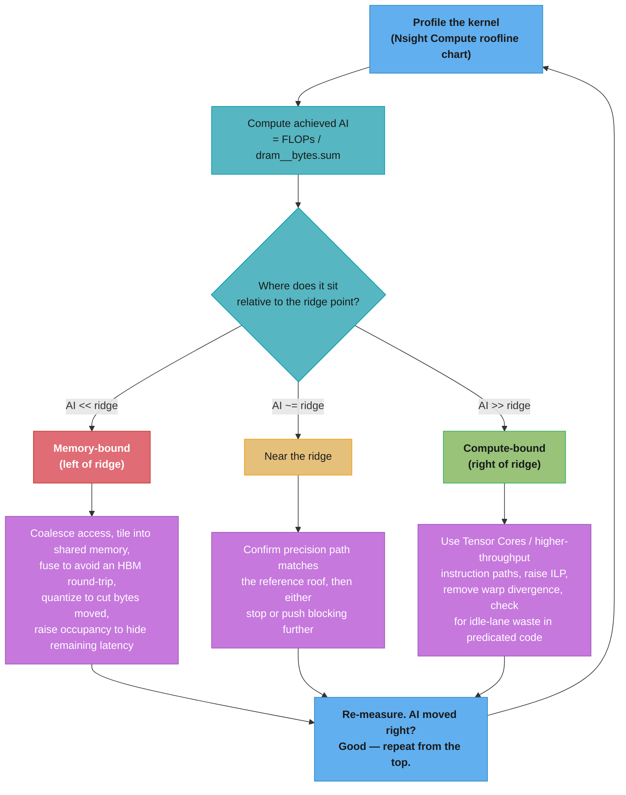

# Roofline & Arithmetic Intensity

Cross-cutting reference for the `cuda/` case studies — [`case_studies/README.md`](../README.md) lists this as the file to read **before any optimization pass**: it is the lens every kernel-optimization ladder in this section is read through (naive → coalesced → tiled → register-blocked → Tensor Core). This is a focused primitive, not a 14-section module or an 11-section case study, and it carries no Q&A floor (`case_studies/` is excluded from `extract.py`).

---

## Why This Matters

Every kernel-optimization interview question — "why is my reduction slow," "why does tiling help GEMM," "should I fuse these two kernels" — reduces to one question: **is this kernel limited by how fast the GPU can compute, or by how fast HBM can feed it data?** The roofline model turns that question into arithmetic you can do on the back of an envelope, before you touch a profiler.

This file teaches roofline as a **per-kernel optimization loop**: you write a kernel, compute (or measure) its arithmetic intensity, plot it against the chip's roofline, and that placement tells you exactly which lever to pull next — cut bytes moved, or increase useful FLOPs per cycle. That is a different altitude from [`../../../llm/optimization_and_quantization/gpu_architecture_and_roofline.md`](../../../llm/optimization_and_quantization/gpu_architecture_and_roofline.md), which uses the same model to reason about **transformer inference cost** (why decode is memory-bound at batch 1, why batching and quantization change the economics, why H200 helps inference more than training). Read that file for the inference-cost argument; read this one for the kernel-author's decision loop. The hardware numbers below are kept consistent with that file on purpose — same chip, same peak specs, different question being asked of them.

---

## The Roofline Model

A GPU has two hard ceilings:

- **The compute roof** — peak FLOP/s at a given numeric precision. Fixed by silicon; you cannot exceed it no matter how you write the kernel.
- **The memory (bandwidth) roof** — peak bytes/s the memory subsystem (HBM, in practice) can sustain. Also fixed by silicon.

A kernel's **attainable performance** is the *lesser* of the two:

```
attainable FLOP/s = min( peak FLOP/s , arithmetic_intensity x peak bandwidth )
```

Plotted on log-log axes (FLOP/s vs. arithmetic intensity), the bandwidth term is a rising diagonal line (attainable FLOP/s grows linearly with intensity, at slope = peak bandwidth) and the compute term is a flat ceiling. The point where the diagonal meets the ceiling is the **ridge point**:

```
ridge point (FLOP/byte) = peak FLOP/s / peak bandwidth
```

A kernel to the **left** of the ridge point is **memory-bound** — its arithmetic intensity is too low to keep the compute units fed; the roof above it is bandwidth, not FLOPs, and more ALUs would not help. A kernel to the **right** of the ridge point is **compute-bound** — DRAM traffic is not the bottleneck; the ceiling above it is the compute roof, and moving fewer bytes would not help. The ridge point is the single number that tells you, before writing any code, which family of optimizations is even capable of moving the needle.

```
 attainable
 TFLOP/s (log)
    67 |. . . . . . . . . . . |----------------------  FP32 / FP64-TC roof (67 TFLOP/s)
       |                    /:
       |   bandwidth      /  :
       |   roof =       /    :
       |   3.35 TB/s x I/     :
    20 |            /ridge    :  <- compute-bound region:
       |          /  (20)     :     more AI buys nothing here
     8 |        /  ^GEMM tiled:      ^GEMM tiled + reg-block
       |      /    Tw=32 (I=8):       Tw=32,R=8 (I=64)
   1.1 |    /  ^stencil tiled (I=1.1)
 0.375 |  /  ^stencil naive (I=0.375)   ^GEMM naive (I=0.25)
 0.083 |/  ^SAXPY (I=0.083)
       +--+----+-----+--------+---------+------> arithmetic
         0.1   1     10       20        64     intensity (FLOP/byte)
                              ridge
   register/shared-memory blocking slides a kernel right along its OWN roofline;
   it does not change the roof — only where the kernel sits under it.
```

*Schematic, log-ish spacing (not to scale) — the roof drawn here is H100 FP32 / FP64-Tensor-Core (67 TFLOP/s, ridge = 20 FLOP/byte), the roof a kernel written in plain CUDA C++ actually runs under. Tensor Core precisions (TF32/BF16/FP16/FP8) have their own, much higher roofs and ridge points — see the table below; the same kernels would sit further left relative to those roofs.*

---

## Computing Arithmetic Intensity

Arithmetic intensity (AI) is defined at the kernel boundary, not the source-code loop body:

```
AI (FLOP/byte) = total FLOPs performed / total bytes moved between the SM and DRAM
```

Two ways to get the numbers, and they usually disagree — know which one you are quoting:

- **Theoretical (hand-counted) AI** — count FLOPs and bytes directly from the algorithm: one multiply-add per element, N bytes read, N bytes written. Fast to compute, useful for reasoning about an optimization *before* writing code, but it assumes every byte requested is a byte actually moved — which is false the moment access is uncoalesced, the working set doesn't fit L2, or atomics are involved.
- **Achieved (profiler-measured) AI** — FLOPs and bytes as actually executed and moved, read from Nsight Compute counters (`dram__bytes.sum` for the denominator). This is ground truth. An uncoalesced 4-byte-per-thread access still pulls a full 128-byte transaction per warp-sector touched, so measured bytes moved are routinely several times the theoretical minimum — which silently lowers achieved AI below what the hand count predicted, and can push a kernel that "should" be compute-bound back across the ridge into memory-bound territory.

Rule of thumb for this file's worked examples: use theoretical AI to decide *what to try next* (tile bigger, fuse, quantize), then confirm with measured AI in Nsight Compute (see below) before declaring victory — the two converge only once access is coalesced and cache reuse matches what you assumed.

---

## The Ridge Point on Real Hardware

H100 SXM, HBM3 at 3.35 TB/s. Dense (non-sparse) FLOP/s per precision path — sparsity-marketing numbers are roughly 2x higher and only apply if the kernel exploits structured 2:4 sparsity, which most kernel-optimization exercises do not:

| Precision path | Peak dense FLOP/s | Ridge point (FLOP/byte) |
|---|---|---|
| FP64 (CUDA core) | 34 TFLOP/s | 10.1 |
| FP64 Tensor Core / FP32 (CUDA core) | 67 TFLOP/s | 20.0 |
| TF32 Tensor Core | 494.7 TFLOP/s | 147.7 |
| BF16 / FP16 Tensor Core | 989 TFLOP/s | 295.2 |
| FP8 Tensor Core | 1,979 TFLOP/s | 590.7 |

Reading the table like a kernel author, not a marketing sheet:

- **The ridge point moves with the precision path you actually issue instructions on**, not with the chip. A kernel classified compute-bound at FP32 (ridge 20) is deeply memory-bound if you mentally compare it against the BF16 Tensor Core ridge (295) instead — a common and invalidating mistake when reading a Nsight Compute roofline chart that auto-selects the wrong reference roof.
- **Moving from FP32 CUDA cores to Tensor Cores does not just raise the roof — it raises the bar.** A kernel with AI = 64 clears the FP32 ridge (20) comfortably and is compute-bound there, but the same kernel run through Tensor Core MMA instructions (ridge 295) is now memory-bound at that higher roof — which is exactly why naive "port the GEMM to WMMA" ports without also increasing tile/register blocking often show *no* speedup: the roof went up, but the kernel didn't move right to match it.
- **FP8 nearly doubles the bar again** (590.7 vs. 295.2) — the same reasoning applies to INT8/FP8 quantized-matmul kernels covered in `optimize_llm_inference_kernels.md`.

---

## Worked Examples

Three kernels, from the algorithm straight to a number you can compare against the table above. All examples ignore boundary/halo effects for large problem sizes, and count one FMA (multiply + add) as 2 FLOPs.

### 1. SAXPY (`y = a*x + y`) — the classic memory-bound kernel

Per element, double precision (the convention the original roofline paper uses, 8-byte words):

```
FLOPs  = 1 multiply + 1 add            = 2 FLOPs
bytes  = read x (8B) + read y (8B) + write y (8B) = 24 bytes

AI = 2 / 24 ~= 0.083 FLOP/byte
```

0.083 sits roughly 120x left of even the shallowest ridge in the table (FP64, 10.1) — SAXPY is memory-bound on *any* GPU at *any* precision, permanently. There is no tiling or register trick that helps: every element is touched exactly once, so there is no reuse to exploit. The only levers are cutting bytes moved (lower precision, fuse into a producer/consumer kernel so `y` never round-trips through HBM) or overlapping the transfer with something else (streams). This is why SAXPY is the textbook "compute has nothing to do with this" example — trying to "optimize the math" is provably a waste of engineering time.

### 2. 5-point 2D stencil — reuse recovers some ground, not enough

`out[i,j] = c0*in[i,j] + c1*(in[i-1,j] + in[i+1,j] + in[i,j-1] + in[i,j+1])`, single precision (4-byte words):

```
FLOPs  = 5 multiplies + 4 adds = 9 FLOPs per output point

Naive (each thread re-reads its 5 neighbors independently from global memory):
  bytes = 5 reads x 4B + 1 write x 4B = 24 bytes
  AI_naive = 9 / 24 = 0.375 FLOP/byte

Shared-memory tiled (halo-cached tile: each interior input element loaded
once, reused by up to 5 output computations that touch it):
  bytes ~= 1 read x 4B + 1 write x 4B = 8 bytes   (ignoring halo re-fetch at tile edges)
  AI_tiled ~= 9 / 8 = 1.125 FLOP/byte
```

Halo tiling buys a real 3x jump in arithmetic intensity (0.375 -> 1.125) — the payoff [`accelerate_2d_convolution_and_stencil.md`](../accelerate_2d_convolution_and_stencil.md) is built around — but 1.125 is still ~9x below even the FP64 ridge (10.1). Stencils remain memory-bound after tiling on virtually every GPU generation; the remaining lever is temporal blocking (fusing multiple stencil sweeps so an interior tile is reused across several time steps before it leaves shared memory/L2), not more aggressive spatial tiling.

### 3. Dense GEMM (tiled matmul) — the one that crosses the ridge

`C = A x B`, N x N x N, single precision. This is the case where arithmetic intensity is a design parameter, not a fixed property of the algorithm:

```
FLOPs = 2*N^3 (one FMA per multiply-accumulate, N^2 outputs, N terms each)

Naive (no reuse — each output element re-reads its full A-row and B-column
directly from global memory):
  bytes ~= 2N reads/output x N^2 outputs x 4B = 8*N^3 bytes
  AI_naive = 2*N^3 / 8*N^3 = 0.25 FLOP/byte      <- constant, independent of N

Shared-memory tiled, tile width Tw (each Tw x Tw tile of A and B loaded once,
reused Tw times before eviction):
  AI_tiled ~= 0.25 x Tw FLOP/byte

    Tw = 16 (256 threads/block):  AI ~= 4    FLOP/byte
    Tw = 32 (1024 threads/block): AI ~= 8    FLOP/byte

Register-blocked on top of tiling (each thread computes an RxR micro-tile
of output instead of one element — the CUTLASS/cuBLAS-style structure),
multiplying reuse by another factor of R:
  AI ~= 0.25 x Tw x R FLOP/byte

    Tw = 32, R = 8:  AI ~= 0.25 x 32 x 8 = 64 FLOP/byte
```

This is the number that matters: **AI = 64 clears the FP32/FP64-Tensor-Core ridge (20) by 3x** — register-blocked tiled GEMM is genuinely compute-bound on FP32 CUDA cores, which is exactly the point where [`optimize_matrix_multiplication_kernel.md`](../optimize_matrix_multiplication_kernel.md)'s optimization ladder stops chasing memory traffic and starts chasing FLOP throughput (double buffering, `__launch_bounds__`, avoiding bank conflicts in the tile load). But 64 is still short of the BF16 Tensor Core ridge (295) — a WMMA/`mma` port of this same kernel needs deeper blocking again (or larger tiles + FP8) to be compute-bound *there*, which is the "raises the bar" point from the ridge table above.

**A fourth data point worth knowing without re-deriving it**: attention (FlashAttention-style fused softmax-attention) behaves like GEMM at large batch — K/V tiles are reused across many queries, AI grows and the kernel is compute-bound — but at batch size 1 (a single decode step), each K/V element is read once and used for one query, collapsing AI back toward SAXPY-like territory. This is the same batching argument [`../../../llm/optimization_and_quantization/gpu_architecture_and_roofline.md`](../../../llm/optimization_and_quantization/gpu_architecture_and_roofline.md) develops in depth for transformer decode; [`build_a_flash_attention_kernel.md`](../build_a_flash_attention_kernel.md) and [`optimize_llm_inference_kernels.md`](../optimize_llm_inference_kernels.md) apply it at the kernel level.

---

## Reading It in Nsight Compute

Nsight Compute ships a **Speed Of Light Roofline Chart** section (`ncu --set full` includes it, or target it directly with `--section SpeedOfLight_HierarchicalTensorRooflineChart`) that plots the kernel as a point against the device's actual compute and memory ceilings — no hand arithmetic required, but you still need to know what you are looking at:

- **`dram__bytes.sum`** — measured DRAM traffic for the kernel launch. Use this, not the hand-counted byte estimate, as the denominator for achieved AI once you suspect uncoalesced access, L2 misses, or atomics are inflating traffic beyond the theoretical minimum.
- **`sm__throughput.avg.pct_of_peak_sustained_elapsed`** — Compute (SM) Throughput, as a percentage of the roof for whichever precision path the kernel actually issued.
- **`dram__throughput.avg.pct_of_peak_sustained_elapsed`** — Memory Throughput, as a percentage of peak HBM bandwidth.
- **Fast triage heuristic**: memory throughput% >> compute throughput% -> memory-bound, confirm against the ridge table; both high and roughly balanced -> the kernel is sitting near its ridge, which is usually the terminal state of an optimization pass, not a bug.
- **Achieved Occupancy** is reported alongside but answers a *different* question (see Pitfalls) — do not read a low compute-throughput% as "increase occupancy," read it against the roofline chart first.
- **Sanity-check the reference roof NCU picked.** If a kernel mixes precisions (e.g. FP16 inputs accumulated in FP32), the auto-selected roofline can quote the wrong nominal ceiling; cross-check against the table above before trusting the chart's classification.

---

## Optimization Playbook



The loop is deliberately the same shape every time: **measure, classify, apply the one class of fix that side of the ridge actually rewards, re-measure.** The two families of fix do not substitute for each other — increasing occupancy on a memory-bound kernel hides latency but does not raise the bandwidth ceiling, and switching to Tensor Cores on a memory-bound kernel raises a roof the kernel was never going to hit anyway. Diagnose which side of the ridge you are on before picking a lever.

---

## Pitfalls

- **Hand-counted AI vs. measured AI disagree, and the disagreement is informative, not noise.** An uncoalesced 4-byte-per-thread access still pulls a full 128-byte transaction per touched sector; `dram__bytes.sum` will be several times the theoretical minimum, and the kernel will sit further left (more memory-bound) than the source code suggested.
- **Quoting sparse Tensor Core FLOP/s instead of dense.** Spec sheets list ~2x higher numbers for structured 2:4 sparsity; unless the kernel produces genuinely sparse weights and uses the sparse MMA path, use the dense figures in the ridge table or every downstream conclusion is off by 2x.
- **Treating occupancy as a proxy for "correctly optimized."** A kernel can report 100% achieved occupancy and still be firmly memory-bound — more resident warps hides latency, it does not raise the bandwidth ceiling. Read the roofline chart before reaching for `__launch_bounds__` or a smaller block size.
- **Comparing AI against the wrong ridge.** The ridge point is a property of the precision path actually issued (FP32 ridge 20 vs. BF16 Tensor Core ridge 295 on the same H100) — classifying a raw CUDA-core kernel as "compute-bound" using a Tensor Core ridge (or vice versa) inverts the diagnosis.
- **Assuming AI is a fixed property of the algorithm.** The GEMM example above shows the *same* FLOP count sitting at AI 0.25, 4, 8, or 64 purely from tile width and register-blocking choices — AI is a property of the access pattern you wrote, not the math.
- **Ignoring L2 reuse (in both directions).** A kernel's "unique bytes touched" (working set) can be much less than measured DRAM traffic if the working set doesn't fit L2 and thrashes — or much more forgiving than the naive byte count if repeated tiles hit L2 instead of HBM. Measured bytes, not working-set size, is the correct AI denominator.
- **Chasing FLOP throughput on a kernel that is left of the ridge.** Adding ILP, unrolling loops, or switching instruction sets does nothing for a memory-bound kernel — SAXPY has no reuse to exploit at any optimization level. The fix for a point left of the ridge is always "move it right by cutting bytes moved," never "make the math faster."
- **Expecting 100% of the roof.** Even a well-tuned kernel sitting exactly at its ridge typically achieves 60-85% of either ceiling in practice (tail effects, imperfect prologue/epilogue overlap, launch-configuration limits) — treat the roofline as an upper bound to approach, not a number you should expect to hit exactly.

---

## Related Files

- [`../../../llm/optimization_and_quantization/gpu_architecture_and_roofline.md`](../../../llm/optimization_and_quantization/gpu_architecture_and_roofline.md) — same model, different question: roofline as a lens on transformer *inference cost* (batching, quantization, prefill/decode economics), not the per-kernel optimization loop this file covers. Read that file for the "why is decode expensive" argument; read this one for "which lever do I pull on this kernel."
- [`../../occupancy_and_launch_configuration/README.md`](../../occupancy_and_launch_configuration/README.md) — occupancy is the latency-hiding axis this file repeatedly warns is orthogonal to arithmetic intensity; that module covers how to tune it.
- [`../../memory_coalescing_and_access_patterns/README.md`](../../memory_coalescing_and_access_patterns/README.md) — the mechanism behind the "theoretical vs. achieved AI" gap: uncoalesced access is *why* measured DRAM bytes exceed the hand count.
- [`nsight_profiling_workflow.md`](nsight_profiling_workflow.md) — the general profile -> fix -> re-measure loop this file's Optimization Playbook is one instance of.
