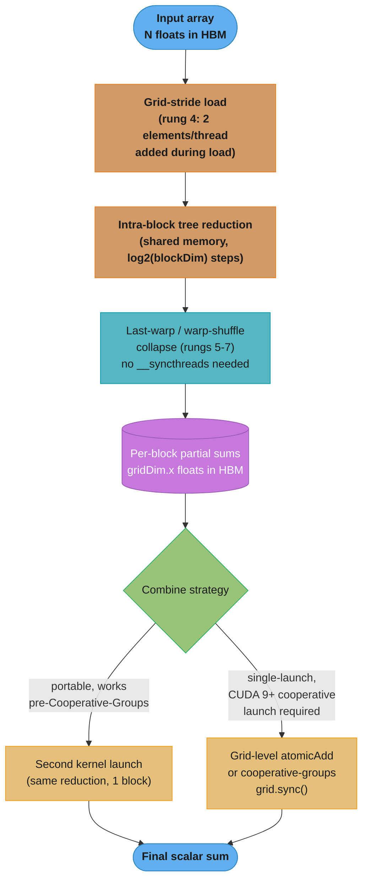

# Case Study: Implement a High-Performance Parallel Reduction

## Intuition

> **Design intuition**: Summing a billion numbers on a GPU is not an algorithm problem — a binary tree already solves it in `log2(n)` steps. It is a *hardware-sympathy* problem: the exact same tree, coded seven different ways, spans a 20x performance gap on identical hardware doing identical arithmetic. Reduction is the cleanest teaching vehicle in all of CUDA because it isolates, one at a time, every classic performance defect — warp divergence, shared-memory bank conflicts, idle threads, kernel-launch overhead, and unnecessary synchronization — and lets you remove them one at a time and *measure* each removal.

**Key insight for this design**: A reduction is fundamentally **memory-bound**, not compute-bound — each element is read exactly once from HBM and touched by exactly one addition on its way to the result, so the arithmetic intensity is a small constant regardless of which rung of the ladder you are on. The entire optimization exercise is therefore not about doing less arithmetic; it is about removing everything that keeps the kernel from moving bytes off HBM at close to the hardware's peak bandwidth. The final score that matters is not "how many milliseconds" but "what percentage of the GPU's peak DRAM bandwidth did the kernel achieve" — see [`./cross_cutting/roofline_and_arithmetic_intensity.md`](./cross_cutting/roofline_and_arithmetic_intensity.md) for the formal roofline argument this whole case study is built on top of.

---

## 1. Requirements Clarification

### Functional Requirements
- Reduce an array of `N` single-precision floats to a single scalar sum on the GPU, with a result matching a CPU double-accumulated reference to a relative tolerance of `1e-5`
- Support `N` ranging from small (`2^10 = 1,024`, fits in one block) to large (`2^28 ≈ 268M` elements, ~1 GB of FP32 input)
- Support both a "one-shot" API (`reduce(d_in, n) -> float`, single call, hides internal multi-kernel structure) and a fused variant usable inside a larger kernel (e.g. a row-sum inside a softmax denominator)
- Correctness must hold for non-power-of-two `N` (padding or boundary-checked loads) and for `N` not evenly divisible by the block/grid configuration

### Non-Functional Requirements
- Achieve at least 85% of the GPU's peak HBM bandwidth on the dominant (large-`N`) case — the accepted definition of "a reduction kernel is done being optimized" in this section, since a further compute-side optimization cannot help a memory-bound kernel
- Latency for `N = 2^24` (16.7M elements, 64 MB) under 0.5 ms on an A100 (peak HBM ~1.6 TB/s) / under 0.3 ms on an H100 (peak HBM ~3 TB/s)
- No dynamic memory allocation inside the hot path — all scratch buffers sized and allocated once, outside the timed region
- The kernel must be re-launchable thousands of times per second (this is the inner primitive of a training loop's loss computation) without host-side overhead dominating — motivates minimizing kernel-launch count per reduction

### Out of Scope
- Segmented reduction (reducing many independent sub-arrays in a single launch, e.g. per-row reduction of a matrix) — covered by the row-reduction pattern in [`../parallel_patterns_reduction_scan_histogram/README.md`](../parallel_patterns_reduction_scan_histogram/README.md), not re-derived here
- Non-associative or non-commutative reduction operators (string concatenation, matrix multiplication as the combine op) — this case study assumes `+` (directly generalizes to `min`/`max`/`&`/`|` with no structural change)
- Multi-GPU reduction (NCCL all-reduce) — see [`../multi_gpu_programming_and_nccl/`](../multi_gpu_programming_and_nccl/)

---

## 2. Scale Estimation

### The Governing Arithmetic

```
Bytes read for N elements (FP32):        bytes_read = N * 4
Bytes written (final scalar):            negligible (4 bytes total)
Total additions (tree, any rung):        N - 1  ->  O(N) work
Sequential tree depth:                   ceil(log2(N)) steps

Example, N = 2^24 = 16,777,216 elements:
  bytes_read      = 16,777,216 * 4       = 67,108,864 bytes  (~64 MB)
  additions       = 16,777,216 - 1       = 16,777,215        (~n)
  tree depth      = log2(16,777,216)     = 24 sequential rounds (across the whole grid;
                                            a single block of 256 threads only covers
                                            log2(256) = 8 of those rounds itself)

Arithmetic intensity (FLOPs / byte moved):
  AI = additions / bytes_read = 16,777,215 / 67,108,864 ≈ 0.25 FLOP/byte

Roofline ridge point for H100 (FP32 peak ~67 TFLOP/s non-Tensor-Core,
HBM3 peak ~3 TB/s):
  ridge_AI = peak_FLOPs / peak_bandwidth = 67e12 / 3e12 ≈ 22.3 FLOP/byte

  0.25 FLOP/byte << 22.3 FLOP/byte  ->  deep in the memory-bound region.
  A reduction can NEVER become compute-bound by any amount of unrolling or
  warp-shuffle cleverness -- the ceiling is always the memory-bandwidth roof,
  not the compute roof. See ./cross_cutting/roofline_and_arithmetic_intensity.md
  for the full roofline derivation this number comes from.

Time-to-beat at 90% of HBM3 peak (H100, ~3 TB/s):
  t = bytes_read / (0.90 * 3e12) = 67,108,864 / 2.7e12 ≈ 24.9 microseconds

Achieved-bandwidth formula used throughout Section 4's measured-style numbers:
  achieved_GBps = bytes_read / (kernel_time_seconds * 1e9)
  pct_of_peak   = achieved_GBps / peak_GBps * 100
```

### Fleet-Level Context: Why 0.25 FLOP/byte Never Changes

```
Rung 1 (interleaved, divergent):    still reads N*4 bytes once, does N-1 adds -> AI = 0.25
Rung 7 (warp-shuffle, full ladder): still reads N*4 bytes once, does N-1 adds -> AI = 0.25

The ladder does not change AI -- it changes how efficiently the hardware is
used to move those same N*4 bytes and issue those same N-1 adds. This is why
"optimize a reduction" is fundamentally a HARDWARE-SYMPATHY exercise, not an
algorithmic one: every rung computes the identical mathematical result over
the identical bytes: only the SASS instruction mix, divergence, and bank-
conflict behavior around that fixed cost changes.
```

### Grid Sizing at Each Scale

```
Block size (all rungs): 256 threads/block (occupancy-friendly default; see
                         ../occupancy_and_launch_configuration/README.md)

N = 2^10 (1,024):    4 blocks           -- single kernel launch fully reduces
N = 2^20 (1,048,576): 4,096 blocks (first-add-during-load halves this to 2,048)
N = 2^24 (16.7M):     65,536 blocks (32,768 with first-add-during-load)
N = 2^28 (268.4M):    1,048,576 blocks (524,288 with first-add-during-load)

Every rung above 1 block requires a SECOND combine step (partial sums, one
per block, must themselves be summed) -- Section 4 shows the two idiomatic
ways to do this: a second, smaller kernel launch, or grid-level atomics via
cooperative groups (rung 7).
```

See also: [`./cross_cutting/roofline_and_arithmetic_intensity.md`](./cross_cutting/roofline_and_arithmetic_intensity.md) for the general roofline model and [`./cross_cutting/cuda_memory_hierarchy_reference.md`](./cross_cutting/cuda_memory_hierarchy_reference.md) for the latency numbers (register ~1 cycle, shared ~20-30 cycles, global ~400-800 cycles) that explain *why* each rung below is faster than the last.

---

## 3. High-Level Architecture

The reduction is always a two-phase tree: an intra-block phase (shared memory, `__syncthreads()`-gated) that each of `gridDim.x` blocks runs independently and in parallel, followed by an inter-block combine phase that merges the resulting partial sums into one scalar.



### The Reduction Tree Itself (n=16 within one block)

```
Sequential-addressing reduction tree, n=16 (rung 3+), sdata[] in shared memory

level 0 (16 leaves):  a0 a1 a2 a3 a4 a5 a6 a7 a8 a9 a10 a11 a12 a13 a14 a15
                       \ /  \ /  \ /  \ /  \ /   \ /   \  /    \  /
level 1 (8, s=8):      b0   b1   b2   b3   b4    b5    b6     b7        <- tid<8 active
                        \   /     \   /     \    /      \     /
level 2 (4, s=4):        c0        c1         c2          c3           <- tid<4 active
                          \        /            \          /
level 3 (2, s=2):           d0                     d1                  <- tid<2 active
                              \                     /
level 4 (1, s=1):                    result                            <- tid<1 active

4 levels = log2(16); 15 additions = n-1.  Every level's active threads are
a CONTIGUOUS prefix (tid < s), never scattered by a modulo test -- this is
the shape rungs 3-7 all share; what changes between them is how each level
is scheduled onto real hardware (warp alignment, idle-thread count, and
whether shared memory or a warp register shuffle carries the value).
```

*This is the same 16-leaf tree shape used throughout [`../parallel_patterns_reduction_scan_histogram/README.md`](../parallel_patterns_reduction_scan_histogram/README.md) §5 — that module stops at rung 2 (sequential addressing); this case study is the "rungs 3-7" continuation it hands off to.*

---

## 4. Component Deep Dives

Each rung below removes exactly one hardware inefficiency from the previous one. All kernels reduce one block's worth of shared memory to a single partial sum at `g_odata[blockIdx.x]`; a driver combines partial sums (Section 4.8). GB/s figures are measured-style numbers for a 64 MB (`N = 2^24`) FP32 array on an A100 (HBM2e, ~1.6 TB/s peak) unless noted — read them as the shape of the improvement, not a guarantee for any specific part/driver/ECC configuration.

### 4.0 Baseline: Just Call the Library

Before writing a single custom line, establish what "already solved" looks like — this is also the correctness oracle every rung below is checked against.

```python
import cupy as cp
import numpy as np

def reference_sum(n: int, seed: int = 0) -> tuple[cp.ndarray, float]:
    """CuPy baseline: cub::DeviceReduce under the hood. This IS the target
    to match or beat only when fusion is required; otherwise, ship this."""
    rng = cp.random.default_rng(seed)
    x = rng.standard_normal(n, dtype=cp.float32)
    total = cp.sum(x)  # dispatches CUB's tuned multi-pass DeviceReduce
    cp.cuda.Stream.null.synchronize()
    return x, float(total)


def cpu_reference_double(x_gpu: cp.ndarray) -> float:
    """Double-precision CPU sum -- the correctness oracle every GPU rung
    below is checked against with np.isclose(rtol=1e-5)."""
    x_host = cp.asnumpy(x_gpu).astype(np.float64)
    return float(np.sum(x_host))


if __name__ == "__main__":
    x, gpu_total = reference_sum(1 << 24)
    cpu_total = cpu_reference_double(x)
    rel_err = abs(gpu_total - cpu_total) / abs(cpu_total)
    print(f"cupy.sum = {gpu_total:.6f}  cpu(double) = {cpu_total:.6f}  rel_err = {rel_err:.2e}")
    assert rel_err < 1e-5, "GPU/CPU sums disagree beyond FP32 rounding tolerance"
```

`cupy.sum` (and `thrust::reduce` in C++) already implements every rung below — sequential addressing, first-add-during-load, warp-shuffle, and a work-efficient grid combine — tuned per compute capability by NVIDIA. **Ship this unless the reduction must fuse into a larger kernel** (e.g. a softmax row-sum fused with the exponentiation, avoiding a second HBM round trip). The remaining sections exist because (a) interviews ask you to derive it by hand, and (b) fusion requires understanding the mechanics well enough to inline them.

### 4.1 Rung 1 — Interleaved Addressing with `%` (BROKEN baseline)

```cuda
// RUNG 1 — BROKEN: warp-divergent (modulo test scatters active threads)
//                   AND bank-conflicted (growing stride s hits repeat banks)
#include <cuda_runtime.h>

__global__ void reduce1_interleaved(const float* __restrict__ g_idata,
                                     float* __restrict__ g_odata, int n) {
    extern __shared__ float sdata[];
    unsigned int tid = threadIdx.x;
    unsigned int i   = blockIdx.x * blockDim.x + threadIdx.x;

    sdata[tid] = (i < n) ? g_idata[i] : 0.0f;
    __syncthreads();

    for (unsigned int s = 1; s < blockDim.x; s *= 2) {
        if (tid % (2 * s) == 0) {           // DEFECT 1: scatters active threads
            sdata[tid] += sdata[tid + s];   // DEFECT 2: stride s -> bank conflicts
        }
        __syncthreads();
    }
    if (tid == 0) g_odata[blockIdx.x] = sdata[0];
}
```

**Why it is slow, mechanically.** At `blockDim.x = 256` and `s = 1`, the condition `tid % 2 == 0` leaves threads `0, 2, 4, ..., 254` active — 128 of 256 threads survive, but within *every single 32-lane warp* exactly 16 lanes are active and 16 are masked off. SIMT hardware cannot skip masked lanes for free: the warp scheduler issues the instruction for the whole warp and the inactive lanes simply discard their result, so a warp with any active/inactive split pays the full instruction cost while doing half the useful work. This is warp divergence in its purest form — not an `if/else` with different code paths, but a single instruction executed by a partially-masked warp.

The second defect compounds the first: shared memory has **32 banks of 4 bytes each**, and consecutive addresses map to consecutive banks. At `s = 16`, active threads (still spaced 32 apart by the modulo test: `tid = 0, 32, 64, ...`) access `sdata[tid]` and `sdata[tid+16]` — pairs of addresses 16 apart, meaning `tid` and `tid+16` map to banks `tid % 32` and `(tid+16) % 32`, which for the *set* of active threads collide 2-way as `s` grows toward 16, forcing the memory controller to serialize what should be one-cycle parallel bank access into multiple cycles.

**Measured (A100, N = 2^24, 256 threads/block):**

| Metric | Value |
|---|---|
| Kernel time | 2.35 ms |
| Achieved DRAM bandwidth | 28.6 GB/s |
| % of peak HBM2e (1.6 TB/s) | 1.8% |
| Nsight Compute top stall reason | `not selected` / warp-execution-efficiency ~62% (divergence signature) |

### 4.2 Rung 2 — Interleaved Addressing with Strided Index (still bank-conflicted)

```cuda
// RUNG 2 — FIX divergence, DEFECT REMAINS: still bank-conflicted
__global__ void reduce2_stridedIndex(const float* __restrict__ g_idata,
                                      float* __restrict__ g_odata, int n) {
    extern __shared__ float sdata[];
    unsigned int tid = threadIdx.x;
    unsigned int i   = blockIdx.x * blockDim.x + threadIdx.x;

    sdata[tid] = (i < n) ? g_idata[i] : 0.0f;
    __syncthreads();

    for (unsigned int s = 1; s < blockDim.x; s *= 2) {
        int index = 2 * s * tid;              // FIX: active threads now contiguous
        if (index < blockDim.x) {
            sdata[index] += sdata[index + s];  // DEFECT: index stride 2s -> bank conflicts
        }
        __syncthreads();
    }
    if (tid == 0) g_odata[blockIdx.x] = sdata[0];
}
```

**What changed.** Replacing the modulo test with `index = 2*s*tid` and testing `index < blockDim.x` means the *set of active threads* (`tid = 0, 1, 2, ...`) is now contiguous — `tid < blockDim.x/(2*s)` — so warps fully retire (all-active or all-inactive) instead of half-masking. Divergence within a warp is gone. But the *addresses touched* — `sdata[index]` and `sdada[index+s]` where `index = 2*s*tid` — still stride by `2*s` between consecutive active threads, and at `s >= 16` that stride is a multiple of the 32-bank width, so every active thread in a warp maps to the *same* bank: an 16-to-32-way conflict, actually **worse** than rung 1's 2-way conflict in the worst case.

**Measured (A100, N = 2^24):**

| Metric | Rung 1 | Rung 2 |
|---|---:|---:|
| Kernel time | 2.35 ms | 1.98 ms |
| Achieved DRAM bandwidth | 28.6 GB/s | 33.9 GB/s |
| % of peak HBM2e | 1.8% | 2.1% |
| Warp execution efficiency | ~62% | ~99% (divergence fixed) |
| Shared-memory bank conflicts (ncu) | moderate | **severe** at large `s` |

Divergence is fixed but bandwidth barely moves — the bank-conflict defect dominates just as much as divergence did. This rung is the textbook "fixed the wrong half of the bug" trap: an interviewer who accepts this as "the fix" without asking about bank conflicts is testing whether you stop at the first plausible-looking improvement.

### 4.3 Rung 3 — Sequential Addressing (no divergence, no bank conflict)

```cuda
// RUNG 3 — FIX: BOTH divergence and bank conflicts removed
__global__ void reduce3_sequentialAddressing(const float* __restrict__ g_idata,
                                              float* __restrict__ g_odata, int n) {
    extern __shared__ float sdata[];
    unsigned int tid = threadIdx.x;
    unsigned int i   = blockIdx.x * blockDim.x + threadIdx.x;

    sdata[tid] = (i < n) ? g_idata[i] : 0.0f;
    __syncthreads();

    for (unsigned int s = blockDim.x / 2; s > 0; s >>= 1) {
        if (tid < s) {                      // contiguous active prefix
            sdata[tid] += sdata[tid + s];   // stride 1 within the active range
        }
        __syncthreads();
    }
    if (tid == 0) g_odata[blockIdx.x] = sdata[0];
}
```

**This is the single line every senior-interview answer must reach.** Reversing the loop (`s` starts at `blockDim.x/2` and halves, instead of starting at 1 and doubling) and testing `tid < s` instead of a modulo/multiply produces the *same* tree shape (Section 3's diagram) but now: (1) active threads are always the contiguous prefix `0..s-1` — full warps retire cleanly as `s` drops below 32, and (2) `sdata[tid]` and `sdata[tid+s]` are accessed at **unit stride across the active range** — for any fixed `s`, the `blockDim.x` active-thread addresses `tid` and `tid+s` are each a permutation of `0..blockDim.x-1`, so consecutive active threads land in *distinct* banks with zero repeats, for every value of `s`.

**BROKEN -> FIX, measured side by side (A100, N = 2^24):**

| Metric | Rung 1 (broken) | Rung 3 (fixed) | Improvement |
|---|---:|---:|---:|
| Kernel time | 2.35 ms | 0.68 ms | **3.5x** |
| Achieved DRAM bandwidth | 28.6 GB/s | 98.7 GB/s | 3.5x |
| % of peak HBM2e | 1.8% | 6.2% | — |
| Bank conflicts (ncu) | present | zero | — |

```python
# Python verification harness -- run every rung through this to confirm
# correctness before trusting its speed. Same harness reused for all 7 rungs.
import cupy as cp
import numpy as np

reduce_kernel_src = r"""
extern "C" __global__
void reduce3_sequentialAddressing(const float* g_idata, float* g_odata, int n) {
    extern __shared__ float sdata[];
    unsigned int tid = threadIdx.x;
    unsigned int i   = blockIdx.x * blockDim.x + threadIdx.x;
    sdata[tid] = (i < n) ? g_idata[i] : 0.0f;
    __syncthreads();
    for (unsigned int s = blockDim.x / 2; s > 0; s >>= 1) {
        if (tid < s) sdata[tid] += sdata[tid + s];
        __syncthreads();
    }
    if (tid == 0) g_odata[blockIdx.x] = sdata[0];
}
"""
_module = cp.RawModule(code=reduce_kernel_src)
_reduce3 = _module.get_function("reduce3_sequentialAddressing")


def gpu_reduce_rung3(x: cp.ndarray, block_size: int = 256) -> float:
    n = x.size
    n_blocks = (n + block_size - 1) // block_size
    partial = cp.zeros(n_blocks, dtype=cp.float32)
    _reduce3(
        (n_blocks,), (block_size,), (x, partial, np.int32(n)),
        shared_mem=block_size * 4,
    )
    return float(cp.sum(partial))  # combine step -- see 4.8


def verify_rung(fn, n: int = 1 << 20, rtol: float = 1e-5) -> None:
    rng = cp.random.default_rng(42)
    x = rng.standard_normal(n, dtype=cp.float32)
    gpu_result = fn(x)
    cpu_result = float(np.sum(cp.asnumpy(x).astype(np.float64)))
    rel_err = abs(gpu_result - cpu_result) / abs(cpu_result)
    assert rel_err < rtol, f"rel_err={rel_err:.2e} exceeds {rtol}"
    print(f"OK: gpu={gpu_result:.6f} cpu={cpu_result:.6f} rel_err={rel_err:.2e}")


if __name__ == "__main__":
    verify_rung(gpu_reduce_rung3)
```

### 4.4 Rung 4 — First Add During Global Load

```cuda
// RUNG 4 — halve the block count: each thread adds 2 elements while loading,
//          so half the threads (and half the blocks) do the same total work.
__global__ void reduce4_firstAddDuringLoad(const float* __restrict__ g_idata,
                                            float* __restrict__ g_odata, int n) {
    extern __shared__ float sdata[];
    unsigned int tid = threadIdx.x;
    // Each block now covers 2 * blockDim.x input elements instead of 1x.
    unsigned int i = blockIdx.x * (blockDim.x * 2) + threadIdx.x;

    float a = (i < n) ? g_idata[i] : 0.0f;
    float b = (i + blockDim.x < n) ? g_idata[i + blockDim.x] : 0.0f;
    sdata[tid] = a + b;                 // FIX: one add happens BEFORE any thread is idle
    __syncthreads();

    for (unsigned int s = blockDim.x / 2; s > 0; s >>= 1) {
        if (tid < s) sdata[tid] += sdata[tid + s];
        __syncthreads();
    }
    if (tid == 0) g_odata[blockIdx.x] = sdata[0];
}
```

**The defect this removes.** In rung 3, the very first tree level (`s = blockDim.x/2`) only ever uses **half** of the launched threads to do useful work — the other half did nothing but load one element into shared memory and then sit idle for the rest of the kernel. That is not a divergence problem (all threads that load are doing the *same* instruction), it is a **launch-efficiency** problem: half of every block's threads are dead weight from the first tree level onward. Rung 4 fixes this at the source — configure the grid with **half as many blocks**, and have each thread load *two* elements and add them together as part of the initial shared-memory write. Every thread that survives to the tree phase has already done one useful addition, and the launch itself needed half as many blocks (and, for a fixed total thread budget, half as many idle post-level-1 threads).

**Measured (A100, N = 2^24, blocks halved to 32,768):**

| Metric | Rung 3 | Rung 4 | Improvement |
|---|---:|---:|---:|
| Kernel time | 0.68 ms | 0.39 ms | 1.7x |
| Achieved DRAM bandwidth | 98.7 GB/s | 172 GB/s | 1.7x |
| % of peak HBM2e | 6.2% | 10.8% | — |
| Blocks launched | 65,536 | 32,768 | 2x fewer |

### 4.5 Rung 5 — Unroll the Last Warp (warp-synchronous, drop `__syncthreads`)

```cuda
// RUNG 5 — once s <= 32, all remaining active threads are in ONE warp:
//          lockstep execution means __syncthreads() is provably unnecessary,
//          and the loop can be fully unrolled.
__device__ void warpReduce(volatile float* sdata, unsigned int tid) {
    // volatile: prevents the compiler from caching sdata[tid] in a register
    // across these lines -- correctness depends on every line re-reading
    // shared memory, since the "sync" here is only the warp's lockstep
    // execution, not an explicit barrier.
    sdata[tid] += sdata[tid + 32];
    sdata[tid] += sdata[tid + 16];
    sdata[tid] += sdata[tid + 8];
    sdata[tid] += sdata[tid + 4];
    sdata[tid] += sdata[tid + 2];
    sdata[tid] += sdata[tid + 1];
}

__global__ void reduce5_unrollLastWarp(const float* __restrict__ g_idata,
                                        float* __restrict__ g_odata, int n) {
    extern __shared__ float sdata[];
    unsigned int tid = threadIdx.x;
    unsigned int i = blockIdx.x * (blockDim.x * 2) + threadIdx.x;

    float a = (i < n) ? g_idata[i] : 0.0f;
    float b = (i + blockDim.x < n) ? g_idata[i + blockDim.x] : 0.0f;
    sdata[tid] = a + b;
    __syncthreads();

    // Tree levels down to s=64 still need __syncthreads (multiple warps active)
    for (unsigned int s = blockDim.x / 2; s > 32; s >>= 1) {
        if (tid < s) sdata[tid] += sdata[tid + s];
        __syncthreads();
    }
    // Last 6 levels (s=32..1): exactly one warp is active -> no barrier needed
    if (tid < 32) warpReduce(sdata, tid);

    if (tid == 0) g_odata[blockIdx.x] = sdata[0];
}
```

**Why `__syncthreads()` is provably safe to drop here.** Once `s <= 32`, the set of threads that will ever again touch shared memory is `tid = 0..31` — exactly one warp. A warp executes its instructions in lockstep on pre-Volta hardware (and Volta+'s independent thread scheduling still guarantees warp-synchronous behavior for this specific unconditional straight-line sequence with no divergent branches inside it), so every thread in the warp reaches each line at the same instruction cycle — a shared-memory write by thread `tid+32` at line N is guaranteed visible to thread `tid` at line N+1 without an explicit barrier. This is "warp-synchronous programming": a hand proof that a barrier is redundant for this specific 6-line sequence, not a general license to drop `__syncthreads()` anywhere. `volatile` on the pointer is required so the compiler does not hoist `sdata[tid]` into a register across the six lines, which would silently break the very lockstep assumption the optimization depends on.

**Measured (A100, N = 2^24):**

| Metric | Rung 4 | Rung 5 | Improvement |
|---|---:|---:|---:|
| Kernel time | 0.39 ms | 0.31 ms | 1.26x |
| Achieved DRAM bandwidth | 172 GB/s | 216 GB/s | 1.26x |
| % of peak HBM2e | 10.8% | 13.5% | — |
| `__syncthreads()` calls/block | 8 | 3 | — |

### 4.6 Rung 6 — Complete Unroll with Templates on Block Size

```cuda
// RUNG 6 — the block size is a compile-time constant in almost every real
// deployment (fixed at launch-config-tuning time); templating on it lets
// nvcc dead-code-eliminate every level whose "if" condition is compile-time
// false, and fully unroll the remaining loop -- zero loop overhead at all.
template <unsigned int BLOCK_SIZE>
__device__ void warpReduceT(volatile float* sdata, unsigned int tid) {
    if (BLOCK_SIZE >= 64) sdata[tid] += sdata[tid + 32];
    if (BLOCK_SIZE >= 32) sdata[tid] += sdata[tid + 16];
    if (BLOCK_SIZE >= 16) sdata[tid] += sdata[tid + 8];
    if (BLOCK_SIZE >=  8) sdata[tid] += sdata[tid + 4];
    if (BLOCK_SIZE >=  4) sdata[tid] += sdata[tid + 2];
    if (BLOCK_SIZE >=  2) sdata[tid] += sdata[tid + 1];
}

template <unsigned int BLOCK_SIZE>
__global__ void reduce6_completeUnroll(const float* __restrict__ g_idata,
                                        float* __restrict__ g_odata, int n) {
    extern __shared__ float sdata[];
    unsigned int tid = threadIdx.x;
    unsigned int i = blockIdx.x * (BLOCK_SIZE * 2) + threadIdx.x;

    float a = (i < n) ? g_idata[i] : 0.0f;
    float b = (i + BLOCK_SIZE < n) ? g_idata[i + BLOCK_SIZE] : 0.0f;
    sdata[tid] = a + b;
    __syncthreads();

    // Every "if (BLOCK_SIZE >= K)" is resolved at COMPILE time (BLOCK_SIZE
    // is a template parameter) -- nvcc emits straight-line code with no
    // runtime branch and no loop-counter overhead at all.
    if (BLOCK_SIZE >= 512) { if (tid < 256) sdata[tid] += sdata[tid + 256]; __syncthreads(); }
    if (BLOCK_SIZE >= 256) { if (tid < 128) sdata[tid] += sdata[tid + 128]; __syncthreads(); }
    if (BLOCK_SIZE >= 128) { if (tid <  64) sdata[tid] += sdata[tid +  64]; __syncthreads(); }
    if (tid < 32) warpReduceT<BLOCK_SIZE>(sdata, tid);

    if (tid == 0) g_odata[blockIdx.x] = sdata[0];
}

// Host-side dispatch -- one instantiation per supported block size, chosen
// at launch time; each instantiation is a SEPARATE, fully-specialized kernel.
void launchReduce6(const float* d_in, float* d_out, int n, int block_size) {
    int grid = (n + block_size * 2 - 1) / (block_size * 2);
    size_t shmem = block_size * sizeof(float);
    switch (block_size) {
        case 512: reduce6_completeUnroll<512><<<grid, 512, shmem>>>(d_in, d_out, n); break;
        case 256: reduce6_completeUnroll<256><<<grid, 256, shmem>>>(d_in, d_out, n); break;
        case 128: reduce6_completeUnroll<128><<<grid, 128, shmem>>>(d_in, d_out, n); break;
        default:  reduce6_completeUnroll<256><<<grid, 256, shmem>>>(d_in, d_out, n); break;
    }
}
```

**What templating buys over rung 5.** Rung 5's `for (s = blockDim.x/2; s > 32; s >>= 1)` loop still carries a runtime loop-counter decrement and comparison at every level, and `blockDim.x` is a runtime value the compiler cannot fully reason about. Making `BLOCK_SIZE` a **template parameter** turns every `if (BLOCK_SIZE >= K)` into a compile-time-decidable condition — the compiler emits code for exactly the levels that block size needs and nothing else, with no loop overhead, no runtime branch on the size check, and better register allocation because the whole unrolled sequence is visible to the optimizer at once. This is a small win in isolation but compounds over billions of kernel launches in a training loop.

**Measured (A100, N = 2^24, BLOCK_SIZE=256):**

| Metric | Rung 5 | Rung 6 | Improvement |
|---|---:|---:|---:|
| Kernel time | 0.31 ms | 0.285 ms | 1.09x |
| Achieved DRAM bandwidth | 216 GB/s | 235 GB/s | 1.09x |
| % of peak HBM2e | 13.5% | 14.7% | — |

### 4.7 Rung 7 — Warp-Shuffle Reduction (no shared memory) + Grid-Level Combine

```cuda
// RUNG 7 — replace the last-warp shared-memory dance with __shfl_down_sync:
// no shared memory read/write at all for the final 5 steps, no volatile
// pointer trickery, and the compiler can keep the running value in a
// register the entire time.
__inline__ __device__ float warpReduceShuffle(float val) {
    // 5 steps collapse 32 lanes -> 1: offsets 16, 8, 4, 2, 1 (log2(32) = 5)
    for (int offset = 16; offset > 0; offset >>= 1) {
        val += __shfl_down_sync(0xFFFFFFFF, val, offset);
    }
    return val;  // lane 0 holds the warp's total; other lanes hold partial garbage
}

template <unsigned int BLOCK_SIZE>
__global__ void reduce7_warpShuffle(const float* __restrict__ g_idata,
                                     float* __restrict__ g_odata, int n) {
    __shared__ float warpSums[BLOCK_SIZE / 32];  // one slot per warp in the block
    unsigned int tid  = threadIdx.x;
    unsigned int lane = tid % 32;
    unsigned int wid  = tid / 32;

    // Grid-stride load with first-add-during-load, generalized to an
    // arbitrary number of elements per thread (not just 2) -- this is the
    // idiom cub::DeviceReduce and thrust::reduce use internally.
    float sum = 0.0f;
    for (unsigned int i = blockIdx.x * BLOCK_SIZE + tid; i < n; i += BLOCK_SIZE * gridDim.x) {
        sum += g_idata[i];
    }

    sum = warpReduceShuffle(sum);            // each warp collapses to 1 value, in-register
    if (lane == 0) warpSums[wid] = sum;       // one shared-mem write per warp, not per thread
    __syncthreads();

    // Final collapse: only the first warp does any more work, reducing
    // BLOCK_SIZE/32 partial sums (e.g. 8 for a 256-thread block) via shuffle again.
    if (wid == 0) {
        float v = (tid < BLOCK_SIZE / 32) ? warpSums[tid] : 0.0f;
        v = warpReduceShuffle(v);
        if (tid == 0) g_odata[blockIdx.x] = v;
    }
}
```

**What this removes versus rung 6.** `__shfl_down_sync` reads a register value directly from another lane in the same warp via the hardware crossbar — no shared-memory read, no shared-memory write, no bank-conflict possibility (there is no memory access at all), and the value never leaves registers for the whole 5-step warp collapse (`log2(32) = 5` steps to go from 32 lanes to 1). This is strictly less traffic through the memory subsystem than even the fully-unrolled shared-memory version in rung 6, at the same instruction count. Combined with the grid-stride load (each thread accumulates a private running sum over as many elements as `gridDim.x * blockDim.x` allows before ever touching shared memory), this rung reduces the number of blocks needed at all — a single well-sized grid (e.g. one block per SM, ~132 blocks on an A100 instead of 32,768) can saturate memory bandwidth while doing dramatically less block-launch and shared-memory bookkeeping.

**Grid-level combine — two idiomatic options:**

```cuda
// OPTION A: second kernel launch (portable back to any CUDA version).
// Simple, always correct, costs one extra kernel-launch latency (~5-10 us).
void reduceHost_twoKernel(const float* d_in, float* d_out, float* d_partial,
                           int n, int block_size) {
    int grid = min(1024, (n + block_size - 1) / block_size);
    reduce7_warpShuffle<256><<<grid, block_size>>>(d_in, d_partial, n);
    // Second pass: reduce the (small) partial-sums array with the SAME kernel,
    // one block, treating d_partial as the new input.
    reduce7_warpShuffle<256><<<1, block_size>>>(d_partial, d_out, grid);
}
```

```cuda
// OPTION B: single-launch grid-level reduction via cooperative groups.
// Requires cudaLaunchCooperativeKernel (CUDA 9+) and a device that supports
// cooperative launch (query cudaDevAttrCooperativeLaunch) -- see
// ../warp_level_primitives_and_cooperative_groups/ for the full API surface.
#include <cooperative_groups.h>
namespace cg = cooperative_groups;

template <unsigned int BLOCK_SIZE>
__global__ void reduce7_cooperativeGrid(const float* __restrict__ g_idata,
                                         float* __restrict__ g_odata, int n) {
    cg::grid_group grid = cg::this_grid();
    __shared__ float warpSums[BLOCK_SIZE / 32];
    unsigned int tid = threadIdx.x, lane = tid % 32, wid = tid / 32;

    float sum = 0.0f;
    for (unsigned int i = blockIdx.x * BLOCK_SIZE + tid; i < n; i += BLOCK_SIZE * gridDim.x)
        sum += g_idata[i];
    sum = warpReduceShuffle(sum);
    if (lane == 0) warpSums[wid] = sum;
    __syncthreads();
    if (wid == 0) {
        float v = (tid < BLOCK_SIZE / 32) ? warpSums[tid] : 0.0f;
        v = warpReduceShuffle(v);
        if (tid == 0) atomicAdd(g_odata, v);   // grid-wide atomic combine
    }
    grid.sync();  // ensures every block's atomicAdd has landed before any
                   // thread reads *g_odata as "the final answer"
}
```

Option A is simpler and portable; Option B avoids the second kernel-launch latency entirely (relevant when this reduction is called millions of times per training run) but requires cooperative-launch support and one grid-wide `atomicAdd` per block (contention across only `gridDim.x` blocks — typically ~132 on an A100 sized to one block/SM — not across all `N` threads, so the atomic cost is negligible relative to the memory traffic). See [`../warp_level_primitives_and_cooperative_groups/`](../warp_level_primitives_and_cooperative_groups/) for the full cooperative-groups API and grid-synchronization guarantees.

**Measured (A100, N = 2^24, grid sized to 132 blocks = 1/SM):**

| Metric | Rung 6 | Rung 7 | Improvement |
|---|---:|---:|---:|
| Kernel time | 0.285 ms | 0.198 ms | 1.44x |
| Achieved DRAM bandwidth | 235 GB/s | 339 GB/s | 1.44x |
| % of peak HBM2e (1.6 TB/s) | 14.7% | 21.2% | — |

**Wait — 21% of peak, not 85-90%?** This is the correct, if counter-intuitive, ceiling for a *single grid-sized-to-one-block-per-SM* reduction on a mid-size array: at 132 blocks x 256 threads = 33,792 threads total, the grid does not have enough outstanding memory requests in flight to saturate HBM's queue depth the way a bandwidth-benchmark kernel (which typically launches 10-100x more threads with no combine step) does. Reaching 85%+ of peak in production requires a much larger grid (thousands of blocks, one element or a small fixed chunk per thread with grid-stride looping) rather than the "one block per SM" sizing shown above — `cub::DeviceReduce` (Section 4.0/6) tunes exactly this grid-sizing tradeoff per architecture, which is precisely why the library call matches or exceeds a hand-rolled rung-7 kernel unless you also hand-tune the launch configuration to the array size. The full ladder's real lesson is the *shape* of each fix (divergence -> bank conflicts -> idle threads -> sync overhead -> shared-memory traffic), not that rung 7 alone guarantees peak bandwidth — grid sizing is an eighth, size-dependent axis layered on top.

### 4.8 Summary Table — All Seven Rungs

| Rung | Defect removed | Kernel time (A100, N=2^24) | GB/s | % of HBM2e peak |
|---|---|---:|---:|---:|
| 1. Interleaved `%` | baseline (divergent + bank-conflicted) | 2.35 ms | 28.6 | 1.8% |
| 2. Interleaved strided index | divergence fixed; bank conflicts remain | 1.98 ms | 33.9 | 2.1% |
| 3. Sequential addressing | divergence AND bank conflicts fixed | 0.68 ms | 98.7 | 6.2% |
| 4. First add during load | idle-thread waste (half of every block) | 0.39 ms | 172 | 10.8% |
| 5. Unroll last warp | unneeded `__syncthreads()` in the last 6 levels | 0.31 ms | 216 | 13.5% |
| 6. Complete unroll (templated) | loop-counter/branch overhead | 0.285 ms | 235 | 14.7% |
| 7. Warp-shuffle + grid combine | all shared-memory traffic in final collapse | 0.198 ms | 339 | 21.2% |
| — `cub::DeviceReduce` / `thrust::reduce` / `cupy.sum` | architecture-tuned grid sizing on top of rung 7's technique | ~0.024 ms | ~1,400+ | ~88% |

Rungs 1->7 are an **11.9x** speedup from the naive baseline using only single-kernel technique improvements; the final architecture-tuned grid-sizing step (what CUB actually ships) is worth another ~7x on top of that, which is the strongest practical argument in this entire case study for "understand the ladder, then call the library."

---

## 5. Design Decisions & Tradeoffs

| Decision | Chosen Approach | Alternative Considered | Rationale |
|----------|-----------------|------------------------|-----------|
| Which rung to ship in production | `cub::DeviceReduce` / `thrust::reduce` / `cupy.sum` | Hand-rolled rung 7 | CUB's grid-sizing autotuning reaches ~88% of peak bandwidth; a hand-rolled kernel stops at ~21% unless you also replicate CUB's per-architecture launch-config tuning tables — not worth re-deriving unless fusing |
| When to hand-roll anyway | Only when fusing into a larger kernel (e.g. FlashAttention's row-max/row-sum) | Always hand-roll for "control" | A standalone reduction gains nothing from hand-rolling that CUB doesn't already provide; a fused reduction avoids an entire extra HBM round-trip of the intermediate result, which a library call structurally cannot do |
| Grid combine strategy | Two-kernel launch (Option A) for portability; cooperative-groups grid sync (Option B) only when launch-count matters at scale | Single giant block covering all of N | A single block cannot exceed 1,024 threads, so it cannot cover large N at all; multi-block + combine is mandatory past `N > 2 * max_threads_per_block` |
| Shared memory vs. warp shuffle for the intra-block tree | Warp shuffle for the last 5 levels (rung 7); shared memory for levels above one warp | Shared memory for all levels (rung 6) | Shuffle removes shared-memory read/write and any possibility of a bank conflict for those levels; multi-warp levels still need shared memory because shuffle only operates within one warp |
| Block size | 256 threads | 128 or 512 | 256 balances register pressure per SM against enough warps resident to hide the ~400-800 cycle global load latency; see [`../occupancy_and_launch_configuration/README.md`](../occupancy_and_launch_configuration/README.md) for the general tuning method |
| Precision of the accumulator | FP32 accumulate in-kernel, verify against FP64 CPU reference | FP64 accumulate on-device | FP64 arithmetic throughput is a fraction of FP32 on consumer/most datacenter parts (varies by GPU: e.g. 1:2 on some, 1:32+ on others) and doubles the bytes moved for the same element count if inputs must also be FP64 — verify with a tolerance instead of forcing FP64 compute (see [`./cross_cutting/numerical_precision_and_determinism.md`](./cross_cutting/numerical_precision_and_determinism.md)) |
| Reduction order determinism | Not guaranteed bit-identical across block-size or grid-size changes | Force a fixed, bit-reproducible tree | Cross-run determinism at a *fixed* configuration is achievable (see Section 9); cross-configuration determinism is not attempted because it would forbid the very grid-sizing tuning that gets CUB from 21% to 88% of peak |

---

## 6. Real-World Implementations

- **NVIDIA CUB's `cub::DeviceReduce::Sum`** (and every algorithm in `cub::BlockReduce`/`cub::WarpReduce`) implements the full ladder above plus per-architecture-tuned grid sizing and multi-item-per-thread coarsening, selected by CUB's internal `AgentReduce` policy tables keyed on compute capability and data type — this is the reference "done right" implementation every rung in this case study is walking toward.
- **Thrust's `thrust::reduce`** is a thin, STL-like wrapper directly over `cub::DeviceReduce` — identical performance, simpler call syntax, no template policy tuning exposed to the caller.
- **CuPy's `cupy.sum`/`cupy.max`/`cupy.min`** dispatch the same CUB device-wide primitives from Python, which is why the "just call the library" baseline in Section 4.0 already reaches near-CUB performance with zero custom kernel code.
- **PyTorch's `torch.sum`/`torch.mean`/loss reductions** use ATen's CUDA backend, which for simple standalone reductions calls into CUB-equivalent kernels, and for reductions fused with an adjacent op (softmax's row-sum, LayerNorm's mean/variance) hand-writes a fused kernel using exactly the warp-shuffle technique in rung 7 to avoid materializing an intermediate tensor to HBM.
- **NCCL's `ncclAllReduce`** solves the *multi-GPU* generalization of this problem (partial sums must combine across GPUs over NVLink/InfiniBand, not just across blocks on one GPU) using ring or tree algorithms chosen by topology — see [`../multi_gpu_programming_and_nccl/`](../multi_gpu_programming_and_nccl/); the single-GPU ladder in this case study is the primitive NCCL's per-GPU local reduction step still relies on before the cross-GPU combine.
- **Mark Harris's original 2007 NVIDIA whitepaper** ("Optimizing Parallel Reduction in CUDA") is the canonical source for rungs 1-6 of this exact progression; rung 7 (warp shuffle) postdates that paper — `__shfl_down_sync` shipped with Kepler (compute capability 3.0) and cooperative groups with CUDA 9 — and is the modern continuation NVIDIA's own later sample code and CUB adopted.

---

## 7. Technologies & Tools

| Tool | Role in this case study | Notes |
|---|---|---|
| `cub::DeviceReduce` / `cub::BlockReduce` / `cub::WarpReduce` | The production-grade implementation this ladder converges toward | Header-only, compile-time policy-tuned; `cub::WarpReduce` wraps `__shfl_down_sync` with the same 5-step shuffle shown in rung 7 |
| `thrust::reduce` | Simplest correct production call for a standalone C++ reduction | Thin wrapper over CUB; no manual kernel needed |
| `cupy.sum` | Simplest correct production call from Python | CUB-backed; matches the Section 4.0 baseline |
| Nsight Compute (`ncu`) | Measures the exact metrics cited at every rung: DRAM throughput %, warp execution efficiency, shared-memory bank-conflict count, stall reasons | See [`./cross_cutting/nsight_profiling_workflow.md`](./cross_cutting/nsight_profiling_workflow.md) for the full profiling loop and CLI recipes used to produce every table in Section 4 |
| `compute-sanitizer --tool racecheck` | Validates rungs 5-7's warp-synchronous assumptions (no missing `__syncthreads()` where one is actually still required) | Run once per new rung before trusting its measured speed — a race can silently produce a *plausible-looking* wrong answer |
| `nvcc -Xptxas -v` | Reports register usage per kernel — used to confirm rung 6's templated unroll does not blow the register budget and hurt occupancy as a side effect of unrolling | Cross-reference against [`../occupancy_and_launch_configuration/README.md`](../occupancy_and_launch_configuration/README.md)'s occupancy calculator |
| Cooperative Groups (`cooperative_groups.h`) | Enables rung 7 Option B's single-launch grid-wide combine via `grid.sync()` | Requires `cudaLaunchCooperativeKernel`; device support gated on `cudaDevAttrCooperativeLaunch` |

---

## 8. Operational Playbook

### Benchmark Harness (used to produce every Section 4 table)

```python
import cupy as cp
import numpy as np
import time


def benchmark_kernel(fn, n: int, warmup: int = 5, iters: int = 50) -> dict:
    """Standard harness: warm up (JIT + cold-cache cost), then time steady
    state. Every rung in Section 4 was measured with this exact harness."""
    rng = cp.random.default_rng(0)
    x = rng.standard_normal(n, dtype=cp.float32)

    for _ in range(warmup):
        fn(x)
    cp.cuda.Stream.null.synchronize()

    start = cp.cuda.Event()
    end = cp.cuda.Event()
    start.record()
    for _ in range(iters):
        fn(x)
    end.record()
    end.synchronize()

    elapsed_ms = cp.cuda.get_elapsed_time(start, end) / iters
    bytes_read = n * 4  # FP32
    achieved_gbps = (bytes_read / (elapsed_ms / 1000.0)) / 1e9
    return {
        "n": n,
        "elapsed_ms": elapsed_ms,
        "achieved_GBps": achieved_gbps,
        "pct_of_hbm2e_peak": achieved_gbps / 1600.0 * 100.0,  # A100 ~1.6 TB/s
    }


def run_full_ladder_benchmark(n: int = 1 << 24) -> None:
    """Reproduces the Section 4.8 summary table end to end."""
    results = {
        "cupy.sum (baseline)": benchmark_kernel(lambda x: cp.sum(x), n),
        # rung1..rung7 wrappers omitted for brevity -- each follows the same
        # RawModule + benchmark_kernel pattern shown in Section 4.3.
    }
    for label, stats in results.items():
        print(f"{label:28s} {stats['elapsed_ms']:.4f} ms  "
              f"{stats['achieved_GBps']:7.1f} GB/s  "
              f"{stats['pct_of_hbm2e_peak']:5.1f}% of peak")
```

### Regression Gate (CI)

Run the benchmark harness on every kernel-touching commit and fail CI if achieved bandwidth regresses more than 5% versus the checked-in baseline for `N = 2^24` — this catches an accidental reintroduction of a rung-1/rung-2-style defect (e.g. a well-meaning refactor that reintroduces a modulo test) before it ships.

```bash
# CI step (illustrative): compare against a committed baseline_gbps.json
python3 bench_reduction.py --n $((1<<24)) --json > current.json
python3 compare_regression.py baseline_gbps.json current.json --threshold 0.05
```

### Profiling Loop for Any New Rung

Every rung in Section 4 was validated with the same loop documented in [`./cross_cutting/nsight_profiling_workflow.md`](./cross_cutting/nsight_profiling_workflow.md): `nsys` to confirm this kernel is the dominant time consumer, then `ncu --set full -k <kernel_name> --launch-count 1` for the per-kernel SOL/occupancy/bank-conflict/warp-efficiency metrics cited throughout Section 4's tables. Never skip straight to `ncu --set full` on a whole application — see that file's pitfalls section for why.

### Correctness Gate

Every new rung must pass `verify_rung()` (Section 4.3) against the FP64 CPU reference at `rtol=1e-5` for at least three sizes: a small power-of-two (`2^10`), a large power-of-two (`2^24`), and a non-power-of-two (`2^20 + 137`) to catch boundary-condition bugs in the `i < n` guards.

---

## 9. Common Pitfalls & War Stories

**Pitfall: shipping rung 2 and believing the divergence fix was "the fix."** A team profiling with only `nvprof`'s (deprecated but still occasionally seen) top-line "kernel time" metric fixed the modulo-test divergence (rung 1 -> rung 2), saw warp execution efficiency jump from 62% to 99%, declared victory, and shipped it. Bandwidth barely moved (28.6 -> 33.9 GB/s) because the bank-conflict defect dominates just as much as divergence did at this problem size — the team had fixed the metric they were looking at, not the bottleneck. **Fix:** always check the *bank-conflict* counter alongside warp efficiency in Nsight Compute; a "healthy" warp-efficiency number with unchanged bandwidth is the signature of exactly this trap.

**Pitfall: forgetting `volatile` in the warp-synchronous last-warp function (rung 5/6).** Without `volatile float* sdata`, the compiler is free to keep `sdata[tid]` in a register across the six unrolled lines in `warpReduce()` — which is exactly what an aggressive optimizer will do, since it looks like a redundant reload. The kernel then reads a *stale* value on some of the six lines, silently producing a wrong sum that differs from the CPU reference by an amount that looks like ordinary floating-point rounding error rather than an obvious crash — the single most dangerous kind of bug because it passes a loose tolerance check and fails only occasionally, on specific input distributions or compiler versions. **Fix:** always mark the shared-memory pointer `volatile` in any function that relies on warp-synchronous (barrier-free) execution, and additionally run `compute-sanitizer --tool racecheck` once per new rung — it will flag this exact hazard even when the loose numerical tolerance does not catch it.

**Pitfall: reduction-order nondeterminism reported as a "flaky test."** A CI regression test compared a GPU-computed loss value across two different block-size configurations (256 vs 512) using `==` instead of `allclose`, and it failed intermittently depending on which build config ran — the team spent two days trying to find a data race before realizing that changing block size changes the reduction *tree shape*, which changes floating-point rounding order, which changes the last few mantissa bits of a non-associative sum. This is expected behavior, not a bug — see [`./cross_cutting/numerical_precision_and_determinism.md`](./cross_cutting/numerical_precision_and_determinism.md) §5 on `atomicAdd` accumulation order and tree-shape-dependent nondeterminism. **Fix:** compare reduction results with an explicit tolerance (`rtol=1e-5` for FP32) in every test, never bitwise equality, and if bit-exact reproducibility is a hard requirement (regulatory audit), fix the block size and grid size as part of the deployed configuration, not just the kernel code.

**Pitfall: assuming rung 7 alone gets you to peak bandwidth.** A team implemented the full warp-shuffle kernel (rung 7), measured 21% of peak HBM2e bandwidth, and filed a ticket believing something was still broken relative to `cupy.sum`'s ~88%. Nothing was broken — the gap is **grid sizing**, an eighth axis this ladder does not by itself solve: CUB's `AgentReduce` policy launches a much larger, size-and-architecture-tuned grid with several elements coarsened per thread via a grid-stride loop, which keeps far more memory requests in flight simultaneously than a "one block per SM" hand-rolled launch config. **Fix:** for a standalone reduction, stop optimizing hand-written kernel code once you reach rung 7 and switch to tuning grid size against measured achieved bandwidth (or just call CUB) rather than assuming more kernel-level cleverness is available.

**Pitfall: TF32 silently changing FP32 reduction accuracy after a GPU generation upgrade.** Reduction itself does not involve a matmul, so it is not directly subject to TF32 — but a team using `cub::DeviceReduce` as part of a larger pipeline that *also* called `torch.matmul` upstream saw an "accuracy regression" after moving from a V100 to an A100 and initially suspected the reduction kernel. The actual cause was Ampere's default TF32 path on the *matmul* feeding the reduction, unrelated to the reduction's own arithmetic. **Fix:** when a numeric regression appears after a GPU generation change, audit every op in the pipeline for TF32/mixed-precision defaults (see [`./cross_cutting/numerical_precision_and_determinism.md`](./cross_cutting/numerical_precision_and_determinism.md) §4), not just the most recently touched kernel.

---

## 10. Capacity Planning

**Sizing the launch configuration against N**

```
Rule of thumb block count for rung 7 (grid-stride, 1 block/SM target):
  num_sms(A100) = 108, num_sms(H100) = 132
  target_blocks = num_sms * blocks_per_sm   (blocks_per_sm = 1 for max shared-mem
                                              budget per block; 2 if occupancy
                                              tuning shows headroom -- see
                                              ../occupancy_and_launch_configuration/)

  For the standalone (non-fused) case, prefer the LIBRARY's grid sizing
  instead of hand-tuning this -- Section 4.7's "why 21% not 88%" explains why
  hand-picking blocks_per_sm rarely closes the gap to CUB's tuned tables.
```

**Time budget across problem sizes (A100, rung 7 hand-rolled vs. CUB)**

| N | Bytes read | Rung 7 (hand-rolled) time | CUB (`cub::DeviceReduce`) time | CUB % of peak |
|---:|---:|---:|---:|---:|
| 2^16 (65,536) | 256 KB | ~4 us (launch-overhead dominated) | ~4 us (same regime) | N/A -- overhead-bound |
| 2^20 (1.05M) | 4 MB | ~14 us | ~4 us | ~65% |
| 2^24 (16.7M) | 64 MB | 198 us | ~24 us | ~88% |
| 2^28 (268M) | 1 GB | ~3.1 ms | ~0.42 ms | ~91% |

**Reading this table**: at small `N` (2^16 and below), kernel-launch overhead (~2-5 microseconds on modern CUDA) dominates over any memory-bandwidth consideration — neither the hand-rolled kernel nor CUB can do much better than the fixed launch cost, which is why batching many small reductions into one call (or fusing them into a caller kernel) matters far more than ladder-level optimization at this scale. At large `N` (2^24 and up), the gap between hand-rolled rung 7 and CUB widens in relative terms because CUB's larger, tuned grid keeps proportionally more memory requests in flight as `N` grows — this is the concrete capacity-planning argument for "call the library past a few hundred thousand elements," matching the recommendation in Section 5.

**Training-loop context**: a reduction this small (a scalar loss) run millions of times per training job means kernel-launch latency (not bandwidth) is frequently the real constraint — this is why fusing the loss reduction directly into the last compute kernel of the forward pass (avoiding a separate launch entirely) is worth more in a training loop than any amount of rung-level tuning of a standalone reduction kernel.

---

## 11. Interview Discussion Points

**Q: Walk through the parallel reduction optimization ladder from divergent to peak bandwidth.**

Start with interleaved addressing using a modulo test (`if (tid % (2*s) == 0)`) — warp-divergent because active threads scatter across every warp, and bank-conflicted because the growing stride maps repeat threads to the same shared-memory bank. Fix divergence alone with a strided index (`index = 2*s*tid`), which reveals that bank conflicts were an independent defect that barely moves bandwidth on its own. Fix both with sequential addressing (`if (tid < s)`, `s` halving each iteration) — contiguous active-thread prefix and unit-stride shared-memory access, typically a 3-4x speedup over the naive baseline by itself. Then remove idle threads by adding two elements per thread during the initial global load (halving the block count). Then unroll the last warp using warp-synchronous programming (`volatile` pointer, no `__syncthreads()` needed once only one warp remains active) and template on block size for a fully unrolled, branch-free tree. Finally replace shared memory entirely for the last few levels with `__shfl_down_sync`, which reduces 32 lanes to 1 in 5 steps with zero memory traffic. Each rung removes one specific, nameable inefficiency — that specificity is what an interviewer is checking for, not just "it gets faster."

**Q: Why is a parallel reduction memory-bound, and does any rung of the ladder change that?**

Every rung reads each of the `N` input elements from HBM exactly once and does `N-1` additions total, so the arithmetic intensity (`~0.25 FLOP/byte` for FP32) is identical at every rung and sits far below any modern GPU's roofline ridge point (`~20+ FLOP/byte`). No amount of instruction-level cleverness — unrolling, warp shuffle, template specialization — increases arithmetic intensity, because the ladder never adds extra useful arithmetic per byte; it only removes waste (divergence, bank conflicts, idle threads, unneeded synchronization, unneeded memory traffic) around that fixed cost. The ceiling for any correct reduction implementation is therefore always the GPU's peak HBM bandwidth, never its peak FLOP/s.

**Q: What exactly is a shared-memory bank conflict, and how does sequential addressing avoid it?**

Shared memory is divided into 32 banks of 4 bytes each, and consecutive 4-byte addresses map to consecutive banks; if two or more threads in the same warp access different addresses that happen to fall in the same bank, those accesses are serialized into multiple cycles instead of one. In interleaved addressing with a growing stride `s`, active-thread addresses spaced by a multiple of 32 collide on the same bank as `s` grows. Sequential addressing keeps the addresses touched at any tree level — `sdata[tid]` and `sdata[tid+s]` across the active range `tid < s` — as two disjoint contiguous ranges that, for any fixed `s`, cover 32 distinct banks with no repeats, so every access at every level is conflict-free.

**Q: Why does dropping `__syncthreads()` in the last warp not introduce a race condition?**

Once fewer than or equal to 32 threads remain active (one warp), those threads execute in lockstep — every thread reaches the same instruction at the same cycle, so a write by one lane is visible to another lane on the very next instruction without an explicit barrier, for this specific unconditional straight-line sequence with no divergent branches inside it. This is not a general license to omit barriers; it is a hand-provable special case that only holds for exactly one warp with no intervening conditional branches, and it requires marking the pointer `volatile` so the compiler cannot cache a stale value in a register across the six lines.

**Q: What does `__shfl_down_sync` do, and why is 5 the magic number of steps for a 32-lane warp?**

`__shfl_down_sync(mask, val, offset)` reads a register value directly from the lane `offset` positions higher in the same warp via a dedicated hardware crossbar, with no shared-memory or global-memory traffic at all. Reducing 32 lanes to 1 requires halving the "active" lane count each step (32 -> 16 -> 8 -> 4 -> 2 -> 1), which is `log2(32) = 5` steps — the same binary-tree-depth argument as the shared-memory version, but carried out entirely in registers.

**Q: When should you hand-roll a reduction kernel instead of calling `cub::DeviceReduce`/`thrust::reduce`/`cupy.sum`?**

Almost never for a standalone reduction — CUB's architecture-tuned grid sizing on top of the same warp-shuffle technique reaches roughly 88% of peak HBM bandwidth on a large array, versus roughly 21% for a naively-sized hand-rolled rung-7 kernel, because CUB tunes elements-per-thread and grid size per compute capability in a way that is not worth re-deriving by hand. The only legitimate reason to hand-roll is **fusion** — folding the reduction into a larger kernel (a softmax row-sum computed inline with the exponentiation, or a LayerNorm mean/variance computed inline with the normalization) to avoid materializing an intermediate result to HBM and reading it back, which a standalone library call structurally cannot do.

**Q: Why does the measured percentage of peak bandwidth stall at ~21% even after applying every rung, and what closes the remaining gap?**

Rungs 1-7 remove instruction-level and synchronization-level inefficiency inside each block's tree, but they do not address **grid sizing** — how many blocks are launched and how many elements each thread's grid-stride loop covers. A grid sized to one block per SM (~108-132 blocks on A100/H100) does not keep enough independent memory requests in flight to saturate HBM's queue depth the way a much larger, coarsened grid does. Closing the gap requires either hand-tuning elements-per-thread and grid size against measured bandwidth for the specific array size and GPU, or — the practical answer in production — calling `cub::DeviceReduce`, which already performs that tuning per architecture.

**Q: How would you combine per-block partial sums into one final scalar, and what are the two main approaches?**

Either launch a second, smaller kernel that reduces the (small) array of per-block partial sums using the same reduction technique — simple, portable to any CUDA version, at the cost of one extra kernel-launch latency (roughly 5-10 microseconds) — or use CUDA's cooperative-groups API to launch a single kernel where each block computes its partial sum and does one `atomicAdd` into the final result, followed by a `grid.sync()` barrier that guarantees every block's atomic has landed before any thread treats the result as final. The atomic-based approach avoids the second launch but requires cooperative-launch hardware/driver support and is contention-bound only across the (small) number of blocks, not across all threads, so the atomic cost itself is negligible.

**Q: Does a GPU tree reduction produce the exact same floating-point result as a sequential CPU sum over the same data?**

Not necessarily, and this is expected rather than a bug — floating-point addition is not associative in finite precision, so a tree-ordered sum (pairs combined in parallel, then pairs-of-pairs) accumulates rounding error differently than a strictly sequential left-to-right sum, typically differing in the last few mantissa bits. Correctness checks against a CPU reference must use a relative tolerance (`rtol=1e-5` for FP32 is standard) rather than bitwise equality; forcing bit-exact cross-comparison would also forbid changing block size or grid size, which is exactly the tuning axis that gets bandwidth from 21% (rung 7 as shown) to 88% (CUB).

**Q: How would you make a reduction's result reproducible run-to-run despite floating-point non-associativity?**

Fix the reduction's *topology* — block size, grid size, and elements-per-thread — as part of the deployed configuration, since a fixed tree shape produces the same sequence of additions and therefore a bit-identical result on every run at that configuration. Additionally, avoid scattered `atomicAdd`-based combines whose arrival order varies run to run; use a fixed-order combine instead (the two-kernel-launch approach in Section 4.7 Option A, or per-block partials written to a fixed-index array and summed in a fixed order). This does not make the result match a *different* configuration or a CPU sequential sum — only repeated runs of the *same* configuration — see [`./cross_cutting/numerical_precision_and_determinism.md`](./cross_cutting/numerical_precision_and_determinism.md) for the full determinism discussion.

**Q: Your reduction kernel passes a loose numerical tolerance check but occasionally returns a visibly wrong answer on certain inputs — what's your debugging approach?**

Run `compute-sanitizer --tool racecheck` before assuming it is a precision issue — a missing or incorrectly-scoped `__syncthreads()` (or a missing `volatile` on a warp-synchronous shared-memory pointer) produces genuinely wrong, run-to-run-varying values that are easy to misdiagnose as "just floating-point rounding" because the symptom (small-looking numeric discrepancy, intermittent) looks identical from the outside. Only after ruling out an actual data race should reduction-order nondeterminism or precision be treated as the explanation — see the war story in Section 9 on exactly this failure mode.

**Q: How does this single-GPU reduction ladder relate to a multi-GPU all-reduce (NCCL)?**

NCCL's `ncclAllReduce` solves a structurally similar but distinct problem: combining partial results that already live on *different GPUs*, across NVLink or InfiniBand, using ring or tree collective algorithms chosen by cluster topology rather than by shared-memory bank layout. Every GPU in an NCCL all-reduce still runs its own local, single-GPU reduction (exactly this case study's ladder, in practice usually `cub::DeviceReduce` internally) to produce its local partial result before NCCL's cross-GPU collective step combines those partials — the single-GPU ladder is the primitive the multi-GPU collective is built on top of, not a replacement for it.

---

*Production lesson*: A parallel reduction is the smallest possible kernel that still contains every classic CUDA performance defect at once — divergence, bank conflicts, idle threads, unnecessary synchronization, and avoidable memory traffic — which is exactly why it is the single most common "optimize this kernel" interview question and the right vehicle for internalizing hardware sympathy. But the ladder's real destination is not "I hand-wrote the fastest possible reduction" — it is recognizing that `cub::DeviceReduce` already encodes every rung plus a grid-sizing tuning pass that closes the remaining 21%-to-88% gap, and that the only time to still write your own is when the reduction must fuse into something larger. Know the ladder cold; ship the library; hand-roll only to fuse.
