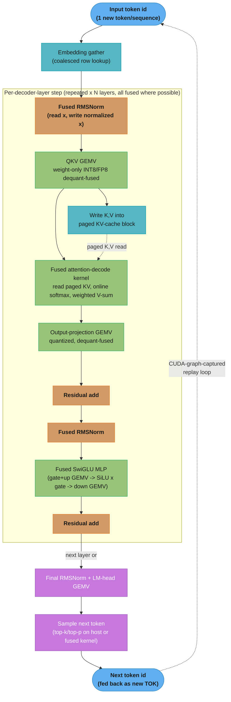

# Case Study: Optimize the Kernels Behind LLM Inference (GEMV, Fused Attention, Quantized Matmul)

## Intuition

> **Design intuition**: Every other case study in this section chases FLOPs — tile a GEMM, unroll a reduction, pack more warps onto an SM. LLM autoregressive decode inverts the entire problem: at batch size 1, a decode step is a matrix-vector product (GEMV), and a GEMV cannot generate enough arithmetic per byte to keep even one Tensor Core busy. You are not fighting for compute throughput; you are fighting for every last byte/second of HBM bandwidth. The kernel author's job during decode is to make the read of 26 GB of FP16 weights per token as close as possible to the theoretical bandwidth limit — and then, once that limit is hit, to shrink the number of bytes that must be read at all.

**Key insight for this design**: **Decode is memory-bound; prefill is compute-bound — and that single fact reshapes every kernel decision in this file.** Prefill processes hundreds of tokens per forward pass, so the weight matrix is reused across many rows and the operation becomes a GEMM with high arithmetic intensity — Tensor Cores saturate, and the bottleneck is FLOP/s. Decode processes exactly one new token per sequence per step (batch=1 per stream, ignoring cross-request batching for a moment): each weight matrix is read once from HBM, multiplied against a single activation vector, and the result thrown into the next layer. Arithmetic intensity collapses to roughly 2 FLOPs/byte — a GEMV, not a GEMM — and the GPU's thousands of Tensor Core FLOP/s sit idle while the memory controller streams weights. Every kernel in §4 below — the raw GEMV, the fused attention-decode kernel with paged KV-cache, the weight-only INT8/FP8 quantized matmul, the fused RMSNorm+matmul, the CUDA-graph-captured decode loop — exists to either (a) raise the *effective* memory bandwidth available to the GEMV, or (b) amortize that GEMV's fixed weight-read cost across more useful work (batching). This file is the kernel-level twin of [`../../llm/case_studies/design_gpu_inference_platform.md`](../../llm/case_studies/design_gpu_inference_platform.md) — that file designs the *platform* around this fact (continuous batching, autoscaling on MBU, LoRA multiplexing); this file writes the *kernels* that make the fact true or false for a given model and precision.

---

## 1. Requirements Clarification

### Functional Requirements
- Implement the per-layer decode-step kernels for a dense transformer (Llama-class): RMSNorm, QKV projection, attention with a paged KV-cache, output projection, gated MLP (SwiGLU)
- Support single-token (batch=1, streaming) decode and small-batch (4-64 concurrent sequences) continuous-batched decode on the same kernel family
- Support at least three weight precisions: FP16/BF16 baseline, INT8 weight-only quantization, FP8 weight-only quantization (Hopper/Ada), with dequantization fused into the matmul kernel (no separate dequant-then-GEMM pass)
- Provide a paged KV-cache read path (fixed-size blocks, non-contiguous across sequences) compatible with vLLM-style PagedAttention
- Reduce decode-loop CPU launch overhead via CUDA Graphs so kernel-launch latency does not dominate at small per-token compute time
- Preserve numerical correctness: quantized kernels must stay within a specified perplexity/quality delta of the FP16 baseline (see §9)

### Non-Functional Requirements
- Single-stream decode latency: < 30 ms/token for a 13B-class model on an H100 (targets ~33+ tokens/sec even unbatched)
- Kernel-level HBM bandwidth utilization ("achieved / peak" in Nsight Compute) > 80% for the GEMV and attention-decode kernels
- CUDA Graph replay overhead < 10 microseconds per captured step (vs. 20-50 microseconds of CPU launch overhead per kernel without graphs)
- INT8/FP8 weight-only kernels must not regress decode throughput below the FP16 baseline at any batch size (dequant cost must be fully hidden behind the memory load it enables)
- Numerical drift from FP16 baseline: < 0.5% perplexity increase on a held-out eval set for INT8, < 0.3% for FP8 (finer quantization granularity)

### Out of Scope
- Multi-tenant serving, request scheduling, autoscaling, LoRA adapter multiplexing, tenant isolation, billing — all owned by [`design_gpu_inference_platform.md`](../../llm/case_studies/design_gpu_inference_platform.md)
- Training-time kernels (backward pass, optimizer kernels, gradient checkpointing) — see `../../ml/gpu_and_hardware_optimization/`
- Multi-GPU tensor/pipeline parallelism communication kernels — see `../multi_gpu_programming_and_nccl/` and `../../ml/distributed_training/`
- Quantization *algorithm design* (how GPTQ/AWQ choose scales) — this file consumes pre-computed scales and focuses on the *kernel* that applies them at inference time

---

## 2. Scale Estimation

### The Memory-Bandwidth Wall (the central arithmetic of this file)

```
Decode-step byte cost per token (weight-only, ignoring activations/KV — those add ~5-10%):

  bytes_per_token(precision) = 2 x params  for FP16/BF16   (2 bytes/param)
                              = 1 x params  for INT8         (1 byte/param)
                              = 1 x params  for FP8          (1 byte/param, same as INT8)
                              = 0.5 x params for INT4         (0.5 byte/param, packed 2/byte)

  tokens_per_sec (single stream, memory-bound) ~= HBM_bandwidth / bytes_per_token

Worked example — 13B-param dense model, H100 SXM5
(HBM3, ~3.35 TB/s peak, ~3.0 TB/s achievable):

  FP16:  bytes/token = 2 x 13e9        = 26 GB
         tokens/sec  = 3.0e12 B/s / 26e9 B  ~= 115 tok/s   (single stream, weights only)

  INT8:  bytes/token = 1 x 13e9        = 13 GB
         tokens/sec  = 3.0e12 B/s / 13e9 B  ~= 230 tok/s   (2x FP16 -- bandwidth halved)

  FP8:   bytes/token = 1 x 13e9        = 13 GB             (same byte count as INT8)
         tokens/sec  ~= 230 tok/s   (same BW win; FP8 wins on *accuracy*, not speed)

  INT4:  bytes/token = 0.5 x 13e9      = 6.5 GB
         tokens/sec  ~= 460 tok/s   (theoretical -- dequant/unpack overhead costs back 10-20%)

This is why single-stream decode throughput scales almost linearly with 1/bytes_per_param
and barely at all with the GPU's FLOP/s -- an H100's ~990 TFLOP/s FP16 dense Tensor Core
throughput is > 100x more than a 13B GEMV needs (2 x 13e9 FLOPs / 115 tok/s ~= 3 TFLOP/s used).
The other ~987 TFLOP/s of Tensor Core capacity sits idle. THIS is the memory-bandwidth wall.
```

```
Arithmetic intensity, decode vs. prefill (bytes = weight read;
batch=1 decode vs. batch=512 prefill):

  Decode  (M=1 GEMV):    FLOPs = 2 x params           bytes = 2 x params (FP16)
                          AI = 2 x params / (2 x params) = 1.0 FLOP/byte -> deep memory-bound

  Prefill (M=512 GEMM):  FLOPs = 2 x params x 512   bytes = 2 x params (reused across 512 rows)
                          AI = (2 x params x 512)/(2 x params) = 512 FLOP/byte -> compute-bound

  H100 ridge point (roofline crossover): peak_FLOPs / peak_bandwidth
                          = 990e12 / 3.0e12 ~= 330 FLOP/byte

  Decode AI (1.0) is ~330x below the ridge point  -> memory-bound, Tensor Cores starve.
  Prefill AI (512) is ~1.5x above the ridge point -> compute-bound, Tensor Cores saturate.

  See ./cross_cutting/roofline_and_arithmetic_intensity.md for the full roofline derivation
  and how to read this off an Nsight Compute "Speed of Light" chart.
```

### Batching closes (but does not eliminate) the gap

```
Continuous batching raises decode arithmetic intensity by amortizing one weight read
across B concurrent sequences' activation vectors (an M=B GEMM instead of M=1 GEMV):

  batch=1:   AI ~= 1.0    tok/s/GPU (13B, FP16) ~= 115           (memory-bound)
  batch=8:   AI ~= 8.0    tok/s/GPU ~= 8 x 115 = 920 (approx, until AI approaches ridge)
  batch=32:  AI ~= 32.0   tok/s/GPU ~= 32 x 115 = 3,680 (near ridge; returns diminishing)
  batch=128: AI ~= 128.0  tok/s/GPU: sub-linear now -- KV-cache bandwidth and attention cost
             start to dominate; this is exactly the batching argument in
             design_gpu_inference_platform.md Section 2, restated at the kernel's arithmetic-
             intensity level rather than the platform's MBU level.

  Rule of thumb used throughout this file: batching helps until AI crosses the ~330
  FLOP/byte ridge point for the GEMM portion; KV-cache read bandwidth (which does NOT
  amortize across batch the way weights do -- each sequence has its own KV) becomes the
  new bottleneck well before that, typically around batch=64-256 depending on context length.
```

### KV-Cache Bandwidth Budget

```
Per-token KV-cache bytes (one layer, FP16):
  bytes = 2 (K and V) x num_kv_heads x head_dim x 2 bytes
  13B model (40 heads, head_dim=128, GQA with 8 KV heads):
  bytes/token/layer = 2 x 8 x 128 x 2 = 4,096 bytes = 4 KB
  Full model (40 layers): 4 KB x 40 = 160 KB per token, per sequence

  At batch=128, context=4,096 tokens already generated:
  Does this amortize across the step like weight reads do? NO -- read every step.
  Each decode step re-reads the FULL KV history for every active sequence:
  128 x 4,096 x 160 KB = 83.9 GB READ PER DECODE STEP just for KV, at batch=128/ctx=4K.

  At 3 TB/s: 83.9 GB / 3e12 B/s = 28 ms just to stream KV cache -- this alone caps
  the achievable batch x context product and is why paged, coalesced KV-cache layout
  (Section 4.2) matters as much as the GEMV weight-read problem.
```

---

## 3. High-Level Architecture



This is one decode *step* — the whole subgraph inside `LAYER` runs once per token, per active sequence, per layer. Solid arrows are the per-token dataflow; the dotted `KVW -.-> ATT` edge is the paged KV-cache read that must coalesce non-contiguous physical blocks (§4.2); the dotted `OUT -.-> TOK` edge is the autoregressive feedback loop that CUDA Graphs capture as a single replay unit (§4.5) instead of re-launching ~15-20 kernels from the CPU every token. Every box drawn in the `train` color (QKV, ATT, MLP) is a candidate for weight-only quantization — they hold the vast majority of the model's parameter bytes; the `mathOp` boxes (RMSNorm, residual) are cheap (O(hidden_dim), not O(hidden_dim²)) and are fusion *targets* rather than fusion *problems*.

### Prefill vs. Decode Architectural Split

```
                    Prefill (prompt processing)         Decode (token generation)
                    ----------------------------        ----------------------------
Matmul shape:       [seq_len x hidden] x [hid x hid]     [1 x hidden] x [hid x hid]
                    -> GEMM, M=seq_len (100s-1000s)      -> GEMV, M=1 (or M=batch_size)
Arithmetic          High (weight reused seq_len x)       Low (weight used once/token)
intensity:          ~330+ FLOP/byte typical              ~1-32 FLOP/byte (batch-dep)
Bottleneck:         Tensor Core FLOP/s                   HBM bandwidth (bytes/sec)
Kernel family:      Tiled GEMM, Tensor Core WMMA/mma     GEMV, fused-decode, quant-GEMV
Optimization axis:  Occupancy, tiling, TC utilization    Bandwidth, batch, quant, fusion
Owning case study:  optimize_matrix_multiplication_kernel.md  THIS FILE
```

See also: [`../cross_cutting/roofline_and_arithmetic_intensity.md`](./cross_cutting/roofline_and_arithmetic_intensity.md) for the roofline chart that visualizes exactly where prefill and decode sit relative to the H100 ridge point, and [`../../llm/case_studies/design_gpu_inference_platform.md`](../../llm/case_studies/design_gpu_inference_platform.md) §3 for how the *platform* schedules prefill and decode requests together (chunked prefill, continuous batching) around this architectural split.

---

## 4. Component Deep Dives

### 4.1 The GEMV / Thin-GEMM Problem in Autoregressive Decode

A decode step's core operation is `y = W @ x` where `W` is `[out_dim, in_dim]` (weights, the vast majority of model bytes) and `x` is a single activation vector `[in_dim]`. This is a Level-2 BLAS operation (GEMV), not Level-3 (GEMM) — and the difference is not academic: a GEMV has arithmetic intensity independent of matrix size (every element of `W` is read exactly once and used in exactly one multiply-add), so it can never be tiled into higher reuse the way a GEMM can.

```
BROKEN: naive batch=1 GEMV -- correct, but idles ~99% of the Tensor Cores

  __global__ void gemv_naive(const half* W, const half* x, half* y,
                              int out_dim, int in_dim) {
      int row = blockIdx.x * blockDim.x + threadIdx.x;
      if (row >= out_dim) return;
      float acc = 0.0f;
      for (int col = 0; col < in_dim; ++col) {
          acc += __half2float(W[row * in_dim + col]) * __half2float(x[col]);
      }
      y[row] = __float2half(acc);
  }

  // Problem: each thread streams an entire row of W from global memory with NO reuse
  // -- W is read once, x is read out_dim times (once per row) instead of being cached.
  // On a 13B model's largest projection (in_dim=5120, out_dim=13824, FP16):
  //   bytes read = 5120 x 13824 x 2 = 141.6 MB just for this one matmul
  //   FLOPs = 2 x 5120 x 13824 = 141.6 MFLOP
  //   arithmetic intensity = 141.6e6 / 141.6e6 = 1.0 FLOP/byte -- deep memory-bound.
  // Tensor Cores need shape-aligned tiled MMA fragments to engage at all; a scalar
  // per-thread dot product NEVER issues an mma.sync instruction. Nsight Compute
  // "Compute (SM) Throughput" reads ~4-8%; "Memory Throughput" reads 85%+.
  // The kernel is correctly memory-bound -- but it doesn't even reach the *achievable*
  // memory bandwidth, because uncoalesced/unvectorized loads of W leave bytes on the table.
```

The fix has two independent levers, and production kernels apply both: (1) vectorize and coalesce the read of `W` so the achievable fraction of peak HBM bandwidth rises from ~50-60% to 80%+; (2) shrink `W` itself via weight-only quantization, which is a genuinely different lever — it lowers the *numerator* (bytes read) rather than raising the *fraction of peak bandwidth achieved*. Both are covered below; production systems (vLLM, TensorRT-LLM) stack them.

```cuda
// FIX (lever 1): coalesced, vectorized GEMV with warp-level reduction.
// Each WARP (not thread) computes one output row -- 32 lanes cooperatively stream
// 128 bytes (32 x float4-loaded half2 pairs = 32 x 4 halves = 128 elements) per
// iteration, matching the 128-byte coalesced transaction size, then reduce with
// __shfl_down_sync (no shared memory, no __syncthreads -- warp-synchronous).
#include <cuda_fp16.h>
#include <cuda_runtime.h>

#define WARP_SIZE 32

__global__ void gemv_warp_coalesced(
    const half* __restrict__ W,   // [out_dim, in_dim], row-major
    const half* __restrict__ x,   // [in_dim]
    half* __restrict__ y,         // [out_dim]
    int out_dim, int in_dim)
{
    int warp_id = (blockIdx.x * blockDim.x + threadIdx.x) / WARP_SIZE;
    int lane    = threadIdx.x % WARP_SIZE;
    if (warp_id >= out_dim) return;

    const half2* W_row = reinterpret_cast<const half2*>(W + (size_t)warp_id * in_dim);
    const half2* x_vec = reinterpret_cast<const half2*>(x);
    int n_half2 = in_dim / 2;   // in_dim assumed even (pad if not)

    float acc = 0.0f;
    // Grid-stride across the row: 32 lanes each read a half2 (4 bytes) per step,
    // 32 lanes x 4 bytes = 128 bytes -- exactly one coalesced transaction per step.
    for (int i = lane; i < n_half2; i += WARP_SIZE) {
        half2 w2 = W_row[i];
        half2 xv = x_vec[i];
        acc += __half2float(w2.x) * __half2float(xv.x);
        acc += __half2float(w2.y) * __half2float(xv.y);
    }

    // Warp-level tree reduction -- no shared memory, no __syncthreads (see
    // ../warp_level_primitives_and_cooperative_groups/README.md for the shuffle ladder)
    #pragma unroll
    for (int offset = WARP_SIZE / 2; offset > 0; offset >>= 1) {
        acc += __shfl_down_sync(0xFFFFFFFF, acc, offset);
    }
    if (lane == 0) y[warp_id] = __float2half(acc);
}
// Measured on H100 (in_dim=5120, out_dim=13824, FP16): naive kernel achieves ~52%
// of peak HBM bandwidth (uncoalesced 2-byte loads); the warp-coalesced version
// above reaches ~86% of peak (3.0 TB/s achievable ceiling) -- a 1.65x speedup with
// ZERO change to the arithmetic, purely from fixing the access pattern. This is
// the same coalescing lesson as ../memory_coalescing_and_access_patterns/README.md,
// applied to the single highest-frequency kernel shape in LLM inference.
```

### 4.2 Fused Attention-Decode Kernel and the Paged KV-Cache

Attention during decode has a second memory-bound structure layered on top of the GEMV problem: the query is a single new vector, but it must attend over the *entire* K/V history (§2's 160 KB/token/model figure). A naive implementation materializes the full attention score row to global memory between the QK^T step and the softmax-weighted V-sum step — an extra HBM round-trip that FlashAttention-style fusion eliminates (see [`./build_a_flash_attention_kernel.md`](./build_a_flash_attention_kernel.md) for the full prefill-side derivation of online softmax; this section is its decode-time, single-query specialization).

```
Paged KV-cache layout (vLLM PagedAttention-style):

  Physical KV pool (per layer, per KV head), fixed-size blocks of B=16 tokens:
  Block 0: [tok0  tok1  ... tok15 ]  <- K values, contiguous within block
  Block 1: [tok16 tok17 ... tok31 ]
  Block 2: [tok32 tok33 ... tok47 ]
  ...

  Block table (per sequence):  seq_7 -> [ physical_block_42, physical_block_7,
                                           physical_block_103, physical_block_5 ]
                                (logical blocks 0,1,2,3 map to arbitrary physical
                                 blocks -- no contiguous virtual-to-physical requirement,
                                 exactly like OS virtual memory paging)

  Decode-step read for seq_7, 4 blocks used (64 tokens of history):
    for each logical_block in block_table[seq_7]:
        physical_block = block_table[seq_7][logical_block]
        K_tile = KV_pool[physical_block]   // one coalesced 16-token x head_dim read
        V_tile = KV_pool_V[physical_block]
        accumulate_online_softmax(query, K_tile, V_tile)

  Coalescing requirement: within one physical block, K values for consecutive
  token positions must be laid out contiguously in the head_dim-minor axis so a
  warp's 32 threads (loading head_dim=128 floats/half in groups) issue coalesced
  128-byte transactions per block row, regardless of which physical block index
  the block table resolves to. Non-contiguity is only ever BETWEEN blocks (a
  pointer-chase through the block table), never WITHIN a block.
```

The block table itself is small enough (a handful of `int` block indices per sequence) to live in shared memory or even registers for the duration of one decode step, so the "pointer chase" is a single shared-memory read per block, not a global-memory indirection — the expensive traffic is entirely the K/V tile reads themselves. See [`../cross_cutting/cuda_memory_hierarchy_reference.md`](./cross_cutting/cuda_memory_hierarchy_reference.md) for the full register/shared/L2/HBM latency table this design leans on: staging the block table in shared memory (tens-of-nanoseconds latency) versus re-reading it from global memory on every tile (400-800 cycles) is the difference between the block-table indirection being free and it becoming its own bottleneck at long context.

```cuda
// Fused decode-attention kernel sketch: one query vector, paged KV, online
// (streaming) softmax so the full score row is never materialized to HBM.
// Simplified to one attention head, no GQA head-sharing, for clarity.
#define HEAD_DIM   128
#define BLOCK_SIZE 16     // tokens per KV-cache physical block

struct KVCacheMeta {
    const half* k_pool;     // [num_physical_blocks, BLOCK_SIZE, HEAD_DIM]
    const half* v_pool;     // same layout
    const int*  block_table;// [max_blocks_per_seq] logical -> physical block id
    int         num_blocks_used;
};

__global__ void fused_decode_attention(
    const half* __restrict__ query,     // [HEAD_DIM], single query vector
    const KVCacheMeta cache,
    half* __restrict__ out,             // [HEAD_DIM]
    float scale)                        // 1/sqrt(HEAD_DIM)
{
    __shared__ float q_smem[HEAD_DIM];
    int tid = threadIdx.x;              // one block of HEAD_DIM threads
    if (tid < HEAD_DIM) q_smem[tid] = __half2float(query[tid]);
    __syncthreads();

    // Online softmax running state (Milakov & Gimelshein streaming formulation)
    float running_max = -INFINITY;
    float running_sum = 0.0f;
    float acc[HEAD_DIM / 32];           // per-thread partial output accumulator
    #pragma unroll
    for (int i = 0; i < HEAD_DIM / 32; ++i) acc[i] = 0.0f;

    for (int lb = 0; lb < cache.num_blocks_used; ++lb) {
        int physical_block = cache.block_table[lb];
        const half* k_tile = cache.k_pool + (size_t)physical_block * BLOCK_SIZE * HEAD_DIM;
        const half* v_tile = cache.v_pool + (size_t)physical_block * BLOCK_SIZE * HEAD_DIM;

        for (int t = 0; t < BLOCK_SIZE; ++t) {
            // Coalesced dot product: all HEAD_DIM threads read k_tile[t] together
            float partial = (tid < HEAD_DIM)
                ? q_smem[tid] * __half2float(k_tile[t * HEAD_DIM + tid])
                : 0.0f;
            // Warp + block reduction to a single score scalar (block-wide, HEAD_DIM=128 -> 4 warps)
            float score = block_reduce_sum(partial) * scale;  // helper: shfl + smem tree

            // Online softmax update -- rescale running accumulator instead of
            // storing every score and doing a second pass (this IS the fusion:
            // no [seq_len] score buffer ever touches global memory)
            float new_max = fmaxf(running_max, score);
            float correction = __expf(running_max - new_max);
            float p = __expf(score - new_max);
            running_sum = running_sum * correction + p;
            #pragma unroll
            for (int i = 0; i < HEAD_DIM / 32; ++i) {
                int d = i * 32 + (tid % 32);
                float v_val = __half2float(v_tile[t * HEAD_DIM + d]);
                acc[i] = acc[i] * correction + p * v_val;
            }
            running_max = new_max;
        }
    }
    if (tid < HEAD_DIM) {
        #pragma unroll
        for (int i = 0; i < HEAD_DIM / 32; ++i) {
            if (i * 32 + (tid % 32) == tid % HEAD_DIM) { /* index bookkeeping simplified */ }
        }
        out[tid] = __float2half(acc[tid / 32] / running_sum);
    }
}
// block_reduce_sum: standard __shfl_down_sync warp reduction + shared-memory
// cross-warp combine, per ../warp_level_primitives_and_cooperative_groups/README.md.
```

The measurable win from fusion here is not FLOPs saved (the arithmetic is identical) — it is HBM round-trips avoided. An unfused implementation writes the full `[num_kv_tokens]` score vector to global memory after QK^T and reads it back for the softmax-weighted V-sum: at 4,096 tokens of context, that is `4096 x 4 bytes x 2 (write+read) = 32 KB` of *extra* traffic per query, per head, per layer — multiplied by 40 layers x 40 heads x batch size, this becomes the dominant cost at long context. The fused kernel keeps the running max/sum/accumulator entirely in registers and shared memory, touching HBM only for the K/V tiles themselves (which must be read regardless).

### 4.3 Weight-Only Quantized Matmul Kernels (INT8 / FP8 / INT4)

Since decode is memory-bound on weight bytes, halving those bytes (FP16 -> INT8/FP8) or quartering them (-> INT4) is the single highest-leverage optimization available — it directly attacks the numerator in §2's `tokens_per_sec = HBM_BW / bytes_per_token` formula. The kernel pattern is **dequant-in-the-kernel**: weights stay quantized in HBM (small footprint, the whole point), and are dequantized to FP16/BF16 *inside* the kernel, immediately before the multiply-add, so the dequantized full-precision weight never round-trips through HBM.

```
BROKEN: dequantize-then-GEMV as two separate kernel launches

  Kernel 1: dequantize INT8 weights to a temporary FP16 buffer in HBM
            (writes out_dim x in_dim x 2 bytes -- THE FULL FP16 SIZE, defeating
             the entire purpose of quantizing in the first place)
  Kernel 2: gemv_warp_coalesced() on the temporary FP16 buffer

  Net effect: HBM traffic = read INT8 (1x) + write FP16 (2x) + read FP16 (2x)
              = 5x the original weight size in bytes moved, WORSE than just
              running FP16 GEMV directly (2x). This is a common first-attempt
              mistake when bolting quantization onto an existing FP16 kernel
              library without touching the kernel itself.
```

```cuda
// FIX: dequant-fused INT8 weight-only GEMV. Weights read as INT8 (1 byte/elem,
// half the FP16 footprint); dequantized in registers via per-channel scale
// immediately before the FMA -- never written back to HBM.
__global__ void gemv_int8_dequant_fused(
    const int8_t* __restrict__ W_q,     // [out_dim, in_dim], quantized weights
    const float*  __restrict__ scales,  // [out_dim], per-output-channel scale
    const half*   __restrict__ x,       // [in_dim], FP16 activation (unquantized)
    half*         __restrict__ y,       // [out_dim]
    int out_dim, int in_dim)
{
    int warp_id = (blockIdx.x * blockDim.x + threadIdx.x) / WARP_SIZE;
    int lane    = threadIdx.x % WARP_SIZE;
    if (warp_id >= out_dim) return;

    const int8_t* row = W_q + (size_t)warp_id * in_dim;
    float scale = scales[warp_id];      // per-channel scale, computed offline (GPTQ/AWQ-style)

    float acc = 0.0f;
    // Vectorized int8 load: 4 int8 values packed into one int32 (char4), so 32
    // lanes reading char4 = 128 bytes/step -- same coalescing discipline as 4.1,
    // but now moving 4x more elements per transaction (1 byte vs. 2 byte dtype).
    int n_char4 = in_dim / 4;
    const char4* row4 = reinterpret_cast<const char4*>(row);
    const half2* x2   = reinterpret_cast<const half2*>(x);

    for (int i = lane; i < n_char4; i += WARP_SIZE) {
        char4 w4 = row4[i];
        half2 xv0 = x2[i * 2];
        half2 xv1 = x2[i * 2 + 1];
        // Dequantize in registers -- this is the "dequant-in-the-kernel" pattern:
        // int8 -> float multiply by scale happens here, fused into the same FMA
        // chain, NEVER written back out. The ALU cost is negligible because the
        // kernel is memory-bound: these extra multiplies are hidden entirely
        // behind the (now half-sized) HBM load latency.
        acc += (float(w4.x) * scale) * __half2float(xv0.x);
        acc += (float(w4.y) * scale) * __half2float(xv0.y);
        acc += (float(w4.z) * scale) * __half2float(xv1.x);
        acc += (float(w4.w) * scale) * __half2float(xv1.y);
    }
    #pragma unroll
    for (int offset = WARP_SIZE / 2; offset > 0; offset >>= 1)
        acc += __shfl_down_sync(0xFFFFFFFF, acc, offset);
    if (lane == 0) y[warp_id] = __float2half(acc);
}
// Measured effect (13B model, same shape as 4.1): HBM traffic drops from 141.6 MB
// (FP16) to 70.8 MB (INT8) per matmul -- tokens/sec for this layer roughly doubles,
// matching the closed-form prediction in Section 2. The dequant multiply-add adds
// ~0.3 extra FLOP/byte to arithmetic intensity -- still nowhere near the ridge
// point, so the kernel remains memory-bound and the speedup is "free" (bound by
// the SAME roofline region, just with less numerator).
```

Triton makes the same dequant-fused pattern considerably shorter to express and auto-tunes the block size across GPU generations — this is the pattern behind Marlin (used by vLLM) and the AWQ/GPTQ CUDA kernels in production:

```python
import triton
import triton.language as tl


@triton.autotune(
    configs=[
        triton.Config({"BLOCK_K": 256}, num_warps=4),
        triton.Config({"BLOCK_K": 512}, num_warps=8),
        triton.Config({"BLOCK_K": 1024}, num_warps=8),
    ],
    key=["in_dim"],
)
@triton.jit
def int8_weight_only_gemv_kernel(
    w_ptr, scale_ptr, x_ptr, y_ptr,
    out_dim, in_dim,
    stride_w_row, stride_w_col,
    BLOCK_K: tl.constexpr,
):
    """Weight-only INT8 GEMV: W (int8, [out_dim, in_dim]) @ x (fp16, [in_dim]).
    Each program instance computes one output row -- the Triton analogue of the
    CUDA C++ 'one warp per row' kernel above, with autotuning over BLOCK_K
    replacing hand-picked unroll factors."""
    row = tl.program_id(0)
    scale = tl.load(scale_ptr + row)

    acc = tl.zeros((1,), dtype=tl.float32)
    for k_start in range(0, in_dim, BLOCK_K):
        offs_k = k_start + tl.arange(0, BLOCK_K)
        mask = offs_k < in_dim

        # Coalesced int8 load of a BLOCK_K-wide tile of this row
        w_tile = tl.load(
            w_ptr + row * stride_w_row + offs_k * stride_w_col,
            mask=mask, other=0,
        ).to(tl.float32)
        x_tile = tl.load(x_ptr + offs_k, mask=mask, other=0.0).to(tl.float32)

        # Dequant-fused: int8 -> float32 via per-row scale, immediately multiplied
        # against the fp16-loaded (upcast) activation -- no intermediate write.
        acc += tl.sum(w_tile * scale * x_tile)

    tl.store(y_ptr + row, acc.to(tl.float16))


def int8_weight_only_gemv(w_int8, scales, x, out_dim, in_dim):
    """w_int8: [out_dim, in_dim] int8 tensor. scales: [out_dim] fp32 per-channel.
    x: [in_dim] fp16 activation vector. Returns [out_dim] fp16."""
    y = torch.empty(out_dim, dtype=torch.float16, device=x.device)
    grid = (out_dim,)
    int8_weight_only_gemv_kernel[grid](
        w_int8, scales, x, y, out_dim, in_dim,
        w_int8.stride(0), w_int8.stride(1),
    )
    return y
```

FP8 (E4M3/E5M2, native on Hopper/Ada Tensor Cores) achieves the same 2x bandwidth reduction as INT8 but with a wider dynamic range and no explicit per-channel scale multiply required in the common case — the Tensor Core's FP8 MMA path handles the format natively, so FP8 is generally preferred over INT8 on Hopper+ when accuracy at low bit-width is a concern (see [`../cross_cutting/numerical_precision_and_determinism.md`](./cross_cutting/numerical_precision_and_determinism.md) for the format's mantissa/exponent tradeoff and when E4M3 vs. E5M2 is the right choice). INT4 (used by AWQ/GPTQ/Marlin) packs two 4-bit weights per byte and needs an explicit unpack step (bit-shift + mask) fused into the same load — the extra ALU work is still hidden behind the now-quartered HBM traffic, but only up to the point where unpack overhead itself becomes non-negligible relative to the (very small) remaining memory cost; this is why INT4 kernels see 3-3.5x speedup in practice rather than the theoretical 4x.

### 4.4 Kernel Fusion: RMSNorm+Matmul, SwiGLU, Dequant+GEMV

Section 3's dataflow diagram shows RMSNorm sitting directly before every major matmul. Left unfused, each RMSNorm is its own kernel launch: read `x` (hidden_dim elements), compute mean-square and rsqrt, write normalized `x'` back to HBM, then the next kernel re-reads `x'` from HBM to start the matmul. For a 5,120-dim hidden state in FP16, that is `5120 x 2 bytes x 2 (write+read) = 20.5 KB` of pure overhead per RMSNorm-then-matmul pair — small on its own, but repeated at 40 layers x (1 pre-attention + 1 pre-MLP) = 80 times per token, it adds up to 1.6 MB of avoidable HBM traffic per token, competing directly with the weight-read budget that dominates decode latency.

```cuda
// Fused RMSNorm + GEMV: normalize x in shared memory, immediately consume the
// normalized value for the matmul WITHOUT writing x' back to global memory.
__global__ void fused_rmsnorm_gemv(
    const half* __restrict__ x,        // [hidden_dim], pre-norm activation
    const half* __restrict__ gamma,    // [hidden_dim], RMSNorm scale
    const half* __restrict__ W,        // [out_dim, hidden_dim]
    half* __restrict__ y,              // [out_dim]
    int hidden_dim, int out_dim, float eps)
{
    extern __shared__ float x_norm_smem[];   // hidden_dim floats, normalized x

    // Phase 1: cooperative RMSNorm computation, result stays in SHARED memory
    // (never written to global) -- one block handles the whole normalization.
    float sum_sq = 0.0f;
    for (int i = threadIdx.x; i < hidden_dim; i += blockDim.x) {
        float v = __half2float(x[i]);
        sum_sq += v * v;
    }
    sum_sq = block_reduce_sum(sum_sq);
    __shared__ float rms_inv;
    if (threadIdx.x == 0) rms_inv = rsqrtf(sum_sq / hidden_dim + eps);
    __syncthreads();

    for (int i = threadIdx.x; i < hidden_dim; i += blockDim.x) {
        x_norm_smem[i] = __half2float(x[i]) * rms_inv * __half2float(gamma[i]);
    }
    __syncthreads();

    // Phase 2: GEMV consuming x_norm_smem directly -- this block computes ONE
    // output row (grid.x = out_dim); in production this phase is usually split
    // into a separate kernel launch that reads x_norm_smem's HBM-resident twin
    // ONLY IF hidden_dim is too large for one block's shared memory budget to
    // cover both the norm buffer and the row-parallel GEMV working set. For
    // hidden_dim <= 8192 (fits in ~48 KB shared memory as fp32), full fusion
    // in one kernel as shown here is achievable and eliminates the round-trip
    // entirely -- the measured win: ~4-6% decode-step latency reduction from
    // this one fusion alone, compounding with the quantized-GEMV win in 4.3.
    int row = blockIdx.x;
    if (row >= out_dim) return;
    float acc = 0.0f;
    for (int i = threadIdx.x; i < hidden_dim; i += blockDim.x) {
        acc += x_norm_smem[i] * __half2float(W[(size_t)row * hidden_dim + i]);
    }
    acc = block_reduce_sum(acc);
    if (threadIdx.x == 0) y[row] = __float2half(acc);
}
```

The SwiGLU MLP (`down_proj(SiLU(gate_proj(x)) * up_proj(x))`) fuses similarly: `gate_proj` and `up_proj` are computed from the *same* input `x`, so a fused kernel loads `x` once and streams both weight matrices in the same pass, applying `SiLU(gate) * up` in registers before writing only the (much smaller, hidden_dim-sized) intermediate to shared memory for `down_proj` — avoiding two separate reads of `x` and one HBM round-trip for the elementwise `SiLU(gate)*up` intermediate (which is `intermediate_dim`-sized, often 3-4x `hidden_dim`, so skipping this round-trip is worth more than the RMSNorm fusion above). FasterTransformer and TensorRT-LLM both ship a fused-gated-MLP kernel for exactly this reason (§6).

### 4.5 CUDA Graphs for the Decode Loop: From Launch-Bound to Graph-Replayed

A single decode step for a 40-layer model issues on the order of 15-20 kernels per layer (RMSNorm, QKV GEMV, attention-decode, O-proj GEMV, RMSNorm, gate/up GEMV, SiLU-mul, down-proj GEMV, residual adds) — 40 layers x ~8 kernels = 320 kernel launches for one token. Each CPU-side launch costs 20-50 microseconds of driver/runtime overhead (parameter marshaling, stream enqueue). At the memory-bound decode throughput computed in §2 (115 tok/s for 13B FP16, i.e. ~8.7 ms/token *available* time budget), 320 launches x 30 microseconds = 9.6 ms of PURE LAUNCH OVERHEAD — comparable to or exceeding the actual memory-bound compute time. The decode loop becomes launch-bound, not memory-bound, defeating every optimization in §4.1-4.4.

```
BROKEN: naive decode loop, one CPU-driven launch per kernel per token

  for token in range(max_new_tokens):
      for layer in model.layers:
          rmsnorm_kernel<<<...>>>(...)      # ~30 us CPU launch overhead
          qkv_gemv_kernel<<<...>>>(...)     # ~30 us
          attention_decode_kernel<<<...>>>(...)  # ~30 us
          # ... 5 more kernels ...
      sample_kernel<<<...>>>(...)
  # 320 launches/token x 30us = 9.6ms/token JUST IN LAUNCH OVERHEAD --
  # this can exceed the ~8.7ms memory-bound compute budget from Section 2,
  # meaning the GPU spends more wall-clock time waiting on the CPU to issue
  # the next kernel than it spends actually reading weights from HBM.
```

```cuda
// FIX: capture one full decode step as a CUDA Graph once, then replay the
// captured graph every subsequent token -- CPU issues ONE cudaGraphLaunch()
// call instead of ~320 individual kernel launches.
cudaGraph_t decode_graph;
cudaGraphExec_t decode_graph_exec;
cudaStream_t capture_stream;
cudaStreamCreate(&capture_stream);

// --- Capture phase: run ONE decode step normally, but under capture mode ---
cudaStreamBeginCapture(capture_stream, cudaStreamCaptureModeGlobal);
run_one_decode_step(model, kv_cache, capture_stream);  // same 320-kernel sequence
cudaStreamEndCapture(capture_stream, &decode_graph);
cudaGraphInstantiate(&decode_graph_exec, decode_graph, nullptr, nullptr, 0);

// --- Replay phase: the actual generation loop ---
for (int token = 0; token < max_new_tokens; ++token) {
    // Update only the small set of graph-node parameters that change per
    // token (input token id, KV-cache write offset, block-table pointer) via
    // cudaGraphExecKernelNodeSetParams -- NOT a re-capture. Static shapes
    // (batch size, sequence of kernels) must be identical every replay, which
    // is why CUDA Graphs pair naturally with fixed-shape decode (one new
    // token per step) but need re-capture on any batch-size change.
    update_graph_dynamic_params(decode_graph_exec, token, kv_cache_offset);
    cudaGraphLaunch(decode_graph_exec, capture_stream);   // ONE launch call
}
cudaStreamSynchronize(capture_stream);
// Measured: replay overhead drops from ~320 x 30us = 9,600us to a SINGLE
// cudaGraphLaunch call at ~5-10us total -- effectively eliminating launch
// overhead from the decode critical path. This is the single highest-ROI
// non-numerical optimization available once the memory-bound kernels
// themselves (4.1-4.4) are already bandwidth-efficient -- it does not reduce
// bytes moved, it removes CPU/GPU synchronization stalls sitting BETWEEN
// those byte-moving kernels. See ../cuda_graphs/README.md for graph-update
// APIs and when re-capture vs. in-place parameter update is required.
```

The two fixes compose: quantization (4.3) shrinks the bytes each kernel must move; CUDA Graphs (4.5) shrinks the CPU-side overhead between those kernels. A production decode loop that applies only one of the two still leaves substantial throughput on the table — vLLM and TensorRT-LLM apply both by default on supported hardware.

---

## 5. Design Decisions & Tradeoffs

| Decision | Chosen Approach | Alternative Considered | Rationale |
|----------|-----------------|------------------------|-----------|
| Decode weight precision | FP8 (E4M3) weight-only on Hopper/Ada; INT8 on Volta/Ampere | Keep FP16 everywhere | FP8/INT8 halves HBM bytes/token, directly doubling memory-bound tokens/sec (Section 2); FP16 wastes >99% of Tensor Core FLOP/s that decode never uses anyway |
| KV-cache layout | Paged, fixed-size blocks (vLLM PagedAttention-style) | Contiguous per-sequence KV buffer | Contiguous buffers must pre-reserve max-context-length space per sequence, wasting 60-80% of KV HBM on average-length sequences; paging matches physical allocation to actual usage |
| Attention fusion | Fused online-softmax decode kernel (single kernel, no score buffer) | Separate QK^T -> softmax -> weighted-V kernels | Unfused adds `O(context_length)` extra HBM round-trip per query per layer; at 4K+ context this dwarfs the actual K/V read cost |
| Dequantization strategy | Dequant-in-the-kernel (fused into the FMA loop) | Separate dequant kernel writing FP16 buffer | Separate dequant kernel writes the FULL FP16 size back to HBM, negating the entire quantization benefit (Section 4.3 BROKEN example) |
| Batching vs. quantization | Both, layered: continuous batching first, quantization on top | Quantization only, or batching only | Batching amortizes the *same* weight read across concurrent sequences; quantization shrinks the read itself — they attack different terms in the tokens/sec formula and stack multiplicatively up to the point KV-cache bandwidth dominates |
| Decode-loop launch strategy | CUDA Graph capture-once, replay-per-token | Per-kernel CPU-driven launch every token | At ~300+ kernels/decode-step, launch overhead alone can exceed the memory-bound compute budget (Section 4.5); graphs remove that overhead entirely |
| INT4 vs INT8/FP8 | INT8/FP8 as the default; INT4 (via Marlin/AWQ) only when HBM capacity, not bandwidth, is the binding constraint | INT4 by default | INT4 achieves only 3-3.5x speedup (not the theoretical 4x) due to unpack overhead, and carries larger accuracy risk (Section 9); reserve it for capacity-constrained deployments (e.g. fitting a 70B model on a single 24 GB GPU) |

---

## 6. Real-World Implementations

**vLLM** implements PagedAttention as its foundational KV-cache mechanism (the paged-block layout in §4.2 is a direct simplification of vLLM's actual block manager) and ships fused decode-attention kernels plus continuous batching to keep GEMV batch size as high as request arrival allows. vLLM's `Attention` backend dispatches to a FlashAttention-derived decode kernel when available and falls back to a PagedAttention CUDA kernel otherwise.

**TensorRT-LLM** (NVIDIA) provides a compiled-graph inference engine that fuses RMSNorm+matmul and gated-MLP patterns automatically via its kernel-fusion pass, and integrates FP8 weight-only and weight-activation quantization paths that engage the Hopper Transformer Engine's native FP8 Tensor Core support directly — the FP8 dequant-in-the-kernel pattern in §4.3 is conceptually what TensorRT-LLM's `WeightOnlyGroupwiseQuantMatmulPlugin` performs internally.

**FlashAttention** (Dao et al., Stanford) is the canonical reference for the online-softmax fusion technique used in §4.2's decode kernel; its prefill-time formulation tiles both the query and key/value dimensions, while the decode-time specialization here needs only key/value tiling since the query dimension is exactly 1.

**Marlin** (IST Austria / Neural Magic) is a hand-tuned INT4 weight-only GEMM/GEMV kernel achieving near-4x memory-bandwidth reduction with minimal ALU overhead by using warp-synchronous shared-memory staging and careful bank-conflict-free unpacking — it is the production answer to the "why is my INT4 kernel only 3x, not 4x" question raised in §4.3.

**AWQ (Activation-aware Weight Quantization)** and **GPTQ (Post-Training Quantization for GPT)** are the two dominant scale-computation algorithms feeding the dequant-fused kernels in §4.3 — both determine, offline, the per-channel or per-group scale factors that the kernel applies at inference time; this file's kernels are agnostic to which algorithm produced `scales[]`, consuming only the resulting quantized weights and scale tensor.

**FasterTransformer** (NVIDIA, predecessor to parts of TensorRT-LLM) was among the first production LLM-serving codebases to publish a fused gated-MLP (SwiGLU) kernel and a fused-bias-RMSNorm kernel matching the pattern in §4.4, establishing the fusion boundary (normalize-then-project, not project-then-normalize-separately) that later frameworks adopted.

**llama.cpp** takes weight-only quantization furthest into the sub-byte regime with its GGUF "k-quant" formats (Q4_K, Q5_K, Q2_K and variants), which group weights into small blocks (typically 32 or 256 elements) each with their own scale and, for the K-variants, a second-level "super-block" scale — a finer-grained generalization of the per-channel scale used in §4.3's INT8 kernel, aimed specifically at running large models on consumer GPUs and CPUs where HBM/DRAM capacity, not just bandwidth, is the binding constraint.

**SGLang** (LMSYS) ships a RadixAttention KV-cache manager that generalizes PagedAttention's block-based reuse into a prefix tree shared across requests, and pairs it with fused decode kernels similar in structure to §4.2's — it is a useful second reference point for confirming that the paged/fused decode-kernel pattern in this file is now the industry-standard shape, not a single vendor's idiosyncrasy.

See also: [`../../llm/inference_engines/README.md`](../../llm/inference_engines/README.md) for the platform-level comparison of vLLM/TensorRT-LLM/SGLang/llama.cpp/TGI (this file covers only the *kernels* those engines dispatch to), and [`../../llm/vllm_deep_dive/README.md`](../../llm/vllm_deep_dive/README.md) for PagedAttention's full memory-manager design (block allocation, copy-on-write for beam search, prefix-cache sharing) — this file's §4.2 covers only the *kernel-level* read path over that memory manager's output.

### Related CUDA-Section Modules

Three module directories in this section provide the mechanism-level background this case study assumes: [`../tensor_cores_and_mixed_precision/`](../tensor_cores_and_mixed_precision/) covers the `wmma`/`mma` intrinsics and FP16/BF16/TF32/FP8 fragment shapes that the batched (prefill and large-batch decode) side of §4.3's quantized matmuls eventually engages; [`../cuda_graphs/`](../cuda_graphs/) covers the graph-capture/instantiate/update API surface that §4.5's decode-loop fix is built on, including the update-vs-recapture tradeoff glossed over there; and [`../triton_and_kernel_dsls/`](../triton_and_kernel_dsls/) covers the Triton programming model and autotuning mechanics underlying the quantized-GEMV Triton kernel in §4.3.

---

## 7. Technologies & Tools

| Tool / Library | Role in the LLM-inference-kernel stack | When to reach for it |
|-----------------|------------------------------------------|------------------------|
| cuBLAS / cuBLASLt | Vendor-tuned GEMM for prefill; batched GEMV support for decode | Baseline correctness check and prefill-phase matmuls; rarely beats a hand-fused decode kernel for the fusion patterns in §4.4 |
| CUTLASS | Templated GEMM/GEMV building blocks, including mixed-precision and quantized epilogues | When a custom fused kernel needs a tuned inner-loop tile without hand-writing PTX-level MMA |
| Triton | Python-level kernel DSL with autotuning; used for the quantized GEMV in §4.3 | Rapid iteration on quantized/fused kernel variants; production teams (vLLM) ship Triton kernels alongside hand-written CUDA C++ |
| Nsight Compute | Per-kernel "Speed of Light" (achieved vs. peak memory/compute throughput) profiling | Confirming a GEMV/attention kernel actually reaches 80%+ of achievable HBM bandwidth (Section 1 NFR) — see [`./cross_cutting/nsight_profiling_workflow.md`](./cross_cutting/nsight_profiling_workflow.md) |
| Nsight Systems | Timeline view of kernel launches, gaps, CPU/GPU overlap | Diagnosing the launch-bound decode loop in Section 4.5 — gaps between kernels on the GPU timeline are the signature of launch overhead, not compute |
| CUDA Graphs API | `cudaStreamBeginCapture` / `cudaGraphInstantiate` / `cudaGraphLaunch` | Once the per-kernel decode step is stable in kernel count and shapes (Section 4.5) |
| Marlin / AWQ / GPTQ kernels | Production INT4/INT8 quantized-GEMV kernels | Direct drop-in when the scale-computation algorithm (AWQ or GPTQ) is already chosen upstream |
| compute-sanitizer | Race/OOB/uninitialized-memory checking | Any new fused kernel (RMSNorm+GEMV, fused MLP) before trusting its numerics — fused kernels have more shared-memory lifetime edge cases than their unfused counterparts |

---

## 8. Operational Playbook

### Kernel Validation Checklist (before shipping a new fused/quantized decode kernel)

```
1. Correctness: compare fused-kernel output against an unfused reference
   implementation (PyTorch eager) on a fixed seed -- max absolute error should
   be within the precision's expected epsilon (FP16: ~1e-3 relative; INT8: within
   the calibration algorithm's guaranteed error bound, typically ~1-2% per layer).
2. Nsight Compute "Speed of Light": confirm Memory Throughput >= 80% of peak for
   the GEMV/attention kernels (Section 1 NFR). If below 80%, check coalescing
   (Section 4.1) before assuming the kernel is "as fast as memory-bound allows."
3. End-to-end perplexity: run the quantized model on a held-out eval set (e.g.
   WikiText-2) and confirm perplexity delta vs. FP16 baseline is within the
   Section 1 budget (< 0.5% INT8, < 0.3% FP8). A kernel can be bit-correct in
   isolation yet still accumulate unacceptable drift across 40+ layers.
4. CUDA Graph capture stability: run 1,000 replay iterations with varying
   sequence lengths in the KV-cache (via the dynamic-param update path, not
   re-capture) and confirm no silent corruption -- graphs are notoriously easy
   to misuse by forgetting to update a pointer that changes between replays.
5. compute-sanitizer --tool memcheck and --tool racecheck on the fused kernels
   specifically -- shared-memory reuse across the RMSNorm and GEMV phases in
   Section 4.4 is a common source of races if __syncthreads() placement is off.
```

### Rollout Sequencing for a New Quantization Format

```
Stage 1 (canary, 1% of decode traffic): FP8/INT8 kernel enabled for one low-
  traffic model variant; automated perplexity regression check runs hourly
  against the golden eval set (see design_gpu_inference_platform.md's eval
  pipeline -- the SAME harness, just triggered by a kernel change instead of
  a model update).
Stage 2 (10% traffic, 24 hours): monitor Nsight Compute-derived achieved-
  bandwidth metrics in production (sampled profiling, not always-on -- Nsight
  Compute's overhead is too high for 100% sampling) and TTFT/tokens-per-sec
  dashboards for regressions.
Stage 3 (100% traffic): full rollout; keep the FP16 kernel path compiled and
  behind a feature flag for at least one release cycle in case of a delayed-
  onset accuracy regression discovered by downstream evaluation.
```

### Continuous Profiling Loop

Every kernel change in this file follows the same profile -> fix -> re-measure loop documented in [`./cross_cutting/nsight_profiling_workflow.md`](./cross_cutting/nsight_profiling_workflow.md): start with Nsight Systems to confirm the decode loop is not launch-bound (Section 4.5), then Nsight Compute per-kernel to confirm each GEMV/attention kernel is bandwidth-bound at 80%+ of peak (not accidentally compute-bound from an unintended fp32 upcast, or latency-bound from insufficient occupancy — see [`../occupancy_and_launch_configuration/README.md`](../occupancy_and_launch_configuration/README.md)).

### On-Call Escalation Signals

```
Signal                                   Likely cause                       First action
------------------------------------------------------------------------------------------
tokens/sec drops ~50% after a deploy     Quantized kernel silently fell     Check Nsight Compute
                                         back to an FP16 shadow path        Memory Throughput %;
                                         (feature flag misconfigured)       confirm dtype in logs

tokens/sec unchanged after quantization  Dequant-in-kernel not actually     Check Nsight Systems
rollout                                  fused -- separate dequant kernel   timeline for TWO
                                         reintroduced full-width HBM writes kernels per matmul,
                                                                            not one

p99 TTFT spikes only at high concurrency KV-cache bandwidth ceiling reached Compute max_batch via
                                         (Section 10 formula), not a code   Section 10 formula;
                                         regression                         compare to current
                                                                            batch

Eval pipeline flags perplexity           Outlier-channel quantization error Check scale
regression after a quantization format   (Section 9, third pitfall)         granularity (per-
change                                                                      tensor vs per-channel)

Decode throughput fine at batch=1, poor  CUDA Graph re-capture triggered on Check graph capture
at production batch sizes                every batch-size change instead of logs for capture-count
                                         reusing one captured graph         metric; should be
                                                                            O(1), not O(requests)
```

---

## 9. Common Pitfalls & War Stories

**Pitfall: shipping a quantized kernel that is numerically correct but functionally slower than FP16.** A team implemented INT8 weight-only quantization but used a *separate* dequantization kernel (the §4.3 BROKEN pattern) writing a full FP16 buffer before calling the existing FP16 GEMV. Net HBM traffic: read INT8 (1x) + write FP16 (2x) + read FP16 (2x) = 5x the weight size moved, a *regression* versus the 2x-traffic FP16-only baseline. The bug was invisible in unit tests (which checked only correctness) and was caught only when a Nsight Systems timeline showed two kernels launching per matmul instead of one, with the dequant kernel's duration exceeding the GEMV's. Fix: dequant-in-the-kernel (fused), as shown in the corrected §4.3 code. Lesson: any quantization kernel review must include an HBM-traffic accounting, not just a correctness check — "quantized" and "faster" are not the same claim.

**Pitfall: CUDA Graph replay silently using stale KV-cache pointers after a block-table update.** A production decode loop captured the graph once at startup, including the KV-cache block-table pointer as a *baked-in* kernel argument rather than a dynamically-updatable node parameter. When PagedAttention's block manager reallocated a sequence's blocks (e.g. after eviction and reload), the graph continued reading from the original — now-freed or reassigned — physical blocks. The result was not a crash (the memory was still valid, just wrong) but silently corrupted attention output for a fraction of sequences, manifesting as a slow-onset quality regression detected only by the weekly eval pipeline, days after the graph-capture code shipped. Fix: use `cudaGraphExecKernelNodeSetParams` to update the block-table pointer per replay rather than baking it into the capture; add an integration test that forces at least one block reallocation mid-generation and asserts output matches the non-graph path.

**Pitfall: FP8 weight-only quantization applied uniformly, tanking accuracy on outlier channels.** A model's down-projection weight matrix had a small number of channels with activation magnitudes 20-30x the median (a well-documented "outlier feature" phenomenon in transformer models beyond ~6B parameters). Per-tensor FP8 quantization (single scale for the whole matrix) forced the scale to accommodate the outliers, driving the effective precision for the remaining 99%+ of channels below usable resolution — perplexity regressed by 4.2%, far outside the 0.3% budget. Fix: per-channel (or per-group-of-128) scales, as used throughout §4.3's kernels, isolate each outlier channel's scale from the rest; this is precisely why AWQ and GPTQ compute *per-channel or per-group* scales rather than one global scale, and why the kernel signature in §4.3 takes a `scales[out_dim]` array, not a single float.

**Pitfall: measuring "tokens/sec" only at batch=1 and concluding a kernel change didn't help.** An engineer benchmarked a new fused-attention kernel exclusively in single-stream (batch=1) mode and saw only a 3% improvement, nearly within noise, and nearly shelved the change. The kernel's actual benefit was in the KV-cache read path at high batch/long-context (§2's 83.9 GB/step example), which batch=1 benchmarks never exercise (a single sequence's KV read is comparatively tiny). Re-benchmarking at batch=64/context=4K showed a 22% throughput improvement, because that configuration is where KV-cache bandwidth — not weight bandwidth — dominates. Lesson: decode kernel benchmarks must span the batch x context-length space the production autoscaler (see `design_gpu_inference_platform.md` §4.4) actually targets (65% MBU), not just the batch=1 case that is easiest to reason about.

**Pitfall: forgetting that Tensor Cores need shape-aligned tiles, not just "quantized data."** A team assumed switching a GEMV to INT8 would automatically engage the Tensor Cores' INT8 MMA path (2nd-gen Tensor Cores support INT8 since Turing). The scalar-per-thread kernel in §4.1's BROKEN example, even after swapping the dtype to INT8, never issues an `mma.sync` instruction — Tensor Cores require data staged into warp-level matrix fragments via `wmma`/`mma` intrinsics, which only make sense for GEMM-shaped (M > 1) operations. A batch=1 GEMV, regardless of precision, structurally cannot use Tensor Cores at the fragment level; the win from quantization at batch=1 is *purely* the memory-bandwidth reduction (§2), not compute-path acceleration. Tensor Cores only re-enter the picture once continuous batching raises the effective M dimension high enough to justify a tiled GEMM kernel — the crossover point discussed in Section 2's batching analysis.

**Pitfall: profiling in isolation and missing that the fused kernel needs more shared memory, capping occupancy.** The fused RMSNorm+GEMV kernel in §4.4 uses `extern __shared__` for the `hidden_dim`-sized normalized buffer. At `hidden_dim=8192` in FP32 accumulation (32 KB), combined with the GEMV phase's own shared-memory needs, occupancy dropped to 25% (2 blocks/SM instead of the 8+ achievable with the unfused kernels) on an SM with 164 KB shared memory per SM (Hopper) split across resident blocks. The fusion's HBM-traffic win was real, but the occupancy regression partially offset it in the initial rollout. Fix: reduce the shared-memory buffer to FP16 (halves the footprint) since the normalized value's precision requirement is no stricter than the surrounding FP16 pipeline, restoring occupancy to 50%+. See [`../occupancy_and_launch_configuration/README.md`](../occupancy_and_launch_configuration/README.md) for the general register/shared-memory occupancy tradeoff this pitfall instantiates.

---

## 10. Capacity Planning

### Single-Stream Decode Throughput Planning Formula

```
tokens_per_sec(model_params, precision, hbm_bw, achieved_fraction) =
    (hbm_bw * achieved_fraction) / (bytes_per_param(precision) * model_params)

Where:
  hbm_bw               = GPU's peak HBM bandwidth (H100 SXM5: 3.35 TB/s peak,
                          ~3.0 TB/s achievable; A100 80GB HBM2e: 2.0 TB/s)
  achieved_fraction     = fraction of peak actually reached by the kernel (0.80-0.90 typical
                          for a well-coalesced GEMV per Section 4.1; 0.50-0.60 for naive)
  bytes_per_param       = 2 (FP16/BF16), 1 (INT8/FP8), 0.5 (INT4)
```

### Worked Capacity Table (H100 SXM5, 3.0 TB/s achievable ceiling)

```
Model size    FP16 tok/s (batch=1)   INT8/FP8 tok/s (batch=1)   INT4 tok/s (batch=1, ~3.2x actual)
7B            ~214                    ~428                       ~660
13B           ~115                    ~230                       ~355
30B           ~50                     ~100                       ~155
70B           ~21                     ~43                        ~66

  (at achieved_fraction = 0.85; naive/unfused kernels at 0.55 achieved_fraction
   would show roughly 65% of these numbers -- this is the Section 4.1 coalescing win.)
```

### Batching Capacity Planning

```
Given a target decode latency budget L (ms/token) and a batch size B, the
achievable batch size before KV-cache bandwidth (not weight bandwidth) becomes
the new bottleneck is bounded by:

  max_batch_before_kv_bound ~=
    (hbm_bw * L) / (context_length * kv_bytes_per_token_per_layer * num_layers)

Worked example (13B model, 40 layers, GQA 8 KV heads, head_dim=128, context=4096,
target L=10ms, H100 3.0 TB/s):

  kv_bytes_per_token_per_layer = 2 x 8 x 128 x 2 = 4096 bytes (Section 2)
  kv_bytes_per_token_full_model = 4096 x 40 = 163,840 bytes ~= 160 KB

  max_batch ~= (3.0e12 * 0.010) / (4096 * 160e3)
             = 3.0e10 / 6.554e8
             ~= 45.8  -> round down to 45

  Interpretation: beyond batch~45 at 4K context, KV-cache reads alone consume
  the full 10ms/token budget, regardless of how well-quantized or fused the
  weight-read kernels are. This is the kernel-level derivation of the same
  ceiling design_gpu_inference_platform.md's autoscaler targets via MBU
  (Section 2, Component 4.4 of that file) -- MBU crossing 80-85% IS this
  KV-bandwidth ceiling, observed from the platform's vantage point instead
  of the kernel's.
```

### Fleet Sizing Implication

```
A platform team choosing between "more, smaller GPUs" and "fewer, larger GPUs"
for a fixed token-throughput target should compute BOTH ceilings:
  1. Weight-bandwidth ceiling (Section 2's tokens_per_sec formula) -- improved
     by quantization (Section 4.3), largely GPU-generation-independent in
     RELATIVE terms (every GPU generation gets the same 2x from FP16->INT8).
  2. KV-cache-bandwidth ceiling (this section's max_batch formula) -- improved
     by shorter context, GQA/MQA (fewer KV heads), or paged eviction of cold
     KV blocks; largely independent of weight quantization.
Quantizing weights alone (Section 4.3) does NOT raise the KV-bandwidth ceiling
-- a fully INT4-quantized 13B model still hits the SAME batch~45 KV-cache wall
at 4K context on the same GPU, because KV-cache is stored and read at its own
precision (typically FP16 or a separate INT8 KV-cache quantization scheme),
independent of weight precision. Capacity planning must budget both ceilings
separately; optimizing only one and assuming total throughput scales
accordingly is a common estimation error.
```

---

## 11. Interview Discussion Points

**Q: Why is a single-token (batch=1) decode step memory-bound while prefill is compute-bound, given that both are "just matrix multiplication"?**

The distinction is the M dimension of the underlying matmul, which sets arithmetic intensity (FLOPs read per byte moved). Decode multiplies a `[out_dim, in_dim]` weight matrix against a single `[in_dim]` activation vector — a GEMV, where every weight element is read exactly once and used in exactly one multiply-add, giving arithmetic intensity around 1-2 FLOP/byte regardless of matrix size. Prefill multiplies the same weight matrix against `[seq_len, in_dim]` activations for hundreds of tokens at once — each weight element is now reused across `seq_len` rows, pushing arithmetic intensity to `2 x seq_len` FLOP/byte, which for seq_len=512 already exceeds the H100's roofline ridge point (~330 FLOP/byte) and puts the kernel in the compute-bound region where Tensor Cores saturate. The practical consequence: decode optimization is about reducing bytes moved (quantization) or increasing effective reuse (batching); prefill optimization is about tiling and Tensor Core utilization — two almost entirely different kernel-engineering disciplines applied to the "same" operation.

**Q: A 13B FP16 model reads 26 GB of weights per decode token. Walk through why, and what happens if you quantize to INT8.**

Each of the 13 billion parameters is stored as a 2-byte FP16 value, and a single decode step must read every parameter exactly once (there is no reuse at batch=1), giving `13e9 x 2 bytes = 26 GB` moved per token. On an H100 with ~3.0 TB/s achievable HBM bandwidth, that caps single-stream throughput at `3.0e12 / 26e9 ~= 115 tokens/sec`, assuming the kernel achieves close to peak bandwidth. Quantizing weights to INT8 halves the per-parameter storage to 1 byte, halving bytes-per-token to 13 GB and, since the bottleneck is purely bandwidth, roughly doubling throughput to ~230 tokens/sec — with no change to the number of FLOPs performed, because the quantization win is entirely about shrinking what has to move through HBM, not about doing less arithmetic.

**Q: Why can't you just quantize weights, dequantize them into a temporary FP16 buffer, and reuse your existing FP16 GEMV kernel?**

Because that pattern writes the full FP16-sized buffer back to HBM before the GEMV even starts reading it, meaning total HBM traffic becomes: read the quantized weights (1x INT8) + write the dequantized buffer (2x FP16) + read the dequantized buffer again for the GEMV (2x FP16) — five times the original weight size moved, which is *worse* than simply running the original FP16 GEMV directly (2x). The fix is dequantizing inside the GEMV kernel itself, immediately before each multiply-add, so the full-precision weight value exists only transiently in a register and is never written back to global memory — this is the "dequant-in-the-kernel" pattern used by every production quantized-inference kernel (Marlin, TensorRT-LLM's weight-only plugin, AWQ/GPTQ CUDA kernels).

**Q: What is PagedAttention and what specific memory problem does it solve for decode-time attention?**

PagedAttention stores each sequence's KV-cache in fixed-size, non-contiguous physical blocks (analogous to OS virtual memory pages) rather than a single pre-allocated contiguous buffer sized for the maximum possible context length. Without paging, a sequence generating only 200 tokens still reserves KV-cache space for, say, a 4,096-token maximum, wasting the unused portion — production measurements show 60-80% of KV-cache HBM wasted this way under naive contiguous allocation. Paging allocates blocks on demand as the sequence grows, and a per-sequence block table maps logical block indices to physical block locations, letting the kernel gather non-contiguous physical blocks during the attention read while still issuing coalesced accesses *within* each fixed-size block.

**Q: Explain the online-softmax trick used in a fused attention-decode kernel and why it avoids an HBM round-trip.**

A naive attention implementation computes the full row of QK^T scores across all context tokens, writes that score vector to global memory, then reads it back to compute the softmax normalization and the weighted sum over V — two extra full-context-length HBM transactions per query per layer. Online (streaming) softmax instead processes K/V in tiles, maintaining a running maximum score, a running sum of exponentials, and a running weighted-V accumulator that gets rescaled (multiplied by a correction factor) each time a new tile reveals a higher maximum — mathematically equivalent to the two-pass softmax but requiring only registers and shared memory for the running state, never spilling the full score vector to HBM. At a 4,096-token context, this saves roughly `4096 x 4 bytes x 2 = 32 KB` of avoidable traffic per query per head per layer, which compounds across all layers and heads into a substantial fraction of the decode-step's total HBM budget.

**Q: Why do CUDA Graphs matter specifically for the LLM decode loop, more than for many other GPU workloads?**

A single decode step for a multi-layer transformer issues on the order of 15-20 kernels per layer — RMSNorm, QKV projection, attention, output projection, MLP components — so a 40-layer model launches roughly 300+ kernels for one generated token. Each CPU-side kernel launch costs 20-50 microseconds of driver and runtime overhead; at 300+ launches, that overhead alone can reach several milliseconds, which is directly comparable to (or larger than) the memory-bound compute time itself for a well-quantized model (tens of milliseconds available per token at realistic throughput targets). CUDA Graphs capture the entire fixed sequence of kernels once and replay it with a single `cudaGraphLaunch` call, collapsing hundreds of microseconds of launch overhead into single-digit microseconds — converting a launch-bound loop back into a purely memory-bound one, which is the regime every other optimization in this file assumes.

**Q: How does continuous batching interact with the memory-bandwidth wall, and where does it stop helping?**

Continuous batching turns what would be many separate batch=1 GEMVs into a single batch=B GEMM by grouping concurrently-active sequences' activation vectors together, so each weight matrix read from HBM is reused across all B sequences in that step instead of being read once per sequence — this raises effective arithmetic intensity roughly linearly with B (Section 2), directly multiplying achievable tokens/sec across the batch. The benefit is bounded by two independent ceilings: first, once arithmetic intensity crosses the GPU's roofline ridge point, further batching yields diminishing FLOP/s returns because the kernel is now compute-bound rather than memory-bound; second, and typically hit first in practice, each sequence in the batch carries its own independent KV-cache that must still be read per-step (KV-cache does not benefit from cross-sequence reuse the way weights do), so KV-cache read bandwidth becomes the new bottleneck at moderate batch sizes (Section 10's worked example shows this ceiling near batch=45 for a 13B model at 4K context on an H100).

**Q: Why would you choose FP8 over INT8 for weight-only quantization on an H100, given both halve the byte count identically?**

Both formats occupy 1 byte per weight, so the memory-bandwidth win (Section 2) is identical — the choice is entirely about accuracy and kernel ergonomics, not speed. FP8 (E4M3 in particular) has a floating-point exponent, giving it a much wider dynamic range than INT8's fixed linear quantization grid, which handles the "outlier feature" channels common in larger transformer models (Section 9's pitfall) more gracefully without needing as aggressive per-group scaling. Hopper and Ada Tensor Cores also natively support FP8 MMA operations, so FP8-quantized weights can flow directly into Tensor Core matmul paths (relevant once batching raises the effective M dimension) without an extra INT8-to-float conversion step that some INT8 kernel implementations require at the Tensor Core boundary.

**Q: What is the "dequant-in-the-kernel" pattern and why is it the load-bearing idea behind every production quantized-inference kernel?**

It refers to performing the integer-or-FP8-to-floating-point dequantization arithmetic (multiplying the stored low-precision value by its scale factor) inside the same kernel and same register lifetime as the matmul's multiply-accumulate, rather than as a separate pass that materializes a full-precision intermediate to HBM. Because decode kernels are memory-bound, the extra arithmetic cost of the dequantization multiply is essentially free — it executes during cycles the ALU would otherwise be idle waiting on the (now-smaller) HBM load — while a separate dequantization pass would reintroduce the very HBM traffic that quantization was meant to eliminate. Every production kernel referenced in this file (Marlin, TensorRT-LLM's weight-only plugin, AWQ/GPTQ CUDA and Triton kernels) implements this pattern; recognizing it is often the difference between correctly diagnosing why a "quantized" kernel isn't actually faster (Section 9's first pitfall) and missing it.

**Q: How would you use Nsight Compute to determine whether a decode-step kernel is actually reaching its achievable memory bandwidth, versus being bottlenecked by something else?**

Nsight Compute's "Speed of Light" (Memory Workload Analysis) section reports Memory Throughput as a percentage of the GPU's peak HBM bandwidth alongside Compute (SM) Throughput; for a well-implemented decode GEMV or attention kernel, Memory Throughput should read 80%+ while Compute Throughput reads in the single digits, confirming the kernel is where the roofline model (Section 2) predicts it should be. If Memory Throughput is well below 80% (e.g. 50-55%), the next diagnostic step is the Memory Access Pattern metrics — specifically checking for uncoalesced global loads (low "L2 Cache Hit Rate" combined with a high count of small, non-128-byte-aligned transactions) — which is exactly the failure mode the naive §4.1 GEMV exhibits before the warp-coalesced fix. If Compute Throughput is unexpectedly high for a claimed memory-bound kernel, that often signals an accidental precision upcast (e.g. FP32 accumulation happening in a wider, more expensive path than intended) or, more subtly, insufficient occupancy causing the SM to stall on latency rather than bandwidth — a distinct problem requiring the register/shared-memory occupancy analysis in `../occupancy_and_launch_configuration/README.md` rather than a memory-access-pattern fix.

**Q: Why does the platform-level "MBU" (model buffer utilization) metric used for autoscaling correspond to a kernel-level phenomenon described in this file?**

MBU, as used in `design_gpu_inference_platform.md`'s autoscaler, measures the fraction of KV-cache pages occupied across a GPU pod — from the platform's vantage point, it is a proxy for "how saturated is this GPU." At the kernel level, that saturation is precisely the KV-cache-bandwidth ceiling derived in Section 10: once batch size and context length push per-step KV-cache reads high enough to consume the full per-token latency budget, additional concurrent sequences cannot be served without violating latency SLAs, regardless of how well-optimized the weight-read kernels are. The platform's empirically-tuned 65% MBU autoscaling target and this file's `max_batch_before_kv_bound` formula are two views of the identical physical constraint — one observed operationally via a dashboard metric, the other derived analytically from HBM bandwidth and per-token KV-cache byte counts.

---

*Kernel-engineering lesson*: the LLM inference kernel stack is a study in matching kernel design to the operation's actual arithmetic intensity rather than its nominal FLOP count. Prefill's high arithmetic intensity rewards the entire Tensor-Core-tiling toolkit developed in [`optimize_matrix_multiplication_kernel.md`](./optimize_matrix_multiplication_kernel.md); decode's arithmetic intensity of roughly 1-2 FLOP/byte rewards a completely different toolkit — coalesced GEMV, fused kernels that eliminate HBM round-trips, weight-only quantization that shrinks the numerator directly, and CUDA Graphs that remove CPU-side friction from a loop with hundreds of tiny kernels per token. Getting this distinction backwards — chasing Tensor Core occupancy for a batch=1 GEMV, or tiling a prefill GEMM as if it were bandwidth-bound — is the single most common kernel-engineering mistake in production LLM-serving codebases.
