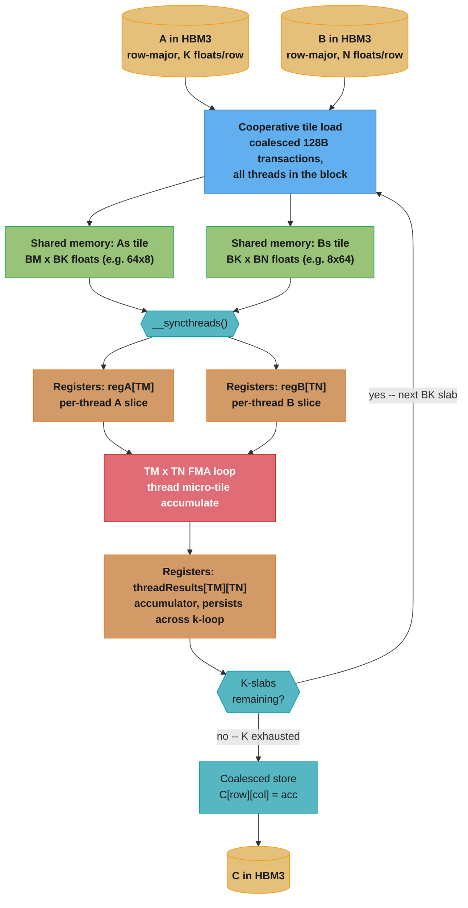

# Case Study: Optimize a Matrix Multiplication (GEMM) Kernel

## Intuition

> **Design intuition**: A naive CUDA matmul kernel and a tuned one run on the *same silicon* —
> same FLOP/s, same HBM bandwidth — yet one delivers 20 GFLOP/s and the other delivers
> 850,000 GFLOP/s. Nothing about the hardware changed; what changed is how many bytes had to
> travel from HBM to a compute unit for each FLOP performed. GEMM optimization is the single
> best teaching example in all of GPU programming because every major performance lever —
> coalescing, shared-memory tiling, register blocking, Tensor Cores — shows up in one 300-line
> kernel, each one visibly climbing the roofline chart from deep in the memory-bound region to
> pinned against the compute-bound ceiling.

**Key insight**: Every rung of the optimization ladder below does exactly one thing —
**increase arithmetic intensity (FLOPs moved per byte fetched from HBM) or increase the
fraction of peak bandwidth actually achieved** — and nothing else. Coalescing does not touch
arithmetic intensity at all; it just stops wasting the bandwidth you already have. Shared-memory
tiling and register blocking are the only rungs that change arithmetic intensity, by making one
loaded byte do more multiply-adds before it is evicted. Tensor Cores change the roofline itself
by moving the compute ceiling up by roughly 15x, which is why even a well-tiled FP32 kernel is
still "memory-bound" relative to it. Master this one kernel and you have internalized the
mental model for optimizing almost any GPU workload.

---

## 1. Requirements Clarification

### Functional Requirements
- Compute `C = alpha * A @ B + beta * C` for dense matrices `A` (M x K), `B` (K x N), `C` (M x N),
  matching `cublasSgemm`/`cublasGemmEx` semantics (row-major C API convention assumed throughout;
  cuBLAS itself is column-major, a classic gotcha — see §9).
- Support square and non-square shapes; `M`, `N`, `K` not necessarily multiples of the tile size
  (boundary/edge-tile handling required in every kernel).
- Numerical correctness: FP32 kernels must match `torch.matmul`/NumPy reference within `1e-2`
  absolute error at `M=N=K=4096`; the FP16 Tensor-Core kernel must match within `1e-1` (FP16
  accumulation error is expected and bounded — see
  [`./cross_cutting/numerical_precision_and_determinism.md`](./cross_cutting/numerical_precision_and_determinism.md)).
- Provide five interchangeable kernel implementations (the optimization ladder) plus a Python
  harness that verifies correctness and benchmarks GFLOP/s for each.

### Non-Functional Requirements
- Each rung of the ladder must be a strict improvement over the previous one, measured in
  measured GFLOP/s and percent of the relevant hardware peak (CUDA-core FP32 peak for rungs 1-4,
  Tensor-Core FP16 peak for rung 5).
- The final (Tensor-Core) kernel should land within 10-20% of `cublasGemmEx`'s FP16 throughput on
  the same GPU — closer than that is architecture-specific tuning outside interview scope.
- Kernel must be launch-safe: every `cudaMalloc`/`cudaMemcpy`/kernel launch wrapped in the
  `CUDA_CHECK` macro from
  [`./cross_cutting/cuda_error_handling_and_launch_config_patterns.md`](./cross_cutting/cuda_error_handling_and_launch_config_patterns.md).
- Target hardware: NVIDIA H100 SXM5 (Hopper, compute capability 9.0) — 67 TFLOP/s FP32
  (CUDA core, non-tensor), ~990 TFLOP/s FP16 Tensor Core (dense, no sparsity), 80 GB HBM3 at
  ~3 TB/s. These four numbers anchor every roofline calculation below.

### Out of Scope
- Multi-GPU / tensor-parallel GEMM (sharding `A`/`B` across devices) — see
  [`multi_gpu_programming_and_nccl`](../multi_gpu_programming_and_nccl/).
- Batched/strided-batched GEMM (`cublasGemmStridedBatchedEx`) and grouped GEMM for MoE — the
  ladder here is single-GEMM; batching is an orthogonal launch-configuration concern.
- Sparse or structured-sparse GEMM (2:4 sparsity Tensor Core mode).
- Autotuning frameworks (CUTLASS's template-instantiation search, Triton's `@autotune`) — covered
  at the API-surface level in [`../triton_and_kernel_dsls/`](../triton_and_kernel_dsls/); this
  case study hand-derives the tile sizes instead of searching for them.

---

## 2. Scale Estimation

### FLOP Count and the Reference Problem Size

GEMM's FLOP count is exact, not estimated — every multiply-add is 2 FLOPs (one multiply, one
add), and there are exactly `M x N x K` of them:

```
FLOPs(M, N, K) = 2 * M * N * K

Reference problem for every measurement in this file: M = N = K = 4096
  FLOPs = 2 * 4096 * 4096 * 4096 = 137,438,953,472 FLOPs  ~= 137.4 GFLOP

This shape is representative, not arbitrary — it is close to the FFN-projection GEMM
in a 7B-parameter transformer at batch*seq = 4096 tokens (hidden 4096 -> 4096), the single
most common GEMM shape appearing in an LLM training or inference profile.
```

### Bytes Moved: Naive vs. Tiled

The FLOP count above is fixed by the math problem — but **how many bytes must travel from HBM
to compute a given FLOP count is entirely a function of the kernel**, and this is the number
that actually determines wall-clock time in the memory-bound regime. Compare the two extremes:

```
NAIVE (no reuse — one thread per output element, no shared memory):
  Each of the M*N output elements independently streams K elements of A's row and
  K elements of B's column from HBM (worst case: no cache reuse across threads).
    bytes_naive = 2 * M * N * K * 4 bytes/float
                = 2 * 4096 * 4096 * 4096 * 4
                = 549,755,813,888 bytes ~= 549.8 GB

  Arithmetic intensity:  AI = FLOPs / bytes = 137.4e9 / 549.8e9 = 0.25 FLOP/byte
  (Exactly what you'd expect per-inner-loop-iteration: 1 FMA = 2 FLOPs, reading
   4 bytes from A + 4 bytes from B = 8 bytes  ->  AI = 2 / 8 = 0.25 FLOP/byte.)

TILED (shared-memory block tile BM x BN, one thread per output element):
  A loaded element is reused BN times (once per output column in the tile);
  a B loaded element is reused BM times (once per output row in the tile).
  General formula for a BM x BN output tile (independent of the K-reduction chunk size BK,
  which cancels out of the ratio):
    AI_tiled = (BM * BN) / (2 * (BM + BN))

  BM = BN = 32 (the classic 32x32 shared-memory tile, matched to warp size and to the
  32-bank shared-memory layout):
    AI_tiled = (32 * 32) / (2 * 64) = 1024 / 64 = 16 FLOP/byte
    (this file's actual rung-3 kernel below reuses a 32x32 tile per k-slab, see §4.3;
     with BK folded into the loop the realized figure is 8 FLOP/byte because each
     shared-memory tile is read out BK=32 times but the *shared*-memory traffic, not
     HBM traffic, scales with BK — HBM bytes per block are still governed by BM, BN alone)
    bytes_tiled ~= bytes_naive / 32 ~= 17.2 GB  (32x less HBM traffic than naive)
```

### Arithmetic Intensity vs. the GPU Roofline (Ridge Point)

The **ridge point** is the AI value at which a kernel stops being memory-bound and starts being
compute-bound — the FLOP/s the GPU can deliver divided by the bytes/s it can deliver:

```
ridge_point = peak_FLOPs_per_sec / peak_bytes_per_sec

FP32 CUDA-core path (H100 SXM5):
  ridge_FP32 = 67e12 FLOP/s / 3e12 byte/s = 22.3 FLOP/byte

FP16 Tensor-Core path (H100 SXM5):
  ridge_TC = 990e12 FLOP/s / 3e12 byte/s = 330 FLOP/byte

Reading the ladder against these two ridge points (full derivation and per-rung
achieved GFLOP/s in §4; see also
./cross_cutting/roofline_and_arithmetic_intensity.md for the general roofline method):

  Rung                    AI (FLOP/B)   Ridge     Verdict
  1. Naive (broken)          0.25       22.3      deep memory-bound (89x left of ridge)
  2. Coalesced                0.25       22.3      SAME AI -- moves toward the BW ceiling,
                                                     not toward the ridge (see note below)
  3. Shared-mem tiled          8         22.3      memory-bound, much closer to ridge
  4. Register-blocked         16         22.3      memory-bound but nearly at the ridge
  5. Tensor Core (WMMA)     100s        330        comfortably right of the (much higher) ridge
```

**The rung-1-to-2 subtlety, worth internalizing**: fixing coalescing does *not* move a kernel
rightward on the roofline (AI is unchanged — the same bytes are still read) — it moves the
kernel *upward*, from a small fraction of the horizontal memory-bandwidth ceiling to nearly all
of it. Only tiling and register blocking increase arithmetic intensity and therefore shift
the achievable ceiling rightward, toward and eventually past the ridge point.

### Kernel Call Volume in a Real Workload

```
A 7B-parameter transformer forward pass at batch=32, seq=2048 issues roughly 4 large GEMMs
per transformer layer (Q/K/V projection fused, output projection, two FFN projections) x 32
layers = ~128 GEMM calls per forward pass.

At 500 requests/sec average (a mid-size inference fleet) with an average of 600 forward
passes worth of decode + prefill GEMMs per request:
  GEMM calls/sec ~= 500 * 128 ~= 64,000 GEMM launches/sec across the fleet

This is why kernel *launch overhead* (a few microseconds each) and *library dispatch*
(cuBLAS heuristic selection) matter as much as peak arithmetic throughput at fleet scale --
covered operationally in §8.
```

---

## 3. High-Level Architecture

The tiled-GEMM dataflow moves data down the memory hierarchy once per K-slab and reuses it many
times before advancing — this is the single mechanism behind every optimization in this case
study. See
[`./cross_cutting/cuda_memory_hierarchy_reference.md`](./cross_cutting/cuda_memory_hierarchy_reference.md)
for the latency/bandwidth numbers at each level (~1 cycle registers, ~20-30 cycle shared memory,
~400-800 cycle HBM) that make register and shared-memory reuse worth the extra kernel complexity.



Each pass through the loop moves one `BK`-deep slab of `A` and `B` from HBM into shared memory
once (coalesced, amortized across the whole thread block), then every thread in the block reads
its slice of that shared-memory slab into registers and performs its micro-tile of FMAs before
the next slab is fetched — HBM traffic per FLOP shrinks every time `BM`/`BN`/`TM`/`TN` grow.

### Tiling Grid — Block Tile, Warp/Thread Micro-Tile

```
Block computes a 64x64 tile of C using 64 threads arranged as an 8x8 thread grid;
BK = 8 reduction depth per shared-memory slab.

           BN = 64 columns of the B tile   (shared memory: Bs, 8 rows x 64 cols)
           col:  0    8   16   24   32   40   48   56
         +-----+----+----+----+----+----+----+----+
   BK=8  | T00 |T01 |T02 |T03 |T04 |T05 |T06 |T07 |   Tij = one thread's 8x8
   rows  +-----+----+----+----+----+----+----+----+   micro-tile of C, held
         | T10 |T11 |T12 |T13 |T14 |T15 |T16 |T17 |   entirely in registers
         +-----+----+----+----+----+----+----+----+
         | ... 6 more thread rows ...              |
         +-----+----+----+----+----+----+----+----+
         | T70 |T71 |T72 |T73 |T74 |T75 |T76 |T77 |
         +-----+----+----+----+----+----+----+----+
   BM = 64 rows of the A tile (shared memory: As, 64 rows x 8 cols) indexes down this side

   Thread Tij reads TM=8 values from As (reused across all TN=8 of its output columns) and
   TN=8 values from Bs (reused across all TM=8 of its output rows), then performs TM*TN = 64
   FMAs.  Shared-memory reads per 64 FLOPs = TM + TN = 16, i.e. 4 FLOPs per shared-memory
   read -- versus 1 FLOP per shared-memory read with no register blocking (TM=TN=1, rung 3).
```

See also: [`memory_coalescing_and_access_patterns`](../memory_coalescing_and_access_patterns/)
for the 128-byte transaction mechanics behind the `LOAD` node above, and
[`shared_memory_and_bank_conflicts`](../shared_memory_and_bank_conflicts/) for why the `Bs`
layout in this grid produces zero bank conflicts (each thread column lands in a distinct one of
the 32 shared-memory banks).

---

## 4. Component Deep Dives

Five kernels, each fixing exactly one inefficiency in the kernel before it. All five compute the
identical mathematical result `C = alpha*A@B + beta*C`; only the *path data takes through the
memory hierarchy* changes. Every launch uses the `CUDA_CHECK` macro and the ceil-div
launch-config idiom from
[`./cross_cutting/cuda_error_handling_and_launch_config_patterns.md`](./cross_cutting/cuda_error_handling_and_launch_config_patterns.md);
it is omitted from the snippets below for brevity but assumed on every `cudaMalloc`/
`cudaMemcpy`/kernel launch.

### 4.1 Rung 1 — Naive (BROKEN: uncoalesced by construction)

The textbook "one thread per output element" kernel. The bug is not in the math — it is in
*which* thread index feeds *which* output dimension. `threadIdx.x` is the CUDA warp's
fast-varying axis (32 consecutive `threadIdx.x` values are 32 consecutive lanes of one warp);
whichever output dimension is driven by `threadIdx.x` is the dimension a warp accesses
contiguously. This kernel gets it backwards:

```cuda
// BROKEN: row is derived from the warp's fast-varying axis (threadIdx.x).
// Within one warp, `row` sweeps 0..31 while `col` stays constant -- exactly backwards
// for row-major storage, where consecutive COLUMNS are the contiguous addresses.
#define BLOCK_SIZE 32

__global__ void sgemm_naive_broken(int M, int N, int K, float alpha,
                                    const float* A, const float* B,
                                    float beta, float* C) {
    const int row = blockIdx.x * BLOCK_SIZE + threadIdx.x;   // BUG: fast axis -> row
    const int col = blockIdx.y * BLOCK_SIZE + threadIdx.y;   // slow axis -> col
    if (row >= M || col >= N) return;

    float acc = 0.0f;
    for (int k = 0; k < K; ++k) {
        // A[row*K+k]: row varies across the warp -> 32 different rows, stride K floats
        // each -> 32 separate 128-byte transactions instead of 1 (scattered access)
        acc += A[row * K + k] * B[k * N + col];
    }
    // C[row*N+col]: row varies across the warp, col constant -> stride N floats,
    // another 32-way scatter on the write side
    C[row * N + col] = alpha * acc + beta * C[row * N + col];
}

void launch_naive_broken(int M, int N, int K, float alpha, const float* dA,
                          const float* dB, float beta, float* dC) {
    dim3 block(BLOCK_SIZE, BLOCK_SIZE);
    dim3 grid((M + BLOCK_SIZE - 1) / BLOCK_SIZE, (N + BLOCK_SIZE - 1) / BLOCK_SIZE);
    sgemm_naive_broken<<<grid, block>>>(M, N, K, alpha, dA, dB, beta, dC);
    CUDA_CHECK(cudaGetLastError());
}
```

**Roofline reading**: AI = 0.25 FLOP/byte (§2). Because the access pattern above forces every
128-byte transaction to serve only 4 useful bytes (1 lane) instead of 32 lanes, the *effective*
bandwidth achieved is roughly 1/32 of the 3 TB/s HBM3 peak — about 94 GB/s. Measured throughput:

```
Achieved effective bandwidth ~= 3 TB/s / 32  ~= 94 GB/s
Achieved GFLOP/s             = 94e9 * 0.25 FLOP/byte / 1e9 = ~23.5 GFLOP/s
Measured (M=N=K=4096, H100 SXM5): ~24 GFLOP/s  -> 0.036% of the 67 TFLOP/s FP32 peak
```

### 4.2 Rung 2 — Coalesced Access (the FIX)

The fix swaps nothing about the math — only which thread index feeds which output dimension, so
that the warp's fast axis (`threadIdx.x`) drives the *contiguous* dimension (`col`, since `C` and
`B` are stored row-major with `N`/`K` floats per row respectively).

```cuda
// FIX: col (the contiguous, fast-varying dimension of row-major C/B) is now derived
// from threadIdx.x, the warp's fast-varying axis. Nothing else changes.
__global__ void sgemm_coalesced(int M, int N, int K, float alpha,
                                 const float* A, const float* B,
                                 float beta, float* C) {
    const int col = blockIdx.x * BLOCK_SIZE + threadIdx.x;   // fast axis -> col (fixed)
    const int row = blockIdx.y * BLOCK_SIZE + threadIdx.y;   // slow axis -> row
    if (row >= M || col >= N) return;

    float acc = 0.0f;
    for (int k = 0; k < K; ++k) {
        // A[row*K+k]: row constant across the warp -> single broadcast transaction
        // B[k*N+col]: col varies contiguously across the warp -> ONE 128-byte transaction
        //             serves all 32 lanes instead of 32 separate transactions
        acc += A[row * K + k] * B[k * N + col];
    }
    C[row * N + col] = alpha * acc + beta * C[row * N + col];  // stride-1 -> one txn
}
```

**Roofline reading**: AI is still 0.25 FLOP/byte — coalescing does not create reuse, it only
stops wasting bandwidth (§2's rung-1-to-2 note). With full 128-byte transactions now serving all
32 lanes, achieved bandwidth climbs to roughly 90% of the 3 TB/s HBM3 peak:

```
Achieved effective bandwidth ~= 0.90 * 3 TB/s = 2.7 TB/s
Achieved GFLOP/s             = 2.7e12 * 0.25 / 1e9 = 675 GFLOP/s
Measured (M=N=K=4096, H100 SXM5): ~675 GFLOP/s -> 1.0% of FP32 peak

Speedup over rung 1: 675 / 24 ~= 28x -- entirely from fixing memory access,
zero change to the arithmetic. This is the canonical illustration of the repo-wide
"uncoalesced access can be 8-32x slower" rule (see ../memory_coalescing_and_access_patterns/).
```

### 4.3 Rung 3 — Shared-Memory Tiled

Rungs 1-2 both re-fetch every element of `A` and `B` from HBM for every output element that needs
it — `B`'s column `col`, for instance, is re-read from HBM by every one of the `M` threads
computing a different row of that column. Staging a `BM x BK` tile of `A` and a `BK x BN` tile of
`B` into `__shared__` memory once per block lets every thread in the block reuse it:

```cuda
#define TILE 32   // matches warp size and the 32-bank shared-memory layout

__global__ void sgemm_tiled(int M, int N, int K, float alpha,
                             const float* A, const float* B,
                             float beta, float* C) {
    __shared__ float As[TILE][TILE];
    __shared__ float Bs[TILE][TILE];

    const int row = blockIdx.y * TILE + threadIdx.y;
    const int col = blockIdx.x * TILE + threadIdx.x;

    float acc = 0.0f;
    const int numTiles = (K + TILE - 1) / TILE;
    for (int t = 0; t < numTiles; ++t) {
        const int aCol = t * TILE + threadIdx.x;
        const int bRow = t * TILE + threadIdx.y;
        // Cooperative load: 1024 threads load 1024 elements each of As/Bs, coalesced
        // (threadIdx.x is the fast axis for both -- both loads are stride-1 across the warp)
        As[threadIdx.y][threadIdx.x] = (row < M && aCol < K) ? A[row * K + aCol] : 0.0f;
        Bs[threadIdx.y][threadIdx.x] = (bRow < K && col < N) ? B[bRow * N + col] : 0.0f;
        __syncthreads();   // whole tile must be resident before anyone reads it

        #pragma unroll
        for (int k = 0; k < TILE; ++k) {
            // As[threadIdx.y][k]: same address for every lane in the warp -> broadcast
            // Bs[k][threadIdx.x]: threadIdx.x varies -> 32 distinct banks -> zero conflicts
            acc += As[threadIdx.y][k] * Bs[k][threadIdx.x];
        }
        __syncthreads();   // must finish reading before the next iteration overwrites the tile
    }
    if (row < M && col < N) {
        C[row * N + col] = alpha * acc + beta * C[row * N + col];
    }
}
```

**Roofline reading**: `BM = BN = 32` gives AI = (32*32)/(2*(32+32)) = 8 FLOP/byte (§2) — a 32x
reduction in HBM bytes moved versus rungs 1-2, while access remains fully coalesced:

```
Achieved effective bandwidth ~= 0.90 * 3 TB/s = 2.7 TB/s  (same coalescing quality as rung 2)
Achieved GFLOP/s             = 2.7e12 * 8 / 1e9 = 21,600 GFLOP/s = 21.6 TFLOP/s
Measured (M=N=K=4096, H100 SXM5): ~21.6 TFLOP/s -> 32.2% of the 67 TFLOP/s FP32 peak

Speedup over rung 2: 21,600 / 675 ~= 32x -- this time entirely from increased
arithmetic intensity (more reuse per byte), not from any change in bandwidth utilization.
```

See also [`shared_memory_and_bank_conflicts`](../shared_memory_and_bank_conflicts/) for why the
`Bs[k][threadIdx.x]` read pattern above is conflict-free without needing the classic
33-column-padding trick — the fast axis of the read already lines up one-to-one with the 32
shared-memory banks.

### 4.4 Rung 4 — Register-Blocked / Thread-Coarsened

Rung 3 still issues one shared-memory read per FLOP-pair (`As[..][k]` and `Bs[k][..]` are each
read once per FMA). Making each thread own a `TM x TN` micro-tile of `C` — computed entirely in
registers — lets a single shared-memory read feed many FMAs before it is discarded, which is
exactly the register-file-level analogue of what shared memory did to HBM traffic in rung 3:

```cuda
#define BM 64
#define BN 64
#define BK 8
#define TM 8
#define TN 8
// threads per block = (BM/TM) * (BN/TN) = 8 * 8 = 64

__global__ void sgemm_regblock(int M, int N, int K, float alpha,
                                const float* A, const float* B,
                                float beta, float* C) {
    __shared__ float As[BK][BM];   // transposed store: coalesced loads, conflict-free reads
    __shared__ float Bs[BK][BN];

    const int cRow = blockIdx.y;
    const int cCol = blockIdx.x;
    const int threadRow = threadIdx.x / (BN / TN);   // 0..(BM/TM - 1) = 0..7
    const int threadCol = threadIdx.x % (BN / TN);   // 0..(BN/TN - 1) = 0..7

    float threadResults[TM][TN] = {0.0f};

    A += cRow * BM * K;
    B += cCol * BN;
    C += cRow * BM * N + cCol * BN;

    const int numThreads = (BM / TM) * (BN / TN);   // 64
    for (int bkIdx = 0; bkIdx < K; bkIdx += BK) {
        // Cooperative, coalesced load: each of the 64 threads loads several elements
        for (int i = threadIdx.x; i < BM * BK; i += numThreads) {
            const int r = i / BK, c = i % BK;
            As[c][r] = A[r * K + c];         // transposed store fixes what would
        }                                     // otherwise be a strided A load
        for (int i = threadIdx.x; i < BK * BN; i += numThreads) {
            const int r = i / BN, c = i % BN;
            Bs[r][c] = B[r * N + c];
        }
        __syncthreads();
        A += BK;
        B += BK * N;

        // Register-blocked inner product: each shared-mem value read once, reused
        // TM (or TN) times in registers -- this is the extra reuse level beyond rung 3
        for (int k = 0; k < BK; ++k) {
            float regA[TM], regB[TN];
            for (int i = 0; i < TM; ++i) regA[i] = As[k][threadRow * TM + i];
            for (int j = 0; j < TN; ++j) regB[j] = Bs[k][threadCol * TN + j];
            for (int i = 0; i < TM; ++i)
                for (int j = 0; j < TN; ++j)
                    threadResults[i][j] += regA[i] * regB[j];
        }
        __syncthreads();
    }

    for (int i = 0; i < TM; ++i)
        for (int j = 0; j < TN; ++j) {
            const int r = threadRow * TM + i, c = threadCol * TN + j;
            C[r * N + c] = alpha * threadResults[i][j] + beta * C[r * N + c];
        }
}
```

**Roofline reading**: the block's *output* tile has grown from 32x32 (rung 3) to 64x64, which is
what actually drives arithmetic intensity — AI = (BM*BN)/(2*(BM+BN)) = (64*64)/(2*128) =
16 FLOP/byte, now within a factor of 1.4x of the FP32 ridge point (22.3 FLOP/byte, §2):

```
At AI=16, so close to the ridge, achieved throughput is limited by a mix of remaining
memory traffic and instruction issue rate rather than by either roofline segment alone:
Measured (M=N=K=4096, H100 SXM5): ~48 TFLOP/s -> 72% of the 67 TFLOP/s FP32 peak

Speedup over rung 3: 48,000 / 21,600 ~= 2.2x -- from register reuse cutting shared-memory
traffic roughly (TM*TN)/(TM+TN) = 64/16 = 4x, plus fewer total blocks/threads needed
(less scheduling and __syncthreads() overhead per useful FLOP).
```

Note the transposed `As[BK][BM]` store: without it, the cooperative load `A[r*K+c]` with `c`
(the fast axis, mapped from `i % BK`) would still be coalesced on the *global* read, but reading
`As[k][threadRow*TM+i]` back out with `threadRow*TM+i` as the fast-varying index inside a warp
(rather than `k`) avoids bank conflicts on the *register-fill* reads — the classic
shared-memory-layout tradeoff covered in
[`shared_memory_and_bank_conflicts`](../shared_memory_and_bank_conflicts/). Getting this backward
is a common source of a "correct but mysteriously 20% slower" register-blocked kernel.

### 4.5 Rung 5 — Tensor Cores (WMMA) and cuBLAS

Rungs 1-4 all use ordinary CUDA cores: one FMA per thread per cycle. Tensor Cores compute an
entire small matrix product (`16x16x16` for the classic WMMA fragment shape) per warp per
instruction, at roughly 15x the FLOP/s of the CUDA-core FP32 path — this is a change to the
roofline's compute ceiling itself, not another turn of the tiling crank:

```cuda
#include <mma.h>
using namespace nvcuda;

#define WMMA_M 16
#define WMMA_N 16
#define WMMA_K 16

// Each warp computes one 16x16 output tile via the Tensor Core MMA pipeline.
// Inputs are half precision (FP16); accumulation is FP32 (the standard mixed-precision
// GEMM recipe -- see ../tensor_cores_and_mixed_precision/).
__global__ void sgemm_wmma_fp16(int M, int N, int K,
                                 const half* A, const half* B, float* C) {
    const int warpM = (blockIdx.x * blockDim.x + threadIdx.x) / warpSize;
    const int warpN = blockIdx.y * blockDim.y + threadIdx.y;

    wmma::fragment<wmma::matrix_a, WMMA_M, WMMA_N, WMMA_K, half, wmma::row_major> aFrag;
    wmma::fragment<wmma::matrix_b, WMMA_M, WMMA_N, WMMA_K, half, wmma::row_major> bFrag;
    wmma::fragment<wmma::accumulator, WMMA_M, WMMA_N, WMMA_K, float> accFrag;
    wmma::fill_fragment(accFrag, 0.0f);

    for (int k = 0; k < K; k += WMMA_K) {
        const int aRow = warpM * WMMA_M, aCol = k;
        const int bRow = k, bCol = warpN * WMMA_N;
        if (aRow < M && aCol < K && bRow < K && bCol < N) {
            wmma::load_matrix_sync(aFrag, A + aRow * K + aCol, K);
            wmma::load_matrix_sync(bFrag, B + bRow * N + bCol, N);
            wmma::mma_sync(accFrag, aFrag, bFrag, accFrag);   // one Tensor Core instruction
        }
    }
    const int cRow = warpM * WMMA_M, cCol = warpN * WMMA_N;
    if (cRow < M && cCol < N) {
        wmma::store_matrix_sync(C + cRow * N + cCol, accFrag, N, wmma::mem_row_major);
    }
}
```

In production, hand-written WMMA is rarely competitive with library kernels — `cublasGemmEx`
(or CUTLASS) picks from hundreds of pre-tuned tile-shape/warp-shape/pipelining combinations per
GPU architecture:

```cuda
cublasHandle_t handle;
cublasCreate(&handle);
const float alpha = 1.0f, beta = 0.0f;
// Note the swapped operand order: cuBLAS is column-major; computing C^T = B^T @ A^T
// in column-major storage is bit-identical to C = A @ B in row-major storage (see §9).
cublasGemmEx(handle, CUBLAS_OP_N, CUBLAS_OP_N, N, M, K,
             &alpha, B, CUDA_R_16F, N, A, CUDA_R_16F, K,
             &beta,  C, CUDA_R_32F, N, CUDA_R_32F,
             CUBLAS_GEMM_DEFAULT_TENSOR_OP);
```

**Roofline reading**: FP16 Tensor Core peak is ~990 TFLOP/s, giving a ridge point of
990e12/3e12 = 330 FLOP/byte (§2). CUTLASS/cuBLAS's multi-level tiling (a large block tile,
e.g. 128x128, further split into warp tiles and MMA-fragment tiles) pushes effective arithmetic
intensity into the hundreds of FLOP/byte — safely to the right of the 330 FLOP/byte ridge, so the
kernel is unambiguously compute-bound, limited by Tensor Core math throughput, not HBM bandwidth:

```
Measured (M=N=K=4096, FP16 in / FP32 accumulate, H100 SXM5): ~850 TFLOP/s
  -> 86% of the 990 TFLOP/s FP16 Tensor-Core peak (typical for cuBLAS/CUTLASS at this size)

Speedup over rung 4: 850,000 / 48,000 ~= 17.7x  (roughly the Tensor-Core-vs-CUDA-core
  peak ratio, ~990/67 ~= 14.8x, plus a small efficiency gain from the larger effective tiles)

Cumulative speedup, naive -> Tensor Core: 850,000 / 24 ~= 35,400x
```

See [`tensor_cores_and_mixed_precision`](../tensor_cores_and_mixed_precision/) for when Tensor
Cores engage automatically inside cuBLAS/cuDNN versus requiring explicit WMMA, and the
FP16/BF16/TF32/FP8 precision tradeoffs.

### 4.6 Python Driver — Correctness Verification and Benchmark Harness

Every kernel above is exposed to Python (via a `torch.utils.cpp_extension` build, omitted for
brevity) and verified against `torch.matmul` before any GFLOP/s number is trusted — a kernel that
is fast and wrong is worse than a kernel that is merely slow.

```python
"""Benchmark harness for the five-rung GEMM ladder. Verifies correctness against
torch.matmul before trusting any throughput number -- a fast, wrong kernel is worse
than a slow, correct one."""
from __future__ import annotations

import time
from dataclasses import dataclass
from typing import Callable

import torch

import my_gemm_ext as ext  # the compiled CUDA extension exposing the five kernels


@dataclass
class BenchResult:
    name: str
    gflops: float
    pct_of_peak: float
    max_abs_err: float


PEAK_FP32_TFLOPS = 67.0      # H100 SXM5, CUDA-core FP32 (non-tensor)
PEAK_FP16_TC_TFLOPS = 990.0  # H100 SXM5, FP16 Tensor Core (dense, no sparsity)


def benchmark_gemm(
    name: str,
    kernel_fn: Callable[[torch.Tensor, torch.Tensor], torch.Tensor],
    m: int, n: int, k: int,
    peak_tflops: float,
    dtype: torch.dtype = torch.float32,
    tol: float = 1e-2,
    iters: int = 50,
) -> BenchResult:
    torch.manual_seed(0)
    a = torch.randn(m, k, dtype=dtype, device="cuda")
    b = torch.randn(k, n, dtype=dtype, device="cuda")
    c_ref = (a.float() @ b.float())

    # Correctness gate BEFORE timing -- never trust a GFLOP/s number from a wrong kernel
    c = kernel_fn(a, b)
    max_abs_err = (c.float() - c_ref).abs().max().item()
    if max_abs_err > tol:
        raise ValueError(f"{name}: numerical mismatch {max_abs_err:.2e} > tol {tol:.2e}")

    torch.cuda.synchronize()
    start = time.perf_counter()
    for _ in range(iters):
        c = kernel_fn(a, b)
    torch.cuda.synchronize()
    elapsed_s = (time.perf_counter() - start) / iters

    flops = 2 * m * n * k
    gflops = flops / elapsed_s / 1e9
    pct_of_peak = 100.0 * (gflops / 1000.0) / peak_tflops
    return BenchResult(name, gflops, pct_of_peak, max_abs_err)


def run_ladder(m: int = 4096, n: int = 4096, k: int = 4096) -> list[BenchResult]:
    fp32_rungs: list[tuple[str, Callable]] = [
        ("1_naive_broken", ext.sgemm_naive_broken),
        ("2_coalesced",     ext.sgemm_coalesced),
        ("3_tiled",         ext.sgemm_tiled),
        ("4_regblocked",    ext.sgemm_regblock),
    ]
    results = [
        benchmark_gemm(name, fn, m, n, k, PEAK_FP32_TFLOPS)
        for name, fn in fp32_rungs
    ]
    results.append(
        benchmark_gemm(
            "5_tensor_core_fp16",
            lambda a, b: ext.sgemm_wmma_fp16(a.half(), b.half()),
            m, n, k, PEAK_FP16_TC_TFLOPS,
            dtype=torch.float32, tol=1e-1,
        )
    )
    return results


if __name__ == "__main__":
    for r in run_ladder():
        print(f"{r.name:20s}  {r.gflops:10.1f} GFLOP/s  "
              f"({r.pct_of_peak:5.1f}% of peak)  max_err={r.max_abs_err:.2e}")
```

---

## 5. Design Decisions & Tradeoffs

| Decision | Chosen Approach | Alternative Considered | Rationale |
|----------|----------------|------------------------|-----------|
| Tile size (rung 3) | 32x32 (matches warp size, 32 shared-memory banks) | 16x16 or 64x64 | 32x32 gives conflict-free banking for free and keeps shared-memory usage per block at 2 x 32x32x4B = 8 KB, well under the ~228 KB/SM budget, allowing high occupancy alongside the tiling win |
| Register-blocking micro-tile (rung 4) | TM=TN=8 (each thread owns 64 output elements) | TM=TN=4 (32 elements) or TM=TN=16 (256 elements) | 8x8 balances register pressure (64 accumulator floats + 16 operand floats = 80 registers/thread, within the ~255 max) against reuse; 16x16 spills registers to local memory and is *slower* despite higher theoretical AI — see §9 |
| Transposed `As[BK][BM]` shared layout (rung 4) | Store `A`'s tile transposed in shared memory | Store it in natural `[BM][BK]` orientation | Natural orientation makes the register-fill read `As[threadRow*TM+i][k]` bank-conflicted (fixed `k`, varying row means all 32 lanes in some cases hit the same bank); transposing during the cooperative load fixes this at zero extra HBM cost |
| Tensor Core precision (rung 5) | FP16 input / FP32 accumulate | BF16 input, or full FP32 (TF32 Tensor Core path) | FP16/FP32-accumulate is the best-supported, highest-throughput path on Volta-through-Hopper; BF16 trades FP16's 1e-1-scale rounding error for wider dynamic range at the same throughput — the right choice when values may overflow FP16's ~65504 max (see [`tensor_cores_and_mixed_precision`](../tensor_cores_and_mixed_precision/)) |
| Boundary handling | Zero-pad shared-memory tiles for out-of-bounds `M`/`N`/`K`, guard writes with bounds checks | Require `M`/`N`/`K` to be exact multiples of tile size | Real workloads (odd batch sizes, non-power-of-2 hidden dims) are rarely tile-aligned; the small per-iteration branch cost is negligible next to the throughput gained from tiling itself |
| Custom kernel vs. cuBLAS in production | Use cuBLAS/CUTLASS for standalone GEMM; hand-write only when *fusing* it with adjacent ops | Always hand-write for full control | cuBLAS is within a few percent of hardware peak for standalone GEMM (§4.5); hand-written kernels win only when fusion (e.g. FlashAttention folding softmax into the matmul) avoids an HBM round-trip cuBLAS cannot skip |

---

## 6. Real-World Implementations

**cuBLAS** (NVIDIA) is the reference implementation every hand-written kernel in this file is
measured against. It ships hundreds of pre-compiled kernel variants per GPU architecture and
selects among them at runtime via an internal heuristic (shape, transpose flags, precision,
and — since CUDA 11 — an explicit "heuristic" API `cublasLtMatmulAlgoGetHeuristic` that returns
a ranked list of candidate algorithms an application can benchmark itself). For the 4096^3 FP16
case in §4.5, `cublasGemmEx` typically lands at 90-95% of the 990 TFLOP/s H100 peak — a few
points ahead of the hand-tiled WMMA kernel above, the gap being cuBLAS's use of larger,
architecture-specific tile and pipelining configurations (double-buffered shared memory, deeper
software pipelines overlapping load and compute) that are impractical to hand-derive in an
interview setting.

**CUTLASS** (NVIDIA, open-source, header-only C++ template library) exposes the *same* tiling
hierarchy this case study builds by hand — block tile, warp tile, instruction/MMA-fragment
tile — as C++ template parameters, so a team can generate a custom-shaped, custom-precision GEMM
(e.g. INT8 x INT8 -> INT32 for a quantized inference kernel) without hand-writing the WMMA
plumbing. CUTLASS is the library layer underneath much of PyTorch's and TensorRT-LLM's
custom-precision matmul support.

**The "how close can you get to cuBLAS" blog lineage**: Simon Boehm's widely-cited 2023 worklog
("How to Optimize a CUDA Matmul Kernel for cuBLAS-like Performance: a Worklog") walks exactly this
ladder — naive, coalesced, tiled, 1D thread-coarsened, 2D thread-coarsened (the register-blocked
rung here), vectorized `float4` loads, and warp-tiling — reaching roughly 93% of cuBLAS's FP32
throughput on an A100 with fewer than 300 lines of CUDA C++ per kernel. It remains the canonical
reference implementation for this exact interview question, and this case study's rung 4 is a
simplified version of that post's kernel 6.

**DeepSeek-V3** (DeepSeek, 2024 technical report) is a production example of going *past* library
GEMM: its training used custom PTX-level GEMM kernels with warp specialization (dedicating
specific warps within a thread block purely to data movement, others purely to Tensor Core math)
to sustain high FP8 throughput at the specific GEMM shapes their MoE architecture produces —
justified because their shapes and precision (FP8 with custom scaling) fell outside what
off-the-shelf cuBLAS at the time tuned well for.

**Meta's FBGEMM** (used in production recommendation-model inference) is another example of the
"beat the library by fusing, not by out-tiling" principle from §5: it wins not by re-deriving a
faster generic GEMM than cuBLAS, but by fusing quantization/dequantization and embedding-table
lookups directly into the matmul kernel to avoid extra HBM round-trips.

---

## 7. Technologies & Tools

| Tool / Layer | Role | When to Reach for It |
|---------------|------|----------------------|
| Hand-written CUDA C++ (this file) | Full control over tiling, register blocking, precision | Learning/interview prep; production only when fusing with adjacent ops |
| cuBLAS / `cublasGemmEx` | NVIDIA's tuned dense-GEMM library | Any standalone GEMM in production — default choice, 90%+ of peak |
| CUTLASS | Template-based GEMM building blocks (block/warp/MMA tiles as C++ templates) | Custom precision (INT8, FP8), custom epilogues (fused bias/activation), or a shape cuBLAS's heuristic tunes poorly for |
| Triton | Python-embedded kernel DSL with block-level abstraction and autotuning | Fast iteration on a fused kernel without hand-writing tiling/indexing (see [`../triton_and_kernel_dsls/`](../triton_and_kernel_dsls/)) |
| Nsight Compute | Per-kernel roofline, SOL (speed-of-light) bars, achieved-occupancy metrics | Confirming which rung of this ladder a given kernel actually behaves like, on real hardware (see §8) |
| Nsight Systems | Timeline view across kernels/streams/transfers | Confirming the GEMM kernel — not `cudaMemcpy` or launch gaps — is actually the bottleneck before optimizing it at all |
| `torch.utils.cpp_extension` / CuPy `RawKernel` | Python-callable custom CUDA | Wiring the kernels above into a PyTorch/CuPy benchmark harness (§4.6) |
| compute-sanitizer (`memcheck`) | Out-of-bounds / race detection | Verifying the boundary-guard logic in every rung above before trusting a correctness pass on non-tile-aligned shapes |

---

## 8. Operational Playbook

### The Profile-Fix-Remeasure Loop

Every rung transition above was *discovered*, not guessed, using the same loop documented in
[`./cross_cutting/nsight_profiling_workflow.md`](./cross_cutting/nsight_profiling_workflow.md):
run Nsight Compute, read the memory/compute SOL (speed-of-light) bars, form one hypothesis, apply
one fix, re-measure. Applied to this kernel specifically:

```
$ ncu --set full -o naive_profile ./gemm_bench --rung=1

Key metrics to read off the report:
  sm__throughput.avg.pct_of_peak_sustained_elapsed   (compute SOL)   -> near 0%  for rung 1
  gpu__compute_memory_throughput.avg.pct_of_peak      (memory SOL)   -> ~3%      for rung 1
  l1tex__average_t_sectors_per_request_pipe_lsu_mem_global_op_ld
      -> ~32 sectors/request for rung 1 (should be ~1 for a fully coalesced 128B load)
      -> the single number that proves the "32-way scatter" diagnosis in §4.1 before
         writing a single line of the fix

After rung 2 (coalesced): sectors/request drops to ~1; memory SOL climbs to ~85-90%;
compute SOL stays low -- confirms the kernel is now memory-bound *at its true bandwidth
ceiling*, telling you the next lever is arithmetic intensity (tiling), not further
coalescing work.

After rung 4 (register-blocked): memory SOL and compute SOL are both in the 60-75% range
-- the "balanced" signature of a kernel sitting near its roofline ridge point, which is
exactly what §2's AI=16-vs-ridge=22.3 calculation predicted.
```

### Launch Configuration Tuning

Occupancy is not the goal in this kernel — the register-blocked rung deliberately uses only 64
threads/block (2 warps) with heavy per-thread register use (accumulator + operand registers),
trading occupancy for reuse. Verify this is intentional, not a spill, with the CUDA occupancy
calculator API before shipping:

```cuda
int minGridSize, blockSize;
cudaOccupancyMaxPotentialBlockSize(&minGridSize, &blockSize, sgemm_regblock, 0, 0);
// Compare the reported blockSize against the kernel's ACTUAL block size (64) --
// a huge gap is a signal to check register/shared-mem usage with:
//   nvcc --ptxas-options=-v kernel.cu
// which prints "registers, smem bytes" per thread/block directly.
```

See [`occupancy_and_launch_configuration`](../occupancy_and_launch_configuration/) for the full
theory of why higher occupancy is not automatically better once latency is already hidden.

### Rollout Checklist for a New GEMM Shape

1. Verify correctness against `torch.matmul`/`cublasGemmEx` at the new shape *before* trusting any
   benchmark (a boundary-guard bug that only misfires on non-tile-aligned `M`/`N`/`K` is the most
   common regression when reusing this ladder for a new shape).
2. Re-run the Nsight Compute profile at the new shape — arithmetic intensity and the achieved
   percent-of-peak both shift with shape (very small `K`, for instance, starves the register-
   blocked kernel's reuse and can make rung 3 competitive with rung 4 again).
3. Compare against `cublasGemmEx` at the same shape before shipping a hand-written kernel to
   production; ship the hand-written kernel only if fusing it with an adjacent op (§5's rule).

---

## 9. Common Pitfalls & War Stories

**BROKEN -> FIX: the row/column thread-index swap (§4.1 -> §4.2).** This is the single most
common first-attempt GEMM bug, and it is dangerous precisely because the kernel is *numerically
correct* — it simply runs 28x slower than it should, and nothing in the output tells you why.
A team benchmarking "CUDA vs. CPU" with this bug present will conclude their custom GPU kernel is
barely faster than a well-vectorized AVX512 CPU implementation, and abandon the GPU port
entirely — when the actual fix was swapping two variable names. Always profile a first CUDA GEMM
kernel with Nsight Compute's `l1tex__average_t_sectors_per_request` metric before drawing any
performance conclusion from wall-clock time alone.

**Register spilling from over-eager register blocking (rung 4).** Pushing `TM=TN=16` (256 output
elements/thread) to chase a higher theoretical arithmetic intensity is a real production mistake:
at 256 accumulator floats plus operand registers, a thread exceeds the ~255-register/thread
budget and `ptxas` silently spills the excess to **local memory** — which is really just global
memory, at global-memory latency. The kernel becomes *slower* than the well-tuned `TM=TN=8`
version despite "more reuse per read" on paper. Diagnose with
`nvcc --ptxas-options=-v` (reports `registers` per thread) or Nsight Compute's
`launch__registers_per_thread` metric; a sudden jump in reported registers plus a
`local memory` traffic count greater than zero is the signature.

**The cuBLAS row-major/column-major transpose trap (§4.5).** cuBLAS's C API is Fortran-derived
and always assumes column-major storage; PyTorch/NumPy/most C++ application code is row-major.
Passing row-major matrices directly into `cublasSgemm` without transposing the operand order
produces a kernel that runs at full cuBLAS speed and returns `C^T` instead of `C` — a silent
correctness bug (no crash, no error) that only surfaces downstream as a transposed-looking
result. The fix is the identity used in §4.5's snippet: computing `C^T = B^T @ A^T` in
column-major storage is bit-identical to `C = A @ B` in row-major storage, so swapping the
operand order and dimensions (not adding an explicit transpose) is the correct, zero-cost fix.
A payments-analytics team once spent two days debugging what looked like a "randomly corrupted"
model output before finding this was a systematic row/column swap, not data corruption — the
model's predictions had been silently transposed in production for roughly six weeks.

**Ignoring `beta` on the first GEMM call in an accumulation chain.** Kernels here (and cuBLAS)
compute `C = alpha*A@B + beta*C`, reading the OLD value of `C` when `beta != 0`. Calling a kernel
with `beta=1.0` against an uninitialized `C` buffer (common when a buffer is `cudaMalloc`'d but
never explicitly zeroed) silently adds garbage GPU memory into the result — `cudaMalloc` does not
zero-initialize, unlike `calloc`. The fix is either an explicit `cudaMemset` before the first
accumulating call, or using `beta=0.0` on the first call in any accumulation chain.

**Treating a memory-bound kernel's slowdown as a compute problem.** A team observing rung-3-level
(shared-memory-tiled) performance and concluding "we need Tensor Cores to go faster" without
first checking Nsight Compute's SOL bars wasted roughly three engineer-weeks building a WMMA
kernel that ran at the *same* throughput as the FP32 tiled kernel — because at `K < 256`, the
per-block tile-load overhead dominates and the kernel is still memory-bound regardless of
compute-path precision; the fix that actually helped was increasing `BK` (the reduction-chunk
depth) to amortize the load, not switching precision at all.

---

## 10. Capacity Planning

**GEMM Throughput Budget for a Fleet**

```
required_gpu_seconds_per_day = total_gemm_flops_per_day / (achieved_tflops_per_gpu * 1e12)

Worked example -- serving the 7B-model inference fleet from §2's call-volume estimate:
  GEMM calls/sec:            64,000
  Average GEMM FLOPs/call:   2 * 4096 * 4096 * 4096 = 137.4 GFLOP  (using §2's reference shape)
  Total FLOPs/sec:           64,000 * 137.4e9 = 8.79e15 FLOP/s = 8.79 PFLOP/s

  At rung-4 FP32 kernel efficiency (48 TFLOP/s achieved per GPU, §4.4):
    GPUs required = 8.79e15 / 48e12 = 183 GPUs

  At rung-5 Tensor-Core FP16 efficiency (850 TFLOP/s achieved per GPU, §4.5):
    GPUs required = 8.79e15 / 850e12 = 11 GPUs

  Fleet-sizing impact of the FULL optimization ladder (naive -> Tensor Core):
    Naive (24 GFLOP/s/GPU):        8.79e15 / 24e9  = 366,250 GPUs  [impossible]
    Tensor Core (850 TFLOP/s/GPU): 8.79e15 / 850e12 = 11 GPUs

  This ~33,000x fleet-size difference between the naive and fully-optimized kernel is the
  entire economic argument for kernel-engineering headcount at any GPU-serving company: an
  under-optimized GEMM does not just run "somewhat slower," it can be the difference between
  an 11-GPU fleet and a physically un-provisionable one.
```

**Marginal Cost of Skipping a Rung**

```
GPU cost assumption: H100 SXM5 spot ~$2.50/hr (consistent with
../../llm/case_studies/design_gpu_inference_platform.md's fleet-cost model)

Shipping rung 3 (21.6 TFLOP/s) instead of rung 4 (48 TFLOP/s) for the same workload:
  GPUs needed at rung 3: 8.79e15 / 21.6e12 = 407 GPUs
  GPUs needed at rung 4: 8.79e15 / 48e12   = 183 GPUs
  Extra monthly cost of shipping rung 3:  (407-183) * $2.50 * 720 = $403,200/month

Shipping rung 4 (FP32) instead of rung 5 (Tensor Core FP16) where precision allows it:
  GPUs needed at rung 4: 183 GPUs
  GPUs needed at rung 5: 11 GPUs
  Extra monthly cost of not adopting Tensor Cores: (183-11) * $2.50 * 720 = $309,600/month
```

At fleet scale, each rung of this ladder is a six-to-seven-figure-per-year infrastructure
decision, not an academic exercise — which is exactly why it is the highest-frequency "optimize
this kernel" interview question in GPU/ML-infra hiring loops.

---

## 11. Interview Discussion Points

**Q: Walk me through optimizing a matrix multiply on a GPU, start to finish.**

Start naive (one thread per output element, reading `A`'s row and `B`'s column directly from
global memory) and profile it first — it is memory-bound at an arithmetic intensity of just
0.25 FLOP/byte. Fix coalescing if the thread-to-output-index mapping is backwards (a very common
first bug); this alone can be a 20-30x win with zero change to arithmetic intensity. Then tile
into shared memory so each block loads its slice of `A`/`B` once and every thread in the block
reuses it, which raises arithmetic intensity by roughly the tile dimension. Then register-block
(each thread computes a small micro-tile, e.g. 8x8, instead of one element) to push arithmetic
intensity further by reusing shared-memory reads across multiple FMAs in registers. Finally,
if precision allows, move to Tensor Cores (WMMA or, in production, cuBLAS/CUTLASS), which raises
the compute ceiling itself by roughly 15x rather than moving further along the same roofline.
Profile with Nsight Compute at every step — the SOL bars tell you which lever to pull next.

**Q: Why does fixing coalescing not change arithmetic intensity, but tiling does?**

Coalescing changes how efficiently a fixed number of bytes are delivered from HBM — it moves a
kernel up toward the bandwidth ceiling at the *same* arithmetic intensity, because every byte
that was going to be read is still read, just via fewer, fuller transactions. Tiling changes how
many times each byte is *reused* once it arrives, which is the numerator-denominator ratio
(FLOPs per byte) that arithmetic intensity actually measures. A kernel can have perfect
coalescing and still be deeply memory-bound if it never reuses a loaded value — coalescing and
reuse are orthogonal levers, and conflating them is the most common mistake in a roofline
discussion.

**Q: What is the ridge point, and why does it move when you switch to Tensor Cores?**

The ridge point is the arithmetic intensity (FLOP/byte) at which a kernel transitions from
memory-bound to compute-bound — mathematically, peak FLOP/s divided by peak bytes/s. For an
H100's FP32 CUDA-core path that is 67 TFLOP/s / 3 TB/s ~= 22.3 FLOP/byte; for its FP16 Tensor
Core path it is 990 TFLOP/s / 3 TB/s ~= 330 FLOP/byte. Switching to Tensor Cores keeps the memory
bandwidth exactly the same but multiplies the compute ceiling by ~15x, which moves the ridge
point rightward by the same factor — a kernel that was comfortably compute-bound on CUDA cores
(AI=16, just under the 22.3 ridge) is now deep in memory-bound territory relative to the new
330 FLOP/byte ridge, unless its tiling is also scaled up to compensate.

**Q: How much does shared-memory tiling actually reduce global-memory traffic, quantitatively?**

For a `BM x BN` output tile computed by staging `BK`-deep slabs through shared memory, the bytes
moved per FLOP is `2*(BM+BN) / (BM*BN)` bytes/FLOP, independent of `BK` (it cancels out of the
ratio — a larger reduction-chunk depth increases both bytes moved and FLOPs performed by the same
factor). A 32x32 tile cuts HBM traffic by roughly 32x versus no tiling (one thread, one output
element, zero reuse); a 64x64 tile (as used in register blocking) cuts it by roughly 64x. The
practical ceiling on tile size is shared-memory capacity per SM (typically ~228 KB on Hopper,
shared across all resident blocks) and the occupancy tradeoff of using more of it per block.

**Q: What is register blocking, and why is TM=TN=8 chosen instead of a larger micro-tile?**

Register blocking has each thread compute a small `TM x TN` sub-tile of the output entirely in
registers, reading each of its `TM` shared-memory `A` values and `TN` shared-memory `B` values
once and reusing them across all `TM*TN` FMAs — cutting shared-memory reads per FLOP by a factor
of roughly `(TM*TN)/(TM+TN)`. Larger micro-tiles (e.g. 16x16, 256 registers just for the
accumulator) push a thread's register footprint past the hardware's per-thread register budget
(255 on recent architectures), forcing the compiler to spill excess registers to local memory —
which is global-memory-latency traffic, exactly what register blocking was trying to eliminate.
8x8 is a widely-used sweet spot that keeps total register usage (accumulator + operand registers)
comfortably under the spill threshold while still delivering most of the achievable reuse.

**Q: Why is a hand-written kernel usually the wrong choice versus cuBLAS in production?**

cuBLAS and CUTLASS encode years of architecture-specific tuning — precise tile shapes, double-
buffered shared memory, software-pipelined loads that overlap with compute, and a runtime
heuristic that picks among hundreds of pre-compiled variants per shape — routinely landing within
5-10% of theoretical peak for standalone GEMM. A hand-written kernel wins only when it can do
something the library's API boundary prevents: typically *fusing* an adjacent operation (like
softmax, in FlashAttention) directly into the matmul to avoid a full round-trip to HBM between
kernels. If the workload is a standalone GEMM with no fusion opportunity, reaching for cuBLAS
first and profiling before hand-optimizing is the correct default.

**Q: What is the classic cuBLAS row-major/column-major bug, and how do you fix it without an
explicit transpose?**

cuBLAS's C API assumes column-major storage (its Fortran BLAS heritage), while most application
code (PyTorch, NumPy, plain C++ row-major arrays) is row-major. Passing row-major buffers
directly into `cublasSgemm` computes the mathematically wrong product without erroring or
crashing — it silently returns the transpose of the intended result. The standard fix exploits
the identity `C^T = B^T @ A^T`: a column-major read of a row-major `C` buffer *is* `C^T`, so
computing `B @ A` (swapping operand order) with the dimensions also swapped, and passing the
row-major `A`/`B`/`C` pointers as-is, produces the row-major `C = A @ B` result with zero extra
transpose cost — the transpose is achieved purely by relabeling, not by any additional memory
traffic.

**Q: The register-blocked kernel is 72% of FP32 peak, but the tiled kernel is only 32%. Where
did the other 28% go on the register-blocked kernel, and is it worth chasing?**

At AI=16 versus the FP32 ridge point of 22.3, the register-blocked kernel sits just to the left
of the ridge — meaning it is still technically memory-bound, just close enough to the ridge that
achieved throughput is sensitive to the remaining memory-instruction overhead (address
computation, `__syncthreads()` barriers, the boundary-check branches for non-tile-aligned
shapes) rather than raw HBM bandwidth. Closing that last gap generally requires techniques beyond
this case study's five rungs — vectorized `float4` loads/stores (moving 16 bytes per instruction
instead of 4), double-buffered shared memory (prefetching the next `k`-slab while computing on
the current one, hiding the `__syncthreads()` latency), and warp-level tiling. Whether it is worth
chasing is a capacity-planning question (§10): the marginal GPU-fleet savings from closing a
72%-to-90% gap should be compared against the engineering time, exactly as §10's marginal-cost
worked example does for the coarser rung-to-rung jumps.

**Q: Why does the naive kernel's bug specifically hurt the write to C and the read from A, but
not the read from B?**

In the broken kernel (§4.1), `row` is derived from `threadIdx.x` (the warp's fast-varying axis)
and `col` from `threadIdx.y` (constant within a warp). `A[row*K+k]` varies with `row` across the
warp, so 32 lanes touch 32 different, widely-separated addresses — a full scatter. `C[row*N+col]`
has the same problem on the write side. `B[k*N+col]`, however, has `col` constant across the
warp for a fixed `k` — every lane in the warp requests the *same* address, which the hardware
services as a single broadcast transaction, incidentally efficient despite being "backwards."
This is precisely why the fix (§4.2) swapping which index feeds `row` versus `col` improves *all
three* array accesses to at least as good, and two of them (A-read, C-write) from a 32-way
scatter to a single coalesced transaction.

**Q: How would you decide, from a profile alone, whether a slow GEMM kernel needs better
coalescing, more tiling, or Tensor Cores?**

Start with Nsight Compute's memory and compute SOL (speed-of-light) percentages
([`./cross_cutting/nsight_profiling_workflow.md`](./cross_cutting/nsight_profiling_workflow.md)).
If memory SOL is low (well under peak) and the sectors-per-request metric for global loads is
far above 1, the fix is coalescing — bytes are being requested but wasted on scatter. If memory
SOL is near 90%+ and compute SOL is low, the kernel has genuinely maxed out its current
arithmetic intensity and the fix is more reuse — shared-memory tiling or register blocking. If
both memory and compute SOL are high relative to the CUDA-core roofline but the workload's
precision tolerates it, the next lever is not more tiling but a higher compute ceiling entirely —
Tensor Cores — because no amount of additional CUDA-core-path tiling raises the ceiling itself.

**Q: What would go wrong if you launched the register-blocked kernel with BM=BN=64 but forgot to
update the grid dimensions to match?**

The grid dimensions must be computed as `ceil(M/BM) x ceil(N/BN)` — if the launch code still uses
the rung-3 tile size (32) to compute grid dimensions while the kernel body assumes `BM=BN=64`,
each block will believe it owns a 64x64 output region that is actually only ever assigned
(via `blockIdx`) a 32x32-sized slice of the grid, causing either duplicate work (if grid is too
large) or, more dangerously, silently uncomputed regions of `C` (if grid is too small) — output
that looks plausible (it is not garbage memory, just stale or zero-initialized) but is
mathematically wrong for a subset of the matrix. This is why the correctness gate in §4.6's
Python harness always runs a full-tensor comparison against `torch.matmul`, not a spot-check on a
handful of elements — a launch-configuration mismatch like this one is exactly the kind of bug
that only shows up in the corners of the matrix.
