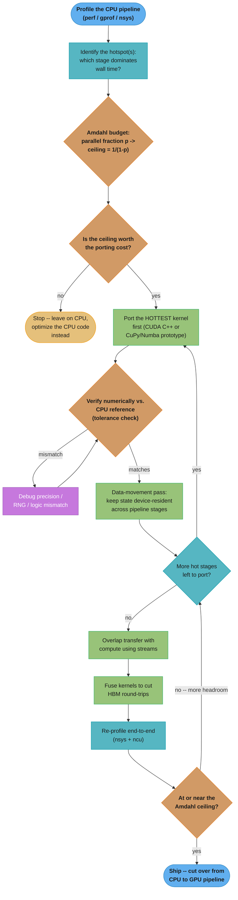

# Case Study: Port a CPU Pipeline to GPU

## Intuition

> **Design intuition**: "Just run it on a GPU" is not a performance strategy — it is a bet, and like any bet it can lose. A GPU has roughly 100x more raw arithmetic throughput than a CPU core, but every byte that crosses the PCIe bus to get there pays a toll, and every instruction on the part of the pipeline you *don't* port keeps running at CPU speed no matter how fast the rest gets. Porting a CPU pipeline to a GPU is not "move the code and enjoy the free speedup" — it is a disciplined, measurable process: profile to find what is actually slow, budget the ceiling before writing a line of CUDA, port the hottest stage first and prove it is numerically identical, and only then chase the last mile with streams and kernel fusion.

**Key insight for this design**: The trap is believing "GPU = faster" unconditionally. It is false in two specific, measurable ways that this case study exists to make concrete: (1) if the serial (non-parallelizable) fraction of your pipeline is large, Amdahl's law caps your *maximum possible* speedup regardless of how infinitely fast you make the parallel part — porting the wrong 20% buys you nothing; and (2) if your ported kernel does too little arithmetic per byte transferred, the PCIe round trip can cost more than the CPU would have taken to just compute the answer itself, making the "optimized" GPU version measurably *slower* than the code it replaced. Every step in this case study — profile, budget, port-and-verify, keep data resident, overlap, fuse — exists to avoid one of those two traps.

---

## 1. Requirements Clarification

### Background

A quantitative trading desk runs a nightly Monte Carlo risk-and-pricing batch job for its exotic-options book: 5,000 arithmetic-Asian call options, each priced with 1,000,000 simulated paths over 252 daily time steps (one trading year). The job runs today entirely on a 32-core CPU node using OpenMP and AVX2 vectorization, and it is the last stage before the morning risk report is generated. The desk wants to know: **should this be ported to GPU, and if so, how — which stage first, how do we prove it is still correct, and how much of the pipeline is even worth moving?**

This case study is deliberately generic in its methodology even though the running example is quantitative finance: the same five-step discipline — profile, budget, port-and-verify, keep-resident, overlap-and-fuse — applies just as directly to a particle simulation's force-computation loop or an image-processing batch job's per-frame filter kernel, which is why the porting decision workflow in §3 is drawn with no domain-specific node at all.

### Functional Requirements
- Reproduce the existing nightly pipeline's five logical stages: (1) generate correlated normal random variates, (2) simulate each path under an Euler–Maruyama discretization of geometric Brownian motion, (3) evaluate the path-dependent (arithmetic-average) payoff, (4) discount and aggregate to a per-option price plus portfolio-level Greeks, (5) write results into the existing risk database schema — unchanged, so downstream consumers need no migration.
- Produce a decision, backed by measurement, on **which pipeline stages are worth porting to GPU** and in what order — not a blanket "port everything" mandate.
- Preserve a CPU fallback path: if a GPU node is unavailable on a given night, the job must still complete on CPU alone (no hard GPU dependency during the migration period).
- Ship a numeric-correctness sign-off process acceptable to the desk's independent Risk Validation function before the GPU path becomes the production path of record.

### Non-Functional Requirements
- **Batch window**: the nightly run starts at 01:00 UTC and results must land in the risk database by 06:00 UTC — a **5-hour (18,000 s) hard budget**. The current CPU pipeline takes 4.2 hours (15,120 s), leaving only 48 minutes of margin.
- **Growth**: the options book has grown ~20% per quarter for the last six quarters; at that rate the CPU pipeline will breach the 5-hour window within two quarters.
- **Accuracy**: GPU-computed prices must agree with the CPU reference within **1e-4 relative price tolerance** (Risk Validation's statistical sign-off threshold, not a bit-exact one — see §9).
- **Resilience**: a single GPU hardware fault mid-run must not force a full 4.2-hour re-run from scratch.
- **No schema or API changes** for any downstream consumer of the risk database.

### Out of Scope
- Multi-node / multi-GPU scale-out beyond a single 4-GPU box (deferred to a future iteration; see §10 for the headroom calculation that justifies deferring it).
- Real-time/intraday pricing — this remains a nightly batch job.
- Re-validating the SDE model itself (the quant model is out of scope; only the numerics of *executing* the existing model are in scope).

---

## 2. Scale Estimation

### CPU Baseline Profile

The existing pipeline was profiled end-to-end with `perf record` / `gprof` on a production run. Total path-step volume and the wall-clock breakdown:

```
Portfolio:        5,000 options
Paths/option:     1,000,000
Steps/path:       252  (1 trading year, daily steps)
Total path-steps: 5,000 x 1,000,000 x 252 = 1.26 x 10^12  (1.26 trillion)

CPU baseline wall time (32-core node, AVX2 + OpenMP): 15,120 s = 4.2 h

  Stage                                    % of wall time   Wall time
  ------------------------------------------------------------------
  RNG (Mersenne Twister + Box-Muller)             12%          1,814 s
  SDE path simulation (Euler-Maruyama)  <- HOTSPOT 68%         10,282 s
  Payoff evaluation + path bookkeeping             15%          2,268 s
  Aggregation / discount / Greeks + I/O             5%            756 s
  ------------------------------------------------------------------
  Total                                           100%         15,120 s
```

The SDE stepping loop alone is 68% of total wall time and is the obvious first porting target — but "obvious" is not the same as "sufficient," which is what the Amdahl budget below is for.

### Amdahl's-Law Budget

Before writing any CUDA, decide the **ceiling**. RNG generation, SDE stepping, and payoff evaluation (12% + 68% + 15% = 95% of wall time) are per-path embarrassingly parallel — each of the 5 billion (option, path) pairs is independent of every other one. Aggregation, discounting, Greeks computation, and writing to the risk database (5%) has cross-option dependencies (portfolio-level netting) and touches a legacy reporting pipeline; it is evaluated for porting and rejected (see §9) because it is a small fraction of runtime with a disproportionately large porting cost.

```
Parallel (portable) fraction:  p = 0.95   (RNG + SDE stepping + payoff)
Serial (stays on CPU) fraction: s = 0.05   (aggregation/discount/Greeks/I/O)

Amdahl ceiling (parallel part treated as instantaneous):
  max_speedup = 1 / (1 - p) = 1 / 0.05 = 20x

This is a HARD CEILING: even an infinitely fast GPU for the parallel 95%
cannot beat 20x end-to-end speedup, because the remaining 756 s of serial
CPU work runs at CPU speed regardless of what happens to the other 95%.
```

This one number reframes the whole project: the question is not "how much faster can we make the hot loop" (arbitrarily fast, in principle) but "how close to a 20x overall improvement can the port get, once transfer and overhead are accounted for." See [`../gpu_computing_foundations/README.md`](../gpu_computing_foundations/README.md) for the general throughput-vs-latency and Amdahl/Gustafson treatment this budget builds on.

### Data-Movement Analysis: Transfer Time vs. Compute Time

The second question, independent of Amdahl, is whether a *given* kernel design is transfer-bound or compute-bound — this is the roofline question applied to the PCIe link instead of HBM (see [`./cross_cutting/roofline_and_arithmetic_intensity.md`](./cross_cutting/roofline_and_arithmetic_intensity.md)). The first engineering instinct on this project was to port only the innermost time-step and keep the existing per-step CPU barrier-check logic untouched, copying state back and forth once per step. That design's arithmetic intensity was measured against its transfer cost as follows:

```
Per-step, per-option, naive design (copy state to host every time step):

  Per-path resident state:  4 floats (price, running_sum, running_max,
                             running_min) = 16 bytes
  Bytes moved per step:     1,000,000 paths x 16 bytes x 2 (H2D + D2H)
                           = 32,000,000 bytes = 32 MB

  Transfer time (PCIe Gen5 x16 peak, 64 GB/s):
    32 MB / 64 GB/s = 0.5 ms = 500 us

  Compute time for ONE step across 1,000,000 paths
  (measured kernel throughput: 85 x 10^9 path-steps/sec on one H100):
    1,000,000 / 85e9 = 11.8 us

  Transfer-to-compute ratio: 500 us / 11.8 us ~ 42x

  BREAK-EVEN steps-per-transfer (the point where transfer time equals
  compute time, i.e. where this design would stop being transfer-bound):
    break_even_steps = transfer_time / compute_time_per_step ~= 42 steps

The naive design does 1 step per transfer — 42x below break-even.
The fix batches all 252 steps into a single kernel launch with the
per-path state resident in registers the whole time — 252 steps per
transfer, 6x PAST break-even, which is why the fix does not just help
marginally: it moves the kernel from deep inside transfer-bound territory
to fully compute-bound, and the transfer cost becomes irrelevant.
```

The full portfolio-scale consequence of shipping the transfer-bound (naive) design anyway, and the fix, are worked out with real code in §4.

### Projected vs. Achieved Speedup

```
Naive ("copy every step") pilot, profiled end-to-end with nsys:
  Pure PCIe traffic (no overlap, pageable host memory):
    5,000 options x 252 steps x 32 MB = 40.32 TB round-trip
  At the pageable-memory achieved rate measured on this system (~9 GB/s,
  far below the 64 GB/s pinned/peak rate — see the pinned-vs-pageable
  gotcha in ../memory_management_and_data_transfer/README.md):
    40.32 x 10^12 bytes / 9 x 10^9 B/s = 4,480 s (~75 min) of transfer ALONE
  Fully synchronous, zero overlap, one option at a time -> nsys showed the
  GPU idle 70%+ of wall time.  Measured full-portfolio wall time: 5.6 h.

  RESULT: 5.6 h (naive GPU port) vs. 4.2 h (CPU baseline) --
          the "optimized" version is 33% SLOWER than the code it replaced.

Fixed (data-resident, on-device RNG, whole-loop-per-kernel, sharded+
streamed) design, same hardware:
  GPU compute (95% ported fraction, 1.26e12 path-steps @ 85e9/sec, 1 GPU):
    1.26e12 / 85e9 ~= 14.8 s
  Serial CPU remainder (aggregation/discount/Greeks/I/O, unchanged):
    756 s
  Transfer + shard-boundary overhead (see streams pipeline in §4):
    ~1 s (dominated by the tail shard's un-hidden D2H copy)
  ------------------------------------------------------------------
  Total new wall time:  756 + 14.8 + 1 ~= 772 s (~12.9 minutes)

  Achieved speedup: 15,120 s / 772 s ~= 19.6x
  Amdahl ceiling:   20x
  Fraction of ceiling reached: 19.6 / 20 = 98%
```

Reaching 98% of the theoretical ceiling is the payoff of doing every step of the methodology in order — skip the data-residency fix and the project regresses (5.6h); skip Amdahl budgeting and the team might have chased the wrong 5% instead of the right 95%.

### Summary: Three Versions of the Same Port

| Version | Wall Time | vs. CPU Baseline | Round-Trip PCIe Traffic | Root Cause of the Result |
|---------|-----------|-------------------|--------------------------|----------------------------|
| CPU baseline (today) | 15,120 s (4.2 h) | 1.0x (reference) | none | 32-core AVX2, single-threaded-per-path, no GPU involved |
| Naive GPU port (§4.3, broken) | 20,160 s (5.6 h) | 0.75x (SLOWER) | 40.32 TB, fully synchronous | copy-every-step antipattern, 42x below the transfer/compute break-even, pageable host memory |
| Fixed GPU port (§4.2, §4.5) | 772 s (12.9 min) | 19.6x | ~KB-to-GB scale, streamed & overlapped | whole-loop-per-kernel, on-device RNG, sharded + double-buffered streams |

The middle row is the one engineering teams rarely publish — it is included here because it is the realistic first outcome of an under-designed port, and the gap between it and the bottom row is entirely methodology, not hardware.

---

## 3. High-Level Architecture

### The Porting Decision Workflow



This loop is the entire methodology compressed into one picture: profile before touching code, budget the ceiling before writing a kernel, verify before trusting a result, and only chase transfer/fusion optimizations once the numerics are already proven correct. Every arrow that loops back (`debug -> verify`, `nextstage -> port`, `target -> nextstage`) exists because this is an iterative, measured process, not a one-shot rewrite.

### Pipeline Topology — Before and After

```
BEFORE (CPU-only, sequential, one option at a time):

  [RNG] -> [SDE step x252] -> [payoff] -> [aggregate] -> [risk DB]
   \_____________ 4.2 h, one option after another ______________/


AFTER (GPU-resident for the ported 95%, CPU only for the true serial 5%):

  Host                              Device (H100, HBM-resident)
  ----                              ---------------------------
  option params (KB-scale)  --H2D-->  [RNG + SDE step x252 + payoff]
                                       one kernel, one thread/path,
                                       entire 252-step loop in registers
                                       (see gpu_kernels.cu in Section 4)
  payoffs (KB-to-MB scale) <--D2H--   sharded across 8 streams, overlapped

  [aggregate / discount / Greeks / I/O]   <- stays on CPU (5%, §9)
  [write to risk DB, unchanged schema]
```

See also: [`./cross_cutting/roofline_and_arithmetic_intensity.md`](./cross_cutting/roofline_and_arithmetic_intensity.md) for why the "after" kernel sits in compute-bound territory against HBM bandwidth (3 TB/s on H100) once PCIe transfer is out of the picture, and [`../memory_management_and_data_transfer/README.md`](../memory_management_and_data_transfer/README.md) for the pinned-vs-pageable mechanics behind the 64 GB/s vs. 9 GB/s gap quantified in §2.

---

## 4. Component Deep Dives

Five artifacts, in the order they were actually built: the CPU reference the port must match (§4.1); the data-resident, portfolio-batched kernel the Amdahl budget justified porting (§4.2); the copy-every-step antipattern that shipped first and regressed performance, and the fix (§4.3); the Python prototype used to validate the algorithm before committing to hand-written CUDA C++ (§4.4); and the sharded, double-buffered stream pipeline that overlaps transfer with compute at production scale (§4.5).

### 4.1 CPU Baseline (Today's Production Code)

The reference implementation the GPU port must match, with the hotspot annotated:

```cpp
// cpu_baseline.cpp -- reference Monte Carlo Asian-option pricer.
// Runs on a 32-core node via OpenMP; profiled wall time: 4.2 hours (see Section 2).
#include <algorithm>
#include <cmath>
#include <random>
#include <vector>

struct OptionParams {
    double S0, K, r, sigma, T;   // spot, strike, rate, vol, maturity (years)
    int    num_steps;            // 252 (daily steps over 1 trading year)
};

struct PricingResult {
    double price;
    double stderr_;
};

// Simulates one path under an Euler-Maruyama discretization of GBM and
// returns the discounted arithmetic-Asian call payoff.
static double simulate_one_path(const OptionParams& opt, std::mt19937_64& rng) {
    std::normal_distribution<double> normal(0.0, 1.0);
    const double dt     = opt.T / opt.num_steps;
    const double drift  = (opt.r - 0.5 * opt.sigma * opt.sigma) * dt;
    const double vol_dt = opt.sigma * std::sqrt(dt);

    double S = opt.S0;
    double running_sum = 0.0;

    // HOTSPOT: this loop is 68% of total CPU wall time (perf record).
    for (int t = 0; t < opt.num_steps; ++t) {
        const double z = normal(rng);                 // one RNG draw per step
        S *= std::exp(drift + vol_dt * z);             // Euler-Maruyama step
        running_sum += S;
    }
    const double avg    = running_sum / opt.num_steps;
    const double payoff = std::max(avg - opt.K, 0.0);
    return std::exp(-opt.r * opt.T) * payoff;
}

// Prices one option with `num_paths` Monte Carlo paths (OpenMP over paths).
PricingResult price_option_cpu(const OptionParams& opt, long num_paths) {
    double sum = 0.0, sum_sq = 0.0;
    #pragma omp parallel for reduction(+:sum, sum_sq)
    for (long p = 0; p < num_paths; ++p) {
        std::mt19937_64 rng(0x9E3779B97F4A7C15ULL ^ static_cast<uint64_t>(p));
        const double payoff = simulate_one_path(opt, rng);
        sum    += payoff;
        sum_sq += payoff * payoff;
    }
    const double mean     = sum / num_paths;
    const double variance = sum_sq / num_paths - mean * mean;
    return { mean, std::sqrt(variance / num_paths) };
}

// Portfolio driver: prices every option sequentially, one after another.
std::vector<PricingResult> price_portfolio_cpu(const std::vector<OptionParams>& book,
                                                long num_paths) {
    std::vector<PricingResult> results;
    results.reserve(book.size());
    for (const auto& opt : book) {
        results.push_back(price_option_cpu(opt, num_paths));
    }
    return results;
}
```

### 4.2 Ported Kernel — First Draft, Portfolio-Batched, Data-Resident

The hottest 68% (SDE stepping) plus the RNG (12%) and payoff (15%) stages are ported together as a single kernel, per the Amdahl budget in §2 — porting the loop alone and leaving RNG/payoff on the host would only capture 68% of runtime, which caps the achievable speedup at `1/(1-0.68) = 3.1x`, far below the 20x ceiling the full 95% enables. One thread simulates one `(option, path)` pair; the entire 252-step loop runs with state resident in registers, and RNG happens on-device via cuRAND — nothing round-trips to the host, and nothing round-trips to global memory, between steps:

```cuda
// gpu_kernels.cu -- ported kernel: RNG + SDE path simulation + payoff (95% of
// CPU wall time, per the Amdahl budget in Section 2). Portfolio-batched: one
// thread simulates one (option, path) pair; the whole 252-step loop keeps its
// state in registers for the kernel's entire lifetime.
#include <cuda_runtime.h>
#include <curand_kernel.h>
#include <cstdio>
#include <cstdlib>

// See ../cross_cutting/cuda_error_handling_and_launch_config_patterns.md --
// every Runtime API call in this file is wrapped in CUDA_CHECK.
#define CUDA_CHECK(call)                                                     \
    do {                                                                     \
        cudaError_t err__ = (call);                                         \
        if (err__ != cudaSuccess) {                                         \
            fprintf(stderr, "CUDA error at %s:%d -- %s (%d): %s\n",         \
                    __FILE__, __LINE__, cudaGetErrorName(err__),            \
                    static_cast<int>(err__), cudaGetErrorString(err__));    \
            exit(EXIT_FAILURE);                                            \
        }                                                                   \
    } while (0)

struct GpuOptionParams {
    float S0, K, r, sigma, T;
    int   num_steps;
};

__global__ void simulate_asian_paths(
        const GpuOptionParams* __restrict__ options,   // [num_options]
        int num_options,
        long paths_per_option,
        unsigned long long seed_base,
        float* __restrict__ payoffs)                    // [num_options * paths_per_option]
{
    const long global_path = blockIdx.x * (long)blockDim.x + threadIdx.x;
    const long total_paths = (long)num_options * paths_per_option;

    // Grid-stride loop: correct for any portfolio size without relaunching.
    for (long idx = global_path; idx < total_paths; idx += (long)gridDim.x * blockDim.x) {
        const int  opt_idx  = idx / paths_per_option;
        const GpuOptionParams opt = options[opt_idx];   // read-only, __restrict__-cached

        // On-device RNG (cuRAND Philox) -- replaces the host mt19937_64 entirely;
        // no random numbers ever cross the PCIe bus.
        curandStatePhilox4_32_10_t rng;
        curand_init(seed_base, /*subsequence=*/idx, /*offset=*/0, &rng);

        const float dt     = opt.T / opt.num_steps;
        const float drift  = (opt.r - 0.5f * opt.sigma * opt.sigma) * dt;
        const float vol_dt = opt.sigma * sqrtf(dt);

        float S = opt.S0;
        float running_sum = 0.0f;

        // Entire time-stepping loop lives in registers -- no global-memory
        // traffic and no host round trip between steps. This IS the fix for
        // the copy-every-step antipattern shown in Section 4.3.
        #pragma unroll 4
        for (int t = 0; t < opt.num_steps; ++t) {
            const float z = curand_normal(&rng);        // on-device draw
            S *= expf(drift + vol_dt * z);
            running_sum += S;
        }

        const float avg    = running_sum / opt.num_steps;
        const float payoff = fmaxf(avg - opt.K, 0.0f) * expf(-opt.r * opt.T);
        payoffs[idx] = payoff;                          // ONE write per path, at the end
    }
}

void launch_simulate_asian_paths(const GpuOptionParams* d_options, int num_options,
                                  long paths_per_option, unsigned long long seed_base,
                                  float* d_payoffs, cudaStream_t stream) {
    const long total_paths = (long)num_options * paths_per_option;
    const int  threads = 256;
    const long max_blocks = 65535L * 32;   // see occupancy_and_launch_configuration
    const int  blocks = (int)min((total_paths + threads - 1) / threads, max_blocks);

    simulate_asian_paths<<<blocks, threads, 0, stream>>>(
        d_options, num_options, paths_per_option, seed_base, d_payoffs);
    CUDA_CHECK(cudaGetLastError());   // catch launch-config errors immediately
}
```

### 4.3 BROKEN -> FIX: The Copy-Every-Step Antipattern

The first engineering draft ported only the innermost time step, keeping the existing CPU "barrier check" bookkeeping code untouched to minimize the risk of a logic error — a reasonable-sounding incremental strategy that turned out to be the single worst design decision in the project:

```cpp
// BROKEN: first draft -- copies per-path state back to host every single time
// step "to let the existing CPU barrier-check code run unmodified." The state
// buffer is a plain std::vector (PAGEABLE host memory, not pinned), so every
// copy also pays the pageable-to-pinned staging-buffer tax the driver adds
// internally. Net effect: measured 5.6 h wall time for the full portfolio --
// SLOWER than the 4.2 h CPU baseline it was meant to replace (see Section 2
// for the transfer-vs-compute arithmetic that predicts exactly this outcome).
void simulate_option_broken(const GpuOptionParams& opt, long num_paths,
                             float* h_payoffs, cudaStream_t stream) {
    float* d_state = nullptr;   // per-path state: price, running_sum, running_max, running_min
    CUDA_CHECK(cudaMalloc(&d_state, num_paths * 4 * sizeof(float)));
    std::vector<float> h_state(num_paths * 4, 0.0f);   // PAGEABLE -- see the fix below

    for (int t = 0; t < opt.num_steps; ++t) {
        // H2D: push current state to the device for THIS ONE step.
        CUDA_CHECK(cudaMemcpy(d_state, h_state.data(),
                               num_paths * 4 * sizeof(float), cudaMemcpyHostToDevice));

        step_kernel<<<(num_paths + 255) / 256, 256>>>(d_state, opt, num_paths, t);
        CUDA_CHECK(cudaDeviceSynchronize());        // blocks the host every step

        // D2H: pull state back so the CPU can run its legacy barrier-check logic.
        CUDA_CHECK(cudaMemcpy(h_state.data(), d_state,
                               num_paths * 4 * sizeof(float), cudaMemcpyDeviceToHost));
        apply_barrier_check_cpu(h_state, num_paths);  // legacy CPU logic, left untouched

        // (h_state is copied back to the device at the top of the next iteration --
        //  this repeats 252 times, fully synchronously, for every option.)
    }
    // Per option: 252 steps x 2 copies x (1,000,000 paths x 16 bytes) = 8.06 GB
    // of PCIe traffic, none of it overlapped with compute, on top of 252
    // synchronous host<->device round trips. Scaled to 5,000 options: 40.32 TB
    // total, measured at ~9 GB/s achieved (pageable memory) = 4,480 s of pure
    // transfer stall alone -- before the synchronization bubbles are even added.
}
```

```cpp
// FIX: the barrier-check logic is ported INTO the kernel (Section 4.2 above),
// so per-path state never leaves the device between steps at all -- there is
// no "per step" transfer to eliminate because there is no per-step host
// round trip left in the design. One H2D copy of option parameters in, one
// D2H copy of final payoffs out, per shard (Section 4.4). This is not a
// tuning tweak on top of the broken version -- it is a different kernel
// granularity (one launch per 252-step path, not one launch per step).
void simulate_option_fixed(const GpuOptionParams* d_options, int num_options,
                            long paths_per_option, unsigned long long seed_base,
                            float* d_payoffs, cudaStream_t stream) {
    launch_simulate_asian_paths(d_options, num_options, paths_per_option,
                                 seed_base, d_payoffs, stream);
    // No per-step copies. No per-step cudaDeviceSynchronize. The barrier-check
    // and running-average bookkeeping this replaced now execute as three
    // extra float ops inside the register-resident loop shown in Section 4.2.
}
```

### 4.4 Prototype-First: A CuPy/Numba Quick Port

Before committing engineering time to hand-written CUDA C++, the team validated the algorithm and got a first speedup reading with a Numba CUDA prototype — the same kernel topology as Section 4.2, in roughly 40 lines of Python, no manual `cudaMalloc`/`cudaMemcpy` bookkeeping required. See [`../python_gpu_ecosystem/`](../python_gpu_ecosystem/) for the broader CuPy/Numba/PyTorch-extension landscape this prototype draws on.

```python
# gpu_prototype_numba.py -- Python prototype of the SAME kernel as gpu_kernels.cu,
# written FIRST to validate the algorithm and get a rough speedup number before
# committing to hand-written CUDA C++. Ported to CUDA C++ once the prototype
# proved out (Section 4.2) because the production job also needed the shard/
# stream pipelining in Section 4.5, which Numba's simpler execution model does
# not expose as directly -- the Python version stayed in the repo as the
# reference implementation for future kernel changes.
import math

import numpy as np
from numba import cuda
from numba.cuda.random import create_xoroshiro128p_states, xoroshiro128p_normal_float32


@cuda.jit
def simulate_asian_paths_numba(s0, k, r, sigma, t, num_steps, paths_per_option,
                                rng_states, payoffs):
    idx = cuda.grid(1)
    num_options = s0.shape[0]
    total_paths = num_options * paths_per_option
    stride = cuda.gridsize(1)

    for i in range(idx, total_paths, stride):
        opt_idx = i // paths_per_option
        dt = t[opt_idx] / num_steps
        drift = (r[opt_idx] - 0.5 * sigma[opt_idx] * sigma[opt_idx]) * dt
        vol_dt = sigma[opt_idx] * math.sqrt(dt)

        S = s0[opt_idx]
        running_sum = 0.0
        for _step in range(num_steps):
            z = xoroshiro128p_normal_float32(rng_states, i)   # on-device RNG draw
            S *= math.exp(drift + vol_dt * z)
            running_sum += S

        avg = running_sum / num_steps
        payoff = max(avg - k[opt_idx], 0.0) * math.exp(-r[opt_idx] * t[opt_idx])
        payoffs[i] = payoff


def price_portfolio_gpu_prototype(s0, k, r, sigma, t, num_steps, paths_per_option, seed=42):
    """Numba CUDA prototype -- validates the algorithm and the speedup order of
    magnitude before the CUDA C++ port. Single D2H copy, at the very end."""
    num_options = s0.shape[0]
    total_paths = num_options * paths_per_option

    d_s0, d_k, d_r, d_sigma, d_t = (
        cuda.to_device(np.asarray(a, dtype=np.float32)) for a in (s0, k, r, sigma, t)
    )
    d_payoffs = cuda.device_array(total_paths, dtype=np.float32)
    rng_states = create_xoroshiro128p_states(total_paths, seed=seed)

    threads = 256
    blocks = min((total_paths + threads - 1) // threads, 65535 * 32)
    simulate_asian_paths_numba[blocks, threads](
        d_s0, d_k, d_r, d_sigma, d_t, num_steps, paths_per_option, rng_states, d_payoffs
    )

    payoffs = d_payoffs.copy_to_host()          # single D2H copy, at the very end
    return payoffs.reshape(num_options, paths_per_option).mean(axis=1)
```

### 4.5 Sharded Stream Pipeline — Overlap Transfer With Compute

Even with the data-resident fix, the portfolio is split into 8 shards of 625 options each, for two independent reasons: (1) **resilience** — a mid-run GPU fault (driver reset, ECC error) only costs the ~2 minutes of the current shard, not the whole 12.9-minute run, satisfying the non-functional requirement in §1; and (2) **pipelining** — shard boundaries are the natural place to overlap the next shard's (now small) H2D copy and the previous shard's D2H copy with the current shard's compute, so the already-small transfer cost in §2 disappears entirely behind compute. See [`../streams_events_and_concurrency/README.md`](../streams_events_and_concurrency/README.md) for why two streams (not one) is the minimum needed for real H2D/compute/D2H overlap.

```cuda
// stream_pipeline.cu -- double-buffered, two-stream pipeline across 8 shards.
// Each shard's H2D (next shard's option params) and D2H (previous shard's
// payoffs) overlap with the CURRENT shard's kernel, because they run on
// different streams and neither blocks the other.
constexpr int NUM_SHARDS = 8;   // 625 options/shard x 1M paths x 4 bytes = 2.5 GB payoff/shard

void price_portfolio_pipelined(const std::vector<GpuOptionParams>& book,
                                long paths_per_option) {
    const int options_per_shard = static_cast<int>(book.size()) / NUM_SHARDS;

    cudaStream_t streams[2];
    CUDA_CHECK(cudaStreamCreate(&streams[0]));
    CUDA_CHECK(cudaStreamCreate(&streams[1]));

    GpuOptionParams* d_options[2];
    float* d_payoffs[2];
    float* h_payoffs_pinned[2];   // PINNED host buffers -- required for true async copies;
                                   // see the pageable-vs-pinned gap quantified in Section 2
    for (int b = 0; b < 2; ++b) {
        CUDA_CHECK(cudaMalloc(&d_options[b], options_per_shard * sizeof(GpuOptionParams)));
        CUDA_CHECK(cudaMalloc(&d_payoffs[b],
            (long)options_per_shard * paths_per_option * sizeof(float)));
        CUDA_CHECK(cudaHostAlloc(&h_payoffs_pinned[b],
            (long)options_per_shard * paths_per_option * sizeof(float), cudaHostAllocDefault));
    }

    for (int shard = 0; shard < NUM_SHARDS; ++shard) {
        const int buf = shard % 2;
        cudaStream_t s = streams[buf];
        const GpuOptionParams* chunk = &book[shard * options_per_shard];

        // H2D for THIS shard's params overlaps the PREVIOUS shard's D2H below --
        // different streams, no blocking dependency between them.
        CUDA_CHECK(cudaMemcpyAsync(d_options[buf], chunk,
                                    options_per_shard * sizeof(GpuOptionParams),
                                    cudaMemcpyHostToDevice, s));

        launch_simulate_asian_paths(d_options[buf], options_per_shard, paths_per_option,
                                     /*seed_base=*/shard, d_payoffs[buf], s);

        CUDA_CHECK(cudaMemcpyAsync(h_payoffs_pinned[buf], d_payoffs[buf],
            (long)options_per_shard * paths_per_option * sizeof(float),
            cudaMemcpyDeviceToHost, s));
        // Checkpoint: persist h_payoffs_pinned[buf] for this shard before moving on,
        // so a fault on shard N+1 does not lose shards 0..N.
    }
    for (int b = 0; b < 2; ++b) CUDA_CHECK(cudaStreamSynchronize(streams[b]));
}
```

---

## 5. Design Decisions & Tradeoffs

| Decision | Chosen Approach | Alternative Considered | Rationale |
|----------|-----------------|-------------------------|-----------|
| Which stages to port | RNG + SDE stepping + payoff (95%) as one fused kernel | Port only the 68% SDE-stepping hotspot | Porting only 68% caps the Amdahl ceiling at 3.1x; porting the full 95% raises it to 20x -- the extra engineering effort to also fuse RNG and payoff pays for itself many times over |
| Where random numbers are generated | On-device, cuRAND Philox inside the kernel | Generate on host (existing Mersenne Twister), transfer to device | Host-generated randoms would need to cross PCIe every step; on-device generation eliminates an entire transfer category and removes the RNG stage from the critical path entirely |
| Per-step state placement | Registers, resident for the kernel's whole 252-step lifetime | Global-memory array of per-path state, updated each step | Registers cost zero extra memory traffic; the global-memory version would still be transfer-bound against HBM even without PCIe in the picture |
| Portfolio granularity | 8 shards (625 options each), double-buffered across 2 streams | One kernel launch for the entire 5,000-option portfolio | A single giant launch has no natural checkpoint boundary -- a fault mid-run loses the whole 12.9-minute run; sharding bounds the blast radius to ~2 minutes and creates overlap boundaries for streams |
| Prototype language | Numba CUDA first, hand-written CUDA C++ second | Skip the Python prototype, write CUDA C++ directly | The Numba prototype validated the algorithm and produced a first speedup estimate in under a day; committing to hand-written CUDA C++ only after the algorithm was proven avoided debugging two unknowns (algorithm correctness and kernel mechanics) simultaneously |
| Precision | FP32 throughout the simulation, FP64 only for the final discount/aggregation on CPU | FP64 throughout to match the CPU reference bit-for-bit | Risk Validation's tolerance is 1e-4 relative (statistical, not bit-exact); FP32 comfortably clears that bar for this SDE and roughly doubles achievable throughput -- see [`./cross_cutting/numerical_precision_and_determinism.md`](./cross_cutting/numerical_precision_and_determinism.md) |
| Serial-fraction handling | Leave aggregation/discount/Greeks/I/O on CPU, unported | Port the netting and reporting logic to CUDA as well | It is 5% of runtime but would require replicating a large legacy accounting codebase in CUDA for a return capped at 5% of 4.2h = 756s -- a poor engineering trade relative to the 95% already captured |

---

## 6. Real-World Implementations

**RAPIDS cuDF (NVIDIA)** is the most widely cited case of "port the CPU data pipeline, not just the model" — cuDF is a GPU-backed, pandas-API-compatible DataFrame library, and teams that swap `import pandas as pd` for `import cudf as pd` on ETL and feature-engineering pipelines commonly report 10-100x wall-clock reductions on GroupBy/join/aggregate-heavy workloads, for exactly the reason this case study emphasizes: those operations are embarrassingly parallel across rows, and cuDF keeps intermediate results GPU-resident across an entire chained pipeline instead of round-tripping to host memory between operations.

**MATLAB GPU Coder and Parallel Computing Toolbox** formalize the incremental-port workflow into a product feature: `gpuArray` lets an engineer move a single array to the GPU and have subsequent MATLAB operations on it automatically dispatch to GPU-accelerated library calls, without a full rewrite — the tool-assisted equivalent of "port the hottest stage first, verify, then port the next," and GPU Coder additionally profiles a MATLAB function to flag which lines are GPU-portable before code generation, operationalizing the Amdahl-budget step.

**Quantitative-finance Monte Carlo ports** are a long-documented case of this exact workflow: the STAC-A2 benchmark (Securities Technology Analysis Center) exists specifically to standardize measurement of GPU-accelerated option-pricing and risk (XVA/CVA) workloads, and multiple banks have presented GPU Monte Carlo migrations at NVIDIA's GTC conference reporting order-of-magnitude reductions in nightly risk-run time — the same profile-budget-port-verify sequence used in this case study, applied to portfolios far larger than the illustrative 5,000-option book here.

**Scientific-computing ports** follow the identical pattern outside finance: molecular-dynamics packages (GROMACS, AMBER, LAMMPS) that added CUDA-accelerated force-computation kernels while keeping I/O and trajectory analysis on the CPU reported 10-100x speedups on the ported inner loop specifically, not on total wall time — a real-world instance of the Amdahl ceiling in §2 governing the achievable end-to-end number regardless of how fast the ported kernel itself became.

**Seismic-processing and weather-model ports** show the same profile-first discipline at a much larger data scale: oil-and-gas seismic imaging codes (reverse-time migration, Kirchhoff migration) ported their FFT- and stencil-heavy inner kernels to CUDA while leaving survey-data ingestion and final interpretation tooling on the CPU, and numerical-weather-prediction groups that GPU-accelerated the compute-bound dynamical-core stencils of models such as WRF reported the physics-parameterization and I/O stages remaining the CPU-bound tail — the same "95% ported, 5% deliberately left alone" shape this case study's Amdahl budget produced, just with a much larger absolute dataset behind the same ratio.

---

## 7. Technologies & Tools

| Tool / Library | Role in This Port | When to Reach for It |
|-----------------|--------------------|------------------------|
| `nvcc` + CUDA C++ | Production kernel implementation (§4.2, §4.5) | Once the algorithm is validated and the kernel needs the granular control (shard pipelining, register-residency tuning) a prototype layer does not expose |
| Numba CUDA (`@cuda.jit`) | Fast Python prototype (§4.4) to validate the algorithm before committing engineering time to C++ | Early in the port, or when the team's primary language is Python and raw kernel control is not yet needed |
| CuPy | Drop-in NumPy-API GPU arrays; useful for staging/reshaping data feeding into custom kernels | When most of the surrounding pipeline is already NumPy-shaped and only a few hot loops need a custom kernel |
| cuRAND (device API, Philox) | On-device random-number generation inside the kernel (§4.2) | Any Monte Carlo or stochastic-simulation port where host-generated randoms would otherwise force a transfer |
| Nsight Systems (`nsys`) | System-level timeline: is the GPU idle waiting on transfers, or busy computing? Diagnosed the 70%+ idle time in the broken pilot (§2, §9) | First profiling pass on any port, before touching Nsight Compute — see [`./cross_cutting/nsight_profiling_workflow.md`](./cross_cutting/nsight_profiling_workflow.md) |
| Nsight Compute (`ncu`) | Per-kernel roofline: is the ported kernel memory-bound or compute-bound against HBM? | Once `nsys` has identified which single kernel dominates the timeline |
| CUDA Streams + pinned memory (`cudaHostAlloc`) | Overlap H2D/D2H with compute across shards (§4.5) | Any pipeline processed in more than one chunk/shard, or any pipeline where transfer is not already negligible |
| `compute-sanitizer` | Catches races/OOB access the numeric-tolerance check in §4 would not otherwise reveal | Before promoting any newly ported kernel out of the pilot stage |
| CUDA Graphs | Not needed at this data scale (8 launches/night); would matter if the shard count grew into the thousands and per-launch overhead became measurable | Many small, repeated kernel launches per run (not this case study's regime) |
| Thrust (`thrust::reduce`) | Considered for an on-device sum-of-payoffs reduction per option | Passed over here because the per-option reduction (1,000,000 floats -> 1 float) is small enough that a plain D2H copy plus a host-side mean is simpler and not on the critical path; would be the right call if payoffs needed to be combined across options on-device before any host involvement |
| DCGM (Data Center GPU Manager) | Per-GPU utilization, idle-time, and ECC-error metrics feeding the monitoring in §8 | Any production GPU workload, from day one of shadow mode, not added retroactively after an incident |

---

## 8. Operational Playbook

### Rollout: Shadow Mode Before Cutover

The GPU pipeline runs in **shadow mode** for three weeks before it becomes the production path of record: every night, both the CPU pipeline (existing production path) and the GPU pipeline (candidate) run against the same option book and RNG seed set, and their outputs are diffed.

```python
from dataclasses import dataclass


@dataclass
class ShadowRunComparison:
    option_id: str
    cpu_price: float
    gpu_price: float
    relative_diff: float
    within_tolerance: bool


def compare_shadow_run(cpu_results: dict[str, float], gpu_results: dict[str, float],
                        tolerance: float = 1e-4) -> list[ShadowRunComparison]:
    """Run nightly during the 3-week shadow period. Alerts Risk Validation if
    more than 0.1% of options exceed the relative-price tolerance."""
    comparisons = []
    breaches = 0
    for option_id, cpu_price in cpu_results.items():
        gpu_price = gpu_results[option_id]
        rel_diff = abs(gpu_price - cpu_price) / max(abs(cpu_price), 1e-12)
        ok = rel_diff <= tolerance
        if not ok:
            breaches += 1
        comparisons.append(ShadowRunComparison(option_id, cpu_price, gpu_price, rel_diff, ok))

    breach_rate = breaches / len(cpu_results)
    if breach_rate > 0.001:   # more than 0.1% of the book breaching tolerance
        _fire_alert(f"Shadow-mode tolerance breach rate {breach_rate:.3%} "
                     f"exceeds 0.1% threshold -- do not promote to production")
    return comparisons


def _fire_alert(message: str) -> None:
    raise NotImplementedError   # PagerDuty / Slack webhook to Risk Validation on-call
```

Cutover criteria: 21 consecutive shadow nights with a tolerance-breach rate under 0.1%, and wall-clock time consistently under 20 minutes (comfortably inside the 5-hour window with headroom for growth per §10).

### Monitoring

- **Wall-clock time per shard and per full run** — alert if any single shard exceeds 3 minutes (2x the ~90-second expected shard time), which would indicate a stall (transfer regression, thermal throttling, or an unexpectedly large option in that shard).
- **GPU utilization (DCGM `dcgm_gpu_utilization`) and idle-time fraction** — the fixed pipeline should show near-100% SM utilization during the compute phase; a return to the 70%+ idle pattern seen in the broken pilot is the earliest signal of a transfer-overlap regression.
- **Shadow-mode tolerance breach rate** (above) — continues to run indefinitely, even after cutover, as a standing correctness canary comparing a 5% CPU-priced sample against the GPU-priced full book every night.
- **Fallback trigger**: if the GPU node reports unhealthy at job start, the orchestrator automatically falls back to the CPU pipeline for that night and pages the on-call engineer — satisfying the "no hard GPU dependency" requirement from §1.

Alerting rule (Prometheus-style, fed by DCGM and the job's own exported metrics):

```
# Fires if the fixed pipeline regresses toward the broken pilot's idle pattern.
ALERT GpuIdleDuringComputePhase
  IF avg_over_time(dcgm_gpu_utilization{job="mc_pricer"}[5m]) < 40
     AND job_phase{job="mc_pricer"} == "compute"
  FOR 2m
  LABELS { severity = "page" }
  ANNOTATIONS {
    summary = "GPU utilization under 40% during the compute phase",
    description = "Expected near-100% SM utilization once transfer is
                   overlapped (Section 4.5) -- this pattern matches the
                   broken copy-every-step pilot from Section 4.3."
  }

# Fires if any single shard misses its expected wall-clock budget.
ALERT ShardWallTimeRegression
  IF mc_pricer_shard_duration_seconds > 180
  FOR 0m
  LABELS { severity = "page" }
  ANNOTATIONS {
    summary = "Shard exceeded 2x its ~90s expected duration",
    description = "Check nsys trace for the affected shard; likely a
                   transfer-overlap or pinned-memory regression (Section 2)."
  }
```

### Incident Playbook

**Runbook 1 — Shard Failure Mid-Run (GPU ECC Error / Driver Reset)**

Symptoms: one shard's kernel launch never returns; `cudaGetLastError` reports `cudaErrorECCUncorrectable` or the process receives a driver-reset signal.

Diagnosis: check `dcgm_ecc_sbe_volatile_total` / `dcgm_ecc_dbe_volatile_total` for the affected GPU; check whether the fault is isolated to one shard's memory region or system-wide.

Mitigation (immediate): the orchestrator re-runs only the failed shard (checkpointed independently per §4.5) — cost is ~2 minutes, not the full 12.9-minute run. If the GPU itself is unhealthy, the remaining shards fail over to a second GPU in the 4-GPU box.

Resolution: if ECC errors recur on the same GPU across multiple nights, flag it for hardware replacement; log the incident against the capacity-planning headroom in §10 (a lost GPU temporarily removes ~25% of the box's throughput).

**Runbook 2 — Shadow-Mode Tolerance Breach**

Symptoms: `compare_shadow_run` reports a breach rate above 0.1% on a given night.

Diagnosis: check whether the breaching options share a common feature (e.g., very short maturity `T`, where FP32's reduced precision matters more relative to the option's small absolute price) — see [`./cross_cutting/numerical_precision_and_determinism.md`](./cross_cutting/numerical_precision_and_determinism.md) for why FP32 accumulation error grows with path length and how to selectively use FP64 accumulation for the running sum on short-maturity options if needed.

Mitigation: do not promote to production this cycle; extend the shadow period; if the breach is isolated to a known option class, consider a targeted FP64-accumulation fallback kernel for that class only rather than reverting the whole port.

**Runbook 3 — Batch Window Breach (Portfolio Growth Outpaced Capacity)**

Symptoms: wall-clock time creeps toward the 5-hour window despite the GPU port; portfolio size has grown beyond the headroom projected in §10.

Mitigation (immediate): add a second GPU shard-worker (the 4-GPU box has 3 idle GPUs at the 1-GPU baseline used throughout this case study — see §10) to halve or quarter shard processing time.

Resolution: re-run the capacity-planning projection in §10 with the new portfolio size and update the multi-GPU scale-out timeline.

---

## 9. Common Pitfalls & War Stories

**The copy-every-step antipattern made the GPU port slower than the CPU it replaced.** Quantified in §2 and §4.3: the first draft measured 5.6 hours end-to-end versus the 4.2-hour CPU baseline — a 33% regression, discovered only after a full pilot run, because the team assumed "port the hot loop" meant "port one iteration of the hot loop" rather than "port the whole loop as one kernel launch." The fix (§4.2/§4.3) was not a tuning pass; it was a different kernel granularity.

**Bit-exact reproducibility was demanded, and it is the wrong test.** Risk Validation's first draft acceptance criterion compared GPU-computed prices against CPU-computed prices path-by-path using the same seed, and it failed immediately — not because the GPU pipeline was wrong, but because cuRAND's Philox counter-based generator produces a different stream than `std::mt19937_64` even from an "equivalent" seed; the two algorithms are not bit-compatible by construction. The correct test (used in §8) is a **statistical tolerance on the aggregated price**, not a bit-exact per-path comparison — see [`./cross_cutting/numerical_precision_and_determinism.md`](./cross_cutting/numerical_precision_and_determinism.md) for why floating-point non-associativity and differing RNG algorithms make bit-exact GPU/CPU parity the wrong bar for Monte Carlo methods specifically.

**Register pressure from an unrolled 252-step loop caused a second, quieter regression.** An early revision of the kernel in §4.2 unrolled the entire 252-step loop (`#pragma unroll 252` instead of `#pragma unroll 4`), hoping to remove all loop-branch overhead; instead, the compiler allocated enough registers per thread that occupancy collapsed from 24 to 8 resident warps per SM, and measured throughput *dropped* by roughly 3x versus the partially-unrolled version. Full unrolling is not free — it trades loop overhead for register pressure, and past a point the trade is a net loss. See [`../gpu_computing_foundations/`](../gpu_computing_foundations/) for the occupancy-vs-register-pressure tradeoff this pitfall illustrates.

**Missing `CUDA_CHECK` on the very first `cudaMalloc` masked a silent OOM for two nights.** During the sharding rework, a temporary buffer's allocation failed silently (returned `cudaErrorMemoryAllocation`, unwrapped, ignored) because a copy-pasted allocation line was missed during the `CUDA_CHECK`-wrapping pass; the subsequent kernel launch against a null pointer produced garbage payoffs for one shard, silently, for two nightly runs before the shadow-mode diff (§8) caught the divergence. See [`./cross_cutting/cuda_error_handling_and_launch_config_patterns.md`](./cross_cutting/cuda_error_handling_and_launch_config_patterns.md) — "wrap every Runtime call, no exceptions" is not a style preference, it is the difference between a crash at the fault site and a silently wrong number three stages downstream.

**Porting the 5% serial remainder was proposed, costed, and correctly rejected.** A well-intentioned engineer proposed porting the aggregation/discounting/Greeks stage to CUDA to "finish the job." The estimate: 3 engineer-weeks to replicate the legacy netting logic's edge cases in CUDA, against a maximum possible gain of 756 seconds (5% of the original 4.2h) — and the achieved pipeline was already at 772 seconds total, meaning that stage was already 98% of the *entire remaining* wall time. Porting it would have chased a fixed cost for a bounded, shrinking return — the correct call, made explicit by the Amdahl budget in §2, was to leave it on CPU.

**The CPU fallback path was untested until the night it was actually needed.** The non-functional requirement in §1 mandated a working CPU-only fallback for nights the GPU is unavailable, but the fallback code path was last exercised during initial development, three months before a driver upgrade on the GPU host left it in a bad state overnight. The orchestrator correctly detected the unhealthy GPU and fell back to CPU — but the CPU code path had silently drifted out of sync with a schema change made to the risk-database writer months earlier (applied only to the GPU path's writer), and the fallback run failed at the I/O stage instead of degrading gracefully. The fix was procedural, not technical: the CPU fallback path is now exercised on a fixed weekly schedule regardless of GPU health, so drift is caught within a week instead of at the moment of an actual outage.

---

## 10. Capacity Planning

### Single-GPU Headroom at Current Growth

```
Current achieved wall time (1 GPU):     772 s  (~12.9 min)
Batch window budget:                    18,000 s (5 h)
Headroom used today:                    772 / 18,000 = 4.3%

Portfolio growth rate:                  ~20% per quarter (6-quarter trailing average)

Quarters until the 1-GPU pipeline re-breaches the 5-hour window:
  772 x 1.2^n = 18,000
  1.2^n = 23.3
  n = ln(23.3) / ln(1.2) ~= 17.3 quarters ~= 4.3 years

Compare to the CPU-only baseline at the same growth rate:
  15,120 x 1.2^n = 18,000
  1.2^n = 1.19
  n = ln(1.19) / ln(1.2) ~= 0.95 quarters ~= 3 months

CONCLUSION: the GPU port converts a capacity problem with ~3 months of
runway into one with ~4.3 years of runway on a single GPU -- and the box
has 4 GPUs, not 1 (see below), pushing real runway well past that.
```

### Multi-GPU Scale-Out Path (Deferred, Not Needed Yet)

```
4-GPU box, current 1-GPU design:        3 of 4 GPUs idle during the nightly run
Naive 4-GPU shard distribution (2 shards/GPU instead of 8 shards/1 GPU):
  Wall time ~= 772 s / 4 ~= 193 s (~3.2 min), before accounting for the
  small fixed per-run overhead that does not shrink with GPU count

At 20%/quarter growth, a 4-GPU distribution pushes the re-breach point
past 8.6 years -- comfortably beyond any reasonable planning horizon,
which is why multi-GPU scale-out is explicitly deferred (Section 1,
Out of Scope) rather than built now: it would not be exercised for years,
and building it today trades real engineering time for headroom nobody
will use before this project is revisited anyway.

If/when multi-GPU IS needed, NVLink (900 GB/s per H100, vs. 64 GB/s PCIe
Gen5) would carry inter-GPU traffic for any future cross-GPU reduction
step (e.g., netting exposures that span options assigned to different
GPUs) without PCIe becoming the new bottleneck this case study just
eliminated -- see multi_gpu_programming_and_nccl in the module README for
the mechanics.
```

### GPU Choice Sensitivity

The 85e9 path-steps/sec figure used throughout this case study is benchmarked on a single H100 SXM5; the same kernel on other generations changes the capacity math directly, which matters when deciding what hardware to provision for the box rather than assuming "whatever GPU is on hand":

| GPU | HBM Bandwidth | Benchmarked Throughput (this kernel) | Portfolio Wall Time (1 GPU, compute only) |
|-----|-----------------|----------------------------------------|----------------------------------------------|
| A100 (80 GB) | ~2.0 TB/s | ~55e9 path-steps/sec | 1.26e12 / 55e9 ~= 22.9 s |
| H100 SXM5 (80 GB) | ~3.35 TB/s | ~85e9 path-steps/sec (reference) | 1.26e12 / 85e9 ~= 14.8 s |
| L4 (24 GB) | ~0.3 TB/s | ~14e9 path-steps/sec | 1.26e12 / 14e9 ~= 90 s |

Even the smallest, cheapest option in this table (L4) comfortably clears the 18,000 s window when added to the fixed 756 s CPU remainder — the choice of GPU here is a cost and future-headroom decision, not a correctness or SLA one, precisely because the Amdahl-budgeted 95% parallel fraction is so far under the ceiling on any of these three parts.

### Fleet Sizing Formula (General Form)

```
required_gpus = ceil( total_path_steps / (path_steps_per_gpu_sec * target_batch_window_sec) )

Where:
  total_path_steps          = num_options * paths_per_option * steps_per_path
  path_steps_per_gpu_sec     = measured, benchmarked per-GPU kernel throughput
                               (85e9 for this kernel on H100, Section 2)
  target_batch_window_sec    = the SLA budget MINUS the fixed serial-CPU
                               remainder MINUS a safety margin (e.g. 50% of
                               the window, to absorb one bad night without
                               paging anyone)
```

---

## 11. Interview Discussion Points

**Q: Why is "just run it on a GPU" not automatically a performance win?**

Because two independent things can each defeat it: a large non-parallelizable (serial) fraction caps the *maximum possible* end-to-end speedup regardless of how fast the parallel part gets (Amdahl's law), and a kernel with low arithmetic intensity relative to the bytes it moves can spend more time on the PCIe round trip than the CPU would have spent computing the answer directly. This case study's own naive first draft demonstrated the second failure mode concretely: it measured 5.6 hours versus a 4.2-hour CPU baseline, a 33% regression, because it copied state to the host on every one of 252 time steps.

**Q: How do you decide what to port before writing any CUDA code?**

Profile the CPU pipeline to find where wall time actually goes, then compute the Amdahl ceiling for the candidate parallel fraction: `max_speedup = 1/(1-p)`. In this case study, porting only the 68% SDE-stepping hotspot caps the ceiling at 3.1x, while porting the full 95% parallel fraction (RNG + stepping + payoff) raises the ceiling to 20x — the budget is what justified the extra engineering effort to fuse all three stages into one kernel rather than stopping at the obvious hotspot.

**Q: What is the "break-even data size" for a GPU port, and how do you compute it?**

It is the point where PCIe transfer time equals GPU compute time for a given kernel design — below it, the kernel is transfer-bound and moving more data per transfer helps; at or above it, the kernel is compute-bound and further batching does not. In this case study, a single time-step's compute (11.8 microseconds for 1,000,000 paths) versus its naive per-step transfer cost (500 microseconds) gave a break-even of ~42 steps-per-transfer; the fix batches all 252 steps into one kernel launch, 6x past break-even, which is why the fix does not just help marginally — it moves the kernel out of transfer-bound territory entirely.

**Q: Why keep data resident on the device across pipeline stages instead of moving it back after each stage?**

Because every host round trip pays the PCIe toll again, and that toll does not shrink just because the previous stage already paid it once. Keeping the per-path state in GPU registers for the kernel's entire 252-step lifetime (Section 4.2) means the *only* transfers in the whole pipeline are the initial option-parameter upload and the final payoff download — both tiny relative to the 1.26 trillion path-steps of actual work performed in between.

**Q: How do you verify a ported kernel is numerically correct without demanding bit-exact CPU/GPU parity?**

Compare aggregated results (the priced option value) against the CPU reference within a statistical relative tolerance (1e-4 in this case study), not per-path values against a bit-exact expectation. Demanding bit-exact parity is the wrong test for Monte Carlo methods specifically: cuRAND's Philox generator produces a fundamentally different random stream than the host's Mersenne Twister even from an "equivalent" seed, and floating-point summation is not associative, so a GPU reduction across paths will legitimately differ in its last few bits from a CPU one — neither is "wrong."

**Q: When do CUDA streams actually help, and when are they unnecessary complexity?**

Streams help when there is real transfer to hide behind compute and more than one independent unit of work to pipeline across — in this case study, 8 portfolio shards give exactly that structure, letting shard N+1's H2D copy and shard N-1's D2H copy overlap with shard N's compute. They are unnecessary complexity for a single monolithic kernel launch with no natural chunk boundary, or for a pipeline whose transfer is already negligible relative to compute with nothing to overlap it against.

**Q: Why did unrolling the entire 252-step loop make the kernel slower, not faster?**

Because full unrolling increases the number of live registers the compiler must allocate per thread to track the unrolled iterations' intermediate values, and past a point that pushes per-thread register usage high enough to reduce the number of warps that can be resident on an SM simultaneously (occupancy) — fewer resident warps means less latency-hiding capacity, and the measured throughput dropped by roughly 3x when the loop was fully unrolled instead of partially unrolled by a factor of 4. Full unrolling trades loop-branch overhead for register pressure, and the trade is not always a net win.

**Q: Why was the 5% "serial" aggregation-and-reporting stage deliberately left on the CPU?**

Because the cost-benefit was unfavorable once the Amdahl budget was made explicit: porting it was estimated at three engineer-weeks to replicate a legacy netting codebase's edge cases in CUDA, against a maximum possible saving of 756 seconds — and once the 95% parallel fraction was fully optimized, that 756-second remainder was already 98% of the entire 772-second total wall time, meaning there was effectively nothing left to gain by chasing it further. Recognizing when NOT to port is as much a part of the discipline as recognizing what to port first.

**Q: What made the naive first draft slower than the CPU baseline, in concrete numbers?**

Its per-step design moved 32 MB of state per step per option (price, running sum, running max, running min, in both directions) using pageable (not pinned) host memory, which this system measured at roughly 9 GB/s achieved bandwidth versus PCIe Gen5's 64 GB/s peak; scaled across 5,000 options and 252 steps, that totals 40.32 TB of round-trip traffic, none of it overlapped with compute because the design was fully synchronous and processed one option at a time. Nsight Systems showed the GPU idle more than 70% of wall time, confirming the bottleneck was exactly where the back-of-envelope arithmetic in Section 2 predicted it would be.

**Q: How close to the Amdahl ceiling did the finished port actually get, and why not exactly 20x?**

The finished pipeline achieved roughly 19.6x against a 20x theoretical ceiling — 98% of the bound — with the shortfall attributable to the small residual transfer/shard-boundary overhead (~1 second) that streams could hide almost entirely but not completely (the final shard's D2H copy has nothing after it to overlap with). Landing within a few percent of the Amdahl ceiling, rather than exactly at it, is the realistic and expected outcome of a well-executed port; treating a mismatch of a few percent as a bug to chase further is usually not worth the engineering time once the dominant bottlenecks are gone.

**Q: How would you decide whether this workload needs multi-GPU scale-out now versus later?**

Project the current single-GPU wall time forward at the portfolio's actual growth rate and compare against the batch-window budget: this case study's pipeline uses only 4.3% of its 5-hour window today and, at a 20%/quarter growth rate, would not re-breach that window on a single GPU for roughly 4.3 years — comfortably beyond any reasonable planning horizon, and evidence that building multi-GPU sharding now would be spending engineering effort on headroom nobody will use for years. The right call is to defer it and revisit the projection each time the portfolio's growth rate materially changes, not to build for a scale that is not yet needed.

**Q: What would you check first if the shadow-mode comparison started failing after a routine driver or CUDA toolkit upgrade?**

Check whether the upgrade changed default floating-point behavior first — specifically whether FMA (fused multiply-add) contraction settings, `-use_fast_math` defaults, or the cuRAND algorithm version changed between toolkit releases, since any of those can shift results by more than a previously-passing tolerance without any bug in the kernel itself. This is exactly the class of "legitimately different, not wrong" divergence that [`./cross_cutting/numerical_precision_and_determinism.md`](./cross_cutting/numerical_precision_and_determinism.md) catalogs, and the fix is usually to re-validate the tolerance against the new toolkit version rather than assume a regression.

**Q: How is this porting methodology different from just letting a JIT compiler (e.g. Numba's `parallel=True` CPU target, or auto-vectorization) find the parallelism for you?**

A CPU-side JIT or auto-vectorizer can still only exploit the parallelism available on a handful of cores with SIMD lanes — it does not change the Amdahl ceiling's *shape*, only how close the CPU-only pipeline gets to its own much lower roof (tens of cores, not thousands). The value of the GPU port in this case study was never "find the parallelism automatically" — the parallelism (per-path independence) was already obvious from reading the algorithm; the value was in exploiting it on hardware with three orders of magnitude more parallel execution units, which is a hardware decision a CPU-side JIT cannot make regardless of how well it optimizes. The two are complementary, not competing: the Numba CUDA prototype in Section 4.4 *is* a JIT compiler, just one targeting the GPU instead of the CPU.

**Q: How would this approach change if paths had dependencies on each other — e.g., pricing an American option with early exercise via Longstaff-Schwartz regression?**

The per-path independence this case study relies on for its "one thread per path, no cross-thread communication" kernel design would break, because Longstaff-Schwartz needs a cross-sectional regression across *all* paths at each exercise date before any path can decide whether to exercise — a genuine reduction-and-broadcast dependency, not an embarrassingly parallel one. The porting methodology does not change (still profile, still budget, still verify), but the kernel design does: paths are simulated forward and their full trajectories kept resident (not collapsed to a running sum), then a separate reduction/regression kernel runs at each of a small number of exercise dates, synchronizing across all paths before the next simulation segment can proceed. The Amdahl budget for that version would need to treat the regression steps as a new, smaller serial-per-step bottleneck rather than folding cleanly into "95% parallel, 5% serial" the way the path-independent Asian option in this case study does.

---

*Production lesson*: the discipline that makes a GPU port succeed is not CUDA syntax — it is the sequence profile, budget, port-and-verify, keep-resident, overlap, fuse, re-measure, applied in that order and never skipped. Skipping the budget step wastes engineering effort porting the wrong 5%; skipping the verify step ships a wrong answer with high confidence; skipping the data-residency step, as this case study's own first draft proved, can make the "optimized" version slower than the code it was meant to replace. The 98%-of-Amdahl-ceiling result at the end is not luck — it is what happens when none of those steps gets skipped.
