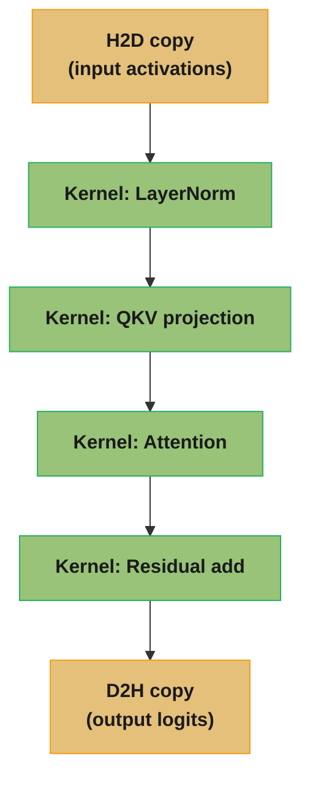
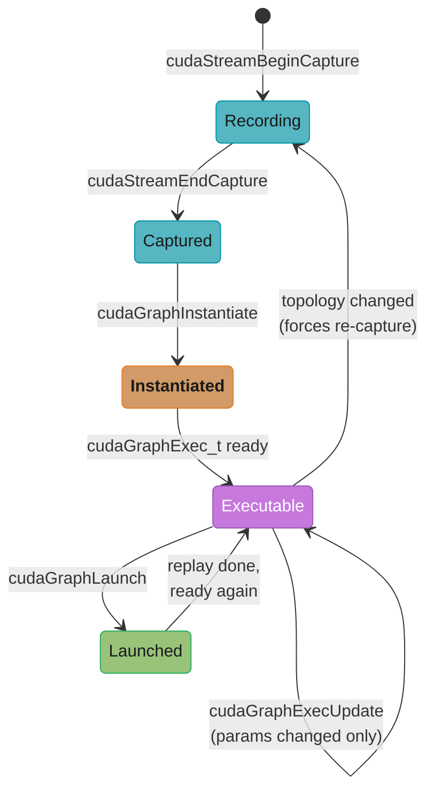
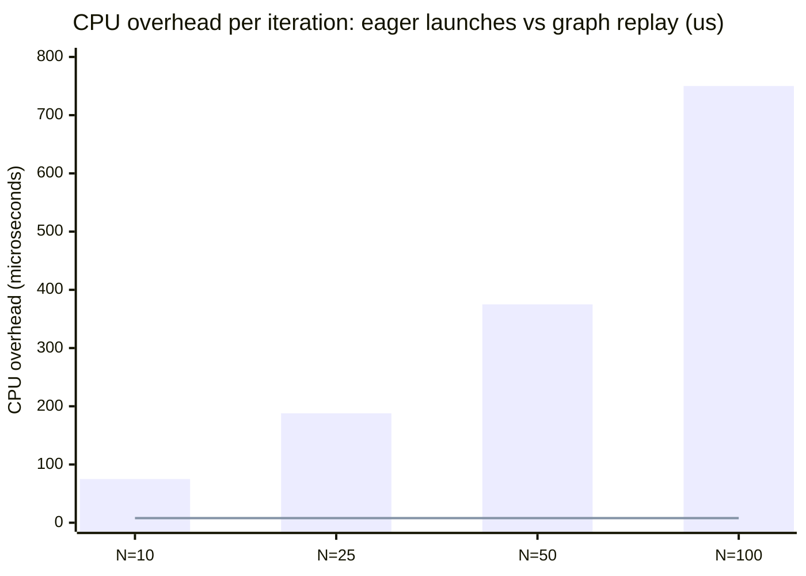
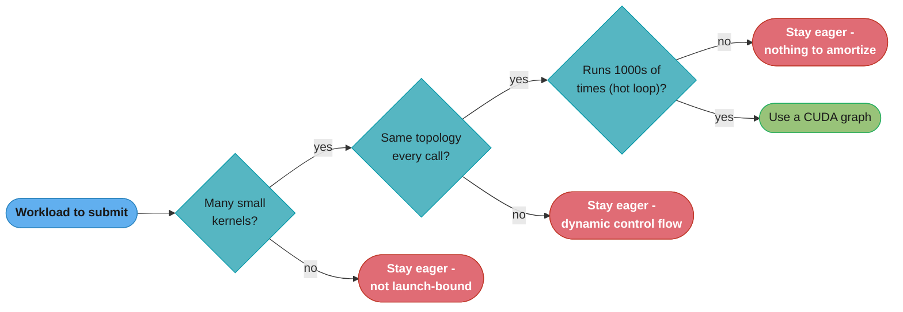
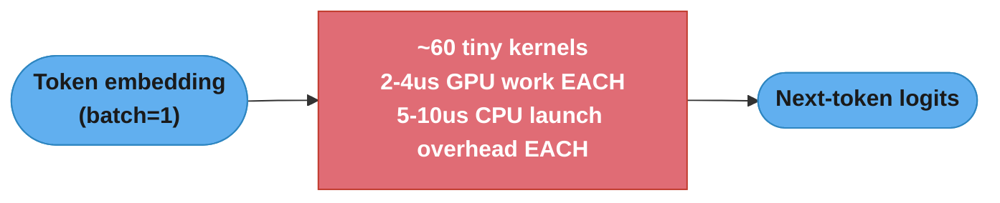

# CUDA Graphs

## 1. Concept Overview

A **CUDA graph** is a captured, static description of a whole sequence of GPU
work — kernel launches, memory copies, memsets, host callbacks, and the
dependency edges between them — that can be **instantiated once and replayed
many times** with a single API call. Ordinary CUDA code submits work
kernel-by-kernel, memcpy-by-memcpy: each `<<<...>>>` launch or `cudaMemcpyAsync`
is a separate round trip from the CPU through the CUDA driver, and each of
those round trips costs a roughly fixed **~5-10 microseconds** of CPU-side
overhead regardless of how much (or how little) work the GPU actually does.
For kernels that run for milliseconds, that overhead is noise. For workloads
built from many *tiny* kernels — a transformer's autoregressive decode step is
the canonical example, where a single generated token can involve dozens of
small kernel launches (layernorm, QKV projection, attention, output
projection, MLP up/down, residual adds) each doing only a few microseconds of
actual GPU work — the launch overhead can exceed the GPU execution time
itself. The GPU sits idle between kernels waiting for the CPU/driver to issue
the next one; the workload is **launch-bound**, not compute-bound or
memory-bound.

CUDA graphs remove this overhead by inverting the submission model: instead
of paying the ~5-10µs driver round trip for every node every time, you pay it
once to **capture** the sequence (via stream capture or explicit graph
construction), once more to **instantiate** it into an executable
(`cudaGraphExec_t`), and then **replay** the entire DAG with a single
`cudaGraphLaunch` call per iteration. The GPU's own hardware scheduler walks
the pre-resolved dependency graph and fires each node as its dependencies are
satisfied, with no CPU involvement per node. Because the capture and
instantiate cost is paid once and the replay is cheap, graphs are a pure win
for workloads that repeat the same static topology many times — training
steps, inference decode loops, any hot loop where "launch 50 small kernels" is
a bigger cost center than "run 50 small kernels." This module covers stream
capture and explicit construction, the instantiate/launch/replay lifecycle,
`cudaGraphExecUpdate` for changing parameters between replays, and the
PyTorch `torch.cuda.CUDAGraph` integration that makes graphs a one-line
opt-in for many training and inference loops. Stream and event mechanics
underneath graph capture are covered in
[streams_events_and_concurrency](../streams_events_and_concurrency/); this
module assumes that vocabulary and focuses on what capturing a stream into a
graph adds on top of it.

---

## 2. Intuition

> **One-line analogy**: Launching kernels one at a time is like phoning the
> kitchen after every single step of a recipe — "now dice the onion," wait for
> an answer, "now heat the pan," wait again; a CUDA graph is handing the chef
> the entire printed recipe card once and saying "go" — the chef (the GPU's
> own scheduler) runs every step in order without calling you back between
> them.

**Mental model**: Every CUDA kernel launch or async memcpy is, from the CPU's
perspective, a driver call that must marshal the launch configuration,
validate it, and enqueue it on the target stream — a fixed cost of roughly
5-10 microseconds that has nothing to do with how long the kernel itself runs
on the GPU. When a kernel's GPU execution time is comparable to or smaller
than that 5-10µs overhead — true of many of the small kernels in a
batch-1 LLM decode step — the CPU becomes the bottleneck: the GPU finishes
the kernel and then idles, waiting for the CPU to issue the next launch. A
CUDA graph breaks this coupling by **recording the whole DAG of work once**
(capture), **compiling it into a fixed executable** (instantiate), and then
**replaying that executable with one launch call** (`cudaGraphLaunch`) no
matter how many nodes it contains. The GPU's hardware scheduler — not the CPU
driver — walks the already-resolved dependency edges between nodes, so the
per-node ~5-10µs CPU tax is paid once at instantiate time and never again on
subsequent replays.

```mermaid
sequenceDiagram
    participant CPU as CPU (Host)
    participant Driver as CUDA Driver
    participant GPU as GPU Scheduler

    rect rgb(40, 44, 52)
    Note over CPU,GPU: Eager: 50 separate kernel launches
    loop 50 tiny kernels
        CPU->>Driver: launch kernel (~5-10us tax)
        Driver->>GPU: dispatch node
        GPU-->>Driver: node done (~2-4us work)
        Driver-->>CPU: control returns
    end
    Note over CPU,GPU: CPU tax: 50 x (5-10us) = 250-500us
    end

    rect rgb(40, 44, 52)
    Note over CPU,GPU: Graph: 1 replay call
    CPU->>Driver: cudaGraphLaunch(graphExec)
    Driver->>GPU: replay all 50 nodes<br/>(GPU-resident scheduler)
    GPU-->>Driver: whole DAG done
    Driver-->>CPU: control returns
    Note over CPU,GPU: CPU tax: 1 x (5-10us), amortized
    end
```



The eager path pays its ~5-10us CPU/driver tax once per node, 50 times over;
the graph path pays that same tax exactly once, no matter how many nodes the
replayed DAG contains — the GPU scheduler, not the driver, walks the
remaining 49 edges.

**Why it matters**: Autoregressive LLM inference at small batch size is the
textbook launch-bound workload: a 32-layer model might issue on the order of
dozens to a couple hundred kernel launches to produce a single token, each
kernel touching only a batch-of-1 (or few) row of activations and finishing
in a handful of microseconds. If launch overhead is 5-10µs and a step issues
sixty such launches, that alone is 300-600 microseconds of CPU-driver
overhead per token — often comparable to or larger than the GPU's actual
compute time for that step. Wrapping the decode step's kernel sequence in a
CUDA graph collapses those sixty round trips into one `cudaGraphLaunch` call,
and production inference engines (vLLM, TensorRT-LLM, PyTorch's
`torch.compile(mode="reduce-overhead")`) report **roughly 1.2-2x** throughput
improvements on exactly this launch-bound decode regime, for what is close to
a drop-in change once the graph is captured.

**Key insight**: A CUDA graph is a bet that the *topology* of GPU work — which
kernels run, in what order, with what launch configuration — will be
**identical on every replay**, and only scalar arguments or buffer pointers
may differ. That is exactly true of a fixed-shape training step or a
fixed-batch-size decode step run thousands of times, and exactly *not* true of
code whose control flow depends on data (an early-exit loop, a
variable-length sequence bucket that changes every call, a Python `if`
branching on a tensor value). Graphs win precisely where the answer to "will
this exact sequence of kernels run again unchanged?" is yes — and the capture
cost is amortized over however many replays follow, so the more times you
replay, the closer the per-replay overhead approaches zero.

---

## 3. Core Principles

- **Graphs separate definition from execution.** Building the DAG (capture or
  explicit construction) is a distinct phase from compiling it
  (`cudaGraphInstantiate`) and from running it (`cudaGraphLaunch`) — the
  classic "compile once, run many" pattern applied to GPU work submission
  itself, not just to the kernels' machine code.
- **Kernel launch overhead is a fixed CPU-side cost, independent of GPU work
  size.** Roughly 5-10 microseconds per launch is spent marshaling and
  validating the call and handing it to the driver — paid identically whether
  the kernel runs for 2 microseconds or 2 milliseconds on the GPU.
- **A graph node is more than a kernel.** Nodes can be kernel launches,
  `cudaMemcpy`/`cudaMemset` operations, host-function callbacks, child graphs
  (graphs embedding other graphs), or event record/wait operations — the
  graph captures the full dependency DAG among all of them, not a flat list.
- **Two construction paths exist: stream capture and explicit graph
  construction.** Stream capture records ordinary CUDA stream API calls you
  would have written anyway; explicit construction builds the graph node-by-
  node through the Graph API directly. Capture is far more common because it
  requires no rewrite of existing stream-based code.
- **`cudaGraphInstantiate` is where most of the "graph overhead" actually
  lives.** It compiles the captured or built graph into an immutable
  `cudaGraphExec_t`, resolving launch configurations and dependency structure
  once; this step costs meaningfully more than a single kernel launch, which
  is exactly why it must be amortized over many replays to pay off.
- **`cudaGraphLaunch` replays the entire DAG with one CPU-side call.** The
  GPU's own scheduler fires each node as its predecessors complete, with zero
  per-node CPU round trips — this is the mechanism that removes the launch-
  overhead tax on replay.
- **Graphs assume a static topology.** The same kernels, same grid/block
  dimensions, and same node count and dependency structure must hold on every
  replay; only pointer values and scalar kernel arguments are allowed to
  change between replays, and only through an explicit update mechanism.
- **`cudaGraphExecUpdate` (or per-node setters like
  `cudaGraphExecKernelNodeSetParams`) update an already-instantiated graph's
  parameters without a full re-instantiate**, provided the topology is
  unchanged — cheaper than recapturing from scratch, but never free, and it
  fails outright if the new graph's structure doesn't match the old one node
  for node.

---

## 4. Types / Architectures / Strategies

### 4.1 Stream capture (implicit construction)

The dominant way to build a graph: bracket ordinary stream-based CUDA code
with `cudaStreamBeginCapture`/`cudaStreamEndCapture`. Every kernel launch,
memcpy, and memset issued on the captured stream (or on other streams forked
from it via event-based fork/join) becomes a graph node instead of executing
immediately; cross-stream dependencies recorded via events during capture
become graph edges. This is attractive because it requires **no rewrite** —
the exact CUDA code you already have, run inside the capture brackets once,
produces a graph.

### 4.2 Explicit graph construction

The Graph API (`cudaGraphCreate`, `cudaGraphAddKernelNode`,
`cudaGraphAddMemcpyNode`, `cudaGraphAddDependencies`, ...) builds the DAG
node-by-node without ever executing a stream. This is more verbose but gives
precise control — useful for graphs assembled programmatically (e.g. a
library generating a graph shape from user configuration) or when you want to
construct a graph without any of its nodes ever running outside a graph
context.

### 4.3 Graph update strategies

| Strategy | Cost | When topology changes | When only params change |
|----------|------|------------------------|---------------------------|
| Full re-instantiate (`cudaGraphInstantiate` again) | Highest — full compile | Required | Works, but wasteful |
| `cudaGraphExecUpdate` | Moderate — validates + patches whole graph | Fails (returns an error) | Efficient, one call |
| `cudaGraphExecKernelNodeSetParams` (per-node) | Lowest — patches one node | N/A (topology unchanged only) | Most efficient when only a few nodes' args change each replay |

### 4.4 PyTorch CUDA graph integration

PyTorch exposes graphs at three levels of abstraction, from lowest to
highest:

- **`torch.cuda.CUDAGraph`** — the raw capture object; you manage warmup,
  static input/output tensors, and the `capture_begin`/`capture_end`/`replay`
  calls yourself.
- **`torch.cuda.graph` context manager** — wraps the raw object into a
  `with` block, capturing whatever runs inside it once and letting you call
  `.replay()` afterward.
- **`torch.cuda.make_graphed_callables`** — the highest-level entry point:
  wraps an `nn.Module` (or several) including its **backward pass**,
  handling the static-input-copy dance and warmup iterations automatically —
  the tool most training loops should reach for first.

### 4.5 Multi-stream capture (fork/join)

A captured region is not limited to a single stream. Recording an event on
the capture stream and waiting on it from a second stream (also under
capture) creates a fork; a symmetric wait-back on the original stream creates
a join. Every such cross-stream dependency recorded during capture becomes an
explicit edge in the resulting graph — this is how graphs represent
independent kernels that should run concurrently (e.g. two independent
attention heads) before converging on a downstream node.

---

## 5. Architecture Diagrams

### Capture -> Instantiate -> Launch (replay) lifecycle

```mermaid
flowchart LR
    classDef io      fill:#61afef,stroke:#2e86c1,color:#1a1a1a,font-weight:bold
    classDef build    fill:#d19a66,stroke:#e67e22,color:#1a1a1a,font-weight:bold
    classDef compile fill:#c678dd,stroke:#9b59b6,color:#fff,font-weight:bold
    classDef fast    fill:#98c379,stroke:#27ae60,color:#1a1a1a,font-weight:bold
    classDef slow    fill:#e06c75,stroke:#c0392b,color:#fff,font-weight:bold
    classDef req     fill:#56b6c2,stroke:#0097a7,color:#1a1a1a

    CODE(["Ordinary stream code\nor explicit node calls"])
    CAP["Define the graph\ncudaStreamBeginCapture / EndCapture\n(or cudaGraphAddKernelNode...)"]
    GRAPH["cudaGraph_t\n(captured DAG, not yet executable)"]
    INST["cudaGraphInstantiate\n~compile cost, paid once"]
    EXEC["cudaGraphExec_t\n(fixed executable)"]
    LAUNCH["cudaGraphLaunch\n1 CPU call replays whole DAG"]
    REPLAY(["GPU replays N times\n~5-10us CPU cost total, not per-node"])
    UPD["cudaGraphExecUpdate\n(topology unchanged,\nparams/pointers differ)"]

    CODE --> CAP --> GRAPH --> INST --> EXEC --> LAUNCH --> REPLAY
    REPLAY -->|"need new pointers/scalars\nnext iteration"| UPD
    UPD -->|"patched in place"| LAUNCH
    REPLAY -->|"topology must change"| CAP

    class CODE,REPLAY io
    class CAP,UPD build
    class GRAPH req
    class INST,EXEC compile
    class LAUNCH fast
```



Instantiate is where the one-time compile cost is paid; every subsequent
`cudaGraphLaunch` reuses that compiled `cudaGraphExec_t` for a single CPU
call regardless of how many nodes the DAG contains. `cudaGraphExecUpdate`
patches an existing executable in place when only pointers or scalar
arguments change; any change to the DAG's shape — a different number of
nodes, a different dependency edge — forces a fresh capture and
re-instantiate instead.

### A small dependency DAG (fan-out / fan-in)



A single decode step is really a long, mostly-linear chain like this one
repeated per layer — dozens of nodes end to end for a deep model. Launched
eagerly, each arrow above is a separate CPU-driver round trip (~5-10us each);
captured once into a graph, the whole chain becomes one `cudaGraphLaunch`
call per token, and the GPU's scheduler — not the CPU — walks the arrows.

### Graph object lifecycle (state view)



The two loops are the whole story: `Launched -> Executable -> Launched` is
the cheap steady-state replay path, while `Executable -> Executable` via
`cudaGraphExecUpdate` patches pointers/scalars without leaving the
Executable state at all — only an actual topology change forces the
expensive drop back to `Recording`.

---

## 6. How It Works — Detailed Mechanics

### 6.1 Stream capture — basic capture, instantiate, launch (C++)

```cpp
#include <cuda_runtime.h>
#include <cstdio>
#include <cstdlib>

#define CUDA_CHECK(call)                                                     \
    do {                                                                     \
        cudaError_t err__ = (call);                                          \
        if (err__ != cudaSuccess) {                                          \
            fprintf(stderr, "CUDA error %s:%d: %s\n", __FILE__, __LINE__,     \
                    cudaGetErrorString(err__));                              \
            std::exit(EXIT_FAILURE);                                         \
        }                                                                    \
    } while (0)

void captureAndReplay(float* d_in, float* d_mid, float* d_out, size_t n,
                       int numReplays) {
    cudaStream_t stream;
    CUDA_CHECK(cudaStreamCreate(&stream));

    cudaGraph_t graph = nullptr;
    cudaGraphExec_t graphExec = nullptr;

    // --- Warmup: run the sequence once *outside* capture. This forces any
    // lazy library init (cuBLAS/cuDNN handle creation, first-call JIT) to
    // happen before capture, since capturing lazy-init side effects is
    // unsupported/unreliable on some driver versions.
    kernelA<<<grid, block, 0, stream>>>(d_in, d_mid, n);
    kernelB<<<grid, block, 0, stream>>>(d_mid, d_out, n);
    CUDA_CHECK(cudaStreamSynchronize(stream));

    // --- Define: record the exact same sequence into a graph.
    CUDA_CHECK(cudaStreamBeginCapture(stream, cudaStreamCaptureModeGlobal));
    kernelA<<<grid, block, 0, stream>>>(d_in, d_mid, n);
    kernelB<<<grid, block, 0, stream>>>(d_mid, d_out, n);
    CUDA_CHECK(cudaStreamEndCapture(stream, &graph));

    // --- Instantiate: compile the captured DAG into a fixed executable.
    // This is the expensive, one-time step -- do it once, replay many times.
    CUDA_CHECK(cudaGraphInstantiate(&graphExec, graph, nullptr, nullptr, 0));

    // --- Launch (replay): one CPU call regardless of how many nodes.
    for (int i = 0; i < numReplays; ++i) {
        CUDA_CHECK(cudaGraphLaunch(graphExec, stream));
    }
    CUDA_CHECK(cudaStreamSynchronize(stream));

    CUDA_CHECK(cudaGraphExecDestroy(graphExec));
    CUDA_CHECK(cudaGraphDestroy(graph));
    CUDA_CHECK(cudaStreamDestroy(stream));
}
```

### 6.2 Explicit graph construction (C++)

```cpp
void buildGraphExplicitly(float* d_in, float* d_mid, float* d_out, size_t n) {
    cudaGraph_t graph;
    CUDA_CHECK(cudaGraphCreate(&graph, 0));

    cudaKernelNodeParams paramsA = {};
    void* argsA[] = {&d_in, &d_mid, &n};
    paramsA.func = reinterpret_cast<void*>(kernelA);
    paramsA.gridDim = grid;
    paramsA.blockDim = block;
    paramsA.sharedMemBytes = 0;
    paramsA.kernelParams = argsA;
    paramsA.extra = nullptr;

    cudaGraphNode_t nodeA;
    CUDA_CHECK(cudaGraphAddKernelNode(&nodeA, graph, nullptr, 0, &paramsA));

    cudaKernelNodeParams paramsB = {};
    void* argsB[] = {&d_mid, &d_out, &n};
    paramsB.func = reinterpret_cast<void*>(kernelB);
    paramsB.gridDim = grid;
    paramsB.blockDim = block;
    paramsB.sharedMemBytes = 0;
    paramsB.kernelParams = argsB;
    paramsB.extra = nullptr;

    cudaGraphNode_t nodeB;
    // nodeB depends on nodeA -- explicit dependency instead of program order.
    CUDA_CHECK(cudaGraphAddKernelNode(&nodeB, graph, &nodeA, 1, &paramsB));

    cudaGraphExec_t graphExec;
    CUDA_CHECK(cudaGraphInstantiate(&graphExec, graph, nullptr, nullptr, 0));

    cudaStream_t stream;
    CUDA_CHECK(cudaStreamCreate(&stream));
    CUDA_CHECK(cudaGraphLaunch(graphExec, stream));
    CUDA_CHECK(cudaStreamSynchronize(stream));

    CUDA_CHECK(cudaGraphExecDestroy(graphExec));
    CUDA_CHECK(cudaGraphDestroy(graph));
    CUDA_CHECK(cudaStreamDestroy(stream));
}
```

### 6.3 Updating parameters between replays with `cudaGraphExecUpdate` (C++)

```cpp
void replayWithNewBuffers(cudaGraphExec_t graphExec, cudaStream_t stream,
                           float* d_in_next, float* d_mid, float* d_out,
                           size_t n) {
    // Build a *fresh* graph describing the same topology but with the new
    // input pointer -- cudaGraphExecUpdate diffs it against the currently
    // instantiated executable and patches matching nodes in place.
    cudaGraph_t newGraph;
    CUDA_CHECK(cudaStreamBeginCapture(stream, cudaStreamCaptureModeGlobal));
    kernelA<<<grid, block, 0, stream>>>(d_in_next, d_mid, n);
    kernelB<<<grid, block, 0, stream>>>(d_mid, d_out, n);
    CUDA_CHECK(cudaStreamEndCapture(stream, &newGraph));

    cudaGraphExecUpdateResultInfo updateResult;
    cudaError_t updateStatus =
        cudaGraphExecUpdate(graphExec, newGraph, &updateResult);

    if (updateStatus != cudaSuccess) {
        // Topology mismatch (different node count/shape/kernel) -- update
        // is not possible; must fall back to a full re-instantiate.
        CUDA_CHECK(cudaGraphExecDestroy(graphExec));
        CUDA_CHECK(cudaGraphInstantiate(&graphExec, newGraph, nullptr,
                                          nullptr, 0));
    }

    CUDA_CHECK(cudaGraphLaunch(graphExec, stream));
    CUDA_CHECK(cudaGraphDestroy(newGraph));
}
```

### 6.4 PyTorch — raw `torch.cuda.CUDAGraph` capture (Python)

```python
import torch

device = torch.device("cuda")
static_input = torch.randn(1, 4096, device=device)
static_output = torch.empty(1, 4096, device=device)
model = torch.nn.Linear(4096, 4096).to(device)

# Warmup on a *side* stream before capture -- required so any lazy cuDNN/
# cuBLAS handle init or memory-pool growth happens outside the captured
# region, exactly like the C++ warmup step in Section 6.1.
warmup_stream = torch.cuda.Stream()
warmup_stream.wait_stream(torch.cuda.current_stream())
with torch.cuda.stream(warmup_stream):
    for _ in range(3):
        static_output = model(static_input)
torch.cuda.current_stream().wait_stream(warmup_stream)

graph = torch.cuda.CUDAGraph()
with torch.cuda.graph(graph):
    # Everything here is *recorded*, not executed, except during capture
    # itself. Inputs/outputs MUST be the same tensor objects (same memory
    # addresses) on every subsequent replay -- copy new data INTO
    # static_input, never rebind the Python name to a new tensor.
    static_output = model(static_input)

# --- Replay loop: copy fresh data into the static input tensor in place,
# then replay -- one call regardless of how many ops model() contains.
for batch in data_stream:
    static_input.copy_(batch)      # in-place copy, same underlying buffer
    graph.replay()
    result = static_output.clone()  # clone if you need to keep this output
```

### 6.5 PyTorch — the `torch.cuda.graph` context manager, decode-loop style (Python)

```python
import torch

device = torch.device("cuda")
decode_step_fn = build_decode_step(model)  # one forward pass, batch=1

static_token_ids = torch.zeros(1, 1, dtype=torch.long, device=device)
static_kv_cache = allocate_static_kv_cache(model, device)

# Warmup: run the exact decode step shape a few times outside capture.
s = torch.cuda.Stream()
s.wait_stream(torch.cuda.current_stream())
with torch.cuda.stream(s):
    for _ in range(3):
        static_logits = decode_step_fn(static_token_ids, static_kv_cache)
torch.cuda.current_stream().wait_stream(s)

g = torch.cuda.CUDAGraph()
with torch.cuda.graph(g):
    static_logits = decode_step_fn(static_token_ids, static_kv_cache)

# Steady-state decode loop: dozens of small kernels per step collapse into
# one graph.replay() call -- this is the launch-bound regime described in
# Section 2, and the mechanism behind vLLM/TensorRT-LLM decode-graph modes.
for _ in range(max_new_tokens):
    static_token_ids.copy_(next_token_ids)   # in place, same buffer
    g.replay()
    next_token_ids = sample(static_logits)
```

### 6.6 PyTorch — `make_graphed_callables` for a training step (Python)

```python
import torch

device = torch.device("cuda")
model = build_model().to(device)
sample_input = torch.randn(32, 512, device=device)  # matches real batch shape

# Wraps forward AND backward: handles static-buffer plumbing, warmup
# iterations, and stream bookkeeping for you -- the highest-level entry
# point, and the one most training loops should reach for first.
graphed_model = torch.cuda.make_graphed_callables(model, (sample_input,))

optimizer = torch.optim.AdamW(model.parameters(), lr=1e-4)

for batch, targets in train_loader:
    optimizer.zero_grad(set_to_none=True)
    output = graphed_model(batch)          # replays captured fwd graph
    loss = loss_fn(output, targets)
    loss.backward()                         # replays captured bwd graph
    optimizer.step()
```

`make_graphed_callables` requires the input shape to be fixed across calls
(here, batch size 32 baked in by `sample_input`) — a different batch size on
a later call is a topology change the wrapper cannot absorb, and needs a
separate graphed callable per shape bucket (see Section 9's discussion of
variable-batch decode serving).

---

## 7. Real-World Examples

- **vLLM's CUDA graph decode mode** — captures the decode forward pass for a
  fixed set of batch-size "buckets" (e.g. 1, 2, 4, 8, 16, ...) ahead of time
  and dispatches incoming requests to the matching bucket's pre-captured
  graph, trading a small amount of memory and startup time for a large
  reduction in per-token CPU overhead at low batch sizes.
- **TensorRT-LLM** — captures the in-flight-batching decode iteration into a
  graph per active batch-size configuration, specifically targeting the
  launch-bound single-token decode step that dominates latency-sensitive
  serving.
- **PyTorch 2.x `torch.compile(mode="reduce-overhead")`** — automatically
  wraps the compiled region's hot path in CUDA graphs when it detects a
  launch-bound region with a stable shape, requiring no manual
  `torch.cuda.graph` calls from the user.
- **Hugging Face `transformers` static KV cache + CUDA graphs** — recent
  `generate()` code paths pair a fixed-size (pre-allocated) KV cache with
  graph capture specifically because a graph cannot tolerate the cache
  reallocating or resizing mid-replay.
- **cuDNN/cuBLAS-heavy training loops with a fixed batch shape** — any
  training step where the same forward/backward kernel sequence and shapes
  repeat every iteration is a graph candidate; frameworks that pin batch
  size and sequence length specifically to enable this are trading a small
  amount of flexibility for the CPU-overhead win.

---

## 8. Tradeoffs

| Approach | CPU overhead per iteration | Setup cost | Handles dynamic shapes/control flow | Best for |
|----------|------------------------------|-----------|----------------------------------------|----------|
| Eager launch (no graph) | ~5-10us per kernel/memcpy, scales with node count | None | Yes, natively | Prototyping, workloads with genuinely variable topology |
| Stream-captured graph | ~5-10us total per `cudaGraphLaunch`, independent of node count | Capture + instantiate (moderate, one-time) | No — topology must be static | Repeated, fixed-shape hot loops (decode step, training step) |
| Explicit graph construction | Same as stream-captured at replay time | Highest authoring effort (manual node/dependency wiring) | No | Library-generated graphs, graphs assembled without ever running eagerly |
| Graph + `cudaGraphExecUpdate` | Same replay cost, plus update cost when params change | Moderate — update is cheaper than full re-instantiate | Only for parameter changes, not topology changes | Same topology replayed with different pointers/scalars each time (new batch of data, new KV-cache slot) |



The bars (eager, ~5-10us per kernel) grow linearly with kernel count N; the
flat line (one `cudaGraphLaunch`) stays pinned at roughly one launch's worth
of overhead no matter how large N gets — the whole point of collapsing N
round trips into one.

---

## 9. When to Use / When NOT to Use



Only a "yes" at all three gates pays off: many tiny kernels make the launch
tax matter, a static topology makes capture legal, and enough replays make
the one-time capture/instantiate cost worth amortizing.

**Use CUDA graphs when:**
- The workload is **launch-bound** — many small kernels whose combined GPU
  execution time is comparable to or smaller than their combined CPU launch
  overhead (the canonical small-batch LLM decode step).
- The **same topology repeats many times** — a training step run for
  thousands of iterations, or a decode step run once per generated token —
  so the one-time capture/instantiate cost is amortized across enough
  replays to pay off.
- Only **pointers or scalar arguments** change between repetitions (new
  input batch, new KV-cache slot), not the shape or number of operations.
- You can afford a **fixed-shape** design: pre-allocated static buffers,
  fixed batch size (or a small set of bucketed batch sizes), and a warmup
  phase before the first capture.

**Avoid CUDA graphs when:**
- The workload has **data-dependent control flow** — a Python `if` branching
  on a tensor's runtime value, an early-exit loop, or any code path that may
  add or remove kernels between calls; the graph's topology cannot follow
  the data.
- **Shapes vary per call** (batch size, sequence length) without a bucketing
  strategy — each new shape either forces a fresh capture (expensive if it
  happens every call) or simply doesn't fit an existing graph.
- The code is a **one-off computation** — capture and instantiate cost more
  than a single eager launch sequence, so there is nothing to amortize
  against.
- The region does **dynamic memory allocation** whose address or size can
  change between replays — captured allocations are handled specially by
  CUDA's graph memory pools and mixing them carelessly with ordinary
  allocation is a common source of subtle bugs.
- **Debuggability matters more than the overhead win** — breakpoints,
  `printf`, and step-through debugging inside a captured-and-replayed region
  behave differently than in eager code, since the CPU is no longer issuing
  each node individually.

---

## 10. Common Pitfalls

**BROKEN: a hot loop re-launches 50 tiny kernels per iteration from the CPU**

```cpp
// BROKEN: launch-bound hot loop -- each of the 50 tiny kernels pays its own
// ~5-10us CPU/driver round trip every single iteration, and the GPU sits
// idle between launches waiting on the CPU to issue the next one. If each
// kernel's actual GPU work is only ~2-3us, the CPU overhead dominates.
for (int step = 0; step < numSteps; ++step) {
    for (int layer = 0; layer < 50; ++layer) {
        tinyKernel<<<grid, block, 0, stream>>>(d_state[layer], n);
    }
    cudaStreamSynchronize(stream);
    // ~50 * (5-10us overhead) = 250-500us of CPU tax paid every step, on
    // top of whatever the 50 kernels actually cost to run on the GPU.
}
```

```cpp
// FIX: capture the 50-kernel sequence once, instantiate once, then replay
// with a single cudaGraphLaunch call per step -- the CPU tax drops from
// "50 round trips" to "1 round trip," independent of how many kernels the
// captured sequence contains.
cudaGraph_t graph;
cudaGraphExec_t graphExec;

// Warmup outside capture (see Section 6.1's rationale).
for (int layer = 0; layer < 50; ++layer) {
    tinyKernel<<<grid, block, 0, stream>>>(d_state[layer], n);
}
CUDA_CHECK(cudaStreamSynchronize(stream));

CUDA_CHECK(cudaStreamBeginCapture(stream, cudaStreamCaptureModeGlobal));
for (int layer = 0; layer < 50; ++layer) {
    tinyKernel<<<grid, block, 0, stream>>>(d_state[layer], n);
}
CUDA_CHECK(cudaStreamEndCapture(stream, &graph));
CUDA_CHECK(cudaGraphInstantiate(&graphExec, graph, nullptr, nullptr, 0));

for (int step = 0; step < numSteps; ++step) {
    CUDA_CHECK(cudaGraphLaunch(graphExec, stream));
    // 1 CPU call replays all 50 nodes -- the GPU scheduler walks the
    // pre-resolved dependency chain with no per-node driver round trip.
}
CUDA_CHECK(cudaStreamSynchronize(stream));
```

**BROKEN: changing kernel parameters between replays without
`cudaGraphExecUpdate` — a stale graph**

```cpp
// BROKEN: the instantiated graph's nodes still hold the pointers/args that
// were live at *capture time*. Simply pointing d_input at a new buffer on
// the host side does nothing to the already-compiled cudaGraphExec_t --
// every replay keeps reading/writing the ORIGINAL buffers, silently
// producing stale or wrong results with no error raised.
float* d_input = d_bufferA;
// ... capture and instantiate graphExec using d_input == d_bufferA ...

d_input = d_bufferB;             // intent: process a new buffer next replay
cudaGraphLaunch(graphExec, stream);
// Still operates on d_bufferA -- the graph's kernel-node args were frozen
// at instantiate time and this reassignment never touches them.
```

```cpp
// FIX: either patch the specific node's parameters directly...
cudaKernelNodeParams newParams = originalParams;
newParams.kernelParams = newArgsPointingAtBufferB;
CUDA_CHECK(cudaGraphExecKernelNodeSetParams(graphExec, kernelNode,
                                              &newParams));
CUDA_CHECK(cudaGraphLaunch(graphExec, stream));

// ...or re-capture a graph describing the new pointer and update in bulk,
// which is what most real code does (see Section 6.3):
cudaGraph_t newGraph;
CUDA_CHECK(cudaStreamBeginCapture(stream, cudaStreamCaptureModeGlobal));
tinyKernel<<<grid, block, 0, stream>>>(d_bufferB, n);
CUDA_CHECK(cudaStreamEndCapture(stream, &newGraph));

cudaGraphExecUpdateResultInfo updateResult;
CUDA_CHECK(cudaGraphExecUpdate(graphExec, newGraph, &updateResult));
CUDA_CHECK(cudaGraphLaunch(graphExec, stream));
CUDA_CHECK(cudaGraphDestroy(newGraph));
```

**Other common pitfalls:**
- **Capturing before lazy library initialization has happened.** The first
  cuBLAS/cuDNN call on a handle can perform allocation and JIT work that
  behaves unreliably if it happens for the first time *during* capture —
  always warm up outside the captured region first.
- **Rebinding a Python tensor name instead of copying into it.** In PyTorch,
  `static_input = new_batch` rebinds the name to a different underlying
  buffer; the graph still reads the original memory address captured at
  `torch.cuda.graph(...)` time. Always `static_input.copy_(new_batch)`.
- **Ignoring the return status of `cudaGraphExecUpdate`.** A topology
  mismatch (different node count, different kernel, different dependency
  shape) makes the update fail — checking `cudaSuccess` and falling back to
  a full re-instantiate is required, not optional.
- **Treating captured allocations like ordinary ones.** Device memory
  allocated *inside* a captured region is managed by CUDA's graph-private
  memory pool; freeing it outside the graph's lifecycle, or assuming its
  address is stable across independent graphs, leads to subtle corruption.
- **Debugging a captured region with breakpoints or `printf`.** Because
  replay issues no per-node CPU calls, conventional single-step debugging
  tools that expect a CPU round trip per kernel behave differently inside a
  graph — debug the eager (pre-capture) version of the code first.

---

## 11. Technologies & Tools

| Tool / API | Purpose |
|------------|---------|
| `cudaStreamBeginCapture` / `cudaStreamEndCapture` | Record ordinary stream API calls into a `cudaGraph_t` |
| `cudaGraphCreate` / `cudaGraphAddKernelNode` / `cudaGraphAddMemcpyNode` / `cudaGraphAddDependencies` | Explicit, node-by-node graph construction |
| `cudaGraphInstantiate` | Compile a `cudaGraph_t` into an executable `cudaGraphExec_t` |
| `cudaGraphLaunch` | Replay an instantiated graph with a single CPU call |
| `cudaGraphExecUpdate` | Bulk-patch an instantiated graph's node parameters when topology is unchanged |
| `cudaGraphExecKernelNodeSetParams` | Patch a single node's kernel parameters in place |
| `cudaGraphDestroy` / `cudaGraphExecDestroy` | Release graph / executable resources |
| Nsight Systems | Timeline view distinguishing graph-launch overhead from per-node eager launches; visualizes graph node dependency structure |
| `torch.cuda.CUDAGraph` | PyTorch's raw capture object (`capture_begin`/`capture_end`/`replay`) |
| `torch.cuda.graph` | Context-manager wrapper around `CUDAGraph` capture |
| `torch.cuda.make_graphed_callables` | High-level wrapper capturing an `nn.Module`'s forward and backward |
| vLLM / TensorRT-LLM | Production inference engines using bucketed CUDA graphs to remove decode-step launch overhead |

---

## 12. Interview Questions with Answers

**Q: What problem do CUDA graphs solve?**
They eliminate the fixed ~5-10
microsecond CPU-side launch overhead paid on every kernel launch or memcpy by
capturing a whole sequence once and replaying it with a single API call,
which matters most for workloads made of many small, fast kernels where that
per-launch overhead dominates the actual GPU compute time.

**Q: Why does a workload with dozens of tiny kernels become launch-bound
instead of compute-bound?** Each kernel launch costs a roughly fixed 5-10us
of CPU/driver overhead regardless of GPU execution time, so when the kernels
themselves finish in a similar handful of microseconds, the GPU spends more
time idle waiting for the next launch than it spends actually computing — the
classic profile of a batch-1 LLM decode step.

**Q: What is the difference between stream capture and explicit graph
construction?** Stream capture records the graph by observing ordinary
stream API calls you already wrote between `cudaStreamBeginCapture` and
`cudaStreamEndCapture`, requiring no rewrite, while explicit construction
builds the DAG node-by-node through the Graph API directly, giving precise
control at the cost of far more verbose authoring code.

**Q: What does `cudaGraphInstantiate` actually do, and why is it a separate
step from launching?** It compiles the captured or explicitly built
`cudaGraph_t` into a fixed, executable `cudaGraphExec_t`, resolving launch
configurations and dependency structure once; this compile-like step costs
noticeably more than a single kernel launch, which is exactly why it must be
amortized over many cheap replays rather than repeated per iteration.

**Q: Why does replaying an already-instantiated graph cost roughly one launch's
worth of CPU overhead, no matter how many nodes it contains?** `cudaGraphLaunch`
hands the entire pre-resolved DAG to the GPU's own hardware scheduler in a
single driver call, and the scheduler — not the CPU — fires each node as its
dependencies complete, so the per-node CPU round trip that eager launches pay
simply does not happen on replay.

**Q: What happens if you change a device pointer's value in your CPU code and
then call `cudaGraphLaunch` again without updating the graph?** Nothing
changes in the graph — its kernel nodes still reference whatever
pointers/arguments were captured at instantiate time, so the graph silently
keeps reading and writing the original buffers, producing stale or wrong
results with no error raised.

**Q: What does `cudaGraphExecUpdate` require to succeed, and what happens when
that requirement isn't met?** It requires the new graph's topology — node
count, node types, and dependency structure — to exactly match the currently
instantiated executable's topology; if it doesn't match, the call fails and
returns an error that must be checked, at which point the only remaining
option is a full re-instantiate.

**Q: Why can't a CUDA graph handle data-dependent control flow, like an
early-exit loop?** A graph's node structure is fixed at capture/instantiate
time — it is a static DAG — so any code path where the number or identity of
kernels to run depends on a runtime value cannot be represented without
re-capturing for every possible branch outcome, which defeats the purpose of
amortizing capture cost.

**Q: Why must you warm up a stream before capturing it into a graph?**
The
first call into a library like cuBLAS or cuDNN often triggers lazy handle
initialization or JIT compilation, and capturing that first-call side effect
can behave unreliably; running the sequence once outside capture forces that
one-time setup to happen before the graph records only steady-state kernel
launches.

**Q: In PyTorch, why does copying data into a static tensor (`static_input.copy_
(batch)`) work for graph replay but rebinding the Python name
(`static_input = batch`) does not?** The captured graph's kernels reference
the specific memory address that was live when `torch.cuda.graph(...)`
captured them; an in-place `copy_` writes new data into that same address,
while rebinding the Python name only changes what the name points to in
Python, leaving the graph still reading the old, now-stale buffer.

**Q: When does a CUDA graph actually pay off versus eager launching, in terms
of iteration count?** Only after enough replays have occurred to amortize the
one-time capture-plus-instantiate cost against the per-iteration launch-
overhead savings — a graph run only once or twice is pure overhead with no
payoff, while one run thousands of times (a long decode loop or many
training steps) reaps nearly the full benefit.

**Q: What kinds of GPU work can a graph node represent besides a kernel
launch?** Memory copies, memsets, host-function callbacks, event
record/wait operations, and even child graphs embedding other graphs — the
DAG is a general description of dependent GPU (and host-callback) work, not
solely a sequence of kernel launches.

**Q: Why do inference engines like vLLM capture separate CUDA graphs per
batch-size "bucket" instead of one graph for all batch sizes?** A graph's
topology (and typically its launch configuration) is fixed at capture time,
so a different batch size is effectively a different topology; bucketing
captures one graph per common batch size ahead of time and dispatches
incoming requests to the matching bucket rather than trying to force one
graph to cover every possible shape.

**Q: What roughly is the throughput improvement production LLM inference
engines report from wrapping the decode step in a CUDA graph?** Commonly
cited figures are in the range of roughly 1.2-2x on the decode-step
throughput of launch-bound, small-batch autoregressive generation, since
collapsing dozens of small kernel launches into a single graph launch removes
most of the CPU-driver overhead that dominated that regime.

**Q: Why is debugging code inside a captured-and-replayed graph harder than
debugging the same code run eagerly?** Conventional breakpoint and `printf`-
based debugging assumes a CPU round trip accompanies each kernel, which is
exactly the overhead a graph removes on replay — the GPU's own scheduler
fires nodes without the CPU issuing each one individually, so it is standard
practice to debug the eager version of the code first and only capture it
into a graph once it's verified correct.

---

## 13. Best Practices

- **Reach for a graph only after confirming the workload is launch-bound.**
  Profile with Nsight Systems first (see
  [profiling_and_performance_analysis](../profiling_and_performance_analysis/))
  — a kernel-bound or memory-bound workload gains little from removing launch
  overhead that was never the bottleneck.
- **Warm up outside the captured region every time.** Run the sequence once
  eagerly before `cudaStreamBeginCapture`/`torch.cuda.graph` so any lazy
  library initialization happens before, not during, capture.
- **Design for a fixed shape, or a small set of bucketed shapes.** Pin batch
  size and sequence length (or capture one graph per common bucket, as vLLM
  and TensorRT-LLM do) rather than trying to make one graph cover every
  possible input shape.
- **Pre-allocate static input/output buffers and copy into them in place.**
  Never rebind the buffer reference between replays — always `memcpy`/
  `copy_` new data into the same, already-captured memory address.
- **Prefer `cudaGraphExecUpdate` over full re-instantiate when only pointers
  or scalars change.** Check its return status and fall back to a full
  re-instantiate only when the topology genuinely changed.
- **Amortize deliberately — measure replay count before committing.** A
  graph replayed only a handful of times may not recoup its own capture and
  instantiate cost; a decode loop generating hundreds of tokens, or a
  training run of thousands of steps, comfortably will.
- **Debug the eager version first, capture second.** Verify correctness with
  ordinary kernel launches and standard tooling, then wrap the verified
  sequence in a graph — do not use graph capture as the first correctness
  pass.
- **In PyTorch, start with `make_graphed_callables` before hand-rolling raw
  `CUDAGraph` capture.** It already handles the static-buffer and
  warmup-iteration bookkeeping that is easy to get subtly wrong by hand.

---

## 14. Case Study

### Scenario: a batch-1 LLM decode loop is launch-bound

A team serves a 32-layer decoder-only model for single-user chat inference.
Each generated token issues roughly 60 kernel launches (per-layer layernorm,
QKV projection, attention, output projection, MLP up/activation/down, plus
residual adds) at batch size 1. Profiling shows the GPU is idle between
kernels far more than it's busy: each kernel's actual execution time is only
2-4 microseconds at this tiny batch size, while the CPU/driver overhead per
launch is a fairly constant 5-10 microseconds — the step is dominated by CPU
round trips, not GPU compute.

### Diagram: the eager, launch-bound decode step



At 60 launches x (5-10us overhead), the CPU tax alone is roughly 300-600
microseconds per token — comparable to, or larger than, the sum of the
kernels' actual GPU execution time, meaning the GPU is idle waiting on the
driver for a large fraction of every decode step.

### BROKEN: eager per-token kernel launches

```cpp
// BROKEN: every generated token re-issues all ~60 kernel launches from the
// CPU, paying the full launch-overhead tax every single step even though
// the exact same sequence of kernels, in the exact same order, runs every
// time -- only the KV-cache contents and the current token differ.
struct DecodeLoopEager {
    void generateToken(int layerCount, cudaStream_t stream) {
        for (int layer = 0; layer < layerCount; ++layer) {
            layerNormKernel<<<grid, block, 0, stream>>>(d_state, layer);
            qkvProjKernel<<<grid, block, 0, stream>>>(d_state, d_qkv, layer);
            attentionKernel<<<grid, block, 0, stream>>>(d_qkv, d_kvCache,
                                                          d_attnOut, layer);
            outProjKernel<<<grid, block, 0, stream>>>(d_attnOut, d_state,
                                                        layer);
            mlpKernel<<<grid, block, 0, stream>>>(d_state, layer);
        }
        cudaStreamSynchronize(stream);
        // ~60 launches x 5-10us overhead ~= 300-600us of CPU tax, every
        // single token, for a topology that never actually changes.
    }
};
```

### FIX: capture once, replay per token, update only the changing pointers

```cpp
// FIX: capture the entire per-layer sequence once into a graph. Every
// subsequent token replays the whole DAG with a single cudaGraphLaunch;
// only the current-token buffer and KV-cache write slot change between
// replays, patched via cudaGraphExecUpdate rather than a full re-capture.
struct DecodeLoopGraphed {
    cudaGraph_t graph = nullptr;
    cudaGraphExec_t graphExec = nullptr;
    cudaStream_t stream;
    int layerCount;

    void captureOnce() {
        CUDA_CHECK(cudaStreamCreate(&stream));

        // Warmup outside capture -- forces lazy cuBLAS/cuDNN init first.
        runAllLayersEagerly(layerCount, stream);
        CUDA_CHECK(cudaStreamSynchronize(stream));

        CUDA_CHECK(cudaStreamBeginCapture(stream,
                                            cudaStreamCaptureModeGlobal));
        runAllLayersEagerly(layerCount, stream);
        CUDA_CHECK(cudaStreamEndCapture(stream, &graph));
        CUDA_CHECK(cudaGraphInstantiate(&graphExec, graph, nullptr, nullptr,
                                          0));
    }

    void generateToken(int currentSlot) {
        // Only the KV-cache write slot changes -- topology is identical to
        // capture time, so a full re-instantiate is never needed here.
        setKvCacheSlot(currentSlot);
        CUDA_CHECK(cudaGraphLaunch(graphExec, stream));
        CUDA_CHECK(cudaStreamSynchronize(stream));
        // 1 CPU call replays all ~60 nodes; the GPU scheduler walks the
        // pre-resolved dependency chain with no per-node driver round trip.
    }

    void teardown() {
        CUDA_CHECK(cudaGraphExecDestroy(graphExec));
        CUDA_CHECK(cudaGraphDestroy(graph));
        CUDA_CHECK(cudaStreamDestroy(stream));
    }
};
```

### Metrics: before vs. after

| Metric | Eager per-token launches | Captured graph, replayed per token |
|--------|----------------------------|--------------------------------------|
| Kernel launches per token (CPU round trips) | ~60 | 1 |
| CPU/driver overhead per token | ~300-600us (60 x 5-10us) | ~5-10us (single `cudaGraphLaunch`) |
| GPU execution time per token (unchanged) | ~150-250us (sum of kernel work) | ~150-250us |
| GPU idle time between kernels | Large — CPU round trip between every node | Near zero — GPU scheduler fires nodes with no CPU wait |
| Approximate decode throughput change | baseline | ~1.2-2x tokens/sec |

The kernels' own GPU execution time barely moves — this fix does not make
any kernel itself faster. What changes is that ~300-600 microseconds of pure
CPU-driver waiting per token collapses to roughly one launch's worth of
overhead, because the GPU's hardware scheduler, not the CPU, now walks the
pre-resolved dependency chain between all 60 nodes.

### Discussion Questions

- Why does this fix improve tokens/sec without changing any individual
  kernel's own GPU execution time, and how would you demonstrate that with
  Nsight Systems (see
  [profiling_and_performance_analysis](../profiling_and_performance_analysis/))?
- If the serving system needs to support batch sizes 1, 2, 4, 8, and 16
  concurrently, why can't one captured graph cover all five, and what does
  bucketing per batch size cost in extra memory and startup time?
- What would happen to correctness if `setKvCacheSlot` changed which KV-cache
  *buffer* the kernels reference — not just which slot within a fixed
  buffer — without a corresponding `cudaGraphExecUpdate`?
- This case study captures a fixed 32-layer, fixed-batch-1 decode step — how
  would speculative decoding (accepting a variable number of draft tokens
  per step) interact with the requirement that a graph's topology be
  static, and what would you need to bucket on instead?
- The kernels' launch overhead is now amortized away — does that change
  whether it's worth further optimizing the individual kernels themselves
  (e.g. fusing layernorm into the QKV projection), and why or why not? See
  [optimize_llm_inference_kernels](../case_studies/optimize_llm_inference_kernels.md)
  for the kernel-fusion angle on this same decode-step workload.
