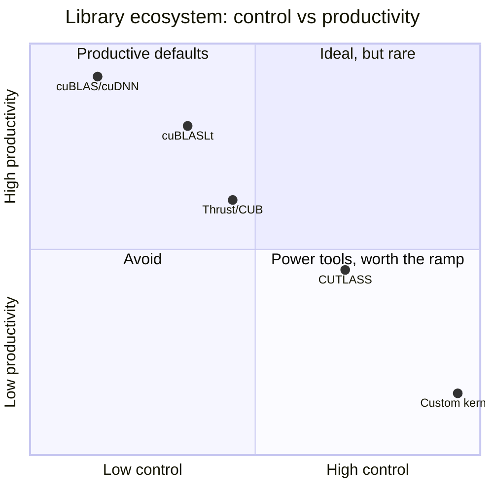
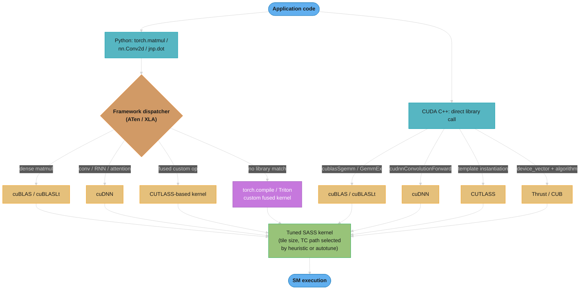
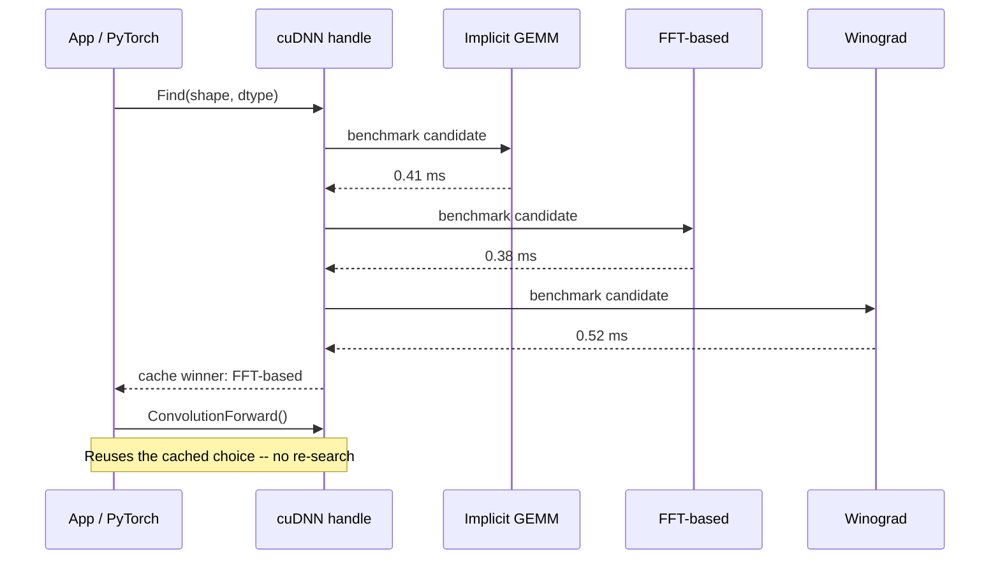
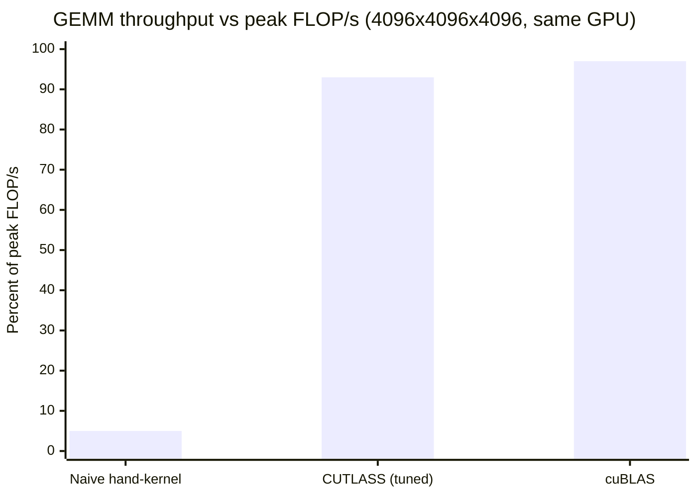
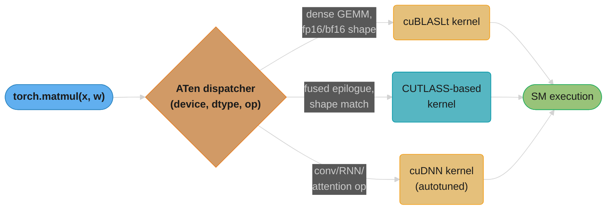
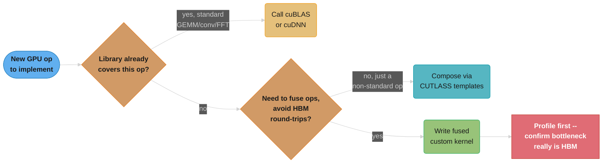
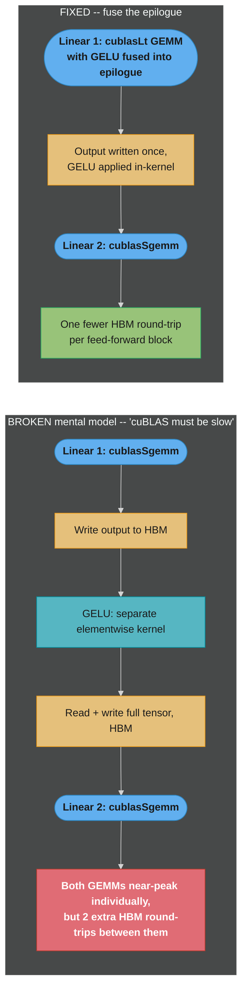

# CUDA Math & DNN Libraries

## 1. Concept Overview

Almost nobody who ships production GPU code writes their own matrix multiply, convolution, or FFT from scratch — they call a library that NVIDIA (or an open-source project layered on top of NVIDIA's toolchain) has spent years hand-tuning per GPU generation. **cuBLAS** covers dense linear algebra (GEMM, GEMV, the classic BLAS levels 1-3); **cuBLASLt** is the newer, lower-level cuBLAS API built specifically for fused, mixed-precision GEMMs (bias, activation, and quantization scaling folded into one kernel); **cuDNN** covers the primitives a deep-learning layer is actually built from — convolution, pooling, RNN cells, normalization, and fused attention; **CUTLASS** is an open-source C++ template library that exposes the same GEMM/convolution building blocks cuBLAS and cuDNN use internally, so you can assemble a custom, fused kernel that still reaches near-peak performance instead of hand-writing SASS-adjacent code from zero. Rounding out the ecosystem: **cuFFT** (Fourier transforms), **cuSPARSE** (sparse linear algebra), **cuRAND** (GPU-side random number generation), **Thrust** (an STL-like C++ parallel-algorithms library), **CUB** (the block/warp-level primitives Thrust itself is partly built from), and **nvJPEG**/**NPP** (image and signal preprocessing primitives for data pipelines feeding a model).

This module is about the *library-vs-custom-kernel decision* as much as it is about any single library's API: when to reach for one of these (almost always, by default), when a template library like CUTLASS is the right middle ground, and when — and only when — writing a fused custom kernel from scratch actually beats them. It also covers the two ways engineers touch this ecosystem in practice: directly, via CUDA C++ calls into cuBLAS/cuDNN/CUTLASS/Thrust, and indirectly, via Python — CuPy wraps cuBLAS and cuDNN behind NumPy-like array syntax, and every mainstream deep-learning framework (PyTorch, TensorFlow, JAX) dispatches its `matmul`/`conv2d`/`linear` calls down into these exact same libraries. Understanding this layer is what separates "I called `torch.matmul` and it was fast" from "I know *why* it was fast, and what to do when it isn't."

---

## 2. Intuition

> **One-line analogy**: Writing your own GEMM kernel to compete with cuBLAS is like re-plumbing your house from raw copper pipe when a licensed plumber with twenty years of experience on exactly your house's model will do it in an afternoon at 95% of the theoretical-best water pressure — you should only pick up the pipe cutter yourself when you need a fixture the plumber's catalog doesn't sell, and even then you'd rather assemble it from the plumber's own certified parts (CUTLASS) than forge new copper from ore.

**Mental model**: cuBLAS, cuDNN, and CUTLASS are not "the naive algorithm, but in C" — they are the accumulated output of NVIDIA engineers (and, for CUTLASS, the open-source community) running architecture-specific autotuning across thousands of kernel variants (tile sizes, thread-block shapes, software-pipelining depths, Tensor-Core instruction selection) for every supported GPU generation and every input shape bucket, then shipping the best-known variant as a heuristic lookup or a runtime autotuner. A hand-written naive GEMM — one thread per output element, straight from global memory, no tiling — routinely lands around **5% of a GPU's peak FLOP/s**; cuBLAS on the identical shape and identical hardware is tuned to within a **few percent of the theoretical roofline**. The gap is not a skill gap you close by "trying harder" — it's hundreds of engineer-years of shared-memory tiling, register blocking, double-buffered pipelining, and Tensor-Core dispatch already solved and cached behind one function call.

**Why it matters**: The single most common performance mistake junior GPU engineers make is writing a custom kernel for an operation a library already solves — burning days chasing 2x when `cublasSgemm` was one call away and already within a few percent of peak. The inverse mistake is just as costly: gluing together three separate library calls (matmul, then a stand-alone softmax kernel, then another matmul) when the intermediate results round-trip through HBM three extra times, and a single fused kernel would have kept everything in registers/shared memory. FlashAttention exists *because* of this second mistake — cuBLAS/cuDNN individually are near-optimal, but composing them naively for attention leaves an order of magnitude of performance on the table from HBM traffic, and only a hand-fused kernel recovers it.

**Key insight**: The entire library-vs-custom-kernel decision collapses to one question: **are you trying to go faster than a single, already-optimal op, or are you trying to avoid materializing an intermediate result to HBM between two or more ops?** You cannot out-tune cuBLAS/cuDNN/CUTLASS on a single dense GEMM or convolution in isolation — that battle is already lost to years of tuning. You *can* beat the sum of several separate library calls by fusing them into one kernel that never writes the intermediate tensor back to global memory — that's the only lever a custom kernel author actually has, and it's exactly the lever FlashAttention pulls.

---

## 3. Core Principles

- **Default to the library.** For any operation matching a library's scope — dense GEMM/GEMV, standard convolution, FFT, sparse matmul, RNG — call cuBLAS/cuDNN/cuFFT/cuSPARSE/cuRAND first. Writing a competitive replacement from scratch is a multi-week-to-multi-month undertaking that these libraries have already solved per architecture.
- **Libraries are hand-tuned to within a few percent of peak.** cuBLAS and cuDNN select kernel variants via a combination of precomputed heuristics (shape → best-known kernel) and, for cuBLASLt/cuDNN's `find`-style APIs, runtime autotuning that benchmarks several candidate kernels on your exact shapes and caches the winner.
- **CUTLASS is the middle ground, not a replacement for cuBLAS.** It is an open-source C++ template library exposing the same tiling, pipelining, and Tensor-Core dispatch abstractions cuBLAS/cuDNN use internally, letting you assemble a *custom* GEMM or convolution (with your own fused epilogue, quantization scheme, or unusual data layout) that still reaches near-cuBLAS performance — because it reuses the same well-tuned building blocks rather than starting from a naive loop nest.
- **cuBLAS is column-major — this is the single most common cuBLAS integration bug.** Every cuBLAS routine assumes Fortran-style column-major storage; C/C++/NumPy/PyTorch arrays are row-major by default. Passing a row-major matrix into `cublasSgemm` unmodified without adjusting transpose flags or operand order silently computes the *transpose* of what you intended — no crash, no error, just a wrong (and easy to overlook) result.
- **The only lever a custom kernel has over a library is fusion.** You beat cuBLAS/cuDNN not by writing a faster matmul or convolution in isolation, but by fusing multiple operations into one kernel so intermediate tensors never round-trip through HBM — this is the entire reasoning behind FlashAttention fusing softmax into the attention matmul.
- **Deep-learning frameworks are thin dispatchers over this exact library stack.** `torch.matmul`, `tf.nn.conv2d`, and JAX's `jnp.dot` do not contain their own GEMM/convolution implementations — they trace down through a dispatch layer (ATen for PyTorch, XLA for JAX/TensorFlow) into cuBLAS/cuBLASLt, cuDNN, or a CUTLASS-based kernel, chosen by shape, dtype, and hardware.
- **CuPy is a NumPy-shaped front door onto the same libraries, not a reimplementation.** `cupy.dot`, `cupy.linalg.*`, and CuPy's DNN-adjacent primitives call directly into cuBLAS and cuDNN under the hood — the value CuPy adds is a familiar array API, not a competing math kernel.
- **Thrust and CUB solve a different problem: parallel *algorithms*, not dense math.** Thrust gives you STL-like `sort`/`reduce`/`transform`/`scan` over device vectors with iterator-based composition; CUB provides the lower-level block- and warp-scoped primitives (`BlockReduce`, `WarpScan`, `BlockRadixSort`) that both Thrust and hand-written kernels build on when they need a fast reduction or scan inside a custom kernel.

---

## 4. Types / Architectures / Strategies

The CUDA math/DNN library ecosystem, organized by what each library actually owns:

| Library | Category | When to Use |
|---------|----------|-------------|
| **cuBLAS** | Dense linear algebra (GEMM, GEMV, BLAS L1/L2/L3) | Any dense matrix multiply, matrix-vector product, or classic BLAS operation — the default first call for anything "matmul-shaped" |
| **cuBLASLt** | Fused / mixed-precision GEMM | GEMM with a fused epilogue (bias add, activation, INT8/FP8 scale-and-clamp) or when you need explicit control over algorithm selection/heuristics for a specific shape |
| **cuDNN** | DNN primitives — convolution, pooling, RNN cells, normalization, fused attention | Any operation shaped like a deep-learning layer; what every DL framework's `Conv2d`/`BatchNorm`/`LSTM` calls into |
| **CUTLASS** | Open template library for custom GEMM/convolution | You need a fused, quantized, or non-standard GEMM/conv that cuBLAS/cuDNN's fixed API doesn't expose, but still want near-library performance |
| **cuFFT** | Fast Fourier Transform | Signal/spectral processing, some convolution-via-FFT paths, frequency-domain filtering |
| **cuSPARSE** | Sparse linear algebra | Sparse matmul, pruned/structured-sparse model inference, sparse iterative solvers |
| **cuRAND** | GPU-side random number generation | Monte Carlo simulation, on-device dropout-mask generation, weight initialization without a host round-trip |
| **Thrust** | STL-like parallel algorithms (sort, reduce, scan, transform) | Rapid prototyping of a parallel algorithm using C++ iterators, without hand-writing a kernel |
| **CUB** | Block/warp-level cooperative primitives | Building a custom kernel that needs a fast, correct block- or warp-scoped reduction/scan/sort as one component |
| **nvJPEG / NPP** | Image and signal-processing primitives (decode, resize, color-convert, filter) | Data-loading/preprocessing pipelines feeding a model — keeping preprocessing on-GPU to avoid a host round-trip |

**Two axes to reason about, not one:**

1. **Fixed-API vs template-library.** cuBLAS/cuDNN/cuFFT/cuSPARSE/cuRAND are fixed-signature C APIs — you call a function, you get an op. CUTLASS is a *template* library — you compose tile shapes, epilogues, and data types at compile time to generate a custom kernel, trading a steeper learning curve for the flexibility a fixed API can't offer.
2. **Direct-call vs framework-dispatched.** You reach cuBLAS/cuDNN either directly (CUDA C++ or CuPy) or indirectly (any PyTorch/TensorFlow/JAX op that happens to lower to one of these libraries) — the underlying kernel and its performance characteristics are identical either way; only the calling convention differs.



The fixed-API libraries sit in the top-left — near-zero ramp-up, near-peak performance, but no room to customize; a custom kernel sits in the bottom-right — total control, but weeks of effort per op, which is exactly why Section 3's "fusion is the only lever" rule exists to keep engineers out of that quadrant unless fusion demands it.

---

## 5. Architecture Diagrams

### The Library Stack and Where Frameworks Dispatch



Both entry points — Python via a framework dispatcher, and CUDA C++ via a direct call — converge on the same set of tuned SASS kernels underneath. The only path that *doesn't* go through a fixed library is the bottom-left "no library match" branch, which is exactly the fusion case this module keeps returning to.

### Row-Major vs Column-Major — the cuBLAS Convention Gotcha

cuBLAS assumes **column-major** (Fortran-order) storage: consecutive memory addresses walk down a *column* first. C/C++ arrays, NumPy, and PyTorch tensors default to **row-major**: consecutive addresses walk across a *row* first. The same flat byte buffer, read under the wrong convention, does not error — it silently represents the **transpose** of the matrix you meant.

```
2x3 matrix, logical values:            Same flat buffer, read as ROW-MAJOR
    A = | 1  2  3 |                    (what you meant -- C/C++/NumPy default):
        | 4  5  6 |                    addr:  0  1  2  3  4  5
                                        val:   1  2  3  4  5  6
Flat buffer in memory (identical                walks across each row first
bytes either way):
    [1, 2, 3, 4, 5, 6]                 Same flat buffer, read as COLUMN-MAJOR
                                        (what cuBLAS assumes by default):
                                        addr:  0  1  2  3  4  5
                                        val:   1  2  3  4  5  6
                                                 |
                                                 v  interpreted down columns first
                                        col-major reading of a 2x3 shape gives:
                                            | 1  3  5 |
                                            | 2  4  6 |
                                        -- the TRANSPOSE of A, silently
```

The fix is never "convert the buffer" — it is to tell cuBLAS the truth about the layout via the transpose flags (`CUBLAS_OP_T`) and, for a full row-major GEMM `C = A @ B`, to compute the mathematically equivalent column-major product `C^T = B^T @ A^T` by swapping operand order, which is exactly what Section 10's fix does.

---

## 6. How It Works — Detailed Mechanics

### cuBLAS: a Single-Precision GEMM Call

The canonical dense matmul call. `cublasSgemm` computes `C = alpha * op(A) * op(B) + beta * C`:

```cpp
#include <cublas_v2.h>
#include <cuda_runtime.h>

// C (m x n) = A (m x k) * B (k x n), all column-major, all in device memory.
void gemm_f32(cublasHandle_t handle,
              int m, int n, int k,
              const float* d_A, const float* d_B, float* d_C)
{
    const float alpha = 1.0f, beta = 0.0f;

    // lda/ldb/ldc are the *leading dimensions* -- the column-major stride,
    // i.e. the number of rows in the stored (column-major) matrix.
    cublasSgemm(handle,
                CUBLAS_OP_N, CUBLAS_OP_N,   // no transpose on either operand
                m, n, k,
                &alpha,
                d_A, m,                      // lda = m (rows of A)
                d_B, k,                      // ldb = k (rows of B)
                &beta,
                d_C, m);                     // ldc = m (rows of C)
}
```

`cublasSgemm` is fixed to FP32 in, FP32 out, FP32 accumulate. For mixed precision — FP16/BF16 inputs with FP32 accumulation, or INT8/FP8 quantized paths — reach for the more general `cublasGemmEx`, which lets you specify input type, output type, and compute type independently and lets the library route through Tensor Cores when the shapes and types qualify:

```cpp
#include <cublas_v2.h>

// FP16 inputs, FP32 accumulation and output -- the standard mixed-precision
// training/inference GEMM shape. cublasGemmEx picks a Tensor-Core-eligible
// kernel automatically when m/n/k and the precisions qualify.
void gemm_mixed_precision(cublasHandle_t handle,
                           int m, int n, int k,
                           const __half* d_A, const __half* d_B, float* d_C)
{
    const float alpha = 1.0f, beta = 0.0f;

    cublasGemmEx(handle,
                 CUBLAS_OP_N, CUBLAS_OP_N,
                 m, n, k,
                 &alpha,
                 d_A, CUDA_R_16F, m,
                 d_B, CUDA_R_16F, k,
                 &beta,
                 d_C, CUDA_R_32F, m,
                 CUBLAS_COMPUTE_32F,          // accumulate in FP32
                 CUBLAS_GEMM_DEFAULT_TENSOR_OP); // let cuBLAS pick a TC kernel
}
```

`CUBLAS_GEMM_DEFAULT_TENSOR_OP` is the heuristic path: cuBLAS consults an internal table (shape, dtype, GPU architecture) built from its own tuning runs and picks the best-known kernel variant without you benchmarking anything yourself. See [tensor_cores_and_mixed_precision](../tensor_cores_and_mixed_precision/) for how the Tensor-Core instruction itself works once cuBLAS has selected this path.

### cuBLASLt: Fused Epilogue GEMM

Classic cuBLAS computes a GEMM and stops; a real DL layer usually wants `matmul + bias + activation` fused into one kernel launch so the bias/activation never costs a second round-trip to HBM. `cuBLASLt` exposes exactly this via an epilogue descriptor:

```cpp
#include <cublasLt.h>

// Configure a GEMM whose epilogue fuses in a bias add and a ReLU --
// avoids launching two extra kernels (bias-add, relu) that would each
// re-read/re-write the full output tensor from/to HBM.
void configure_fused_gemm_epilogue(cublasLtMatmulDesc_t matmulDesc,
                                    const void* d_bias)
{
    cublasLtEpilogue_t epilogue = CUBLASLT_EPILOGUE_RELU_BIAS;
    cublasLtMatmulDescSetAttribute(matmulDesc,
                                   CUBLASLT_MATMUL_DESC_EPILOGUE,
                                   &epilogue, sizeof(epilogue));
    cublasLtMatmulDescSetAttribute(matmulDesc,
                                   CUBLASLT_MATMUL_DESC_BIAS_POINTER,
                                   &d_bias, sizeof(d_bias));
}
```

This is the library ecosystem's own answer to "fusion is the only lever" — cuBLASLt exists precisely because plain cuBLAS plus two separate elementwise kernels was leaving HBM bandwidth on the table for the extremely common `matmul -> bias -> activation` pattern.

### cuDNN: a Convolution Call, With Algorithm Autotuning

cuDNN's convolution API separates "describe the problem" from "pick and run an algorithm" — the same convolution shape can be executed by several different underlying algorithms (implicit GEMM, implicit precomputed GEMM, FFT-based, Winograd), and cuDNN either picks one via a heuristic or benchmarks all of them and caches the winner:

```cpp
#include <cudnn.h>

void run_convolution(cudnnHandle_t handle,
                      cudnnTensorDescriptor_t xDesc, const void* d_x,
                      cudnnFilterDescriptor_t wDesc, const void* d_w,
                      cudnnConvolutionDescriptor_t convDesc,
                      cudnnTensorDescriptor_t yDesc, void* d_y,
                      void* d_workspace, size_t workspaceBytes)
{
    // Ask cuDNN which algorithm it recommends for this exact shape --
    // this is the DNN-primitive analogue of cuBLAS's kernel-selection
    // heuristic, just scoped to convolution instead of dense GEMM.
    cudnnConvolutionFwdAlgoPerf_t perfResults[8];
    int returnedAlgoCount = 0;
    cudnnFindConvolutionForwardAlgorithm(
        handle, xDesc, wDesc, convDesc, yDesc,
        8, &returnedAlgoCount, perfResults);

    cudnnConvolutionFwdAlgo_t bestAlgo = perfResults[0].algo;

    const float alpha = 1.0f, beta = 0.0f;
    cudnnConvolutionForward(handle,
                             &alpha, xDesc, d_x, wDesc, d_w, convDesc,
                             bestAlgo, d_workspace, workspaceBytes,
                             &beta, yDesc, d_y);
}
```

`cudnnFindConvolutionForwardAlgorithm` is the explicit-search API — it actually times every candidate algorithm on your real input and picks the fastest, which is the mechanism `torch.backends.cudnn.benchmark = True` triggers underneath a PyTorch `nn.Conv2d` call. The cheaper alternative, `cudnnGetConvolutionForwardAlgorithm_v7`, returns a heuristic recommendation without running anything — faster to call, occasionally slower at runtime than the benchmarked winner.



This is why the first call on a new shape is measurably slower than every call after it — the benchmarked winner gets cached, and only the first iteration pays the search cost across all candidate algorithms.

### CUTLASS: Assembling a Custom GEMM From Tuned Building Blocks

CUTLASS does not give you one function to call — it gives you template building blocks (thread-block tile, warp tile, epilogue) you compose at compile time. This is the "near-cuBLAS performance, but customizable" middle ground:

```cpp
#include <cutlass/gemm/device/gemm.h>

// A CUTLASS GEMM instantiation: FP16 inputs, FP32 accumulation, targeting
// Tensor Cores via the Ampere-optimized tile-size/pipeline-stage defaults.
// Compare to cublasGemmEx above: same math, but every tiling/pipelining
// choice is now a compile-time template parameter you control.
using Gemm = cutlass::gemm::device::Gemm<
    cutlass::half_t, cutlass::layout::RowMajor,      // A: FP16, row-major
    cutlass::half_t, cutlass::layout::RowMajor,      // B: FP16, row-major
    float,           cutlass::layout::RowMajor,      // C: FP32, row-major
    float,                                            // accumulator type
    cutlass::arch::OpClassTensorOp,                   // use Tensor Cores
    cutlass::arch::Sm80                               // Ampere target
>;

void run_cutlass_gemm(int M, int N, int K,
                       cutlass::half_t const* A, cutlass::half_t const* B,
                       float* C)
{
    Gemm gemm_op;
    typename Gemm::Arguments args{
        {M, N, K},
        {A, K}, {B, N}, {C, N}, {C, N},
        {1.0f, 0.0f}   // alpha, beta
    };
    gemm_op(args);
}
```

Note CUTLASS accepts **row-major** layouts directly as a template parameter (`cutlass::layout::RowMajor`) — this is the crucial difference from raw cuBLAS, which is hard-wired to column-major and forces you to reason about the transpose manually (Section 5's gotcha). CUTLASS reaches *near*-cuBLAS performance, not always identical, because cuBLAS's closed-source heuristics have been tuned against a broader internal benchmark set across more shape/architecture combinations than any one CUTLASS instantiation typically covers — but for a fused or non-standard op cuBLAS's fixed API can't express, CUTLASS is the standard way to get 90-95%-of-peak performance without hand-writing a tiled kernel from zero.



The naive kernel from Section 10 lands around 5% of peak because it has no tiling or reuse; a tuned CUTLASS instantiation closes most of that gap through the same tiling/pipelining building blocks cuBLAS uses internally, and cuBLAS itself sits a few percent higher still thanks to a broader internal autotuning sweep.

### Thrust: STL-Shaped Parallel Algorithms

Thrust is for parallel *algorithms* (sort, reduce, transform, scan), not dense math — it complements cuBLAS/cuDNN rather than competing with them:

```cpp
#include <thrust/device_vector.h>
#include <thrust/reduce.h>
#include <thrust/sort.h>
#include <thrust/transform.h>
#include <thrust/functional.h>

void thrust_example(int n)
{
    thrust::device_vector<float> d_x(n), d_y(n);
    // ... fill d_x, d_y ...

    // Elementwise transform: y = x * 2.0f, dispatched as a fused kernel --
    // no manual grid/block launch config needed.
    thrust::transform(d_x.begin(), d_x.end(), d_y.begin(),
                       [] __device__ (float v) { return v * 2.0f; });

    // Parallel reduction -- internally a CUB BlockReduce-based kernel.
    float total = thrust::reduce(d_y.begin(), d_y.end(), 0.0f, thrust::plus<float>());

    // Parallel sort -- a radix or merge sort chosen by Thrust's dispatch layer.
    thrust::sort(d_y.begin(), d_y.end());
}
```

See [parallel_patterns_reduction_scan_histogram](../parallel_patterns_reduction_scan_histogram/) for the manual reduction ladder Thrust's `reduce` and CUB's `BlockReduce` are built from — understanding that ladder is what tells you when Thrust's generic dispatch is fast enough versus when a hand-tuned reduction (e.g. warp-shuffle-only, no shared memory) still wins for a specific, hot, fixed-size case.

### CUB: the Block-Level Primitive Underneath Thrust and Custom Kernels

CUB is what you reach for when you're already inside a hand-written `__global__` kernel and need one fast, correct cooperative primitive as a *component* — not a whole-array algorithm the way Thrust provides:

```cpp
#include <cub/cub.cuh>

// Inside a custom fused kernel: reduce 256 values held one-per-thread
// down to a single per-block sum, without hand-writing the shared-memory
// reduction ladder yourself. This is the exact primitive both Thrust's
// reduce() and cuDNN's own kernels build on internally.
__global__ void fusedKernelWithBlockReduce(const float* input, float* output)
{
    typedef cub::BlockReduce<float, 256> BlockReduceT;
    __shared__ typename BlockReduceT::TempStorage tempStorage;

    float threadVal = input[blockIdx.x * 256 + threadIdx.x];
    float blockSum = BlockReduceT(tempStorage).Sum(threadVal);

    if (threadIdx.x == 0) {
        output[blockIdx.x] = blockSum;   // one write per block, not per thread
    }
}
```

Choosing CUB over Thrust here is a deliberate step down in abstraction level: Thrust's `reduce()` operates on an entire `device_vector` and launches its own kernel, while `cub::BlockReduce` is a *building block* you compose inside a kernel you're already writing — exactly the situation a fused custom kernel (Section 3's "fusion is the only lever" case) is in.

### Python: CuPy Wrapping cuBLAS and cuDNN Directly

CuPy gives NumPy-shaped syntax that calls cuBLAS (and, for DNN-shaped ops, cuDNN) under the hood — it is a front door, not a competing implementation:

```python
import cupy as cp

# cupy.dot / cupy.matmul dispatch straight into cuBLAS's GEMM --
# no Python-level matmul loop exists anywhere in this call path.
a = cp.random.rand(4096, 4096, dtype=cp.float32)
b = cp.random.rand(4096, 4096, dtype=cp.float32)
c = cp.dot(a, b)          # -> cublasSgemm under the hood

# cupy.linalg.* routes to cuSOLVER (built on top of cuBLAS) for
# factorizations -- again, no reimplementation inside CuPy itself.
u, s, vt = cp.linalg.svd(a)

# cupyx.scipy provides cuDNN-adjacent primitives for signal/convolution
# workloads that mirror cuDNN's op set at the array-API level.
from cupyx.scipy.signal import fftconvolve
result = fftconvolve(a, b[:64, :64], mode="same")   # -> cuFFT-backed
```

### Python: PyTorch Dispatching to cuDNN/cuBLAS/CUTLASS

The same dispatch happens one layer further from the metal in PyTorch — `torch.matmul` and `nn.Conv2d` never contain a matmul or convolution loop in Python or even in PyTorch's own C++; they trace through ATen's dispatcher to the library stack:

```python
import torch

x = torch.randn(4096, 4096, device="cuda", dtype=torch.float16)
w = torch.randn(4096, 4096, device="cuda", dtype=torch.float16)

# torch.matmul on CUDA tensors dispatches through ATen to cuBLASLt
# (or a CUTLASS-based kernel for some shapes/dtypes) -- never a
# hand-rolled Python or even C++ loop.
y = torch.matmul(x, w)

conv = torch.nn.Conv2d(64, 128, kernel_size=3, padding=1).cuda().half()
inp = torch.randn(8, 64, 224, 224, device="cuda", dtype=torch.float16)

# nn.Conv2d.forward dispatches to cuDNN's convolution algorithm selector,
# which itself autotunes across several algorithms (implicit GEMM, FFT-
# based, Winograd) when torch.backends.cudnn.benchmark = True.
torch.backends.cudnn.benchmark = True
out = conv(inp)
```

Setting `torch.backends.cudnn.benchmark = True` is the Python-visible knob for cuDNN's autotuning: on the first call with a given input shape, cuDNN times several candidate algorithms and caches the fastest — which is why the *first* iteration of a training loop is measurably slower than the steady-state iterations that reuse the cached choice. See [python_gpu_ecosystem](../python_gpu_ecosystem/) for the full CuPy/Numba/PyTorch-extension picture, and [triton_and_kernel_dsls](../triton_and_kernel_dsls/) for what you reach for when *none* of cuBLAS/cuDNN/CUTLASS covers the fused op you need and hand-writing raw CUDA C++ is more effort than the fusion is worth.



No matmul or convolution loop lives anywhere between the Python call and the library kernel — ATen's dispatcher is purely a routing layer keyed on device, dtype, and op shape.

---

## 7. Real-World Examples

- **PyTorch's ATen backend** dispatches `torch.matmul`/`torch.mm`/`torch.addmm` to cuBLAS or cuBLASLt depending on shape and dtype, and `nn.Conv2d`/`nn.LSTM`/`nn.MultiheadAttention` to cuDNN — the vast majority of a training step's GPU time is spent inside these two libraries, not in any PyTorch-authored kernel.
- **NVIDIA's FasterTransformer and TensorRT-LLM** build their fused transformer-layer kernels (fused attention, fused GEMM+bias+activation) directly on CUTLASS templates, choosing it specifically because cuBLAS's fixed API can't express the custom epilogues these inference-optimized kernels need.
- **FlashAttention** is the canonical "beat the library via fusion" case study: naive attention is three separate near-optimal library calls (QK^T matmul, softmax, attention-weights times V matmul) that round-trip the full attention-score matrix through HBM twice; FlashAttention fuses all three into one kernel using online softmax, trading a library call's near-peak-per-op performance for eliminating the HBM round-trips entirely.
- **RAPIDS cuDF** (GPU dataframes) builds its groupby/sort/join operations on Thrust and CUB primitives rather than hand-written kernels for every operator, because the algorithmic building blocks (radix sort, segmented reduce) are exactly what Thrust/CUB already provide.
- **JAX/XLA** compiles `jnp.dot`/`jax.lax.conv` down to the same cuBLAS/cuDNN calls via XLA's CUDA backend — the framework differs, but the library floor is identical to PyTorch's.
- **cuFFT** underpins GPU-accelerated signal-processing pipelines (radio astronomy, medical imaging reconstruction) and is also one implementation path cuDNN can choose internally for large-kernel convolutions (FFT-based convolution), selected automatically when the autotuner finds it faster than implicit-GEMM convolution for a given shape.

---

## 8. Tradeoffs

| Approach | Time to working code | Peak performance reachable | Flexibility | Best for |
|----------|----------------------|------------------------------|-------------|----------|
| cuBLAS / cuDNN (fixed API) | Minutes (one function call) | Few % off theoretical peak, per-op | Low — fixed op signatures only | The overwhelming default: any standard dense matmul, conv, RNN |
| cuBLASLt | Hours (descriptor/epilogue setup) | Same as cuBLAS, plus fused epilogue savings | Medium — configurable epilogue, precision, layout | GEMM + bias + activation + quantization fusion without hand-written kernels |
| CUTLASS | Days (template instantiation, tuning) | Near-cuBLAS (typically 90-98%) | High — custom tile/epilogue/dtype composition | Fused or non-standard GEMM/conv the fixed APIs can't express |
| Hand-written custom kernel | Weeks | Can exceed library-composed pipelines only via fusion; rarely beats a single library op in isolation | Maximum | Fusing multiple ops to eliminate HBM round-trips (FlashAttention-style) |

| Library | Scope | Autotuned? | Precision range |
|---------|-------|-----------|------------------|
| cuBLAS | Dense BLAS L1-L3 | Heuristic table, some runtime search via cuBLASLt | FP64/FP32/FP16/BF16/TF32/INT8/FP8 (GemmEx paths) |
| cuDNN | Convolution, RNN, normalization, fused attention | Yes — algorithm search via `benchmark`-style APIs | FP32/FP16/BF16/TF32/INT8 |
| CUTLASS | GEMM/conv building blocks | Manual — you choose the tile config, or sweep it yourself | Same range as the underlying Tensor-Core generation supports |

---

## 9. When to Use / When NOT to Use

### The Library-vs-Custom-Kernel Decision



The decision collapses to two questions in sequence: does a fixed-API library already solve this op, and — only if not — is the real motivation to eliminate an HBM round-trip between two or more ops, which is the one case a custom kernel can actually win.

**Use cuBLAS/cuDNN directly (the default) when:**
- The operation is a standard dense GEMM, GEMV, convolution, pooling, or RNN cell with no unusual fusion requirement.
- You want the lowest engineering effort and the library's own autotuning/heuristics to pick the fastest known kernel for your shape and architecture.

**Reach for cuBLASLt specifically when:**
- You need a GEMM with a fused epilogue (bias, activation, quantization scale/clamp) and don't want to pay for a separate elementwise kernel launch and its extra HBM round-trip.

**Reach for CUTLASS when:**
- cuBLAS/cuDNN's fixed API cannot express the op you need (a custom epilogue, an unusual quantization scheme, a non-standard data layout) but you still want near-library performance instead of a from-scratch kernel.
- You are building a reusable, source-level-customizable GEMM/conv component for a framework or inference engine (this is exactly why FasterTransformer/TensorRT-LLM chose it).

**Write a fully custom kernel only when:**
- You can fuse two or more operations that would otherwise round-trip an intermediate tensor through HBM, and the fusion's bandwidth savings measurably outweigh the engineering cost — the FlashAttention case.
- No existing library or CUTLASS composition covers the operation at all (rare, but occurs for genuinely novel numerical algorithms).

**Do NOT write a custom kernel when:**
- The operation is already a single, standard, unfused dense op — you will spend weeks reaching what cuBLAS/cuDNN already give you in one call.
- You haven't profiled to confirm the bottleneck is actually HBM round-trips between separate library calls, rather than something else (launch overhead, host-side sync, an unrelated CPU bottleneck) — see [profiling_and_performance_analysis](../profiling_and_performance_analysis/) before committing to a fusion rewrite.

---

## 10. Common Pitfalls

- **BROKEN: hand-writing a naive GEMM and expecting it to compete with `cublasSgemm`.**

```cpp
// BROKEN -- one thread per output element, straight from global memory,
// no tiling, no register blocking. This is the textbook "first GEMM"
// every CUDA course teaches, and it is NOT production code.
__global__ void naiveGemm(const float* A, const float* B, float* C,
                           int M, int N, int K)
{
    int row = blockIdx.y * blockDim.y + threadIdx.y;
    int col = blockIdx.x * blockDim.x + threadIdx.x;
    if (row < M && col < N) {
        float acc = 0.0f;
        for (int k = 0; k < K; ++k) {
            acc += A[row * K + k] * B[k * N + col];   // uncoalesced B access
        }
        C[row * N + col] = acc;
    }
}
```

  On a 4096x4096x4096 FP32 GEMM, this kernel measures around **5% of the GPU's peak FLOP/s** — every thread re-reads its full row/column of `A`/`B` from global memory with no reuse, and the `B` access pattern (`B[k * N + col]`) is not coalesced across the warp's threads for a fixed `k`. Weeks of hand-tuning (shared-memory tiling, register blocking, double buffering) could close most of that gap — cuBLAS has already done exactly that tuning, per architecture, for every common shape:

```cpp
// FIX -- one call, already within a few percent of peak on this exact GPU
// and shape, because cuBLAS has done the tiling/pipelining/TC-dispatch
// tuning this naive kernel would otherwise take weeks to approximate.
cublasSgemm(handle, CUBLAS_OP_N, CUBLAS_OP_N,
            M, N, K, &alpha, d_A, M, d_B, K, &beta, d_C, M);
```

  The lesson generalizes past GEMM: before writing *any* CUDA kernel for a standard dense math operation, check whether cuBLAS/cuDNN/cuFFT/cuSPARSE already implements it — the naive-to-tuned gap is rarely closable by incremental hand-tuning in less time than the library call takes to try first.

- **BROKEN: row-major data fed to cuBLAS with no transpose adjustment, producing a silently transposed result.**

```cpp
// BROKEN -- A and B are ordinary row-major C arrays (or row-major PyTorch/
// NumPy tensors handed off via a raw pointer). cublasSgemm interprets that
// same flat buffer as COLUMN-MAJOR by default -- no error, no crash, just
// C = A^T * B^T instead of C = A * B.
cublasSgemm(handle, CUBLAS_OP_N, CUBLAS_OP_N,
            M, N, K, &alpha,
            d_A_rowmajor, M,      // interpreted as A^T (M x K read as K x M)
            d_B_rowmajor, K,      // interpreted as B^T
            &beta, d_C, M);       // C comes out transposed relative to intent
```

  Downstream code that expects `C[i][j]` in row-major layout silently reads `C[j][i]` instead — a bug that produces plausible-looking-but-wrong numbers rather than a crash, which is exactly what makes it dangerous in a training loop that "converges" on subtly wrong gradients.

```cpp
// FIX -- exploit the identity C = A @ B  <=>  C^T = B^T @ A^T. Since a
// row-major MxN matrix IS byte-identical to its own transpose stored
// column-major, computing "C^T = B^T @ A^T" in cuBLAS's column-major
// convention, with operand order swapped, produces exactly the row-major
// C = A @ B result the caller actually wanted -- no data movement, no
// transpose kernel, just swapped arguments and dimensions.
cublasSgemm(handle, CUBLAS_OP_N, CUBLAS_OP_N,
            N, M, K, &alpha,
            d_B_rowmajor, N,      // swapped: B first
            d_A_rowmajor, K,      // swapped: A second
            &beta, d_C, N);       // C, read back as row-major, is now correct
```

  This "swap the operands, swap the dimensions" trick is the standard idiom for calling cuBLAS from any row-major caller (C++ with row-major storage, or wrapping cuBLAS underneath a NumPy/PyTorch-shaped API) without ever materializing an explicit transpose.

- **Benchmarking cuDNN or cuBLASLt without a warmup iteration.** Both libraries can autotune on first use for a given shape (cuDNN's algorithm search, cuBLASLt's heuristic-vs-search selection) — timing the very first call measures the autotuning cost, not steady-state kernel performance; always discard the first few iterations before recording a benchmark number.
- **Assuming CUTLASS will automatically match cuBLAS's performance.** A naive CUTLASS instantiation with default tile parameters can underperform cuBLAS meaningfully; CUTLASS gives you the tuning *knobs* (tile size, pipeline stages, swizzle pattern), not a pre-tuned result — you still need to sweep or profile-guide those parameters for your target shape and architecture.
- **Chaining three separate library calls for attention and being surprised it's slow.** `matmul -> softmax kernel -> matmul` is three near-optimal individual operations connected by two full round-trips of the attention-score matrix through HBM; profiling this pipeline in isolation (each op looks "fast") hides the aggregate bandwidth cost that a fused kernel (FlashAttention) eliminates entirely — see [tensor_cores_and_mixed_precision](../tensor_cores_and_mixed_precision/) for the precision side of that same kernel.
- **Forgetting that cuSPARSE only pays off past a sparsity threshold.** Below roughly 90-95% sparsity (workload-dependent), cuSPARSE's sparse-matrix kernels can be *slower* than just running the equivalent dense cuBLAS GEMM, because sparse formats trade extra indexing overhead for skipped multiplications — profile before assuming "sparse" implies "faster."

---

## 11. Technologies & Tools

| Tool | Purpose | Notes |
|------|---------|-------|
| `cuBLAS` (`cublas_v2.h`) | Dense BLAS L1/L2/L3 | Column-major; `cublasSgemm`/`cublasGemmEx`; link `-lcublas` |
| `cuBLASLt` (`cublasLt.h`) | Fused/mixed-precision GEMM | Descriptor-based API; algorithm heuristic search (`cublasLtMatmulAlgoGetHeuristic`); link `-lcublasLt` |
| `cuDNN` (`cudnn.h`) | Convolution, pooling, RNN, normalization, fused attention | Algorithm-search (`benchmark`) mode vs heuristic mode; link `-lcudnn` |
| `CUTLASS` (header-only) | Template GEMM/convolution building blocks | No separate runtime library — pure templates, compiled into your binary; open source on GitHub |
| `cuFFT` (`cufft.h`) | FFT (1D/2D/3D, real/complex) | Plan-based API (`cufftPlan*`, reused across calls); link `-lcufft` |
| `cuSPARSE` (`cusparse.h`) | Sparse matrix operations | CSR/COO/blocked-sparse formats; link `-lcusparse` |
| `cuRAND` (`curand.h`) | Device and host RNG | Host-API and device-API (per-thread generator) variants; link `-lcurand` |
| `Thrust` (header-only, ships with CUDA Toolkit) | STL-like parallel algorithms | `thrust::device_vector`, iterator-based; no separate link step |
| `CUB` (header-only, ships with CUDA Toolkit) | Block/warp cooperative primitives | `cub::BlockReduce`, `cub::WarpScan`, `cub::DeviceRadixSort`; underlies Thrust |
| `nvJPEG` / `NPP` | Image/signal preprocessing | JPEG decode, resize, color-space conversion on-GPU; link `-lnvjpeg`/`-lnppi*` |
| `CuPy` | Python array API over cuBLAS/cuDNN/cuFFT/cuSPARSE/cuRAND | `pip install cupy-cudaXXx`; NumPy/SciPy-shaped surface |

---

## 12. Interview Questions with Answers

**Q: Why does a hand-written naive GEMM kernel typically reach only around 5% of a GPU's peak FLOP/s?**
Every thread re-reads its row/column of the input matrices directly from global memory with no data reuse and no shared-memory tiling, so the kernel is bound by global-memory bandwidth rather than compute. cuBLAS reaches a few percent of peak on the identical hardware and shape because it applies shared-memory tiling, register blocking, and Tensor-Core dispatch that a naive implementation has none of.

**Q: Why did calling `cublasSgemm` on ordinary row-major C/NumPy/PyTorch data produce a transposed result with no error message?**
cuBLAS assumes column-major storage for every input, while C/C++/NumPy/PyTorch default to row-major, and the exact same flat memory buffer represents a different logical matrix under each convention. There is no runtime check for this mismatch — it silently computes the transpose of the intended product, which is why the standard fix is to swap operand order and dimensions (`C^T = B^T @ A^T`) rather than physically transposing any data.

**Q: When should you write a custom CUDA kernel instead of calling cuBLAS/cuDNN/CUTLASS?**
Only when you can fuse two or more operations to eliminate an intermediate tensor's round-trip through HBM — you essentially never beat a single, standard, unfused library operation by hand-writing it yourself. FlashAttention is the canonical example: it fuses softmax into the attention matmul specifically to avoid materializing the full attention-score matrix in global memory twice.

**Q: What is CUTLASS, and why does it exist alongside cuBLAS and cuDNN?**
CUTLASS is an open-source C++ template library exposing the same tiling, pipelining, and Tensor-Core-dispatch building blocks that cuBLAS/cuDNN use internally, letting you compose a custom GEMM or convolution at compile time. It exists because cuBLAS/cuDNN's fixed function signatures can't express every fused epilogue or non-standard quantization scheme a production inference engine needs, while still reaching near-cuBLAS performance instead of a from-scratch kernel.

**Q: What does cuBLASLt add on top of classic cuBLAS?**
It adds a descriptor-based API for fused epilogues — folding a bias add, an activation function, or an INT8/FP8 quantization scale directly into the GEMM kernel — plus explicit control over algorithm heuristic selection. This avoids the extra kernel launches and HBM round-trips that a separate bias/activation kernel after a plain `cublasSgemm` call would cost.

**Q: How does PyTorch decide whether to call cuDNN, cuBLAS, or a CUTLASS-based kernel for a given op?**
PyTorch's ATen dispatcher routes each op by its dispatch key (device, dtype, op type) to a registered backend implementation, and for CUDA tensors that implementation is almost always a thin wrapper calling cuBLAS/cuBLASLt for matmul-shaped ops or cuDNN for convolution/RNN-shaped ops. No matmul or convolution loop exists inside PyTorch's own Python or C++ code — the dispatcher's job is purely to route to the right library call for the given shape and dtype.

**Q: What is the difference in scope between cuBLAS and cuDNN?**
cuBLAS covers general dense linear algebra (GEMM, GEMV, and the classic BLAS levels), with no concept of a "layer"; cuDNN covers primitives specific to deep-learning layers — convolution, pooling, RNN cells, normalization, and fused attention — several of which are themselves implemented on top of GEMM internally. A convolution can be lowered to a GEMM (implicit-GEMM or im2col-then-GEMM), which is exactly the kind of internal choice cuDNN's algorithm search makes for you.

**Q: Why is FlashAttention implemented as a custom fused kernel instead of a sequence of cuBLAS/cuDNN calls?**
Naive attention is three separately near-optimal library operations (QK^T, softmax, attention-weights times V) connected by two full round-trips of the attention-score matrix through HBM, and each individual op being fast hides that aggregate bandwidth cost. FlashAttention fuses all three into one kernel using an online-softmax algorithm so the score matrix never leaves shared memory/registers, which is a win only fusion — not a faster individual matmul — can deliver.

**Q: What is Thrust, and when would you reach for it instead of writing a raw kernel?**
Thrust is an STL-like C++ library providing parallel algorithms (`sort`, `reduce`, `transform`, `scan`) over `device_vector` containers with iterator-based composition, letting you prototype a parallel algorithm without hand-writing a kernel or managing a launch configuration. It is the right tool when the operation is already one of its supported algorithm shapes and raw-kernel-level control isn't needed; for a hot, fixed-size, latency-critical case, a hand-tuned kernel using CUB's primitives directly can still edge it out.

**Q: What is CUB, and how does it relate to Thrust?**
CUB provides the lower-level, block- and warp-scoped cooperative primitives — `BlockReduce`, `WarpScan`, `DeviceRadixSort` — that Thrust's higher-level algorithms are partly built from, and that a hand-written custom kernel can call directly when it needs a fast, correct reduction or scan as one component of a larger fused kernel. Reach for CUB directly, rather than Thrust, when you're already inside a custom `__global__` kernel and need a block-scoped primitive rather than a whole-array operation on a `device_vector`.

**Q: What does cuFFT provide, and where might it show up inside a DNN pipeline even though it's not a "DNN" library?**
cuFFT computes Fast Fourier Transforms on the GPU (1D/2D/3D, real or complex), and it is one of the algorithm choices cuDNN's convolution autotuner can select internally — FFT-based convolution — when it measures that path as faster than implicit-GEMM convolution for a given large-kernel shape. Outside DNNs, it's the standard tool for spectral/signal-processing pipelines (radio astronomy, medical-imaging reconstruction) that happen to run on the same GPU.

**Q: What is cuSPARSE for, and why doesn't cuBLAS just handle sparse matrices?**
cuSPARSE implements linear algebra over sparse storage formats (CSR, COO, blocked-sparse), skipping arithmetic on structural zeros that a dense cuBLAS GEMM would otherwise waste FLOPs on. It only pays off past a workload-dependent sparsity threshold (commonly cited around 90-95%) — below that, the extra indexing overhead of a sparse format can make cuSPARSE slower than simply running the equivalent dense cuBLAS call.

**Q: What does cuRAND provide that a CPU-side `rand()` call, copied to the device, doesn't?**
cuRAND generates random numbers directly on the GPU using per-thread parallel generators (XORWOW, Philox, MRG32k3a), avoiding both the host-device transfer and the serialization of a single CPU-side generator. It's the standard tool for Monte Carlo simulation and on-device dropout-mask generation at the scale a DNN training loop needs, without a host round-trip on every batch.

**Q: Why are nvJPEG and NPP relevant to a math/DNN-library discussion when they're not math libraries?**
A DNN training or inference pipeline's data-loading and preprocessing stage (JPEG decode, resize, color-space conversion) can become the actual bottleneck if it stays on the CPU while the GPU sits idle waiting for the next batch. nvJPEG and NPP move that preprocessing onto the GPU itself, keeping the whole pipeline — decode through inference — on-device without a host round-trip between stages.

**Q: How does CuPy relate to cuBLAS and cuDNN — is it a competing implementation?**
CuPy is a NumPy/SciPy-shaped array API that dispatches its linear-algebra and DNN-adjacent calls (`cupy.dot`, `cupy.linalg.svd`, `cupyx.scipy.signal.fftconvolve`) directly into cuBLAS, cuSOLVER, and cuFFT under the hood. It adds a familiar Python array syntax, not a competing math kernel — the performance characteristics are identical to calling the underlying library from CUDA C++ directly.

**Q: What is a kernel-selection heuristic, and why might the same GEMM shape dispatch to a different kernel on two different runs?**
cuBLAS and cuDNN maintain internal, architecture-specific tables mapping operation shape and dtype to a best-known kernel variant, and for cuBLASLt/cuDNN's `benchmark`-style APIs can additionally run a one-time runtime search across candidate kernels and cache the winner. The result can differ across GPU driver/library versions (the heuristic table itself gets updated) or across runs if the autotuning search is nondeterministic under contention — which is why a benchmark's first iteration should always be discarded as a warmup.

**Q: Why might CUTLASS reach "near-cuBLAS" performance but not always match it exactly?**
cuBLAS's closed-source heuristics and kernel variants are tuned against a much broader internal benchmark matrix of shapes and architectures than most individual CUTLASS instantiations sweep, so a single hand-picked CUTLASS tile configuration can leave a few percent on the table relative to cuBLAS's best-known variant for that exact shape. Closing that remaining gap typically requires the same kind of shape-specific autotuning sweep cuBLAS itself was built from, applied to your specific CUTLASS instantiation.

---

## 13. Best Practices

1. **Default to cuBLAS/cuDNN/cuFFT/cuSPARSE/cuRAND for any standard operation.** Only consider a custom kernel after confirming, by profiling, that the actual bottleneck is HBM round-trips between separate library calls — not a slower-than-expected single op.
2. **Verify cuBLAS's column-major convention on every new integration.** When wrapping cuBLAS underneath a row-major API (raw C++, NumPy, PyTorch), use the swap-operands-and-dimensions identity rather than an explicit transpose kernel, and add a small correctness test against a known result before trusting any new GEMM wrapper.
3. **Reach for cuBLASLt when you need a fused GEMM epilogue** (bias, activation, quantization scale) rather than chaining a plain `cublasSgemm` with separate elementwise kernels.
4. **Use CUTLASS as the middle ground**, not a cuBLAS replacement — reach for it specifically when a fixed-API library can't express the fusion or layout you need, and expect to sweep its tile/pipeline-stage parameters rather than assuming default settings are already tuned.
5. **Always discard warmup iterations when benchmarking cuDNN or cuBLASLt**, since both can pay a one-time autotuning cost on first use for a new shape.
6. **Reach for Thrust/CUB for parallel algorithms** (sort, reduce, scan) rather than hand-writing them from scratch; drop to CUB directly only inside a custom kernel that needs a block/warp-scoped primitive as one component.
7. **Profile before assuming sparsity helps** — cuSPARSE only outperforms a dense cuBLAS GEMM past a workload-dependent sparsity threshold; below it, sparse-format overhead can make things slower.
8. **Keep data-loading/preprocessing on-GPU with nvJPEG/NPP** when the CPU-side pipeline is the actual bottleneck starving an otherwise-idle GPU.
9. **Write a custom fused kernel only as a last resort**, and only when the fusion demonstrably removes HBM round-trips a library-composed pipeline can't avoid — never as the first response to "this library call feels slow."

---

## 14. Case Study

**Scenario:** An ML-infrastructure team is optimizing a transformer inference server. Profiling with Nsight Systems shows the feed-forward block — `Linear -> GELU -> Linear` — spending noticeably more wall-clock time than the sum of its two `cublasSgemm` calls' reported kernel durations, and a junior engineer's first instinct is to hand-write a replacement GEMM kernel from scratch, assuming cuBLAS itself must be slow.

**Diagram — where the time actually goes:**



The two `cublasSgemm` calls were each already near-peak in isolation — the missing time was the separate GELU kernel's own launch overhead plus a full read-and-write of the intermediate activation tensor to HBM, invisible if you only look at each kernel's individually-reported duration rather than the gap between them.

**Investigation — confirming the gap is HBM traffic, not a slow GEMM:**

```bash
# Nsight Systems timeline shows a visible gap between the two GEMM kernels
# occupied by a separate elementwise (GELU) kernel launch.
nsys profile -o ffn_trace ./inference_server --batch 32 --seqlen 2048
nsys stats ffn_trace.nsys-rep --report cuda_gpu_kern_sum
```

```
Kernel name                              Duration (avg)   Calls
----------------------------------------  ---------------  -----
volta_sgemm_128x128_nn (Linear 1)          412 us            1
gelu_elementwise_kernel                    186 us            1   <- extra launch + HBM round-trip
volta_sgemm_128x128_nn (Linear 2)          409 us            1
```

**BROKEN (first instinct -- hand-write a replacement GEMM):**

```cpp
// BROKEN -- a from-scratch replacement for Linear 1's cublasSgemm call,
// assuming cuBLAS itself is the bottleneck. Weeks of tiling/register-
// blocking work later, this reaches at best cuBLAS's own performance --
// it does nothing about the 186 us GELU kernel or its HBM round-trip,
// which was the actual gap the profile showed.
__global__ void handRolledLinear1(/* ... */) { /* naive tiled GEMM */ }
```

**FIX (fuse GELU into the GEMM epilogue via cuBLASLt):**

```cpp
#include <cublasLt.h>

// FIX -- configure Linear 1's GEMM epilogue to apply GELU + bias in the
// same kernel that writes the GEMM output, eliminating the separate
// elementwise kernel launch and its HBM round-trip entirely.
cublasLtEpilogue_t epilogue = CUBLASLT_EPILOGUE_GELU_BIAS;
cublasLtMatmulDescSetAttribute(matmulDesc, CUBLASLT_MATMUL_DESC_EPILOGUE,
                               &epilogue, sizeof(epilogue));
cublasLtMatmulDescSetAttribute(matmulDesc, CUBLASLT_MATMUL_DESC_BIAS_POINTER,
                               &d_bias, sizeof(d_bias));

cublasLtMatmul(ltHandle, matmulDesc,
               &alpha, d_W1, layoutW1, d_X, layoutX,
               &beta,  d_Y,  layoutY,  d_Y,  layoutY,
               nullptr, nullptr, 0, stream);
// GELU + bias are now applied in-kernel on Linear 1's output before it
// is ever written to HBM -- the separate gelu_elementwise_kernel disappears.
```

**Metrics after the fix:**

| Metric | Before (separate GELU kernel) | After (fused cuBLASLt epilogue) |
|--------|-------------------------------|----------------------------------|
| Kernels launched per feed-forward block | 3 | 2 |
| Feed-forward block wall time | 1007 us (412 + 186 + 409) | 810 us (401 + 409) |
| HBM traffic for the activation tensor | Written once (GEMM), read+written again (GELU) | Written once, GELU applied in-register before the write |
| Engineering effort | N/A (baseline) | ~1 day (epilogue descriptor change, no new kernel authored) |

**Discussion questions:**
1. Why did each individual kernel's "near-peak" profiler reading fail to reveal the actual bottleneck, and what profiling view (per-kernel duration vs end-to-end timeline) would have caught it faster?
2. The junior engineer's first instinct was to hand-write a replacement GEMM. Walk through why that instinct was misdirected, and identify the one-sentence rule from Section 3 that would have redirected the investigation immediately.
3. If Linear 2's output also fed directly into a residual-add + LayerNorm, what would the next fusion step look like, and which library (cuBLASLt vs cuDNN vs a hand-written kernel) would you reach for first?
4. The fix required no new kernel to be authored — only a descriptor configuration change. What does that imply about the relative cost of "know the library's fusion capabilities" versus "write a custom kernel" as an optimization strategy in this kind of investigation?

---

**See also:** [tensor_cores_and_mixed_precision](../tensor_cores_and_mixed_precision/) for how cuBLAS/cuDNN/CUTLASS actually dispatch into Tensor-Core instructions once a mixed-precision kernel variant is selected, [python_gpu_ecosystem](../python_gpu_ecosystem/) for the full CuPy/Numba/PyTorch-extension picture this module's Python examples are drawn from, [triton_and_kernel_dsls](../triton_and_kernel_dsls/) for the DSL you'd reach for to write a fused custom kernel without hand-rolling raw CUDA C++, and [parallel_patterns_reduction_scan_histogram](../parallel_patterns_reduction_scan_histogram/) for the manual reduction/scan mechanics Thrust and CUB are themselves built from.
