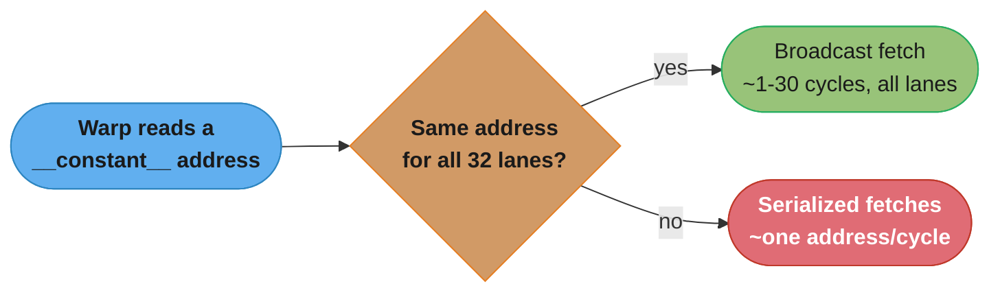
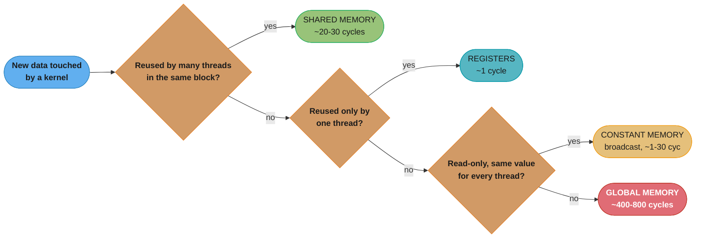
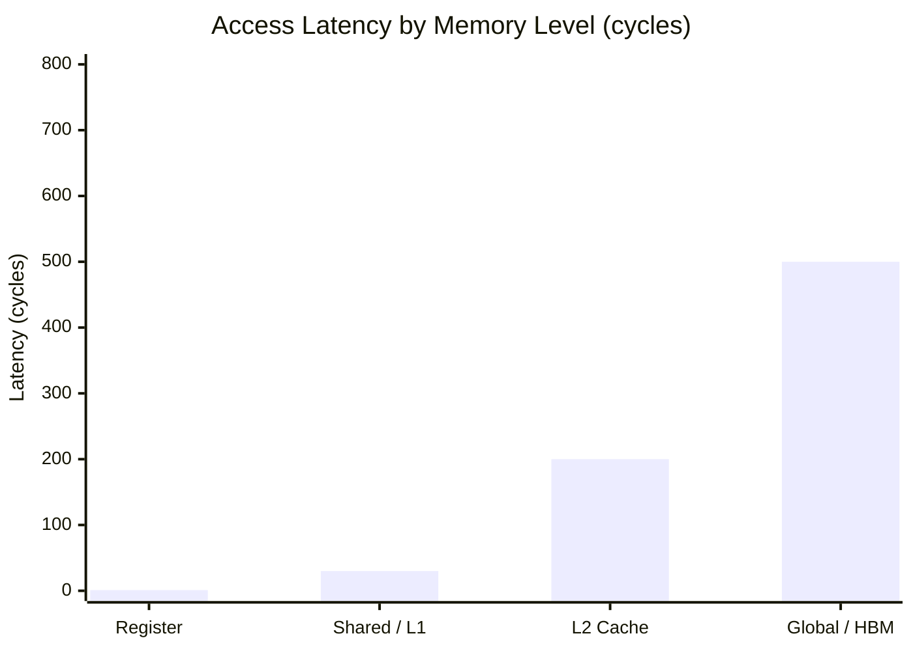
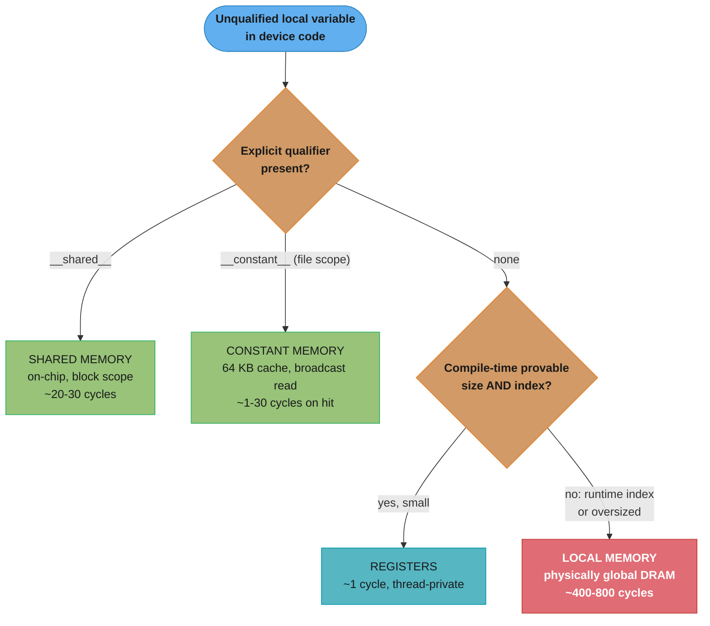
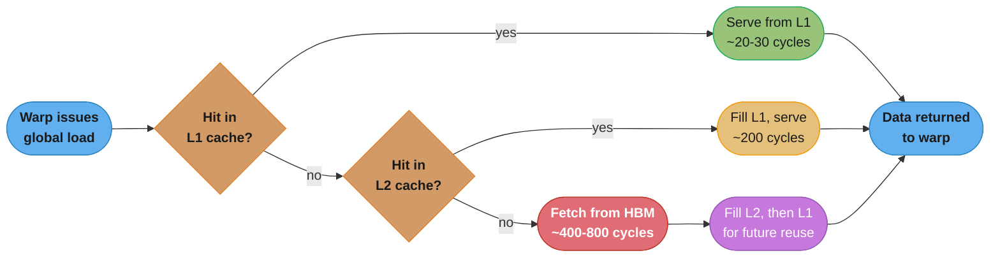

# CUDA Memory Model & Hierarchy

## 1. Concept Overview

Every CUDA kernel is, underneath the arithmetic, a program that moves bytes between six distinct **memory spaces** — register, local, shared, global, constant, and texture — each with its own scope, lifetime, latency, and bandwidth. A GPU does not have one uniform "RAM"; it has a steep hierarchy where the fastest storage (registers) sits physically inside the streaming multiprocessor (SM) next to the ALUs, and the slowest (global memory / HBM) sits off-chip, shared by every SM on the device. The single biggest determinant of a kernel's performance is not its arithmetic — it is *which level of this hierarchy each memory access lands on*.

This module builds the mental map: what each space is for, who can see it (thread / block / device), how long it lives, how many cycles a request costs, and the compiler/hardware machinery (Unified Virtual Addressing, the `__restrict__` qualifier, the L1/L2/constant/texture caches) that determines which space a given variable actually ends up in. It is the prerequisite for every performance-engineering module that follows: you cannot reason about coalescing (`../memory_coalescing_and_access_patterns/`) or bank conflicts (`../shared_memory_and_bank_conflicts/`) without first knowing what global memory and shared memory *are*, and you cannot reason about host/device transfer (`../memory_management_and_data_transfer/`) without knowing where the destination memory lives once it arrives.

---

## 2. Intuition

> **One-line analogy**: Registers are the tools already in your hands, shared memory is the workbench in your own room, global memory is the warehouse across town — the fastest way to build anything fast is to keep as much as possible on the workbench and make as few warehouse trips as you can.

**Mental model**: Picture a single SM as a small workshop with a few hundred workers (threads). Each worker has a personal toolbox (registers) they can reach in ~1 cycle — instant, but tiny and strictly private. The workshop has one shared workbench (shared memory / L1) that every worker in that room can reach in ~20-30 cycles — bigger, still on-site, but now it's a shared resource with layout rules (see the bank-conflict module). Beyond the workshop is a company-wide supply room (L2 cache) at ~200 cycles, and beyond that a warehouse across town (global memory / HBM) at ~400-800 cycles that every workshop in the company shares. Two side channels — a small reference shelf everyone can read simultaneously (constant cache, 64 KB, broadcast-optimized) and a spatially-smart lookup catalog (texture cache) — exist purely for read-only data with special access patterns. The entire discipline of CUDA memory optimization is deciding, for every byte your kernel touches, the cheapest room it can live in and the fewest trips it needs to that room.

**Why it matters**: A kernel that computes the exact same arithmetic can run 10-50x faster or slower purely based on which memory space its data occupies and how threads access it. A naive matrix-multiply kernel that re-reads operands from global memory for every output element is memory-bound and bottlenecked at ~400-800 cycles per access; the same kernel staging tiles through shared memory turns most of those trips into ~20-30 cycle accesses instead — this single change is the entire reason tiled GEMM exists (see `../shared_memory_and_bank_conflicts/` and the case study in §14). Interviewers probe this because it separates engineers who can *write* a kernel from engineers who can *make it fast*.

**Key insight**: The memory hierarchy is not a suggestion — it is largely dictated by where a variable is *declared* and how it is *accessed*, and the compiler makes the final placement decision. Declaring a per-thread array with a size the compiler can prove is a small constant keeps it in registers; declaring one too large, or one indexed by a runtime value, silently spills it to **local memory** — which, despite the name, is not a fast per-thread space at all, but a private region carved out of the same off-chip global DRAM, incurring the same ~400-800 cycle latency. "Local" describes *scope* (private to the thread), not *speed*. This scope/speed mismatch is the single most common trap in this module.

---

## 3. Core Principles

- **Scope, lifetime, and physical location are three separate axes.** A variable's scope (thread/block/device) tells you *who can see it*; its lifetime tells you *how long it exists*; its physical placement (register file / on-chip SRAM / off-chip DRAM) tells you *how fast it is*. Global and local memory share the same physical DRAM but have opposite scope — this is the trap the module keeps returning to.
- **Latency grows by roughly an order of magnitude at each level.** Register (~1 cycle) -> shared/L1 (~20-30 cycles) -> L2 (~200 cycles) -> global/HBM (~400-800 cycles). Each level down is roughly 10-20x slower than the level above it, which is why an algorithm's job is to push reuse as far up the hierarchy as possible.
- **The register file and shared memory are finite, on-chip, and shared across all resident threads/blocks on an SM.** 64K 32-bit registers (256 KB) and up to 48-228 KB of configurable shared memory/L1 per SM (generation-dependent) must be divided among every thread and block scheduled on that SM simultaneously — over-using either caps occupancy (see `../occupancy_and_launch_configuration/`).
- **Global memory is the only space with real capacity (GBs) but the worst latency.** It backs the vast majority of an application's data and is only fast in aggregate when accessed in a *coalesced* pattern (`../memory_coalescing_and_access_patterns/`) — 32 threads touching one contiguous 128-byte-aligned region service in a single transaction; scattered access issues many.
- **Constant and texture memory trade generality for a specialized fast path.** Both are read-only from the kernel's perspective, both are backed by dedicated on-chip caches (64 KB working set for constant), and both are only fast when their specific access pattern is honored — uniform broadcast for constant, 2D spatial locality for texture.
- **Unified Virtual Addressing (UVA) gives every space a single address space, not a single speed.** Since CUDA 4.0, host and device pointers (and, within the device, global/shared/local) live in one virtual address range, so a generic pointer can be dereferenced correctly regardless of which space it targets — the driver resolves it at the ISA level. UVA is a *programming convenience* (you can pass one pointer type everywhere, `cudaMemcpyDefault` infers direction); it does **not** unify latency or bandwidth, and it must not be confused with Unified *Memory* (`cudaMallocManaged`), which is a separate migrating-page abstraction covered in `../memory_management_and_data_transfer/`.
- **`const` and `__restrict__` are promises to the compiler, not the hardware.** They do not change which memory space a pointer targets; they let `nvcc` prove the absence of aliasing so it can keep values in registers across iterations, route reads through the read-only/constant cache path, and reorder loads/stores instead of conservatively re-reading from global memory every time.

---

## 4. Types / Architectures / Strategies

CUDA exposes exactly **six memory spaces** to a kernel. Each is reachable from device code with a different qualifier (or none, for the default/register case), and each has a distinct scope and lifetime.

### 4.1 Register

The fastest space that exists: local scalar variables and small, compile-time-indexed arrays that the compiler can prove fit. Private per thread, disappears when the thread exits. No qualifier needed — this is the default target for any local variable that isn't forced elsewhere.

### 4.2 Local Memory

A per-thread private space for anything that does not fit in registers: arrays indexed with a runtime value, arrays above the register budget, or structs the compiler chooses to spill. Despite the name, **local memory is physically part of the same off-chip global DRAM** (cached through L1/L2 like global accesses), so it carries global-memory latency. This is a private *address range* per thread, not a private *fast* space.

### 4.3 Shared Memory

Declared with `__shared__`, an on-chip SRAM scratchpad visible to every thread in the same block, allocated per-block, and released when the block retires. It is the primary tool for turning repeated global-memory reads into a single cached fetch (tiling) — full depth including bank structure lives in `../shared_memory_and_bank_conflicts/`.

### 4.4 Global Memory

The main device DRAM (HBM on data-center GPUs), allocated on the host with `cudaMalloc` and referenced with no special qualifier (a plain pointer). Visible to every thread across every block, and persists for the lifetime of the allocation (until explicitly freed) — the only space whose lifetime outlives a single kernel launch by default. Transfer mechanics (pinned memory, async copies, Unified Memory) live in `../memory_management_and_data_transfer/`; access-pattern performance lives in `../memory_coalescing_and_access_patterns/`.

### 4.5 Constant Memory

Declared with `__constant__` at file scope, a 64 KB read-only region backed by a dedicated per-SM constant cache. Its fast path is a **broadcast**: when every thread in a warp reads the *same* address, the cache serves all 32 lanes in one cycle-equivalent access. Divergent addresses within a warp serialize, degrading toward global-memory latency — constant memory is a specialized tool for kernel-wide parameters (transformation matrices, filter coefficients), not general read-only data.



The whole value proposition of constant memory lives in that one branch: a uniform
read across the warp is nearly free, but a divergent one loses the fast path entirely
and degrades toward global-memory latency.

### 4.6 Texture Memory

Accessed via texture objects/references, a read-only cache path tuned for 2D/3D spatial locality (image/stencil workloads) with built-in hardware interpolation, address-clamping, and normalized coordinates. Its cache is optimized for accesses that are near each other in 2D space rather than linear address order — a transposed or diagonal-scan access pattern that would thrash the L1/L2 cache for a plain global read can still hit well in texture cache.

### 4.7 The Read-Only Data Cache Path (`__restrict__` + `const`)

Since Kepler, the compiler can route reads of `const __restrict__` global pointers through the same read-only data cache that backs texture fetches, without requiring an explicit texture object — the modern, idiomatic way to get texture-cache-like reuse for plain array reads. This is covered in detail in §6.4.

### 4.8 Choosing a Space for a New Variable

Every one of the six spaces above is a deliberate choice, not just a compiler
fallback — the question a kernel author asks for each new piece of data is "who
reuses this, and how":



This is the decision the earlier compiler-placement diagram in §5 only handles the
last, no-qualifier branch of — this diagram is the programmer's side of the choice
(which qualifier to write), the §5 diagram is the compiler's side (register vs.
local for what's left unqualified).

---

## 5. Architecture Diagrams

### The Memory-Hierarchy Latency Pyramid (centerpiece)

```
                         CUDA MEMORY HIERARCHY -- LATENCY / BANDWIDTH PYRAMID
                    (narrower box = faster & smaller; every level below is shared
                     by more threads and holds more data)

                                +-----------------------+
                                |      REGISTERS        |   ~1 cycle
                                |  64K x 32-bit / SM     |   scope: thread
                                |  (256 KB), on-SM       |   lifetime: thread (dies at exit)
                                +-----------------------+
                              +---------------------------+
                              | SHARED MEMORY / L1 CACHE  |  ~20-30 cycles
                              | 48-228 KB/SM (config,     |  scope: block
                              | split w/ L1), on-chip SRAM|  lifetime: block (dies at retire)
                              +---------------------------+
                            +-------------------------------+
                            |   L2 CACHE (device-wide)      |  ~200 cycles
                            |   MB-scale, shared by all SMs  |  scope: device
                            |   backs global/local/const miss|  lifetime: kernel grid (transient)
                            +-------------------------------+
                          +-----------------------------------+
                          | GLOBAL MEMORY / HBM (off-chip DRAM)|  ~400-800 cycles
                          | GB-scale, one pool, whole device    |  scope: device (or pinned host)
                          | LOCAL memory lives here too (per-    |  lifetime: application
                          | thread range, same off-chip latency) |  (until cudaFree)
                          +-----------------------------------+

           side channels, read-only, ride beside the L1/L2 path -- not on the main ladder:

           +----------------------+          +----------------------------+
           |  CONSTANT CACHE      |          |   TEXTURE / READ-ONLY CACHE |
           |  64 KB working set   |          |   2D-spatial-locality tuned |
           |  fast ONLY when every|          |   fast for image/stencil    |
           |  lane reads the SAME |          |   access; also serves       |
           |  address (broadcast) |          |   const __restrict__ reads  |
           +----------------------+          +----------------------------+

   Bandwidth widens going down the ladder even as per-access latency grows: registers
   deliver the highest *aggregate* bandwidth per SM (every ALU reads its own operand
   every cycle), shared memory sustains ~19 TB/s per SM (32 banks in parallel), L2
   sustains multi-TB/s device-wide, and HBM3 delivers ~3 TB/s (H100) -- enormous in
   absolute terms, but that ~3 TB/s is divided across every SM issuing requests at once.
```

The pyramid captures the rule that drives every optimization in Phase 3: an access one level up is roughly 10-20x cheaper than the level below it, so the entire performance-engineering discipline is "promote reused data as far up this ladder as the algorithm allows, and make every trip down the ladder as wide (coalesced) as possible."

### Latency by Memory Level



The same order-of-magnitude jump the pyramid shows visually is here as bars: roughly
1 -> 30 -> 200 -> 500 cycles, each step 10-20x its neighbor, which is why promoting
reused data even one level up the ladder is almost always worth the engineering effort.

### The Six Memory Spaces at a Glance

| Space | Declared with | Scope | Lifetime | Cached? | Typical use |
|-------|---------------|-------|----------|---------|-------------|
| Register | (default, scalar/small array) | Thread | Thread (kernel invocation) | N/A (fastest storage tier) | Loop counters, accumulators, small fixed-size working set |
| Local | (spilled by compiler; runtime-indexed arrays) | Thread | Thread (kernel invocation) | Yes — via L1/L2 like global | Overflow from registers; large per-thread arrays; struct spills |
| Shared | `__shared__` | Block | Block (kernel invocation) | On-chip SRAM itself (no further cache) | Tiling, inter-thread communication within a block, reduction scratch |
| Global | (plain pointer, `cudaMalloc`) | Device (+ host) | Application (until `cudaFree`) | Yes — L1 + L2 | Primary input/output arrays, the bulk of a kernel's data |
| Constant | `__constant__` | Device (read-only in kernel) | Application (until reset) | Yes — dedicated 64 KB constant cache | Kernel-wide parameters, filter coefficients, lookup tables read by every thread identically |
| Texture | Texture object/reference | Device (read-only in kernel) | Application (bound to underlying allocation) | Yes — dedicated 2D-locality texture cache | Image processing, stencils, interpolation, spatially-local read patterns |

### Scope Nesting (thread -> block -> device)

```
   DEVICE  (global, constant, texture -- visible to every block, every SM)
     |
     +-- BLOCK 0  (shared memory -- visible to every thread in this block only)
     |     +-- THREAD 0  (registers, local memory -- visible to this thread only)
     |     +-- THREAD 1  (registers, local memory -- private copy per thread)
     |     +-- ...
     |
     +-- BLOCK 1  (its OWN shared memory -- cannot see block 0's shared memory)
           +-- THREAD 0  (its OWN registers -- cannot see block 0's registers)
           +-- ...

   Going down this tree, visibility narrows; going up, latency grows. A shared-memory
   tile in block 0 is invisible to block 1 -- inter-block communication must go through
   global memory (or a grid-wide primitive -- see cooperative groups in
   ../warp_level_primitives_and_cooperative_groups/).
```

### Where Does a Variable Actually End Up? (compiler placement decision)

A kernel author writes `__shared__`, `__constant__`, or a plain declaration — but for
anything *not* explicitly qualified, the compiler decides between registers and local
memory based on size and indexing. This is the routing decision every unqualified
local variable goes through:



The one branch every kernel author must watch is the right-hand path: a variable that
looks "local" in the source can still be routed to the ~400-800 cycle tier if the
compiler cannot prove it fits in registers — this is exactly the BROKEN case in §10.

---

## 6. How It Works — Detailed Mechanics

### 6.1 Declaring Each Space (CUDA C++)

```cpp
// --- REGISTER: default target for scalars and small, compiler-provable arrays ---
__global__ void register_example(float* out, int n) {
    int idx = blockIdx.x * blockDim.x + threadIdx.x;   // lives in a register
    float acc = 0.0f;                                   // lives in a register
    float small_tile[4];                                 // compile-time size 4, index by
                                                          // constants/unrolled loop -> registers
#pragma unroll
    for (int i = 0; i < 4; ++i) small_tile[i] = i * 1.0f;
    for (int i = 0; i < 4; ++i) acc += small_tile[i];
    if (idx < n) out[idx] = acc;
}

// --- LOCAL: forced by a runtime-indexed or oversized per-thread array ---
__global__ void local_spill_example(float* out, int n, int runtime_k) {
    float big[256];                       // 256 floats/thread far exceeds the register
                                           // budget once divided across resident threads
    for (int i = 0; i < 256; ++i) big[i] = i;
    int idx = blockIdx.x * blockDim.x + threadIdx.x;
    if (idx < n) out[idx] = big[runtime_k % 256];   // runtime index -> compiler cannot keep
                                                     // this in registers -> spills to LOCAL
                                                     // memory (physically global DRAM)
}

// --- SHARED: on-chip scratchpad visible to the whole block ---
__global__ void shared_example(const float* in, float* out, int n) {
    __shared__ float tile[256];
    int tid = threadIdx.x;
    int idx = blockIdx.x * blockDim.x + tid;
    if (idx < n) tile[tid] = in[idx];      // stage into on-chip SRAM
    __syncthreads();                        // all threads in the block must finish writing
    if (idx < n) out[idx] = tile[255 - tid]; // then every thread can safely read any slot
}

// --- GLOBAL: the default plain pointer, backing GB-scale allocations ---
__global__ void global_example(const float* a, const float* b, float* c, int n) {
    int idx = blockIdx.x * blockDim.x + threadIdx.x;
    if (idx < n) c[idx] = a[idx] + b[idx];   // every read/write here is a global access
}

// --- CONSTANT: file-scope, read-only, broadcast-optimized ---
__constant__ float d_filter[16];   // set once from host via cudaMemcpyToSymbol

__global__ void constant_example(const float* in, float* out, int n) {
    int idx = blockIdx.x * blockDim.x + threadIdx.x;
    float acc = 0.0f;
#pragma unroll
    for (int k = 0; k < 16; ++k) acc += in[idx + k] * d_filter[k]; // every thread reads the
                                                                     // SAME d_filter[k] ->
                                                                     // single broadcast fetch
    if (idx < n) out[idx] = acc;
}

// --- TEXTURE: 2D-spatial-locality read path via a texture object ---
__global__ void texture_example(cudaTextureObject_t tex, float* out, int w, int h) {
    int x = blockIdx.x * blockDim.x + threadIdx.x;
    int y = blockIdx.y * blockDim.y + threadIdx.y;
    if (x < w && y < h)
        out[y * w + x] = tex2D<float>(tex, x + 0.5f, y + 0.5f);  // hardware-cached 2D fetch
}
```

### 6.2 Host-Side Setup for Constant Memory, Global Memory, and a Texture Object

```cpp
// CONSTANT: one-time upload, not passed as a kernel argument
float h_filter[16] = { /* ... coefficients ... */ };
cudaMemcpyToSymbol(d_filter, h_filter, sizeof(h_filter));

// GLOBAL: the ordinary allocate-copy-launch-copy-back sequence every kernel above relies on
float *d_a, *d_b, *d_c;
size_t bytes = n * sizeof(float);
cudaMalloc(&d_a, bytes);
cudaMalloc(&d_b, bytes);
cudaMalloc(&d_c, bytes);
cudaMemcpy(d_a, h_a, bytes, cudaMemcpyDefault);   // UVA lets the driver infer direction
cudaMemcpy(d_b, h_b, bytes, cudaMemcpyDefault);
global_example<<<blocks, threads>>>(d_a, d_b, d_c, n);
cudaMemcpy(h_c, d_c, bytes, cudaMemcpyDefault);
cudaFree(d_a); cudaFree(d_b); cudaFree(d_c);
// full pinned/async/Unified Memory treatment: ../memory_management_and_data_transfer/

// TEXTURE: binding a cudaArray to a texture object (modern API, since CUDA 5.0)
cudaChannelFormatDesc desc = cudaCreateChannelDesc<float>();
cudaArray_t cuArray;
cudaMallocArray(&cuArray, &desc, width, height);
cudaMemcpy2DToArray(cuArray, 0, 0, h_image, width * sizeof(float),
                     width * sizeof(float), height, cudaMemcpyDefault);

cudaResourceDesc resDesc = {};
resDesc.resType = cudaResourceTypeArray;
resDesc.res.array.array = cuArray;

cudaTextureDesc texDesc = {};
texDesc.addressMode[0] = cudaAddressModeClamp;   // clamp at boundaries -- hardware feature
texDesc.addressMode[1] = cudaAddressModeClamp;
texDesc.filterMode = cudaFilterModeLinear;         // hardware bilinear interpolation
texDesc.readMode = cudaReadModeElementType;
texDesc.normalizedCoords = false;

cudaTextureObject_t tex = 0;
cudaCreateTextureObject(&tex, &resDesc, &texDesc, nullptr);   // pass `tex` into the kernel
```

The texture setup is verbose compared to a plain global pointer precisely because it is
buying hardware features (clamping, interpolation) a linear array does not have — for a
kernel that only needs read-only caching without those features, `const __restrict__`
(§6.4) is the lighter-weight tool.

### 6.3 The Same Six Spaces from Python (Numba CUDA and CuPy)

```python
from numba import cuda
import numpy as np

# GLOBAL memory: any array passed in from cuda.to_device() / cudaMalloc-equivalent
@cuda.jit
def global_example(a, b, c):
    idx = cuda.grid(1)
    if idx < c.size:
        c[idx] = a[idx] + b[idx]                 # plain array indexing -> global access

# SHARED memory: cuda.shared.array with a compile-time shape
@cuda.jit
def shared_example(inp, out):
    tile = cuda.shared.array(shape=256, dtype=np.float32)   # on-chip, block-scoped
    tid = cuda.threadIdx.x
    idx = cuda.grid(1)
    if idx < inp.size:
        tile[tid] = inp[idx]
    cuda.syncthreads()
    if idx < out.size:
        out[idx] = tile[255 - tid]

# CONSTANT memory: cuda.const.array_like, uploaded once at compile/launch time
d_filter = np.arange(16, dtype=np.float32)

@cuda.jit
def constant_example(inp, out):
    filt = cuda.const.array_like(d_filter)        # read-only, broadcast-optimized
    idx = cuda.grid(1)
    acc = 0.0
    for k in range(16):
        acc += inp[idx + k] * filt[k]
    if idx < out.size:
        out[idx] = acc

# REGISTER / LOCAL distinction is compiler-driven here too: a small fixed-size local
# tuple/array stays in registers; a large or dynamically-indexed one spills to local
# memory exactly as in CUDA C++ -- Numba lowers to the same PTX memory-space rules.
```

CuPy operates one level higher — it manages global-memory allocation for you (every
`cupy.ndarray` is a device-global allocation) and exposes a `RawKernel` escape hatch when
you need the same `__shared__`/`__constant__` control as CUDA C++:

```python
import cupy as cp

# GLOBAL memory is implicit: every cupy.ndarray already lives in device global memory
a = cp.arange(1 << 20, dtype=cp.float32)
b = cp.arange(1 << 20, dtype=cp.float32)
c = a + b                                    # dispatches a fused elementwise kernel;
                                              # a, b, c all resident in global memory

# SHARED memory still requires a RawKernel -- CuPy's high-level array API has no
# per-block scratchpad abstraction of its own
tiled_sum = cp.RawKernel(r'''
extern "C" __global__ void tiled_sum(const float* in, float* out, int n) {
    __shared__ float tile[256];
    int tid = threadIdx.x;
    int idx = blockIdx.x * blockDim.x + tid;
    if (idx < n) tile[tid] = in[idx];
    __syncthreads();
    if (idx < n) out[idx] = tile[255 - tid];
}
''', 'tiled_sum')
tiled_sum((a.size // 256,), (256,), (a, c, a.size))
```

### 6.4 Volatile, Cache-Line Granularity, and the L1/L2 Path

Global-memory transactions move in fixed-size chunks, not individual bytes: an L1 cache
line is 128 bytes and an L2 sector is 32 bytes, which is exactly why a coalesced warp
access (32 threads x 4 bytes = 128 bytes) maps perfectly onto one L1 line — the full
mechanics of exploiting this are in `../memory_coalescing_and_access_patterns/`.



The read path only pays the full ~400-800 cycle HBM trip on the first miss; the fill
step means the *same* address served through L1/L2 on a later access can land close
to the top of the pyramid instead — the entire coalescing discipline exists to make
that first, expensive trip as wide (128 bytes) and as rare as possible. Two
qualifiers change how a load/store interacts with this caching:

```cpp
// volatile: forces every read/write to bypass the register-allocator's reuse and go
// to memory each time -- used when another thread (or the host) may modify the value
// out from under the compiler's normal single-thread reasoning (e.g. spin-waiting on
// a flag another block will set)
__device__ volatile int g_flag = 0;

__global__ void spin_wait_example() {
    while (g_flag == 0) { /* busy-wait; volatile forces a fresh global read every iteration */ }
}

// Bypassing the L1 cache entirely for a specific load ("streaming" hint), useful when
// data is read exactly once and caching it would only evict data that will be reused
__device__ __forceinline__ float load_nc(const float* ptr) {
    return __ldcs(ptr);   // "cache streaming" load -- hints the L1 not to keep this line
}
```

`volatile` and the `__ldcs`/`__ldg` family of load intrinsics are correctness and
performance escape hatches for the rare case where the compiler's default caching
assumptions (safe for single-thread reasoning) are wrong for a specific cross-thread or
streaming access pattern — most kernels never need them.

### 6.5 `__restrict__`, `const`, and the Read-Only Cache Path

Without `__restrict__`, the compiler must assume any two pointer arguments could alias (point into overlapping memory), so it conservatively reloads from global memory after every store that *might* have touched the same address:

```cpp
// BROKEN (conservative): compiler cannot prove a, b, out don't overlap
__global__ void stencil_no_restrict(const float* a, const float* b, float* out, int n) {
    int i = blockIdx.x * blockDim.x + threadIdx.x;
    if (i > 0 && i < n - 1) {
        // the compiler may re-read a[i-1], a[i], a[i+1] from global memory on every
        // use, and cannot route the reads through the read-only/texture cache path,
        // because it cannot rule out that `out` aliases `a` or `b`
        out[i] = a[i - 1] + a[i] + a[i + 1] + b[i];
    }
}

// FIX: const __restrict__ promises no aliasing -> compiler keeps a[i-1..i+1] in
// registers across the three uses and routes the reads through the read-only cache
__global__ void stencil_restrict(const float* __restrict__ a,
                                  const float* __restrict__ b,
                                  float* __restrict__ out, int n) {
    int i = blockIdx.x * blockDim.x + threadIdx.x;
    if (i > 0 && i < n - 1) {
        float left = a[i - 1], center = a[i], right = a[i + 1];   // one register load each
        out[i] = left + center + right + b[i];
    }
}
```

`__restrict__` is a promise, not an instruction — if the pointers actually do alias and you mark them `__restrict__`, the result is undefined behavior, not a compiler error. `const __restrict__` on a global pointer additionally makes it eligible for the **LDG (load global, read-only)** instruction path, which routes through the same cache used by texture fetches — free reuse for read-heavy access patterns without a texture object.

### 6.6 Unified Virtual Addressing (UVA)

Since CUDA 4.0 (all GPUs used in this section support it), host memory and every device's memory share one virtual address range. Practical consequences for the kernel author:

- `cudaMemcpy(..., cudaMemcpyDefault)` — the driver inspects the pointer values themselves to infer host-to-device / device-to-host / device-to-device / peer-to-peer direction; you no longer must specify `cudaMemcpyHostToDevice` etc.
- A single generic pointer type can be passed to a function and correctly dereferenced whether it targets global, shared (via a `__shared__`-declared array decaying to a pointer), or local memory — the ISA-level load/store instruction resolves the actual space.
- UVA is the addressing prerequisite that peer-to-peer (P2P) direct GPU-to-GPU access and Unified Memory (`cudaMallocManaged`, covered fully in `../memory_management_and_data_transfer/`) are both built on top of.
- UVA unifies the *address space*, not the *hardware*: a UVA-resolved global-memory access is still ~400-800 cycles; UVA never makes global memory fast, it only makes the pointer arithmetic uniform.

---

## 7. Real-World Examples

- **Tiled matrix multiplication** (see the case study in §14 and `../shared_memory_and_bank_conflicts/`) — the textbook demonstration of promoting data from global (400-800 cycles) to shared memory (20-30 cycles), turning an O(n) global read per output element into O(n/TILE) global reads.
- **cuDNN convolution kernels** — filter weights (small, read by every thread identically) are staged through constant memory; input feature maps (large, spatially local) route through the texture/read-only cache path or explicit shared-memory tiling depending on kernel variant.
- **FlashAttention** — keeps the entire working set of Q/K/V tiles resident in shared memory for the duration of a block's computation specifically to avoid materializing the full attention matrix in global memory; the whole algorithm is a shared-memory-residency argument (cross-reference: `../../llm/optimization_and_quantization/`).
- **Ray-tracing / volume-rendering kernels** — texture memory's 2D/3D spatial-locality cache and built-in interpolation are a direct hardware match for texel lookups along a ray, which is exactly what texture memory was originally designed for.
- **cuBLAS/CUTLASS GEMM kernels** — register-blocking (each thread accumulates a small output micro-tile entirely in registers) combined with shared-memory tiling is the two-level promotion strategy that gets a hand-tuned GEMM within a few percent of the compute roof.
- **Thrust and cuSPARSE reduction/scan primitives** — implemented internally with the exact register-accumulate + shared-memory-reduce + warp-shuffle ladder covered in `../parallel_patterns_reduction_scan_histogram/`; library authors apply the same memory-promotion discipline this module teaches, just already tuned and shipped.
- **Image-processing pipelines (JPEG decode, denoising, demosaicing)** — historically the canonical texture-memory use case: a 2D convolution kernel with a small filter radius reads a neighborhood of pixels that texture memory's spatially-tuned cache serves far better than a plain linear global read of the same footprint.
- **N-body / molecular dynamics simulations** — per-particle interaction sums are classic register accumulators (one running `float3` force vector per thread held entirely in registers across the inner loop), while neighboring particles' positions are staged through shared memory tiles to avoid re-reading them from global memory once per interacting pair.

---

## 8. Tradeoffs

| Space | Latency | Capacity/SM (or device) | Read/Write | Best for | Worst for |
|-------|---------|---------------------------|------------|----------|-----------|
| Register | ~1 cycle | 64K x 32-bit (256 KB) shared across resident threads | R/W | Hot scalars, loop-carried accumulators | Anything runtime-indexed or too large — silently spills |
| Local | ~400-800 cycles (global latency) | Bounded only by global memory capacity | R/W | Unavoidable per-thread overflow | Anything you *thought* was fast because it's "local" |
| Shared | ~20-30 cycles | Up to 48-228 KB (config, split with L1; generation-dependent) | R/W | Block-wide reuse, tiling, reductions | Data needed across blocks; oversized use caps occupancy |
| Global | ~400-800 cycles (L1/L2 can shave this on reuse) | GBs (device DRAM) | R/W | Bulk application data | Repeated re-reads without caching/tiling |
| Constant | ~1-30 cycles on broadcast hit, else serializes | 64 KB working set | Read-only in kernel | Uniform parameters read identically by every thread | Data that varies per-thread (divergent reads serialize) |
| Texture | Cache-hit latency near shared/L1 for spatially local reads | Backed by device memory, cache is a few KB-MB | Read-only in kernel (classic API) | 2D/3D spatially local reads, interpolation | Linear/sequential access with no spatial locality (no benefit over a coalesced global read) |

```mermaid
quadrantChart
    title Capacity vs speed across the six memory spaces
    x-axis Small capacity --> Large capacity
    y-axis Slow --> Fast
    quadrant-1 Ideal (none reach here)
    quadrant-2 Fast but tiny
    quadrant-3 Slow and tiny
    quadrant-4 Large but slow
    Register: [0.05, 0.95]
    Shared: [0.15, 0.75]
    Constant: [0.10, 0.55]
    Texture: [0.30, 0.50]
    L2 Cache: [0.40, 0.35]
    Global HBM: [0.90, 0.15]
```

No space sits in the ideal top-right corner — the table above is a list of tradeoffs
precisely because capacity and speed pull in opposite directions on every real GPU,
which is why the performance-engineering discipline is about *moving data* between
spaces rather than finding one space that is both fast and roomy.

---

## 9. When to Use / When NOT to Use

**Use shared memory when:**
- Multiple threads in the same block re-read the same global-memory data (tiling matrix multiply, convolution, stencils, reductions).
- You need fast, low-latency inter-thread communication scoped to a block.

**Avoid over-using shared memory when:**
- Your per-block shared-memory footprint is large enough to reduce the number of blocks resident per SM below what's needed to hide memory latency — check the occupancy calculator (`../occupancy_and_launch_configuration/`) before committing to a tile size.

**Use constant memory when:**
- A small (<=64 KB), read-only value set is read by *every thread identically* in the same instruction (filter coefficients, transform matrices, a lookup table indexed by a block-wide constant).

**Avoid constant memory when:**
- Different threads in a warp need different addresses from the set on the same instruction — divergent constant reads serialize and lose the entire benefit; a `const __restrict__` global array is usually the better fit for per-thread-varying read-only data.

**Use texture memory (or `cudaTextureObject_t`) when:**
- The access pattern has 2D/3D spatial locality that a linear-order coalesced read cannot capture (image processing, stencils, ray tracing), or when you want free bilinear interpolation / boundary-clamping.

**Avoid texture memory when:**
- The access is already a simple coalesced linear scan — a plain `const __restrict__` global pointer routes through the equivalent read-only cache with less API overhead and no texture-object setup.

**Let a variable stay in registers/be spilled to local memory when:**
- Use registers by keeping per-thread working sets small and index them with compile-time-provable constants (unrolled loops, fixed small arrays).
- If a per-thread working set is inherently large, prefer restructuring the algorithm to use shared memory (block-shared, not per-thread-private) over accepting a local-memory spill — see the BROKEN->FIX in §10.
- Accept a local-memory spill only when the spilled data is genuinely per-thread, accessed rarely relative to the kernel's other work, and restructuring into shared memory would introduce cross-thread synchronization overhead that costs more than the spill itself — this is a real, if uncommon, tradeoff, not just a failure mode.

**Use `__restrict__` when:**
- Two or more pointer parameters to a kernel are provably non-overlapping (the overwhelmingly common case for separate input/output buffers) — default to it unless you have a specific reason two pointers might alias.

**Avoid `__restrict__` when:**
- A function genuinely receives pointers that may alias (e.g. an in-place transform where the output pointer equals an input pointer) — applying `__restrict__` there produces silent, hard-to-diagnose numerical corruption rather than a compiler error.

---

## 10. Common Pitfalls

**BROKEN — a "local" array that silently spills to (slow, global-latency) local memory:**

```cpp
// A per-thread histogram of 256 bins looks like a natural local array...
__global__ void per_thread_histogram_broken(const int* data, int* out, int n) {
    int idx = blockIdx.x * blockDim.x + threadIdx.x;
    int hist[256] = {0};                 // 256 ints x 4 bytes = 1 KB PER THREAD
    for (int i = idx; i < n; i += blockDim.x * gridDim.x) {
        hist[data[i] & 0xFF]++;           // runtime-indexed -> cannot live in registers
    }
    for (int b = 0; b < 256; ++b) out[idx * 256 + b] = hist[b];   // every read/write of
                                                                    // hist[] pays LOCAL
                                                                    // memory (~global DRAM)
                                                                    // latency, per thread
}
```

At 256 threads/block this is 256 KB of *local* memory traffic per block for every histogram update — indistinguishable in cost from an uncoalesced global-memory access pattern, because it physically is one. "Local" only means "private scope," not "fast."

**FIX — move the shared working set into actual shared memory and shrink the per-thread footprint:**

```cpp
// Block-shared histogram: ONE 256-bin array per block (on-chip, ~20-30 cycles),
// atomics resolve the many-threads-one-bin contention within the fast on-chip path
__global__ void per_thread_histogram_fixed(const int* data, int* out, int n) {
    __shared__ int s_hist[256];              // 1 KB total for the WHOLE BLOCK, on-chip
    int tid = threadIdx.x;
    for (int b = tid; b < 256; b += blockDim.x) s_hist[b] = 0;
    __syncthreads();

    int idx = blockIdx.x * blockDim.x + tid;
    for (int i = idx; i < n; i += blockDim.x * gridDim.x)
        atomicAdd(&s_hist[data[i] & 0xFF], 1);   // on-chip atomic, not a global round trip
    __syncthreads();

    for (int b = tid; b < 256; b += blockDim.x)
        atomicAdd(&out[b], s_hist[b]);            // one global write per bin per BLOCK,
                                                    // not per thread
}
```

The fix trades 256 KB/block of local-memory traffic for 1 KB/block of shared memory plus a handful of global atomics — routinely a 10-50x reduction in memory traffic for histogram-shaped kernels (see the full reduction ladder in `../parallel_patterns_reduction_scan_histogram/`).

**Other frequent pitfalls:**

- **Assuming `__constant__` is a general-purpose fast read cache.** It is only fast on a uniform broadcast; per-thread-varying constant reads serialize and can be *slower* than a plain coalesced global read plus L1/L2 caching.
- **Forgetting `__syncthreads()` after staging into shared memory.** Without it, a fast thread can read a shared-memory slot before a slower thread in the same block has written it — a data race that is *not* caught by default builds; use `compute-sanitizer racecheck` (`../debugging_correctness_and_numerics/`).
- **Over-sizing a shared-memory tile "to be safe."** A tile that consumes most of the 48-228 KB/SM budget leaves room for only one resident block, killing the extra-block-level latency hiding that occupancy depends on.
- **Treating Unified Memory (`cudaMallocManaged`) as equivalent to Unified Virtual Addressing.** UVA is a static addressing scheme available on every allocation; Unified Memory is a page-migrating abstraction with real first-touch and page-fault costs — conflating them leads to surprising latency on first access. Full treatment in `../memory_management_and_data_transfer/`.
- **Passing overlapping pointers marked `__restrict__`.** This is undefined behavior, not a compile error — a silent correctness bug that only appears as wrong numerical output, not a crash.

---

## 11. Technologies & Tools

| Tool | What it reveals about the memory model |
|------|------------------------------------------|
| `nvcc --ptxas-options=-v` | Prints per-kernel register count and any local-memory (spill) usage at compile time — the fastest way to catch an accidental spill before profiling. |
| Nsight Compute | `Achieved Occupancy`, `L1/TEX Hit Rate`, `L2 Hit Rate`, and a per-instruction "Source Counters" view that flags local-memory (spill) traffic directly (full workflow: `../profiling_and_performance_analysis/`). |
| `cuda-memcheck` / `compute-sanitizer` | Catches out-of-bounds and misaligned accesses to any of the six spaces, and (`racecheck` tool) shared-memory data races from a missing `__syncthreads()`. |
| `cudaDeviceGetAttribute` (`cudaDevAttrMaxSharedMemoryPerMultiprocessor`, `...MaxRegistersPerMultiprocessor`) | Runtime-queryable capacity numbers so code can adapt tile sizes to the actual GPU rather than hard-coding one generation's limits. |
| `cudaFuncSetAttribute(..., cudaFuncAttributePreferredSharedMemoryCarveout, ...)` | Lets a kernel request a specific L1-vs-shared-memory split on architectures where the two are configurably partitioned out of the same on-chip SRAM budget. |
| Numba `cuda.jit(..., debug=True)` / `NUMBA_CUDA_DEBUGINFO` | Surfaces the same register/local-memory placement decisions from the Python side, for CuPy/Numba kernels. |
| `cuobjdump --dump-sass` | Disassembles the final SASS to confirm whether a load lowered to a fast register/shared-memory path (`LDS`), a read-only cache path (`LDG.CI`), or an uncached global load — the ground truth beneath any higher-level tool's interpretation. |

Between these, the workflow that catches the most bugs per minute spent is: compile
with `-v` first (free, instant, catches spills), disassemble with `cuobjdump` only when
the `-v` output is ambiguous about which instruction a load became, and reach for
Nsight Compute once the kernel already compiles cleanly but still underperforms the
roofline — see the full guided-analysis workflow in `../profiling_and_performance_analysis/`.

---

## 12. Interview Questions with Answers

**Why is "local memory" not actually fast, despite the name suggesting it's private and close to the thread?**
"Local" describes scope (private per-thread), not speed or physical location. Local memory is carved out of the same off-chip global DRAM as global memory, so a local-memory access pays the same ~400-800 cycle latency as an uncached global access — the name is a scope label, not a performance guarantee, and this mismatch is the single most common trap in this module.

**What causes a per-thread array to spill from registers into local memory?**
Two triggers: the array is indexed by a runtime value the compiler cannot resolve at compile time, or its total size exceeds the per-thread register budget. That budget is shared across all resident threads on the SM, so fix a spill by shrinking the per-thread footprint, unrolling with compile-time indices, or — for shared working sets — moving the data to actual `__shared__` memory instead.

**Walk through the memory-latency numbers from fastest to slowest.**
Registers are ~1 cycle, shared memory/L1 is ~20-30 cycles, the L2 cache is ~200 cycles, and global memory/HBM is ~400-800 cycles — each level is roughly an order of magnitude slower than the one above it. Local memory shares global memory's ~400-800 cycle latency because it is physically the same DRAM.

**What is the difference in scope and lifetime between shared and global memory?**
Shared memory is scoped to a single block and dies when that block retires, while global memory is scoped to the whole device and persists for the life of the allocation. This is why cross-block communication must go through global memory (or a grid-wide primitive), not shared memory — a shared-memory tile in one block simply does not exist for another block to read.

**What does `__restrict__` actually do, and can it cause a bug?**
It tells the compiler a pointer does not alias any other pointer parameter, letting it keep loaded values in registers across reuses and route eligible reads through the read-only cache. It is a promise, not an enforced contract — marking two pointers that actually do overlap as `__restrict__` produces silent undefined behavior (wrong numbers), not a compile error.

**Is Unified Virtual Addressing (UVA) the same thing as Unified Memory?**
No — UVA is a static addressing scheme (since CUDA 4.0) that puts host and device pointers into one virtual address range so a generic pointer resolves correctly. Unified Memory (`cudaMallocManaged`) is a different, page-migrating abstraction with real first-touch and page-fault costs; UVA never makes any access faster, it only unifies the pointer arithmetic, not the hardware backing it.

**How big is the register file per SM, and why does that number matter?**
64K 32-bit registers per SM (256 KB) is the number, and it matters because that budget is divided across every thread resident on the SM at once. A kernel using more registers per thread reduces how many threads (and warps) can be resident simultaneously, directly capping occupancy — the register side of the occupancy tradeoff covered fully in `../occupancy_and_launch_configuration/`.

**How much shared memory is available per SM, and is it a fixed, separate pool from L1?**
Up to 48-228 KB per SM depending on generation, and on most architectures it is not a separate pool from L1 but a configurable split of the same on-chip SRAM. `cudaFuncAttributePreferredSharedMemoryCarveout` lets a kernel request more of one or the other, but a large shared-memory carveout for one kernel reduces the L1 available to it and to co-resident kernels.

**Why is a constant-memory read only fast when every thread in the warp reads the same address?**
The constant cache's hardware fast path is a single broadcast fetch that serves all 32 warp lanes in one cycle-equivalent access, but only when every lane requests the same address. If lanes diverge to different addresses, the accesses serialize one at a time, degrading toward the latency of an uncached global read — which is why constant memory fits kernel-wide parameters, not per-thread-varying data.

**What is the practical difference between texture memory and a `const __restrict__` global pointer, given both are read-only caches?**
Texture memory's cache is tuned for 2D/3D spatial locality with hardware interpolation and boundary handling, which benefits image/stencil lookups that a linear scan cannot capture. `const __restrict__` gives the same general read-only caching benefit for ordinary linear access patterns without the API overhead of a texture object — reserve texture objects for when spatial-locality or interpolation features are actually needed.

**Why does over-sized shared-memory usage hurt performance even though shared memory itself is fast?**
Shared memory is a fixed per-SM budget (up to 48-228 KB) shared across every block resident on that SM at once. A kernel requesting a large tile per block can leave room for only one resident block, collapsing the extra-block-level parallelism the scheduler needs to hide remaining memory latency — fast-per-access does not mean free-in-aggregate.

**How does a global-memory pointer differ physically from a local-memory pointer, given both hit the same DRAM?**
They don't differ physically — both route through the same off-chip HBM and the same L1/L2 caching path. The difference is purely in scope: a global pointer's address range is visible to every thread across every block, while a local-memory range is private per thread — precisely why "local" is a scope word, not a speed word.

**Give an example of when reads from the same array should go through global memory versus shared memory in the same kernel.**
In a tiled matrix multiply, the initial load of an operand tile must come from global memory because that is where the full matrices live. Once the tile is staged into `__shared__` memory, every subsequent reuse by other threads in the block reads shared memory instead, turning N global reads per element into one global read shared across the whole tile.

**What is the cached-vs-uncached distinction between the six memory spaces?**
Registers are the fastest tier and are not "cached" in the traditional sense — they are the storage itself. Shared memory is on-chip SRAM with no further cache beneath it, global and local memory are backed by the L1/L2 hardware caches, constant memory has its own dedicated 64 KB cache, and texture memory has its own cache tuned for spatial locality — knowing which cache backs a space explains why Nsight Compute hit-rate metrics differ per space.

**Why might `nvcc --ptxas-options=-v` be the first tool to reach for when a kernel is unexpectedly slow?**
It prints the exact register count and any spilled local-memory bytes per thread at compile time — the cheapest way to catch a register spill before a full profiling session. A nonzero "spill stores/loads" count in that output is a direct signal that a variable meant for registers is paying global-memory latency instead.

**What does the `volatile` qualifier do to a device pointer, and when would you actually need it?**
It forces every read and write to go to memory rather than letting the compiler reuse a previously loaded register value. This matters when another thread or the host may change the value between your reads, such as a spin-wait flag another block sets — most kernels never need it because CUDA's default single-thread caching assumptions already hold for data no other thread concurrently modifies.

**How does global-memory transaction granularity (the 128-byte L1 line / 32-byte L2 sector) connect to why coalescing matters?**
A warp's 32 threads each requesting 4 contiguous bytes sums to exactly 128 bytes, matching one L1 cache line, so a fully coalesced access is serviced in a single transaction. A strided or scattered pattern spans multiple lines per warp, issuing several partial transactions that waste the excess bytes each one fetches — the full coalescing optimization discipline is in `../memory_coalescing_and_access_patterns/`.

**Why can shared memory still be slow even though its raw latency (~20-30 cycles) is an order of magnitude better than global memory?**
Because shared memory is organized into 32 banks, and when multiple threads in a warp hit different addresses in the *same* bank, those accesses serialize instead of completing in parallel. A bank conflict can erase most of the latency advantage shared memory otherwise provides — the full bank layout, conflict patterns, and padding fix are covered in `../shared_memory_and_bank_conflicts/`.

---

## 13. Best Practices

- **Compile with `nvcc --ptxas-options=-v` during development** and treat any nonzero spill-store/spill-load count as a bug to investigate, not a curiosity — it means a variable you assumed was register-resident is actually paying global-memory latency.
- **Default to `const __restrict__` on every read-only pointer parameter** unless two parameters are genuinely known to alias; it is close to a free win (better codegen, read-only cache eligibility) with no downside when the no-aliasing property actually holds.
- **Stage reused global data through shared memory whenever more than one thread in a block touches the same element**, and size the tile against the occupancy calculator (`../occupancy_and_launch_configuration/`) rather than the largest tile that merely fits.
- **Reserve `__constant__` for values every thread reads identically** (coefficients, transform matrices); if per-thread values diverge, prefer a `const __restrict__` global array so you get read-only caching without the broadcast-only fast-path assumption.
- **Query device limits at runtime (`cudaDeviceGetAttribute`) rather than hard-coding one generation's shared-memory or register-file size**, since the section's generation reference table (root `README.md` §5) shows these numbers shift across Volta -> Blackwell.
- **Always pair a shared-memory staging write with `__syncthreads()` before any thread reads it**, and validate with `compute-sanitizer --tool racecheck` during development, not only when a bug is suspected.
- **Treat Unified Virtual Addressing as a pointer-arithmetic convenience, not a performance feature** — never assume a UVA-resolved access is fast merely because the address space is unified; check the actual space (global vs shared vs local) to reason about latency.

---

## 14. Case Study

**Scenario**: A team ships a 1D stencil kernel (`out[i] = a[i-1] + a[i] + a[i+1]`) that profiles at 620 GB/s effective bandwidth on an A100 (HBM peak ~2 TB/s) — badly underperforming despite a memory-bound access pattern that is already fully coalesced. Nsight Compute's Source Counters view shows zero spill traffic, ruling out register pressure, but the L1/TEX hit rate is unexpectedly high for a supposedly streaming kernel, and the achieved warp instruction throughput is far below the memory-bound roofline ceiling for this arithmetic intensity (full roofline method: `../case_studies/cross_cutting/roofline_and_arithmetic_intensity.md` — not yet built; interim reference `../memory_coalescing_and_access_patterns/`).

**Diagram — per-thread redundant global traffic before the fix:**

```
   Thread i reads a[i-1], a[i], a[i+1] directly from GLOBAL MEMORY (~400-800 cyc each)
   Thread i+1 reads a[i], a[i+1], a[i+2]  -- a[i] and a[i+1] are re-fetched from GLOBAL
   Thread i+2 reads a[i+1], a[i+2], a[i+3] -- a[i+1], a[i+2] re-fetched again

   Element a[i+1] is independently re-read from GLOBAL MEMORY by THREE different
   threads (i, i+1, i+2) instead of being loaded once and reused -- every element in
   the interior of the array is read 3x from the ~400-800 cycle tier.
```

**BROKEN kernel — no aliasing hint, no reuse across threads:**

```cpp
__global__ void stencil1d_broken(const float* a, float* out, int n) {
    int i = blockIdx.x * blockDim.x + threadIdx.x;
    if (i > 0 && i < n - 1) {
        out[i] = a[i - 1] + a[i] + a[i + 1];   // three independent global reads;
                                                 // no __restrict__, no shared-memory reuse
    }
}
```

Without `__restrict__`, the compiler cannot prove `a` and `out` don't alias, so it re-derives each of the three loads conservatively; without shared memory, every thread independently re-fetches neighbor elements that adjacent threads already fetched, tripling effective global-memory traffic for the interior of the array.

**FIX — `const __restrict__` plus a shared-memory halo tile:**

```cpp
#define TILE 256
__global__ void stencil1d_fixed(const float* __restrict__ a,
                                 float* __restrict__ out, int n) {
    __shared__ float s_a[TILE + 2];   // +2 for a one-element halo on each side

    int gi = blockIdx.x * TILE + threadIdx.x;
    int li = threadIdx.x + 1;          // shift by 1 to leave room for the left halo

    if (gi < n) s_a[li] = a[gi];                       // main body: one global read/thread
    if (threadIdx.x == 0 && gi > 0)      s_a[0]        = a[gi - 1];   // left halo
    if (threadIdx.x == TILE - 1 && gi < n - 1) s_a[TILE + 1] = a[gi + 1]; // right halo
    __syncthreads();

    if (gi > 0 && gi < n - 1)
        out[gi] = s_a[li - 1] + s_a[li] + s_a[li + 1];  // all three reads now hit
                                                          // SHARED memory (~20-30 cyc)
}
```

Each element is now read from global memory exactly once per tile (plus two halo reads at tile boundaries), and the three-term sum reads shared memory instead of re-issuing global loads — the fix converts a load pattern paying ~400-800 cycles three times per interior element into one global load plus three ~20-30 cycle shared-memory reads.

**Metrics (A100, representative)**:

| Metric | Broken | Fixed |
|--------|--------|-------|
| Effective bandwidth | ~620 GB/s | ~1,850 GB/s |
| Global-memory transactions/element (interior) | ~3x | ~1x (+ halo overhead) |
| L1/TEX hit rate | Misleadingly elevated (redundant re-fetches hitting cache) | Low (traffic already minimized before reaching cache) |
| % of HBM peak (~2 TB/s) | ~31% | ~92% |

**Discussion Questions**:
1. Why did the L1/TEX hit rate look "healthy" in the broken version even though the kernel was inefficient? (Because the redundant re-reads of already-cached neighbor elements were hitting L1 — a high hit rate on wasted traffic still shows as a high hit rate; hit rate alone doesn't tell you whether the traffic was necessary.)
2. What would change about the halo-loading logic if `TILE` were not a compile-time constant? (Halo indices would need runtime bounds checks instead of the `threadIdx.x == 0` / `threadIdx.x == TILE - 1` compile-time-foldable comparisons, and the shared-memory array would need dynamic allocation — see `extern __shared__` in `../shared_memory_and_bank_conflicts/`.)
3. At what stencil radius would the halo overhead start to dominate the shared-memory savings, and how would you re-tune `TILE` in response? (As radius grows relative to `TILE`, the fixed halo cost amortizes over fewer interior elements per tile; widening `TILE` reduces halo overhead as a fraction of the tile but raises per-block shared-memory usage — re-check against the occupancy calculator in `../occupancy_and_launch_configuration/` before committing to a larger tile.)
4. Would routing the read through `const __restrict__` alone (without the shared-memory tile) have captured most of the win here? (Partially — it would let the compiler keep each thread's own three loads in registers across the one expression, and route them through the read-only cache, but it does nothing to eliminate the cross-thread redundancy of neighboring threads re-fetching the same element; the shared-memory halo tile is what removes the 3x redundant traffic.)

---

**See also**: `../memory_coalescing_and_access_patterns/` (access-pattern performance of global memory), `../shared_memory_and_bank_conflicts/` (full bank-structure depth for the shared-memory space introduced here), `../memory_management_and_data_transfer/` (host<->device transfer, pinned memory, Unified Memory), `../case_studies/cross_cutting/cuda_memory_hierarchy_reference.md` (cross-cutting quick-reference used by every case study touching memory tuning).
