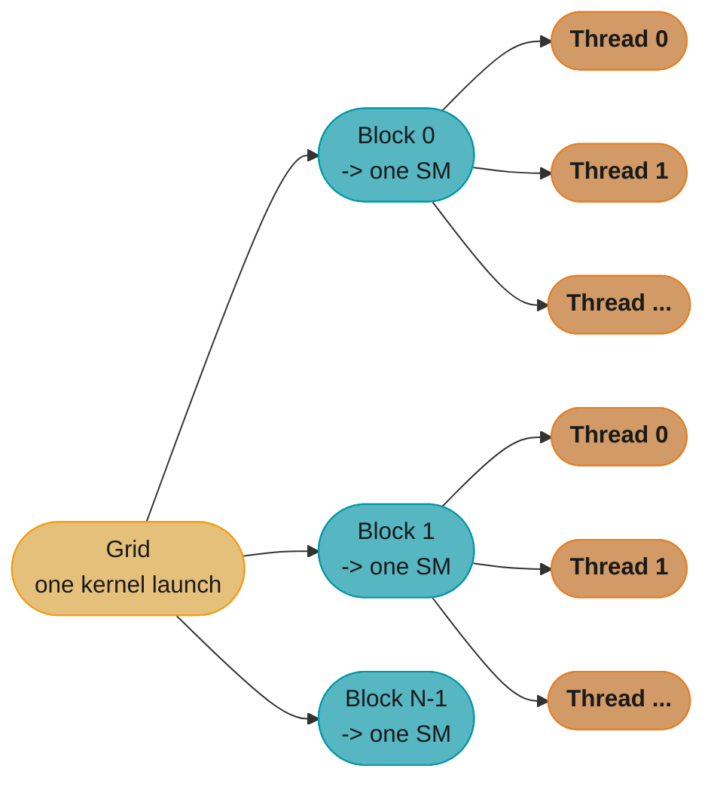
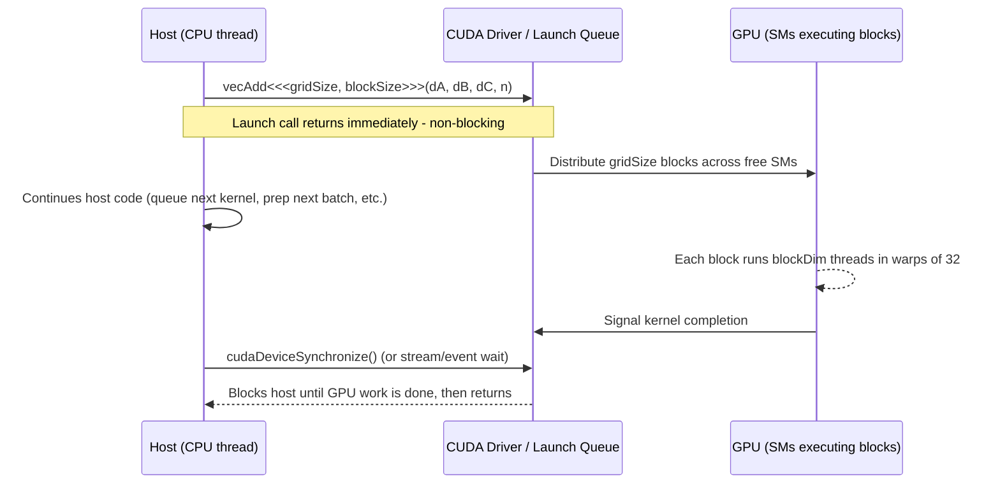
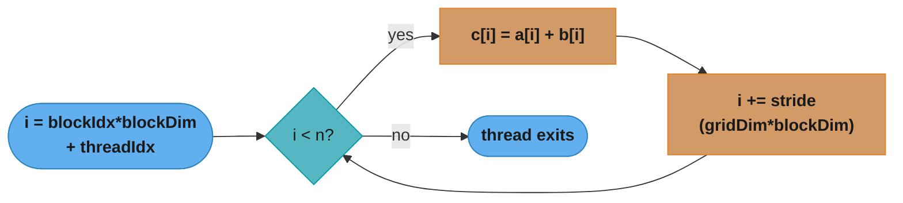
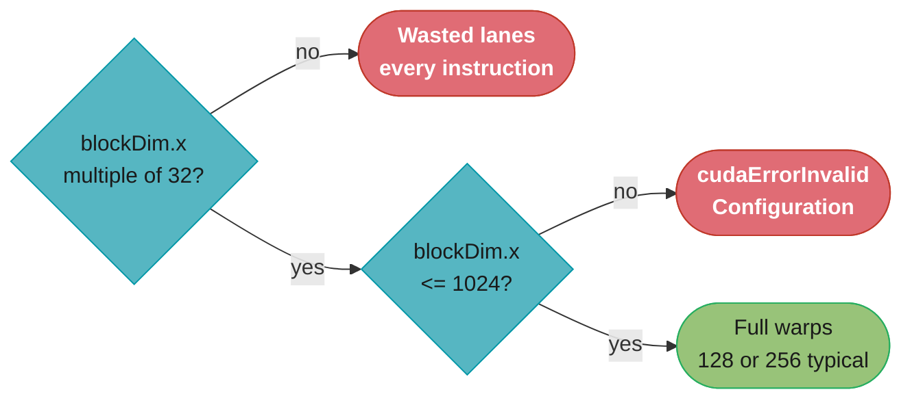

# CUDA Programming Model & Kernels

## 1. Concept Overview

CUDA (Compute Unified Device Architecture) exposes the GPU to the programmer as a
**hierarchy of threads** that execute a single function — the **kernel** — across
thousands of data elements at once. Instead of writing a loop that visits array
elements one at a time, you write the *body of the loop once* and launch it as a
kernel; the hardware supplies each of the thousands of parallel instances with its
own coordinates (`threadIdx`, `blockIdx`) so it knows which element to work on.

The programming model has three levels, each a bigger and slower-to-reach unit of
work: a **thread** (one lane of execution, its own registers and program counter
on Volta+), a **block** (up to 1024 threads that can cooperate via shared memory and
`__syncthreads()`), and a **grid** (all the blocks launched by one kernel call, up to
2^31-1 in the x dimension). The programmer writes the kernel and chooses the launch
configuration `<<<gridDim, blockDim>>>`; the hardware scheduler is free to run the
blocks in any order, on any Streaming Multiprocessor (SM), interleaved with other
kernels' blocks — this is what lets the same compiled binary scale from a laptop GPU
with 20 SMs to a data-center GPU with 132 SMs without recompilation.

This module covers the mechanics every other CUDA topic assumes: function
qualifiers (`__global__`/`__device__`/`__host__`), the built-in coordinate
variables, 1D/2D/3D thread and block indexing, `dim3`, the asynchronous nature of
a kernel launch, and the grid-stride loop idiom. Coalescing, shared memory, and
occupancy — the topics that turn a *correct* kernel into a *fast* one — are the
next three modules; this one is about writing a correct kernel first.

---

## 2. Intuition

> **One-line analogy**: A kernel launch is a factory manager handing every one of
> 50,000 workers an identical instruction sheet and a location tag — each worker
> reads their own tag (`blockIdx`, `threadIdx`), looks up their assigned bin, and
> does the same task on different material, all at once.

**Mental model**: A CPU `for` loop visits array elements sequentially: `for (i = 0;
i < N; i++) c[i] = a[i] + b[i]`. CUDA inverts this — you delete the loop, keep only
the *body*, and let the launch configuration supply `i` for every element
simultaneously. `i = blockIdx.x * blockDim.x + threadIdx.x` is the arithmetic that
recovers "which loop iteration am I" from "which block and thread am I." Get this
one line of arithmetic right, guard it with a bounds check, and every kernel in
this section is a variation on the same shape.

**Why it matters**: Every CUDA program — from a two-line vector add to a
multi-kernel Flash Attention implementation — is built from exactly this
primitive: a function marked `__global__`, launched with `<<<grid, block>>>`, whose
body computes a global index and reads/writes memory at that index. Interviewers
use "write a kernel that adds two vectors, and handle N not a multiple of block
size" as the baseline filter question — get the index arithmetic and the bounds
check wrong and nothing else in the interview matters.

**Key insight**: The block/thread hierarchy is not just an API convenience — it
mirrors the hardware. A block is a unit of *locality*: all its threads land on the
**same SM** and can share fast on-chip memory. A grid is a unit of *elasticity*:
the number of blocks is independent of the number of SMs, so the scheduler feeds
blocks to whichever SM frees up next. Choosing `blockDim` is therefore not a
stylistic choice — it fixes how much shared memory and how many registers each
cooperating group of threads has access to (see
[occupancy_and_launch_configuration](../occupancy_and_launch_configuration/)), while
choosing `gridDim` (usually via `ceil(N / blockDim)`) is what makes the same kernel
scale to any input size and any GPU.

---

## 3. Core Principles

- **Thread hierarchy**: `thread` -> `block` -> `grid`. A grid is composed of blocks;
  a block is composed of threads. Threads in the same block can synchronize
  (`__syncthreads()`) and share fast on-chip shared memory; threads in different
  blocks cannot directly synchronize with each other during a kernel's execution.
- **Built-in coordinate variables**, read-only inside a kernel, one instance per
  thread: `threadIdx` (this thread's index within its block), `blockIdx` (this
  block's index within the grid), `blockDim` (the block size chosen at launch, same
  value for every thread), `gridDim` (the grid size chosen at launch, same value for
  every thread). All four are `dim3` structs with `.x`, `.y`, `.z` fields.
- **`dim3`**: a small struct of three `unsigned int`s (`x`, `y`, `z`), each
  defaulting to 1 if omitted. It lets a 1D, 2D, or 3D problem (a vector, an image, a
  volume) map naturally onto the launch configuration instead of forcing everything
  through a flattened 1D index by hand.
- **Kernel launch syntax**: `kernelName<<<gridDim, blockDim>>>(args...)`. `gridDim`
  and `blockDim` can each be a plain `int` (interpreted as `dim3(n, 1, 1)`) or an
  explicit `dim3(x, y, z)`.
- **Function-execution-space qualifiers** determine where a function runs and who
  can call it: `__global__` (runs on device, callable from host — the kernel
  entry point), `__device__` (runs on device, callable only from device code),
  `__host__` (runs on host, callable only from host — the default if no qualifier
  is given), `__host__ __device__` (compiled twice, once for each side — for small
  helper math used by both CPU reference code and the kernel).
- **Kernel launches are asynchronous**: `kernelName<<<...>>>(...)` returns control
  to the host CPU thread immediately, before the GPU has necessarily started, let
  alone finished. The host must call `cudaDeviceSynchronize()` (or wait on a
  stream/event) to block until the kernel completes — see
  [memory_management_and_data_transfer](../memory_management_and_data_transfer/) for
  how this interacts with `cudaMemcpy`.
- **Grid-stride loops**: when the number of threads launched (`gridDim.x *
  blockDim.x`) is smaller than the problem size `N` — deliberately, to cap
  occupancy, or because `N` is only known at runtime and could exceed the max grid
  — each thread loops over multiple elements, striding by the total thread count.
- **Occupancy and warp size are downstream of these choices but not this module's
  focus**: warp = 32 threads is why block sizes are chosen as multiples of 32 (see
  [warps_and_simt_execution](../warps_and_simt_execution/)); how many resident
  blocks/warps a given `blockDim` allows is the subject of
  [occupancy_and_launch_configuration](../occupancy_and_launch_configuration/).

---

## 4. Types / Architectures / Strategies

### 4.1 Grid dimensionality — match the problem's natural shape

| Dimensionality | Typical data | Index formula | Example launch config |
|----------------|-------------|----------------|------------------------|
| 1D | Vectors, flat buffers, token sequences | `i = blockIdx.x*blockDim.x + threadIdx.x` | `dim3 block(256); dim3 grid((N+255)/256);` |
| 2D | Images, matrices | `row = blockIdx.y*blockDim.y + threadIdx.y`; `col = blockIdx.x*blockDim.x + threadIdx.x`; `idx = row*width + col` | `dim3 block(16,16); dim3 grid((W+15)/16, (H+15)/16);` |
| 3D | Volumes, video (H x W x T), voxel grids | adds `z = blockIdx.z*blockDim.z + threadIdx.z`; `idx = z*H*W + row*W + col` | `dim3 block(8,8,4); dim3 grid((W+7)/8, (H+7)/8, (T+3)/4);` |

The dimensionality of the grid is a **programmer convenience for index
readability** — the hardware does not treat a 2D grid specially; it is flattened
internally. Use 2D/3D indexing whenever it makes the kernel body read like the
math (`image[row][col]`), not because it changes performance.

### 4.2 Fixed grid vs grid-stride loop

| Strategy | One thread handles | When to use |
|----------|--------------------|--------------|
| **Fixed grid ("monolithic kernel")** | Exactly one element | `N` known and modest; simplest to write and reason about; the default for teaching and for most production kernels |
| **Grid-stride loop** | Zero or more elements, striding by `gridDim.x * blockDim.x` | `N` unknown at compile time and possibly huge; you want to deliberately launch fewer blocks than `ceil(N/blockDim)` (e.g. exactly enough to saturate the GPU, reused across many calls); portable across GPUs with different SM counts without recomputing `gridDim` |

### 4.3 Function qualifier combinations

| Qualifier | Callable from | Runs on | Typical use |
|-----------|---------------|---------|-------------|
| `__global__` | Host (and, with dynamic parallelism, device) | Device | Kernel entry point; must return `void` |
| `__device__` | Device only | Device | Helper function inlined/called from within a kernel (e.g. a `clamp()` or `sigmoid()` used by many kernels) |
| `__host__` | Host only | Host | Ordinary CPU function; the implicit default with no qualifier |
| `__host__ __device__` | Both | Both (compiled twice) | Shared math (e.g. `distance()`) used identically by a CPU reference implementation and the GPU kernel — avoids duplicating the formula |

### Who Can Call What — Function-Qualifier Routing


`__global__` is the only entry point the host may call directly; `__device__`
helpers are reachable only from other device code, and `__host__ __device__`
compiles once per side so one source serves both the CPU reference path and
the kernel.

---

## 5. Architecture Diagrams

### Grid -> Block -> Thread — The Hierarchy as a Fan-Out



Each block lands on exactly one SM and fans out into up to 1024 cooperating
threads; the grid's block count is independent of the GPU's SM count, which is
why the same compiled kernel scales from 20 SMs to 132 SMs without recompiling.

### Kernel Launch Is Asynchronous — Host/Driver/GPU Timeline



The host never blocks on the `<<<...>>>` line itself — it blocks only when it
explicitly asks to (`cudaDeviceSynchronize`, a stream sync, or touching a
pinned/mapped result the runtime knows to wait on). This is what makes streams and
compute/transfer overlap possible later in the section.

### Thread-Index Grid — The Core Arithmetic Made Visible

`i = blockIdx.x * blockDim.x + threadIdx.x` turns two small per-thread coordinates
into one flat index. `blockDim.x = 4` in this illustration (real kernels use 128
or 256); small numbers keep the arithmetic easy to trace by eye.

```
Global index formula:  i = blockIdx.x * blockDim.x + threadIdx.x     (blockDim.x = 4)

Case A - N = 8 (exact multiple of blockDim, gridDim = ceil(8/4) = 2 blocks):

  blockIdx.x :      0                1
  threadIdx.x:   0  1  2  3       0  1  2  3
                 |  |  |  |       |  |  |  |
                 v  v  v  v       v  v  v  v
  global i   :   0  1  2  3       4  5  6  7      <- all 8 threads map to a valid A[i]/B[i]

Case B - N = 6 (blockDim = 4, gridDim = ceil(6/4) = 2 blocks -> 8 threads launched):

  blockIdx.x :      0                1
  threadIdx.x:   0  1  2  3       0  1  2  3
                 |  |  |  |       |  |  |  |
                 v  v  v  v       v  v  v  v
  global i   :   0  1  2  3       4  5  6  7
  valid?     :   ok ok ok ok      ok ok  X  X     <- i=6,7 >= N=6: needs `if (i < N)`
```

Case B is the whole reason the bounds check exists: CUDA always launches whole
blocks, so `gridDim.x * blockDim.x` rounds *up* to the next multiple of `blockDim.x`
— the arithmetic itself never knows about `N`, only the `if (i < N)` guard does.
See the BROKEN -> FIX walkthrough in Section 10 for what happens when that guard is
missing.

**In plain terms.** "Which block am I in, times how many threads a block holds, plus my seat number inside that block."

It is street addressing. `blockIdx.x` is the block number, `blockDim.x` is the houses per block, `threadIdx.x` is the house number — multiply and add to get one globally unique address. Every thread in the entire grid runs this same line and every thread gets a different `i`.

| Symbol | What it is |
|--------|------------|
| `blockIdx.x` | Which block this thread belongs to. Ranges `0 .. gridDim.x - 1` |
| `blockDim.x` | Threads per block — the same value for every block in the launch |
| `threadIdx.x` | This thread's position inside its own block. Ranges `0 .. blockDim.x - 1` |
| `i` | The flat global element index. Unique across the whole grid |
| `if (i < n)` | The guard. Retires threads whose `i` ran past the real data |

**Walk one example.** The realistic launch from Section 6.1 — `n = 1,000,000`, `blockDim.x = 256`:

```
  thread                blockIdx.x   blockDim.x   threadIdx.x   i = b*bd + t
  first thread overall       0          256            0               0
  last thread of block 0     0          256          255             255
  first thread of block 1    1          256            0             256   <- no gap, no overlap
  an arbitrary thread     2891          256           37         740,133
  very last thread        3906          256          255       1,000,191   <- past n!
```

The last row is Case B in miniature: `1,000,191 >= 1,000,000`, so that thread — and the 191 before it — must be turned away by `if (i < n)`. Drop the guard and those 192 threads write past the end of `c[]`, corrupting whatever allocation the driver placed next.

**Why multiply rather than concatenate.** `blockIdx.x * blockDim.x` is what makes block 1 start exactly where block 0 stopped. Any other combination either leaves holes (elements no thread ever computes, so stale memory is read back as a result) or overlaps (two threads writing the same `c[i]`, a race whose winner varies run to run). The multiply-then-add form is the only one that partitions `[0, gridDim.x * blockDim.x)` exactly once.

### 2D Indexing Sketch — Mapping Threads onto an Image

```
Row-major image, width W, height H:  idx = row * W + col

  row = blockIdx.y * blockDim.y + threadIdx.y
  col = blockIdx.x * blockDim.x + threadIdx.x

Example: 8x8 image, blockDim = (4, 4) -> gridDim = (2, 2) = four blocks B(x,y)

           col->  0    1    2    3    4    5    6    7
  row  0  [ B00 ][ B00 ][ B00 ][ B00 ][ B01 ][ B01 ][ B01 ][ B01 ]
  row  1  [ B00 ][ B00 ][ B00 ][ B00 ][ B01 ][ B01 ][ B01 ][ B01 ]
  row  2  [ B00 ][ B00 ][ B00 ][ B00 ][ B01 ][ B01 ][ B01 ][ B01 ]
  row  3  [ B00 ][ B00 ][ B00 ][ B00 ][ B01 ][ B01 ][ B01 ][ B01 ]
  row  4  [ B10 ][ B10 ][ B10 ][ B10 ][ B11 ][ B11 ][ B11 ][ B11 ]
  row  5  [ B10 ][ B10 ][ B10 ][ B10 ][ B11 ][ B11 ][ B11 ][ B11 ]
  row  6  [ B10 ][ B10 ][ B10 ][ B10 ][ B11 ][ B11 ][ B11 ][ B11 ]
  row  7  [ B10 ][ B10 ][ B10 ][ B10 ][ B11 ][ B11 ][ B11 ][ B11 ]

  B(x,y) = block with blockIdx.x=x, blockIdx.y=y. Thread (tx=2, ty=1) inside
  block B10 (blockIdx.x=1, blockIdx.y=0) computes:
    row = 0*4 + 1 = 1        col = 1*4 + 2 = 6
    idx = row*W + col = 1*8 + 6 = 14  -> flat offset into the image buffer
```

Every one of the 64 pixels gets a distinct `(row, col)` pair from exactly one
thread, and the 2D `blockDim`/`gridDim` split means neighboring pixels usually land
in the same block — the precondition for the shared-memory tiling covered in
[shared_memory_and_bank_conflicts](../shared_memory_and_bank_conflicts/).

---

## 6. How It Works — Detailed Mechanics

### 6.1 The Same Kernel, Three Ways: Vector Add

The clearest way to see the programming model is one kernel, expressed in CUDA
C++, in Numba (`@cuda.jit`), and in CuPy (`RawKernel` and `ElementwiseKernel`).
All four compute `C = A + B` over `N` `float32` elements with the identical index
arithmetic and the identical bounds guard.

**CUDA C++** — the reference form; every other form is teaching the same shape:

```cuda
#include <cuda_runtime.h>
#include <cstdio>

#define CUDA_CHECK(call)                                                     \
    do {                                                                     \
        cudaError_t err = (call);                                            \
        if (err != cudaSuccess) {                                            \
            fprintf(stderr, "CUDA error %s at %s:%d\n",                      \
                    cudaGetErrorString(err), __FILE__, __LINE__);             \
            exit(1);                                                         \
        }                                                                    \
    } while (0)

// __global__: device code, callable from the host - this IS the kernel entry point.
__global__ void vecAdd(const float* __restrict__ a,
                        const float* __restrict__ b,
                        float* __restrict__ c,
                        int n) {
    int i = blockIdx.x * blockDim.x + threadIdx.x;   // flatten (block, thread) -> element
    if (i < n) {                                      // REQUIRED bounds guard (see Section 10)
        c[i] = a[i] + b[i];
    }
}

int main() {
    const int n = 1'000'000;
    const size_t bytes = n * sizeof(float);

    float *h_a, *h_b, *h_c;
    h_a = (float*)malloc(bytes);
    h_b = (float*)malloc(bytes);
    h_c = (float*)malloc(bytes);
    for (int i = 0; i < n; ++i) { h_a[i] = 1.0f; h_b[i] = 2.0f; }

    float *d_a, *d_b, *d_c;
    CUDA_CHECK(cudaMalloc(&d_a, bytes));
    CUDA_CHECK(cudaMalloc(&d_b, bytes));
    CUDA_CHECK(cudaMalloc(&d_c, bytes));
    CUDA_CHECK(cudaMemcpy(d_a, h_a, bytes, cudaMemcpyHostToDevice));
    CUDA_CHECK(cudaMemcpy(d_b, h_b, bytes, cudaMemcpyHostToDevice));

    int blockSize = 256;                              // multiple of warp size (32)
    int gridSize  = (n + blockSize - 1) / blockSize;   // ceil(N / blockDim) - grid-of-blocks
    vecAdd<<<gridSize, blockSize>>>(d_a, d_b, d_c, n);
    CUDA_CHECK(cudaGetLastError());        // catches bad launch config synchronously
    CUDA_CHECK(cudaDeviceSynchronize());   // launch is async - block until it's done

    CUDA_CHECK(cudaMemcpy(h_c, d_c, bytes, cudaMemcpyDeviceToHost));
    printf("c[0] = %f (expect 3.0)\n", h_c[0]);

    cudaFree(d_a); cudaFree(d_b); cudaFree(d_c);
    free(h_a); free(h_b); free(h_c);
    return 0;
}
```

`blockSize = 256` and `gridSize = ceil(n / blockSize)` is the idiom you will type
hundreds of times; it appears again, unchanged in spirit, in the Numba and CuPy
versions below.

**Put simply.** "Round the block count up, never down — it is always safe to launch a few threads too many, and never safe to launch one too few."

`(n + blockSize - 1) / blockSize` is integer ceiling division written without floating point. Adding `blockSize - 1` before the truncating divide forces any nonzero remainder to carry into the quotient.

| Symbol | What it is |
|--------|------------|
| `n` | Number of real data elements to process |
| `blockSize` | Threads per block. `256` here |
| `blockSize - 1` | The bias that makes the truncating `/` round up instead of down |
| `gridSize` | Blocks to launch = `ceil(n / blockSize)` |
| `gridSize * blockSize` | Threads actually launched. Always `>= n`, never `< n` |

**Walk one example.** `n = 1,000,000`, `blockSize = 256`, and the wrong version beside it:

```
  correct (ceil):   (1,000,000 + 255) / 256  =  1,000,255 / 256  =  3907  blocks
                    threads launched = 3907 x 256 = 1,000,192
                    surplus threads  = 1,000,192 - 1,000,000 = 192  -> retired by if (i < n)

  wrong (floor):     1,000,000 / 256          =  3906  blocks
                    threads launched = 3906 x 256 =   999,936
                    MISSING elements = 1,000,000 -   999,936 = 64   -> silently never computed
```

Both versions compile, both run, both exit `0`. The floor version simply leaves the last **64 elements** of `c[]` holding whatever `cudaMalloc` handed back — usually stale data from a previous allocation, which is why the bug reproduces intermittently and never in the first test run.

**The two errors are not symmetric.** Over-launching costs 192 threads that evaluate one comparison and retire — nanoseconds, and the guard already exists to handle it. Under-launching costs correctness with no error code, no exception, and no profiler warning. That asymmetry is why `ceil` is the unconditional idiom rather than a judgement call.

**Numba `@cuda.jit`** — same arithmetic, Python syntax, JIT-compiled to PTX:

```python
import numpy as np
from numba import cuda

@cuda.jit
def vec_add(a, b, c):
    i = cuda.grid(1)     # shorthand for cuda.blockIdx.x * cuda.blockDim.x + cuda.threadIdx.x
    if i < a.size:        # REQUIRED bounds guard - identical role to `if (i < n)` in CUDA C++
        c[i] = a[i] + b[i]

n = 1_000_000
a = np.full(n, 1.0, dtype=np.float32)
b = np.full(n, 2.0, dtype=np.float32)
c = np.zeros(n, dtype=np.float32)

d_a = cuda.to_device(a)
d_b = cuda.to_device(b)
d_c = cuda.device_array_like(c)

threads_per_block = 256
blocks_per_grid = (n + threads_per_block - 1) // threads_per_block   # ceil(N / blockDim)
vec_add[blocks_per_grid, threads_per_block](d_a, d_b, d_c)

c = d_c.copy_to_host()
print("c[0] =", c[0], "(expect 3.0)")
```

`cuda.grid(1)` is Numba's helper for exactly the `blockIdx.x * blockDim.x +
threadIdx.x` line — spelled out, it is `cuda.blockIdx.x * cuda.blockDim.x +
cuda.threadIdx.x`, identical arithmetic to the CUDA C++ version. The launch
`vec_add[blocks_per_grid, threads_per_block](...)` is Numba's syntax for
`<<<gridDim, blockDim>>>` and is equally asynchronous with respect to the Python
host thread.

**CuPy `RawKernel`** — write the CUDA C++ kernel as a string, launch it explicitly:

```python
import cupy as cp

vec_add_kernel = cp.RawKernel(r'''
extern "C" __global__
void vec_add(const float* a, const float* b, float* c, int n) {
    int i = blockIdx.x * blockDim.x + threadIdx.x;
    if (i < n) {                    // same bounds guard, same reason
        c[i] = a[i] + b[i];
    }
}
''', 'vec_add')

n = 1_000_000
a = cp.full(n, 1.0, dtype=cp.float32)
b = cp.full(n, 2.0, dtype=cp.float32)
c = cp.zeros(n, dtype=cp.float32)

threads_per_block = 256
blocks_per_grid = (n + threads_per_block - 1) // threads_per_block
vec_add_kernel((blocks_per_grid,), (threads_per_block,), (a, b, c, n))
cp.cuda.Stream.null.synchronize()   # RawKernel launches are async too

print("c[0] =", c[0], "(expect 3.0)")
```

**CuPy `ElementwiseKernel`** — the higher-level API: you supply only the per-element
expression, and CuPy generates the `blockIdx`/`threadIdx` machinery for you:

```python
import cupy as cp

vec_add_ew = cp.ElementwiseKernel(
    'float32 a, float32 b',   # input arg types/names
    'float32 c',              # output arg type/name
    'c = a + b',              # the kernel body - CuPy synthesizes the index + guard
    'vec_add_ew',
)

n = 1_000_000
a = cp.full(n, 1.0, dtype=cp.float32)
b = cp.full(n, 2.0, dtype=cp.float32)
c = vec_add_ew(a, b)          # CuPy picks blockDim/gridDim and launches for you

print("c[0] =", c[0], "(expect 3.0)")
```

`ElementwiseKernel` is CuPy's answer to "I don't want to think about `blockDim`
and bounds checks at all" — it generates the exact same `if (i < n)`-guarded
kernel under the hood, but you never see the index arithmetic. `RawKernel` is for
when you need control the elementwise abstraction cannot give you (multiple
outputs with different shapes, shared memory, warp-level primitives) — the rest of
this section's kernels are written as `RawKernel`s or CUDA C++ for that reason.

### The Same Vector Add, Four Ways — Abstraction vs Control

```mermaid
quadrantChart
    title Abstraction vs control across the four forms
    x-axis Low abstraction --> High abstraction
    y-axis Low control --> High control
    quadrant-1 Rare: both at once
    quadrant-2 Full manual control
    quadrant-3 Avoid: neither
    quadrant-4 Convenience first
    CUDA C++: [0.10, 0.95]
    CuPy RawKernel: [0.30, 0.90]
    Numba cuda.jit: [0.45, 0.65]
    CuPy ElementwiseKernel: [0.85, 0.25]
```

`ElementwiseKernel` trades away shared memory and multi-output kernels for the
shortest code; `RawKernel` and CUDA C++ keep full control at the cost of
writing the index arithmetic and guard by hand — Numba sits between the two,
Python syntax with nearly the same control as raw CUDA C++.

### 6.2 The Grid-Stride Loop

When you do not want (or cannot afford) to launch `ceil(N/blockDim)` blocks —
`N` might be a runtime value larger than `2^31-1 * blockDim`, or you want a fixed
number of blocks that saturates the GPU and reuse it across many calls — each
thread processes more than one element, striding by the total number of threads
launched:



The loop's own `i < n` condition **is** the bounds check — a thread simply
stops issuing iterations once `i` reaches `n`, so no separate `if` is needed
inside the loop body.

```cuda
__global__ void vecAddGridStride(const float* __restrict__ a,
                                  const float* __restrict__ b,
                                  float* __restrict__ c,
                                  int n) {
    int stride = gridDim.x * blockDim.x;                    // total threads launched
    for (int i = blockIdx.x * blockDim.x + threadIdx.x;     // this thread's first element
         i < n;
         i += stride) {                                     // ...then every `stride`-th element
        c[i] = a[i] + b[i];
    }
}

// Launch with a FIXED number of blocks, independent of n:
int blockSize = 256;
int gridSize  = 1024;                       // e.g. enough to fill every SM several times over
vecAddGridStride<<<gridSize, blockSize>>>(d_a, d_b, d_c, n);
```

The `for` loop's own condition (`i < n`) *is* the bounds check — there is no
separate `if` needed because the loop simply stops issuing iterations once `i`
reaches `n`. Numba expresses the identical idiom:

```python
@cuda.jit
def vec_add_grid_stride(a, b, c):
    start = cuda.grid(1)
    stride = cuda.gridsize(1)          # gridDim.x * blockDim.x, Numba's helper
    for i in range(start, a.size, stride):
        c[i] = a[i] + b[i]

# Launch with a fixed grid, independent of a.size:
threads_per_block = 256
blocks_per_grid = 1024
vec_add_grid_stride[blocks_per_grid, threads_per_block](d_a, d_b, d_c)
```

### 6.3 Launch-Configuration Constants Worth Memorizing

| Constant | Value | Why it matters |
|----------|-------|-----------------|
| Max threads per block | **1024** | Hard hardware ceiling on `blockDim.x * blockDim.y * blockDim.z`; exceeding it fails at launch with `cudaErrorInvalidConfiguration` |
| Warp size | **32** | The scheduling granularity — block sizes should be multiples of 32 or the last warp wastes lanes |
| Typical `blockDim.x` | **128 or 256** | Sweet spot balancing occupancy against per-block resource use for most kernels; tuned per-kernel in [occupancy_and_launch_configuration](../occupancy_and_launch_configuration/) |
| Max `gridDim.x` | **2^31 - 1** (~2.1 billion) | Effectively unbounded for the x dimension on compute capability 3.0+ |
| Max `gridDim.y`, `gridDim.z` | **65535** each | Much smaller than x — arrange 2D/3D problems with the largest extent along x |
| `gridDim` formula | **`ceil(N / blockDim)`** = `(N + blockDim - 1) / blockDim` | Standard integer-ceiling-division idiom; guarantees at least `N` threads are launched |
| Global memory stall latency | **~400-800 cycles** | Why oversubscribing SMs with many resident warps (a function of `blockDim` and register/shared-mem use) matters — see occupancy module |

### Choosing `blockDim` — the Multiple-of-32 Decision



A block of 100 threads still occupies 4 full warps (128 lanes), wasting 28
lanes every issue; the standard defaults of 128 or 256 satisfy both the
warp-alignment and the 1024-thread ceiling in one choice.

---

## 7. Real-World Examples

- **PyTorch custom CUDA extensions**: every custom `torch.autograd.Function`
  backed by a CUDA kernel (e.g. a fused activation) follows this exact
  shape — a `__global__` kernel indexed by `blockIdx.x * blockDim.x + threadIdx.x`
  over the flattened tensor, launched from a C++ or Python wrapper.
- **Thrust and CUB**: NVIDIA's C++ template libraries generate kernels with this
  same index arithmetic under the hood for `transform`, `for_each`, and reduction
  primitives — you rarely see it, but it is there.
  See [cuda_math_and_dnn_libraries](../cuda_math_and_dnn_libraries/).
  data augmentation, and preprocessing pipelines (`cudf`, `cuml`) use the flat
  1D index for row-wise operations on GPU DataFrames.
- **cuDF / RAPIDS**: GPU-accelerated Pandas-like data processing kernels for
  filtering, transforms, and column-wise math use the exact 1D grid-stride
  pattern from Section 6.2 because DataFrame column lengths are runtime values.
- **Image/video pipelines (OpenCV CUDA module, FFmpeg NVENC/NVDEC filters)**:
  every per-pixel filter (blur, color conversion, resize) uses the 2D indexing
  scheme from Section 5 with `blockDim = (16, 16)` or `(32, 8)`.
- **Numba in production data science**: RAPIDS and financial/scientific Python
  codebases that need custom GPU math not covered by CuPy's built-ins write
  `@cuda.jit` kernels with this identical index-and-guard pattern rather than
  dropping to C++.

---

## 8. Tradeoffs

| Choice | Pro | Con | When to prefer |
|--------|-----|-----|-----------------|
| Fixed grid (`gridDim = ceil(N/blockDim)`) | Simplest to reason about; one thread = one element | Grid size must be recomputed per call; large `N` can (rarely) approach grid limits | Default choice; `N` known and moderate |
| Grid-stride loop | Fixed launch config reusable across calls; caps blocks to exactly what saturates the GPU; handles arbitrarily large `N` | Slightly more code; each thread does a loop instead of one access, marginally more register pressure | `N` unknown at compile time, very large, or the same launch config is reused across many kernel calls |
| CUDA C++ (raw kernel) | Full control: shared memory, warp intrinsics, `__launch_bounds__`, cooperative groups | Requires nvcc compilation step (or `nvrtc` at runtime); most verbose | Performance-critical kernels; anything needing shared memory/warp primitives |
| Numba `@cuda.jit` | Python syntax, JIT-compiled per call, integrates with NumPy arrays directly | JIT warm-up cost on first call; historically lagged CUDA C++ feature parity (improving) | Python-first teams; rapid iteration; kernels without exotic hardware features |
| CuPy `RawKernel` | Write real CUDA C++ inside Python, called from a NumPy-like array API | Loses type safety of a compiled build; string-embedded C++ has no IDE tooling | Need custom kernel logic (fused ops) inside an otherwise CuPy/NumPy-style pipeline |
| CuPy `ElementwiseKernel` | Shortest code, CuPy manages `blockDim`/`gridDim`/bounds check for you | Only expresses pure elementwise math — no shared memory, no cross-thread cooperation | Simple elementwise fusions where you don't need control over the launch config |
| 1D flat indexing | Works for any shape once flattened; simplest arithmetic | Loses the `(row, col)` mental model for 2D/3D data | Vectors, flattened buffers, 1D scans/reductions |
| 2D/3D `dim3` indexing | Kernel body reads like the math (`image[row][col]`); natural block-locality for tiling | Slightly more launch-config bookkeeping (two or three dimensions to size) | Images, matrices, volumes |

---

## 9. When to Use / When NOT to Use

**Use a hand-written kernel when:**
- The operation is not already provided by a tuned library (cuBLAS, cuDNN,
  Thrust) — see [cuda_math_and_dnn_libraries](../cuda_math_and_dnn_libraries/) for
  when to prefer the library instead.
- You need to *fuse* several elementwise or reduction steps to avoid extra
  round-trips to global memory (the whole point of, e.g., FlashAttention).
- You are learning the programming model — a vector add or a saxpy kernel is the
  correct first exercise before touching shared memory or warp primitives.

**Use the grid-stride loop specifically when:**
- `N` is a runtime value that could be very large or is unknown at kernel-authoring
  time.
- You want a single, reusable launch configuration (e.g. `gridSize =
  numSMs * blocksPerSM`) independent of the problem size, so you tune the launch
  config once and reuse it for every call.

**Do NOT hand-write a kernel when:**
- A vendor library already implements the operation at near-peak performance
  (matrix multiply -> cuBLAS/CUTLASS, convolution -> cuDNN, sort/scan -> Thrust/CUB).
  Custom kernels only win when they *fuse* operations the library cannot.
- The operation is inherently sequential / has no data parallelism to expose — the
  GPU adds overhead (kernel launch, PCIe/NVLink transfer) with no throughput
  benefit for a problem that is one long dependency chain.
- The dataset is small enough that host<->device transfer time dominates any
  compute savings — see [memory_management_and_data_transfer](../memory_management_and_data_transfer/).

---

## 10. Common Pitfalls

**BROKEN — missing bounds check when `N` is not a multiple of `blockDim`:**

```cuda
// BROKEN: no guard - launched threads with i >= n read/write out of bounds
__global__ void vecAddBroken(const float* a, const float* b, float* c, int n) {
    int i = blockIdx.x * blockDim.x + threadIdx.x;
    c[i] = a[i] + b[i];     // if n=1000 and blockDim=256, gridDim=ceil(1000/256)=4
                             // -> 1024 threads launched, i=1000..1023 write past the buffer
}
```

Because CUDA always launches whole blocks, `gridDim * blockDim` almost never
equals `N` exactly — it rounds *up*. The extra threads (`i >= n`) read and write
memory past the end of the allocated buffer: on `cudaMalloc`'d device memory this
corrupts whatever the allocator placed next, produces silently wrong results, or
crashes with an unspecified-launch-failure that surfaces on a *later*, unrelated
kernel call (because the launch itself is asynchronous — see Section 6's timeline
diagram) — one of the most confusing classes of CUDA bugs to debug because the
error appears far from its cause.

```cuda
// FIX: guard every global-memory access with the bounds check
__global__ void vecAddFixed(const float* a, const float* b, float* c, int n) {
    int i = blockIdx.x * blockDim.x + threadIdx.x;
    if (i < n) {                       // the guard costs one predicated compare - always add it
        c[i] = a[i] + b[i];
    }
}
```

The fix is one line and effectively free (a predicated branch, not a divergent
one, since all 32 threads in the last partial warp either all pass or the tail few
fail together) — there is no performance reason to omit it, only the mistake of
forgetting it.

**Other pitfalls:**

1. **Forgetting the kernel launch is asynchronous.** Reading `h_c` right after
   `vecAdd<<<...>>>(...)` without a `cudaMemcpy` (which implicitly syncs) or an
   explicit `cudaDeviceSynchronize()` reads stale or partially-written host memory
   because the GPU may not have started, let alone finished.
2. **No error checking on the launch itself.** A bad `<<<gridDim, blockDim>>>`
   (e.g. `blockDim.x > 1024`) fails asynchronously — `cudaGetLastError()` after the
   launch (not just after the eventual sync) is required to catch it promptly
   rather than blaming a downstream kernel.
3. **Choosing `blockDim` not a multiple of 32.** A block of 100 threads still
   occupies 4 full warps (128 hardware lanes) — the last 28 lanes are wasted every
   single instruction issue. See [warps_and_simt_execution](../warps_and_simt_execution/).
4. **Assuming blocks execute in launch order, or that different blocks can
   synchronize.** The scheduler is free to run block 500 before block 0; there is
   no `__syncthreads()`-equivalent across blocks within a single kernel launch
   (only cooperative-groups grid sync, a specialized advanced feature).
5. **Using a grid-stride loop's `stride` incorrectly** (e.g. hardcoding
   `blockDim.x` instead of `gridDim.x * blockDim.x`) — this silently reprocesses
   the same elements across blocks and skips others.

---

## 11. Technologies & Tools

| Tool / Layer | Role | Notes |
|---------------|------|-------|
| `nvcc` | Compiles `.cu` files (CUDA C++) to PTX/SASS | See [cuda_toolkit_and_compilation](../cuda_toolkit_and_compilation/) |
| CUDA Runtime API (`cudaMalloc`, `cudaMemcpy`, `<<<...>>>`) | The API used throughout this module | Simpler, higher-level than the Driver API |
| Numba (`numba.cuda`) | JIT-compiles Python `@cuda.jit` functions to PTX at call time | Integrates directly with NumPy/`cuda.to_device` |
| CuPy (`cp.RawKernel`, `cp.ElementwiseKernel`) | Embed/generate CUDA C++ kernels from Python, operate on `cupy.ndarray` | See [python_gpu_ecosystem](../python_gpu_ecosystem/) for the full ecosystem comparison |
| `cuda-gdb` / `compute-sanitizer` | Debug out-of-bounds accesses and races at the kernel level | The `memcheck` tool catches exactly the Section 10 bug at runtime — see [debugging_correctness_and_numerics](../debugging_correctness_and_numerics/) |
| Nsight Compute / Nsight Systems | Profile a kernel's actual occupancy, memory throughput, launch overhead | See [profiling_and_performance_analysis](../profiling_and_performance_analysis/) |

---

## 12. Interview Questions with Answers

**Q: What happens if you omit the `if (i < n)` bounds check when `N` is not a multiple of `blockDim`?**
The extra threads (with `i >= n`) read and write past the end of the allocated buffer, corrupting adjacent device memory or crashing — often on a *later*, unrelated kernel call because launches are asynchronous. CUDA always launches whole blocks, so `gridDim * blockDim` almost never equals `N` exactly; it rounds up, and the guard is the only thing that stops the rounding error from becoming a memory bug.

**Q: Is a CUDA kernel launch synchronous or asynchronous with respect to the host thread?**
Asynchronous — `kernel<<<grid, block>>>(...)` returns control to the host immediately, before the GPU necessarily starts or finishes. The host must call `cudaDeviceSynchronize()`, wait on a stream/event, or issue a `cudaMemcpy` (which syncs implicitly) to be sure the results are ready.

**Q: Why should `blockDim` be chosen as a multiple of 32?**
A warp is the hardware's unit of instruction issue at 32 threads, and a block always occupies a whole number of warps rounded up. A block of 100 threads still allocates 4 warps (128 hardware lanes), so 28 lanes are masked off and wasted on every instruction — choosing 96 or 128 instead uses every scheduled lane.

**Q: What is a grid-stride loop and when do you need one instead of a one-thread-per-element kernel?**
A grid-stride loop has each thread process multiple elements, striding by `gridDim.x * blockDim.x` per iteration, instead of launching exactly `ceil(N/blockDim)` blocks for one-thread-per-element. It is needed when `N` is a large runtime value, when you want one fixed, reusable launch configuration across many calls, or when you deliberately cap the grid to just enough blocks to saturate the GPU's SMs.

**Q: Can a bad launch configuration (e.g. `blockDim.x` > 1024) fail silently?**
Yes — kernel launches are asynchronous, so a configuration error surfaces only when you check for it explicitly with `cudaGetLastError()` (or later, confusingly, inside `cudaDeviceSynchronize()` or a subsequent call). Skipping error checks is why a bad launch is often misattributed to an unrelated, later kernel.

**Q: Why does CUDA distinguish `__global__`, `__device__`, and `__host__` instead of one universal function keyword?**
They encode both *where code runs* and *who may call it*, which the compiler needs to generate the right calling convention and code path: `__global__` is device code callable from the host (the kernel entry point, must return `void`), `__device__` is device code callable only from other device code, and `__host__` is ordinary CPU code (the default with no qualifier). `__host__ __device__` compiles the function twice so the same source (e.g. a small math helper) can be called from both a CPU reference implementation and a GPU kernel without duplicating the formula.

**Q: What do `threadIdx`, `blockIdx`, `blockDim`, and `gridDim` each represent?**
`threadIdx` is this thread's coordinate within its own block (varies per thread); `blockIdx` is this thread's block's coordinate within the grid (same for every thread in a block, varies per block); `blockDim` is the block size chosen at launch (identical for every thread in the kernel); `gridDim` is the grid size chosen at launch (also identical for every thread). The first two vary per thread/block; the last two are launch-time configuration echoed back to every thread.

**Q: How do you compute a flat global index for a 2D image kernel?**
`row = blockIdx.y * blockDim.y + threadIdx.y`, `col = blockIdx.x * blockDim.x + threadIdx.x`, then `idx = row * width + col` for a row-major buffer — the same `blockIdx*blockDim+threadIdx` pattern applied independently per axis, then combined with the standard row-major flattening formula.

**Q: What is `dim3` and why does CUDA use it instead of three separate integers?**
`dim3` is a small struct of three `unsigned int` fields (`x`, `y`, `z`, each defaulting to 1), used for both `blockDim`/`gridDim` at launch and the built-in coordinate variables inside the kernel. It lets 1D, 2D, and 3D problems share one launch syntax — `dim3(256)` for a vector and `dim3(16,16)` for an image both use the identical `<<<grid, block>>>` launch mechanism.

**Q: What is the maximum number of threads per block, and what caps it?**
1024 threads per block on all current architectures, capped by hardware resources — the register file and shared memory available per SM must be divided among however many blocks are resident, and 1024 is the ceiling the scheduling hardware supports regardless of how much of those resources a given kernel actually uses. Exceeding it fails the launch immediately with `cudaErrorInvalidConfiguration`.

**Q: What is the maximum grid size, and does it differ by dimension?**
`gridDim.x` can be up to 2^31-1 (effectively unbounded) on compute capability 3.0+, but `gridDim.y` and `gridDim.z` are capped at 65535 each — a much smaller limit. This is why the largest-extent dimension of a multi-dimensional problem should be mapped to the grid's x axis.

**Q: If `gridDim.x * blockDim.x` is smaller than `N`, what happens to the missing elements in a fixed (non-grid-stride) kernel?**
They are simply never processed — a fixed, one-thread-per-element kernel only touches indices `0` through `gridDim.x*blockDim.x - 1`, so if that product is less than `N`, the tail of the array is silently left untouched (no crash, just an incomplete result). This is exactly the case a grid-stride loop is designed to handle correctly regardless of how the grid is sized.

**Q: In Numba, what does `cuda.grid(1)` do, and what CUDA C++ line does it replace?**
`cuda.grid(1)` returns the flattened 1D global thread index for the calling thread, exactly equivalent to writing `cuda.blockIdx.x * cuda.blockDim.x + cuda.threadIdx.x` by hand — the `1` argument says "give me the 1D flattened form" (pass `2` or `3` for a tuple of 2D/3D coordinates instead). It is Numba's ergonomic shorthand for the identical arithmetic every CUDA C++ kernel writes explicitly.

**Q: Why can't threads in different blocks reliably synchronize with each other during a kernel?**
`__syncthreads()` only synchronizes threads within the same block because blocks are scheduled independently and can run in any order, on any SM, at any time — including one finishing entirely before another starts. Cross-block synchronization requires either splitting the work into separate kernel launches (an implicit global barrier between launches) or the specialized cooperative-groups grid-sync API on hardware/launch configurations that support it — never a plain in-kernel construct.

**Q: What is the practical difference between CuPy's `RawKernel` and `ElementwiseKernel`?**
`ElementwiseKernel` takes only the per-element math expression and CuPy auto-generates the index arithmetic, bounds check, and launch configuration — ideal for simple fused elementwise ops but unable to express shared memory or cross-thread cooperation. `RawKernel` takes a full CUDA C++ source string compiled at first call, giving complete control (shared memory, warp intrinsics, multiple outputs) at the cost of writing the index arithmetic and guard yourself, exactly as in CUDA C++.

**Q: Why is `cudaGetLastError()` needed right after a kernel launch, separate from `cudaDeviceSynchronize()`?**
`cudaGetLastError()` reports errors from the *launch itself* (e.g. an invalid launch configuration), which are detected essentially synchronously by the driver, while `cudaDeviceSynchronize()` additionally surfaces *execution-time* errors (e.g. an illegal memory access) that only manifest once the kernel actually runs on the GPU. Checking both, immediately after the launch and after the sync, pinpoints whether a failure was a configuration mistake or a runtime fault inside the kernel body.

---

## 13. Best Practices

1. **Always guard global-memory accesses with a bounds check** (`if (i < n)`)
   unless you have proven `gridDim * blockDim == N` exactly — the guard costs a
   predicated compare, effectively free.
2. **Default to `blockDim = 256`** (or 128) as a starting point; it is a multiple
   of 32 and a reasonable balance for most kernels before profiling — see
   [occupancy_and_launch_configuration](../occupancy_and_launch_configuration/) for
   how to tune it further.
3. **Compute `gridDim` with the ceiling-division idiom** — `(N + blockDim - 1) /
   blockDim` in C++, `-(-N // blockDim)` or `(N + blockDim - 1) // blockDim` in
   Python — never `N / blockDim` truncating division, which silently drops the
   tail of the array.
4. **Wrap every CUDA Runtime API call in an error-checking macro** (`CUDA_CHECK`)
   and call `cudaGetLastError()` immediately after every kernel launch — launch
   errors are otherwise silent until a much later, harder-to-diagnose failure.
5. **Prefer a grid-stride loop when the launch configuration should be
   input-size-independent** — write it once, tune `gridDim`/`blockDim` for the
   GPU, and reuse the same launch for any `N`.
6. **Match grid dimensionality to the data's natural shape** (1D vectors, 2D
   images, 3D volumes) so the index arithmetic in the kernel body reads like the
   underlying math, not an flattened afterthought.
7. **Never assume block execution order or cross-block synchronization** — design
   kernels so each block's work is independent; use a new kernel launch (an
   implicit global barrier) when a later phase truly needs all blocks' results.
8. **Reach for `__host__ __device__` for small shared math**, not for large
   functions — it doubles compilation, so keep it to simple helpers used by both
   host reference code and device kernels.

---

## 14. Case Study

**Scenario**: A computer-vision team ports a CPU grayscale-conversion routine
(`gray = 0.299R + 0.587G + 0.114B`, applied per pixel to a batch of 4K images,
3840x2160 pixels each) to CUDA so it can run inside a real-time video pipeline
processing 60 images/second. The naive first port has a subtle bug that only
shows up on non-multiple-of-16 image crops used by a downstream feature.

**Initial (correct-looking) 2D kernel:**

```cuda
__global__ void rgbToGrayNaive(const unsigned char* rgb,
                                unsigned char* gray,
                                int width, int height) {
    int col = blockIdx.x * blockDim.x + threadIdx.x;
    int row = blockIdx.y * blockDim.y + threadIdx.y;

    int idx = row * width + col;          // BROKEN: no guard before using idx
    int rgbIdx = idx * 3;                 // 3 bytes per pixel (R, G, B)
    unsigned char r = rgb[rgbIdx];
    unsigned char g = rgb[rgbIdx + 1];
    unsigned char b = rgb[rgbIdx + 2];
    gray[idx] = (unsigned char)(0.299f * r + 0.587f * g + 0.114f * b);
}

// Launch:
dim3 blockDim(16, 16);
dim3 gridDim((width + 15) / 16, (height + 15) / 16);
rgbToGrayNaive<<<gridDim, blockDim>>>(d_rgb, d_gray, width, height);
```

At the full-frame resolution (3840x2160), both dimensions happen to be exact
multiples of 16 (`3840/16=240`, `2160/16=135`), so this "works" in initial
testing. The bug surfaces the moment the pipeline is reused on a **cropped
region** — say a 1000x563 face-detection window passed to the same kernel:
`gridDim.x = ceil(1000/16) = 63` launches `63*16 = 1008` columns (8 columns of
out-of-bounds threads), and `gridDim.y = ceil(563/16) = 36` launches `576` rows
(13 rows of out-of-bounds threads). Those extra threads compute `idx` values
past the end of `gray` and `rgbIdx` values past the end of `rgb`, corrupting
whatever device memory the allocator placed adjacent to the buffers —
`compute-sanitizer --tool memcheck` reports exactly this as an
out-of-bounds global read/write.

**Fixed kernel — bounds-checked in both dimensions:**

```cuda
__global__ void rgbToGrayFixed(const unsigned char* rgb,
                                unsigned char* gray,
                                int width, int height) {
    int col = blockIdx.x * blockDim.x + threadIdx.x;
    int row = blockIdx.y * blockDim.y + threadIdx.y;

    if (col < width && row < height) {        // FIX: guard on BOTH dimensions
        int idx = row * width + col;
        int rgbIdx = idx * 3;
        unsigned char r = rgb[rgbIdx];
        unsigned char g = rgb[rgbIdx + 1];
        unsigned char b = rgb[rgbIdx + 2];
        gray[idx] = (unsigned char)(0.299f * r + 0.587f * g + 0.114f * b);
    }
}
```

**Metrics after the fix** (measured on an L4 GPU, Nsight Systems):
- Crop-window crash rate: 100% of non-multiple-of-16 crops corrupted memory before
  the fix -> 0% after.
- Kernel latency for the 3840x2160 frame: unchanged (240 ms/frame budget was
  already met; the guard adds a negligible predicated branch) -> still comfortably
  inside the 16.6 ms/frame budget for 60 fps.
- `compute-sanitizer --tool memcheck` invalid-access count: from several thousand
  (across a batch of cropped test images) to zero.

**Discussion Questions:**
1. Why did the bug pass initial testing at full-frame resolution but fail on
   cropped windows? (Because `3840` and `2160` are both exact multiples of the
   chosen `blockDim=16`, masking the missing-guard bug until a non-aligned size
   was used.)
2. Why must this kernel guard on *both* `col < width` and `row < height`
   independently, rather than a single combined check? (Because `blockDim.x` and
   `blockDim.y` round up independently per axis — a thread can be in-bounds on one
   axis and out-of-bounds on the other.)
3. What tool would have caught this bug before it reached a downstream crop
   consumer, and at what stage of development should it run?
   (`compute-sanitizer --tool memcheck` in CI against a matrix of aligned and
   misaligned test image sizes — see
   [debugging_correctness_and_numerics](../debugging_correctness_and_numerics/).)
4. Would a grid-stride loop have prevented this class of bug? (No — a grid-stride
   loop's `for` condition (`i < n`) *replaces* the need for a separate `if`, but a
   fixed one-thread-per-pixel kernel still needs an explicit bounds check; the bug
   was the missing guard, not the choice between fixed grid and grid-stride.)

---

**See also**: [warps_and_simt_execution](../warps_and_simt_execution/) for how
divergence and warp scheduling interact with the thread hierarchy introduced here;
[memory_management_and_data_transfer](../memory_management_and_data_transfer/) for
how host/device memory and the asynchronous launch model combine with streams; and
[occupancy_and_launch_configuration](../occupancy_and_launch_configuration/) for how
`blockDim` choice determines how many blocks/warps can be resident on an SM at once.
