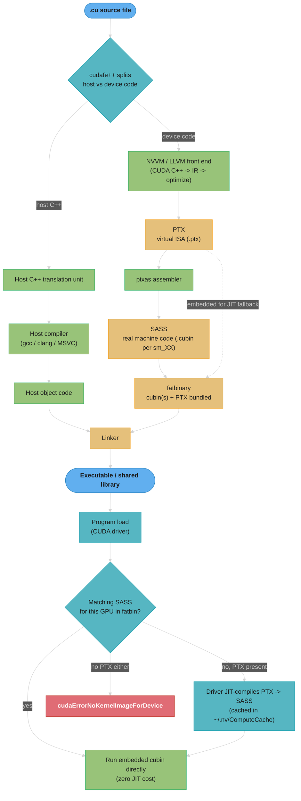
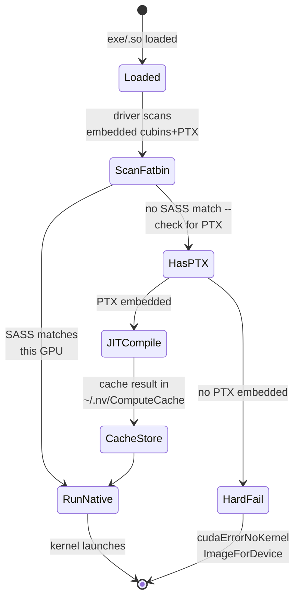
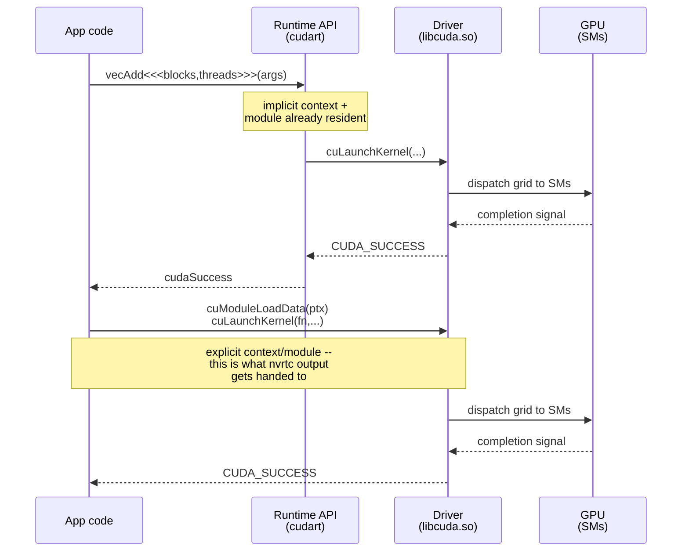
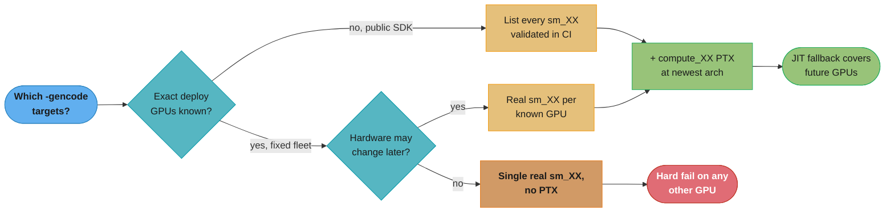
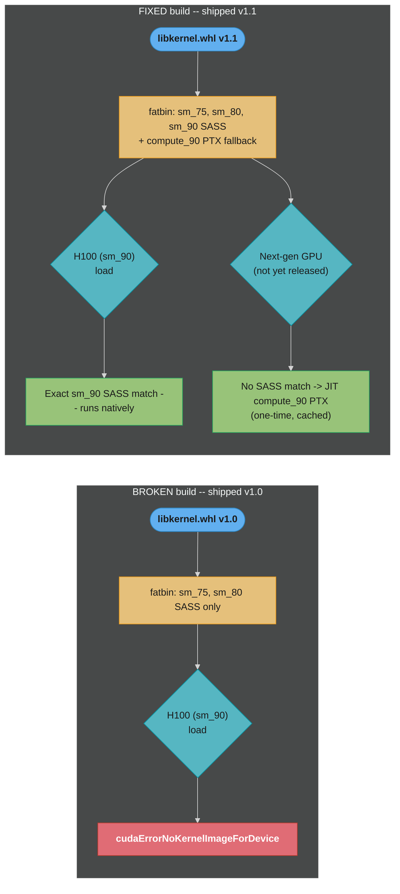

# CUDA Toolkit & Compilation

## 1. Concept Overview

Every CUDA program is really *two* programs glued together: ordinary host C++ that runs on the CPU, and device kernels that must be turned into machine code the GPU's streaming multiprocessors can execute. `nvcc`, the NVIDIA CUDA Compiler driver, is the tool that splits a `.cu` file into those two halves, hands the host half to a regular C++ compiler (gcc/clang/MSVC), and drives the device half through NVIDIA's own compilation pipeline: a front-end that lowers CUDA C++ to **PTX** (Parallel Thread Execution, a stable *virtual* instruction set), and `ptxas`, the backend assembler that lowers PTX to **SASS** (Streaming Assembly, the *real* machine code for one specific GPU generation). The two artifacts are bundled into a **fatbinary** — a container that can hold SASS for several concrete GPUs plus PTX for architectures that don't exist yet — and the CUDA driver picks (or JIT-compiles) the right one at program load time.

This module covers that whole toolchain: how `nvcc` invokes the two-pass compiler, the `compute_XX` (virtual) vs `sm_XX` (real) architecture model and the `-gencode` flags that target them, `__CUDA_ARCH__` conditional compilation for architecture-specific code paths, the CUDA Driver API vs the Runtime API, `nvrtc` for compiling kernels at process runtime, wiring it all up with CMake, and reading `ptxas`'s register/shared-memory report to catch performance problems before you ever launch a kernel.

---

## 2. Intuition

> **One-line analogy**: `nvcc` is a translator working for a diplomat who will speak at a conference next year in a city that hasn't finished building its convention center. PTX is the speech written in a formal, unambiguous language that any interpreter can work from; SASS is the same speech already translated into the specific dialect of whichever city ends up hosting. Ship both: the specific translation for the cities you know today, and the formal script so a local interpreter can produce a fresh translation for whatever city (GPU) shows up next.

**Mental model**: Nothing about CUDA compilation is a single pass. `nvcc` is an *orchestrator*, not a compiler itself — it splits `.cu` source into a host path (compiled by your system's C++ compiler) and a device path (compiled by NVIDIA's own NVVM/LLVM front end into PTX, then assembled by `ptxas` into SASS). PTX is deliberately a **virtual** ISA: it is stable across GPU generations the way Java bytecode is stable across JVM versions, so one PTX file can be JIT-compiled by the driver on a GPU that did not exist when the PTX was generated. SASS is the opposite: it is tied to one exact `sm_XX` and will not run, and often will not even assemble, against a different one. Compiling for the field means picking a set of `sm_XX` targets you know about today (embedded as ready-to-run SASS) and always keeping one `compute_XX` PTX around as a forward-compatible fallback the driver can JIT at load time.

**Why it matters**: An engineer who ships a CUDA binary or library into the field — a `.so`, a wheel, an inference SDK — cannot assume every user's GPU is the one in the CI machine. Get the `-gencode` list wrong and the *exact same binary* runs perfectly on an A100 and crashes with `cudaErrorNoKernelImageForDevice` on an H100, because there was no matching SASS and no PTX to fall back on. This is one of the most common "works on my machine" bugs in GPU software, and it is entirely a build-configuration problem, not a code problem.

**Key insight**: PTX and SASS are not two representations of the same tradeoff — they are on opposite ends of an *ahead-of-time vs just-in-time* spectrum, and a production build almost always wants **both**: real SASS for the architectures you can test today (zero JIT cost, fastest cold start), and one PTX (`compute_XX` for your newest supported virtual architecture) embedded as an insurance policy for every GPU generation released after you shipped.

---

## 3. Core Principles

- **Two source paths, one file.** `nvcc` runs a preprocessing step (`cudafe++`) that splits a single `.cu` file into a host-C++ translation unit and one or more device-code translation units; each takes a completely different compiler.
- **PTX is a virtual ISA.** It is NVIDIA's stable, architecture-independent intermediate representation for GPU code — analogous to LLVM IR or Java bytecode. PTX from `compute_75` can be JIT-compiled to run on `sm_90` hardware that postdates it by years, because the driver's JIT compiler (`ptxjitcompiler`) understands the mapping.
- **SASS is real machine code.** It is the literal instruction stream the SM's warp schedulers execute for one specific compute capability. It is not forward-compatible in general and is not guaranteed backward-compatible either.
- **`compute_XX` vs `sm_XX` are two different axes of the same `-gencode` flag.** `compute_XX` selects which PTX *virtual architecture* features are visible to the front end (what instructions are legal to emit); `sm_XX` selects which *real* GPU `ptxas` assembles SASS for. `-gencode arch=compute_80,code=sm_80` means "compile using Ampere-visible PTX features, assemble real SASS for exactly an Ampere `sm_80` part."
- **A fatbinary is a container, not a single blob.** One executable or `.so` can embed SASS for several `sm_XX` targets plus one or more PTX versions, all wrapped by the `fatbinary` tool and registered with the CUDA runtime via constructor functions `nvcc` injects automatically.
- **JIT is the fallback, not the default path.** At program load, the CUDA driver first looks for an exact or compatible SASS match already in the fatbinary. Only if none exists does it fall back to JIT-compiling an embedded PTX — and only if *no* PTX is present does it fail outright.
- **`__CUDA_ARCH__` exists only in the device compilation pass.** It is a preprocessor macro nvcc defines (to `100 × major + 10 × minor`, e.g. `800` for `sm_80`) once per `-gencode` target, letting one kernel source branch to different code paths per architecture; it is undefined during the host-code compilation pass.
- **Runtime API vs Driver API is a layering choice, not a performance choice.** The Runtime API (`cudart`, `<<<...>>>` syntax) is a convenience layer implemented on top of the lower-level Driver API (`cuda.h`, `cuLaunchKernel`); nearly everything you write uses the Runtime API, but understanding the Driver API underneath explains module loading, context management, and how tools like `nvrtc` hand off compiled code.
- **`nvrtc` moves compilation from build time to process runtime.** It compiles CUDA C++ source to PTX inside a running process, which is how Numba, CuPy's `RawModule`/`RawKernel`, and JIT frameworks generate GPU code from Python without ever invoking `nvcc` as a subprocess.

---

## 4. Types / Architectures / Strategies

**Compilation strategies, from least to most forward-compatible:**

1. **Single real target, no PTX** — `nvcc -arch=sm_90 ...`. Smallest binary, fastest to build, zero JIT overhead, but the binary is a hard-fail on any GPU that isn't `sm_90` (or a compatible variant within the same major family in some cases).
2. **Multiple real targets, no PTX** — several `-gencode arch=compute_XX,code=sm_XX` pairs. Runs natively (no JIT) on every listed GPU, still hard-fails on anything not listed.
3. **Multiple real targets + one PTX fallback** — the production-standard pattern: real SASS for every GPU you validated in CI, plus one `-gencode arch=compute_XX,code=compute_XX` entry (note: `code=compute_XX`, not `code=sm_XX`) for the newest architecture family you support, embedded as PTX so the driver can JIT it for GPUs released after your build.
4. **PTX-only** — `nvcc -arch=compute_XX -ptx ...` with no `code=sm_XX` at all. Maximum portability, guaranteed a JIT compile (and its latency) on every launch on a fresh machine, though the driver caches the JIT result after the first run.

```mermaid
quadrantChart
    title Arch-locked speed vs forward portability
    x-axis Arch-locked --> Forward-portable
    y-axis Slow first launch --> Fast first launch
    quadrant-1 Ideal: fast and portable
    quadrant-2 Portable, pays JIT once
    quadrant-3 Rare: fragile and slow
    quadrant-4 Fast, frozen to one GPU
    Single sm_XX, no PTX: [0.08, 0.95]
    Multiple sm_XX, no PTX: [0.30, 0.93]
    Multi sm_XX + PTX fallback: [0.75, 0.85]
    PTX-only: [0.95, 0.15]
```

Caption: real SASS buys instant native execution but zero reach beyond the listed architectures; PTX buys unlimited forward reach but pays a JIT compile — the production-standard row three (multiple `sm_XX` plus one `compute_XX` fallback) is the only strategy that lands near the ideal quadrant.

**Two compilation entry points:**

- **`nvcc` (ahead-of-time, from a `.cu` file or string)** — the standard build-time path: compile once, ship a binary/library.
- **`nvrtc` (just-in-time, from a C++ string at process runtime)** — compiles CUDA C++ directly to PTX inside your running process; no `.cu` file, no external `nvcc` process, no host-code path at all (nvrtc only ever sees the device-code half). Used by CuPy, Numba's CUDA target, and PyTorch's Triton/Inductor code paths.

**Two programming-model layers:**

- **CUDA Runtime API** (`cudart`) — `<<<grid, block>>>` launch syntax, `cudaMalloc`/`cudaMemcpy`, implicit context management. What essentially all application code uses.
- **CUDA Driver API** (`cuda.h`, linked against `libcuda.so`/`nvcuda.dll`, the driver shipped with the GPU driver itself) — explicit `cuCtxCreate`, `cuModuleLoadData` (load a PTX/cubin blob), `cuLaunchKernel`. Lower-level, no `<<<>>>` syntax, and the layer `nvrtc`-produced PTX is handed to for execution.

---

## 5. Architecture Diagrams

### The nvcc Compilation Pipeline



`nvcc` forks into a host path (any C++ compiler) and a device path (NVVM to PTX, `ptxas` to SASS) that only reconverge at the linker. The right half of the diagram is what happens *after* the binary ships: the driver only pays the JIT cost when no ready-made SASS matches the GPU it actually loaded on, and only fails outright when there is no PTX left to fall back to.

### `compute_XX` vs `sm_XX` at a Glance

```
Flag piece         Axis                What it controls                    Portable?
----------------   ------------------  -----------------------------------  ---------
arch=compute_XX     virtual (PTX)       which PTX instructions/features      yes — JIT-able
                                        the front end is allowed to emit     on any sm >= XX
code=sm_XX          real (SASS)         ptxas assembles actual machine       no — exactly
                                        code for exactly this GPU            that generation
code=compute_XX     virtual (PTX,       embeds PTX itself (not SASS) in      yes — this is
                     embedded)          the fatbinary for JIT fallback       the forward-compat slot

Example: -gencode arch=compute_80,code=sm_80
  -> use Ampere-level PTX features, assemble real Ampere SASS. Fast, but sm_80-only.

Example: -gencode arch=compute_90,code=compute_90
  -> use Hopper-level PTX features, embed as PTX (no SASS at all).
     Runs on sm_90 and later via JIT; will NOT run unmodified on sm_80 or earlier
     (compute_90 PTX can use instructions sm_80 hardware/JIT cannot support).
```

The shorthand `-arch=sm_80` (no explicit `-gencode`) is nvcc silently expanding to `-gencode arch=compute_80,code=sm_80` — real SASS only, **no PTX embedded**, which is exactly the gotcha in §10.

### Fatbinary Load: the Driver's SASS-or-JIT Decision



Caption: the driver only pays JIT cost on the middle branch — an exact SASS match runs natively for free, and the failure state is only reached when neither a matching cubin nor a PTX fallback exists in the fatbinary.

---

## 6. How It Works — Detailed Mechanics

### A Minimal Kernel, Compiled Two Ways

```cpp
// vecadd.cu
__global__ void vecAdd(const float* __restrict__ a,
                        const float* __restrict__ b,
                        float* __restrict__ c,
                        int n)
{
    int i = blockIdx.x * blockDim.x + threadIdx.x;
    if (i < n) {
        c[i] = a[i] + b[i];
    }
}
```

Compile just the device path to inspect the PTX nvcc's front end produces:

```bash
nvcc -arch=compute_80 -ptx vecadd.cu -o vecadd.ptx
```

The resulting PTX (trimmed of the version/target preamble comments) looks like this — this is the **virtual ISA**, still architecture-independent at the `compute_80` feature level:

```ptx
.version 8.4
.target sm_80
.address_size 64

.visible .entry _Z6vecAddPKfS0_Pfi(
	.param .u64 _Z6vecAddPKfS0_Pfi_param_0,
	.param .u64 _Z6vecAddPKfS0_Pfi_param_1,
	.param .u64 _Z6vecAddPKfS0_Pfi_param_2,
	.param .u32 _Z6vecAddPKfS0_Pfi_param_3
)
{
	.reg .pred 	%p<2>;
	.reg .f32 	%f<4>;
	.reg .b32 	%r<6>;
	.reg .b64 	%rd<11>;

	ld.param.u64 	%rd1, [_Z6vecAddPKfS0_Pfi_param_0];
	ld.param.u64 	%rd2, [_Z6vecAddPKfS0_Pfi_param_1];
	ld.param.u64 	%rd3, [_Z6vecAddPKfS0_Pfi_param_2];
	ld.param.u32 	%r2, [_Z6vecAddPKfS0_Pfi_param_3];
	mov.u32 	%r3, %ctaid.x;
	mov.u32 	%r4, %ntid.x;
	mov.u32 	%r5, %tid.x;
	mad.lo.s32 	%r1, %r3, %r4, %r5;
	setp.ge.s32 	%p1, %r1, %r2;
	@%p1 bra 	$L__BB0_2;

	cvta.to.global.u64 	%rd4, %rd1;
	mul.wide.s32 	%rd5, %r1, 4;
	add.s64 	%rd6, %rd4, %rd5;
	cvta.to.global.u64 	%rd7, %rd2;
	add.s64 	%rd8, %rd7, %rd5;
	ld.global.f32 	%f1, [%rd8];
	ld.global.nc.f32 	%f2, [%rd6];
	add.f32 	%f3, %f2, %f1;
	cvta.to.global.u64 	%rd9, %rd3;
	add.s64 	%rd10, %rd9, %rd5;
	st.global.f32 	[%rd10], %f3;

$L__BB0_2:
	ret;
}
```

Every step of the C++ source is visible: `mad.lo.s32` is the fused `blockIdx.x * blockDim.x + threadIdx.x`, `setp.ge.s32` + the predicated branch is the bounds check, `ld.global.nc.f32` is the `__restrict__`-enabled non-coherent (read-only cache) load. This PTX is **not yet real machine code** — it still needs `ptxas` to turn it into SASS for one specific `sm_XX`.

### From PTX to SASS, and Reading the Register Report

```bash
# Assemble the PTX into real SASS for an A100 (sm_80), and ask ptxas to report
# register/shared-memory usage per kernel -- do this on every kernel you tune.
nvcc -arch=sm_80 --ptxas-options=-v -c vecadd.cu -o vecadd.o
```

```
ptxas info    : 0 bytes gmem
ptxas info    : Compiling entry function '_Z6vecAddPKfS0_Pfi' for 'sm_80'
ptxas info    : Function properties for _Z6vecAddPKfS0_Pfi
    0 bytes stack frame, 0 bytes spill stores, 0 bytes spill loads
ptxas info    : Used 16 registers, 380 bytes cmem[0]
```

Read this every time you touch a hot kernel: `16 registers` bounds how many warps can be resident per SM (see [occupancy_and_launch_configuration](../occupancy_and_launch_configuration/) for the occupancy math this feeds); `0 bytes spill stores/loads` confirms the register allocator did not have to spill to slow local memory — a nonzero spill count here is a silent performance cliff that never shows up as a compiler error.

**What the formula is telling you.** `blocks_per_SM = register_file / (registers_per_thread x threads_per_block)` says: "the SM has one fixed drawer of registers, and every resident block takes its whole share out of that drawer before the next block can move in."

That is why `ptxas -v`'s register count is a *capacity* number, not a speed number. It never makes a single thread slower — it decides how many threads are allowed to be in flight at once, which is the only mechanism the GPU has for hiding a 400-800 cycle memory stall.

| Symbol | What it is |
|--------|------------|
| `registers_per_thread` | The number `ptxas -v` reports — `16` for `vecAdd` above, `48` for the case-study GEMV kernel |
| `threads_per_block` | Your launch configuration's block size, `256` in every example in this module |
| `register_file` | Physical registers per SM: **64K 32-bit registers (256 KB)**, a hardware constant |
| `blocks_per_SM` | How many blocks fit concurrently, limited by registers alone — floor division, no partial blocks |
| `max_warps_per_SM` | The separate hardware ceiling: **64 warps** (2048 threads) on `sm_80`. Occupancy is the *minimum* of the two limits |

**Walk one example.** Run both kernels in this module through the same arithmetic:

```
  vecAdd -- 16 registers/thread, 256 threads/block
    registers per block  =  16 x 256              =    4,096
    blocks by registers  =  65,536 / 4,096        =       16 blocks
    blocks by warp cap   =  2,048 threads / 256   =        8 blocks   <- BINDING
    resident warps       =  8 x (256/32)          =       64 warps
    occupancy            =  64 / 64               =     100%

  gemvTNK (the §14 kernel) -- 48 registers/thread, 256 threads/block
    registers per block  =  48 x 256              =   12,288
    blocks by registers  =  65,536 / 12,288       =        5 blocks   <- BINDING
    blocks by warp cap   =  2,048 / 256           =        8 blocks
    resident warps       =  5 x 8                 =       40 warps
    occupancy            =  40 / 64               =    62.5%
```

Two kernels, same block size, same hardware — and 32 extra registers per thread cost 37.5 percentage points of occupancy. Note that `vecAdd` is *not* register-limited at all: registers would allow 16 blocks, but the 2048-threads-per-SM ceiling caps it at 8, so shaving registers below 16 would buy exactly nothing. That asymmetry is why `-maxrregcount` is a scalpel and not a dial — it only helps on the kernel where the register line is the binding one.

Inspect the actual SASS instructions the GPU will execute (not PTX — this is post-`ptxas`):

```bash
# Disassemble the SASS embedded in an object file or fatbinary
cuobjdump -sass vecadd.o | head -30

# Or use the standalone disassembler on a raw cubin
nvdisasm vecadd.cubin
```

### `-gencode`, Fatbinaries, and the Forward-Compatibility Pattern

```bash
# WRONG for a shipped library: real SASS for one architecture only, no PTX.
# Runs great on an A100 (sm_80). Fails outright on an H100 (sm_90) or any GPU
# newer than the one you built for -- see the BROKEN example in Section 10.
nvcc -arch=sm_80 -O3 -o libkernel.so --shared -Xcompiler -fPIC vecadd.cu

# RIGHT for a shipped library: real SASS for every GPU generation you validated
# in CI, PLUS one embedded PTX (code=compute_90) as a JIT fallback for anything
# released after this build.
nvcc -gencode arch=compute_75,code=sm_75 \
     -gencode arch=compute_80,code=sm_80 \
     -gencode arch=compute_90,code=sm_90 \
     -gencode arch=compute_90,code=compute_90 \
     -O3 -o libkernel.so --shared -Xcompiler -fPIC vecadd.cu

# Inspect what actually landed in the fatbinary
cuobjdump --dump-elf libkernel.so | grep -E "arch|sm_"
cuobjdump -lelf libkernel.so
```

**In plain terms.** The build cost of a multi-arch fatbinary is `1 host pass + N device passes`, which says: "the host half of every `.cu` file is compiled once no matter what, and every extra `-gencode` entry you add buys you another full front-end-plus-`ptxas` run over all the device code."

This is the number that makes `-gencode` lists feel expensive in CI long before the binary feels large. Device compilation is not amortized across targets — architecture-specialized bodies (the `__CUDA_ARCH__` branches below) mean each target genuinely recompiles from source.

| Symbol | What it is |
|--------|------------|
| `N` | The count of `-gencode` entries, counting `code=sm_XX` and `code=compute_XX` separately |
| `host pass` | `cudafe++` split plus gcc/clang/MSVC on the host translation unit. Runs exactly once |
| `device pass` | NVVM front end (CUDA C++ -> PTX) plus `ptxas` (PTX -> SASS). Runs once per `code=sm_XX` |
| `PTX-only entry` | A `code=compute_XX` entry pays the NVVM front end but **skips `ptxas`** — cheaper than a real target |
| `artifacts` | What lands in the fatbinary: one cubin per `sm_XX`, one PTX blob per `compute_XX` |

**Walk one example.** Count the passes for the RIGHT build above, which has four `-gencode` entries:

```
  -gencode arch=compute_75,code=sm_75        -> NVVM + ptxas   -> 1 cubin
  -gencode arch=compute_80,code=sm_80        -> NVVM + ptxas   -> 1 cubin
  -gencode arch=compute_90,code=sm_90        -> NVVM + ptxas   -> 1 cubin
  -gencode arch=compute_90,code=compute_90   -> NVVM only      -> 1 PTX blob
  ------------------------------------------------------------------------
  host passes      : 1
  NVVM passes      : 4      (one per -gencode entry)
  ptxas passes     : 3      (only the real code=sm_XX targets)
  fatbin artifacts : 3 cubins + 1 PTX

  Compare the shorthand build:  nvcc -arch=sm_80
  host passes 1, NVVM 1, ptxas 1, artifacts 1 cubin + 0 PTX
  -> ~4x cheaper to build, and exactly the configuration that hard-fails in §10.
```

The relationship worth internalizing is that build time scales with `N` while *runtime* safety comes from only one of those entries — the `code=compute_XX` PTX blob, which is the cheapest entry in the list. Dropping real `sm_XX` targets to speed up CI is a legitimate tradeoff; dropping the PTX entry to speed up CI saves the least time and removes the most safety.

`-O3` (host-side optimization) and `--ptxas-options=-O3` (device-side, the default) both matter independently — the host optimizer and `ptxas`'s own optimizer operate on different code and can be tuned separately. Add `-lineinfo` for a build you intend to profile with Nsight Compute:

```bash
# -lineinfo correlates SASS instructions back to source lines for the profiler,
# without the heavy performance cost of full debug info (-G disables most
# optimizations and is 10-100x slower -- never benchmark a -G build).
nvcc -arch=sm_80 -O3 -lineinfo -c vecadd.cu -o vecadd.o
```

### `__CUDA_ARCH__` — Compiling Different Code per Architecture

`nvcc` invokes the device compilation pass **once per `-gencode` target**, defining `__CUDA_ARCH__` to `100 * major + 10 * minor` (e.g. `800` for `sm_80`, `900` for `sm_90`) on each pass. It is left **undefined** during the host-code compilation pass, so it can only be tested inside `__device__`/`__global__` code (or guarded code meant only to be seen by the device pass):

```cpp
__global__ void adaptiveKernel(float* data, int n)
{
    int i = blockIdx.x * blockDim.x + threadIdx.x;
    if (i >= n) return;

#if __CUDA_ARCH__ >= 800
    // This branch is compiled only into the sm_80/sm_90 cubins -- Ampere+
    // async-copy-eligible path, using the read-only-cache load intrinsic.
    data[i] = __ldg(&data[i]) * 2.0f;
#elif __CUDA_ARCH__ >= 700
    // Volta/Turing fallback -- no async copy available.
    data[i] = data[i] * 2.0f;
#else
    // Also reached on the host compilation pass in some code layouts --
    // never place device-only intrinsics here unguarded.
    data[i] = data[i] * 2.0f;
#endif
}
```

Each `-gencode` target produces its own PTX/SASS with a *different* body baked in for this kernel — the fatbinary literally contains architecture-specialized machine code side by side, and the driver's SASS-match step (Section 5) picks the one that matches at load time.

**What this actually says.** `__CUDA_ARCH__ = 100 x major + 10 x minor` means: "flatten the dotted compute capability into one integer so `#if` can compare it with `>=`."

The whole point of the encoding is that a preprocessor cannot compare `8.6 >= 8.0` — it only understands integers. Multiplying the major by 100 and the minor by 10 leaves enough room between generations that a numeric `>=` sorts architectures in exactly the order the hardware shipped in.

| Symbol | What it is |
|--------|------------|
| `major` | The compute capability's first digit — the GPU *generation* (7 = Volta/Turing, 8 = Ampere/Ada, 9 = Hopper, 10 = Blackwell) |
| `minor` | The second digit — the SKU variant inside that generation (`8.0` A100 vs `8.6` RTX 30xx vs `8.9` L40S) |
| `100 x major` | Generation weight. Guarantees any `9.x` part outranks every `8.x` part |
| `10 x minor` | Variant weight. Leaves the ones digit unused, so `860` and `800` never collide |
| `__CUDA_ARCH__` | The resulting integer, defined once **per `-gencode` target** during the device pass; undefined on the host pass |

**Walk one example.** Push the five generations from §5's reference table through it:

```
  target      major  minor    100 x major  +  10 x minor   =  __CUDA_ARCH__
  --------    -----  -----    -----------     ----------      -------------
  sm_75         7      5          700       +      50       =      750
  sm_80         8      0          800       +       0       =      800
  sm_86         8      6          800       +      60       =      860
  sm_90         9      0          900       +       0       =      900
  sm_100       10      0         1000       +       0       =     1000

  Now the guard  #if __CUDA_ARCH__ >= 800  reads as an ordinary integer test:

    sm_75 -> 750 >= 800 ?  NO   -> compiles the Volta/Turing fallback branch
    sm_80 -> 800 >= 800 ?  YES  -> compiles the Ampere+ __ldg path
    sm_86 -> 860 >= 800 ?  YES  -> same Ampere+ path (variant of the same gen)
    sm_90 -> 900 >= 800 ?  YES  -> same path, inherited by a newer generation
```

The last row is the property that makes the macro useful: a guard written once for Ampere keeps selecting the fast path on every *later* architecture automatically, because `100 x major` makes the integers monotonically increasing with hardware age. Encode the capability any other way — say `major * 10 + minor`, giving `86` for both `8.6` and a hypothetical `8.60` — and that ordering guarantee breaks.

### Driver API vs Runtime API

```cpp
// Runtime API -- what >95% of CUDA C++ code uses. Implicit context,
// <<<>>> launch syntax, cudaMalloc/cudaMemcpy.
float *d_a, *d_b, *d_c;
cudaMalloc(&d_a, bytes);
cudaMalloc(&d_b, bytes);
cudaMalloc(&d_c, bytes);
vecAdd<<<blocks, threads>>>(d_a, d_b, d_c, n);
cudaDeviceSynchronize();
```

```cpp
// Driver API -- explicit context + module + kernel handle, no <<<>>>.
// This is the layer that loads raw PTX/cubin blobs (e.g. nvrtc output)
// and is what libraries doing their own JIT dispatch actually call.
#include <cuda.h>

CUdevice   device;
CUcontext  context;
CUmodule   module;
CUfunction kernel;

cuInit(0);
cuDeviceGet(&device, 0);
cuCtxCreate(&context, 0, device);
cuModuleLoadData(&module, ptx_source_string);       // load PTX/cubin at runtime
cuModuleGetFunction(&kernel, module, "vecAdd");

void* args[] = { &d_a, &d_b, &d_c, &n };
cuLaunchKernel(kernel,
               blocks, 1, 1,      // grid dim
               threads, 1, 1,     // block dim
               0, nullptr,        // shared mem, stream
               args, nullptr);
```

### Both APIs Reach the Same GPU, Through Different Layers



Caption: the Runtime API call is convenience sugar that resolves into the exact same `cuLaunchKernel` the Driver API exposes directly — the only difference is who manages the context/module handles, not what ultimately reaches the SMs.

### `nvrtc` — Compiling Kernels at Process Runtime

`nvrtc` skips `nvcc` entirely: it is a library linked into your process that compiles a CUDA C++ string to PTX on the spot, using whatever compute capability the *currently attached* GPU reports — no `-gencode` list decided ahead of time. This is the mechanism underneath CuPy's `RawModule`, Numba's CUDA JIT target, and PyTorch Inductor's generated-kernel path:

```python
import cupy as cp

kernel_source = r"""
extern "C" __global__
void vec_add(const float* a, const float* b, float* c, int n) {
    int i = blockIdx.x * blockDim.x + threadIdx.x;
    if (i < n) c[i] = a[i] + b[i];
}
"""

# cupy.RawModule wraps nvrtc under the hood: the source above is compiled to
# PTX (then JIT-assembled to SASS by the driver) at *runtime*, targeting
# whichever GPU this process is actually attached to -- no ahead-of-time
# -gencode list, no separate .cu file, no nvcc subprocess.
module = cp.RawModule(code=kernel_source, options=("--use_fast_math",))
vec_add = module.get_function("vec_add")

n = 1 << 20
a = cp.random.rand(n, dtype=cp.float32)
b = cp.random.rand(n, dtype=cp.float32)
c = cp.empty_like(a)

threads = 256
blocks = (n + threads - 1) // threads
vec_add((blocks,), (threads,), (a, b, c, n))
```

**Read it like this.** `blocks = (n + threads - 1) / threads` is integer *ceiling* division — "launch enough whole blocks to cover every element, and accept that the last block is usually only partly useful."

The `+ threads - 1` is the whole trick: plain integer division truncates, so `n / threads` would launch too few blocks and silently leave the tail of the array unprocessed. Adding one less than the divisor forces any nonzero remainder to round the quotient up.

| Symbol | What it is |
|--------|------------|
| `n` | Element count. `1 << 20` = 1,048,576 in the CuPy example above |
| `threads` | Threads per block, `256` here — the launch-configuration knob you choose |
| `threads - 1` | The bias term. Large enough to push any remainder over the next integer, small enough never to add a spurious block |
| `blocks` | Grid size. Total threads launched is `blocks x threads`, which is `>= n`, never `< n` |
| `if (i < n)` | The bounds check inside the kernel — mandatory, because `blocks x threads` overshoots whenever `n` is not a multiple of `threads` |

**Walk one example.** Contrast the exact-multiple case with the ragged one:

```
  n = 1,048,576  (= 1 << 20),  threads = 256
    (1,048,576 + 255) / 256  =  1,048,831 / 256  =  4,096  blocks   (truncated)
    threads launched         =  4,096 x 256      =  1,048,576
    idle threads             =  1,048,576 - n    =          0   <- exact fit

  n = 1,000,000  (not a multiple of 256),  threads = 256
    plain division  1,000,000 / 256  =  3,906 blocks -> covers   999,936
                                                        MISSES        64 elements
    ceiling         (1,000,000 + 255) / 256 = 3,907 blocks -> covers 1,000,192
    idle threads    1,000,192 - 1,000,000    =   192 threads do nothing but
                                                 evaluate  if (i < n)  and return
```

192 wasted threads out of 1,000,192 is 0.02% — a rounding error. The 64 *missed* elements in the truncating version are a correctness bug that produces uninitialized output with no error message. That asymmetry is why every kernel in this section pairs ceiling division at the launch site with a bounds check in the kernel body: the launch always overshoots, and the guard absorbs the overshoot.

The tradeoff is paid once per process (or once per distinct kernel signature, if cached): the first launch pays nvrtc's compile time plus the driver's JIT time, which can be tens to hundreds of milliseconds for a nontrivial kernel — acceptable for a long-lived server process, poor for a short CLI tool invoked thousands of times.

### Wiring It Up With CMake

```cmake
cmake_minimum_required(VERSION 3.24)
project(vecadd LANGUAGES CXX CUDA)

find_package(CUDAToolkit REQUIRED)

add_executable(vecadd vecadd.cu)

# Modern CMake (>= 3.18) replaces hand-written -gencode flags with the
# CUDA_ARCHITECTURES property. The "-real"/"-virtual" suffixes map directly
# onto code=sm_XX (real SASS) vs code=compute_XX (embedded PTX):
#   "80-real"    -> -gencode arch=compute_80,code=sm_80
#   "90-real"    -> -gencode arch=compute_90,code=sm_90
#   "90-virtual" -> -gencode arch=compute_90,code=compute_90  (JIT fallback)
set_target_properties(vecadd PROPERTIES
    CUDA_ARCHITECTURES "80-real;90-real;90-virtual"
    CUDA_SEPARABLE_COMPILATION ON
)

target_compile_options(vecadd PRIVATE
    $<$<COMPILE_LANGUAGE:CUDA>:-O3 --ptxas-options=-v>
)

target_link_libraries(vecadd PRIVATE CUDA::cudart)
```

`CUDA_SEPARABLE_COMPILATION` enables device-code linking across multiple `.cu` translation units (needed once you split kernels across files, or use dynamic parallelism); omit it for single-TU projects to save build time.

### Checking Driver/Runtime Compatibility at Startup

The CUDA Toolkit version you compiled against and the GPU driver version installed on the target machine are two different numbers, and a well-behaved binary checks both before launching any kernel:

```cpp
#include <cuda_runtime.h>
#include <cstdio>

#define CUDA_CHECK(call)                                                     \
    do {                                                                     \
        cudaError_t err = (call);                                           \
        if (err != cudaSuccess) {                                           \
            fprintf(stderr, "CUDA error %s:%d: %s\n", __FILE__, __LINE__,    \
                    cudaGetErrorString(err));                                \
            std::exit(1);                                                    \
        }                                                                    \
    } while (0)

int main() {
    int runtimeVersion = 0, driverVersion = 0;
    CUDA_CHECK(cudaRuntimeGetVersion(&runtimeVersion));  // toolkit this binary was built against
    CUDA_CHECK(cudaDriverGetVersion(&driverVersion));    // driver actually installed on this machine

    // CUDA's driver-side compatibility model is generally: a newer driver can
    // run a binary built against an older toolkit (backward compatible), but
    // an older driver usually cannot run a binary built against a much newer
    // toolkit's runtime unless the "CUDA Forward Compatibility" package is
    // installed (common on data-center GPUs, e.g. A100/H100 in locked-down
    // clusters that can't upgrade the driver on demand).
    printf("Built against runtime %d, running on driver %d\n",
           runtimeVersion, driverVersion);

    int deviceCount = 0;
    CUDA_CHECK(cudaGetDeviceCount(&deviceCount));
    for (int dev = 0; dev < deviceCount; ++dev) {
        cudaDeviceProp prop{};
        CUDA_CHECK(cudaGetDeviceProperties(&prop, dev));
        printf("  device %d: %s, compute capability %d.%d\n",
               dev, prop.name, prop.major, prop.minor);
    }
    return 0;
}
```

This is also where the `compute_XX`/`sm_XX` decisions in Sections 5-6 get validated at runtime: `prop.major`/`prop.minor` is the compute capability the fatbinary-matching logic in the driver uses to pick a cubin or fall back to JIT-compiling the embedded PTX.

---

## 7. Real-World Examples

- **PyTorch wheels** are built with an explicit `TORCH_CUDA_ARCH_LIST` (e.g. `"7.5;8.0;8.6;9.0+PTX"`) that expands to exactly the pattern in Section 6 — real SASS for each listed compute capability, plus a `+PTX` suffix on the newest one to embed a JIT fallback for future GPUs the wheel author never tested against.
- **NVIDIA's own cuBLAS/cuDNN shared libraries** ship fatbinaries containing SASS for every currently-supported GPU generation simultaneously, which is a large part of why those `.so` files are hundreds of megabytes.
- **llama.cpp's CUDA backend** exposes a `CMAKE_CUDA_ARCHITECTURES` build flag so users self-compiling for their exact card (e.g. a single `sm_86` RTX 3090) get a smaller, faster-to-build binary than the multi-arch releases.
- **TensorRT** takes the opposite extreme from PTX portability: it builds an "engine" file that is SASS-specific to the exact GPU (sometimes the exact SKU) it was built on, trading all forward/cross-device portability for maximum optimization — engines are explicitly documented as non-portable across GPU models.
- **The NVIDIA driver's JIT cache** at `~/.nv/ComputeCache` (Linux) or `%APPDATA%\NVIDIA\ComputeCache` (Windows) persists JIT-compiled SASS across process runs, so the "PTX fallback" cost in the forward-compatibility pattern is paid once per machine, not once per launch.
- **Numba's `@cuda.jit`** decorator and CuPy's `ElementwiseKernel`/`RawKernel` are both `nvrtc`-backed — Python-side GPU kernel authoring exists specifically because `nvrtc` moved compilation from a build-time step to an importable runtime API.
- **NVIDIA's CUDA Forward Compatibility packages** let locked-down data-center clusters run binaries built against a newer CUDA toolkit than the installed driver strictly supports, without a disruptive driver upgrade — common on A100/H100 clusters where driver upgrades require a maintenance window.
- **Clang's native CUDA support** (`clang -x cuda`) is a second, independent front end that can compile the same `.cu` sources `nvcc` does, emitting PTX directly without NVIDIA's NVVM step — used by some ML frameworks that want a single compiler toolchain across CPU and GPU code paths.

---

## 8. Tradeoffs

| Strategy | Binary size | Cold-start cost | Forward compatibility | Best for |
|----------|------------|-----------------|------------------------|----------|
| Single `sm_XX`, no PTX | Smallest | None (native SASS) | None — hard fail on other GPUs | Internal tools on known, fixed hardware |
| Multiple `sm_XX`, no PTX | Large (N cubins) | None on listed GPUs | None beyond the list | CI-validated deployment to a known fleet |
| Multiple `sm_XX` + one `compute_XX` PTX | Largest | None on listed GPUs; JIT (ms-scale, one-time, cached) on newer ones | Yes, for GPUs newer than the newest listed | Shipped SDKs / libraries / public wheels |
| PTX-only (`compute_XX`, no SASS) | Smallest device section | JIT on *every* first run on a machine | Maximum — any GPU the driver's JIT supports | Source-like portable distribution, rarely used for perf-critical code |

| API layer | Abstraction | Typical caller | Kernel launch syntax |
|-----------|------------|-----------------|------------------------|
| Runtime API (`cudart`) | High — implicit context/module management | Nearly all application CUDA C++ | `kernel<<<grid, block>>>(args)` |
| Driver API (`cuda.h`) | Low — explicit context, module, function handles | Frameworks loading PTX/cubin dynamically | `cuLaunchKernel(fn, ...)` |

| Compile path | When it runs | Where the code comes from | Cost model |
|-------------|---------------|----------------------------|------------|
| `nvcc` (AOT) | Build time | `.cu` file, known at build | Paid once, by the build machine |
| `nvrtc` (JIT) | Process runtime | C++ string, constructed/loaded at runtime | Paid per process (cacheable per kernel signature) |

---

## 9. When to Use / When NOT to Use

### Deciding Which `-gencode` Targets to Ship



Caption: the only branch that reaches a fully safe outcome is the one that always adds a `compute_XX` PTX fallback — skipping it (the `ONE` branch) is the exact shape of the BROKEN example in §10.

**Embed PTX fallback (`code=compute_XX`) when:**
- You are shipping a library, SDK, or wheel to users whose exact GPU you cannot enumerate in CI.
- You want the binary to keep working on GPU generations released after your last build.

**Skip the PTX fallback (real SASS only) when:**
- You control the exact deployment hardware (a fixed on-prem cluster, a known cloud instance type) and can rebuild on demand when hardware changes.
- Binary size is tightly constrained and JIT fallback is an acceptable degraded mode you've explicitly decided against.

**Use `nvrtc` / runtime compilation when:**
- The kernel body itself depends on runtime information (a tensor shape, a fused-op graph decided by a tracing JIT like `torch.compile`, an interactively-authored Python kernel in CuPy/Numba).
- You are building a long-lived server process where the one-time JIT/compile cost amortizes across millions of subsequent launches.

**Prefer ahead-of-time `nvcc` when:**
- The kernel set is fixed and known at build time (the overwhelming majority of hand-written CUDA C++ libraries).
- Startup latency matters and you cannot tolerate even a one-time JIT pause (real-time systems, CLI tools invoked per-request).

**Reach for the Driver API directly (instead of the Runtime API) only when:**
- You are building a framework that must load PTX/cubin blobs it did not compile itself (exactly `nvrtc`'s use case), or need explicit multi-context/multi-thread control the Runtime API's implicit context does not expose.

---

## 10. Common Pitfalls

- **BROKEN: compiling for one architecture with no PTX fallback, then running on newer hardware.**

```bash
# BROKEN -- ships to production with only sm_70 (Volta) real SASS and no PTX.
nvcc -arch=sm_70 -O3 -o libkernel.so --shared -Xcompiler -fPIC vecadd.cu
```

  On an H100 (`sm_90`), the driver finds no matching SASS in the fatbinary and no PTX to JIT from, and the launch fails at runtime with:

```
CUDA error: no kernel image is available for execution on the device
(cudaErrorNoKernelImageForDevice)
```

  The build succeeded, unit tests on the Volta CI runner passed, and the failure only surfaces on hardware the author never tested — a classic "worked in CI, broke in prod" GPU bug.

```bash
# FIX -- embed real SASS for every architecture actually validated, plus one
# PTX (code=compute_XX, not code=sm_XX) as a JIT fallback for anything newer.
nvcc -gencode arch=compute_70,code=sm_70 \
     -gencode arch=compute_80,code=sm_80 \
     -gencode arch=compute_90,code=sm_90 \
     -gencode arch=compute_90,code=compute_90 \
     -O3 -o libkernel.so --shared -Xcompiler -fPIC vecadd.cu
```

  Now an H100 falls back to JIT-compiling the `compute_90` PTX (a one-time, driver-cached cost) instead of failing outright, and any future architecture with compute capability >= 9.0 gets the same safety net.

- **Assuming `-arch=sm_XX` alone embeds a PTX fallback.** It does not — `nvcc -arch=sm_80` is shorthand for `-gencode arch=compute_80,code=sm_80` only. If you want both the real SASS *and* a PTX fallback for the same virtual architecture, you must add a second explicit `-gencode arch=compute_80,code=compute_80`.
- **Forgetting to update the PTX target when adding new hardware support.** Adding `-gencode arch=compute_90,code=sm_90` for H100 support but leaving the fallback PTX at the old `compute_80` means GPUs newer than Hopper can still JIT from `compute_80` PTX, but miss any Hopper-only PTX instruction the rest of your build now emits — keep the fallback PTX at your *newest* supported virtual architecture.
- **Benchmarking a `-G` (device debug) build.** `-G` disables nearly all `ptxas`/NVVM optimizations to preserve debuggability and can be 10-100x slower than a `-O3` release build; a debug build's timings are meaningless for performance decisions.
- **Ignoring `ptxas -v` output.** Register/shared-memory usage is only visible with `--ptxas-options=-v`; without it, a kernel can silently regress to register spilling (`spill stores`/`spill loads` > 0) after an innocuous code change, quietly cutting occupancy and throughput with no compiler warning.
- **Using `__CUDA_ARCH__` unguarded in code the host compiler also sees.** Because the macro is undefined during the host-code pass, an `#if __CUDA_ARCH__ >= 800` guarding a device-only intrinsic with no `#else` for the host pass can leave that branch's *absence* silently compiled out on the host — usually harmless, but referencing a device intrinsic (e.g. `__ldg`) directly without any `__CUDA_ARCH__` guard breaks host compilation outright.
- **Shipping unstripped host debug symbols alongside multi-arch fatbinaries.** Combining `-g` (host debug info) with several `-gencode` SASS targets produces bloated binaries; strip host symbols for release builds even when you intentionally keep `-lineinfo` for device-side profiling.

---

## 11. Technologies & Tools

| Tool | Purpose | Notes |
|------|---------|-------|
| `nvcc` | CUDA compiler driver | Orchestrates host/device split, NVVM front end, `ptxas`, linking |
| `ptxas` | PTX-to-SASS assembler | Invoked by `nvcc`; `--ptxas-options=-v` reports registers/spills/shared memory |
| `nvrtc` | Runtime CUDA C++ -> PTX compiler | Library, not a CLI; underlies CuPy/Numba/PyTorch JIT kernel paths |
| `cuobjdump` | Inspect fatbinaries/object files | `-sass` for disassembly, `--dump-elf`/`-lelf` for embedded arch list |
| `nvdisasm` | Standalone SASS disassembler | Works directly on `.cubin` files, independent of `cuobjdump` |
| `fatbinary` | Bundles multiple cubins/PTX | Invoked internally by `nvcc`; rarely called directly |
| CMake `CUDA_ARCHITECTURES` | Modern build-system arch targeting | `-real`/`-virtual` suffixes map to `code=sm_XX`/`code=compute_XX` |
| Nsight Compute / Nsight Systems | Profiling | Consumes `-lineinfo` builds for source correlation |
| CUDA Driver API (`cuda.h`) | Low-level context/module/launch | What `nvrtc`-compiled PTX is ultimately loaded and launched through |

---

## 12. Interview Questions with Answers

**Q: What happens if you compile a CUDA binary only for `sm_70` and run it on an `sm_90` GPU with no PTX embedded?**
The launch fails at runtime with `cudaErrorNoKernelImageForDevice` ("no kernel image is available for execution on the device"). The driver found no SASS matching `sm_90` in the fatbinary and no PTX to JIT-compile as a fallback, even though the build itself succeeded and any testing on `sm_70` hardware passed cleanly.

**Q: What is the difference between PTX and SASS?**
PTX (Parallel Thread Execution) is NVIDIA's stable, architecture-independent virtual instruction set; SASS (Streaming Assembly) is the real machine code for one specific `sm_XX` GPU generation. PTX can be JIT-compiled by the driver to run on GPU generations that postdate it, while SASS is tied to the exact architecture `ptxas` assembled it for.

**Q: What is a fatbinary, and why would you want SASS for multiple architectures inside one?**
A fatbinary is a single container bundling SASS `cubin`s for several concrete `sm_XX` targets plus optionally one or more PTX versions, all embedded in one executable or shared library. Shipping SASS for every GPU generation you've validated avoids JIT overhead on those exact GPUs, while an embedded PTX still covers anything newer.

**Q: What is the practical difference between `-gencode arch=compute_80,code=sm_80` and `-gencode arch=compute_80,code=compute_80`?**
The first assembles real SASS machine code for exactly an `sm_80` GPU using Ampere-level PTX features; the second embeds the PTX itself (no SASS) so the driver can JIT-compile it for `sm_80` or any newer-generation GPU. The `code=` half of the flag is what decides real-vs-virtual output, not `arch=`.

**Q: Why does `nvcc -arch=sm_80` alone not give you a forward-compatible binary?**
That shorthand expands only to `-gencode arch=compute_80,code=sm_80`, which produces real `sm_80` SASS and embeds no PTX at all. Forward compatibility requires an additional explicit `-gencode arch=compute_XX,code=compute_XX` entry to embed a JIT-able PTX fallback.

**Q: What does `__CUDA_ARCH__` do, and when is it undefined?**
It is a preprocessor macro `nvcc` defines during each device-code compilation pass, set to `100 * major + 10 * minor` (e.g. `800` for `sm_80`), letting a single kernel source branch to different code per target architecture. It is undefined during the host-code compilation pass, so guarding device-only intrinsics with it protects the host build but only if there's no unguarded fallback path referencing them directly.

**Q: Why does `nvcc` invoke two separate compilers for one `.cu` file?**
`cudafe++` splits the file into a host C++ translation unit and one or more device translation units. The host unit is compiled by your system compiler (gcc/clang/MSVC); the device units go through NVIDIA's own NVVM/LLVM-based front end down to PTX, then `ptxas` down to SASS — the two paths only reconverge at the final link step, which is why host and device code can use different optimization flags entirely.

**Q: What does `ptxas --ptxas-options=-v` tell you and why check it on every hot kernel?**
It reports the register count, shared-memory usage, and any register spill stores/loads for each compiled kernel. A rising register count or nonzero spill count silently caps how many warps can be resident per SM (lower occupancy) with no compiler error or warning, so it is the only way to catch a performance regression introduced by an innocuous-looking code change.

**Q: What is `nvrtc` and when would you reach for it over ahead-of-time `nvcc`?**
`nvrtc` is a library that compiles CUDA C++ source strings to PTX at process runtime rather than at build time, with no `.cu` file and no `nvcc` subprocess involved. It's the right tool when the kernel body itself depends on information only known at runtime (a tensor shape, a traced computation graph) — it's what CuPy's `RawModule`, Numba's `@cuda.jit`, and PyTorch's Inductor-generated kernels use under the hood.

**Q: What is the difference between the CUDA Driver API and the Runtime API?**
The Runtime API (`cudart`, `<<<grid,block>>>` syntax) is a convenience layer with implicit context management that essentially all application code uses. The Driver API (`cuda.h`, `cuCtxCreate`/`cuModuleLoadData`/`cuLaunchKernel`) is the lower-level layer underneath it, with explicit context and module handles, and is what dynamically loads PTX/cubin blobs — including `nvrtc` output — at runtime.

**Q: Why is a `-G` (debug) build unsuitable for performance measurement?**
`-G` disables nearly all of NVVM's and `ptxas`'s optimizations to preserve full debuggability. The resulting kernel can run 10-100x slower than the equivalent `-O3` release build, so any timing taken from a `-G` binary says nothing about production performance.

**Q: What does `-lineinfo` do, and is it safe to use in a profiled production-adjacent build?**
`-lineinfo` embeds source-line correlation metadata into the SASS so Nsight Compute/Systems can map hot instructions back to source lines, without disabling optimizations the way `-G` does. It carries negligible runtime overhead, so it is standard practice to keep it on for any build you intend to profile, release or otherwise.

**Q: What tools let you inspect the actual SASS instructions inside a compiled binary?**
`cuobjdump -sass <binary>` disassembles the SASS embedded in an object file, executable, or shared library, and `nvdisasm` does the same directly against a standalone `.cubin` file. `cuobjdump --dump-elf`/`-lelf` additionally lists which `sm_XX`/`compute_XX` targets a fatbinary actually contains, which is the fastest way to audit whether a shipped library has the PTX-fallback safety net at all.

**Q: How does CMake's modern `CUDA_ARCHITECTURES` property map onto raw `-gencode` flags?**
Each architecture string carries a `-real` or `-virtual` suffix that maps directly to real SASS or embedded PTX. `"80-real"` expands to `-gencode arch=compute_80,code=sm_80`, while `"90-virtual"` expands to `-gencode arch=compute_90,code=compute_90` — listing `"80-real;90-real;90-virtual"` reproduces the standard forward-compatible pattern of real SASS for two known GPUs plus a JIT fallback beyond Hopper.

**Q: Where does the CUDA driver cache a JIT-compiled kernel, and why does that matter for cold-start latency?**
JIT output from PTX-to-SASS compilation is cached on disk, keyed by driver version and PTX content, so the JIT cost is paid once per machine rather than once per process launch. The cache lives at `~/.nv/ComputeCache` on Linux (an equivalent `%APPDATA%` path on Windows); the first run on a fresh machine, or after a driver upgrade invalidates the cache, pays the JIT latency, and every subsequent run reuses the cached SASS.

**Q: Why would a library deliberately ship PTX-only, with no real SASS for any architecture?**
PTX-only maximizes portability, because the driver's JIT compiler can target any GPU generation it supports, including ones released after the library shipped. The cost is paying a JIT compile on literally every first launch on every machine — a reasonable tradeoff for source-like portable distribution or infrequently-launched tools, but a poor one for latency-sensitive or performance-critical shipped kernels, where the standard real-SASS-plus-one-PTX-fallback pattern is preferred.

**Q: Does a newer GPU driver always let you run a binary built against an older CUDA toolkit?**
Generally yes — the CUDA driver's compatibility model is backward compatible, so a newer driver can run binaries and PTX built against older toolkit versions. The harder direction is the reverse: an older driver running a binary built against a much newer toolkit's runtime may not work unless NVIDIA's "CUDA Forward Compatibility" package is installed, which matters most on locked-down data-center clusters that cannot upgrade the driver on demand.

**Q: What do `cudaRuntimeGetVersion` and `cudaDriverGetVersion` each tell you, and why check both at startup?**
`cudaRuntimeGetVersion` reports the CUDA Toolkit version the binary itself was built against, while `cudaDriverGetVersion` reports the version of the GPU driver actually installed on the machine. Checking both at startup — alongside `cudaGetDeviceProperties`'s reported compute capability — lets a program fail with a clear diagnostic instead of a confusing runtime error when the two are mismatched in the unsupported direction.

---

## 13. Best Practices

1. **Always embed at least one PTX fallback** (`code=compute_XX` at your newest supported virtual architecture) in anything shipped outside a fully controlled, rebuild-on-demand deployment.
2. **List real `sm_XX` SASS targets for every GPU generation validated in CI**, so the common case never pays JIT latency; reserve the PTX fallback for the long tail of unlisted hardware.
3. **Run every hot kernel through `--ptxas-options=-v`** and track register count / spill stores across changes — treat a new spill as a build-breaking regression, not a warning to ignore.
4. **Keep `-lineinfo` on for any build you intend to profile**; never benchmark a `-G` build, and strip host debug symbols from release binaries.
5. **Prefer CMake's `CUDA_ARCHITECTURES` `-real`/`-virtual` syntax** over hand-maintained `-gencode` strings — it is less error-prone and self-documents which targets get SASS vs PTX-only.
6. **Reach for `nvrtc` only when the kernel genuinely depends on runtime-known information**; prefer ahead-of-time `nvcc` for a fixed, known kernel set to avoid paying compile latency on every process start.
7. **Audit shipped fatbinaries with `cuobjdump --dump-elf`** before a release — confirm the architecture list matches what your support matrix (and the PTX-fallback policy) actually promises.
8. **Guard every `__CUDA_ARCH__`-conditioned device intrinsic with an explicit fallback branch**, and never reference a device-only intrinsic unguarded in code the host compiler also parses.

---

## 14. Case Study

**Scenario:** An ML-infrastructure team ships a closed-source CUDA inference kernel library as a Python wheel to external customers running a mix of GPUs across three hardware generations: T4 (`sm_75`, common in older cloud instances), A100 (`sm_80`, the current internal validation fleet), and — a few months after the initial release — customers begin reporting crashes on newly rented H100 (`sm_90`) instances the team never had in CI at ship time.

**Diagram — the two builds side by side:**



The v1.0 fatbinary only had real SASS for the two GPUs the team owned at build time; H100 customers hit a hard failure with no fallback. The v1.1 fatbinary adds real `sm_90` SASS (found during the incident, once the team provisioned an H100 instance to reproduce it) *and* a `compute_90` PTX fallback so the *next* unreleased architecture degrades to a one-time JIT instead of crashing again.

**BROKEN build (what shipped in v1.0):**

```bash
nvcc -gencode arch=compute_75,code=sm_75 \
     -gencode arch=compute_80,code=sm_80 \
     -O3 --ptxas-options=-v \
     -shared -Xcompiler -fPIC \
     -o libkernel.so kernels.cu
```

Customer-reported failure on H100:

```
RuntimeError: CUDA error: no kernel image is available for execution on the device
CUDA kernel errors might be asynchronously reported at some other API call
(cudaErrorNoKernelImageForDevice)
```

**FIX (v1.1):**

```bash
nvcc -gencode arch=compute_75,code=sm_75 \
     -gencode arch=compute_80,code=sm_80 \
     -gencode arch=compute_90,code=sm_90 \
     -gencode arch=compute_90,code=compute_90 \
     -O3 --ptxas-options=-v \
     -shared -Xcompiler -fPIC \
     -o libkernel.so kernels.cu
```

```
ptxas info    : Compiling entry function '_ZN6kernel7gemvTNKEPKfS1_Pfii' for 'sm_90'
ptxas info    : Function properties for _ZN6kernel7gemvTNKEPKfS1_Pfii
    0 bytes stack frame, 0 bytes spill stores, 0 bytes spill loads
ptxas info    : Used 48 registers, 4096 bytes smem, 400 bytes cmem[0]
```

**Metrics after the fix:**

| Metric | Before (v1.0) | After (v1.1) |
|--------|---------------|--------------|
| H100 launch result | Hard crash, 100% of calls | Native `sm_90` SASS, 0 crashes |
| Fatbinary size | 38 MB | 61 MB (+ `sm_90` cubin + PTX) |
| Cold-start on a future (untested) GPU | Hard crash | One-time JIT (~450 ms measured for this kernel set), cached thereafter in `~/.nv/ComputeCache` |
| Customer-visible incidents (30 days) | 14 tickets | 0 tickets |

**Put simply.** `fatbin_size = host_code + (N_sass x cubin_size) + (N_ptx x ptx_size)` says: "the binary grows one full copy of your compiled device code for every real architecture you list, and one much smaller copy for the PTX fallback."

Fatbinary growth is *linear in the number of real targets*, which is what makes the "just add every architecture" instinct expensive at distribution scale. The PTX entry is the outlier: it is the cheapest row in the sum and the only one that covers hardware you have never seen.

| Symbol | What it is |
|--------|------------|
| `host_code` | The CPU-side half of the library. Constant regardless of the `-gencode` list — small here, since this is a kernel library |
| `N_sass` | Count of `code=sm_XX` targets. **2** in v1.0 (`sm_75`, `sm_80`), **3** in v1.1 (`+ sm_90`) |
| `cubin_size` | Compiled SASS for one architecture. The dominant term, and roughly equal across same-era targets |
| `N_ptx` | Count of `code=compute_XX` targets. **0** in v1.0, **1** in v1.1 |
| `ptx_size` | The embedded PTX blob — virtual ISA, not machine code, so materially smaller than a cubin |

**Walk one example.** Solve the two shipped builds for the per-target cost, treating `host_code` as negligible against the device sections:

```
  v1.0:  38 MB  =  2 cubins                     ->  cubin_size = 38 / 2   = 19 MB
  v1.1:  61 MB  =  3 cubins  +  1 PTX blob
                =  3 x 19  +  ptx_size          ->  ptx_size   = 61 - 57  =  4 MB

  Sanity-check the reported growth:
    delta        =  61 - 38                     =  23 MB
    accounted by =  one sm_90 cubin (19) + one compute_90 PTX (4)  =  23 MB   OK

  What each additional entry would cost from here:
    + a 4th real sm_XX target   ->  61 + 19  =  80 MB   (+31%)
    + a 2nd compute_XX PTX      ->  61 +  4  =  65 MB   (+7%)

  Relative sizes:  ptx_size / cubin_size  =  4 / 19  =  21%
```

The 21% figure is the answer to discussion question 3. Adding the fourth real architecture costs nearly five times what the PTX fallback cost — and the fallback is the entry that covers *every* future GPU, while the fourth cubin covers exactly one. For a wheel pulled by thousands of customers, that ratio argues for a short, CI-validated `sm_XX` list plus one always-current PTX entry, rather than an ever-growing list of real targets.

**Stated plainly.** The JIT fallback's true cost is `total_JIT_cost = jit_time x cache_misses`, not `jit_time x launches` — "you pay the compile once per machine per cache generation, not once per run, and the whole economics of the PTX fallback lives in that distinction."

Without the on-disk cache the fallback strategy would be indefensible for anything short-lived. With it, the ~450 ms is a one-time provisioning cost that disappears into the noise of a machine's lifetime.

| Symbol | What it is |
|--------|------------|
| `jit_time` | Driver JIT of the embedded PTX to SASS — **~450 ms** measured for this kernel set |
| `cache_misses` | How many times the JIT actually runs. Normally **1** per machine, thanks to `~/.nv/ComputeCache` |
| `launches` | Process starts over that machine's lifetime — the number the cost is amortized *across* |
| `~/.nv/ComputeCache` | The persistent on-disk JIT cache. Keyed on driver version, so a driver upgrade invalidates it |
| `amortized_cost` | `total_JIT_cost / launches` — what any individual run actually experiences |

**Walk one example.** Compare the cached reality against the hypothetical uncached case:

```
  CACHED (what actually happens):
    cache misses over a machine's life   =  1
    total JIT cost                       =  1 x 450 ms   =    450 ms
    amortized over 1,000 process starts  =  450 / 1,000  =   0.45 ms per run
    as a share of one 1-hour server run  =  0.450 / 3,600 s  =  0.0125%

  UNCACHED (if ComputeCache were disabled or wiped each run):
    total JIT cost over 1,000 starts     =  1,000 x 450 ms  =  450 s  =  7.5 min
    -> 1,000x worse, and now the dominant cost of a short-lived CLI tool

  DRIVER UPGRADE (the discussion-question-4 case):
    cache is keyed on driver version -> upgrade invalidates it
    cache misses  =  1 per machine PER DRIVER VERSION
    a fleet of 500 nodes upgrading drivers 4x/year:
      500 x 4 x 450 ms  =  900 s  =  15 min of aggregate one-time JIT per year
```

The last block is the practical lesson: the cache makes JIT cheap, but it does not make it free forever. A fleet that auto-updates drivers silently re-pays the cost on every node after every upgrade — visible as a one-time latency spike on the first request each node serves post-upgrade, which is exactly the kind of thing that gets misdiagnosed as a cold-start or network problem.

**Discussion questions:**
1. Why did the team's own CI, which only had T4 and A100 runners, never catch this before customers hit it on H100?
2. If the PTX fallback in v1.1 is targeted at `compute_90`, will it protect against a hypothetical future `sm_100` GPU using instructions that don't exist in the Hopper (`compute_90`) virtual ISA? Why might the team need to bump the fallback again at the *next* major architecture, not just add more real SASS targets?
3. The fatbinary grew from 38 MB to 61 MB. For a wheel distributed to thousands of customers, what would you weigh before adding a fourth or fifth real `sm_XX` target versus relying more heavily on the PTX JIT fallback?
4. The ~450 ms one-time JIT cost is cached per machine in `~/.nv/ComputeCache`. What happens to that cache on a driver upgrade, and what does that imply for a fleet that auto-updates GPU drivers?

---

**See also:** [gpu_hardware_architecture](../gpu_hardware_architecture/) for the compute-capability generations (`sm_70` through `sm_100`) this module's `-gencode` targets map onto, and [cuda_programming_model_and_kernels](../cuda_programming_model_and_kernels/) for the kernel/grid/block syntax the `<<<...>>>` Runtime API launch in Section 6 assumes.
