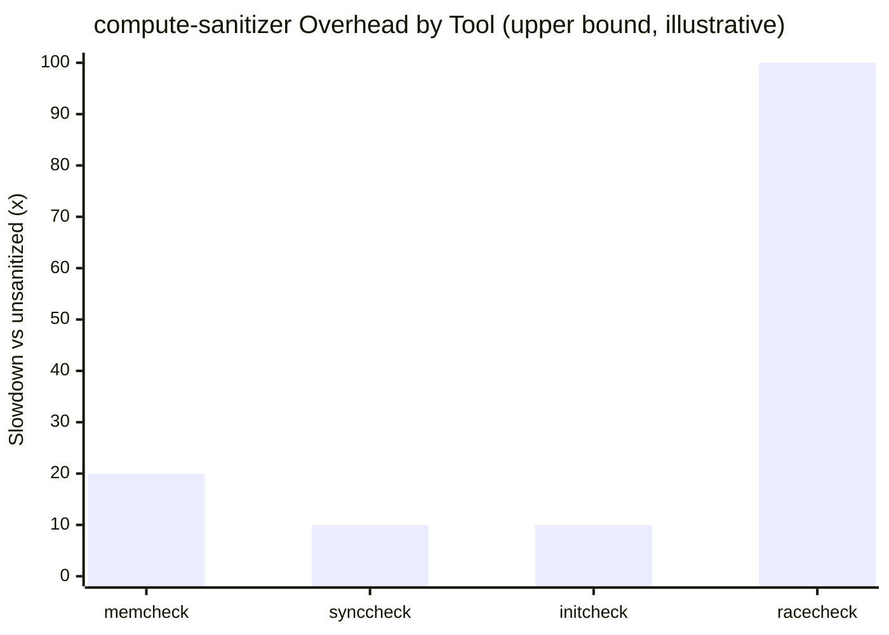
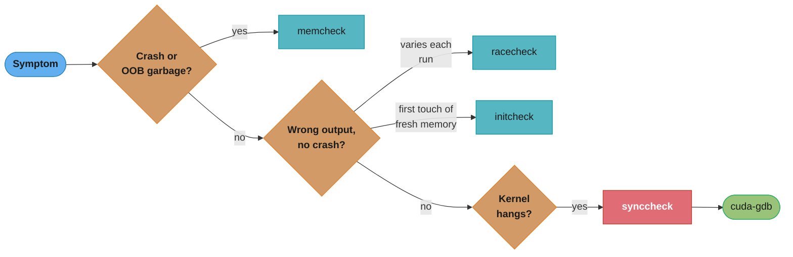
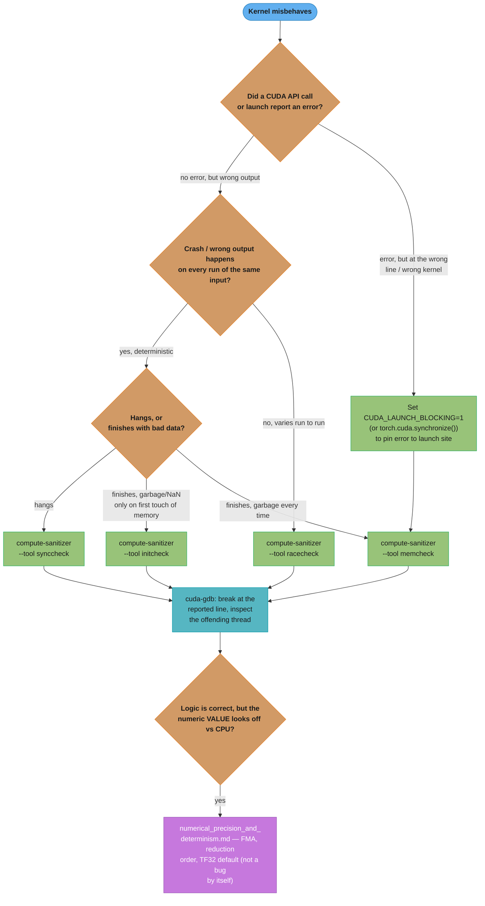
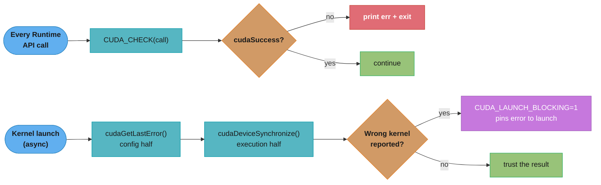
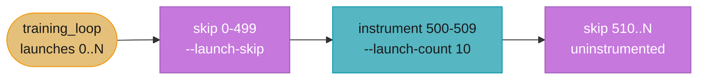
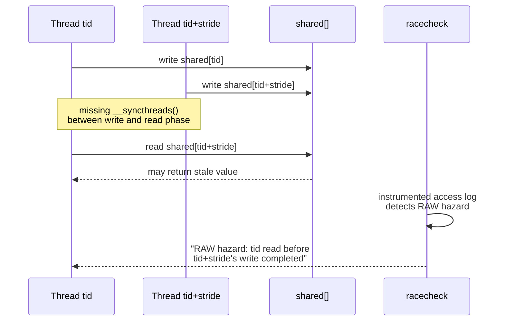

# Debugging, Correctness & Numerics

## 1. Concept Overview

A CUDA kernel that compiles cleanly and "runs" is not the same thing as a kernel that is correct. Because a kernel launch is asynchronous and every thread operates on its own slice of memory with no implicit bounds checking, the two most common CUDA bugs — an out-of-bounds write and a missing synchronization — routinely produce **no crash at all**: the kernel returns, the host program exits with status 0, and the corruption shows up three allocations later, or only on a different GPU, or only 1 time in 50 runs. This module is the field guide to closing that gap: the disciplined error-checking habit that turns a silent failure into a loud one at the call site, the four `compute-sanitizer` tools that instrument a running kernel to catch out-of-bounds accesses, data races, illegal synchronization, and uninitialized reads that no amount of code review will find, `cuda-gdb` for stepping through device code exactly like a CPU debugger, in-kernel `printf`/`assert` for the fastest possible feedback loop, and a concise tour of why a numerically "correct" GPU kernel can still disagree with a CPU reference in the last few bits.

The organizing idea is **make failures loud, then make them find themselves**: `CUDA_CHECK` and `CUDA_LAUNCH_BLOCKING=1` are about not letting an error hide; `compute-sanitizer` is about instrumenting the kernel so the hardware or runtime tells you the exact thread and address where things went wrong, instead of you guessing from symptoms. Numerical debugging is a different discipline entirely — most GPU-vs-CPU mismatches are not bugs but legitimate consequences of floating-point non-associativity, fused multiply-add, and reduced-precision Tensor Core paths, and this module only goes deep enough to recognize that distinction before deferring the full treatment to the numerics cross-cutting reference.

**Prerequisites**: correct use of the CUDA Runtime API and its error-return convention ([memory_management_and_data_transfer](../memory_management_and_data_transfer/)), and the `__syncthreads()`/atomics mental model ([synchronization_and_atomics](../synchronization_and_atomics/)) — most of what `racecheck` and `synccheck` catch is a violation of that model, so you need to already know the rule before a tool can usefully tell you it was broken.

---

## 2. Intuition

> **One-line analogy**: A CUDA kernel without error checking is a factory floor with no alarms — a machine can jam, misfire, or scrap a batch, and the only sign is a dented shipment that shows up at a customer three trucks later; `compute-sanitizer` is installing a sensor on every machine that halts the line and points at the exact station the instant something goes wrong.

**Mental model**: Debugging a CPU program and debugging a CUDA kernel differ in one structural way — a CPU program has one thread of control to reason about at a time, but a kernel launches thousands of threads that all execute the same code against different data, and a bug that only one thread out of 100,000 triggers (the last block, the boundary row, the one warp that reads before another warp writes) is exactly the kind of bug ordinary testing misses and a sanitizer is built to find, because it instruments *every* thread's *every* memory access, not just the ones a human happened to think to check.

**Why it matters**: The single most expensive category of CUDA bug is the one that "sometimes works" — an out-of-bounds write that happens to land in unused padding on this GPU and this input size, or a missing `__syncthreads()` that happens to work because the compiler scheduled the warps in a lucky order. These bugs pass code review, pass a quick manual test, and then fail in production on a different GPU generation, a different batch size, or under load — precisely the conditions a senior engineer is expected to reproduce and root-cause under pressure. Knowing the tool that turns "sometimes wrong" into "always caught, with the exact line and thread ID" is what separates hours of printf-driven guessing from a five-minute `compute-sanitizer` run.

**Key insight**: Error checking, sanitization, and numerical debugging are three genuinely different disciplines answering three different questions — "did an API call fail?" (`CUDA_CHECK`), "did a thread do something the hardware or the programming model forbids?" (`compute-sanitizer`), and "is this specific floating-point value what I actually expect, given that GPU arithmetic legitimately reorders and fuses operations?" (numerics). Conflating them is itself a common mistake: treating a `compute-sanitizer`-clean kernel as numerically correct, or treating a numerical mismatch against a CPU reference as automatically a bug, both waste debugging time in the wrong direction.

---

## 3. Core Principles

- **A silent failure is worse than a loud one.** Every CUDA Runtime API call returns a `cudaError_t`; ignoring it converts a diagnosable failure (bad allocation, invalid argument) into a mysterious crash several calls later. Wrap every call — see [cuda_error_handling_and_launch_config_patterns](../case_studies/cross_cutting/cuda_error_handling_and_launch_config_patterns.md) for the canonical `CUDA_CHECK` macro this module assumes.
- **Kernel launches are asynchronous, so an error has two arrival times.** A launch configuration error (bad grid/block dims, too much shared memory) is reported synchronously by `cudaGetLastError()` right after the launch; an execution error (out-of-bounds write, illegal instruction, assertion failure) is only reported once the kernel has actually run, which requires a synchronization point (`cudaDeviceSynchronize()`, a blocking `cudaMemcpy`, or `CUDA_LAUNCH_BLOCKING=1`) before it will surface.
- **A "sticky" error poisons the whole CUDA context.** Certain execution errors (illegal address, illegal instruction, hardware-detected stack overflow) are unrecoverable within the current context — every subsequent CUDA API call, even unrelated ones, returns the same sticky error until the process exits and a fresh context is created. Non-sticky errors (e.g. `cudaErrorInvalidValue` from a bad launch config) can be cleared and the context reused.
- **`compute-sanitizer` is four distinct tools, not one.** `memcheck` (default) catches out-of-bounds and misaligned global/shared/local memory accesses; `racecheck` catches shared-memory data races; `synccheck` catches illegal use of `__syncthreads()`/`__syncwarp()` (divergent barriers); `initcheck` catches reads of uninitialized global memory. Each instruments differently and has a different — sometimes very large — runtime overhead, so run the one that matches the symptom, not all four by default on every CI run.
- **A bug that "sometimes works" is the signature of undefined behavior, not a special case to special-case around.** Out-of-bounds writes that land in allocator padding, and missing synchronization that happens to work under one warp-scheduling order, are both undefined behavior — correct on one GPU/driver/input size is not evidence of correctness, only evidence you haven't yet hit the input that exposes it.
- **`cuda-gdb` debugs device code exactly like `gdb` debugs host code**, with CUDA-specific extensions (`info cuda threads`, `cuda thread`, `cuda block`) to select which of the thousands of concurrent threads you are currently inspecting — but it requires a debug build (`-G`) that disables optimizations and can change timing-sensitive bug behavior.
- **In-kernel `printf` and `assert` are the fastest, lowest-ceremony feedback loop**, at the cost of a fixed-size output buffer, no deterministic ordering across threads/blocks, and (for `printf`) a real performance cost if left in a hot kernel.
- **Most GPU-vs-CPU numerical mismatches are not bugs.** Floating-point addition is not associative, GPUs fuse multiply-adds into a single rounding by default, and reduction order on a GPU is a tree, not a CPU's sequential loop — a mismatch in the last few bits at FP32 is expected, not evidence something is wrong. See [numerical_precision_and_determinism](../case_studies/cross_cutting/numerical_precision_and_determinism.md) for the full treatment; this module covers only enough to recognize the pattern and reach for the right reproducibility knob.

---

## 4. Types / Architectures / Strategies

### 4.1 By Debugging Layer

| Layer | Question it answers | Primary tool(s) |
|-------|----------------------|------------------|
| **API/launch correctness** | Did the Runtime API call or the kernel launch itself fail? | `CUDA_CHECK` macro, `cudaGetLastError()`, `cudaPeekAtLastError()` |
| **Memory safety** | Did any thread read/write out of bounds, misaligned, or freed memory? | `compute-sanitizer --tool memcheck` |
| **Concurrency correctness** | Did threads race on shared memory, or call a barrier divergently? | `compute-sanitizer --tool racecheck` / `--tool synccheck` |
| **Initialization correctness** | Did any thread read global memory before it was written? | `compute-sanitizer --tool initcheck` |
| **Interactive/source-level** | What is thread (x,y,z) of block (a,b,c) actually doing right now? | `cuda-gdb` |
| **Fast, low-ceremony** | What value did this thread/block compute at this point? | in-kernel `printf`, `assert` |
| **Numerical correctness** | Is this value's difference from a reference expected FP behavior or a real bug? | `numerical_precision_and_determinism` cross-cutting reference, `torch.use_deterministic_algorithms` |

### 4.2 The Four `compute-sanitizer` Tools

| Tool | Catches | Typical overhead | When to reach for it |
|------|---------|-------------------|------------------------|
| **memcheck** (default) | Out-of-bounds global/shared/local accesses, misaligned accesses, invalid `__device__`/`__global__` free, device-side heap corruption | ~2-20x slowdown | First tool to run on any new kernel, or any crash/garbage-output symptom |
| **racecheck** | Shared-memory read-after-write, write-after-write, write-after-read hazards not properly separated by `__syncthreads()` | ~10-100x slowdown (heaviest tool) | Nondeterministic/heisenbug symptoms — output that differs run-to-run on the same input |
| **synccheck** | Divergent/illegal `__syncthreads()` or `__syncwarp()` — a subset of threads in a block/warp reaching a barrier that others do not | ~2-10x slowdown | Deadlocks (kernel hangs) or a symptom that only appears when control flow diverges |
| **initcheck** | Reads of allocated-but-never-written global memory | ~2-10x slowdown | Garbage/NaN output on the *first* run with fresh memory, or output that changes based on what was in memory before allocation |



*racecheck's shared-memory hazard tracking costs an order of magnitude more than the other three tools — this is exactly why §6.7 scopes it to the smallest reproducing input instead of a full production-size run.*

**Read it like this.** A slowdown factor is not a rating — it is a multiplier you apply to
your own run time to find out whether the tool is usable at all. `sanitized = baseline x
overhead` is the whole calculation, and it is why "just run all four" fails in practice.

The asymmetry matters more than the absolute numbers. Three tools cost you a coffee
break; one costs you the afternoon. Choosing by symptom instead of running everything is
a scheduling decision, not a stylistic preference.

| Symbol | What it is |
|--------|------------|
| baseline | Unsanitized wall time of the run you want to check |
| overhead | Slowdown multiplier for the chosen tool, from the table above |
| sanitized time | `baseline x overhead` — what you actually wait |
| shrink factor | How much you cut the input by before sanitizing; divides the baseline |
| memcheck | `2-20x` — cheap enough to run on every new kernel as a habit |
| racecheck | `10-100x` — the tool that forces you to shrink the input first |

**Walk one example.** A workload that takes 2 minutes unsanitized:

```
  memcheck  at  2x :   2 min x   2 =     4 min   -- run it, no thought required
  memcheck  at 20x :   2 min x  20 =    40 min   -- still a single sitting
  racecheck at 10x :   2 min x  10 =    20 min   -- tolerable
  racecheck at 100x:   2 min x 100 =   200 min   =  3.3 hours

  now shrink the input 100x first (smallest grid that still reproduces):
    new baseline = 2 min / 100 = 1.2 s
    racecheck at 100x = 1.2 s x 100 = 120 s = 2 min
```

Shrinking the input before sanitizing turns a 3.3-hour run into a 2-minute one — the same
answer, 100x sooner. Note that Section 10.2's "3-6 hours" figure for this scenario is the
upper end read generously: 2 minutes at the stated 100x ceiling is 3.3 hours, and reaching
6 hours implies an overhead nearer 180x, which racecheck can hit on shared-memory-heavy
kernels but is above the range quoted in the table.

### 4.3 By Symptom (Quick Lookup)

| Symptom | Likely cause | Reach for |
|---------|--------------|-----------|
| Kernel "runs" but output is silently wrong | Out-of-bounds write corrupting a neighboring allocation | `memcheck` |
| Output differs between runs on identical input | Missing/misplaced `__syncthreads()`, or an unsynchronized shared-memory race | `racecheck` |
| Kernel hangs indefinitely | Divergent barrier — some threads waiting at `__syncthreads()` that others never reach | `synccheck` |
| First run after allocation gives NaN/garbage, later runs look fine | Read of uninitialized global memory (default cudaMalloc content is unspecified) | `initcheck` |
| Crash reports the wrong kernel or line number | Asynchronous execution error surfacing at a later synchronization point | `CUDA_LAUNCH_BLOCKING=1` + rerun |
| Every CUDA call after one launch returns the same error | Sticky error has poisoned the context | Restart the process; do not try to recover in-process |
| GPU result differs from CPU reference in low-order digits | FMA contraction, tree-order reduction, TF32 default | [numerical_precision_and_determinism](../case_studies/cross_cutting/numerical_precision_and_determinism.md) — not a bug by itself |

### 4.4 Which Tool for This Symptom? — Quick Decision



*A compact cheat-sheet version of the table above: follow one branch from the observed symptom straight to the tool that actually catches that bug class — the fuller decision flow in §5.1 adds the launch-blocking and numerics branches this quick version omits.*

---

## 5. Architecture Diagrams

### 5.1 Debugging Decision Flow — Symptom to Tool



*Start from the observed symptom, not from "which tool sounds right" — a hang and a silent-garbage output point at completely different sanitizer tools, and running all four by default wastes the 10-100x `racecheck` overhead on a bug that `memcheck` would have found in seconds.*

### 5.2 Bug-Class × Sanitizer-Tool Coverage Grid

Not every tool catches every bug class — this is a common interview trap ("just run compute-sanitizer" is not a complete answer without naming which tool).

```
Bug class                       memcheck   racecheck   synccheck   initcheck
Out-of-bounds global write         X           .           .          .
Out-of-bounds shared-mem access    X           .           .          .
Misaligned access                  X           .           .          .
Use-after-free (device heap)       X           .           .          .
Shared-memory race (RAW/WAW/WAR)   .           X           .          .
Divergent __syncthreads() call     .           .           X          .
Uninitialized global-memory read   .           .           .          X
Double-free / invalid free         X           .           .          .

X = this tool detects this bug class     . = not this tool's job

Every real bug in this module maps to exactly one column: the OOB write in
SS10 is a memcheck bug; the missing __syncthreads() in SS14 is a synccheck/
racecheck bug. Running the wrong tool against a symptom finds nothing and
wastes the slowdown.
```

*Read down a column to see what one tool run buys you, or across a row to see which tool a known bug class needs — the decision flow in 5.1 is this grid compiled into a lookup path from symptom to column.*

### 5.3 Sticky vs Non-Sticky Error Lifecycle

```mermaid
stateDiagram-v2
    [*] --> Healthy: cudaMalloc / kernel launch succeeds
    Healthy --> Healthy: cudaGetLastError() returns cudaSuccess
    Healthy --> NonSticky: e.g. cudaErrorInvalidValue\n(bad launch config)
    NonSticky --> Healthy: cudaGetLastError() clears it;\ncontext still usable
    Healthy --> Sticky: e.g. cudaErrorIllegalAddress\n(OOB write executed on device)
    Sticky --> Sticky: every subsequent API call\nreturns the SAME error
    Sticky --> [*]: only fixed by process exit\n+ fresh context (no in-process recovery)
```



*The practical consequence: if `cudaGetLastError()` keeps returning the same error after several unrelated calls, stop trying API-level recovery — the context is poisoned and the fix is to exit the process, not to call `cudaDeviceReset()` and hope.*

---

## 6. How It Works — Detailed Mechanics

### 6.1 The Error-Checking Discipline — `CUDA_CHECK` and the Two-Halves Rule

Every Runtime API call returns `cudaError_t`; a kernel launch (`kernel<<<...>>>(...)`) returns `void` and is asynchronous, so it needs two separate checks. The full derivation of this idiom and the canonical macro live in [cuda_error_handling_and_launch_config_patterns](../case_studies/cross_cutting/cuda_error_handling_and_launch_config_patterns.md); this module assumes and reuses it:

```cpp
#include <cstdio>
#include <cstdlib>
#include <cuda_runtime.h>

#define CUDA_CHECK(call)                                                     \
    do {                                                                     \
        cudaError_t err__ = (call);                                          \
        if (err__ != cudaSuccess) {                                          \
            fprintf(stderr, "CUDA error at %s:%d — %s (%d): %s\n",           \
                    __FILE__, __LINE__, cudaGetErrorName(err__),             \
                    static_cast<int>(err__), cudaGetErrorString(err__));     \
            std::exit(EXIT_FAILURE);                                        \
        }                                                                    \
    } while (0)

__global__ void addKernel(const float* a, const float* b, float* c, int n) {
    int idx = blockIdx.x * blockDim.x + threadIdx.x;
    if (idx < n) c[idx] = a[idx] + b[idx];
}

void launchAdd(const float* d_a, const float* d_b, float* d_c, int n) {
    int threads = 256;
    int blocks = (n + threads - 1) / threads;

    addKernel<<<blocks, threads>>>(d_a, d_b, d_c, n);
    CUDA_CHECK(cudaGetLastError());        // half 1: synchronous config error
    CUDA_CHECK(cudaDeviceSynchronize());   // half 2: forces execution errors
                                            // to surface HERE, at this call site
}
```

Skipping the second `CUDA_CHECK` is the classic trap: the launch line "succeeds" (it always does, barring a config error), and an out-of-bounds write inside the kernel is only reported the *next* time the host happens to synchronize — often inside a completely unrelated `cudaMemcpy` several functions later, which is exactly the "crash points at the wrong kernel" symptom in the decision flow above.

### 6.2 `CUDA_LAUNCH_BLOCKING=1` — Pinning Async Errors to the Launch Site

Setting the environment variable `CUDA_LAUNCH_BLOCKING=1` forces the CUDA driver to make **every** kernel launch synchronous, as if a `cudaDeviceSynchronize()` were inserted after each one. This is the fastest way to convert "the crash trace points at kernel #47 but the bug is in kernel #12" into an accurate stack trace, at the cost of destroying the overlap between kernel execution and host-side work (and between concurrent streams) for the duration of the debugging session.

```bash
# CUDA C++ binary: force synchronous launches for accurate crash attribution
CUDA_LAUNCH_BLOCKING=1 ./my_cuda_app

# Combine with compute-sanitizer for the most precise "which launch, which thread" report
CUDA_LAUNCH_BLOCKING=1 compute-sanitizer --tool memcheck ./my_cuda_app
```

```python
# Python/PyTorch equivalent problem: an async CUDA op raises its error on some
# LATER call, not the one that actually triggered it.
import os
os.environ["CUDA_LAUNCH_BLOCKING"] = "1"   # must be set before the CUDA context inits

import torch

def buggy_indexing(x: torch.Tensor, idx: torch.Tensor) -> torch.Tensor:
    # If idx contains an out-of-range index, the illegal-address error may only
    # surface on a LATER unrelated op without CUDA_LAUNCH_BLOCKING=1.
    return x[idx]

x = torch.randn(1000, device="cuda")
idx = torch.tensor([999, 1000, 5], device="cuda")   # 1000 is out of bounds
out = buggy_indexing(x, idx)
torch.cuda.synchronize()   # forces the error to surface HERE, not three ops later
```

`torch.cuda.synchronize()` is the PyTorch-level equivalent of `cudaDeviceSynchronize()` — call it immediately after the suspect operation while debugging (never leave it in a hot training loop; it destroys the CPU/GPU overlap that makes GPU training fast).



*Two independent disciplines feed one habit: `CUDA_CHECK` on every synchronous call, plus the two-halves check on every launch — `CUDA_LAUNCH_BLOCKING=1` is the escape hatch when the execution half's error still points at the wrong kernel.*

### 6.3 `compute-sanitizer` — memcheck

`memcheck` is the default tool and the right first move for almost any "wrong output" or crash symptom. It instruments every global/shared/local memory access and reports the exact kernel, source line, thread index, and address on a violation.

```bash
# Default tool is memcheck; --tool is optional but explicit is clearer in scripts/CI
compute-sanitizer --tool memcheck ./vector_add

# Typical output on an out-of-bounds write:
# ========= Invalid __global__ write of size 4 bytes
# =========     at 0x00000190 in addKernelBroken(float const*, float const*, float*, int)
# =========     by thread (255,0,0) in block (39,0,0)
# =========     Address 0x7f2a3e000400 is out of bounds
# =========     Saved host backtrace up to driver entry point at kernel launch time

# Also catch device-side heap leaks (cudaMalloc'd but never cudaFree'd)
compute-sanitizer --tool memcheck --leak-check full ./vector_add
```

### 6.4 `compute-sanitizer` — racecheck, synccheck, initcheck

```bash
# racecheck: shared-memory races (heaviest tool — expect 10-100x slowdown)
compute-sanitizer --tool racecheck ./reduction_kernel
# Typical output: "RAW hazard" — a thread read shared memory that another
# thread wrote in the same step without an intervening __syncthreads().

# synccheck: divergent/illegal barrier calls (kernel hangs are the classic symptom)
compute-sanitizer --tool synccheck ./divergent_barrier_kernel
# Typical output: "Barrier error detected" naming the __syncthreads() call site
# reached by only a subset of the block's threads.

# initcheck: reads of never-written global memory
compute-sanitizer --tool initcheck ./first_touch_kernel
# Typical output: "Uninitialized __global__ memory read" at the offending load.
```

Because `racecheck` in particular can be 10-100x slower than an unsanitized run, scope it to the smallest reproducing input rather than a full production-size workload — shrink the grid/data size until the race still reproduces, then sanitize that.

### 6.5 `cuda-gdb` — Interactive Source-Level Debugging

`cuda-gdb` extends `gdb` with CUDA-aware commands. It requires a debug build (`-G` disables optimizations and embeds device-side debug info — never ship a `-G` binary to production, and be aware that disabling optimizations can itself change the timing of a race that only reproduces at full optimization).

```bash
# Compile with device debug info; -g for host-side symbols
nvcc -G -g -O0 vector_add.cu -o vector_add_debug

cuda-gdb ./vector_add_debug
```

```
(cuda-gdb) break addKernel                  # breakpoint on kernel entry
(cuda-gdb) run
(cuda-gdb) info cuda threads                # list resident threads/blocks
(cuda-gdb) cuda thread (255,0,0) block (39,0,0)   # switch focus to one thread
(cuda-gdb) print idx                        # inspect a device-local variable
(cuda-gdb) print a[idx]                     # inspect device memory at this thread's index
(cuda-gdb) next                             # step one source line, this thread's warp
(cuda-gdb) continue
```

`info cuda threads` is the command that makes GPU debugging tractable at all — it lists every resident thread grouped by block, so instead of guessing which of 100,000+ threads is misbehaving, you switch focus directly to the one `compute-sanitizer` already named in its report.

### 6.6 In-Kernel `printf` and `assert`

```cpp
__global__ void debugKernel(const float* data, int n) {
    int idx = blockIdx.x * blockDim.x + threadIdx.x;
    if (idx < n) {
        // printf works from device code since compute capability 2.0; output is
        // buffered (default 1 MB total via cudaLimitPrintfFifoSize) and flushed
        // at the next synchronization point — ordering across threads/blocks is
        // NOT guaranteed, so never use it to reason about relative timing.
        if (idx == 0 || data[idx] < 0.0f) {
            printf("thread %d: data=%f (idx0 sample or negative value)\n", idx, data[idx]);
        }

        // assert aborts the kernel and prints file/line/thread on failure; it is
        // compiled out entirely when NDEBUG is defined, so never rely on it for
        // a check that must run in a release build.
        assert(idx < n && "index computed out of the valid range");
    }
}

// Increase the printf buffer if output is being silently dropped (default 1 MB
// grid-wide is easy to exceed with a printf inside a large, hot loop):
// cudaDeviceSetLimit(cudaLimitPrintfFifoSize, 4 * 1024 * 1024);
```

```python
# Numba CUDA supports device-side print() with the same buffering caveats
from numba import cuda

@cuda.jit(debug=True)   # debug=True enables bounds-checking + better error messages
def debug_kernel(data):
    idx = cuda.grid(1)
    if idx < data.size:
        if idx == 0 or data[idx] < 0.0:
            print("thread", idx, "data", data[idx])
        assert idx < data.size, "index out of range"
```

### 6.7 Scoping `compute-sanitizer` to a Specific Kernel Launch

On a real application that launches thousands of kernels before the one you actually suspect, sanitizing from the very first launch wastes most of the run paying instrumentation overhead on kernels you already trust. `--launch-skip`/`--launch-count` narrow the instrumented window to a specific launch range, and `--kernel-name` narrows it to a specific kernel by name:

```bash
# Only instrument launches 500 through 509 (10 launches) instead of the whole run
compute-sanitizer --tool racecheck --launch-skip 500 --launch-count 10 ./training_loop

# Only instrument a specific kernel by name, regardless of how many times it's launched
compute-sanitizer --tool memcheck --kernel-name reduceBroken ./training_loop

# Combine with --print-limit to cap how many violation reports print before
# the tool stops reporting duplicates from the same root cause
compute-sanitizer --tool memcheck --print-limit 10 ./training_loop
```



*Narrowing the instrumented window to the suspect launch range is what makes `racecheck`'s 10-100x overhead affordable against a real training loop instead of only a synthetic microbenchmark.*

This scoping is what makes `racecheck` practical against a real training loop rather than only a synthetic microbenchmark — narrow the window first using a cheaper tool or a binary search over launch indices, then run the heavier tool only across that narrowed range.

### 6.8 Numerical Correctness — Concise Treatment (Full Depth Deferred)

Three facts cover the interview-relevant surface; the mechanism, formats, and reproducibility knobs are fully derived in [numerical_precision_and_determinism](../case_studies/cross_cutting/numerical_precision_and_determinism.md) — do not re-derive them here.

**What the formula is telling you.** A format's unit roundoff is `2^-(p)` where `p` is the
number of significand bits *including* the implicit leading 1 — it says "any single
rounding can move a value by at most this fraction of itself."

Every tolerance you ever pick for a GPU-vs-CPU comparison descends from that one number.
Choose `rtol` below the format's unit roundoff and correct code fails your test; choose it
far above and real bugs slip through.

| Symbol | What it is |
|--------|------------|
| stored mantissa bits | Bits actually written in the format; the leading `1` is implicit, not stored |
| `p` (significand bits) | Stored bits plus 1 — the real precision the arithmetic carries |
| unit roundoff `u` | `2^-p` — max relative error of one correctly-rounded operation |
| decimal digits | `p * log10(2)` — how many decimal digits you can trust |
| exponent bits | Sets *range*, not precision; why BF16 survives overflow that FP16 does not |
| TF32 | 10 stored mantissa bits with FP32's 8 exponent bits — the silent Ampere+ default |

**Walk one example.** The four formats a CUDA numerics bug lives among:

```
  format   stored   p = bits+1   u = 2^-p            decimal digits
  ------   ------   ----------   -----------------   --------------
  FP32       23         24       2^-24 = 5.96e-08        7.22
  TF32       10         11       2^-11 = 4.88e-04        3.31
  FP16       10         11       2^-11 = 4.88e-04        3.31
  BF16        7          8       2^-8  = 3.91e-03        2.41

  FP32 -> TF32 precision loss = 2^-11 / 2^-24 = 2^13 = 8,192x coarser
  TF32 vs BF16                = 2^-8  / 2^-11 = 2^3  =     8x coarser

  TF32 and FP16 carry the SAME 11 significand bits -- they differ only in
  exponent bits (8 vs 5), i.e. in range, not in precision.
```

This is the arithmetic behind the "moved to an A100 and lost accuracy with zero code
change" trap: switching FP32 to TF32 silently drops you from 7.2 trustworthy decimal
digits to 3.3. A test asserting `rtol=1e-5` passes under FP32 (`u = 6e-8`) and fails
under TF32 (`u = 4.9e-4`) without a single line of source changing.

```cpp
// FMA contraction: nvcc fuses a*b+c into ONE rounding by default (--fmad=true).
// This is faster AND more accurate in isolation, but differs bit-for-bit from
// a naive "multiply, round, then add, round again" reference.
float d_fma = fmaf(a, b, c);              // one rounding — the default codegen
// nvcc -O3 --fmad=false forces the two-rounding path when debugging a mismatch
// against a scalar CPU reference; never ship --fmad=false for production.
```

**In plain terms.** `fmaf(a, b, c)` says: "compute `a*b + c` on the exact product, and
round only at the very end" — where the unfused path rounds twice, once after the multiply
and once after the add.

The extra rounding is usually invisible, worth a fraction of a ULP. It becomes total when
the addition cancels most of the product, because cancellation amplifies whatever error
the intermediate rounding already introduced.

| Symbol | What it is |
|--------|------------|
| `a*b` (exact) | The true product, needing up to `2p` significand bits to represent |
| two-rounding path | Round `a*b` to FP32, then round the sum — the CPU reference's behavior |
| `fmaf(a,b,c)` | Keeps the full-width product, rounds once after adding `c` — nvcc's default |
| `--fmad=false` | Forces the two-rounding path; a triage switch, never a production setting |
| catastrophic cancellation | Subtracting nearly-equal values, promoting a tiny error to a huge one |
| relative error | Absolute error divided by the true answer — the number that actually matters |

**Walk one example.** Values chosen so the product needs exactly one bit more than FP32
has, and `c` cancels everything above it:

```
  a = b = 1 + 2^-12   (exactly representable in FP32)
  c     = -(1 + 2^-11) (exactly representable in FP32)

  exact product a*b = 1 + 2^-11 + 2^-24
                      ^^^^^^^^^^   ^^^^^ needs a 25th significand bit
  FP32 has 24 significand bits, so the 2^-24 term does not fit.

  TWO-ROUNDING PATH (--fmad=false, or a CPU reference):
    round(a*b) = 1 + 2^-11          <- the 2^-24 term is rounded AWAY
    (1 + 2^-11) + c
      = (1 + 2^-11) - (1 + 2^-11)
      = 0.0                          <- every significant digit cancelled

  FUSED PATH (fmaf, nvcc default):
    exact a*b + c = (1 + 2^-11 + 2^-24) - (1 + 2^-11)
                  = 2^-24
    round once    = 5.9604645e-08    <- exactly right

  true answer = 2^-24 = 5.9604645e-08
    fused      : relative error =   0%
    two-rounding: relative error = 100%   (returned 0.0 for a nonzero answer)
```

A 100% relative error from one extra correctly-rounded operation is the point: the fused
path is both faster *and* more accurate, so a mismatch against a CPU reference here means
the CPU is the less accurate side. That inverts the usual triage instinct — reach for
`--fmad=false` to *explain* a discrepancy, never to "fix" one, and never ship it.

```python
import torch

# TF32 is the SILENT DEFAULT for FP32 matmul/conv on Ampere+ — a debugging trap
# when a model "loses accuracy" moving from Volta/CPU to an A100/H100 with zero
# code change. Opt out explicitly to compare against a true FP32 reference:
torch.backends.cuda.matmul.allow_tf32 = False
torch.backends.cudnn.allow_tf32 = False

# use_deterministic_algorithms(True) makes PyTorch prefer deterministic kernel
# variants and RAISES an error (rather than silently running nondeterministically)
# for any op with no deterministic implementation — pair with a fixed CUBLAS
# workspace for deterministic GEMM:
import os
os.environ["CUBLAS_WORKSPACE_CONFIG"] = ":4096:8"
torch.use_deterministic_algorithms(True)
```

`torch.use_deterministic_algorithms(True)` guarantees the *same run-to-run* result on the *same hardware and software stack* for supported ops — it does not guarantee the result matches a CPU reference or a different GPU generation, because it does not change reduction order or precision, only which of several available kernel implementations is selected.

---

## 7. Real-World Examples

- **PyTorch's `torch.autograd.set_detect_anomaly(True)`** is a CPU/GPU-agnostic debugging aid that instruments the autograd graph to report the exact backward operation that produced a NaN/Inf, which is the framework-level analogue of `compute-sanitizer` for training-loop numerical bugs rather than raw kernel memory bugs.
- **NVIDIA's own CUDA sample `deviceQuery`/`simpleAssert`** ships as the canonical minimal reproduction of an in-kernel `assert()` failure, used throughout NVIDIA training material as the first debugging exercise before compute-sanitizer is introduced.
- **cuDNN and cuBLAS both expose a `CUBLAS_WORKSPACE_CONFIG` / deterministic-algorithm switch** precisely because production ML teams (recommendation systems, fraud models) need bit-reproducible training runs for audit and regression-testing purposes, not just raw throughput.
- **CI pipelines for CUDA libraries (e.g. RAPIDS, PyTorch's own test suite)** run `compute-sanitizer --tool memcheck` and `--tool racecheck` as a gating step on new/modified kernels specifically because a race or OOB bug that only manifests on certain GPU architectures or occupancy levels would otherwise ship silently.
- **Google's TPU/GPU ML infra teams have documented "silent data corruption" incidents** (bit flips, uncorrected ECC events) that are numerically indistinguishable from a reduction-order mismatch unless the team already has a baseline understanding of expected FP tolerance — which is why "is this a real bug or expected FP behavior" is treated as a first-class triage question, not an afterthought.

---

## 8. Tradeoffs

| Approach | Strength | Cost |
|----------|----------|------|
| `CUDA_CHECK` + `cudaDeviceSynchronize()` everywhere | Catches every API/execution error immediately, at the source line | Destroys host/device overlap; strip the extra synchronizations from production hot paths once correctness is verified |
| `CUDA_LAUNCH_BLOCKING=1` | Pins async errors to the exact launch site; zero code changes needed | Serializes all kernel launches — unusable for reproducing timing-sensitive/concurrency bugs, only correctness bugs |
| `compute-sanitizer --tool memcheck` | Finds OOB/misaligned/use-after-free with exact thread+address | 2-20x slowdown; does not catch races or sync issues |
| `compute-sanitizer --tool racecheck` | Finds shared-memory races that never produce a crash, only wrong answers | 10-100x slowdown — the heaviest tool; scope to the smallest reproducing input |
| `cuda-gdb` | Full interactive, source-level, per-thread inspection | Requires a `-G` debug build (disables optimizations); can itself change race timing |
| In-kernel `printf`/`assert` | Fastest possible feedback loop, no rebuild-with-debug-flags cycle | No ordering guarantee across threads; fixed output buffer; real perf cost if left in production kernels |
| Forcing `--fmad=false` / disabling TF32 to match a CPU reference | Makes a numerics comparison closer to bit-exact | Meaningfully slower; masks the actual production numerics, so only use it temporarily while triaging a mismatch |

---

## 9. When to Use / When NOT to Use

**Reach for `compute-sanitizer` when:**
- A kernel produces wrong output with no crash and no reported CUDA error — the default first move is `memcheck`.
- Output is nondeterministic across identical-input runs — `racecheck` is the tool built for exactly this symptom.
- A kernel hangs and you suspect divergent control flow reached a `__syncthreads()` unevenly — `synccheck`.
- Output is only wrong on the *first* use of freshly allocated device memory — `initcheck`.

**Reach for `cuda-gdb` when:**
- You already know roughly which kernel and which thread range is misbehaving (often from a `compute-sanitizer` report) and need to step through the actual control flow and inspect live variable values.
- You are debugging complex control flow (nested conditionals, loops with early exits) where a single `printf` line can't capture enough state.

**Reach for `printf`/`assert` when:**
- You need one or two values from a specific thread and a full sanitizer/debugger session is overkill for the iteration speed you need.
- You are validating a hypothesis quickly during active development, not doing a final correctness audit.

**Do NOT reach for numerics-debugging tools when:**
- The mismatch against a CPU reference is within FP32's ~1e-5–1e-7 relative tolerance and involves any reduction, matmul, or Tensor-Core path — this is very likely expected FMA/reduction-order/TF32 behavior, not a bug; check [numerical_precision_and_determinism](../case_studies/cross_cutting/numerical_precision_and_determinism.md) before spending time "fixing" it.
- You are about to run `--tool racecheck` on a full production-scale workload "just to be safe" — its overhead makes that impractical; shrink to the smallest reproducing case first.

---

## 10. Common Pitfalls

### 10.1 BROKEN → FIX: Out-of-Bounds Write That "Sometimes Works"

```cuda
// BROKEN: launch config computes MORE threads than valid indices, and the
// kernel has NO bounds check, so the extra threads write past the array end.
// On many allocations this lands in unused allocator padding and appears to
// "just work" -- until a tighter allocation, a different N, or a different
// GPU's allocator layout puts real data there.
#define CUDA_CHECK(call) /* ... see 6.1 ... */

__global__ void scaleBroken(float* data, float k, int n) {
    int idx = blockIdx.x * blockDim.x + threadIdx.x;
    data[idx] *= k;              // NO bounds check -- idx can exceed n-1
}

void launchBroken(float* d_data, int n) {
    int threads = 256;
    int blocks = (n + threads - 1) / threads;   // last block has (blocks*threads - n)
                                                 // threads with idx >= n
    scaleBroken<<<blocks, threads>>>(d_data, 2.0f, n);
    CUDA_CHECK(cudaGetLastError());
    CUDA_CHECK(cudaDeviceSynchronize());        // often reports cudaSuccess anyway --
                                                 // the write landed in valid device
                                                 // memory (a neighboring allocation
                                                 // or allocator padding), just not
                                                 // memory this kernel owns
}
// compute-sanitizer --tool memcheck ./app instantly reports:
// "Invalid __global__ write of size 4 bytes ... by thread (N,0,0) ...
//  Address 0x... is out of bounds" -- pinpointing the exact idx and address,
// something no amount of staring at "it worked on my machine" would find.
```

```cuda
// FIX: the bounds guard costs one comparison per thread and eliminates the
// out-of-bounds write entirely -- add it BEFORE any read or write, always.
__global__ void scaleFixed(float* data, float k, int n) {
    int idx = blockIdx.x * blockDim.x + threadIdx.x;
    if (idx < n) {                // guard: only valid indices touch memory
        data[idx] *= k;
    }
}
// compute-sanitizer --tool memcheck ./app now reports zero errors, and the
// result no longer depends on what happens to sit past the array's end.
```

**Stated plainly.** `blocks = ceil(n / threads)` guarantees you launch *at least* `n`
threads — and therefore, whenever `n` is not an exact multiple, strictly more than `n`.
The count of those surplus threads is exactly the size of the bug.

The reason this bug hides so well is visible in the ratio: the offending threads are a
vanishing fraction of the launch, all of them in the final block. Every other block is
perfectly correct, so any test that checks aggregate output rather than the tail passes.

| Symbol | What it is |
|--------|------------|
| `n` | Number of valid elements — the only true bound |
| `threads` | Threads per block, `256` here |
| `blocks` | `(n + threads - 1) / threads` — integer ceiling division, always rounds up |
| total threads | `blocks * threads` — what actually launches, `>= n` always |
| overshoot | `blocks * threads - n` — threads with `idx >= n`, all in the last block |
| `if (idx < n)` | The one-comparison guard that turns overshoot threads into no-ops |

**Walk one example.** A vector sized to be awkward, at the module's 256 threads per block:

```
  n = 1,000,000        threads = 256

  blocks = (1000000 + 255) / 256 = 1000255 / 256 = 3907   (integer division)

  total threads = 3907 x 256 = 1,000,192
  valid indices =             1,000,000
  overshoot     =                   192 threads with idx >= n

  last block (blockIdx.x = 3906):
    idx range   = 3906*256 = 999,936 .. 1,000,191
    valid here  = 1,000,000 - 999,936 = 64 threads
    out of range= 256 - 64            = 192 threads   <- matches the overshoot

  damage without the guard: 192 threads x 4 B = 768 bytes written past the end

  fraction of the launch that is wrong = 192 / 1,000,192 = 0.019%
```

768 bytes out of a 4 MB buffer, written by 0.019% of the threads, all in one block. That
is precisely why it "sometimes works" — the corruption is small enough to land in
allocator padding on most allocations, and the guard that prevents it costs one integer
comparison per thread.

### 10.2 Additional Pitfalls (Shorter Form)

- **Checking `cudaGetLastError()` right after the launch line and calling it "checked."** That only catches the synchronous config-error half; without a subsequent `cudaDeviceSynchronize()` (or equivalent), the execution-error half is still silently deferred to whatever CUDA call happens to synchronize next.
- **Assuming a sticky error can be recovered with `cudaDeviceReset()`.** Some sticky errors leave the context in a state where even reset-style API calls fail or the process must exit; treat a repeated identical error across unrelated calls as a signal to restart the process, not to keep calling recovery APIs.
- **Running `compute-sanitizer --tool racecheck` on a full-scale workload "to be thorough."** Its 10-100x overhead makes a workload that took 2 minutes take 3-6 hours; shrink the input to the smallest size that still reproduces the symptom before sanitizing.
- **Leaving `-G` debug builds or in-kernel `printf`/`assert` in a shipped release binary.** `-G` disables optimizations (can be an order of magnitude slower); an `assert` left enabled is compiled away only if `NDEBUG` is defined at compile time — verify your release build actually defines it.
- **Treating a numerics mismatch as automatically a correctness bug.** Comparing a GPU tree-reduction result against a CPU sequential-loop result with `==` instead of `allclose(rtol=..., atol=...)` will "fail" on entirely correct code — see §6.7 and the numerics cross-cutting file.
- **Forgetting that `CUDA_LAUNCH_BLOCKING=1` changes timing.** It can mask or shift a race-condition symptom because it serializes all launches — useful for pinning down *which* kernel failed, but do not use it as the environment you validate `racecheck`/`synccheck` findings in.

---

## 11. Technologies & Tools

| Tool | Purpose | Notes |
|------|---------|-------|
| `compute-sanitizer` | Memory/race/sync/init instrumentation (replaces the deprecated `cuda-memcheck`) | Four sub-tools via `--tool {memcheck,racecheck,synccheck,initcheck}`; ships with the CUDA Toolkit |
| `cuda-gdb` | Interactive source-level device debugger | Requires `-G` debug build; extends `gdb` with `info cuda threads`, `cuda thread`, `cuda block` |
| `cuda-memcheck` (legacy) | Predecessor to `compute-sanitizer` | Deprecated since CUDA 11.6 — use `compute-sanitizer` in any current toolchain |
| `CUDA_LAUNCH_BLOCKING=1` | Environment variable forcing synchronous kernel launches | Debugging-only; destroys stream/host overlap |
| `cudaGetLastError()` / `cudaPeekAtLastError()` | Query and (for `Get`) clear the last non-sticky error | `Peek` does not clear the flag; `Get` does |
| In-kernel `printf` | Device-side formatted output | Default 1 MB grid-wide FIFO buffer (`cudaLimitPrintfFifoSize`), no cross-thread ordering guarantee |
| In-kernel `assert` | Aborts kernel + prints file/line/thread on failure | Compiled out when `NDEBUG` is defined; real (if small) runtime cost otherwise |
| `torch.cuda.synchronize()` | PyTorch's `cudaDeviceSynchronize()` equivalent | Pins async CUDA errors and timing to the call site during debugging |
| `torch.use_deterministic_algorithms(True)` | Forces PyTorch to prefer deterministic kernels, raise on unsupported ops | Guarantees run-to-run reproducibility on the same stack, not cross-hardware bit-exactness |
| `torch.autograd.set_detect_anomaly(True)` | Framework-level NaN/Inf backward-pass localization | Python/PyTorch-specific; complements but does not replace `compute-sanitizer` |

---

## 12. Interview Questions with Answers

**Q: Why does a kernel with an out-of-bounds write often "work fine" instead of crashing?**
An out-of-bounds write is undefined behavior, not a guaranteed crash — the extra thread's write frequently lands in unused allocator padding or an adjacent allocation that happens not to be read again before the program exits, so it silently corrupts memory without producing any visible symptom on that particular run, input size, or GPU.

**Q: What does `CUDA_LAUNCH_BLOCKING=1` actually change, and why is it the first thing to try when a crash's stack trace points at the wrong kernel?**
It forces every kernel launch to execute synchronously instead of asynchronously, so an execution error surfaces immediately after the kernel that caused it rather than after some later, unrelated launch that merely happened to be the next synchronization point. Without it, the host queues launches and moves on immediately, so a crash reported during a later `cudaMemcpy` can actually be attributable to a kernel launched several calls earlier.

**Q: What is a "sticky" CUDA error, and why can't `cudaGetLastError()` simply clear it?**
A sticky error (e.g. an illegal memory address or illegal instruction detected during kernel execution) corrupts the CUDA context itself, so every subsequent API call — even ones unrelated to the original failure — keeps returning that same error until the process exits and a fresh context is created. `cudaGetLastError()` can clear non-sticky errors (like a bad launch configuration), but a sticky error reflects context-level corruption that no API-level call can repair in-process.

**Q: What is the difference between `compute-sanitizer`'s `memcheck` and `racecheck` tools?**
`memcheck` instruments memory accesses to catch out-of-bounds, misaligned, and use-after-free bugs on individual threads, while `racecheck` instruments shared-memory accesses across threads to catch data races — a thread reading a shared-memory location another thread wrote without an intervening `__syncthreads()`. A kernel can be perfectly `memcheck`-clean (every individual access is in-bounds) while still having a `racecheck`-detectable race, because the two tools check entirely different properties.

**Q: What does `synccheck` catch that `memcheck` and `racecheck` do not?**
`synccheck` detects illegal or divergent uses of block/warp-level barriers (`__syncthreads()`, `__syncwarp()`) — for example, a subset of a block's threads reaching a `__syncthreads()` inside an `if` branch that other threads in the block never enter, which is undefined behavior and typically manifests as a hang or corrupted results rather than a memory-safety violation.

**Q: What does `initcheck` catch, and what symptom typically points at it?**
`initcheck` flags reads of global memory that was allocated but never written by any kernel, which typically manifests as NaN or garbage output that appears only on the first use of freshly allocated memory (because `cudaMalloc` does not zero-initialize) and can disappear on subsequent runs if the same memory happens to be reused with leftover valid-looking bits from a prior allocation.

**Q: Why does `CUDA_CHECK` around a kernel launch line, by itself, not actually check the kernel's execution correctness?**
A kernel launch (`kernel<<<...>>>(...)`) returns `void`, not a `cudaError_t`, and executes asynchronously — wrapping the launch line in a macro expecting a return value doesn't compile or check anything meaningful; the launch's *configuration* error is available synchronously via `cudaGetLastError()` right after, but the kernel's *execution* error only surfaces once you force a synchronization point with `cudaDeviceSynchronize()`.

**Q: Why can a GPU result legitimately differ from a CPU reference even when the kernel has no bug?**
GPUs fuse multiply-add into a single rounding by default (FMA) instead of the two separate roundings a naive CPU implementation performs, and parallel reductions sum values in a tree order rather than a CPU's strict sequential order — floating-point addition is not associative, so both effects can shift results in the low-order bits without indicating an actual defect. See [numerical_precision_and_determinism](../case_studies/cross_cutting/numerical_precision_and_determinism.md) for the full mechanism.

**Q: Does setting temperature/sampling aside, does `torch.use_deterministic_algorithms(True)` guarantee bit-identical output to a CPU run?**
No — it only guarantees that PyTorch will prefer deterministic kernel implementations (and raise an error rather than silently run nondeterministically for unsupported ops) so that repeated runs on the *same* GPU and software stack produce identical results; it does not change FMA contraction, reduction order, or precision, so it does not by itself make GPU output match a CPU reference bit-for-bit.

**Q: Why is TF32 described as a "silent" debugging trap on Ampere and later?**
TF32 is the default compute mode for FP32 matrix multiplies and convolutions routed through Tensor Cores on Ampere+ — tensors are still stored as full FP32, but the multiply-accumulate internally uses only TF32's ~10 mantissa bits, so a model can lose precision or gain a 4-8x speedup purely from running on newer hardware with zero code changes, which is easy to misdiagnose as either a numerics bug or an unexplained hardware anomaly rather than an opt-out-able default.

**Q: How do you compile a kernel for `cuda-gdb` line-level debugging, and what does it cost?**
Compile with `nvcc -G -g`, where `-G` generates debug information for device code and disables most compiler optimizations so source lines map cleanly to executed instructions; the cost is a meaningfully slower binary and, because it changes instruction scheduling and timing, a debug build can mask or alter the reproduction of timing-sensitive races that only appear at full optimization.

**Q: What CUDA-specific `cuda-gdb` command lets you inspect one specific thread among thousands?**
`cuda thread (x,y,z) block (a,b,c)` switches the debugger's focus to that exact thread, after which ordinary `gdb` commands like `print` and `next` operate on that thread's local variables and control flow; `info cuda threads` first lists all resident threads/blocks so you know which coordinates to target, typically taken directly from a `compute-sanitizer` report's thread/block indices.

**Q: What are the practical limits of in-kernel `printf`?**
Output is written to a fixed-size FIFO buffer (`cudaLimitPrintfFifoSize`, default 1 MB grid-wide) that silently drops output once full, it is only flushed to the host at a synchronization point, and there is no guaranteed ordering across threads or blocks — so `printf` is useful for "what value did thread N compute" but unsafe for reasoning about relative timing or interleaving between threads.

**Q: When should you use `assert()` in a kernel instead of an explicit `if` bounds check?**
`assert()` is appropriate for catching programmer-error invariants during development (an index that should be mathematically impossible to exceed a bound) because it aborts loudly with file/line/thread information, but it is compiled out entirely when `NDEBUG` is defined — any check that must still run in a release build (like the bounds guard in a kernel that legitimately receives untrusted sizes) needs an explicit `if`, not an `assert`.

**Q: Why does `compute-sanitizer --tool racecheck` typically run 10-100x slower than an unsanitized kernel, and what's the practical workaround?**
`racecheck` must track every shared-memory access's ordering relative to every other thread in the block to detect hazards, which is far more expensive to instrument than `memcheck`'s per-access bounds check; the practical workaround is to shrink the grid/data size to the smallest input that still reproduces the nondeterministic symptom before sanitizing, rather than running it against a full production-scale workload.

**Q: Describe a "heisenbug" caused by a missing `__syncthreads()` — why does it only sometimes reproduce?**
A block's threads write to shared memory and then read a neighbor's write without an intervening `__syncthreads()` between the write and the read phase; whether the bug manifests depends on the actual warp-scheduling order the hardware happens to choose for that launch, so it can appear to work correctly across many runs and then produce wrong output only when scheduling happens to interleave the write and read in the unsafe order — exactly the symptom `racecheck` is built to catch regardless of which scheduling order actually occurred.

**Q: Can `cuda-gdb` and `compute-sanitizer` be used together, and in what order would you typically reach for them?**
Yes — the typical workflow runs `compute-sanitizer` first to get an exact thread index, block index, and source line for the violation, then attaches `cuda-gdb` (with a `-G` build) and uses `cuda thread`/`cuda block` to jump directly to that reported location and step through the surrounding logic, rather than using either tool alone to search blindly.

**Q: If a kernel is `compute-sanitizer`-clean across all four tools, is it numerically correct?**
Not necessarily — the sanitizer tools verify memory safety and synchronization correctness (no OOB access, no race, no illegal barrier, no uninitialized read), which is a different property from numerical correctness; a kernel can be perfectly memory-safe and race-free while still computing the wrong reduction order, using an inappropriate reduced-precision path, or containing a logic bug the sanitizer has no way to detect.

---

## 13. Best Practices

- **Wrap every CUDA Runtime API call in `CUDA_CHECK`, with no exceptions** — including calls that "never fail in practice" like `cudaFree`; the moment one goes unchecked is the moment it hides the bug that actually matters.
- **Always check both halves of a kernel launch** — `cudaGetLastError()` immediately after, and `cudaGetLastError()` again after a `cudaDeviceSynchronize()` (or equivalent) — never assume "no error at the launch line" means "the kernel ran correctly."
- **Run `compute-sanitizer --tool memcheck` on every new or modified kernel before trusting its output**, the same way you would not trust a new function without running it once — this is a five-minute habit, not an occasional last resort.
- **Match the sanitizer tool to the symptom, not the reverse** — use the decision flow in §5.1 rather than defaulting to running all four tools on every bug; `racecheck`'s overhead in particular makes "just run everything" impractical.
- **Shrink the input before sanitizing, especially for `racecheck`** — reproduce the bug at the smallest grid/data size you can, then sanitize that, rather than paying a 10-100x slowdown on a full-scale run.
- **Treat `-G` debug builds and left-in `printf`/`assert` calls as debugging-only artifacts** — verify `NDEBUG` is defined in release builds and that no hot-path `printf` survives into production.
- **Never compare GPU floating-point output to a reference with exact equality** — use `allclose`-style tolerance checks, and read [numerical_precision_and_determinism](../case_studies/cross_cutting/numerical_precision_and_determinism.md) before treating a low-order-bit mismatch as a bug.
- **Set `CUDA_LAUNCH_BLOCKING=1` only while actively debugging, never in production** — it serializes every kernel launch and eliminates the host/device and inter-stream overlap that makes real workloads fast.
- **Pin hardware/software versions when reproducibility (not just determinism) genuinely matters** — `torch.use_deterministic_algorithms(True)` guarantees same-stack reproducibility, not cross-GPU-generation bit-exactness.

---

## 14. Case Study — The Missing `__syncthreads()` Heisenbug

**Scenario**: A block-level parallel reduction sums `TILE=256` values per block into shared memory, then has thread 0 write the block's partial sum to global memory. The kernel passes correctness testing dozens of times during development, ships, and then a downstream team reports that the *same* input occasionally produces a slightly different final sum — a symptom nobody can reproduce reliably, which is exactly the fingerprint of a race condition rather than a deterministic logic bug.

### 14.1 Why This Bug Evades Ordinary Testing

```
Reduction shared-memory access pattern (per block, TILE=256):

Step 1: each thread writes its input value into shared[tid]
Step 2: threads combine pairs: shared[tid] += shared[tid + stride]  (stride halves each step)
Step 3: after log2(256)=8 steps, shared[0] holds the block's sum
Step 4: thread 0 writes shared[0] to global output

Between EVERY step, every thread must finish writing before any thread reads
the pairs for the next step -- otherwise a thread can read a neighbor's
stale (not-yet-updated) value. Whether that race actually flips the result
depends on the warp scheduler's actual execution order for THIS launch --
which the hardware is free to vary between runs, GPU models, and driver
versions, producing a bug that reproduces only intermittently.
```

**Put simply.** A tree reduction is `log2(TILE)` deep where a sequential loop is `TILE`
long, and worst-case rounding error grows with *depth*, not with the number of values. The
GPU's answer is therefore not merely different from the CPU's — it is usually better.

This is why Section 9 tells you a mismatch inside FP32 tolerance is not a bug. The tree
and the loop compute two different, both-legitimate roundings of the same exact sum, and
the error bound tells you how far apart they are allowed to drift.

| Symbol | What it is |
|--------|------------|
| `TILE` | Values reduced per block, `256` here |
| tree depth | `log2(TILE)` — the 8 steps the loop above performs |
| `u` | FP32 unit roundoff, `2^-24 = 5.96e-08` |
| sequential bound | `TILE * u` — worst-case relative error of a CPU left-to-right loop |
| tree bound | `log2(TILE) * u` — worst-case relative error of the pairwise tree |
| `rtol` / `atol` | The tolerance an `allclose` check must exceed to accept both answers |

**Walk one example.** The `TILE = 256` reduction this case study ships:

```
  tree depth = log2(256) = 8 steps
  u          = 2^-24     = 5.96e-08

  CPU sequential loop, worst case:
    256 x 5.96e-08 = 1.53e-05

  GPU pairwise tree, worst case:
      8 x 5.96e-08 = 4.77e-07

  ratio = 256 / 8 = 32x tighter error bound for the tree

  so the two answers may legitimately differ by up to about
    1.53e-05 + 4.77e-07 = 1.58e-05
```

Compare that to the tolerance the CuPy check in 14.4 actually uses — `rtol=1e-5` — and to
the "~1e-5 to 1e-7 relative tolerance" quoted in Section 9. Those are not arbitrary round
numbers: `1e-5` is the sequential bound `256u` and `1e-7` is the neighbourhood of the tree
bound `8u`. The tolerance range in this module is the two ends of this one calculation.

### 14.2 BROKEN — Missing `__syncthreads()` Between Reduction Steps

```cuda
// BROKEN: no __syncthreads() between steps. Some threads may read
// shared[tid + stride] before the thread that owns that slot has finished
// writing this step's update -- a classic RAW hazard.
#define TILE 256

__global__ void reduceBroken(const float* input, float* output) {
    __shared__ float shared[TILE];
    int tid = threadIdx.x;
    int gid = blockIdx.x * TILE + tid;

    shared[tid] = input[gid];
    // MISSING: __syncthreads() here -- some threads proceed to the loop
    // below before every thread has finished the write above.

    for (int stride = TILE / 2; stride > 0; stride >>= 1) {
        if (tid < stride) {
            shared[tid] += shared[tid + stride];   // may read a stale value
        }
        // MISSING: __syncthreads() here -- the next iteration's readers
        // can race against this iteration's writers across warps.
    }

    if (tid == 0) output[blockIdx.x] = shared[0];
}
// compute-sanitizer --tool racecheck ./reduce_app reports:
// "RAW hazard detected ... shared memory location accessed by thread (K,0,0)
//  was written by thread (K+stride,0,0) without an intervening __syncthreads()"
// -- and it reports this EVERY run, even the runs that happen to produce
// the numerically correct sum, because the hazard exists regardless of
// whether this particular scheduling order happened to dodge it.
```



*`racecheck` instruments every shared-memory access, not just the ones a human thought to check — it reports the hazard on every run, including the runs where the scheduler happened to land in the safe order and the sum came out correct anyway.*

### 14.3 FIX — `__syncthreads()` After Every Shared-Memory Phase

```cuda
#define TILE 256

__global__ void reduceFixed(const float* input, float* output) {
    __shared__ float shared[TILE];
    int tid = threadIdx.x;
    int gid = blockIdx.x * TILE + tid;

    shared[tid] = input[gid];
    __syncthreads();          // FIX: every thread's write is visible before
                               // any thread proceeds to read a neighbor's slot

    for (int stride = TILE / 2; stride > 0; stride >>= 1) {
        if (tid < stride) {
            shared[tid] += shared[tid + stride];
        }
        __syncthreads();      // FIX: this step's writes are visible before
                               // the next iteration reads them
    }

    if (tid == 0) output[blockIdx.x] = shared[0];
}
// compute-sanitizer --tool racecheck ./reduce_app now reports zero hazards,
// and the result is bit-identical across repeated runs on the same input --
// the remaining reduction-order difference vs a CPU sequential sum is
// expected FP non-associativity (see numerical_precision_and_determinism.md),
// not a race.
```

### 14.4 CuPy `RawKernel` Equivalent

```python
import cupy as cp
import numpy as np

_src = r"""
extern "C" __global__
void reduce_fixed(const float* input, float* output, int tile) {
    extern __shared__ float shared[];
    int tid = threadIdx.x;
    int gid = blockIdx.x * tile + tid;

    shared[tid] = input[gid];
    __syncthreads();

    for (int stride = tile / 2; stride > 0; stride >>= 1) {
        if (tid < stride) {
            shared[tid] += shared[tid + stride];
        }
        __syncthreads();
    }

    if (tid == 0) output[blockIdx.x] = shared[0];
}
"""
reduce_fixed = cp.RawKernel(_src, "reduce_fixed")

TILE = 256
n_blocks = 1024
d_in = cp.random.rand(n_blocks * TILE, dtype=cp.float32)
d_out = cp.empty(n_blocks, dtype=cp.float32)

reduce_fixed((n_blocks,), (TILE,), (d_in, d_out, np.int32(TILE)),
             shared_mem=TILE * 4)
cp.cuda.Device().synchronize()

# Sanity check against a CPU/NumPy reduction using a tolerance, not exact equality --
# reduction order differs (tree vs sequential), so allclose is the correct check.
cpu_ref = d_in.get().reshape(n_blocks, TILE).sum(axis=1)
assert np.allclose(d_out.get(), cpu_ref, rtol=1e-5, atol=1e-6)
```

### 14.5 Measured-Style Result

Before the fix: `compute-sanitizer --tool racecheck` reports RAW hazards on every run, and the block's output sum matches a reference on roughly 90-98% of runs (varying with occupancy and GPU model) — high enough to pass a handful of manual test runs, low enough to eventually fail in production. After the fix: zero hazards reported, and the output is identical across repeated runs on the same input and hardware, with only the expected sub-ULP tree-vs-sequential reduction-order difference against a CPU reference.

**What it means.** A per-run pass rate of 90-98% compounds: the chance that `k`
independent test runs *all* pass is `p^k`, so a handful of green runs is almost worthless
evidence, while production's run count makes failure a certainty rather than a risk.

The same exponent explains why `racecheck` is the only reliable oracle here. It reports
the hazard on 100% of runs — including the ones that produced the right answer — because
it inspects the access pattern, not the outcome.

| Symbol | What it is |
|--------|------------|
| `p` | Probability one run happens to produce the correct sum, `0.90` to `0.98` here |
| `k` | Number of runs |
| `p^k` | Probability all `k` runs pass — what "I tested it a few times" is worth |
| `1 - p^k` | Probability at least one run fails — what production will observe |
| racecheck detection | `1.0` per run, independent of `p`; it flags the hazard, not the symptom |

**Walk one example.** Both ends of the quoted 90-98% pass rate:

```
                 p = 0.90                    p = 0.98
  k =    1   ->  0.900 all pass          ->  0.980 all pass
  k =    5   ->  0.590 all pass          ->  0.904 all pass
  k =   20   ->  0.122 all pass          ->  0.668 all pass
  k = 1000   ->  1.7e-46 all pass        ->  1.7e-09 all pass

  developer runs it 5 times, sees green:
    at p=0.98 that happens 90.4% of the time -- almost guaranteed to mislead

  production runs the kernel 1000 times:
    at p=0.98, probability of zero failures = 1.7e-09
    i.e. failure is effectively certain, and 1000 x (1 - 0.98) = 20 bad results

  racecheck, any k: detects on every run. p is irrelevant to it.
```

Five green runs at `p = 0.98` occur 90% of the time, which is exactly the trap described
in 14.5 — the developer's evidence and the production outcome are both the predictable
consequence of the same `p`. Only the tool that examines the hazard rather than the
answer breaks the tie.

### 14.6 Discussion Questions

- Why does this bug reproduce correctly on "most" runs instead of failing consistently — what does that imply about how much confidence a handful of passing manual tests should give you for any kernel using shared memory?
- The fix adds a `__syncthreads()` after every reduction step (8 total for TILE=256) — how would you restructure the last 5-6 steps to eliminate most of those barriers using warp-shuffle primitives instead, and why does that restructuring remain race-free without explicit barriers? (See [warp_level_primitives_and_cooperative_groups](../warp_level_primitives_and_cooperative_groups/).)
- If `compute-sanitizer --tool racecheck` reports zero hazards but the block's sum still occasionally differs from a CPU reference by more than expected FP tolerance, what would you check next, and in what order? (See [numerical_precision_and_determinism](../case_studies/cross_cutting/numerical_precision_and_determinism.md).)
- How would you adapt this reduction and its sanitizer workflow if the reduction were happening across a whole grid (multiple blocks) rather than within one block — what tool or synchronization primitive replaces `__syncthreads()` at grid scope? (See [synchronization_and_atomics](../synchronization_and_atomics/) and [profiling_and_performance_analysis](../profiling_and_performance_analysis/) for confirming the fix didn't regress throughput.)

---

## Cross-References

- [cuda_error_handling_and_launch_config_patterns](../case_studies/cross_cutting/cuda_error_handling_and_launch_config_patterns.md) — the canonical `CUDA_CHECK` macro and launch-config idiom this module assumes and builds on.
- [numerical_precision_and_determinism](../case_studies/cross_cutting/numerical_precision_and_determinism.md) — the full derivation of FMA, TF32, reduction order, and reproducibility knobs only summarized in §6.7 here.
- [synchronization_and_atomics](../synchronization_and_atomics/) — the `__syncthreads()`/atomics mental model that `racecheck` and `synccheck` verify; know the rule before the tool can usefully report a violation of it.
- [profiling_and_performance_analysis](../profiling_and_performance_analysis/) — how to confirm a correctness fix (like §14's added barriers) did not regress throughput, using the same Nsight Compute workflow used to verify performance fixes elsewhere in this section.
