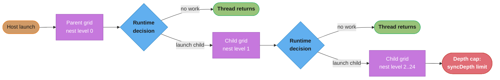
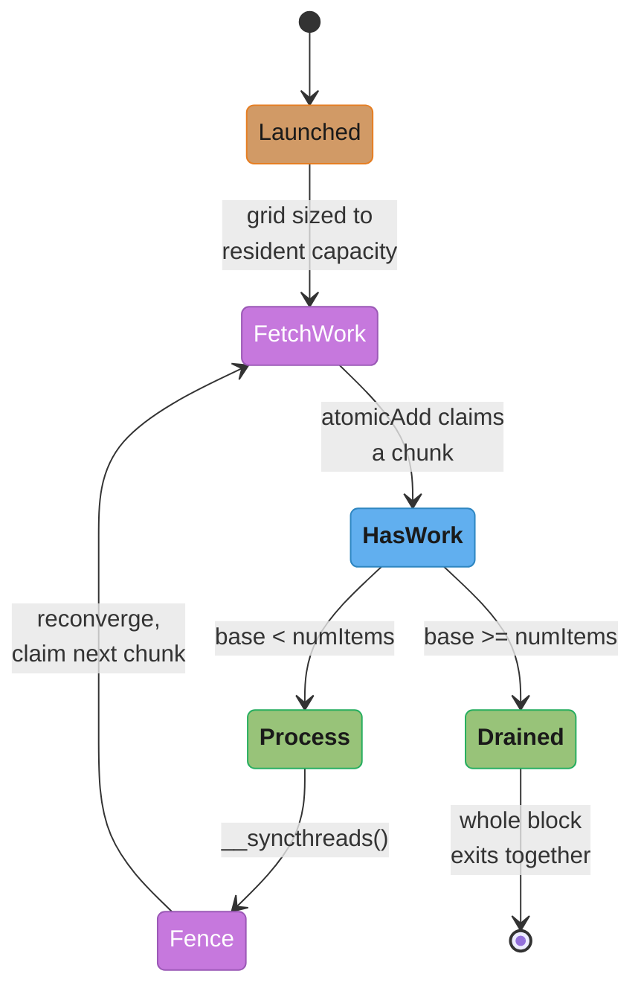
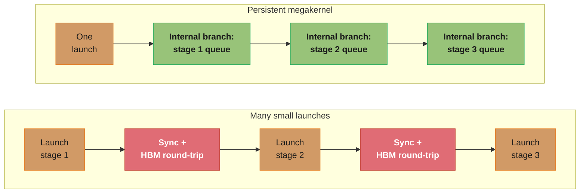
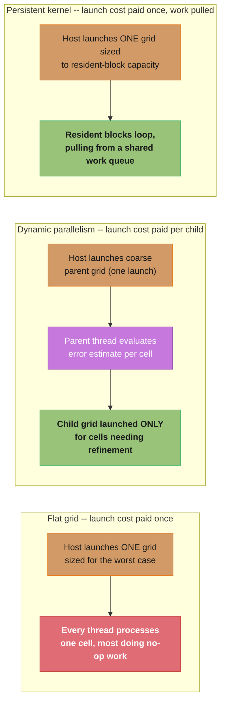
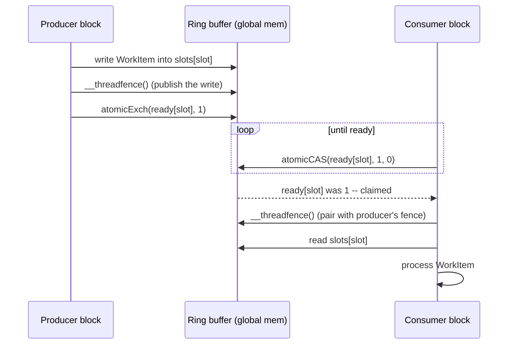
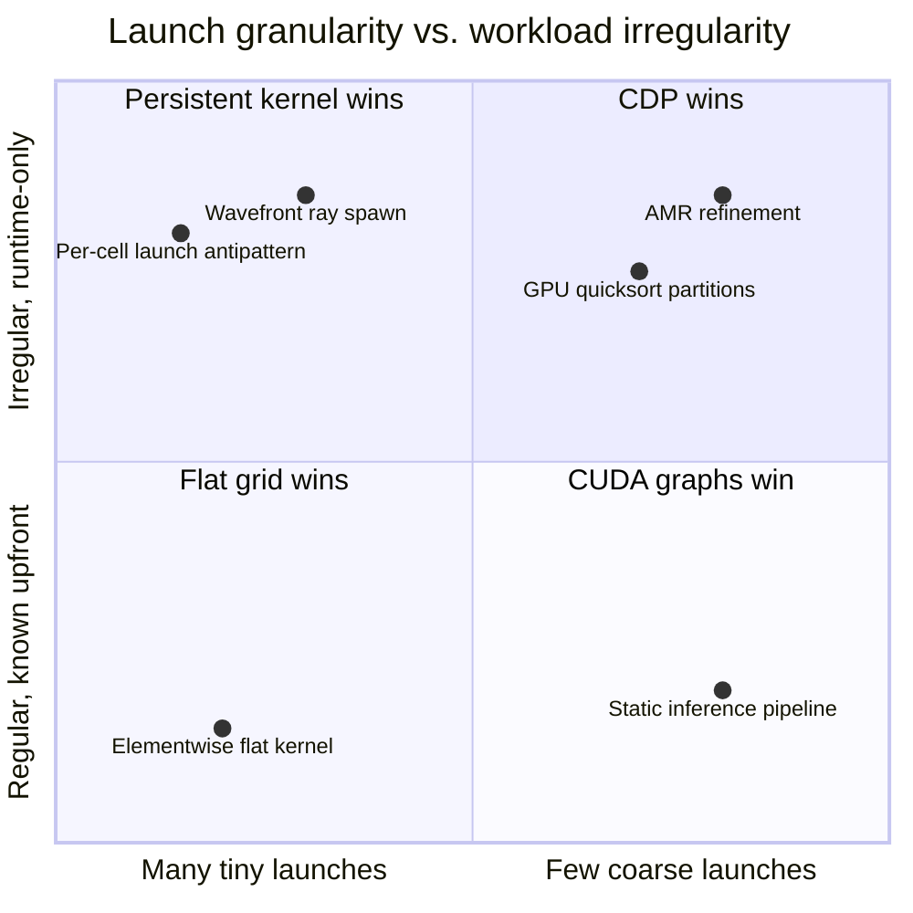
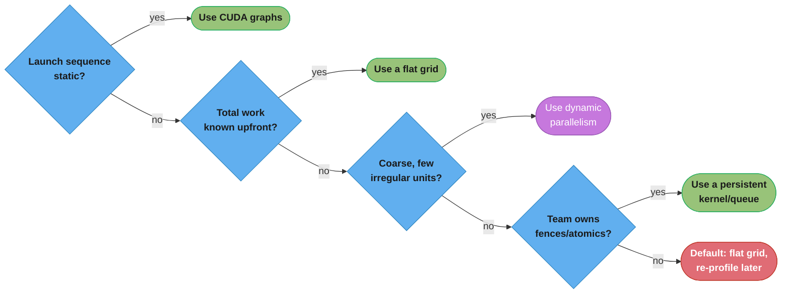
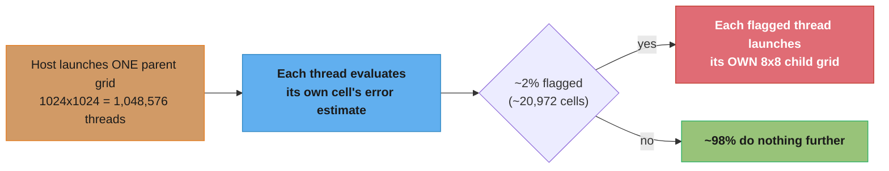

# Dynamic Parallelism & Advanced Kernels

## 1. Concept Overview

Every kernel covered so far in this section is launched exactly once, from
the host, with a grid shape the CPU decides before any GPU work begins.
**CUDA Dynamic Parallelism (CDP)** breaks that rule: a `__global__` function
running on the device can itself launch a child kernel, using the identical
`kernel<<<grid, block>>>(args)` syntax a host thread would use. This module
covers that device-side launch model plus three related "avoid the relaunch"
techniques senior GPU engineers reach for instead of, or alongside, CDP:
**persistent kernels** that stay resident on the SMs for the program's whole
lifetime and pull work from a queue, **producer-consumer** kernels where
different blocks generate and consume work concurrently, and **megakernels**
that fuse many small stages into one big kernel to avoid launch overhead
entirely.

The throughline is the same senior-engineer question: *when the amount of
work — or its shape — is not known until runtime, how do you avoid paying
launch overhead for every unit of it?* CDP answers it by letting the GPU
launch more GPU work for itself; persistent kernels and megakernels answer it
by never launching more than once. Both are advanced, special-purpose tools —
most production CUDA code needs neither — and the central lesson here is
recognizing the common cases where reaching for them makes a kernel *slower*,
not faster. Cross-links: [cuda_graphs](../cuda_graphs/) (static, predictable
launch sequences), [synchronization_and_atomics](../synchronization_and_atomics/)
(fence/atomic primitives every persistent/producer-consumer kernel depends
on), and [warp_level_primitives_and_cooperative_groups](../warp_level_primitives_and_cooperative_groups/)
(grid-wide sync via `grid.sync()`).

---

## 2. Intuition

> **One-line analogy**: A flat grid is a foreman (the host) who hands out
> every day's work orders each morning; dynamic parallelism is a foreman who
> occasionally lets a line worker call in *more* workers mid-shift on
> discovering more sub-tasks — powerful when the sub-work is genuinely
> unpredictable, wasteful when used to hire one extra person per box.

**Mental model**: Every kernel launch — host-side or device-side — is a
transaction with fixed bookkeeping cost: the runtime allocates grid/block
state, registers the launch for completion tracking, and (for a child grid)
reserves device memory to support the parent's ability to wait on it. That
cost is roughly constant regardless of how little work the launched grid
does. A flat, host-launched grid pays it once for potentially billions of
threads; dynamic parallelism pays it again for every child grid a device
thread launches, so its win depends on child grids being few and substantial,
not many and tiny. Persistent kernels sidestep the transaction cost
altogether: launch once, with exactly as many blocks as the GPU can run
simultaneously, and have those blocks loop, pulling from a shared queue until
the work is exhausted — the "relaunch" becomes a cheap `atomicAdd` instead of
a full launch.

**Why it matters**: Workloads with genuinely data-dependent structure — AMR
in a CFD solver that only subdivides cells where the local error estimate is
high, recursive graph traversal with unknown fan-out, wavefront ray tracing
with unpredictable ray spawning — cannot be expressed as one flat grid
decided in advance. Engineers who don't know CDP exists either serialize the
irregular part back onto the host (a round-trip per recursion level, often
costlier than the child launches would be) or over-provision a flat grid for
the worst case and waste enormous idle-thread capacity. Engineers who reach
for CDP *reflexively* — one child launch per thread — routinely make their
kernel slower than the naive flat version, because launch overhead
multiplied by a million threads dwarfs the work being launched.

**Key insight**: Ask two questions before writing a child `<<<...>>>()`
call: (1) *is the irregular work coarse enough that a handful of child
launches amortize their overhead* (good fit — AMR launching one child grid
per refined region, not per output cell), and (2) *is the total shape of
launches known ahead of time, even if work sizes differ* (if so, [CUDA
graphs](../cuda_graphs/) capture-and-replay the whole sequence far cheaper
than CDP pays every time). Only work both irregular in shape and unknown
until runtime earns dynamic parallelism's overhead — everything else is
better served by a flat grid, a persistent kernel, or a captured graph.

---

## 3. Core Principles

- **A device-side kernel launch uses the same `<<<grid, block, shmem,
  stream>>>` syntax as a host launch**, issued from inside a `__global__`
  function that is itself running on the GPU — this is CUDA Dynamic
  Parallelism (CDP), introduced with Kepler (compute capability 3.5) and
  requiring separable compilation (`nvcc -rdc=true`) linked against
  `libcudadevrt`.
- **A device-side launch is asynchronous with respect to the launching
  thread** and, under the modern CDP2 execution model (the default since
  CUDA 10.1 and the only supported model as of CUDA 12.0 — the original CDP1
  model with its explicit per-thread `cudaDeviceSynchronize()` requirement is
  deprecated), is implicitly synchronized only when the **parent grid as a
  whole** completes, not at the launching thread's return.
- **Device-side launches carry their own bookkeeping overhead, typically
  larger than a host-side launch's** — roughly 3-8 microseconds per child
  launch versus roughly 5-10 microseconds for a host-side launch at the
  driver/queue level. Multiplied across a large thread count, this overhead
  dominates quickly.
- **CDP enforces a hardware nesting-depth limit** (default 24 levels,
  configurable via `cudaDeviceSetLimit(cudaLimitDevRuntimeSyncDepth, depth)`)
  and a **pending launch count limit**
  (`cudaLimitDevRuntimePendingLaunchCount`, default 2048) — exceeding either
  aborts further launches with `cudaErrorLaunchPendingCountExceeded` or a
  nesting-depth failure.
- **A persistent kernel launches exactly once**, with a grid sized to the
  number of blocks that can be simultaneously resident across every SM
  (`cudaOccupancyMaxActiveBlocksPerMultiprocessor` × SM count) — not the
  amount of work — and each resident block loops, pulling work items from a
  shared queue via `atomicAdd`, until the queue is drained.
- **Grid-stride persistence generalizes the grid-stride loop's index
  arithmetic to a work queue**: instead of computing `i += blockDim.x *
  gridDim.x` over a fixed-size array, a block claims the next chunk of *n*
  items from a shared counter each iteration, so the same fixed set of
  resident blocks can drain a queue of arbitrary, even growing, size.
- **Producer-consumer kernels split blocks (or warps) into roles**: some
  publish work items into a shared structure (a ring buffer, a growable
  queue), others drain and process them — and every hand-off between roles
  needs an explicit memory fence (`__threadfence()`) or an atomic with
  acquire/release semantics, because `__syncthreads()` only orders memory
  within one thread block.
- **Dynamic parallelism is, in the majority of realistic workloads, slower
  than a well-designed flat grid or persistent kernel** — this is the single
  most important practical fact in this module, and interview answers that
  don't mention it are incomplete.
- **A megakernel fuses many small stages (or many small dynamic-parallelism
  child launches) into one large, long-running kernel** that internally
  branches per work-item type, trading code complexity and register pressure
  for the elimination of per-stage launch overhead — the alternative to
  [CUDA graphs](../cuda_graphs/) when the launch sequence itself is not known
  in advance.

---

## 4. Types / Architectures / Strategies

### 4.1 Dynamic parallelism (device-side launch)

A `__global__` function launches one or more child grids based on a
runtime-computed decision (an error estimate, a traversal fan-out, a work-list
size). Two historical implementations exist:

| Model | Introduced | Synchronization semantics | Status |
|-------|-----------|---------------------------|--------|
| CDP1 | CUDA 5.0 (Kepler, sm_35) | Explicit per-thread `cudaDeviceSynchronize()`; a parent thread block does not complete until every child grid *it* launched completes | Deprecated since CUDA 11.6, removed in CUDA 12.0 |
| CDP2 | CUDA 10.1 | Implicit synchronization at *parent grid* completion; no per-thread explicit sync required; simpler and measurably faster launch path | Default since CUDA 10.1; the only supported model from CUDA 12.0 onward |

### The device-side launch nesting model



Each nesting level reserves its own device-memory sync state up front, which
is exactly why `cudaLimitDevRuntimeSyncDepth` bounds how deep a child grid can
launch a grandchild — the AMR code in Section 6.1 walks this same
parent-to-child-to-grandchild path one refinement level at a time.

Best-fit use cases: **AMR** — a coarse grid evaluates a local
error/refinement criterion per cell and launches a child grid only for cells
needing finer resolution; **recursive algorithms** — GPU quicksort launches
a child grid per partition until a size threshold is reached; **irregular
graph traversal** — a BFS/DFS frontier of unpredictable size launches a
child grid sized to that frontier, not a worst-case bound.

### 4.2 Persistent kernels and work queues

A single kernel launch sized to exactly fill the device's resident-block
capacity, where every block runs an unbounded loop pulling from a shared
counter (a simple index) or a richer queue (a ring buffer of heterogeneous
work items) until a sentinel/exhaustion condition is reached. The kernel
never returns until *all* work — including work discovered mid-run by other
blocks — has been processed.

### The persistent kernel's work-queue loop



The loop never launches anything after the first `Launched` transition — every
"relaunch" is the cheap `FetchWork` -> `HasWork` -> `Process` -> `Fence` cycle,
and `HasWork` is the single exit gate every resident block agrees on together.

### 4.3 Producer-consumer kernels

A variant of the persistent-kernel pattern where blocks (or warps within a
block) are assigned distinct roles: producers compute or discover new work
items and publish them; consumers drain and process them. Requires a
concurrent queue data structure (ring buffer with atomic head/tail counters)
and correct fencing so a consumer never observes a queue slot's "ready" flag
before the corresponding data write has become globally visible.

### 4.4 Grid-wide cooperation for persistent kernels

Persistent kernels frequently need all resident blocks to reach a common
point before proceeding (a multi-phase algorithm where phase 2 needs phase 1
drained everywhere). Two mechanisms: **Cooperative Groups `grid.sync()`** — a
true grid-wide barrier requiring `cudaLaunchCooperativeKernel` and a grid
sized to resident-block capacity — or the lighter-weight, more error-prone
**manual global-memory flag with `__threadfence()`** (a counter each block
increments on arrival, then busy-waits on) — see the BROKEN→FIX in Section
10 for the bug this invites.

### 4.5 Megakernels and kernel fusion (alternative to many small launches)

Instead of many small, independently-launched kernels (or many CDP child
launches), fuse all the stages into one large kernel that internally
dispatches per work-item type — a **megakernel**. Wavefront path tracers fuse
ray-generation, intersection, shading, and ray-spawning into one persistent
kernel with a work queue per stage; fused LLM inference kernels similarly
fuse what would otherwise be several matmul/softmax launches into one. The
tradeoff is higher code complexity and register pressure (hurting occupancy —
see [occupancy_and_launch_configuration](../occupancy_and_launch_configuration/))
in exchange for eliminating launch overhead entirely. When the kernel
sequence is **static and known ahead of time**, [CUDA graphs](../cuda_graphs/)
solve the same problem with far less code by capturing and replaying it;
megakernels earn their complexity only when the sequence itself is
data-dependent.

### Many small launches vs. one persistent megakernel



The many-small-launches path pays per-stage launch overhead and an HBM
round-trip between every stage; the megakernel pays a launch once and keeps
all three stages' data resident, at the cost of the register pressure and
occupancy loss discussed in Section 8.

---

## 5. Architecture Diagrams

### Flat grid vs. dynamic parallelism (AMR) vs. persistent kernel



The flat grid pays one launch but wastes threads on cells that never needed
refinement; CDP pays a launch *per refined region*, winning only when
regions are coarse and few; the persistent kernel pays one launch total and
lets resident blocks absorb whatever irregular work the queue produces.

### Producer-consumer hand-off (sequence)



The two `__threadfence()` calls are not decorative: without the producer's
fence, the "ready" flag can become visible before the data write does;
without the consumer's fence, the data read can be hoisted ahead of the flag
check. Both are required, not either one.

### Resident-block sizing for a persistent kernel (ASCII grid)

```
Device: 108 SMs (H100-class), occupancy calculator says 2 resident
blocks/SM fit at this kernel's register/shared-mem usage.

Resident blocks = SMs x blocksPerSM = 108 x 2 = 216 blocks, launched ONCE.

SM  0: [ Block A ][ Block B ]   -- both loop independently, pulling
SM  1: [ Block C ][ Block D ]      from the SAME global work queue via
SM  2: [ Block E ][ Block F ]      atomicAdd(&g_nextWorkItem, chunkSize)
 ...        ...        ...
SM107: [ Block ZY][ Block ZZ]

Work queue (grows or shrinks at runtime, size not known at launch time):
[ item0 ][ item1 ][ item2 ][ item3 ][ ... ][ itemN-1 ]
    ^ claimed by A   ^ claimed by C     ^ next chunk still unclaimed

Launching 216 blocks once costs one launch's overhead, regardless of
whether the queue ends up holding 10,000 items or 10,000,000 -- the
"relaunch" work is only an atomicAdd plus a loop iteration.
```

**What this actually says.** "Size the grid to the *machine*, never to the problem. Ask how many
blocks physically fit on the GPU at once, launch exactly that many, and let each one loop until
the work runs out."

Every other kernel in this section sizes its grid by dividing the problem by the block size. A
persistent kernel inverts that completely: the problem size does not appear in the launch
configuration at all. That is the whole trick, and it is why the queue can grow at runtime
without a relaunch.

| Symbol | What it is |
|--------|------------|
| `SMs` | Streaming multiprocessors on the device, from `cudaDevAttrMultiProcessorCount`. `108` here |
| `blocksPerSM` | How many blocks of *this* kernel fit resident on one SM, from `cudaOccupancyMaxActiveBlocksPerMultiprocessor`. Set by register and shared-memory usage |
| `Resident blocks` | `SMs x blocksPerSM` — the grid size. The GPU is exactly full, no block ever waits to be scheduled |
| `g_nextWorkItem` | Global counter every resident block bumps with `atomicAdd` to claim its next chunk |
| `chunkSize` | Items claimed per atomic. Trades atomic traffic against load imbalance at the tail |

**Walk one example.** Same kernel, two queue sizes, and the sizing that does not move:

```
    SMs                    = 108
    blocksPerSM            =   2        (register/shared-mem limited)
    Resident blocks        = 108 x 2    = 216 blocks     <- the launch config

    queue = 10,000 items     -> 216 blocks launched, 1 launch
    queue = 10,000,000 items -> 216 blocks launched, 1 launch   (identical)

    conventional flat grid, 256 threads/block, one thread per item:
      10,000 items          -> ceil(10,000 / 256)      =     40 blocks, 1 launch
      10,000,000 items      -> ceil(10,000,000 / 256)  = 39,063 blocks, 1 launch
                                                          ^ grid tracks the problem

    per-item "relaunch" cost, persistent : one atomicAdd + one loop iteration
    per-item "relaunch" cost, device-side launch : 3-8 us of bookkeeping
```

Launching more than 216 blocks does not help — the extra blocks cannot be resident, so they
queue behind the first 216 and, worse, will deadlock any grid-wide barrier the kernel relies on
because the blocks it is waiting for are not running yet. Launching fewer leaves SMs idle. The
formula has exactly one right answer, which is unusual in CUDA launch configuration and is the
reason both API calls in it are mandatory rather than nice-to-have.


Launch *fewer* blocks than SM-capacity and compute sits idle; launch *more*
than the device can run at once and blocks queue behind each other, turning
a bounded resident loop into unpredictable time-sliced scheduling — a
correctness hazard for any pattern (`grid.sync()`) assuming every block runs
*right now*.

---

## 6. How It Works — Detailed Mechanics

### 6.1 Device-side kernel launch — adaptive mesh refinement (C++)

```cpp
#include <cuda_runtime.h>

// Parent kernel: each thread evaluates one coarse cell. If the local error
// estimate exceeds a threshold, it launches a child grid that refines just
// that cell -- classic adaptive mesh refinement (AMR). Compile with
// `nvcc -rdc=true` and link against `libcudadevrt` for device-side launches.
__global__ void refineCoarseGrid(float* coarseGrid, int numCells,
                                  float errorThreshold) {
    int cellId = blockIdx.x * blockDim.x + threadIdx.x;
    if (cellId >= numCells) return;

    float localError = estimateError(coarseGrid, cellId);
    if (localError > errorThreshold) {
        // Device-side launch: identical <<<...>>> syntax to a host launch,
        // issued here by a single GPU thread (CDP, compute capability 3.5+).
        dim3 childGrid(1);
        dim3 childBlock(64);   // 64 sub-cells per refined region
        refineSubCells<<<childGrid, childBlock>>>(coarseGrid, cellId,
                                                    errorThreshold * 0.5f);
        // Asynchronous relative to this thread; under CDP2 (CUDA 10.1+, the
        // only supported model since CUDA 12.0) it is implicitly
        // synchronized when the *parent grid* completes -- no per-thread
        // cudaDeviceSynchronize() needed here.
    }
}

__global__ void refineSubCells(float* coarseGrid, int parentCellId,
                                float errorThreshold) {
    int subCellId = threadIdx.x;
    float subError = estimateSubCellError(coarseGrid, parentCellId, subCellId);

    // A sub-cell still above threshold recurses one level deeper -- bounded
    // by the nesting-depth limit (default 24, configurable via
    // cudaDeviceSetLimit(cudaLimitDevRuntimeSyncDepth, depth); each level
    // reserves device memory up front for its sync state).
    if (subError > errorThreshold) {
        refineSubCells<<<1, 64>>>(coarseGrid, parentCellId * 64 + subCellId,
                                    errorThreshold * 0.5f);
    } else {
        writeFinalValue(coarseGrid, parentCellId, subCellId);
    }
}

// Set device-runtime limits BEFORE the first kernel that might launch
// children -- raising them after launches begin has no effect.
void configureAndLaunchAMR(float* d_coarseGrid, int numCells) {
    cudaDeviceSetLimit(cudaLimitDevRuntimeSyncDepth, 8);          // bound nesting
    cudaDeviceSetLimit(cudaLimitDevRuntimePendingLaunchCount, 4096);

    int threads = 256;
    int blocks = (numCells + threads - 1) / threads;
    refineCoarseGrid<<<blocks, threads>>>(d_coarseGrid, numCells, 0.01f);
    cudaDeviceSynchronize();   // waits for the ENTIRE nested launch tree
}
```

### 6.2 Persistent kernel with a grid-stride work-queue loop (C++)

```cpp
struct WorkItem { int id; float payload[8]; };
struct Result   { int id; float value; };

__device__ unsigned long long g_nextWorkItem = 0;

__device__ Result processItem(const WorkItem& item) {
    float acc = 0.0f;
    #pragma unroll
    for (int k = 0; k < 8; ++k) acc += item.payload[k] * item.payload[k];
    return Result{item.id, acc};
}

// Launched EXACTLY ONCE with a grid sized to the device's resident-block
// capacity (see the host code below) -- not to numItems. Each block loops
// for the kernel's entire lifetime, pulling a chunk of work each pass.
__global__ void persistentWorkerChunked(const WorkItem* queue,
                                         unsigned long long numItems,
                                         Result* results) {
    __shared__ unsigned long long base;

    for (;;) {
        if (threadIdx.x == 0) {
            // Grid-stride persistence: claim a whole chunk (blockDim.x
            // items) in ONE atomic op instead of one atomic op per thread --
            // the work-queue analogue of a grid-stride loop's index math.
            base = atomicAdd(&g_nextWorkItem, (unsigned long long)blockDim.x);
        }
        __syncthreads();
        if (base >= numItems) break;   // every thread in the block agrees:
                                        // the queue is drained -- exit together

        unsigned long long idx = base + threadIdx.x;
        if (idx < numItems) {
            results[idx] = processItem(queue[idx]);
        }
        __syncthreads();   // reconverge before the next atomicAdd so the
                            // whole block claims its next chunk together
    }
}

void launchPersistentWorker(const WorkItem* d_queue, unsigned long long numItems,
                             Result* d_results) {
    int numSMs = 0, blocksPerSM = 0, threadsPerBlock = 256;
    cudaDeviceGetAttribute(&numSMs, cudaDevAttrMultiProcessorCount, 0);
    cudaOccupancyMaxActiveBlocksPerMultiprocessor(
        &blocksPerSM, persistentWorkerChunked, threadsPerBlock, /*dynSmem=*/0);

    int residentBlocks = numSMs * blocksPerSM;   // fills the GPU once, no more
    persistentWorkerChunked<<<residentBlocks, threadsPerBlock>>>(
        d_queue, numItems, d_results);
    cudaDeviceSynchronize();
}
```

Launching *fewer* than `numSMs * blocksPerSM` blocks leaves SMs idle;
launching *more* means some blocks cannot start until earlier ones retire,
breaking any pattern (Section 6.4) that assumes every launched block is
concurrently resident.

### 6.3 Producer-consumer with a ring buffer and explicit fences (C++)

```cpp
struct RingBuffer {
    WorkItem* slots;
    unsigned int capacity;
    unsigned int head;      // next slot index a producer will claim
    unsigned int tail;      // next slot index a consumer will drain
    int* ready;             // per-slot readiness flags, 0 or 1
};

__device__ void producerPush(RingBuffer* rb, const WorkItem& item) {
    unsigned int slot = atomicAdd(&rb->head, 1u) % rb->capacity;
    rb->slots[slot] = item;
    __threadfence();                    // publish data BEFORE flag visible
    atomicExch(&rb->ready[slot], 1);
}

__device__ bool consumerTryPop(RingBuffer* rb, WorkItem* out) {
    unsigned int slot = rb->tail % rb->capacity;
    if (atomicCAS(&rb->ready[slot], 1, 0) == 0) {
        return false;                    // producer hasn't published yet
    }
    __threadfence();                    // pair with producer's fence: data
                                         // read cannot be hoisted above this
    *out = rb->slots[slot];
    atomicAdd(&rb->tail, 1u);
    return true;
}

// Even-indexed blocks produce work items from an input task list; odd-
// indexed blocks drain the ring buffer and process items concurrently.
__global__ void producerConsumerKernel(RingBuffer* rb, const Task* tasks,
                                        int numTasks, Result* results,
                                        int* remaining) {
    bool isProducer = (blockIdx.x % 2 == 0);

    if (isProducer) {
        for (int i = blockIdx.x / 2; i < numTasks; i += gridDim.x / 2) {
            producerPush(rb, generateWorkItem(tasks[i]));
        }
    } else {
        WorkItem item;
        while (atomicAdd(remaining, 0) > 0) {
            if (consumerTryPop(rb, &item)) {
                Result r = processItem(item);
                results[item.id] = r;
                atomicSub(remaining, 1);
            }
        }
    }
}
```

### 6.4 Grid-wide cooperation with cooperative groups (C++, sketch)

A persistent kernel with two phases that must not interleave across blocks
(phase 2 needs every block's phase-1 output) needs a *true* grid-wide
barrier, not `__syncthreads()`. Launch via `cudaLaunchCooperativeKernel`
(not `<<<...>>>()`) with the grid sized to exact resident-block capacity —
identical sizing to Section 6.2 — then call `cooperative_groups::this_grid()
.sync()` between the two phases:

```cpp
__global__ void twoPhasePersistent(float* data, int n) {
    cooperative_groups::grid_group grid = cooperative_groups::this_grid();
    for (int i = blockIdx.x * blockDim.x + threadIdx.x; i < n;
         i += blockDim.x * gridDim.x) phaseOneCompute(data, i);
    grid.sync();   // valid only because the grid == resident-block capacity
    for (int i = blockIdx.x * blockDim.x + threadIdx.x; i < n;
         i += blockDim.x * gridDim.x) phaseTwoCompute(data, i);
}
```

Full API and launch plumbing:
[warp_level_primitives_and_cooperative_groups](../warp_level_primitives_and_cooperative_groups/).

### 6.5 Python note — no device-side launch in the mainstream Python stack

Numba CUDA, CuPy `RawKernel`, and Triton do not expose device-side kernel
launches (CDP) — they target the host-launch model only. Python code needing
AMR-like behavior either issues successive host-side launches per
refinement level, or calls a hand-written persistent kernel (Section 6.2)
through a `RawKernel`/PyTorch extension:

```python
import cupy as cp

module = cp.RawModule(code=persistent_worker_cpp_source)   # same body as 6.2
kernel = module.get_function("persistentWorkerChunked")

num_sms = cp.cuda.Device().attributes["MultiProcessorCount"]
blocks_per_sm = 2   # from a prior occupancy profiling run
kernel((num_sms * blocks_per_sm,), (256,), (queue_gpu, num_items, results_gpu))
```

---

## 7. Real-World Examples

- **AMR CFD solvers** — refining grid resolution only where gradients are
  steep (shock fronts, turbulence) is the textbook CDP use case: refinement
  decision and computation are natural parent/child kernels, with refined
  regions typically coarse enough (dozens to hundreds of cells) to amortize
  the child-launch cost.
- **Wavefront path tracers** — production renderers restructure ray tracing
  as a persistent megakernel with per-stage work queues (intersection,
  shading, ray-spawn) instead of one launch per ray bounce, since bounce
  counts vary wildly and a fresh launch per bounce would be overhead-bound.
- **GPU quicksort / recursive partitioning** — CDP recursively launches a
  child grid per partition until partitions shrink below a threshold, then
  finishes small partitions with a flat, non-recursive sort.
- **Graph analytics (Gunrock-style frontier expansion)** — BFS/SSSP with
  unpredictable per-level frontier sizes either launch dynamically-sized
  child grids per level or use a persistent kernel with a growable frontier
  queue to avoid a host round-trip at every level.
- **Fused LLM inference kernels** — serving engines fuse several small
  launches (QKV projection, attention, softmax, output projection) into
  fewer, larger kernels for the same reason a megakernel exists: overhead
  and HBM round-trips dominate when stages are small relative to cost.
- **CUTLASS and cuBLAS avoid dynamic parallelism entirely** — hand-tuned
  GEMM libraries resolve irregularity (tile size, split-K) via host-side
  heuristics chosen *before* the launch, since CDP's overhead is
  incompatible with their throughput targets.

---

## 8. Tradeoffs

| Approach | Launch count | Best for | Overhead profile | Complexity |
|----------|-------------|----------|-------------------|------------|
| Flat grid (worst-case sized) | 1 (host) | Regular, predictable work | Lowest overhead; wastes threads on no-op cases | Low |
| Dynamic parallelism (CDP2) | 1 (host) + N (device, per irregular unit) | Coarse-grained, deeply irregular work (AMR, recursive partitioning) | Each child launch costs several microseconds of device-runtime bookkeeping; dominates when N is large and per-child work is small | Medium — natural recursive code shape, but hard to profile and nesting-depth bounded |
| Persistent kernel + work queue | 1 (host), zero thereafter | Irregular work of any size, known or unknown ahead of time | Near-zero marginal cost per work item (an atomicAdd plus a loop iteration) | Medium-high — must size to occupancy exactly; busy-wait/fencing bugs are easy to introduce |
| Producer-consumer | 1 (host) | Work that is *generated* at runtime by some blocks and consumed by others | Same as persistent kernel, plus queue-management (ring buffer, fences) overhead | High — concurrent data structure correctness on top of persistent-kernel sizing |
| Megakernel / fusion | 1 (host) | Many small logical stages better run as one long kernel | Eliminates per-stage launch + HBM round-trip cost entirely | High — register pressure hurts occupancy; internal branching complicates every profile |
| [CUDA graphs](../cuda_graphs/) | 1 (capture) + 1 (replay, ~1 microsecond regardless of node count) | A *static*, known sequence of kernels, even with irregular argument values | Lowest possible overhead for a fixed, predictable launch sequence | Low-medium — no code restructuring, but the sequence itself must be fixed |

---

## 9. When to Use / When NOT to Use

### When dynamic parallelism helps vs. hurts



The two anti-patterns and best fits from Sections 7 and 10 cluster exactly
where the axes predict: AMR and quicksort sit top-right (coarse and
irregular, CDP's sweet spot); the per-cell launch antipattern sits top-left
(irregular but too fine-grained for CDP, where a persistent queue wins
instead); regular workloads never need CDP at all, regardless of grain size.

### Choosing an approach



This is the same decision procedure the prose below walks through, collapsed
into the order it should actually be asked: static sequence first (cheapest
fix), then known-upfront size, then coarse-vs-fine irregularity, then team
readiness for fence/atomic correctness.

**Use dynamic parallelism when:** the irregular structure is genuinely
unknown until runtime (a refinement decision, a recursion depth, a graph
fan-out) *and* the resulting child launches are coarse enough to amortize
launch overhead; recursion meaningfully simplifies the code versus manual
flattening; and nesting stays shallow (well under the 24-level default) with
pending launches comfortably under the 2048 default.

**Avoid dynamic parallelism when:** each parent thread would launch its own
tiny child grid — the single most common CDP misuse, covered as the primary
BROKEN→FIX in Section 10; the full set of work is knowable ahead of time
(batch it into one flat grid-stride kernel instead); or the kernel sits on a
latency-critical hot path where data-dependent launch-count variance is
itself a problem.

**Use a persistent kernel / work queue when:** the work is irregular, its
total size may not be known at launch time (it can grow while the kernel
runs, as in producer-consumer), and per-item overhead must be minimized —
this is CDP's main competitor and usually wins once the queue-management
code is written; or grid-wide cooperation (`grid.sync()`) is needed across
algorithm phases, since that already requires exact resident-block control.

**Avoid persistent kernels when:** the team cannot reliably reason about
memory fences and atomics — a subtly wrong fence hangs or silently corrupts
data in ways far harder to debug than a wrong answer from a one-shot kernel
(see [synchronization_and_atomics](../synchronization_and_atomics/)); or the
workload is genuinely regular, where a plain flat grid is simpler and has no
busy-wait or occupancy-sizing failure modes at all.

**Use a megakernel / fusion when** profiling shows launch overhead and
inter-kernel HBM round-trips, not per-kernel compute, are the bottleneck for
a sequence of small stages.

**Prefer [CUDA graphs](../cuda_graphs/) instead when** the sequence of
kernels is static across iterations, even if argument *values* change —
graphs solve the same launch-overhead problem with dramatically less code
risk than dynamic parallelism or a hand-written persistent kernel.

---

## 10. Common Pitfalls

**BROKEN: one child-kernel launch per parent thread — launch-overhead
explosion**

```cpp
// BROKEN: every one of the n parent threads independently decides to launch
// its own single-thread child grid. For n = 1,000,000, that is 1,000,000
// device-side launches, each costing several microseconds of device-runtime
// bookkeeping -- roughly 1,000,000 x 5 microseconds ~= 5 seconds of pure
// launch overhead before a single child thread does useful work.
__global__ void parentBroken(const int* data, int* out, int n) {
    int i = blockIdx.x * blockDim.x + threadIdx.x;
    if (i >= n) return;
    childKernel<<<1, 1>>>(data, out, i);   // one launch per element!
}
```

```cpp
// FIX: no device-side launch at all. A flat grid-stride loop processes
// every element directly, inlining what the child kernel did as an ordinary
// device function call -- zero additional launches, zero nesting-depth or
// pending-launch-count concerns, and the same total amount of arithmetic
// work completed in a single flat kernel's launch overhead.
__global__ void parentFixed(const int* data, int* out, int n) {
    for (int i = blockIdx.x * blockDim.x + threadIdx.x; i < n;
         i += blockDim.x * gridDim.x) {
        out[i] = childKernelBody(data[i]);   // inlined, not launched
    }
}
```

If the per-element work genuinely varies enough to need dynamic behavior
(not just "call this function"), batch elements that need the *same* extra
work into groups and launch **one** child grid per group, not per element —
this is exactly the AMR pattern in Section 6.1, where one child grid handles
an entire refined region rather than one output value.

**BROKEN: persistent-kernel cross-block signaling without a memory fence**

```cpp
// BROKEN: block 0 computes a value other blocks need and signals readiness
// with a plain (non-atomic) global flag. Two bugs compound here: (1) the
// write to g_sharedResult can become visible to other SMs AFTER the flag
// write, since nothing orders them, and (2) the compiler may cache
// g_dataReady in a register inside the while loop since it is not volatile
// or atomic, so the loop may never observe the update at all.
__device__ int g_dataReady = 0;
__device__ float g_sharedResult;

__global__ void producerConsumerBroken(float* data, float* out) {
    if (blockIdx.x == 0) {
        g_sharedResult = computeExpensiveValue(data);
        g_dataReady = 1;                       // no fence, no atomic
    } else {
        while (g_dataReady == 0) { }           // may spin forever, or read a
        out[blockIdx.x] = g_sharedResult * 2.0f;  // stale g_sharedResult
    }
}
```

```cpp
// FIX: an atomic write for the flag (forces a real global memory operation,
// forbidding the compiler from hoisting it or caching the read), paired
// __threadfence() calls on both sides of the hand-off so the data write is
// guaranteed globally visible before the flag is observed, and an atomic
// read in the spin loop so every iteration re-checks global memory.
__device__ int g_dataReady = 0;
__device__ float g_sharedResult;

__global__ void producerConsumerFixed(float* data, float* out) {
    if (blockIdx.x == 0) {
        float value = computeExpensiveValue(data);
        g_sharedResult = value;
        __threadfence();                       // publish data before flag
        atomicExch(&g_dataReady, 1);            // atomic write: no caching
    } else {
        while (atomicAdd(&g_dataReady, 0) == 0) { }  // atomic read every pass
        __threadfence();                        // pair with producer's fence
        out[blockIdx.x] = g_sharedResult * 2.0f;      // now guaranteed fresh
    }
}
```

**Other common pitfalls:**
- **Sizing a persistent kernel's grid larger than resident-block capacity.**
  Extra blocks queue behind the resident set and never run concurrently —
  any grid-wide-simultaneity assumption (busy-wait, `grid.sync()`) hangs
  waiting on a block that hasn't even started.
- **Forgetting `nvcc -rdc=true` and the `libcudadevrt` link** for any file
  issuing a device-side launch — the build fails or silently produces a
  kernel that cannot launch children.
- **Assuming CDP1's per-thread `cudaDeviceSynchronize()` semantics still
  apply.** Code rebuilt under CUDA 12+ (CDP2-only) needs re-auditing: sync
  now happens at parent-grid completion, not per launching thread.
- **Exceeding `cudaLimitDevRuntimePendingLaunchCount`** by fanning out too
  many pending child launches — returns `cudaErrorLaunchPendingCountExceeded`
  rather than silently queuing, so an uncaptured error looks like a hang
  several calls downstream.
- **Treating a megakernel's register pressure as free.** Fusing stages
  inflates per-thread register usage, lowering occupancy (see
  [occupancy_and_launch_configuration](../occupancy_and_launch_configuration/))
  and erasing the launch-overhead savings the fusion was meant to capture.

---

## 11. Technologies & Tools

| Tool / API | Purpose |
|------------|---------|
| `kernel<<<grid, block, shmem, stream>>>()` (device-side) | Child kernel launch from within a `__global__` function — CUDA Dynamic Parallelism |
| `nvcc -rdc=true` + `libcudadevrt` | Required compile/link flags for any translation unit issuing device-side launches |
| `cudaDeviceSetLimit(cudaLimitDevRuntimeSyncDepth, n)` | Configure the nesting-depth ceiling (default 24) before the first CDP launch |
| `cudaDeviceSetLimit(cudaLimitDevRuntimePendingLaunchCount, n)` | Configure the max concurrently-pending child launches (default 2048) |
| `cudaOccupancyMaxActiveBlocksPerMultiprocessor` | Computes exactly how many blocks of a given kernel fit resident per SM — the persistent-kernel sizing input |
| `cudaDeviceGetAttribute(..., cudaDevAttrMultiProcessorCount, ...)` | Reads SM count, the other half of persistent-kernel sizing |
| `cudaLaunchCooperativeKernel` | Required launch entry point for kernels that call `grid.sync()` |
| `cooperative_groups::grid_group::sync()` | True grid-wide barrier across all resident blocks |
| `__threadfence()` | Orders a thread's prior global-memory writes to be visible to all SMs before later writes — required for cross-block hand-offs |
| `atomicAdd` / `atomicExch` / `atomicCAS` | Building blocks for work-queue counters and ring-buffer ready flags |
| Nsight Systems | Timeline view exposing device-side child-launch counts and gaps — see [profiling_and_performance_analysis](../profiling_and_performance_analysis/) |
| Nsight Compute | Per-launch overhead and occupancy metrics for diagnosing an over-fanned-out CDP kernel |
| compute-sanitizer (racecheck/synccheck) | Catches missing fences and cross-block races in persistent/producer-consumer kernels — see [debugging_correctness_and_numerics](../debugging_correctness_and_numerics/) |
| [CUDA graphs](../cuda_graphs/) | Alternative for static launch sequences; captures and replays a DAG of kernels with near-zero per-replay host overhead |

---

## 12. Interview Questions with Answers

**Q: Why is dynamic parallelism often slower than a well-designed flat grid?**
Every child launch pays several microseconds of device-runtime bookkeeping
overhead regardless of how little work it does, so unless each child launch
amortizes that cost over substantial work, the accumulated overhead across
many small child grids exceeds a single flat, worst-case-sized grid's cost.

**Q: What happens if every thread of a large parent grid launches its own tiny
child kernel?** The per-launch bookkeeping cost (roughly 3-8 microseconds)
multiplies by the thread count — for a million-thread parent grid that is
several seconds of pure launch overhead before any child does useful work,
almost always worse than inlining the child's logic into a flat grid-stride
loop.

**Q: What is the CUDA Dynamic Parallelism nesting-depth limit, and why does it
matter?** The device runtime defaults to a maximum of 24 nested-launch levels
(`cudaLimitDevRuntimeSyncDepth`) because each level reserves device memory up
front for its synchronization state, so deep recursion either hits the
ceiling and fails or consumes memory proportional to the configured depth.

**Q: What is `cudaLimitDevRuntimePendingLaunchCount`, and what happens if you
exceed it?** It caps how many child grids can be concurrently pending at
once (default 2048); exceeding it returns
`cudaErrorLaunchPendingCountExceeded` rather than silently queuing further
launches, so an unchecked error here often surfaces as a confusing
downstream failure.

**Q: Why do persistent kernels risk hanging if you don't size the grid to
actual occupancy?** A persistent kernel's blocks never complete on their own
— they loop until the queue drains — so if the launch has more blocks than
the device can run simultaneously, the excess blocks queue forever behind a
resident set that never yields, deadlocking any grid-wide assumption
(busy-wait signaling, `grid.sync()`).

**Q: What is the deprecation status of CDP1 versus CDP2, and what build flags
does dynamic parallelism require?** CDP1 (explicit per-thread
`cudaDeviceSynchronize()`, CUDA 5.0) has been deprecated since CUDA 11.6 and
removed from CUDA 12.0 in favor of the simpler, faster CDP2 model shipped in
CUDA 10.1; either model requires compiling with `nvcc -rdc=true` and linking
`libcudadevrt`.

**Q: How does a child grid launch differ from a host launch in its
synchronization semantics?** A child launch is asynchronous relative to the
launching thread and, under CDP2, is implicitly synchronized only when the
entire parent grid completes — code written against CDP1's per-thread
`cudaDeviceSynchronize()` expectations must be re-audited for CDP2.

**Q: What is a persistent kernel, and how does it avoid relaunch overhead?**
A
persistent kernel launches exactly once, sized to the blocks the device can
run simultaneously (`cudaOccupancyMaxActiveBlocksPerMultiprocessor` x SM
count), and each resident block loops pulling work from a shared queue via
`atomicAdd` until drained — replacing many launches with cheap atomics and
loop iterations.

**Q: How does a grid-stride loop generalize into a persistent work-queue
loop?** A grid-stride loop advances a fixed index by `blockDim.x *
gridDim.x` over a known-size array; grid-stride persistence instead has each
block atomically claim the next chunk from a shared counter each iteration,
so the same resident blocks can drain a queue whose size may not even be
known at launch time.

**Q: What is required to use grid-wide synchronization (`grid.sync()`) in a
persistent kernel?** The kernel must be launched via
`cudaLaunchCooperativeKernel` rather than `<<<...>>>()`, with a grid size
that does not exceed the device's resident-block capacity, since `grid.sync()`
is a true barrier that can only complete if every block is actually running.

**Q: Why do you need `__threadfence()` in a producer-consumer kernel instead of
just `__syncthreads()`?** `__syncthreads()` only orders memory within one
thread block; a producer and consumer in different blocks need
`__threadfence()` to guarantee a data write is visible to every SM before a
paired flag write or read is observed.

**Q: What is the difference between a memory fence and a barrier here?**
A
barrier (`__syncthreads()`, `grid.sync()`) makes every participant wait until
all reach the same point; a fence (`__threadfence()`) makes no thread wait —
it only orders one thread's own writes, which is why one-directional
producer-to-consumer hand-offs need a fence, not a barrier.

**Q: What is adaptive mesh refinement, and why does dynamic parallelism map to
it naturally?** AMR increases grid resolution only where a local error
estimate is high (shock fronts, turbulence), and it fits CDP because the
refinement decision and refined computation are both expressible as
parent/child kernels, with each child handling an entire refined region
rather than one output value.

**Q: When would you prefer CUDA graphs over dynamic parallelism or a persistent
kernel?** When the sequence of kernels is static and known ahead of time,
even if argument values differ per run — graphs capture that sequence once
and replay it for a fraction of a microsecond of host overhead regardless of
node count.

**Q: What is a megakernel, and why do some ray tracers and inference engines
use one?** A megakernel fuses many logically separate stages (intersection,
shading, ray spawning; or QKV projection, attention, softmax) into one large,
often persistent kernel with internal work queues per stage, eliminating
both launch overhead and inter-stage HBM round-trips.

**Q: Can Python frameworks like Numba, CuPy, or Triton issue device-side kernel
launches?** No — the mainstream Python GPU stack targets the host-launch
model only; Python code needing AMR-like recursion either issues successive
host-side launches per level or calls a hand-written CUDA C++ persistent
kernel through a `RawKernel`/extension.

**Q: How would you debug a persistent kernel that appears to hang?**
Check the
launch sizing first (resident blocks must not exceed occupancy capacity),
then check every cross-block signal for a missing `__threadfence()` or a
non-atomic flag the compiler cached — `compute-sanitizer`'s
`synccheck`/`racecheck` and Nsight Compute's occupancy view isolate which.

**Q: Why can a child grid's occupancy be worse than its parent's?**
Child grids
launched by dynamic parallelism are often small, and a small grid frequently
cannot supply enough resident warps per SM to hide memory latency the way a
large flat grid would, so its latency hiding can be measurably worse even for
identical arithmetic work.

---

## 13. Best Practices

- **Default to a flat grid; reach for dynamic parallelism only when the
  structure is unknown until runtime and coarse enough to amortize launch
  overhead.** Most seemingly-recursive workloads flatten cleanly with a
  precomputed offset table or a grid-stride loop.
- **Batch dynamic-parallelism launches by region, never by individual output
  element** — one child grid per refined AMR block or partition, not one per
  thread (the primary BROKEN→FIX in Section 10).
- **Set `cudaDeviceSetLimit` for both sync depth and pending-launch count
  explicitly**, before the first launch that might recurse, rather than
  relying on defaults that may not match your worst-case fan-out.
- **Size persistent kernels with `cudaOccupancyMaxActiveBlocksPerMultiprocessor`,
  not a guessed constant** — hardcoding risks idle SMs or oversubscription
  that breaks grid-wide synchronization.
- **Pair every cross-block producer-consumer hand-off with `__threadfence()`
  on both sides**, and use atomics (not plain reads/writes) for every
  busy-wait flag — see [synchronization_and_atomics](../synchronization_and_atomics/).
- **Use `cudaLaunchCooperativeKernel`/`grid.sync()` only when the grid is
  sized to exact resident-block capacity** — a correctness requirement, not
  a tuning knob.
- **Reach for [CUDA graphs](../cuda_graphs/) before a megakernel or
  persistent kernel whenever the launch sequence is static** — far less code
  and correctness risk for the same overhead win.
- **Profile before and after any rewrite with Nsight Systems' launch-count
  view** — "is this faster" is empirical, since this module's central lesson
  is that the intuitive recursive rewrite is frequently the slower one.

---

## 14. Case Study

### Scenario: an AMR fluid solver that got slower after "going recursive"

A team ports a 2D shallow-water fluid simulation to the GPU: a coarse
1024x1024-cell grid, with a shock-capturing error estimator flagging roughly
2% of cells as needing 8x finer resolution each timestep. The first
implementation reaches for dynamic parallelism the way CPU code reaches for
recursion: one child launch **per flagged cell**.

### Diagram: the original per-cell dynamic-parallelism design



### BROKEN: one child launch per flagged cell

```cpp
// BROKEN: ~20,972 flagged cells each launch their own 8x8 child grid. At
// ~5us overhead/launch that is ~105ms of pure overhead EVERY TIMESTEP --
// vs ~18ms of actual refined-cell compute, nearly 6x the useful work.
__global__ void detectAndRefine(float* grid, int width, int height,
                                 float errorThreshold) {
    int x = blockIdx.x * blockDim.x + threadIdx.x;
    int y = blockIdx.y * blockDim.y + threadIdx.y;
    if (x >= width || y >= height) return;

    if (estimateError(grid, x, y, width) > errorThreshold) {
        refineCell8x8<<<1, dim3(8, 8)>>>(grid, x, y, width);   // per-cell launch
    }
}
```

### FIX: compact the flagged cells first, launch one flat child grid

```cpp
// FIX: a prior stream-compaction/prefix-sum pass (see
// parallel_patterns_reduction_scan_histogram) writes flagged cells into a
// dense list; ONE flat grid then refines all of them -- 1 launch, not ~21,000.
__global__ void refineFlaggedCells(const int2* flaggedCells, int numFlagged,
                                    float* grid, int width) {
    int flatIdx = blockIdx.x * blockDim.x + threadIdx.x;   // (cell, sub-cell)
    int cellIdx = flatIdx / 64;      // 64 sub-cells per flagged cell
    int subCellIdx = flatIdx % 64;
    if (cellIdx >= numFlagged) return;

    int2 cell = flaggedCells[cellIdx];
    int subX = subCellIdx % 8, subY = subCellIdx / 8;
    writeRefinedValue(grid, cell, subX, subY, width);
}

void solverTimestep(float* d_grid, int width, int height, float errorThreshold) {
    // 1. Flag + compact in one pass (grid-stride kernel + prefix sum),
    //    producing d_flaggedCells / numFlagged on the device.
    int2* d_flaggedCells; int numFlagged;
    detectAndCompact(d_grid, width, height, errorThreshold,
                      &d_flaggedCells, &numFlagged);

    // 2. ONE flat launch refines every flagged cell -- no recursion at all.
    int threads = 256;
    int totalThreads = numFlagged * 64;   // 64 sub-cells per flagged cell
    int blocks = (totalThreads + threads - 1) / threads;
    refineFlaggedCells<<<blocks, threads>>>(d_flaggedCells, numFlagged,
                                              d_grid, width);
}
```

### Metrics: before vs. after

| Metric | Per-cell dynamic parallelism | Compact + flat child grid |
|--------|-------------------------------|------------------------------|
| Device-side launches per timestep | ~20,972 | 0 (one ordinary flat kernel launch) |
| Launch overhead per timestep | ~105 ms (20,972 x ~5us) | ~0 (single launch, ~5-10us total) |
| Refined-cell compute per timestep | ~18 ms | ~18 ms (unchanged) |
| Total per-timestep time | ~123 ms | ~19-20 ms |
| Effective speedup | baseline | ~6x |

The refined-cell arithmetic did not change between versions — the entire 6x
speedup came from replacing ~21,000 device-side launches with a compaction
pass plus one flat kernel: dynamic parallelism earns its overhead only when
child launches are coarse and few, and this workload's shape was neither.

**Read it like this.** "Twenty-one thousand launches at five microseconds each is a hundred
milliseconds of pure paperwork wrapped around eighteen milliseconds of actual physics."

The table is really one multiplication and one comparison, and both are worth doing out loud
because the losing design *looks* elegant — one child grid per flagged cell maps beautifully
onto the problem, and that is exactly the trap.

| Symbol | What it is |
|--------|------------|
| `flagged cells` | Cells the refinement criterion marked this timestep. `~20,972` in this trace |
| `T_child` | Device-side launch bookkeeping per child grid, `3-8 us`. Charged whether the child does 1 element or 1M |
| launch overhead | `flagged cells x T_child`. The term that exploded |
| refined-cell compute | The real numerical work, `~18 ms`. Identical in both designs |
| compaction pass | A prefix-sum/stream-compaction over the flag array, gathering flagged indices into one dense list |

**Walk one example.** Push both designs through, at the low end of the launch tax:

```
    BROKEN: one child launch per flagged cell
      launch overhead = 20,972 x 5 us = 104,860 us = 104.86 ms
      refined compute =                              18.00 ms
      total           = 104.86 + 18.00              = 122.86 ms   (table: ~123 ms)
      fraction of the timestep spent on paperwork
                      = 104.86 / 122.86             = 85.3%

    FIX: compact first, then one flat child grid
      launch overhead = 1 launch x 5-10 us          =  0.005-0.010 ms
      refined compute =                                18.00 ms   (unchanged)
      total           =                             ~= 19-20 ms

      speedup = 122.86 / 19 = 6.47x
                122.86 / 20 = 6.14x                 (table: ~6x)
```

**When would CDP have been the right call?** Solve for the break-even instead of guessing. A
child launch pays for itself only once the child's own runtime exceeds its `3-8 us` tax, and you
want the tax to be noise — say 10% or less:

```
    break-even           : child runtime  >   3-8 us
    comfortable (tax<=10%): child runtime  >  30-80 us

    per-cell design: each child refines ONE cell -> child runtime is sub-microsecond
                     -> 20,972 children, every one of them far below break-even
    AMR done right : one child per refinement REGION of thousands of cells
                     -> tens of children, each running milliseconds -> tax is noise
```

Same API, same problem, opposite verdict — the deciding number is not "does the work depend on
runtime data" (it does in both cases) but "is each child grid big enough to amortize 3-8 us."
This is the arithmetic that separates engineers who reach for CDP reflexively from those who
reach for it correctly.

### Discussion Questions

- Why did compacting the flagged-cell list change "many small child
  launches" into "one flat launch," given identical refined-cell work?
- At what flagged-cell percentage would per-cell dynamic parallelism beat
  the compact-and-flatten approach — and where would a persistent work-queue
  kernel beat both?
- If refinement needed a second recursive level, would compact-and-flatten
  still apply cleanly, and how would you bound the resulting nesting depth?
- How would you confirm with Nsight Systems that the "before" version's
  123ms was dominated by launch overhead, not child-kernel compute — see
  [profiling_and_performance_analysis](../profiling_and_performance_analysis/)?
- This fix leaves `refineFlaggedCells`'s own tiling unaudited — how would you
  check it for coalescing and bank conflicts using
  [memory_coalescing_and_access_patterns](../memory_coalescing_and_access_patterns/)
  and [shared_memory_and_bank_conflicts](../shared_memory_and_bank_conflicts/)?
