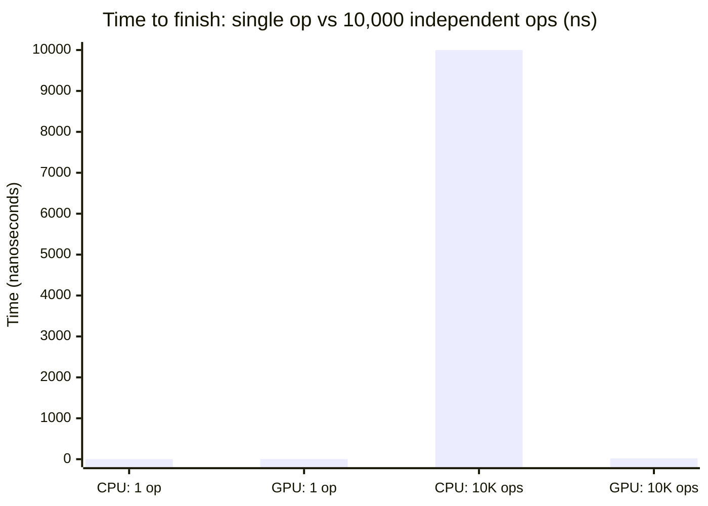
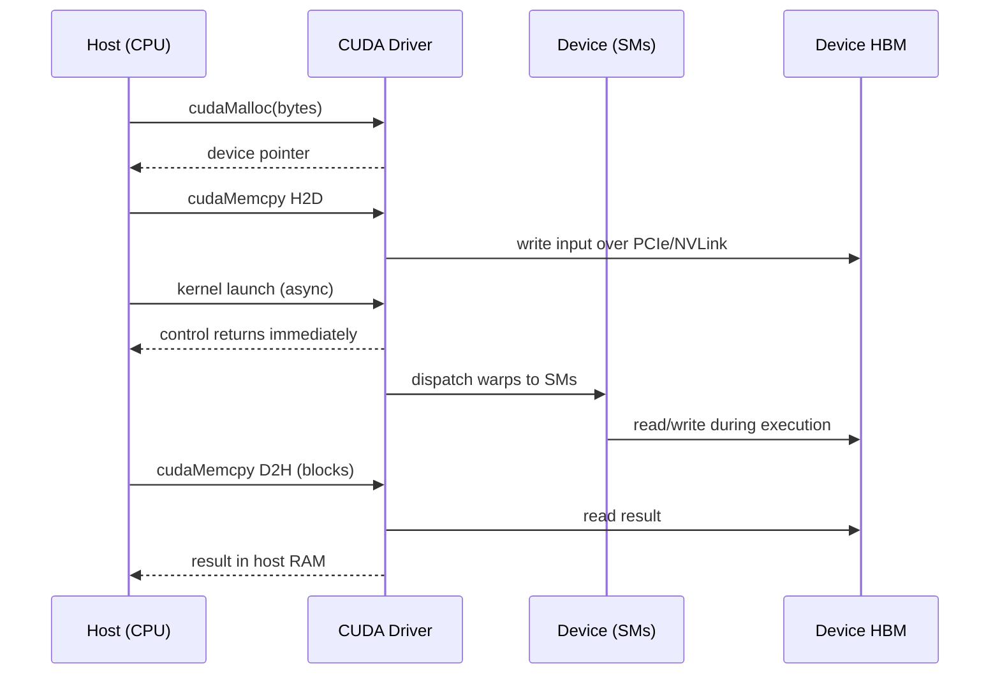
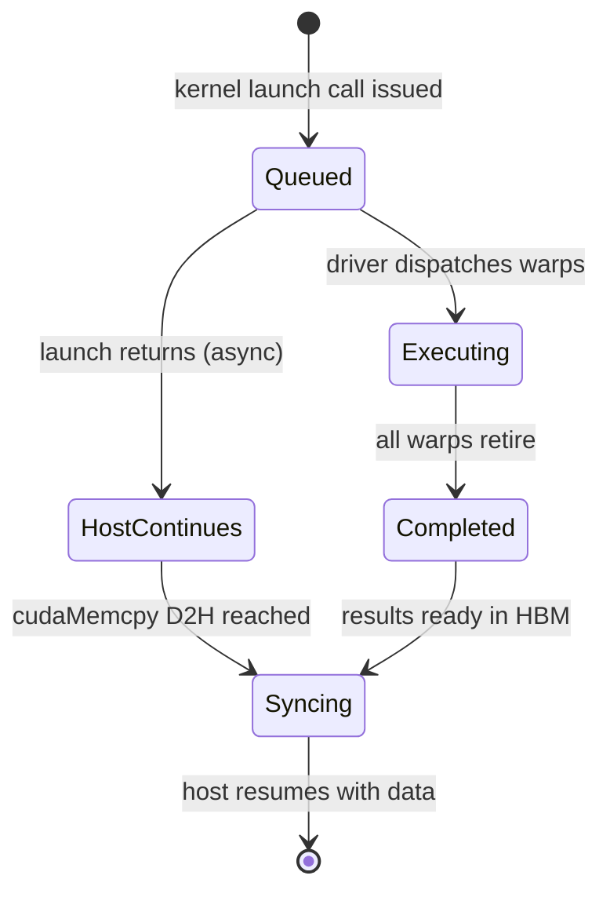
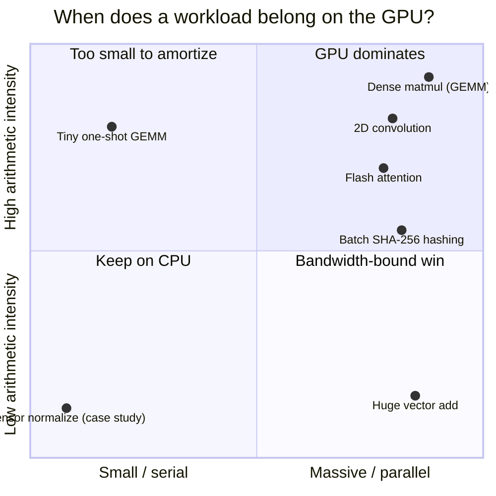
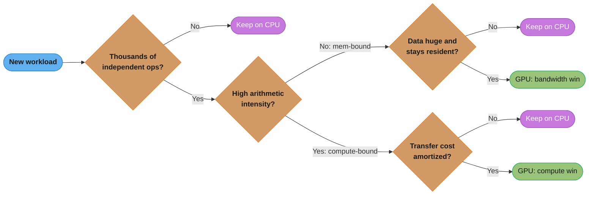

# GPU Computing Foundations

## 1. Concept Overview

A GPU (Graphics Processing Unit) is a massively parallel processor built to run the *same*
instruction stream across thousands of data elements at once, trading single-thread speed
for aggregate throughput. A CPU is built for the opposite goal: make one instruction stream
finish as fast as possible using out-of-order execution, branch prediction, and deep caches.
Neither design is "better" in the abstract — they are optimized for different points on the
latency-vs-throughput curve, and the entire discipline of GPU computing (and this section)
is about recognizing which workloads sit on the GPU's side of that curve and restructuring
them to land there.

This module is the "why" that everything downstream depends on: why a GPU has thousands of
small cores instead of a handful of fast ones, why the programming model is SIMT (Single
Instruction, Multiple Threads) rather than SIMD, why moving data to the GPU costs real time
that must be amortized, and how to reason quantitatively — via Amdahl's and Gustafson's laws
and arithmetic intensity — about whether a given piece of code is worth porting at all. Every
later module (warp scheduling, memory coalescing, occupancy, Tensor Cores) is a refinement of
the single idea introduced here: **a GPU hides memory and instruction latency by having so much
parallel work in flight that some of it is always ready to run.**

---

## 2. Intuition

> A CPU is a small team of world-class chefs, each able to improvise a full seven-course meal
> alone; a GPU is a stadium kitchen of 100,000 line cooks who can only grill one identical
> burger patty each — individually far less capable, but if the order is "10,000 identical
> burgers," the stadium kitchen wins by two orders of magnitude and the chefs never catch up.

**Mental model**: A CPU spends its transistor budget on making *one* instruction stream fast —
out-of-order execution, branch prediction, multi-level caches, speculative execution — because
in general-purpose code the next instruction is unpredictable and latency (time to finish one
thing) is what the user feels. A GPU spends the same transistor budget on raw arithmetic
throughput — thousands of simple ALUs — and hides the latency of any single operation by
having thousands of other threads ready to run while it waits. When one warp of 32 threads
stalls on a ~400-800 cycle global-memory load, the hardware warp scheduler instantly swaps in
another resident warp with zero overhead. Throughput, not latency, is the currency a GPU deals in.

**Why it matters**: The decision to offload work to a GPU is an engineering tradeoff with a
real, computable cost, not a reflex. A kernel that finishes in 2 microseconds but requires a
20-microsecond PCIe round trip to fetch its data is a net loss versus keeping the computation
on the CPU. Every senior GPU-programming interview question about "would you put this on the
GPU" is really asking whether you can compute arithmetic intensity, transfer overhead, and the
parallel/serial split before reaching for `cudaMalloc`.

**Key insight**: GPUs do not make individual operations faster — a single GPU thread is
*slower* than a single CPU thread. GPUs win only when (1) there is enough independent,
uniform, parallel work to keep thousands of ALUs fed, (2) that work has high arithmetic
intensity (many FLOPs per byte moved), and (3) the one-time cost of getting data across
PCIe/NVLink is amortized over enough compute to be negligible. Master when those three
conditions hold, and "should this run on the GPU" stops being a guess.

---

## 3. Core Principles

- **Throughput over latency.** A GPU is optimized to maximize total work completed per
  second across many threads, not to minimize the time any single thread takes. A CPU core
  at ~3-5 GHz with deep out-of-order pipelines minimizes the latency of one instruction
  stream; a GPU SM run at a lower clock (~1.5-1.8 GHz) but issues instructions across dozens
  of concurrently resident warps.
- **SIMT, not SIMD.** The GPU's execution model presents each thread with its own registers
  and (from Volta onward) its own program counter, but the hardware groups 32 threads into a
  **warp** and executes them in lockstep on a shared instruction fetch/decode unit. This is
  different from CPU SIMD (AVX/SSE), where the programmer packs data into one wide register
  explicitly; SIMT lets each thread's code look scalar while the hardware vectorizes it.
- **Latency hiding via parallelism, not caching.** A CPU hides memory latency with large
  multi-level caches (L1/L2/L3) sized in megabytes. A GPU has comparatively tiny caches per
  SM and instead hides latency by oversubscribing each SM with far more warps than it can
  execute simultaneously, so a stalled warp is invisible — another warp fills the pipeline.
- **Amdahl's Law bounds any fixed-size speedup.** If a fraction `p` of a program's runtime is
  parallelizable and `(1-p)` must run serially, total speedup on `N` processors is capped at
  `1/(1-p)` as `N -> infinity`, regardless of how many cores you add.
- **Gustafson's Law reframes the same math for scaled workloads.** If the *problem size*
  grows with the number of processors (the common case for GPUs — bigger batches, bigger
  images), the achievable speedup grows roughly linearly with `N` instead of saturating,
  because the serial fraction shrinks in relative terms.
- **The host and device are separate memory spaces connected by a comparatively slow link.**
  The CPU ("host") and GPU ("device") each have their own physical memory; data must be
  explicitly copied across PCIe (or the much faster NVLink) before a kernel can touch it, and
  copied back to read the result. This transfer is not free — it is the single most common
  reason a "GPU-accelerated" prototype underperforms a well-tuned CPU baseline.
- **Arithmetic intensity determines whether the GPU wins at all.** Arithmetic intensity is
  FLOPs performed per byte moved from memory. High-arithmetic-intensity workloads (dense
  matrix multiply, convolution) are compute-bound and exploit GPU throughput; low-intensity
  workloads (element-wise add, single-pass scans over huge arrays) are memory- or
  transfer-bound and often do not justify the trip to the device at all.

---

## 4. Types / Architectures / Strategies

### 4.1 Execution Models Compared

| Model | Instruction stream | Data | Programming feel | Example hardware |
|-------|--------------------|------|-------------------|-------------------|
| **SISD** | One | One | Ordinary scalar code | A single CPU core |
| **SIMD** | One | Many, packed into one wide register | Programmer manages vector width explicitly | CPU AVX-512 (16 floats/instr) |
| **MIMD** | Many, independent | Many, independent | Fully independent threads/processes | Multi-core CPU, MPI cluster |
| **SIMT** | One per warp, broadcast to 32 threads | Many, one per thread | Looks like ordinary scalar per-thread code; hardware vectorizes | NVIDIA GPU warp |

SIMT is best understood as "SIMD with per-thread illusion of independence": the compiler and
programmer write ordinary-looking scalar code per thread, and the hardware's warp scheduler
supplies the same instruction to 32 threads' worth of ALUs each cycle — except when threads
diverge (see [warps_and_simt_execution](../warps_and_simt_execution/)), in which case the
warp serializes the diverging paths.

### 4.2 Amdahl's Law vs Gustafson's Law — Two Views of Scalability

- **Amdahl's Law (fixed problem size)**: asks "how much faster can I make *this exact*
  workload by adding processors?" Answer: bounded by the serial fraction, no matter `N`.
- **Gustafson's Law (scaled problem size)**: asks "if I use the extra processors to solve a
  *bigger* problem in the same wall-clock time, how much more work did I get done?" Answer:
  scales roughly linearly with `N`, because real-world users given more compute typically ask
  for bigger batches/models/images rather than the same-size job finishing sooner.

These are not competing theories — they are two different questions asked of the same
system. GPU workloads are almost always in Gustafson's regime in production (a training run
uses a bigger batch on more GPUs; inference serves more concurrent requests), which is why
GPU speedups in practice routinely exceed what a naive Amdahl calculation on a fixed problem
would predict.

### 4.3 The Host/Device Execution Model

- **Host** = the CPU and its (much larger, but far slower to reach from the GPU) system
  memory (DRAM).
- **Device** = the GPU and its on-board HBM (High Bandwidth Memory) — physically separate
  memory with its own address space.
- Execution is a five-step contract every CUDA program follows: (1) allocate device memory,
  (2) copy input host -> device, (3) launch kernel (asynchronous — control returns to the
  host immediately), (4) copy output device -> host (this call blocks until the kernel
  finishes, unless using streams), (5) free device memory. See
  [memory_management_and_data_transfer](../memory_management_and_data_transfer/) for the full
  API surface (`cudaMalloc`, `cudaMemcpy`, pinned memory, unified memory).

### 4.4 Interconnect Strategies: PCIe vs NVLink

| Interconnect | Typical bandwidth | Where it's used | Latency character |
|-------------|--------------------|-------------------|--------------------|
| **PCIe Gen4 x16** | ~32 GB/s per direction (~64 GB/s bidirectional) | Consumer/entry server GPUs, host<->device transfer | Microsecond-scale round trip |
| **PCIe Gen5 x16** | ~64 GB/s per direction (~128 GB/s bidirectional) | Latest data-center hosts (H100/B200 PCIe SKUs), host<->device transfer | Microsecond-scale round trip |
| **NVLink (Hopper, 4th gen)** | ~900 GB/s aggregate per GPU | GPU<->GPU within a server (H100 NVSwitch pod) | Sub-microsecond, far higher bandwidth than PCIe |
| **HBM3 (on-package, GPU<->its own memory)** | ~3 TB/s (H100 SXM) | GPU core <-> its own device memory | Not a host link at all — fastest tier in the whole picture |

The ordering that matters for the "should I offload this" decision: **on-device HBM (~3
TB/s) >> NVLink GPU-to-GPU (~900 GB/s) >> PCIe host-to-device (~32-64 GB/s)**. Every hop away
from the GPU's own memory costs roughly an order of magnitude in bandwidth, which is exactly
why the host/device transfer is the step to scrutinize first when a "GPU-accelerated"
pipeline disappoints.

---

## 5. Architecture Diagrams

### CPU vs GPU — Transistor Budget and the Latency/Throughput Tradeoff

```
CPU die (transistor budget allocation)         GPU die (transistor budget allocation)
+----------------------------------+           +----------------------------------+
| Control  ################        |           | Control  ##                      |
| Cache    ####################### |           | Cache    ####                    |
| ALU      ####                    |           | ALU      ############################|
+----------------------------------+           +----------------------------------+
Few cores (8-64), each fast alone.             Thousands of ALUs ("CUDA cores"),
Deep pipeline, branch prediction,              each simple and slow alone.
out-of-order execution, big caches             Minimal control logic per ALU,
to minimize ONE thread's latency.              tiny cache per SM.

Latency-vs-throughput scoreboard (single op vs 10,000 independent ops):

                 Time to finish ONE op    Time to finish 10,000 INDEPENDENT ops
CPU core         ~1 ns  (fast!)           ~10,000 ns  (serialized, one at a time)
GPU (thousands   ~2-4 ns (slower per op,  ~10-30 ns   (thousands run concurrently,
of ALUs)         no branch prediction)                latency hidden by warp swaps)

Crossover: a GPU loses on latency for a SINGLE operation, and wins by 100-1000x
once the operation count is large enough to keep thousands of ALUs simultaneously busy.
```

This is the entire argument for GPU computing in one picture: a CPU wins the single-operation
column by being individually faster per instruction; a GPU wins the many-independent-operations
column because raw ALU count and latency-hiding via warp scheduling dwarf any single-thread
speed disadvantage. Every "should this run on the GPU" question reduces to "which column am I in."

### CPU vs GPU — Time to Finish, Single Op vs 10,000 Ops



Same scoreboard as the ASCII table above, plotted directly: a CPU wins the leftmost bar (fastest
single op) but loses by roughly 500x on the rightmost pair, because the CPU serializes 10,000 ops
while the GPU runs them concurrently and hides memory latency behind warp swaps.

### Host -> Device -> Host Offload Flow


Every stage between the two `io` endpoints costs real wall-clock time; the two `cudaMemcpy`
calls (`req`, `mathOp`) cross the slow PCIe/NVLink boundary and are frequently the dominant
cost for small or low-arithmetic-intensity kernels — the whole reason arithmetic intensity and
transfer-cost accounting (§6, §9) come before "just write the kernel."

### Same Flow, Actor by Actor — Host, Driver, Device, HBM



The step the flowchart above hides is asynchrony: the kernel-launch call returns to the host
immediately, and it is the blocking `cudaMemcpy D2H` — not the launch itself — that forces the
host to wait for the device to finish.

---

## 6. How It Works — Detailed Mechanics

### Amdahl's Law, Derived and Applied

Amdahl's Law expresses the speedup of a program where a fraction `p` of its runtime can be
parallelized across `N` processors, and the remaining `(1-p)` must run serially:

```
Speedup(N) = 1 / ( (1 - p) + p / N )

As N -> infinity:  Speedup -> 1 / (1 - p)     <- hard ceiling, independent of N
```

**Worked example**: a data pipeline spends 95% of its time in a parallelizable matrix
operation (`p = 0.95`) and 5% in an inherently serial preprocessing step (`1 - p = 0.05`).

```
N = 10    Speedup = 1 / (0.05 + 0.95/10)   = 1 / 0.145  = 6.90x
N = 100   Speedup = 1 / (0.05 + 0.95/100)  = 1 / 0.0595 = 16.81x
N = 10000 Speedup = 1 / (0.05 + 0.95/10000)= 1 / 0.05010= 19.96x
N -> inf  Speedup -> 1 / 0.05 = 20x                      <- ceiling
```

No matter how many thousands of CUDA cores are thrown at this workload, it cannot exceed
**20x** — the serial 5% dominates once `N` is large. This is the single most common gotcha in
GPU-porting decisions: profiling the serial fraction *before* buying more GPU is mandatory,
because past a certain `N` more hardware buys almost nothing.

**What this actually says.** "Whatever fraction of your program refuses to go parallel eventually becomes the entire bill."

Adding processors only shrinks the `p / N` term. The `(1 - p)` term never moves, so past some `N` it *is* the denominator. That is why the ceiling is `1 / (1 - p)` — a property of your code, not of your hardware budget.

| Symbol | What it is |
|--------|------------|
| `p` | Fraction of runtime that is parallelizable. `0.95` = 95% of the wall clock |
| `1 - p` | The serial remainder. The part `N` cannot touch, ever |
| `N` | Number of parallel workers — CUDA cores, SMs, threads |
| `p / N` | The parallel part after being split `N` ways. Shrinks toward `0` |
| `Speedup(N)` | Old runtime ÷ new runtime. `1.0` = no gain at all |

**Walk one example.** Same `p = 0.95` pipeline. Watch what each 10x of hardware actually buys:

```
  N        (1 - p)   +    p / N    =  denominator   Speedup   gain over previous row
  1         0.05          0.95000     1.00000        1.00x       -
  10        0.05          0.09500     0.14500        6.90x     +5.90x
  100       0.05          0.00950     0.05950       16.81x     +9.91x
  1000      0.05          0.00095     0.05095       19.63x     +2.82x
  10000     0.05          0.00010     0.05010       19.96x     +0.33x
```

Going from 100 to 1000 workers is **10x the hardware for a 16.8% gain** (16.81x -> 19.63x); the next 10x buys 1.7%. The denominator is already 98% serial term by then.

**Why the `(1 - p)` term is the one to attack.** Every dollar of extra `N` fights the `p / N` term, which is already near zero — so the only lever left is shrinking `1 - p` itself. Reaching a 50x ceiling requires `p = 0.98`, i.e. cutting the serial 5% down to 2%; no quantity of GPUs substitutes for that code change. Skip this arithmetic and you buy an 8-GPU node to accelerate a workload capped at 20x by five lines of serial preprocessing.

### Gustafson's Law, Derived and Contrasted

Gustafson's Law asks a different question: instead of holding problem size fixed and adding
processors, hold *wall-clock time* fixed and scale the problem size with `N`:

```
Speedup(N) = (1 - p) + p * N            <- scaled speedup, grows with N

Same example (p = 0.95), but now the workload GROWS with N (e.g., bigger batch):
N = 10    Speedup = 0.05 + 0.95*10   = 9.55x
N = 100   Speedup = 0.05 + 0.95*100  = 95.05x
N = 10000 Speedup = 0.05 + 0.95*10000= 9500.05x
```

This is why GPU throughput scales so well in practice for training and batch inference: the
"problem" (batch size, image resolution, token count) grows to fill the available compute
instead of staying fixed, so the serial fraction becomes proportionally smaller rather than
dominating. Interviewers probing "why doesn't Amdahl's Law doom GPU scaling in practice"
are testing whether you know this distinction.

**Read it like this.** "Nobody buys a GPU to run yesterday's problem faster — they buy it to run a bigger problem in the same hour."

Amdahl holds the *work* constant and asks how much time you save. Gustafson holds the *time* constant and asks how much more work you finish. Neither is wrong; they answer different questions, and GPU workloads almost always live in Gustafson's world.

| Symbol | What it is |
|--------|------------|
| `N` | Workers — and here also the factor by which the problem grows |
| `p` | Share of the **fixed** wall-clock second spent in parallel work |
| `1 - p` | Serial share of that same fixed second. A constant amount of time, not a shrinking one |
| `p * N` | Parallel work now completed inside that same second |
| `Speedup(N)` | Work done by `N` workers ÷ work one worker could do in the same time |

**Walk one example.** Same `p = 0.95`, but now measure the serial part as a share of the *total work done*:

```
  N         serial work   parallel work   total work   serial share of total
  1            0.05           0.95            1.00          5.0000%
  10           0.05           9.50            9.55          0.5236%
  100          0.05          95.00           95.05          0.0526%
  10000        0.05        9500.00         9500.05          0.0005%
```

The serial column never changes — 0.05 forever. It only *looks* smaller because the parallel column grew past it. That is the entire trick, and it is why the same `p = 0.95` yields **16.81x under Amdahl but 95.05x under Gustafson at `N = 100`**: identical code, identical hardware, opposite framing of the question.

**When the Gustafson framing is a lie.** It only holds if the problem genuinely scales. A fixed 1080p frame that must render in 16 ms does not grow to fill 132 SMs — that workload is squarely Amdahl's, and quoting scaled speedup there is how teams end up disappointed by a GPU that "benchmarked at 95x."

### SIMT Execution — What Actually Happens Per Cycle

A **warp** is the hardware's unit of scheduling: **32 threads**, always. When a kernel
launches `<<<blocks, threads>>>`, the hardware partitions the thread block into warps of 32
and issues instructions warp-by-warp:

```cuda
// Every thread in the warp executes THIS SAME instruction in the same cycle,
// each operating on its own registers / data.
__global__ void axpy(float a, const float* x, float* y, int n) {
    int i = blockIdx.x * blockDim.x + threadIdx.x;
    if (i < n) {
        y[i] = a * x[i] + y[i];   // one FMA per thread, 32 threads per warp per cycle
    }
}
```

This looks like ordinary scalar code — no explicit vector width, no manual lane packing —
which is the defining ergonomic difference from CPU SIMD, where the same operation would
require packing 8/16 floats into an `__m256`/`__m512` register by hand.

### Latency Hiding via Parallelism — the Core Mechanism

A global memory load stalls a warp for roughly **400-800 cycles** — hundreds of times longer
than a single arithmetic instruction (~1 cycle). A GPU does not try to make that load faster
with a bigger cache (a CPU's answer); it hides the wait by keeping many more warps resident on
the SM than can execute at once, so the warp scheduler always has a ready warp to swap in:

```
Cycle:        0     1     2     3     4   ...  400   401   402
Warp 0:      LOAD  [stalled..........................]  READY (data arrived)
Warp 1:       -    LOAD [stalled.....]  ...
Warp 2:       -     -   FMA   FMA   FMA  ...  (compute while warps 0/1 wait on memory)
Warp 3:       -     -    -    LOAD [stalled...]

SM issues ONE instruction per cycle from whichever warp is ready.
As long as SOME warp is always ready, the ~400-800 cycle memory latency
is fully hidden and the ALUs never sit idle.
```

The number of warps needed to hide a given latency is a simple ratio: if a memory operation
takes 400 cycles and the SM can issue a new warp's instruction every cycle, you need on the
order of 400 / (cycles between independent instructions per warp) resident warps to keep the
pipeline fully fed — this is exactly what
[occupancy_and_launch_configuration](../occupancy_and_launch_configuration/) quantifies precisely.

### Kernel Launch Lifecycle — Why the Host Doesn't Wait



`HostContinues` and `Executing` run concurrently — the host keeps issuing other work while the
device executes — and the two paths only rejoin at `Syncing`, the blocking `cudaMemcpy D2H`
call, which is the real synchronization point, not the launch itself.

### Host/Device Transfer Cost — CUDA C++ and Python Side by Side

```cuda
// CUDA C++: explicit allocate -> copy -> launch -> copy back -> free
#include <cuda_runtime.h>

void vector_add_gpu(const float* h_x, const float* h_y, float* h_out, int n) {
    float *d_x, *d_y, *d_out;
    size_t bytes = n * sizeof(float);

    cudaMalloc(&d_x, bytes);
    cudaMalloc(&d_y, bytes);
    cudaMalloc(&d_out, bytes);

    cudaMemcpy(d_x, h_x, bytes, cudaMemcpyHostToDevice);   // PCIe/NVLink cost paid here
    cudaMemcpy(d_y, h_y, bytes, cudaMemcpyHostToDevice);

    int threads = 256;
    int blocks = (n + threads - 1) / threads;
    axpy<<<blocks, threads>>>(1.0f, d_x, d_y, n);          // async launch

    cudaMemcpy(h_out, d_out, bytes, cudaMemcpyDeviceToHost); // blocks; PCIe cost paid again

    cudaFree(d_x); cudaFree(d_y); cudaFree(d_out);
}
```

```python
# Python: CuPy mirrors the same allocate/transfer/compute/transfer-back contract,
# just with the host<->device copy hidden inside array construction/`.get()`.
import cupy as cp
import numpy as np

def vector_add_gpu(h_x: np.ndarray, h_y: np.ndarray) -> np.ndarray:
    d_x = cp.asarray(h_x)          # H2D copy happens here (PCIe/NVLink)
    d_y = cp.asarray(h_y)          # H2D copy happens here
    d_out = d_x + d_y              # kernel launch, fused elementwise add on device
    return cp.asnumpy(d_out)       # D2H copy happens here, blocks until done


# Numba: same contract, explicit device arrays make the transfer boundary visible
from numba import cuda

@cuda.jit
def axpy_numba(a, x, y, out):
    i = cuda.grid(1)
    if i < x.size:
        out[i] = a * x[i] + y[i]

def vector_add_gpu_numba(h_x: np.ndarray, h_y: np.ndarray, a: float = 1.0) -> np.ndarray:
    d_x = cuda.to_device(h_x)               # H2D
    d_y = cuda.to_device(h_y)               # H2D
    d_out = cuda.device_array_like(h_x)
    threads = 256
    blocks = (h_x.size + threads - 1) // threads
    axpy_numba[blocks, threads](a, d_x, d_y, d_out)
    return d_out.copy_to_host()             # D2H
```

Both languages hit the same wall: for `n` small enough (say, `n = 1,000` floats = 4 KB per
array), the two PCIe round trips (H2D input + D2H output) at PCIe Gen4's ~32 GB/s take on the
order of a microsecond each, while the actual `axpy` compute is a handful of nanoseconds — the
transfer, not the kernel, dominates total time by two to three orders of magnitude.

### Arithmetic Intensity — the Quantitative "Should I Offload This" Test

```
Arithmetic Intensity (AI) = FLOPs performed / Bytes moved from memory

Vector add (y = x + y):      AI = 1 FLOP / 8 bytes read+written  = 0.125 FLOPs/byte
Dense matmul (N x N x N):    AI = 2*N^3 FLOPs / (3*N^2*4 bytes)  ~ N/6 FLOPs/byte (grows with N)

At N = 4096:  matmul AI ~ 683 FLOPs/byte  ->  deep in compute-bound territory
Vector add:   AI = 0.125 FLOPs/byte       ->  deep in memory-bound / transfer-bound territory
```

Low-AI, small kernels are exactly the workloads where PCIe transfer time swamps compute time
and the GPU frequently loses to a well-vectorized CPU loop; high-AI kernels like GEMM are
where GPUs deliver their headline speedups. This is the same roofline reasoning used
per-kernel throughout [profiling_and_performance_analysis](../profiling_and_performance_analysis/),
introduced here at its simplest.

**The idea behind it.** "How much math do you get out of each byte you were forced to drag across the memory bus?"

Memory is the scarce resource on a GPU, not arithmetic — an H100 can issue vastly more FLOPs per second than HBM can feed it bytes. Arithmetic intensity is therefore the ratio that decides whether a kernel is limited by the ALUs or by the memory system, and it is the first number to compute before optimizing anything.

| Symbol | What it is |
|--------|------------|
| `FLOPs performed` | Useful floating-point operations the kernel actually does |
| `Bytes moved` | Bytes read from plus written to memory to make those FLOPs possible |
| `AI` | Their ratio, in FLOPs per byte. High = compute-bound, low = memory-bound |
| `N` | Matrix dimension in the `N x N x N` dense matmul case |

**Walk one example.** Why `AI ~ N/6` means matmul *earns* its place on a GPU and vector add does not:

```
  N        FLOPs = 2*N^3    Bytes = 3*N^2*4      AI = FLOPs/Bytes
  64          0.0005 GF        0.05 MB              10.67
  256         0.034  GF        0.75 MB              42.67
  1024        2.15   GF       12.0  MB             170.67
  4096      137.4    GF      192.0  MB             682.67

  vector add (any N)                                  0.125   <- flat, never improves
```

FLOPs grow as `N^3` while bytes grow only as `N^2`, so every doubling of `N` doubles the arithmetic intensity: 4096 buys **682.67 FLOPs per byte, 5461x the intensity of vector add**. Vector add's `0.125` is a constant — no problem size rescues it, because every element is touched exactly once.

**Why the ratio, and not either number alone.** A kernel doing 137 GFLOP sounds impressive until you learn it moved 192 MB to do it; a kernel moving 192 MB sounds wasteful until you learn it got 137 GFLOP out of them. Only the ratio tells you which hardware limit you are about to hit, and therefore which optimization is worth attempting — tiling and reuse for a low-AI kernel, better instruction mix or Tensor Cores for a high-AI one. Optimize the wrong side and the profiler shows no change at all.

---

## 7. Real-World Examples

- **Deep learning training** — matrix multiplies and convolutions have arithmetic intensity
  in the hundreds of FLOPs/byte, making them the textbook case for GPU acceleration; an
  8xH100 node trains models that would take months on CPU in days.
- **Scientific simulation (molecular dynamics, CFD)** — codes like GROMACS and OpenFOAM
  offload the dense force/flux computation kernels (high AI) to GPUs while keeping I/O and
  setup on the CPU, often achieving 10-50x speedups over CPU-only runs.
- **Video encoding/decoding and image processing** — per-pixel, embarrassingly parallel
  operations (color conversion, filters, resizing) are a natural SIMT fit; NVIDIA's NVENC/NVDEC
  are dedicated ASIC blocks that exploit the same parallel-throughput principle even more
  specifically than general CUDA cores.
- **Cryptography and hashing (password cracking, mining)** — millions of independent hash
  attempts is the canonical "10,000 identical burgers" workload; a single high-end GPU can
  compute billions of SHA-256 hashes/sec versus millions/sec on a CPU core.
- **Databases and analytics (GPU-accelerated SQL, e.g. cuDF/RAPIDS)** — columnar scans, joins,
  and aggregations over large batches parallelize across rows, but only pay off once dataset
  size amortizes the one-time host-to-device data load.
- **Counter-example: a compiler or interpreter** — this is inherently serial (each instruction
  depends on the last), which is why no production compiler runs its parsing/codegen phases on
  a GPU — it sits firmly in Amdahl's "serial fraction," not the parallel one.

---

## 8. Tradeoffs

| Dimension | CPU | GPU |
|-----------|-----|-----|
| Optimization target | Single-thread latency | Aggregate throughput |
| Core count | 8-64 complex cores | Thousands of simple ALUs across dozens of SMs |
| Clock speed | ~3-5 GHz | ~1.5-1.8 GHz |
| Cache per core | Large (MB-scale L2/L3) | Small per-SM (KB-scale L1/shared) |
| Branch handling | Branch prediction, speculative execution | Divergence serializes the warp (masked lanes) |
| Latency-hiding mechanism | Out-of-order execution, deep pipelines, caching | Oversubscription of warps, near-zero-cost warp swap |
| Best workload shape | Serial, branchy, latency-sensitive, small data | Parallel, uniform, high arithmetic intensity, large data |
| Cost of "getting started" | None — data is already in the right place | PCIe/NVLink transfer must be paid before compute begins |

| Interconnect | Bandwidth | When it matters |
|--------------|-----------|------------------|
| PCIe Gen4 x16 | ~32 GB/s per direction | Standard host<->device transfer on most servers |
| PCIe Gen5 x16 | ~64 GB/s per direction | Newer data-center hosts; still an order of magnitude below NVLink |
| NVLink (Hopper) | ~900 GB/s aggregate | Multi-GPU, in-server GPU<->GPU (see [multi_gpu_programming_and_nccl](../multi_gpu_programming_and_nccl/)) |
| On-device HBM3 | ~3 TB/s | GPU core <-> its own memory — the number every kernel is actually optimized against |

---

## 9. When to Use / When NOT to Use

### The Decision Space — Parallelism Size vs Arithmetic Intensity



The two axes are exactly the two variables §6 and §9 already reason about: how much
independent parallel work exists, and how many FLOPs each byte moved buys. High-AI, massive
workloads (GEMM, convolution, attention) sit in `GPU dominates`; the §14 case study's tiny
2,000-element normalize sits deep in `Keep on CPU`.

### Should This Workload Go On The GPU?



This is the bulleted checklist below compiled into one decision path: three questions —
parallelism, arithmetic intensity, and amortized transfer cost — and every "no" routes back to
the CPU regardless of how far the workload got.

### Use a GPU when

- The workload exposes **thousands of independent, uniform operations** — the same
  instruction stream applied to different data (dense linear algebra, convolution, per-pixel
  image ops, per-token transformer math).
- **Arithmetic intensity is high** (tens to hundreds of FLOPs/byte) so the one-time PCIe/NVLink
  transfer cost is amortized over a large amount of on-device compute.
- The **problem size scales with available compute** (Gustafson's regime) — bigger batches,
  higher resolution, more concurrent requests — rather than a fixed small job.
- Data can **stay resident on the device across many kernel launches** (training loop, batch
  inference server) so the transfer cost is paid once, not per operation.

### Do NOT use a GPU when

- The **serial fraction dominates** (Amdahl's Law) — a pipeline that is 80% inherently
  sequential caps out at a 5x speedup no matter how many GPUs you add; profile before porting.
- The workload is **small enough that PCIe transfer time exceeds compute time** — a few
  thousand elements processed once is nearly always faster kept on the CPU.
- The task has **heavy branching that differs per element** — divergent per-thread control
  flow serializes within a warp, eroding the SIMT advantage (see
  [warps_and_simt_execution](../warps_and_simt_execution/)).
- The workload requires **frequent host<->device round trips inside a hot loop** — e.g. a
  loop that computes one value on GPU, copies it back to inspect on the CPU, then launches
  again — the transfer latency per iteration dominates.
- The problem is **inherently sequential** (a strict finite-state machine, a compiler's
  single-pass codegen, a simple linked-list traversal) — there is no parallel work to expose,
  so no amount of GPU hardware helps.

---

## 10. Common Pitfalls

1. **Assuming "GPU" is a synonym for "faster."** A single GPU thread is slower than a single
   CPU thread; the GPU only wins in aggregate across thousands of threads. Porting a
   fundamentally serial or tiny workload to CUDA can make it *slower*, not faster.
2. **Ignoring transfer cost in benchmarks.** Timing only `kernel<<<>>>()` and not the
   surrounding `cudaMemcpy` calls produces a "10x speedup" number that vanishes — or reverses —
   once the full round trip is measured.
3. **Treating Amdahl's Law as a permanent ceiling regardless of workload shape.** Amdahl's
   Law bounds speedup only for a *fixed* problem size; in Gustafson's regime (growing the
   problem with more compute), the achievable win is far larger — conflating the two leads to
   both over- and under-estimating GPU benefit.
4. **Micro-launching a kernel per tiny unit of work in a hot loop.** Each kernel launch is not
   free (see §12 for concrete overhead numbers); thousands of tiny launches inside a loop that
   could have been one bigger kernel turns launch overhead into the bottleneck.
5. **Forgetting that host and device memory are physically separate.** Passing a raw host
   pointer into a kernel without a prior transfer (or without unified memory) is a common
   first-week bug that produces silent invalid-memory-access errors rather than a compile error.

**BROKEN -> FIX: offloading a tiny, one-shot workload where transfer dominates**

```cuda
// BROKEN: "accelerate" a 1,024-element sum by sending it to the GPU once
__global__ void sum_kernel(const float* x, float* result, int n) {
    // ... reduction omitted for brevity ...
}

void broken_sum(const float* h_x, float* h_result, int n) {
    float *d_x, *d_result;
    cudaMalloc(&d_x, n * sizeof(float));
    cudaMalloc(&d_result, sizeof(float));
    cudaMemcpy(d_x, h_x, n * sizeof(float), cudaMemcpyHostToDevice);  // ~5-10 us round trip
    sum_kernel<<<1, 256>>>(d_x, d_result, n);                          // kernel: ~1-2 us of work
    cudaMemcpy(h_result, d_result, sizeof(float), cudaMemcpyDeviceToHost);
    cudaFree(d_x); cudaFree(d_result);
    // Total: ~10-15 us of transfer + launch overhead to do ~1 us of actual arithmetic.
    // A CPU loop summing 1,024 floats finishes in well under 1 us. Net loss.
}
```

```cpp
// FIX: keep tiny, one-shot reductions on the CPU; only offload once n is large enough
// that compute time amortizes the fixed ~5-10 us PCIe round trip (typically n in the
// millions for a single elementwise/reduction op), OR batch many such sums into one
// kernel launch so the transfer cost is paid once for many logical operations.
float fixed_sum(const float* h_x, int n) {
    if (n < 1'000'000) {
        float acc = 0.0f;
        for (int i = 0; i < n; ++i) acc += h_x[i];   // CPU: no transfer, no launch overhead
        return acc;
    }
    return gpu_sum(h_x, n);   // large n: compute now dwarfs the fixed transfer cost
}
```

---

## 11. Technologies & Tools

| Tool / API | Purpose | Notes |
|-----------|---------|-------|
| CUDA C++ / `nvcc` | Native kernel authoring | Full control over memory, launch config, intrinsics |
| CuPy | NumPy-compatible GPU arrays in Python | Drop-in replacement for many NumPy workflows |
| Numba (`@cuda.jit`) | JIT-compiled Python CUDA kernels | Python syntax compiled to PTX; good for prototyping |
| PyTorch / TensorFlow | Framework-level GPU dispatch | Arithmetic-intensity decisions made for you by the framework's kernel selection |
| Nsight Systems | Timeline profiler | The tool that reveals transfer-vs-compute time split described in §6 |
| `nvidia-smi` | Device query / monitoring | Confirms which GPU, its compute capability, current utilization |
| `cudaEvent_t` timers | Fine-grained GPU-side timing | Correct way to measure kernel time separately from transfer time |

---

## 12. Interview Questions with Answers

**Q: Is a GPU always faster than a CPU for parallel code?**
No — a GPU only wins once there is
enough uniform, independent work to keep thousands of ALUs busy and amortize the transfer
cost. A single GPU thread is individually slower than a single CPU thread; arithmetic
intensity must also be high enough to justify the PCIe/NVLink round trip. Interviewers use
this to test whether a candidate reaches for the GPU reflexively or reasons about workload
shape first.

**Q: Why did my "GPU-accelerated" function get slower after porting it to CUDA?**
The most likely
cause is that transfer time exceeded compute time. This happens whenever the workload is small
or has low arithmetic intensity, so the `cudaMemcpy` round trip dominates the measured
runtime. Always time the full round trip — H2D copy, kernel, D2H copy — not just the kernel
launch, before claiming a speedup.

**Q: Does Amdahl's Law mean GPUs can never deliver more than a small constant speedup?**
No —
Amdahl's Law only bounds speedup for a *fixed-size* problem. It says nothing about workloads
where the problem grows with available compute, which is where Gustafson's Law applies:
speedup there grows roughly linearly with processor count because the serial fraction shrinks
in relative terms.

**Q: Is SIMT the same thing as SIMD?**
No — SIMD (CPU AVX) requires the programmer to explicitly
pack data into one wide vector register. SIMT (GPU) instead lets each of the 32 threads in a
warp run ordinary scalar-looking code that the hardware executes in lockstep, transparently
masking divergent threads. The ergonomic difference is real even though both exploit
data-level parallelism at the hardware level.

**Q: If I launch a thousand tiny kernels in a loop, why is my program slow even though each
kernel is fast?** Each kernel launch carries a fixed CPU-side overhead of a few microseconds,
so a thousand tiny launches accumulate milliseconds of pure overhead regardless of kernel
speed. Batch the work into fewer, larger launches, or use CUDA graphs (see
[cuda_graphs](../cuda_graphs/)) to amortize the launch cost.

**Q: What is arithmetic intensity, and why does it decide whether a kernel is worth offloading?**
Arithmetic intensity is FLOPs performed per byte moved from memory, and it decides whether a
kernel is compute-bound or memory/transfer-bound. Dense matrix multiply reaches hundreds of
FLOPs/byte and is a textbook GPU win; a single elementwise vector add sits around 0.125
FLOPs/byte and is dominated by transfer cost instead.

**Q: What is the difference between throughput and latency, and which does a GPU optimize for?**
Latency is the time to finish one unit of work; throughput is total units of work finished per
second across many units, and a GPU optimizes for throughput. It deliberately accepts higher
per-thread latency in exchange for far more concurrent threads, while a CPU minimizes the
latency of a single instruction stream.

**Q: How does a GPU hide the ~400-800 cycle latency of a global memory load?**
A GPU keeps far
more warps resident on each SM than can execute in a single cycle. When one warp stalls on a
memory load, the scheduler instantly issues an instruction from a different, ready warp at
zero switching cost — latency hiding via parallelism, in contrast to a CPU's cache-based
approach.

**Q: What is a warp, and why is 32 the number that matters?**
A warp is the fixed group of 32
threads that a GPU's SM schedules and executes together in lockstep on shared instruction
fetch/decode hardware. Treating "32" as a hardware constant, not a tunable parameter, is
foundational to divergence cost, coalescing, and occupancy math covered in later modules.

**Q: Concretely, what is the host/device execution model?**
The CPU (host) and GPU (device) have
physically separate memory, so a program must explicitly move data between them. It allocates
device memory, copies inputs across PCIe/NVLink, launches an asynchronous kernel, copies
results back, and frees device memory — five steps CUDA C++ exposes directly via
`cudaMalloc`/`cudaMemcpy`/kernel-launch/`cudaFree`, which Python wrappers like CuPy hide inside
array construction and `.get()`.

**Q: How much faster is on-device HBM than the PCIe link to the host, and why does that matter?**
On-device HBM3 delivers roughly 3 TB/s on an H100, versus roughly 32-64 GB/s per direction over
PCIe Gen4/5 — a 50-100x gap. This gap is why the general strategy for any multi-kernel pipeline
is to move data to the device once and keep it resident across as many kernel launches as
possible.

**Q: When would NVLink matter instead of PCIe, and how much faster is it?**
NVLink matters
specifically for GPU-to-GPU communication within a multi-GPU server, such as all-reduce during
distributed training. It delivers roughly 900 GB/s aggregate bandwidth on Hopper versus PCIe's
32-64 GB/s for host-to-device transfer — over an order of magnitude more bandwidth, but only
for the GPU-to-GPU case.

**Q: Can Amdahl's Law and Gustafson's Law give different answers for the "same" workload?**
Yes —
they answer different questions about the same system. Amdahl's Law asks how much faster a
fixed-size job gets with more processors (bounded, saturating); Gustafson's Law asks how much
bigger a job finishes in the same wall-clock time with more processors (roughly linear).
Quoting one without specifying which question was asked is a common source of contradictory
speedup claims.

**Q: Is a kernel launch itself free once data is already on the device?**
No — even with data
already resident on the device, each kernel launch carries a fixed CPU-side overhead of
roughly a few microseconds for driver dispatch and grid setup. A workload broken into
thousands of tiny launches can be dominated by that launch overhead rather than compute, even
with zero additional transfer cost.

**Q: What happens if a workload's data does not fit in the GPU's on-device HBM at once?**
The
program must either stream data in tiles across the ~32-64 GB/s PCIe link, paying that
transfer cost repeatedly, or spill to unified/managed memory that pages between host and
device. Both reintroduce the exact transfer bottleneck the GPU's fast HBM was supposed to
avoid, which is why working-set size belongs in the "should this run on the GPU" calculation
alongside raw FLOP count.

**Q: Is the "one long-running kernel vs many small kernels" choice purely stylistic?**
No — it is
a real scheduling tradeoff. A single long-running persistent kernel avoids per-launch driver
overhead entirely but gives up the scheduler's ability to interleave other work on the GPU,
while many small kernels pay overhead per launch but keep scheduling flexible; this tradeoff is
explored fully in
[dynamic_parallelism_and_advanced_kernels](../dynamic_parallelism_and_advanced_kernels/).

---

## 13. Best Practices

1. **Compute arithmetic intensity before writing a single line of CUDA.** If FLOPs/byte is
   low, expect the workload to be transfer- or memory-bound and question whether the GPU is
   the right target at all.
2. **Always benchmark the full round trip** — H2D transfer + kernel + D2H transfer — using
   `cudaEvent_t` timers or Nsight Systems, never just the kernel launch in isolation.
3. **Keep data resident on the device across multiple kernel launches** whenever a pipeline
   has several stages, rather than copying back to the host between every step.
4. **Batch small, independent units of work into one larger kernel launch** rather than
   looping thousands of tiny launches — launch overhead is fixed per call, not per element.
5. **Reason about which regime you're in** — Amdahl's (fixed problem, bounded speedup) or
   Gustafson's (scaled problem, near-linear speedup) — before setting speedup expectations for
   stakeholders.
6. **Use pinned (page-locked) host memory for repeated transfers** — pageable memory forces
   an extra staging copy through a pinned bounce buffer, discussed in full in
   [memory_management_and_data_transfer](../memory_management_and_data_transfer/).
7. **Prefer NVLink-connected multi-GPU topologies over PCIe-only ones** for workloads that
   require frequent GPU-to-GPU communication (distributed training all-reduce), since the
   bandwidth difference (~900 GB/s vs ~32-64 GB/s) directly bounds collective-communication time.

---

## 14. Case Study

**Scenario**: A data-processing team wants to "GPU-accelerate" a normalization step that
currently runs on CPU: for each of 2,000 sensor readings arriving once per second, subtract
the running mean and divide by the running standard deviation (`z = (x - mean) / std`), then
forward the result downstream within a 5 ms latency budget.

**Requirements clarification**: 2,000 float32 values per batch = 8 KB in, 8 KB out. Arithmetic
per element: 1 subtract + 1 divide = 2 FLOPs. Total FLOPs per batch: 4,000. This must be
evaluated against a strict 5 ms latency budget, not a throughput target — a critical detail
that changes the right answer entirely.

**Architecture (as first proposed):**


**Arithmetic intensity check**: 4,000 FLOPs / 16,384 bytes moved (8 KB in + 8 KB out) = 0.24
FLOPs/byte — deep in memory/transfer-bound territory, essentially identical to the vector-add
case in §6.

**BROKEN -> FIX, with measured numbers:**

```cuda
// BROKEN: offload a tiny per-second batch to the GPU every second
__global__ void normalize_kernel(float* x, float mean, float std, int n) {
    int i = blockIdx.x * blockDim.x + threadIdx.x;
    if (i < n) x[i] = (x[i] - mean) / std;
}

void broken_pipeline(float* h_batch, int n, float mean, float std) {
    float* d_batch;
    cudaMalloc(&d_batch, n * sizeof(float));
    cudaMemcpy(d_batch, h_batch, n * sizeof(float), cudaMemcpyHostToDevice); // ~5-8 us
    normalize_kernel<<<(n + 255) / 256, 256>>>(d_batch, mean, std, n);        // ~1-2 us
    cudaMemcpy(h_batch, d_batch, n * sizeof(float), cudaMemcpyDeviceToHost); // ~5-8 us
    cudaFree(d_batch);
    // Measured: ~12-18 us total on the GPU path -- comfortably inside 5 ms.
    // But the CPU path (below) is even simpler AND faster in absolute terms.
}
```

```cpp
// FIX: for a batch this small and this low in arithmetic intensity, skip the GPU
// entirely -- the CPU does the same work with zero transfer overhead.
void fixed_pipeline(float* h_batch, int n, float mean, float std) {
    for (int i = 0; i < n; ++i) {
        h_batch[i] = (h_batch[i] - mean) / std;
    }
    // Measured: ~1-2 us on a modern CPU core for n=2,000 -- faster than even the
    // GPU kernel alone, before counting any transfer cost, and with none of the
    // added system complexity (device memory management, driver, error handling).
}
```

**Metrics comparison:**

| Path | H2D | Kernel | D2H | Total | Verdict |
|------|-----|--------|-----|-------|---------|
| GPU (as proposed) | ~5-8 us | ~1-2 us | ~5-8 us | ~12-18 us | Within 5 ms budget, but adds complexity for no latency win |
| CPU (fixed) | n/a | n/a | n/a | ~1-2 us | Simpler, and faster in absolute terms |

**Resolution**: keep normalization on the CPU. The batch is far too small and too low in
arithmetic intensity (0.24 FLOPs/byte) to amortize even the modest PCIe round trip, and the
5 ms budget was never actually at risk on the CPU path — the "GPU-accelerate everything"
instinct here would have added `cudaMalloc`/`cudaMemcpy`/error-handling complexity for a
*slower* result. The GPU becomes the right answer only if requirements change to processing
millions of readings per batch (raising both total FLOPs and payload size, which is exactly
the migration path covered in [port_a_cpu_pipeline_to_gpu.md](../case_studies/port_a_cpu_pipeline_to_gpu.md)).

**Discussion questions:**
1. At what batch size (holding arithmetic intensity fixed at 0.24 FLOPs/byte) would the GPU
   round trip become worth it, and how would you compute that crossover point?
2. If 500 independent sensor streams each produced a 2,000-element batch per second, how would
   batching all 500 into one kernel launch change the arithmetic-intensity and overhead
   picture, and why?
3. How would the Amdahl's-vs-Gustafson's framing change if the team's real goal was "add more
   sensor streams over time" rather than "make this one stream faster"?

---

**See also**: [gpu_hardware_architecture](../gpu_hardware_architecture/) for the SM/warp
scheduler/register-file internals that make latency hiding possible;
[../../ml/gpu_and_hardware_optimization/](../../ml/gpu_and_hardware_optimization/) for how
these tradeoffs play out at training-time hardware-utilization scale;
[../../cs_fundamentals/computer_architecture_and_memory_hierarchy/](../../cs_fundamentals/computer_architecture_and_memory_hierarchy/)
for the CPU-side cache/memory-hierarchy background this module contrasts against.
