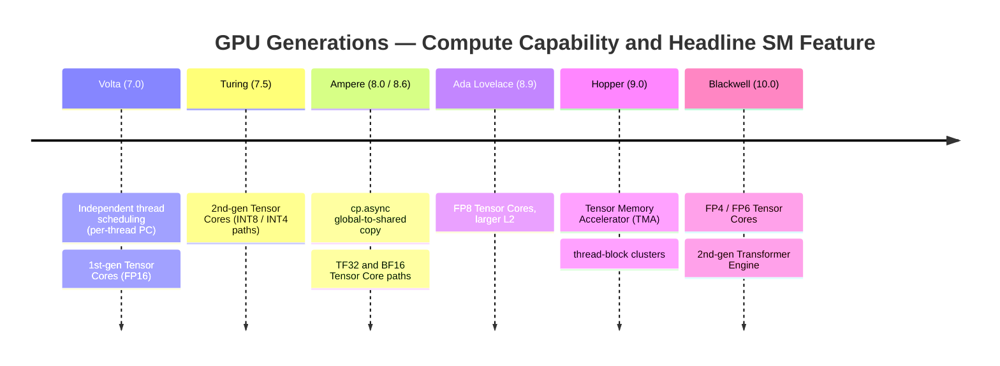
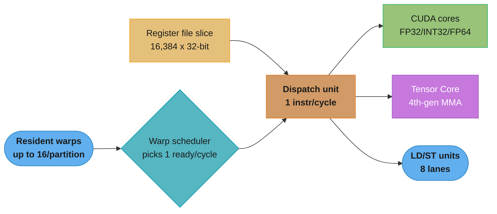
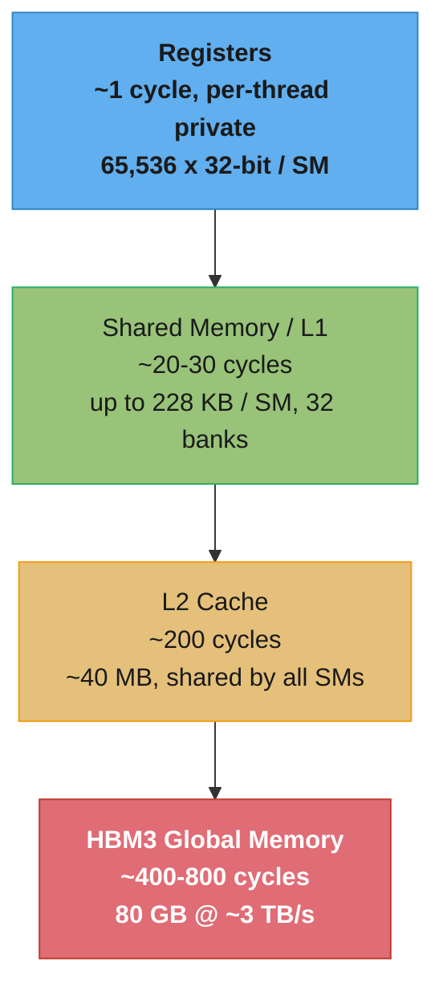
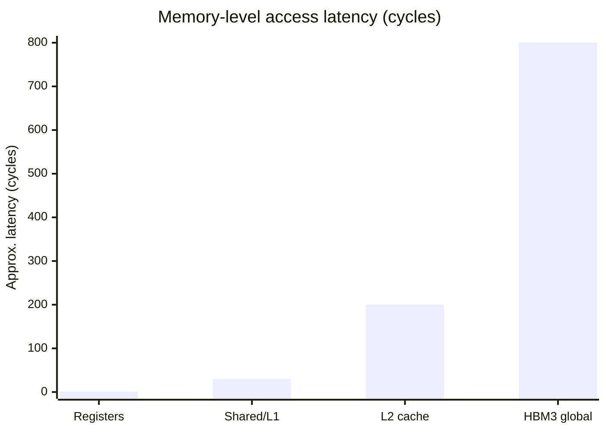
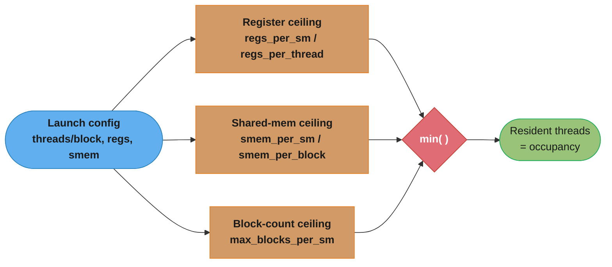
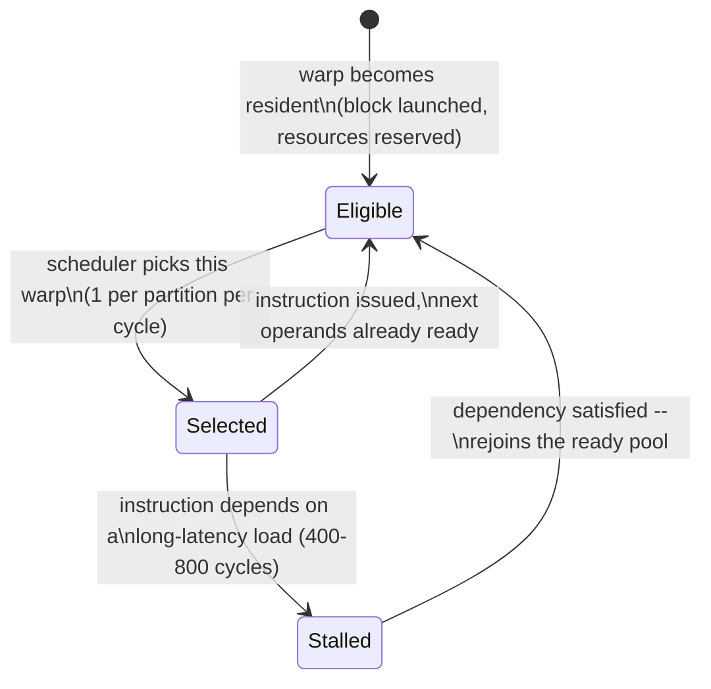

# GPU Hardware Architecture

## 1. Concept Overview

A GPU is not "one big fast processor" — it is an array of dozens to hundreds of small,
identical compute engines called **Streaming Multiprocessors (SMs)**, each running
thousands of lightweight threads in tightly-scheduled groups of 32 called **warps**. The
CUDA programming model (grid → block → thread) is a *logical* abstraction; this module
is about the *physical* substrate that abstraction maps onto: what an SM actually
contains, how many warps can live on it at once, what the register file and shared
memory budgets are, and how those numbers change across GPU generations.

Every optimization decision a kernel author makes — block size, shared-memory tile
size, register pressure, whether Tensor Cores engage — is ultimately a constraint
satisfaction problem against a small set of per-SM hardware limits. This module gives
you those limits so you can reason about them directly instead of guessing. It builds on
the throughput-vs-latency framing in
[gpu_computing_foundations](../gpu_computing_foundations/) and is the hardware
prerequisite for the full memory model covered in
[cuda_memory_model_and_hierarchy](../cuda_memory_model_and_hierarchy/).

---

## 2. Intuition

> **One-line analogy**: An SM is a single kitchen with 4 line cooks (warp schedulers),
> a shared pantry (shared memory/L1), and a fixed number of prep stations (the register
> file). You can hire as many order-takers (threads) as you want, but only as many can
> actually be cooking at once as there are prep stations and pantry space — hire too
> many and they stand around waiting, or worse, the kitchen simply can't fit the crew
> you scheduled.

**Mental model**: A GPU is a grid of identical SMs, and each SM is a self-contained
SIMT engine: it has its own warp schedulers, its own slice of the register file, and
its own shared memory/L1 pool. A "resident" warp is one whose full register and shared
memory footprint has been reserved on an SM for the lifetime of its block — this is
what lets the hardware switch to a different warp in a single cycle when one stalls on
a memory load, with zero context-switch overhead. The number of warps that can be
resident simultaneously is bounded by three independent budgets (registers, shared
memory, and a hard thread/block count cap), and the *smallest* of the three determines
occupancy.

**Why it matters**: Two kernels that look identical in CUDA C++ can behave completely
differently on the same GPU if one uses 32 registers/thread and the other uses 128 —
the first can fill the SM to its 2048-thread cap, the second can only fit a quarter of
that. Interviewers probe this constantly ("why did increasing the block size make my
kernel slower?", "why does this kernel top out at 25% occupancy?") because it separates
engineers who memorized the grid/block syntax from engineers who understand the machine
underneath it.

**Key insight**: Occupancy is not a single number you tune — it is the minimum of three
independent ratios: `threads-by-registers`, `threads-by-shared-memory`, and
`threads-by-block-count-limit`. Change any one resource (registers/thread, shared
memory/block, or block size) and you may shift which of the three is the binding
constraint. Optimization is finding the block size where none of the three wastes
capacity.

---

## 3. Core Principles

- **The SM is the unit of residency, not the GPU.** Occupancy, register pressure, and
  shared-memory budgets are all *per-SM* quantities — a GPU with 132 SMs (H100) runs
  132 independent copies of the same occupancy math in parallel, one block-scheduling
  decision per SM.
- **Warps are the scheduling granularity, threads are not.** The warp scheduler issues
  one instruction to all 32 threads of a warp in lockstep; there is no hardware path to
  schedule a single thread independently. A block of 100 threads still consumes 4 warp
  slots (128 threads' worth), with 28 lanes masked off and wasted.
- **The register file is a hard, static budget.** Registers are allocated per-thread
  for the entire lifetime of the block (no dynamic register allocation mid-kernel) —
  once a block claims its register footprint, that capacity is unavailable to any
  other block until the first one retires.
- **Resident ≠ active.** A warp is "resident" once its resources are reserved on the
  SM (it occupies a warp slot); it is "active"/"selected" only in the cycle the warp
  scheduler actually issues its next instruction. Many more warps are resident than are
  active in any single cycle — the extra resident warps exist purely to give the
  scheduler something else to issue when the active warp stalls.
- **Compute capability gates instruction-level features, not just performance.**
  Independent thread scheduling (Volta+), async copy (`cp.async`, Ampere+), and
  thread-block clusters (Hopper+) are compiled conditionally on the target compute
  capability — the same source can silently compile to a slower fallback path on an
  older architecture.
- **Latency hiding is the entire point of oversubscription.** A global memory load
  costs 400-800 cycles; the SM tolerates this only because it has other resident warps
  ready to issue in the meantime. Fewer resident warps than the latency requires means
  the SM idles.

---

## 4. Types / Architectures / Strategies

### 4.1 GPU Generations and Compute Capability

Compute capability (`sm_XX` / `compute_XX`) is the version number that gates which
instructions, intrinsics, and hardware units a kernel can target. `nvcc` compiles PTX
for a virtual `compute_XX` architecture and SASS for a real `sm_XX` one — see
[cuda_toolkit_and_compilation](../cuda_toolkit_and_compilation/) for the full pipeline.
From the hardware-architecture angle, each generation added specific SM-level
capabilities a kernel author must know about:

| Generation | Example GPU | Compute Capability | Headline features for the kernel author |
|-----------|-------------|--------------------|------------------------------------------|
| Volta | V100 | 7.0 | Independent thread scheduling (per-thread program counter); 1st-gen Tensor Cores (FP16); `__syncwarp` becomes necessary |
| Turing | T4, RTX 20xx | 7.5 | 2nd-gen Tensor Cores (INT8/INT4); improved unified memory |
| Ampere | A100, RTX 30xx | 8.0 / 8.6 | 3rd-gen Tensor Cores + TF32 + BF16; async copy (`cp.async`) global→shared without a register round-trip; ~40 MB L2; MIG |
| Ada Lovelace | L4, L40S, RTX 40xx | 8.9 | 4th-gen Tensor Cores + FP8; large L2 |
| Hopper | H100, H200 | 9.0 | 4th-gen Tensor Cores + FP8; Tensor Memory Accelerator (TMA); thread-block clusters; distributed shared memory across a cluster; ~40 MB L2 |
| Blackwell | B100/B200, GB200 | 10.0 | 5th-gen Tensor Cores + FP4/FP6; 2nd-gen Transformer Engine; larger NVLink domains |

Constants worth memorizing (used throughout this section): **warp = 32 threads**; the
register file is **64K 32-bit registers per SM (256 KB)**; max **1024 threads/block**;
max **2048 resident threads/SM**; **L2 ~40 MB on Ampere/Hopper**; **HBM3 ~3 TB/s**
(H100); **H100 has 132 SMs**.

The table above compresses seven years of hardware evolution; laid out as a timeline
the cadence — and the fact that every generation is additive on top of the last — is
easier to hold in your head:



A kernel targeting a later `sm_XX` inherits every earlier generation's capability —
Hopper's thread-block clusters build on top of Ampere's `cp.async`, which itself built
on Volta's per-thread program counter — so the feature list only ever grows down this
timeline, it never resets.

### 4.2 SM Microarchitecture Evolution — What Each Generation Changed Structurally

- **Volta (7.0)**: split the SM into 4 independent processing partitions, each with its
  own warp scheduler, dispatch unit, and register-file slice — the layout every
  generation since has kept. Also introduced **independent thread scheduling**: each
  thread gets its own program counter and call stack, so threads in a diverged warp can
  make forward progress independently instead of being strictly lockstep-then-reconverge,
  at the cost that `__syncwarp()` is now required where implicit warp-synchronous code
  used to work by accident.
- **Turing (7.5)**: same partition layout as Volta; added concurrent FP32+INT32
  execution per partition and 2nd-gen Tensor Cores with INT8/INT4 paths for inference
  workloads.
- **Ampere (8.0/8.6)**: added `cp.async` — a partition can issue an asynchronous
  global→shared memory copy that bypasses the register file entirely, freeing registers
  and overlapping the copy with compute. 3rd-gen Tensor Cores added TF32 (a 10-bit-mantissa
  FP32 drop-in) and BF16. L2 grew to ~40 MB, large enough to cache entire attention
  score matrices for moderate sequence lengths.
- **Ada Lovelace (8.9)**: consumer/inference-tier successor to Ampere; adds FP8 Tensor
  Core paths and a larger L2, but keeps the same partition/warp-scheduler structure.
- **Hopper (9.0)**: introduces the **Tensor Memory Accelerator (TMA)** — a dedicated
  engine that executes bulk async tile copies as a single instruction (rather than one
  `cp.async` per thread), further reducing register/instruction overhead. Adds
  **thread-block clusters**: a group of thread blocks (potentially on different SMs)
  that can address each other's shared memory directly as **distributed shared
  memory**, extending the "resident on one SM" locality unit to "resident on a cluster."
- **Blackwell (10.0)**: 5th-gen Tensor Cores add FP4/FP6 paths and a 2nd-gen Transformer
  Engine that manages precision per-layer automatically; NVLink domains grow to bind
  more GPUs into one coherent memory space.

### 4.3 Occupancy-Limiting Resource Types

Three independent resources bound how many warps can be resident on one SM
simultaneously — see the worked math in §6:

| Resource | Hard limit (typical modern GPU) | What consumes it |
|----------|----------------------------------|-------------------|
| Register file | 65,536 32-bit registers/SM | Local variables, loop counters, unrolled code, intermediate values |
| Shared memory | up to 228 KB configurable pool/SM (Ampere/Hopper) | `__shared__` arrays, tile buffers for GEMM/reduction |
| Thread/block count | 2048 resident threads/SM, 1024 threads/block, ~32 resident blocks/SM | Grid/block launch configuration |

---

## 5. Architecture Diagrams

### SM Anatomy (H100-class, 4 processing partitions)

```
Streaming Multiprocessor (SM) -- H100-class, 4 processing partitions

+------------------------------------------------------------------+
| L1 Instruction Cache / Instruction Buffer (shared across the SM) |
+------------------------------------------------------------------+
| Partition 0                                                       |
|   Warp Scheduler + Dispatch Unit    (1 warp instruction / cycle)  |
|   Register File slice: 16,384 x 32-bit  (64 KB)                   |
|   32x FP32 CUDA cores | 16x FP64 | 16x INT32 | 4x SFU | 8x LD/ST   |
|   1x Tensor Core (4th-gen)                                        |
+------------------------------------------------------------------+
| Partition 1   (identical layout to Partition 0)                   |
+------------------------------------------------------------------+
| Partition 2   (identical layout to Partition 0)                   |
+------------------------------------------------------------------+
| Partition 3   (identical layout to Partition 0)                   |
+------------------------------------------------------------------+
| Shared Memory / L1 Data Cache -- up to 228 KB unified pool/SM,    |
| split configurably (e.g. more shared mem, less L1, or vice versa) |
+------------------------------------------------------------------+
                               |
                               v
              L2 Cache (~40 MB, shared across all 132 SMs)
                               |
                               v
                  HBM3 Global Memory (80 GB, ~3 TB/s)
```

Each of the 4 partitions is a self-contained SIMT engine: its own warp scheduler picks
one ready warp per cycle and dispatches one instruction to its 32 CUDA-core lanes. The
register file is split evenly across partitions (16,384 registers each = 65,536/SM
total), so a kernel's register usage is checked against the *per-partition* slice, not
just the SM-wide total. Shared memory and L1 are the only resources pooled at the
full-SM level rather than per-partition.

### SM Dispatch Path — One Partition, One Cycle



Each partition's scheduler picks exactly one resident warp per cycle, the dispatch unit
reads that warp's operands out of its register-file slice, and the instruction routes to
whichever functional unit matches its type — ordinary FP32/INT32 math to the CUDA cores,
`mma`/WMMA instructions to the Tensor Core, loads/stores to the LD/ST units. This is the
one-instruction-per-cycle-per-partition constraint that makes warp count, not thread
count, the real scheduling currency.

### Memory Hierarchy — Latency and Capacity per Level



Each hop down is roughly an order of magnitude slower and an order of magnitude larger
— the entire discipline of shared-memory tiling (see
[cuda_memory_model_and_hierarchy](../cuda_memory_model_and_hierarchy/)) exists to keep
reused data in the top two, fast tiers instead of re-reading HBM. This diagram is a
pipeline/lifecycle shape (data moves strictly downward on a miss), so it is authored as
a Mermaid flowchart per the section's appeal-first diagram policy; the SM anatomy above
is an ASCII grid because character alignment of the 4 identical partitions is the point.

The same four numbers as a magnitude comparison make the gap between tiers concrete:



Registers are effectively free (~1 cycle); shared memory/L1 is roughly the cost of a
few dozen instructions; L2 already costs as much as a small function call; and HBM's
~800-cycle tail is precisely the latency that resident-warp oversubscription (§6) exists
to hide.

**In plain terms.** "Every step down this ladder buys you far more room at a steeply
worse price, and the two exchange rates are not the same." The capacity ratio between two
tiers is always much larger than the latency ratio, and that mismatch is the entire reason
tiling is profitable rather than a wash.

| Symbol | What it is |
|--------|------------|
| Registers | ~1 cycle, 65,536 x 32-bit per SM = 256 KB, private to one thread |
| Shared / L1 | ~20-30 cycles, up to 228 KB per SM, addressable by every thread in a block |
| L2 | ~200 cycles, ~40 MB, shared by all 132 SMs — the last stop before leaving the die |
| HBM3 | ~400-800 cycles, 80 GB at ~3 TB/s — off-chip, and the only tier that survives |
| Latency ratio | How much slower the next tier is, per access |
| Capacity ratio | How much more data the next tier holds |

**Walk one example.** Push the four numbers through both ratios, tier by tier:

```
  step                 latency ratio              capacity ratio
  ----                 -------------              --------------
  reg   -> shared        30 /   1 =  30x          228 KB /  256 KB =  0.9x
  shared -> L2          200 /  30 = 6.7x           40 MB /  228 KB =  180x
  L2    -> HBM3         800 / 200 =   4x           80 GB /   40 MB = 2048x

  full drop reg -> HBM3  800 / 1  = 800x
```

Read the bottom row first: a register hit and an HBM hit differ by 800x in time. But look
at the shared-memory row — it costs 30x more than a register while holding slightly *less*
data than the register file. Shared memory is not a capacity tier at all; it is a
*sharing* tier, and its only justification is that a value one thread loads can be read by
the other 1,023 threads in the block instead of each fetching it from HBM at 800 cycles.
The 180x and 2048x capacity jumps further down are what force tiling to exist: the data
genuinely does not fit any higher, so the job is to make each byte that crosses the
800-cycle boundary get reused as many times as possible before it is evicted.

---

## 6. How It Works — Detailed Mechanics

### Querying SM-Level Hardware Facts at Runtime

Never hardcode SM count, register-file size, or compute capability — query them, since
the same binary may run on a V100 in CI and an H100 in production.

```cpp
#include <cstdio>
#include <cuda_runtime.h>

int main() {
    cudaDeviceProp prop;
    cudaGetDeviceProperties(&prop, /*device=*/0);

    printf("Device:                  %s\n", prop.name);
    printf("Compute capability:      %d.%d\n", prop.major, prop.minor);
    printf("SM count:                %d\n", prop.multiProcessorCount);
    printf("Registers per SM:        %d\n", prop.regsPerMultiprocessor);
    printf("Max threads per SM:      %d\n", prop.maxThreadsPerMultiProcessor);
    printf("Max threads per block:   %d\n", prop.maxThreadsPerBlock);
    printf("Shared mem per SM:       %zu bytes\n", prop.sharedMemPerMultiprocessor);
    printf("L2 cache size:           %d bytes\n", prop.l2CacheSize);
    return 0;
}
```

```python
import cupy as cp
import torch

# CuPy: raw device attributes, same fields the CUDA driver API exposes
dev = cp.cuda.Device(0)
attrs = dev.attributes
print("SM count:              ", attrs["MultiProcessorCount"])
print("Max threads per SM:     ", attrs["MaxThreadsPerMultiProcessor"])
print("Max registers per block:", attrs["MaxRegistersPerBlock"])
print("Compute capability:     ", dev.compute_capability)

# PyTorch: same information via torch.cuda
props = torch.cuda.get_device_properties(0)
print(f"{props.name}: {props.multi_processor_count} SMs, "
      f"compute capability {props.major}.{props.minor}, "
      f"{props.total_memory / 1e9:.1f} GB HBM")
```

### The Occupancy Math — Three Independent Ceilings

Occupancy is `resident_threads / max_threads_per_sm` (2048 on modern architectures).
Three resources independently cap `resident_threads`, and the *smallest* wins:

```
ceiling_by_registers   = (regs_per_sm  // regs_per_thread) // threads_per_block * threads_per_block
ceiling_by_shared_mem  = (smem_per_sm  // smem_per_block)  * threads_per_block
ceiling_by_block_count = max_blocks_per_sm * threads_per_block   (capped at max_threads_per_sm)

resident_threads = min(ceiling_by_registers, ceiling_by_shared_mem, ceiling_by_block_count,
                        max_threads_per_sm)
```

**What this actually says.** "Work out how many threads each of the three budgets would
allow if it were the only limit, then throw away all but the stingiest answer." Occupancy
is never the average of three constraints and never their sum — it is a `min()`, which is
why tuning the resource that is *not* currently smallest changes nothing at all.

| Symbol | What it is |
|--------|------------|
| `regs_per_sm` | Total 32-bit registers the SM physically owns — 65,536 on every modern NVIDIA GPU |
| `regs_per_thread` | What `ptxas` decided this kernel needs per thread; read it off `nvcc --ptxas-options=-v` |
| `smem_per_sm` | The SM's configurable shared-memory pool — up to 228 KB on Ampere/Hopper |
| `smem_per_block` | Bytes of `__shared__` one block reserves; reserved for the block's whole lifetime |
| `max_blocks_per_sm` | Hard hardware cap on resident blocks, ~32, independent of how small they are |
| `max_threads_per_sm` | Hard hardware cap on resident threads, 2048 — the denominator of "occupancy" |
| `//` | Integer division. It *floors*, and that flooring is where occupancy silently disappears |
| `min(...)` | The binding constraint. Only the smallest of the four numbers ever matters |

**Walk one example.** An H100 SM, a kernel at 64 registers/thread and 8 KB of shared
memory per block, launched with 1024 threads/block:

```
  register ceiling
    threads affordable   = 65,536 regs / 64 regs per thread = 1,024 threads
    whole blocks of 1024 = 1,024 / 1,024                    =     1 block
    -> ceiling_by_registers                                 = 1,024 threads

  shared-memory ceiling
    blocks affordable    = 228 KB / 8 KB per block          =    28 blocks
    -> ceiling_by_shared_mem = 28 x 1,024                   = 28,672 threads

  block-count ceiling
    -> ceiling_by_block_count = 32 blocks x 1,024           = 32,768 threads

  hard cap
    -> max_threads_per_sm                                   =  2,048 threads

  resident = min(1,024,  28,672,  32,768,  2,048)           =  1,024 threads
  occupancy = 1,024 / 2,048                                 =   50%
```

Registers bind, and nothing else is close: the shared-memory budget could have carried 28x
more threads than actually fit. Halving `smem_per_block` from 8 KB to 4 KB would move that
ceiling to 58,368 and change occupancy by exactly zero percent — the only lever that moves
this kernel is `regs_per_thread`, which matches the 64-registers row of the table below.

The same three-ceiling logic as a decision flow — one launch config, three independent
computations, and the smallest one wins:



The `min()` node is the binding constraint every time — changing a resource that is not
currently the smallest of the three does nothing to occupancy, which is why §10's
broken-launch example (96 registers/thread) fails on the register ceiling even though
the thread/block-count ceiling would have allowed the launch.

**Worked example** — H100, `regs_per_sm = 65,536`, `max_threads_per_sm = 2048`,
`threads_per_block = 1024`:

| Registers/thread | Threads resident (register ceiling) | Occupancy |
|-------------------|--------------------------------------|-----------|
| 32 | 65,536 / 32 = 2048 | 100% |
| 64 | 65,536 / 64 = 1024 | 50% |
| 96 | 65,536 / 96 = 682 → rounds down to 0 full blocks of 1024 | 0% (block cannot be scheduled at all) |

The last row is the trap: at 96 registers/thread, one block of 1024 threads needs
1024 × 96 = 98,304 registers — more than the entire 65,536-register SM budget — so the
block cannot be made resident in that configuration at all, regardless of how many SMs
the GPU has. See §10 for the broken-launch version of exactly this.

The same math, reimplemented in Python so you can plug in a kernel's reported register
usage (from `nvcc --ptxas-options=-v` or Nsight Compute) and sweep block sizes:

```python
def theoretical_occupancy(
    regs_per_thread: int,
    threads_per_block: int,
    regs_per_sm: int = 65_536,
    max_threads_per_sm: int = 2048,
    max_blocks_per_sm: int = 32,
) -> float:
    """Mirrors the core math behind cudaOccupancyMaxActiveBlocksPerMultiprocessor."""
    if regs_per_thread == 0:
        blocks_by_regs = max_blocks_per_sm
    else:
        threads_by_regs = regs_per_sm // regs_per_thread
        blocks_by_regs = threads_by_regs // threads_per_block
    blocks_by_threads = max_threads_per_sm // threads_per_block
    active_blocks = min(blocks_by_regs, blocks_by_threads, max_blocks_per_sm)
    resident_threads = active_blocks * threads_per_block
    return resident_threads / max_threads_per_sm


for regs in (32, 64, 96):
    print(regs, "regs/thread ->", theoretical_occupancy(regs, 1024))
# 32 regs/thread -> 1.0
# 64 regs/thread -> 0.5
# 96 regs/thread -> 0.0   <- the block literally cannot fit
```

### Letting the Driver Pick a Block Size

Rather than hand-computing the ceilings, the CUDA runtime exposes an occupancy
calculator directly:

```cpp
int minGridSize = 0, blockSize = 0;
cudaOccupancyMaxPotentialBlockSize(&minGridSize, &blockSize, myKernel,
                                   /*dynamicSMemSize=*/0, /*blockSizeLimit=*/0);
// blockSize is the driver's pick that maximizes theoretical occupancy for this kernel
myKernel<<<minGridSize, blockSize>>>(/* ... */);
```

This queries the kernel's compiled register and shared-memory footprint (baked in at
compile time by `ptxas`) against the *current* GPU's limits — the same source
recomputes a different `blockSize` on a V100 vs an H100 without the author touching a
number.

### Warp Scheduling Inside a Partition

Each of the 4 partitions issues one warp instruction per cycle from its pool of
resident warps. With 64 resident warps/SM max (2048 threads / 32) split across 4
partitions, each partition's scheduler chooses among up to 16 resident warps per cycle:

```
cycle N:     Partition 0 issues Warp 3's next instruction (ready — operands available)
cycle N:     Warp 7 stalled (waiting on a 600-cycle HBM load) -> scheduler skips it,
             zero overhead, no context-switch cost
cycle N+1:   Partition 0 issues Warp 11's next instruction instead
...
cycle N+600: Warp 7's load completes -> it rejoins the ready pool
```

The same trace as a lifecycle, abstracted away from any specific cycle count:



A warp bounces between Eligible and Selected for free as long as its next instruction's
operands are ready, and only drops into Stalled on a genuine long-latency dependency —
exactly what Warp 7 does in the trace above, and exactly why having 16+ other Eligible
warps per partition matters so much more than having 1-2.

This is why oversubscription matters: with only 1-2 resident warps, a single stall
leaves the partition with nothing else to issue, and the SM idles for the full
400-800 cycle memory latency. With 16+ resident warps, the scheduler almost always has
a ready alternative.

**Read it like this.** "One partition can retire one warp instruction per cycle, so a
600-cycle stall is only free if 600 other instructions are sitting there ready to issue."
Latency hiding is a bookkeeping problem: cycles of stall on one side, issuable
instructions on the other, and the SM idles for whatever the second column cannot cover.

| Symbol | What it is |
|--------|------------|
| `2048` | Max resident threads per SM — the hardware cap, not a tuning knob |
| `32` | Threads per warp; the divisor that turns a thread budget into a warp budget |
| `4` | Processing partitions per SM, each with its own scheduler and register-file slice |
| `1 instr/cycle` | What one partition's dispatch unit can issue — the drain rate |
| `600` | Cycles the HBM load in the trace above takes to return |
| `16` | Resident warps one partition can choose among at 100% occupancy |

**Walk one example.** A fully occupied H100 SM, one partition, one HBM stall:

```
  resident warps per SM      = 2,048 threads / 32 threads per warp =  64 warps
  warps per partition        =    64 warps / 4 partitions          =  16 warps
  stall to cover             =                                        600 cycles
  issue rate                 =                                          1 instr/cycle
  instructions needed        = 600 cycles x 1 instr/cycle          = 600 instructions

  warps available to cover   = 16 resident - 1 stalled             =  15 warps
  independent instructions
    each must supply         = 600 / 15                            =  40 instructions
```

Even at 100% occupancy the SM does not hide an HBM round trip for free: each of the 15
other warps must have ~40 instructions it can run without waiting on its own load. Drop to
2 resident warps and the single survivor would need all 600 by itself — which is why the
trace above skips a stalled warp at "zero overhead" yet a low-occupancy kernel still
stalls. Occupancy buys you *candidates* to issue; instruction-level parallelism inside
each warp is what turns candidates into covered cycles.

---

## 7. Real-World Examples

- **NVIDIA H100 (Hopper, SXM5)**: 132 SMs, 80 GB HBM3 at ~3 TB/s, ~50 MB L2 (this
  section rounds to the ~40 MB figure used as the cross-generation Ampere/Hopper
  constant) — the default target for LLM training and inference fleets; see
  [`../../ml/gpu_and_hardware_optimization/`](../../ml/gpu_and_hardware_optimization/)
  for training-time use of this hardware.
- **NVIDIA A100 (Ampere, SXM4)**: 108 SMs, 40/80 GB HBM2e, ~40 MB L2, the generation
  that introduced `cp.async` and MIG (Multi-Instance GPU) partitioning — still the most
  widely deployed data-center GPU in cloud fleets as of 2026.
- **NVIDIA V100 (Volta)**: 80 SMs, the generation that introduced independent thread
  scheduling and 1st-gen Tensor Cores — the architecture most CUDA occupancy folklore
  ("aim for 32 registers/thread") was originally tuned against.
- **NVIDIA L4/L40S (Ada Lovelace)**: inference-optimized successors to Ampere with
  FP8 Tensor Core paths; common in cost-sensitive LLM-inference fleets where full
  H100-class compute is unnecessary.
- **Cloud GPU instance families**: AWS `p5` (H100), `p4d` (A100), Azure `ND H100 v5`,
  and GCP `A3` all expose these exact SM/register/L2 numbers through
  `cudaGetDeviceProperties` — the same query code in §6 works unmodified across all of
  them.

---

## 8. Tradeoffs

| Generation shift | What you gain | What it costs |
|-------------------|----------------|----------------|
| Volta → Ampere (`cp.async`) | Global→shared copies bypass registers, freeing register budget for compute; can overlap copy with compute | Requires restructuring the tiling loop to issue async copies and a separate wait/commit step |
| Ampere → Hopper (TMA + clusters) | Bulk tile copies as one instruction instead of per-thread `cp.async`; clusters extend locality beyond one SM | Cluster-aware kernels are architecture-specific and do not fall back gracefully to pre-Hopper GPUs |
| More registers/thread | Higher per-thread instruction-level parallelism (fewer stalls per thread, useful for register-bound math-heavy kernels) | Fewer threads resident per SM, less latency hiding from oversubscription |
| Larger thread blocks | Simpler indexing, more threads to amortize shared-memory tile loads | Higher risk of hitting the register or shared-memory ceiling with a single block, as shown in §6 |
| Chasing 100% theoretical occupancy | Maximum latency-hiding capacity | Often forces `__launch_bounds__` register caps that hurt per-thread ILP; many kernels peak in practice at 50-60% occupancy |

---

## 9. When to Use / When NOT to Use

**Reason about SM-level hardware directly when:**
- Writing or optimizing a custom kernel (tiled GEMM, reduction, custom attention) where
  block size and register usage are yours to tune.
- Diagnosing a Nsight Compute report that shows low "achieved occupancy" or high
  "register spill" and you need to know which of the three ceilings is binding.
- Porting a kernel between GPU generations (V100 → A100 → H100) and performance did not
  scale linearly with SM count — the per-SM budgets differ, not just the SM count.
- Deciding whether a kernel can benefit from `__launch_bounds__` or a smaller block size.

**Do NOT hand-reason about SM occupancy when:**
- Calling cuBLAS/cuDNN/CUTLASS or Triton-generated kernels — these libraries already
  autotune block size and register usage per architecture; re-deriving the math
  yourself duplicates work the library has already done better.
- The kernel is trivially memory-bound and latency-insensitive (e.g., a single-pass
  elementwise op) — coalescing correctness matters far more than the last few points of
  occupancy.
- Early in a project, before profiling — guessing at register-limited occupancy without
  a Nsight Compute "achieved occupancy" measurement is premature optimization; theory
  and measured occupancy can diverge due to scheduling overhead and tail effects.

---

## 10. Common Pitfalls

1. **BROKEN → FIX: launching a block sized for the thread-count ceiling while ignoring
   the register ceiling.**

   ```cpp
   // BROKEN: this kernel's inner loop is heavily unrolled and uses ~96 registers/thread
   // (checkable via `nvcc --ptxas-options=-v`). The author picked 1024 threads/block
   // because "1024 is the max, so it should maximize parallelism."
   __global__ void heavy_kernel(float* out, const float* in, int n) {
       float acc[24];  // aggressive unrolling inflates register usage to ~96/thread
       // ... heavy per-thread computation ...
   }
   heavy_kernel<<<grid, 1024>>>(out, in, n);
   // 1024 threads x 96 regs = 98,304 registers > 65,536 regs/SM
   // -> the block cannot be made resident at all in this configuration; ptxas either
   //    spills the excess to slow local memory (silently, no compile error) or the
   //    launch achieves far below the intended occupancy. Nsight Compute shows
   //    "0% achieved occupancy" or heavy "local memory spill" traffic, not a crash.
   ```

   ```cpp
   // FIX: cap registers/thread with __launch_bounds__ so 2 blocks of 1024 threads
   // (2048 total, the SM's resident-thread cap) fit inside the 65,536-register budget
   // -> 65,536 / 2048 = 32 registers/thread ceiling.
   __global__ void __launch_bounds__(1024, 2) heavy_kernel(float* out, const float* in, int n) {
       // __launch_bounds__(maxThreadsPerBlock=1024, minBlocksPerMultiprocessor=2)
       // instructs ptxas to keep register usage <= 32/thread, spilling less-critical
       // locals to shared memory or restructuring the unroll instead of registers
       // ... same computation, compiler now register-constrained ...
   }
   heavy_kernel<<<grid, 1024>>>(out, in, n);
   // Achieved occupancy rises from ~0-25% (spill-bound) to 100% (2048 resident threads)
   ```

   **Stated plainly.** "Registers are not requested per block, they are requested per
   thread and multiplied by every thread you launch — so a modest-sounding per-thread
   number becomes an impossible SM-wide bill." `__launch_bounds__` is how you state the
   occupancy you want up front and let `ptxas` solve for the register budget backwards.

   | Symbol | What it is |
   |--------|------------|
   | `96` | Registers per thread `ptxas` chose on its own, given the aggressive unrolling |
   | `1024` | Threads per block the author picked because it is the hardware maximum |
   | `65,536` | Registers the whole SM owns — the number the bill is checked against |
   | `__launch_bounds__(1024, 2)` | "Assume 1024 threads/block and make at least 2 blocks fit" |
   | `minBlocksPerMultiprocessor` | The second argument, `2` — the knob that forces the register cap |
   | Spill | Registers that did not fit, demoted to local memory (which lives in HBM, ~800 cycles) |

   **Walk one example.** The broken launch, then what the fix demands instead:

   ```
     BROKEN
       registers requested = 1,024 threads x 96 regs = 98,304 registers
       registers available =                            65,536 registers
       shortfall           = 98,304 - 65,536         =  32,768 registers
       -> not one block fits; ptxas spills to local memory, silently, no compile error

     FIX: __launch_bounds__(1024, 2)
       threads demanded    = 2 blocks x 1,024        =   2,048 threads
       budget per thread   = 65,536 / 2,048          =      32 registers
       -> ptxas must now fit the kernel in 32 regs/thread or restructure the unroll
       -> 2,048 resident threads / 2,048 cap         =    100% occupancy
   ```

   The trap is that the broken version does not fail loudly. Asking for 32,768 more
   registers than exist is a *compile-time* impossibility, yet the compiler resolves it by
   spilling rather than erroring — so the kernel launches, produces correct results, and
   quietly does its "register" traffic at HBM latency. The only signals are
   `nvcc --ptxas-options=-v` reporting spill stores/loads and Nsight Compute showing local
   memory traffic on a kernel that has no `__shared__` and no explicit local arrays.

2. **Confusing "SM count" with "core count" in marketing material.** A GPU spec sheet's
   "10,000 CUDA cores" is `SM_count x cores_per_SM` — an H100's 132 SMs x 128 FP32
   cores/SM = 16,896 "cores," but those cores execute in lockstep groups of 32 (warps),
   not as 16,896 independent scalar processors; treating the core count as if it were
   16,896 independent CPUs badly overestimates achievable parallelism for latency-bound
   code.

   **Put simply.** "A CUDA core is a lane, not a processor — divide the marketing number
   by 32 to get how many genuinely independent things the GPU can be doing." The spec
   sheet counts arithmetic lanes; the scheduler counts warps, and only the second number
   tells you how much *divergent* work the machine can pursue at once.

   | Symbol | What it is |
   |--------|------------|
   | `132` | SMs on an H100 — independent schedulers, the real unit of residency |
   | `128` | FP32 CUDA cores per SM — arithmetic lanes, not instruction streams |
   | `16,896` | The spec-sheet "CUDA cores" figure, i.e. `132 x 128` |
   | `32` | Warp width; 32 lanes always execute the same instruction in the same cycle |
   | `4` | Warp-wide execution units per SM, one per processing partition (`128 / 32`) |

   **Walk one example.** Convert the marketing count into scheduling reality:

   ```
     advertised lanes    = 132 SMs x 128 FP32 cores = 16,896 "CUDA cores"
     lanes per warp                                 =     32
     independent streams = 16,896 / 32              =    528 warp-wide units
     cross-check         = 132 SMs x 4 partitions   =    528  (same number, both ways)
   ```

   528, not 16,896, is the number of *different* instructions an H100 can be executing in
   one cycle. If your kernel branches 16,896 different ways, 16,368 of those lanes are
   sitting masked off. The two derivations agreeing — lanes ÷ warp width, and SMs ×
   partitions — is the check that you have understood the hierarchy rather than memorized
   one path through it.

3. **Hardcoding compute capability instead of querying it.** A kernel gated on
   `#if __CUDA_ARCH__ >= 800` compiled once and deployed to a fleet mixing A100s and
   older T4s will silently take the fallback path (or fail to run at all) on the
   T4s — always branch on the *runtime-queried* `cudaDeviceProp.major/minor`, or ship
   a fat binary with `-gencode` for every target `sm_XX`.

4. **Ignoring the shared-memory ceiling and getting a launch failure, not a slowdown.**
   Requesting more dynamic shared memory per block than the SM's configurable pool
   (`cudaFuncAttributePreferredSharedMemoryCarveout`) returns `cudaErrorInvalidValue` at
   launch time — a very different failure mode from the silent register-spill case
   above, and one that is easy to miss if `cudaGetLastError()` is not checked.

5. **Assuming Tensor Cores engage automatically for any matmul-shaped kernel.** Tensor
   Cores only activate for specific tile shapes, alignments, and supported precisions
   (FP16/BF16/TF32/FP8/INT8) invoked via `mma`/WMMA or inside a library call with
   compatible dimensions — a hand-written FP32 loop that "looks like a matmul" runs on
   ordinary FP32 CUDA cores at a fraction of the Tensor Core throughput. See
   [tensor_cores_and_mixed_precision](../tensor_cores_and_mixed_precision/) for exactly
   when the compiler/library routes to Tensor Core paths.

---

## 11. Technologies & Tools

| Tool | Purpose | Notes |
|------|---------|-------|
| `cudaGetDeviceProperties` (Runtime API) | Query SM count, registers/SM, shared mem/SM, compute capability at runtime | The portable way to avoid hardcoding hardware numbers |
| `cudaOccupancyMaxPotentialBlockSize` / `cudaOccupancyMaxActiveBlocksPerMultiprocessor` | Compute the occupancy math in §6 without hand-deriving it | Baked into the CUDA Runtime API since CUDA 6.5 |
| `nvidia-smi` | Fleet-level GPU inventory, driver version, current utilization | Operational visibility, not per-kernel occupancy |
| `deviceQuery` (CUDA Samples) | Prints every `cudaDeviceProp` field for the installed GPU(s) | The fastest way to sanity-check a new machine's hardware limits |
| Nsight Compute | Per-kernel *achieved* occupancy, register/thread usage, spill traffic, SM throughput | Ground truth vs the theoretical §6 math — see [profiling_and_performance_analysis](../profiling_and_performance_analysis/) |
| CuPy `cupy.cuda.Device.attributes` | Python-side device attribute query | Same underlying driver-API attributes as `cudaGetDeviceProperties` |
| `torch.cuda.get_device_properties` | Python-side device attribute query in a PyTorch process | Convenient when the kernel is invoked from a PyTorch extension |
| `nvcc --ptxas-options=-v` | Prints registers/thread and shared-memory/block used by a compiled kernel | The number to feed into the occupancy math in §6 |

---

## 12. Interview Questions with Answers

**Q: Why does increasing block size sometimes make a kernel slower instead of faster?**
A larger block can push a kernel past one of the three occupancy ceilings — usually the
register-file budget — causing the compiler to spill registers to slow local memory or
the block to fail to fit at all, both of which lower effective throughput even though
the block "looks" more parallel on paper.

**Q: What actually caps the number of resident warps on an SM?**
The minimum of three independent budgets: the register file (65,536 32-bit
registers/SM), the shared-memory pool (up to 228 KB/SM), and a hard thread/block count
cap (2048 resident threads/SM, 1024 threads/block) — whichever ceiling is lowest for a
given kernel and block size determines occupancy.

**Q: Is higher occupancy always better performance?**
No — occupancy is a latency-hiding *capacity*, not a throughput measure, and many
kernels peak at 50-60% occupancy because pushing higher forces register spills or
smaller per-thread working sets that hurt instruction-level parallelism more than the
extra warps help hide latency.

**Q: What is the difference between "resident" and "active" warps on an SM?**
A resident warp has its registers and shared memory reserved on the SM for its block's
entire lifetime, while an active (or "selected") warp is the one specific warp a
partition's scheduler is issuing an instruction to in the current cycle — an SM can
have 16 resident warps per partition but issues from only one of them per cycle.

**Q: Why can a kernel using 1024 threads/block with 96 registers/thread fail to reach any
occupancy at all?**
Because 1024 threads × 96 registers = 98,304 registers exceeds the entire 65,536-register
SM budget, so a single block of that shape cannot be made resident under any
configuration — the fix is capping registers/thread (via `__launch_bounds__` or reduced
unrolling) or shrinking the block size, not adding more SMs or a faster GPU.

**Q: What does "independent thread scheduling," introduced in Volta, actually change?**
Before Volta, a diverged warp executed both branch paths serially with a single shared
program counter, reconverging only at an implicit point after the branch; Volta gives
each thread its own program counter and call stack so diverged threads can interleave
progress and reconverge at a point the compiler chooses, but this also means
warp-synchronous idioms that relied on implicit lockstep now require an explicit
`__syncwarp()` to be correct.

**Q: Why does querying `cudaDeviceProp` at runtime matter instead of hardcoding numbers
from a spec sheet?**
Because the same compiled binary is routinely deployed across a fleet mixing GPU
generations (e.g., A100s and H100s in the same cluster), and each generation has a
different SM count, register-file size, and L2 capacity — a kernel or launch
configuration tuned against one generation's numbers can silently under- or
over-provision resources on another.

**Q: What is the relationship between SM count and "CUDA core count" on a spec sheet?**
Total CUDA cores = SM count × cores per SM (e.g., H100: 132 SMs × 128 FP32 cores/SM =
16,896), but those cores execute in lockstep groups of 32 within a warp, not as
independent scalar processors, so core count alone does not predict performance on
divergent or latency-bound code the way SM count and per-SM occupancy do.

**Q: What changed structurally in the SM between Volta and Hopper?**
Both keep the same 4-processing-partition layout with per-partition warp schedulers and
register-file slices, but Hopper adds the Tensor Memory Accelerator (a dedicated engine
for bulk async tile copies as a single instruction) and thread-block clusters, which let
blocks on different SMs share a "distributed shared memory" region — extending the
locality unit from one SM to a cluster of SMs.

**Q: What is `cp.async`, and what problem did it solve that earlier generations lacked?**
`cp.async` (Ampere+) issues an asynchronous copy from global memory directly into shared
memory without routing the data through a register first, freeing register capacity
that the pre-Ampere global→register→shared copy path consumed and letting the copy
overlap with unrelated compute on the same warp.

**Q: Why is a GPU's L2 cache size (~40 MB on Ampere/Hopper) relevant to kernel design, not
just an implementation detail?**
An L2 that size is large enough to fully cache moderate-sized reused structures (e.g.
attention score matrices at common sequence lengths), so a kernel that re-reads the same
global-memory region across multiple thread blocks can get an implicit speedup from L2
residency even without explicit shared-memory tiling — but relying on this implicitly is
fragile since L2 is shared and evicted by every other concurrently running kernel.

**Q: When do Tensor Cores actually engage inside an SM, and what happens if they don't?**
Tensor Cores engage only for matrix-multiply-shaped operations at supported precisions
(FP16/BF16/TF32/FP8/INT8) with compatible tile dimensions, invoked via `mma`/WMMA
intrinsics or automatically inside a library call; a kernel that performs the same
arithmetic as ordinary scalar FP32 instructions on the regular CUDA cores runs at a
fraction of the Tensor Core throughput with no compiler warning that it missed the fast
path.

**Q: What is a thread-block cluster (Hopper), and why would a kernel author use one?**
A thread-block cluster is a group of thread blocks, potentially resident on different
SMs, that the hardware guarantees are scheduled together and that can address each
other's shared memory as "distributed shared memory" — it extends cooperative-tiling
patterns (previously limited to one SM's shared memory) across multiple SMs without
routing through the slower L2/HBM path.

**Q: Why does the register-limited occupancy ceiling favor exactly 32 registers/thread as
a rule of thumb on modern GPUs?**
Because `max_threads_per_sm / regs_per_sm` = 2048 / 65,536 = 32 — at exactly 32
registers/thread, the register-file ceiling and the thread-count ceiling coincide, so
32 registers/thread is the largest per-thread register budget that still permits 100%
theoretical occupancy on a GPU with these two constants.

**Q: What is the difference between shared memory and L1 cache on modern NVIDIA SMs, and
why are they unified into one physical pool?**
Shared memory is explicitly managed by the kernel (`__shared__` arrays the programmer
addresses directly), while L1 is a hardware-managed cache for ordinary global-memory
loads; NVIDIA unifies their backing SRAM into one configurable pool per SM (up to 228
KB) so a kernel that needs more explicit tile space can carve out more shared memory at
the cost of L1 hit rate, and vice versa for a kernel dominated by irregular global
accesses.

---

## 13. Best Practices

1. **Query, never hardcode.** Read `cudaDeviceProp` (or the CuPy/PyTorch equivalents) at
   startup and branch launch configuration on the queried values, not a number copied
   from a spec sheet for one specific GPU.
2. **Let `cudaOccupancyMaxPotentialBlockSize` pick the block size** unless you have a
   profiled reason to override it — it already implements the three-ceiling math in §6
   against the *actual* compiled kernel's register and shared-memory footprint.
3. **Check `nvcc --ptxas-options=-v` after any change to a hot kernel** — a seemingly
   harmless added local variable or unrolled loop can silently push registers/thread
   past the 32-per-thread full-occupancy line.
4. **Treat 100% occupancy as a hypothesis, not a goal.** Measure *achieved* occupancy
   in Nsight Compute after any `__launch_bounds__` change — a register cap that is too
   aggressive can hurt more via reduced instruction-level parallelism than it helps via
   extra resident warps.
5. **Use `__launch_bounds__` deliberately, not defensively.** It is a compiler hint that
   trades away register headroom (and therefore per-thread ILP) for a guaranteed
   minimum resident-block count — apply it only after profiling shows the register
   ceiling is the binding constraint.
6. **Design shared-memory tile sizes against the per-SM budget, not a round number.**
   A 48 KB tile might look "safe," but if it also caps resident blocks to 4 out of a
   possible 8 (compare against the block-count ceiling), a smaller tile could raise
   occupancy without changing correctness.
7. **Re-profile after every GPU-generation migration.** The same source recompiled for
   a new `sm_XX` target inherits a different register file, L2 size, and SM count — do
   not assume a kernel tuned on V100 is still occupancy-optimal on H100 without
   re-running the occupancy calculator.

---

## 14. Case Study

**Scenario**: A team ports a custom fused-bias-activation kernel from a V100 fleet
(compute capability 7.0) to an H100 fleet (compute capability 9.0) expecting a
near-linear speedup from 80 SMs to 132 SMs (1.65x) plus the faster clock and HBM3
bandwidth. Measured speedup on H100 is only 1.1x — far below the naive SM-count-ratio
expectation.

**Diagnosis**: Nsight Compute reports "Achieved Occupancy: 24.8%" on H100 versus 74.6%
on V100 for the same kernel and block size (256 threads/block). The compiled kernel
(unchanged source, recompiled with `-gencode arch=compute_90,code=sm_90`) reports 100
registers/thread via `nvcc --ptxas-options=-v` on both targets — but the *effect* of
that register count differs by generation because H100 and V100 both expose 65,536
registers/SM, so the register math is identical; the real culprit turns out to be a
`__shared__` tile the kernel allocates at 64 KB/block. V100's shared-memory pool per SM
tops out lower than the block-count math assumes on H100's larger configurable pool,
and the launch never called `cudaFuncAttributePreferredSharedMemoryCarveout`, so the
runtime defaulted to a conservative shared-memory carveout on H100 that capped resident
blocks to 1 per SM instead of the 3 the full pool would allow.

```cpp
// BROKEN: kernel relies on the CUDA runtime's default shared-memory/L1 carveout,
// which is a conservative default (frequently 50/50) rather than the maximum
// available shared-memory pool on the target architecture.
__global__ void fused_bias_activation(float* out, const float* in, const float* bias, int n) {
    __shared__ float tile[16384];  // 64 KB tile: 16384 floats x 4 bytes
    // ... load tile, apply bias + activation, write out ...
}
fused_bias_activation<<<grid, 256>>>(out, in, bias, n);
// On H100 with the default carveout, only ~1 block/SM fits in the shared-memory
// portion of the pool -> 256 resident threads/SM out of a possible 2048 -> 12.5%
// occupancy ceiling from shared memory alone, far below the register ceiling's
// theoretical 2048/(100 regs -> floor at 65536/100=655 -> 2 blocks*256=512) 25%.
```

```cpp
// FIX: explicitly request the maximum shared-memory carveout for this kernel so the
// full configurable pool (not the default 50/50 split) is available to shared memory,
// letting more blocks with 64 KB tiles become resident simultaneously.
cudaFuncSetAttribute(fused_bias_activation,
                      cudaFuncAttributePreferredSharedMemoryCarveout,
                      cudaSharedmemCarveoutMaxShared);
fused_bias_activation<<<grid, 256>>>(out, in, bias, n);
// Achieved occupancy on H100 rises from 24.8% to 68.3% (Nsight Compute); end-to-end
// kernel speedup versus V100 improves from 1.1x to 1.7x, now consistent with the
// SM-count/clock/bandwidth ratio the team originally expected.
```

**What the formula is telling you.** "Two ceilings were computed from the same launch, one
said 25% and one said 12.5%, and the kernel got the smaller one." The team read the
register ceiling, found nothing alarming, and stopped — but the `min()` from §6 never
cared about the ceiling they checked.

| Symbol | What it is |
|--------|------------|
| `16384` | Floats in the `__shared__` tile — the only shared-memory allocation in the kernel |
| `4 bytes` | Size of one `float`; the multiplier that turns a float count into a byte bill |
| `256` | Threads per block in the launch, unchanged across both fleets |
| `100` | Registers per thread reported by `nvcc --ptxas-options=-v` on both targets |
| Carveout | How the SM's unified pool splits between shared memory and L1; defaults conservatively |
| `2048` | Resident-thread cap per SM — the denominator both ceilings are measured against |

**Walk one example.** Compute both ceilings the way the profiler does, and compare:

```
  shared-memory ceiling
    tile bytes per block  = 16,384 floats x 4 bytes  = 65,536 B = 64 KB
    default carveout fits =                              1 block of 64 KB
    resident threads      = 1 block x 256 threads    =   256 threads
    -> occupancy ceiling  = 256 / 2,048              =  12.5%

  register ceiling
    threads affordable    = 65,536 regs / 100 regs   =   655 threads
    whole blocks of 256   = 655 / 256                =     2 blocks
    resident threads      = 2 blocks x 256           =   512 threads
    -> occupancy ceiling  = 512 / 2,048              =  25.0%

  binding ceiling = min(12.5%, 25.0%) = 12.5%   <- shared memory, not registers
```

The register ceiling was never the problem, which is why the source looked fine: 100
registers/thread is unremarkable and identical on both fleets. The shared-memory ceiling
moved because the *carveout default* moved between generations while the kernel's 64 KB
demand stayed fixed — a hardware-policy change the source code cannot show you. Reading
occupancy off the source means computing all three ceilings; reading it off Nsight Compute
means the hardware computes them for you.

**Metrics after the fix**: Nsight Compute "Achieved Occupancy" 24.8% → 68.3%; DRAM
throughput 41% → 79% of peak; end-to-end kernel latency 1.1x → 1.7x faster than the
V100 baseline, now tracking the expected SM-count/HBM-bandwidth ratio between the two
generations.

**Discussion Questions**:
1. Why did the register-file math (100 registers/thread) look "fine" on paper while the
   actual bottleneck was shared memory — what does this say about diagnosing occupancy
   from source code alone versus a profiler?
2. If the team could not change the shared-memory carveout (e.g., a library kernel),
   what alternative would reduce shared-memory pressure per block without touching the
   register footprint?
3. Why does the fix's benefit differ by generation — would the same
   `cudaFuncSetAttribute` call help on V100, and if not, why not?
4. How would you extend the occupancy-sweep Python function from §6 to also model the
   shared-memory ceiling, so this failure mode would have been visible before ever
   touching Nsight Compute?

---

**See also**: [gpu_computing_foundations](../gpu_computing_foundations/) for the
throughput-vs-latency and SIMT-vs-SIMD framing this module assumes;
[cuda_memory_model_and_hierarchy](../cuda_memory_model_and_hierarchy/) for the full
global/shared/local/constant/register memory model built on top of the hardware
described here; [tensor_cores_and_mixed_precision](../tensor_cores_and_mixed_precision/)
for the Tensor Core programming model this module only introduces; and
[`../../ml/gpu_and_hardware_optimization/`](../../ml/gpu_and_hardware_optimization/) for
how this same SM/occupancy hardware is reasoned about from the training-workload
altitude rather than the kernel-author altitude.
