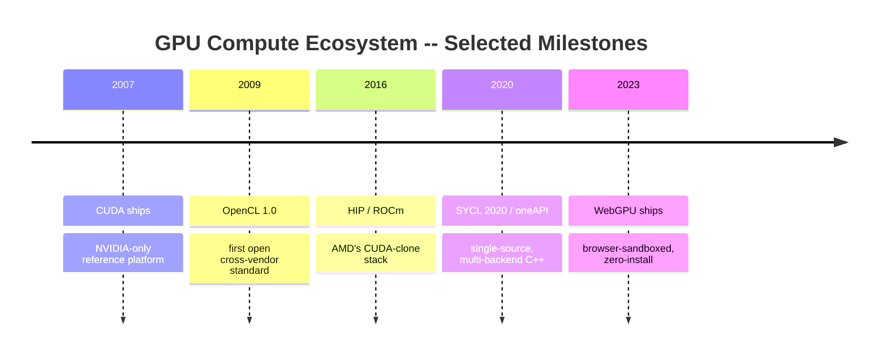
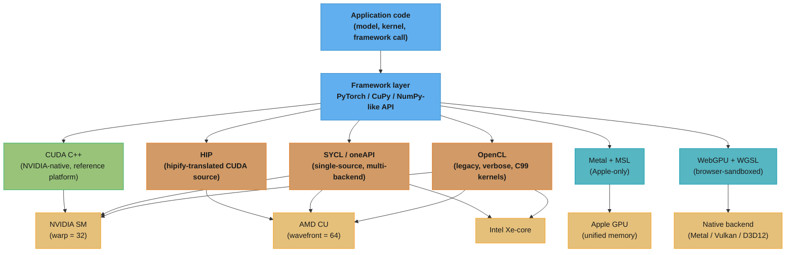
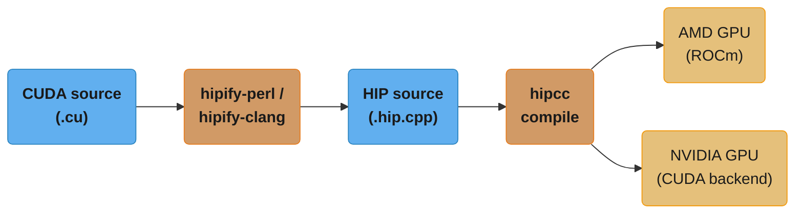
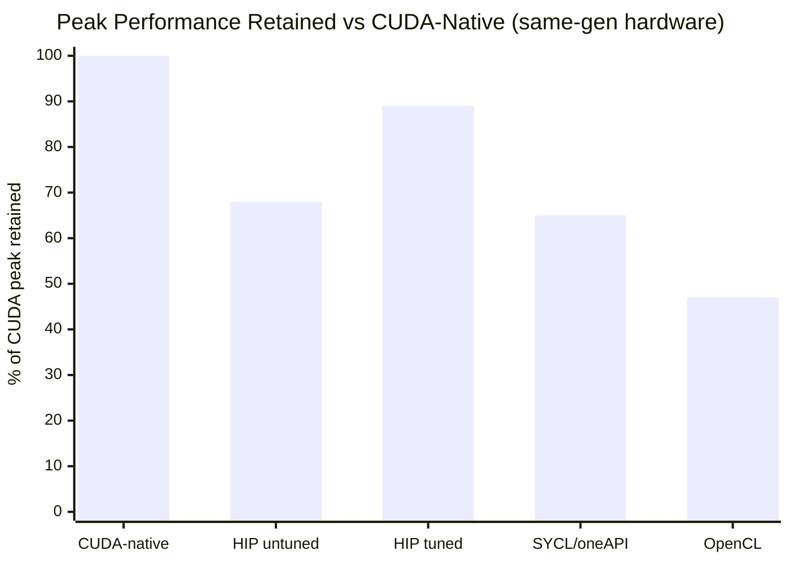
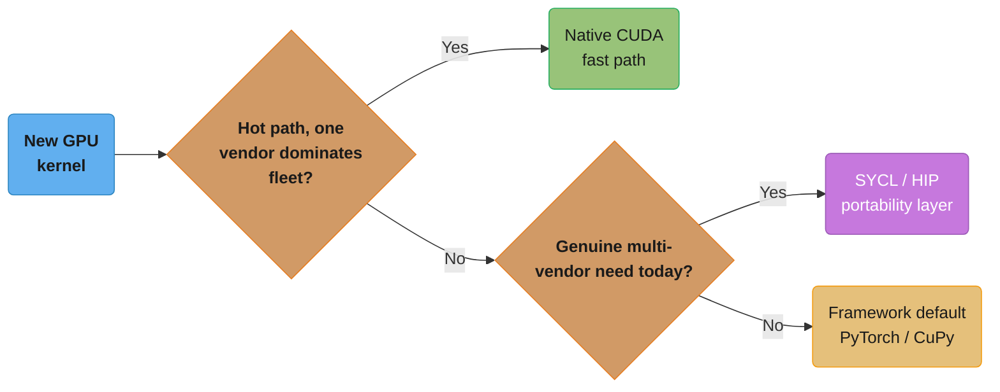

# GPU Portability: HIP, SYCL & Beyond

## 1. Concept Overview

Every kernel, memory-hierarchy rule, and performance-engineering trick in this section so far has been **CUDA-native** — correct for NVIDIA hardware and nothing else. That is deliberate: CUDA is still the reference platform, with the deepest tooling (Nsight, cuDNN, CUTLASS) and the newest hardware features (TMA, FP4 Tensor Cores). But CUDA source does not run on an AMD Instinct MI300X, an Intel Data Center GPU Max, an Apple M-series GPU, or inside a browser tab — and all four of those targets now matter: AMD and Intel are shipping data-center GPUs that compete on price and availability, Apple ships a GPU in every Mac and iPhone, and WebGPU puts GPU compute in front of billions of browsers with no driver install at all. **GPU portability** is the layer of languages, compilers, and runtimes that let a kernel author write code once and run it — with some cost — on more than one vendor's silicon.

This module surveys that layer from the CUDA programmer's vantage point: **HIP** (AMD's near-1:1 CUDA clone, translated mechanically by `hipify`), **SYCL/oneAPI** (Intel's open, single-source C++ standard targeting CPU/GPU/FPGA), **Metal** (Apple's proprietary shading language and compute API), **WebGPU/WGSL** (the browser's portable GPU API), and **OpenCL** (the aging, verbose, but still-portable ancestor of all of them). It closes with the honest tradeoff every portability decision reduces to: a portability layer *usually* leaves some fraction of peak performance on the table and lags CUDA's newest hardware features by a generation or more — so the real engineering question is never "which API is most portable" but "how much peak am I willing to trade for how much reach, and can I keep a fast path for the vendor that matters most."

This is the **one** cross-vendor module in the CUDA section (see [`../README.md`](../README.md) §3) — everywhere else in this section, "GPU" implicitly means "NVIDIA GPU." Foundational hardware concepts this module assumes: [GPU Hardware Architecture](../gpu_hardware_architecture/), [CUDA Programming Model & Kernels](../cuda_programming_model_and_kernels/), and [Warps & SIMT Execution](../warps_and_simt_execution/) (whose warp-vs-wavefront distinction is central to §10's BROKEN→FIX).

---

## 2. Intuition

> **One-line analogy**: CUDA is a bespoke suit tailored to one body (NVIDIA silicon) — it fits perfectly and looks sharp, but it does not fit anyone else. HIP is the same suit re-cut by a tailor who copied every seam exactly, for a body (AMD) that happens to be built almost identically. SYCL is off-the-rack business formal — it fits acceptably on many bodies (CPU, GPU, FPGA, any vendor) but is never quite as sharp as the bespoke suit on the body it was tailored for.

**Mental model**: Think of every portability layer as sitting somewhere on a single dial between two poles: *"translate the same program"* and *"write to the lowest common denominator."* HIP sits at the translate pole — it is deliberately API-identical to CUDA (`hipMalloc` mirrors `cudaMalloc`, `hipLaunchKernelGGL` mirrors the triple-chevron launch), so a `hipify` script can mechanically rewrite CUDA source into HIP source with very little hand-editing, because HIP was designed as a copy. SYCL and OpenCL sit further toward the lowest-common-denominator pole — they define an abstract execution and memory model that every backend (NVIDIA, AMD, Intel, sometimes CPU) must be able to implement, which means the API cannot expose anything vendor-specific by default. Metal and WebGPU are single-vendor and single-ecosystem respectively (Apple; the web platform) — they trade cross-vendor reach for a tighter, more modern API within their own walls. Where you land on that dial determines both how much of your CUDA knowledge transfers directly and how much peak performance you keep.

**Why it matters**: Vendor lock-in is a real business risk, not a theoretical one — a training or inference workload that only runs on CUDA cannot move to an AMD MI300X (materially cheaper per FLOP in some allocations) or an Intel Gaudi/Max GPU without a rewrite, and cannot ship inside a browser at all. Conversely, chasing full portability naively (writing everything in OpenCL, or hand-writing three separate kernel languages) is its own tax: engineering time triples, and the CUDA path — where most production ML still runs — stops getting the newest-generation optimizations (Tensor Memory Accelerator, FP4 Tensor Cores) because the team is busy maintaining three backends instead of one. The practical answer nearly everyone actually uses is **framework-level portability**: write in PyTorch, and let `torch.cuda`/`torch.backends.mps`/ROCm's CUDA-compatible build pick the right backend — you get portability "for free" for 95% of code, and drop to a hand-written CUDA (or HIP, or Metal) kernel only for the hot 5% that needs it.

**Key insight**: Portability and peak performance are not two independent axes you can max out simultaneously — they trade off, and the trade is not symmetric across the stack. A `hipify`-ported kernel typically runs within single-digit-to-low-teens percent of a hand-tuned native HIP kernel on the *same* AMD hardware, because HIP's API mirrors CUDA closely enough that mechanical translation mostly works — but it is not automatically tuned for AMD's architecture (64-wide wavefronts vs. 32-wide CUDA warps; a different LDS bank count), so the honest number is "compiles and runs correctly for free, runs at peak only after re-tuning launch configuration for the target." SYCL and OpenCL pay a steeper, more consistent tax (commonly cited in the 5-20%+ range against a hand-tuned native kernel, sometimes more for kernels that lean on vendor-specific instructions) precisely because they must abstract over hardware they cannot assume anything about. The engineer's job is not to eliminate this tax — it is to decide, kernel by kernel, whether the reach is worth the percentage.

---

## 3. Core Principles

- **HIP is a translation target, not an abstraction layer.** HIP's C++ API is deliberately near-identical to CUDA's runtime API — same function shapes, same semantics, same triple-chevron-equivalent launch syntax — so that `hipify-perl`/`hipify-clang` can do a largely mechanical source-to-source rewrite instead of requiring a rearchitected program.
- **SYCL is single-source, standard C++, and backend-agnostic by design.** A single `.cpp` file contains both host and device code compiled by a standard-conforming C++ compiler; the same source can target NVIDIA (via a CUDA backend), AMD (via a ROCm backend), Intel (native), or CPU, because SYCL is a Khronos open standard, not a single vendor's implementation.
- **Portability layers cannot expose what only one vendor has.** A cross-vendor API's lowest common denominator is set by whichever supported backend has the *least* capability — so vendor-unique features (CUDA Graphs' exact semantics, Hopper's Tensor Memory Accelerator, a specific Tensor-Core instruction shape) either don't appear in the portable API at all, or appear late, after every backend can support them.
- **Metal and WebGPU are not cross-*vendor* — they are cross-*device within one ecosystem*.** Metal runs on any GPU Apple ships (its own Apple Silicon GPUs, and historically AMD/Intel GPUs in older Macs) but only inside Apple's platforms; WebGPU runs on any GPU any browser vendor supports, but only inside a browser sandbox with the safety and abstraction constraints that implies.
- **OpenCL is the common ancestor and the legacy fallback.** It predates HIP and SYCL, is genuinely cross-vendor (NVIDIA, AMD, Intel, mobile GPUs, even some FPGAs and DSPs), and remains relevant for embedded/mobile targets and older toolchains — but its C99-based kernel language and verbose host-side boilerplate (explicit platform/device/context/queue enumeration) make it the least ergonomic option for a team starting fresh today.
- **Framework-level portability is what most engineers actually rely on.** PyTorch's device abstraction (`torch.device("cuda")`, `"mps"` for Apple Silicon, or a ROCm build where `"cuda"` transparently means HIP underneath) hides HIP/Metal/CUDA choice behind one API for the overwhelming majority of model code; hand-written portable kernels are reserved for the performance-critical minority.
- **The portability-vs-peak-performance decision is a spectrum, not a binary.** The right answer is almost never "rewrite everything in the most portable language" or "CUDA-only, full stop" — it is deciding, workload by workload, which kernels justify a vendor-specific fast path and which can tolerate a portable implementation's overhead.
- **A ported kernel that compiles and runs is not the same as a ported kernel that is tuned.** Correctness transfers far more easily across a portability layer than performance does — the hardware constants a CUDA kernel was tuned against (warp size, shared-memory bank count, register file size) are frequently *different numbers* on the target hardware.

---

## 4. Types / Architectures / Strategies

Before the per-technology detail, it helps to see how this cast of five arrived in
roughly the order the industry actually needed them — CUDA first as the proprietary
reference platform, then an open standard, then a vendor clone, then a modern
open standard, then a browser-native API:



Caption: CUDA's two-year head start over OpenCL (2007 vs. 2009) is why it became the
default even though OpenCL was cross-vendor from day one — tooling and ecosystem depth
compounded faster than portability mattered to most teams; HIP, SYCL/oneAPI, and WebGPU
each arrived later specifically to close a reach gap CUDA never had to solve.

### 4.1 HIP / ROCm (AMD) — the CUDA clone

AMD's **ROCm** (Radeon Open Compute) platform is the CUDA-equivalent software stack; **HIP** (Heterogeneous-computing Interface for Portability) is its C++ programming model, engineered to mirror CUDA's runtime API almost function-for-function. `hipMalloc`/`hipMemcpy`/`hipFree` mirror `cudaMalloc`/`cudaMemcpy`/`cudaFree`; kernel launch uses `hipLaunchKernelGGL(kernel, gridDim, blockDim, sharedMem, stream, args...)` as the portable equivalent of CUDA's `<<<grid, block>>>` syntax (HIP also supports the triple-chevron syntax directly when compiled with `hipcc`). Because the mapping is so direct, **HIP source compiles on NVIDIA GPUs too** (HIP's NVIDIA backend is a thin wrapper over the CUDA runtime) — so a single HIP codebase can target both vendors from one source tree, which is the opposite direction of `hipify` (CUDA → HIP) but equally real.

`hipify-perl` and `hipify-clang` mechanically translate CUDA source into HIP source: `cudaMalloc` becomes `hipMalloc`, `cudaMemcpyDeviceToHost` becomes `hipMemcpyDeviceToHost`, `<<<...>>>` launches are rewritten, and most straightforward CUDA C++ ports with a >90% automated translation rate for typical kernels — the remainder needs hand-fixing for CUDA-only library calls (cuBLAS/cuDNN calls need their rocBLAS/MIOpen equivalents) or intrinsics without a direct HIP mapping.

### 4.2 SYCL / oneAPI (Intel, open standard) — single-source, multi-backend C++

**SYCL** is a Khronos-group open standard for single-source heterogeneous C++; **oneAPI** is Intel's concrete implementation and toolchain built on SYCL (via the DPC++ compiler). A SYCL program expresses parallelism through a `sycl::queue` and `parallel_for` submitted with a kernel lambda, using either **buffers** (a managed, dependency-tracked abstraction where the SYCL runtime schedules data movement automatically) or **USM** (Unified Shared Memory — explicit pointers via `malloc_device`/`malloc_shared`, closer to CUDA's mental model). SYCL backends exist for Intel GPUs natively, and via community/vendor plugins for NVIDIA (through a CUDA backend) and AMD (through a ROCm/HIP backend) — genuinely one source targeting three vendors, at the cost of the abstraction overhead described in §2.

Intel also ships a **migration tool** for the CUDA-to-SYCL direction — the **DPC++ Compatibility Tool** (`dpct`, also distributed as the open-source **SYCLomatic** project) — the SYCL-world analog of `hipify`. It parses CUDA source and emits SYCL source mechanically, but because SYCL's abstraction (buffers/accessors, a `queue` object, no triple-chevron launch syntax at all) sits further from CUDA's API shape than HIP's does, `dpct`/SYCLomatic output typically needs proportionally more manual cleanup than a `hipify` pass on the same kernel — a direct consequence of where SYCL sits on the translate-vs-abstract dial in §2.

### 4.3 Metal (Apple) — proprietary, ecosystem-scoped

**Metal** is Apple's low-level graphics-and-compute API, with **MSL** (Metal Shading Language, a C++14-based kernel language) as its device-code language. It targets exactly one ecosystem — macOS, iOS, iPadOS — but every GPU Apple ships is programmable through it, including the M-series unified-memory architecture where CPU and GPU share the same physical memory pool (no explicit host↔device copy is needed the way CUDA/HIP require, which is a genuine architectural advantage for certain workloads, not just an API difference). Metal is not portable to any non-Apple hardware; frameworks that need to "reach" macOS/iOS (PyTorch's MPS backend, ONNX Runtime's CoreML/Metal execution providers) implement a Metal backend specifically for that purpose.

### 4.4 WebGPU / WGSL — the browser's portable GPU API

**WebGPU** is a browser-native GPU API (the spiritual successor to the deprecated WebGL-compute and the abandoned NVIDIA/browser-specific "WebCUDA" ideas that never shipped), with **WGSL** (WebGPU Shading Language) as its kernel language. It runs inside the browser sandbox on top of whatever native API the platform actually has underneath (Metal on macOS, Vulkan or Direct3D 12 on Linux/Windows, translated transparently by the browser engine) — so a WGSL compute shader is portable across operating systems and GPU vendors *and* requires no install, no driver toolchain, nothing beyond visiting a URL. The cost is a stricter, more limited feature set (no raw pointers, a validation layer that rejects unsafe patterns by construction) reflecting the sandboxed, security-first constraints of running arbitrary code from an arbitrary website.

### 4.5 OpenCL — the legacy, verbose, genuinely-portable ancestor

**OpenCL** (Open Computing Language) is the oldest of these standards (2009), a genuinely cross-vendor, cross-device-class standard (GPUs from NVIDIA/AMD/Intel/mobile vendors, CPUs, DSPs, and some FPGAs all have OpenCL implementations). Its kernel language is C99-based (`__kernel`, `__global`, `__local` address-space qualifiers) and its host-side API requires explicit, verbose enumeration of platforms, devices, contexts, command queues, and program objects before a single kernel can launch — ergonomics that HIP and SYCL were both explicitly designed to improve on. OpenCL remains the right choice for embedded and mobile targets, older toolchains, and any environment where SYCL/HIP support does not yet exist, but it is rarely the first choice for a new data-center ML project today.

### 4.6 Framework-level portability — what most engineers actually use

The layer nearly everyone touches directly: **PyTorch's device abstraction**. `torch.cuda.is_available()` / `torch.backends.mps.is_available()` / a ROCm-built PyTorch where `torch.device("cuda")` transparently dispatches to HIP under the hood let the overwhelming majority of model code — tensor ops, autograd, standard layers — run unmodified across NVIDIA, AMD, and Apple Silicon. **CuPy** similarly ships a ROCm-compatible build so NumPy-like array code runs on AMD GPUs with the same `cupy.ndarray` API. This is portability by *not writing a portable kernel at all* — you write once against a high-level framework, and the framework's own backend engineers absorbed the HIP/Metal/CUDA translation cost once, centrally, instead of every application team paying it independently.

---

## 5. Architecture Diagrams

### The Portability Stack — CUDA as the Reference Point



Caption: the framework layer is where most engineers' portability decision actually lives — everything below it is a choice the framework's own backend maintainers made once; the further right a path runs (SYCL/OpenCL touching three hardware targets from one source), the more the abstraction has to assume nothing vendor-specific about any of them.

### Warp vs. Wavefront — the Constant a `hipify` Port Forgets to Re-Tune

```
CUDA warp (NVIDIA) -- 1 scheduling unit = 32 threads

lane index (tens):  0000000000111111111122222222223
lane index (ones):  0123456789012345678901234567890 1
                    +--------------------------------+
32 lanes:           |VVVVVVVVVVVVVVVVVVVVVVVVVVVVVVVV|
                    +--------------------------------+

HIP wavefront (AMD CDNA) -- 1 scheduling unit = 64 threads
(RDNA can also run in a 32-wide "wave32" mode)

lane index: 0..63, all 64 lanes active for one instruction
           +----------------------------------------------------------------+
64 lanes:  |VVVVVVVVVVVVVVVVVVVVVVVVVVVVVVVVVVVVVVVVVVVVVVVVVVVVVVVVVVVVVVVV|
           +----------------------------------------------------------------+

Reduction loop hardcoded for warp=32, run unmodified on a 64-wide wavefront:

  for (int off = 16; off > 0; off >>= 1)
      sum += __shfl_down(sum, off);

  On a CUDA warp (32 lanes):        covers all 32 lanes -- correct.
  On an AMD wavefront (64 lanes):   covers only lanes 0-31 -- lanes 32-63
                                     never participate. Silently wrong
                                     partial reduction, not a crash.
```

Caption: a `hipify`-translated reduction that hardcodes `32` (or a loop bound derived from `warpSize` read at CUDA-compile time rather than the target's actual wavefront width) is the single most common "it compiles and looks right" bug in a naive AMD port — see the BROKEN→FIX in §10, and [Warps & SIMT Execution](../warps_and_simt_execution/) for why the warp/wavefront width is a hardware scheduling constant, not a portable one.

### Portability vs. Peak Performance — the Central Tradeoff

```mermaid
quadrantChart
    title Reach vs. peak-performance retained
    x-axis Low reach --> High reach
    y-axis Low peak retained --> High peak retained
    quadrant-1 Ideal but rare
    quadrant-2 Native fast path
    quadrant-3 Avoid: worst of both
    quadrant-4 Broad-reach portable layer
    CUDA C++: [0.12, 0.95]
    HIP (native-tuned): [0.30, 0.85]
    HIP (hipify, untuned): [0.30, 0.65]
    SYCL/oneAPI: [0.55, 0.62]
    OpenCL: [0.70, 0.45]
    WebGPU/WGSL: [0.85, 0.35]
    Metal (Apple-only): [0.20, 0.80]
```

Caption: nothing sits in the top-right — the further a layer reaches across vendors, the more peak it typically gives up; the practical strategy in §9 is to keep a CUDA (or native HIP) fast path for the workload that matters most and accept the portable layer's discount everywhere reach matters more than the last 10-20%.

---

## 6. How It Works — Detailed Mechanics

### The same kernel, four ways: CUDA C++, HIP, SYCL, and Python

A simple element-wise vector add is the clearest Rosetta Stone — the same logic, four times, so the API mapping is visible side by side.

**CUDA C++ (the reference):**

```cpp
// vector_add.cu — CUDA C++ reference kernel
__global__ void vectorAdd(const float* a, const float* b, float* c, int n) {
    int idx = blockIdx.x * blockDim.x + threadIdx.x;
    if (idx < n) {
        c[idx] = a[idx] + b[idx];
    }
}

void launchVectorAdd(const float* a, const float* b, float* c, int n) {
    float *da, *db, *dc;
    cudaMalloc(&da, n * sizeof(float));
    cudaMalloc(&db, n * sizeof(float));
    cudaMalloc(&dc, n * sizeof(float));
    cudaMemcpy(da, a, n * sizeof(float), cudaMemcpyHostToDevice);
    cudaMemcpy(db, b, n * sizeof(float), cudaMemcpyHostToDevice);

    int threads = 256;
    int blocks  = (n + threads - 1) / threads;
    vectorAdd<<<blocks, threads>>>(da, db, dc, n);

    cudaMemcpy(c, dc, n * sizeof(float), cudaMemcpyDeviceToHost);
    cudaFree(da); cudaFree(db); cudaFree(dc);
}
```

**HIP (near-identical API — this is exactly what `hipify-clang` would produce):**

```cpp
// vector_add.hip.cpp — HIP: mechanical translation of the CUDA source above
#include <hip/hip_runtime.h>

__global__ void vectorAdd(const float* a, const float* b, float* c, int n) {
    int idx = blockIdx.x * blockDim.x + threadIdx.x;
    if (idx < n) {
        c[idx] = a[idx] + b[idx];
    }
}

void launchVectorAdd(const float* a, const float* b, float* c, int n) {
    float *da, *db, *dc;
    hipMalloc(&da, n * sizeof(float));
    hipMalloc(&db, n * sizeof(float));
    hipMalloc(&dc, n * sizeof(float));
    hipMemcpy(da, a, n * sizeof(float), hipMemcpyHostToDevice);
    hipMemcpy(db, b, n * sizeof(float), hipMemcpyHostToDevice);

    int threads = 256;
    int blocks  = (n + threads - 1) / threads;
    // Portable launch macro (works whether compiled by hipcc for AMD or NVIDIA):
    hipLaunchKernelGGL(vectorAdd, dim3(blocks), dim3(threads), 0, 0, da, db, dc, n);

    hipMemcpy(c, dc, n * sizeof(float), hipMemcpyDeviceToHost);
    hipFree(da); hipFree(db); hipFree(dc);
}
```

Notice the transformation is almost entirely a find-and-replace: `cuda` → `hip`, `<<<blocks, threads>>>` → `hipLaunchKernelGGL(kernel, dim3(blocks), dim3(threads), sharedMem, stream, args...)`. This is exactly why `hipify-perl`/`hipify-clang` achieve such a high automated-translation rate on straightforward kernels.

**SYCL (single-source, buffer-based — the abstraction goes further):**

```cpp
// vector_add.sycl.cpp — SYCL: one source, multiple possible backends
#include <sycl/sycl.hpp>
using namespace sycl;

void launchVectorAdd(const float* a, const float* b, float* c, int n) {
    queue q{ default_selector_v };   // picks best available device: GPU, else CPU

    buffer<float> bufA(a, range<1>(n));
    buffer<float> bufB(b, range<1>(n));
    buffer<float> bufC(c, range<1>(n));

    q.submit([&](handler& h) {
        accessor A(bufA, h, read_only);
        accessor B(bufB, h, read_only);
        accessor C(bufC, h, write_only, no_init);

        h.parallel_for(range<1>(n), [=](id<1> idx) {
            C[idx] = A[idx] + B[idx];
        });
    });
    // buffer destructors block until the copy back to host completes
}

// USM variant — closer to the CUDA/HIP explicit-pointer mental model:
void launchVectorAddUSM(const float* a, const float* b, float* c, int n, queue& q) {
    float* da = malloc_device<float>(n, q);
    float* db = malloc_device<float>(n, q);
    float* dc = malloc_device<float>(n, q);
    q.memcpy(da, a, n * sizeof(float));
    q.memcpy(db, b, n * sizeof(float)).wait();

    q.parallel_for(range<1>(n), [=](id<1> idx) {
        dc[idx] = da[idx] + db[idx];
    }).wait();

    q.memcpy(c, dc, n * sizeof(float)).wait();
    free(da, q); free(db, q); free(dc, q);
}
```

SYCL's **buffer/accessor** model lets the runtime infer data dependencies and schedule host↔device copies automatically (no explicit `memcpy` calls, no manual free) — genuinely higher-level than CUDA/HIP, at the cost of the runtime doing dependency-tracking work CUDA leaves entirely to the programmer. The **USM** variant trades that automatic scheduling for explicit pointers that read almost like `hipMalloc`/`cudaMalloc`, for teams that prefer the more familiar, more predictable model.

**Python — CuPy on ROCm, and PyTorch's cross-backend dispatch:**

```python
import cupy as cp

# CuPy: NumPy-like API, works unmodified on a ROCm build against an AMD GPU
# (the CuPy team maintains the HIP backend so application code never sees it)
a = cp.random.rand(1_000_000, dtype=cp.float32)
b = cp.random.rand(1_000_000, dtype=cp.float32)
c = a + b  # dispatches to a HIP kernel on ROCm, a CUDA kernel on NVIDIA — same source

import torch

def pick_device() -> torch.device:
    if torch.cuda.is_available():
        return torch.device("cuda")           # NVIDIA CUDA, or AMD ROCm build
                                                # (ROCm PyTorch aliases "cuda" to HIP)
    if torch.backends.mps.is_available():
        return torch.device("mps")             # Apple Silicon, via Metal
    return torch.device("cpu")

device = pick_device()
x = torch.randn(4096, 4096, device=device)
y = torch.randn(4096, 4096, device=device)
z = x @ y  # same Python call dispatches to CUDA, HIP, or Metal Performance Shaders
```

The `torch.device("cuda")` call is the crux of framework-level portability: on a ROCm-built PyTorch, the string `"cuda"` is intentionally kept as the device name for compatibility — under the hood every op dispatches through HIP, not through NVIDIA's driver at all — so application code that was written against NVIDIA never needs to know it is now running on AMD.

### The same kernel, continued: Metal (MSL) and WebGPU (WGSL)

Rounding out the family — the same vector-add logic in Apple's and the browser's kernel languages, so the full spread of "beyond CUDA/HIP/SYCL" is visible in one place.

**Metal Shading Language (MSL) — Apple-only, unified-memory-aware:**

```cpp
// vector_add.metal — MSL kernel function
#include <metal_stdlib>
using namespace metal;

kernel void vectorAdd(device const float* a [[buffer(0)]],
                       device const float* b [[buffer(1)]],
                       device float* c       [[buffer(2)]],
                       uint idx              [[thread_position_in_grid]]) {
    c[idx] = a[idx] + b[idx];
}
// Host side (Swift/Objective-C, elided): MTLBuffer objects backing a, b, c
// can alias the SAME physical memory the CPU wrote them from on Apple
// Silicon's unified memory architecture — no cudaMemcpy-equivalent copy
// is required to get data "onto the GPU" in the discrete-GPU sense.
```

**WGSL — runs inside a browser tab via WebGPU, no install required:**

```rust
// vector_add.wgsl — WGSL compute shader
@group(0) @binding(0) var<storage, read> a: array<f32>;
@group(0) @binding(1) var<storage, read> b: array<f32>;
@group(0) @binding(2) var<storage, read_write> c: array<f32>;

@compute @workgroup_size(256)
fn main(@builtin(global_invocation_id) gid: vec3<u32>) {
    let idx = gid.x;
    if (idx < arrayLength(&a)) {
        c[idx] = a[idx] + b[idx];   // no raw pointers -- storage buffers only,
                                     // bounds-checked by the validation layer
    }
}
```

Two things stand out against the CUDA/HIP/SYCL versions above: MSL's kernel signature threads buffer bindings and thread position through attribute syntax (`[[buffer(N)]]`, `[[thread_position_in_grid]]`) rather than CUDA's implicit `blockIdx`/`threadIdx` built-ins, and WGSL has no pointer arithmetic at all — every access is through a bound, typed, bounds-checked storage buffer, which is the language-level expression of the sandboxed execution model described in §4.4.

### `hipify` in practice

The porting flow is a straight line from one source tree to two compiled targets:



Caption: one `hipcc`-compiled HIP source forks to either silicon target — the concrete
payoff of HIP sitting at the "translate" pole of §2's dial rather than the "abstract"
pole; nothing downstream of `hipify` needs to know which fork it will run on.

```bash
# hipify-clang: parses real CUDA source (not just text substitution) and
# emits HIP source, flagging constructs it cannot translate automatically.
hipify-clang vector_add.cu -o vector_add.hip.cpp

# Typical output for a straightforward kernel: fully automated, 0 manual edits.
# Typical output for code calling cuBLAS/cuDNN: emits hipblas/MIOpen calls
# where a direct mapping exists, and flags anything with no equivalent for
# manual porting.
```

### OpenCL's host-side verbosity — why HIP and SYCL both improved on it

The same vector-add kernel's host side in OpenCL makes concrete exactly what HIP and SYCL streamlined away — explicit platform, device, context, and command-queue enumeration before a single kernel can launch:

```cpp
// OpenCL host boilerplate (elided error checking for space) — compare the
// line count here to the ~6 lines of setup CUDA/HIP needed for the same job.
cl_uint numPlatforms;
clGetPlatformIDs(0, nullptr, &numPlatforms);
std::vector<cl_platform_id> platforms(numPlatforms);
clGetPlatformIDs(numPlatforms, platforms.data(), nullptr);

cl_device_id device;
clGetDeviceIDs(platforms[0], CL_DEVICE_TYPE_GPU, 1, &device, nullptr);

cl_context context = clCreateContext(nullptr, 1, &device, nullptr, nullptr, nullptr);
cl_command_queue queue = clCreateCommandQueueWithProperties(context, device, 0, nullptr);

const char* kernelSource = R"(
    __kernel void vectorAdd(__global const float* a,
                             __global const float* b,
                             __global float* c) {
        int idx = get_global_id(0);
        c[idx] = a[idx] + b[idx];
    }
)";
cl_program program = clCreateProgramWithSource(context, 1, &kernelSource, nullptr, nullptr);
clBuildProgram(program, 1, &device, nullptr, nullptr, nullptr);
cl_kernel kernel = clCreateKernel(program, "vectorAdd", nullptr);

cl_mem bufA = clCreateBuffer(context, CL_MEM_READ_ONLY, n * sizeof(float), nullptr, nullptr);
cl_mem bufB = clCreateBuffer(context, CL_MEM_READ_ONLY, n * sizeof(float), nullptr, nullptr);
cl_mem bufC = clCreateBuffer(context, CL_MEM_WRITE_ONLY, n * sizeof(float), nullptr, nullptr);
clEnqueueWriteBuffer(queue, bufA, CL_TRUE, 0, n * sizeof(float), a, 0, nullptr, nullptr);
clEnqueueWriteBuffer(queue, bufB, CL_TRUE, 0, n * sizeof(float), b, 0, nullptr, nullptr);

clSetKernelArg(kernel, 0, sizeof(cl_mem), &bufA);
clSetKernelArg(kernel, 1, sizeof(cl_mem), &bufB);
clSetKernelArg(kernel, 2, sizeof(cl_mem), &bufC);

size_t globalSize = n;
clEnqueueNDRangeKernel(queue, kernel, 1, nullptr, &globalSize, nullptr, 0, nullptr, nullptr);
clEnqueueReadBuffer(queue, bufC, CL_TRUE, 0, n * sizeof(float), c, 0, nullptr, nullptr);
```

The `__kernel`/`__global` qualifiers and `get_global_id(0)` indexing are directly analogous to CUDA's `__global__` and `blockIdx.x * blockDim.x + threadIdx.x`, so the *kernel* itself is not much more verbose than CUDA's — the tax is almost entirely on the host side, in the explicit platform/device/context/queue/program/buffer lifecycle that CUDA's runtime API, HIP, and SYCL's `queue` abstraction all hide behind a few function calls.

### Concrete numbers to memorize

- **CUDA warp width: 32.** **AMD wavefront width: 64** on CDNA (data-center: MI200/MI300 series); RDNA (consumer) supports both wave64 and wave32 modes. This single constant is the root cause of §10's BROKEN→FIX.
- **`hipify-clang` automated translation rate: commonly >90%** for straightforward CUDA C++ kernels; library calls (cuBLAS/cuDNN → rocBLAS/MIOpen) and CUDA-only intrinsics are the typical remainder needing manual porting.
- **Portability tax vs. a hand-tuned native kernel: commonly cited in the 5-20% range, sometimes more** for SYCL/OpenCL against a hand-tuned CUDA or native HIP kernel on the same hardware — the exact number is workload- and kernel-dependent, not a fixed constant.
- **Feature lag: roughly one hardware generation.** Portable layers typically gain support for a new vendor feature (e.g. a new Tensor-Core instruction shape, TMA-style async copy) only after CUDA has already shipped and stabilized it, because the abstraction has to work across every supported backend, not just the newest one.
- **Apple unified memory: one physical pool, zero explicit host↔device copy** for CPU↔GPU data sharing on Apple Silicon — a genuine architectural difference from the discrete-GPU model CUDA/HIP/most-SYCL-backends assume.

---

## 7. Real-World Examples

- **AMD Instinct MI300X / MI250X in HPC and AI clusters** — ROCm + HIP is the production stack for AMD's data-center GPUs; major ML frameworks (PyTorch, JAX via a ROCm build) ship first-class ROCm support specifically so MI300X can be a drop-in alternative to an NVIDIA H100 fleet for teams porting via `hipify` plus re-tuning.
- **Intel Data Center GPU Max ("Ponte Vecchio") and Intel oneAPI** — Intel's HPC/AI GPU line is programmed through SYCL/oneAPI (via the DPC++ compiler); Intel-funded SYCL backends for NVIDIA and AMD hardware also exist, letting the same oneAPI source target three vendors, which is the concrete argument for SYCL's single-source design.
- **Apple's PyTorch MPS backend** — `torch.device("mps")` routes standard PyTorch model code through Metal Performance Shaders on Apple Silicon, letting the same model training/inference code that runs on CUDA on a data-center GPU also run (usually for local development or small-scale inference) on a MacBook, without a Metal rewrite of application code.
- **WebGPU in Chrome/Firefox/Safari for in-browser ML** — libraries like ONNX Runtime Web and browser-based LLM demos (e.g. WebLLM-style projects) run inference entirely client-side via WGSL compute shaders, trading peak throughput for "zero install, runs on any GPU the browser can see."
- **Blender's Cycles renderer** — ships CUDA, HIP, and Metal backends for the same ray-tracing kernel logic side by side, a concrete example of a production application choosing to maintain multiple native backends (rather than one portable layer) specifically because rendering is performance-critical enough to justify the extra maintenance cost.
- **Mobile/embedded OpenCL for camera and image pipelines** — Qualcomm Adreno and ARM Mali GPUs expose OpenCL as their primary compute API for on-device image-signal-processing and early on-device ML acceleration, a market segment where SYCL/HIP toolchain support has historically lagged and OpenCL's broader device-class reach (down to DSPs on the same SoC) still matters.
- **Intel's SYCLomatic-assisted CUDA migrations** — Intel publishes concrete migration guides using `dpct`/SYCLomatic to port existing CUDA codebases (including CUDA samples and third-party HPC applications) to SYCL for oneAPI targets, the same "mechanical-translation-plus-manual-cleanup" workflow as `hipify`, applied to a different destination language.

---

## 8. Tradeoffs

| Dimension | CUDA | HIP / ROCm | SYCL / oneAPI | Metal | WebGPU | OpenCL |
|-----------|------|------------|----------------|-------|--------|--------|
| Vendor | NVIDIA only | AMD (+ NVIDIA via backend) | Open standard (Intel-led); NVIDIA/AMD backends exist | Apple only | Open standard (all major browsers) | Open standard (NVIDIA/AMD/Intel/mobile/FPGA) |
| Kernel language | CUDA C++ | HIP C++ (near-identical to CUDA) | Single-source ISO C++ (SYCL kernel lambdas) | MSL (C++14-based) | WGSL | OpenCL C (C99-based) |
| Portability | None (NVIDIA-only) | High to AMD; compiles to NVIDIA too via backend | High — one source, multiple backends | None outside Apple ecosystem | High — any GPU any supporting browser can see | Highest — broadest vendor/device-class support |
| Maturity / tooling | Deepest (Nsight, cuBLAS/cuDNN/CUTLASS, two decades of libraries) | Mature for AMD; rocBLAS/MIOpen mirror cuBLAS/cuDNN | Maturing; DPC++ solid on Intel, community backends elsewhere | Mature within Apple's ecosystem | Newest; still stabilizing across browsers | Oldest; broad but less actively advanced for new hardware |
| Peak-perf gap vs. native-tuned CUDA-equivalent | Baseline (0%, this *is* native) | Low once re-tuned for wavefront/LDS; higher if left untouched post-`hipify` | Commonly 5-20%+, workload-dependent | Low within Apple hardware (native API) | Higher — sandboxed, no raw pointers, validation overhead | Commonly among the largest gaps for a hand-tuned target |
| Ecosystem / library depth | cuBLAS, cuDNN, CUTLASS, Thrust, TensorRT | rocBLAS, MIOpen, rocThrust (mirrors, less mature) | oneMKL, oneDNN (Intel-focused) | Metal Performance Shaders, MPSGraph | Growing (ONNX Runtime Web, WebLLM-class projects) | Broad but thinner high-level library layer than CUDA |

The "Peak-perf gap" row above, read as absolute percentages against a CUDA-native
baseline rather than a qualitative label, makes the size of each layer's tax concrete:



Caption: the gap between "HIP untuned" (a raw `hipify` output) and "HIP tuned" is
almost entirely the wavefront/LDS re-derivation from §10's BROKEN→FIX — HIP's peak
recovers close to CUDA's once re-tuned, while SYCL and OpenCL pay a steadier tax
that re-tuning alone cannot close because it comes from the abstraction itself.

---

## 9. When to Use / When NOT to Use

The per-kernel decision in §2 and §3 collapses to a small number of questions, asked
in order:



Caption: this is the §9 bullet lists below distilled into one path — the CUDA fast
path and a portability layer are not competing defaults, they are answers to two
different questions asked in sequence, with framework-level portability catching
everything that answers "no" to both.

**Reach for HIP when:**
- The target is specifically AMD data-center hardware (MI-series) and the existing codebase is CUDA C++ — `hipify` gets correctness fast, and the remaining work is re-tuning launch configuration and shared-memory usage for AMD's wavefront/LDS numbers (§10).
- You want one HIP source tree to build for both AMD and NVIDIA (HIP's NVIDIA backend wraps the CUDA runtime), rather than maintaining two separate kernel languages.

**Reach for SYCL/oneAPI when:**
- The requirement is genuinely multi-vendor from day one (NVIDIA, AMD, and Intel all in scope) and the team can accept a portability tax in exchange for one maintained source tree instead of three.
- The target includes Intel data-center GPUs specifically, where oneAPI is the first-class, vendor-supported path.

**Reach for Metal when:**
- The target is exclusively Apple hardware and you want to exploit Apple-Silicon-specific advantages (unified memory, Metal Performance Shaders) rather than go through a portability layer's lowest-common-denominator model.

**Reach for WebGPU when:**
- The deployment target is literally "run in a browser, any OS, any GPU, no install" — client-side inference demos, in-browser image/video processing, or any product where "download a 4 GB engine and install a driver" is a non-starter for the audience.

**Reach for OpenCL when:**
- The target is an embedded, mobile, or legacy environment where SYCL/HIP toolchains are unavailable or unsupported, or the project predates both and migrating off OpenCL is not currently justified.

**Do NOT default to a portability layer when:**
- The workload is a hot, performance-critical kernel destined only ever to run on NVIDIA hardware in production (the common case for frontier-model training and serving today) — writing it directly in CUDA C++ (or Triton, see [Triton & Kernel DSLs](../triton_and_kernel_dsls/)) captures the newest hardware features immediately instead of waiting for a portable layer to catch up.
- The team lacks the bandwidth to maintain and re-tune *per-target* — a portability layer only pays off if someone actually profiles and tunes the ported result on each target; "it compiled" is not "it is fast" (§10).
- You are about to write straight to OpenCL "to be safe" for a brand-new project with no near-term multi-vendor requirement — you will pay OpenCL's verbosity and its typically larger peak-perf gap for a portability need that may never materialize; prefer PyTorch/CuPy's framework-level portability instead and drop to a native kernel only where profiling demands it.

---

## 10. Common Pitfalls

**BROKEN — assuming a `hipify`-ported kernel is automatically optimal on AMD hardware**

```cpp
// BROKEN: this warp-shuffle reduction was tuned for CUDA's warp = 32.
// hipify-clang translates the intrinsic names correctly (__shfl_down_sync
// -> __shfl_down) but has NO WAY to know the loop bound below assumed a
// 32-wide scheduling unit -- it compiles and runs cleanly on AMD, and
// silently produces a WRONG partial sum on CDNA hardware (wavefront = 64).
__device__ float warpReduceSum_portedNaive(float val) {
    for (int offset = 16; offset > 0; offset >>= 1) {
        val += __shfl_down(val, offset);   // hipify'd from __shfl_down_sync
    }
    return val;   // only reduces the first 32 of 64 lanes on a CDNA wavefront
}
```

Nsight-equivalent AMD profiling (`rocprof`) on this kernel shows correct results only for reductions whose semantics happen to tolerate a partial sum (they usually don't) — the bug is silent, not a crash, because 32 of the 64 lanes simply never contribute and nothing signals an error.

**FIX — re-tune the reduction for the actual target wavefront width**

```cpp
// FIX: read the true hardware width instead of hardcoding CUDA's warp=32,
// and loop until every lane in THIS target's scheduling unit has folded in.
#if defined(__HIP_PLATFORM_AMD__)
constexpr int kWidth = 64;   // CDNA/RDNA wavefront (verify per target: wave32 mode exists on RDNA)
#else
constexpr int kWidth = 32;   // CUDA warp
#endif

__device__ float warpReduceSum_retuned(float val) {
    for (int offset = kWidth / 2; offset > 0; offset >>= 1) {
        val += __shfl_down(val, offset);
    }
    return val;   // now folds all lanes of the ACTUAL scheduling unit, either platform
}
```

The same class of bug recurs in shared-memory tiling: a tile sized and padded to avoid CUDA's 32-bank conflicts is not automatically conflict-free on AMD's LDS (Local Data Share), which has a different bank count and conflict model — every shared-memory access pattern tuned against [Shared Memory & Bank Conflicts](../shared_memory_and_bank_conflicts/)'s CUDA-specific numbers needs its own re-derivation for the target architecture's actual bank layout, not a copy-paste of the CUDA padding constant.

**BROKEN — writing straight to the lowest common denominator (OpenCL) and losing CUDA-only performance features**

```cpp
// BROKEN (from a performance standpoint): a team building for "maximum
// portability" writes their flagship attention kernel in OpenCL C so it
// runs everywhere. It runs everywhere -- and on the NVIDIA H100 fleet that
// serves 95% of their production traffic, it never uses Tensor Cores, never
// gets TMA-accelerated async copy, and cannot express the warp-specialized
// producer/consumer pattern a hand-written CUDA FlashAttention kernel uses,
// because OpenCL's abstraction doesn't expose any of that -- most of their
// fleet-hours are now paying a portability tax that has no matching payoff
// (they have ~5 AMD/embedded devices in the entire fleet).
```

**FIX — keep a CUDA fast path, and a portable fallback for the minority target**

```cpp
// FIX: maintain the hot kernel natively for the hardware that serves the
// overwhelming majority of traffic (CUDA C++/Triton, using Tensor Cores +
// TMA), and route the small number of non-CUDA devices through a portable
// SYCL or OpenCL implementation that is allowed to be slower -- because it
// serves a minority of capacity, not the fleet's throughput ceiling.
#if defined(__CUDACC__)
  // native CUDA FlashAttention-style kernel: Tensor Cores, TMA, warp specialization
#else
  // portable SYCL/OpenCL fallback: correct, slower, used only on the
  // small non-NVIDIA slice of the fleet
#endif
```

This mirrors the general engineering principle in §9: the right amount of portability is decided per-kernel, weighted by how much of your actual capacity runs on which vendor — not applied uniformly to every kernel in the codebase.

Other common pitfalls:
- **Assuming SYCL buffer/accessor scheduling has zero overhead versus explicit USM pointers.** The buffer model's automatic dependency tracking is convenient but is itself runtime work; performance-sensitive SYCL code frequently prefers USM for the same reason CUDA/HIP programmers prefer explicit `malloc`/`memcpy` — predictability.
- **Forgetting that Apple's unified memory changes the cost model, not just the API.** Code ported from a discrete-GPU mental model (CUDA/HIP/most SYCL backends) that manually "optimizes" by minimizing host↔device copies may be solving a problem that doesn't exist on Apple Silicon, while missing the actual bottleneck (GPU-side compute or bandwidth) that unified memory doesn't fix.
- **Treating WebGPU/WGSL like a CUDA kernel with a different file extension.** WGSL has no raw pointers and a validation layer that rejects patterns CUDA permits freely (unbounded array indexing, arbitrary aliasing) — ports frequently need real restructuring, not a syntax-only translation, because the sandboxed execution model is a deliberate constraint, not an oversight.
- **Assuming feature parity on day one for a new CUDA feature.** A brand-new CUDA capability (a new Tensor-Core instruction shape, a new async-copy primitive) is very unlikely to have a HIP/SYCL/Metal/WebGPU equivalent immediately — plan the rollout timeline for any cross-vendor product around that lag, not around CUDA's release date.

---

## 11. Technologies & Tools

| Tool | Purpose | Notes |
|------|---------|-------|
| `hipify-perl` / `hipify-clang` | Mechanical CUDA → HIP source translation | `hipify-clang` parses real AST (more accurate); `hipify-perl` is a lighter text-pattern tool |
| ROCm (rocBLAS, MIOpen, rocThrust, rocProfiler) | AMD's CUDA-library-equivalent stack + profiler | Mirrors cuBLAS/cuDNN/Thrust/Nsight roles respectively |
| Intel oneAPI / DPC++ compiler | SYCL implementation + toolchain, Intel-first-class | `icpx`/`dpcpp` compile SYCL source; oneMKL/oneDNN are the math/DNN library mirrors |
| Codeplay / community SYCL backends | SYCL-for-CUDA, SYCL-for-HIP plugins | Let a single SYCL source target NVIDIA/AMD hardware, not only Intel |
| Xcode + Metal / Metal Performance Shaders (MPS) | Apple's compute toolchain + tuned kernel library | MPSGraph gives a higher-level graph API above raw MSL kernels |
| `wgpu` / browser DevTools | WebGPU implementations (native Rust `wgpu`, and each browser's built-in) | `wgpu` also lets native (non-browser) apps use WebGPU as a portable compute API |
| Khronos OpenCL SDK / vendor ICDs | OpenCL platform/device enumeration and runtime | Each vendor ships an Installable Client Driver (ICD); host code enumerates all available ICDs at runtime |
| PyTorch (`torch.device`) / CuPy | Framework-level portability for the majority of application code | The path most engineers should default to before hand-writing any portable kernel |

---

## 12. Interview Questions with Answers

**Does `hipify`-translating a CUDA kernel to HIP automatically make it fast on AMD hardware?**
No — `hipify` gets you correctness and compilation, not tuning, because it performs a largely mechanical API translation without knowing anything about the target's actual hardware constants. The classic failure is a warp-shuffle reduction whose loop bound was tuned for CUDA's 32-wide warp silently under-covering AMD's 64-wide wavefront, producing a wrong partial result rather than a compile error.

**What is the single biggest architectural constant that differs between a CUDA warp and an AMD wavefront, and why does it matter?**
CUDA's warp is 32 threads; AMD's CDNA wavefront is 64 threads (RDNA also supports a 32-wide "wave32" mode). Any code whose correctness or tuning depends on that width — shuffle-based reductions, shared-memory/LDS bank-conflict avoidance, occupancy math — must be re-derived for the target, not copy-pasted; treating it as a portable constant is the root cause of the most common silent-correctness bug in a naive CUDA-to-HIP port.

**If you write a hot kernel directly in OpenCL "to be portable," what do you typically give up on your NVIDIA fleet?**
You lose CUDA-only performance features that OpenCL's lowest-common-denominator abstraction cannot expose. Tensor Core instruction shapes, Hopper's Tensor Memory Accelerator, and warp-specialized producer/consumer patterns all disappear, because a cross-vendor standard can only expose what every supported backend can implement — for a fleet where the overwhelming majority of capacity is NVIDIA, this usually means paying a portability tax with no matching payoff.

**What is HIP, and why can `hipify` translate CUDA source into it so mechanically?**
HIP (Heterogeneous-computing Interface for Portability) is AMD's C++ GPU programming model, deliberately engineered to mirror CUDA's runtime API function-for-function. `hipMalloc` mirrors `cudaMalloc` and `hipLaunchKernelGGL` mirrors the triple-chevron launch, so `hipify-perl`/`hipify-clang` can rewrite most straightforward CUDA kernels with a high automated-translation rate, unlike a rewrite into a genuinely different abstraction like SYCL or OpenCL.

**How does SYCL differ from HIP in its basic design philosophy?**
HIP is a translation target — an API deliberately shaped to match CUDA so mechanical porting works — while SYCL is an abstraction defined independently of any one vendor's API. It is expressed as single-source standard C++ with a `queue`/`parallel_for` model that must be implementable across NVIDIA, AMD, Intel, and CPU backends, which is exactly why porting CUDA to SYCL is a genuine rewrite rather than a mechanical translation.

**Why does a portability layer typically lag CUDA's newest hardware features by a generation or more?**
A cross-vendor API can only expose a capability once every backend it claims to support can implement it. A brand-new CUDA-only feature — a new Tensor-Core instruction shape, a new async-copy primitive — has no reason to appear in HIP/SYCL/Metal/WebGPU until the abstraction's maintainers add and validate it, so plan any cross-vendor roadmap around that lag rather than assuming day-one parity.

**What does Apple's unified memory architecture change about how you should think about a CUDA/HIP port to Metal?**
CPU and GPU share one physical memory pool on Apple Silicon, so there is no explicit host↔device copy the way discrete-GPU models require. Code "optimized" by minimizing transfer calls may be solving a problem that does not exist on that hardware while missing the actual bottleneck (GPU compute or bandwidth), which is why a naive port needs re-profiling against Apple's real cost model, not just re-syntaxing into MSL.

**What is the practical difference between SYCL's buffer/accessor model and USM, and which would you pick for a performance-critical kernel?**
Buffers let the SYCL runtime infer data dependencies and schedule host↔device transfers automatically, at the cost of runtime dependency-tracking overhead. USM (Unified Shared Memory) instead exposes explicit device/host/shared pointers closer to CUDA's mental model, and performance-critical SYCL code commonly prefers USM for the same reason CUDA/HIP programmers prefer explicit memory management over a scheduler they can't fully see into.

**Why is WebGPU not simply "CUDA that runs in a browser"?**
WGSL has no raw pointers and enforces a validation layer that rejects patterns CUDA permits freely, such as unbounded array indexing or pointer aliasing. The browser must run arbitrary code from arbitrary websites safely inside a sandbox, so a port from CUDA to WGSL is frequently a real restructuring of memory-access patterns, not a syntax-only translation.

**When would you choose to maintain three separate native GPU backends (CUDA, HIP, Metal) for one kernel instead of writing it once in a portable layer like SYCL or OpenCL?**
When the kernel is performance-critical enough on every target that a shared abstraction's portability tax (typically 5-20%+ against a hand-tuned native kernel) is unacceptable across all three. Blender's Cycles renderer is a concrete example: it ships native CUDA, HIP, and Metal backends for the same ray-tracing logic rather than one portable path, because rendering throughput is exactly this performance-critical.

**What is the "framework-level portability" most engineers actually rely on, and why does it matter?**
It is writing application code against a high-level framework (PyTorch, CuPy) whose maintainers have already absorbed the CUDA/HIP/Metal translation cost once, centrally. `torch.device("cuda")` transparently means HIP on a ROCm build and `torch.device("mps")` routes through Metal on Apple Silicon, so most engineers never have to make the HIP-vs-SYCL-vs-Metal decision directly — that decision is reserved for the small fraction of hot, hand-written kernels.

**Is OpenCL still relevant for a new ML infrastructure project started today?**
Rarely as a first choice for data-center ML, but yes for embedded, mobile, or legacy targets where SYCL and HIP toolchains are unavailable or unsupported. OpenCL remains the broadest genuinely cross-vendor, cross-device-class standard (GPUs, CPUs, some DSPs/FPGAs), but its C99-based kernel language and verbose host-side platform/device/context enumeration make HIP or SYCL the more ergonomic choice wherever they are actually available.

**Can HIP source run on NVIDIA hardware, and why would you want that?**
Yes — HIP's NVIDIA backend is a thin wrapper over the CUDA runtime, so a single HIP codebase can build for both AMD and NVIDIA from one source tree. This is attractive for a team that wants one maintained kernel language across both major discrete-GPU vendors without adopting a fuller abstraction like SYCL.

**A `hipify`-ported kernel passes correctness tests on AMD hardware but runs at only 60% of a hand-tuned native HIP kernel's throughput on the same GPU. What would you check first?**
Check the launch configuration and any hardcoded 32-wide assumptions first. Block/wavefront sizing tuned for CUDA's warp=32, shared-memory tiling padded against CUDA's bank-conflict numbers, and shuffle-based reduction loop bounds are the usual culprits, because `hipify` translates API calls correctly but cannot re-derive tuning constants for AMD's different wavefront width and LDS layout — profile with `rocprof` to confirm which constant is costing the gap.

**Why is "write everything in the most portable API available" usually the wrong default for a new GPU project?**
Because portability and peak performance trade off, and defaulting to the most portable option (typically OpenCL) pays that tax on every kernel even when most of the fleet runs on one vendor. The better default is framework-level portability for the majority of code, with a deliberate, per-kernel decision to add a vendor-specific fast path only where profiling shows the hot path actually needs it.

**How does Intel's `dpct`/SYCLomatic migration tool compare to `hipify`, and why does it typically need more manual cleanup for the same source kernel?**
Both mechanically translate CUDA source, but `dpct`/SYCLomatic targets SYCL — an abstraction defined independently of CUDA — while `hipify` targets HIP, which was built to mirror CUDA's shape directly. The further the destination language sits from CUDA's own API shape, the more of the translation cannot be purely mechanical — the translate-vs-abstract dial from §2 showing up in tooling, not just runtime performance.

**Why does WGSL have no raw pointers, and what does that cost a CUDA programmer porting a kernel to it?**
WebGPU must safely execute arbitrary compute code submitted by any website a user visits, so WGSL enforces bounds-checked storage-buffer access instead of pointer arithmetic. That eliminates an entire class of out-of-bounds and aliasing bugs by construction, but it costs a CUDA programmer any pattern that relied on raw pointer arithmetic or pointer-type casting — those usually need restructuring around WGSL's typed buffer model, not a direct syntax swap.

**Does Apple's unified memory architecture mean a Metal port never needs to think about memory placement?**
No — unified memory removes the explicit host↔device copy CUDA/HIP require, but the GPU and CPU still contend for the same physical bandwidth. Large working sets can still be bandwidth- or cache-bound on the GPU side exactly as on a discrete-GPU architecture, so the optimization target shifts from "minimize transfer count" to "minimize GPU-side memory traffic," not away from memory reasoning altogether.

---

## 13. Best Practices

1. **Start any CUDA-to-AMD port with `hipify-clang`, not a manual rewrite.** It achieves a high automated-translation rate on straightforward kernels; spend manual effort only on the library calls and intrinsics it flags as unmapped.
2. **Never assume a `hipify`-ported kernel is tuned — profile it on the target with `rocprof` before shipping.** Re-derive every hardware-constant-dependent value (wavefront width, LDS bank count, occupancy limits) for AMD explicitly; do not copy CUDA's 32-wide and 32-bank numbers across.
3. **Decide portability per-kernel, not per-project.** Keep a native CUDA (or hand-tuned HIP) fast path for the hot kernels serving the majority of your fleet's capacity, and accept a portable SYCL/OpenCL/WebGPU implementation's overhead only for the minority-hardware or reach-first cases.
4. **Default to framework-level portability (PyTorch/CuPy) for the majority of application code.** Reserve hand-written vendor-specific kernels for the profiled-hot minority, rather than hand-porting every kernel in a codebase preemptively.
5. **Budget for a feature-lag delay on any cross-vendor roadmap.** A brand-new CUDA capability will not have a HIP/SYCL/Metal/WebGPU equivalent on day one; plan multi-vendor feature parity around that lag, not around CUDA's release date.
6. **Prefer USM over SYCL buffers for performance-critical kernels; reserve buffers for correctness-first prototyping.** The automatic dependency tracking that makes buffers convenient is exactly the overhead a hot kernel wants to avoid.
7. **Re-profile Apple-Silicon ports against the unified-memory cost model, not the discrete-GPU one.** Do not "optimize" host↔device transfer counts that don't meaningfully exist on that hardware while missing the actual GPU-side bottleneck.
8. **Treat WebGPU/WGSL ports as an algorithmic restructuring exercise, not a syntax translation.** Its lack of raw pointers and stricter validation model frequently force real changes to memory-access patterns, not just renamed API calls.

---

## 14. Case Study

**Scenario:** A team runs a custom tiled-GEMM CUDA kernel (the same shared-memory-tiled pattern covered in [Shared Memory & Bank Conflicts](../shared_memory_and_bank_conflicts/)) on their NVIDIA H100 fleet, achieving 78% of theoretical peak FP16 throughput. Procurement adds a smaller allocation of AMD MI300X GPUs for cost reasons, and the team needs the same GEMM running there within the same sprint.

**Step 1 — mechanical translation:**

```bash
hipify-clang tiled_gemm.cu -o tiled_gemm.hip.cpp
# Output: fully automated translation. cudaMalloc -> hipMalloc, <<<...>>> ->
# hipLaunchKernelGGL, __shfl_down_sync -> __shfl_down. Compiles cleanly
# with hipcc against the ROCm toolchain. Zero manual edits required to compile.
```

**Step 2 — the naive port "works" but underperforms:**

```
rocprof summary on tiled_gemm.hip.cpp (unmodified from hipify output):

  Achieved throughput:        31% of MI300X theoretical FP16 peak
  Warp/wavefront efficiency:  49%   <- the tell: something is only using
                                       half the scheduling unit's lanes
```

**Step 3 — diagnose: the tile dimensions and shuffle reduction assumed warp=32**

```cpp
// BROKEN (post-hipify, uncorrected): tile width chosen as a multiple of
// CUDA's warp size, and the final row-reduction step hardcodes a 32-wide
// shuffle chain -- both numbers are CUDA-specific, not general GPU facts.
#define TILE_DIM 32   // sized for CUDA warp = 32

__device__ float reduceRow(float val) {
    for (int offset = 16; offset > 0; offset >>= 1) {
        val += __shfl_down(val, offset);   // only folds 32 of 64 MI300X lanes
    }
    return val;
}
```

**Step 4 — fix: re-tune for the actual wavefront width and LDS bank layout**

```cpp
// FIX: derive the tile/reduction width from the target's real scheduling
// unit instead of a CUDA-specific constant, and re-validate shared-memory
// (LDS) padding against AMD's bank layout rather than reusing CUDA's.
#if defined(__HIP_PLATFORM_AMD__)
  #define WAVEFRONT_WIDTH 64
#else
  #define WAVEFRONT_WIDTH 32
#endif
#define TILE_DIM WAVEFRONT_WIDTH

__device__ float reduceRow(float val) {
    for (int offset = WAVEFRONT_WIDTH / 2; offset > 0; offset >>= 1) {
        val += __shfl_down(val, offset);
    }
    return val;   // folds all 64 lanes of an MI300X wavefront
}
```

**Metrics — before vs. after re-tuning:**

| Metric | Naive `hipify` port | Re-tuned for MI300X |
|--------|----------------------|------------------------|
| Achieved FP16 throughput | 31% of theoretical peak | 74% of theoretical peak |
| Warp/wavefront efficiency | 49% | 96% |
| Engineering time invested | ~1 day (mechanical translation only) | ~1 additional week (profiling + re-tuning tile/reduction/LDS layout) |
| Comparison to CUDA H100 result | N/A (different hardware) | Within ~5 points of the H100 kernel's 78%-of-peak result — genuinely competitive once tuned |

**Discussion questions:**
1. Why did the naive `hipify` port compile and produce *correct* results but still only reach 31% of peak — what does that gap tell you about which parts of a port are automatable and which are not?
2. If this team's fleet were 95% MI300X and 5% NVIDIA instead of the reverse, would you recommend maintaining two hand-tuned native kernels (CUDA + HIP) or writing the whole thing in SYCL for one shared source? Justify using the reach-vs-peak tradeoff from §2 and §9.
3. The fixed kernel still hardcodes a compile-time `#if` branch on `__HIP_PLATFORM_AMD__` rather than querying wavefront width at runtime — what would change if this kernel needed to run correctly on both AMD RDNA (which supports 32-wide "wave32" mode) and CDNA (fixed 64-wide) without a recompile?
4. The re-tuned kernel still uses AMD's LDS with a bank layout different from CUDA's 32-bank model — what would you check in `rocprof` (the AMD analog of Nsight Compute) to confirm the shared-memory tiling is actually conflict-free on this specific target, rather than assuming the fix worked because throughput improved?

---

**See also:** [Warps & SIMT Execution](../warps_and_simt_execution/) for why warp width is a hardware scheduling constant that a portability layer cannot paper over; [GPU Hardware Architecture](../gpu_hardware_architecture/) for the SM/CU-level differences underlying the CUDA-vs-AMD comparisons in this module; [CUDA Programming Model & Kernels](../cuda_programming_model_and_kernels/) for the baseline kernel/launch model every portability layer in this module is translating away from; [Shared Memory & Bank Conflicts](../shared_memory_and_bank_conflicts/) for the CUDA-specific bank-conflict numbers that do not transfer directly to AMD's LDS; [Triton & Kernel DSLs](../triton_and_kernel_dsls/) for a different axis of portability — one DSL compiling to multiple backends' native ISAs rather than one source language mapped across vendor APIs.
