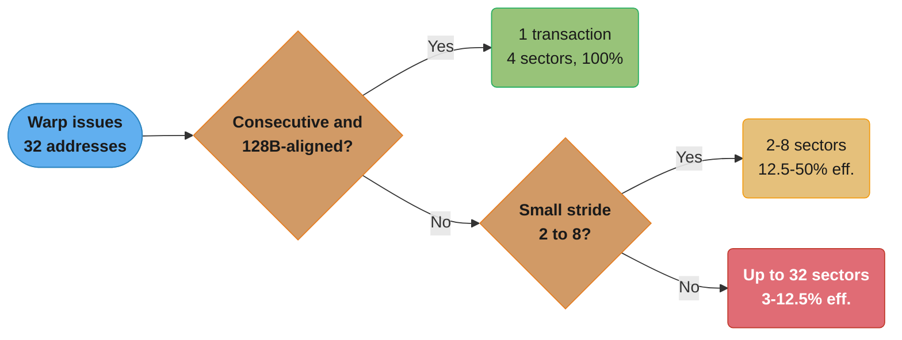
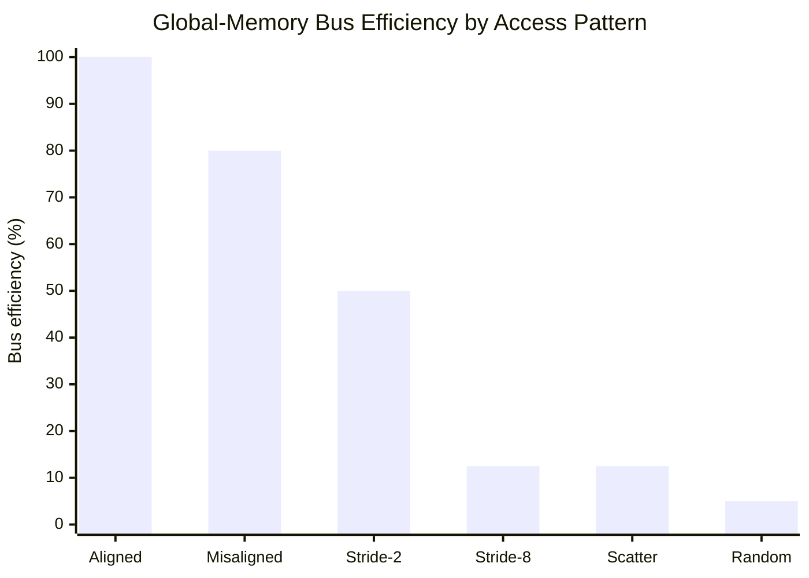
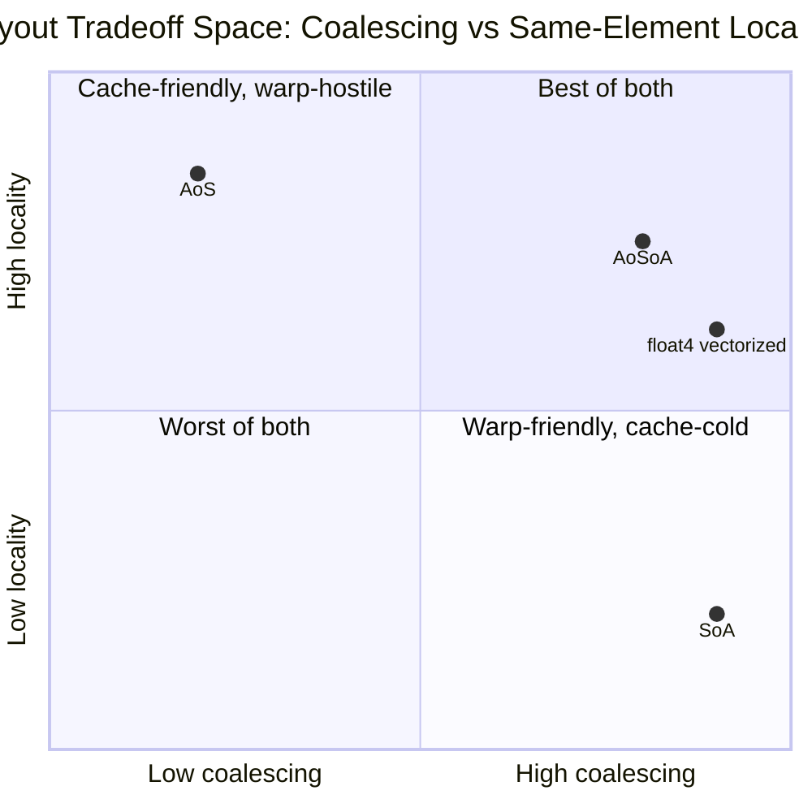
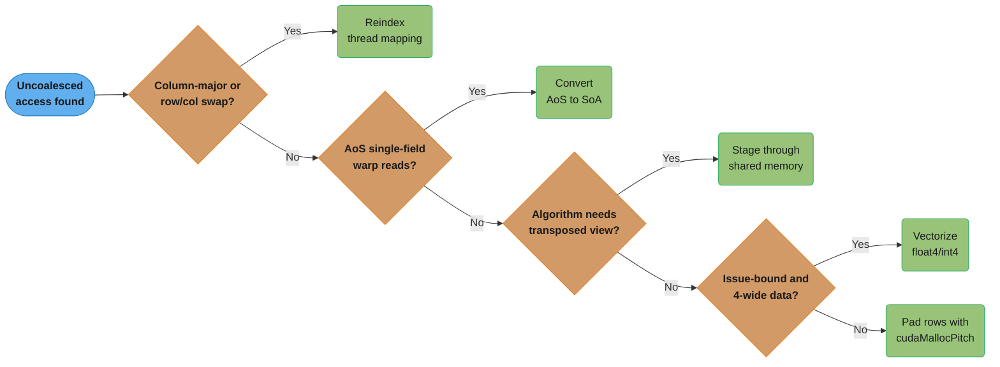
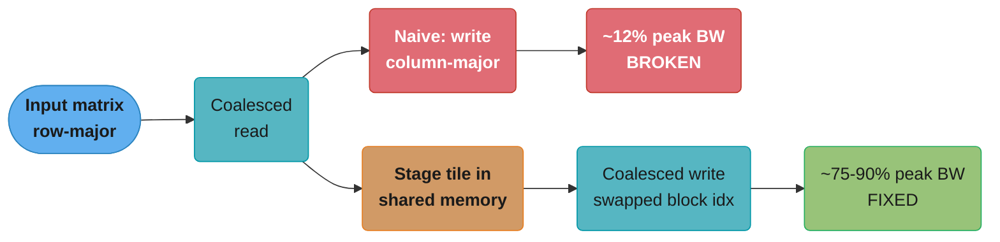

# Memory Coalescing & Access Patterns

## 1. Concept Overview

Memory coalescing is the hardware mechanism by which a GPU's memory controller merges the individual global-memory requests issued by the 32 threads of a warp into the smallest possible number of physical bus transactions. It is the single highest-leverage performance topic in CUDA: on nearly every profiled "slow kernel" ticket, the first thing a senior GPU engineer checks is whether the warp's addresses are coalesced, because an uncoalesced access pattern can silently throw away 50-97% of the memory bandwidth a kernel actually has available.

The hardware does not see "thread 3 wants `arr[3]`" — it sees a warp-wide memory instruction and asks a single question: *what is the minimum set of 32-byte sectors that covers every address the 32 active lanes touched?* When those 32 lanes touch 32 consecutive 4-byte words starting at a 128-byte-aligned address, the answer is exactly four sectors (128 bytes) — one transaction, zero waste. When the lanes touch addresses that are strided, misaligned, or scattered, the answer balloons: the same 128 bytes of *useful* data might require 256 bytes, 1024 bytes, or (in the worst case) 32 separate 32-byte transactions to service.

This module is the kernel author's field guide to that mechanism: the hardware transaction model, how alignment and stride change the sector count, why Array-of-Structures (AoS) layouts are a coalescing trap that Structure-of-Arrays (SoA) fixes, how vectorized `float4`/`int4` loads reduce both instruction count and sector waste, the canonical matrix-transpose problem where a shared-memory staging buffer is the only way to make *both* the read and the write coalesced, and how to read Nsight Compute's memory metrics to prove a fix actually worked.

**Prerequisites**: the SIMT/warp execution model ([warps_and_simt_execution](../warps_and_simt_execution/)) and the CUDA memory hierarchy ([cuda_memory_model_and_hierarchy](../cuda_memory_model_and_hierarchy/)) — coalescing is a property of how a *warp* touches *global* memory, so both must already be second nature.

---

## 2. Intuition

> **One-line analogy**: A coalesced warp access is 32 people boarding one bus through 32 adjacent doors at once; a strided access is those same 32 people scattered across a parking lot, each requiring the bus to swing by and pick them up one at a time.

**Mental model**: The GPU's DRAM does not deliver single bytes — it delivers fixed-size *sectors* (32 bytes) and *transactions* (128 bytes = 4 sectors), the same way a vending machine only dispenses whole cans, never half a can. If your warp's 32 lanes each want exactly the 4 bytes that make up one full transaction with nothing left over, the machine dispenses one transaction and every byte is used. If your lanes want scattered, non-adjacent bytes, the machine still has to dispense whole transactions to reach each one — you pay for far more bytes than you asked for. Coalescing is the discipline of shaping a warp's addresses so the "whole cans" the hardware must dispense are exactly the cans you wanted.

**Why it matters**: Compute throughput on modern GPUs has grown far faster than memory bandwidth, so almost every real kernel — matrix multiply, convolution, reduction, attention — is memory-bound at some point in its execution, and the single biggest lever on memory-bound performance is not "add more threads," it is "make every byte fetched a byte used." A kernel with perfect coalescing and mediocre occupancy routinely beats a kernel with perfect occupancy and 12.5% coalescing efficiency, because the second kernel is spending 8× its bandwidth budget moving bytes nobody reads.

**Key insight**: Coalescing is decided per warp, per instruction, at the *address* level — not at the array, loop, or algorithm level. The same array can be accessed coalesced by one kernel and catastrophically strided by another kernel that merely swaps a row/column loop order or reads one field out of an AoS struct. The fix is almost always a **layout or indexing change**, not a smarter compiler flag: restructure data (AoS → SoA), restructure the index expression (`row * width + col` vs `col * height + row`), or stage through shared memory to decouple "coalesced from global" from "however the algorithm actually needs to touch the data" (the matrix-transpose case study in §14).

---

## 3. Core Principles

- **Coalescing is a warp-level, per-instruction property.** The unit of analysis is "the 32 addresses this warp just computed for this one load/store instruction," not the whole kernel.
- **The hardware transacts in fixed-size sectors, not bytes.** On compute capability 6.0+ (Pascal onward), global memory transactions are serviced through 32-byte sectors; up to four contiguous sectors combine into a 128-byte L1/L2 cache-line-sized transaction.
- **Coalesced = consecutive + aligned.** A warp's 32 lanes reading 32 consecutive 4-byte `float`s starting at a 128-byte-aligned address is the textbook case: exactly 4 sectors, exactly 128 bytes, 100% of the fetched bytes used.
- **Stride destroys sector efficiency, not necessarily transaction *count*.** A stride-2 access still hits 32 distinct 4-byte words, but they now spread across twice the address range, so twice the sectors (and bytes) must be fetched to deliver the same 128 bytes of *useful* data — 50% of every transaction is wasted.
- **Scatter (large stride / random) destroys sector *sharing* entirely.** When each lane's 4 bytes lands in a different 32-byte sector from every other lane, the warp needs up to 32 separate sector fetches — as little as 1/8 to 1/32 of the bytes moved are ever used (the classic "8-32× bandwidth loss" figure).
- **Misalignment splits a would-be single transaction into two.** Even a perfectly consecutive, unit-stride access is not free if it starts at an address that is not 128-byte aligned — the request straddles two cache lines and costs two transactions instead of one.
- **AoS layouts are a structural coalescing trap.** When a warp reads "one field from every thread's struct" (e.g. all 32 threads read `particles[tid].x`), the field is separated from the next thread's copy of the same field by `sizeof(struct)` bytes — a stride equal to the whole struct size, not 4 bytes.
- **SoA layouts make the common warp access pattern free.** Splitting each field into its own contiguous array turns "read field x for all 32 threads" back into a unit-stride, fully coalesced load.
- **Vectorized loads (`float4`/`int4`) move more data per instruction, not automatically more coalescing.** A `float4` load still needs the 32 lanes' 16-byte chunks to be contiguous and 16-byte aligned; done right, it cuts instruction count 4× while keeping the same 128-byte-per-warp transaction shape.
- **Coalescing is orthogonal to caching.** `__ldg`/the read-only data cache and L1/L2 caching can reduce *repeated* traffic for the same addresses, but they do not fix a fundamentally strided or scattered access pattern on the *first* touch — the sector-fetch math still applies to whatever misses the cache.

---

## 4. Types / Architectures / Strategies

### 4.1 By Access Shape

| Pattern | Description | Sectors fetched (32-bit elements, 32 lanes) | Effective efficiency |
|---------|-------------|---------------------------------------------|----------------------|
| **Coalesced, aligned** | Consecutive addresses, 128-byte-aligned start | 4 sectors (128 B) | 100% |
| **Coalesced, misaligned** | Consecutive addresses, arbitrary start offset | 5 sectors (spans 2 cache lines) | ~80% |
| **Strided (stride 2)** | Every other element (`arr[tid*2]`) | 8 sectors (256 B) for 128 B useful | 50% |
| **Strided (stride 8)** | Every 8th element | up to 32 sectors, minimal sharing | ~12.5% |
| **Scattered / large-stride (column-major)** | Row-width or larger stride, e.g. transposed matrix access | up to 32 sectors, one per lane | ~12.5% (worst case ~3%) |
| **Fully random** | Hash-bucket or pointer-chased indices | up to 32 sectors, zero sharing | as low as ~3-12.5% |

### 4.2 By Layout Strategy

- **Array of Structures (AoS)**: one struct per logical entity, fields interleaved (`struct {float x,y,z,w;} particles[N];`). Natural for object-oriented thinking; hostile to warp-wide single-field access.
- **Structure of Arrays (SoA)**: one flat array per field (`float x[N], y[N], z[N], w[N];`). Matches how a warp actually consumes data (32 lanes, same field, one instruction); the default layout for performance-critical GPU code.
- **Array of Structures of Arrays (AoSoA)**: a hybrid used in some HPC/physics codes — group threads into warp-sized (or SIMD-width) chunks, SoA *within* the chunk, AoS *across* chunks. Combines cache locality across fields (nearby-in-time-per-warp) with per-warp coalescing; more complex indexing, used when a kernel needs multiple fields of the *same* element in short order.
- **Vectorized layout**: pack 4 scalars into `float4`/`int4` and load with a single wide instruction. Effectively a compile-time SoA-of-vectors layout; halves-to-quarters instruction count for memory-bound kernels once elements are naturally 4-wide (RGBA pixels, 3D+w coordinates, quantized int4 groups).

### 4.3 By Remediation Strategy

| Strategy | When to use | Mechanism |
|----------|--------------|-----------|
| **Reindex the loop/thread mapping** | Column-major access from a row-major thread grid | Swap which dimension maps to `threadIdx.x` so consecutive threads touch consecutive addresses |
| **Convert AoS → SoA** | Warp-wide single-field reads dominate | Split interleaved struct arrays into parallel flat arrays |
| **Stage through shared memory** | The *algorithm* inherently needs a transposed/strided view (matrix transpose, some stencils) | Load coalesced into shared memory, do the awkward-order access *on-chip*, write back coalesced |
| **Vectorize with `float4`/`int4`** | Elements are naturally 4-wide or throughput-bound on instruction issue | Reinterpret pointer to a 16-byte vector type, load/store once instead of 4× |
| **Pad row pitch (`cudaMallocPitch`)** | 2D arrays where row width isn't a multiple of 128/256 bytes | Aligns every row's start address so row-wise coalescing doesn't drift misaligned as rows advance |

---

## 5. Architecture Diagrams

### 5.1 Coalesced Access — One 128-Byte Transaction

A warp of 32 threads, each reading one 4-byte `float` at `base + threadIdx.x * 4`, with `base` 128-byte aligned. Every lane's 4 bytes falls in exactly one of the four 32-byte sectors that make up the single 128-byte transaction, and every byte fetched is a byte used.

```
Coalesced, aligned (stride-1 floats, base % 128 == 0) -> 1 transaction, 0% waste

lane         L0   L1   L2   L3   L4   L5   L6   L7  ...  L28  L29  L30  L31
byte addr    0    4    8   12   16   20   24   28  ...  112  116  120  124
             |----|----|----|----|----|----|----|--...--|----|----|----|
             [------ sector 0 ------][- sector 1 -] ... [------ sector 3 ---]
used         XXXX XXXX XXXX XXXX XXXX XXXX XXXX XXXX ... XXXX XXXX XXXX XXXX

sector 0 [bytes   0- 31]: L0-L7    32 B fetched, 32 B used  -> 100%
sector 1 [bytes  32- 63]: L8-L15   32 B fetched, 32 B used  -> 100%
sector 2 [bytes  64- 95]: L16-L23  32 B fetched, 32 B used  -> 100%
sector 3 [bytes  96-127]: L24-L31  32 B fetched, 32 B used  -> 100%
                                    TOTAL: 128 B moved, 128 B used, 1 transaction
```

*Every lane's word lands inside a distinct 4-byte slot of one of four back-to-back sectors — the hardware issues one 128-byte transaction and nothing is wasted. This is the baseline every other pattern below is measured against.*

### 5.2 Strided Access (Stride 2) — 50% Waste

The same warp now reads `arr[threadIdx.x * 2]` — every other `float`. Lanes still touch 32 distinct 4-byte words, but those words now spread across twice the byte range, so the hardware must fetch twice the sectors to deliver the same 128 bytes of useful data.

```
Strided (stride-2 floats, 8 B apart) -> 2 transactions (8 sectors), 50% waste

lane         L0        L1        L2        L3       ...      L30       L31
byte addr    0         8        16        24        ...      240       248
             |----|----|----|----|----|----|----|... |----|----|----|----|
             [--- sector 0 ---][--- sector 1 ---]     [--- sector 7 ---]
used/skip    X  .   X  .   X  .   X  .   ...           X  .   X  .

X = 4 B this lane actually reads     . = 4 B fetched into the sector, unused

sector 0 [bytes  0-31]: L0,L2 use bytes 0-3,16-19  -> 32 B fetched, 8 B used
sector 1 [bytes 32-63]: L4,L6 use bytes 32-3,48-19 -> 32 B fetched, 8 B used
...(pattern repeats across all 8 sectors spanning 256 B)...
                          TOTAL: 256 B moved, 128 B used -> 50% bus efficiency
```

*Half of every sector holds a value some lane genuinely reads; the other half is fetched purely because the hardware cannot request less than a whole 32-byte sector. Stride-2 is the mildest form of this tax — it only doubles traffic. Larger strides make it worse, not linearly but combinatorially, until sectors stop being shared at all (§5.3).*

### 5.3 Column-Major / Large-Stride Access — Up to 32 Separate Sectors

A warp reading down a *column* of a row-major matrix (`data[threadIdx.x * width + col]`, `width` = 1024 floats = 4096 bytes) has each lane's address 4096 bytes from its neighbor's — far larger than one sector, so no two lanes ever share a fetched sector.

```
Column-major (stride = row width, e.g. 4096 B) -> up to 32 transactions, ~12.5% eff.

lane         L0         L1         L2         L3        ...        L31
byte addr    0       4096       8192      12288       ...     126976
             [S]......[S]......[S]......[S]......    ...    ......[S]
             (each lane's 4 B falls in its own distinct, unshared 32 B sector)

32 lanes -> 32 separate 32 B sector fetches = 1024 B moved to deliver 128 B
useful data -> 8x bandwidth waste (12.5% efficiency) even in the best case
where the memory controller can batch same-cycle sector fetches; a fully
random / pointer-chased pattern can serialize these into 32 distinct
transactions per warp -- up to 32x more traffic than the coalesced ideal.
```

*This is the shape of the naive matrix-transpose write and of any "read down a column" loop over a row-major array — the case study in §14 shows the shared-memory fix.*

### 5.4 AoS vs SoA — Why Layout Decides Coalescing

The exact same logical operation — "every thread reads its particle's `x` field" — is fully coalesced in SoA and badly strided in AoS, purely because of how the fields are interleaved in memory.

```
Array of Structures (AoS) -- one 16 B struct per particle, fields interleaved

byte addr:  0        16       32       48       64
            [x0 y0 z0 w0][x1 y1 z1 w1][x2 y2 z2 w2][x3 y3 z3 w3] ...
                P0            P1            P2            P3

Warp reads "all x fields": lane i wants byte (i * 16 + 0) -> 16 B stride.
Only 4 of every 16 B fetched is the x this lane wanted -> 25% efficiency,
same shape as the stride-4 case (worse than the stride-2 example in 5.2).

Structure of Arrays (SoA) -- one flat array per field, field is contiguous

x-array  addr 0    4    8   12   16   20   24   28  ...  (128 B block, 32 lanes)
         [ x0 ][ x1 ][ x2 ][ x3 ][ x4 ][ x5 ][ x6 ][ x7 ] ...
y-array  addr 0    4    8   12   16   20   24   28  ...  (separate 128 B block)
         [ y0 ][ y1 ][ y2 ][ y3 ][ y4 ][ y5 ][ y6 ][ y7 ] ...

Warp reads "all x fields": lane i wants byte (i * 4) -> stride-1, aligned ->
back to the 5.1 baseline: 1 transaction, 128 B fetched, 128 B used, 100%.
```

*SoA does not change how much data the algorithm needs — it changes which bytes are adjacent to which, so the warp's natural "same field, all lanes" access becomes the coalesced case instead of the worst case. See [shared_memory_and_bank_conflicts](../shared_memory_and_bank_conflicts/) for the analogous banking story once this same data is staged on-chip.*

### 5.5 Is My Access Coalesced? — Decision Flow

The hardware asks exactly one question per warp instruction: are the 32 lanes' addresses consecutive and aligned? Every "no" branch below costs more sectors, tracing directly back to the efficiency numbers in the §4.1 table.



*Coalescing is a binary hardware question answered per warp, per instruction — every fallback path down this tree is a multiple of wasted sectors, not a linear slowdown.*

### 5.6 Achieved Bus Efficiency Across Access Patterns

The efficiency numbers from §4.1 and §5.1-§5.3, side by side: efficiency does not degrade gently as stride grows, it collapses within the first doubling and then flattens near the scattered-access floor.



*Going from aligned to merely misaligned costs 20 points; going from stride-2 to stride-8 costs 37.5 more — after that, scattered and random patterns are all fighting over the same ~3-12.5% floor, which is why "just add a little padding" rarely helps a badly strided kernel.*

### 5.7 Layout Tradeoff Space — AoS, SoA, AoSoA, Vectorized

AoS and SoA are mirror-image tradeoffs between warp-wide coalescing and same-element cache locality; AoSoA and vectorized `float4` both claw back some locality without giving up coalescing, at the cost of more complex indexing.



*SoA sits in the warp-friendly-but-cache-cold corner because a field's neighbors in memory are other threads' copies of the same field, not the same element's other fields — the opposite of AoS.*

### 5.8 Remediation Strategy Selection

The §4.3 remediation table as a decision tree: the fix depends on *why* the access is uncoalesced, not on a single universal trick.



*Reindexing, SoA conversion, shared-memory staging, vectorization, and row-pitch padding are five distinct fixes for five distinct root causes — applying the wrong one (e.g. vectorizing an inherently strided access) just moves 16 bytes of waste instead of 4.*

---

## 6. How It Works — Detailed Mechanics

### 6.1 The Hardware Transaction Model

Since Pascal (compute capability 6.0+), a warp's global-memory instruction is serviced by computing the union of 32-byte sectors touched by the 32 active lanes' addresses, then issuing the minimum number of memory transactions (up to 128 bytes / 4 sectors each) that cover that union. The key numbers to memorize:

- **32 threads/warp**, each requesting up to 4, 8, or 16 bytes (scalar `int`/`float`, `double`, or `float4`/`int4`).
- **32-byte sectors** are the smallest unit DRAM/L2 will fetch.
- **128-byte transactions** (4 sectors) are the largest single unit typically issued for one coalesced warp request — exactly `32 lanes x 4 bytes`.
- A stall on an uncached global load is **~400-800 cycles**; every wasted sector is latency and bandwidth you pay whether or not the byte was useful.

### 6.2 Coalesced vs Strided Kernel — CUDA C++

```cuda
// coalesced_vs_strided.cu
// Compile: nvcc -O3 -arch=sm_80 coalesced_vs_strided.cu -o coalesced_vs_strided

#include <cstdio>
#include <cuda_runtime.h>

#define CUDA_CHECK(call)                                                     \
    do {                                                                     \
        cudaError_t err__ = (call);                                          \
        if (err__ != cudaSuccess) {                                          \
            fprintf(stderr, "CUDA error %s:%d: %s\n", __FILE__, __LINE__,    \
                    cudaGetErrorString(err__));                              \
            exit(1);                                                         \
        }                                                                    \
    } while (0)

// Coalesced: thread tid reads/writes element tid. Consecutive lanes ->
// consecutive addresses -> 1 transaction per warp (see diagram 5.1).
__global__ void coalescedCopy(const float* __restrict__ in,
                               float* __restrict__ out, int n) {
    int tid = blockIdx.x * blockDim.x + threadIdx.x;
    if (tid < n) {
        out[tid] = in[tid];
    }
}

// Strided: thread tid reads/writes element tid * stride. For stride == 2,
// every other 4 B word -> 8 sectors instead of 4 per warp (see diagram 5.2).
__global__ void stridedCopy(const float* __restrict__ in,
                             float* __restrict__ out, int n, int stride) {
    int tid = blockIdx.x * blockDim.x + threadIdx.x;
    int idx = tid * stride;
    if (idx < n) {
        out[idx] = in[idx];
    }
}

int main() {
    const int n = 1 << 24;               // 16.7M floats = 64 MB
    float *d_in, *d_out;
    CUDA_CHECK(cudaMalloc(&d_in, n * sizeof(float)));
    CUDA_CHECK(cudaMalloc(&d_out, n * sizeof(float)));

    int threads = 256;
    int blocks = (n + threads - 1) / threads;

    coalescedCopy<<<blocks, threads>>>(d_in, d_out, n);
    CUDA_CHECK(cudaGetLastError());
    CUDA_CHECK(cudaDeviceSynchronize());

    stridedCopy<<<blocks, threads>>>(d_in, d_out, n, /*stride=*/2);
    CUDA_CHECK(cudaGetLastError());
    CUDA_CHECK(cudaDeviceSynchronize());

    // Profile with: ncu --set full ./coalesced_vs_strided
    // Compare "Global Load/Store Efficiency" and "sectors per request"
    // between the two kernel launches (see §11 for the metric names).
    cudaFree(d_in);
    cudaFree(d_out);
    return 0;
}
```

### 6.3 Coalesced vs Strided Kernel — Python (CuPy `RawKernel`)

```python
import cupy as cp
import numpy as np

_coalesced_src = r"""
extern "C" __global__
void coalesced_copy(const float* __restrict__ in, float* __restrict__ out, int n) {
    int tid = blockIdx.x * blockDim.x + threadIdx.x;
    if (tid < n) {
        out[tid] = in[tid];
    }
}
"""

_strided_src = r"""
extern "C" __global__
void strided_copy(const float* __restrict__ in, float* __restrict__ out,
                   int n, int stride) {
    int tid = blockIdx.x * blockDim.x + threadIdx.x;
    int idx = tid * stride;
    if (idx < n) {
        out[idx] = in[idx];
    }
}
"""

coalesced_copy = cp.RawKernel(_coalesced_src, "coalesced_copy")
strided_copy = cp.RawKernel(_strided_src, "strided_copy")

n = 1 << 24
d_in = cp.random.rand(n, dtype=cp.float32)
d_out = cp.empty_like(d_in)

threads = 256
blocks = (n + threads - 1) // threads

coalesced_copy((blocks,), (threads,), (d_in, d_out, np.int32(n)))
cp.cuda.Device().synchronize()

strided_copy((blocks,), (threads,), (d_in, d_out, np.int32(n), np.int32(2)))
cp.cuda.Device().synchronize()

# nsys/ncu profile this script the same way as the C++ binary; CuPy RawKernel
# compiles via nvrtc at first call and caches the cubin for later launches.
```

### 6.4 Numba CUDA — Same Contrast, JIT-Compiled from Python

```python
from numba import cuda
import numpy as np

@cuda.jit
def coalesced_copy(inp, out):
    tid = cuda.grid(1)
    if tid < out.size:
        out[tid] = inp[tid]

@cuda.jit
def strided_copy(inp, out, stride):
    tid = cuda.grid(1)
    idx = tid * stride
    if idx < out.size:
        out[idx] = inp[idx]

n = 1 << 24
d_in = cuda.to_device(np.random.rand(n).astype(np.float32))
d_out = cuda.device_array_like(d_in)

threads = 256
blocks = (n + threads - 1) // threads

coalesced_copy[blocks, threads](d_in, d_out)
cuda.synchronize()

strided_copy[blocks, threads](d_in, d_out, 2)
cuda.synchronize()
```

### 6.5 AoS -> SoA in Practice

```cuda
// AoS: warp-wide read of one field costs a 16 B stride (diagram 5.4, top half)
struct Particle { float x, y, z, w; };

__global__ void updateAoS(Particle* p, int n) {
    int i = blockIdx.x * blockDim.x + threadIdx.x;
    if (i < n) {
        p[i].x += 1.0f;   // stride 16 B across the warp -> 25% bus efficiency
    }
}

// SoA: warp-wide read of one field is unit-stride (diagram 5.4, bottom half)
__global__ void updateSoA(float* __restrict__ x, float* __restrict__ y,
                           float* __restrict__ z, float* __restrict__ w, int n) {
    int i = blockIdx.x * blockDim.x + threadIdx.x;
    if (i < n) {
        x[i] += 1.0f;     // stride 4 B across the warp -> 100% bus efficiency
    }
}
```

### 6.6 Vectorized Loads — `float4` Moves 16 Bytes/Thread

```cuda
// Scalar: 4 separate 4 B loads per thread, 4 separate load instructions issued.
__global__ void scaleScalar(float* data, float k, int n) {
    int i = blockIdx.x * blockDim.x + threadIdx.x;
    if (i < n) data[i] *= k;
}

// Vectorized: one 16 B load/store per thread covers 4 elements. Requires the
// base pointer to be 16-byte aligned and n to be a multiple of 4 (or a
// scalar remainder loop for the tail). One instruction moves 4x the data,
// and 32 lanes x 16 B = 512 B per warp serviced as 4 back-to-back 128 B
// transactions -- same 100% efficiency as 5.1, 1/4 the instructions issued.
__global__ void scaleVec4(float4* data, float k, int n4) {
    int i = blockIdx.x * blockDim.x + threadIdx.x;
    if (i < n4) {
        float4 v = data[i];
        v.x *= k; v.y *= k; v.z *= k; v.w *= k;
        data[i] = v;
    }
}
```

```python
# CuPy: reinterpret a float32 array as float4-sized chunks for a vectorized
# RawKernel launch (n must be a multiple of 4; handle the tail separately).
import cupy as cp

_vec4_src = r"""
extern "C" __global__
void scale_vec4(float4* data, float k, int n4) {
    int i = blockIdx.x * blockDim.x + threadIdx.x;
    if (i < n4) {
        float4 v = data[i];
        v.x *= k; v.y *= k; v.z *= k; v.w *= k;
        data[i] = v;
    }
}
"""
scale_vec4 = cp.RawKernel(_vec4_src, "scale_vec4")

n = 1 << 24
d = cp.random.rand(n, dtype=cp.float32)
n4 = n // 4
threads, blocks = 256, (n4 + 255) // 256
scale_vec4((blocks,), (threads,), (d, np.float32(2.0), np.int32(n4)))
```

### 6.7 Numba CUDA — AoS vs SoA

```python
from numba import cuda
import numpy as np

# AoS: a structured array where each record interleaves x, y, z, w --
# reading "all x" strides by the whole record size, same shape as 6.5.
particle_dtype = np.dtype([("x", np.float32), ("y", np.float32),
                            ("z", np.float32), ("w", np.float32)])

@cuda.jit
def update_aos(particles):
    i = cuda.grid(1)
    if i < particles.shape[0]:
        particles[i]["x"] += 1.0   # 16 B stride across the warp -> ~25% eff.

# SoA: four separate flat arrays -- reading "all x" is unit-stride.
@cuda.jit
def update_soa(x, y, z, w):
    i = cuda.grid(1)
    if i < x.size:
        x[i] += 1.0                # 4 B stride across the warp -> 100% eff.

n = 1 << 20
d_particles = cuda.to_device(np.zeros(n, dtype=particle_dtype))
d_x = cuda.to_device(np.zeros(n, dtype=np.float32))
d_y = cuda.to_device(np.zeros(n, dtype=np.float32))
d_z = cuda.to_device(np.zeros(n, dtype=np.float32))
d_w = cuda.to_device(np.zeros(n, dtype=np.float32))

threads, blocks = 256, (n + 255) // 256
update_aos[blocks, threads](d_particles)
update_soa[blocks, threads](d_x, d_y, d_z, d_w)
cuda.synchronize()
```

### 6.8 Pitched 2D Allocation — Keeping Rows Aligned

```cuda
// A plain cudaMalloc for a height x width 2D array leaves every row exactly
// `width * sizeof(float)` bytes apart -- if that is not a multiple of 128/256
// bytes, each successive row's start address drifts out of transaction
// alignment, splitting what should be one coalesced-row transaction into two.
// cudaMallocPitch pads the row stride ("pitch") to a hardware-friendly value
// and returns it; the kernel must index with the pitch, not the logical width.

size_t pitch;
float* d_matrix;
int width = 1000, height = 1000;   // 1000 floats/row -> not 128 B-aligned
CUDA_CHECK(cudaMallocPitch(&d_matrix, &pitch, width * sizeof(float), height));

__global__ void rowSumPitched(const float* data, size_t pitch, float* sums,
                               int width, int height) {
    int row = blockIdx.x * blockDim.x + threadIdx.x;
    if (row >= height) return;
    // Cast to byte pointer, advance by `pitch` bytes per row -- every row's
    // start stays aligned regardless of the logical (unpadded) `width`.
    const float* rowPtr = (const float*)((const char*)data + row * pitch);
    float sum = 0.0f;
    for (int col = 0; col < width; col++) sum += rowPtr[col];
    sums[row] = sum;
}
```

---

## 7. Real-World Examples

- **cuBLAS/cuDNN GEMM kernels** stage tiles through shared memory precisely so the global-memory phase is always a coalesced, vectorized (`float4`/`128-bit`) load regardless of the logical matrix layout requested by the caller — see [shared_memory_and_bank_conflicts](../shared_memory_and_bank_conflicts/) and the tiled-GEMM case study.
- **Thrust and CUB** default to SoA-friendly iterator patterns and document that `transform`/`reduce` over interleaved (AoS) data should be restructured or accessed via `zip_iterator` over separate arrays to preserve coalescing.
- **Physics engines (particle simulators, molecular dynamics codes)** are a canonical AoS-vs-SoA battleground: early CUDA ports of N-body and MD codes (e.g. early GROMACS/AMBER GPU ports) saw multi-x speedups converting `float4` "one struct per atom" layouts to separated position/velocity/force arrays once the access pattern was warp-wide per-field rather than per-particle.
- **Image processing pipelines** load pixels as `uchar4`/`float4` (RGBA) precisely because the channel layout is naturally 4-wide and vectorizable — a coalescing win that comes for free from the data's native shape.
- **cuFFT and cuSPARSE** internally reorder/pad data (bit-reversal permutation staged through shared memory; CSR row-pointer alignment) specifically to keep the memory-bound phases of FFT butterflies and sparse row gathers coalesced.
- **The classic NVIDIA "Efficient Matrix Transpose" developer-blog case** (Ruetsch & Micikevicius) is the textbook demonstration that a naive transpose is bandwidth-starved by uncoalesced writes, and that a shared-memory tile fixes it — reproduced in §14 below.

---

## 8. Tradeoffs

| Approach | Coalescing benefit | Cost / complexity |
|----------|--------------------|--------------------|
| **SoA over AoS** | Warp-wide single-field access becomes unit-stride (100% vs 25% for a 4-field struct) | More pointer arguments to pass/manage; per-element "read all fields" (rare access pattern) becomes multiple loads instead of one |
| **`float4`/`int4` vectorized loads** | 4x fewer load/store instructions at the same 100% bus efficiency | Requires 16-byte alignment and element counts divisible by 4 (tail-handling code); harder to read/debug than scalar code |
| **Shared-memory staging (transpose pattern)** | Converts an unavoidably strided *algorithmic* access into two coalesced global accesses (read tile, write tile) | Extra `__syncthreads()`, extra on-chip memory pressure, extra code complexity — see [shared_memory_and_bank_conflicts](../shared_memory_and_bank_conflicts/) for the bank-conflict interaction |
| **`cudaMallocPitch` row padding** | Keeps every row 128/256-byte aligned so row-major 2D access stays coalesced as rows advance | Slightly more device memory used (padding bytes); host code must track and use the returned pitch, not the logical width |
| **Read-only cache (`__ldg`/`const __restrict__`)** | Reduces repeat-fetch cost for reused, non-written data | Does *not* fix a strided/scattered first-touch pattern — orthogonal axis, easy to mistake as "the coalescing fix" |
| **AoSoA hybrid layout** | Balances per-field coalescing with per-element cache locality for multi-field-per-thread kernels | Significantly more complex indexing math than pure SoA; only pays off when a kernel genuinely reads several fields of the *same* element back-to-back |

---

## 9. When to Use / When NOT to Use

**Prioritize coalescing analysis when:**
- Nsight Compute flags the kernel as memory-bound (DRAM or L2 throughput near the roofline, low arithmetic intensity).
- The kernel touches a 2D/3D array and the thread-to-index mapping was chosen for "logical" clarity rather than measured against the array's actual memory layout.
- You are porting a CPU AoS data structure (a `struct` per entity) directly to the GPU without re-examining the access pattern.
- A profiler shows "sectors per request" well above the ideal (4 for a 32-bit-element warp load) or "global load/store efficiency" well below 100%.
- The kernel logically needs a transposed, reordered, or gathered view of data that its natural indexing does not provide contiguously.

**Do not over-invest in coalescing when:**
- The kernel is compute-bound (arithmetic intensity far above the roofline's ridge point) — reshaping memory access won't move a kernel that's ALU-limited, not bandwidth-limited; check with [profiling_and_performance_analysis](../profiling_and_performance_analysis/) first.
- The data footprint is tiny and stays L1/L2-resident across the kernel's lifetime — repeat hits from cache can mask an imperfect first-touch pattern for genuinely small working sets.
- The access is inherently one-time, control-flow-driven (e.g. a single scalar flag read once per block) — coalescing is a warp-wide-instruction concept, not relevant to a single thread's occasional load.
- You'd be trading significant code complexity (AoSoA, hand-rolled vectorization) for a memory phase that profiling shows is already a small fraction of total kernel time.

---

## 10. Common Pitfalls

### 10.1 BROKEN -> FIX: Column-Major (Strided) Global Access

```cuda
// BROKEN: each thread walks straight down a column of a row-major matrix.
// data[row * width + col] means consecutive threadIdx.x (mapped to `row`)
// jump `width` elements apart -- exactly the 5.3 large-stride disaster.
__global__ void columnSumBroken(const float* data, float* colSums,
                                 int height, int width) {
    int col = blockIdx.x * blockDim.x + threadIdx.x;
    if (col >= width) return;
    float sum = 0.0f;
    for (int row = 0; row < height; row++) {
        sum += data[row * width + col];   // stride = width * 4 bytes per row
    }
    colSums[col] = sum;
}
// Nsight Compute: "Global Load Efficiency" ~ 12-25% depending on width;
// "sectors per request" far above the ideal 4/request.
```

```cuda
// FIX: keep the same per-thread "own one column" assignment (the algorithm
// genuinely needs a per-column reduction), but change *which axis maps to
// threadIdx.x within a tile* so a warp reads one row (contiguous) at a time
// and reduces across rows using shared memory -- i.e. restructure the loop
// so the warp-wide load is row-major (SoA-equivalent for this access), then
// each thread accumulates its own column from the tile that is now resident
// on-chip in a coalesced-friendly layout.
#define TILE 32

__global__ void columnSumFixed(const float* data, float* colSums,
                                int height, int width) {
    __shared__ float tile[TILE][TILE + 1];   // +1 padding, see bank-conflicts doc
    int col = blockIdx.x * TILE + threadIdx.x;
    float sum = 0.0f;

    for (int rowBase = 0; rowBase < height; rowBase += TILE) {
        int row = rowBase + threadIdx.y;
        // Coalesced global read: consecutive threadIdx.x -> consecutive col
        // -> consecutive addresses within row `row` (unit stride, see 5.1).
        tile[threadIdx.y][threadIdx.x] =
            (row < height && col < width) ? data[row * width + col] : 0.0f;
        __syncthreads();
        if (threadIdx.y == 0) {
            for (int r = 0; r < TILE; r++) sum += tile[r][threadIdx.x];
        }
        __syncthreads();
    }
    if (threadIdx.y == 0 && col < width) colSums[col] = sum;
}
// Measured-style result: Global Load Efficiency rises from ~15% to ~95-100%;
// end-to-end kernel time drops roughly 4-6x on a bandwidth-bound column sum
// over a large (e.g. 8192 x 8192) matrix.
```

### 10.2 Additional Pitfalls (Shorter Form)

- **Misaligned struct-of-arrays start offsets.** Allocating a SoA field with `cudaMalloc` at an arbitrary sub-array offset (e.g. carving one big buffer into `x = buf; y = buf + n;` where `n` isn't a multiple of 32) can leave `y`'s base address 128-byte misaligned even though the access pattern itself is unit-stride — always align sub-buffer offsets to at least 128 bytes.
- **Forgetting the tail when vectorizing.** A `float4` loop over `n / 4` elements silently drops the last `n % 4` elements if you don't add a scalar remainder loop — a correctness bug, not just a performance one.
- **2D array row width not padded.** Allocating a `height x width` array with plain `cudaMalloc` when `width` isn't a multiple of 32 floats (128 bytes) means row `k+1` starts misaligned relative to row `k`'s coalescing boundary — use `cudaMallocPitch` and the returned pitch, not the logical width, for the row stride.
- **Assuming `__ldg`/read-only cache "fixes" a strided kernel.** It reduces repeat-fetch cost on cache hits; it does nothing for the sector math on the first touch of a genuinely strided or scattered pattern — profile before assuming it moved the needle.
- **Chasing coalescing on a compute-bound kernel.** Rewriting a kernel's memory layout when Nsight Compute already shows it near the compute roofline (not the memory roofline) burns engineering time for a rounding-error gain.

---

## 11. Technologies & Tools

| Tool / Metric | What it shows for coalescing analysis |
|----------------|----------------------------------------|
| **Nsight Compute — Memory Workload Analysis** | Global Load/Store Transactions, sectors requested vs sectors needed, DRAM/L2 throughput as % of peak |
| **`smsp__sass_average_data_bytes_per_sector_mem_global_op_ld.pct`** | Modern metric name for "how much of each fetched sector was actually used" — the direct coalescing-efficiency number |
| **"Global Load/Store Efficiency" (legacy `nvprof`/older `ncu` sets)** | Older but still-referenced metric: requested bytes / transacted bytes, as a percentage; 100% is the coalesced ideal |
| **"Sectors per Request"** | Average number of 32-byte sectors fetched per warp instruction; ideal is 4 for a fully coalesced 32-bit-element load, higher means waste |
| **Nsight Compute Roofline chart** | Places the kernel relative to the memory-bandwidth roof — confirms whether a coalescing fix should even be expected to move wall-clock time |
| **`cuda-memcheck`/`compute-sanitizer`** | Does not diagnose coalescing directly, but catches the misaligned-pointer and out-of-bounds bugs that vectorized-load fixes commonly introduce |
| **CUB / Thrust `zip_iterator`** | Library-level pattern for iterating several SoA arrays "as if" AoS without paying the interleaved-layout coalescing cost |
| **`cudaMallocPitch` / `cudaMemcpy2D`** | API-level tool for keeping 2D array rows aligned so row-major access stays coalesced across row boundaries |

---

## 12. Interview Questions with Answers

**Q: What is memory coalescing?**
Coalescing is the GPU hardware merging the 32 individual memory requests of a warp into the fewest possible physical transactions when the requested addresses are consecutive and aligned. A fully coalesced 32-bit warp load hits exactly 4 sectors (128 bytes) and wastes none of it; a poorly shaped access can cost up to 32 separate sectors for the same 128 bytes of useful data.

**Q: Why is a stride-2 access 50% wasted rather than merely "half as fast"?**
Because the hardware still fetches whole 32-byte sectors even when only half the bytes in each sector are the ones a lane wanted. A warp reading `arr[tid * 2]` spans twice the address range of the unit-stride case, doubling the sectors fetched (8 instead of 4) while the useful payload stays the same 128 bytes, so exactly half of every transacted byte is thrown away.

**Q: Why can a fully scattered access cost up to 32 separate transactions?**
Because when no two lanes' 4-byte words share a 32-byte sector, the hardware cannot combine any of the 32 requests and must issue one sector fetch per lane. That is up to 32 x 32 bytes = 1024 bytes moved to deliver 128 bytes of useful data — an 8x waste in the best scattered case, and effectively worse (more transactions, more serialized latency) under a fully random/pointer-chased pattern.

**Q: Does alignment matter even for a unit-stride access?**
Yes — a consecutive, unit-stride warp access that starts at an address not aligned to 128 bytes straddles two cache lines and costs two transactions instead of one. `cudaMalloc` returns 256-byte-aligned base pointers, but sub-array offsets, `cudaMallocPitch` misuse, or manual pointer arithmetic can reintroduce misalignment further into a kernel.

**Q: Why is AoS (Array of Structures) a coalescing trap?**
Because reading "one field for every thread in the warp" — the most common warp-wide access pattern — means consecutive lanes' copies of that field are separated by `sizeof(struct)` bytes, not 4 bytes. A `{x,y,z,w}` struct turns a would-be unit-stride load into a 16-byte-stride load, dropping bus efficiency from 100% to roughly 25%.

**Q: How does SoA (Structure of Arrays) fix that?**
By storing each field in its own contiguous array, so "read field x for all 32 threads" becomes a plain unit-stride load again — back to the 4-sector, 100%-efficient baseline. SoA does not reduce how much data the algorithm needs; it changes which bytes are adjacent to which so the warp's natural access shape lines up with the hardware's transaction shape.

**Q: What does a `float4` vectorized load actually buy you?**
It moves 16 bytes per thread in a single instruction instead of issuing four separate 4-byte loads, cutting instruction count roughly 4x while a fully warp-coalesced `float4` access still transacts at 100% bus efficiency (32 lanes x 16 bytes = 512 bytes serviced as four back-to-back 128-byte transactions). The catch is it requires 16-byte pointer alignment and an element count divisible by 4, with a scalar tail loop for the remainder.

**Q: Why does the classic matrix-transpose kernel expose a coalescing problem that can't be "indexed away"?**
Because a transpose fundamentally requires reading row-major and writing column-major (or vice versa) — whichever indexing you choose for the read, the write ends up striding by the matrix width, and swapping the loop order just moves the same strided cost to the other operation. The only fix is to decouple the two: stage a tile through shared memory so both the global read and the global write are coalesced, and let the strided reindexing happen on-chip instead of in global memory (see §14).

**Q: How do you spot an uncoalesced access in Nsight Compute?**
Open the Memory Workload Analysis section and check "sectors per request" against the ideal of 4 (for a 32-bit-element, fully coalesced warp load) — a much higher number, or a low "Global Load/Store Efficiency" percentage, both indicate wasted transactions. The roofline chart then tells you whether fixing it is even worth doing (only if the kernel sits below the memory-bandwidth roof).

**Q: Is coalescing the same mechanism as shared-memory bank conflicts?**
No — coalescing governs how a warp's *global*-memory addresses map to DRAM/L2 sector transactions, while bank conflicts govern how a warp's *shared*-memory addresses map to the 32 on-chip banks; the two are analogous in spirit (warp-wide parallel access vs. hardware-imposed granularity) but are different hardware paths with different fixes — see [shared_memory_and_bank_conflicts](../shared_memory_and_bank_conflicts/).

**Q: Does `__ldg` or marking a pointer `const __restrict__` fix a strided access pattern?**
No — those route reads through the read-only data cache, which reduces the cost of *repeated* fetches to the same addresses, but the first-touch sector math is unchanged for a genuinely strided or scattered pattern. Caching and coalescing are orthogonal levers; profile before assuming one fixes the other.

**Q: Does increasing occupancy fix a coalescing problem?**
No — occupancy hides *latency* by keeping more warps in flight, but a poorly coalesced access wastes *bandwidth*, and more resident warps issuing the same wasteful pattern simply multiplies the wasted traffic rather than fixing it. A kernel bottlenecked on DRAM/L2 throughput needs a layout or indexing fix, not more parallelism.

**Q: How did coalescing rules differ on older architectures (pre-Fermi/Fermi) vs modern GPUs?**
Pre-Fermi GPUs required strict half-warp (16-thread) alignment to a single 64-or-128-byte segment or the access split into multiple transactions with no partial credit; Fermi and later (including all architectures covered in this guide, Volta through Blackwell) coalesce at the sector granularity described here, are far more forgiving of moderate misalignment, and route through an L1/L2 cache hierarchy that can partially mask a suboptimal pattern — but the underlying "consecutive and aligned wins" principle has not changed.

**Q: Why use `cudaMallocPitch` instead of a plain `cudaMalloc` for a 2D array?**
Because a row width that is not a multiple of 128/256 bytes causes each successive row's start address to drift out of alignment, silently turning what looks like a row-major coalesced access into a misaligned one as the kernel advances through rows. `cudaMallocPitch` pads each row to a hardware-friendly stride and returns that pitch, which the kernel must use instead of the logical row width for its index math.

**Q: Can the compiler auto-vectorize scalar loads into `float4` loads for you?**
Generally no for arbitrary pointer-indexed code — the compiler cannot prove aliasing and alignment safety across an arbitrary kernel, so vectorized loads are almost always written explicitly by reinterpreting the pointer as `float4*`/`int4*` and handling the tail manually, sometimes assisted by `__restrict__` and `__align__` annotations that make the compiler's job easier without guaranteeing it happens.

**Q: What happens to coalescing efficiency in a grid-stride loop?**
It is preserved as long as the per-iteration index expression (`tid + i * gridDim.x * blockDim.x`) still maps consecutive `threadIdx.x` to consecutive addresses within each iteration — the loop changes *which* elements a thread visits over time, not the warp-wide address pattern within any single iteration, so a coalesced base kernel stays coalesced when converted to a grid-stride loop.

**Q: Why might a warp-wide reduction over an AoSoA layout beat both pure AoS and pure SoA?**
Because AoSoA groups threads into warp-sized (or SIMD-width) chunks that are SoA *within* the chunk (preserving per-field coalescing for a warp) while keeping different fields of the same chunk physically close (improving cache locality when a kernel reads several fields of the same elements back-to-back) — a compromise used in some HPC/physics codes when neither pure layout is a clean win.

**Q: What is the practical difference between a "sector" and a "transaction"?**
A sector (32 bytes) is the smallest unit the memory system will ever fetch; a transaction is the set of sectors — up to four, forming 128 bytes — that the hardware bundles together to service one warp instruction. A perfectly coalesced load needs exactly one 4-sector transaction; a badly shaped load may need many single-sector transactions that never combine.

**Q: If a kernel is compute-bound, is it still worth checking coalescing?**
It's worth a quick check but not worth deep investment — if Nsight Compute's roofline chart places the kernel near the compute ceiling rather than the memory-bandwidth ceiling, even a perfect coalescing fix will not move wall-clock time meaningfully, because the ALUs (not the memory bus) are the bottleneck; effort is better spent on instruction mix or Tensor Core utilization in that regime.

**Q: Give an example where fixing coalescing made the biggest measured difference you'd expect in an interview answer.**
The classic naive-vs-tiled matrix transpose: the naive kernel's uncoalesced writes limit it to roughly 10-15% of a GPU's peak HBM bandwidth, while a shared-memory-tiled version that makes both the read and the write coalesced typically reaches 70-90% of peak — commonly cited as a 6-8x wall-clock improvement on the transpose operation alone (see §14 for the full BROKEN -> FIX kernel pair).

**Q: Why does `cudaMallocPitch` matter for 2D arrays specifically, and not for 1D arrays?**
A 1D array has no "next row" whose start address can drift, but a 2D array's row-to-row stride equals its logical width, and if that width is not a multiple of 128/256 bytes, every subsequent row starts progressively misaligned relative to a coalescing boundary. `cudaMallocPitch` pads the stride so every row begins aligned, and the kernel must use the returned pitch (not the logical width) for its address math.

**Q: Why is AoSoA sometimes preferred over pure SoA in HPC/physics codes?**
Because a kernel that reads several fields of the *same* element in quick succession (position, velocity, force for one particle) pays a cache-locality cost under pure SoA — those fields live in entirely separate arrays, potentially far apart in memory — while pure AoS pays the warp-wide single-field coalescing cost. AoSoA groups threads into warp-sized chunks that are SoA within the chunk (so a warp's single-field read is still coalesced) while keeping a chunk's several fields physically close, trading indexing complexity for both wins at once.

---

## 13. Best Practices

- **Default every new struct to SoA** unless you can prove a specific kernel genuinely benefits from AoS/AoSoA locality — SoA is the safe default for warp-wide GPU access patterns.
- **Reason about index expressions from the warp outward**: write `threadIdx.x` into the innermost/fastest-varying dimension of whatever the algorithm's natural row-major layout is, not the dimension that "reads naturally" in a nested loop.
- **Reach for shared memory whenever the algorithm truly needs a different access order** than the natural coalesced one (transpose, stencil halo, sorted-order gather) — decouple "coalesced from global" from "convenient for the algorithm."
- **Vectorize with `float4`/`int4` once the scalar version is already coalesced and the kernel is instruction-issue-bound**, not as a first-line fix for a fundamentally strided pattern — vectorizing a strided access just moves 16 bytes of waste instead of 4.
- **Always pad 2D allocations with `cudaMallocPitch`** (or manually round row width up to a 128-byte multiple) so row-major access stays aligned as the kernel walks down rows.
- **Profile before and after every "coalescing fix"** with Nsight Compute's Memory Workload Analysis — confirm "sectors per request" actually dropped toward 4 and that the kernel's roofline position moved, rather than assuming the reindex worked.
- **Treat `__ldg`/read-only cache as a complement to coalescing, not a substitute** — fix the access pattern first, then consider caching for genuinely reused data.
- **Handle vectorized-load tails explicitly** — a `float4` loop over `n/4` silently drops `n % 4` elements without a scalar remainder pass, turning a performance optimization into a correctness bug.
- **Cross-check occupancy separately from coalescing** — a memory-bound kernel with wasted bandwidth needs a layout fix; an under-occupied kernel needs launch-configuration tuning (see [occupancy_and_launch_configuration](../occupancy_and_launch_configuration/)); conflating the two wastes debugging time.

---

## 14. Case Study — Naive vs Tiled Matrix Transpose

**Scenario**: A row-major `float` matrix `A` of size `N x N` (`N = 4096`, so 64 MB) must be transposed into `B` such that `B[j][i] = A[i][j]`. This is one of the most-cited coalescing case studies in CUDA history (the NVIDIA developer-blog "Efficient Matrix Transpose" post) precisely because it cannot be solved by reindexing alone — one of the two global accesses is unavoidably strided unless you stage through shared memory.

### 14.1 Why Reindexing Alone Cannot Fix It

```
Naive transpose: out[x][y] = in[y][x]  (or the symmetric index swap)

Read  in[y * N + x]:   consecutive threadIdx.x -> consecutive x -> COALESCED
Write out[x * N + y]:  consecutive threadIdx.x -> consecutive x, but x is now
                       the *row* index of out, so consecutive threads write
                       addresses N floats (4096 * 4 = 16384 bytes) apart
                       -> exactly the 5.3 large-stride disaster, ~12.5% eff.

Swapping which index reads and which writes only moves the strided cost from
the write side to the read side -- transpose has no index assignment where
BOTH the read and the write are simultaneously unit-stride in global memory.
```

The fix is not a smarter index expression — it is decoupling the two global-memory phases with an on-chip staging buffer so both ends see a unit-stride pattern.



*Both paths start from the same coalesced read; the naive kernel immediately spends it on a strided write, while the tiled kernel spends one extra on-chip hop (§14.3) to keep the write coalesced too.*

### 14.2 BROKEN — Naive Transpose (Uncoalesced Writes)

```cuda
// BROKEN: coalesced read, uncoalesced write (see 14.1 diagram).
// Nsight Compute: Global Store Efficiency ~ 12-15%; DRAM throughput far
// below peak despite the kernel "looking" like a simple index swap.
#define N 4096

__global__ void transposeNaive(const float* in, float* out) {
    int x = blockIdx.x * blockDim.x + threadIdx.x;   // column
    int y = blockIdx.y * blockDim.y + threadIdx.y;   // row
    if (x < N && y < N) {
        out[x * N + y] = in[y * N + x];   // write stride = N floats = 16 KB
    }
}
// Measured-style result on an A100 (HBM2e, ~1.9 TB/s peak): naive transpose
// sustains roughly 200-280 GB/s -- about 11-15% of peak bandwidth, similar
// to what a fully scattered access would cost even though the read side is
// perfectly coalesced.
```

### 14.3 FIX — Tiled Shared-Memory Transpose with Padded Tile

```cuda
// FIX: stage a TILE x TILE block through shared memory. Both the read from
// `in` and the write to `out` become coalesced (unit-stride) global accesses;
// the strided reindexing happens entirely on-chip in the shared-memory tile.
// The tile is padded to (TILE+1) columns to avoid the shared-memory bank
// conflicts that a naked TILE x TILE tile would introduce on the transposed
// read from shared memory -- see shared_memory_and_bank_conflicts for why
// the +1 padding removes the conflict.
#define N 4096
#define TILE 32

__global__ void transposeTiled(const float* in, float* out) {
    __shared__ float tile[TILE][TILE + 1];   // +1 padding avoids bank conflicts

    int x = blockIdx.x * TILE + threadIdx.x;   // column in `in`
    int y = blockIdx.y * TILE + threadIdx.y;   // row in `in`

    // Coalesced read: consecutive threadIdx.x -> consecutive x -> unit stride.
    if (x < N && y < N) {
        tile[threadIdx.y][threadIdx.x] = in[y * N + x];
    }
    __syncthreads();

    // Swap block coordinates so the WARP still writes unit-stride addresses,
    // just into the transposed block position of `out`.
    int outX = blockIdx.y * TILE + threadIdx.x;
    int outY = blockIdx.x * TILE + threadIdx.y;

    // Coalesced write: consecutive threadIdx.x -> consecutive outX -> unit
    // stride, reading the transposed value back out of the on-chip tile
    // (tile[threadIdx.x][threadIdx.y], the strided access, now happens in
    // fast on-chip shared memory instead of global memory).
    if (outX < N && outY < N) {
        out[outY * N + outX] = tile[threadIdx.x][threadIdx.y];
    }
}
// Measured-style result on the same A100: tiled transpose sustains roughly
// 1.4-1.7 TB/s -- about 74-89% of peak bandwidth, a ~6-8x wall-clock
// improvement over transposeNaive for the same 64 MB matrix.
```

### 14.4 CuPy `RawKernel` Equivalent

```python
import cupy as cp
import numpy as np

_src = r"""
extern "C" __global__
void transpose_tiled(const float* in, float* out, int n) {
    __shared__ float tile[32][33];   // TILE+1 padding

    int x = blockIdx.x * 32 + threadIdx.x;
    int y = blockIdx.y * 32 + threadIdx.y;
    if (x < n && y < n) {
        tile[threadIdx.y][threadIdx.x] = in[y * n + x];
    }
    __syncthreads();

    int outX = blockIdx.y * 32 + threadIdx.x;
    int outY = blockIdx.x * 32 + threadIdx.y;
    if (outX < n && outY < n) {
        out[outY * n + outX] = tile[threadIdx.x][threadIdx.y];
    }
}
"""
transpose_tiled = cp.RawKernel(_src, "transpose_tiled")

n = 4096
a = cp.random.rand(n, n, dtype=cp.float32)
b = cp.empty_like(a)

block = (32, 32)
grid = (n // 32, n // 32)
transpose_tiled(grid, block, (a, b, np.int32(n)))
cp.cuda.Device().synchronize()

assert cp.allclose(b, a.T)
```

### 14.5 Verifying the Fix in Nsight Compute

```
ncu --set full --metrics \
  smsp__sass_average_data_bytes_per_sector_mem_global_op_ld.pct,\
  smsp__sass_average_data_bytes_per_sector_mem_global_op_st.pct,\
  dram__throughput.avg.pct_of_peak_sustained_elapsed \
  ./transpose_naive ./transpose_tiled
```

- `transposeNaive` should show a low load-sector efficiency on the write side and DRAM throughput well under 20% of peak.
- `transposeTiled` should show both load and store sector efficiency near 100% and DRAM throughput in the 70-90%-of-peak range — see [profiling_and_performance_analysis](../profiling_and_performance_analysis/) and [nsight_profiling_workflow](../case_studies/cross_cutting/nsight_profiling_workflow.md) for the full guided-analysis workflow this case study is a worked example of.

### 14.6 Discussion Questions

- Why does swapping the block indices (`outX`/`outY` using `blockIdx.y`/`blockIdx.x`) rather than swapping `threadIdx.x`/`threadIdx.y` matter for keeping the write coalesced?
- What would happen to bank conflicts (not coalescing) if the `+1` tile padding were removed — walk through why the transposed shared-memory read `tile[threadIdx.x][threadIdx.y]` would then hit only a handful of the 32 banks?
- For a non-square matrix (`M x N`, `M != N`), what changes in the grid/block dimension calculation, and does the coalescing argument in §14.1 still hold?
- How would you adapt this tiled pattern for a matrix too large to have both `in` and `out` resident in device memory simultaneously — what streaming/tiling strategy at the grid level would you add on top of the shared-memory tile? (See [streams_events_and_concurrency](../streams_events_and_concurrency/).)
- The full worked walkthrough with additional variants (rectangular tiles, `float4`-vectorized tile loads) lives in [optimize_matrix_multiplication_kernel.md](../case_studies/optimize_matrix_multiplication_kernel.md), which reuses this same coalescing groundwork for the GEMM tiling problem.

---

## Cross-References

- [shared_memory_and_bank_conflicts](../shared_memory_and_bank_conflicts/) — the on-chip analogue of this module's global-memory story; the tiled transpose in §14 depends directly on the padding technique explained there.
- [warps_and_simt_execution](../warps_and_simt_execution/) — the warp execution model that makes "coalescing is a per-warp property" true in the first place.
- [profiling_and_performance_analysis](../profiling_and_performance_analysis/) — how to read Nsight Compute's Memory Workload Analysis and roofline chart to confirm a coalescing fix actually worked.
- [case_studies/optimize_matrix_multiplication_kernel.md](../case_studies/optimize_matrix_multiplication_kernel.md) — the full tiled-GEMM case study that builds on the transpose/tiling pattern shown in §14 for the general matrix-multiply problem.
