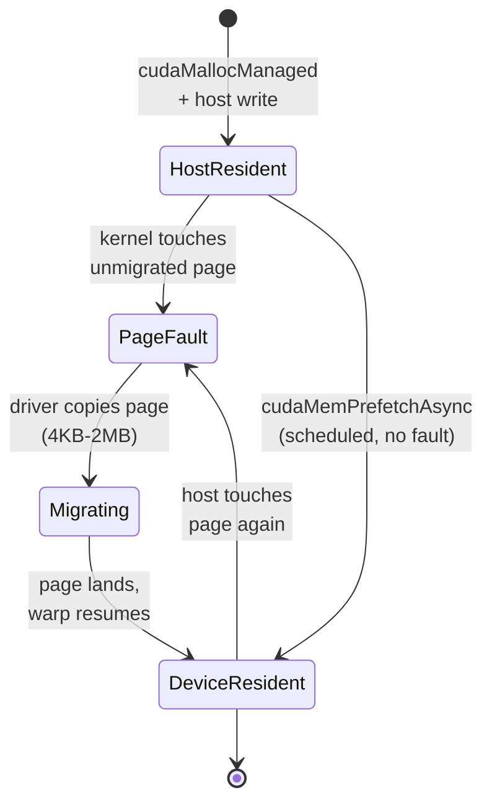
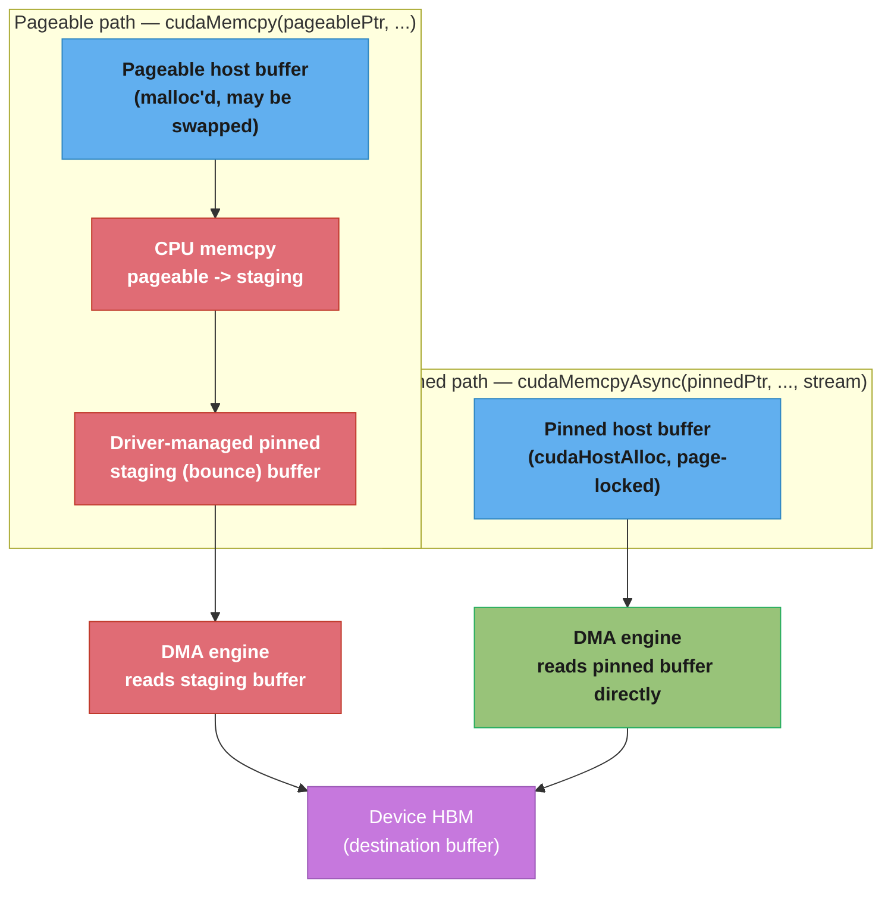
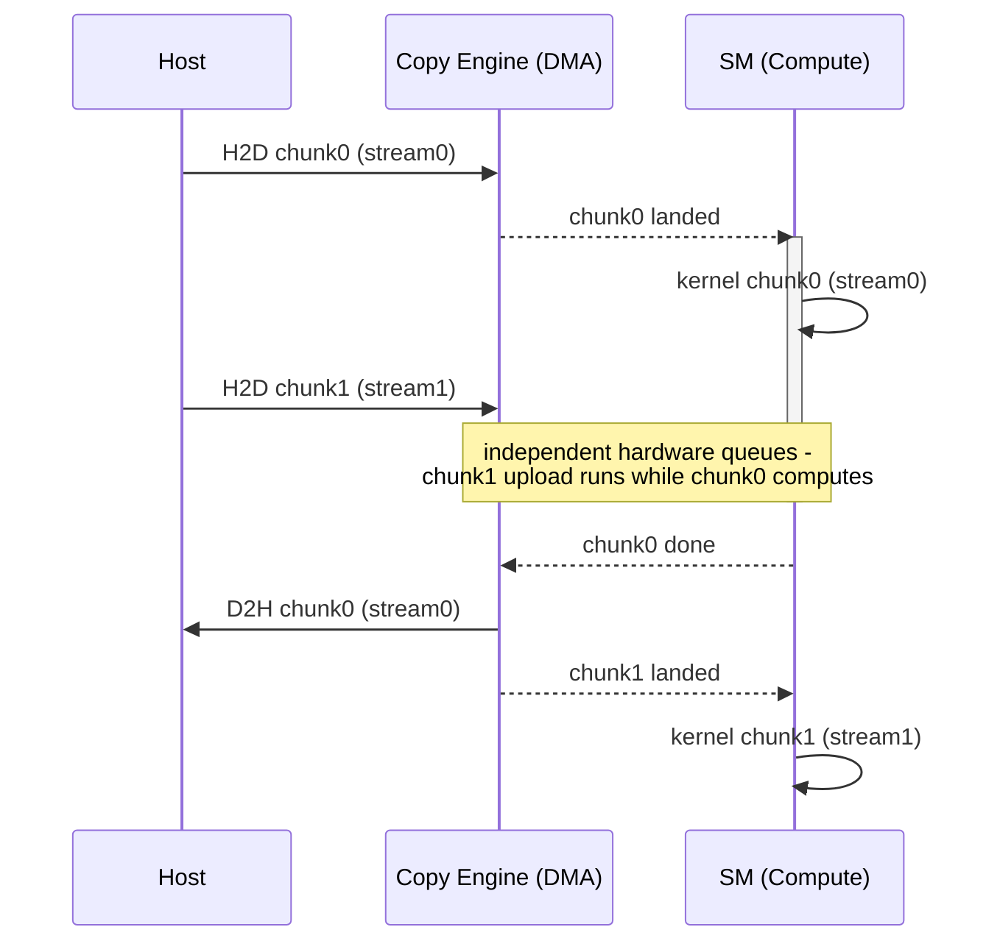
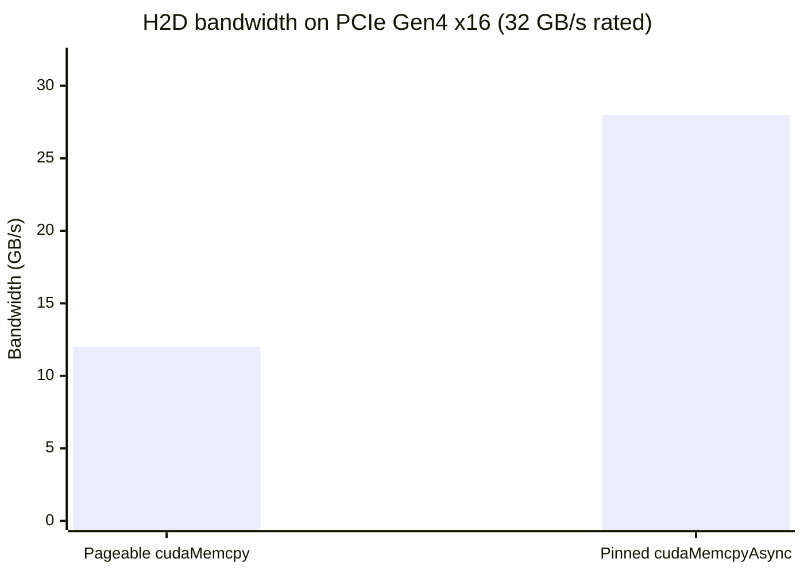
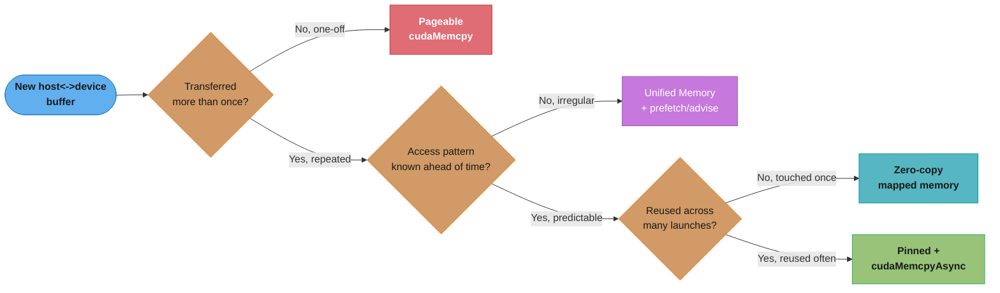

# Memory Management & Data Transfer

## 1. Concept Overview

Every CUDA program begins and ends at the same boundary: the host (CPU) and the
device (GPU) have **physically separate memory** connected by a comparatively
slow interconnect — PCIe or NVLink. Before a kernel can touch a byte of data,
that byte must exist in device memory, and the mechanics of *how* it gets there
— which allocator, which copy path, synchronous or asynchronous — routinely
matters more to end-to-end throughput than the kernel itself. A perfectly
tuned, fully-coalesced kernel gains nothing if it spends 80% of wall-clock time
blocked on a `cudaMemcpy` that could have overlapped with compute.

This module covers the CUDA memory-management APIs from the transfer
angle: device allocation (`cudaMalloc`/`cudaFree`), the pinned-vs-pageable
host-memory distinction that determines DMA bandwidth, Unified/Managed memory
and its on-demand page migration, zero-copy/mapped memory for host-resident
data a kernel touches rarely, asynchronous copies on streams for
compute/transfer overlap, and the error-checking discipline that catches a
silently-failed async copy before it becomes a wrong answer three kernels
later. The full memory *hierarchy* (registers/shared/local/constant/global,
scope, and lifetime) is a separate concern — see
[cuda_memory_model_and_hierarchy](../cuda_memory_model_and_hierarchy/); this
module is specifically about moving bytes *across* the PCIe/NVLink boundary,
not about where they live once they arrive. Overlapping transfers with
multiple kernels via streams is introduced here only far enough to motivate
pinned memory; the full stream/event API is
[streams_events_and_concurrency](../streams_events_and_concurrency/).

---

## 2. Intuition

> **One-line analogy**: Host and device memory are two warehouses on opposite
> sides of a toll bridge — a synchronous `cudaMemcpy` from pageable memory is
> a delivery truck that first drives to a sorting depot to repack the pallets
> (the bounce buffer) before it's even allowed on the bridge; pinned memory
> is a pre-cleared truck that drives straight across at the bridge's full
> speed limit.

**Mental model**: The GPU's DMA (Direct Memory Access) engine can only read
host memory that the operating system guarantees will **never move or be
paged out** while the transfer is in flight — because the DMA engine reads
physical addresses directly, with no CPU involvement to notice a page fault
mid-transfer. Ordinary (`malloc`'d) host memory is *pageable*: the OS is free
to swap it out or relocate it at any time, so the CUDA driver cannot hand it
directly to the DMA engine. Instead the driver silently allocates a temporary
**pinned staging buffer**, `memcpy`s your data into it on the CPU, *then* DMAs
from the staging buffer to the GPU — one extra full-speed CPU-side copy plus a
bandwidth-halving detour. Pinned (page-locked) memory, allocated with
`cudaHostAlloc`, skips the staging step entirely: the DMA engine reads it
directly, reaching the interconnect's full rated bandwidth, and only pinned
allocations can participate in truly asynchronous, stream-ordered copies that
overlap with kernel execution.

**Why it matters**: In a data pipeline that streams batches from host to
device — the common case in training loops, video/signal processing, and
inference serving — the transfer path is frequently the bottleneck the kernel
optimizer never sees, because profiling only the kernel misses it entirely.
A pipeline built on pageable `cudaMemcpy` can lose 2× throughput to the
staging-buffer bounce and *all* overlap opportunity, since a synchronous copy
blocks the entire stream until it completes. Fixing this is usually a
five-line change (switch the host buffer's allocator, switch the call to the
`Async` variant, add a stream) for a routine 1.5–2× wall-clock win — one of
the highest reward-to-effort optimizations in the whole CUDA toolkit.

**Key insight**: There are really only three questions to answer for any
host↔device transfer: (1) *is the host buffer pinned or pageable* (bandwidth),
(2) *is the copy synchronous or asynchronous on a non-default stream*
(overlap), and (3) *does the access pattern justify Unified Memory's
convenience over explicit control* (page-fault migration cost vs. programmer
effort). Get those three right and the transfer stops being the pipeline's
hidden tax.

---

## 3. Core Principles

- **Host and device memory are disjoint address spaces.** A host pointer
  (`float*` from `malloc`) is meaningless on the device and vice versa unless
  Unified Memory is in play — dereferencing the wrong one is a classic
  segfault/illegal-memory-access source.
- **`cudaMalloc`/`cudaFree` manage device-resident memory** — analogous to
  `malloc`/`free` but backed by GPU HBM, with no CPU access to the returned
  pointer at all.
- **Pinned (page-locked) host memory is required for the DMA engine's fastest
  path and for true async copies.** `cudaHostAlloc` (or `cudaMallocHost`)
  allocates it; ordinary `malloc`/`new` memory is pageable and forces a
  driver-managed staging copy.
- **`cudaMemcpy` is synchronous with respect to the host** (for host↔device
  directions) — it blocks the calling CPU thread until the transfer
  completes. `cudaMemcpyAsync` returns immediately and only *stream-orders*
  the copy, requiring pinned source/destination memory to actually overlap
  with other stream work.
- **Unified (Managed) memory presents one pointer valid on host and device**,
  with the CUDA runtime migrating pages (4 KB up to 2 MB, generation-
  dependent) on first-touch page fault rather than requiring an explicit copy
  call — convenience traded for migration latency you don't directly control
  unless you prefetch.
- **Zero-copy / mapped memory lets the GPU read pinned host memory directly
  over PCIe without ever copying it into device memory** — useful for data
  touched once or rarely, actively harmful for data reused across many kernel
  launches (every access pays PCIe latency, not HBM latency).
- **Every asynchronous CUDA call can fail without raising an exception** — C++
  has no exceptions across the driver boundary, so a missed
  `cudaGetLastError()`/`cudaStreamSynchronize()` check silently discards an
  error and the bug surfaces as a wrong answer far from its cause.

---

## 4. Types / Architectures / Strategies

### 4.1 Device memory allocation

| API | Lives in | Host-accessible? | Typical use |
|-----|----------|-------------------|-------------|
| `cudaMalloc` | Device HBM | No | Default device buffer for kernel input/output |
| `cudaFree` | — | — | Releases a `cudaMalloc` allocation |
| `cudaMallocPitch` | Device HBM | No | 2D arrays with row-alignment padding for coalescing |
| `cudaMalloc3D` | Device HBM | No | 3D volumes with pitched rows |

### 4.2 Host memory strategies

| Strategy | Allocator | Bandwidth | Async-copy capable | Notes |
|----------|-----------|-----------|---------------------|-------|
| Pageable | `malloc`/`new` | ~half of pinned (staging bounce) | No (silently serializes) | Default, zero setup cost, worst transfer bandwidth |
| Pinned (page-locked) | `cudaHostAlloc` / `cudaMallocHost` | Full PCIe/NVLink rated bandwidth | Yes | Costs allocation time; pinning too much starves the OS |
| Write-combined pinned | `cudaHostAlloc(..., cudaHostAllocWriteCombined)` | Slightly faster host→device only | Yes | CPU reads from it are very slow — write-only buffers |
| Mapped / zero-copy | `cudaHostAlloc(..., cudaHostAllocMapped)` | PCIe latency per access, no bulk copy | N/A — kernel reads directly | Best for data read once; bad for reused data |
| Unified/Managed | `cudaMallocManaged` | Full bandwidth after migration; page-fault cost on first touch | Implicitly async via prefetch | Single pointer, on-demand or prefetched migration |

### 4.3 Transfer directions and kinds

`cudaMemcpy`/`cudaMemcpyAsync` take a `cudaMemcpyKind`:

- `cudaMemcpyHostToDevice` — upload input
- `cudaMemcpyDeviceToHost` — download results
- `cudaMemcpyDeviceToDevice` — GPU-to-GPU on the same device (or peer-to-peer
  across devices with P2P enabled — see
  [multi_gpu_programming_and_nccl](../multi_gpu_programming_and_nccl/))
- `cudaMemcpyHostToHost` — rare, effectively a CPU `memcpy` wrapper
- `cudaMemcpyDefault` — driver infers direction from Unified Virtual
  Addressing (UVA); the modern default in most code

### 4.4 Unified Memory migration control

- **On-demand paging** (default): first device access to an unmigrated page
  triggers a page fault, the driver migrates that page (or a run of pages),
  and the kernel stalls until it lands.
- **`cudaMemPrefetchAsync(ptr, size, dstDevice, stream)`** — explicitly moves
  pages to a target device *before* the kernel needs them, converting
  unpredictable fault stalls into a scheduled, overlappable async copy.
- **`cudaMemAdvise(ptr, size, advice, device)`** — hints without moving data:
  `cudaMemAdviseSetReadMostly` replicates read-only pages to multiple GPUs
  instead of migrating and thrashing; `cudaMemAdviseSetPreferredLocation`
  pins the "home" device for a range; `cudaMemAdviseSetAccessedBy` maps a
  range into another device's page table without triggering a migration.

### One managed page's lifecycle



The bottom edge is the whole point of prefetching: it skips `PageFault` and
`Migrating` entirely by moving the page before the kernel ever asks for it,
turning an unpredictable stall into a scheduled async copy the profiler can
see coming.

---

## 5. Architecture Diagrams

### Pageable-copy bounce vs. pinned direct-DMA path



The pageable path inserts a full-speed CPU `memcpy` and a second DMA hop
before a single byte crosses PCIe, roughly halving realized bandwidth and
making the call synchronous; the pinned path lets the DMA engine read the
host buffer directly, reaching the link's full rated bandwidth and letting
`cudaMemcpyAsync` actually run concurrently with kernels on other streams.

### Overlapped copy + compute across streams (ASCII timeline)

```
Single default stream (no overlap):
  time -->
  [ H2D copy (10ms) ][ kernel (8ms) ][ D2H copy (10ms) ]
  total = 28ms

Two streams, pinned memory + cudaMemcpyAsync (overlap):
  stream 0: [ H2D chunk0 ][ kernel chunk0 ][ D2H chunk0 ]
  stream 1:              [ H2D chunk1 ][ kernel chunk1 ][ D2H chunk1 ]
  total ~= 10ms + 8ms + 8ms + 10ms/2  ~= 18-20ms   (roughly 30-35% faster)

Copy engines and compute run on independent hardware queues, so a
copy in stream 1 executes while a kernel runs in stream 0 -- the two
timelines interleave instead of stacking end to end.
```

This overlap requires pinned host buffers (Section 4.2) and multiple streams
(full treatment in
[streams_events_and_concurrency](../streams_events_and_concurrency/)); the
diagram here shows only enough to motivate *why* pinning matters for anything
beyond raw bandwidth.

### Overlap as an actor timeline — copy engine vs. SM



This is the same 18-20ms timeline from the ASCII diagram above, redrawn as
actor messages: the copy engine and the SM are separate hardware queues, so
`H2D chunk1` and `kernel chunk0` genuinely execute at the same time rather
than one waiting on the other.

---

## 6. How It Works — Detailed Mechanics

### 6.1 Device allocation and a basic pageable copy (C++)

```cpp
#include <cuda_runtime.h>
#include <cstdio>
#include <cstdlib>

#define CUDA_CHECK(call)                                                     \
    do {                                                                     \
        cudaError_t err__ = (call);                                          \
        if (err__ != cudaSuccess) {                                         \
            fprintf(stderr, "CUDA error %s:%d: %s\n", __FILE__, __LINE__,    \
                    cudaGetErrorString(err__));                              \
            std::exit(EXIT_FAILURE);                                        \
        }                                                                    \
    } while (0)

void basicPageableCopy(const float* hostSrc, size_t n) {
    float* devBuf = nullptr;
    size_t bytes = n * sizeof(float);

    CUDA_CHECK(cudaMalloc(&devBuf, bytes));
    // hostSrc came from plain malloc/new -- pageable. This call blocks the
    // host thread and forces a driver-managed staging copy underneath.
    CUDA_CHECK(cudaMemcpy(devBuf, hostSrc, bytes, cudaMemcpyHostToDevice));

    // ... launch kernel on devBuf ...

    CUDA_CHECK(cudaFree(devBuf));
}
```

### 6.2 Pinned memory + async copy on a stream (C++)

```cpp
void pinnedAsyncCopy(const float* srcData, size_t n) {
    size_t bytes = n * sizeof(float);
    float* hostPinned = nullptr;
    float* devBuf = nullptr;
    cudaStream_t stream;

    CUDA_CHECK(cudaHostAlloc(&hostPinned, bytes, cudaHostAllocDefault));
    CUDA_CHECK(cudaMalloc(&devBuf, bytes));
    CUDA_CHECK(cudaStreamCreate(&stream));

    memcpy(hostPinned, srcData, bytes);  // ordinary CPU copy into pinned buf

    // Async: returns immediately: the copy is only *ordered* on `stream`.
    CUDA_CHECK(cudaMemcpyAsync(devBuf, hostPinned, bytes,
                                cudaMemcpyHostToDevice, stream));

    someKernel<<<grid, block, 0, stream>>>(devBuf, n);

    // Must synchronize before touching hostPinned/devBuf from the host again,
    // or reading results that depend on the kernel having finished.
    CUDA_CHECK(cudaStreamSynchronize(stream));
    // Async ops fail silently -- always check the *stream's* status too.
    CUDA_CHECK(cudaGetLastError());

    CUDA_CHECK(cudaStreamDestroy(stream));
    CUDA_CHECK(cudaFree(devBuf));
    CUDA_CHECK(cudaFreeHost(hostPinned));
}
```

### 6.3 Unified Memory with prefetch and advise (C++)

```cpp
void unifiedMemoryExample(size_t n, int deviceId) {
    size_t bytes = n * sizeof(float);
    float* data = nullptr;

    CUDA_CHECK(cudaMallocManaged(&data, bytes));

    // Fill on the host -- pages are host-resident, no fault yet.
    for (size_t i = 0; i < n; ++i) data[i] = static_cast<float>(i);

    // Hint: this range is read-mostly -- replicate rather than migrate
    // when multiple GPUs touch it, avoiding thrash.
    CUDA_CHECK(cudaMemAdvise(data, bytes, cudaMemAdviseSetReadMostly, deviceId));

    // Explicitly move pages to the GPU *before* the kernel launch so the
    // migration becomes a scheduled async copy instead of per-page faults
    // stalling the kernel mid-flight.
    CUDA_CHECK(cudaMemPrefetchAsync(data, bytes, deviceId, /*stream=*/0));
    CUDA_CHECK(cudaStreamSynchronize(0));

    someKernel<<<grid, block>>>(data, n);
    CUDA_CHECK(cudaDeviceSynchronize());

    // Prefetch back to the host (deviceId = cudaCpuDeviceId) before reading.
    CUDA_CHECK(cudaMemPrefetchAsync(data, bytes, cudaCpuDeviceId, 0));
    CUDA_CHECK(cudaStreamSynchronize(0));

    CUDA_CHECK(cudaFree(data));
}
```

Without the prefetch call, the first kernel access to each unmigrated page
triggers an on-demand fault: the GPU's page-fault handler migrates that page
(4 KB up to 2 MB depending on generation and access pattern) from host to
device and the warp that touched it stalls until the page lands — correct,
but with latency the programmer cannot schedule around.

### 6.4 Zero-copy / mapped memory (C++)

```cpp
void zeroCopyExample(size_t n) {
    size_t bytes = n * sizeof(float);
    float* hostMapped = nullptr;
    float* devMappedPtr = nullptr;

    CUDA_CHECK(cudaHostAlloc(&hostMapped, bytes, cudaHostAllocMapped));
    // Get the device-side pointer aliasing the same pinned host memory --
    // no bulk copy occurs; the kernel reads over PCIe on each access.
    CUDA_CHECK(cudaHostGetDevicePointer(&devMappedPtr, hostMapped, 0));

    touchOnceKernel<<<grid, block>>>(devMappedPtr, n);
    CUDA_CHECK(cudaDeviceSynchronize());

    CUDA_CHECK(cudaFreeHost(hostMapped));
}
```

### 6.5 Python equivalents — CuPy

```python
import cupy as cp
import numpy as np

# cudaMalloc equivalent: CuPy arrays are device-resident by construction.
host_array = np.arange(1_000_000, dtype=np.float32)
device_array = cp.asarray(host_array)          # H2D copy, synchronous

# Explicit pinned staging buffer for repeated fast transfers.
pinned_pool = cp.cuda.PinnedMemoryPool()
cp.cuda.set_pinned_memory_allocator(pinned_pool.malloc)

pinned_host = cp.cuda.alloc_pinned_memory(host_array.nbytes)
pinned_view = np.frombuffer(pinned_host, dtype=np.float32, count=host_array.size)
pinned_view[:] = host_array

stream = cp.cuda.Stream(non_blocking=True)
device_buf = cp.empty_like(host_array)
device_buf.set(pinned_view, stream=stream)     # async H2D on `stream`
stream.synchronize()

# Unified memory: allocate with the managed pool.
cp.cuda.set_allocator(cp.cuda.MemoryPool(cp.cuda.malloc_managed).malloc)
managed_array = cp.zeros(1_000_000, dtype=cp.float32)  # cudaMallocManaged
```

### 6.6 Python equivalents — PyTorch

```python
import torch

# cudaMalloc + cudaMemcpy equivalent: .cuda() / .to("cuda") allocates device
# memory and copies. Default is synchronous.
cpu_tensor = torch.randn(1_000_000)
gpu_tensor = cpu_tensor.cuda()                 # blocking H2D copy

# Pinned host memory: allocate with pin_memory=True (or DataLoader's
# pin_memory=True for the common training-loop case), then use
# non_blocking=True to request an async copy on the current stream.
pinned_tensor = torch.empty(1_000_000, pin_memory=True)   # cudaHostAlloc
pinned_tensor.copy_(cpu_tensor)
gpu_tensor = pinned_tensor.cuda(non_blocking=True)         # cudaMemcpyAsync

# non_blocking=True is a silent no-op (falls back to a blocking copy) unless
# the source tensor is pinned -- pairing it with a pageable tensor gains
# nothing and gives a false sense of overlap.
stream = torch.cuda.Stream()
with torch.cuda.stream(stream):
    gpu_tensor = pinned_tensor.cuda(non_blocking=True)
torch.cuda.current_stream().wait_stream(stream)

# DataLoader idiom for overlapping host->device transfer with training step:
loader = torch.utils.data.DataLoader(dataset, batch_size=256, pin_memory=True,
                                      num_workers=4)
for batch in loader:
    batch = batch.cuda(non_blocking=True)      # overlaps with prior step's
    ...                                         # backward/optimizer work
```

---

## 7. Real-World Examples

- **PyTorch `DataLoader(pin_memory=True)`** — pins every batch tensor host-side
  so the subsequent `.cuda(non_blocking=True)` in the training loop can
  overlap with the previous iteration's backward pass and optimizer step;
  omitting `pin_memory=True` silently falls back to a blocking pageable copy
  that stalls the GPU every step.
- **NVIDIA DALI (Data Loading Library)** — decodes and augments images on the
  GPU and stages host-side reads through pinned buffers specifically to keep
  the PCIe upload from becoming the training bottleneck at high throughput.
- **cuDF / RAPIDS** — Unified Memory is a common allocator choice for
  exploratory data-science workloads where dataset size is unpredictable and
  correctness/convenience outweighs squeezing out the last few percent of
  transfer bandwidth.
- **TensorRT inference servers** — pre-allocate pinned input/output buffers
  once at server startup and reuse them per request, avoiding the
  allocation/pinning overhead (pinning itself is not free — it is a kernel
  call that page-locks physical memory) on the hot request path.
- **Video decode pipelines (NVDEC + CUDA)** — decoded frames are written into
  pinned buffers so the frame can be asynchronously copied to the GPU on one
  stream while the previous frame is processed by a kernel on another,
  keeping the decode-transfer-compute pipeline fully overlapped.

---

## 8. Tradeoffs

| Approach | Bandwidth | Setup cost | Overlap capable | Best for |
|----------|-----------|-----------|------------------|----------|
| Pageable `cudaMemcpy` | ~half of pinned (staging bounce) | None | No | One-off transfers, prototyping |
| Pinned `cudaHostAlloc` + `cudaMemcpyAsync` | Full PCIe/NVLink rated bandwidth | Allocation is slower than `malloc`; over-pinning starves OS paging | Yes | Repeated transfers in a hot loop (training, streaming inference) |
| Unified Memory (`cudaMallocManaged`), no prefetch | Full bandwidth after migration; unpredictable fault stalls before | Lowest programmer effort | Implicit only | Prototyping, irregular/unpredictable access patterns |
| Unified Memory + `cudaMemPrefetchAsync`/`cudaMemAdvise` | Near pinned-explicit levels | Moderate — must reason about access pattern | Yes, if prefetched ahead of use | Multi-GPU shared read-mostly data, iterative algorithms |
| Zero-copy / mapped memory | PCIe latency per access (no bulk transfer) | Low | N/A (no batch copy to overlap) | Data touched once or very rarely by the kernel |

### Achieved H2D bandwidth: pinned vs. pageable



The staging-buffer bounce (Section 5's flowchart) is not a rounding error —
it costs roughly half the link's rated bandwidth, which is the concrete
number behind the "~half of pinned" row in the table above.

### Bandwidth vs. setup cost, all five strategies

```mermaid
quadrantChart
    title Achieved bandwidth vs. setup cost
    x-axis Low setup cost --> High setup cost
    y-axis Low achieved bandwidth --> High achieved bandwidth
    quadrant-1 Ideal: fast and cheap
    quadrant-2 Costly but fast
    quadrant-3 Avoid: slow and cheap
    quadrant-4 Costly and slow
    Pageable cudaMemcpy: [0.10, 0.30]
    Pinned + async: [0.55, 0.90]
    Unified, no prefetch: [0.15, 0.55]
    Unified + prefetch: [0.60, 0.80]
    Zero-copy mapped: [0.25, 0.20]
```

Zero-copy's low position here is about *bulk* bandwidth, not its intended use
— it belongs in quadrant-3 for repeated access, but Section 9's decision
diagram routes single-touch data to it anyway because there is no bulk
transfer to amortize in the first place.

---

## 9. When to Use / When NOT to Use

### Decision: pageable, pinned, unified, or zero-copy?



The three questions in this tree are exactly the three from Section 2's "key
insight" — bandwidth, overlap, and access-pattern predictability — collapsed
into a single lookup before reading the detailed bullets below.

**Use pinned memory + async copies when:**
- The same host buffer is transferred repeatedly (training loops, streaming
  video/sensor pipelines, request-serving hot paths).
- You need genuine compute/transfer overlap across streams.
- You control buffer lifetime and can afford the allocation-time cost once,
  amortized over many transfers.

**Avoid over-pinning when:**
- The amount of memory you want to pin is large relative to system RAM —
  page-locking memory removes it from the OS's swappable pool and can starve
  other processes or force the OS to reclaim aggressively elsewhere.
- The transfer is a one-time, cold-path operation (startup config load) where
  the fixed cost of pinning outweighs the one-time bandwidth win.

**Use Unified Memory when:**
- Development velocity matters more than squeezing the last 10-20% of
  bandwidth — one pointer, no manual copy bookkeeping.
- The access pattern is genuinely unpredictable (graph algorithms, sparse
  structures) where explicit prefetch targets are hard to determine.
- Multiple GPUs share mostly-read data — `cudaMemAdviseSetReadMostly`
  replicates instead of thrashing pages between devices.

**Avoid Unified Memory when:**
- The access pattern is well known ahead of time and interview/production
  code needs deterministic, profileable transfer timing — explicit
  `cudaMemcpyAsync` is easier to reason about in a profiler trace.
- Working set exceeds device memory by a large margin on older
  (pre-Pascal) architectures with limited oversubscription support.

**Use zero-copy when:**
- The kernel touches a buffer once, or very rarely, and copying it wholesale
  would waste device memory and bandwidth for no reuse benefit.

**Avoid zero-copy when:**
- The buffer is read many times per kernel launch or across many launches —
  every access pays PCIe/NVLink round-trip latency instead of HBM latency
  (roughly two orders of magnitude slower per access), which dominates
  quickly.

---

## 10. Common Pitfalls

**BROKEN: synchronous pageable copy blocks the whole pipeline**

```cpp
// BROKEN: host buffer is a plain std::vector-backed pointer (pageable).
// cudaMemcpy blocks the CPU thread, and the driver silently inserts a
// pinned-staging bounce copy underneath -- roughly half the achievable
// bandwidth, and zero chance of overlapping with the kernel that follows.
std::vector<float> input(N);
float* d_input;
cudaMalloc(&d_input, N * sizeof(float));
cudaMemcpy(d_input, input.data(), N * sizeof(float), cudaMemcpyHostToDevice);
myKernel<<<grid, block>>>(d_input, N);
cudaMemcpy(output.data(), d_output, N * sizeof(float), cudaMemcpyDeviceToHost);
// Total time = copy_in + kernel + copy_out, fully serialized.
```

```cpp
// FIX: pin the host buffer once, use cudaMemcpyAsync on a stream so the
// upload, kernel, and download for *different* chunks can overlap, and
// check every call's status -- async failures are otherwise silent.
float* h_pinned_in;
float* h_pinned_out;
cudaHostAlloc(&h_pinned_in, N * sizeof(float), cudaHostAllocDefault);
cudaHostAlloc(&h_pinned_out, N * sizeof(float), cudaHostAllocDefault);
memcpy(h_pinned_in, input.data(), N * sizeof(float));

cudaStream_t stream;
cudaStreamCreate(&stream);
CUDA_CHECK(cudaMemcpyAsync(d_input, h_pinned_in, N * sizeof(float),
                            cudaMemcpyHostToDevice, stream));
myKernel<<<grid, block, 0, stream>>>(d_input, N);
CUDA_CHECK(cudaMemcpyAsync(h_pinned_out, d_output, N * sizeof(float),
                            cudaMemcpyDeviceToHost, stream));
CUDA_CHECK(cudaStreamSynchronize(stream));
CUDA_CHECK(cudaGetLastError());
memcpy(output.data(), h_pinned_out, N * sizeof(float));
// Splitting into multiple chunks across two streams lets chunk 1's upload
// overlap chunk 0's kernel -- see the timeline in Section 5.
```

**BROKEN: missing error check after an async call**

```cpp
// BROKEN: cudaMemcpyAsync queues the copy and returns immediately even if
// the arguments are invalid (e.g. size exceeds the allocation) -- the error
// is recorded internally but never surfaces here.
cudaMemcpyAsync(d_buf, h_buf, badSize, cudaMemcpyHostToDevice, stream);
myKernel<<<grid, block, 0, stream>>>(d_buf, n);
cudaStreamSynchronize(stream);
// Kernel silently reads garbage/out-of-bounds memory; no exception, no
// crash at the call site -- the bug surfaces as a wrong numerical result
// several functions away from its true cause.
```

```cpp
// FIX: wrap every CUDA call, including async ones, in CUDA_CHECK, and
// treat cudaStreamSynchronize's return value as the authoritative status
// of everything queued on that stream since the last check.
CUDA_CHECK(cudaMemcpyAsync(d_buf, h_buf, correctSize, cudaMemcpyHostToDevice,
                            stream));
myKernel<<<grid, block, 0, stream>>>(d_buf, n);
CUDA_CHECK(cudaGetLastError());          // catches launch-config errors
CUDA_CHECK(cudaStreamSynchronize(stream)); // catches everything queued
```

**Other common pitfalls:**
- **Over-pinning host memory.** Pinning gigabytes of host RAM removes it from
  the OS's page-eviction pool; on a memory-constrained host this can trigger
  swapping or OOM-kill elsewhere in the system. Pin only working buffers, not
  entire datasets.
- **Forgetting `cudaFreeHost` for `cudaHostAlloc` memory.** Freeing a pinned
  buffer with plain `free()`/`delete` corrupts the CUDA driver's page-lock
  bookkeeping; always pair `cudaHostAlloc`/`cudaMallocHost` with
  `cudaFreeHost`.
- **Treating Unified Memory as free.** `cudaMallocManaged` without a prefetch
  hides the migration cost, it doesn't remove it — page faults on first touch
  can dominate a kernel's wall time on a cold buffer.
- **Reading device output on the host before synchronizing.** Reading
  `output.data()` right after a `cudaMemcpyAsync(..., DeviceToHost, stream)`
  without a matching `cudaStreamSynchronize` reads whatever bytes happened to
  be there before the copy completed.
- **Using non_blocking=True in PyTorch on a pageable tensor.** The call
  silently degrades to a blocking copy instead of erroring — always pair it
  with `pin_memory=True` (tensor or `DataLoader`).

---

## 11. Technologies & Tools

| Tool / API | Purpose |
|------------|---------|
| `cudaMalloc` / `cudaFree` | Device-resident allocation |
| `cudaHostAlloc` / `cudaMallocHost` / `cudaFreeHost` | Pinned host allocation/deallocation |
| `cudaMemcpy` / `cudaMemcpyAsync` | Synchronous / async host↔device↔device copy |
| `cudaMallocManaged` | Unified Memory allocation |
| `cudaMemPrefetchAsync` | Explicit page migration ahead of use |
| `cudaMemAdvise` | Migration hints (read-mostly, preferred location, accessed-by) |
| `cudaHostGetDevicePointer` | Device-side alias for mapped (zero-copy) host memory |
| `cudaGetLastError` / `cudaPeekAtLastError` | Synchronous error-state check |
| `cudaStreamSynchronize` / `cudaDeviceSynchronize` | Blocking wait + surfaces queued-op errors |
| Nsight Systems | Timeline view showing copy-engine vs. compute-engine overlap (see [profiling_and_performance_analysis](../profiling_and_performance_analysis/)) |
| CuPy | Python array library with `PinnedMemoryPool`, managed-memory allocator |
| PyTorch | `pin_memory=True`, `.cuda(non_blocking=True)`, `DataLoader(pin_memory=True)` |
| NVIDIA DALI | GPU-accelerated data-loading pipeline built on pinned staging buffers |

---

## 12. Interview Questions with Answers

**Q: What is the difference between pinned and pageable host memory?**
Pinned
(page-locked) memory cannot be swapped or relocated by the OS, so the GPU's
DMA engine can read it directly at full interconnect bandwidth; pageable
memory forces the CUDA driver to stage through an internal pinned buffer
first, roughly halving achievable bandwidth and making the transfer
effectively synchronous.

**Q: Why does a `cudaMemcpy` from pageable memory run at about half the
bandwidth of pinned memory?** The driver cannot let the DMA engine touch
pageable memory directly because the OS could move or evict it mid-transfer,
so it inserts a full-speed CPU `memcpy` into an internal pinned staging buffer
before the actual DMA — that extra copy plus the serialization is where the
roughly 2× bandwidth loss comes from.

**Q: Why does `cudaMemcpyAsync` require pinned memory to actually be
asynchronous?** Only pinned memory can be handed to the DMA engine without a
staging copy, so passing a pageable pointer to `cudaMemcpyAsync` forces the
driver to fall back to a synchronous staged copy — the call still "succeeds"
but silently gives up all overlap.

**Q: What happens if you forget to check the return value of an async CUDA
call?** The error is recorded internally by the driver but never raised at
the call site, so execution continues with corrupted or garbage data and the
failure typically surfaces as a wrong numerical result far from its actual
cause; always follow async work with `cudaGetLastError()` and a synchronize.

**Q: What is Unified (Managed) memory and how does it decide when to move
data?** Unified Memory (`cudaMallocManaged`) exposes one pointer valid on
both host and device, migrating pages on demand via a page fault the first
time either processor touches an unmigrated page — 4 KB up to 2 MB per
migration depending on architecture and access pattern.

**Q: Why would you call `cudaMemPrefetchAsync` on Unified Memory if migration
already happens automatically?** Automatic migration is reactive — the
kernel stalls on the fault before the page arrives — while
`cudaMemPrefetchAsync` moves pages proactively before the kernel needs them,
turning an unpredictable stall into a scheduled, overlappable async copy.

**Q: What does `cudaMemAdviseSetReadMostly` do and when is it useful?**
It hints
that a memory range is read far more often than written, so the runtime
replicates read-only copies of its pages across multiple accessing GPUs
instead of migrating (and thrashing) a single copy back and forth — valuable
for shared read-only weights or lookup tables in multi-GPU workloads.

**Q: What is zero-copy (mapped) memory, and why is it dangerous for data reused
across many kernel launches?** Zero-copy lets a kernel read pinned host
memory directly over PCIe/NVLink without ever copying it into device memory,
which is efficient for data touched once but disastrous for reused data
because every single access pays interconnect latency instead of the much
faster on-device HBM latency.

**Q: Why can over-pinning host memory hurt overall system performance?**
Page-locking memory removes it from the OS's pool of pages eligible for
eviction or relocation, so pinning a large fraction of system RAM can starve
other processes of swappable memory or force the OS into aggressive reclaim
elsewhere on the host.

**Q: What is the actual bandwidth difference between PCIe Gen4 x16, PCIe Gen5
x16, and NVLink on an H100?** PCIe Gen4 x16 tops out around 32 GB/s, PCIe Gen5
x16 around 64 GB/s, while NVLink on an H100 reaches roughly 900 GB/s
aggregate — nearly 30× the PCIe Gen4 figure, which is why multi-GPU
all-reduce traffic is routed over NVLink whenever possible.

**Q: Given a training loop stalling on host-to-device transfer, what two
changes give the highest-leverage fix?** Switch the input buffer to pinned
memory (`pin_memory=True` in PyTorch, `cudaHostAlloc` in C++) and issue the
copy asynchronously on its own stream so it overlaps with the previous
iteration's compute — together these are usually a 1.5-2x wall-clock win for
a five-line change.

**Q: What is the difference between `cudaMemcpyDeviceToDevice` and peer-to-peer
(P2P) copy between two GPUs?** `cudaMemcpyDeviceToDevice` moves data within a
single device's memory; a true cross-GPU copy either routes through the host
(slow, no P2P) or, with P2P/NVLink enabled, transfers directly GPU-to-GPU
without staging through host memory at all.

**Q: Does `cudaFree` block the calling thread?**
Yes — like `cudaMalloc`,
`cudaFree` is synchronous and can also implicitly synchronize the device,
which is why repeatedly allocating and freeing inside a hot loop is
expensive; pre-allocate buffers once and reuse them instead.

**Q: Why is `cudaMallocPitch` used for 2D arrays instead of a flat
`cudaMalloc`?** `cudaMallocPitch` pads each row to an alignment boundary
optimal for coalesced access, returning a pitch (row stride in bytes) the
kernel must use for indexing instead of assuming `width * sizeof(element)` —
trading a small amount of extra memory for guaranteed-aligned row starts.

**Q: In PyTorch, why does `tensor.cuda(non_blocking=True)` sometimes silently
behave like a blocking call?** `non_blocking=True` only has an effect when
the source tensor is in pinned memory; if the tensor is an ordinary pageable
CPU tensor, PyTorch falls back to a synchronous copy with no error or warning,
so the "async" flag alone does not guarantee overlap.

**Q: What is the purpose of a `CUDA_CHECK` macro, and why wrap even
seemingly-infallible calls like `cudaFree`?** The macro centralizes checking
every CUDA API's `cudaError_t` return value and aborts with file/line context
on failure, and wrapping "infallible" calls matters because a prior
unchecked error can leave the CUDA context in a broken state that surfaces on
the *next* call instead of the one that actually failed.

---

## 13. Best Practices

- **Pin any host buffer that is transferred more than once.** The one-time
  cost of pinning is amortized quickly; reuse the same pinned buffer across
  iterations rather than allocating and pinning fresh memory each time.
- **Pair every `cudaMemcpyAsync` with a stream, and every stream's work with
  an explicit synchronization point** before the host reads the results —
  never assume completion just because the call returned.
- **Wrap all CUDA API calls, sync and async, in a `CUDA_CHECK` macro** — see
  [cuda_error_handling_and_launch_config_patterns](../case_studies/cross_cutting/cuda_error_handling_and_launch_config_patterns.md)
  for the canonical pattern used across every case study in this section.
- **Prefetch Unified Memory ahead of the kernel that needs it** whenever the
  access pattern is known in advance — treat `cudaMemPrefetchAsync` as the
  default rather than relying on reactive page-fault migration.
- **Use `cudaMemAdviseSetReadMostly` for shared read-only data across
  multiple GPUs** instead of letting Unified Memory thrash a single copy back
  and forth between devices.
- **Reserve zero-copy memory for genuinely single-touch data** — profile
  before assuming zero-copy is "free" convenience; repeated access is a
  latency trap.
- **Pre-allocate and reuse device and pinned-host buffers** outside hot
  loops — `cudaMalloc`/`cudaFree`/`cudaHostAlloc` are all synchronizing,
  non-trivial-cost calls.
- **Profile the transfer, not just the kernel**, with Nsight Systems' timeline
  view before concluding a pipeline is "kernel-bound" — see
  [profiling_and_performance_analysis](../profiling_and_performance_analysis/).
- **Split large transfers into chunks across multiple streams** to overlap
  transfer with compute, following the pattern in Section 5's timeline;
  the full stream-programming model lives in
  [streams_events_and_concurrency](../streams_events_and_concurrency/).

---

## 14. Case Study

### Scenario: a signal-processing pipeline stalls on upload

A team ships a real-time audio-denoising pipeline: 10 ms frames arrive from
the host, get uploaded to the GPU, denoised by a CUDA kernel, and downloaded
back for playback. Profiling shows the pipeline barely keeps up with
real-time (10 ms budget per frame), and the kernel itself measures at only
3 ms in isolation.

### Diagram: the original synchronous pipeline


Total per-frame latency: 4 + 3 + 4 = 11 ms against a 10 ms real-time budget —
the pipeline is falling behind by 1 ms every frame, and it is the two
pageable copies, not the kernel, causing it.

### Real kernel and the broken initial implementation

```cpp
// BROKEN: pageable host buffers, synchronous copies, no overlap between
// frame N's download and frame N+1's upload.
struct AudioPipeline {
    float* h_in;   // plain new[] -- pageable
    float* h_out;  // plain new[] -- pageable
    float* d_in;
    float* d_out;
    size_t frameSamples;

    void processFrame() {
        size_t bytes = frameSamples * sizeof(float);
        cudaMemcpy(d_in, h_in, bytes, cudaMemcpyHostToDevice);
        denoiseKernel<<<grid, block>>>(d_in, d_out, frameSamples);
        cudaMemcpy(h_out, d_out, bytes, cudaMemcpyDeviceToHost);
        // No error check on any of the three calls above.
    }
};
```

### FIX: pinned double-buffering with async copies

```cpp
// FIX: pinned buffers + async copies on a dedicated stream let frame N+1's
// upload begin while frame N's kernel is still running, and the pipeline's
// steady-state latency drops to roughly the max(upload, kernel, download)
// stage instead of their sum.
struct AudioPipelineFixed {
    float* h_in;   // cudaHostAlloc -- pinned
    float* h_out;  // cudaHostAlloc -- pinned
    float* d_in;
    float* d_out;
    cudaStream_t stream;
    size_t frameSamples;

    void init() {
        size_t bytes = frameSamples * sizeof(float);
        CUDA_CHECK(cudaHostAlloc(&h_in, bytes, cudaHostAllocDefault));
        CUDA_CHECK(cudaHostAlloc(&h_out, bytes, cudaHostAllocDefault));
        CUDA_CHECK(cudaMalloc(&d_in, bytes));
        CUDA_CHECK(cudaMalloc(&d_out, bytes));
        CUDA_CHECK(cudaStreamCreate(&stream));
    }

    void processFrame() {
        size_t bytes = frameSamples * sizeof(float);
        CUDA_CHECK(cudaMemcpyAsync(d_in, h_in, bytes, cudaMemcpyHostToDevice,
                                    stream));
        denoiseKernel<<<grid, block, 0, stream>>>(d_in, d_out, frameSamples);
        CUDA_CHECK(cudaGetLastError());
        CUDA_CHECK(cudaMemcpyAsync(h_out, d_out, bytes, cudaMemcpyDeviceToHost,
                                    stream));
        CUDA_CHECK(cudaStreamSynchronize(stream));
    }

    void teardown() {
        CUDA_CHECK(cudaStreamDestroy(stream));
        CUDA_CHECK(cudaFreeHost(h_in));
        CUDA_CHECK(cudaFreeHost(h_out));
        CUDA_CHECK(cudaFree(d_in));
        CUDA_CHECK(cudaFree(d_out));
    }
};
```

### Metrics: before vs. after

| Metric | Pageable, synchronous | Pinned, async + double-buffered |
|--------|------------------------|----------------------------------|
| H2D copy | ~4 ms | ~2 ms |
| D2H copy | ~4 ms | ~2 ms |
| Kernel | ~3 ms | ~3 ms |
| Steady-state per-frame latency | ~11 ms (over budget) | ~4-5 ms (overlap of stages, under budget) |
| Real-time margin at 10ms budget | -1 ms (falling behind) | +5-6 ms headroom |

Pinning alone roughly doubled the copy bandwidth (removing the staging
bounce); moving to `cudaMemcpyAsync` on a dedicated stream then let the next
frame's upload begin while the current frame's kernel and download were still
in flight, converting the pipeline from copy-plus-kernel-plus-copy addition
into roughly the maximum of the three stages once steady state is reached.

### Discussion Questions

- Why did pinning the buffers alone (without async) already roughly halve
  copy time, before any overlap was introduced?
- What would happen to this pipeline's latency if the audio frames were large
  enough that pinning them exhausted a meaningful fraction of system RAM?
- How would you verify the claimed overlap actually happened, rather than
  trusting the wall-clock numbers — see
  [profiling_and_performance_analysis](../profiling_and_performance_analysis/)
  for the Nsight Systems timeline view that shows copy-engine and
  compute-engine activity on separate tracks.
- If a second denoising stage needed a *different* kernel reading the first
  kernel's output, what would change about the buffering (double vs. triple
  buffering) to keep the pipeline saturated?
- This case study fixes the transfer path but does not address whether
  `denoiseKernel` itself is memory-bound — how would you decide whether it's
  worth also profiling and tiling the kernel using
  [cuda_memory_model_and_hierarchy](../cuda_memory_model_and_hierarchy/) and
  [shared_memory_and_bank_conflicts](../shared_memory_and_bank_conflicts/)?
