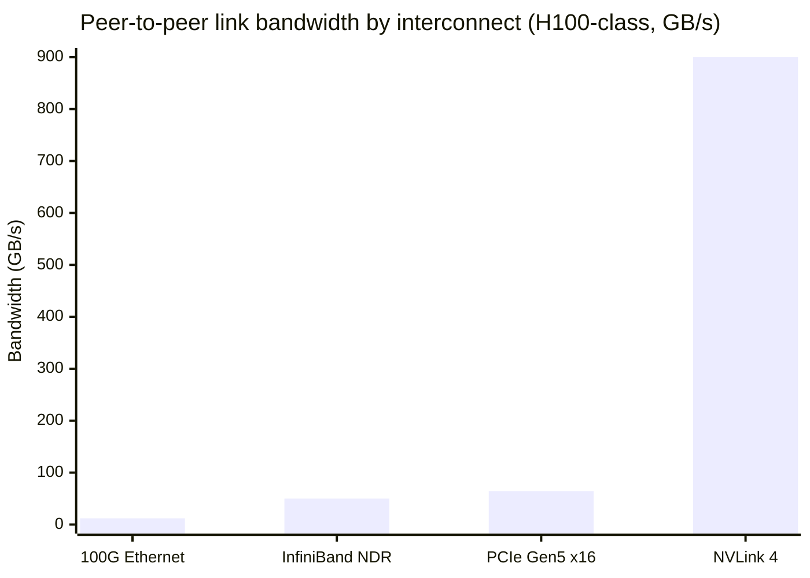
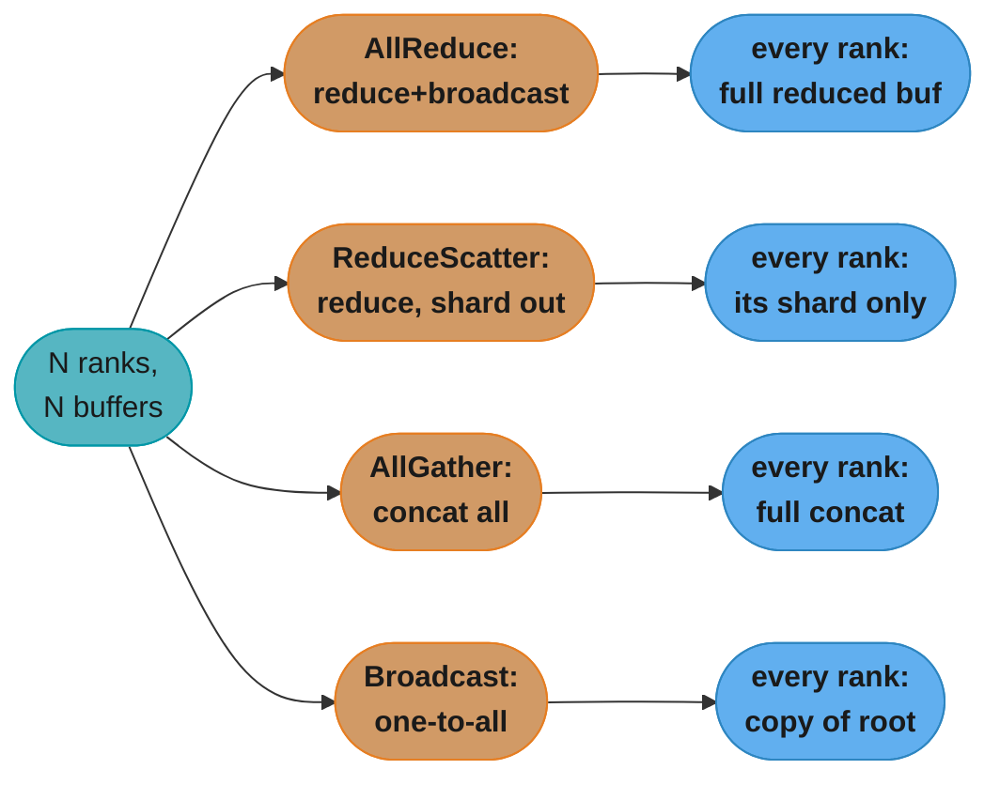
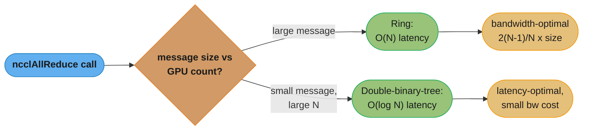
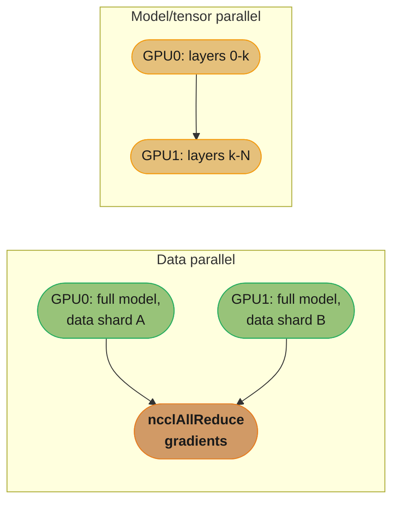
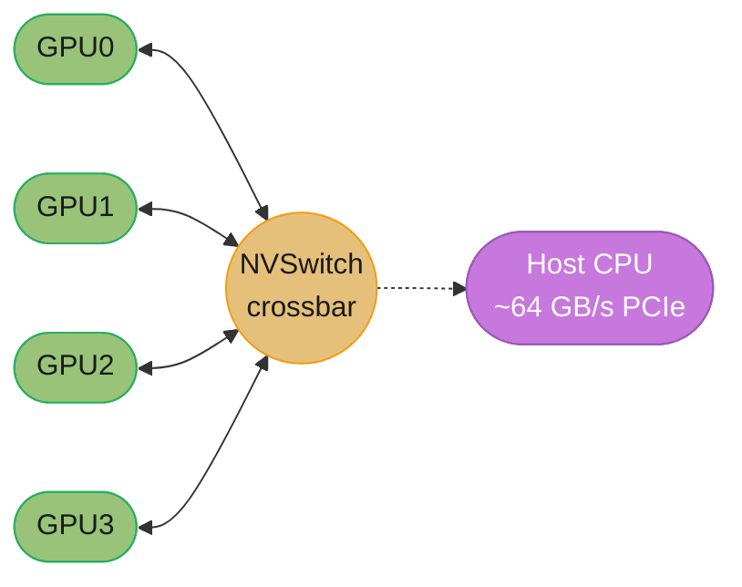

# Multi-GPU Programming & NCCL

## 1. Concept Overview

A single GPU, however large, eventually runs out of memory or compute for the workload in front of it — a 70B-parameter model does not fit in one 80 GB H100, and a training run that would take 40 days on one GPU needs to finish in a weekend. **Multi-GPU programming** is the discipline of coordinating several GPUs — in one server or across a cluster — to work on a single problem: partitioning data or model state across devices, moving data between them, and combining partial results back into a correct final answer.

The two problems every multi-GPU program must solve are **device management** (which GPU does this thread/process own, and can it talk to its neighbors) and **collective communication** (how do N GPUs efficiently exchange or combine buffers). CUDA gives you `cudaSetDevice`, peer-to-peer (P2P) access, and `cudaMemcpyPeer` for the first. **NCCL** (NVIDIA Collective Communications Library) gives you the second — a small set of GPU-topology-aware collectives (`ncclAllReduce`, `ncclAllGather`, `ncclReduceScatter`, `ncclBroadcast`) that saturate NVLink/NVSwitch/InfiniBand without the programmer hand-rolling ring or tree algorithms. Every framework-level multi-GPU tool you have used — PyTorch's `DistributedDataParallel`, Horovod, DeepSpeed, Megatron-LM — is a thin layer over NCCL calling exactly these primitives.

This module teaches multi-GPU programming from the **kernel/systems-programming altitude**: the raw CUDA and NCCL APIs, the ring all-reduce algorithm, and the hardware (NVLink, NVSwitch, GPUDirect) that makes it fast. It does **not** re-teach *when* to shard a model versus its data — that strategic decision (data parallelism, tensor parallelism, ZeRO, FSDP) is covered in [`ml/distributed_training`](../../ml/distributed_training/); this module covers what happens on the wire and in the driver once that strategic choice has been made.

The natural entry point from single-GPU CUDA is [`streams_events_and_concurrency`](../streams_events_and_concurrency/): everything you learned there about overlapping a `cudaMemcpy` with a kernel on *one* device generalizes directly to overlapping a NCCL collective with compute across *several* devices — the same asynchronous, stream-ordered mental model, just with a second GPU's stream on the other end of the copy. Deployment questions this module deliberately stays out of — provisioning a multi-node GPU cluster, InfiniBand fabric operations, Kubernetes GPU scheduling — belong to [`devops/ml_platform_and_gpu_infrastructure`](../../devops/ml_platform_and_gpu_infrastructure/).

---

## 2. Intuition

> **One-line analogy**: Eight people each holding one page of a ten-thousand-page report need to agree on the grand total of a column of numbers — instead of every person walking their page to every other person (N² trips), they stand in a circle and pass partial sums to their one neighbor, N-1 times, until everyone holds the same final answer. That circle-passing is a ring all-reduce, and NVLink is the very fast, very short table between neighboring seats.

**Mental model**: Think of a multi-GPU system as a small city of workers connected by roads of wildly different quality. The road inside one GPU (registers, shared memory) is a hallway. The road between GPUs on the same NVSwitch is a private freeway at ~900 GB/s. The road between GPUs across PCIe to the host is a crowded two-lane street at ~64 GB/s — more than 10x slower. The road between GPUs on different physical *nodes* goes through the network card and, if you are lucky, GPUDirect RDMA lets it skip the host's lane entirely. NCCL's entire job is to know this road map (the "topology") and route every collective the fastest way that road map allows, using a ring when bandwidth matters and a tree when latency matters.

**Why it matters**: Every large model training run and every high-throughput multi-GPU inference deployment is bottlenecked, sooner or later, by communication rather than compute — a training step that computes a gradient in 40 ms but takes 60 ms to all-reduce it across 8 GPUs is a system that is 60% wasted. Understanding P2P, NVLink topology, and the ring all-reduce is what separates "I called `DistributedDataParallel`" from "I know why my 8-GPU job only gets 5.5x speedup and how to fix it."

**Key insight**: The two questions that answer almost every multi-GPU performance problem are **(1) is this copy going through the host when it could go directly GPU-to-GPU** (P2P/NVLink/GPUDirect), and **(2) is this collective bandwidth-optimal for the message size and GPU count** (ring vs tree, and whether the algorithm's per-GPU traffic is `2·(N-1)/N · size` — the provably minimal amount for an all-reduce — rather than something that scales linearly with N). Everything else in this module is mechanics in service of those two questions.

---

## 3. Core Principles

- **One CUDA context per device, one owner at a time.** `cudaSetDevice(i)` sets the *current device* for the calling host thread; every subsequent `cudaMalloc`, kernel launch, and stream operation on that thread targets device `i` until it is changed. Forgetting to reset it is the single most common multi-GPU bug (see §10).
- **P2P access is opt-in and pairwise.** Two GPUs can copy directly to each other's memory over NVLink or PCIe only after `cudaDeviceEnablePeerAccess` has been called from *both* directions; the driver defaults to routing cross-device copies through host memory otherwise.
- **NCCL is a communicator, not a scheduler.** A `ncclComm_t` binds one GPU to one position ("rank") inside a communication group; every rank must call the *same* collective, with matching argument shapes, in the *same order*, or the collective deadlocks (see §10).
- **Collectives are topology-aware, not naive.** NCCL inspects NVLink/NVSwitch/PCIe/InfiniBand topology at `ncclCommInitRank` time and picks a ring, tree, or (on NVSwitch systems) a more exotic algorithm per message size — the programmer calls `ncclAllReduce` once and gets the fastest available implementation.
- **All-reduce is bandwidth-optimal, not "just send everything to everyone."** A ring all-reduce moves exactly `2·(N-1)/N · size` bytes per GPU regardless of the naive N² all-to-all cost — this is the fact that makes data-parallel training scale to hundreds of GPUs at all.
- **GPUDirect removes the host from the data path entirely.** GPUDirect P2P (intra-node, over NVLink/PCIe) and GPUDirect RDMA (inter-node, over InfiniBand/RoCE) let one GPU's DMA engine write directly into another GPU's memory — the host CPU and its memory bus are bystanders, not participants.
- **Single-process-multi-GPU and multi-process-per-GPU are both valid, with different tradeoffs.** `ncclCommInitAll` sets up all communicators from one process (simple, but Python's GIL and single-process CUDA context limits bite at scale); `ncclCommInitRank` plus a broadcast unique ID is what every real distributed-training launcher (`torchrun`, MPI) uses — one process per GPU, communicating peer-to-peer.
- **A CUDA stream belongs to the device that was current when it was created.** Multi-GPU code that also overlaps compute with communication (see [`streams_events_and_concurrency`](../streams_events_and_concurrency/)) must create one stream per device and never hand a stream created under one `cudaSetDevice` context to kernels or copies issued under another.
- **Synchronization is a global cost, not a per-GPU one.** A collective cannot return on any rank until the slowest participating rank has done its part — one straggler GPU (thermal throttling, a slow PCIe link, an unbalanced data shard) silently caps the throughput of every other GPU in the group.

---

## 4. Types / Architectures / Strategies

### 4.1 Device management models

| Model | How it works | Typical use |
|-------|---------------|--------------|
| **Single-process, multi-GPU** | One host thread/process calls `cudaSetDevice(i)` before each device-specific operation, or spawns one CPU thread per GPU inside the same process | Small scripts, `ncclCommInitAll`, simple P2P demos, single-node inference servers |
| **Multi-process, one GPU each** | One OS process per GPU (`torchrun --nproc_per_node=N`, `mpirun -np N`); processes rendezvous via a unique NCCL ID or MPI | Production training (PyTorch DDP/FSDP, Horovod, DeepSpeed) — avoids Python GIL contention and scales across nodes identically to within a node |

### 4.2 Peer access and copy paths

| Path | Mechanism | Bandwidth (H100-class) |
|------|-----------|--------------------------|
| Host-staged copy | `cudaMemcpy` device→host, then host→device | Bounded by PCIe both ways: ~64 GB/s, plus two hops of latency |
| P2P over PCIe | `cudaDeviceEnablePeerAccess` + `cudaMemcpyPeer`, no NVLink present | ~64 GB/s (PCIe Gen4/5 x16), one hop |
| P2P over NVLink | Same API, GPUs connected via NVLink | ~900 GB/s aggregate bidirectional per GPU (H100 NVLink 4) |
| GPUDirect RDMA | NIC DMAs straight into/out of GPU memory, no host buffer | Network-limited (e.g. 400 Gb/s InfiniBand NDR ≈ 50 GB/s per link) |



*NVLink 4's ~900 GB/s dwarfs every off-chip path by 14-75x. The entire point of P2P, NVSwitch, and GPUDirect is keeping traffic on the tallest bar instead of falling back to the PCIe or network bars beneath it.*

### 4.3 NCCL collectives

| Collective | Effect | Canonical use |
|-----------|--------|-----------------|
| `ncclAllReduce` | Every rank ends with the reduction (sum/max/min/avg) of all ranks' input | Gradient sync in data-parallel training — **the** collective |
| `ncclReduceScatter` | Reduce across ranks, but each rank keeps only its *shard* of the result | Phase 1 of ring all-reduce; used directly in ZeRO/FSDP gradient sharding |
| `ncclAllGather` | Every rank ends with the concatenation of all ranks' inputs | Phase 2 of ring all-reduce; gathering sharded parameters/activations |
| `ncclBroadcast` | One rank's buffer is copied to all ranks | Distributing initial weights, broadcasting a scalar loss-scale decision |
| `ncclReduce` | Like all-reduce but result lands on one rank only | Rare — checkpoint aggregation |
| `ncclSend`/`ncclRecv` | Point-to-point, paired inside a `ncclGroupStart/End` | Pipeline-parallel activation hand-off |



*All four collectives start from the same N-buffers-in shape; they differ only in how much of the result each rank keeps. `ncclReduceScatter` + `ncclAllGather` is the same decomposition drawn in the ring sequence diagram in Section 5 — it is literally how `ncclAllReduce` is implemented internally.*

### 4.4 Ring vs. tree algorithms

- **Ring**: every GPU has exactly one send-neighbor and one recv-neighbor; bandwidth-optimal (`2·(N-1)/N · size` per GPU) but latency scales with `N` (N-1 steps each way) — wins for large messages.
- **Tree** (NCCL's double-binary-tree, default for many topologies since NCCL 2.4): communication forms two binary trees so latency scales as `O(log N)` instead of `O(N)` — wins for small messages and very large GPU counts, at a small bandwidth cost versus the ring.
- NCCL auto-selects per call based on message size, GPU count, and detected topology; you almost never choose manually.



*NCCL never exposes this branch to the caller — it inspects message size, GPU count, and topology at call time and silently picks the winning path, which is why the same `ncclAllReduce` line is bandwidth-optimal on a large gradient buffer and latency-optimal on a small activation tensor.*

### 4.5 Data vs. model decomposition (brief — strategy lives in ml/)

- **Data parallelism**: every GPU holds a full model replica and a different data shard; gradients are all-reduced every step. This module supplies the all-reduce; the strategic tradeoffs (when it stops scaling, gradient accumulation, ZeRO stages) are in [`ml/distributed_training`](../../ml/distributed_training/).
- **Model/tensor/pipeline parallelism**: the model itself is split across GPUs (layers, or within a layer); communication is point-to-point (`ncclSend`/`ncclRecv`) or `ncclAllReduce` over a smaller tensor-parallel group. Strategy and math live in `ml/distributed_training`; this module owns only the NCCL primitives underneath.



*Data parallelism replicates the whole model and shards the data, syncing with `ncclAllReduce`; model/tensor parallelism shards the model itself and hands activations across point-to-point (`ncclSend`/`ncclRecv`). This module supplies both collectives — the strategic choice between them lives in [`ml/distributed_training`](../../ml/distributed_training/).*

### 4.6 Single-node vs. multi-node scaling

NCCL's API does not change as a job grows from one node to many — the same `ncclAllReduce` call works whether the communicator spans 8 GPUs on one NVSwitch or 512 GPUs across 64 nodes. What changes is the *transport* NCCL selects underneath, and a handful of environment variables that control it:

| Variable | Purpose |
|----------|---------|
| `NCCL_DEBUG=INFO` | Prints detected topology, chosen algorithm (ring/tree), and transport (NVLink/PCIe/IB) per communicator — the first thing to set when a job hangs or underperforms |
| `NCCL_IB_HCA` | Restricts which InfiniBand host-channel adapters NCCL uses for inter-node GPUDirect RDMA |
| `NCCL_SOCKET_IFNAME` | Selects the network interface for the initial rendezvous handshake (not the bulk data path) |
| `NCCL_P2P_LEVEL` | Forces or disables P2P at a given PCIe distance (e.g. same root complex vs. across a QPI/NUMA link) — mostly for debugging a suspected P2P misdetection |
| `NCCL_ALGO` / `NCCL_PROTO` | Manually pins the ring/tree algorithm or the protocol (Simple/LL/LL128) — an escape hatch for benchmarking, rarely needed in production |

Multi-node introduces a failure mode single-node setups do not have: **network partition or a single slow/failed node stalls every rank's collective**, since a collective cannot complete until every participant has done its part. Production clusters pair NCCL with a health-check/elastic layer (e.g. `torch.distributed.elastic`, Kubernetes liveness probes) so a dead node is evicted and training restarts from a checkpoint rather than hanging indefinitely.

### 4.7 Multi-GPU in training vs. inference

The collectives are identical, but the traffic pattern and latency sensitivity differ sharply:

| | Training (data-parallel) | Inference (tensor-parallel) |
|---|---|---|
| Collective on the hot path | `ncclAllReduce` on gradients, once per optimizer step | `ncclAllReduce` on partial activations, once per sharded layer, every forward pass |
| Message size | Large (whole model's gradient buffer, bucketed) | Small-to-medium (one activation tensor per layer) |
| Latency sensitivity | Moderate — hidden behind the next step's compute if overlapped | High — directly adds to per-token generation latency in an LLM serving loop |
| Typical algorithm NCCL picks | Ring (large messages favor bandwidth-optimal) | Tree or NCCL's low-latency protocol (small messages favor latency) |

This is why inference engines (vLLM, TensorRT-LLM) are far more sensitive to NVLink/NVSwitch topology than training jobs of similar GPU count — a tensor-parallel forward pass pays the all-reduce's *latency*, not just its bandwidth, on every single token.

---

## 5. Architecture Diagrams

### Ring all-reduce across 4 GPUs — reduce-scatter then all-gather

```
Ring topology (logical direction of the collective, not physical wiring):

        GPU0 -----> GPU1 -----> GPU2 -----> GPU3
          ^                                   |
          +-----------------------------------+
     each GPU has exactly one send-neighbor and one recv-neighbor

Buffer on every GPU is split into N=4 chunks: [ A | B | C | D ]

PHASE 1 -- REDUCE-SCATTER (N-1 = 3 steps)
Every step: each GPU sends one chunk right, accumulates (+=) the chunk it
receives from the left. After 3 steps each GPU owns exactly ONE fully-reduced
chunk (the sum of that chunk across all 4 GPUs):

  GPU     chunk A    chunk B    chunk C    chunk D
  GPU0    partial    partial    partial    FULL SUM   <- D done here
  GPU1    FULL SUM   partial    partial    partial    <- A done here
  GPU2    partial    FULL SUM   partial    partial    <- B done here
  GPU3    partial    partial    FULL SUM   partial    <- C done here

PHASE 2 -- ALL-GATHER (N-1 = 3 steps)
Same ring, same direction; each GPU now forwards its FULL SUM chunk instead of
reducing, until every GPU holds all four full sums:

  GPU     chunk A    chunk B    chunk C    chunk D
  GPU0    FULL SUM   FULL SUM   FULL SUM   FULL SUM
  GPU1    FULL SUM   FULL SUM   FULL SUM   FULL SUM
  GPU2    FULL SUM   FULL SUM   FULL SUM   FULL SUM
  GPU3    FULL SUM   FULL SUM   FULL SUM   FULL SUM

Total traffic per GPU across both phases: 2*(N-1)/N * size = 1.5 * size for
N=4 -- independent of N as N grows, which is why ring all-reduce scales to
hundreds of GPUs instead of costing more per GPU as the group grows.
```

*The reduce-scatter phase turns "N copies of a partial sum" into "N different fully-reduced shards, one per GPU"; the all-gather phase turns those N shards back into N full copies. `ncclAllReduce` is exactly these two phases fused into one call.*

**Worked example**: a 7B-parameter model's gradient buffer in FP32 is `7e9 × 4 bytes ≈ 28 GB`. Across 8 GPUs, the ring all-reduce formula `2·(N-1)/N · size` gives `2 · 7/8 · 28 GB ≈ 49 GB` moved per GPU, split across 14 sequential steps (7 reduce-scatter + 7 all-gather). At H100 NVLink's ~900 GB/s, that is roughly 55 ms of pure transfer time per step-set in the ideal case — the number every "why is my step time X ms" investigation starts from before looking for overlap or topology problems.

### Ring all-reduce as a message sequence (Mermaid view of the same ring)

```mermaid
sequenceDiagram
    participant G0 as GPU0
    participant G1 as GPU1
    participant G2 as GPU2
    participant G3 as GPU3

    Note over G0,G3: Phase 1 - Reduce-Scatter (one ring round shown; repeats N-1=3x)
    G0->>G1: chunk, accumulate (+=)
    G1->>G2: chunk, accumulate (+=)
    G2->>G3: chunk, accumulate (+=)
    G3->>G0: chunk, accumulate (+=)
    Note over G0,G3: after 3 rounds, each GPU owns one FULL SUM chunk

    Note over G0,G3: Phase 2 - All-Gather (one ring round shown; repeats N-1=3x)
    G0->>G1: forward FULL SUM chunk
    G1->>G2: forward FULL SUM chunk
    G2->>G3: forward FULL SUM chunk
    G3->>G0: forward FULL SUM chunk
    Note over G0,G3: after 3 rounds, every GPU holds all FULL SUM chunks
```

*Same ring edges as the diagram above, drawn as messages instead of a table: reduce-scatter's arrows accumulate a chunk on arrival, all-gather's arrows just relay the already-summed chunk one more hop — `ncclAllReduce` is exactly these two loops, run N-1 times each, fused into one call.*

### NVLink / NVSwitch topology (8-GPU node, e.g. DGX/HGX H100)

```
8-GPU NVSwitch topology

        GPU0   GPU1   GPU2   GPU3   GPU4   GPU5   GPU6   GPU7
          |      |      |      |      |      |      |      |
          +------+------+------+------+------+------+------+
                              |
                       NVSwitch fabric
              (all-to-all crossbar -- full bisection bandwidth)
                              |
          +------+------+------+------+------+------+------+
                 (PCIe/NIC uplink to host CPU, storage, network)

  GPU <-> NVSwitch link (H100, NVLink 4): ~900 GB/s aggregate bidirectional
  Any GPU reaches any other GPU at full NVLink bandwidth -- no hop penalty
  Host uplink (PCIe Gen5 x16): ~64 GB/s -- over 10x slower than the NVLink mesh
```

*NVSwitch is why an 8-GPU ring all-reduce is nearly as fast per-hop as a 2-GPU one: every "ring edge" in §5's first diagram is actually a full-bandwidth NVSwitch hop, not a degraded multi-hop PCIe path. Without NVSwitch (PCIe-only servers), GPUs are usually cross-connected in pairs, and a ring spanning all 8 must cross the slow PCIe/host path for at least one edge.*

### NVSwitch as an all-to-all mesh (4-GPU Mermaid view)



*Every GPU is exactly one NVSwitch hop from every other GPU at ~900 GB/s — the "ring" a collective walks is really 4 identical full-bandwidth crossbar hops, not a degraded chain. The host's PCIe uplink (dashed) is a slow side path the collective never needs to cross.*

### Host-staged copy vs. GPUDirect/P2P — where the host disappears from the path

```
BROKEN path -- host CPU and host RAM sit in the middle of every GPU-to-GPU byte:

  GPU0 memory --DMA--> Host RAM (bounce buffer) --DMA--> GPU1 memory
              (~64 GB/s PCIe)                  (~64 GB/s PCIe)
  Two hops, two DMA engines waited on, host memory bandwidth consumed for
  data the host never actually needed to touch.

FIXED path -- GPUDirect P2P (intra-node) / GPUDirect RDMA (inter-node):

  GPU0 memory ------------------ DMA ------------------> GPU1 memory
                    (~900 GB/s NVLink, intra-node)
                          -- or, across nodes --
  GPU0 memory --DMA--> NIC --RDMA over InfiniBand/RoCE--> NIC --DMA--> GPU1 memory
  One hop (intra-node) or one network transit (inter-node); the host CPU and
  host RAM are bystanders, not participants, in either case.
```

*This is the diagram version of the Section 10 BROKEN→FIX pitfall: the "host disappears from the path" property is what GPUDirect P2P and GPUDirect RDMA both buy, whether the two GPUs are in the same chassis or different racks.*

---

## 6. How It Works — Detailed Mechanics

### 6.1 Device management and P2P in CUDA C++

```cpp
#include <cstdio>
#define CUDA_CHECK(x) do { \
    cudaError_t e = (x); \
    if (e != cudaSuccess) { \
        fprintf(stderr, "CUDA error %s at %s:%d\n", cudaGetErrorString(e), __FILE__, __LINE__); \
        exit(1); \
    } \
} while (0)

int main() {
    int deviceCount = 0;
    CUDA_CHECK(cudaGetDeviceCount(&deviceCount));   // e.g. 4 on a workstation

    // Enable peer access GPU0 <-> GPU1 (must be called from BOTH sides)
    int canAccessPeer01 = 0, canAccessPeer10 = 0;
    CUDA_CHECK(cudaSetDevice(0));
    CUDA_CHECK(cudaDeviceCanAccessPeer(&canAccessPeer01, 0, 1));
    if (canAccessPeer01) CUDA_CHECK(cudaDeviceEnablePeerAccess(1, 0));

    CUDA_CHECK(cudaSetDevice(1));
    CUDA_CHECK(cudaDeviceCanAccessPeer(&canAccessPeer10, 1, 0));
    if (canAccessPeer10) CUDA_CHECK(cudaDeviceEnablePeerAccess(0, 0));

    const size_t N = 1 << 24;   // 16M floats = 64 MB
    float *d_src, *d_dst;
    CUDA_CHECK(cudaSetDevice(0));
    CUDA_CHECK(cudaMalloc(&d_src, N * sizeof(float)));
    CUDA_CHECK(cudaSetDevice(1));
    CUDA_CHECK(cudaMalloc(&d_dst, N * sizeof(float)));

    // Direct GPU0 -> GPU1 copy over NVLink/PCIe P2P -- no host staging buffer
    CUDA_CHECK(cudaMemcpyPeer(d_dst, 1, d_src, 0, N * sizeof(float)));

    CUDA_CHECK(cudaSetDevice(0)); CUDA_CHECK(cudaFree(d_src));
    CUDA_CHECK(cudaSetDevice(1)); CUDA_CHECK(cudaFree(d_dst));
    return 0;
}
```

`cudaMemcpyPeer` is the P2P-aware sibling of `cudaMemcpy`: given peer access is enabled, the driver programs the source GPU's DMA engine to write straight into the destination GPU's memory over NVLink/PCIe, never touching host RAM.

### 6.2 Raw NCCL — single-process, 4-GPU all-reduce

```cpp
#include <nccl.h>
#include <cuda_runtime.h>

int main() {
    const int nGPUs = 4;
    int devs[nGPUs] = {0, 1, 2, 3};

    ncclComm_t comms[nGPUs];
    ncclCommInitAll(comms, nGPUs, devs);      // single-process convenience init

    const size_t N = 1 << 20;                  // 1M floats per GPU
    float* sendbuf[nGPUs];
    float* recvbuf[nGPUs];
    cudaStream_t streams[nGPUs];

    for (int i = 0; i < nGPUs; ++i) {
        cudaSetDevice(devs[i]);
        cudaStreamCreate(&streams[i]);
        cudaMalloc(&sendbuf[i], N * sizeof(float));
        cudaMalloc(&recvbuf[i], N * sizeof(float));
        // ... fill sendbuf[i] with this GPU's local gradient ...
    }

    // Every rank must issue the SAME collective, in the SAME order, or this
    // deadlocks -- see the mismatched-collective-order pitfall in Section 10.
    ncclGroupStart();
    for (int i = 0; i < nGPUs; ++i) {
        cudaSetDevice(devs[i]);
        ncclAllReduce((const void*)sendbuf[i], (void*)recvbuf[i], N,
                      ncclFloat, ncclSum, comms[i], streams[i]);
    }
    ncclGroupEnd();

    for (int i = 0; i < nGPUs; ++i) {
        cudaSetDevice(devs[i]);
        cudaStreamSynchronize(streams[i]);   // recvbuf[i] now holds the sum
    }

    for (int i = 0; i < nGPUs; ++i) ncclCommDestroy(comms[i]);
    return 0;
}
```

`ncclGroupStart`/`ncclGroupEnd` batch the per-device calls so NCCL can launch them concurrently instead of serializing on each `ncclAllReduce` return — essential once you have more than a couple of GPUs in one process.

### 6.3 Multi-process NCCL rendezvous (the production pattern)

```cpp
// Rank 0 generates the ID and shares it (e.g. via MPI_Bcast or a file/socket);
// every other rank receives the SAME id before calling ncclCommInitRank.
ncclUniqueId id;
if (myRank == 0) ncclGetUniqueId(&id);
MPI_Bcast(&id, sizeof(id), MPI_BYTE, 0, MPI_COMM_WORLD);

cudaSetDevice(localGPU);           // this process owns exactly one GPU
ncclComm_t comm;
ncclCommInitRank(&comm, worldSize, id, myRank);   // one process, one rank, one GPU

ncclAllReduce(sendbuf, recvbuf, N, ncclFloat, ncclSum, comm, stream);
```

This is what `torchrun`/`mpirun` do under the hood: one OS process per GPU, a broadcast unique ID for rendezvous, then symmetric collective calls — no single process ever owns more than one CUDA context.

### 6.4 Python — `torch.distributed` with the NCCL backend

```python
import os
import torch
import torch.distributed as dist

def setup(rank: int, world_size: int) -> None:
    os.environ.setdefault("MASTER_ADDR", "localhost")
    os.environ.setdefault("MASTER_PORT", "29500")
    dist.init_process_group(backend="nccl", rank=rank, world_size=world_size)
    torch.cuda.set_device(rank)          # one process per GPU, rank == local GPU id

def sync_gradient(grad: torch.Tensor, world_size: int) -> torch.Tensor:
    # All-reduce -- the collective behind every data-parallel gradient sync
    dist.all_reduce(grad, op=dist.ReduceOp.SUM)
    grad /= world_size
    return grad

def gather_activations(local: torch.Tensor, world_size: int) -> list[torch.Tensor]:
    gathered = [torch.zeros_like(local) for _ in range(world_size)]
    dist.all_gather(gathered, local)      # every rank ends with every rank's tensor
    return gathered
```

### 6.5 Python — `DistributedDataParallel` (DDP)

```python
import torch
import torch.nn as nn
from torch.nn.parallel import DistributedDataParallel as DDP

def train(rank: int, world_size: int, model: nn.Module, dataloader) -> None:
    setup(rank, world_size)
    model = model.to(rank)
    ddp_model = DDP(model, device_ids=[rank])   # registers all-reduce backward hooks

    optimizer = torch.optim.AdamW(ddp_model.parameters(), lr=3e-4)
    for batch in dataloader:
        optimizer.zero_grad()
        loss = ddp_model(batch).loss
        loss.backward()        # DDP fires bucketed ncclAllReduce calls as grads land
        optimizer.step()       # every replica now has the identical averaged gradient
```

DDP buckets gradients (default 25 MB) and overlaps the all-reduce of an earlier bucket with the backward pass still computing later layers' gradients — this overlap, not a faster all-reduce, is why DDP throughput scales close to linearly.

### 6.6 Python — CuPy with raw NCCL

```python
import cupy as cp
from cupy.cuda import nccl

# Rank 0 creates and shares the unique id (analogous to ncclGetUniqueId above)
comm_id = nccl.get_unique_id()
comm = nccl.NcclCommunicator(4, comm_id, rank)   # 4 total ranks, this process is `rank`

with cp.cuda.Device(rank):
    sendbuf = cp.ones(1 << 20, dtype=cp.float32)
    recvbuf = cp.empty(1 << 20, dtype=cp.float32)
    comm.allReduce(
        sendbuf.data.ptr, recvbuf.data.ptr, sendbuf.size,
        nccl.NCCL_FLOAT32, nccl.NCCL_SUM, cp.cuda.Stream.null.ptr,
    )
    # recvbuf now holds the elementwise sum across all 4 ranks' sendbuf
```

CuPy exposes NCCL almost 1:1 with the C API — useful when a numerics-heavy Python pipeline needs a collective without pulling in the whole PyTorch distributed stack.

### 6.7 NCCL error handling — the `NCCLCHECK` macro

Every raw-NCCL example above omits error handling for readability; production code wraps every NCCL call the same way `CUDA_CHECK` wraps CUDA runtime calls:

```cpp
#define NCCLCHECK(cmd) do {                              \
    ncclResult_t r = (cmd);                              \
    if (r != ncclSuccess) {                              \
        fprintf(stderr, "NCCL error %s at %s:%d\n",      \
                ncclGetErrorString(r), __FILE__, __LINE__); \
        exit(1);                                         \
    }                                                     \
} while (0)

// usage:
NCCLCHECK(ncclAllReduce(sendbuf, recvbuf, N, ncclFloat, ncclSum, comm, stream));
```

A NCCL call returning an error almost always means the *communicator* is now unusable (a mismatched collective, a dead peer, a topology it could not resolve) — the correct recovery is to tear down and re-initialize the whole communicator, not retry the single call.

### 6.8 Point-to-point send/recv for pipeline hand-off

Not every multi-GPU pattern is a collective — pipeline parallelism hands an activation from the GPU holding layer `k` to the GPU holding layer `k+1`, a point-to-point transfer:

```cpp
// Stage k sends its output activation to stage k+1; stage k+1 receives it.
// Paired inside ncclGroupStart/End so both sides progress concurrently.
ncclGroupStart();
if (myRank == k) {
    ncclSend(activation, N, ncclFloat, /*peer=*/k + 1, comm, stream);
}
if (myRank == k + 1) {
    ncclRecv(activation, N, ncclFloat, /*peer=*/k, comm, stream);
}
ncclGroupEnd();
```

```python
# torch.distributed equivalent
import torch.distributed as dist

if rank == k:
    dist.send(activation, dst=k + 1)
elif rank == k + 1:
    dist.recv(activation, src=k)
```

Every `ncclSend` must be paired with a matching `ncclRecv` on the destination rank inside the same group, for the same reason every collective must match across ranks — an unmatched send or recv blocks forever.

### 6.9 Verifying achieved bandwidth with `nccl-tests`

Before trusting a new node or cluster for a real training run, benchmark it against the theoretical NVLink/InfiniBand ceiling rather than assuming the topology is wired and configured correctly:

```bash
# Build once: git clone https://github.com/NVIDIA/nccl-tests && make MPI=1
./build/all_reduce_perf -b 8M -e 8G -f 2 -g 8

#   size(B)  count(elem)   type   redop   time(us)  algbw(GB/s)  busbw(GB/s)
#   8388608     2097152  float     sum      9421      0.89e+03    1.56e+03   <- ~900 GB/s-class NVLink
```

`busbw` (bus bandwidth) is the number to compare against the hardware spec sheet (~900 GB/s for H100 NVLink 4); a result well below that on an NVSwitch node usually means P2P is disabled, the wrong GPUs are paired, or a driver/topology misdetection is silently falling back to a slower path — exactly the class of problem `NCCL_DEBUG=INFO` (Section 4.6) is built to expose.

---

## 7. Real-World Examples

- **PyTorch DDP** wraps every model in production single-node and multi-node training with bucketed `ncclAllReduce` calls overlapped with backpropagation — the default multi-GPU training strategy for the entire PyTorch ecosystem.
- **Horovod** (Uber) was an early standalone ring-all-reduce library built directly on NCCL/MPI, predating native `torch.distributed` NCCL support, and still used in some TensorFlow/MXNet pipelines.
- **Megatron-LM / DeepSpeed** layer tensor- and pipeline-parallel `ncclSend`/`ncclRecv` and reduced-scope `ncclAllReduce` calls (within a tensor-parallel group) on top of the same primitives this module covers, to train models too large for data parallelism alone.
- **NVIDIA DGX H100 / HGX H100** systems ship 8 GPUs fully connected through NVSwitch, specifically so that a ring or NCCL's tree algorithm sees uniform ~900 GB/s bandwidth to every other GPU — the hardware exists because the software (NCCL) can exploit it.
- **Multi-node LLM pretraining clusters** (e.g. AWS P5/P5e, Azure ND H100 v5) combine intra-node NVSwitch with inter-node GPUDirect RDMA over InfiniBand, so the same `ncclAllReduce` call transparently spans hundreds of GPUs across racks.
- **JAX's `pjit`/GSPMD** and **Ray Train** both compile down to NCCL collectives on GPU backends despite exposing very different, higher-level sharding APIs to the user — a reminder that "which framework" rarely changes "which wire protocol."
- **vLLM and TensorRT-LLM tensor-parallel inference** issue `ncclAllReduce` after every sharded attention/FFN block to recombine partial activations across GPUs, on the *inference* side of the same primitives this module teaches for training.
- **NCCL itself is open source** (github.com/NVIDIA/nccl) and its test suite (`nccl-tests`) is the standard way infrastructure teams benchmark a new cluster's achieved all-reduce bandwidth against the theoretical NVLink/InfiniBand ceiling before trusting it for a training run.
- **DeepSpeed's ZeRO stages** shard optimizer state (stage 1), gradients (stage 2), and parameters (stage 3) across GPUs, using `ncclReduceScatter`/`ncclAllGather` in place of a full `ncclAllReduce` to keep only each GPU's shard resident at any moment — the collective-level mechanics live here, the sharding strategy in `ml/distributed_training`.
- **Kubernetes-scheduled multi-node training** (via the NVIDIA GPU Operator and Kubeflow/Volcano job schedulers) still bottoms out in the exact `ncclCommInitRank` + unique-ID rendezvous pattern shown in Section 6.3, with the orchestration layer's job only being to co-schedule the pods and expose the right environment variables (`RANK`, `WORLD_SIZE`, `MASTER_ADDR`).

---

## 8. Tradeoffs

| Choice | Pros | Cons |
|--------|------|------|
| Host-staged copy (`cudaMemcpy` D2H→H2D) | Works everywhere, no peer-access setup | ~10-15x slower than NVLink P2P; extra host memory pressure |
| P2P / `cudaMemcpyPeer` | Direct GPU-to-GPU, full NVLink bandwidth, low latency | Requires topology support (not all GPU pairs are P2P-capable, e.g. across NUMA/PCIe-switch boundaries without NVLink) |
| Raw NCCL API (C/C++) | Maximum control, no framework overhead, usable from any language with bindings | You own rank bookkeeping, stream management, error handling |
| `torch.distributed`/DDP | A few lines of Python, automatic bucketing/overlap, battle-tested | Less control over exact collective scheduling; Python-process overhead per GPU |
| Single-process, `ncclCommInitAll` | Simplest to set up for small demos/single-node scripts | Python GIL and single CUDA-context-per-process limits hurt at scale; doesn't extend to multi-node |
| Multi-process, `ncclCommInitRank` | Scales identically from 2 GPUs to thousands across nodes | More moving parts: launcher, rendezvous, unique-ID distribution |
| Ring all-reduce | Bandwidth-optimal (`2(N-1)/N · size`), simple to reason about | Latency grows with N (2(N-1) sequential steps) — poor for many small messages |
| Tree all-reduce | `O(log N)` latency, good for small messages / large N | Slightly higher bandwidth cost than a ring for large messages |
| Single-node (NVSwitch) | Uniform ~900 GB/s to every peer, simplest failure domain | Bounded by GPUs physically in one chassis (typically 8-16) |
| Multi-node (InfiniBand/RoCE + GPUDirect RDMA) | Scales to hundreds/thousands of GPUs | Network partition or one slow node stalls every collective; needs elastic/health-check tooling |
| NCCL collectives | Purpose-built for GPU topology, minimal API surface, used by every DL framework | GPU-only — no CPU-side collectives |
| MPI collectives | General-purpose, decades of HPC tooling, CPU and GPU (via CUDA-aware MPI) | Not topology-aware for NVLink/NVSwitch the way NCCL is; typically used only to bootstrap NCCL rendezvous in DL workloads, not for the hot-path collective itself |

---

## 9. When to Use / When NOT to Use

**Use multi-GPU + NCCL when:**
- The model or batch does not fit in one GPU's memory, or training/inference latency on one GPU is unacceptable.
- You need to synchronize state (gradients, KV-cache shards, embedding tables) across devices as part of a correctness-critical step (data-parallel training, tensor-parallel inference).
- You are already inside a framework (PyTorch, DeepSpeed) whose distributed layer expects a NCCL-backed process group — in that case, use the framework's API (DDP/FSDP) rather than hand-rolling collectives.

**Avoid or reconsider when:**
- The problem fits comfortably on one GPU — multi-GPU adds rendezvous, synchronization, and failure-mode complexity (partial failures, stragglers) for no benefit.
- You need only occasional, small, irregular transfers between two GPUs — a single `cudaMemcpyPeer` call is simpler and has less setup overhead than standing up a NCCL communicator.
- You are on a single-GPU-per-node inference deployment — NCCL's overhead exists to buy nothing if there is no second GPU to talk to.
- The workload is embarrassingly parallel across independent jobs (e.g. hyperparameter search) — plain process-level parallelism (one job per GPU, no communication at all) beats any collective-communication machinery.

| Signal | Decision |
|--------|----------|
| Model/activations exceed one GPU's memory | Multi-GPU is mandatory — pick data, tensor, or pipeline parallelism per [`ml/distributed_training`](../../ml/distributed_training/), then implement the sync with NCCL |
| Model fits, but training would take too long serially | Data parallelism + `ncclAllReduce` (DDP) is almost always the first thing to reach for |
| Only two GPUs, one occasional large tensor to move | Skip NCCL entirely — `cudaDeviceEnablePeerAccess` + `cudaMemcpyPeer` is simpler and has near-zero setup cost |
| Independent, uncoordinated jobs across GPUs | Skip both — plain OS-level process parallelism, one job per GPU, no collective needed |

---

## 10. Common Pitfalls

**BROKEN: routing a hot inter-GPU copy through host memory when NVLink is available**

```cpp
// BROKEN -- ~10-15x slower than necessary on an NVLink-connected pair
float* h_buf = (float*)malloc(N * sizeof(float));
cudaSetDevice(0);
cudaMemcpy(h_buf, d_src, N * sizeof(float), cudaMemcpyDeviceToHost);   // GPU0 -> host
cudaSetDevice(1);
cudaMemcpy(d_dst, h_buf, N * sizeof(float), cudaMemcpyHostToDevice);   // host -> GPU1
free(h_buf);
```

This pays for two PCIe hops (~64 GB/s each, plus host-buffer allocation and two synchronization points) when the two GPUs sit on the same NVSwitch at ~900 GB/s.

```cpp
// FIX -- enable P2P once, then copy directly GPU-to-GPU over NVLink
int canAccess = 0;
cudaSetDevice(0);
cudaDeviceCanAccessPeer(&canAccess, 0, 1);
if (canAccess) cudaDeviceEnablePeerAccess(1, 0);
cudaSetDevice(1);
cudaDeviceCanAccessPeer(&canAccess, 1, 0);
if (canAccess) cudaDeviceEnablePeerAccess(0, 0);

cudaMemcpyPeer(d_dst, 1, d_src, 0, N * sizeof(float));   // one DMA, no host bounce
```

Always check `cudaDeviceCanAccessPeer` before enabling — not every GPU pair is P2P-capable (e.g. GPUs behind different PCIe root complexes with no NVLink between them), and the fallback is the host-staged path, not a crash.

**BROKEN: mismatched collective ordering across ranks deadlocks the job**

```cpp
// BROKEN -- rank 0 takes a different branch than every other rank
if (myRank == 0) {
    ncclAllReduce(sendbuf, recvbuf, N, ncclFloat, ncclSum, comm, stream);
    ncclBroadcast(extra, extra, M, ncclFloat, 0, comm, stream);   // extra call!
} else {
    ncclAllReduce(sendbuf, recvbuf, N, ncclFloat, ncclSum, comm, stream);
    // other ranks never call ncclBroadcast -- they wait forever
}
```

NCCL collectives are synchronization barriers across every rank in the communicator; if even one rank issues a different collective, a different count of collectives, or the same collective on a mismatched buffer size, every rank that *did* call it blocks indefinitely waiting for a peer that will never show up. This is the single most common "my multi-GPU job just hangs" bug, and it produces no error — only silence.

```cpp
// FIX -- every rank calls the exact same sequence of collectives, unconditionally
ncclAllReduce(sendbuf, recvbuf, N, ncclFloat, ncclSum, comm, stream);
ncclBroadcast(extra, extra, M, ncclFloat, 0, comm, stream);   // ALL ranks call this,
                                                               // even non-root ranks
```

The fix is structural: never gate a collective call behind rank-specific `if` logic — gate only the *data* (e.g. only rank 0's `extra` buffer holds meaningful values; every rank still calls `ncclBroadcast` to receive it).

**Other frequent pitfalls:**
- Forgetting `cudaSetDevice(i)` before a per-device `cudaMalloc`/kernel launch — memory silently allocates on whichever device the host thread last selected, corrupting a different GPU's workload.
- Sharing one `cudaStream_t` across two `cudaSetDevice` contexts — a stream is bound to the device that was current when it was created; using it from another device's context is undefined behavior.
- Calling NCCL collectives without `ncclGroupStart`/`ncclGroupEnd` when driving multiple devices from one process — each call blocks waiting for the *device* launch to complete before issuing the next, serializing what should be concurrent.
- Not accounting for `world_size` when averaging gradients — `dist.all_reduce(..., op=SUM)` returns a **sum**, not a mean; forgetting the `/= world_size` silently scales the effective learning rate by the GPU count.
- Sharing one `ncclComm_t` across multiple host threads without external synchronization — a single NCCL communicator is not thread-safe for concurrent collective calls by default; each communicator should be driven by exactly one thread (typically paired 1:1 with the device it targets).
- Leaving `CUDA_VISIBLE_DEVICES` unset or inconsistent across ranks launched by different scripts/containers — rank 0 and rank 1 can silently end up bound to the *same* physical GPU if the visible-device ordering differs between processes, corrupting results without any error.
- Assuming P2P bandwidth is uniform across all GPU pairs in an 8-GPU node without NVSwitch — on PCIe-only or pair-wise-bridged systems, some pairs run at full NVLink speed and others fall back to PCIe, so a ring that happens to route through a slow pair bottlenecks the whole collective even though most edges are fast.

---

## 11. Technologies & Tools

| Tool | Role |
|------|------|
| **NCCL** | NVIDIA's GPU-topology-aware collective communication library; the substrate under almost every multi-GPU training/inference stack |
| **CUDA P2P API** (`cudaDeviceEnablePeerAccess`, `cudaMemcpyPeer`) | Low-level direct GPU-to-GPU memory access, intra-node |
| **GPUDirect RDMA** | Lets a network adapter DMA directly into/out of GPU memory, bypassing host memory, for inter-node collectives |
| **NVLink / NVSwitch** | High-bandwidth GPU interconnect (~900 GB/s per GPU on H100) and the all-to-all crossbar fabric connecting up to 8 (or more, with newer NVLink domains) GPUs |
| **`torch.distributed`** | PyTorch's process-group abstraction; NCCL is its default GPU backend, with Gloo as a CPU/fallback backend |
| **`DistributedDataParallel` / `FullyShardedDataParallel`** | PyTorch's framework-level wrappers that emit the NCCL calls this module teaches |
| **CuPy `nccl` bindings** | Thin Python wrapper exposing raw NCCL collectives to NumPy-like GPU arrays |
| **MPI (OpenMPI, MVAPICH)** | Classic HPC process-launch and rendezvous layer; often used to bootstrap NCCL unique-ID exchange across nodes |
| **`torchrun` / `mpirun`** | Process launchers that start one process per GPU and set the environment variables (`RANK`, `WORLD_SIZE`, `MASTER_ADDR`) `torch.distributed` and NCCL rendezvous need |
| **Horovod** | Standalone ring-all-reduce library (Uber), framework-agnostic (TensorFlow/PyTorch/MXNet), predates native `torch.distributed` NCCL support |
| **`nccl-tests`** | NVIDIA's official benchmark suite for measuring achieved collective bandwidth against a topology's theoretical ceiling |

In practice the choice of layer is dictated by altitude, not preference: reach for raw NCCL (Section 6.2-6.3) only when writing a custom communication pattern a framework does not expose (a bespoke pipeline-parallel schedule, a research prototype); reach for `torch.distributed`'s collectives (Section 6.4) when you need a specific collective inside otherwise-custom training code; and reach for `DistributedDataParallel`/`FullyShardedDataParallel` (Section 6.5) for standard data-parallel or sharded training, where the framework's bucketing and overlap logic already outperforms a hand-rolled call to `ncclAllReduce`.

---

## 12. Interview Questions with Answers

**What happens if two ranks call collectives in a different order or count?**
The job deadlocks silently — NCCL collectives are barriers across the whole communicator, so a rank waiting on a collective that a peer never issues blocks forever with no error message. Always structure code so every rank calls the identical sequence of collectives; gate data content on rank, never the collective call itself.

**Why is a host-staged `cudaMemcpy` D2H-then-H2D wasteful when NVLink is available?**
It pays for two PCIe hops (~64 GB/s each) plus host-buffer overhead when a direct P2P copy over NVLink could run at ~900 GB/s on an H100 pair. Enable peer access with `cudaDeviceEnablePeerAccess` (both directions) and use `cudaMemcpyPeer` instead.

**What does `ncclAllReduce` actually do internally?**
It runs a reduce-scatter phase (each GPU ends with one fully-reduced shard) followed by an all-gather phase (every GPU collects every shard), moving a bandwidth-optimal `2·(N-1)/N · size` bytes per GPU. This ring decomposition is what makes NCCL scale to hundreds of GPUs without per-GPU traffic growing with N.

**Why must `cudaDeviceEnablePeerAccess` be called from both GPUs, not just one?**
Peer access is directional — enabling it on GPU0 only lets GPU0 read/write GPU1's memory, not the reverse. A bidirectional copy or NCCL ring needs both directions enabled, or the driver silently falls back to the host-staged path.

**What is the difference between `ncclCommInitAll` and `ncclCommInitRank`?**
`ncclCommInitAll` sets up every communicator from one process, while `ncclCommInitRank` sets up one communicator per process from a shared unique ID. The latter is the pattern every multi-process/multi-node launcher (`torchrun`, MPI) uses, since it avoids one process owning many CUDA contexts and the Python GIL.

**Why does forgetting `grad /= world_size` after `dist.all_reduce(op=SUM)` break training?**
`all_reduce` with `ReduceOp.SUM` returns the *sum* of gradients across all ranks, not the mean, so skipping the division silently multiplies the effective gradient (and thus the effective learning rate) by the GPU count. This can look like instability or divergence with no obvious root cause in the loss curve alone.

**What is the concrete bandwidth gap between NVLink and PCIe that makes P2P matter?**
NVLink 4 on H100 delivers roughly 900 GB/s aggregate bidirectional bandwidth per GPU, versus roughly 64 GB/s for PCIe Gen4/5 x16 — more than a 10x gap that host-staged copies pay twice (device→host, host→device).

**Ring vs. tree all-reduce — when does NCCL pick which?**
Ring is bandwidth-optimal but has O(N) latency, so it wins for large messages, while tree has O(log N) latency at a small bandwidth cost and wins for small messages and very large GPU counts. NCCL selects automatically per call based on message size, GPU count, and detected topology.

**What is GPUDirect RDMA, and what does it remove from the data path?**
It lets a network adapter DMA directly into or out of GPU memory over InfiniBand/RoCE, removing the host CPU and host memory entirely from an inter-node transfer. Without it, an inter-node collective must stage through host memory on both the sending and receiving node, adding latency and consuming host memory bandwidth.

**What is an NVSwitch, and what problem does it solve that pairwise NVLink does not?**
NVSwitch is an all-to-all crossbar connecting up to 8 (or more, in newer NVLink-domain designs) GPUs so that every GPU reaches every other GPU at full NVLink bandwidth with no extra hop. Without it, GPUs are typically cross-wired in pairs, so a ring spanning all 8 GPUs must cross a slower PCIe/host segment for at least one ring edge.

**Single-process-multi-GPU vs. multi-process-per-GPU — which does production training use, and why?**
Production launchers (`torchrun`, MPI) use one process per GPU, since a single Python process hits the GIL and one CUDA context juggling many devices, neither of which scales across nodes. Single-process-multi-GPU stays useful for small demos or `ncclCommInitAll`-style scripts confined to one node.

**Why does DDP overlap the all-reduce with backward()?**
DDP buckets gradients (default ~25 MB) and fires each bucket's `ncclAllReduce` as soon as it is ready, while backward is still computing gradients for earlier layers. This overlap, not a faster collective, is the main reason DDP throughput scales close to linearly with GPU count.

**What is `ncclGroupStart`/`ncclGroupEnd` for, and what breaks without it?**
It batches multiple per-device NCCL calls issued from one process so they launch concurrently instead of each call blocking until that device's portion completes before the next is issued. Without it, driving several devices' collectives from a single process serializes work that should overlap, quietly destroying the concurrency multi-GPU was supposed to buy.

**Why can two GPUs in the same server sometimes NOT do P2P?**
`cudaDeviceCanAccessPeer` returns false when the pair has no NVLink connection and sits behind different PCIe root complexes with no supported path between them. In that case the driver's only option is the host-staged copy, which is why code must always check `cudaDeviceCanAccessPeer` rather than assuming P2P is available.

**What does `ncclReduceScatter` give you that plain `ncclAllReduce` does not, and where is it used directly?**
It leaves each rank holding only its *shard* of the reduced result, rather than the full buffer `ncclAllReduce` gives every rank. ZeRO/FSDP use exactly this shard-only primitive to avoid ever materializing the full tensor on every rank; `ncclAllReduce` itself is `ncclReduceScatter` followed by `ncclAllGather`.

**Is a single NCCL communicator safe to call from multiple host threads at once?**
No — by default a `ncclComm_t` is not thread-safe for concurrent collective calls, so each communicator should be driven by exactly one thread, typically the same thread that owns the corresponding CUDA device context. Sharing one communicator across threads without external locking is a race condition, not a supported pattern.

**Why can two ranks silently end up bound to the same physical GPU?**
If `CUDA_VISIBLE_DEVICES` is inconsistent across a job's processes, each process's local index `0` can map to a different physical GPU, colliding two ranks onto one GPU with no error raised. Production launchers set it identically and derive the local device from `LOCAL_RANK`, not an assumed ordering.

**What does `NCCL_DEBUG=INFO` show you that helps diagnose a hung or slow job?**
It prints the topology NCCL detected and the ring/tree algorithm and transport it chose, confirming whether NVLink/NVSwitch/GPUDirect RDMA is actually engaged versus a slow PCIe or TCP fallback. It is the first thing to check before assuming a hang is a code bug rather than a topology or network issue.

**Why do tensor-parallel inference deployments care more about all-reduce latency than data-parallel training does?**
Inference's all-reduce runs once per sharded layer on every forward pass, adding directly to per-token latency with nothing to overlap it against, while training's all-reduce hides behind the next step's compute. That is why NCCL favors the low-latency tree/protocol path for the small, frequent messages typical of tensor-parallel inference.

---

## 13. Best Practices

- **Always guard with `cudaDeviceCanAccessPeer` before enabling P2P** — never assume every GPU pair in a node is NVLink-connected; fall back gracefully to host-staged copies when it returns false.
- **Prefer one process per GPU in production** (`torchrun`/MPI + `ncclCommInitRank`) over single-process-multi-GPU — it is the only pattern that extends unmodified from one node to a multi-node cluster.
- **Never gate a collective call on rank-specific control flow** — gate the *data*, not the *call*, so every rank always issues the identical sequence of collectives in the identical order.
- **Batch multi-device launches with `ncclGroupStart`/`ncclGroupEnd`** whenever one process drives more than one device's collective, to avoid accidental serialization.
- **Check the NCCL/all-reduce time against the compute time explicitly** (e.g. via Nsight Systems timeline or `torch.profiler`) — if communication is not overlapped with compute, look for a bucket-size or overlap-configuration problem before assuming the hardware is the bottleneck.
- **Divide summed gradients by world size** after `all_reduce(op=SUM)`, or use `ReduceOp.AVG` (NCCL 2.10+/PyTorch recent) which does the division on-device.
- **Use `NCCL_DEBUG=INFO`** (environment variable) when a multi-GPU job hangs or misbehaves — it prints the detected topology and the ring/tree algorithm NCCL chose, which is the fastest way to confirm NVLink/NVSwitch is actually being used rather than a slow fallback path.
- **Keep collective message sizes large where possible** (bucket small gradients together, as DDP does) — a ring all-reduce's fixed per-step overhead means many tiny collectives lose to fewer large ones even at identical total bytes.
- **Cross-reference the strategic layer** ([`ml/distributed_training`](../../ml/distributed_training/)) before hand-rolling a sharding scheme — ZeRO/FSDP already compose `ncclReduceScatter`/`ncclAllGather` correctly; re-deriving that from raw NCCL calls is rarely worth it outside of research or infrastructure work.
- **Set `CUDA_VISIBLE_DEVICES` identically across all ranks** and derive each process's local device from `LOCAL_RANK`, never from an assumed device-index ordering — the silent-collision pitfall in Section 10 is otherwise easy to hit.
- **One thread per NCCL communicator.** If a process must drive multiple GPUs, either use one thread per device with its own communicator, or batch the per-device calls with `ncclGroupStart`/`ncclGroupEnd` from a single thread — never call into the same communicator concurrently from two threads.
- **Benchmark the cluster before trusting it for a real run.** Run `nccl-tests`' `all_reduce_perf` to measure achieved bandwidth against the theoretical NVLink/InfiniBand ceiling; a cluster that measures well below peak usually has a misconfigured topology, disabled P2P, or a missing GPUDirect RDMA driver, not a fundamentally slow interconnect.
- **Treat a straggler GPU as a whole-group problem, not a one-GPU problem.** Since every collective blocks on its slowest participant, monitor per-GPU step time individually (not just the aggregate) so a single thermal-throttling or misconfigured GPU is caught before it is misdiagnosed as "the interconnect is slow."
- **Match the collective's algorithm expectations to the message size you actually send.** Bucket small, frequent tensors together before an all-reduce (as DDP does) rather than issuing many tiny collectives — the fixed per-step overhead of a ring or tree dominates at small message sizes regardless of how fast the underlying link is.

---

## 14. Case Study

**Scenario**: A team trains a 7B-parameter model data-parallel across a single 8xH100 NVSwitch node. Profiling with Nsight Systems shows GPU compute utilization dipping to ~55% during backward passes — the all-reduce is not hiding behind compute the way it should, and step time is 30% higher than the team's cost model predicted.

### Diagram — communication/compute overlap, broken vs fixed

```
BROKEN -- one big all-reduce after backward() finishes (no overlap):

  |------- backward pass (60 ms) -------|-- all-reduce, all grads (25 ms) --|
  GPU busy: computing gradients          GPU busy: waiting on NCCL, mostly idle
  Step time: 60 + 25 = 85 ms  ->  effective utilization ~71%

FIXED -- bucketed all-reduce overlapped with backward (DDP default):

  |--- backward: layers N..k ---|--- backward: layers k..0 ---|
                     |-- all-reduce bucket 1 (layers N..k) --|
                                       |-- all-reduce bucket 2 (layers k..0) --|
  Step time: ~65 ms (bucket 1's communication hides inside bucket 2's compute)
```

*Bucketing lets the all-reduce for the layers whose gradients finish first start immediately, overlapping with the still-running backward computation for earlier layers — the same reduce-scatter/all-gather ring from Section 5, just pipelined per bucket instead of run once at the end.*

### Investigation and fix

The root cause: the team had disabled DDP's default bucketing (`bucket_cap_mb` set far too large, effectively one giant bucket) while debugging an unrelated memory issue, and never reverted it — collapsing the pipelined overlap in the diagram above back into the single big all-reduce.

```python
# BROKEN -- one enormous bucket means backward() must fully finish (all 60 ms)
# before the first byte of the all-reduce for ANY parameter can start.
ddp_model = DDP(model, device_ids=[rank], bucket_cap_mb=4096)  # ~whole 7B model

# FIX -- restore small, framework-tuned buckets so gradient-ready buckets
# fire their all-reduce immediately, overlapping with later-layer backward.
ddp_model = DDP(model, device_ids=[rank])  # default bucket_cap_mb=25 (MB)
```

After the fix, Nsight Systems' timeline showed NCCL kernels running concurrently with backward-pass compute kernels on the same stream timeline instead of strictly after them, GPU compute utilization rose from ~55% to ~92% during backward, and measured step time dropped from 85 ms to ~66 ms — a 22% throughput improvement with no change to the model or optimizer, confirming the bottleneck was communication scheduling, not raw NCCL/NVLink bandwidth (`NCCL_DEBUG=INFO` had already confirmed the ring was using NVSwitch at near-peak bandwidth, ruling out a topology/hardware cause).

**Extending the fix to multi-node.** The same team later scaled this job from one 8-GPU node to four nodes (32 GPUs total) and initially saw step time regress by another 15% despite identical per-node bucketing. `NCCL_DEBUG=INFO` showed the inter-node hop falling back to a TCP socket path instead of GPUDirect RDMA over the cluster's InfiniBand fabric — the RDMA driver was present but the `NCCL_IB_HCA` environment variable was pointed at the wrong host-channel-adapter name after a node image update. Correcting it restored GPUDirect RDMA, and the 32-GPU step time landed within 8% of the ideal (one-node time scaled by the ring's `2·(N-1)/N` factor for N=32), the residual gap being the expected extra latency of the larger ring.

### Interview Discussion Points

- Why did reverting `bucket_cap_mb` fix throughput without touching the model, optimizer, or GPU count?
- How would you distinguish "communication is not overlapped" from "the NVLink/NVSwitch fabric itself is the bottleneck" using Nsight Systems alone?
- What would you expect to happen to this fix's benefit if the node had PCIe-only GPU interconnect instead of NVSwitch?
- If this job spanned two nodes instead of one, what additional hardware (GPUDirect RDMA, InfiniBand) and NCCL environment tuning would you check first?
- Why is `2·(N-1)/N · size` traffic per GPU a better scaling property than an all-to-all approach, and how does that show up as this cluster grows from 8 to 64 GPUs?
- The multi-node extension's root cause was an `NCCL_IB_HCA` misconfiguration silently falling back to TCP — what monitoring would catch this automatically before it costs a full training run's worth of wasted GPU-hours?
- If this were a tensor-parallel inference deployment instead of data-parallel training, would the same bucketing fix help, or does the latency-bound nature of per-token all-reduce change the diagnosis entirely?

---

## See Also

- [`../streams_events_and_concurrency/`](../streams_events_and_concurrency/) — the single-GPU stream/event/overlap mechanics that the "overlap communication with compute" pattern in Section 14 depends on
- [`../../ml/distributed_training/`](../../ml/distributed_training/) — the strategic layer: data/tensor/pipeline parallelism, ZeRO stages, FSDP, when to choose which
- [`../../devops/ml_platform_and_gpu_infrastructure/`](../../devops/ml_platform_and_gpu_infrastructure/) — provisioning multi-GPU/multi-node clusters, GPU Operator, InfiniBand fabric operations
