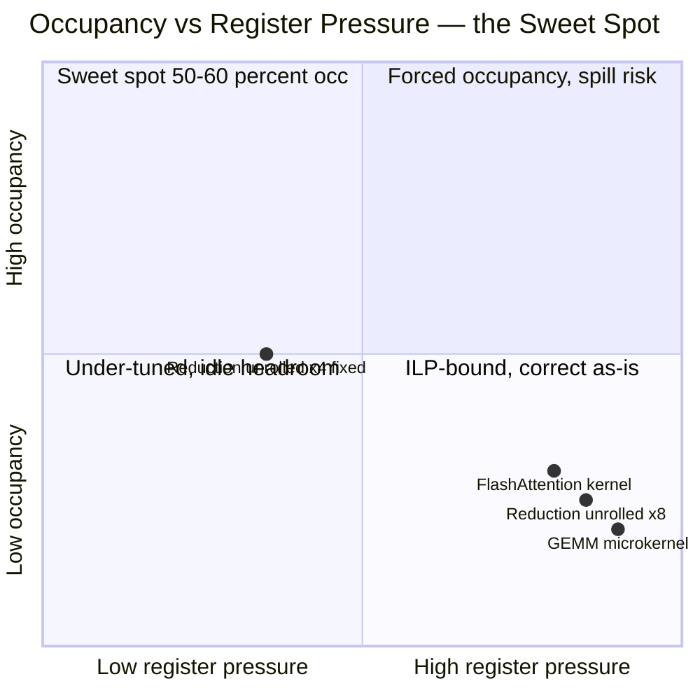
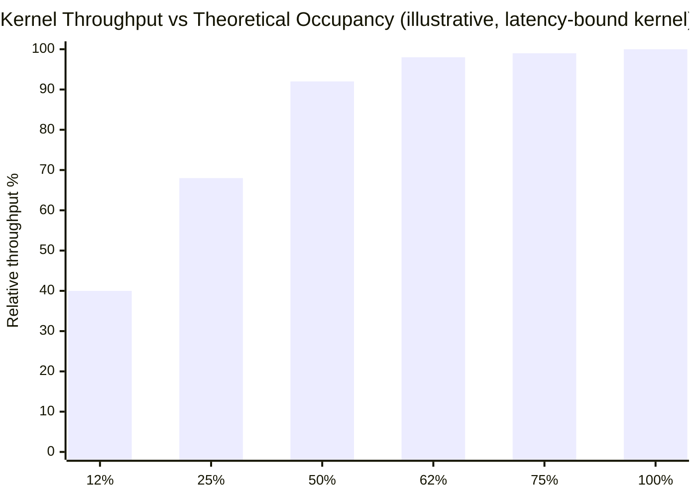
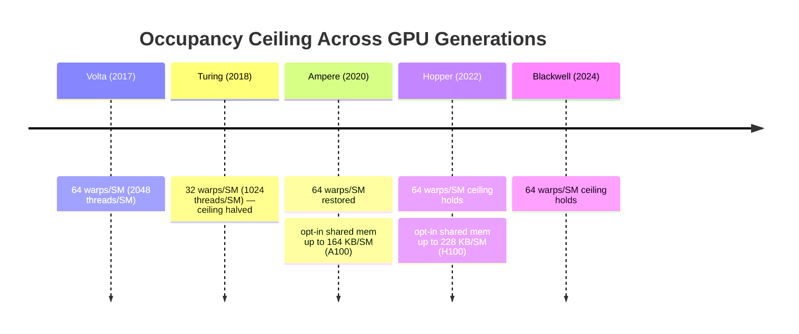
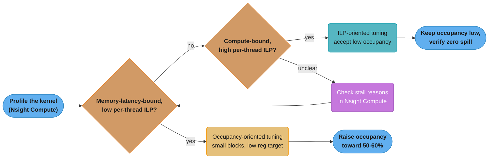
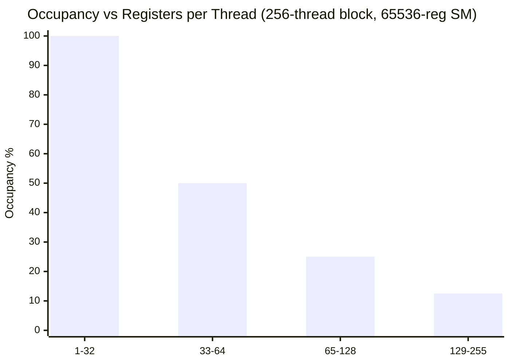
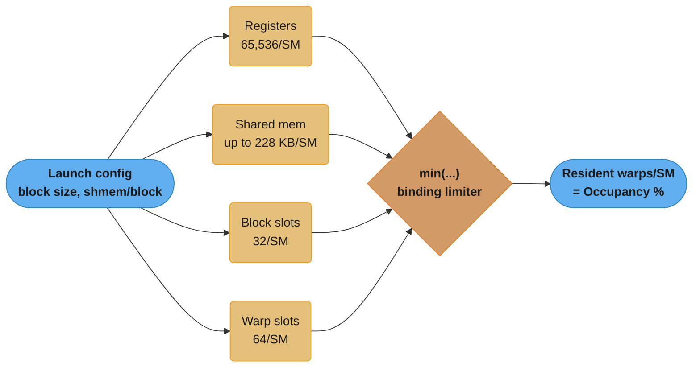
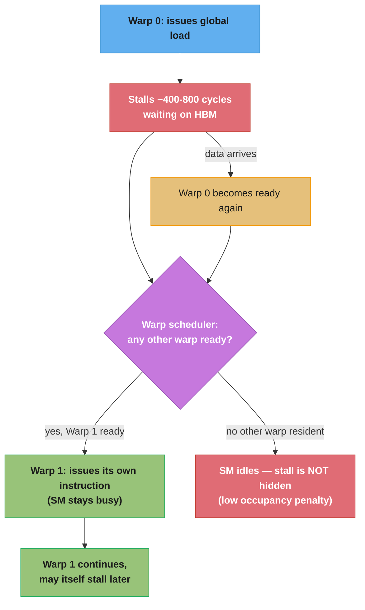
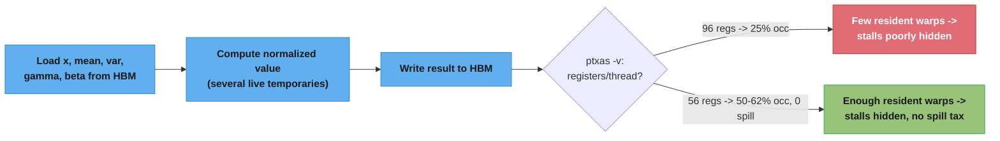

# Occupancy & Launch Configuration

## 1. Concept Overview

**Occupancy** is the ratio of *active warps resident on a Streaming Multiprocessor (SM)* to
the *maximum number of warps that SM can hold* — a single number that answers "how much of
this SM's latency-hiding capacity am I actually using?" It is computed as:

```
occupancy = active_warps_per_SM / max_warps_per_SM
```

Occupancy is not a performance metric by itself — it is a *capacity* metric. A kernel can
hit 100% occupancy and still be slow (memory-bound, badly coalesced), and a kernel can sit
at 25% occupancy and be near the compute roofline (a register-hungry GEMM microkernel with
enormous per-thread instruction-level parallelism). What occupancy *does* tell you is
whether the SM's warp scheduler has enough independent work queued up to hide the ~400-800
cycle latency of a global-memory load by switching to a different warp instead of stalling.

**Launch configuration** is the set of choices you make at `<<<gridDim, blockDim,
sharedMemBytes, stream>>>` — block size (threads/block), grid size (blocks/grid), and
dynamic shared-memory bytes — that determine how many blocks and warps can be resident on
each SM simultaneously. Three hardware resources cap how many blocks an SM can host at once:
the **register file** (65,536 32-bit registers/SM), **shared memory** (up to ~164-228 KB/SM
on recent architectures), and fixed **block/warp slot counts** (32 resident blocks/SM, 64
resident warps/SM on Volta/Ampere/Hopper). Whichever of the three runs out first — the
*binding limiter* — sets your occupancy ceiling for that kernel. Tuning launch configuration
means understanding which limiter binds, and deciding whether raising it (fewer registers,
less shared memory, a different block size) is worth the tradeoff.

This module is the practical companion to
[warps_and_simt_execution](../warps_and_simt_execution/) (what a warp is and how the
scheduler switches between them) and
[shared_memory_and_bank_conflicts](../shared_memory_and_bank_conflicts/) (the other major
consumer of the same per-SM shared-memory budget that occupancy math depends on).

---

## 2. Intuition

> **One-line analogy**: An SM's warp scheduler is a call-center supervisor with 64 phone
> lines; occupancy is how many of those 64 lines currently have an agent on hold — the
> supervisor only avoids dead air by having *another* agent ready to pick up while one is on
> hold, and having 64 agents all on hold with nothing to say is no better than having 20.

**Mental model**: Every SM has a fixed budget of three things — registers, shared memory,
and warp/block "slots" — and every resident thread block spends from all three at once. Launch
configuration is a bin-packing problem: given a kernel's per-thread register appetite and
per-block shared-memory appetite, how many blocks fit in the SM's budget simultaneously? The
answer, converted to warps and divided by the hardware ceiling (64 warps/SM on modern
architectures), *is* occupancy. More resident warps means more independent instruction
streams the scheduler can interleave, which means more opportunities to hide a stalled
warp's ~400-800 cycle memory wait behind another warp's ready-to-issue instruction. But
registers, shared memory, and warps are a fixed pie — asking a kernel to use fewer registers
so more blocks fit can force it to spill live values to slower local memory, trading one
performance problem for a worse one.

**Why it matters**: Occupancy is the single most commonly *misused* metric in GPU
performance work. Engineers new to CUDA treat "maximize occupancy" as a universal goal and
crank block sizes or slap `-maxrregcount` on a kernel, only to make it slower — because they
forced register spilling or destroyed the instruction-level parallelism (ILP) the compiler
was using to hide latency *without* needing many resident warps. The senior-engineer
distinction is: occupancy is *necessary* when a kernel has low per-thread ILP and is
memory-latency-bound, and largely *irrelevant* (or a false economy) when a kernel is
compute-bound with enough independent work per thread that a handful of warps is already
enough to keep the pipelines full.

**Key insight**: Occupancy is a *means* to hide latency, not an end to be maximized. The
practical target is "enough occupancy to hide the latency this specific kernel exposes,"
which the classic empirical result puts at roughly 50-60% for a large class of real kernels
— past that point, more resident warps buys nothing (the latency is already hidden) while
the register/shared-memory pressure needed to get there can actively hurt.



*Caption*: the broken `reduce_unrolled8` (§10) lands in the wrong quadrant for a
memory-latency-bound kernel — high register pressure with only 25% occupancy and no ILP
payoff to show for it. The fix pulls it into the top-left sweet spot, while FlashAttention
and GEMM microkernels correctly live in the bottom-right because their register pressure
buys real ILP on a compute-bound kernel, not latency hiding.



*Caption*: a sketch of the trend this module keeps repeating — throughput climbs steeply
while occupancy is scarce, then flattens hard once enough warps are resident to hide the
kernel's latency; the last 40 points of occupancy buy only about 2 points of throughput,
which is why occupancy is a means to an end and not the end itself.

---

## 3. Core Principles

- **Occupancy is a ratio, always relative to the hardware ceiling.** `active_warps /
  max_warps_per_SM`. The ceiling itself varies by compute capability — 64 warps/SM (2048
  threads) on Volta/Ampere/Hopper/Blackwell, 32 warps/SM (1024 threads) on Turing — so the
  same kernel has a different theoretical occupancy just by moving between generations.



*Caption*: the same launch configuration can carry a different theoretical occupancy purely
from the target architecture — Turing's 32-warp ceiling is half of every generation before
and after it, which is why an occupancy target tuned on one GPU generation must be
re-verified on another (see the related Q&A in §12).

- **Three independent resources gate occupancy, and the tightest one wins.** Registers
  (65,536 32-bit registers/SM), shared memory (48 KB/block default, up to ~164-228 KB/SM
  with opt-in on Ampere/Hopper), and fixed slot counts (max 32 resident blocks/SM, max 64
  resident warps/SM). Occupancy = `min(registers-limited blocks, shared-mem-limited blocks,
  block-slot limit) × threads-per-block / max_threads_per_SM`.

- **Registers are allocated per-thread, but consumed per-SM.** A kernel compiled to use 64
  registers/thread costs `64 × threads_resident` registers total. This is why register
  pressure — driven by loop unrolling, live temporaries, and deep call inlining — is the
  most common occupancy limiter in practice.

- **Block size must be a multiple of the warp size (32).** A block of 100 threads still
  consumes 4 warps (128 thread-slots) on the hardware — the last warp runs with 28 masked-off
  lanes, wasting 28/32 = 87.5% of that warp's throughput permanently. Always round block size
  to a multiple of 32; the common sweet spot is **128-256 threads/block**.

- **Latency hiding is a Little's-Law problem.** To keep the SM's warp schedulers (4 per SM on
  modern architectures) issuing an instruction every cycle through an L-cycle stall (L ≈
  400-800 cycles for an uncached global load), you need enough independent, ready-to-issue
  warps queued up — either *more resident warps* (higher occupancy) or *more independent work
  per warp* (higher ILP via unrolling). These are substitutes, not additive requirements.

- **Occupancy is theoretical until measured.** The occupancy calculator (`cudaOccupancy*`
  APIs, Nsight Compute's "Theoretical Occupancy") computes what the hardware *permits* given
  registers/shared-mem/block size. **Achieved occupancy** — what Nsight Compute measures at
  runtime — is often lower, due to tail effects (the last wave of blocks under-filling the
  GPU), load imbalance, or early-exiting warps.

- **Register spilling is the occupancy tax you don't want to pay.** When a kernel's live
  register demand exceeds what the compiler is told (or forced) to use, ptxas spills the
  excess to **local memory** — physically the same global-memory space, cached through
  L1/L2, but far slower than a register. Forcing occupancy up by capping registers can spill,
  making the "optimized" kernel slower than the original.

---

## 4. Types / Architectures / Strategies

### 4.1 The Three Occupancy Limiters

| Limiter | Per-SM Budget (typical) | How a block consumes it | Symptom when binding |
|---------|--------------------------|--------------------------|------------------------|
| **Registers** | 65,536 32-bit registers | `threads/block × regs/thread` | Register-heavy kernels (deep unrolling, many live temporaries, GEMM microkernels) cap occupancy first |
| **Shared memory** | 48 KB/block default; up to ~164 KB (A100)/~228 KB (H100) per SM with opt-in | `sharedMemBytes` (static + dynamic) per resident block | Large tiles (e.g. big GEMM/convolution tiles) cap blocks/SM before registers do |
| **Block/warp slots** | 32 resident blocks/SM; 64 resident warps/SM (Volta/Ampere/Hopper), 32 (Turing) | 1 slot per block regardless of size; `threads/block ÷ 32` warp slots | Very small blocks (e.g. 32-64 threads) hit the 32-block ceiling before registers or shared memory do, wasting warp capacity |

### 4.2 Launch-Configuration Strategies

- **Occupancy-oriented tuning** — pick block size and register/shared-mem budget to maximize
  resident warps. Appropriate for memory-latency-bound kernels with low per-thread ILP
  (elementwise ops, simple gathers) where more in-flight warps directly hides more latency.
- **ILP-oriented tuning** — accept lower occupancy in exchange for more independent work per
  thread (manual unrolling, wider vector loads, more live accumulators). Appropriate for
  compute-bound kernels (GEMM, convolution inner loops) where a handful of warps with deep
  instruction pipelines already saturate the ALUs/Tensor Cores.
- **Grid-stride loops** — decouple grid size from problem size so the *same* kernel launch
  configuration (fixed blocks × threads, sized to occupy the GPU exactly) processes any input
  size, avoiding both under-subscription (too few blocks to fill the GPU) and the tail-effect
  waste of a barely-over-the-wave grid size.
- **Dynamic vs. static shared memory** — a statically declared `__shared__` array bakes its
  size into the compiled kernel, fixing occupancy at compile time; `extern __shared__` with a
  size passed at launch (`kernel<<<grid, block, dynamicBytes>>>`) lets the *same* kernel trade
  shared-memory footprint for occupancy at runtime, which is how libraries like cuBLAS/cuDNN
  select among several tile sizes for the same compiled kernel.
- **Per-kernel vs. file-wide register capping** — `__launch_bounds__(maxThreads,
  minBlocksPerSM)` is a per-kernel compiler hint; `-maxrregcount=N` is an nvcc flag applied to
  *every* kernel in the translation unit. Prefer `__launch_bounds__` — a file-wide cap can
  starve a different, register-hungry kernel compiled in the same file.



*Caption*: neither branch is "better" — a memory-latency-bound, low-ILP kernel wants more
resident warps (occupancy-oriented tuning), while a compute-bound, high-ILP kernel already
keeps its pipelines full with only a handful of warps (ILP-oriented tuning); Nsight
Compute's stall-reason breakdown is what tells the two apart.

---

## 5. Architecture Diagrams

### The Occupancy Cliff — Registers per Thread vs. Occupancy

Occupancy is not a smooth function of register usage — it is a **step function**, because
blocks are all-or-nothing units (an SM either fits another whole block or it doesn't). The
table below is the worked arithmetic for an SM with the modern 65,536-register / 64-max-warp
budget, assuming a 256-thread block (8 warps/block) so occupancy changes only when the
register ceiling forces one fewer *block* resident:

```
SM budget: 65,536 32-bit registers/SM  |  64 max resident warps (2048 threads) — Volta/
Ampere/Hopper/Blackwell.  Block size fixed at 256 threads/block (8 warps/block) below.

  Regs/thread   Regs/block (256thr)   Blocks/SM        Warps/SM   Occ.      Bar
  ------------- ---------------------- ----------------- ---------- --------- --------------------
  1   -   32     up to  8,192           8 (blk-capped)    64         100 %    ####################
  33  -   64     up to 16,384           4                 32          50 %    ##########
  65  -  128     up to 32,768           2                 16          25 %    #####
  129 -  255     up to 65,280           1                  8        12.5 %    ##

  Cliffs happen at 32, 64, and 128 regs/thread: crossing a cliff loses one whole RESIDENT
  BLOCK (8 warps) at a time — not a gradual decline. A kernel compiled to 128 regs/thread
  sits at 25% occupancy even though it is only "a few registers" past the 64-reg cliff at
  65 regs/thread.
```

*Caption*: the step-function shape is the reason "shave a handful of registers" is either
free (you're mid-band) or the single highest-leverage change available (you're one register
over a cliff). Always check which side of a cliff a kernel sits on before optimizing.



*Caption*: the same data as the table above, redrawn as bars — each register-count band is
a flat plateau, and the drop between bands is a cliff, not a slope, because a whole
resident block is lost at once.

### What Limits Occupancy — A Worked Example

The three limiters from §4.1 are computed independently and the **smallest** wins. Worked
example: a kernel launched with 256 threads/block, 8 KB of shared memory/block, and a
compiler-assigned 48 registers/thread, on an SM with the full modern budget:

```
Worked example — 256 threads/block, 8 KB shared mem/block, 48 regs/thread.
SM budget: 65,536 registers | up to 164 KB shared memory (A100, opt-in) | 32 block slots |
64 warp slots.

  Limiter                Per-SM budget    Per-block cost         Blocks/SM allowed
  ----------------------- ---------------- ----------------------- -------------------
  Registers               65,536 regs      256 x 48 = 12,288 regs  65536/12288 = 5.3 -> 5
  Shared memory            164 KB           8 KB                    164/8      = 20.5 -> 20
  Block slots (hw ceiling) 32 blocks         1 block/launch          32
  Warp slots               64 warps          8 warps (256/32)        64/8       = 8

  Binding limiter = min(5, 20, 32, 8) = 5 blocks/SM
  Resident warps  = 5 blocks x 8 warps/block = 40 warps/SM
  Occupancy       = 40 / 64 = 62.5%
```

*Caption*: registers bind here (5 blocks) even though shared memory alone would allow 20 —
this is the common case for compute-heavy kernels, and it is why "just add more shared
memory tiling" does not raise occupancy once registers are already the tighter constraint.



*Caption*: whichever of the four resource budgets yields the fewest resident blocks wins;
raising a non-binding resource — e.g. adding more shared memory when registers already
bind — does nothing to occupancy, exactly the trap in the worked example above.

### Latency Hiding via Warp Interleaving



*Caption*: occupancy exists to make the "yes, Warp 1 ready" branch true as often as possible.
Zero or one resident warp per scheduler means every stall risks the "IDLE" branch; enough
resident warps (or enough independent work packed into each warp via ILP) keeps the SM's
ALUs busy through the ~400-800 cycle memory latency instead of leaving them idle.

---

## 6. How It Works — Detailed Mechanics

### 6.1 Computing Theoretical Occupancy — CUDA C++ Runtime API

```cpp
#include <cuda_runtime.h>
#include <cstdio>

__global__ void __launch_bounds__(256, 4)   // maxThreads=256, minBlocksPerSM=4
normalize_kernel(float* data, int n) {
    int idx = blockIdx.x * blockDim.x + threadIdx.x;
    if (idx < n) {
        float v = data[idx];
        data[idx] = v / (fabsf(v) + 1.0f);   // simple, low-ILP elementwise op
    }
}

void report_occupancy(int n) {
    int minGridSize = 0, blockSize = 0;

    // Let the driver suggest the block size that maximizes occupancy for this kernel.
    cudaOccupancyMaxPotentialBlockSize(&minGridSize, &blockSize,
                                        normalize_kernel, /*dynamicSMemSize=*/0,
                                        /*blockSizeLimit=*/0);
    printf("Suggested block size: %d, min grid for full occupancy: %d\n",
           blockSize, minGridSize);

    // Given an ACTUAL block size (e.g. the __launch_bounds__ target of 256), ask how many
    // blocks of that size can be resident per SM.
    int numBlocksPerSM = 0;
    cudaOccupancyMaxActiveBlocksPerMultiprocessor(&numBlocksPerSM, normalize_kernel,
                                                   256, /*dynamicSMemSize=*/0);

    cudaDeviceProp prop;
    cudaGetDeviceProperties(&prop, 0);
    int maxWarpsPerSM = prop.maxThreadsPerMultiProcessor / 32;   // 2048/32 = 64 on Ampere/Hopper
    int warpsPerBlock = 256 / 32;                                 // 8
    float occupancy = (numBlocksPerSM * warpsPerBlock) / (float)maxWarpsPerSM;

    printf("Blocks/SM: %d, warps/SM: %d, theoretical occupancy: %.1f%%\n",
           numBlocksPerSM, numBlocksPerSM * warpsPerBlock, occupancy * 100.0f);

    // Ground-truth resource usage the compiler actually assigned to this kernel.
    cudaFuncAttributes attr;
    cudaFuncGetAttributes(&attr, normalize_kernel);
    printf("Registers/thread: %d, static shared mem/block: %zu bytes, max threads/block: %d\n",
           attr.numRegs, attr.sharedSizeBytes, attr.maxThreadsPerBlock);
}
```

`cudaOccupancyMaxPotentialBlockSize` answers "what block size should I launch with?";
`cudaOccupancyMaxActiveBlocksPerMultiprocessor` answers "given the block size I *chose*, how
many are resident?" — the second is what you use to verify a hand-picked size (e.g. one
matching a `__launch_bounds__` hint) actually delivers the occupancy you expect. Compile with
`nvcc --ptxas-options=-v` to print each kernel's register/shared-memory usage directly at
build time — the fastest way to see whether a kernel just crossed a register cliff.

### 6.2 `__launch_bounds__` and `-maxrregcount` — Constraining the Compiler

```cpp
// __launch_bounds__(maxThreadsPerBlock, minBlocksPerMultiprocessor)
// Tells ptxas: "I will launch at most 256 threads/block, and I want at least 4 blocks of
// that size resident per SM simultaneously." The compiler derives a register budget:
//   65536 registers / (4 blocks x 256 threads) = 64 registers/thread MAXIMUM.
// If the natural (unconstrained) register need is higher, ptxas will spill the excess.
__global__ void __launch_bounds__(256, 4) tiled_reduce(const float* in, float* out, int n) {
    // kernel body — compiler now targets <= 64 regs/thread to honor the 4-block promise
}
```

```bash
# -maxrregcount applies file-wide, to every __global__ kernel compiled in this translation
# unit — use it only when a single file has one dominant kernel, otherwise prefer
# __launch_bounds__ per kernel so a register-hungry neighbor kernel is not starved.
nvcc -O3 -arch=sm_90 -maxrregcount=64 -c kernel.cu -o kernel.o

# ptxas -v (via nvcc --ptxas-options=-v) prints, per kernel:
#   ptxas info : Used 48 registers, 384 bytes cmem[0]
#   ptxas info : Function properties for tiled_reduce
#       0 bytes stack frame, 0 bytes spill stores, 0 bytes spill loads
nvcc -O3 -arch=sm_90 --ptxas-options=-v -c kernel.cu -o kernel.o
```

"0 bytes spill stores, 0 bytes spill loads" in the `ptxas -v` output is the ground truth that
a register constraint did **not** force spilling; nonzero spill bytes is the signal to back
off the constraint or refactor the kernel instead.

### 6.3 Block-Size Selection — Grid-Stride Loop Pattern

```cpp
__global__ void grid_stride_scale(float* data, float alpha, int n) {
    int idx    = blockIdx.x * blockDim.x + threadIdx.x;
    int stride = gridDim.x * blockDim.x;
    for (int i = idx; i < n; i += stride) {
        data[i] *= alpha;
    }
}

void launch_scale(float* data, float alpha, int n) {
    const int blockSize = 256;                       // multiple of 32; sweet spot 128-256
    int minGridSize, suggestedBlockSize;
    cudaOccupancyMaxPotentialBlockSize(&minGridSize, &suggestedBlockSize, grid_stride_scale);

    cudaDeviceProp prop;
    cudaGetDeviceProperties(&prop, 0);
    // Launch exactly enough blocks to fill every SM once — grid-stride loop covers any n
    // without over- or under-subscribing, avoiding the tail-effect underutilization of a
    // grid sized to n/blockSize when n does not divide evenly by (SMs x blocks/SM).
    int numSMs = prop.multiProcessorCount;
    int gridSize = numSMs * minGridSize;               // "fill the GPU exactly once" heuristic
    grid_stride_scale<<<gridSize, blockSize>>>(data, alpha, n);
}
```

### 6.4 Inspecting Occupancy in Python — PyCUDA

PyCUDA compiles real CUDA C via `SourceModule` and exposes the compiled kernel's actual
resource usage (`num_regs`, `shared_size_bytes`) as attributes on the `Function` object —
feeding those straight into `pycuda.tools.OccupancyRecord` reproduces the same arithmetic as
the CUDA occupancy calculator, from Python:

```python
import pycuda.autoinit
import pycuda.driver as cuda
from pycuda.compiler import SourceModule
from pycuda.tools import OccupancyRecord

mod = SourceModule("""
__global__ void normalize_kernel(float* data, int n) {
    int idx = blockIdx.x * blockDim.x + threadIdx.x;
    if (idx < n) {
        float v = data[idx];
        data[idx] = v / (fabsf(v) + 1.0f);
    }
}
""", options=["--ptxas-options=-v"])

kernel = mod.get_function("normalize_kernel")

# Ground-truth resource usage assigned by ptxas for THIS compiled kernel.
print(f"registers/thread : {kernel.num_regs}")
print(f"shared mem/block  : {kernel.shared_size_bytes} bytes")
print(f"local mem/thread  : {kernel.local_size_bytes} bytes (0 unless spilling)")

dev = cuda.Context.get_device()
block_size = 256
occ = OccupancyRecord(dev, block_size,
                       shared_mem=kernel.shared_size_bytes,
                       registers=kernel.num_regs)

print(f"blocks/SM (limited by: {occ.limited_by}): {occ.tb_per_mp}")
print(f"warps/SM: {occ.warps_per_mp}, theoretical occupancy: {occ.occupancy * 100:.1f}%")
```

`occ.limited_by` reports *which* of the three resources (registers, shared memory, or block
slots) is binding for this exact launch configuration — the Python equivalent of the worked
"binding limiter" table in §5.

### 6.5 Launch Configuration in Python — Numba `cuda.jit`

```python
from numba import cuda
import numpy as np

@cuda.jit
def grid_stride_scale(data, alpha):
    idx = cuda.grid(1)
    stride = cuda.gridsize(1)
    for i in range(idx, data.size, stride):
        data[i] *= alpha

def launch_scale(data, alpha):
    device = cuda.get_current_device()
    warp_size = device.WARP_SIZE                          # 32
    max_threads_per_block = device.MAX_THREADS_PER_BLOCK   # 1024
    num_sms = device.MULTIPROCESSOR_COUNT

    threads_per_block = 256                                 # multiple of warp_size
    blocks_per_grid = num_sms * 4                           # heuristic: a few waves per SM

    d_data = cuda.to_device(data)
    grid_stride_scale[blocks_per_grid, threads_per_block](d_data, alpha)
    d_data.copy_to_host(data)

    # Numba >= 0.52 exposes the compiled kernel's register usage per specialization —
    # useful for the same "did I just cross a register cliff" check as ptxas -v.
    specialized = grid_stride_scale.overloads[list(grid_stride_scale.overloads.keys())[0]]
    print(f"registers/thread: {specialized.regs_per_thread}")
```

Numba's `cuda.jit` kernels are compiled through the same nvcc/ptxas pipeline underneath, so
the same register/shared-memory arithmetic applies — Numba just handles the launch syntax
and device-array marshaling in Python.

---

## 7. Real-World Examples

- **cuBLAS/cuDNN algorithm selection.** Both libraries ship *multiple* compiled kernel
  variants for the same operation (e.g. several GEMM tile sizes) precisely because the
  occupancy/ILP tradeoff differs by problem shape — a heuristic (or `cudnnFind`-style
  autotuning) picks the variant whose occupancy profile best fits the actual M/N/K.
- **FlashAttention kernels** deliberately run at well below 100% theoretical occupancy: the
  online-softmax inner loop keeps many registers and a large shared-memory tile alive per
  thread block, trading occupancy for the ILP and data reuse that keeps the Tensor Cores fed
  — a textbook case of "low occupancy, compute-bound, and correct."
- **The historical NVIDIA CUDA Occupancy Calculator spreadsheet** (superseded by the
  `cudaOccupancy*` runtime APIs and Nsight Compute's live occupancy view) codified exactly the
  §5 arithmetic — registers, shared memory, and block size in, occupancy percentage out — and
  is still how most engineers first learn the three-limiter mental model.
- **Reduction and histogram kernels** (see
  [parallel_patterns_reduction_scan_histogram](../parallel_patterns_reduction_scan_histogram/))
  are the canonical *occupancy-oriented* case: low per-thread ILP, memory-latency-bound, and
  they benefit directly from pushing occupancy toward 100%.
- **`torch.compile`/Inductor-generated Triton kernels** expose an `num_warps`/`num_stages`
  autotuning axis that is, underneath, the same occupancy/ILP tradeoff — Triton's autotuner
  searches configurations the way an engineer would hand-tune `__launch_bounds__`.

---

## 8. Tradeoffs

| Choice | Pros | Cons |
|--------|------|------|
| **Maximize occupancy** (small blocks, low register target) | Best latency hiding for memory-bound, low-ILP kernels; simple to reason about | Can force register spilling; wastes per-thread throughput on kernels that don't need many resident warps |
| **Maximize ILP, accept low occupancy** (large blocks, high register budget) | Compute-bound kernels (GEMM, conv, attention) run at near-peak with a handful of warps; no spill risk | Wrong choice for memory-latency-bound kernels — leaves the SM idle during stalls |
| **`__launch_bounds__` per kernel** | Precise, per-kernel register cap; doesn't affect other kernels in the same file | Requires knowing the target block size/occupancy ahead of time; wrong guess forces silent spilling |
| **`-maxrregcount` file-wide** | One flag, quick to try | Applies indiscriminately to every kernel in the translation unit — can starve an unrelated register-hungry kernel |
| **Small block size (32-64 threads)** | Fine-grained parallelism, flexible grid sizing | Hits the 32-block/SM slot ceiling before registers or shared memory bind, wasting warp capacity |
| **Large block size (512-1024 threads)** | Fewer blocks to schedule; large shared-memory tiles amortize better | Fewer blocks/SM resident simultaneously (block-slot math), and more of the register/shared-mem budget dedicated to one giant block |
| **Dynamic shared memory** | One compiled kernel serves multiple tile-size/occupancy points chosen at launch | Slightly more launch-time bookkeeping; opt-in to the >48KB budget requires `cudaFuncSetAttribute` |

---

## 9. When to Use / When NOT to Use

**Occupancy-oriented tuning is the right lever when:**
- The kernel is memory-latency-bound with low per-thread ILP (elementwise ops, simple
  gathers/scatters, naive reductions before the warp-shuffle optimization).
- Nsight Compute's "Warp State Statistics" shows a large fraction of warp-cycles lost to
  `stall_long_scoreboard` (waiting on global memory) with few other warps available to hide it.
- The current theoretical occupancy is well below the ~50-60% empirical sweet spot *and*
  `ptxas -v` confirms zero spill at the current register usage — headroom exists to safely
  raise it.

**Occupancy tuning is the wrong lever (or actively harmful) when:**
- The kernel is compute-bound with high per-thread ILP already hiding its own latency (deep
  unrolled loops, Tensor-Core GEMM microkernels) — Nsight Compute shows high issue-slot
  utilization already; more occupancy buys nothing.
- Raising occupancy requires a register cap that `ptxas -v` shows causes nonzero spill —the
  fix is refactoring register pressure (fewer live temporaries, less aggressive unrolling),
  not forcing occupancy up.
- The kernel is already at or past the ~50-60% occupancy plateau — chasing 100% "because
  higher is better" past that point is the classic beginner anti-pattern this module exists to
  correct (see §10).
- Shared-memory tiling (bank-conflict-free tiles from
  [shared_memory_and_bank_conflicts](../shared_memory_and_bank_conflicts/)) already dominates
  the kernel's cost — occupancy tuning is a second-order concern until coalescing and bank
  conflicts are fixed first.

---

## 10. Common Pitfalls

**BROKEN → FIX: register-bound kernel capped at 25% occupancy**

```cpp
// BROKEN: aggressive 8-way manual unrolling keeps 8 partial-sum accumulators plus loop
// indices and pointers alive simultaneously — ptxas assigns 128 registers/thread.
__global__ void reduce_unrolled8(const float* in, float* out, int n) {
    float sum0=0, sum1=0, sum2=0, sum3=0, sum4=0, sum5=0, sum6=0, sum7=0;
    int idx = (blockIdx.x * blockDim.x + threadIdx.x) * 8;
    for (; idx < n; idx += gridDim.x * blockDim.x * 8) {
        sum0 += in[idx];   sum1 += in[idx+1]; sum2 += in[idx+2]; sum3 += in[idx+3];
        sum4 += in[idx+4]; sum5 += in[idx+5]; sum6 += in[idx+6]; sum7 += in[idx+7];
    }
    float total = sum0+sum1+sum2+sum3+sum4+sum5+sum6+sum7;
    atomicAdd(out, total);
}
// nvcc --ptxas-options=-v reports: "Used 128 registers" -> from the §5 cliff table:
// 128 regs/thread -> 512 threads/SM -> 16 warps/SM -> 25% occupancy (256-thread blocks).
// Measured: 4.2 ms on a representative 64M-element input.
```

```cpp
// FIX 1 (blind occupancy maximization — DO NOT stop here, see the anti-pattern note below):
// __launch_bounds__(256, 4) FORCES a 64-reg/thread budget (65536/(4*256)=64) to hit 50%
// occupancy. But the kernel's natural register need is 128 — ptxas SPILLS the other 64+
// registers/thread to local memory (L1/L2-cached global memory).
__global__ void __launch_bounds__(256, 4) reduce_unrolled8_forced(const float* in, float* out, int n) {
    /* identical body to reduce_unrolled8 */
}
// ptxas -v now reports: "Used 64 registers, ... 96 bytes spill stores, 112 bytes spill loads"
// Occupancy rose to 50% but measured time is 5.1 ms -- 21% SLOWER than the "worse-occupancy"
// original, because every spilled register is now a genuine global-memory round trip.

// FIX 2 (the real fix — cut register pressure by refactoring, not by forcing a cap):
// Reduce the unroll factor from 8 to 4 and let the SECOND stage of the reduction (a
// warp-shuffle tree, see parallel_patterns_reduction_scan_histogram) do the rest, so fewer
// accumulators are live at once.
__global__ void reduce_unrolled4(const float* in, float* out, int n) {
    float sum0=0, sum1=0, sum2=0, sum3=0;
    int idx = (blockIdx.x * blockDim.x + threadIdx.x) * 4;
    for (; idx < n; idx += gridDim.x * blockDim.x * 4) {
        sum0 += in[idx]; sum1 += in[idx+1]; sum2 += in[idx+2]; sum3 += in[idx+3];
    }
    float partial = sum0 + sum1 + sum2 + sum3;
    for (int off = 16; off > 0; off >>= 1)
        partial += __shfl_down_sync(0xFFFFFFFF, partial, off);
    if ((threadIdx.x & 31) == 0) atomicAdd(out, partial);
}
// ptxas -v: "Used 62 registers, 0 bytes spill stores, 0 bytes spill loads" -> 65536/(256*62)
// rounds to 4 blocks/SM = 50% occupancy WITHOUT spilling. Measured: 3.1 ms -- 26% faster
// than the original, and 39% faster than the naive "force occupancy up" FIX 1.
```

**Other pitfalls:**

- **Assuming higher occupancy is always better.** The classic gotcha this whole module
  exists to correct — see §9. Always profile before and after, not just the theoretical
  occupancy number.
- **Ignoring the tail effect (wave quantization).** If `grid_size` is not a multiple of
  `SM_count x blocks_per_SM`, the final "wave" of blocks under-fills the GPU — e.g. 133 blocks
  on a 132-block-per-wave GPU (`SMs x blocks/SM = 132`) launches a second, nearly-empty wave
  that takes almost as long as the first. Size grids to a multiple of the wave, or use a
  grid-stride loop (§6.3) to decouple grid size from problem size entirely.
- **`-maxrregcount` applied file-wide with multiple kernels.** A single restrictive flag
  meant to help one register-hungry kernel silently caps every other kernel in the same
  `.cu` file, potentially forcing unrelated spills. Use `__launch_bounds__` per-kernel instead.
- **Forgetting the opt-in for >48 KB shared memory.** Ampere/Hopper support much larger
  per-block shared memory than the 48 KB default, but only after an explicit
  `cudaFuncSetAttribute(kernel, cudaFuncAttributeMaxDynamicSharedMemorySize, bytes)` call —
  omitting it silently keeps you capped at 48 KB regardless of how much the hardware offers.
- **Block size not a multiple of 32.** A 100-thread block wastes 28/32 = 87.5% of its fourth
  warp's lanes permanently — always round up to the next multiple of 32.
- **Trusting theoretical occupancy without checking achieved occupancy.** Nsight Compute's
  "Achieved Occupancy" can be meaningfully lower than "Theoretical Occupancy" from load
  imbalance (some blocks finish early and leave warps idle) or the tail effect above — the
  theoretical number is a ceiling, not a guarantee.
- **Compiling once, deploying to multiple architectures.** `cudaFuncAttributes.numRegs` and
  the max-warps-per-SM ceiling both vary by compute capability (32 vs 64 warps/SM, Turing vs
  Ampere) — an occupancy target tuned on one GPU generation is not guaranteed to hold on
  another; re-run the occupancy calculator (or profile) per target architecture.

---

## 11. Technologies & Tools

| Tool | What it gives you | Notes |
|------|--------------------|-------|
| `cudaOccupancyMaxPotentialBlockSize` | Suggested block size + min grid size for max theoretical occupancy | Runtime API; C++ only |
| `cudaOccupancyMaxActiveBlocksPerMultiprocessor` | Resident blocks/SM for a *given* block size and shared-mem size | Use to verify a hand-chosen configuration |
| `cudaFuncGetAttributes` / `cudaFuncAttributes` | Ground-truth `numRegs`, `sharedSizeBytes`, `maxThreadsPerBlock` for a compiled kernel | The C++ equivalent of `ptxas -v` at runtime |
| `nvcc --ptxas-options=-v` | Compile-time register/shared-mem/spill report per kernel | Fastest feedback loop — no launch required |
| `__launch_bounds__(maxThreads, minBlocksPerSM)` | Per-kernel compiler hint constraining register usage | Preferred over file-wide flags |
| `-maxrregcount=N` (nvcc flag) | File-wide register cap | Blunt instrument; can starve sibling kernels |
| `cuobjdump --resource-usage <binary>` | Post-hoc register/shared-mem usage inspection of a compiled cubin | Useful when you only have the binary, not the source |
| Nsight Compute — "Occupancy" section | Theoretical vs. Achieved occupancy, binding limiter, warp-state stall reasons | The modern replacement for the legacy Occupancy Calculator spreadsheet — see [profiling_and_performance_analysis](../profiling_and_performance_analysis/) |
| `pycuda.tools.OccupancyRecord` | Python-side occupancy arithmetic from a compiled `Function`'s `num_regs`/`shared_size_bytes` | Reproduces the CUDA occupancy calculator's math in Python |
| `numba.cuda` device attributes (`WARP_SIZE`, `MAX_THREADS_PER_BLOCK`, `MULTIPROCESSOR_COUNT`) | Device query for launch-config heuristics from Python | Kernels still compile through the same nvcc/ptxas pipeline underneath |

---

## 12. Interview Questions with Answers

**Q: Is higher occupancy always better?**
No — occupancy is a means to hide latency, not a
performance target itself; many kernels peak in performance around 50-60% occupancy, and
pushing higher can force register spilling or destroy the ILP a compute-bound kernel relies
on, making the "more occupied" kernel slower.

**Q: Why does a kernel using 128 registers/thread get capped at ~25% occupancy?**
With 65,536
32-bit registers per SM and 128 regs/thread, only 65536/128 = 512 threads (16 warps) can be
resident, and 16/64 = 25% of the 64-warp ceiling on a modern SM. Crossing from 64 to 128
registers/thread is a full occupancy-halving cliff, not a gradual decline, because thread
blocks are resident as whole units.

**Q: What are the three resources that limit occupancy?**
Registers (65,536 32-bit
registers/SM), shared memory (48 KB/block default, up to ~164-228 KB/SM with opt-in), and
fixed block/warp slot counts (32 blocks/SM, 64 warps/SM on Volta+). Whichever produces the
smallest number of resident blocks is the *binding limiter* for that launch configuration.

**Q: What does `__launch_bounds__` actually do, and how does it differ from
`-maxrregcount`?** `__launch_bounds__(maxThreads, minBlocksPerSM)` is a per-kernel compiler
hint that derives a register budget from the promise of `minBlocksPerSM` resident blocks of
`maxThreads` size; `-maxrregcount=N` is an nvcc flag that caps registers for *every* kernel in
the compiled file, risking starvation of unrelated kernels that need more registers.

**Q: What is register spilling, and where do spilled values actually live?**
Register spilling
is the compiler storing excess live values in **local memory** when a kernel's register
demand exceeds the assigned budget; local memory is physically ordinary global memory
(cached through L1/L2), so a spilled register access costs roughly what an uncached or
cache-missed global load costs — far more than a true register.

**Q: Why can forcing higher occupancy make a kernel slower?**
If the forced register cap is
below the kernel's natural register need, the compiler spills the excess to local memory;
the extra global-memory traffic from spilling can cost more than the latency-hiding benefit
of the additional resident warps gains — the classic anti-pattern this module documents with
a measured 21% slowdown in §10.

**Q: Why must block size be a multiple of 32?**
A warp is the hardware's atomic scheduling
unit of 32 threads; a block of 100 threads still occupies 4 full warp-slots (128 threads
worth), with the last warp masking off 28 inactive lanes — those 28 lanes' throughput is
permanently wasted for the kernel's whole lifetime, not just at boundaries.

**Q: What is the "tail effect" (wave quantization) and how do you avoid it?**
It's the
under-utilization that happens when the grid size isn't a multiple of `SM_count x
blocks_per_SM` — the final wave of blocks fills only part of the GPU but still takes nearly a
full wave's time; fixing it means sizing the grid to a multiple of the wave or using a
grid-stride loop to decouple grid size from data size entirely.

**Q: How do you compute theoretical occupancy from a kernel's register usage?**
Divide the
65,536-register SM budget by `threads_per_block x registers_per_thread` to get reg-limited
blocks/SM, multiply by warps/block, and divide by the SM's max warps (64 on Volta+, 32 on
Turing) — whichever of the register, shared-memory, and block-slot limiters gives the
smallest blocks/SM number sets the actual occupancy.

**Q: What CUDA runtime API suggests a good block size automatically?**
`cudaOccupancyMaxPotentialBlockSize` returns the block size (and matching minimum grid size)
that maximizes theoretical occupancy for a specific kernel and dynamic-shared-memory size,
without you hand-computing the register/shared-mem arithmetic.

**Q: How do you inspect the actual register and shared-memory usage of a compiled kernel?**
Compile with `nvcc --ptxas-options=-v` to see it at build time, or call
`cudaFuncGetAttributes` at runtime to read `numRegs` and `sharedSizeBytes` from the compiled
`cudaFuncAttributes` struct — both report the ground truth ptxas assigned, not an estimate.

**Q: What is the difference between theoretical and achieved occupancy?**
Theoretical
occupancy is the ceiling the hardware permits given a kernel's register/shared-memory/block
size (what the occupancy calculator computes); achieved occupancy is what Nsight Compute
measures actually happening at runtime, and is often lower due to the tail effect, load
imbalance, or warps exiting early on divergent branches.

**Q: How does occupancy relate to latency hiding via Little's Law?**
To keep an SM's warp
schedulers issuing an instruction every cycle through an L-cycle stall (L ~ 400-800 cycles
for an uncached global load), you need roughly `L / (average cycles between a warp's
issued instructions)` independent, ready warps in flight — supplied either by more resident
warps (occupancy) or more instruction-level parallelism per warp (unrolling); the two are
substitutes for the same underlying need.

**Q: Why do compute-bound kernels like GEMM microkernels intentionally run at low
occupancy?** They keep many values (accumulators, operands) live in registers per thread to
maximize reuse and instruction-level parallelism per warp, so a handful of resident warps
already saturates the ALUs/Tensor Cores — adding more resident warps at the cost of register
pressure would only introduce spilling for no latency-hiding benefit, since there's no
latency left to hide.

**Q: How does shared memory per block cap the number of resident blocks?**
Total per-SM shared
memory (48 KB by default, up to ~164-228 KB with opt-in) divided by the shared memory one
block requests gives the shared-mem-limited blocks/SM; a 32 KB tile means only 5 (164/32)
blocks can be resident even if registers and block slots would allow far more.

**Q: Why does the maximum resident block count (e.g. 32 blocks/SM) matter even when registers
and shared memory are abundant?** Very small blocks (e.g. 32-64 threads) can hit the fixed
32-blocks/SM hardware ceiling before registers or shared memory become binding, wasting warp
capacity — e.g. 32 blocks of 32 threads is only 32 warps (50% of 64), even though the
register/shared-mem budget could support far more warps at a larger block size.

**Q: How does dynamic shared memory interact with occupancy differently than static shared
memory?** A statically declared `__shared__` array is baked into the kernel binary, fixing
its shared-memory footprint (and thus occupancy) at compile time; `extern __shared__` with a
byte count passed at launch lets the same compiled kernel trade shared-memory size for
occupancy at runtime, which is how libraries dynamically select among several tile sizes.

**Q: Why does maximum warps/SM differ between GPU generations (32 vs 64)?**
Turing (compute
capability 7.5) caps at 1024 threads/SM (32 warps), while Volta, Ampere, Hopper, and
Blackwell cap at 2048 threads/SM (64 warps) — the same kernel and launch configuration can
therefore have a different theoretical occupancy ceiling purely from the target architecture,
so occupancy tuning should be re-verified per deployed GPU generation.

**Q: Nsight Compute reports low achieved occupancy despite good theoretical occupancy — what
causes the gap?** Common causes are the tail effect (the final wave of blocks under-filling
the GPU), load imbalance across blocks (some finish early and leave the SM under-occupied),
and warp divergence causing some warps to exit a loop and go idle well before others — none
of these show up in the theoretical occupancy number, which only reflects the static
register/shared-memory/block-size arithmetic.

**Q: What is the practical, empirically-observed occupancy "sweet spot" for many real
kernels?** Roughly 50-60% — past that point additional resident warps typically provide no
further latency-hiding benefit for a kernel whose stalls are already hidden, while the
register or shared-memory pressure needed to reach 100% can actively hurt via spilling or
reduced per-thread ILP.

---

## 13. Best Practices

- **Profile before and after every occupancy change.** Theoretical occupancy is a ceiling,
  not a performance guarantee — measure wall-clock kernel time (or Nsight Compute's actual
  throughput metrics), not just the occupancy percentage.
- **Check `ptxas -v` for spill bytes before trusting a `__launch_bounds__` hint.** Nonzero
  "spill stores"/"spill loads" means the register cap you asked for is below the kernel's
  natural need — either raise the cap or refactor to reduce register pressure.
- **Prefer `__launch_bounds__` over `-maxrregcount`.** Per-kernel scoping avoids accidentally
  starving a different, register-hungry kernel compiled in the same translation unit.
- **Default to 128-256 threads/block, always a multiple of 32**, and adjust from there based
  on the actual limiter (§5) rather than guessing.
- **Use `cudaOccupancyMaxPotentialBlockSize` as a starting point, not a final answer** — it
  optimizes theoretical occupancy only, blind to whether the kernel actually needs it.
- **Use a grid-stride loop to decouple grid size from problem size**, avoiding both
  under-subscription and tail-effect waste across arbitrary input sizes.
- **Opt in explicitly to >48 KB shared memory** via `cudaFuncSetAttribute` on Ampere/Hopper
  when a tile genuinely needs it — don't assume the larger budget is automatic.
- **Re-verify occupancy targets per target GPU generation** — the 32-vs-64-warps/SM split
  between Turing and everything since Volta changes the ceiling the same kernel is measured
  against.
- **Treat the ~50-60% occupancy plateau as the default target for latency-bound kernels**,
  and treat much lower occupancy as *expected and correct* for compute-bound, high-ILP
  kernels — don't chase 100% by default.
- **Reach for [profiling_and_performance_analysis](../profiling_and_performance_analysis/)'s
  Nsight Compute occupancy section to distinguish theoretical from achieved occupancy** before
  concluding a launch-configuration change worked.

---

## 14. Case Study

### Scenario

A batch-normalization kernel for a training pipeline processes 64M `float` elements per
call, computing `(x - mean) / sqrt(var + eps) * gamma + beta` per element with a small
running-statistics update folded in. An engineer profiles it and finds it slower than a
similar elementwise kernel elsewhere in the codebase, despite doing "less obviously
expensive" work per element.



### Investigation

`nvcc --ptxas-options=-v` on the original kernel reports **96 registers/thread** — driven by
keeping `mean`, `var`, `rstd (1/sqrt(var+eps))`, `gamma`, `beta`, and two temporaries for the
running-statistics update all live simultaneously across a modestly unrolled loop. With
256-thread blocks: `65536 / (256 x 96) = 2.67 -> 2` blocks/SM = 16 warps/SM = **25%
occupancy**. Nsight Compute confirms the "Warp State Statistics" view shows most stalled
cycles attributed to `stall_long_scoreboard` (waiting on the HBM loads), with too few
resident warps available to hide them — exactly the profile of a kernel that *would* benefit
from more occupancy.

### Broken → Fix

```cpp
// BROKEN: 96 registers/thread, computed from keeping every intermediate live at once.
__global__ void batchnorm_v1(const float* x, float* y, const float* mean, const float* var,
                              const float* gamma, const float* beta, float eps, int n, int c) {
    int idx = blockIdx.x * blockDim.x + threadIdx.x;
    if (idx >= n) return;
    int ch = idx % c;
    float m = mean[ch], v = var[ch], g = gamma[ch], b = beta[ch];
    float rstd = rsqrtf(v + eps);
    float xv = x[idx];
    float norm = (xv - m) * rstd;
    y[idx] = norm * g + b;
}
// ptxas -v: "Used 96 registers" -> 25% occupancy (256-thread blocks). Measured: 3.8 ms.
```

```cpp
// FIX: precompute (scale, shift) = (gamma*rstd, beta - mean*gamma*rstd) ONCE per channel in
// a tiny separate kernel/cache, so the hot elementwise kernel only ever holds 2 live
// per-channel values instead of 4 raw stats plus a derived rstd -- register need drops
// sharply without any __launch_bounds__ forcing or spilling.
__global__ void precompute_scale_shift(const float* mean, const float* var, const float* gamma,
                                        const float* beta, float* scale, float* shift,
                                        float eps, int c) {
    int ch = blockIdx.x * blockDim.x + threadIdx.x;
    if (ch >= c) return;
    float rstd = rsqrtf(var[ch] + eps);
    scale[ch] = gamma[ch] * rstd;
    shift[ch] = beta[ch] - mean[ch] * gamma[ch] * rstd;
}

__global__ void batchnorm_v2(const float* x, float* y, const float* scale, const float* shift,
                              int n, int c) {
    int idx = blockIdx.x * blockDim.x + threadIdx.x;
    if (idx >= n) return;
    int ch = idx % c;
    y[idx] = x[idx] * scale[ch] + shift[ch];    // 2 live per-channel values, not 4+
}
// ptxas -v on batchnorm_v2: "Used 40 registers, 0 bytes spill stores, 0 bytes spill loads"
// -> 65536/(256*40) = 6.4 -> 6 blocks/SM = 48 warps/SM = 75% occupancy, no spill.
```

### Metrics

| Version | Regs/thread | Occupancy | Spill | Measured time (64M elements) |
|---------|-------------|-----------|-------|-------------------------------|
| `batchnorm_v1` (broken) | 96 | 25% | 0 bytes | 3.8 ms |
| `batchnorm_v1` + blind `__launch_bounds__(256,4)` (anti-pattern) | 64 (forced) | 50% | 88 bytes spill stores/loads | 4.4 ms (16% slower than v1) |
| `batchnorm_v2` (real fix — precompute + refactor) | 40 | 75% | 0 bytes | 2.1 ms (45% faster than v1) |

The middle row is deliberately included: forcing occupancy up via `__launch_bounds__`
*without* first reducing the kernel's natural register need makes it worse than doing
nothing, while refactoring the actual register pressure (precomputing per-channel scale/shift
once, outside the hot per-element loop) delivers both higher occupancy *and* zero spill.

### Discussion Questions

1. Why did precomputing `scale`/`shift` reduce register pressure more effectively than
   simply asking the compiler for fewer registers via `__launch_bounds__`?
2. The precompute kernel (`precompute_scale_shift`) runs on only `c` elements (the channel
   count) versus `n` for the main kernel — why is its own occupancy comparatively unimportant
   here?
3. If this kernel were instead compute-bound (e.g. it computed a per-element polynomial
   activation dominating the cost), would the 25%-occupancy `batchnorm_v1` still be a problem?
   How would you tell from Nsight Compute alone?
4. Suppose the target GPU were a Turing T4 (32 max warps/SM) rather than an Ampere/Hopper
   part (64 max warps/SM) — recompute the occupancy for `batchnorm_v2`'s 40 registers/thread
   and discuss whether the tuning would need to change.
5. How would you extend this case study's investigation using
   [profiling_and_performance_analysis](../profiling_and_performance_analysis/)'s roofline
   view to confirm the kernel is genuinely memory-bound before investing in occupancy tuning?
   See also
   [case_studies/cross_cutting/roofline_and_arithmetic_intensity.md](../case_studies/cross_cutting/roofline_and_arithmetic_intensity.md).

---

**See also**: [warps_and_simt_execution](../warps_and_simt_execution/) for the warp
scheduling mechanics occupancy exists to feed;
[shared_memory_and_bank_conflicts](../shared_memory_and_bank_conflicts/) for the other major
consumer of the same per-SM shared-memory budget used in the §5 limiter math;
[profiling_and_performance_analysis](../profiling_and_performance_analysis/) for measuring
achieved (not just theoretical) occupancy with Nsight Compute; and
[case_studies/cross_cutting/roofline_and_arithmetic_intensity.md](../case_studies/cross_cutting/roofline_and_arithmetic_intensity.md)
for deciding whether a kernel is memory-bound (occupancy tuning likely helps) or
compute-bound (occupancy tuning likely doesn't matter) before spending time here.
