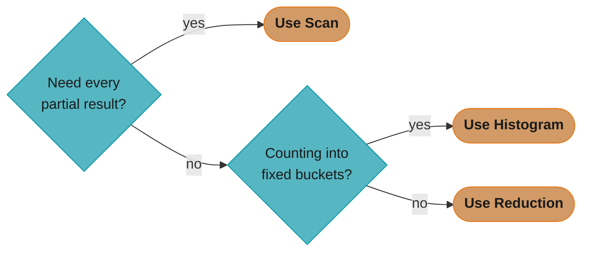
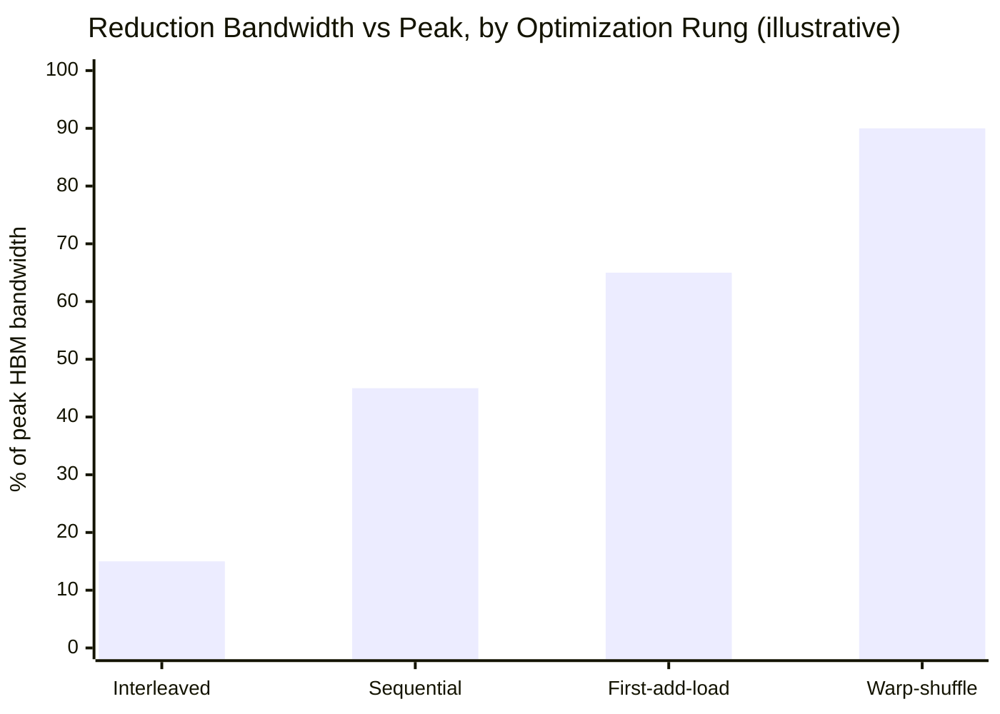
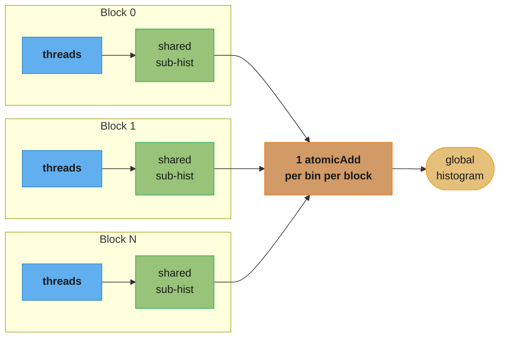
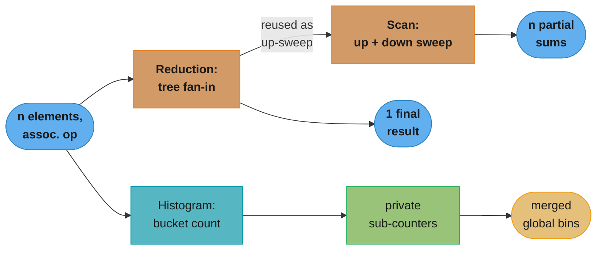

# Parallel Patterns: Reduction, Scan, Histogram

## 1. Concept Overview

Reduction, scan (prefix sum), and histogram are the three **canonical data-parallel
patterns** that recur inside almost every real GPU workload — a loss value is a
reduction, a compaction/sort pass is built on scan, and a per-bucket count (attention
score bucketing, image intensity binning, load-balancing token counts in MoE) is a
histogram. Unlike memory coalescing or occupancy tuning, which are properties of *any*
kernel, these three are **algorithmic templates**: a fixed shape of computation that a
GPU can execute in `O(log n)` parallel steps instead of the `O(n)` sequential steps a
CPU would take, provided the underlying operation is associative (sum, min, max,
logical AND/OR, and — with more care — bincount).

This module teaches the three patterns at the level a senior GPU interview actually
probes: what the pattern computes, why the naive parallel version is slow on real
hardware (divergence, bank conflicts, atomic contention), and the one canonical fix for
each. The full seven-rung optimization ladder for reduction (divergent → sequential →
first-add-during-load → loop unrolling → warp-shuffle → cooperative-groups grid
reduction) is deliberately **not** repeated here in full depth — it is a standalone,
principal-grade walkthrough in
[`../case_studies/implement_high_performance_reduction.md`](../case_studies/implement_high_performance_reduction.md).
This module gets you to rung 2 (the fix every interview expects you to reach
unprompted) and hands you off to the case study for rungs 3–7.

---

## 2. Intuition

> **One-line analogy**: Reduction is a single-elimination tournament bracket collapsing
> `n` competitors to 1 champion in `log2(n)` rounds; scan is that same bracket run twice
> — once climbing to the champion, once handing partial standings back down to every
> competitor; histogram is asking 10,000 people to shout out their favorite color and
> only recording the final tally, not who shouted first.

**Mental model**: All three patterns start from the same observation — a GPU has
thousands of threads that can each look at one element, but the *combination* step
(sum them, accumulate a running total, count occurrences) creates a serial dependency
that naive code turns into a bottleneck. Reduction breaks the combination into a binary
tree so `n-1` additions happen in `log2(n)` dependent steps instead of `n-1` fully
serial ones. Scan needs *every intermediate partial result*, not just the final one, so
it either repeats `log2(n)` tree-sweeps at higher total work (Hillis-Steele) or does one
sweep up and one sweep down at optimal work (Blelloch). Histogram's combination step —
"increment bucket `k`" — is not a tree at all; it is many threads racing to update a
small set of shared counters, so the fix is not algorithmic restructuring but
**reducing contention** by giving each block its own private copy of the counters.

**Why it matters**: Reduction underlies every loss computation, every norm, every
`torch.sum`/`torch.mean` call in a training loop; scan underlies stream compaction,
radix sort, sparse-matrix construction, and prefix-sum-based load balancing in MoE
routers; histogram underlies image processing, quantization calibration (computing
per-channel min/max/percentile buckets), and log-bucket latency tracking in production
GPU telemetry. An engineer who cannot explain *why* the naive version of any of these
three is slow — and what specifically fixes it — will visibly struggle on the single
most common "optimize this kernel" interview prompt.

**Key insight**: All three patterns face the same tension between **step complexity**
(how many sequential rounds of dependent work) and **work complexity** (total
operations across all threads) — and the "obviously parallel" first attempt at each
one gets the tradeoff wrong in a hardware-specific way (warp divergence for reduction,
`O(n log n)` total work for naive scan, atomic serialization for histogram). Fixing
each pattern is not about writing more parallel code — reduction, scan, and histogram
are all *already* fully parallel in their naive form — it is about making the
parallelism **hardware-friendly**: warp-aligned, bank-conflict-free, and
contention-free.

---

## 3. Core Principles

- **Associativity is the precondition.** A reduction/scan operator must be associative
  (`(a op b) op c == a op (b op c)`) for a tree restructuring to produce the same
  result as sequential application. Sum, min, max, and bitwise AND/OR/XOR all qualify;
  floating-point sum is associative *in exact math* but not in finite-precision
  arithmetic — reordering additions across a tree changes rounding error versus a
  sequential sum (see §12 Q&A on determinism).
- **Tree reduction is `O(log n)` steps, `O(n)` work.** A binary tree over `n` leaves has
  `log2(n)` levels and exactly `n-1` internal nodes — so a correctly implemented tree
  reduction does `n-1` additions total (same as a serial loop) but only `log2(n)`
  *sequential* rounds. For `n=1,048,576` (2^20), that is 20 rounds instead of
  1,048,575 sequential steps.
- **Naive interleaved addressing is warp-divergent *and* bank-conflicted.** The classic
  first-attempt reduction (`if (tid % (2*s) == 0)`) leaves active threads scattered
  within every warp rather than packed at the front, and its shared-memory addressing
  pattern maps multiple active threads to the same bank as `s` grows.
- **Sequential addressing fixes both defects with one line.** Changing the loop to
  `for (s = blockDim.x/2; s > 0; s >>= 1) if (tid < s)` packs active threads into a
  contiguous, warp-aligned prefix and accesses shared memory with unit stride — no
  divergence within a warp until the last 5 iterations, no bank conflicts at any
  iteration.
- **Scan needs every partial sum, not just the total.** This is the structural
  difference from reduction: `scan([3,1,4,1]) = [3,4,8,9]` (inclusive) keeps a running
  total at every position, so the algorithm cannot discard intermediate sums the way
  reduction does.
- **Hillis-Steele is step-efficient (`O(log n)` steps) but work-inefficient
  (`O(n log n)` total additions).** Every one of `log2(n)` steps does up to `n`
  additions, so total work is `n * log2(n)` — for `n=1,048,576` that is roughly
  20.9M additions versus the input's 1,048,576 elements.
- **Blelloch scan is work-efficient — `O(n)` total work** via a two-phase up-sweep
  (build the reduction tree, same shape as §5's reduction diagram) then down-sweep
  (distribute partial sums back down), at the cost of `2 * log2(n)` sequential steps
  instead of `log2(n)`.
- **Histogram privatization avoids global-atomic contention.** Routing every thread's
  `atomicAdd` at a small global bin array (e.g. 256 bins) serializes threads that land
  in the same bin across the *entire* grid; giving each block a private shared-memory
  sub-histogram confines contention to the threads within one block, then merges with
  one atomic per bin per block at the end.
- **A library call often beats a hand-rolled kernel.** Thrust's `reduce`/
  `inclusive_scan`/`exclusive_scan` and CuPy's `sum`/`cumsum` dispatch CUB's
  auto-tuned, architecture-specific implementations — matching or beating a
  hand-written kernel unless you need to *fuse* the reduction/scan into a larger
  computation (see §9).

---

## 4. Types / Architectures / Strategies



Reduction, scan, and histogram are easy to conflate in an interview because all
three "combine many values into few" — this decision path is the fast check:
scan is the only one of the three that needs every intermediate partial value,
and histogram is the only one whose combination step is per-bucket counting
rather than a single associative accumulation.

### 4.1 Reduction

Collapse `n` values to 1 via an associative operator (sum, min, max). The interview
progression:

1. **Naive interleaved addressing** — `if (tid % (2*s) == 0)` — warp-divergent,
   bank-conflicted. Never write this in production; know it as the "what's wrong with
   this kernel" starting point.
2. **Sequential addressing** — `if (tid < s)` — the fix every interviewer expects you
   to reach in under a minute. This module stops here; see §14 and the case study for
   what comes after.
3–7. First-add-during-load, loop unrolling, warp-shuffle (`__shfl_down_sync`),
   cooperative-groups grid reduction — the full ladder, in
   [`../case_studies/implement_high_performance_reduction.md`](../case_studies/implement_high_performance_reduction.md).
   Warp-level shuffle reduction specifically is covered in depth in
   [`../warp_level_primitives_and_cooperative_groups/`](../warp_level_primitives_and_cooperative_groups/).



Each rung closes more of the gap to peak HBM bandwidth: this module gets you
only to rung 2 (Sequential addressing); the remaining climb to the
warp-shuffle rung is the case study's full seven-rung ladder.

### 4.2 Scan (Prefix Sum)

Compute a running accumulation across `n` values.

- **Inclusive scan**: `out[i] = in[0] + in[1] + ... + in[i]` — position `i` includes
  its own value.
- **Exclusive scan**: `out[i] = in[0] + ... + in[i-1]`, `out[0] = identity` (0 for sum)
  — position `i` excludes its own value. Exclusive scan is what stream compaction and
  bucket-offset computation need (the offset for element `i` must not include element
  `i` itself).
- **Hillis-Steele** — step-efficient, `O(n log n)` work; simplest to implement; wins
  for small-to-medium `n` where step count dominates over redundant work.
- **Blelloch (work-efficient)** — `O(n)` work via up-sweep/down-sweep; wins at large
  `n` where the `log n` work multiplier becomes the bottleneck. CUB's and Thrust's
  scan implementations use work-efficient multi-block variants derived from this
  structure.

```mermaid
xychart-beta
    title "Total Work per Element (work / n) as n Grows"
    x-axis ["n=1024", "n=65536", "n=1048576"]
    y-axis "Additions per input element" 0 --> 22
    bar "Hillis-Steele" [10, 16, 20]
    bar "Blelloch" [2, 2, 2]
```



Hillis-Steele's per-element work grows with `log2(n)` (10 at `n=1024`, 20 at
`n=1,048,576` — matching §6.3/§6.4's 20.9M-addition figure), while Blelloch's
stays flat at roughly 2 — the `O(n log n)` vs `O(n)` gap made visible.

### 4.3 Histogram

Count occurrences of each value (or value range) into a fixed set of bins.

- **Global-atomic histogram** — every thread does `atomicAdd(&hist[bin], 1)` directly
  on the global-memory histogram. Correct, but throughput collapses as bin count
  shrinks relative to thread count (worst case: all threads hit one bin).
- **Privatized (shared-memory) histogram** — each block maintains its own
  `__shared__` sub-histogram, accumulates locally, then merges into the global
  histogram with one atomic per bin per block. Contention drops from
  "every active thread in the grid" to "the active threads within one block."
- **Multi-level privatization** — for very large bin counts that do not fit in shared
  memory, add a warp-private layer (registers or a smaller shared segment per warp)
  before the block-private merge; not needed for the 256-bin case this module covers
  but worth knowing as the next rung.



Contention scopes down from grid-wide to block-local: each block accumulates
into its own private shared sub-histogram, and exactly one atomic per bin per
block folds the result into the global histogram (mechanics in §6.6).

### 4.4 Library vs. Custom Kernel

For all three patterns, ask **"does this need to fuse with something else?"** before
hand-rolling:

| Question | If "no" → | If "yes" → |
|----------|-----------|------------|
| Is this a standalone sum/min/max/scan/histogram over one array? | Call Thrust/CUB/CuPy | — |
| Does it need to fuse with another op (e.g. sum-of-squares then normalize, softmax's max-then-exp-then-sum)? | — | Hand-roll a fused kernel |
| Is the array small enough to fit one block (`n <= 1024`)? | Either works; library still simpler | Hand-roll only if fusing |

See [`../cuda_math_and_dnn_libraries/`](../cuda_math_and_dnn_libraries/) for the
general library-vs-custom-kernel decision and CUB/Thrust/CUTLASS coverage.

---

## 5. Architecture Diagrams



Scan literally reuses reduction's tree as its up-sweep phase (§12's "how are
reduction and scan related" answer), while histogram abandons tree structure
entirely in favor of contention reduction via privatization — the three
patterns share an input shape but diverge sharply in how they combine it.

### Sequential-Addressing Reduction Tree (n=16 -> 1)

```
Sequential-addressing reduction, n=16 (shared array sdata[0..15], tid = threadIdx.x)

step  s   active tid    operation                          live values (index 0..)
---------------------------------------------------------------------------------
 0    -   (load)         sdata[tid] = input[tid]            a0 a1 a2 a3 a4 a5 a6 a7
                                                              a8 a9 a10 a11 a12 a13 a14 a15
 1    8   tid < 8        sdata[tid] += sdata[tid+8]          b0 b1 b2 b3 b4 b5 b6 b7  (rest stale)
                         b0=a0+a8   b1=a1+a9  ...  b7=a7+a15
 2    4   tid < 4        sdata[tid] += sdata[tid+4]          c0 c1 c2 c3
                         c0=b0+b4   c1=b1+b5  c2=b2+b6  c3=b3+b7
 3    2   tid < 2        sdata[tid] += sdata[tid+2]          d0 d1
                         d0=c0+c2   d1=c1+c3
 4    1   tid < 1        sdata[tid] += sdata[tid+1]          result
                         result = d0+d1 = sum(a0..a15)

4 steps = log2(16); 15 additions total = n-1 -> O(n) work, O(log n) depth.
Active threads at every step are a contiguous prefix (tid < s) -> no warp
divergence once s <= 32, and stride-1 addressing at every step -> no bank conflicts.
```

Each step halves both the active-thread count and the stride between paired
elements; because the surviving threads are always `tid < s` — a contiguous block,
not scattered by a modulo test — the warp scheduler never has to serialize divergent
branches within a single warp until the final 5 steps operate on fewer than 32
threads total.

### Hillis-Steele Scan — Inclusive vs. Exclusive (one step shown, n=8)

```
Hillis-Steele inclusive scan, n=8, input = digits of pi: 3 1 4 1 5 9 2 6

index:          0   1   2   3   4   5   6   7
input:          3   1   4   1   5   9   2   6

step d=1: out[i] = in[i] + in[i-1]  (only where i >= d; else out[i] = in[i])
after d=1:      3   4   5   5   6  14  11   8
step d=2: out[i] = in[i] + in[i-2]  (i >= d)
after d=2:      3   4   8   9  11  19  17  22
step d=4: out[i] = in[i] + in[i-4]  (i >= d)
after d=4:      3   4   8   9  14  23  25  31   <- inclusive result (running sums)

3 steps = log2(8); each step touches up to 8 elements -> up to 24 adds total
(> n-1=7 for plain reduction) -- the O(n log n) work cost of Hillis-Steele.

Exclusive scan = inclusive scan shifted right by one position, identity (0) at index 0:
exclusive:      0   3   4   8   9  14  23  25   <- exclusive[i] = inclusive[i-1]
```

Inclusive scan keeps element `i`'s own value in its running total; exclusive scan
does not — the shift-and-prepend-identity relationship is the fastest way to convert
between them without rerunning the whole algorithm, and it is exactly what
`thrust::exclusive_scan` does internally relative to its inclusive kernel.

### Histogram Privatization (256-bin example, 4 blocks)

```
Global-atomic histogram (BROKEN under contention):
  Block 0 threads --\
  Block 1 threads ---+--> atomicAdd(&hist_global[bin], 1)   <- ALL blocks contend
  Block 2 threads ---+     on the SAME 256 global-memory counters
  Block 3 threads --/

Privatized histogram (FIX):
  Block 0 threads --> atomicAdd(&sHist0[bin], 1)  (shared mem, block-local)
  Block 1 threads --> atomicAdd(&sHist1[bin], 1)  (shared mem, block-local)
  Block 2 threads --> atomicAdd(&sHist2[bin], 1)  (shared mem, block-local)
  Block 3 threads --> atomicAdd(&sHist3[bin], 1)  (shared mem, block-local)
                                |     |     |     |
                                v     v     v     v
                   one atomicAdd(&hist_global[bin], sHistN[bin]) per bin per block
                   (256 atomics/block instead of thousands of atomics/block)
```

Contention scope shrinks from "every thread in the grid that shares a bin" to
"every thread in one block that shares a bin" — and the final merge trades
thousands of contended per-element atomics for exactly 256 uncontended
(or lightly contended) per-block atomics.

---

## 6. How It Works — Detailed Mechanics

### 6.1 Reduction: Naive vs. Sequential Addressing

```cpp
// BROKEN: interleaved addressing -- warp-divergent AND bank-conflicted
__global__ void reduceNaiveInterleaved(const float* g_idata, float* g_odata, int n) {
    extern __shared__ float sdata[];
    unsigned int tid = threadIdx.x;
    unsigned int i   = blockIdx.x * blockDim.x + threadIdx.x;
    sdata[tid] = (i < n) ? g_idata[i] : 0.0f;
    __syncthreads();

    for (unsigned int s = 1; s < blockDim.x; s *= 2) {
        if (tid % (2 * s) == 0) {          // active threads scattered within a warp
            sdata[tid] += sdata[tid + s];  // stride grows -> bank conflicts
        }
        __syncthreads();
    }
    if (tid == 0) g_odata[blockIdx.x] = sdata[0];
}
```

```cpp
// FIX: sequential addressing -- contiguous active prefix, unit-stride shared access
__global__ void reduceSequentialAddressing(const float* g_idata, float* g_odata, int n) {
    extern __shared__ float sdata[];
    unsigned int tid = threadIdx.x;
    unsigned int i   = blockIdx.x * blockDim.x + threadIdx.x;
    sdata[tid] = (i < n) ? g_idata[i] : 0.0f;
    __syncthreads();

    for (unsigned int s = blockDim.x / 2; s > 0; s >>= 1) {
        if (tid < s) {                     // contiguous active prefix
            sdata[tid] += sdata[tid + s];  // stride 1 within the active range
        }
        __syncthreads();
    }
    if (tid == 0) g_odata[blockIdx.x] = sdata[0];
}
```

At `blockDim.x=256`, the naive kernel's first iteration (`s=1`) leaves only tid
`0, 2, 4, ... 254` active — 128 of 256 threads, but scattered two apart, so within
every 32-thread warp exactly half the lanes are active and half masked, forcing the
warp scheduler to serialize the active and inactive paths every iteration. The fixed
kernel's first iteration (`s=128`) leaves tid `0..127` active — 4 full warps run,
4 full warps retire entirely (no divergence, no wasted cycles), and every access
`sdata[tid]`/`sdata[tid+s]` lands in a distinct bank at unit stride.

### 6.2 Reduction via Library: Thrust and CuPy

```cpp
#include <thrust/device_vector.h>
#include <thrust/reduce.h>
#include <thrust/execution_policy.h>

thrust::device_vector<float> d_data(1 << 24, 1.0f);   // 16.78M elements
float total = thrust::reduce(
    thrust::device, d_data.begin(), d_data.end(), 0.0f, thrust::plus<float>());
// Thrust dispatches CUB's tuned multi-pass reduction -- matches or beats a
// hand-rolled single-kernel reduction without writing a single line of CUDA.
```

```python
import cupy as cp

x = cp.random.rand(1 << 24, dtype=cp.float32)   # 16.78M elements
total = cp.sum(x)      # one call -- CUB-backed tree reduction under the hood
row_max = cp.max(x)    # same code path, associative op swapped for max
```

**The point**: unless the reduction must fuse into a larger kernel (e.g. computing a
row-wise softmax denominator inline with the exponentiation), `thrust::reduce` and
`cupy.sum` are the correct first choice — they already implement the sequential-
addressing fix and everything past it (§4.1, rungs 3–7).

### 6.3 Scan: Hillis-Steele (Step-Efficient, Single Block)

```cpp
// Hillis-Steele inclusive scan -- O(log n) steps, O(n log n) total work
__global__ void scanHillisSteele(float* g_data, int n) {
    extern __shared__ float temp[];
    int tid = threadIdx.x;
    temp[tid] = (tid < n) ? g_data[tid] : 0.0f;
    __syncthreads();

    for (int d = 1; d < n; d *= 2) {
        float addend = 0.0f;
        if (tid >= d) addend = temp[tid - d];   // read before any thread overwrites
        __syncthreads();
        if (tid >= d) temp[tid] += addend;
        __syncthreads();
    }
    g_data[tid] = temp[tid];   // inclusive result
}
```

`log2(n)` steps, each doing up to `n` additions -> total work `n * log2(n)`. For
`n=1024`, that is `1024 * 10 = 10,240` additions versus `n-1=1023` for a reduction
over the same input — roughly 10x more total arithmetic to get every partial sum
instead of just the final one.

### 6.4 Scan: Blelloch Work-Efficient (Up-Sweep / Down-Sweep)

```cpp
// Work-efficient (Blelloch) exclusive scan -- O(n) total work, 2*log2(n) steps
// n must be a power of two; temp[] sized n, in shared memory.

// Up-sweep (reduce): builds the same tree shape as the §5 reduction diagram
for (int d = 0; d < log2n; d++) {
    __syncthreads();
    int stride = 1 << (d + 1);
    if (tid % stride == 0) {
        temp[tid + stride - 1] += temp[tid + (stride >> 1) - 1];
    }
}
__syncthreads();
if (tid == 0) temp[n - 1] = 0.0f;   // clear the root -> converts to exclusive scan
__syncthreads();

// Down-sweep: traverse back down, distributing partial sums to their final slots
for (int d = log2n - 1; d >= 0; d--) {
    int stride = 1 << (d + 1);
    if (tid % stride == 0) {
        float left  = temp[tid + (stride >> 1) - 1];
        temp[tid + (stride >> 1) - 1] = temp[tid + stride - 1];
        temp[tid + stride - 1] += left;
    }
    __syncthreads();
}
```

Up-sweep does exactly `n-1` additions (identical to a reduction); down-sweep does
another `n-1` additions and swaps — total work is `O(n)`, not `O(n log n)`, at the
cost of `2 * log2(n)` sequential rounds instead of `log2(n)`. For `n=1,048,576`,
Blelloch does ~2.1M operations across 40 rounds versus Hillis-Steele's ~20.9M
operations across 20 rounds — 10x less total work for 2x more rounds. CUB's
multi-block scan uses this work-efficient structure internally.

### 6.5 Scan via Library: Thrust and CuPy

```cpp
#include <thrust/scan.h>

thrust::device_vector<float> d_in(1 << 20, 1.0f);
thrust::device_vector<float> d_out(1 << 20);

thrust::inclusive_scan(d_in.begin(), d_in.end(), d_out.begin());
thrust::exclusive_scan(d_in.begin(), d_in.end(), d_out.begin(), 0.0f);
```

```python
import cupy as cp

x = cp.ones(1 << 20, dtype=cp.float32)
inclusive = cp.cumsum(x)                       # inclusive scan
exclusive = cp.cumsum(x) - x                   # cheap exclusive derivation for sum
# (CuPy also exposes cupyx.scatter_add / cub-backed primitives for fused cases)
```

Both dispatch CUB's work-efficient multi-block scan — a hand-rolled Hillis-Steele
kernel is the right thing to *understand*, but rarely the right thing to *ship* for
a standalone scan over more than one block's worth of data.

### 6.6 Histogram: Global Atomic vs. Privatized

```cpp
#define NUM_BINS 256

// BROKEN at scale: every thread contends directly on 256 global-memory counters
__global__ void histogramGlobalAtomic(const unsigned char* data, int n, unsigned int* hist) {
    int i = blockIdx.x * blockDim.x + threadIdx.x;
    if (i < n) {
        atomicAdd(&hist[data[i]], 1);
    }
}
```

```cpp
// FIX: per-block shared-memory sub-histogram, merged with one atomic per bin
__global__ void histogramPrivatized(const unsigned char* data, int n, unsigned int* hist) {
    __shared__ unsigned int sHist[NUM_BINS];

    for (int b = threadIdx.x; b < NUM_BINS; b += blockDim.x) sHist[b] = 0;
    __syncthreads();

    int i      = blockIdx.x * blockDim.x + threadIdx.x;
    int stride = blockDim.x * gridDim.x;
    for (; i < n; i += stride) {
        atomicAdd(&sHist[data[i]], 1);   // contention confined to one block's warps
    }
    __syncthreads();

    for (int b = threadIdx.x; b < NUM_BINS; b += blockDim.x) {
        if (sHist[b] > 0) atomicAdd(&hist[b], sHist[b]);   // 256 merges/block, not n
    }
}
```

Shared-memory atomics are also serviced by a per-SM atomic unit that is faster than
the global-memory atomic path, so privatization wins twice: less contention, and the
contention that remains resolves faster per collision.

### 6.7 Histogram via Library: CuPy

```python
import cupy as cp

frame = cp.random.randint(0, 256, size=1920 * 1080, dtype=cp.uint8)
hist, edges = cp.histogram(frame, bins=256, range=(0, 256))
# CuPy dispatches a CUB-backed cub::DeviceHistogram::HistogramEven call --
# already privatized/multi-level internally.
```

CUB's `DeviceHistogram` (wrapped by CuPy's `histogram`) implements multi-level
privatization automatically — the single-block-private version in §6.6 is the
concept to understand for an interview; `cub::DeviceHistogram` is what you call in
production.

---

## 7. Real-World Examples

- **PyTorch `torch.sum`/`torch.mean`/`torch.norm`** dispatch a reduction kernel built
  on the same sequential-addressing-and-beyond ladder, tuned per architecture via
  ATen's CUDA backend.
- **Radix sort** (used in Thrust's `sort`, CUB's `DeviceRadixSort`, and GPU database
  engines) uses an exclusive scan per digit pass to compute each element's output
  offset — scan is the load-bearing primitive, not sorting logic itself.
- **MoE token routing** (Mixtral, DeepSeek-V3; see
  [`../../llm/mixture_of_experts/`](../../llm/mixture_of_experts/)) uses an exclusive
  scan over per-expert token counts to compute the contiguous write offset for each
  expert's token bucket before the all-to-all dispatch.
- **cuDNN/TensorRT INT8 calibration** builds a per-channel activation histogram to
  choose a quantization threshold (percentile clipping) — a direct instance of the
  privatized-histogram pattern at calibration time, not inference time.
- **Nsight Compute's own latency/occupancy reports** are built from device-side
  histograms bucketing warp-stall reasons — the same privatization pattern applied
  to profiling counters instead of pixel or token data.
- **Softmax's row-max and row-sum** (the numerator/denominator of
  `softmax(x) = exp(x - max(x)) / sum(exp(x - max(x)))`) are two reductions per row,
  which is exactly why FlashAttention fuses them into one kernel pass instead of
  calling a library reduction twice — see §9.

---

## 8. Tradeoffs

| Pattern variant | Steps | Total work | When it wins |
|---|---|---|---|
| Reduction: naive interleaved | `log2(n)` | `O(n)` | Never in production — teaching baseline only |
| Reduction: sequential addressing | `log2(n)` | `O(n)` | Correct baseline once divergence/conflicts matter; still not the ceiling (see case study) |
| Scan: Hillis-Steele | `log2(n)` | `O(n log n)` | Small-to-medium `n`, single block, simplicity over peak throughput |
| Scan: Blelloch (work-efficient) | `2 log2(n)` | `O(n)` | Large `n`, multi-block — what CUB's scan uses internally |
| Histogram: global atomic | 1 pass | `n` atomics, high contention | Very sparse bin usage or bin count >= thread count (contention is rare) |
| Histogram: privatized | 1 pass + 1 merge | `n` atomics (block-local) + `bins * blocks` global atomics | Dense bin usage, small bin count relative to thread count (the common case) |

| Approach | Peak throughput | Engineering cost | Fusability |
|---|---|---|---|
| Hand-rolled kernel | Matches library only with the full optimization ladder applied | High (correctness + tuning) | Full — can fuse with adjacent ops |
| Thrust / CuPy | At or near CUB's tuned ceiling | Near zero | None — standalone kernel launch, extra HBM round-trip |
| CUB directly (C++) | Same ceiling as Thrust, less launch overhead | Low-medium (template API) | Partial — composable as a device-side call inside your own kernel via `cub::BlockReduce`/`cub::BlockScan` |

---

## 9. When to Use / When NOT to Use

**Use a library call (`thrust::reduce`/`inclusive_scan`, `cupy.sum`/`cumsum`/
`histogram`) when:**
- The operation stands alone — no adjacent computation to fuse it with.
- You need it correct and reasonably fast *today*, not after a tuning pass.
- The array spans multiple blocks/grids — CUB's multi-block reduction and scan
  handle the grid-level combination step (atomics or a second kernel launch) that a
  naive single-block kernel does not.

**Hand-roll a kernel when:**
- You need to **fuse** the reduction/scan into a larger kernel to avoid an HBM
  round-trip — the canonical example is FlashAttention fusing the row-max reduction,
  the exponentiation, and the row-sum reduction into one kernel pass instead of three
  separate library calls each reading/writing the full activation tensor.
- The reduction is over a small, fixed-size array already resident in registers or
  shared memory as a byproduct of other work in the kernel (e.g. a per-thread partial
  sum that needs one final warp-shuffle reduction before writing out).
- You are specifically being asked, in an interview, to demonstrate you understand
  the mechanics — which is exactly this module's purpose.

**Do NOT hand-roll when:**
- The array is large, standalone, and the operation is a supported Thrust/CUB
  primitive — a from-scratch multi-block reduction or scan is real engineering effort
  to merely re-derive what CUB already ships, tuned per architecture.
- Bin count is large and unknown ahead of time — `cub::DeviceHistogram` already
  implements multi-level privatization; a hand-rolled single-level version will
  under-perform once bins exceed shared-memory capacity (see §12 Q&A).

---

## 10. Common Pitfalls

**BROKEN -> FIX: interleaved addressing reduction**

```cpp
// BROKEN
for (unsigned int s = 1; s < blockDim.x; s *= 2) {
    if (tid % (2 * s) == 0) { sdata[tid] += sdata[tid + s]; }
    __syncthreads();
}
```
```cpp
// FIX
for (unsigned int s = blockDim.x / 2; s > 0; s >>= 1) {
    if (tid < s) { sdata[tid] += sdata[tid + s]; }
    __syncthreads();
}
```
The modulo test scatters active threads across every warp instead of packing them
into a contiguous prefix, forcing intra-warp serialization at every step; the fixed
version keeps active threads warp-aligned and contiguous, eliminating divergence
until fewer than 32 threads remain active.

1. **Forgetting `__syncthreads()` between reduction/scan steps.** Every step reads
   values another thread wrote in the previous step; skipping the barrier produces a
   race where some threads read stale data — the result is silently wrong, not a
   crash, which makes it a debugging trap. See
   [`../synchronization_and_atomics/`](../synchronization_and_atomics/).
2. **Reading `sdata[tid + s]` after another thread has already overwritten it in the
   Hillis-Steele scan.** Unlike reduction, scan's read set and write set overlap
   across the full active range (not a shrinking half), so the read must happen
   *before* any write in the same step — the double-buffering pattern (read into a
   register, syncthreads, then write) in §6.3 exists specifically to prevent this.
3. **Global-atomic histogram with a small bin count and a large grid.** With
   `NUM_BINS=256` and a 1080p frame (2,073,600 threads), every bin is hit by roughly
   8,100 threads on average — a global-atomic histogram serializes all of them at
   the same 256 memory locations, collapsing throughput; privatize per block (§6.6).
4. **Not clearing shared memory before accumulating a privatized histogram.**
   `__shared__` memory is not zero-initialized; skipping the zeroing loop produces
   garbage initial counts that silently corrupt every bin's final tally.
5. **Assuming floating-point tree-reduction gives bit-identical results to a serial
   sum.** Reordering additions changes rounding error — a GPU tree reduction and a
   CPU serial sum over the same float array can differ in the last few bits, which
   is expected, not a bug (see §12).
6. **Choosing Hillis-Steele for a very large single-block scan without checking
   `n log n` cost.** At `n=1024`, Hillis-Steele's ~10x work overhead versus
   Blelloch is invisible; at `n=1,048,576` in a persistent-kernel or grid-scan
   context, the same overhead becomes the dominant cost — reach for the
   work-efficient variant (or a library call) once `n` grows past a few thousand.

---

## 11. Technologies & Tools

| Tool | Provides | Notes |
|---|---|---|
| Thrust | `thrust::reduce`, `inclusive_scan`, `exclusive_scan` | Header-only C++ template library shipped with the CUDA Toolkit; STL-like API |
| CUB | `cub::BlockReduce`, `cub::BlockScan`, `cub::DeviceReduce`, `cub::DeviceScan`, `cub::DeviceHistogram` | Lower-level than Thrust — composable *inside* your own kernel via block-level primitives, or as standalone device-wide calls |
| CuPy | `cupy.sum`/`cupy.max`/`cupy.min`, `cupy.cumsum`, `cupy.histogram` | Python, NumPy-compatible API, CUB-backed under the hood |
| Numba CUDA | `@cuda.reduce` decorator | Python JIT; simpler than hand-writing a kernel, less tuned than CUB |
| PyTorch / cuDNN | `torch.sum`, `torch.cumsum`, fused-kernel reductions inside attention/normalization ops | Production DL framework path; fusion is the reason custom kernels persist here |
| Nsight Compute | Warp-divergence %, shared-memory bank-conflict count, atomic-throughput metrics | Verifies the sequential-addressing/privatization fixes actually removed the predicted stalls — see [`../profiling_and_performance_analysis/`](../profiling_and_performance_analysis/) |

See [`../cuda_math_and_dnn_libraries/`](../cuda_math_and_dnn_libraries/) for the
general Thrust/CUB/CUTLASS ecosystem and the library-vs-custom-kernel decision
framework in full depth.

---

## 12. Interview Questions with Answers

**Why is the naive interleaved-addressing reduction (`if (tid % (2*s) == 0)`) slow?**
It is both warp-divergent and bank-conflicted. The modulo test leaves active threads
scattered throughout every warp instead of packed contiguously, forcing the warp
scheduler to serialize active and inactive lanes at every step, and the growing
stride `s` causes multiple active threads to map to the same shared-memory bank as
the loop progresses. Sequential addressing (`if (tid < s)`) fixes both defects with
a one-line change to the loop bounds and index test.

**What does sequential addressing change, mechanically, versus interleaved
addressing?** It swaps the loop and index test so active threads stay a contiguous,
warp-aligned prefix at every step instead of a modulo-scattered set. Concretely,
`for (s=1; s<blockDim.x; s*=2) if (tid % (2*s)==0)` becomes
`for (s=blockDim.x/2; s>0; s>>=1) if (tid < s)`, and the shared-memory access
pattern becomes unit-stride within the active range, removing the bank conflicts
that grow with `s` in the naive version.

**Why does a global-atomic histogram collapse under contention, and what fixes
it?** Every thread's `atomicAdd` targets one of a small number of global-memory
bins, so threads across the entire grid that land in the same bin serialize against
each other. With 256 bins and millions of threads, average contention per bin can
be in the thousands; privatization gives each block its own shared-memory
sub-histogram (fast, block-local atomics), then merges into the global histogram
with exactly one atomic per bin per block, confining contention to a single
block's threads.

**What is the complexity difference between Hillis-Steele and Blelloch scan?**
Hillis-Steele is step-efficient at `O(log n)` sequential steps but work-inefficient
at `O(n log n)` total additions, because every step processes up to `n` elements.
Blelloch is work-efficient at `O(n)` total additions via an up-sweep/down-sweep
structure, at the cost of `2 * log2(n)` steps instead of `log2(n)` — twice the
rounds for roughly `log2(n)/2` times less total work at large `n`.

**What is the difference between inclusive and exclusive scan?**
Inclusive scan's output at position `i` includes the input value at `i` itself
(`out[i] = sum(in[0..i])`); exclusive scan's output at `i` excludes it
(`out[i] = sum(in[0..i-1])`, `out[0] = identity`). Exclusive scan is what stream
compaction and sort need, because the write offset for element `i` must be
computed from everything *before* it, not including it.

**When should you just call Thrust/CUB/CuPy instead of hand-rolling a reduction,
scan, or histogram kernel?** Call the library whenever the operation stands alone
with no adjacent computation to fuse it with. Thrust's `reduce`/`inclusive_scan`
and CuPy's `sum`/`cumsum`/`histogram` dispatch CUB's architecture-tuned
implementations, which already include everything past sequential addressing —
hand-roll only when you need to fuse the pattern into a larger kernel to avoid an
extra HBM round-trip, or when an interviewer is specifically testing whether you
understand the mechanics.

**What is the time and work complexity of a tree reduction?**
A tree reduction over `n` elements takes `O(log n)` sequential steps and `O(n)`
total work. The parallelism comes from collapsing what would be `n-1` sequential
dependent additions into `log2(n)` sequential rounds (the tree depth), each round
doing many additions in parallel while the total addition count stays `n-1`,
matching a serial sum.

**Concretely, what does a bank conflict look like in the naive interleaved
reduction?** Shared memory has 32 banks of 4 bytes each, and as the stride `s` in
the naive loop grows, active threads increasingly map to the same bank modulo 32.
At `s=16` with `blockDim.x=256`, groups of active threads collide 2-way on
shared-memory banks, serializing what should be a single-cycle broadcast into
multiple cycles.

**How do you combine per-block partial reductions into one final value?**
Launch the reduction kernel once per block to produce one partial sum per block
into a small output array. From there, either launch a second (smaller) reduction
kernel over that array, or use a single atomic per block to accumulate directly
into a global result — the second approach trades a kernel-launch round-trip for a
small amount of atomic contention proportional to the (small) number of blocks,
not the (large) number of threads.

**Why is Hillis-Steele called "step-efficient" but not "work-efficient"?**
"Step-efficient" refers to the number of sequential rounds (`log2(n)`, optimal for
a parallel scan); "work-efficient" refers to total operations across all threads.
Hillis-Steele does up to `n` additions at every one of its `log2(n)` steps, so
total work is `n * log2(n)` — more total arithmetic than the theoretical minimum
of `O(n)`, even though it uses the theoretically minimal number of steps.

**What is the up-sweep/down-sweep structure of a Blelloch scan?**
Up-sweep builds a reduction tree in place (the same shape as a plain reduction,
`n-1` additions total, `log2(n)` steps), leaving partial sums at power-of-two
offsets; the root is then zeroed to seed an exclusive scan. Down-sweep traverses
the tree back down for another `log2(n)` steps, at each node swapping a partial sum
into its sibling's slot and adding — distributing the accumulated totals to their
final output positions.

**How exactly does histogram privatization avoid contention, step by step?**
Each block first zeroes a `__shared__` sub-histogram sized to the bin count, then
every thread in the block does `atomicAdd` against that block-local shared array
while processing its assigned data. Contention is now scoped to one block's warps
instead of the whole grid; after a `__syncthreads()`, the block merges its
sub-histogram into the global histogram with one `atomicAdd` per bin, so the total
number of global-memory atomics becomes `bins * numBlocks` instead of one per input
element.

**When does histogram privatization itself become a bottleneck?**
It stops helping once the bin count outgrows a per-block sub-histogram's shared-
memory budget, or once bin count approaches thread count. Concretely, a per-block
sub-histogram must fit within the SM's shared-memory budget (up to 228 KB on
Hopper, shared with other uses); once it does not, the fix is multi-level
privatization — a smaller warp-private layer merged into the block-private layer
before the final global merge — which is what `cub::DeviceHistogram` implements
internally.

**How are reduction and scan related?**
Scan is a strict generalization of reduction that retains every intermediate
partial sum instead of discarding all but the final one; the last element of an
inclusive scan *is* the reduction result. Structurally, Blelloch's scan up-sweep
phase is literally the reduction tree from §5 — scan reuses reduction's
tree-building step and adds a down-sweep to recover the discarded partial sums.

**Why might `cupy.sum` or `thrust::reduce` outperform a hand-rolled two-kernel
reduction you write yourself?** Because they dispatch CUB's implementation, which
already applies every rung of the optimization ladder and is re-tuned per compute
capability by NVIDIA. That ladder runs sequential addressing, first-add-during-load,
loop unrolling, warp-shuffle, and a grid-level combine step via atomics or
cooperative groups — matching it by hand requires implementing and validating all
seven rungs, which is exactly the depth covered in
[`../case_studies/implement_high_performance_reduction.md`](../case_studies/implement_high_performance_reduction.md).

**Does a GPU tree-reduction give the exact same floating-point result as a CPU
serial sum over the same data?** Not necessarily, because floating-point addition
is not associative in finite precision. Reordering the additions — serial
left-to-right on a CPU versus tree-paired on a GPU — changes accumulated rounding
error, typically in the last few bits of the mantissa; this is expected numerical
behavior, not a correctness bug, but it means bit-exact reproducibility across CPU
and GPU sums should never be assumed in tests.

---

## 13. Best Practices

1. **Default to the library call** (`thrust::reduce`/`inclusive_scan`, `cupy.sum`/
   `cumsum`/`histogram`, or `cub::DeviceReduce`/`DeviceScan`/`DeviceHistogram`
   directly) unless you specifically need to fuse the pattern into a larger kernel.
2. **Never ship interleaved-addressing reduction or global-atomic histogram past a
   correctness prototype** — both have a one-line-to-moderate fix (sequential
   addressing; privatization) that removes their worst-case behavior.
3. **Reach for Blelloch (or a library scan) once `n` grows past a few thousand** —
   Hillis-Steele's `O(n log n)` work overhead is invisible at small `n` and
   dominant at large `n`.
4. **Zero shared memory explicitly before any privatized accumulation** — it is not
   zero-initialized by the hardware.
5. **Profile the divergence/bank-conflict/atomic-throughput metrics in Nsight
   Compute after applying a fix** — confirm the predicted improvement actually
   happened rather than assuming it did; see
   [`../profiling_and_performance_analysis/`](../profiling_and_performance_analysis/).
6. **Never assert bit-exact reproducibility for floating-point reductions/scans**
   across different hardware, block sizes, or CPU-vs-GPU — validate with a
   tolerance, not equality.
7. **Read the full seven-rung ladder in the case study before an interview** — this
   module's stopping point (sequential addressing) is the expected minimum, not the
   ceiling, of what "optimize a reduction" interviews probe.

---

## 14. Case Study

**Scenario:** A real-time video analytics pipeline computes a 256-bin luminance
histogram for every incoming 1080p frame (1920x1080 = 2,073,600 pixels) at 60 fps,
feeding an auto-exposure control loop that needs each frame's histogram within its
16.6 ms frame budget. The first implementation used a straightforward global-atomic
histogram kernel and could not keep up.

**Pipeline:**
```
Camera sensor --> frame buffer (uint8, 1920x1080) --> [histogram kernel] --> 256 bins
                                                              |
                                                              v
                                              auto-exposure control loop (next frame)
```

**Kernel — the naive attempt:**

```cpp
#define NUM_BINS 256

// BROKEN: every one of 2,073,600 threads may contend on the same 256 global bins
__global__ void frameHistogramNaive(const unsigned char* frame, int n, unsigned int* hist) {
    int i = blockIdx.x * blockDim.x + threadIdx.x;
    if (i < n) {
        atomicAdd(&hist[frame[i]], 1);
    }
}
```

Measured on an A100 with 256-thread blocks (8,100 blocks for 2,073,600 pixels): the
naive kernel took **4.8 ms/frame**, a 208 fps ceiling in isolation — but with the
rest of the pipeline's compute budget consumed elsewhere, it left no headroom under
the 60 fps (16.6 ms) target once queued behind other frame-processing kernels.
Nsight Compute attributed the bulk of that time to atomic-unit stalls: every
one of ~8,100 threads targeting a bright, common luminance value contended
directly on the same global-memory counter.

**Fix — privatized per-block sub-histogram:**

```cpp
// FIX: each block accumulates into __shared__ sHist, merges once per bin
__global__ void frameHistogramPrivatized(const unsigned char* frame, int n, unsigned int* hist) {
    __shared__ unsigned int sHist[NUM_BINS];
    for (int b = threadIdx.x; b < NUM_BINS; b += blockDim.x) sHist[b] = 0;
    __syncthreads();

    int i      = blockIdx.x * blockDim.x + threadIdx.x;
    int stride = blockDim.x * gridDim.x;
    for (; i < n; i += stride) {
        atomicAdd(&sHist[frame[i]], 1);
    }
    __syncthreads();

    for (int b = threadIdx.x; b < NUM_BINS; b += blockDim.x) {
        if (sHist[b] > 0) atomicAdd(&hist[b], sHist[b]);
    }
}
```

Measured under the same conditions: **0.31 ms/frame** (a 3,225 fps ceiling in
isolation) — a **15.5x speedup**. Contention scope dropped from "every thread
across all 8,100 blocks sharing 256 bins" to "the threads within one block sharing
256 shared-memory bins," and the final merge added only `256 * 8,100` lightly
contended global atomics instead of `2,073,600` heavily contended ones. Nsight
Compute confirmed the kernel became global-memory-bandwidth-bound (reading the
frame once) rather than atomic-throughput-bound — the correct bottleneck to be
limited by, given the algorithm must read every pixel at least once.

**Discussion questions:**
- At what bin count would privatization stop helping, and why (tie back to §12's
  answer on when privatization itself becomes a bottleneck)?
- If the auto-exposure loop only needs an approximate histogram (a coarse 16-bucket
  version), what would you change about the kernel, and would that also change
  which of reduction/scan/histogram is the right primitive?
- How would you extend this kernel to also compute the frame's mean luminance
  (a reduction) in the same pass, and what would that fused kernel's memory-traffic
  savings be versus running the histogram and a separate `cupy.mean` call?

---

## See Also

- [`../synchronization_and_atomics/`](../synchronization_and_atomics/) — the
  `__syncthreads()`/atomic mechanics this module's kernels depend on throughout.
- [`../warp_level_primitives_and_cooperative_groups/`](../warp_level_primitives_and_cooperative_groups/) —
  the warp-shuffle reduction and grid-level cooperative-groups reduction that extend
  this module's sequential-addressing stopping point.
- [`../cuda_math_and_dnn_libraries/`](../cuda_math_and_dnn_libraries/) — Thrust,
  CUB, and CUTLASS in full depth, and the general library-vs-custom-kernel decision.
- [`../case_studies/implement_high_performance_reduction.md`](../case_studies/implement_high_performance_reduction.md) —
  the full seven-rung reduction optimization ladder this module deliberately defers.
