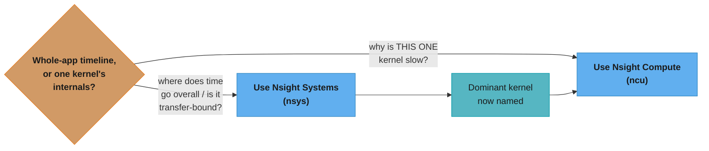
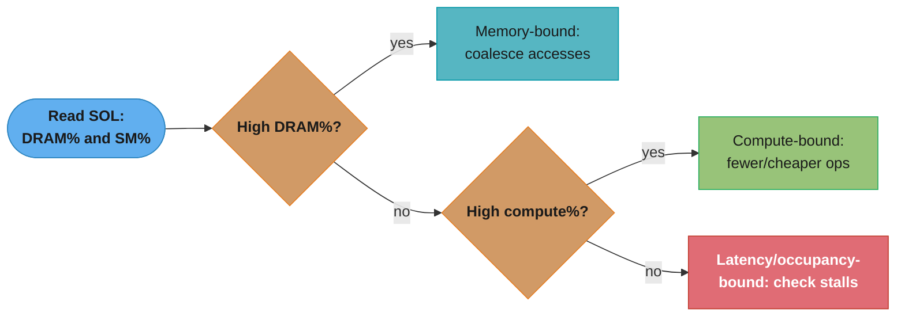
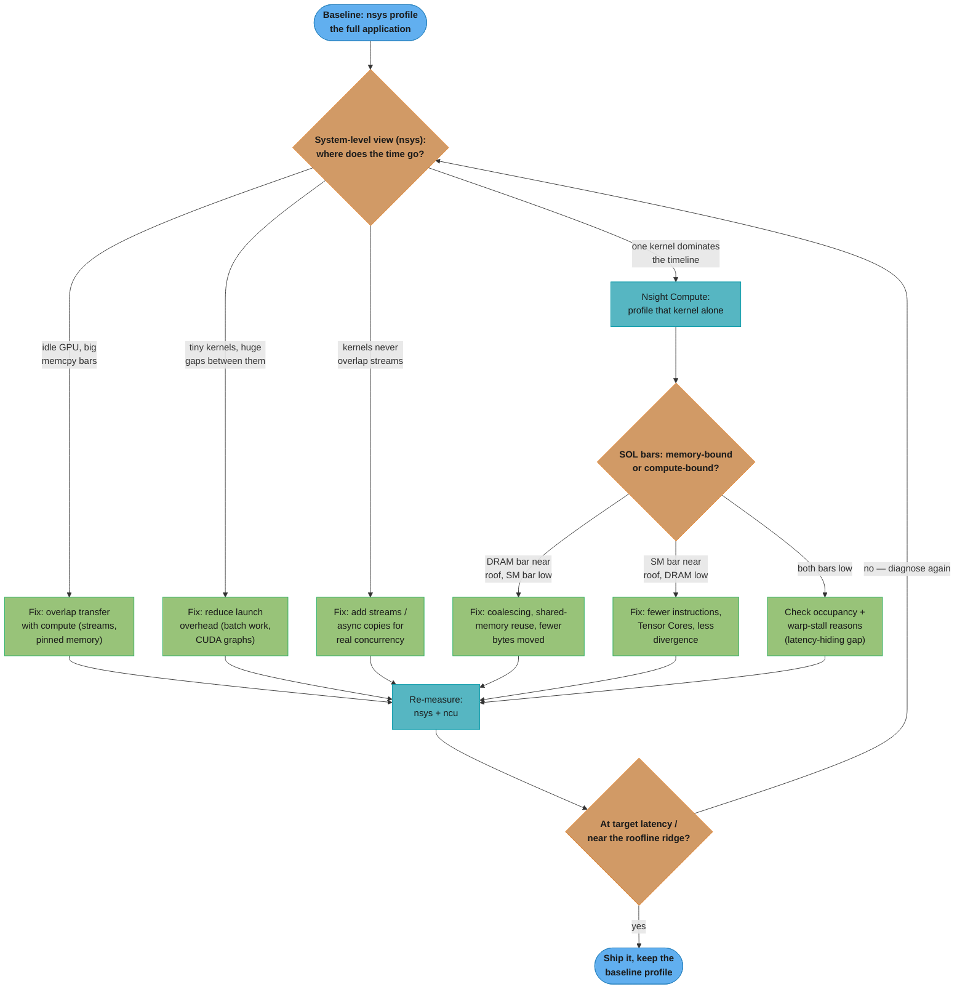
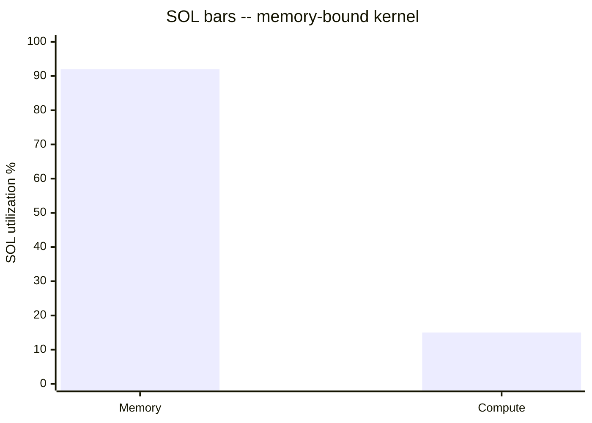
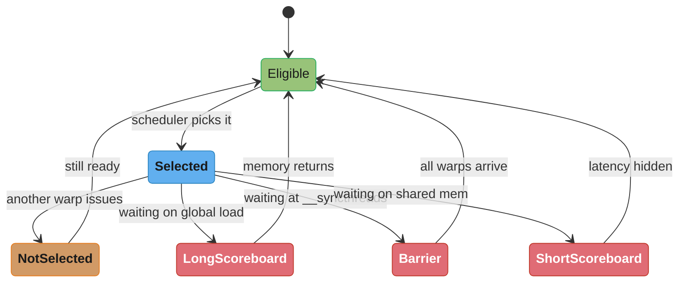
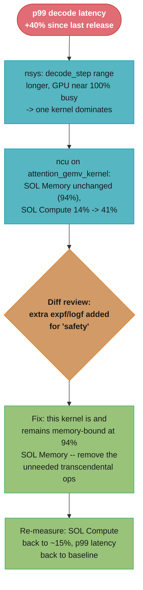

# Profiling & Performance Analysis

## 1. Concept Overview

Profiling is the discipline that turns "I think this kernel is slow because of X" into "I
measured that this kernel is slow because of X, and the fix moved the number." Every
optimization technique covered elsewhere in this section — coalescing, shared-memory tiling,
occupancy tuning, Tensor Cores — is a *hypothesis* about what is limiting a kernel. A
profiler is the only tool that turns that hypothesis into evidence. NVIDIA ships two
purpose-built tools for this: **Nsight Systems** (`nsys`), a low-overhead, whole-application
timeline profiler that answers "where does the time go across the whole run," and **Nsight
Compute** (`ncu`), a deep per-kernel instrumenting profiler that answers "why is *this*
kernel slow." Neither substitutes for the other, and using them in the wrong order — deep
per-kernel instrumentation before you know which kernel matters — wastes minutes per run and
buries the signal in noise.

This module covers the profiling methodology end to end: the profile-hypothesize-fix-remeasure
loop, the two Nsight tools and when each applies, the handful of metrics that actually decide
whether a kernel is memory-bound or compute-bound (SOL bars, achieved occupancy, DRAM
throughput, warp stall reasons), the roofline model as the lens that ties those metrics
together, and the instrumentation primitives — CUDA events, NVTX ranges, `torch.profiler` —
that get timing and context into the traces in the first place. The companion cross-cutting
file [`nsight_profiling_workflow.md`](../case_studies/cross_cutting/nsight_profiling_workflow.md)
is the reusable worked-example version of this same loop that every case study in this
section cites instead of re-deriving it.

---

## 2. Intuition

> **One-line analogy**: Optimizing a kernel without profiling is like tuning a car engine
> with the hood welded shut — you can swap the fuel, adjust the timing, add a turbo, and
> you'll never know whether any of it helped, or whether the actual problem was a clogged
> air filter you never looked at.

**Mental model**: A GPU kernel's execution time is gated by exactly one of a small number of
resources at any moment: memory bandwidth, compute throughput, launch overhead, or
synchronization/serialization. The profiler's whole job is to point at *which one*, with a
number attached, so the next change is aimed instead of guessed. Nsight Systems is the wide
lens — it shows the whole application's timeline (CPU, memcpy, kernel launches, streams) so
you know *where* in the run the time is going. Nsight Compute is the narrow lens — once
`nsys` has implicated one kernel, `ncu` opens that kernel up and reports the SOL (Speed-Of-
Light) bars, occupancy, and stall reasons that explain *why* it is slow internally. Using the
narrow lens before the wide one is like inspecting a single spark plug before checking
whether the car even has gas.

**Why it matters**: Senior GPU interviews and production incidents both reward the same
skill — the ability to say "this kernel is memory-bound at 92% DRAM SOL with 25% store
efficiency, so the fix is coalescing, not more math" instead of "I added `#pragma unroll`
and it felt faster." Every GPU-optimization case study in this section, and every real
production kernel tuning session, runs on this exact evidence loop. An engineer who cannot
read an `ncu` report cannot tell the difference between a kernel that needs Tensor Cores and
one that needs its access pattern fixed — and will burn a sprint on the wrong fix.

**Key insight**: The two SOL bars — Memory and Compute — are the single fastest triage
signal in the entire toolchain. High memory / low compute means the kernel is memory-bound;
high compute / low memory means it is compute-bound; both low means something else entirely
is gating it (occupancy, divergence, atomics/barrier serialization) and you check warp-stall
reasons next. A kernel sitting at 92% DRAM throughput and 15% compute throughput will not go
faster no matter how much arithmetic you add to it — the profiler is telling you, in two
numbers, that the fix lives in the memory-access pattern, not the math.

---

## 3. Core Principles

- **Never fix before you measure.** Every optimization in this section — from coalescing to
  Tensor Cores — is a targeted response to a specific profiler finding, not a reflex applied
  to any slow kernel.
- **Triage wide before narrow.** Start at the system level (`nsys`) to find *which* kernel or
  phase dominates the timeline; only then zoom into that one kernel with `ncu`. Reversing
  the order buries the one slow kernel under 10-100x replay overhead applied to everything.
- **Change one thing between measurements.** If a fix bundles "add shared memory tiling *and*
  bump the block size *and* switch to `float4` loads," an improvement or regression cannot be
  attributed to any single change — the loop only works if each iteration isolates one
  hypothesis.
- **Read the SOL bars together, not separately.** High DRAM throughput alone can mean
  "well-utilized" or "saturated with wasted bytes" — pairing it with load/store efficiency
  (sectors per request) disambiguates the two.
- **Timing on the GPU requires GPU-side synchronization.** Kernel launches are asynchronous
  with respect to the host; a CPU-side `clock()`/`std::chrono` measurement around a kernel
  launch measures how fast the launch call returned, not how long the kernel took to execute.
- **The roofline model is the unifying lens.** Arithmetic intensity (FLOPs per byte moved)
  compared against the GPU's ridge point (peak FLOP/s ÷ peak bandwidth) predicts, before you
  even open a profiler, whether a kernel *can* be compute-bound — the profiler then confirms
  or contradicts that prediction empirically.
- **Instrumentation must ship attached to the code it explains.** NVTX ranges and
  `torch.profiler` annotations turn an opaque timeline of anonymous kernel names into a
  timeline labeled with the application's own phase names (`"prefill"`, `"attention_layer_12"`,
  `"optimizer_step"`), which is the difference between a profile you can read in five minutes
  and one that takes an hour of guessing.

---

## 4. Types / Architectures / Strategies

### 4.1 The Two-Tool Model

| | Nsight Systems (`nsys`) | Nsight Compute (`ncu`) |
|---|---|---|
| Question answered | Where in the *timeline* does time go? | Why is *this specific kernel* slow? |
| Scope | Whole application: CPU threads, CUDA API calls, memcpy, kernel launches, NVTX ranges, multi-stream/multi-GPU | One kernel launch (or filtered set), instrumented in depth |
| Overhead | Low (~1-5%) — safe on a full production-shaped run | High (10-100x per replayed kernel) — scope to the kernels you need |
| Typical finding | Transfer-bound gaps, launch-overhead gaps (many tiny kernels), missing stream overlap, serialization before a launch | Coalescing waste, bank conflicts, low-occupancy causes, warp stall reasons, memory- vs compute-bound |
| Reach for it when | You do not yet know *which* part of the run is slow — start every investigation here | `nsys` has already pointed at one dominant kernel |



This decision path mirrors the table above: reach for `nsys` when the question is about the
whole run or a suspected transfer bottleneck, and only drop into `ncu` once one kernel has
been named as the target.

### 4.2 Profiling Levels (narrowing scope)

1. **Application/system level (`nsys`)** — is the run transfer-bound, launch-overhead-bound,
   serialization-bound (no stream overlap), or is one kernel dominant?
2. **Kernel level (`ncu` SOL bars)** — for the dominant kernel, is it memory-bound or
   compute-bound?
3. **Sub-kernel level (`ncu` detailed sections + source correlation)** — which specific
   instruction, loop, or memory access is responsible (via `-lineinfo` source correlation,
   warp-stall histograms, sectors-per-request)?
4. **Guided Analysis rules** — `ncu`'s built-in rule engine flags specific issues (e.g. "low
   occupancy due to register usage," "uncoalesced global accesses detected") directly in the
   report, cutting the manual-diagnosis step for common patterns.



Both SOL bars reading low is the easy-to-miss third branch — the fix there is occupancy and
warp-stall diagnosis, not more coalescing and not Tensor Cores.

### 4.3 Instrumentation Strategies

- **CUDA Events** (`cudaEvent_t` + `cudaEventElapsedTime`) — GPU-side timestamps inserted
  into a stream; the only correct way to time kernel *execution* (not launch) from C++
  without a full profiler attached.
- **NVTX ranges** (`nvtxRangePushA`/`nvtxRangePop`, or the `NVTX3` C++ RAII wrapper) —
  user-defined named ranges that appear as colored bands in the `nsys` timeline, turning
  anonymous kernel names into application-level phases.
- **`torch.profiler`** — PyTorch's built-in profiler; wraps CUDA events, CPU-side ops, and
  (optionally) exports a Chrome-trace-format JSON viewable in `chrome://tracing` or
  TensorBoard, and can emit NVTX ranges automatically for `nsys` correlation.
- **`torch.cuda.Event`** — the PyTorch binding over raw CUDA events, used for quick
  wall-clock GPU timing inside Python without pulling in the full profiler.
- **Environment-driven capture** (`nsys profile python train.py`, `NSYS_NVTX_PROFILER_REGISTER_ONLY=0`)
  — wrapping an existing binary or Python entry point rather than instrumenting source, useful
  for a first pass over an unfamiliar codebase.

---

## 5. Architecture Diagrams

### The Profile → Hypothesize → Fix → Re-measure Loop



Every arrow is one iteration: a single hypothesis, one targeted fix, one re-measurement. The
loop always enters at the system level and only narrows into `ncu` once a specific kernel is
implicated — the full worked walkthrough (a matrix-transpose kernel taken from 88% wasted
DRAM bandwidth down to 100% store efficiency) lives in
[`nsight_profiling_workflow.md`](../case_studies/cross_cutting/nsight_profiling_workflow.md).

### SOL Bars — Reading the Triage Signal

```
Nsight Compute Speed-Of-Light (SOL) section — a kernel doing elementwise scalar math
over a large uncoalesced array:

Memory  [######################################........] 92%  <- near the roof
Compute [###############.................................] 15%  <- far below

           0%        25%        50%        75%       100%
           |----------|----------|----------|----------|

Reading: Memory bar near the roof + Compute bar far below it is the textbook
memory-bound signature. Adding more arithmetic to this kernel cannot help --
the ALUs are already starved waiting on the memory pipe, so more math just
means more idle waiting, not more throughput. The fix is fewer, better-
coalesced bytes moved (see memory_coalescing_and_access_patterns), not a
faster inner loop.

Contrast -- a compute-bound kernel (dense FP32 matmul, no Tensor Cores):

Memory  [##########........................................] 20%
Compute [###########################################.......] 88%  <- near the roof

Reading: Compute bar near the roof + Memory bar far below it means the SM's
ALUs are the bottleneck. The fix here is fewer/cheaper instructions per
element, less divergence, or moving the matmul onto Tensor Cores -- coalescing
the already-adequate memory traffic further would not move this kernel at all.
```

This ASCII mock captures the numbers from the worked transpose example in the cross-cutting
profiling file: a naive kernel sits at 88% DRAM SOL but only 25% store efficiency (three
out of every four bytes moved are wasted on a strided write), which is why "92% DRAM
throughput" alone does not mean "already optimal" — it must be read alongside sectors-per-
request before concluding the kernel cannot go faster.



The same 92%/15% split as the ASCII mock above, plotted as bars — Memory pinned near the
roof while Compute sits far below it is the textbook memory-bound signature.

---

## 6. How It Works — Detailed Mechanics

### 6.1 Timing a Kernel Correctly — CUDA Events (C++)

A kernel launch (`kernel<<<grid, block>>>(...)`) returns to the host immediately; the kernel
runs asynchronously on the device. Wrapping a launch in `std::chrono` or `clock()` measures
how long the *launch call* took to return (microseconds), not how long the kernel *executed*
(which could be milliseconds) — the two numbers can differ by orders of magnitude. CUDA
events are timestamps recorded directly into a stream and are the correct tool:

```cpp
#include <cstdio>
#include <cuda_runtime.h>

__global__ void saxpy(int n, float a, const float* x, float* y) {
    int i = blockIdx.x * blockDim.x + threadIdx.x;
    if (i < n) y[i] = a * x[i] + y[i];
}

void time_kernel_correctly(int n, float a, float* d_x, float* d_y) {
    cudaEvent_t start, stop;
    cudaEventCreate(&start);
    cudaEventCreate(&stop);

    int threads = 256;
    int blocks = (n + threads - 1) / threads;

    cudaEventRecord(start);                       // timestamp enqueued into the stream
    saxpy<<<blocks, threads>>>(n, a, d_x, d_y);    // asynchronous launch
    cudaEventRecord(stop);                        // timestamp enqueued after the kernel

    cudaEventSynchronize(stop);                    // wait until 'stop' is actually reached
    float ms = 0.0f;
    cudaEventElapsedTime(&ms, start, stop);        // GPU-side elapsed time, sub-microsecond res.
    printf("saxpy kernel time: %.4f ms\n", ms);

    cudaEventDestroy(start);
    cudaEventDestroy(stop);
}
```

`cudaEventRecord` inserts a marker into the stream at the point it is called; the timestamp
it captures is when the GPU actually *reaches* that point in the stream, not when the host
call returns. `cudaEventSynchronize(stop)` blocks the host until the `stop` event has been
reached on the device — without it, `cudaEventElapsedTime` can read a timestamp that has not
been recorded yet. This event pair measures pure kernel execution time, isolated from host
overhead, launch overhead of subsequent calls, or unrelated stream activity.

### 6.2 NVTX Ranges — Naming Phases for the Timeline (C++)

Nsight Systems shows every kernel launch and memcpy by name, but a long training loop or
inference pipeline has hundreds of anonymous-looking calls. NVTX ranges paint named,
colored bands onto the `nsys` timeline so the profile reads like an annotated map instead of
raw noise:

```cpp
#include <nvtx3/nvToolsExt.h>

void inference_step(float* d_input, float* d_output, int batch_size) {
    nvtxRangePush("preprocess");
    launch_preprocess_kernel(d_input, batch_size);
    nvtxRangePop();

    nvtxRangePush("attention_layer_12");
    launch_attention_kernel(d_input, d_output, batch_size);
    nvtxRangePop();

    nvtxRangePush("postprocess");
    launch_postprocess_kernel(d_output, batch_size);
    nvtxRangePop();
}
```

```bash
# Capture NVTX ranges alongside CUDA API + kernel activity:
nsys profile --trace=cuda,nvtx,osrt -o inference_trace ./inference_app
nsys stats inference_trace.nsys-rep
```

In the `nsys-ui` timeline, `"attention_layer_12"` now appears as a labeled band spanning
every kernel it launched — the difference between "there is a 4ms gap somewhere in the
timeline" and "the gap is inside `attention_layer_12`, specifically after the third kernel."

### 6.3 Python — `torch.cuda.Event` for Quick GPU Timing

```python
import torch

def time_kernel_correctly(fn, *args, warmup: int = 3, iters: int = 20) -> float:
    """Time a CUDA-backed callable using GPU-side events, not wall clock."""
    for _ in range(warmup):
        fn(*args)
    torch.cuda.synchronize()  # drain the warmup work before timing begins

    start = torch.cuda.Event(enable_timing=True)
    end = torch.cuda.Event(enable_timing=True)

    start.record()
    for _ in range(iters):
        fn(*args)
    end.record()

    torch.cuda.synchronize()  # wait for all queued work to finish before reading elapsed_time
    elapsed_ms = start.elapsed_time(end)  # GPU-side elapsed time in milliseconds
    return elapsed_ms / iters


x = torch.randn(1 << 20, device="cuda")
y = torch.randn(1 << 20, device="cuda")
avg_ms = time_kernel_correctly(lambda a, b: a.add_(b), x, y)
print(f"average kernel time: {avg_ms:.4f} ms")
```

`torch.cuda.Event(enable_timing=True)` is a thin binding over the same `cudaEvent_t`
mechanism used in §6.1. As in C++, `torch.cuda.synchronize()` before `elapsed_time()` is not
optional — GPU work is enqueued asynchronously from Python just as it is from a `<<<>>>`
launch, and reading `elapsed_time()` before the `end` event fires raises a runtime error or,
worse in older versions, silently returns a stale reading.

### 6.4 Python — `torch.profiler` for Full-Pipeline Analysis

```python
import torch
from torch.profiler import profile, ProfilerActivity, record_function

model = torch.nn.TransformerEncoderLayer(d_model=4096, nhead=32).cuda()
batch = torch.randn(32, 128, 4096, device="cuda")

with profile(
    activities=[ProfilerActivity.CPU, ProfilerActivity.CUDA],
    record_shapes=True,
    with_stack=True,
    profile_memory=True,
) as prof:
    with record_function("forward_pass"):
        for _ in range(10):
            out = model(batch)
    torch.cuda.synchronize()

# Table sorted by cumulative CUDA time -- the fastest way to find the dominant op
print(prof.key_averages().table(sort_by="cuda_time_total", row_limit=10))

# Chrome-trace-format export -- open in chrome://tracing or load into TensorBoard
prof.export_chrome_trace("trace.json")
```

`record_function("forward_pass")` behaves exactly like an NVTX range at the Python level —
`torch.profiler` can additionally emit true NVTX markers (via
`torch.autograd.profiler.emit_nvtx()`) so the same annotated phases show up in an `nsys`
capture of the whole training script, unifying the Python-level view and the system-level
view under the same labels.

```bash
# Wrap the whole Python entry point in nsys, capturing the NVTX ranges torch.profiler
# (or manual nvtxRangePush calls) emit, plus every CUDA kernel launch underneath them:
nsys profile --trace=cuda,nvtx,osrt -o train_trace python train.py
```

### 6.5 Reading Nsight Systems Output

```bash
nsys profile -o app_trace ./app
nsys stats app_trace.nsys-rep
```

`nsys stats` prints, without opening a GUI, a breakdown by kernel name (total time, call
count, average time), a CUDA API summary (time spent in `cudaMalloc`, `cudaMemcpy`,
`cudaLaunchKernel`), and, if NVTX ranges are present, a per-range summary. The system-level
question this answers first: is the GPU busy the whole time, or are there large gaps
(transfer-bound), many tiny kernels back to back with dead time between them
(launch-overhead-bound), or a dominant single kernel worth a deeper look?

### 6.6 Reading Nsight Compute Output — the SOL Bars and Key Metrics

```bash
# Scope to exactly one kernel launch -- never run --set full on a whole application:
ncu --set full -k saxpy --launch-count 1 -o saxpy_ncu ./app
```

| Metric | What it tells you | Read it as |
|--------|--------------------|------------|
| SOL Memory (DRAM throughput %) | Bytes moved to/from HBM as a fraction of peak (~3 TB/s on H100 HBM3) | Near the roof (80-95%+) = memory pipe near-saturated |
| SOL Compute (SM throughput %) | Issued FLOPs/instructions as a fraction of peak issue rate | Near the roof = ALUs are the bottleneck |
| Achieved occupancy | Resident warps ÷ the SM's maximum, averaged over the run | A *capacity* number for latency hiding, not throughput — see [occupancy_and_launch_configuration](../occupancy_and_launch_configuration/README.md) |
| Warp stall reasons | Histogram of why warps were not eligible to issue | `long scoreboard` = waiting on global memory (memory-bound signature); `barrier` = `__syncthreads` imbalance; `short scoreboard` = shared-mem/texture latency; `not selected` = usually benign |
| Global load/store efficiency (sectors per request) | 32-byte DRAM sectors fetched per warp memory instruction vs. the minimum needed | 100% = a coalesced 128-byte transaction across 32 threads needs exactly 4 sectors; 25% = 4x the necessary traffic |
| Roofline chart | Plots the kernel's arithmetic intensity (FLOPs/byte) and achieved performance against the bandwidth roof and compute roof | Below the sloped roof = memory-bound; at the flat roof = compute-bound |



Eligible to Selected to one of three stall reasons and back is the scheduler's swap loop
from §2; `long scoreboard` dominating this histogram is exactly the signature of the
memory-bound kernel plotted above.

A kernel at 90%+ DRAM throughput with low compute throughput is memory-bound and the fix is
access-pattern work (coalescing, shared-memory reuse), never "more math" — see the roofline
derivation in [`roofline_and_arithmetic_intensity.md`](../case_studies/cross_cutting/roofline_and_arithmetic_intensity.md)
for computing arithmetic intensity by hand before ever opening `ncu`.

### 6.7 The Roofline Model as a Prediction, Then a Confirmation

```
Arithmetic Intensity (AI) = FLOPs performed / bytes moved from HBM

Ridge point = peak compute (FLOP/s) / peak bandwidth (bytes/s)

H100 example:  peak FMA throughput ~989 TFLOP/s (BF16 dense), peak HBM3 BW ~3.35 TB/s
  ridge point = 989e12 / 3.35e12 ~= 295 FLOPs/byte

AI < 295  ->  kernel sits under the bandwidth-limited slope  ->  memory-bound
AI > 295  ->  kernel sits on the flat compute-limited roof    ->  compute-bound
```

Computing AI from the algorithm (before profiling) predicts which regime a kernel *should*
land in; `ncu`'s SOL bars and roofline chart then confirm or contradict that prediction
empirically — a mismatch (e.g. AI predicts compute-bound but SOL Memory is at 90%) usually
means the implementation is wasting bytes (uncoalesced access, redundant reloads) relative
to the algorithm's theoretical traffic.

### 6.8 Guided Analysis and Source Correlation

```bash
# Compile with line info (NOT -G, which disables optimizations) so ncu can map
# metrics back to source lines:
nvcc -O3 -lineinfo -o app app.cu

# ncu's built-in rule engine surfaces specific findings directly in the report,
# e.g. "This kernel exhibits low compute throughput and memory bandwidth
# utilization relative to the peak performance... Est. Speedup: 43.2%"
ncu --set full -k saxpy --launch-count 1 --import-source yes -o saxpy_ncu ./app
```

`--import-source yes` combined with `-lineinfo` lets the `ncu-ui` "Source" view show exactly
which lines of the CUDA C++ source correspond to the stalls or uncoalesced accesses the SOL
bars flagged — moving from "this kernel is 25% store-efficient" to "this specific store
instruction on line 42 is the strided write" without manual bisection.

---

## 7. Real-World Examples

- **PyTorch's `torch.profiler`** is the standard first stop for any training-loop slowdown
  investigation at ML shops — `record_function` spans are used to bracket data loading,
  forward, backward, and optimizer step, immediately showing whether a "slow training step"
  is actually a data-loader stall (CPU-bound, GPU idle) rather than a kernel problem.
- **NVIDIA's own Megatron-LM and TensorRT-LLM codebases** are instrumented end to end with
  NVTX ranges around every major phase (embedding, attention, MoE routing, all-reduce),
  which is exactly why their public `nsys` traces in optimization blog posts read as
  labeled, not anonymous, timelines.
- **vLLM and SGLang** both expose `nsys`/`ncu`-friendly debug flags precisely because
  continuous batching interleaves prefill and decode work across many small kernel launches
  — without NVTX-labeled ranges per request phase, a raw kernel-name timeline for a serving
  engine is close to unreadable.
- **Game engines and HPC codes** (e.g. simulation codebases at national labs) commonly gate
  CI on `ncu`-measured SOL and occupancy regressions for their hottest kernels, catching a
  performance regression in review before it reaches production, the same CI-gate pattern
  shown in §6.6's CSV-diff recipe.
- **The `optimize_matrix_multiplication_kernel` and `implement_high_performance_reduction`
  case studies** in this section's `case_studies/` directory are both built directly on the
  loop and metrics in this module — every optimization rung there cites an `ncu` reading as
  justification for the next step.

---

## 8. Tradeoffs

| Approach | Overhead | Granularity | When to reach for it |
|----------|----------|-------------|----------------------|
| `nsys` system trace | ~1-5% | Whole application timeline | Always first — establishes where time goes |
| `ncu --set full` on one kernel | 10-100x for that kernel's replay | Full per-kernel metric set | Once `nsys` has implicated a single dominant kernel |
| `ncu --section SpeedOfLight` only | Lower than `--set full` | SOL bars + basic memory workload only | Quick triage pass before committing to the expensive full set |
| CUDA events / `torch.cuda.Event` | Negligible (~microseconds) | One kernel or one code region, timing only, no internal metrics | Lightweight timing checks inside code, CI latency gates, no need for *why* |
| NVTX ranges | Negligible when not captured; near-zero when captured by `nsys` | Named phases across the whole run | Any nontrivial pipeline — always worth adding proactively |
| `torch.profiler` | Low-to-moderate (record_shapes/with_stack add overhead) | Per-op CPU+CUDA timeline, memory, call stacks | Full-pipeline PyTorch investigations, data-loader vs. GPU-bound triage |
| Manual `clock()`/`std::chrono` around a launch | None, but **wrong** | Measures the async launch call, not the kernel | Never — see §10 BROKEN→FIX |

---

## 9. When to Use / When NOT to Use

**Use `nsys` when:**
- Starting any investigation into "the app is slower than expected" — always the first tool.
- Checking whether compute/transfer overlap (streams) is actually happening.
- Diagnosing many-small-kernels launch-overhead patterns before reaching for CUDA graphs.

**Use `ncu` when:**
- `nsys` has already named one dominant kernel and you need to know *why* it is slow.
- Deciding between a memory-access fix and a compute/Tensor-Core fix.
- Root-causing a specific occupancy or divergence problem via warp-stall histograms.

**Use CUDA events / `torch.cuda.Event` when:**
- You need a fast, low-overhead timing number in production code or a CI latency gate, and
  you already know *what* you are timing — these give the *how long*, not the *why*.

**Use NVTX / `torch.profiler` record_function when:**
- The pipeline has more than a couple of phases and an unlabeled `nsys` timeline would be
  hard to read — proactively annotate before you need to debug, not after.

**Do NOT:**
- Reach for `ncu --set full` on an entire application before `nsys` has scoped the problem.
- Trust a CPU-side wall-clock timer around an asynchronous kernel launch.
- Draw conclusions from a debug (`-G`) build — profile a release build with `-lineinfo`.
- Change more than one thing between two profiling runs you intend to compare.

---

## 10. Common Pitfalls

**BROKEN — timing a kernel with the host clock, no synchronization:**

```cpp
#include <ctime>

clock_t t0 = clock();
saxpy<<<blocks, threads>>>(n, a, d_x, d_y);   // returns to host almost immediately
clock_t t1 = clock();
printf("kernel time: %.4f ms\n", 1000.0 * (t1 - t0) / CLOCKS_PER_SEC);
// Prints microseconds -- the time to ENQUEUE the launch, not the time the
// kernel actually ran on the device. The kernel may still be executing when
// t1 is captured.
```

**FIX — use CUDA events with an explicit synchronize:**

```cpp
cudaEvent_t start, stop;
cudaEventCreate(&start);
cudaEventCreate(&stop);

cudaEventRecord(start);
saxpy<<<blocks, threads>>>(n, a, d_x, d_y);
cudaEventRecord(stop);
cudaEventSynchronize(stop);              // block until the GPU actually reaches 'stop'

float ms = 0.0f;
cudaEventElapsedTime(&ms, start, stop);  // now measures actual GPU execution time
```

The general pattern: any GPU-side duration must be measured with GPU-side markers
(`cudaEvent_t`, or a full profiler attaching to the stream) plus an explicit
`cudaEventSynchronize`/`cudaDeviceSynchronize` — a host-side clock call, with nothing
forcing the host to wait for device completion, measures launch overhead at best and
nothing meaningful at worst.

**BROKEN — "optimizing" a memory-bound kernel by adding more math:**

```cpp
// Original: elementwise op reading/writing a large array with a strided access
__global__ void slow_scale(float* out, const float* in, float k, int n, int stride) {
    int i = (blockIdx.x * blockDim.x + threadIdx.x) * stride;   // strided -- uncoalesced
    if (i < n) out[i] = in[i] * k;
}

// "Optimization": add more FLOPs per element, hoping the extra work overlaps the stall
__global__ void slow_scale_more_math(float* out, const float* in, float k, int n, int stride) {
    int i = (blockIdx.x * blockDim.x + threadIdx.x) * stride;
    if (i < n) {
        float v = in[i];
        v = v * k + sinf(v) * cosf(v) - sqrtf(fabsf(v));   // 5 extra transcendental ops
        out[i] = v;
    }
}
// ncu shows SOL Memory unchanged at ~90%, SOL Compute barely moves off the floor,
// and wall-clock time is UNCHANGED (or slightly worse) -- the extra math has nowhere
// to hide because the warps are still stalled on the same uncoalesced global loads.
```

**FIX — profile first; the SOL bars show this is memory-bound, so coalesce instead:**

```cpp
// The access is strided because 'stride' skips elements -- if the true intent is a
// dense pass over the array, drop the artificial stride and let consecutive threads
// touch consecutive addresses, giving the hardware a single 128-byte transaction
// per warp instead of 32 separate scattered ones.
__global__ void fast_scale(float* out, const float* in, float k, int n) {
    int i = blockIdx.x * blockDim.x + threadIdx.x;   // consecutive threads -> consecutive addrs
    if (i < n) out[i] = in[i] * k;
}
// Re-measuring: SOL Memory stays near the roof (correct -- this kernel has near-zero
// arithmetic intensity and will always be memory-bound), but store efficiency rises
// from ~25% to 100%, and wall-clock time drops by roughly the same factor -- because
// the same bandwidth is now spent entirely on useful bytes instead of mostly waste.
```

The general lesson, straight from the roofline model: below the ridge point, throughput is
capped by bytes moved, not FLOPs issued — no amount of added arithmetic raises a
memory-bound kernel's ceiling, only moving fewer or better-coalesced bytes does.

**Profiling a debug build.** A `-G` build disables most optimizations and inserts extra
checks; the metrics describe the debug build, not production behavior. Always profile a
release build compiled with `-lineinfo` (not `-G`).

**Trusting achieved occupancy alone.** A kernel can sit at 90% occupancy and still be slow
if it is compute-bound and simply issuing expensive instructions — always cross-check
against the SOL bars and warp-stall reasons, per
[occupancy_and_launch_configuration](../occupancy_and_launch_configuration/README.md).

**Skipping the warmup iteration.** The first kernel launch pays for context initialization
and PTX-to-SASS JIT compilation on a cache miss; profiling launch #1 inflates the numbers.
Always warm up first, and use `ncu --launch-skip` for kernels launched in a loop.

**Ignoring boost-clock variance between runs.** Comparing a "before" run at boost clocks to
an "after" run at throttled clocks manufactures a fake regression or a fake win. Use
`ncu --clock-control base` when comparing profiles that must be trusted side by side.

---

## 11. Technologies & Tools

| Tool | Purpose | Notes |
|------|---------|-------|
| Nsight Systems (`nsys`) | Whole-application timeline profiler | Start every investigation here; ~1-5% overhead |
| Nsight Compute (`ncu`) | Per-kernel deep metric profiler | 10-100x overhead per replayed kernel; scope tightly with `-k`/`--launch-count` |
| `nsys-ui` / `ncu-ui` | GUI viewers for `.nsys-rep`/`.ncu-rep` | Interactive exploration; both tools are also fully CLI/CI-scriptable |
| CUDA Events (`cudaEvent_t`) | GPU-side timestamps in a stream | Correct way to time kernel execution from C++ without a full profiler |
| NVTX (`nvtx3`) | User-defined named ranges/markers | Turns anonymous kernel timelines into labeled application phases |
| `torch.profiler` | PyTorch CPU+CUDA profiler | Chrome-trace / TensorBoard export; can emit NVTX automatically |
| `torch.cuda.Event` | PyTorch binding over CUDA events | Lightweight GPU timing inside Python |
| `compute-sanitizer` | Correctness (not perf) instrumentation | Complementary tool — see [debugging_correctness_and_numerics](../debugging_correctness_and_numerics/README.md) |
| DCGM / `nvidia-smi dmon` | Fleet-level GPU utilization monitoring | Cluster/production monitoring, not per-kernel diagnosis |

---

## 12. Interview Questions with Answers

**Why does timing a kernel with the host's `clock()` give a misleadingly small number?**
A
kernel launch is asynchronous — the host call returns as soon as the launch is enqueued, not
when the kernel finishes executing, so a host-side clock measures launch overhead
(microseconds) instead of execution time (which can be milliseconds or more). The fix is
CUDA events (`cudaEventRecord`/`cudaEventElapsedTime`) with an explicit
`cudaEventSynchronize`, or `torch.cuda.synchronize()` before reading a Python-side timer.

**Why doesn't adding more arithmetic to a memory-bound kernel make it faster?**
A
memory-bound kernel's throughput is capped by bytes moved per second, not FLOPs issued, so
extra math has spare ALU cycles to run in while warps are already stalled on memory and adds
zero wall-clock benefit. The profiler shows this directly as a high SOL Memory bar paired
with a low SOL Compute bar — the fix is fewer or better-coalesced bytes moved, never more
computation.

**What is the difference between Nsight Systems and Nsight Compute, and in what order do you use them?**
Nsight Systems (`nsys`) is a low-overhead, whole-application timeline profiler that shows where time goes across CPU, transfers, and kernel launches; Nsight Compute (`ncu`) is a high-overhead, per-kernel deep profiler that explains why one specific kernel is slow. Always run `nsys` first to find the dominant kernel or phase, then `ncu` on just that kernel — reversing the order buries the signal in 10-100x replay overhead applied to kernels that don't matter.

**Why is running `ncu --set full` on an entire application an anti-pattern?**
`ncu` instruments and replays every kernel launch it captures, at 10-100x slowdown per launch, so applying the full metric set to an entire run (rather than one named kernel) can turn a 50ms step into a 30-second replay while drowning the one kernel that matters in metrics for dozens that don't. Scope it with `-k kernelname --launch-count 1` after `nsys` has already identified the target.

**What do the two SOL (Speed-Of-Light) bars in an `ncu` report mean, and how do you read them together?**
SOL Memory is DRAM throughput as a percentage of the GPU's peak bandwidth, and SOL Compute is SM issue throughput as a percentage of peak FLOP/instruction rate. High memory / low compute means memory-bound (fix access patterns); high compute / low memory means compute-bound (fix instruction mix or use Tensor Cores); both low means something else is gating the kernel — check occupancy and warp-stall reasons next.

**Is 90%+ DRAM throughput always a sign the kernel is already well-optimized?**
No — high DRAM throughput only means the memory pipe is busy, not that the bytes moved are useful. A kernel can hit 88% DRAM SOL while wasting three out of every four bytes on a strided, uncoalesced access, which only becomes visible by also checking global load/store efficiency (sectors per request); coalescing that same kernel keeps DRAM SOL roughly unchanged but raises store efficiency from 25% to 100% and cuts wall-clock time by a similar factor.

**Is higher achieved occupancy always better?**
No — occupancy is a capacity metric for hiding latency, not a throughput metric, and a kernel can plateau at 50-60% occupancy with zero further benefit from more resident warps once memory latency is already hidden. Pushing occupancy further (e.g. via smaller per-thread work) can even force register spills that make the kernel slower, so always cross-check occupancy against the SOL bars before treating it as the target metric.

**What does a "long scoreboard" warp stall reason mean?**
It means warps are stalled waiting on a global memory load to complete, which is the single most common stall reason in a memory-bound kernel and directly corroborates a high SOL Memory / low SOL Compute reading. Other common reasons: `barrier` (waiting at `__syncthreads`, indicating tiling/sync imbalance), `short scoreboard` (shared-memory or texture-load latency), and `not selected` (the scheduler chose another eligible warp — usually benign, meaning enough parallelism exists to hide latency).

**What is the roofline model, and how do you use it before ever opening a profiler?**
The roofline model plots achievable performance against arithmetic intensity (FLOPs per byte moved from HBM), with a sloped bandwidth-limited region below the ridge point and a flat compute-limited roof above it; computing a kernel's theoretical AI by hand (algorithm FLOPs divided by minimum bytes it must move) predicts which regime it should land in before any measurement. `ncu`'s roofline chart then plots the kernel's *measured* AI and achieved performance against the same roofs, and a mismatch between the prediction and the measurement (e.g. AI predicts compute-bound but SOL Memory is pinned at 90%) usually means the implementation wastes bytes relative to the algorithm.

**Why must you profile a release build with `-lineinfo`, never a debug (`-G`) build?**
A `-G` build disables most compiler optimizations and inserts extra debug checks, so the metrics it produces describe debug-mode behavior, not the production kernel's actual performance characteristics. `-lineinfo` keeps full optimization on while embedding source-line correlation, letting `ncu`'s Source view map SOL/stall findings back to specific lines without disabling the optimizations you actually care about measuring.

**Why should you always warm up before timing, and skip early iterations in a loop?**
The first kernel launch pays one-time costs — CUDA context initialization, JIT compilation of PTX to SASS on a cache miss, and cold instruction/data caches — that inflate the measured time and do not represent steady-state per-call cost. Always run at least one untimed warmup call, and for kernels launched repeatedly in a loop, use `ncu --launch-skip N` to profile a representative steady-state launch instead of the first one.

**Why can comparing two profiling runs manufacture a fake regression or a fake win?**
GPU boost clocks vary with thermal state and concurrent load, so a "before" run captured at full boost and an "after" run captured while the GPU is throttled (or vice versa) will show a timing difference that has nothing to do with the code change being tested. Use `ncu --clock-control base` (or lock clocks at the driver level) whenever two profiles need to be compared side by side with confidence.

**What is an NVTX range, and what problem does it solve in a profiler timeline?**
An NVTX range (`nvtxRangePush`/`nvtxRangePop`, or PyTorch's `record_function`) is a user-defined, named, colored band that appears in the `nsys` timeline spanning whatever kernels and API calls occur between the push and pop. Without it, a timeline shows only anonymous kernel names and CUDA API calls; with it, the same timeline reads as labeled application phases (`"attention_layer_12"`, `"optimizer_step"`), turning a multi-hour manual correlation exercise into a five-minute visual read.

**How does `torch.profiler` differ from raw `nsys`/`ncu`, and when do you reach for it instead?**
`torch.profiler` operates at the PyTorch op level — it wraps CUDA events per op, tracks CPU-side Python overhead, and can export a Chrome-trace-format JSON viewable in `chrome://tracing` or TensorBoard, without needing to leave a Python session or install Nsight tooling. Reach for it first when triaging a PyTorch training/inference pipeline (is the slowdown a data-loader stall, a specific op, or GPU-bound?); reach for `nsys`/`ncu` when you need system-level CUDA-stream detail or per-kernel hardware metrics that `torch.profiler`'s op-level view cannot show.

**Why must `torch.cuda.synchronize()` be called before reading `torch.cuda.Event.elapsed_time()`?**
GPU work queued from Python is asynchronous exactly like a C++ kernel launch, so `end.record()` only enqueues a timestamp marker — if `elapsed_time()` is called before the GPU has actually reached that marker, it either raises an error or (in careless code) reads a stale or incomplete measurement. `torch.cuda.synchronize()` blocks the Python thread until all queued CUDA work completes, guaranteeing both the `start` and `end` events have fired before the elapsed time is computed.

**What is Nsight Compute's Guided Analysis / rule engine, and what does it save you from doing manually?**
It is a built-in set of heuristic rules that scan a captured kernel's metrics and surface specific, human-readable findings directly in the report — e.g. flagging low occupancy caused by register pressure, or uncoalesced global memory access with an estimated speedup from fixing it — instead of requiring the engineer to manually cross-reference every metric against known patterns. It is a starting point, not a replacement for understanding the SOL bars and stall reasons yourself, since the rules cover common patterns but not every kernel-specific nuance.

**What does global load/store efficiency (sectors per request) tell you that DRAM throughput alone does not?**
DRAM throughput measures how much of the peak bandwidth is being consumed, while sectors-per-request measures what fraction of the bytes actually fetched were useful — a coalesced 128-byte transaction across a 32-thread warp needs exactly 4 sectors, so 100% efficiency means zero waste, while 25% means four times the necessary traffic is being moved. A kernel can be at 90% DRAM throughput and 25% efficiency simultaneously, meaning the memory pipe is busy but mostly wasting bandwidth — the two metrics together, not either alone, tell you whether the kernel is already efficient or merely saturated.

**How do you use `nsys` to distinguish a transfer-bound pipeline from a launch-overhead-bound one?**
In the `nsys` timeline, a transfer-bound pipeline shows large memcpy bars with the GPU compute engine idle alongside them (no overlap), while a launch-overhead-bound pipeline shows many small kernels back-to-back with visible gaps between them relative to each kernel's own duration. The fixes differ accordingly: transfer-bound calls for streams and pinned memory to overlap compute with copy; launch-overhead-bound calls for batching work into fewer, larger launches or capturing the sequence into a CUDA graph.

**Why is it important to change only one thing between two profiling measurements?**
If a fix bundles multiple changes (e.g. shared-memory tiling plus a larger block size plus vectorized loads) applied together, an observed improvement or regression cannot be attributed to any single change, which breaks the ability to build a reliable mental model of what actually helped. The profiling loop's discipline is one hypothesis, one fix, one re-measurement, repeated — anything else turns evidence-based optimization back into guesswork with extra steps.

---

## 13. Best Practices

1. **Always start with `nsys`, never `ncu`.** The system-level view is cheap and tells you
   where to point the expensive per-kernel tool.
2. **Scope `ncu` tightly.** Use `-k kernelname --launch-count 1` (or `--launch-skip` for
   loop-launched kernels); never run `--set full` across an entire application.
3. **Instrument proactively with NVTX / `record_function`.** Add named ranges around every
   nontrivial phase before you need to debug a slowdown, not after.
4. **Time GPU work with GPU-side markers only.** CUDA events, `torch.cuda.Event`, or a
   profiler attached to the stream — never a host-side wall clock without an explicit
   synchronize.
5. **Read both SOL bars together, then cross-check load/store efficiency.** A single metric
   in isolation (DRAM throughput alone, occupancy alone) can mislead; the combination tells
   the real story.
6. **Change one variable per measurement cycle.** One hypothesis, one fix, one re-measure —
   attribute every improvement or regression to exactly one change.
7. **Profile release builds with `-lineinfo`, warm up first, and lock clocks for
   comparisons.** These three eliminate the most common sources of misleading numbers.
8. **Keep the baseline profile.** Once a fix lands, retain the "before" trace alongside the
   "after" trace — regressions caught weeks later need the original evidence to diagnose.

---

## 14. Case Study

**Scenario:** A production LLM-serving team notices p99 decode latency for a custom
GEMV-based attention kernel has crept up 40% since the last deploy, but throughput dashboards
(requests/sec) look unchanged. The on-call engineer is asked to find the regression before
the next release freeze.

**Step 1 — `nsys` on the full serving process (system level):**

```bash
nsys profile --trace=cuda,nvtx,osrt -o serve_trace -- \
    python serve.py --model llama3-70b --port 8000
# (traffic replayed from a captured production request trace during the profiling window)
nsys stats serve_trace.nsys-rep
```

The timeline, read through the NVTX ranges the team had already instrumented
(`"prefill"`, `"decode_step"`, `"kv_cache_append"`), shows `"decode_step"` now spans
noticeably more wall-clock time per token than the previous release's baseline trace, and
GPU utilization inside that range is near 100% (ruling out a transfer-bound or
launch-overhead-bound explanation) — one specific kernel, `attention_gemv_kernel`, now
dominates the range.

**Step 2 — `ncu` on the implicated kernel:**

```bash
ncu --set full -k attention_gemv_kernel --launch-count 1 \
    -o attention_gemv_ncu ./serve_replay_harness
```

```
Metric                              This release    Previous release
SOL Memory (DRAM throughput)        94%             93%
SOL Compute (SM throughput)         41%             14%
Achieved occupancy                  63%             67%
Top stall reason                    long scoreboard  long scoreboard (58%)
                                     (44%)
```

**Step 3 — hypothesize.** SOL Memory is essentially unchanged (94% vs. 93%), ruling out a
new coalescing regression. SOL Compute nearly tripled (14% → 41%) — a code change added
meaningfully more arithmetic per element. Reviewing the diff between releases confirms it:
a numerically-stabilized variant of the attention scaling was added, replacing a single
multiply with an extra `expf`/`logf` pair per element, "to be safe" against overflow that
was never actually observed in this kernel's dynamic range.



**Step 4 — fix.**

```cpp
// BROKEN (this release) -- extra transcendental ops added defensively, on a kernel
// that SOL Memory (94%) already shows is memory-bound and never needed them:
__global__ void attention_gemv_kernel_regressed(
    float* out, const float* q, const float* k, const float* v,
    float scale, int seq_len, int head_dim) {
    int i = blockIdx.x * blockDim.x + threadIdx.x;
    if (i >= seq_len) return;
    float score = dot(q, &k[i * head_dim], head_dim) * scale;
    // "defensive" numerically-stabilized rescale -- unnecessary here, this kernel's
    // dynamic range was already verified safe without it:
    float stabilized = expf(logf(fabsf(score) + 1e-12f)) * (score < 0 ? -1.0f : 1.0f);
    out[i] = stabilized;
}

// FIX -- profiler confirms the kernel is and remains memory-bound; the stabilization
// was solving a problem that did not exist for this input range, so remove it and
// spend the compute-bandwidth-gated cycles on nothing instead of wasted transcendentals:
__global__ void attention_gemv_kernel_fixed(
    float* out, const float* q, const float* k, const float* v,
    float scale, int seq_len, int head_dim) {
    int i = blockIdx.x * blockDim.x + threadIdx.x;
    if (i >= seq_len) return;
    out[i] = dot(q, &k[i * head_dim], head_dim) * scale;
}
```

**Step 5 — re-measure.**

```bash
ncu --set full -k attention_gemv_kernel_fixed --launch-count 1 \
    -o attention_gemv_fixed_ncu ./serve_replay_harness
nsys profile --trace=cuda,nvtx,osrt -o serve_trace_fixed -- \
    python serve.py --model llama3-70b --port 8000
```

| Metric | Regressed | Fixed |
|--------|----------:|------:|
| Kernel time | 0.84 ms | 0.59 ms |
| SOL Memory | 94% | 94% |
| SOL Compute | 41% | 15% |
| p99 decode latency (full pipeline) | +40% vs. prior release | back to prior-release baseline |

DRAM throughput is unchanged before and after — expected, since this GEMV kernel's
arithmetic intensity is low and it was always going to sit near the memory roof. What
changed is that the same memory-bound ceiling is now reached without burning extra cycles on
transcendental ops the profiler showed were never load-bearing for correctness in this
kernel's actual input range. This mirrors the module-level lesson directly: once the SOL
bars say a kernel is memory-bound, additional compute is a cost with no corresponding
benefit, and the fix is always to remove wasted work, not add safety margins that were never
measured against the real bottleneck.

**Discussion Questions:**

1. Why did throughput dashboards (requests/sec) look unchanged even though p99 latency
   regressed 40%? (Hint: think about how batching and queueing interact with a per-token
   latency regression versus aggregate throughput under a fixed arrival rate.)
2. The fix removed a "defensive" numerical-stability check. What profiling or testing would
   you want in place before removing similar guards in a kernel whose dynamic range is *not*
   already well-characterized?
3. If SOL Compute had risen from 14% to 80% instead of 41%, would the diagnosis change, and
   what would you check next given SOL Memory was still at 94%?
4. How would you adapt this investigation for a kernel running inside a larger fused
   attention pipeline (see [`build_a_flash_attention_kernel`](../case_studies/build_a_flash_attention_kernel.md))
   where `ncu -k` might match many similarly-named kernel instantiations?
5. This case study's GEMV kernel is the low-arithmetic-intensity kernel type discussed in
   the platform-level [LLM inference platform case study](../../llm/case_studies/design_gpu_inference_platform.md)
   — at what point does a per-kernel regression like this one become a fleet-economics
   concern rather than a single-engineer profiling task?

---

**See also:** [`nsight_profiling_workflow.md`](../case_studies/cross_cutting/nsight_profiling_workflow.md)
for the full worked matrix-transpose walkthrough this module's diagrams are drawn from;
[`roofline_and_arithmetic_intensity.md`](../case_studies/cross_cutting/roofline_and_arithmetic_intensity.md)
for computing arithmetic intensity by hand; [`occupancy_and_launch_configuration`](../occupancy_and_launch_configuration/README.md)
for why achieved occupancy is a capacity metric, not a throughput one;
[`memory_coalescing_and_access_patterns`](../memory_coalescing_and_access_patterns/README.md)
for the transpose/coalescing problem underlying the SOL-bar examples in this file; and
[`design_gpu_inference_platform.md`](../../llm/case_studies/design_gpu_inference_platform.md)
for the platform-level view of the same GPU economics this module's kernels feed into.
