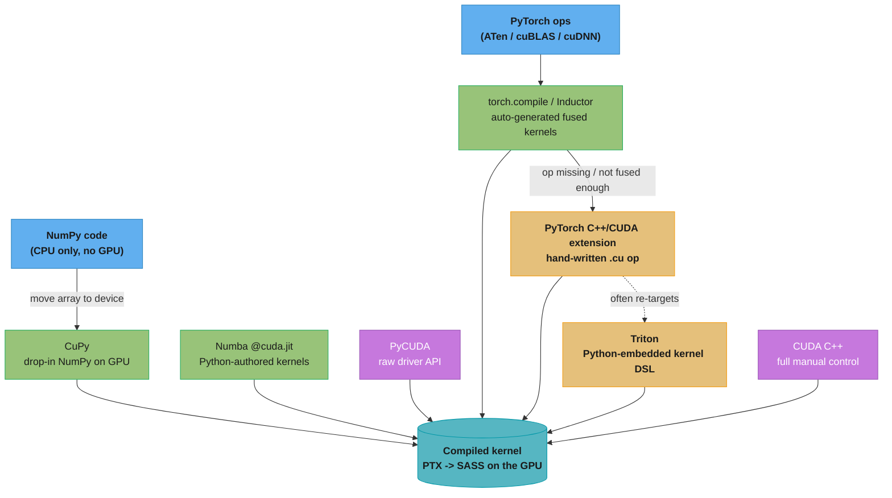
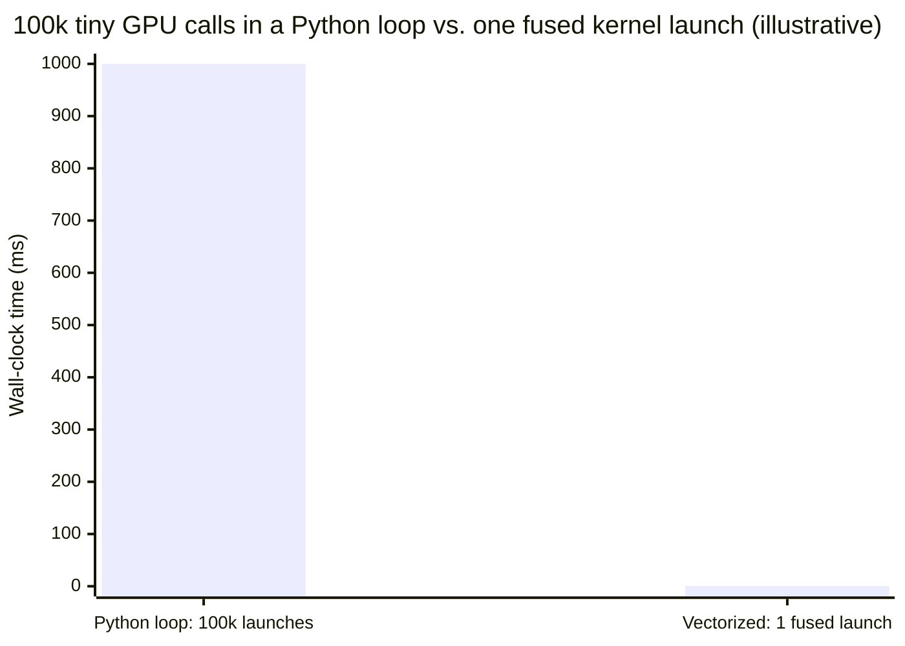
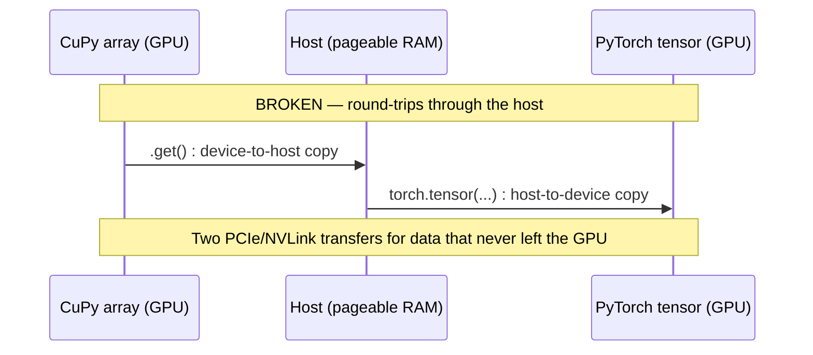
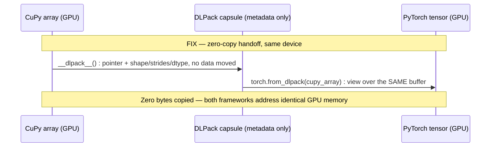
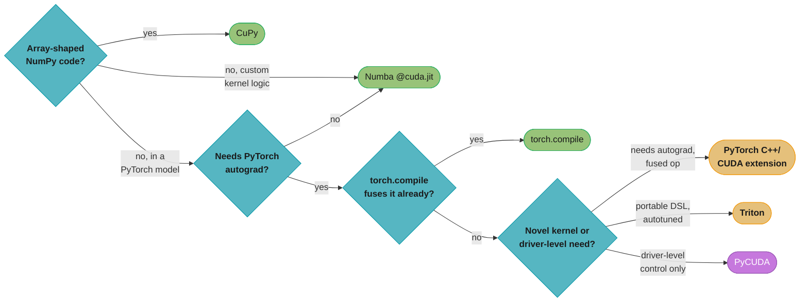
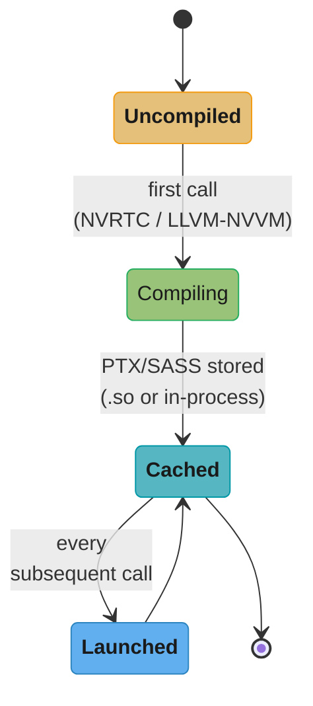
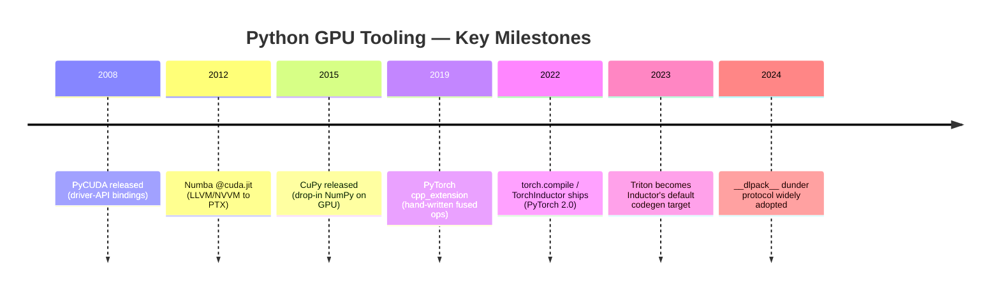
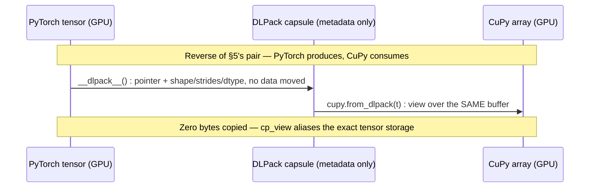

# Python GPU Ecosystem

## 1. Concept Overview

Most GPU code written in 2024-2026 is never typed as `.cu` files by the person who writes it. It is written in Python — CuPy arrays, Numba `@cuda.jit` kernels, PyTorch tensors — because the *population* that writes GPU code today is dominated by ML engineers and data scientists, not HPC kernel authors. This is not a compromise: every one of these Python-level tools still bottoms out in the exact same compiled PTX/SASS running on the exact same SMs described everywhere else in this section. Python's job is to *describe and launch* a kernel; the GPU never executes a single line of the CPython interpreter.

This module surveys the **Python GPU stack** end to end: **CuPy** (a drop-in NumPy replacement where every array lives on-device and every op is a CUDA kernel), **Numba CUDA** (`@cuda.jit` lowers ordinary Python functions through LLVM/NVVM straight to PTX — you still write thread/block indexing and shared memory by hand, just in Python syntax), **PyCUDA** (thin, low-level bindings directly onto the CUDA driver API, for when you need control the higher-level libraries don't expose), **PyTorch custom CUDA/C++ extensions** (the escape hatch: a hand-written `.cu` kernel bound into PyTorch via `pybind11` and `torch.utils.cpp_extension`, for fused ops that don't exist anywhere else), **`torch.compile`/TorchInductor** (traces a PyTorch graph and *automatically* emits fused Triton kernels — closing much of the gap that used to require a hand-written extension), and **DLPack** (a zero-copy tensor-interchange protocol that lets CuPy, PyTorch, JAX, and TensorFlow share the *same* GPU buffer without a host round-trip). The throughline is a single decision every senior engineer has to make repeatedly: **how far down this stack do you actually need to go for this op**, and each tool is a different answer to that question.

Cross-references: `../cuda_programming_model_and_kernels/` (the kernel/grid/block model every one of these tools ultimately targets), `../cuda_math_and_dnn_libraries/` (cuBLAS/cuDNN/CUTLASS — the libraries CuPy and PyTorch call into before ever reaching a hand-written kernel), `../triton_and_kernel_dsls/` (the DSL that both `torch.compile` and hand-authored kernels increasingly target instead of raw CUDA C++).

This module is deliberately **Python-primary** rather than dual-language like most of this section — not as an exception to the section's conventions, but because the Python GPU ecosystem *is* the subject matter. Where a tool's implementation is itself CUDA C++ (the kernel inside a PyTorch extension, the CUDA source a `RawKernel` compiles), the C++ is shown alongside the Python that drives it, exactly as it would be written and shipped in a real codebase.

---

## 2. Intuition

> **One-line analogy**: CuPy and Numba are driving an automatic car well — you get GPU speed without touching the transmission; a PyTorch CUDA/C++ extension is popping the hood and machining a part yourself because the factory doesn't sell it; `torch.compile` is a mechanic riding along who watches how you drive and writes that custom part *for* you, most of the time.

**Mental model**: Every tool in this stack pays a **fixed, roughly constant cost per kernel launch** — somewhere around 5-20 microseconds of CPU-side driver/API overhead — completely independent of how much work the kernel actually does. A kernel that processes 10 million elements pays that cost once. A Python `for` loop that calls a tiny GPU op once per element pays that cost *N times*, and for small per-call work the launch overhead, not the arithmetic, becomes the entire runtime. This is why "is this Python code slow" almost always reduces to "how many kernel launches does this Python code issue," not "is Python slow at math" — Python never does the math; it only decides how many times to ask the GPU to.

**Why it matters**: The overwhelming majority of GPU-accelerated ML infrastructure — every RAPIDS pipeline, every PyTorch training loop, every custom fused optimizer — lives entirely in this Python layer, and the engineer who can vectorize/fuse Python-level GPU code correctly turns a kernel-launch-bound mess into code that runs within a few percent of hand-written CUDA C++, without ever leaving Python. Interviews probe this because it is the daily-driver skill for ML-infra and GPU-platform roles: writing a raw CUDA kernel is comparatively rare; knowing *when* Python-level GPU code is already fast enough, and when it silently is not, is constant.

**Key insight**: The real skill in this module is not "can you write a Numba kernel" — it is knowing the **escape-hatch order**: reach for a framework op first, then `torch.compile`'s automatic fusion, then a hand-rolled CuPy/Numba kernel, and only drop to a hand-written PyTorch C++/CUDA extension (or raw CUDA C++) when the op genuinely does not exist anywhere in that chain and cannot be expressed as a composition of existing primitives without paying for extra HBM round-trips between them. Escaping too early wastes engineering time reinventing what cuBLAS/cuDNN/Inductor already do near-optimally; escaping too late leaves real fusion opportunities — and real speedups — on the table.

---

## 3. Core Principles

- **Python-level GPU code is fast because the *op*, not the language, runs on the GPU.** CuPy, Numba, and PyTorch all describe a kernel launch in Python and then execute compiled PTX/SASS on the SMs — identical to CUDA C++ once the kernel is running. Python's only cost is dispatch.
- **The single most common Python-GPU anti-pattern is a host-side loop over a GPU op.** Every iteration pays kernel-launch overhead (~5-20 microseconds) plus, if the loop reads a result back, a CPU-GPU synchronization stall — this dominates wall-clock time whenever per-call work is small relative to the fixed launch cost.
- **Numba's `@cuda.jit` does not auto-optimize the memory hierarchy for you.** You still write explicit `threadIdx`/`blockIdx` indexing, shared-memory tiles, and `syncthreads()` exactly as in CUDA C++ — Numba only changes *which compiler* lowers your code to PTX (LLVM/NVVM instead of `nvcc`), not the mental model.
- **CuPy's `ElementwiseKernel`/`RawKernel` exist specifically to fuse what would otherwise be several kernel launches into one.** Composing an expression from several separate CuPy calls launches one kernel per op and round-trips every intermediate result through HBM; a fused kernel does the whole expression in a single pass.
- **A PyTorch custom CUDA/C++ extension is the escape hatch for fusion the framework itself doesn't do.** It is a hand-written `.cu` kernel plus a `pybind11`-bound C++ launcher, compiled on the fly by `torch.utils.cpp_extension.load()`, that becomes an ordinary autograd-registerable PyTorch op once built.
- **`torch.compile`/TorchInductor automates a large fraction of what used to require a hand-written extension.** It traces the model's ops into a graph and its GPU codegen backend emits fused Triton kernels for chains of pointwise/reduction operations — for many workloads this closes the fusion gap without ever writing CUDA.
- **DLPack is a memory-layout *descriptor*, not a copy mechanism.** It carries a device pointer, shape, strides, dtype, and device id so a consumer (PyTorch, JAX, another CuPy array) can construct its own view over the *same* GPU allocation with zero bytes copied — provided the consumer runs on the same device as the producer.
- **The escape-hatch order matters more than any single tool's API.** Framework op -> `torch.compile` fusion -> hand-rolled CuPy/Numba kernel -> PyTorch C++/CUDA extension -> Triton -> raw CUDA C++. Skipping straight to raw CUDA reinvents work cuBLAS/cuDNN/Inductor already do near-optimally; staying too high leaves real fusion wins unclaimed.

---

## 4. Types / Architectures / Strategies

### 4.1 CuPy — Drop-in NumPy on the GPU

CuPy mirrors the NumPy (and a large slice of SciPy) API almost call-for-call, except every `cupy.ndarray` lives in device memory and every operation dispatches a CUDA kernel — elementwise ops via CuPy's own generated kernels, linear algebra via cuBLAS, FFTs via cuFFT, sparse ops via cuSPARSE. For code that is already expressed as NumPy-shaped array operations, changing `import numpy as np` to `import cupy as np` is frequently the entire porting effort. Beyond drop-in ops, CuPy exposes two explicit kernel-authoring primitives: `ElementwiseKernel` (describe a per-element expression; CuPy generates and fuses the loop) and `RawKernel` (hand the literal CUDA C source, compiled at runtime via NVRTC, for full control).

### 4.2 Numba CUDA — Writing Kernels in Python

Numba's `@cuda.jit` decorator JIT-compiles an ordinary Python function into a real CUDA kernel: the function body is lowered through LLVM's NVVM backend straight to PTX, the same target `nvcc` produces from CUDA C++. Inside a `@cuda.jit` kernel you write `cuda.grid()`/`cuda.threadIdx`/`cuda.blockIdx` for indexing and `cuda.shared.array()`/`cuda.syncthreads()` for on-chip staging — the identical memory-hierarchy mental model from `../cuda_memory_model_and_hierarchy/`, expressed in Python syntax rather than C++. Numba does not abstract away occupancy, coalescing, or bank conflicts; it only changes the authoring language.

### 4.3 PyCUDA — Low-Level Driver Access

PyCUDA is a thin binding directly onto the CUDA **driver API**: explicit context management, `SourceModule` for compiling inline CUDA C source, manual `mem_alloc`/`memcpy_htod`/`memcpy_dtoh` for host-device transfer. It predates CuPy and Numba and offers less convenience, but exposes driver-level control (custom contexts, explicit module/function handle management, fine control over streams) that the higher-level libraries deliberately hide. It remains common in legacy HPC codebases and in scenarios needing that low-level control without leaving Python.

### 4.4 PyTorch Custom CUDA/C++ Extensions

When an operation does not exist in ATen (PyTorch's operator library) and cannot be expressed as a composition of existing ops without extra HBM round-trips, a **custom extension** is the escape hatch: write the kernel in a real `.cu` file, write a thin C++ launcher function, bind it to Python with `pybind11`, and compile the pair via `torch.utils.cpp_extension.load()` (JIT, no manual `setup.py`) or `CUDAExtension` (ahead-of-time, `pip install`-able). The result is an ordinary Python-callable op that participates in autograd like any built-in PyTorch function, provided you also supply (or wrap in) a backward pass.

### 4.5 `torch.compile` / TorchInductor — Automatic Kernel Generation

`torch.compile` traces a model's operations into an FX graph, and its default GPU backend, **TorchInductor**, generates fused kernels for the traced graph — for elementwise and reduction chains, this typically means emitting a **Triton** kernel (see `../triton_and_kernel_dsls/`) that fuses what would otherwise be several separate ATen kernel launches into one. This automates a large fraction of the manual-fusion work that used to be the sole justification for writing a custom CUDA extension; it does not, however, invent genuinely novel algorithms (a new attention variant, a custom Tensor Core data layout) — those remain a hand-written-kernel problem.

### 4.6 DLPack — Zero-Copy Tensor Interchange

DLPack is a small, framework-neutral in-memory tensor descriptor (device pointer, shape, strides, dtype, device type/id) that CuPy, PyTorch, JAX, TensorFlow, and (via the buffer protocol) NumPy all understand. Passing an array through DLPack does not serialize or copy its data — it hands the consumer a capsule describing *where the existing GPU bytes already are* so the consumer can construct its own view over the same allocation. Modern versions of each framework implement the `__dlpack__`/`__dlpack_device__` dunder protocol directly, so `torch.from_dlpack(cupy_array)` and `cupy.from_dlpack(torch_tensor)` work without an explicit `to_dlpack()` call.

---

## 5. Architecture Diagrams

### The Python GPU Stack — Escalating Control



Every path converges on the same box: a compiled kernel executing on the SMs. The only thing that differs between paths is *who wrote the kernel* — CuPy/PyTorch/Inductor generate it for you, Numba/Triton let you author it in Python-adjacent syntax, and PyCUDA/CUDA C++ hand you the full, unabstracted driver and language.

### Kernel-Launch Overhead Dominates Small Per-Element Work



At roughly 10 microseconds of launch overhead per call, 100,000 sequential launches cost on the order of a full second of wall-clock time before a single byte of the *fixed, tiny* per-call arithmetic is counted — the loop is entirely launch-bound. Fusing the same 100,000 element-wise operations into a single kernel launch (one CuPy `ElementwiseKernel` call, or one vectorized `array + array`) collapses that to a fraction of a millisecond, a difference of roughly three to four orders of magnitude that has nothing to do with arithmetic and everything to do with launch count.

### DLPack Zero-Copy Handoff vs. the CPU Round-Trip





The broken flow pays two real memory-bus transfers (device-to-host, then host-to-device) purely to hand data between two libraries that are both already resident on the same GPU; the DLPack flow exchanges only a small metadata capsule and both tensors end up aliasing the identical allocation.

### The Escape-Hatch Decision Ladder

```
  "I have a GPU op to implement or speed up in Python" -- which rung do I need?

  rung 1  Does a NumPy/PyTorch op already do this?
          |-- yes -> use it (CuPy for array code, PyTorch ops for tensors/autograd)
          `-- no  -> rung 2

  rung 2  Would torch.compile's auto-fusion already fuse this chain?
          |-- yes -> @torch.compile and let Inductor generate the Triton kernel
          `-- no  -> rung 3

  rung 3  Can I express this as one fused elementwise/reduction expression?
          |-- yes -> cupy.ElementwiseKernel / numba @cuda.jit
          `-- no  -> rung 4

  rung 4  Do I need a genuinely novel algorithm, autograd registration,
          or fine control the above cannot express?
          |-- yes, and it must plug into PyTorch's autograd -> PyTorch
          |         C++/CUDA extension (torch.utils.cpp_extension)
          |-- yes, and I want a portable Python-DSL kernel -> Triton
          |         (../triton_and_kernel_dsls/)
          `-- yes, and I need full control (WMMA, cooperative groups,
                    driver-level context/stream orchestration) -> raw
                    CUDA C++ (or PyCUDA if only driver-level access is needed)
```

Each rung down this ladder trades convenience for control; the caption above §3 makes the same point in prose — escaping a rung too early duplicates work a library already does near-optimally, escaping too late leaves real fusion opportunities unclaimed. Notice that the ladder is not a one-way ratchet: a kernel written at rung 4 today because `torch.compile` couldn't fuse it can often move back up to rung 2 after a newer Inductor release closes the gap — revisiting hand-written kernels against the current compiler is part of maintaining this stack, not a one-time decision.

### Quick Decision Flow — Which Tool for This Task?



This collapses the rung-by-rung ladder above into a single traversal: most Python GPU code should exit at `CP`, `NB`, or `TC` — the `EXT`/`TR`/`PC` leaves are reached only when the earlier questions all answer "no."

### Control vs. Productivity — Where Each Tool Sits

```mermaid
quadrantChart
    title Python GPU tools: control vs. productivity
    x-axis Low control --> High control
    y-axis Low productivity --> High productivity
    quadrant-1 High control, high productivity
    quadrant-2 Low control, high productivity
    quadrant-3 Low control, low productivity
    quadrant-4 High control, low productivity
    CuPy: [0.20, 0.85]
    Numba @cuda.jit: [0.55, 0.55]
    Triton: [0.60, 0.65]
    PyTorch extension: [0.80, 0.35]
    PyCUDA: [0.90, 0.20]
```

CuPy buys the most productivity for the least control by hiding the kernel entirely; PyCUDA sits at the opposite corner, trading nearly all of that convenience for raw driver-level access — Numba and Triton occupy the middle ground where you author the kernel but a compiler still owns codegen.

### A JIT Kernel's Lifecycle — Compiled Once, Launched Many Times



Whether it is Numba's `@cuda.jit`, CuPy's `RawKernel`/NVRTC, or a PyTorch extension's `load()`, the same shape applies: the compile cost in `Compiling` is paid once, and every one of the (potentially millions of) later calls only pays the cheap `Cached -> Launched` transition.

### The Python GPU Ecosystem's Timeline



Each milestone raises the escape-hatch bar rather than replacing what came before — PyCUDA and hand-written extensions are still in daily use in 2026, but `torch.compile`/Triton mean far fewer workloads ever need to reach them.

---

## 6. How It Works — Detailed Mechanics

### 6.1 CuPy — Drop-in Ops, `ElementwiseKernel`, and `RawKernel`

```python
import cupy as cp

# Drop-in NumPy: every array below lives on the GPU; every op is a kernel launch
a = cp.random.rand(10_000_000, dtype=cp.float32)
b = cp.random.rand(10_000_000, dtype=cp.float32)
c = a * b + 1.0          # THREE kernel launches under naive composition:
                          # mul, add, and (if not fused) a temporary write-back

# ElementwiseKernel: fuse the same expression into ONE kernel launch, no
# intermediate written to HBM between the multiply and the add
fma = cp.ElementwiseKernel(
    in_params="float32 x, float32 y",
    out_params="float32 z",
    operation="z = x * y + 1.0f",
    name="fused_mul_add",
)
c_fused = fma(a, b)      # one launch, one HBM read of a and b, one HBM write of c

# RawKernel: hand CuPy a literal CUDA C source string, compiled at runtime by
# NVRTC -- full control when the ElementwiseKernel template isn't enough
saxpy_src = r"""
extern "C" __global__
void saxpy(const float* x, const float* y, float* out, float alpha, int n) {
    int i = blockIdx.x * blockDim.x + threadIdx.x;
    if (i < n) out[i] = alpha * x[i] + y[i];
}
"""
saxpy = cp.RawKernel(saxpy_src, "saxpy")
out = cp.empty_like(a)
threads = 256
blocks = (a.size + threads - 1) // threads
saxpy((blocks,), (threads,), (a, b, out, cp.float32(2.0), a.size))
```

The `RawKernel` call site should look identical to a CUDA C++ `<<<blocks, threads>>>` launch, because it *is* one — CuPy simply owns the NVRTC compile step and the argument marshaling.

### 6.2 Numba CUDA — Kernels Written in Python, Lowered to PTX

```python
from numba import cuda
import numpy as np

@cuda.jit
def saxpy_numba(x, y, out, alpha):
    i = cuda.grid(1)                      # identical index math to CUDA C++
    if i < out.size:
        out[i] = alpha * x[i] + y[i]

n = 10_000_000
x = cuda.to_device(np.random.rand(n).astype(np.float32))
y = cuda.to_device(np.random.rand(n).astype(np.float32))
out = cuda.device_array(n, dtype=np.float32)

threads_per_block = 256
blocks_per_grid = (n + threads_per_block - 1) // threads_per_block
saxpy_numba[blocks_per_grid, threads_per_block](x, y, out, 2.0)

# A shared-memory reduction -- the memory hierarchy is manual, exactly like
# CUDA C++ (see ../cuda_memory_model_and_hierarchy/, ../shared_memory_and_bank_conflicts/)
@cuda.jit
def block_sum_reduce(data, partial_sums):
    s_data = cuda.shared.array(shape=256, dtype=np.float32)
    tid = cuda.threadIdx.x
    i = cuda.grid(1)
    s_data[tid] = data[i] if i < data.size else 0.0
    cuda.syncthreads()

    stride = 128
    while stride > 0:
        if tid < stride:
            s_data[tid] += s_data[tid + stride]
        cuda.syncthreads()
        stride //= 2

    if tid == 0:
        partial_sums[cuda.blockIdx.x] = s_data[0]
```

`@cuda.jit` compiles this Python once (first call), caches the PTX, and every subsequent call launches the already-compiled kernel — the JIT cost is paid once, not per call.

### 6.3 PyCUDA — Low-Level Driver Control

```python
import pycuda.autoinit          # implicitly creates a CUDA context
import pycuda.driver as drv
from pycuda.compiler import SourceModule
import numpy as np

mod = SourceModule(r"""
__global__ void saxpy(float *out, float *x, float *y, float alpha, int n) {
    int i = blockIdx.x * blockDim.x + threadIdx.x;
    if (i < n) out[i] = alpha * x[i] + y[i];
}
""")
saxpy = mod.get_function("saxpy")

n = 1_000_000
x = np.random.rand(n).astype(np.float32)
y = np.random.rand(n).astype(np.float32)
out = np.empty_like(x)

# Manual device allocation and explicit host<->device copies -- no implicit
# array wrapper hides these steps the way CuPy's ndarray does
x_gpu = drv.mem_alloc(x.nbytes)
y_gpu = drv.mem_alloc(y.nbytes)
out_gpu = drv.mem_alloc(out.nbytes)
drv.memcpy_htod(x_gpu, x)
drv.memcpy_htod(y_gpu, y)

threads = 256
blocks = (n + threads - 1) // threads
saxpy(out_gpu, x_gpu, y_gpu, np.float32(2.0), np.int32(n),
      block=(threads, 1, 1), grid=(blocks, 1))

drv.memcpy_dtoh(out, out_gpu)
```

Every transfer and every kernel-launch dimension is explicit — this is the same level of control CUDA C++ gives you, just called from Python.

### 6.4 A PyTorch Custom CUDA/C++ Extension

A fused bias-add + GELU that does not exist as a single ATen op: the kernel file, the C++ launcher/binding, and the Python build call.

```cpp
// fused_bias_gelu_kernel.cu
#include <cuda_runtime.h>
#include <math.h>

__global__ void fused_bias_gelu_kernel(const float* __restrict__ x,
                                        const float* __restrict__ bias,
                                        float* __restrict__ out,
                                        int rows, int cols) {
    int idx = blockIdx.x * blockDim.x + threadIdx.x;
    int total = rows * cols;
    if (idx < total) {
        int col = idx % cols;
        float v = x[idx] + bias[col];                    // fused bias add
        // tanh-approximation GELU, computed in the SAME kernel -- no HBM
        // round-trip between the bias add and the activation
        float c = 0.7978845608f * (v + 0.044715f * v * v * v);
        out[idx] = 0.5f * v * (1.0f + tanhf(c));
    }
}

void fused_bias_gelu_launcher(const float* x, const float* bias, float* out,
                               int rows, int cols) {
    int total = rows * cols;
    int threads = 256;
    int blocks = (total + threads - 1) / threads;
    fused_bias_gelu_kernel<<<blocks, threads>>>(x, bias, out, rows, cols);
}
```

```cpp
// fused_bias_gelu.cpp -- pybind11 binding that PyTorch's autograd op wraps
#include <torch/extension.h>

void fused_bias_gelu_launcher(const float* x, const float* bias, float* out,
                               int rows, int cols);

torch::Tensor fused_bias_gelu(torch::Tensor x, torch::Tensor bias) {
    TORCH_CHECK(x.is_cuda(), "x must be a CUDA tensor");
    TORCH_CHECK(x.dtype() == torch::kFloat32, "only float32 is supported");
    auto out = torch::empty_like(x);
    int rows = x.size(0);
    int cols = x.size(1);
    fused_bias_gelu_launcher(x.data_ptr<float>(), bias.data_ptr<float>(),
                              out.data_ptr<float>(), rows, cols);
    return out;
}

PYBIND11_MODULE(TORCH_EXTENSION_NAME, m) {
    m.def("fused_bias_gelu", &fused_bias_gelu, "Fused bias-add + GELU (CUDA)");
}
```

```python
# build_and_call.py -- JIT compile via torch.utils.cpp_extension, no setup.py
import torch
from torch.utils.cpp_extension import load

fused_ext = load(
    name="fused_bias_gelu_ext",
    sources=["fused_bias_gelu.cpp", "fused_bias_gelu_kernel.cu"],
    verbose=True,
)   # invokes nvcc + the system C++ compiler via ninja, caches the .so

x = torch.randn(4096, 1024, device="cuda")
bias = torch.randn(1024, device="cuda")
out = fused_ext.fused_bias_gelu(x, bias)   # ordinary Python call, GPU op underneath
```

`load()` recompiles only when a source file changes (content-hash-based caching), so the JIT cost is paid once per code change, not once per process start.

### 6.5 `torch.compile` / TorchInductor — Kernels Generated for You

```python
import torch

def bias_gelu(x, bias):
    v = x + bias
    return 0.5 * v * (1.0 + torch.tanh(0.7978845608 * (v + 0.044715 * v ** 3)))

compiled = torch.compile(bias_gelu)   # traces the graph; GPU backend = TorchInductor

x = torch.randn(4096, 1024, device="cuda")
bias = torch.randn(1024, device="cuda")
out = compiled(x, bias)   # first call: trace + Triton codegen + compile (slow, cached)
                          # subsequent calls: run the cached fused Triton kernel

# TORCH_LOGS="output_code" python this_script.py prints Inductor's generated
# kernel; illustrative shape of what it emits for the fused expression above:
#
#   @triton.jit
#   def triton_fused_bias_gelu(x_ptr, bias_ptr, out_ptr, n_elements,
#                               BLOCK_SIZE: tl.constexpr):
#       pid = tl.program_id(axis=0)
#       offsets = pid * BLOCK_SIZE + tl.arange(0, BLOCK_SIZE)
#       mask = offsets < n_elements
#       x = tl.load(x_ptr + offsets, mask=mask)
#       b = tl.load(bias_ptr + (offsets % bias_ptr.numel()), mask=mask)
#       v = x + b
#       # ... tanh-approx GELU computed inline, one load, one store ...
#       tl.store(out_ptr + offsets, result, mask=mask)
```

The generated Triton kernel above is functionally the same fusion as the hand-written `.cu` extension in §6.4 — for this shape of expression, Inductor closes the gap without a single line of hand-written CUDA.

### 6.6 DLPack — Zero-Copy Interchange, Two Ways

```python
import cupy as cp
import torch

cp_array = cp.random.rand(10_000_000, dtype=cp.float32)

# Modern dunder-protocol form: CuPy implements __dlpack__/__dlpack_device__,
# so torch.from_dlpack accepts it directly -- zero bytes copied
torch_view = torch.from_dlpack(cp_array)

# Legacy explicit-capsule form (still valid, useful on older library versions)
capsule = cp_array.toDlpack()
torch_view_legacy = torch.utils.dlpack.from_dlpack(capsule)

# Both torch_view and cp_array alias the SAME GPU allocation: mutating one
# is visible through the other, because no copy ever happened
torch_view[0] = -1.0
assert cp_array[0].item() == -1.0

# The reverse direction works identically: a PyTorch tensor -> CuPy array
t = torch.randn(1_000_000, device="cuda")
cp_view = cp.from_dlpack(t)
```

### DLPack Also Runs Producer-to-Consumer in Reverse



The protocol is symmetric by design: whichever framework calls `from_dlpack` on the other's array becomes the consumer, and the direction never changes whether a copy happens — only same-vs-different-device does (see the pitfall bullet in §10).

---

## 7. Real-World Examples

- **RAPIDS (cuDF, cuML)** — NVIDIA's GPU dataframe and ML-algorithm libraries are built on CuPy-compatible memory semantics; a `cudf.DataFrame` column can be handed to CuPy or PyTorch via `__cuda_array_interface__`/DLPack without a host round-trip.
- **NVIDIA Apex / DeepSpeed fused optimizers** — `FusedAdam` and similar fused optimizer kernels are exactly the PyTorch-extension pattern in §6.4: a single hand-written CUDA kernel replaces what would otherwise be a dozen separate elementwise PyTorch ops (and a dozen kernel launches) per parameter update.
- **FlashAttention's Python bindings** — the published FlashAttention kernel is written in CUDA C++/CUTLASS and exposed to PyTorch through the exact `pybind11` + `torch.utils.cpp_extension` mechanism shown in §6.4, because fusing softmax into the matmul is not expressible as composed ATen ops.
- **PyTorch 2.x training loops with `torch.compile`** — enabled by default in many training recipes; Inductor's auto-generated Triton kernels routinely fuse normalization, activation, and residual-add chains that used to require dedicated fused kernels.
- **Numba in scientific computing** — astrophysics N-body codes and Anaconda-accelerated pandas UDFs use `@cuda.jit` to GPU-accelerate custom per-element or per-row logic without leaving the Python/NumPy ecosystem.
- **PyCUDA in legacy HPC and research codebases** — pre-dating CuPy, still found in academic simulation code that needs explicit CUDA context/stream control PyCUDA exposes directly.
- **`cuda-python` / driver-level Python bindings** — NVIDIA's own low-level Python bindings for the driver and runtime APIs occupy the same niche as PyCUDA for teams that want an NVIDIA-maintained package rather than a community one, without giving up driver-level control.

---

## 8. Tradeoffs

| Tool | Level | When to use | Escape hatch it offers |
|------|-------|-------------|--------------------------|
| **CuPy** | High (drop-in array API) | NumPy-shaped array code; want GPU speed with near-zero porting effort | `ElementwiseKernel` (fuse an expression) and `RawKernel` (full inline CUDA C via NVRTC) when drop-in ops aren't enough |
| **Numba CUDA** | Mid (Python-authored kernel) | A custom elementwise/reduction kernel, written and iterated on in Python, no autograd needed | Full manual thread/block/shared-memory control, same mental model as CUDA C++ |
| **PyCUDA** | Low (raw driver bindings) | Explicit context/stream/module control the higher-level libraries don't expose; legacy HPC codebases | Direct driver-API access from Python — closest thing to CUDA C++ without leaving the language |
| **PyTorch C++/CUDA extension** | Low (hand-written kernel + binding) | A fused, autograd-registrable op that doesn't exist in ATen and can't be composed without extra HBM round-trips | Full CUDA C++ inside a normal PyTorch op — the ultimate fusion escape hatch |
| **`torch.compile`/Inductor** | High (automatic) | Any PyTorch model/function; let the compiler find and fuse pointwise/reduction chains for you | Generates Triton kernels automatically — often removes the need for a hand-written extension entirely |
| **Triton** (`../triton_and_kernel_dsls/`) | Mid-low (Python-embedded DSL) | A genuinely novel fused kernel that needs more control than Inductor's auto-fusion gives, but not full CUDA C++ | Block-level Python-syntax kernel authoring with autotuning, portable across GPU vendors in principle |

---

## 9. When to Use / When NOT to Use

**Use CuPy when:**
- Your workload is already expressed as NumPy/SciPy-shaped array operations and you want GPU acceleration with minimal code change.
- You need a one-off fused elementwise or custom kernel but don't need PyTorch's autograd.

**Avoid CuPy when:**
- You need automatic differentiation — CuPy has no autograd; reach for PyTorch instead.

**Use Numba CUDA when:**
- You want to author a custom kernel (reduction, stencil, histogram) in Python, iterate quickly, and don't need it registered as a differentiable op.

**Avoid Numba CUDA when:**
- You need advanced features with narrower or slower-to-update support than CUDA C++ — Tensor Core WMMA intrinsics, cooperative-group grid sync, dynamic parallelism.

**Use PyCUDA when:**
- You need explicit driver-level control (custom contexts, module loading, fine-grained stream orchestration) that CuPy/Numba abstract away, or you're extending a legacy PyCUDA codebase.

**Avoid PyCUDA when:**
- CuPy or Numba already cover your need with far less boilerplate — PyCUDA's manual allocation/transfer code is rarely worth it for ordinary array workloads today.

**Use a PyTorch custom CUDA/C++ extension when:**
- The op must be autograd-differentiable, embedded in a training loop, and does not exist in ATen/cuDNN, and composing it from existing ops would force extra HBM round-trips `torch.compile` doesn't eliminate.

**Avoid a custom extension when:**
- `torch.compile`'s generated Triton kernel already achieves the fusion you need — check with `TORCH_LOGS="output_code"` before writing C++.

**Use `torch.compile` first, by default:**
- It costs one decorator and one (cached) recompile; only fall back to a hand-written kernel if profiling shows the generated code isn't fused or fast enough.

**Use DLPack whenever two GPU-resident libraries need to exchange data:**
- Never round-trip through host memory (`.get()`/`.cpu()` then re-upload) when both ends already live on the same GPU — see the BROKEN->FIX in §14.

---

## 10. Common Pitfalls

**BROKEN — a Python loop calling a tiny GPU op per element (kernel-launch-bound):**

```python
import cupy as cp
import time

n = 100_000
x = cp.random.rand(n, dtype=cp.float32)
y = cp.random.rand(n, dtype=cp.float32)
out = cp.empty(n, dtype=cp.float32)

start = time.perf_counter()
for i in range(n):
    out[i] = x[i] * 2.0 + y[i]      # ONE kernel launch per element -- ~100,000
                                     # launches, each ~5-20 microseconds of pure
                                     # driver overhead, none of it doing real work
cp.cuda.Stream.null.synchronize()
print(f"loop: {time.perf_counter() - start:.3f}s")   # dominated by launch count,
                                                       # not by 100,000 tiny FMAs
```

At ~10 microseconds of launch overhead per call, 100,000 iterations cost on the order of a full second before any arithmetic is counted — the GPU is nearly idle the whole time, waiting on the CPU to issue the next launch. This is the single most common Python-GPU anti-pattern: it looks like "the GPU is being used" because every op runs on-device, but the *pattern of use* is entirely launch-bound.

**FIX — vectorize the whole expression into one kernel launch:**

```python
import cupy as cp
import time

n = 100_000
x = cp.random.rand(n, dtype=cp.float32)
y = cp.random.rand(n, dtype=cp.float32)

start = time.perf_counter()
out = x * 2.0 + y          # ONE (or two, if not fused by CuPy's kernel fusion
                            # pass) kernel launch(es) covering all n elements
cp.cuda.Stream.null.synchronize()
print(f"vectorized: {time.perf_counter() - start:.4f}s")

# For a hot expression re-evaluated many times, fuse explicitly to guarantee
# ONE launch regardless of CuPy's fusion heuristics:
fma = cp.ElementwiseKernel(
    in_params="float32 x, float32 y",
    out_params="float32 z",
    operation="z = x * 2.0f + y",
    name="fma_fixed",
)
out_fused = fma(x, y)
```

The vectorized version replaces 100,000 launches with one (or a small constant number), turning a launch-bound second-scale operation into a sub-millisecond one — a difference of roughly three to four orders of magnitude for this shape of workload (see the xychart in §5).

**Other frequent pitfalls:**

- **Round-tripping between CuPy and PyTorch through host memory** (`cupy_array.get()` then `torch.tensor(...)`) when both already live on the same GPU — this pays two real PCIe/NVLink transfers for data that never needed to leave device memory; the full BROKEN->FIX with metrics is worked in §14 via DLPack.
- **Assuming a CuPy/Numba call is asynchronous-safe without a `synchronize()` when timing it.** CUDA kernel launches are asynchronous from the host's perspective; a naive `time.perf_counter()` around an un-synchronized call measures launch dispatch time, not actual kernel completion.
- **Writing a Numba `@cuda.jit` kernel and expecting the compiler to auto-tile shared memory.** Numba does not add tiling, coalescing, or occupancy tuning for you — every optimization from `../memory_coalescing_and_access_patterns/` and `../shared_memory_and_bank_conflicts/` still has to be written by hand.
- **Reaching for a custom PyTorch extension before checking `torch.compile`.** For ordinary pointwise/reduction fusion, Inductor frequently generates a kernel competitive with a hand-written one — check `TORCH_LOGS="output_code"` before spending engineering time on C++.
- **Forgetting that DLPack sharing requires the same device.** A CuPy array on GPU 0 cannot zero-copy-share with a PyTorch tensor expected on GPU 1 — cross-device sharing still requires an explicit copy; DLPack only removes the copy that was never necessary in the first place.

---

## 11. Technologies & Tools

| Tool | Role in the Python GPU stack |
|------|-------------------------------|
| **CuPy** | Drop-in NumPy/SciPy-API array library; every op dispatches a CUDA kernel (own generated kernels, cuBLAS, cuFFT, cuSPARSE, cuRAND under the hood) |
| **Numba** (`numba.cuda`) | JIT-compiles Python functions decorated `@cuda.jit` through LLVM/NVVM straight to PTX; manual memory-hierarchy control |
| **PyCUDA** | Thin Python bindings onto the CUDA driver API; `SourceModule` compiles inline CUDA C via NVRTC; explicit context/memory management |
| **`torch.utils.cpp_extension`** | JIT (`load()`) or ahead-of-time (`CUDAExtension`/`setup.py`) compilation of hand-written `.cu`/`.cpp` sources into a PyTorch-callable, `pybind11`-bound op |
| **TorchInductor** (`torch.compile`) | PyTorch 2.x's default GPU compiler backend; traces the FX graph and emits fused Triton (or C++) kernels automatically |
| **Triton** | Python-embedded kernel DSL that both hand-authored kernels and Inductor's codegen increasingly target instead of raw CUDA C++ — full treatment in `../triton_and_kernel_dsls/` |
| **DLPack** (`__dlpack__`/`__dlpack_device__`, `to_dlpack`/`from_dlpack`) | Cross-framework zero-copy tensor-interchange protocol shared by CuPy, PyTorch, JAX, TensorFlow |
| **`__cuda_array_interface__`** | An older, simpler zero-copy interchange protocol (numba/CuPy/RAPIDS) predating widespread DLPack adoption; still seen in RAPIDS interop code |
| **NVRTC** | The runtime CUDA C++ compiler that backs CuPy's `RawKernel` and PyCUDA's `SourceModule` — compiles source strings to PTX at runtime, no `nvcc` invocation needed |
| **Nsight Systems** | Profiles Python-level GPU code exactly like CUDA C++ — the kernel-launch-count anti-pattern in §10 shows up directly as a wall of tiny, back-to-back kernel launches on the timeline (`../profiling_and_performance_analysis/`) |

---

## 12. Interview Questions with Answers

**Q: Why is a Python `for` loop that calls a tiny GPU op per element almost always slow, even though each op itself runs on the GPU?**
Every iteration pays a fixed kernel-launch overhead of roughly 5-20 microseconds of CPU-side driver work, and when the per-call arithmetic is tiny, that fixed cost — not the math — dominates wall-clock time. The fix is always the same: vectorize or fuse so the whole operation is one kernel launch instead of N.

**Q: Does writing GPU code in CuPy or Numba mean the computation runs "in Python"?**
No — Python only describes and launches the kernel; the actual computation executes as compiled PTX/SASS on the SMs, identical to a CUDA C++ kernel doing the same work. The interpreter's overhead is limited to dispatch, never the arithmetic itself.

**Q: Why can copying data between CuPy and PyTorch with `.get()` followed by `torch.tensor(...)` be a hidden performance bug?**
It forces a real device-to-host copy and then a host-to-device copy through pageable memory, even though both arrays already live on the same GPU and never needed to leave device memory. DLPack (or the dunder-protocol `torch.from_dlpack(cupy_array)`) shares the identical buffer with zero copies instead.

**Q: What is DLPack, and does it copy any data?**
DLPack is a small, framework-neutral descriptor — device pointer, shape, strides, dtype, and device id — that lets one framework construct a view over another framework's existing GPU allocation. It never copies or serializes the underlying data; it only exchanges metadata about where that data already is.

**Q: Is Numba CUDA a good substitute for CUDA C++ for production performance-critical kernels?**
Often yes for straightforward elementwise, reduction, or stencil kernels, since `@cuda.jit` lowers to the same PTX target `nvcc` produces. It is a weaker substitute when a kernel needs advanced features with narrower or slower-updated support — Tensor Core WMMA intrinsics, cooperative-group grid-wide sync, dynamic parallelism — where CUDA C++ remains the primary, best-supported path.

**Q: What is CuPy, in one sentence?**
CuPy is a NumPy/SciPy-API-compatible array library where every array lives in GPU memory. Every operation dispatches a CUDA kernel underneath — CuPy's own generated kernels for elementwise ops, cuBLAS for linear algebra, cuFFT for transforms.

**Q: What is the difference between CuPy's `ElementwiseKernel` and `RawKernel`?**
`ElementwiseKernel` takes a per-element expression and CuPy generates and fuses the surrounding kernel wrapper automatically. `RawKernel` takes a literal CUDA C source string you write in full and compile via NVRTC, giving complete control at the cost of writing real CUDA C.

**Q: How does a Numba `@cuda.jit` kernel differ from writing the same logic in CUDA C++?**
You still write explicit thread/block indexing and manage shared memory by hand, exactly like CUDA C++. Numba only changes which compiler lowers the code to PTX (LLVM/NVVM instead of `nvcc`), not the underlying memory-hierarchy or occupancy mental model.

**Q: When would you choose PyCUDA over CuPy or Numba?**
When you need driver-API-level control that the higher-level libraries deliberately abstract away. That includes explicit CUDA context management, custom module/function-handle loading, fine-grained stream orchestration, or extending an existing legacy PyCUDA codebase.

**Q: What is a PyTorch custom CUDA/C++ extension, and when do you actually need one?**
It is a hand-written `.cu` kernel plus a `pybind11`-bound C++ launcher, compiled via `torch.utils.cpp_extension`, that becomes an ordinary autograd-registerable PyTorch op. It's needed when an operation doesn't exist in ATen/cuDNN and can't be composed from existing ops without paying for extra HBM round-trips between them.

**Q: How does `torch.utils.cpp_extension.load()` work?**
It JIT-compiles the given `.cpp`/`.cu` sources with the system C++ compiler and `nvcc`, orchestrated via `ninja`. It content-hash-caches the resulting shared library and returns a Python module exposing the `pybind11`-bound function, with no manual `setup.py` build step required.

**Q: What does `torch.compile`/TorchInductor actually generate under the hood on GPU?**
It traces the model's operations into an FX graph and its GPU codegen backend emits fused kernels, typically Triton kernels. These combine chains of pointwise and reduction operations into fewer kernel launches than unfused eager-mode execution would issue.

**Q: If `torch.compile` already auto-fuses kernels, why would an engineer still write a custom CUDA extension?**
Inductor's automatic fusion covers pointwise/reduction chains well but does not invent genuinely novel algorithms. A custom attention variant or a bespoke Tensor Core data layout still needs the hand-written extension escape hatch, since it falls outside what Inductor's fusion heuristics can reach.

**Q: Why does `cupy.ElementwiseKernel` typically outperform the same expression composed from several separate CuPy calls?**
Composing separate calls launches one kernel per operation and writes every intermediate result to HBM before the next op reads it back. The fused `ElementwiseKernel` performs the entire expression in a single kernel launch and a single pass over HBM, eliminating the intermediate round-trips entirely.

**Q: What data does a DLPack capsule actually carry, and can it share memory across two different GPUs?**
It carries a device pointer, shape, strides, dtype, and device type/id — enough for the consumer to build a matching view over the exact same allocation. It cannot zero-copy-share across two different GPU devices, since cross-device sharing still requires an explicit copy.

**Q: Why is arithmetic-intensity/roofline awareness still relevant even when writing GPU code entirely at the CuPy or Numba level?**
Wrapping a kernel in a friendlier Python API changes how much code you had to write to launch it, not whether the kernel is memory-bound or compute-bound. The same roofline reasoning from `../cuda_math_and_dnn_libraries/` still determines what optimization actually moves the needle.

---

## 13. Best Practices

- **Vectorize or fuse before reaching for a custom kernel.** Express the operation as CuPy array ops or a single `ElementwiseKernel`/`@cuda.jit` kernel first; a hand-written PyTorch/CUDA extension is a later escalation, not a first move.
- **Try `torch.compile` before writing a PyTorch C++/CUDA extension.** Check `TORCH_LOGS="output_code"` to see whether Inductor's generated Triton kernel already achieves the fusion you were about to hand-write.
- **Never round-trip through host memory between two GPU-resident libraries.** Use DLPack (`torch.from_dlpack`, `cupy.from_dlpack`) or `__cuda_array_interface__` whenever CuPy, PyTorch, JAX, or RAPIDS need to hand off the same GPU data.
- **Profile kernel-launch count, not just per-kernel time, with Nsight Systems.** A wall of tiny back-to-back launches on the timeline is the direct visual signature of the loop anti-pattern in §10, even before looking at any individual kernel's duration.
- **Prefer `ElementwiseKernel`/`RawKernel` fusion over several chained CuPy calls on a hot path**, since every unfused call is a full extra HBM round-trip for its intermediate result.
- **Keep custom PyTorch extensions autograd-correct** — either register a matching backward kernel or wrap the forward in `torch.autograd.Function`, rather than silently breaking gradient flow through a fast-but-opaque forward-only op.
- **Follow the escape-hatch order deliberately**: framework op -> `torch.compile` fusion -> hand-rolled CuPy/Numba kernel -> PyTorch C++/CUDA extension -> Triton -> raw CUDA C++ — and be able to justify, in an interview, why a given workload needs to be at the rung it's at.
- **Validate a new kernel's correctness against a CPU/NumPy reference before trusting any of its performance numbers** — a kernel that is wrong and fast is a strictly worse outcome than one that is right and slow.
- **Document which rung of the escape-hatch ladder a custom kernel sits on, and why**, so the next engineer who touches it knows whether reaching a higher rung (a newer `torch.compile` release, a newer ATen op) would let the hand-written code be retired rather than carried forward indefinitely.

---

## 14. Case Study

**Scenario**: An ML-infra team runs a real-time feature-preprocessing pipeline — CuPy-based (mirroring a RAPIDS-style workflow) — that computes normalized features on the GPU and hands them to a PyTorch inference model running on the same A100. Profiling a production batch (batch size 4096, 512 features) shows the model's own forward pass takes ~1.1 ms, but each batch has an unexplained ~2.0 ms tax sitting *between* the CuPy preprocessing step and the PyTorch forward call — nearly double the actual inference cost, on data that never logically needed to leave the GPU.

**Diagram — where the tax is hiding:**

```
   CuPy preprocessing (GPU)  --.get()-->  NumPy array (HOST, pageable RAM)
                                              |
                                       torch.tensor(..., device="cuda")
                                              |
                                              v
                                  PyTorch tensor (GPU) -- back where it started

   Two real PCIe/NVLink transfers (device->host, host->device) for 4096 x 512
   float32 = ~8 MB per batch that was ALREADY resident on the GPU the entire time.
```

**BROKEN — CuPy-to-PyTorch handoff via a host round-trip:**

```python
import cupy as cp
import torch

def preprocess_and_infer_broken(raw_batch_gpu: cp.ndarray, model: torch.nn.Module):
    features = normalize_on_gpu(raw_batch_gpu)     # CuPy op, stays on GPU so far

    # THE BUG: forces device->host, then host->device -- for data that
    # never needed to touch the CPU at all
    host_array = features.get()                    # device -> host copy
    torch_input = torch.tensor(host_array, device="cuda")  # host -> device copy

    with torch.no_grad():
        return model(torch_input)
```

**FIX — DLPack zero-copy handoff, no host involvement:**

```python
import cupy as cp
import torch

def preprocess_and_infer_fixed(raw_batch_gpu: cp.ndarray, model: torch.nn.Module):
    features = normalize_on_gpu(raw_batch_gpu)     # CuPy op, GPU-resident

    # THE FIX: CuPy implements __dlpack__, so torch.from_dlpack builds a view
    # over the SAME allocation -- zero bytes copied, zero PCIe/NVLink traffic
    torch_input = torch.from_dlpack(features)

    with torch.no_grad():
        return model(torch_input)
```

**Metrics (A100, batch=4096, 512 features, representative):**

| Metric | Broken (host round-trip) | Fixed (DLPack) |
|--------|---------------------------|------------------|
| Handoff latency | ~2.0 ms | ~0.01 ms (metadata only) |
| Bytes actually copied | ~16 MB (8 MB down + 8 MB up) | 0 |
| End-to-end batch latency (preprocess + handoff + inference) | ~3.3 ms | ~1.3 ms |
| Throughput at fixed batch size | ~1,240 batches/s | ~3,150 batches/s |

**Discussion Questions**:
1. Why does the broken version's cost scale with batch size while the fixed version's handoff cost stays nearly flat? (The round-trip literally copies every byte of the batch twice across the memory bus, so its cost is proportional to batch-size x feature-count x 4 bytes; the DLPack capsule is a small, fixed-size metadata structure regardless of how large the underlying tensor is.)
2. What would happen if `raw_batch_gpu` and the PyTorch model lived on two different GPUs? (DLPack cannot zero-copy-share across devices — the consumer must run on the same device as the producer's allocation, so a genuine copy, and an explicit one, would still be required; see the pitfall bullet in §10.)
3. Would `__cuda_array_interface__` have solved this instead of DLPack? (Yes, for CuPy/Numba-era interop specifically — it's an older, narrower zero-copy protocol predating DLPack's broader multi-framework adoption; DLPack is the more portable modern choice since it's also understood by JAX and TensorFlow.)
4. Is there ever a reason to still go through the host in a CuPy-to-PyTorch pipeline? (Only when the consumer genuinely must run on the CPU, or the two arrays are deliberately on different, non-peer-connected devices where no faster device-to-device path exists — otherwise the host round-trip is strictly a bug, not a design choice.)

---

**See also**: `../cuda_programming_model_and_kernels/` (the kernel/grid/block model every tool in this stack ultimately targets), `../cuda_math_and_dnn_libraries/` (the cuBLAS/cuDNN/CUTLASS libraries CuPy and PyTorch call into before any custom kernel is needed), `../triton_and_kernel_dsls/` (the Python-embedded kernel DSL both hand-authored kernels and `torch.compile` increasingly target), `../profiling_and_performance_analysis/` (Nsight Systems workflow for spotting the kernel-launch-count anti-pattern from §10 on a real timeline).
