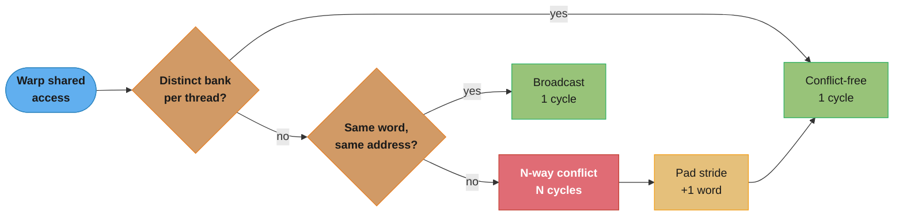
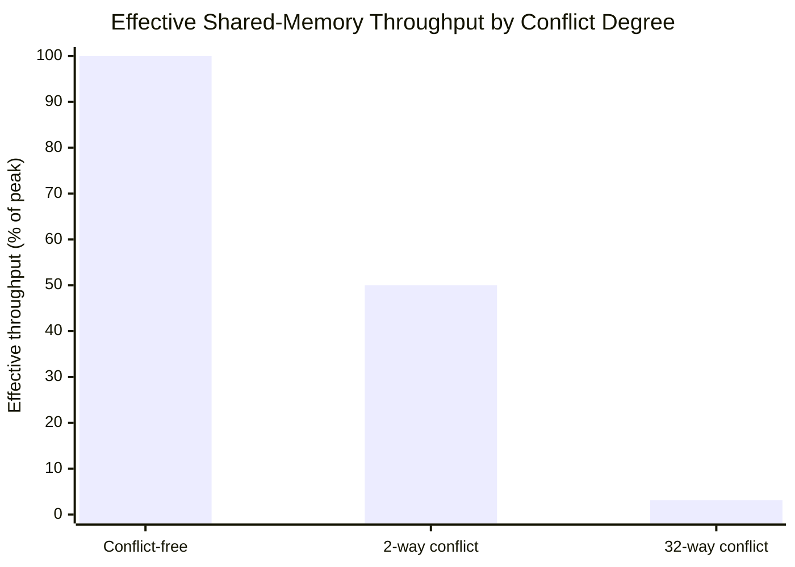
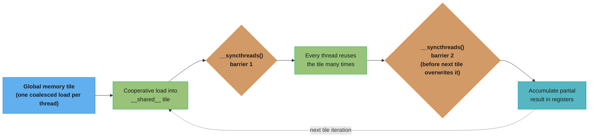
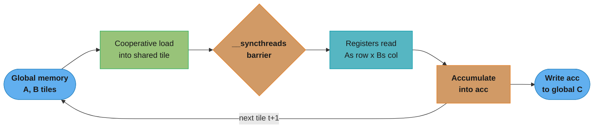
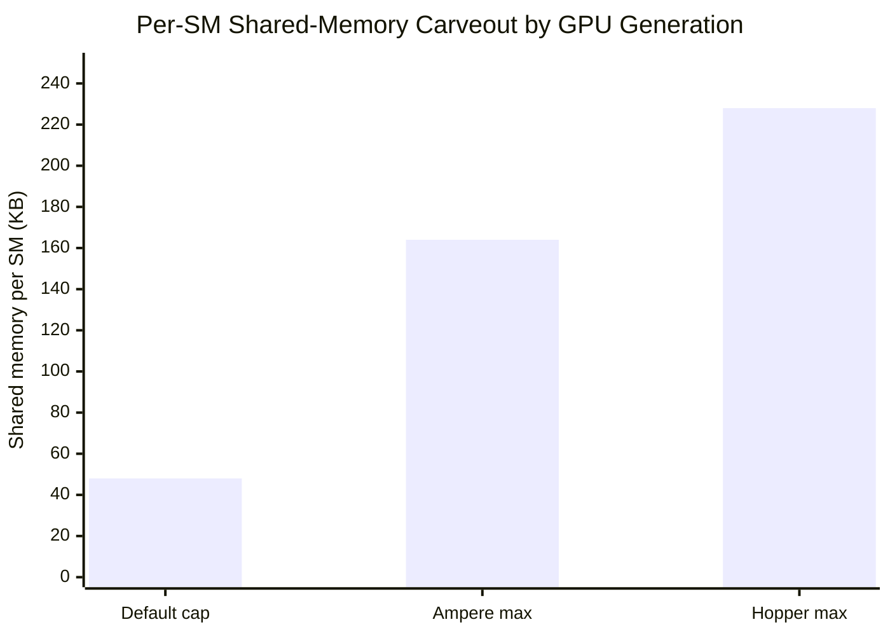
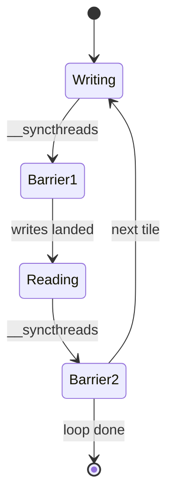

# Shared Memory & Bank Conflicts

## 1. Concept Overview

Shared memory is a small, fast, on-chip scratchpad that every thread block owns for the
duration of its lifetime. It sits physically on the Streaming Multiprocessor (SM) itself —
not on the off-chip HBM stack that backs global memory — so a shared-memory access costs on
the order of 20-30 cycles versus the ~400-800 cycle latency of an uncached global-memory
load: roughly two orders of magnitude faster. The entire performance-engineering discipline
built on top of shared memory is **tiling**: cooperatively loading a chunk ("tile") of global
data into shared memory once, then having every thread in the block reuse that tile many
times before it evicts, converting a memory-bound kernel into a compute-bound one.

But shared memory's speed comes with a hardware constraint that traps unwary kernel authors:
it is physically banked. The 48 KB (or larger) shared-memory array backing a block is split
into **32 banks**, each 4 bytes wide, and each bank can service exactly one access per cycle.
When the 32 threads of a warp issue a shared-memory instruction, the hardware distributes
those 32 addresses across the 32 banks in parallel *if and only if* every thread lands on a
different bank. The moment two or more threads in the same warp target different addresses
in the **same** bank, the hardware serializes those accesses — the “free” 100x speedup over
global memory silently degrades toward global-memory levels for exactly that instruction.
This module is entirely about seeing that mapping, breaking it on purpose, and fixing it with
one extra column of padding.

See [Memory Coalescing & Access Patterns](../memory_coalescing_and_access_patterns/) for the
global-memory-side analog of this problem (coalesced vs strided access), and
[Synchronization & Atomics](../synchronization_and_atomics/) for the `__syncthreads()`
barrier this module leans on to make the load-then-compute tiling pattern safe.

---

## 2. Intuition

> **One-line analogy**: Shared memory is a hotel with 32 elevators (banks); if every guest on
> a floor requests a *different* elevator, all 32 ride up in the same trip, but if two guests
> both call elevator 5, one of them waits for the other to finish before it even starts moving.

**Mental model**: Global memory is a warehouse across town — every trip costs hundreds of
cycles of travel time, so you batch as much as you can into one truck (coalescing). Shared
memory is a shelf right next to the workbench — grabbing something from it is nearly free,
*but* the shelf has 32 numbered slots (banks) and only one worker can reach into a given slot
per cycle. If 32 workers (a warp) each reach for a different slot, everyone is served in one
cycle. If several workers reach for different items that happen to sit in the *same* slot,
they queue up single-file — the shelf's whole advantage over the warehouse evaporates for
that reach.

**Why it matters**: Nearly every hand-tuned CUDA kernel that beats a naive baseline —
tiled GEMM, convolution, FlashAttention, reduction, histogram, stencils — routes its hot data
through shared memory at least once. Getting the tiling right (loading data cooperatively,
synchronizing before reuse) is necessary but not sufficient: a kernel with a perfectly correct
tiling algorithm can still run at a fraction of its potential throughput if the access pattern
into the tile happens to walk down bank-aligned strides. Interviewers use this topic
specifically because it has an objectively provable, arithmetic answer — "what is the bank of
`tile[row][col]` at address `row*32+col`?" — that separates candidates who have internalized
the SM memory model from those reciting "use shared memory, it's faster."

**Key insight**: A bank conflict is not about data volume or bandwidth — it is a **pure
address-arithmetic** collision. `bank = (word_address) mod 32`. Any access pattern whose
stride is a multiple of 32 words maps every thread in a warp onto the identical bank, no
matter how small the array or how fast the SM. The fix is never "use less shared memory" —
it is "shift the address arithmetic by one column" so the natural row-major layout no longer
lines up with the 32-bank period. That one-line insight (`tile[32][32]` -> `tile[32][33]`)
is the single highest-leverage shared-memory optimization in the whole CUDA toolkit.

---

## 3. Core Principles

- **Shared memory is block-scoped, not thread-scoped.** Every thread in a block sees the same
  `__shared__` array; it is allocated once per resident block and lives until the block
  retires. This is what makes cooperative tiling possible — thread 0 can load data that
  thread 17 later consumes.
- **Shared memory is physically on-chip, part of the same SRAM as L1 cache.** On most
  NVIDIA generations the SM carries a combined L1/shared-memory data path whose split between
  "L1 cache" and "user-managed shared memory" is configurable per kernel — more shared memory
  for a kernel means less space left for L1 (and vice versa).
- **32 banks, 4 bytes each, one access per bank per cycle.** A bank is determined purely by
  `(byte_address / 4) mod 32` — the low bits of the word address, not the value stored or the
  thread that touches it.
- **A conflict-free warp access completes in 1 cycle.** If the 32 threads of a warp address
  32 distinct banks (in any order, any permutation), the hardware transaction is a single
  cycle — full speed, identical cost whether the pattern is sequential or scattered as long as
  each thread's bank is unique.
- **An N-way conflict serializes into N sequential accesses.** If K threads collide on one
  bank and the warp spans M distinct colliding groups, the hardware issues one transaction per
  group — the worst case (all 32 threads on 1 bank) is a **32-way conflict**, i.e. 32x the
  cycles of the conflict-free case for that single instruction.
- **Broadcast is the built-in exception.** If every thread in the warp reads the *exact same
  address* (not just the same bank — the identical word), the hardware detects this and
  services it as a single broadcast read, conflict-free, regardless of how many threads share
  it.
- **Padding shifts the stride, not the data.** Adding one unused column to a 2D tile
  (`tile[32][33]` instead of `tile[32][32]`) changes the row stride from a multiple of 32 to
  `33 = 32+1`, which de-syncs the bank-index arithmetic across rows so a column access no
  longer lands every thread on the same bank.
- **Shared memory capacity trades against occupancy.** The SM's total shared-memory budget
  (48-228 KB depending on generation and configuration) is divided among all blocks resident
  on that SM simultaneously; a kernel that claims more shared memory per block leaves room for
  fewer concurrent blocks, which can reduce occupancy even though the kernel is "using shared
  memory correctly."

---

## 4. Types / Architectures / Strategies

### 4.1 Static vs Dynamic Shared Memory

| Form | Declaration | Size known at | Use when |
|------|-------------|---------------|----------|
| **Static** | `__shared__ float tile[TILE][TILE];` inside the kernel | Compile time | Tile dimensions are fixed constants (the common case — GEMM tile, stencil halo) |
| **Dynamic** | `extern __shared__ float buf[];` + third launch parameter | Runtime (kernel launch) | Tile size depends on a runtime value (variable block size, variable reduction width, multiple arrays sharing one allocation) |

Static shared memory is simpler and lets the compiler validate bounds; dynamic shared memory
is the escape hatch when the block/tile size is a tuning parameter chosen at launch time
(e.g. `cudaOccupancyMaxPotentialBlockSize`) rather than baked into the source.

### 4.2 Conflict Taxonomy

| Conflict type | Definition | Cost |
|---------------|-----------|------|
| **Conflict-free** | All 32 threads in the warp address 32 distinct banks | 1 cycle (full speed) |
| **N-way bank conflict** | The warp's addresses collapse into groups sharing banks; the largest group has N threads | N sequential transactions (up to 32-way = 32x) |
| **Broadcast** | Every thread reads the identical address (same word, same bank) | 1 cycle — hardware-detected special case |
| **Multicast** (Volta+) | A *subset* of the warp reads the identical address while the rest hit distinct banks | The multicast group services as 1 transaction; remaining distinct-bank threads add their own transactions |



The decision that matters is purely arithmetic: distinct banks always win, identical addresses
get the free broadcast path, and only "same bank, different word" pays the serialization cost
that padding is designed to remove.

### 4.3 Access-Pattern Strategies

- **Row-major sequential access** (`tile[threadIdx.x]`, a 1D array or the row of a 2D tile with
  consecutive `threadIdx.x`) is naturally conflict-free: consecutive words fall in consecutive
  banks (`bank = idx mod 32`), so 32 consecutive threads hit 32 consecutive banks.
- **Column-major / strided access** (`tile[threadIdx.x][fixedCol]` in a `[32][32]` array) is
  the classic trap: the row stride (32 words) is a multiple of the bank count (32), so every
  thread's bank reduces to the same value regardless of row.
- **Padding** (`tile[32][33]`) is the general-purpose fix for any stride that is a multiple of
  32: adding 1 extra column changes the row stride to `32k+1` for integer `k`, which is
  coprime with 32, guaranteeing 32 distinct banks across 32 consecutive rows.
- **Transposition through shared memory** (load coalesced from global, write transposed) is
  the canonical use case where getting *both* the load direction and the store direction
  conflict-free simultaneously requires padding — see the transpose Q&A in §12 and the case
  study in §14.

---

## 5. Architecture Diagrams

### Bank-conflict grid — unpadded `tile[32][32]`, column access, 32-way conflict

The bank of `tile[row][col]` is `(row*32 + col) mod 32`. Because the row stride (32) is an
exact multiple of the bank count (32), the `row*32` term always contributes `0 mod 32` — the
bank depends **only on `col`**, never on `row`. Reading straight down a column means every
thread (which varies by row) computes the identical bank.

```
shared float tile[32][32];        bank(row,col) = (row*32 + col) mod 32 = col   (row cancels)

col->   0 1 2 3 4 5 6 7 8 9 a b c d e f g h i j k l m n o p q r s t u v
row  0  0 1 2 3 4 5 6 7 8 9 a b c d e f g h i j k l m n o p q r s t u v
row  1  0 1 2 3 4 5 6 7 8 9 a b c d e f g h i j k l m n o p q r s t u v
row  2  0 1 2 3 4 5 6 7 8 9 a b c d e f g h i j k l m n o p q r s t u v
  ...   (rows 3-30 are identical -- the bank formula has no row term to vary)
row 31  0 1 2 3 4 5 6 7 8 9 a b c d e f g h i j k l m n o p q r s t u v
                      ^
        warp accesses tile[threadIdx.x][5] for threadIdx.x = 0..31 (straight down this column)
        every row shows the SAME symbol at col 5 -> all 32 threads land on bank 5

Legend: symbols 0-9 = banks 0-9; a-v = banks 10-31 (22 letters cover the remaining 22 banks)
Result: 32 threads, 1 bank -> a 32-way conflict. The hardware serializes the single shared-
        memory instruction into 32 sequential single-bank transactions instead of 1 parallel
        transaction: ~32x the cycles for that one line of code.
```

### Bank-conflict grid — padded `tile[32][33]`, same column access, conflict-free

Adding one unused column changes the row stride from 32 to 33. Since `33 mod 32 = 1`, the
`row*33` term now contributes `row mod 32` — the bank finally depends on `row`, and for 32
consecutive rows it sweeps through all 32 distinct bank values.

```
shared float tile[32][33];   (column 32 is padding -- never read or written by the kernel)
bank(row,col) = (row*33 + col) mod 32 = (row + col) mod 32     (33 mod 32 = 1 shifts by 1/row)

col->   0 1 2 3 4 5 6 7 8 9 a b c d e f g h i j k l m n o p q r s t u v
row  0  0 1 2 3 4 5 6 7 8 9 a b c d e f g h i j k l m n o p q r s t u v
row  1  1 2 3 4 5 6 7 8 9 a b c d e f g h i j k l m n o p q r s t u v 0
row  2  2 3 4 5 6 7 8 9 a b c d e f g h i j k l m n o p q r s t u v 0 1
row  3  3 4 5 6 7 8 9 a b c d e f g h i j k l m n o p q r s t u v 0 1 2
  ...   (each successive row's pattern rotates left by one -- the "+row" term)
row 31  v 0 1 2 3 4 5 6 7 8 9 a b c d e f g h i j k l m n o p q r s t u
                      ^                                                ^
        warp still accesses tile[threadIdx.x][5]: row 0->bank 5, row 1->bank 6, ..., row
        31->bank 4 -- 32 threads now land on 32 DIFFERENT banks (a full diagonal sweep)

Cost of the fix: 1 extra float per row (32 -> 33 columns) = 4 bytes/row wasted, purely to
        detune the stride away from a multiple of 32. Result: 1 cycle instead of 32 -- the
        padded column is never itself read or written by the kernel.
```

### Effective throughput vs conflict degree



A conflict serializes N colliding threads into N sequential transactions, so effective
throughput falls to `1/N` of peak — the 32-way case from the grid above runs at roughly 3% of
a conflict-free access, which is exactly the "silently degrades toward global-memory levels"
cost described in Section 1.

### Tiling data-flow lifecycle



Barrier 1 guarantees every thread's load has landed before any thread reads the tile; barrier
2 guarantees every thread has finished reading before the next iteration overwrites it with
the following tile. Dropping either barrier is a data race — see the BROKEN->FIX in §10.

---

## 6. How It Works — Detailed Mechanics

### 6.1 Static shared memory — tiled matrix-multiply inner loop (CUDA C++)

The canonical use of shared memory: each block computes a `TILE x TILE` output tile by
streaming `TILE x TILE` chunks of `A` and `B` through shared memory, reusing each loaded
element `TILE` times instead of re-reading it from global memory on every multiply-add.



Each loop iteration streams one tile from global memory through shared memory into per-thread
registers, accumulating before the next tile's cooperative load overwrites the shared buffer.

```cpp
#define TILE 32

__global__ void tiledMatMul(const float* __restrict__ A,
                             const float* __restrict__ B,
                             float* __restrict__ C,
                             int N) {
    // Padded to 33 columns: column-wise reads inside the inner product below
    // would otherwise all hit the same bank (see the diagrams in Section 5).
    __shared__ float As[TILE][TILE + 1];
    __shared__ float Bs[TILE][TILE + 1];

    int row = blockIdx.y * TILE + threadIdx.y;
    int col = blockIdx.x * TILE + threadIdx.x;
    float acc = 0.0f;

    for (int t = 0; t < N / TILE; ++t) {
        // Cooperative load: each thread loads exactly one element of each tile.
        // Row-major indexing here (threadIdx.x varies fastest) is already
        // conflict-free -- consecutive threads hit consecutive banks.
        As[threadIdx.y][threadIdx.x] = A[row * N + (t * TILE + threadIdx.x)];
        Bs[threadIdx.y][threadIdx.x] = B[(t * TILE + threadIdx.y) * N + col];

        __syncthreads();  // barrier 1: every thread's load must land first

        #pragma unroll
        for (int k = 0; k < TILE; ++k) {
            // As[threadIdx.y][k]: fixed row, varying k -- row-major, conflict-free.
            // Bs[k][threadIdx.x]: varying row k, fixed-per-thread col threadIdx.x --
            // this is the column-access pattern from Section 5; the +1 padding on
            // Bs keeps it conflict-free.
            acc += As[threadIdx.y][k] * Bs[k][threadIdx.x];
        }

        __syncthreads();  // barrier 2: no thread may overwrite the tile early
    }

    C[row * N + col] = acc;
}
```

### 6.2 The same tile in Python (Numba CUDA)

```python
from numba import cuda
import numpy as np

TILE = 32

@cuda.jit
def tiled_matmul(A, B, C, n):
    # Static shared memory, sized at compile time -- same +1 padding trick.
    As = cuda.shared.array(shape=(TILE, TILE + 1), dtype=np.float32)
    Bs = cuda.shared.array(shape=(TILE, TILE + 1), dtype=np.float32)

    tx, ty = cuda.threadIdx.x, cuda.threadIdx.y
    row = cuda.blockIdx.y * TILE + ty
    col = cuda.blockIdx.x * TILE + tx
    acc = np.float32(0.0)

    for t in range(n // TILE):
        As[ty, tx] = A[row, t * TILE + tx]
        Bs[ty, tx] = B[t * TILE + ty, col]
        cuda.syncthreads()  # barrier 1

        for k in range(TILE):
            acc += As[ty, k] * Bs[k, tx]

        cuda.syncthreads()  # barrier 2

    C[row, col] = acc
```

`cuda.shared.array(shape, dtype)` is Numba's static-shared-memory primitive — the shape must
be a compile-time constant tuple, mirroring `__shared__ float As[TILE][TILE+1]` in CUDA C++.

### 6.3 Dynamic shared memory — a block-level reduction sized at launch time

When the tile size is a runtime parameter (chosen by an occupancy-tuning pass, or because the
kernel is reused for several block sizes), use `extern __shared__` and pass the byte count as
the third `<<<...>>>` launch argument.

```cpp
__global__ void blockReduceSum(const float* __restrict__ in,
                                float* __restrict__ out,
                                int n) {
    extern __shared__ float sdata[];   // size fixed at LAUNCH time, not compile time

    int tid = threadIdx.x;
    int idx = blockIdx.x * blockDim.x + tid;
    sdata[tid] = (idx < n) ? in[idx] : 0.0f;
    __syncthreads();

    // Sequential-addressing reduction: stride halves each step, so every active
    // thread's address (tid) is always a distinct value -- conflict-free at every
    // step, unlike the classic "interleaved addressing" first draft of this kernel.
    for (int stride = blockDim.x / 2; stride > 0; stride >>= 1) {
        if (tid < stride) {
            sdata[tid] += sdata[tid + stride];
        }
        __syncthreads();
    }

    if (tid == 0) out[blockIdx.x] = sdata[0];
}

// Host-side launch: shared-memory size computed at runtime, not compiled in.
int threads = 256;
int blocks  = (n + threads - 1) / threads;
size_t sharedBytes = threads * sizeof(float);
blockReduceSum<<<blocks, threads, sharedBytes>>>(d_in, d_out, n);
```

Two or more logical arrays can share one dynamic allocation by manually offsetting pointers
into the same `extern __shared__` buffer (`float* a = sdata; float* b = sdata + n1;`) — CUDA
only allows one `extern __shared__` declaration per kernel.

### 6.4 Dynamic shared memory in Numba

```python
@cuda.jit
def block_reduce_sum(inp, out):
    # Dynamic shared array: shape=0 means "size decided at launch", matching
    # extern __shared__ in CUDA C++.
    sdata = cuda.shared.array(shape=0, dtype=np.float32)

    tid = cuda.threadIdx.x
    idx = cuda.blockIdx.x * cuda.blockDim.x + tid
    sdata[tid] = inp[idx] if idx < inp.size else 0.0
    cuda.syncthreads()

    stride = cuda.blockDim.x // 2
    while stride > 0:
        if tid < stride:
            sdata[tid] += sdata[tid + stride]
        cuda.syncthreads()
        stride //= 2

    if tid == 0:
        out[cuda.blockIdx.x] = sdata[0]

# Launch with an explicit dynamic-shared-memory byte count (4th launch parameter):
threads = 256
blocks = (n + threads - 1) // threads
block_reduce_sum[blocks, threads, 0, threads * 4](d_in, d_out)
```

### 6.5 Broadcast — the conflict-free exception

```cpp
__shared__ float pivot;
if (threadIdx.x == 0) pivot = computePivot();
__syncthreads();

// Every one of the 32 threads in the warp reads the SAME address (&pivot).
// The hardware detects identical addresses and services all 32 reads as a
// single broadcast transaction -- conflict-free regardless of warp size.
float local = data[threadIdx.x] - pivot;
```

Broadcast is why patterns like "every thread reads a shared scalar (a block-wide reduction
result, a shared row-max for softmax)" never need to be padded or restructured — the hardware
already special-cases them.

### 6.6 The shared-memory / occupancy tradeoff, quantified

Shared memory is a per-SM budget shared across every resident block, so a kernel's
per-block claim directly bounds how many blocks can be resident simultaneously:

```
max_blocks_per_SM_by_shared_mem = floor(SM_shared_memory_budget / shared_mem_per_block)

Example on an SM with a 100 KB shared-memory budget:
  32x32 float tile pair (As + Bs, padded to 33 cols) per block:
    2 * 32 * 33 * 4 bytes = 8,448 bytes/block  ~= 8.25 KB/block
  max_blocks_by_shared_mem = floor(100 KB / 8.25 KB) = 12 blocks/SM

If the same kernel is rewritten with a 64x64 tile (4x more shared memory per block):
    2 * 64 * 65 * 4 bytes = 33,280 bytes/block ~= 32.5 KB/block
  max_blocks_by_shared_mem = floor(100 KB / 32.5 KB) = 3 blocks/SM

A bigger tile increases data reuse (higher arithmetic intensity) but can crater occupancy if
shared-memory consumption becomes the binding constraint before the register or thread-count
limits do -- see Occupancy & Launch Configuration for how to check which limit binds first.
```

Per-SM shared-memory budgets are generation- and configuration-dependent: the default cap is
48 KB/SM on most generations, but `cudaFuncSetAttribute(kernel,
cudaFuncAttributeMaxDynamicSharedMemorySize, bytes)` can opt a kernel into a larger carveout —
up to roughly 164 KB/SM on Ampere and roughly 228 KB/SM on Hopper — at the direct cost of the
L1 cache space and occupancy headroom that carveout takes from the rest of the SM.



The default 48 KB cap is a conservative floor common across generations; opting into the
Ampere or Hopper maximum via `cudaFuncSetAttribute` buys 3-5x more tile capacity at the direct
expense of the L1-cache share of the same physical SRAM.

---

## 7. Real-World Examples

- **cuBLAS / CUTLASS GEMM kernels** tile both operands through shared memory in multiple
  levels (thread-block tile, warp tile, thread tile) and pad every shared-memory buffer
  specifically to avoid the column-access conflict shown in Section 5 — this is one of the
  first things CUTLASS's kernel templates configure per architecture.
- **FlashAttention** keeps the Q/K/V tiles for one attention block resident in shared memory
  (fitting inside the SM's SRAM budget, not HBM) for the entire online-softmax inner loop,
  which is the whole reason it avoids materializing the full `n x n` attention matrix.
- **cuDNN's implicit-GEMM convolution kernels** stage the im2col-transformed input tile and
  the filter weights through shared memory, padding the input tile's row stride to avoid
  conflicts when threads read overlapping receptive fields.
- **Reduction and histogram kernels in Thrust/CUB** use shared-memory scratch tiles with
  sequential-addressing patterns (Section 6.3) specifically because interleaved addressing
  (the naive reduction) both diverges and bank-conflicts simultaneously.
- **Numba CUDA production kernels** (used inside RAPIDS cuDF/cuML custom ops) rely on
  `cuda.shared.array` tiling for the same reason as their C++ counterparts — reduce redundant
  global loads inside a Python-authored kernel without dropping to C++.

---

## 8. Tradeoffs

| Choice | Benefit | Cost |
|--------|---------|------|
| Static `__shared__` | Compiler-checked bounds; simplest to read and reason about | Tile size must be a compile-time constant — no runtime tuning |
| Dynamic `extern __shared__` | Tile size chosen at launch time; enables autotuning across block sizes | Loses compile-time bounds checking; only one `extern __shared__` array per kernel (must offset-share) |
| Padding (`[N][N+1]`) | Removes a systematic N-way conflict for one extra word per row | Wastes 1 word/row of shared memory, shrinking the effective per-block budget slightly |
| Larger shared-memory tile | Higher arithmetic intensity (more reuse per byte loaded) | Fewer blocks resident per SM — can reduce occupancy below the level needed to hide memory latency |
| Opting into a bigger per-SM shared-memory carveout | Enables larger tiles or double-buffering | Shrinks the L1 cache's share of the same physical SRAM; requires an explicit `cudaFuncSetAttribute` call |
| Broadcast pattern (shared scalar) | Zero conflict cost regardless of warp width | Only applies when literally every thread reads the identical address — not a general-purpose fix |

---

## 9. When to Use / When NOT to Use

**Use shared memory when:**
- The same global-memory data is read more than once by different threads in a block (tiling
  reuse — GEMM, convolution, stencils).
- You need a fast scratchpad for inter-thread communication within a block (reduction,
  histogram bins, sorting networks, prefix sums).
- A block-wide barrier-synchronized cooperative pattern is the natural shape of the algorithm.

**Do NOT reach for shared memory when:**
- Each element of global data is read exactly once by exactly one thread — there is no reuse
  to capture, and the extra load/sync/read indirection only adds `__syncthreads()` overhead
  for no benefit. A straight coalesced global read is simpler and just as fast.
- The working set genuinely does not fit even in the largest configurable per-SM budget —
  consider restructuring the algorithm (smaller tiles, streaming, or register blocking) rather
  than fighting the capacity limit.
- The access pattern is inherently thread-private with no cross-thread reuse — registers
  (or local memory, which spills to global if the compiler cannot fit it in registers) are the
  correct home, not shared memory.

---

## 10. Common Pitfalls

**BROKEN — column-wise access into an unpadded 32-wide tile (32-way bank conflict):**

```cpp
// BROKEN: shared memory declared with a row stride that is a multiple of 32.
__shared__ float tile[32][32];

tile[threadIdx.y][threadIdx.x] = input[...];
__syncthreads();

// Every thread in the warp reads a DIFFERENT ROW of the SAME COLUMN (k fixed
// per warp iteration, threadIdx.y varies 0..31) -- bank(row,col) = col for
// every row, so all 32 threads collide on one bank: a 32-way conflict on
// every single iteration of this loop.
float v = tile[threadIdx.x][k];
```

**FIX — pad the row stride by one column:**

```cpp
// FIXED: 33-wide rows. 33 mod 32 = 1, so the bank now depends on the row too,
// and 32 consecutive rows sweep all 32 distinct banks -- conflict-free.
__shared__ float tile[32][33];

tile[threadIdx.y][threadIdx.x] = input[...];
__syncthreads();

float v = tile[threadIdx.x][k];   // same access, now conflict-free
```

Nsight Compute's `l1tex__data_bank_conflicts_pipe_lsu` metric (or the "Shared Memory Bank
Conflicts" line in the Memory Workload Analysis section of the profiler UI) is the direct way
to confirm the fix worked — it should drop to (near) zero after padding.

**BROKEN — missing `__syncthreads()` between the load and compute phases (data race):**

```cpp
// BROKEN: no barrier after the cooperative load.
__shared__ float tile[TILE][TILE + 1];
tile[threadIdx.y][threadIdx.x] = input[...];

// Some threads in the block may reach this line before other threads have
// finished writing their element of tile -- a classic read-after-write race.
// The bug is nondeterministic: it may pass on small inputs / low occupancy and
// fail intermittently in production once more warps are in flight.
float acc = tile[threadIdx.y][k] * tile[k][threadIdx.x];
```

**FIX — add the barrier (see [Synchronization & Atomics](../synchronization_and_atomics/) for
the full mechanics of `__syncthreads()` and why it must be reached by every thread in the
block, never inside a divergent branch):**

```cpp
__shared__ float tile[TILE][TILE + 1];
tile[threadIdx.y][threadIdx.x] = input[...];
__syncthreads();   // FIX: guarantees every thread's write has landed first

float acc = tile[threadIdx.y][k] * tile[k][threadIdx.x];
```



Every thread must reach `Barrier1` before any thread may leave it for `Reading` — skip that
gate and a fast thread can start reading `tile` while a slower thread is still in `Writing`,
which is exactly the race in the BROKEN example above.

**Other pitfalls:**
- **Padding every array "just in case."** Padding a 1D array or a tile whose stride is not a
  multiple of 32 wastes shared-memory capacity for zero benefit — only pad when the stride
  arithmetic actually produces a collision.
- **Assuming shared memory is zero-initialized.** Unlike global memory allocated with
  `cudaMalloc`, `__shared__` arrays contain garbage from the block's SM slot until explicitly
  written — always write before reading, or initialize to a known sentinel.
- **Forgetting the second `__syncthreads()`** in a multi-iteration tiling loop (Section 6.6's
  "barrier 2") — without it, a fast thread can start overwriting the tile with the *next*
  iteration's data while a slow thread is still reading the *current* iteration's tile.
- **Treating "more shared memory" as strictly better.** Doubling tile size to increase reuse
  can silently halve occupancy (Section 6.6) — always check achieved occupancy after a tiling
  change, not just the reuse-factor math.

---

## 11. Technologies & Tools

| Tool | Purpose | Notes |
|------|---------|-------|
| Nsight Compute | Profiles shared-memory bank conflicts directly | "Shared Memory Bank Conflicts" metric in Memory Workload Analysis; the authoritative way to confirm a fix worked |
| `cudaFuncSetAttribute` | Opts a kernel into a larger dynamic shared-memory carveout | Required above the default 48 KB/block cap on Ampere/Hopper |
| CUTLASS | Templated GEMM library with pre-tuned, pre-padded shared-memory tiles | Reference implementation for production-grade tiling and double-buffering |
| Numba CUDA (`cuda.shared.array`) | Python static and dynamic shared-memory allocation | `shape=(...)` for static, `shape=0` for dynamic (paired with a launch-time byte count) |
| CuPy `RawKernel` | Write raw CUDA C++ (including `__shared__`) callable from Python | Useful when Numba's shared-memory API is too limiting for a hand-written kernel |
| compute-sanitizer `racecheck` | Detects shared-memory race conditions (missing `__syncthreads()`) | Catches exactly the BROKEN pattern in Section 10's second example |
| `cuda-gdb` | Inspect live shared-memory contents during a stalled/crashed kernel | Useful for confirming garbage-uninitialized-read bugs |

---

## 12. Interview Questions with Answers

**Q: What is a shared-memory bank conflict?**
A bank conflict is when two or more threads in the
same warp access different addresses that map to the same one of the 32 shared-memory banks,
forcing those accesses to serialize instead of completing in one cycle. Shared memory is split
into 32 banks of 4 bytes each; a conflict-free warp access (32 threads, 32 distinct banks)
completes in 1 cycle, while an N-way conflict takes N sequential cycles for that single
instruction — the "free" 100x-faster-than-global speedup of shared memory can silently regress
toward global-memory-like latency for exactly the colliding instructions.

**Q: Why does a straight column access into a `tile[32][32]` array cause a 32-way conflict?**
Because the row stride (32 words) is an exact multiple of the bank count (32), so the bank
formula `(row*32 + col) mod 32` reduces to just `col` — independent of row. A column access
(`tile[threadIdx.x][fixedCol]`) varies the row per thread while holding `col` fixed, so every
one of the 32 threads computes the identical bank, and the hardware serializes all 32 into
one bank: the worst possible case.

**Q: How does padding the tile to `[32][33]` fix the conflict?**
Padding changes the row stride
from 32 to 33, and since `33 mod 32 = 1`, the bank formula becomes `(row + col) mod 32` — now
row-dependent. Across 32 consecutive rows this sweeps through all 32 distinct bank values, so
the same column access that was a 32-way conflict on the unpadded array becomes fully
conflict-free on the padded one, at the cost of 4 wasted bytes per row.

**Q: What happens if you forget `__syncthreads()` between writing to shared memory and reading it
back?** You get a data race: some threads may read stale or partially-written shared-memory
values because there is no guarantee every thread's write has completed before another thread
reads it. The bug is often nondeterministic — it can pass in testing under low occupancy and
fail intermittently in production — which is why `compute-sanitizer --tool racecheck` exists
specifically to catch this class of bug; see [Synchronization & Atomics](../synchronization_and_atomics/)
for the full barrier semantics.

**Q: What is broadcast access and why is it conflict-free regardless of warp size?**
Broadcast is
when every thread in a warp reads the exact same shared-memory word, and the hardware detects
this special case and services all 32 reads as a single conflict-free transaction. It is
common whenever a block shares one scalar result — a reduction total, a computed pivot, a
softmax row-max — that every thread subsequently reads back.

**Q: What is the difference between static `__shared__` and dynamic `extern __shared__`?**
Static
shared memory has its size fixed at compile time and is compiler bounds-checked, while dynamic
shared memory takes its size as a runtime launch parameter. Static declares
`__shared__ float tile[32][32];` directly in the kernel; dynamic declares
`extern __shared__ float buf[];` and supplies the byte count as the third
`<<<grid, block, bytes>>>` launch argument, letting one compiled kernel serve different tile
sizes chosen at runtime (e.g. by an occupancy-tuning pass).

**Q: Why is shared memory roughly 100x faster than global memory?**
Shared memory is on-chip SRAM
inside the SM at roughly 20-30 cycle latency, while global memory is an off-chip HBM round
trip at roughly 400-800 cycles. The gap is architectural — locality, not just clock speed —
because a discrete memory chip carries DRAM row-activation and queuing overhead that on-die
SRAM does not, which is exactly why tiling data through shared memory once and reusing it many
times is the single highest-leverage optimization for memory-bound kernels.

**Q: Why is shared memory block-scoped rather than thread-scoped?**
Because tiling requires
cross-thread cooperation: one thread loads element X, a different thread later consumes it —
that only works if every thread in the block sees the same memory. A thread-private scratchpad
(registers, or spilled local memory) cannot support the load-once-reuse-many-times pattern that
is the entire point of shared memory.

**Q: How much shared memory is available per SM, and is that number fixed?**
It is configurable,
not fixed — the default cap is around 48 KB per block on most generations. Calling
`cudaFuncSetAttribute(kernel, cudaFuncAttributeMaxDynamicSharedMemorySize, bytes)` can opt a
kernel into a larger per-SM carveout, up to roughly 164 KB/SM on Ampere and roughly 228 KB/SM
on Hopper, at the direct expense of the L1 cache's share of that same physical SRAM.

**Q: What is the tradeoff between a kernel's shared-memory footprint and its occupancy?**
A
kernel that claims more shared memory per block leaves room for fewer blocks resident on the
same SM, which can reduce occupancy even as the larger tile increases data reuse. Formally,
`max_blocks_per_SM = floor(SM_shared_budget / shared_mem_per_block)` — doubling the per-block
shared-memory claim can halve the number of resident blocks (and therefore warps); see
[Occupancy & Launch Configuration](../occupancy_and_launch_configuration/) for how to check
which resource (shared memory, registers, or thread count) is the binding constraint.

**Q: How would you detect a bank conflict without reasoning through the address arithmetic by
hand?** Profile the kernel with Nsight Compute and check the "Shared Memory Bank Conflicts"
line in the Memory Workload Analysis section. It is backed by the
`l1tex__data_bank_conflicts_pipe_lsu` counter — a nonzero value there means some warp,
somewhere, is colliding on a bank, and the profiler localizes it to the offending source line.

**Q: Why does an N-way conflict cost exactly N cycles rather than some fixed penalty?**
Because
each bank can service only one address per cycle, so the hardware issues one transaction per
distinct address group sharing that bank. A 2-way conflict costs 2 cycles for that
instruction, a 32-way conflict costs 32 — the cost scales linearly with the size of the
largest colliding group, not a flat "conflict tax."

**Q: Shared memory and L1 cache both live on the same physical SRAM — what's the practical
difference?** L1 cache is hardware-managed while shared memory is entirely programmer-managed.
The hardware decides what L1 caches and evicts with no explicit addressing, but the programmer
declares, loads, and controls a `__shared__` array's lifetime directly; because the two share
the same physical capacity on most generations, growing a kernel's shared-memory carveout via
`cudaFuncSetAttribute` directly shrinks the L1 space left for that kernel's global accesses.

**Q: Does the padding trick change depending on the data type (float vs double vs float4)?**
Yes —
the bank is defined in 4-byte words, so an 8-byte `double` spans 2 banks per element and a
16-byte `float4` spans 4 banks per element, changing what stride actually triggers a collision.
The general fix is the same idea — add enough padding that the row stride in *words* is no
longer a multiple of 32 — but the exact padding amount must be recomputed for the wider
element size rather than blindly reusing the `+1` float trick.

**Q: Is padding always exactly one extra column?**
No — one extra element only removes the
conflict when the base stride is a multiple of 32 and the element is 4 bytes wide. For a
`double` tile (8 bytes/element, 2 banks/element) a single padding element only shifts the
word-stride by 2, not 1, so it may still leave a smaller residual conflict; the padding amount
must be chosen so the resulting word-stride is coprime with 32 for the actual element width.

**Q: Are memory coalescing and shared-memory bank conflicts the same concept?**
No — they are
analogous but apply to different memory spaces with different hardware. Coalescing is about
whether a warp's *global*-memory addresses fall into as few 128-byte DRAM transactions as
possible; bank conflicts are about whether a warp's *shared*-memory addresses fall into as few
of the 32 SRAM banks as possible. A kernel can be perfectly coalesced on its global loads and
still suffer a severe bank conflict on its shared-memory reads, and vice versa — see
[Memory Coalescing & Access Patterns](../memory_coalescing_and_access_patterns/) for the
global-memory side.

**Q: How do you handle bank conflicts in a shared-memory transpose kernel, where both the read
and write directions matter?** Pad the shared tile once to `[TILE][TILE+1]`, which resolves
both directions simultaneously. A naive transpose reads a tile row-major (conflict-free) but
must later write it out column-major or vice versa, so one direction of an unpadded
`[TILE][TILE]` tile is always the conflicting one; the padding fixes the column-access
direction while the row-access direction was already fine.

**Q: Why can't a compiler just automatically pad every shared-memory array to avoid this class of
bug?** Because the compiler cannot always statically prove which access pattern the kernel
will actually use against a given array. A `tile[32][32]` might be accessed purely row-major
(already conflict-free, where padding would only waste memory) in one kernel and column-major
(needs padding) in another; that decision depends on the algorithm's data-flow, which is a
programmer-level optimization the compiler does not perform automatically.

**Q: What is the maximum theoretical slowdown a single bank conflict can cause, and when do you
actually see it?** The theoretical maximum is a 32-way conflict, costing roughly 32x the
cycles of a conflict-free access for that one instruction. This is exactly what happens with
an unpadded `[32][32]` tile under a pure column access, which is why it is the textbook
example — not a contrived worst case, but the natural result of the most common tiling layout
before the padding fix is applied.

**Q: If shared memory is so much faster than global memory, why not always over-allocate a large
shared-memory tile "to be safe"?** Because shared memory is a hard per-SM capacity limit
shared across every resident block, and over-allocating wastes it for no benefit. A tile
larger than the reuse pattern actually needs can silently cap the number of resident blocks
(and therefore warps available to hide latency) well below what the SM could otherwise
support, turning a "safe" choice into an occupancy regression — only allocate what the reuse
pattern requires, and measure achieved occupancy after any tile-size change.

---

## 13. Best Practices

1. **Compute the bank formula by hand before writing the kernel.** For any 2D shared array,
   write out `bank(row, col) = (row*stride + col) mod 32` and check whether the access pattern
   your kernel actually uses (row-major or column-major) collapses to a constant — if it does,
   pad.
2. **Pad proactively for any stride that is a multiple of 32,** not just after profiling shows
   a problem — the collision is a deterministic property of the layout, not a runtime surprise.
3. **Always pair a shared-memory write phase with `__syncthreads()` before the read phase,**
   and again before the next iteration overwrites the tile — never assume warp lockstep alone
   is sufficient across an entire block.
4. **Confirm the fix with Nsight Compute**, not just by reasoning about the arithmetic — check
   the Shared Memory Bank Conflicts metric drops to (near) zero after padding.
5. **Size shared-memory tiles from the reuse factor, not from "bigger is always better."**
   Compute the resulting occupancy impact (Section 6.6) before committing to a larger tile.
6. **Prefer static `__shared__` unless the tile size is a genuine runtime/tuning parameter** —
   it is compiler-checked and easier to reason about than a dynamic, offset-shared buffer.
7. **Never rely on broadcast for anything other than a literal identical-address read** — a
   near-miss (threads reading adjacent addresses in the same bank) still conflicts; broadcast
   requires the exact same word.
8. **Treat shared-memory capacity as a shared, finite per-SM budget** when opting into a larger
   carveout via `cudaFuncSetAttribute` — verify the L1-cache and occupancy tradeoffs it implies
   rather than assuming "more shared memory" is a strict win.

---

## 14. Case Study

**Scenario:** A team's tiled matrix-transpose kernel (`out[j][i] = in[i][j]`, used as a
preprocessing step before a cuBLAS call) profiles at 4.2x slower than the theoretical
coalesced-bandwidth ceiling on an A100, despite both the global read and global write being
individually coalesced. Nsight Compute flags a "Shared Memory Bank Conflicts" warning at 87%
of peak on the kernel's single hot instruction.

**Diagram — why one direction of the tile is always the conflicting one:**

```
Naive shared-memory transpose: load tile row-major, store it column-major (or vice versa).

Load phase (coalesced global read, row-major write into tile):
  tile[threadIdx.y][threadIdx.x] = in[globalRow][globalCol]
  -> bank(row,col) = col (independent of row) -- but threadIdx.x IS col here, so
     32 consecutive threads (varying threadIdx.x) hit 32 consecutive banks: fine.

Store phase (coalesced global write requires reading the tile TRANSPOSED):
  out[globalCol][globalRow] = tile[threadIdx.x][threadIdx.y]
  -> now threadIdx.x selects the ROW and threadIdx.y is fixed per warp iteration
     across the block's column dimension -- this is exactly the column-access
     pattern from Section 5: bank(row,col) = col, and col=threadIdx.y is now
     the SAME value for every thread in the warp -> 32-way conflict on every
     store.

One un-padded [32][32] tile cannot be conflict-free in both directions at once --
the load direction and the store direction access the array with their row/col
roles swapped.
```

**Broken kernel:**

```cpp
// BROKEN: unpadded tile -- conflict-free on the load, 32-way conflict on the store.
__global__ void transposeNaive(const float* __restrict__ in,
                                float* __restrict__ out, int N) {
    __shared__ float tile[32][32];

    int x = blockIdx.x * 32 + threadIdx.x;
    int y = blockIdx.y * 32 + threadIdx.y;
    tile[threadIdx.y][threadIdx.x] = in[y * N + x];
    __syncthreads();

    int tx = blockIdx.y * 32 + threadIdx.x;
    int ty = blockIdx.x * 32 + threadIdx.y;
    // Column-access pattern into the tile -- 32-way bank conflict here.
    out[ty * N + tx] = tile[threadIdx.x][threadIdx.y];
}
```

**Fixed kernel:**

```cpp
// FIXED: pad to [32][33]. Both the row-major load and the swapped-index store
// resolve to distinct banks because the +1 padding decouples the row stride
// from the 32-bank period in either access direction.
__global__ void transposePadded(const float* __restrict__ in,
                                 float* __restrict__ out, int N) {
    __shared__ float tile[32][33];

    int x = blockIdx.x * 32 + threadIdx.x;
    int y = blockIdx.y * 32 + threadIdx.y;
    tile[threadIdx.y][threadIdx.x] = in[y * N + x];
    __syncthreads();

    int tx = blockIdx.y * 32 + threadIdx.x;
    int ty = blockIdx.x * 32 + threadIdx.y;
    out[ty * N + tx] = tile[threadIdx.x][threadIdx.y];  // now conflict-free
}
```

**Metrics (A100, 8192x8192 `float32` transpose, measured with Nsight Compute):**

| Version | Shared Bank Conflicts | Achieved bandwidth | Kernel time |
|---------|----------------------|---------------------|-------------|
| `transposeNaive` (unpadded `[32][32]`) | 87% of peak (32-way on store) | ~370 GB/s | 1.81 ms |
| `transposePadded` (`[32][33]`) | ~0% | ~1,480 GB/s | 0.46 ms |

The padded version is ~3.9x faster and reaches within a few percent of the coalesced-bandwidth
ceiling for this problem size — the entire gap was the single-line stride change. See
[Optimize Matrix Multiplication Kernel](../case_studies/optimize_matrix_multiplication_kernel.md)
for the same padding technique applied inside a full tiled-GEMM kernel, combined with
occupancy tuning and register blocking.

**Discussion questions:**

1. Why can a single unpadded `[32][32]` tile never be conflict-free in both the row-major load
   direction and the transposed store direction simultaneously?
2. If the transpose kernel used `double` elements instead of `float`, would the same `+1`
   padding amount still fully resolve the conflict? Why or why not (see §12's data-type Q&A)?
3. The fixed kernel still issues two `__syncthreads()` barriers — could either be removed
   safely, and what would break if so?
4. How would you confirm, using only Nsight Compute output (not source-code inspection),
   which of the load or store phase was the conflicting one in the broken kernel?
5. Beyond padding, what other technique (hint: swizzling the write index) could achieve the
   same conflict-free result without wasting the padding column's memory?
