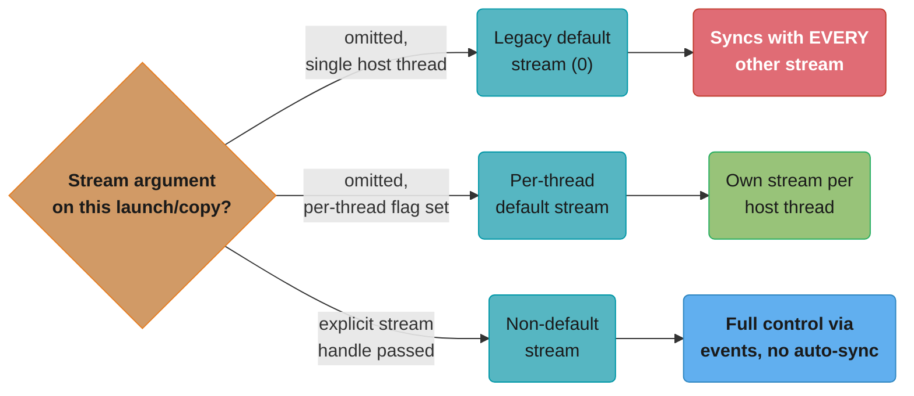
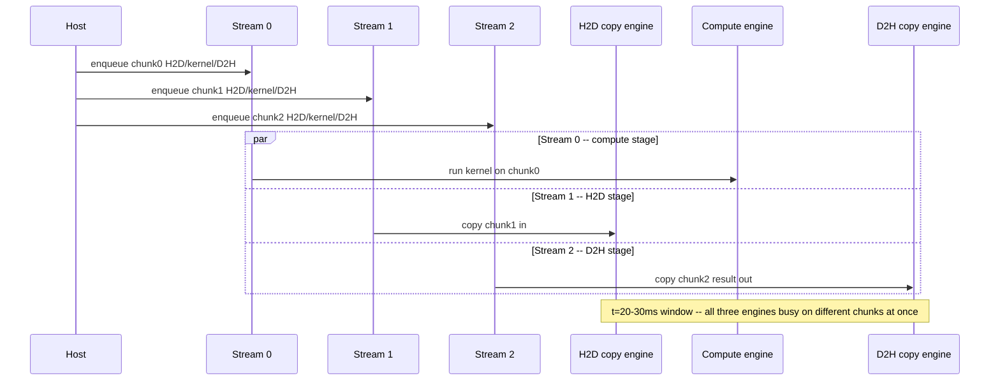
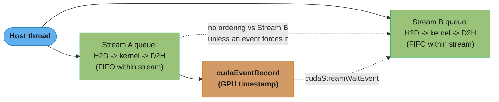
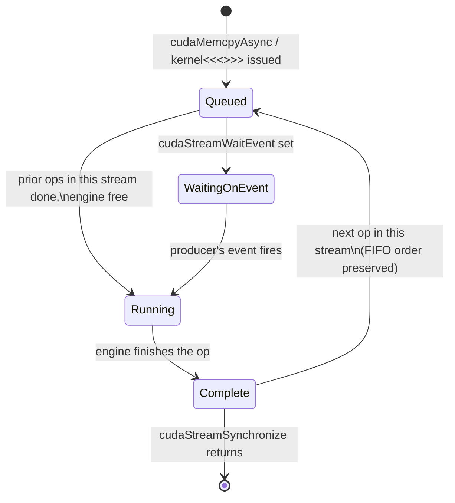
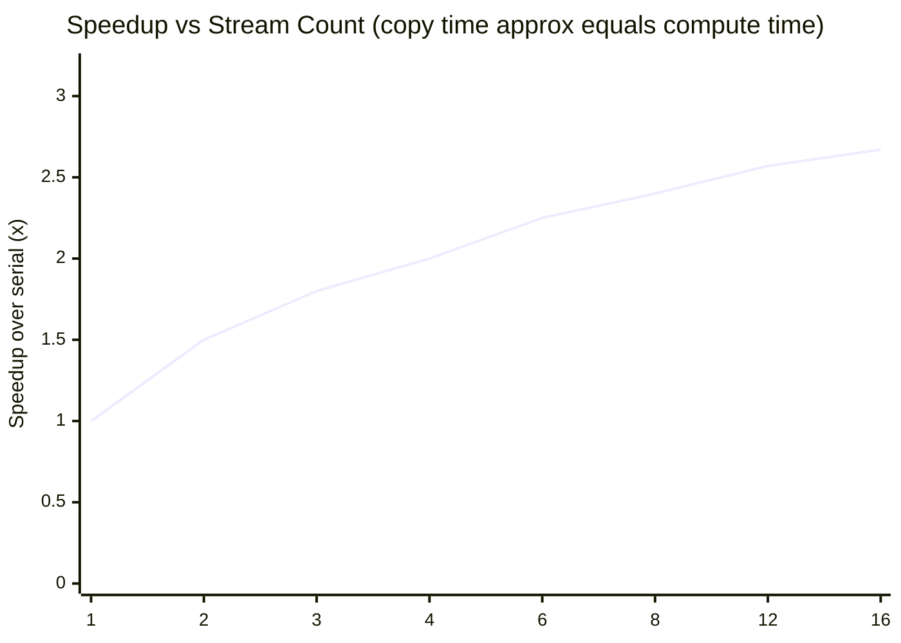

# Streams, Events & Concurrency

## 1. Concept Overview

A CUDA **stream** is an ordered queue of GPU operations — kernel launches, memory copies,
memory sets — issued from the host and executed by the device in the order they were
enqueued *within that stream*. Operations in **different** streams have no ordering
guarantee relative to each other unless the programmer explicitly creates one, which is
exactly the property that unlocks concurrency: split a large H2D-copy → compute → D2H-copy
pipeline across several streams and the hardware's independent copy engines and compute
scheduler can run different stages of different chunks at the same time, instead of the
single, serial front-to-back execution a naive single-stream (or default-stream) program gets.

**Events** are lightweight timestamps the GPU inserts into a stream's queue. They serve two
distinct jobs: (1) **timing** — record an event before and after a region, then subtract to
get GPU-side elapsed time with roughly **0.5 microsecond resolution**, far more accurate than
a CPU-side `std::chrono` wall-clock wrapped around an asynchronous launch; and (2)
**cross-stream dependencies** — `cudaStreamWaitEvent` lets one stream block until an event
recorded in a *different* stream fires, without forcing a full device-wide synchronization.

This module is where the "asynchronous" in CUDA's asynchronous execution model stops being
a slogan and becomes a concrete performance lever: the single biggest hidden cost in most
naive GPU pipelines is PCIe/NVLink transfer time sitting on the critical path in series with
compute, and streams are the mechanism that moves it into the *background*, overlapping it
with kernel execution instead. Everything here builds directly on
[memory_management_and_data_transfer](../memory_management_and_data_transfer/) — pinned
memory is not optional background reading here, it is a hard prerequisite for anything in
this module to work at all — and sets up
[cuda_graphs](../cuda_graphs/), which captures a stream's operation sequence once and replays
it with near-zero per-launch CPU overhead.

---

## 2. Intuition

> **One-line analogy**: A single CUDA stream is one cashier at a grocery store scanning
> items in strict arrival order; multiple streams are multiple registers open at once — the
> store doesn't get faster per-item, but three registers process three carts' worth of
> "scan, bag, pay" simultaneously instead of one cart finishing entirely before the next starts.

**Mental model**: Think of a GPU as having three semi-independent pieces of hardware that
can each be kept busy at once: a copy engine moving host→device, a compute engine (the SMs)
running kernels, and (on GPUs with two copy engines, e.g. A100/H100) a second copy engine
moving device→host. A single stream forces these three pieces of hardware to take turns —
copy engine works, then sits idle while compute engine works, then sits idle while the
other copy engine works. Multiple streams let the scheduler feed all three pieces of
hardware different chunks of data at the same time, so while chunk 2 is copying in, chunk 1
is computing, and chunk 0 is copying out — three engines, three chunks, all busy at once.

**Why it matters**: For memory-bound or transfer-heavy pipelines — the common case in
inference serving, streaming ETL, and multi-stage image/video processing — the wall-clock
win from overlapping transfer and compute is often larger than any single kernel-level
micro-optimization (coalescing, tiling, occupancy tuning) applied to the compute stage alone.
An interview question that asks "how would you hide the cost of moving data to the GPU" is
asking specifically about this module, and the answer that separates senior candidates is
naming the **pinned-memory prerequisite** before naming streams at all.

**Key insight**: Concurrency across streams is a **hardware capability that must be
unlocked by a specific programming pattern**, not an automatic consequence of calling
`cudaMemcpyAsync` or using non-default streams. Three conditions must all hold at once:
(1) host memory must be **pinned** (page-locked), or `cudaMemcpyAsync` silently degrades to
a blocking, synchronous copy; (2) operations must be issued on **non-default streams** (or
the **legacy default stream**, which implicitly synchronizes with every other stream on the
device, serializing everything back together); and (3) the work must be split into enough
independent chunks that the pipeline has something to overlap — one giant, monolithic
transfer and one giant, monolithic kernel cannot overlap with themselves.

---

## 3. Core Principles

- **A stream is an ordered, asynchronous work queue.** Operations enqueued in the same
  stream execute in FIFO order relative to each other; the host thread that enqueues them
  returns immediately (kernel launches and `*Async` memory operations do not block the CPU).
- **No ordering guarantee across streams.** This is the entire source of the concurrency —
  operations in stream A and stream B may run in any relative order, including
  simultaneously, unless the programmer inserts an explicit dependency via an event.
- **Pinned (page-locked) host memory is mandatory for real overlap.** `cudaMemcpyAsync` from
  pageable host memory is still *correct* — but the CUDA driver must stage the data through
  an internal pinned bounce buffer first, which serializes the copy with respect to the
  calling thread in practice, silently eliminating the overlap the programmer thought they
  had. See [memory_management_and_data_transfer](../memory_management_and_data_transfer/)
  for `cudaHostAlloc`/`cudaMallocHost` mechanics.
- **The legacy (null) default stream is a global synchronization point.** Any operation
  issued to stream `0` (the default stream, e.g. a bare `kernel<<<g,b>>>(...)` with no
  stream argument) implicitly waits for *all* prior work on the device and blocks all
  *later*-issued work on every other stream until it completes — the single most common
  reason "I used streams and got zero concurrency."
- **Per-thread default stream changes this per host thread.** Compiling with
  `--default-stream per-thread` (or `#define CUDA_API_PER_THREAD_DEFAULT_STREAM` before
  including `cuda_runtime.h`) gives each host thread its own regular, non-synchronizing
  default stream — concurrency between threads' default streams becomes possible, but a
  single thread's own operations still queue in order on its own stream.
- **Events are GPU-side timestamps with two uses.** `cudaEventRecord` inserts a marker into
  a stream; `cudaEventElapsedTime` between two recorded events gives GPU-clock-accurate
  timing (~0.5 microsecond resolution); `cudaStreamWaitEvent` makes a *different* stream
  block on that marker, expressing a fine-grained cross-stream dependency without a
  device-wide `cudaDeviceSynchronize`.
- **Overlap needs enough independent chunks, not just enough streams.** Splitting one large
  transfer+compute job into 3 streams but leaving each stream with one giant, singular
  operation gives you 3 sequential pipelines running back-to-back, not overlap — the win
  comes from *interleaving* many small chunks across a handful of streams so the pipeline
  stages fill and drain concurrently.

---

## 4. Types / Architectures / Strategies

### 4.1 Stream Kinds

| Stream kind | Created via | Synchronizes with |
|-------------|-------------|--------------------|
| **Legacy default (null) stream** | Implicit — omit the stream argument | Every other stream on the device (both directions) |
| **Per-thread default stream** | `--default-stream per-thread` compile flag | Only that host thread's own operations; independent of other threads' default streams |
| **Non-default (explicit) stream** | `cudaStreamCreate` / `cudaStreamCreateWithFlags` | Nothing implicitly — full programmer control via events |
| **Non-blocking non-default stream** | `cudaStreamCreateWithFlags(&s, cudaStreamNonBlocking)` | Explicitly opts *out* of synchronizing with the legacy default stream even if legacy semantics are active elsewhere in the process |
| **Priority stream** | `cudaStreamCreateWithPriority` | Same as non-default; priority only affects scheduling order among *ready* blocks, not correctness |

### Choosing Which Stream an Operation Lands On



The single most common concurrency bug traces back to the left branch of this
decision: an omitted stream argument doesn't raise an error, it silently routes the
operation onto the globally-synchronizing legacy default stream.

### 4.2 Concurrency Patterns

- **Copy/compute overlap (the canonical pattern)**: split input into N chunks, assign each
  chunk to one of `S` streams round-robin, issue H2D → kernel → D2H per chunk on its
  assigned stream. This is the pattern in §5's centerpiece diagram.
- **Producer/consumer across streams**: one stream produces intermediate data (e.g., a
  preprocessing kernel), a second stream consumes it once an event fires — used to pipeline
  independent stages of a multi-kernel workload without a full device sync between them.
- **Priority-tiered scheduling**: latency-sensitive work (e.g., a small interactive kernel)
  on a high-priority stream, bulk background work (e.g., a large batch job) on a
  low-priority stream, so the scheduler prefers dispatching blocks from the high-priority
  stream when both have ready work.
- **Host-callback-driven pipelines**: `cudaLaunchHostFunc` enqueues a CPU-side callback that
  fires once all prior work in that stream completes, letting the host react to GPU
  progress (e.g., mark a buffer as "reusable," update a UI, decrement a completion counter)
  without blocking the whole device.
- **Graph-captured stream sequences**: record a stream's exact operation sequence once via
  `cudaStreamBeginCapture`/`cudaStreamEndCapture`, then replay the captured graph
  repeatedly with a single, cheap launch call — see [cuda_graphs](../cuda_graphs/) for the
  full treatment; streams are the *input* graphs are built from.

### 4.3 Hardware Concurrency Resources

A single GPU exposes a handful of independent execution/DMA engines that streams let a
program actually use simultaneously:

| Engine | Role | Typical count (data-center GPU) |
|--------|------|-----------------------------------|
| Compute engine(s) | Execute kernels across resident SMs | 1 (shared by all streams; SMs subdivide among concurrent kernels/blocks) |
| H2D copy engine | Host → device DMA transfer | 1 |
| D2H copy engine | Device → host DMA transfer | 1 (separate from H2D on Ampere/Hopper-class GPUs — enables simultaneous bidirectional transfer) |

Because compute is a **single shared engine**, kernels from different streams do not truly
run "at the same time" as much as they **interleave** at the block/warp-scheduling level —
true concurrency headroom comes primarily from overlapping the *copy* engines with the
*compute* engine, which is exactly the §5 diagram's story.

---

## 5. Architecture Diagrams

### Serial vs 3-Stream Overlapped Execution — the Centerpiece Timeline

The data is split into 3 equal chunks; each chunk needs 10 ms of H2D copy, 10 ms of kernel
compute, and 10 ms of D2H copy (copy roughly equals compute, the condition under which
overlap pays off most). Time runs left to right in milliseconds.

```
SERIAL — one stream, no overlap (copy approx equals compute; 3 chunks x 3 stages x 10 ms)

time (ms):     0    10    20    30    40    50    60    70    80    90
H2D copy:     [C0]  .     .    [C1]   .     .    [C2]   .     .     .
Compute:       .   [K0]   .     .    [K1]   .     .    [K2]   .     .
D2H copy:      .    .    [D0]   .     .    [D1]   .     .    [D2]   .

Total wall-clock: 90 ms.  Every engine is idle 2/3 of the time -- each
stage waits for the previous stage of the SAME chunk to fully finish
before starting, and the next chunk cannot start until the current one
is completely done.

OVERLAPPED -- 3 streams, pinned memory, pipelined (same 3 chunks, same 10 ms stages)

time (ms):     0    10    20    30    40    50
Stream 0:     [C0] [K0] [D0]
Stream 1:      .   [C1] [K1] [D1]
Stream 2:      .    .   [C2] [K2] [D2]

Total wall-clock: 50 ms.  (3 chunks + 3 stages - 1) x 10 ms = 50 ms.
Speedup measured here: 90 / 50 = 1.8x for exactly 3 chunks.

ASYMPTOTIC LIMIT -- as chunk count N grows much larger than 3 streams/stages:
  serial time      = N x 3 x 10 ms         (grows 3x per chunk)
  pipelined time  ~= N x 10 ms + 20 ms      (grows ~1x per chunk + fixed fill/drain)
  speedup -> 3x as N -> large (bounded by the single busiest engine: compute,
  which alone must still do N x 10 ms of work no matter how many streams exist)
```

**Reading the diagram**: in the serial case every one of the three engines (H2D copy
engine, compute/SMs, D2H copy engine) sits idle two-thirds of the time because a stage can
only start once the *same chunk's* previous stage has completely finished, and no other
chunk is in flight to fill the gap. In the overlapped case, three independent streams keep
all three engines simultaneously busy from `t=20ms` onward: while stream 2 is still copying
in, stream 1 is computing, and stream 0 is already copying its result back out. The
concrete 3-chunk case yields 1.8x; **feeding the pipeline with many more, smaller chunks
pushes the achievable speedup toward the theoretical 3x ceiling**, because the fixed
fill/drain overhead (the first H2D and the last D2H, which have nothing to overlap with)
becomes negligible relative to the steady-state throughput, and the single shared compute
engine — the busiest of the three — becomes the true bound on total time.

**Read it like this.** The `(3 chunks + 3 stages - 1) x 10 ms` line above is the whole
pipeline compressed into one expression, `T_pipe = (N + S - 1) x T`: "you pay one
stage-time for every chunk, plus a fixed toll of `S - 1` stage-times to fill the pipe at
the start and drain it at the end."

Set that beside the serial cost, `T_serial = N x S x T`, and the structural difference is
visible in the operators alone: serial *multiplies* chunk count by stage count, pipelined
*adds* them. Turning a product into a sum is the entire trick — everything else in this
module (pinned memory, non-default streams, events) exists only to make that swap legal.

| Symbol | What it is |
|--------|------------|
| `N` | How many chunks the data is split into. `3` in the diagram above |
| `S` | How many pipeline stages each chunk passes through. `3` here — H2D, compute, D2H |
| `T` | Time for one stage on one chunk. `10 ms`, equal across all three stages by construction |
| `N x S x T` | Serial total. Every chunk waits through every stage before the next chunk starts |
| `(N + S - 1) x T` | Pipelined total. `N` steady-state beats plus `S - 1` beats of fill/drain |
| `S - 1` | The fixed toll: `2` stage-times. The very first H2D and very last D2H overlap with nothing |

**Walk one example.** Hold the stages at `S = 3` and `T = 10 ms`, raise `N`, and watch the
fixed 20 ms toll shrink as a share of the total:

```
  N chunks   serial = 3N x 10   pipelined = (N+2) x 10   speedup   toll share
      1            30 ms                30 ms            1.00x       66.7%
      2            60 ms                40 ms            1.50x       50.0%
      3            90 ms                50 ms            1.80x       40.0%
      4           120 ms                60 ms            2.00x       33.3%
      8           240 ms               100 ms            2.40x       20.0%
     16           480 ms               180 ms            2.67x       11.1%
     64          1920 ms               660 ms            2.91x        3.0%

  toll share = 20 ms of fill/drain / pipelined total.
  At N=1 the pipeline IS the toll (1.00x -- nothing to overlap with).
  At N=64 the toll is 3.0% of wall clock and the speedup sits 0.09x below the ceiling.
```

**Why the ceiling is exactly `S`, never more.** Divide the two expressions and the `T`
cancels: `speedup = NS / (N + S - 1)`, which for `S = 3` is `3N / (N + 2)` and rises to `3`
as `N` grows — but never past it. The reason is physical, not algebraic: the compute engine
is a single shared resource that must still perform `N x 10 ms` of work no matter how many
streams queue in front of it. `S` counts the independent engines you own, and no amount of
pipelining manufactures a fourth one. Remove the `S - 1` toll term and the formula would
promise `3x` at `N = 1`, which is exactly the mistake behind "I added streams to a one-shot
transfer and nothing got faster."

### Three Engines, One Instant — Actor View of the Overlap



This is the same `t=20-30 ms` window from the timeline above, redrawn as three
concurrent actor threads: Stream 0 is mid-kernel while Stream 1 is still copying data
in and Stream 2 is already copying a finished result out — no single stream ever runs
two stages at once, but three streams together keep all three engines simultaneously busy.

### Stream Timeline as a Queue Model



Each stream is its own FIFO queue fed by the host; the dashed edge shows the one thing that
*does* create ordering across streams — an event recorded in one stream that another
stream is told to wait on via `cudaStreamWaitEvent`, a far cheaper synchronization primitive
than a full `cudaDeviceSynchronize`.

### A Single Operation's Life in a Stream's Queue



Once queued, an operation only starts after every earlier operation in its own stream
has finished (FIFO) and, if `cudaStreamWaitEvent` was set, after the producing stream's
event has fired — everything else about dispatch onto the copy/compute engines happens
without further host involvement.

### Legacy Default Stream vs Per-Thread Default Stream

```
Legacy (null) default stream -- ONE synchronizing stream for the whole process

  Thread 1: kernelA<<<>>>()  --\
  Thread 2: kernelB<<<>>>()  ---+--> ALL land on stream 0, which implicitly
  Stream S (explicit):      --/     waits for prior work and blocks later work
                                     on every OTHER stream too.
  Result: no concurrency between threads' default-stream work, and any
  explicit stream S is forced to sync around stream-0 operations.

Per-thread default stream (--default-stream per-thread) -- ONE PER HOST THREAD

  Thread 1: kernelA<<<>>>()  --> Thread 1's own default stream (independent)
  Thread 2: kernelB<<<>>>()  --> Thread 2's own default stream (independent)
  Stream S (explicit):       --> unaffected by either default stream

  Result: Thread 1 and Thread 2's default-stream work CAN run concurrently;
  each thread's own work is still strictly ordered within its own stream.
```

Multithreaded producer/consumer host code is the case where this distinction stops being
academic: with the legacy default stream, two worker threads that each launch a kernel with
no explicit stream silently serialize against each other; with per-thread default streams,
they don't — no code change beyond a compiler flag.

---

## 6. How It Works — Detailed Mechanics

### Creating Streams and Issuing Async Work

```cpp
#include <cuda_runtime.h>
#include <cstdio>

#define CUDA_CHECK(call)                                                      \
    do {                                                                     \
        cudaError_t err = (call);                                            \
        if (err != cudaSuccess) {                                            \
            fprintf(stderr, "CUDA error %s:%d: %s\n", __FILE__, __LINE__,     \
                    cudaGetErrorString(err));                                 \
            std::exit(1);                                                    \
        }                                                                    \
    } while (0)

__global__ void scale_kernel(float* data, float factor, int n) {
    int i = blockIdx.x * blockDim.x + threadIdx.x;
    if (i < n) data[i] *= factor;
}

void overlapped_pipeline(float* h_pinned_in, float* h_pinned_out,
                          int total_n, int num_chunks) {
    const int chunk_n = total_n / num_chunks;
    const size_t chunk_bytes = chunk_n * sizeof(float);

    cudaStream_t streams[8];
    float* d_buf[8];
    for (int s = 0; s < num_chunks; ++s) {
        CUDA_CHECK(cudaStreamCreate(&streams[s]));      // non-default stream
        CUDA_CHECK(cudaMalloc(&d_buf[s], chunk_bytes));
    }

    for (int c = 0; c < num_chunks; ++c) {
        float* h_in_chunk = h_pinned_in + c * chunk_n;    // MUST be pinned memory
        float* h_out_chunk = h_pinned_out + c * chunk_n;  // MUST be pinned memory

        // H2D, kernel, and D2H are all enqueued on the SAME stream (in order
        // relative to each other) but DIFFERENT chunks use DIFFERENT streams
        // (no ordering relative to other chunks) -- this is what overlaps.
        CUDA_CHECK(cudaMemcpyAsync(d_buf[c], h_in_chunk, chunk_bytes,
                                    cudaMemcpyHostToDevice, streams[c]));

        int threads = 256;
        int blocks = (chunk_n + threads - 1) / threads;
        scale_kernel<<<blocks, threads, 0, streams[c]>>>(d_buf[c], 2.0f, chunk_n);

        CUDA_CHECK(cudaMemcpyAsync(h_out_chunk, d_buf[c], chunk_bytes,
                                    cudaMemcpyDeviceToHost, streams[c]));
    }

    for (int s = 0; s < num_chunks; ++s) {
        CUDA_CHECK(cudaStreamSynchronize(streams[s]));  // wait for THIS stream only
        cudaFree(d_buf[s]);
        cudaStreamDestroy(streams[s]);
    }
}
```

The key correctness rule hiding in this snippet: `h_in_chunk`/`h_out_chunk` **must** point
into memory allocated with `cudaHostAlloc`/`cudaMallocHost` (pinned). Pass a plain
`malloc`'d pointer here and the code still compiles and produces the right *answer*, but the
`cudaMemcpyAsync` calls silently degrade to blocking behavior — see §10's BROKEN→FIX.

```python
# CuPy: streams map to `cupy.cuda.Stream`; pinned memory via a memory pool.
import cupy as cp
import numpy as np

def overlapped_pipeline_cupy(h_pinned_in: np.ndarray, num_chunks: int, factor: float = 2.0):
    total_n = h_pinned_in.size
    chunk_n = total_n // num_chunks
    streams = [cp.cuda.Stream(non_blocking=True) for _ in range(num_chunks)]
    d_out_chunks = [None] * num_chunks

    for c, stream in enumerate(streams):
        h_chunk = h_pinned_in[c * chunk_n:(c + 1) * chunk_n]
        with stream:
            d_chunk = cp.asarray(h_chunk)          # H2D on THIS stream (async if pinned)
            d_chunk *= factor                       # kernel launch on THIS stream
            d_out_chunks[c] = d_chunk                # D2H deferred to caller's .get()

    for stream in streams:
        stream.synchronize()                        # wait for this stream only
    return [d.get() for d in d_out_chunks]           # D2H happens here


def make_pinned(host_array: np.ndarray) -> np.ndarray:
    """CuPy's pinned-memory pool -- required for the H2D copy above to be truly async."""
    pinned_mem = cp.cuda.alloc_pinned_memory(host_array.nbytes)
    pinned_array = np.frombuffer(pinned_mem, dtype=host_array.dtype).reshape(host_array.shape)
    pinned_array[...] = host_array
    return pinned_array
```

```python
# PyTorch: torch.cuda.Stream + torch.cuda.Event; pin_memory=True on tensors/DataLoader.
import torch

def overlapped_pipeline_torch(h_pinned_in: torch.Tensor, num_chunks: int, factor: float = 2.0):
    assert h_pinned_in.is_pinned(), "host tensor must be pinned for true async H2D overlap"
    chunk_n = h_pinned_in.numel() // num_chunks
    streams = [torch.cuda.Stream() for _ in range(num_chunks)]
    d_chunks = [None] * num_chunks

    for c, stream in enumerate(streams):
        h_chunk = h_pinned_in[c * chunk_n:(c + 1) * chunk_n]
        with torch.cuda.stream(stream):
            d_chunk = h_chunk.to("cuda", non_blocking=True)   # H2D, async (pinned + stream)
            d_chunk.mul_(factor)                                # kernel on this stream
            d_chunks[c] = d_chunk

    torch.cuda.synchronize()                                    # wait for ALL streams
    return [d.to("cpu", non_blocking=True) for d in d_chunks]   # D2H, async per-tensor
```

### Timing with Events

```cpp
cudaEvent_t start, stop;
CUDA_CHECK(cudaEventCreate(&start));
CUDA_CHECK(cudaEventCreate(&stop));

CUDA_CHECK(cudaEventRecord(start, stream));
scale_kernel<<<blocks, threads, 0, stream>>>(d_data, 2.0f, n);
CUDA_CHECK(cudaEventRecord(stop, stream));

CUDA_CHECK(cudaEventSynchronize(stop));   // wait only until 'stop' has fired
float ms = 0.0f;
CUDA_CHECK(cudaEventElapsedTime(&ms, start, stop));   // ~0.5 us resolution
printf("kernel took %.4f ms (GPU clock, not CPU wall time)\n", ms);

cudaEventDestroy(start);
cudaEventDestroy(stop);
```

```python
# CuPy events mirror the C++ API almost 1:1
start = cp.cuda.Event()
stop = cp.cuda.Event()

start.record(stream)
d_data *= 2.0
stop.record(stream)
stop.synchronize()
elapsed_ms = cp.cuda.get_elapsed_time(start, stop)   # ~0.5 us resolution

# PyTorch events are the idiomatic way to time GPU work (never Python's time.time())
start_evt = torch.cuda.Event(enable_timing=True)
stop_evt = torch.cuda.Event(enable_timing=True)

start_evt.record(stream)
d_chunk.mul_(2.0)
stop_evt.record(stream)
torch.cuda.synchronize()
elapsed_ms = start_evt.elapsed_time(stop_evt)          # ~0.5 us resolution
```

**Why events, not `time.time()`/`std::chrono`, for GPU timing**: kernel launches and
`*Async` copies return to the host immediately, so a CPU-side timer wrapped around a launch
measures launch *overhead* plus whatever the CPU does next, not GPU execution time. Events
are inserted directly into the stream's instruction queue and timestamped by the GPU's own
clock, giving the true device-side duration regardless of what the host is doing
concurrently.

### Cross-Stream Dependencies with `cudaStreamWaitEvent`

```cpp
cudaEvent_t producer_done;
CUDA_CHECK(cudaEventCreate(&producer_done));

// Stream A produces intermediate data
preprocess_kernel<<<blocks, threads, 0, streamA>>>(d_raw, d_intermediate, n);
CUDA_CHECK(cudaEventRecord(producer_done, streamA));

// Stream B waits ONLY for that specific event -- not a full device sync,
// and NOT blocked by anything else queued on streamA before/after this point.
CUDA_CHECK(cudaStreamWaitEvent(streamB, producer_done, 0));
consume_kernel<<<blocks, threads, 0, streamB>>>(d_intermediate, d_result, n);
```

This is the mechanism that lets two streams cooperate on a producer/consumer pipeline
without collapsing back to serial execution via `cudaDeviceSynchronize` — only the specific
dependency is enforced, leaving every other independent operation on both streams free to
run concurrently.

### Stream Priorities

```cpp
int least_priority, greatest_priority;
CUDA_CHECK(cudaDeviceGetStreamPriorityRange(&least_priority, &greatest_priority));
// Lower numeric value = higher priority. Range is device-dependent (e.g. 0 to -5).

cudaStream_t high_prio_stream, low_prio_stream;
CUDA_CHECK(cudaStreamCreateWithPriority(&high_prio_stream, cudaStreamNonBlocking,
                                        greatest_priority));
CUDA_CHECK(cudaStreamCreateWithPriority(&low_prio_stream, cudaStreamNonBlocking,
                                        least_priority));
```

Priority is a **scheduling hint**, not a preemption guarantee: it only affects which stream's
*ready* thread blocks the scheduler prefers to dispatch next when both a high- and
low-priority kernel have blocks waiting to launch — a low-priority kernel already running on
an SM is not evicted mid-flight for a higher-priority one.

### Host Callbacks with `cudaLaunchHostFunc`

```cpp
void CUDART_CB on_chunk_done(void* user_data) {
    int chunk_id = *reinterpret_cast<int*>(user_data);
    printf("chunk %d finished -- buffer now reusable on host\n", chunk_id);
    // MUST NOT call any CUDA API here (cudaMemcpy, cudaMalloc, etc.) --
    // the callback runs on an internal driver thread; calling back into
    // CUDA from it is undefined behavior and a classic deadlock source.
}

CUDA_CHECK(cudaMemcpyAsync(d_buf, h_pinned, bytes, cudaMemcpyHostToDevice, stream));
scale_kernel<<<blocks, threads, 0, stream>>>(d_buf, 2.0f, n);
CUDA_CHECK(cudaLaunchHostFunc(stream, on_chunk_done, &chunk_id));
```

`cudaLaunchHostFunc` (the modern replacement for the deprecated `cudaStreamAddCallback`)
enqueues a CPU function that fires once every prior operation in that stream has completed,
without blocking the device — useful for marking pinned buffers free for reuse, updating a
progress counter, or signaling a producer/consumer handoff on the host side.

### Concrete Overlap Numbers

For a workload where each of 3 chunks needs 10 ms H2D, 10 ms compute, 10 ms D2H (matching
§5's diagram): serial = 90 ms; 3-stream pipelined = 50 ms (1.8x). Scaling to 12 chunks of
the same per-stage cost across the same 3-4 streams: serial = 360 ms; pipelined
approximately (12 + 3) x 10 ms = 150 ms, a **2.4x** speedup, closing in on the 3x ceiling as
chunk count grows and the fixed pipeline fill/drain (the very first H2D and very last D2H,
which have nothing to overlap with) becomes a smaller fraction of total time.

### Speedup vs Stream Count



Using one chunk per stream and three equal 10 ms stages (serial = `3N x 10 ms`,
pipelined = `(N + 2) x 10 ms`), speedup climbs fast at first — matching the 1.8x
measured for 3 streams above — then flattens as it approaches the 3x ceiling set by
the single shared compute engine, which alone must still do `N x 10 ms` of work no
matter how many streams feed it.

**What this actually says.** The curve is one ratio, `speedup(N) = 3N / (N + 2)`, and it
reads as: "you keep `3N` stage-times of work but now pay for only `N + 2` of them." The
flattening is not a hardware limit kicking in at some stream count — it is the `+2` in the
denominator becoming irrelevant.

| Symbol | What it is |
|--------|------------|
| `N` | Chunks in flight, one per stream in this plot. The x-axis |
| `3N` | Serial stage-times — the numerator never stops growing linearly |
| `N + 2` | Pipelined stage-times: `N` of real throughput plus the 2-stage fill/drain toll |
| `3N / (N + 2)` | The speedup. The y-axis of the chart above |
| `3 - speedup` | Distance still left to the ceiling. Algebraically equal to `6 / (N + 2)` |

**Walk one example.** Track the remaining gap rather than the speedup, and the shape stops
being mysterious — it is a `1/N` decay:

```
   N     speedup = 3N/(N+2)     gap to 3x = 6/(N+2)
    3          1.800                  1.200
   12          2.571                  0.429
   30          2.812                  0.188
   60          2.903                  0.097
  120          2.951                  0.049

  Doubling N roughly halves the remaining gap: 0.188 -> 0.097 -> 0.049.
  Getting from 1.8x to 2.57x costs 9 extra chunks.
  Getting from 2.90x to 2.95x costs 60 extra chunks.
```

That asymmetry is the practical lesson hiding in the curve: the first handful of chunks buy
almost all the available win, and everything past roughly `N = 8` is chasing tenths. It is
why production pipelines settle on 3-4 streams and spend the remaining engineering effort on
the kernel instead — 4 streams already captures `2.00 / 3.00`, two-thirds of the theoretical
maximum, for a fraction of the buffer-management complexity that 16 streams demands.

---

## 7. Real-World Examples

- **Video/image processing pipelines** — decode a frame batch, transfer it to the GPU while
  the previous batch's filter kernel is still running, transfer the previous batch's result
  back while the current batch computes: classic 3-stream software pipelining used in
  NVIDIA's Video Codec SDK sample applications.
- **Data-loading overlap in deep learning training** — PyTorch's `DataLoader` with
  `pin_memory=True` plus a dedicated "prefetch stream" overlaps the next batch's H2D copy
  with the current batch's forward/backward pass, hiding transfer latency behind compute
  that is typically an order of magnitude longer.
- **Multi-stream inference serving** — an inference server assigns each concurrent request
  (or a small batch of requests) its own stream so that one request's D2H result copy does
  not block another request's kernel from starting, improving tail latency under load.
- **Scientific simulation checkpointing** — a long-running simulation kernel on stream 0
  overlaps with an asynchronous D2H copy of the *previous* timestep's state to host memory
  on stream 1, so checkpoint I/O never stalls the simulation's forward progress.
- **cuDNN/cuBLAS internal stream usage** — these libraries accept a user-supplied stream
  handle precisely so application code can interleave library calls with its own kernels and
  copies on other streams instead of forcing a synchronization boundary at every library call.

---

## 8. Tradeoffs

| Approach | Concurrency | Complexity | When it wins |
|----------|-------------|------------|---------------|
| Legacy default stream (single, implicit) | None — every op serializes | Lowest (nothing to manage) | Prototyping, correctness-first code, tiny workloads |
| Per-thread default stream | Across host threads only | Low (one compile flag) | Multithreaded host code with independent GPU work per thread |
| Explicit non-default streams, few chunks | Partial (limited by fill/drain overhead) | Medium (manual stream/buffer bookkeeping) | Small N — 2-4 chunks where the win is modest but easy to reason about |
| Explicit non-default streams, many small chunks | Approaches hardware ceiling (~3x for 3-stage pipelines) | Higher (buffer management, chunk sizing) | Large, chunkable transfer+compute workloads — the main event for this module |
| CUDA graphs over captured streams | Same runtime concurrency, near-zero *launch* overhead | Highest upfront (capture/instantiate lifecycle) | Same operation sequence replayed thousands of times — see [cuda_graphs](../cuda_graphs/) |

### Concurrency vs Implementation Complexity

```mermaid
quadrantChart
    title Concurrency vs Implementation Complexity
    x-axis Low complexity --> High complexity
    y-axis Low concurrency --> High concurrency
    quadrant-1 Worth the effort
    quadrant-2 Best ROI (rare)
    quadrant-3 Prototyping only
    quadrant-4 Avoid
    Legacy default: [0.08, 0.05]
    Per-thread default: [0.22, 0.32]
    Few streams: [0.45, 0.5]
    Many streams: [0.68, 0.88]
    CUDA graphs: [0.88, 0.9]
```

Plotting this table's five approaches on complexity vs achieved concurrency tells the
same story as the prose: per-thread default streams buy a little concurrency almost
for free, but the real win — many small chunks across explicit streams — costs the
most engineering effort short of graph capture, which buys back launch overhead rather
than more concurrency.

| Memory choice | Async copy actually async? | Bandwidth | Setup cost |
|---------------|------------------------------|-----------|------------|
| Pageable (`malloc`) | No — silently staged/blocking | Roughly half of pinned or worse, due to the extra staging copy | None |
| Pinned (`cudaHostAlloc`/`cudaMallocHost`) | Yes | Close to full PCIe/NVLink bandwidth | Allocation is slower; page-locked memory is a finite OS resource |

---

## 9. When to Use / When NOT to Use

### Use explicit streams + events when

- The pipeline has a **transfer stage that is a meaningful fraction of total time** — if
  copy time is negligible next to compute time, overlap buys little.
- The workload is **naturally chunkable** — a large array, a batch of independent
  requests, a sequence of video frames — so multiple chunks can be genuinely in flight.
- Host memory can be **pinned** for the buffers on the hot path — without this, none of the
  overlap machinery activates regardless of how many streams exist.
- You need **fine-grained cross-stage dependencies** (producer/consumer) without paying for
  a full `cudaDeviceSynchronize` between every stage.
- You need **accurate, GPU-clock-based timing** of a kernel or region in isolation from CPU
  scheduling noise — that's exactly what events are for.

### Do NOT reach for multi-stream overlap when

- The workload is a **single, one-shot, tiny transfer+kernel** — the fixed pipeline
  fill/drain cost dominates and there's nothing to overlap with (see
  [gpu_computing_foundations](../gpu_computing_foundations/) §14 for the underlying
  arithmetic-intensity argument, which applies here too).
- Copy time is **already negligible** relative to compute time (high arithmetic intensity,
  data resident across many kernel launches) — the serial and overlapped totals barely
  differ, so the added complexity isn't worth it.
- The kernel itself is **not yet optimized** — overlapping transfer with a slow, unoptimized
  kernel just hides transfer cost behind an even bigger compute cost; profile and fix the
  kernel first (see [occupancy_and_launch_configuration](../occupancy_and_launch_configuration/),
  [memory_coalescing_and_access_patterns](../memory_coalescing_and_access_patterns/)).
- You are about to **replay the exact same operation sequence thousands of times** — at that
  point the bottleneck shifts from stream overlap to per-launch CPU overhead, and
  [cuda_graphs](../cuda_graphs/) is the better tool.
- You need concurrency **across GPUs**, not within one — that's the domain of
  [multi_gpu_programming_and_nccl](../multi_gpu_programming_and_nccl/), where streams are
  still used but per-device, coordinated via NCCL/P2P rather than events alone.

---

## 10. Common Pitfalls

1. **Pageable memory silently kills overlap.** `cudaMemcpyAsync` from a plain `malloc`'d
   buffer is not an error — it just quietly behaves like a blocking `cudaMemcpy`, and the
   program "works" while delivering zero speedup, which is far worse than a crash because
   nothing signals the mistake.
2. **Everything landing on the default stream.** Forgetting the `<<<g,b,0,stream>>>` fourth
   launch argument (or the trailing stream argument on `cudaMemcpyAsync`) silently routes
   the operation to the legacy default stream, which synchronizes with every other stream —
   one missed argument re-serializes an otherwise-correct multi-stream design.
3. **Calling `cudaDeviceSynchronize` between every stage "to be safe."** This collapses all
   concurrency back to serial execution; use `cudaStreamSynchronize` (one stream) or
   `cudaStreamWaitEvent` (one specific dependency) instead of the device-wide hammer.
4. **Timing with `std::chrono`/`time.time()` around an async call.** Because the launch
   returns immediately, a CPU-side timer measures launch overhead, not GPU execution time —
   use `cudaEvent_t` pairs, which timestamp on the GPU's own clock.
5. **Calling a CUDA API from inside a `cudaLaunchHostFunc` callback.** The callback executes
   on an internal driver thread; calling back into the CUDA API from it is undefined
   behavior and a well-known way to deadlock a process.
6. **Reusing a single pinned buffer across all in-flight chunks.** If chunk 0 and chunk 1
   share one host buffer, chunk 1's H2D copy can race with chunk 0's kernel still reading
   from the same memory — each chunk needs its own buffer (or an event-gated reuse scheme)
   for the pipeline to be both fast *and* correct.

**BROKEN → FIX: async copy issued from pageable memory**

```cpp
// BROKEN: looks correct, uses streams, uses cudaMemcpyAsync -- but h_data
// came from a plain malloc(), so the "async" copy is actually synchronous.
void broken_overlap(int num_chunks, int chunk_n) {
    float* h_data = (float*)malloc(num_chunks * chunk_n * sizeof(float));  // PAGEABLE
    cudaStream_t streams[4];
    float* d_buf[4];
    for (int s = 0; s < num_chunks; ++s) {
        cudaStreamCreate(&streams[s]);
        cudaMalloc(&d_buf[s], chunk_n * sizeof(float));
        // The driver must stage this through an internal pinned bounce buffer
        // first -- the call blocks the calling thread in practice, so every
        // "concurrent" chunk actually runs back-to-back, exactly like the
        // serial case in Section 5, despite using 4 streams.
        cudaMemcpyAsync(d_buf[s], h_data + s * chunk_n, chunk_n * sizeof(float),
                         cudaMemcpyHostToDevice, streams[s]);
        scale_kernel<<<(chunk_n + 255) / 256, 256, 0, streams[s]>>>(d_buf[s], 2.0f, chunk_n);
    }
    // Measured: total time ~= serial baseline. No overlap occurred.
}
```

```cpp
// FIX: allocate the host buffer as PINNED memory via cudaHostAlloc/cudaMallocHost.
// Same code otherwise -- the cudaMemcpyAsync calls now genuinely overlap.
void fixed_overlap(int num_chunks, int chunk_n) {
    float* h_data;
    cudaMallocHost(&h_data, num_chunks * chunk_n * sizeof(float));   // PINNED
    cudaStream_t streams[4];
    float* d_buf[4];
    for (int s = 0; s < num_chunks; ++s) {
        cudaStreamCreate(&streams[s]);
        cudaMalloc(&d_buf[s], chunk_n * sizeof(float));
        cudaMemcpyAsync(d_buf[s], h_data + s * chunk_n, chunk_n * sizeof(float),
                         cudaMemcpyHostToDevice, streams[s]);
        scale_kernel<<<(chunk_n + 255) / 256, 256, 0, streams[s]>>>(d_buf[s], 2.0f, chunk_n);
    }
    // Measured: ~1.8-2.4x wall-clock reduction vs the serial/pageable baseline,
    // consistent with Section 5's timeline for this chunk count.
    for (int s = 0; s < num_chunks; ++s) cudaStreamSynchronize(streams[s]);
    cudaFreeHost(h_data);
}
```

**BROKEN → FIX: everything issued to the default stream**

```cpp
// BROKEN: 4 "streams" allocated but every launch/copy omits the stream
// argument, so all of it lands on the legacy default stream anyway.
void broken_default_stream(int num_chunks, int chunk_n, float* h_pinned, float** d_buf) {
    for (int s = 0; s < num_chunks; ++s) {
        cudaMemcpyAsync(d_buf[s], h_pinned + s * chunk_n, chunk_n * sizeof(float),
                         cudaMemcpyHostToDevice);                       // no stream arg!
        scale_kernel<<<(chunk_n + 255) / 256, 256>>>(d_buf[s], 2.0f, chunk_n); // no stream!
    }
    // Every one of these implicitly targets stream 0, which synchronizes
    // with everything else on the device -- fully serial despite the intent.
}
```

```cpp
// FIX: pass the actual stream handle to every launch and every async copy.
void fixed_explicit_streams(int num_chunks, int chunk_n, float* h_pinned,
                             float** d_buf, cudaStream_t* streams) {
    for (int s = 0; s < num_chunks; ++s) {
        cudaMemcpyAsync(d_buf[s], h_pinned + s * chunk_n, chunk_n * sizeof(float),
                         cudaMemcpyHostToDevice, streams[s]);            // explicit stream
        scale_kernel<<<(chunk_n + 255) / 256, 256, 0, streams[s]>>>(     // explicit stream
            d_buf[s], 2.0f, chunk_n);
    }
}
```

---

## 11. Technologies & Tools

| Tool / API | Purpose | Notes |
|-----------|---------|-------|
| `cudaStreamCreate` / `cudaStreamCreateWithFlags` / `cudaStreamCreateWithPriority` | Create non-default streams | `cudaStreamNonBlocking` flag opts out of legacy default-stream sync |
| `cudaMemcpyAsync` | Non-blocking host<->device copy | Only truly async from pinned host memory |
| `cudaEventCreate` / `cudaEventRecord` / `cudaEventElapsedTime` / `cudaEventSynchronize` | GPU-side timestamping | ~0.5 us resolution; correct way to time GPU work |
| `cudaStreamWaitEvent` | Cross-stream dependency | Cheaper than `cudaDeviceSynchronize` for partial ordering |
| `cudaStreamSynchronize` / `cudaDeviceSynchronize` | Host-blocking sync | Prefer the per-stream call; the device-wide call kills concurrency |
| `cudaLaunchHostFunc` | Host-side callback from a stream | Must not call CUDA APIs inside the callback |
| `cudaDeviceGetStreamPriorityRange` | Query valid priority range | Lower numeric value = higher priority; device-dependent range |
| Nsight Systems | Visualize actual stream/engine overlap on a timeline | The definitive way to confirm overlap is really happening, not just assumed |
| `cupy.cuda.Stream` / `cupy.cuda.Event` | Python (CuPy) equivalent API | Near 1:1 mapping to the CUDA C++ runtime API |
| `torch.cuda.Stream` / `torch.cuda.Event` | Python (PyTorch) equivalent API | `pin_memory=True` on tensors/`DataLoader` is the pinned-memory prerequisite |

---

## 12. Interview Questions with Answers

**Q: Why doesn't `cudaMemcpyAsync` overlap with kernel execution when the host buffer came from a plain `malloc`?**
Pageable host memory forces the driver to stage the copy through an internal pinned bounce buffer first, which serializes the transfer in practice even though the API call itself is non-blocking. The code still produces the correct result — it just delivers none of the expected speedup, making this a silent performance bug rather than a crash. The fix is allocating the host buffer with `cudaHostAlloc`/`cudaMallocHost` so the DMA engine can transfer directly.

**Q: Why does putting all my kernels and copies on the default stream give zero concurrency, even with multiple `cudaMemcpyAsync` calls?**
The legacy (null) default stream implicitly synchronizes with every other stream on the device in both directions. Any operation issued without an explicit stream argument lands there, and it both waits for all prior device work and blocks all later work on every other stream — the single most common reason a multi-stream design measures no speedup at all.

**Q: Does `cudaStreamSynchronize` block the whole GPU or just other streams?**
It blocks the calling CPU host thread until every operation queued in that one specific stream has completed, and has no effect on any other stream's progress. This makes it strictly cheaper than `cudaDeviceSynchronize`, which waits for the entire device, and is the right tool when only one stream's completion actually needs to be observed.

**Q: Can two kernels from different streams truly run at the same time on one GPU?**
They can genuinely execute concurrently if the GPU's SMs have enough free resources (registers, shared memory, blocks) to host both kernels' blocks simultaneously. But because there is only one shared compute engine, "concurrency" here means interleaved scheduling of resident blocks from both kernels, not two fully separate compute pipelines — the real overlap opportunity usually comes from copy engines running alongside compute, not compute-vs-compute.

**Q: Is `--default-stream per-thread` a free way to get full concurrency?**
No — it only makes each host thread's own default stream independent of other threads' default streams; it does nothing to fix pageable-memory copies or chunk your workload for you. It solves exactly one specific serialization source (the shared legacy null stream across threads), not the whole overlap problem.

**Q: What happens if a CUDA runtime API is called from inside a `cudaLaunchHostFunc` callback?**
This is undefined behavior and a well-documented way to deadlock the process, because the callback executes on an internal driver thread, not the thread that issued the enqueue. Any work the callback needs to trigger on the GPU must be enqueued from the original host thread instead, using the callback only to signal or read host-side state.

**Q: Are events accurate enough to time a single warp instruction inside a kernel?**
No — `cudaEventElapsedTime` has roughly 0.5 microsecond resolution, which is more than sufficient for timing whole kernels, streams, or overlap regions but far too coarse for sub-microsecond intra-kernel measurement. For that finer granularity, Nsight Compute's per-warp/per-instruction metrics are the correct tool, not events.

**Q: Do streams guarantee that a copy and a kernel actually overlap just because they're on different streams?**
No — different streams are necessary but not sufficient for overlap. Concurrency additionally requires pinned host memory for the copy, enough free hardware resources on the relevant engines, and, in practice, enough independent chunks in flight to fill the pipeline.

**Q: What is a CUDA stream, in one sentence?**
A stream is an in-order, asynchronous queue of GPU operations issued from the host, where operations within one stream execute in the order enqueued but carry no ordering guarantee relative to any other stream. That lack of cross-stream ordering is precisely what makes concurrency possible.

**Q: How many copy engines does a typical data-center GPU like the A100 or H100 have, and why does that matter?**
These GPUs expose two independent copy engines — one dedicated to host-to-device transfer and one to device-to-host — in addition to the shared compute engine. That separation is what allows a well-pipelined program to have H2D, compute, and D2H all running simultaneously for three different chunks, which is the mechanism behind the 3x asymptotic overlap speedup.

**Q: What is the practical difference between the legacy default stream and the per-thread default stream?**
The legacy default stream is a single, process-wide stream that implicitly synchronizes with every other stream on the device. The per-thread default stream, enabled via a compile flag, instead gives each host thread its own regular, non-synchronizing default stream — explicit non-default streams behave identically either way.

**Q: How do CUDA stream priorities actually affect scheduling?**
`cudaStreamCreateWithPriority` tags a stream with a priority from `cudaDeviceGetStreamPriorityRange`, where a lower numeric value means higher priority. The scheduler then prefers dispatching ready blocks from the higher-priority stream when both streams have work ready — but it is a scheduling hint, not a preemption guarantee, so a low-priority block already executing on an SM is not interrupted mid-flight.

**Q: How do you express a fine-grained dependency between two streams without a full device synchronization?**
Record a `cudaEvent_t` in the producing stream via `cudaEventRecord`, then call `cudaStreamWaitEvent` on the consuming stream with that event. Only the specific dependency is enforced — every other operation queued on either stream that doesn't depend on that event remains free to run concurrently, unlike `cudaDeviceSynchronize`, which stalls everything.

**Q: What happens if too many streams each request large pinned-memory buffers?**
Pinned (page-locked) memory is a finite, non-swappable OS resource, so over-allocating it can starve the rest of the system of usable memory and even degrade overall performance, not just GPU throughput. The practical guidance is to pin only the buffers actually on the hot transfer path, sized to what the pipeline needs, not the entire dataset.

**Q: How do streams relate to CUDA graphs?**
A stream's exact sequence of operations can be captured once via `cudaStreamBeginCapture`/`cudaStreamEndCapture` into a CUDA graph. That graph is then instantiated and replayed with a single, much cheaper launch call on subsequent iterations — streams still express the underlying concurrency, while graphs attack the separate problem of per-launch CPU overhead when the same sequence repeats many times; see [cuda_graphs](../cuda_graphs/) for the full mechanics.

**Q: Can a single stream be partially synchronized, waiting for only some of its queued operations?**
Not directly — `cudaStreamSynchronize` waits for everything currently queued in that stream. Waiting for a specific point requires recording an event at that point and calling `cudaEventSynchronize` on it, which blocks only until that particular marker has been reached, ignoring anything enqueued after it.

**Q: Are streams shared across multiple GPUs in a multi-GPU program?**
No — a stream is bound to whichever device is active (via `cudaSetDevice`) at the moment it is created, so a multi-GPU pipeline must create and manage separate streams per device. Coordinating work across those per-device streams for collective operations is the domain of [multi_gpu_programming_and_nccl](../multi_gpu_programming_and_nccl/).

---

## 13. Best Practices

1. **Pin host memory before reaching for streams.** Streams and events accomplish nothing
   for overlap if the underlying `cudaMemcpyAsync` calls are secretly synchronous — verify
   pinned allocation first, always.
2. **Pass the stream argument to every launch and every async API call, every time.** A
   single omitted stream argument silently re-routes that operation to the synchronizing
   legacy default stream and can quietly undo an otherwise correct design.
3. **Prefer `cudaStreamSynchronize` or `cudaStreamWaitEvent` over `cudaDeviceSynchronize`.**
   Reach for the device-wide sync only when you genuinely need every stream to have
   finished, not as a reflexive "just to be safe" habit.
4. **Time GPU work with `cudaEvent_t`, never a CPU-side wall clock around an async call.**
   Events give GPU-clock-accurate elapsed time; CPU timers around asynchronous launches
   measure launch overhead, not execution time.
5. **Chunk generously when overlap is the goal.** A handful of large chunks captures only
   part of the theoretical speedup; more, smaller chunks push the achievable overlap toward
   the asymptotic ceiling set by the busiest single engine.
6. **Verify overlap actually happened in Nsight Systems.** Do not assume concurrency from
   source code alone — the timeline view shows directly whether copy and compute engines
   were simultaneously busy or secretly serialized.
7. **Never call a CUDA API from inside a `cudaLaunchHostFunc` callback.** Use the callback
   purely to update host-side state or signal a condition variable; enqueue any further GPU
   work from the original host thread.
8. **Consider CUDA graphs once the operation sequence stabilizes and repeats.** If the exact
   same chain of streamed operations runs every iteration of a hot loop, graph capture
   removes the remaining per-launch CPU dispatch cost — see [cuda_graphs](../cuda_graphs/).

---

## 14. Case Study

**Scenario**: An image-processing service resizes and color-corrects incoming photo
uploads. Each photo is decoded on the CPU into a 12 MB float buffer, then must be copied to
the GPU, processed by a filter kernel (~8 ms of compute per photo on the target GPU), and
copied back for re-encoding. At peak, 200 photos/second arrive, and the first, naive GPU
port processes them one at a time on the default stream.

**Naive architecture (as first shipped):**


**Measured baseline**: with a pageable 12 MB buffer on PCIe Gen4 (~32 GB/s theoretical, but
pageable transfers typically achieve roughly half that due to the internal staging copy —
call it ~15 GB/s effective), H2D takes ~0.8 ms, D2H ~0.8 ms, kernel ~8 ms — total ~9.6 ms
per photo, fully serial. At 200 photos/sec the service needs 200 x 9.6 ms = 1,920 ms of GPU
time per wall-clock second — already over budget before accounting for launch overhead.

**BROKEN → FIX, with measured numbers:**

```cpp
// BROKEN: pageable buffer, no explicit stream, one photo processed start-to-finish
// before the next begins -- exactly the Section 5 "serial" timeline pattern.
void broken_photo_pipeline(float* h_photo_pageable, float* h_result_pageable, int n) {
    float* d_photo;
    cudaMalloc(&d_photo, n * sizeof(float));
    cudaMemcpy(d_photo, h_photo_pageable, n * sizeof(float), cudaMemcpyHostToDevice);
    filter_kernel<<<(n + 255) / 256, 256>>>(d_photo, n);
    cudaMemcpy(h_result_pageable, d_photo, n * sizeof(float), cudaMemcpyDeviceToHost);
    cudaFree(d_photo);
    // Measured: ~9.6 ms/photo, fully serial -- caps throughput well under the
    // 200 photos/sec target regardless of how many CPU threads submit work,
    // because every submission still funnels through the synchronizing
    // default stream and a staged, pageable copy.
}
```

```cpp
// FIX: pinned double-buffered photo pool + a small ring of non-default streams,
// each photo assigned round-robin so H2D/compute/D2H of DIFFERENT photos overlap.
constexpr int NUM_STREAMS = 4;

struct PhotoPipeline {
    cudaStream_t streams[NUM_STREAMS];
    float* h_pinned_in[NUM_STREAMS];   // pinned, reused round-robin
    float* h_pinned_out[NUM_STREAMS];
    float* d_buf[NUM_STREAMS];

    void init(int n) {
        for (int i = 0; i < NUM_STREAMS; ++i) {
            cudaStreamCreate(&streams[i]);
            cudaMallocHost(&h_pinned_in[i], n * sizeof(float));   // PINNED
            cudaMallocHost(&h_pinned_out[i], n * sizeof(float));  // PINNED
            cudaMalloc(&d_buf[i], n * sizeof(float));
        }
    }

    void submit_photo(const float* decoded_photo, int n, int photo_index) {
        int slot = photo_index % NUM_STREAMS;
        cudaStream_t s = streams[slot];
        memcpy(h_pinned_in[slot], decoded_photo, n * sizeof(float));  // CPU-side, cheap
        cudaMemcpyAsync(d_buf[slot], h_pinned_in[slot], n * sizeof(float),
                         cudaMemcpyHostToDevice, s);
        filter_kernel<<<(n + 255) / 256, 256, 0, s>>>(d_buf[slot], n);
        cudaMemcpyAsync(h_pinned_out[slot], d_buf[slot], n * sizeof(float),
                         cudaMemcpyDeviceToHost, s);
        // Slot reuse is safe because the loop waits (below) before the slot
        // is reassigned every NUM_STREAMS-th photo -- a simple, sufficient
        // synchronization scheme for this fixed-size ring.
        if (photo_index >= NUM_STREAMS) cudaStreamSynchronize(s);
    }
};
// Measured: pinned H2D/D2H at ~28 GB/s effective (close to full PCIe Gen4
// bandwidth) drops each transfer to ~0.43 ms; with 4 streams pipelining
// photos, steady-state throughput approaches the compute-bound ceiling of
// 1 / 8 ms = 125 photos/sec/GPU -- 2 GPUs comfortably clear the 200/sec target,
// versus needing 2x that many GPUs under the serial, pageable baseline.
```

**Metrics comparison:**

| Path | H2D | Kernel | D2H | Effective throughput ceiling | GPUs needed for 200/sec |
|------|-----|--------|-----|-------------------------------|--------------------------|
| Naive (pageable, default stream) | ~0.8 ms | ~8 ms | ~0.8 ms | ~104 photos/sec/GPU (1 / 9.6 ms) | ~2 (with no margin) |
| Pinned + 4 streams (pipelined) | ~0.43 ms (hidden) | ~8 ms (the bound) | ~0.43 ms (hidden) | ~125 photos/sec/GPU (1 / 8 ms) | ~2 (with headroom) |

**Stated plainly.** The two throughput numbers in that table come from two different
operators applied to the same three stage times: serial throughput is `1 / (H2D + K + D2H)`
— a **sum** — while pipelined throughput is `1 / max(H2D, K, D2H)` — a **max**. "Overlap
does not delete the transfer cost; it demotes the transfer from an addend to a loser in a
max()."

That framing answers the question the table only implies — *which* stage is worth
optimizing. In a sum, every stage matters proportionally. In a max, only the largest one
does, and shaving anything off the other two changes the answer by exactly zero.

| Symbol | What it is |
|--------|------------|
| `H2D` | Host-to-device copy time for one photo. `0.8 ms` pageable, `0.43 ms` pinned |
| `K` | Kernel time for one photo. `8 ms` — fixed by the filter, unchanged by any stream work |
| `D2H` | Device-to-host copy of the result. Same size, so same cost as `H2D` |
| `1 / (H2D + K + D2H)` | Serial ceiling. Every stage is on the critical path |
| `1 / max(H2D, K, D2H)` | Pipelined ceiling. Only the slowest engine is on the critical path |
| `photos_per_sec / ceiling` | GPUs required to hold the 200 photos/sec target |

**Walk one example.** The same 12 MB photo through both formulas, with bytes divided by
bandwidth to get each transfer:

```
  pageable H2D : 12 MB / 15 GB/s  = 0.80 ms      (staging copy halves PCIe Gen4)
  pinned   H2D : 12 MB / 28 GB/s  = 0.43 ms      (near full PCIe Gen4)

  serial    : 0.80 + 8.00 + 0.80  = 9.60 ms  ->  1000 / 9.60  = 104.2 photos/sec
  pipelined : max(0.43, 8.00, 0.43) = 8.00 ms ->  1000 / 8.00  = 125.0 photos/sec

  GPUs for 200/sec :  200 / 104.2 = 1.92   (2 GPUs, 4% headroom -- one hiccup and it misses)
                      200 / 125.0 = 1.60   (2 GPUs, 25% headroom)
```

**What pinning alone would have bought, and why it is not enough.** Swapping to pinned
memory without streams still leaves a *sum*: `0.43 + 8.00 + 0.43 = 8.86 ms`, or 112.9
photos/sec — it recovers 8.7 of the 20.8 photos/sec on the table, less than half. Pinning
makes the transfers faster; only the streams make them free. Note also that transfers were
never the dominant cost here — they are `1.6 / 9.6 = 16.7%` of serial time, so 16.7% is the
absolute most any transfer optimization could ever return. Both facts are worth carrying
into an interview, because the instinct is to reach for pinned memory as the fix and stop
there.

**Resolution**: switching to pinned, double-buffered host memory and a 4-stream
round-robin pipeline moves the bottleneck from "serial transfer + compute" to purely
"compute," which is the best a fixed kernel can do without further kernel-level
optimization (coalescing, occupancy tuning — see the Performance Engineering phase). The
transfer cost never disappears; it is simply moved off the critical path, overlapping with
the compute of neighboring photos exactly as in §5's pipelined timeline.

**Discussion questions:**
1. If the filter kernel were optimized down to 2 ms of compute per photo, would adding more
   streams still help, and what would eventually become the new bottleneck?
2. How would you decide the right number of streams (`NUM_STREAMS`) for this pipeline as a
   function of per-stage timing, rather than picking 4 arbitrarily?
3. If photos arrived from 8 independent upload threads, would per-thread default streams
   (`--default-stream per-thread`) simplify or complicate this design compared to the
   explicit stream ring shown here?

---

**See also**: [memory_management_and_data_transfer](../memory_management_and_data_transfer/)
for the pinned-vs-pageable and unified-memory mechanics this module assumes as a
prerequisite; [cuda_graphs](../cuda_graphs/) for capturing a stable stream sequence to
eliminate remaining per-launch CPU overhead; and
[multi_gpu_programming_and_nccl](../multi_gpu_programming_and_nccl/) for extending streams
and events across multiple devices via P2P and NCCL collectives.
