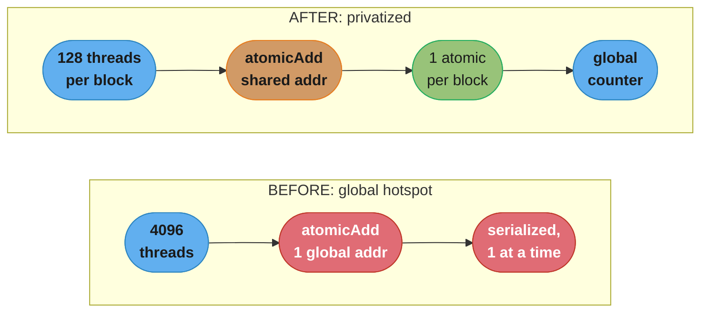
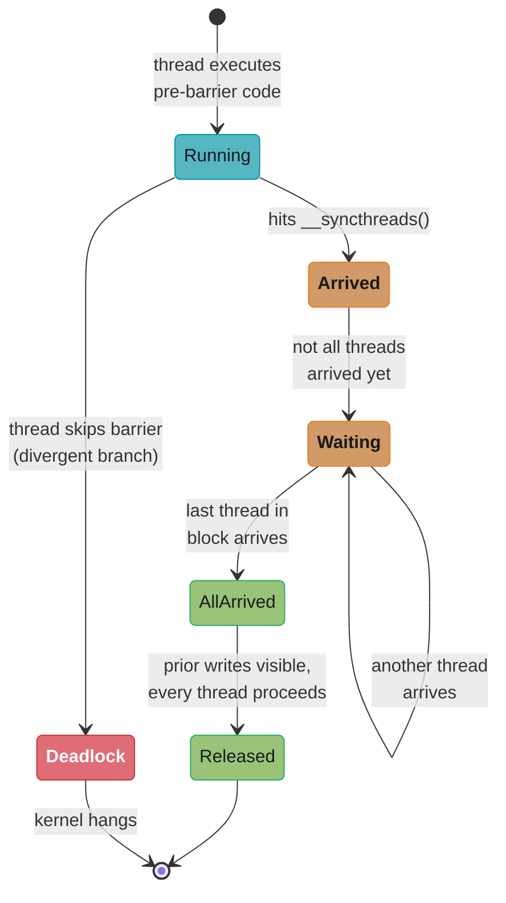
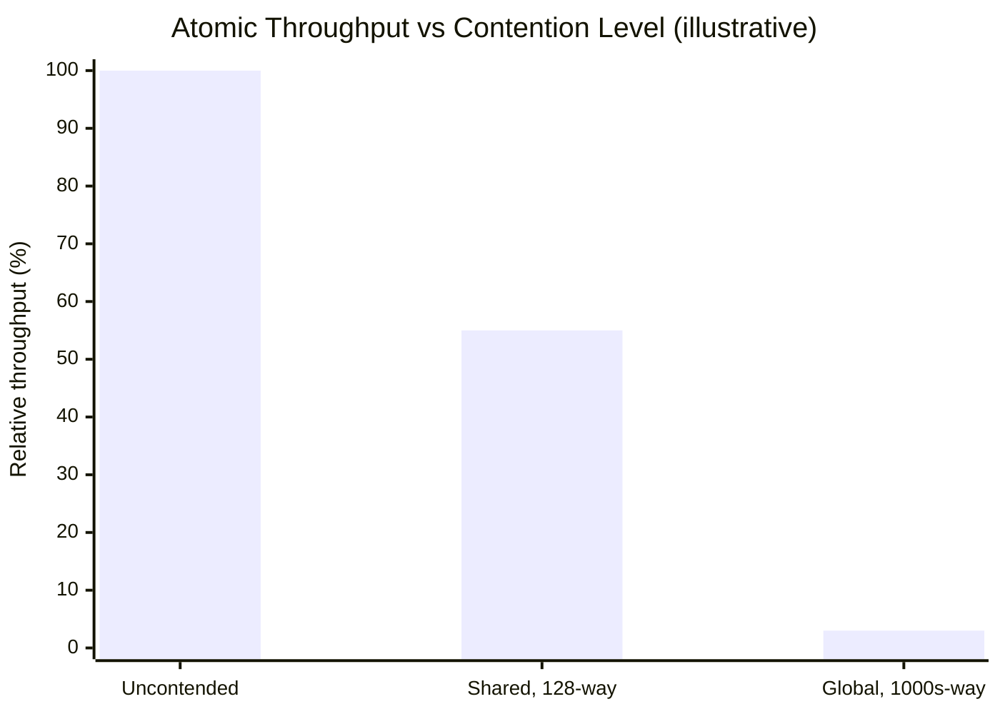

# Synchronization & Atomics

## 1. Concept Overview

A CUDA kernel launches thousands of threads that all read and write the same
global and shared memory concurrently, with no guarantee about *when* any
given thread's instructions execute relative to another's. Synchronization
and atomics are the two mechanisms that let you impose the ordering your
algorithm actually needs on top of that free-for-all: **barriers**
(`__syncthreads()`, cooperative-groups `sync()`) make every thread in a
scope wait until all of them arrive at the same point, **atomics**
(`atomicAdd`, `atomicCAS`, ...) make a read-modify-write on one address
indivisible even when thousands of threads target it simultaneously, and
**memory fences** (`__threadfence()`, `cuda::atomic` acquire/release) control
when a write becomes *visible* to other threads without necessarily
serializing anything.

Getting this wrong produces two failure modes that dominate GPU-interview
"what's wrong with this kernel" questions: a **data race** — a shared-memory
read that runs before the corresponding write has committed, silently
returning garbage or a stale value — and **atomic contention** — a single
hot address that forces thousands of logically-parallel threads through a
serialized queue, sometimes turning a "fast" GPU kernel into something
slower than a single CPU core. This module is the mechanics of avoiding
both: what a barrier actually guarantees, what an atomic actually costs, and
how to restructure a kernel (privatization, warp-aggregation) so
correctness does not have to cost you all your parallelism.

---

## 2. Intuition

> **One-line analogy**: `__syncthreads()` is "everyone in the room must
> reach the door before anyone opens it"; an uncontended atomic is a single
> person quickly signing a logbook; a contended global atomic is 4,096
> people trying to sign the *same* logbook through a *single* pen passed
> hand to hand — correct, but nobody is parallel anymore.

**Mental model**: Threads in a block are not marching in lockstep except
within a warp (32 threads). The instant you need thread 200 to see data
written by thread 5, you need an explicit synchronization point — the
hardware gives you nothing for free across warps. `__syncthreads()` is that
point *within a block*; it is a rendezvous, not a "wait a little" hint —
every single thread in the block must physically execute it, or the ones
that do will wait forever. Atomics are a different tool for a different
problem: not "wait for everyone," but "let everyone update the same
counter, one at a time, without losing an update." The cost of an atomic is
proportional to how many threads are fighting over the *same address* at
the *same instant* — spread that contention across many addresses (shared
memory, per-block counters) and the same total number of updates becomes
dramatically cheaper.

**Why it matters**: Synchronization bugs are the GPU equivalent of a data
race in multi-threaded CPU code, except worse in three ways: there is no
debugger single-step that reveals a race (the same kernel launch can pass
one run and silently corrupt data the next), a divergent barrier does not
throw an exception — it **deadlocks** the whole kernel, and atomic
contention does not error out — it just runs, quietly, at a fraction of the
throughput the hardware is capable of. Interviewers use this topic
specifically because "it compiled and gave a plausible answer" is not the
same as "it is correct" or "it is fast," and telling the two apart is a
senior-engineer skill.

**Key insight**: There are exactly three questions to ask about any
cross-thread interaction in a kernel: (1) does a later instruction depend
on an earlier one from a *different* thread — if so, you need a barrier or
a fence, not hope; (2) do multiple threads write the *same* address — if
so, you need an atomic, or you need to avoid the collision entirely
(privatization); (3) is the address you're contending on the cheapest one
available — shared memory beats global memory for the same atomic by close
to an order of magnitude under contention, and reducing the number of
threads hitting an address (tree reduction, per-block counters,
warp-aggregation) beats a faster atomic every time.

---

## 3. Core Principles

- **A barrier is block-scoped and all-or-nothing.** `__syncthreads()`
  guarantees that every thread in the block has reached the barrier and
  every prior global/shared memory write from every thread is visible to
  every other thread, before any thread proceeds past it. It says nothing
  about threads in *other* blocks.
- **Divergent barriers are undefined behavior, not a slow path.** If some
  threads in a block take a branch containing `__syncthreads()` and others
  do not, the ones that skip it never arrive — the ones that did are stuck
  forever. On current architectures this typically manifests as a kernel
  timeout/hang, not a clean error.
- **An atomic is a hardware-guaranteed indivisible read-modify-write.**
  `atomicAdd`, `atomicSub`, `atomicExch`, `atomicMin/Max`, `atomicAnd/Or/Xor`,
  and the general-purpose `atomicCAS` (compare-and-swap) all execute as one
  uninterruptible unit relative to every other atomic on the same address —
  no lost updates — but say nothing about *ordering* relative to
  non-atomic memory operations.
- **Atomic cost is a function of contention, not of the atomic itself.** An
  uncontended atomic (each thread hits a distinct address) costs close to a
  normal memory operation. A **contended** atomic — thousands of threads,
  one address — forces the memory subsystem to serialize every one of
  those updates: the operations that were logically parallel become a
  single-file queue.
- **A memory fence orders visibility, not execution order.**
  `__threadfence()` guarantees that writes issued *before* the fence by the
  calling thread are visible to other threads (at the fence's scope) before
  writes issued *after* the fence — it does **not** wait for other threads
  to do anything, and it does **not** make the calling thread's own
  instructions execute in program order any faster or slower.
- **Fence scope matters: block, device, and system are different
  guarantees.** `__threadfence_block()` orders visibility within the
  issuing thread's block; `__threadfence()` orders visibility across the
  whole device (all SMs); `__threadfence_system()` extends that guarantee
  to host memory and other devices over PCIe/NVLink — each wider scope is
  more expensive than the last.
- **The CUDA C++ memory model (`cuda::atomic`, `cuda::atomic_ref`) makes
  ordering explicit instead of implicit.** Acquire/release semantics let
  you say precisely "this store publishes data, this load must see it" —
  the same vocabulary as `std::atomic` in C++11 — instead of reasoning
  informally about `__threadfence()` placement.
- **Cooperative groups generalize the barrier beyond a single block.**
  `cg::this_thread_block().sync()` is functionally `__syncthreads()`
  wrapped in a composable object; cooperative groups also expose
  `grid_group::sync()` for a **grid-wide** barrier — something no
  intrinsic like `__syncthreads()` can express — at the cost of requiring
  a cooperative launch (`cudaLaunchCooperativeKernel`) and a GPU whose
  resident-block count fits the whole grid at once.

---

## 4. Types / Architectures / Strategies

### 4.1 Synchronization primitives, from narrowest to widest scope

| Primitive | Scope | What it guarantees |
|-----------|-------|---------------------|
| `__syncwarp(mask)` | One warp (subset via mask) | Reconverges the named lanes; needed since Volta's independent thread scheduling — lanes are no longer implicitly in lockstep |
| `__syncthreads()` | One thread block | Every thread in the block reaches this point; all prior shared/global writes from every thread are visible after it |
| `cg::this_thread_block().sync()` | One thread block | Same guarantee as `__syncthreads()`, expressed as a composable cooperative-groups object |
| `cg::grid_group::sync()` | Entire grid (cooperative launch) | Every block in the grid reaches this point — requires `cudaLaunchCooperativeKernel` and occupancy that fits the whole grid resident at once |
| Kernel-launch boundary | Entire grid (implicit) | The next kernel launched on the same stream only starts after the previous one fully completes — the "free" grid-wide barrier every kernel already has |

### 4.2 Atomic operation families

| Family | Examples | Typical use |
|--------|----------|--------------|
| Arithmetic | `atomicAdd`, `atomicSub` | Counters, histograms, reduction accumulation |
| Extrema | `atomicMin`, `atomicMax` | Running min/max (bounding boxes, top-k thresholds) |
| Bitwise | `atomicAnd`, `atomicOr`, `atomicXor` | Flag/bitmask aggregation |
| Exchange | `atomicExch` | Unconditional overwrite, returning the old value (e.g. simple locks) |
| Compare-and-swap | `atomicCAS` | The universal primitive — every other atomic can be built from a CAS retry loop; needed for types with no native atomic op (e.g. atomic float-max via bit tricks) |

### 4.3 Contention-mitigation strategies

- **Privatization** — give each block (or each warp) its own private copy
  of the contended data structure in shared memory, accumulate locally with
  cheap shared-memory atomics, then merge into the global structure with
  one atomic per block instead of one per thread.
- **Warp-aggregated atomics** — before touching the global atomic, have
  each warp locally combine (via `__reduce_add_sync` or ballot + popcount)
  all lanes' contributions into a single value, then issue **one** atomic
  per warp instead of up to 32. Covered in depth in
  [warp_level_primitives_and_cooperative_groups](../warp_level_primitives_and_cooperative_groups/).
- **Tree reduction** — replace N atomics into one address with a
  logarithmic reduction (shared memory or warp shuffle) that produces a
  single value, so the global structure receives one update per block
  instead of one per thread. Covered in
  [parallel_patterns_reduction_scan_histogram](../parallel_patterns_reduction_scan_histogram/).
- **Lock-free CAS retry loops** — for operations with no native atomic
  (atomic float max, atomic struct update), read-compute-CAS in a loop;
  correct under contention, but every failed CAS is wasted work, so this is
  still subject to the same contention cost as any other atomic.

---

## 5. Architecture Diagrams

### Data race: two warps, write-then-read with no barrier

```
Shared tile: sdata[0..255]                              time ------>

Time step:          t0   t1   t2   t3  |  t4   t5   t6   t7
Warp 0 (writes)       W    W    W    W  |   .    .    .    .
Warp 3 (reads)        .    .    R    R  |   R    R    .    .
                                ^
                    Warp 3 issues its first read at t2 -- Warp 0 has only
                    completed writes through t1.  sdata[k] may still hold
                    garbage (first launch) or a stale value from a prior
                    iteration (looped kernel).  The warp scheduler makes NO
                    promise that Warp 0 finishes before Warp 3 starts: this
                    is a plain data race -- undefined behavior, and the
                    wrong answer will not look wrong, it will look plausible.

Same block, WITH __syncthreads() inserted after the write phase:

Time step:          t0   t1   t2   t3 [==BARRIER==] t4   t5   t6   t7
Warp 0 (writes)       W    W    W    W [==WAIT/ARRIVE=]  .    .    .    .
Warp 3 (waits)        .    .    .    . [==WAIT/ARRIVE=]  .    .    .    .
Warp 3 (reads)                         [============]   R    R    R    R

__syncthreads() forces every warp in the block to arrive before any warp is
released -- reads issued after the barrier are guaranteed to see every
write issued before it, from every thread in the block, not just its own warp.
```

Two warps race on a shared tile: without a barrier, the reader can run
ahead of the writer and observe an incomplete write; the barrier makes
"finish writing" and "start reading" two provably ordered phases.

```mermaid
sequenceDiagram
    participant WA as Warp 0 (writer)
    participant Mem as Shared Tile
    participant WB as Warp 3 (reader)

    rect rgb(40, 44, 52)
    Note over WA,WB: BROKEN -- no barrier between phases
    WA->>Mem: write sdata[0..31] (t0-t1)
    WB->>Mem: read sdata[k] (t2)
    Note over Mem: write still in flight --<br/>read returns garbage/stale value
    WA->>Mem: write sdata[32..63] (t2-t3)
    Note over WB: value read BEFORE the write<br/>landed -- undefined behavior
    end
```



Caption: the scheduler gives no promise that Warp 0 finishes before Warp 3
starts, so Warp 3's read at t2 can observe a slot Warp 0 has not written yet
-- a plain data race that looks plausible, not obviously wrong.

```mermaid
sequenceDiagram
    participant WA as Warp 0 (writer)
    participant Bar as __syncthreads()
    participant WB as Warp 3 (reader)

    rect rgb(40, 44, 52)
    Note over WA,WB: FIXED -- barrier between write and read phases
    WA->>Bar: write sdata[0..255] (t0-t3)
    WA->>Bar: arrive at barrier
    WB->>Bar: arrive at barrier (idle t0-t3)
    Note over Bar: ALL threads arrived --<br/>every prior write now visible
    Bar-->>WB: release: read sdata[k] (t4+)
    Bar-->>WA: release
    end
```



Caption: `__syncthreads()` turns "write phase" and "read phase" into two
rendezvous-separated stages -- no warp is released until every warp in the
block has arrived, so the read after the barrier is guaranteed to see every
write before it.

### Atomic contention vs. per-block privatization

```
BEFORE -- naive global atomic (one address, thousands of threads):

  T0  T1  T2  T3  T4  T5  T6  ...  T4095   (4096 threads, all blocks)
   \   \   \   \   \   \   \        /
    \   \   \   \   \   \   \      /
     +---+---+---+---+---+---+----+
                    |
                    v
        atomicAdd(&globalCounter, 1)      <- ONE address, global memory
                    |
        [ 4096 sequential increments -- hardware serializes them all ]

Every one of the 4096 atomicAdd calls targets the same global address, so
the memory controller processes them one at a time no matter how many SMs
sit idle waiting their turn -- logically-parallel work becomes a single
queue.

AFTER -- per-block shared-memory privatization, one atomic per block:

  Block 0 (128 threads) --> atomicAdd(&sBlockCount, 1) x128   [SHARED mem]
      |
      +--> atomicAdd(&globalCounter, sBlockCount)              [1 atomic]

  Block 1 (128 threads) --> atomicAdd(&sBlockCount, 1) x128   [SHARED mem]
      |
      +--> atomicAdd(&globalCounter, sBlockCount)              [1 atomic]

  ... 32 blocks total (32 x 128 = 4096 threads) ...

Contention now splits two ways: 128 threads per block fight over a SHARED
address (cheap, on-chip, no HBM round trip), and only 32 atomics ever touch
the contended GLOBAL address -- a 128x reduction in global-atomic traffic
for the identical total count.
```

The first diagram is the classic "everyone in the whole grid fights over
one global address" failure; the second is the fix — push the contention
down to fast shared memory, and only pay the expensive global atomic once
per block instead of once per thread.



Caption: every thread in the grid funnels into one global address on the
left (a single-file queue); on the right, contention is split two ways --
128 threads fight over a cheap shared address, and only one atomic per
block ever touches the expensive global counter.



Caption: a barrier is all-or-nothing -- the block only leaves `Waiting` once
every thread has reached `Arrived`; a thread that skips the call on a
divergent branch (Pitfall 2) leaves the others stuck in `Waiting` forever,
which is why this state machine has no timeout transition.

---

## 6. How It Works — Detailed Mechanics

### 6.1 `__syncthreads()` — the block-wide barrier

Every thread in the block must execute the barrier call itself; the
compiler and hardware give no partial-progress guarantee for threads that
never reach it.

```cuda
__global__ void blockReverse(int *data) {
    extern __shared__ int tile[];
    int tid = threadIdx.x;

    tile[tid] = data[tid];        // write phase: every thread writes its own slot
    __syncthreads();              // barrier: ALL threads in the block must arrive here

    // read phase: safe only because the barrier guarantees every write above
    // is complete and visible before any thread crosses this line
    data[tid] = tile[blockDim.x - 1 - tid];
}
```

```python
from numba import cuda
import numpy as np

@cuda.jit
def block_reverse(data):
    tile = cuda.shared.array(shape=256, dtype=np.int32)
    tid = cuda.threadIdx.x

    tile[tid] = data[tid]
    cuda.syncthreads()             # same block-wide-barrier semantics as __syncthreads()

    data[tid] = tile[cuda.blockDim.x - 1 - tid]
```

The divergence trap in one line — **never do this**:

```cuda
if (threadIdx.x < 16) {
    __syncthreads();   // only 16 of the block's threads ever reach this call
}
// the other threads proceed without ever calling __syncthreads() --
// the 16 that did are now waiting for arrivals that will never come: deadlock
```

### 6.2 `atomicAdd` / `atomicCAS` — indivisible read-modify-write

```cuda
__global__ void histogramNaive(const unsigned char *data, unsigned int *bins, int n) {
    int i = blockIdx.x * blockDim.x + threadIdx.x;
    if (i < n) {
        atomicAdd(&bins[data[i]], 1u);   // one contended global address per bin value
    }
}

// atomicCAS is the general-purpose primitive: build any atomic op with a retry loop.
// Example -- atomic float max, which has no native intrinsic on most architectures.
__device__ float atomicMaxFloat(float *addr, float value) {
    int *addrAsInt = (int *)addr;
    int old = *addrAsInt, assumed;
    do {
        assumed = old;
        float current = __int_as_float(assumed);
        if (current >= value) break;               // already the max, nothing to do
        old = atomicCAS(addrAsInt, assumed, __float_as_int(value));
    } while (assumed != old);                        // retry if another thread won the race
    return __int_as_float(old);
}
```

```python
from numba import cuda

@cuda.jit
def histogram_naive(data, bins):
    i = cuda.grid(1)
    if i < data.size:
        cuda.atomic.add(bins, data[i], 1)     # global-memory atomic, same contention model

@cuda.jit
def atomic_cas_max(addr, value):
    # Numba exposes atomic.compare_and_swap for the same CAS-retry pattern
    old = addr[0]
    while True:
        assumed = old
        if assumed >= value:
            break
        old = cuda.atomic.compare_and_swap(addr, assumed, value)
        if old == assumed:
            break
```

### 6.3 `__threadfence()` — ordering visibility, not execution

The canonical use is the "last block detects completion" pattern: every
block computes a partial result, and the *last* block to finish combines
them all — but it must be certain every other block's write actually
landed in global memory before it reads them.

```cuda
__device__ unsigned int blocksDone = 0;
__device__ float partialSums[65536];   // one slot per block

__global__ void sumThenCombine(const float *data, float *result, int blocksTotal) {
    float partial = blockReduceSum(data);     // shared-memory tree reduction, per block

    if (threadIdx.x == 0) {
        partialSums[blockIdx.x] = partial;
        __threadfence();                       // this block's write must be globally VISIBLE
                                                 // before announcing completion --
                                                 // __threadfence orders visibility, it does
                                                 // NOT wait for any other block's progress
        unsigned int doneCount = atomicAdd(&blocksDone, 1) + 1;
        if (doneCount == blocksTotal) {
            float total = 0.0f;
            for (int b = 0; b < blocksTotal; b++) total += partialSums[b];   // safe: fenced
            *result = total;
        }
    }
}
```

Without the fence, the compiler and memory subsystem are free to have the
write to `partialSums[blockIdx.x]` still in flight when the atomic counter
increment becomes visible to the block that reads `doneCount ==
blocksTotal` — the counter and the data it is guarding travel through
different memory paths, and only the fence ties their visibility together.

### 6.4 The CUDA C++ memory model — `cuda::atomic` / `cuda::atomic_ref`

`libcu++` brings the C++20 `std::atomic` vocabulary (acquire/release,
explicit `thread_scope`) onto the device, replacing "where do I put
`__threadfence()`" with an explicit ordering annotation on the atomic
operation itself.

```cuda
#include <cuda/atomic>

// device-scope atomic counter -- visible to every thread on the GPU
__device__ cuda::atomic<int, cuda::thread_scope_device> counter{0};

__global__ void cppAtomicCounter() {
    counter.fetch_add(1, cuda::memory_order_relaxed);   // just an increment, no ordering needed
}

// acquire/release publish pattern -- the modern replacement for a manual __threadfence
__device__ cuda::atomic<int, cuda::thread_scope_block> ready{0};
__device__ int payload;

__global__ void publishSubscribe() {
    if (threadIdx.x == 0) {
        payload = computeExpensiveValue();
        ready.store(1, cuda::memory_order_release);     // publish: payload write happens-before
    }                                                     //  this store, guaranteed
    while (ready.load(cuda::memory_order_acquire) == 0) {}  // spin until the release is visible
    int value = payload;                                  // guaranteed to see the published write
}

// atomic_ref: attach atomic semantics to an existing non-atomic object in place,
// useful when the storage layout must match a plain array (e.g. shared with host code)
__global__ void refExample(int *plainArray) {
    cuda::atomic_ref<int, cuda::thread_scope_device> ref(plainArray[0]);
    ref.fetch_add(1, cuda::memory_order_acq_rel);
}
```

`thread_scope_block` / `thread_scope_device` / `thread_scope_system` map
directly onto the block/device/system fence hierarchy from 6.3 — the
narrower the scope you actually need, the cheaper the operation, because
the hardware does not have to flush visibility further than requested.

### 6.5 Cooperative groups — `this_thread_block().sync()`

```cuda
#include <cooperative_groups.h>
namespace cg = cooperative_groups;

__global__ void cgBarrierExample(int *data) {
    cg::thread_block block = cg::this_thread_block();
    extern __shared__ int tile[];

    tile[threadIdx.x] = data[threadIdx.x];
    block.sync();                                  // identical guarantee to __syncthreads(),
                                                     // but expressed as a composable object
    data[threadIdx.x] = tile[blockDim.x - 1 - threadIdx.x];
}

// grid-wide synchronization requires a COOPERATIVE launch -- __syncthreads() has
// no equivalent at this scope; ordinary kernel launches cannot express it at all
__global__ void gridWideBarrierExample(float *data) {
    cg::grid_group grid = cg::this_grid();
    // ... every block does phase-1 work ...
    grid.sync();                                    // every block in the ENTIRE grid arrives
    // ... phase-2 work can now safely read what every other block wrote in phase 1 ...
}
```

Numba's cooperative-groups support is limited to `cuda.syncthreads()` at
block scope; there is no first-class Python binding for grid-wide
cooperative sync, which is why this primitive is shown C++-only here and
deferred in full to
[warp_level_primitives_and_cooperative_groups](../warp_level_primitives_and_cooperative_groups/).

---

## 7. Real-World Examples

- **Reduction and scan kernels** rely on `__syncthreads()` between every
  step of the shared-memory tree so that step *k+1* never reads a partial
  sum step *k* has not finished writing — see
  [parallel_patterns_reduction_scan_histogram](../parallel_patterns_reduction_scan_histogram/)
  for the full ladder from divergent-and-conflicted to warp-shuffle.
- **Tiled shared-memory GEMM** (see
  [shared_memory_and_bank_conflicts](../shared_memory_and_bank_conflicts/))
  barriers twice per tile: once after loading the tile into shared memory
  (so no thread reads a stale/partial tile) and once after consuming it
  (so no thread overwrites the tile for the next iteration while a
  straggler is still reading it).
- **cuDNN/cuBLAS histogram and sparse-format conversion kernels** use
  privatized shared-memory counters internally for exactly the contention
  reasons in this module — it is a standard library-author technique, not
  a niche trick.
- **Persistent/producer-consumer kernels** (see
  [dynamic_parallelism_and_advanced_kernels](../dynamic_parallelism_and_advanced_kernels/))
  use `__threadfence()` plus an atomic flag to implement a lock-free queue
  handoff between a producing block and a consuming block that never calls
  `__syncthreads()` together (they are different blocks — a block-scoped
  barrier cannot reach across them).
- **NCCL's ring all-reduce** internally uses device-scope atomics and
  fences to coordinate the producer/consumer relationship between
  neighboring GPUs' send/receive buffers, the same primitives shown here
  applied across the PCIe/NVLink fabric instead of within one block.

---

## 8. Tradeoffs

| Mechanism | Cost | Guarantees | Scope |
|-----------|------|------------|-------|
| `__syncwarp()` | Very low | Reconverges named lanes | Warp (32 threads) |
| `__syncthreads()` | Low, but every thread pays it | Every thread arrives; prior writes visible | Block |
| Uncontended atomic | ~1 memory op | Indivisible update, no ordering promise beyond itself | Whichever address |
| Contended atomic (global) | 10-100x an uncontended one, scales with contender count | Indivisible update, correctness preserved | Whichever address |
| Contended atomic (shared) | Cheaper than the same contention on global — shared memory has no ~400-800 cycle HBM round trip to arbitrate | Same as above, block-local | Block |
| `__threadfence_block()` | Low | Visibility ordering within the block | Block |
| `__threadfence()` | Moderate | Visibility ordering across the whole device | Device |
| `__threadfence_system()` | Highest | Visibility ordering including host memory / peer devices | System |
| `cuda::atomic` (relaxed) | ~ intrinsic atomic | Indivisible update only, cheapest ordering | Chosen `thread_scope` |
| `cuda::atomic` (acquire/release) | > relaxed, < seq_cst | Explicit happens-before between publish/subscribe pair | Chosen `thread_scope` |
| Cooperative-groups grid sync | Highest (whole-grid rendezvous) | Every block in the grid arrives | Grid — requires cooperative launch |



Caption: this is the "contended (global)" row above turned into a picture —
an uncontended atomic costs close to a normal memory op, shared-memory
contention costs less than the same contention on global (no ~400-800 cycle
HBM round trip to arbitrate), and a directly-contended global atomic can
fall to a few percent of uncontended throughput, matching the 10-100x
slowdown this table already states in words.

---

## 9. When to Use / When NOT to Use

**Use `__syncthreads()` when:**
- A later phase in the same block reads shared memory a different thread
  wrote in an earlier phase (tiling, reduction, any staged shared-memory
  algorithm).
- You need every thread's shared-memory contribution finalized before any
  thread proceeds — and every thread in the block can unconditionally
  reach the call (no divergent guards around it).

**Avoid / restructure when:**
- The barrier would sit inside a divergent branch — restructure so the
  barrier is unconditional and the divergent logic surrounds it instead.
- You are trying to synchronize across blocks — `__syncthreads()` cannot
  do this; use a grid-wide cooperative-groups sync, split into two kernel
  launches (the implicit grid-wide barrier at a launch boundary), or a
  device-scope atomic completion counter (6.3's pattern).

**Use atomics when:**
- Multiple threads must update a *shared* aggregate (counter, histogram
  bin, running min/max) and the update order does not matter for
  correctness.
- The number of threads contending on any single address is small relative
  to total parallelism, or you have already privatized/tree-reduced to
  make it small.

**Avoid naive atomics when:**
- Thousands of threads target one address — privatize into shared memory
  or warp-aggregate first; a directly-contended global atomic can be
  10-100x slower than the same total work restructured to spread
  contention across many addresses.
- The operation can be expressed as a tree reduction instead — a reduction
  produces the same answer with `O(log n)` synchronized steps and zero
  atomic contention, and is almost always faster when applicable.

**Use `__threadfence()` / `cuda::atomic` acquire-release when:**
- You need a producer-consumer relationship *across* blocks (no shared
  `__syncthreads()` scope available) and correctness depends on write
  visibility, not just the atomic counter's value.

**Avoid fences when:**
- A `__syncthreads()` already covers the case (same block) — a fence is
  strictly weaker (no rendezvous guarantee) and is the wrong tool if what
  you actually need is "wait for everyone," not "make my writes visible."

---

## 10. Common Pitfalls

**Pitfall 1 — reading shared memory before the barrier that follows the write phase.**

```cuda
// BROKEN
__global__ void blockSumBroken(const int *data, int *out) {
    extern __shared__ int tile[];
    int tid = threadIdx.x;

    tile[tid] = data[tid];
    // BUG: no __syncthreads() here -- the read loop below can start
    // before every thread has finished writing its slot

    int sum = 0;
    for (int i = 0; i < blockDim.x; i++) sum += tile[i];  // may read garbage/stale entries
    out[tid] = sum;
}
```

```cuda
// FIX
__global__ void blockSumFixed(const int *data, int *out) {
    extern __shared__ int tile[];
    int tid = threadIdx.x;

    tile[tid] = data[tid];
    __syncthreads();                                       // FIX: wait for every write to land

    int sum = 0;
    for (int i = 0; i < blockDim.x; i++) sum += tile[i];    // now guaranteed complete
    out[tid] = sum;
}
```

This exact bug is nondeterministic: on a small block it may pass every test
run because the writing warp happens to race ahead far enough in practice,
then fail in production on a different GPU generation or under load.
`compute-sanitizer --tool synccheck` and `--tool racecheck` (see
[debugging_correctness_and_numerics](../debugging_correctness_and_numerics/))
catch exactly this class of bug — run them before trusting a kernel that
touches shared memory across a phase boundary.

**Pitfall 2 — a divergent `__syncthreads()` inside a data-dependent
branch.** Covered in 6.1: if any thread in the block can skip the barrier
call, the threads that do reach it wait forever. The fix is always to hoist
the barrier out of the conditional so every thread executes the same
`__syncthreads()` call, and put any divergent logic before or after it.

**Pitfall 3 — a single global `atomicAdd` hotspot.** Every thread across
the whole grid targeting `atomicAdd(&globalCounter, 1)` directly turns a
massively parallel kernel into a serialized queue at that one address — see
§14 for the full histogram example and its privatized fix.

**Pitfall 4 — assuming `__threadfence()` waits for other threads.** It does
not — it only orders *this* thread's own writes relative to other threads'
*future reads* of them. Pairing a fence with an atomic completion counter
(6.3) is what actually creates a "wait until everyone else is done"
guarantee; the fence alone gives you none of that.

**Pitfall 5 — floating-point atomics and nondeterministic results.**
`atomicAdd` on floats commits updates in whatever order the hardware
happens to schedule contending threads, and floating-point addition is not
associative — the same kernel launched twice can produce bit-different
sums. This is expected behavior, not a bug, but it breaks bitwise
reproducibility; see
[case_studies/cross_cutting/numerical_precision_and_determinism.md](../case_studies/cross_cutting/numerical_precision_and_determinism.md)
for when that matters and how to bound it (fixed-order tree reduction
instead of atomics, when determinism is a requirement).

---

## 11. Technologies & Tools

| Tool / API | Purpose | Notes |
|------------|---------|-------|
| `__syncthreads()` / `__syncwarp()` | Block / warp barrier intrinsics | The baseline primitives; available on every compute capability |
| Cooperative Groups (`cooperative_groups.h`) | Composable sync objects; adds grid- and multi-grid-scope barriers | Requires `cudaLaunchCooperativeKernel` for grid-wide sync |
| `atomicAdd`/`atomicCAS`/... intrinsics | Hardware atomic read-modify-write ops | Available on global and shared memory; type support varies by compute capability (e.g. double `atomicAdd` needed emulation pre-Pascal) |
| `libcu++` (`cuda::atomic`, `cuda::atomic_ref`) | C++20-style atomics with explicit memory order and thread scope | Ships with the CUDA Toolkit; header-only, usable in device code |
| Numba `cuda.atomic.*` / `cuda.syncthreads()` | Python-level equivalents of the C++ intrinsics | No first-class grid-wide cooperative sync binding |
| `compute-sanitizer --tool racecheck` | Detects shared-memory data races (missing/misplaced barriers) | Run on every kernel that stages data through shared memory |
| `compute-sanitizer --tool synccheck` | Detects divergent/illegal barrier usage | Catches the exact deadlock pattern in Pitfall 2 before it hangs a production job |
| Nsight Compute | Profiles atomic-instruction throughput and warp-stall reasons | "Long scoreboard" / atomic-contention stalls point straight at the address you need to privatize |

---

## 12. Interview Questions with Answers

**What does `__syncthreads()` actually guarantee?**
It guarantees every
thread in the block reaches that exact call before any thread proceeds past
it, and that every shared/global memory write issued before the barrier by
any thread is visible to every other thread after it. It does not
synchronize threads in other blocks, and it is not merely a performance
hint — skipping it when a later read depends on an earlier write is a
correctness bug, not a slowdown.

**Why does a divergent `__syncthreads()` deadlock the kernel?**
Because the
barrier requires every thread in the block to arrive, and if a branch lets
some threads skip the call entirely, the threads that did call it wait for
arrivals that will never come. The fix is to make the barrier call
unconditional and move any divergent logic to before or after it, never
around it.

**What is a data race in a CUDA kernel, and how does it usually show up?**
It is a read of shared or global memory that can execute before the write
it depends on has completed, because no barrier or fence enforces the
ordering. It typically shows up as intermittently wrong output — correct
on some runs or GPUs, silently wrong on others — which is exactly why it is
dangerous and why `compute-sanitizer --tool racecheck` exists.

**Why is a single global `atomicAdd` counter hit by thousands of threads so
slow?** Because every atomic on the same address must execute one at a
time — the hardware serializes them regardless of how many threads or SMs
are otherwise free, turning parallel work into a queue. A directly
contended global counter can run 10-100x slower than the same total update
count restructured through privatization or a tree reduction.

**What's the difference between `atomicAdd` and `atomicCAS`?**
`atomicAdd` performs one specific indivisible operation (add-and-return-old
value), while `atomicCAS` (compare-and-swap) is the general-purpose
primitive every other atomic can be built from via a read-compute-CAS retry
loop. Use CAS when you need an atomic update with no dedicated intrinsic —
for example, atomic float-max via reinterpreting bit patterns.

**What does `__threadfence()` do that `__syncthreads()` does not?**
It
orders the visibility of the calling thread's prior memory writes relative
to other threads' future reads, at device scope, without requiring any
other thread to reach the same point — it is not a rendezvous. Pairing it
with an atomic completion counter is the standard way to build a
"last-block-detects-completion" cross-block handshake.

**What's the difference between `__threadfence_block()`,
`__threadfence()`, and `__threadfence_system()`?** They order write
visibility at progressively wider scopes — within the issuing thread's
block, across the whole device, and including host memory and peer devices
over PCIe/NVLink, respectively. Each wider scope costs more, so pick the
narrowest one that satisfies your actual cross-thread dependency.

**Does a memory fence guarantee anything about execution order?**
No — a
fence only orders when writes become *visible* to other threads, not when
the issuing thread's own instructions execute; it never waits for any
other thread's progress the way a barrier does. Confusing "visible" with
"waited for" is the most common source of fence-related bugs.

**What is privatization, and why does it fix atomic contention?**
It gives
each block (or warp) a private, low-contention copy of the shared data
structure — typically in shared memory — that absorbs the bulk of the
atomic traffic cheaply, then merges into the global structure with one
atomic per block instead of one per thread. It turns "N threads contend on
one global address" into "N threads contend on a cheap shared address, and
only (N / threads-per-block) atomics ever touch the expensive global one."

**What is warp-aggregated atomics?**
Each warp first combines its lanes'
contributions locally (via shuffle/ballot) into a single value, then issues
one atomic per warp instead of up to 32 — cutting global atomic traffic by
close to 32x for that warp. It is the finest-grained version of the same
idea as privatization, applied at warp scope instead of block scope.

**Why is an `atomicAdd` on shared memory cheaper than the same call on
global memory under contention?** Shared memory is on-chip with latency in
the tens of cycles, while a contended global-memory atomic must arbitrate
through the memory controller across a ~400-800 cycle round trip per
serialized update. Moving the hot address from global to shared memory
does not remove the serialization, but it makes every serialized step far
cheaper.

**What is `cuda::atomic` / `cuda::atomic_ref`, and why use it over the raw
intrinsics?** It is the CUDA C++ memory model's libcu++ type, bringing
C++20 `std::atomic`-style explicit memory order (`relaxed`,
`acquire`/`release`, `acq_rel`, `seq_cst`) and `thread_scope`
(`thread_scope_block/device/system`) to device code. It replaces
implicit, easy-to-misplace `__threadfence()` calls with an ordering
annotation attached directly to the atomic operation that needs it.

**What do acquire and release mean in this memory model?**
A `release`
store guarantees all of the issuing thread's prior writes are visible to
any thread that later performs a matching `acquire` load of the same
atomic; the `acquire` load is the "wait until I can see what was
published" side of that same handshake. Together they express a
publish/subscribe dependency explicitly, instead of relying on informal
fence placement.

**How does cooperative-groups `this_thread_block().sync()` relate to
`__syncthreads()`?** It provides the exact same block-wide barrier
guarantee, just wrapped in a composable `cg::thread_block` object instead
of a bare intrinsic call. Cooperative groups' real value add is beyond the
block — `cg::grid_group::sync()` offers a grid-wide barrier that
`__syncthreads()` has no way to express at all.

**Can atomics or barriers span the whole grid, not just one block?**
`__syncthreads()` cannot; a grid-wide rendezvous requires either a
cooperative-groups `grid_group::sync()` under a cooperative launch, or
splitting the work across two kernel launches and relying on the implicit
barrier at the launch boundary. Atomics, by contrast, already work at
device (grid) scope by default — the address, not the operation, defines
the scope.

**Why can atomic-order-dependent floating-point summation be
nondeterministic across runs?** Because floating-point addition is not
associative, and `atomicAdd` commits contending threads' updates in
whatever order the hardware happens to schedule them, which can vary
between launches. See
[numerical_precision_and_determinism.md](../case_studies/cross_cutting/numerical_precision_and_determinism.md)
for when this matters and how a fixed-order tree reduction restores
bit-reproducibility at the cost of the flexibility atomics give you.

**What happens if you skip the atomic and just do a plain read-modify-write
from multiple threads on the same address?** Two threads can both read the
same old value, both compute the same "old + 1", and both write it back —
one increment is silently lost, with no error or warning. This is exactly
the failure mode atomics exist to prevent, and it is why "just increment a
counter" is never safe across threads without one.

**What tool would you use to catch a missing barrier or an atomic you
forgot, before it ships?** `compute-sanitizer` with `--tool racecheck`
flags shared-memory races (the missing-barrier class of bug), and
`--tool synccheck` flags illegal/divergent barrier usage — run both on
every kernel that stages data through shared memory or coordinates across
threads. Neither replaces testing, but both catch classes of bug that
"the output looked right on my test run" will not.

---

## 13. Best Practices

- Place every `__syncthreads()` call unconditionally on every code path in
  the block — if a branch is needed, put it around the barrier's
  neighbors, never around the barrier call itself.
- Treat any shared-memory write followed by a read from a *different*
  thread as needing a barrier by default; prove it is safe (e.g. same
  thread only) before removing one, not the other way around.
- Before reaching for an atomic, ask whether the update can be expressed as
  a tree reduction or scan instead — `O(log n)` synchronized steps with
  zero contention usually beats any number of atomics on one address.
- When an atomic is unavoidable and contention is high, privatize first:
  accumulate in shared memory per block (or per warp via
  warp-aggregation), and issue only one atomic per block/warp into the
  global structure.
- Prefer `cuda::atomic`/`cuda::atomic_ref` with an explicit memory order
  over a raw intrinsic plus a manually placed `__threadfence()` — the
  ordering is attached to the operation, not scattered nearby in the code,
  which is far easier to get right on review.
- Pick the narrowest fence/atomic scope the algorithm actually needs
  (`thread_scope_block` over `_device` over `_system`) — each wider scope
  costs more and buys a guarantee you may not be using.
- Always run `compute-sanitizer --tool racecheck` and `--tool synccheck`
  on new or modified kernels that touch shared memory or barriers, as a
  standard part of correctness testing, not an occasional debugging step.
- Do not rely on `atomicAdd`-accumulated floating-point sums for
  bit-reproducible results across runs — use a fixed-order reduction if
  determinism is a hard requirement.

---

## 14. Case Study

**Scenario**: A byte-histogram kernel bins 16,777,216 (16M) `unsigned char`
values into 256 bins. The first implementation has every thread do
`atomicAdd(&bins[data[i]], 1)` directly on a global `unsigned int bins[256]`
array — simple, correct, and far slower than the hardware is capable of.

```
Naive kernel launch: 16,384 blocks x 1024 threads = 16,777,216 threads total
Every thread's atomicAdd targets ONE of only 256 global addresses.
Average contention per bin address: 16,777,216 / 256 = 65,536 threads.
```

```cuda
// BROKEN (well, "correct but slow") -- direct global-memory contention
__global__ void histogramNaive(const unsigned char *data, unsigned int *bins, int n) {
    int i = blockIdx.x * blockDim.x + threadIdx.x;
    if (i < n) {
        atomicAdd(&bins[data[i]], 1u);   // up to 65,536-way contention per bin, on GLOBAL memory
    }
}
```

**Fix — per-block shared-memory privatization, one atomic per bin per block:**

```cuda
__global__ void histogramPrivatized(const unsigned char *data, unsigned int *bins, int n) {
    __shared__ unsigned int sBins[256];

    // 1. every block clears its own private copy of the histogram in shared memory
    for (int b = threadIdx.x; b < 256; b += blockDim.x) sBins[b] = 0;
    __syncthreads();                                    // FIX: all clears visible before use

    // 2. accumulate into the SHARED histogram -- contention is now block-local (1024
    //    threads per block instead of the whole grid) and lands on fast on-chip memory
    int i = blockIdx.x * blockDim.x + threadIdx.x;
    int stride = blockDim.x * gridDim.x;
    for (int idx = i; idx < n; idx += stride) {
        atomicAdd(&sBins[data[idx]], 1u);
    }
    __syncthreads();                                    // FIX: all shared updates done before merge

    // 3. merge -- exactly ONE global atomic per bin per block, not one per element
    for (int b = threadIdx.x; b < 256; b += blockDim.x) {
        if (sBins[b] > 0) {
            atomicAdd(&bins[b], sBins[b]);
        }
    }
}
```

```python
from numba import cuda
import numpy as np

@cuda.jit
def histogram_privatized(data, bins):
    sbins = cuda.shared.array(shape=256, dtype=np.uint32)
    tid = cuda.threadIdx.x

    for b in range(tid, 256, cuda.blockDim.x):
        sbins[b] = 0
    cuda.syncthreads()                                  # FIX: clears visible before accumulation

    i = cuda.grid(1)
    stride = cuda.blockDim.x * cuda.gridDim.x
    idx = i
    while idx < data.size:
        cuda.atomic.add(sbins, data[idx], 1)
        idx += stride
    cuda.syncthreads()                                  # FIX: all shared updates done before merge

    for b in range(tid, 256, cuda.blockDim.x):
        if sbins[b] > 0:
            cuda.atomic.add(bins, b, sbins[b])
```

```
Grid configuration for the privatized kernel: 128 blocks x 1024 threads,
each thread grid-strides over ~131,072 elements.

Global-atomic traffic comparison:
  Naive:       16,777,216 global atomicAdd calls (one per element)
  Privatized:  up to 128 blocks x 256 bins = 32,768 global atomicAdd calls
               (fewer still in practice -- the `sBins[b] > 0` guard skips
               empty bins per block)

  -> roughly a 512x reduction in GLOBAL atomic traffic for the same total count.
```

In a representative benchmark on a data-center GPU, the naive kernel is
memory-atomic-bound and the privatized kernel is closer to bandwidth-bound,
with the privatized version measured at roughly **10-15x faster** wall
clock for this input size — consistent with the general rule that a
directly-contended global atomic can be an order of magnitude (or two)
slower than the same work restructured through privatization. Nsight
Compute confirms this directly: the naive kernel's profile shows a large
share of warps stalled on "long scoreboard" waits tied to the atomic unit,
which nearly disappears in the privatized version. See
[shared_memory_and_bank_conflicts](../shared_memory_and_bank_conflicts/) for
the shared-memory sizing/bank-conflict considerations that apply to
`sBins`, and
[parallel_patterns_reduction_scan_histogram](../parallel_patterns_reduction_scan_histogram/)
for the full histogram optimization ladder (including warp-aggregated
atomics as a further refinement on top of this privatized version).

### Discussion Questions

- Why does the guard `if (sBins[b] > 0)` in the merge phase matter for
  performance, and would removing it change correctness?
- At what input distribution (e.g. all 16M bytes equal to the same value)
  does privatization stop helping, and why?
- How would warp-aggregated atomics change the shared-memory accumulation
  step in 6.3 of the pattern above, and what additional contention would
  it remove?
- If `bins` needed to be bit-reproducible across runs, what would you have
  to change about this kernel, and what would it cost?

---

## See Also

- [shared_memory_and_bank_conflicts](../shared_memory_and_bank_conflicts/) —
  the tiling/bank-conflict mechanics behind the shared-memory buffers
  atomics and barriers operate on in this module.
- [parallel_patterns_reduction_scan_histogram](../parallel_patterns_reduction_scan_histogram/) —
  the reduction/scan/histogram ladder that this module's privatization case
  study is one rung of.
- [warp_level_primitives_and_cooperative_groups](../warp_level_primitives_and_cooperative_groups/) —
  warp-aggregated atomics, `__shfl_*_sync`, and the full cooperative-groups
  API surface beyond the block-level `sync()` shown here.
- [case_studies/cross_cutting/numerical_precision_and_determinism.md](../case_studies/cross_cutting/numerical_precision_and_determinism.md) —
  why atomic-order-dependent floating-point sums are nondeterministic
  across runs, and how to bound it.
- [debugging_correctness_and_numerics](../debugging_correctness_and_numerics/) —
  `compute-sanitizer`'s `racecheck`/`synccheck` tools referenced throughout
  this module.
