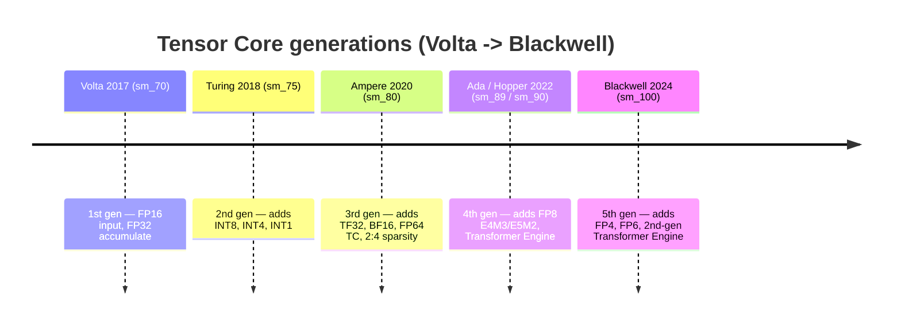
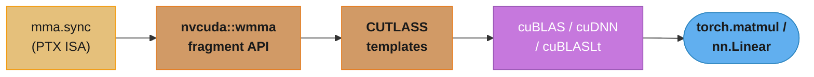
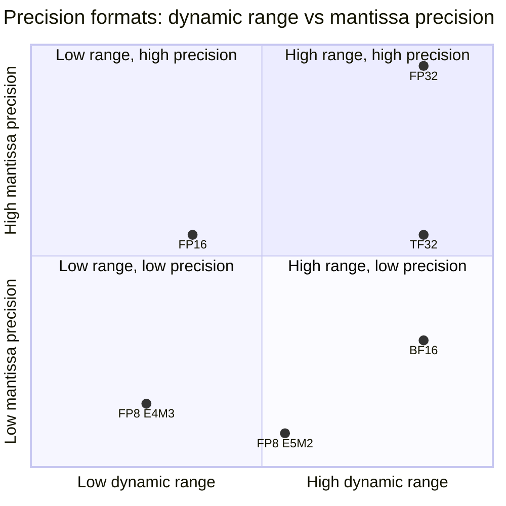
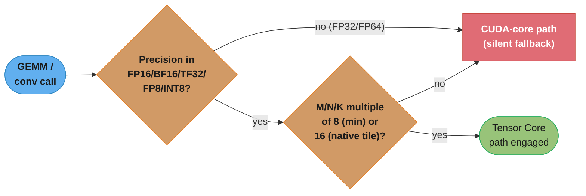
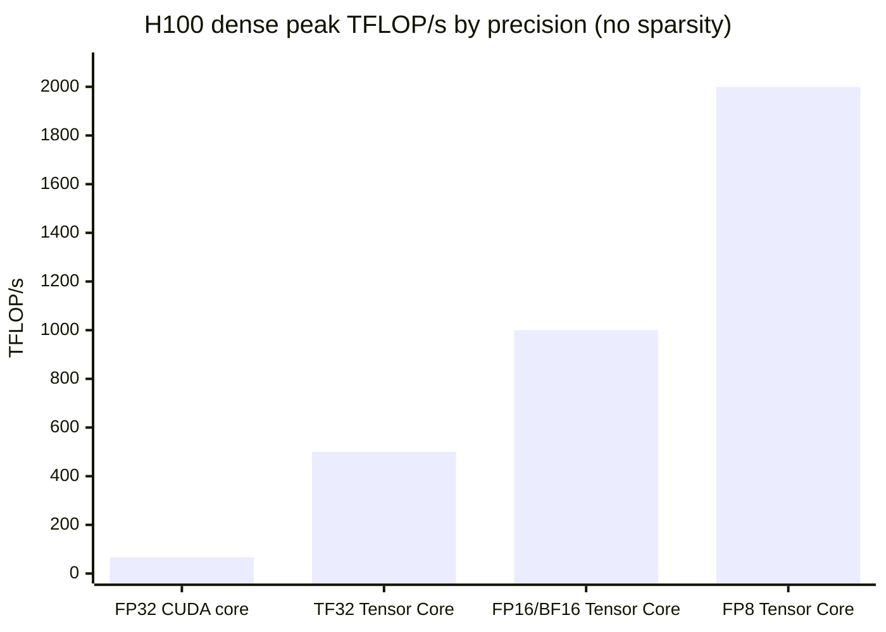
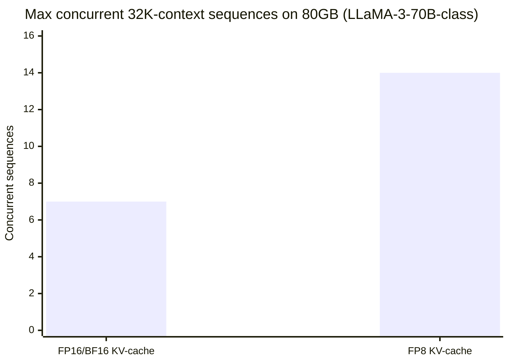

# Tensor Cores & Mixed Precision

## 1. Concept Overview

A **Tensor Core** is a specialized execution unit, separate from the ordinary CUDA cores, that computes a small, fixed-shape **matrix-multiply-accumulate (MMA)** in hardware — for example `D = A × B + C` where `A` is 16×16, `B` is 16×16, and `D`/`C` are 16×16 — as a *single warp-level instruction* rather than as thousands of individual scalar fused-multiply-adds. Introduced in Volta (V100, 2017) and present in every NVIDIA data-center GPU since, Tensor Cores are the single largest source of the FLOP/s gap between a GPU's "CUDA core" peak and its advertised AI-training/inference peak: on an H100, ordinary FP64 CUDA-core throughput is roughly 34 TFLOP/s, FP64 routed through the Tensor Cores is roughly 67 TFLOP/s, and dense FP16 through the Tensor Cores is roughly 1000 TFLOP/s — nearly 15× the non-Tensor-Core FP64 rate.

This module covers Tensor Cores from the kernel author's angle: what the hardware MMA operation actually does, the `nvcuda::wmma` fragment API that exposes it in CUDA C++, the lower-level `mma.sync` PTX instruction it compiles to, the precision formats Tensor Cores support (FP16, BF16, TF32, FP8 in two flavors, INT8), the accumulation-precision and loss-scaling concerns that make mixed-precision training numerically safe, and how the consumer-facing libraries — cuBLAS, cuDNN, CUTLASS, and PyTorch's `torch.autocast` — route ordinary matmuls onto this hardware automatically (or silently fail to). The kernel-vs-library boundary matters here more than almost anywhere else in this section: very few engineers write raw WMMA code in production, but every ML engineer depends on it firing correctly under the hood, and diagnosing when it *doesn't* fire is a top-tier interview and production-debugging skill.

Historically, this is also where the "GPU vs CPU" and "AI accelerator vs general-purpose compute" framings diverge sharply: a CPU has no equivalent fixed-function matrix unit at all (only vectorized scalar FMAs via AVX), which is a large part of why GPU training throughput outpaced CPU training throughput by two to three orders of magnitude even before considering core count. Every generation since Volta has added Tensor Cores rather than removed them, and every subsequent generation's headline "AI FLOP/s" number in NVIDIA's marketing material is a Tensor Core number, not a CUDA-core number — so understanding what actually triggers that hardware path is the difference between reading a spec sheet and being able to explain, from first principles, why a specific kernel does or does not hit it.

---

## 2. Intuition

> **One-line analogy**: An ordinary CUDA core doing FP16 multiply-adds is a single clerk manually multiplying and adding numbers one at a time; a Tensor Core is a small factory floor that ingests a whole 16×16 pallet of numbers from each of two conveyor belts and returns a finished 16×16 pallet of sums-of-products in one production cycle — you don't get to peek inside, you just load the belts and collect the output.

**Mental model**: A regular CUDA core executes one FMA (`d = a*b+c`) per thread per cycle — a GEMM built from CUDA cores is thousands of independent scalar FMAs, one per output element, accumulated across the K dimension in a loop. A Tensor Core instruction instead consumes a small dense tile of `A` and a small dense tile of `B` — cooperatively loaded and held across all 32 threads of a warp as an opaque **fragment** — and produces a tile of `D` in one hardware operation, at a throughput per clock that dwarfs 32 independent scalar FMAs. The catch is that this hardware unit is picky: it only accepts specific input precisions (FP16/BF16/TF32/FP8/INT8, never plain FP32), specific tile shapes (multiples of 8 or 16 in each matmul dimension), and it always accumulates in a *wider* format than the inputs (FP32 for FP16/BF16/TF32 inputs) so that summing hundreds of small products doesn't destroy precision before you even get to read the answer.

**Why it matters**: Every large model — training or inference — spends the overwhelming majority of its FLOPs in matrix multiplies (attention projections, FFN layers, convolutions), and those FLOPs are 8–16× cheaper per unit of silicon when routed through Tensor Cores in a supported precision than left on CUDA cores in FP32. The gap between "my model trains" and "my model trains at the GPU's advertised TFLOP/s" is almost always a Tensor Core engagement question — the wrong dtype, an unpadded dimension, or a library call that silently fell back to a slower path. Interviewers ask this because it separates engineers who know mixed precision is "a `torch.autocast` context manager" from engineers who know *why* it works and *when it silently doesn't*.

**Key insight**: Three questions decide whether your matmul is fast: (1) *is the precision one Tensor Cores accept* (FP16/BF16/TF32/FP8/INT8 — never FP32/FP64 as a native Tensor Core input), (2) *are the M/N/K dimensions multiples of the hardware's tile granularity* (8 for the library heuristics, 16 for the canonical WMMA tile), and (3) *is the accumulator precision wide enough to survive the reduction* (FP32 accumulation, plus loss scaling for FP16's narrow exponent range). Get all three right and the library — cuBLAS, cuDNN, or `torch.autocast` — does the rest silently; get any one wrong and you silently fall back to CUDA cores or silently corrupt gradients, with no error raised in either case.

---

## 3. Core Principles

- **Tensor Cores execute a fixed-shape warp-level MMA, not a per-thread FMA.** A single instruction (`wmma::mma_sync` in CUDA C++, `mma.sync` at the PTX level) computes an entire small tile multiply-accumulate cooperatively across all 32 threads of a warp; no thread computes one output element independently the way it does in a CUDA-core kernel.
- **Only specific input precisions are accepted**: FP16, BF16, TF32, FP8 (E4M3 and E5M2 variants), and INT8/INT4 depending on generation. Plain FP32 and FP64 are never native Tensor Core *inputs* — FP64 is supported only via a dedicated FP64 Tensor Core path on Ampere+ at roughly 2× ordinary FP64 CUDA-core throughput, still far below the FP16/BF16 rate.
- **Accumulation always happens in a wider format than the inputs.** FP16/BF16/TF32 inputs accumulate in FP32; FP8 inputs typically accumulate in FP16 or FP32 depending on the library. This is not optional — it is what keeps summing hundreds of K-dimension products from losing all precision.
- **Tensor Cores engage only when dimensions are multiples of the hardware tile granularity and the operands are in a supported precision.** cuBLAS/cuDNN's heuristics look for M/N/K multiples of 8 (and prefer multiples of 16) in a supported dtype before routing to Tensor Cores; anything else falls back to the ordinary CUDA-core path with no error, only a silent performance cliff.
- **TF32 is the *default* precision for FP32 matmuls on Ampere and later** unless explicitly disabled. It occupies a 32-bit register (so existing FP32 code needs zero source changes) but only the top 19 bits — 1 sign, 8 exponent, 10 mantissa — participate in the Tensor Core multiply, giving FP32's dynamic range at roughly FP16's mantissa precision.
- **FP16 has a narrow dynamic range (5 exponent bits) and needs loss scaling.** Small gradient values common in deep learning routinely underflow FP16's smallest representable magnitudes; multiplying the loss by a scale factor before backward (and dividing gradients by the same factor before the optimizer step) shifts those values into FP16's representable range without changing the math.
- **BF16 needs no loss scaling.** It trades FP16's extra mantissa bits for FP32's full 8-bit exponent range, so it can represent the same *magnitudes* as FP32 (just with less precision) — the underflow problem loss scaling solves for FP16 simply does not occur in BF16.
- **The library stack has three altitudes**: raw `mma.sync` PTX (compiler/library-internal), the `nvcuda::wmma` fragment API (what a kernel author writes by hand), and CUTLASS/cuBLAS/cuDNN (production libraries that generate the tiling, pipelining, and epilogue code around `mma.sync` so you rarely hand-write WMMA in a real system).
- **Which element types a fragment can hold is gated by compute capability, not just by the CUDA Toolkit version.** BF16 and TF32 fragment types require `sm_80` (Ampere) or later; FP8 fragment types require `sm_89`/`sm_90` (Ada/Hopper) or later — compiling WMMA code with an `-arch` target older than the precision you request either fails to compile or silently compiles a code path that never existed on the deployed GPU, depending on how the fallback is written.
- **Structured (2:4) sparsity is a second, independent throughput multiplier on top of precision** — it exploits a hardware-recognized zero pattern in the weight matrix rather than a numeric format, so it composes with (does not replace) the FP16/BF16/FP8 choice.

---

## 4. Types / Architectures / Strategies

### 4.1 Tensor Core generations and precision support

| Generation | GPU example | Compute capability | Precisions added |
|-----------|--------------|---------------------|-------------------|
| 1st gen | V100 (Volta) | 7.0 | FP16 input, FP32 accumulate |
| 2nd gen | T4 (Turing) | 7.5 | + INT8, INT4, INT1 |
| 3rd gen | A100 (Ampere) | 8.0 | + TF32, BF16, FP64 (via Tensor Core), sparsity (2:4 structured, 2×) |
| 4th gen | H100 (Hopper), L4/L40S (Ada) | 9.0 / 8.9 | + FP8 (E4M3, E5M2), Transformer Engine (per-layer automatic FP8) |
| 5th gen | B100/B200 (Blackwell) | 10.0 | + FP4, FP6, 2nd-gen Transformer Engine |



Every generation strictly adds a precision path on top of the last — nothing in this timeline is ever removed, which is why the "3rd gen" and "4th gen" labels in the table above map directly to which fragment element types a given `-arch` target actually supports (§6.3).

### 4.2 The three levels of the Tensor Core software stack

| Level | API | Who writes it | What it gives you |
|-------|-----|----------------|---------------------|
| Hardware ISA | `mma.sync` (PTX) | Compiler / library internals | The literal instruction; per-thread packed-register layout is architecture-specific and undocumented at the source level |
| Warp fragment API | `nvcuda::wmma` (CUDA C++) | Kernel authors writing custom fused kernels | Portable fragment types (`matrix_a`, `matrix_b`, `accumulator`) and `load_matrix_sync`/`mma_sync`/`store_matrix_sync`; hides per-thread layout |
| Templated GEMM library | CUTLASS (C++ templates) | Library/framework authors, advanced kernel authors | Full tiling hierarchy (thread-block tile → warp tile → MMA instruction), pipelining, epilogue fusion — CUTLASS is what cuBLAS/cuDNN build on internally |
| Vendor library | cuBLAS, cuDNN, cuBLASLt | Almost everyone | A single API call (`cublasGemmEx`, a `Conv2D`); Tensor Cores engage automatically when shape/precision heuristics are met |



Each layer trades hand-tuning control for authoring speed: almost nobody writes the leftmost node directly, and almost every production matmul only ever touches the rightmost one.

### 4.3 Structured sparsity — a second, orthogonal multiplier

Starting with Ampere, Tensor Cores also support **2:4 structured sparsity**: if a weight matrix is pruned so that exactly 2 of every 4 contiguous elements are zero (a pattern the hardware can exploit directly), the Tensor Core skips the zeroed multiplies and roughly doubles throughput again on top of whatever precision speedup is already in effect — so a BF16 matmul on 2:4-sparse weights can approach 16-32x a plain FP32 dense matmul rather than 8-16x. This requires a pruning step (typically prune-then-fine-tune) to reach the required 2:4 pattern without unacceptable accuracy loss, and is orthogonal to the precision question in §4.1 — sparsity and mixed precision compose rather than compete.

### 4.4 Library heuristic minimum vs. WMMA native tile alignment

Two different alignment thresholds are easy to conflate — the *minimum* that lets a library heuristic consider Tensor Cores at all, and the tile size the hardware actually executes natively:

| Alignment level | Threshold | What it governs |
|-------------------|-----------|--------------------|
| Library heuristic minimum | M/N/K multiples of 8 (FP16/BF16) | The smallest alignment cuBLAS/cuDNN's internal heuristic will consider before falling back to CUDA cores |
| WMMA / `mma.sync` native tile | 16×16×16 (FP16/BF16), 16×8×32 or similar for FP8 | The literal hardware instruction shape; a library-selected kernel internally pads or tiles further within this granularity even when the source dimension only satisfies the multiple-of-8 minimum |
| Recommended practice | Multiples of 64 | Not required by any single heuristic, but the conventional "safe" alignment (also friendly to shared-memory bank widths and thread-block tile sizes) used across production model configs — the LM head padding in §14 uses 64 for this reason |

### 4.5 Where mixed precision sits in the model lifecycle

| Lifecycle stage | Typical precision choice | Why |
|-------------------|------------------------------|-----|
| Pretraining (from scratch) | BF16 autocast (Ampere+) or FP8 via Transformer Engine (Hopper+) | Longest-running, most compute-dominated phase; throughput gains compound over the entire training run |
| Fine-tuning / LoRA | BF16 autocast, often with FP32 master weights for small trainable adapters | Base weights frequently loaded in a compressed format (FP16/INT4 via QLoRA) while adapter gradients stay in a higher-precision path — see [`../../llm/fine_tuning/`](../../llm/fine_tuning/) |
| Inference — latency-sensitive (interactive chat) | FP16/BF16 weights, FP8 KV-cache | KV-cache is usually the binding memory constraint at long context, so compressing it (not just the weights) is often the higher-leverage optimization |
| Inference — throughput-sensitive (batch/offline) | FP8 or INT8 weights and activations | Maximizes tokens/sec per GPU-dollar when a calibration/QAT step is affordable up front |

### 4.6 Precision-selection strategy by use case

| Use case | Recommended precision | Why |
|----------|------------------------|-----|
| Training from scratch, general | BF16 (autocast) | No loss scaling needed; matches FP32 dynamic range; standard on A100+ |
| Training on Volta-only hardware | FP16 + dynamic loss scaling | BF16 Tensor Cores did not exist before Ampere |
| Ordinary FP32 code, no source changes | TF32 (automatic on Ampere+) | "Free" 4-8x speedup over true FP32 with acceptable precision loss for most training/inference |
| Post-training quantized inference (weights + activations) | INT8 (with calibration) or FP8 E4M3 | Highest throughput; requires calibration or quantization-aware training to bound accuracy loss — see [`../../llm/optimization_and_quantization/`](../../llm/optimization_and_quantization/) |
| LLM training at very large scale (H100+) | FP8 via Transformer Engine (mixed E4M3/E5M2 per-tensor) | Automatic per-layer precision/scale selection; 2x throughput over BF16 with comparable convergence |
| Numerically sensitive reductions (softmax, layernorm, loss) | FP32 (kept out of autocast) | These ops are cheap in FLOPs but precision-sensitive; `torch.autocast` already excludes them by default |

---

## 5. Architecture Diagrams

### WMMA 16×16×16 warp-level MMA — fragment tiling

```
WMMA warp-level MMA (m16n16k16): D = A x B + C, one nvcuda::wmma::mma_sync() call

  A fragment: M=16 x K=16 (fp16)        B fragment: K=16 x N=16 (fp16)
  row-major, held across all 32 lanes   col-major, held across all 32 lanes
  of one warp (layout is opaque)        of the SAME warp (layout is opaque)

         K=16                                   N=16
   +----------------+                     +----------------+
   |                |                     |                |
 M |   16 x 16      |             K       |   16 x 16      |
 = |   fp16 tile    |            =16      |   fp16 tile    |
16 |                |                     |                |
   +----------------+                     +----------------+
           |                                      |
           +------------------+-------------------+
                              |
                one warp-level MMA instruction
             (32 threads act as a single hardware
              unit -- no per-thread inner K-loop)
                              |
                              v
                D / C accumulator: M=16 x N=16 (fp32)
                     +----------------+
                     |                |
                     |   16 x 16      |   D = A x B + C
                     |   fp32 tile    |   (accumulate-in-place)
                     |                |
                     +----------------+

One mma_sync() call retires a 16x16x16 = 4096-element multiply-accumulate per
warp in a handful of cycles. The compiler assigns each of the 32 lanes its
slice of the A/B/D fragments; a kernel author never indexes into a fragment
directly -- only load_matrix_sync/store_matrix_sync touch memory layout.
```

The K-dimension loop in a real GEMM chains many of these 16×16×16 tiles: each iteration loads the next 16-deep slab of `A` and `B` and calls `mma_sync` again with the running accumulator as both input and output, so the FP32 `D` tile only ever touches memory once, at the very end.

### Precision formats — range, mantissa, and Tensor Core support

```
Precision formats vs range, precision, and Tensor Core support by generation

Format      Bits  Exp   Mant  Max magnitude   Loss scaling   Min TC generation
                  bits  bits  (approx)        required?
----------  ----  ----  ----  --------------  -------------  --------------------
FP32          32     8    23  3.4e38          n/a            no (CUDA core only)
TF32        19/32     8    10  3.4e38          no             Ampere  (3rd gen)
FP16          16     5    10  6.55e4          YES            Volta   (1st gen)
BF16          16     8     7  3.4e38          no             Ampere  (3rd gen)
FP8 E4M3       8     4     3  448             n/a (inference) Hopper/Ada (4th gen)
FP8 E5M2       8     5     2  5.7e4           n/a (inference) Hopper/Ada (4th gen)
INT8           8    --    --  -128..127       n/a             Turing  (2nd gen)

TF32 is stored in a normal 32-bit register (zero source changes for existing
FP32 code) but only the top 19 bits -- 1 sign + 8 exponent + 10 mantissa --
reach the Tensor Core multiply; the remaining 13 mantissa bits are truncated.
FP8 E4M3 trades range for precision (used for weights/activations); E5M2
trades precision for range (used for gradients, which have larger dynamic
range during backward).
```

The two formats with 8 exponent bits (TF32, BF16, FP32) share FP32's dynamic range and therefore never need loss scaling; FP16's 5 exponent bits are the entire reason mixed-precision training needed a scaling trick before BF16 hardware existed.



Plotting the same exponent/mantissa bit counts from the table above as coordinates makes the range-vs-precision tradeoff visible at a glance: BF16 sits directly below FP32 (same range, coarser mantissa), while E4M3 and E5M2 sit in mirror-image corners of the low-precision region — exactly the "trades range for precision" / "trades precision for range" split described above.

---

## 6. How It Works — Detailed Mechanics

### 6.1 The WMMA fragment API in CUDA C++

```cpp
#include <mma.h>
using namespace nvcuda;

// Each warp computes one 16x16 tile of C = A * B (A: MxK fp16, B: KxN fp16,
// accumulate in fp32). Launch with a 2D grid where warps map to output tiles.
__global__ void wmma_gemm_kernel(const half *A, const half *B, float *C,
                                  int M, int N, int K) {
    // One warp per 16x16 output tile of C.
    int warpM = (blockIdx.x * blockDim.x + threadIdx.x) / warpSize;
    int warpN = blockIdx.y * blockDim.y + threadIdx.y;

    // Fragment declarations: opaque per-warp storage, NOT indexable by the
    // programmer -- only load_matrix_sync/mma_sync/store_matrix_sync touch them.
    wmma::fragment<wmma::matrix_a, 16, 16, 16, half, wmma::row_major> aFrag;
    wmma::fragment<wmma::matrix_b, 16, 16, 16, half, wmma::col_major> bFrag;
    wmma::fragment<wmma::accumulator, 16, 16, 16, float> accFrag;

    wmma::fill_fragment(accFrag, 0.0f);

    // K-dimension loop: chain 16-deep MMA tiles, accumulator carries forward.
    for (int k = 0; k < K; k += 16) {
        int aRow = warpM * 16, aCol = k;
        int bRow = k,          bCol = warpN * 16;
        if (aRow < M && aCol < K && bRow < K && bCol < N) {
            wmma::load_matrix_sync(aFrag, A + aRow * K + aCol, K);
            wmma::load_matrix_sync(bFrag, B + bRow * N + bCol, N);
            wmma::mma_sync(accFrag, aFrag, bFrag, accFrag);   // D = A*B + C
        }
    }

    int cRow = warpM * 16, cCol = warpN * 16;
    if (cRow < M && cCol < N) {
        wmma::store_matrix_sync(C + cRow * N + cCol, accFrag, N,
                                 wmma::mem_row_major);
    }
}
```

The fragment types encode the tile shape (`16, 16, 16`), the element type (`half`), and the source-matrix layout (`row_major`/`col_major`) at compile time — `mma_sync` is the only line that actually issues the hardware MMA instruction; everything else is address arithmetic and memory movement around it.

The host-side launch configuration is the part most often gotten wrong when adapting an ordinary CUDA-core GEMM launch to WMMA — the grid must be sized in units of 16×16 *output tiles per warp*, not in units of threads per output element:

```cpp
// Host launch config for the wmma_gemm_kernel above. Each warp (32 threads)
// computes one 16x16 output tile, so the grid is sized in tiles, not elements.
dim3 blockDim(128, 4);   // 128 threads = 4 warps in x; 4 warps in y -> 16 warps/block
dim3 gridDim((M + (blockDim.x / 32 * 16) - 1) / (blockDim.x / 32 * 16),
             (N + (blockDim.y * 16) - 1) / (blockDim.y * 16));

wmma_gemm_kernel<<<gridDim, blockDim>>>(A, B, C, M, N, K);
// CUDA_CHECK(cudaGetLastError()) immediately after any kernel launch --
// an invalid launch configuration for WMMA (e.g. blockDim.x not a multiple
// of 32) fails at launch time, not silently.
```

A common off-by-one here is forgetting that `blockDim.x` must itself be a multiple of `warpSize` (32) — WMMA fragments are a warp-wide construct, so a block dimension that splits a warp across two output tiles produces incorrect results with no compiler diagnostic.

### 6.2 The PTX instruction underneath WMMA

`wmma::mma_sync` is not itself a hardware instruction — it lowers to one or more `mma.sync` PTX instructions, the actual ISA-level Tensor Core op:

```ptx
// A single m16n8k16 Tensor Core MMA at the PTX level (Ampere+), fp16 inputs,
// fp32 accumulate. This is the instruction wmma::mma_sync() compiles down to.
mma.sync.aligned.m16n8k16.row.col.f32.f16.f16.f32
    {%f0, %f1, %f2, %f3},      // D: accumulator output, 4 fp32 regs per thread
    {%r0, %r1, %r2, %r3},      // A fragment: 4 packed-fp16 regs per thread
    {%r4, %r5},                 // B fragment: 2 packed-fp16 regs per thread
    {%f0, %f1, %f2, %f3};      // C: accumulator input (aliases D for in-place)
```

Each of the 32 threads in the warp supplies a small, architecture-defined slice of the fragment in its own registers — the exact per-thread mapping is undocumented at the PTX level and differs across compute capabilities, which is precisely why `nvcuda::wmma` exists: it is the portable abstraction over an instruction whose per-lane register layout you are not meant to hand-code.

The FP8 variant (Hopper+) follows the identical instruction shape with a different type suffix and a wider K dimension per instruction, reflecting FP8's smaller element size:

```ptx
// A single m16n8k32 Tensor Core MMA at the PTX level (Hopper+), fp8 e4m3
// inputs, fp32 accumulate -- K=32 (not 16) because each fp8 element is
// half the width of an fp16 element, so twice as many fit per instruction.
mma.sync.aligned.m16n8k32.row.col.f32.e4m3.e4m3.f32
    {%f0, %f1, %f2, %f3},      // D: accumulator output, 4 fp32 regs per thread
    {%r0, %r1, %r2, %r3},      // A fragment: packed fp8 regs per thread
    {%r4, %r5},                 // B fragment: packed fp8 regs per thread
    {%f0, %f1, %f2, %f3};      // C: accumulator input
```

### 6.3 Compute capability gating for fragment element types

Not every WMMA element type is available on every architecture — attempting to declare a fragment type the target `-arch` doesn't support is a compile-time error, not a runtime fallback:

| Fragment element type | Minimum compute capability | GPU example |
|---------------------------|--------------------------------|-----------------|
| `half` (FP16) | 7.0 | V100 (Volta) |
| `int8_t` / `uint8_t` (INT8) | 7.5 | T4 (Turing) |
| `precision::tf32` (TF32) | 8.0 | A100 (Ampere) |
| `__nv_bfloat16` (BF16) | 8.0 | A100 (Ampere) |
| `__nv_fp8_e4m3` / `__nv_fp8_e5m2` (FP8) | 8.9 / 9.0 | L4/L40S (Ada) / H100 (Hopper) |

Compiling for the wrong `-arch` target with a too-new element type fails the build outright (§12) — the safer of this module's two failure modes compared to a cuBLAS dimension/dtype mismatch, which fails silently at runtime instead.

### 6.4 CUTLASS — the layer above hand-written WMMA

Almost no production code hand-writes the K-loop in §6.1 for a full GEMM — real kernels need thread-block-level tiling (so many warps cooperate on a large output tile via shared memory), software pipelining (overlapping the next tile's global-memory load with the current tile's MMA), and an *epilogue* (bias-add, activation, quantization scaling) fused onto the accumulator before it is written back. **CUTLASS** is NVIDIA's open-source C++ template library that generates exactly this structure — thread-block tile → warp tile → `mma.sync` instruction — parameterized over precision, tile shape, and epilogue, and it is what cuBLAS itself is built from internally for newer architectures. Reach for CUTLASS when you need a fused, custom-epilogue GEMM (e.g. GEMM+bias+GELU in one kernel) that cuBLAS's fixed set of epilogues doesn't cover; reach for cuBLAS directly for a standard GEMM with no fusion.

A CUTLASS GEMM is assembled by choosing template parameters rather than writing the tiling loop by hand:

```cpp
#include "cutlass/gemm/device/gemm.h"

// FP16 inputs, FP32 accumulation, targeting Ampere's Tensor Cores, with a
// bias-add + ReLU epilogue fused directly onto the accumulator -- this is
// the templated equivalent of hand-writing §6.1's kernel plus a fused
// epilogue cuBLAS's fixed API does not expose.
using Gemm = cutlass::gemm::device::Gemm<
    cutlass::half_t, cutlass::layout::RowMajor,       // A: fp16, row-major
    cutlass::half_t, cutlass::layout::ColumnMajor,    // B: fp16, col-major
    float,           cutlass::layout::RowMajor,       // C/D: fp32, row-major
    float,                                             // accumulator: fp32
    cutlass::arch::OpClassTensorOp,                   // use Tensor Cores
    cutlass::arch::Sm80,                               // Ampere target
    cutlass::gemm::GemmShape<128, 128, 32>,            // thread-block tile
    cutlass::gemm::GemmShape<64, 64, 32>,              // warp tile
    cutlass::gemm::GemmShape<16, 8, 16>,               // MMA instruction shape
    cutlass::epilogue::thread::LinearCombinationRelu<  // fused bias + ReLU
        float, 4, float, float>>;

Gemm gemm_op;
gemm_op({{M, N, K}, {A, lda}, {B, ldb}, {C, ldc}, {D, ldd}, {alpha, beta}});
```

The three `GemmShape` parameters are exactly the tiling hierarchy in §4.2 made explicit: a 128×128 output tile per thread block, subdivided into 64×64 warp tiles, each computed from repeated 16×8×16 `mma.sync` instructions — the same hardware operation from §6.2, now wrapped in three layers of software tiling CUTLASS generates instead of a kernel author writing by hand.

### 6.5 The consumer view: `torch.autocast` and mixed-precision training

```python
import torch

model = MyTransformer().cuda()
optimizer = torch.optim.AdamW(model.parameters(), lr=3e-4)
scaler = torch.cuda.amp.GradScaler()   # dynamic loss scaling -- needed for fp16

for batch in dataloader:
    optimizer.zero_grad()
    with torch.autocast(device_type="cuda", dtype=torch.float16):
        # matmuls/convs run in fp16 on Tensor Cores; softmax/layernorm/loss
        # are kept in fp32 automatically by autocast's per-op allowlist
        logits = model(batch.inputs)
        loss = loss_fn(logits, batch.targets)

    scaler.scale(loss).backward()      # scale the loss up before backward --
                                        # shifts small fp16 gradients above
                                        # the format's underflow threshold
    scaler.unscale_(optimizer)         # divide gradients back down before
                                        # the optimizer reads them
    torch.nn.utils.clip_grad_norm_(model.parameters(), 1.0)
    scaler.step(optimizer)             # skips the step entirely if an inf/nan
                                        # was detected in the unscaled gradients
    scaler.update()                    # halves the scale after an overflow,
                                        # grows it after N clean steps
```

On Ampere and later, **BF16 needs none of the `GradScaler` machinery**:

```python
with torch.autocast(device_type="cuda", dtype=torch.bfloat16):
    logits = model(batch.inputs)
    loss = loss_fn(logits, batch.targets)
loss.backward()   # no scaler -- bf16's 8 exponent bits match fp32's range,
                   # so gradients that would underflow fp16 do not underflow here
```

### 6.6 Checking (and controlling) TF32

TF32 is on by default for FP32 matmuls and convolutions on Ampere+ — worth checking explicitly rather than assuming, since it silently changes numerical results relative to true FP32:

```python
print(torch.backends.cuda.matmul.allow_tf32)   # default varies by PyTorch version
print(torch.backends.cudnn.allow_tf32)         # True by default on Ampere+

# Explicitly opt in (for speed) or out (for FP32-exact reproducibility/testing):
torch.backends.cuda.matmul.allow_tf32 = True
torch.backends.cudnn.allow_tf32 = True
```

At the raw CUDA level, the same switch is `cublasSetMathMode(handle, CUBLAS_TF32_TENSOR_OP_MATH)` (or the reverse, `CUBLAS_DEFAULT_MATH`, to force true FP32).

### 6.7 Benchmarking mixed-precision throughput end to end

Confirming a speedup empirically — not just trusting that a dtype cast "should" be faster — is a two-line pattern worth having memorized:

```python
import torch

def bench_matmul(dtype, m=8192, n=8192, k=8192, iters=50):
    a = torch.randn(m, k, device="cuda", dtype=dtype)
    b = torch.randn(k, n, device="cuda", dtype=dtype)
    torch.cuda.synchronize()
    start, end = torch.cuda.Event(enable_timing=True), torch.cuda.Event(enable_timing=True)
    start.record()
    for _ in range(iters):
        c = a @ b
    end.record()
    torch.cuda.synchronize()
    ms_per_iter = start.elapsed_time(end) / iters
    tflops = (2 * m * n * k) / (ms_per_iter * 1e-3) / 1e12
    return ms_per_iter, tflops

for dtype in (torch.float32, torch.bfloat16, torch.float16):
    ms, tflops = bench_matmul(dtype)
    print(f"{dtype}: {ms:.3f} ms/iter, {tflops:.1f} TFLOP/s")
```

Representative results for an 8192×8192×8192 GEMM on an A100 (numbers vary by cuBLAS/driver version — always re-measure on the target hardware, never assume the spec-sheet peak is achieved):

```
Precision   Achieved TFLOP/s (approx)   Tensor Cores engaged?
FP32 (no TF32)     19                    no
TF32               ~150                  yes
BF16               ~270                  yes
FP16               ~270                  yes
```

The FP32-vs-TF32 gap alone (roughly 8x on this shape) is why leaving TF32 enabled is the single highest-leverage "free" optimization available on Ampere+ for any code that has not been explicitly ported to BF16/FP16 autocast.

### 6.8 Querying which kernel cuBLASLt actually chose

Rather than inferring engagement indirectly from throughput, `cuBLASLt` (cuBLAS's lower-level, more introspectable API) can be asked directly which algorithm its heuristic selected, which is the most direct way to confirm — at the API level, before ever opening a profiler — that a Tensor Core kernel was chosen:

```cpp
#include <cublasLt.h>

cublasLtMatmulPreference_t preference;
cublasLtMatmulPreferenceCreate(&preference);

cublasLtMatmulHeuristicResult_t heuristicResult[4];
int returnedResults = 0;
cublasLtMatmulAlgoGetHeuristic(
    ltHandle, matmulDesc, Adesc, Bdesc, Cdesc, Ddesc,
    preference, 4, heuristicResult, &returnedResults);

// heuristicResult[0].algo now identifies the specific kernel cuBLASLt would
// launch -- including whether it is a Tensor Core ("Tensor Op") variant.
// Logging this once per unique GEMM shape at startup catches a silent
// CUDA-core fallback before a single training step even completes.
```

Setting the environment variable `CUBLASLT_LOG_LEVEL=5` (or `CUBLAS_LOGINFO_DBG=1` for classic cuBLAS) at process startup dumps every selected kernel's name to a log file, giving the same answer without modifying source — a fast first step when Tensor Core engagement is in question and instrumenting the code directly isn't convenient.

### 6.9 Sweeping GEMM shapes to find the alignment cliff

Because Tensor Core fallback is silent, a small sweep script is a fast way to *see* the alignment cliff from §4.4 rather than take it on faith:

```python
import torch

def bench(m, n, k, dtype=torch.float16, iters=30):
    a = torch.randn(m, k, device="cuda", dtype=dtype)
    b = torch.randn(k, n, device="cuda", dtype=dtype)
    torch.cuda.synchronize()
    start, end = torch.cuda.Event(enable_timing=True), torch.cuda.Event(enable_timing=True)
    start.record()
    for _ in range(iters):
        a @ b
    end.record()
    torch.cuda.synchronize()
    ms = start.elapsed_time(end) / iters
    return (2 * m * n * k) / (ms * 1e-3) / 1e12   # TFLOP/s

for k in (4096, 4095, 4088, 4080, 4064):
    tflops = bench(4096, 4096, k)
    print(f"K={k:5d}  ({'mult of 8' if k % 8 == 0 else 'NOT aligned':12s}): "
          f"{tflops:6.1f} TFLOP/s")

# Typical output on an A100 -- the cliff at an unaligned K is immediate:
#   K= 4096  (mult of 8   ):  265.3 TFLOP/s
#   K= 4095  (NOT aligned ):   34.1 TFLOP/s   <-- CUDA-core fallback
#   K= 4088  (mult of 8   ):  261.7 TFLOP/s
#   K= 4080  (mult of 8   ):  259.4 TFLOP/s
#   K= 4064  (mult of 8   ):  256.9 TFLOP/s
```

A single element off the alignment boundary (`K=4095` above) is enough to trigger the entire fallback — the cliff is not gradual, which is exactly why "it's probably close enough" reasoning about matmul shapes is a trap.

### 6.10 Why accumulation precision and dimension alignment both gate Tensor Core engagement

Two independent conditions must both hold for cuBLAS/cuDNN to route a call onto Tensor Cores: the operand dtype must be one of FP16/BF16/TF32/FP8/INT8, **and** the GEMM's M, N, K dimensions must be multiples of the library's tile granularity (8 as the minimum heuristic threshold, 16 to hit the canonical WMMA/`mma.sync` tile exactly). Neither condition failing raises an error — cuBLAS simply falls back to its CUDA-core GEMM path at ordinary throughput, and the only symptom is a profile that doesn't match the GPU's advertised peak. This is covered further in §10's BROKEN→FIX pair.



Both gates are silent AND conditions — there is no third branch that raises a warning, which is exactly why "did it compile and run" is never sufficient evidence that the Tensor Core path (green) was actually taken instead of the fallback (red).

---

## 7. Real-World Examples

- **cuBLAS / `cublasGemmEx`**: every `torch.matmul`, `nn.Linear`, and `tf.matmul` call on a supported dtype/shape ultimately reaches this API, which selects a Tensor Core kernel automatically when the precision/dimension conditions in §6.10 hold. cuBLAS ships dozens of hand-tuned kernel variants per shape/precision/architecture combination and picks among them with an internal heuristic (or an explicit algorithm ID via `cublasGemmAlgo_t` for advanced tuning).
- **cuDNN convolutions**: `Conv2d` layers route to Tensor Core kernels the same way GEMMs do, provided channel counts are multiples of 8 (FP16) — a common reason vision models pad channel counts to 8/16/32 rather than using "natural" numbers like 3 (RGB) directly into the first Tensor-Core-eligible layer. cuDNN additionally requires the `NHWC` (channels-last) memory layout to hit its fastest Tensor Core convolution kernels on many architectures — `NCHW` can silently take a slower path even with an aligned channel count.
- **PyTorch Automatic Mixed Precision (AMP)**: `torch.autocast` + `torch.cuda.amp.GradScaler`, the industry-standard training recipe since 2019; used in virtually every large-scale PyTorch training run since Ampere-generation GPUs became standard. `torch.compile` composes with `autocast` transparently — the compiled graph still respects the per-op precision allowlist established at trace time.
- **NVIDIA Transformer Engine (Hopper/Blackwell)**: automatically selects FP8 E4M3 vs E5M2 per tensor and computes per-tensor scaling factors on the fly, used inside Megatron-LM and NeMo to train trillion-parameter models at roughly 2× the throughput of BF16 with comparable convergence. It exposes drop-in replacement layers (`te.Linear`, `te.LayerNormLinear`) that a Megatron-LM or NeMo model swaps in for the standard PyTorch layer with minimal code change.
- **TensorRT-LLM / vLLM FP8 inference**: production LLM-serving stacks quantize weights and KV-cache to FP8 E4M3 for inference, using calibration to bound accuracy loss — see [`../../llm/optimization_and_quantization/`](../../llm/optimization_and_quantization/) for the quantization-specific mechanics. Storing the KV-cache itself in FP8 rather than FP16 roughly halves KV-cache memory, directly increasing the batch size (and therefore throughput) a fixed amount of HBM can serve.
- **CUTLASS-based FlashAttention kernels**: FlashAttention's CUDA kernels are hand-tuned around `mma.sync`/CUTLASS primitives to fuse the softmax directly onto the Tensor Core accumulator, avoiding an HBM round-trip for the attention-score matrix — see [`../cuda_math_and_dnn_libraries/`](../cuda_math_and_dnn_libraries/). FlashAttention-3 specifically targets Hopper's 4th-generation Tensor Cores and asynchronous `mma.sync` pipelines to reach roughly 75% of the H100's peak FP8 FLOP/s for the attention operation alone.
- **Megatron-LM mixed-precision training loop**: NVIDIA's reference large-model training framework implements FP16/BF16 autocast plus a custom, more aggressive dynamic loss-scaling schedule than PyTorch's default `GradScaler`, tuned for multi-thousand-GPU runs where a single skipped step is expensive because it wastes an entire distributed all-reduce's worth of compute across every participating GPU.
- **Deep Learning frameworks' automatic channel padding**: NVIDIA's cuDNN and several vision-model training recipes automatically pad the first convolution's 3-channel RGB input to a Tensor-Core-friendly multiple internally, precisely because a from-scratch model author would otherwise hit the exact BROKEN pattern in §10 on the very first layer of the network.
- **Blackwell (GB200/B200) FP4/FP6 training experiments**: the 5th-generation Tensor Core's addition of FP4 and FP6 pushes the same precision-vs-range tradeoff introduced by FP8's E4M3/E5M2 split one step further, and NVIDIA's own published GB200 NVL72 benchmarks report roughly 4x the training throughput of an equivalent H100 generation largely attributable to the narrower precision paths plus a larger NVLink domain — an illustration that the precision ladder in §4.1 is still actively extending downward, not a settled endpoint.

---

## 8. Tradeoffs

**H100 dense throughput by precision (approximate, no sparsity):**

| Precision | Peak TFLOP/s (dense) | Relative to FP64 CUDA core |
|-----------|---------------------------|-------------------------------|
| FP64 (CUDA core, no Tensor Core) | ~34 | 1x (baseline) |
| FP64 (Tensor Core) | ~67 | ~2x |
| TF32 (Tensor Core) | ~500 | ~15x |
| FP16 / BF16 (Tensor Core) | ~1000 | ~29x |
| FP8 (Tensor Core) | ~2000 | ~59x |

This is the concrete basis for the "FP64 vs FP16" gap engineers quote informally — an H100 running dense FP16 GEMMs through its Tensor Cores has roughly 15x the throughput of the same GPU running the identical operation in FP64 on ordinary CUDA cores, before sparsity is even considered. HPC/scientific-computing workloads that must stay in FP64 for correctness (climate modeling, certain linear-solver-heavy simulations) are the primary reason the FP64 Tensor Core path exists at all — it recovers roughly 2x over the CUDA-core FP64 rate without leaving double precision.



FP32 CUDA-core throughput (~67 TFLOP/s, NVIDIA's published H100 non-Tensor-Core spec) barely registers next to the Tensor Core bars — TF32 alone is already ~7x higher, and the FP8 bar is nearly 30x higher, reusing the same TF32/FP16-BF16/FP8 figures from the table above.

| Precision | Speed vs FP32 (dense matmul, roughly) | Numerical safety | Setup cost |
|-----------|-----------------------------------------|-------------------|------------|
| TF32 | ~4-8x | High — full FP32 exponent range, precision loss usually below training noise floor | None (often on by default) |
| BF16 | ~8-16x | High — full FP32 exponent range, coarser mantissa; no loss scaling needed | Low — `autocast(dtype=bfloat16)` |
| FP16 | ~8-16x | Medium — narrow exponent range; requires loss scaling to avoid gradient underflow | Medium — `autocast` + `GradScaler` |
| FP8 (E4M3/E5M2) | ~16-32x | Lower — needs per-tensor/per-channel scaling and usually calibration; mainly inference/late-stage training | High — Transformer Engine or explicit quantization pipeline |
| INT8 | ~16-32x | Lowest for arbitrary values — fixed integer range, needs calibration or QAT | High — calibration dataset, quant-aware fine-tuning |

| Approach | Best for | Cost of getting it wrong |
|----------|----------|-----------------------------|
| Hand-written WMMA kernel | A single fused op cuBLAS/CUTLASS doesn't offer | High engineering effort; easy to leave Tensor Cores idle with a layout bug |
| CUTLASS | Custom epilogue fusion at near-cuBLAS performance | Steep template-metaprogramming learning curve |
| cuBLAS / cuDNN | The overwhelming majority of matmuls/convolutions | None if shapes/dtypes are chosen correctly; silent CUDA-core fallback otherwise |
| `torch.autocast` | Nearly all training/inference code | Silent full-precision fallback for ops outside the allowlist; easy to forget `GradScaler` for FP16 |

**KV-cache memory at 32K context, per sequence, LLaMA-3-70B-class model (80 layers, 8 KV heads, head_dim 128):**

| KV-cache precision | Bytes per token per sequence | Total at 32K context | Max concurrent sequences on 80 GB |
|-----------------------|----------------------------------|----------------------------|--------------------------------------|
| FP16/BF16 (2 bytes) | 2 × 80 × 2 × 8 × 128 = 327,680 bytes | ~10.5 GB | ~7 (before weights even loaded) |
| FP8 (1 byte) | 163,840 bytes | ~5.2 GB | ~14 |

Halving KV-cache bytes per token by moving it to FP8 does not touch the model weights at all, but it directly doubles how many concurrent long-context sequences a fixed GPU memory budget can serve — the reason FP8 KV-cache is frequently adopted before FP8 weights in latency-sensitive serving stacks.



The bar heights are the same 7-vs-14 figures from the table above — halving the bytes per token doubles the sequence count a fixed 80 GB budget can hold, with zero change to the model weights themselves.

---

## 9. When to Use / When NOT to Use

**Use Tensor Cores (via BF16/FP16 autocast or TF32) when:**
- The workload is dominated by matmuls/convolutions — the case for essentially every deep-learning training or inference job.
- You are on Ampere or later and can default to BF16, getting the speedup with none of the loss-scaling complexity.
- You are optimizing a custom fused kernel (attention, quantized inference) where a hand-written WMMA/CUTLASS kernel can additionally save an HBM round-trip that a fixed library epilogue cannot.

**Reach for FP8/INT8 specifically when:**
- You are serving inference at scale where throughput per dollar dominates and you can afford a calibration or quantization-aware fine-tuning step to recover accuracy — see [`../../ml/model_compression_and_efficiency/`](../../ml/model_compression_and_efficiency/).
- You are training a very large model on Hopper+ and can adopt Transformer Engine's automated per-tensor FP8 scaling rather than hand-rolling it.

**Do NOT force lower precision when:**
- The op is a reduction that is precision-sensitive and cheap in FLOPs anyway (softmax, layernorm, loss computation) — `autocast`'s default allowlist already keeps these in FP32; overriding that to "everything in FP16" is a common self-inflicted NaN source.
- Dimensions are small, irregular, and cannot be padded (e.g. a tiny final classification head) — the Tensor Core tile overhead and padding waste can outweigh the compute savings; profile before assuming a win.
- Exact bitwise FP32 reproducibility is a hard requirement (some scientific-computing or financial-calculation contexts) — disable TF32 explicitly rather than assume it is off.
- The workload is single-token autoregressive decode at batch size 1 — this is memory-bandwidth-bound (loading weights dominates, not the multiply itself), so a lower-precision *compute* format helps only insofar as it also shrinks the *bytes loaded per weight*; the win comes from smaller weight storage (FP8/INT8 weights), not from Tensor Core throughput, which is already idle waiting on HBM.
- You cannot afford any calibration/fine-tuning cycle before shipping — FP8/INT8 accuracy is workload-dependent, and skipping calibration on an unfamiliar model risks a silent accuracy regression that surfaces only in production evaluation metrics, not in a crash.

---

## 10. Common Pitfalls

**BROKEN — matmul dimensions not multiples of 8/16, Tensor Cores never engage:**

```cpp
// A GEMM with K = 100 (not a multiple of 8) — cuBLAS silently falls back to
// the CUDA-core path. No error, no warning -- just a profile that never hits
// the GPU's advertised Tensor Core TFLOP/s.
half *A, *B;  float *C;
int M = 1024, N = 1024, K = 100;   // <-- 100 is not a multiple of 8
cublasGemmEx(handle, CUBLAS_OP_N, CUBLAS_OP_N, M, N, K,
             &alpha, A, CUDA_R_16F, M, B, CUDA_R_16F, K,
             &beta,  C, CUDA_R_32F, M,
             CUDA_R_32F, CUBLAS_GEMM_DEFAULT_TENSOR_OP);
```

```cpp
// FIX -- pad K up to the next multiple of 16 (zero-padding the extra rows/
// cols of A and B contributes 0 to the dot product, so results are identical,
// and cuBLAS's Tensor Core heuristic now engages).
int K_padded = ((K + 15) / 16) * 16;   // 100 -> 112
// allocate A, B with the K_padded extent, memset the padding region to 0
cublasGemmEx(handle, CUBLAS_OP_N, CUBLAS_OP_N, M, N, K_padded,
             &alpha, A, CUDA_R_16F, M, B, CUDA_R_16F, K_padded,
             &beta,  C, CUDA_R_32F, M,
             CUDA_R_32F, CUBLAS_GEMM_DEFAULT_TENSOR_OP);
```

**BROKEN — naive FP16 accumulation loses precision (and can silently diverge):**

```cpp
// Accumulating a long dot product directly in fp16 -- each partial sum is
// rounded to fp16's ~10-bit mantissa at every step, and small later terms
// can underflow relative to a large running sum entirely.
__global__ void naive_dot_fp16(const half *a, const half *b, half *out, int n) {
    half acc = __float2half(0.0f);
    for (int i = 0; i < n; ++i) {
        acc = __hadd(acc, __hmul(a[i], b[i]));   // fp16 + fp16, rounds every step
    }
    out[0] = acc;
}
```

```cpp
// FIX -- accumulate in fp32 (or use wmma with its built-in fp32 accumulator,
// as in §6.1) and only cast down to fp16 at the very end, once.
__global__ void safe_dot_fp16_fp32acc(const half *a, const half *b,
                                       half *out, int n) {
    float acc = 0.0f;                            // wide accumulator
    for (int i = 0; i < n; ++i) {
        acc += __half2float(a[i]) * __half2float(b[i]);
    }
    out[0] = __float2half(acc);                  // single final rounding
}
```

Additional pitfalls:
- **Forgetting `GradScaler` with FP16 autocast**: training silently produces gradually degrading loss curves (or immediate NaNs) as small gradients round to zero — `scaler.scale(loss).backward()` is not optional for FP16, only for BF16.
- **Assuming TF32 is FP32**: a numerical unit test comparing GPU output to a CPU FP32 reference can fail spuriously at the default TF32 tolerance; either relax the tolerance intentionally or disable TF32 for the test.
- **Padding with garbage instead of zero**: padding a GEMM's K dimension for alignment (as in the fix above) must zero-fill the padding region — padding with uninitialized memory silently corrupts every output element.
- **Not checking `compute_XX`/`sm_XX` target**: WMMA code compiled for `sm_70` (Volta) does not expose BF16 or TF32 fragment types — a wrong `-arch` flag produces a compile error or, worse, a silently slower code path if a fallback exists.
- **Computing the loss itself inside a FP16 `autocast` region**: `autocast`'s allowlist already excludes most loss functions, but a hand-written custom loss that does its own reduction inside the `with autocast(...):` block can still accumulate in FP16 if it isn't recognized by the allowlist — cast logits/targets to FP32 explicitly before a custom reduction rather than trusting the context manager to catch every case.
- **Benchmarking with a shape too small to saturate the GPU**: a 128×128×128 GEMM barely fills a single SM's worth of Tensor Core tiles regardless of precision, so a "no speedup from FP16" benchmark result on a toy shape says nothing about the production shape — always benchmark at the actual production batch/sequence/hidden dimensions.
- **Channels-last vs. contiguous layout mismatches on convolutions**: cuDNN's fastest Tensor Core convolution kernels typically require `NHWC` (`torch.channels_last`) memory format; a model that never calls `.to(memory_format=torch.channels_last)` can silently sit on a slower `NCHW` Tensor Core path or no Tensor Core path at all.

---

## 11. Technologies & Tools

| Tool | Purpose | Notes |
|------|---------|-------|
| `nvcuda::wmma` | CUDA C++ header exposing warp-level MMA fragments | Hand-written fused kernels; portable across Volta+ (feature set varies by SM) |
| `mma.sync` (PTX) | The literal ISA-level Tensor Core instruction | Compiler/library-internal; almost never hand-written directly |
| CUTLASS | Templated C++ GEMM/convolution library | Custom epilogue fusion at near-cuBLAS performance; what cuBLAS is built on internally |
| cuBLAS / cuBLASLt | Dense linear algebra library | The default path for `torch.matmul`/`nn.Linear`; automatic Tensor Core routing |
| cuDNN | Deep-learning primitives (conv, pooling, normalization) | Automatic Tensor Core routing for convolutions under the same dimension/precision rules |
| PyTorch AMP (`torch.autocast` + `GradScaler`) | Training-loop mixed precision | The standard training recipe since 2019; per-op precision allowlist |
| NVIDIA Transformer Engine | Automated FP8 scaling for transformer layers | Hopper/Blackwell; used inside Megatron-LM/NeMo for trillion-parameter training |
| TensorRT-LLM | FP8/INT8 quantized inference engine | Calibration-based quantization for production LLM serving |
| Nsight Compute | Kernel profiler | The `sm__pipe_tensor_op_hmma_cycles_active` (and FP8/INT8 equivalents) metric directly answers "did Tensor Cores engage" |
| `cublasLtMatmulAlgoGetHeuristic` / `CUBLASLT_LOG_LEVEL` | Kernel-selection introspection | Confirms which specific algorithm (Tensor Core or not) cuBLASLt chose, without needing a full profiler run — see §6.8 |
| Triton | Python-embedded kernel DSL | Compiles block-level matmuls down through `mma.sync` automatically; trades hand-tuning control for much faster kernel authoring — see [`triton_and_kernel_dsls`](../triton_and_kernel_dsls/) |
| PyTorch `torch.channels_last` | Convolution memory layout | Required alongside dtype/alignment for cuDNN's fastest Tensor Core convolution kernels (§10) |
| `torch.compile` | Graph compiler | Composes transparently with `autocast`; does not itself change which ops are Tensor-Core-eligible, only how they're scheduled/fused |

---

## 12. Interview Questions with Answers

**Q: Why isn't my matmul getting the Tensor Core speedup I expected?**
The most common cause is a dimension that is not a multiple of the hardware's tile granularity (8 as the library minimum, 16 for the canonical WMMA tile) — cuBLAS/cuDNN silently fall back to the CUDA-core GEMM path with no error, and the only symptom is throughput far below the GPU's advertised peak. Check the actual M/N/K of the failing call, not just the "obvious" batch dimension. Padding the offending dimension to a multiple of 16 with zeros is the standard fix.

**Q: Why did my FP32 unit test start failing after I upgraded to an Ampere GPU?**
TF32 is the default precision for FP32 matmuls and convolutions on Ampere and later, and it truncates FP32's 23 mantissa bits down to 10 before the multiply — producing results that differ from true FP32 at roughly FP16 precision. Either relax the test's numerical tolerance to account for TF32, or explicitly disable it (`torch.backends.cuda.matmul.allow_tf32 = False` / `cublasSetMathMode(..., CUBLAS_DEFAULT_MATH)`) when exact FP32 reproducibility is required.

**Q: My FP16 training run is producing NaN losses after a few hundred steps — why?**
The near-universal cause is missing loss scaling: FP16's 5 exponent bits give it a much narrower dynamic range than FP32, so small gradient values common in deep learning underflow to zero, and once enough gradients vanish the optimizer state or a subsequent division produces NaN/Inf. Wrap the training step in `torch.cuda.amp.GradScaler` (which multiplies the loss up before backward and divides gradients back down before the optimizer step, skipping any step where it detects an overflow) or switch to BF16, which does not need loss scaling at all.

**Q: What is a Tensor Core, mechanically?**
It is a dedicated hardware unit, separate from ordinary CUDA cores, that computes a fixed-shape matrix-multiply-accumulate — for example a 16×16×16 tile — as one warp-level instruction instead of many independent scalar FMAs. Each of the 32 threads in a warp holds a small, architecture-defined slice of the input/output tiles in registers (a "fragment"), and a single `mma_sync`/`mma.sync` instruction retires the entire tile's multiply-accumulate in a handful of cycles.

**Q: What is the `nvcuda::wmma` API and why does it exist instead of just using `mma.sync` directly?**
WMMA is a portable CUDA C++ abstraction — `fragment`, `load_matrix_sync`, `mma_sync`, `store_matrix_sync` — over the raw `mma.sync` PTX instruction, whose exact per-thread register layout is undocumented and differs across compute capabilities. Writing to the WMMA fragment API rather than hand-coding per-lane register assignments keeps kernel source portable across GPU generations while the compiler handles the architecture-specific lowering.

**Q: Why must WMMA fragment dimensions be 16×16×16 (or another fixed supported shape) rather than arbitrary sizes?**
The Tensor Core hardware itself only implements a small, fixed set of tile shapes per precision (16×16×16 and variants like 32×8×16/8×32×16 for FP16 on many generations) — there is no hardware path for an arbitrary MMA size. A GEMM of any dimension is built by tiling the K loop into 16-deep chunks (as in §6.1) and by padding M/N/K up to the nearest supported multiple when the true problem size doesn't divide evenly.

**Q: Why does accumulation happen in FP32 even when the inputs are FP16 or BF16?**
Summing hundreds or thousands of K-dimension products in the same narrow format as the inputs would compound rounding error at every addition, and for FP16 in particular could overflow its ~65504 maximum magnitude well before the reduction finishes. FP32 accumulation (or FP16 for the newer FP8 paths, still wider than the FP8 inputs) keeps the running sum's precision and range far above the per-term error, so only the final cast-down to the output dtype introduces meaningful rounding.

**Q: What is loss scaling and why does only FP16 (not BF16) need it?**
Loss scaling multiplies the loss by a constant (or dynamically adjusted) factor before `backward()`, shifting gradient magnitudes up into FP16's representable range, then divides the gradients by the same factor before the optimizer reads them. BF16 has the same 8-bit exponent range as FP32, so the small-magnitude underflow problem loss scaling exists to solve for FP16's narrow 5-bit exponent simply does not occur in BF16 — which is why BF16 training code has no `GradScaler` at all.

**Q: What is the difference between static and dynamic loss scaling?**
Static loss scaling fixes one scale factor for the entire run, requiring manual tuning to avoid both underflow (scale too low) and overflow (scale too high). Dynamic loss scaling (PyTorch's `GradScaler` default) starts at a large scale, halves it whenever it detects an Inf/NaN in the unscaled gradients (skipping that optimizer step entirely), and grows it back by a small factor after a run of clean steps — self-tuning to the largest scale that doesn't overflow.

**Q: What is TF32 and why is it described as a "free" speedup?**
TF32 is a 19-bit compute format — FP32's 8 exponent bits, FP16's 10 mantissa bits — that Tensor Cores consume while the data still lives in ordinary 32-bit FP32 storage, so existing FP32 model code needs zero source changes to benefit; the truncation to 19 bits happens only inside the Tensor Core multiply. It has been the default for FP32 matmul/convolution on Ampere and later since its introduction, trading some mantissa precision (roughly FP16-level) for FP32's full dynamic range and a 4-8x throughput gain.

**Q: What is the difference between FP8 E4M3 and E5M2, and when do you use each?**
E4M3 (4 exponent bits, 3 mantissa bits) has a smaller maximum magnitude (~448) but more mantissa precision, making it the default choice for weights and activations in forward-pass inference. E5M2 (5 exponent, 2 mantissa) trades precision for a much larger range (~57344), which better suits gradients during backward passes where dynamic range varies more widely — NVIDIA's Transformer Engine picks between the two per-tensor automatically rather than requiring a manual choice.

**Q: How does cuBLAS decide whether to route a GEMM onto Tensor Cores?**
cuBLAS's internal heuristic checks the operand dtype (must be FP16/BF16/TF32/FP8/INT8) and whether the M/N/K dimensions meet the tile-alignment threshold (8 as the practical minimum, 16 to hit the canonical tile exactly); if both hold, it selects a Tensor Core kernel variant, and if either fails, it silently falls back to its ordinary CUDA-core GEMM kernel with no error or warning. This is why profiling actual achieved TFLOP/s against the GPU's advertised peak — not just "did the code run" — is the only reliable way to confirm engagement.

**Q: What is CUTLASS and when would you reach for it instead of cuBLAS?**
CUTLASS is NVIDIA's open-source C++ template library implementing the full tiling hierarchy (thread-block tile → warp tile → `mma.sync` instruction) with pipelining and customizable epilogues, and it is what cuBLAS itself is built from internally on newer architectures. Reach for CUTLASS directly when you need a fused operation cuBLAS's fixed epilogue set doesn't offer — for example a GEMM fused with a custom activation and a quantization rescale in a single kernel — trading a steep template-metaprogramming learning curve for near-cuBLAS performance plus fusion.

**Q: How does `torch.autocast` decide which operations run in reduced precision?**
`autocast` maintains a per-op allowlist/denylist: matmuls and convolutions (the FLOP-dominant, Tensor-Core-eligible ops) run in the requested reduced precision (FP16 or BF16), while numerically sensitive reductions like softmax, layer normalization, and loss computation are automatically kept in FP32 regardless of the context manager's dtype argument. This default split is why naively casting an entire model to `.half()` without `autocast` is a common way to introduce NaNs that `autocast` itself avoids.

**Q: Why might a model trained fine in FP32 diverge when switched to FP16 mixed precision, but train fine in BF16?**
FP16's narrow 5-bit exponent range is the near-universal cause: gradients or activations that were small-but-nonzero in FP32 round to exactly zero in FP16, and once enough values vanish, normalization layers or optimizer moment estimates can divide by (near-)zero and produce NaN/Inf. BF16 shares FP32's 8-bit exponent range, so the same small values remain representable (just with fewer significant digits), which is why switching the `autocast` dtype from `float16` to `bfloat16` is a common one-line fix for FP16-specific training instability on Ampere+ hardware.

**Q: What is the NVIDIA Transformer Engine and what problem does it solve?**
It is a Hopper/Blackwell-generation software+hardware feature that automates FP8 mixed-precision training for transformer layers — selecting E4M3 vs E5M2 per tensor and computing per-tensor scaling factors dynamically each step, rather than requiring a hand-tuned static quantization scheme. It is used inside frameworks like Megatron-LM and NeMo to reach roughly 2x the throughput of BF16 training with comparable convergence on very large models.

**Q: How would you use Nsight Compute to confirm a kernel is actually using Tensor Cores?**
Profile the kernel and look at pipeline-utilization metrics such as `sm__pipe_tensor_op_hmma_cycles_active` (or the analogous IMMA/FP8 metric) — a near-zero value means the launch never engaged Tensor Cores regardless of what the source code intended, while a high value close to the SM's tensor-pipe capacity confirms engagement. This is the only reliable confirmation; a kernel that "runs correctly" and even runs "fast" by CUDA-core standards can still be silently missing Tensor Core engagement entirely if a dimension/precision condition failed.

**Q: When would you deliberately avoid Tensor Cores / lower precision even though they're available?**
When the operation is a small, precision-sensitive reduction that's cheap in FLOPs regardless (softmax, layernorm, a loss computation) — the accuracy risk isn't worth the negligible time saved, which is exactly why `autocast`'s allowlist already excludes these ops by default. Also avoid forcing it onto dimensions too small or irregular to pad without dominating the actual tile size, and avoid it entirely when a workload demands bit-exact FP32 reproducibility, such as certain scientific-computing or regulated financial calculations.

**Q: What is INT8 Tensor Core support and how does it differ from the floating-point paths?**
INT8 Tensor Cores (available since Turing, 2nd generation) compute integer matrix multiplies at roughly double FP16's throughput, but require a quantization scheme — a per-tensor or per-channel scale factor mapping the original floating-point range into the 8-bit integer range `-128..127` — established via calibration on representative data or quantization-aware fine-tuning, rather than the drop-in dtype cast that FP16/BF16 autocast provides. This is the inference-time counterpart to FP8, generally reserved for post-training deployment rather than training itself — see [`../../ml/model_compression_and_efficiency/`](../../ml/model_compression_and_efficiency/) for the calibration mechanics.

**Q: What happens if you request a WMMA fragment type the target architecture doesn't support?**
The compilation fails outright rather than silently degrading — a BF16 or TF32 `wmma::fragment` declaration compiled with `-arch=sm_70` (Volta) produces a compile-time error because those element types simply don't exist in that architecture's header definitions. This is actually the safer failure mode compared to the dimension/dtype mismatches elsewhere in this module: a wrong `-arch` flag for WMMA code fails loudly at build time, whereas a wrong dimension for a cuBLAS call fails silently at runtime with only a throughput regression to notice.

**Q: How does structured 2:4 sparsity interact with the precision choice covered in this module?**
They are independent, multiplicative levers rather than alternatives — 2:4 sparsity (available from Ampere onward) exploits a hardware-recognized zero pattern in the weight matrix to roughly double throughput on top of whatever precision speedup (BF16, FP8, etc.) is already in effect, at the cost of a separate prune-then-fine-tune cycle to reach the required pattern without unacceptable accuracy loss. A common mistake is treating sparsity as "instead of" a precision choice rather than "in addition to" it.

**Q: Does arithmetic intensity (the roofline model) matter for deciding whether Tensor Cores help a given kernel?**
Yes — Tensor Cores raise the compute *ceiling*, but a kernel that is memory-bandwidth-bound (low arithmetic intensity, as in single-token autoregressive decode) is already below the ridge point and gains little to nothing from a higher compute ceiling it never reaches. Tensor Cores pay off precisely for compute-bound kernels (high arithmetic intensity, as in prefill or large-batch training matmuls) — see the CUDA section's roofline cross-cutting file for the general framework this module's precision-engagement rules plug into.

---

## 13. Best Practices

1. **Default to BF16 autocast on Ampere+ hardware** unless you have a specific reason (Volta-only deployment, an existing FP16 pipeline) to use FP16 — it eliminates the entire loss-scaling failure mode.
2. **Always verify Tensor Core engagement with a profiler**, not by reading source code — `sm__pipe_tensor_op_hmma_cycles_active` in Nsight Compute is the ground truth; "the code calls `cublasGemmEx`" is not.
3. **Pad matmul/convolution dimensions to multiples of 8 (ideally 16)** when a shape is under your control (e.g. vocabulary size, channel count) — a small amount of wasted compute on padding is nearly always cheaper than a full CUDA-core fallback.
4. **Never accumulate a long reduction in the same narrow format as the inputs** — accumulate in FP32 (or let WMMA's built-in accumulator type do it for you) and only cast down once, at the end.
5. **Explicitly log or assert your TF32 setting** in any benchmark or reproducibility-sensitive code path — its default state has changed across PyTorch versions and silently changes numerical results relative to true FP32.
6. **Keep precision-sensitive ops (softmax, norm, loss) in FP32** — rely on `autocast`'s default allowlist rather than casting an entire model to half precision by hand.
7. **Calibrate before quantizing to FP8/INT8 for inference** — never assume a straight dtype cast of pretrained FP32/BF16 weights to FP8/INT8 preserves accuracy without a calibration or quantization-aware fine-tuning pass.
8. **Reach for CUTLASS only when cuBLAS's epilogues don't cover your fusion need** — hand-rolling a WMMA/CUTLASS kernel is high-effort and easy to leave Tensor Cores under-engaged relative to a mature, hand-tuned vendor library.
9. **Use `torch.channels_last` memory format for convolutional models** so cuDNN's fastest Tensor Core kernels engage, not just an aligned channel count — layout and dtype are independent gating conditions and both must be satisfied.
10. **Benchmark at production shapes, not toy shapes** — a small GEMM can fail to saturate even one SM's Tensor Core pipes regardless of precision, making "FP16 isn't faster" benchmarks on unrepresentative sizes actively misleading.
11. **Treat structured 2:4 sparsity and precision as independent, stackable levers** — evaluate them separately (sparsity requires its own prune-then-fine-tune cycle) rather than assuming one subsumes the other.

---

## 14. Case Study

**Scenario:** A team fine-tunes a 7B-parameter transformer on 8×A100 GPUs. Two problems show up in the same week: (1) profiling shows the model's FFN layers are running at roughly 140 TFLOP/s per GPU — far below the A100's ~312 TFLOP/s dense FP16 peak — and (2) training loss goes to NaN around step 400 whenever they switch from BF16 to FP16 to try to match a colleague's older Volta-era recipe.

**Diagnosis — problem 1, Tensor Cores not engaging:**

The team profiles the training step with Nsight Compute, targeting the specific tensor-pipe metric rather than trusting wall-clock alone:

```bash
ncu --metrics sm__pipe_tensor_op_hmma_cycles_active.avg.pct_of_peak_sustained_active \
    --target-processes all \
    python train.py --steps 5
```

```
Nsight Compute reports sm__pipe_tensor_op_hmma_cycles_active near zero
for the FFN GEMM kernels. Inspecting the model config:

  hidden_dim = 4096, ffn_dim = 11008     <- 11008 / 8 = 1376, divides evenly
  vocab_size = 50257                     <- 50257 / 8 = 6282.125, does NOT divide

The LM head projection (hidden_dim -> vocab_size) has an N dimension of
50257 -- not a multiple of 8 -- so cuBLAS silently falls back to the
CUDA-core GEMM path for every LM head matmul, which dominates wall-clock
time at this model's vocabulary size.
```

**BROKEN → FIX (dimension padding):**

```python
# BROKEN -- vocab_size = 50257 is not a multiple of 8; the LM head GEMM
# (hidden_dim x vocab_size) never engages Tensor Cores.
lm_head = torch.nn.Linear(hidden_dim, vocab_size, bias=False)  # vocab_size=50257
```

```python
# FIX -- pad the output dimension up to the next multiple of 8 (or 64, the
# common convention for max alignment), slicing the logits back down to the
# true vocab size before the loss/softmax. The padded columns are simply
# unused logits and never receive gradient signal for real tokens.
vocab_size = 50257
vocab_size_padded = ((vocab_size + 63) // 64) * 64   # 50257 -> 50304
lm_head = torch.nn.Linear(hidden_dim, vocab_size_padded, bias=False)

logits = lm_head(hidden_states)[..., :vocab_size]    # slice back to real vocab
```

This single change raised the LM head GEMM from the CUDA-core fallback path to the Tensor Core path, and because the LM head is one of the largest single matmuls in a language model (hidden_dim × vocab_size), overall step time improved by roughly 15% with no change to model quality.

**Diagnosis — problem 2, FP16 underflow without loss scaling:**

```
The colleague's older recipe used torch.autocast(dtype=torch.float16) with
NO GradScaler, because their Volta-era codebase predated widespread
GradScaler adoption. On this model, gradient magnitudes in the later
transformer blocks are frequently below fp16's smallest representable
normal magnitude (~6.1e-5) by step ~400, rounding to exactly zero and
eventually producing a division-by-zero-adjacent NaN in the optimizer's
second-moment estimate.
```

**BROKEN → FIX (loss scaling):**

```python
# BROKEN -- fp16 autocast with no loss scaling: small gradients silently
# underflow to zero, and the run NaNs around step 400.
with torch.autocast(device_type="cuda", dtype=torch.float16):
    loss = model(batch).loss
loss.backward()
optimizer.step()
```

```python
# FIX -- add GradScaler for dynamic loss scaling (or, simpler on Ampere+,
# switch to bfloat16 entirely and drop fp16/GradScaler altogether).
scaler = torch.cuda.amp.GradScaler()

with torch.autocast(device_type="cuda", dtype=torch.float16):
    loss = model(batch).loss
scaler.scale(loss).backward()
scaler.unscale_(optimizer)
torch.nn.utils.clip_grad_norm_(model.parameters(), 1.0)
scaler.step(optimizer)
scaler.update()

# Simpler alternative on A100 (Ampere+): just use bf16, no scaler needed.
# with torch.autocast(device_type="cuda", dtype=torch.bfloat16):
#     loss = model(batch).loss
# loss.backward()
```

**Before/after metrics:**

```
                          Before fix          After both fixes
FFN + LM head TFLOP/s     140 TFLOP/s          ~290 TFLOP/s per A100
Tensor Core engagement    LM head: no          LM head: yes (padded to 50304)
                          FFN: yes              FFN: yes
Training stability        NaN at step ~400     Stable through full run (bf16)
Step time (8xA100)        1.85 s/step          1.55 s/step  (~16% faster)
```

**Root cause summary:**

| Problem | Symptom | Root cause | Fix | Section |
|---------|---------|------------|-----|---------|
| LM head slow | 140 TFLOP/s, far below peak | `vocab_size=50257` not a multiple of 8 | Pad output dim to 50304, slice logits back | §10 BROKEN→FIX 1 |
| NaN loss at step ~400 | Training diverges | FP16 gradients underflow with no loss scaling | Add `GradScaler` or switch to BF16 | §10 BROKEN→FIX 2 |

Notice that both root causes are silent by construction — neither raised an exception, a compiler warning, or even a non-zero exit code; both were only observable by profiling a specific hardware counter (Tensor Core utilization) and by watching a training curve over hundreds of steps, respectively. That asymmetry — instant, loud failure for a WMMA compile-time architecture mismatch (§12) versus silent, statistical failure for a cuBLAS heuristic miss or an underflowing gradient — is precisely why this module treats "verify, don't assume" as the load-bearing practice across §6, §10, and §13.

**Discussion questions:**
1. Why does padding the vocabulary dimension not change the model's actual predictions, and where exactly must the slice back to the true vocab size happen (before or after the loss)?
2. If the team had profiled only overall step time and not per-kernel Tensor Core utilization, what wrong conclusion might they have drawn about where the 140 TFLOP/s ceiling was coming from?
3. Why is BF16 the simpler fix for problem 2 on this hardware, and in what scenario (hardware or otherwise) would FP16 + `GradScaler` still be the right choice instead?
4. The fix padded `vocab_size` to a multiple of 64 rather than the minimum-required multiple of 8 — what's the argument for the larger alignment, and where would you look (§11's tools) to confirm it actually helps versus just adding unused compute?
5. Both fixes in this case study were silent failures — no exception, no crash — until measured. What would you add to a CI/regression pipeline for this training codebase so that a future silent Tensor Core fallback or loss-scaling regression is caught automatically rather than by a human noticing a stalled TFLOP/s number weeks later?

**Related reading**: [`../cuda_math_and_dnn_libraries/`](../cuda_math_and_dnn_libraries/) for how cuBLAS/cuDNN/CUTLASS build on the primitives in this module; [`../../llm/optimization_and_quantization/`](../../llm/optimization_and_quantization/) for quantization (GPTQ/AWQ) built on top of the FP8/INT8 paths introduced here; [`../../ml/model_compression_and_efficiency/`](../../ml/model_compression_and_efficiency/) for the training-time mixed-precision recipes this module's kernel-level view underlies; [`../case_studies/cross_cutting/numerical_precision_and_determinism.md`](../case_studies/cross_cutting/numerical_precision_and_determinism.md) for the broader numerical-determinism concerns (FMA reordering, atomics) that compound with mixed precision; [`../case_studies/optimize_matrix_multiplication_kernel.md`](../case_studies/optimize_matrix_multiplication_kernel.md) for the full GEMM optimization ladder ending at the Tensor Core rung covered here.
