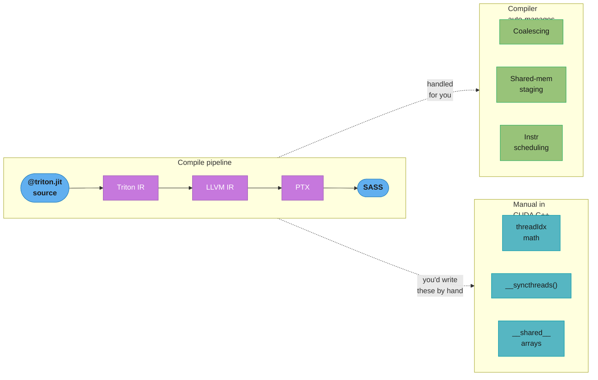
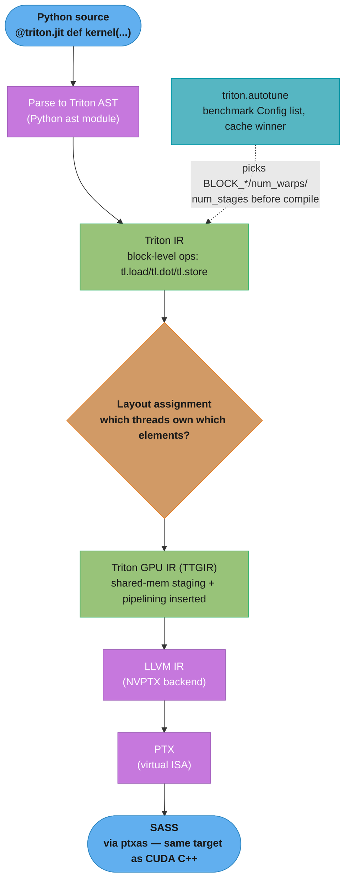
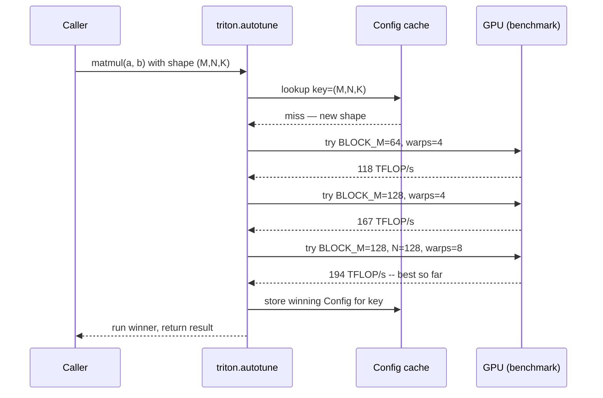
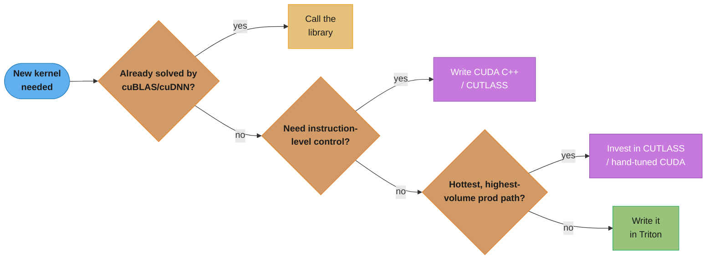

# Triton & Kernel DSLs

## 1. Concept Overview

Every kernel in the earlier phases of this section — coalescing, shared-memory
tiling, occupancy tuning — is written in **CUDA C++**, where the programmer is
responsible for every `threadIdx`, every shared-memory buffer, every
`__syncthreads()`. That control is exactly what makes CUDA C++ slow to iterate
in: a hand-tuned tiled GEMM is 300+ lines, and re-tuning it for a new GPU
generation or a new problem shape means re-deriving the tiling, the shared-memory
layout, and the occupancy math by hand. **Triton** (OpenAI, 2021) is a
Python-embedded domain-specific language (DSL) that raises the abstraction level
from *per-thread* to **per-block**: the programmer writes a kernel that operates
on a tile of data at a time, and the Triton compiler — not the programmer —
works out the thread-to-data mapping, the shared-memory staging, the memory
coalescing, and a large share of the instruction scheduling.

This module covers the Triton programming model end to end: how a `@triton.jit`
function differs from a CUDA `__global__` kernel, what the compiler abstracts
away and what it still leaves to you, the `triton.autotune` search loop that
replaces manual occupancy tuning, and the honest tradeoff — where Triton reaches
CUDA-C++-competitive performance in a fraction of the code (fused pointwise ops,
attention variants, quantized matmul), and where hand-written CUDA C++ or
CUTLASS still wins (peak dense GEMM, Tensor-Core micro-control, exotic
instructions). It closes with a brief survey of the other kernel DSLs occupying
the same design space — Numba CUDA, Mojo, and JAX/Pallas — so you can place
Triton correctly among its peers. Everything here assumes the memory-coalescing,
shared-memory, and occupancy mental models from
[memory_coalescing_and_access_patterns](../memory_coalescing_and_access_patterns/),
[shared_memory_and_bank_conflicts](../shared_memory_and_bank_conflicts/), and
[occupancy_and_launch_configuration](../occupancy_and_launch_configuration/) —
Triton does not remove those concerns, it moves who is responsible for them.

---

## 2. Intuition

> **One-line analogy**: Writing raw CUDA C++ is like directing a marching band
> by shouting a personal instruction to every one of 50,000 individual
> musicians; writing Triton is like handing the drum major a score for "the
> brass section" and "the woodwind section" and trusting a very good arranger
> to work out which musician plays which note, in what order, without
> colliding with anyone else.

**Mental model**: A CUDA kernel is written from the point of view of **one
thread** — you compute `threadIdx.x + blockIdx.x * blockDim.x`, decide what that
one thread loads, computes, and stores, and the SIMT hardware replicates your
code across 32-thread warps. A Triton kernel is written from the point of view
of **one program instance operating on one block of data** — you compute
`pid = tl.program_id(0)`, decide what *tile* of data that program owns
(`offs = pid * BLOCK_SIZE + tl.arange(0, BLOCK_SIZE)`), and issue
block-level operations (`tl.load`, `tl.store`, `tl.dot`) over the whole tile at
once. There is no `threadIdx` anywhere in a Triton kernel — the compiler lowers
each block-level operation to the individual-thread SASS instructions, deciding
warp assignment, shared-memory staging, and vectorized/coalesced access pattern
on your behalf. You still choose the tile shape (`BLOCK_SIZE`, `BLOCK_M/N/K`)
and the algorithm; the compiler chooses everything below that line.

**Why it matters**: The single biggest cost in GPU kernel engineering is not
compute — it is *iteration time*. A CUDA-C++ engineer re-tuning a fused
attention kernel for a new head dimension or a new GPU architecture is
re-deriving shared-memory tiling and bank-conflict avoidance by hand, a process
that takes days. The same re-tuning in Triton is often changing a handful of
`BLOCK_*` constants and re-running `triton.autotune` — a process that takes
minutes. This is why Triton underlies `torch.compile`'s generated kernels
(TorchInductor emits Triton, not CUDA C++) and why most open-source FlashAttention
variants outside NVIDIA's own CUTLASS-based implementation are written in
Triton: it makes the fused-kernel technique (avoid an HBM round-trip by fusing
softmax into the matmul) accessible to any PyTorch engineer, not just a CUDA
specialist.

**Key insight**: Triton does not remove GPU performance engineering — it
**relocates** it. Coalescing, shared-memory reuse, and instruction scheduling
are handled by the compiler *as long as your block-level code exposes them* (a
`tl.load` over a contiguous block-sized range compiles to a coalesced access;
a `tl.dot` over blocks staged from `tl.load` compiles to shared-memory-backed
Tensor-Core MMA instructions). What is left for you to reason about is:
**block/tile shape choice** (BLOCK_M/N/K, num_warps, num_stages) and
**boundary correctness** (masking loads/stores at array edges, since the grid
is launched in whole blocks even when the problem size isn't a multiple of the
block size). Master those two axes — tile-shape search and masking — and you
have most of what CUDA-C++ tiling gives you, at 5-10× less code.

---

## 3. Core Principles

- **Triton programs are SPMD at the block level, not the thread level.** A
  Triton kernel launch creates a grid of *program instances* (analogous to CUDA
  thread **blocks**, not threads); each instance is identified by
  `tl.program_id(axis)` and operates on a whole tile of elements per instruction.
- **There is no `threadIdx` in Triton source.** The compiler's mid-level pass
  (Triton GPU IR / "TTGIR") assigns a *layout* — which of the 32/64/128 threads
  in the launched warps own which elements of the tile — and lowers every
  block-level `tl.load`/`tl.dot`/`tl.store` to per-thread instructions
  consistent with that layout.
- **The compiler, not the programmer, stages shared memory.** When a Triton
  kernel uses `tl.dot` on tiles loaded via `tl.load`, the compiler inserts the
  shared-memory buffering, the pipelined double/triple-buffered loads
  (`num_stages`), and the bank-conflict-free layout — the exact work a CUDA-C++
  tiled-GEMM kernel does by hand in
  [shared_memory_and_bank_conflicts](../shared_memory_and_bank_conflicts/).
- **Coalescing is a property of how you write the block-level access, not
  something you request.** `tl.load(ptr + offs, mask=offs < N)` where `offs`
  is a contiguous `tl.arange`-derived range compiles to the same 128-byte
  coalesced transactions a hand-written CUDA kernel would need explicit index
  math to achieve; a strided or gather-style `offs` compiles to the same
  uncoalesced access pattern CUDA would produce for the equivalent index math.
  Triton changes *who writes the index math*, not the underlying hardware rule.
- **Masking is mandatory whenever the problem size is not an exact multiple of
  `BLOCK_SIZE`.** Triton always launches whole blocks (`grid = ceil(N / BLOCK_SIZE)`)
  — the last block's out-of-range lanes must be masked on every `tl.load` and
  `tl.store`, or the kernel reads/writes out of bounds exactly like an
  unguarded CUDA index would.
- **`triton.autotune` replaces the manual occupancy-tuning loop.** Instead of
  hand-computing registers-per-thread and shared-memory-per-block against the
  SM's resident-warp limits (as in
  [occupancy_and_launch_configuration](../occupancy_and_launch_configuration/)),
  you declare a list of `Config`s (candidate `BLOCK_*`, `num_warps`, `num_stages`)
  and Triton benchmarks each on first call, caching the fastest per input shape.
- **Triton programs still compile all the way to SASS.** The pipeline is
  Python AST → Triton IR → Triton GPU IR (layout/pipelining passes) → LLVM IR
  → PTX → `ptxas` → SASS — the same final instruction set a CUDA C++ kernel
  produces; Triton is a different front end to the same NVIDIA backend, not a
  separate execution model.

### Where the automation boundary sits



The same compile pipeline that produces SASS also produces the layout and
pipelining passes that absorb coalescing, shared-memory staging, and
instruction scheduling — the three concerns a CUDA C++ author still writes by
hand as index math, `__shared__` arrays, and `__syncthreads()` barriers.

---

## 4. Types / Architectures / Strategies

### 4.1 Where Triton sits among GPU programming layers

| Layer | Example | Unit of programming | Who manages memory/scheduling |
|-------|---------|---------------------|-------------------------------|
| Vendor libraries | cuBLAS, cuDNN | Whole operator (call, no code) | Library author, opaque to caller |
| CUTLASS (C++ templates) | Custom GEMM/attention epilogues | Warp/thread-block tile, C++ template params | You, at C++ compile time, via templates |
| **Triton** | `@triton.jit` kernels | **Block/tile** (`BLOCK_M × BLOCK_N`) | **Compiler** (layout, shared mem, pipelining) |
| CUDA C++ | Hand-written `__global__` kernel | **Individual thread** | **You**, explicitly (`threadIdx`, `__shared__`) |
| PTX / SASS | Inline asm, `mma.sync` | Individual instruction/warp | You, at the instruction level |

Triton sits one rung above hand-written CUDA C++ and one rung below "just call
a library" — it is the layer chosen when the fusion or shape you need is not in
cuBLAS/cuDNN, but writing raw CUDA C++ is too slow to iterate on.

### 4.2 Kernel DSL strategies

- **Block-level SPMD DSL (Triton, JAX/Pallas)** — programmer writes one
  "program" over a tile; compiler lowers to per-thread SASS/PTX. Fast
  iteration, autotuning built in, Python-native.
- **Thread-level explicit DSL embedded in a host language (Numba CUDA, PyCUDA)**
  — same execution model as CUDA C++ (`threadIdx`, `cuda.shared.array`), but
  written in Python and JIT-compiled via LLVM's NVPTX backend. No block-level
  abstraction — you still manage shared memory and indices by hand; the win is
  staying in a Python codebase, not raising abstraction level.
  See [python_gpu_ecosystem](../python_gpu_ecosystem/) for Numba's full API.
  Numba source is Python; it isn't "inherently Python" the way Triton is — it's
  covered there rather than here because it keeps the CUDA thread-level model,
  which is this section's default, not a DSL abstraction shift.
- **Systems-language-with-GPU-extensions (Mojo)** — a new language (superset of
  Python syntax, MLIR-based compiler) that exposes both a high-level
  tensor/vectorized style and low-level explicit thread/SIMD control in the same
  file, aiming to unify the "fast to write" and "full control" ends of this
  table. Younger ecosystem than Triton/CUDA; fewer production deployments as of
  this writing.
- **Template metaprogramming (CUTLASS)** — C++ templates instantiate GEMM/conv
  kernels at compile time for a specific tile size, data type, and Tensor-Core
  MMA shape; this is not a new *language*, but it is the peer DSL-shaped
  alternative to Triton at the "more control than Triton, less than raw PTX"
  layer. See [cuda_math_and_dnn_libraries](../cuda_math_and_dnn_libraries/).

### 4.3 The autotuning search strategy

`triton.autotune` performs a **grid search over a declared config list**, not a
gradient-based or heuristic search: on the first call with a new input shape,
Triton times each candidate `Config` (a tuple of `BLOCK_M`, `BLOCK_N`, `BLOCK_K`,
`num_warps`, `num_stages`, and any other `meta` constants) and caches the
fastest one keyed by the `key=[...]` shape arguments you declare. Re-running
with the same shape reuses the cached choice with zero search overhead; a new
shape (e.g. a different sequence length) triggers a fresh search. This is the
direct analogue of manually sweeping block sizes against the occupancy
calculator in CUDA C++ — Triton just automates the sweep and the benchmark.

---

## 5. Architecture Diagrams

### Triton compilation pipeline



Triton and CUDA C++ converge on the same PTX/SASS backend — the divergence is
entirely in the front end: Triton inserts a **layout-assignment pass** (deciding
per-thread ownership) and an **automatic shared-memory-staging + pipelining
pass** that a CUDA C++ author writes by hand as `__shared__` arrays,
`__syncthreads()`, and manual double-buffering.

### Block-level ownership vs thread-level ownership

```
Vector of N=14 elements, BLOCK_SIZE=4  →  grid = ceil(14/4) = 4 programs

Triton view — each PROGRAM owns one contiguous block (index math written ONCE):

  program 0        program 1        program 2        program 3 (partial)
  [ 0  1  2  3 ]   [ 4  5  6  7 ]   [ 8  9 10 11 ]   [12 13  .  . ]
       ^ offs = pid*BLOCK_SIZE + tl.arange(0, BLOCK_SIZE)     ^ masked: offs < 14

CUDA C++ view — each THREAD owns one element (index math written per-thread,
                 replicated across 32-thread warps by the SIMT hardware):

  warp 0 (32 threads, only 14 active — rest masked by an `if (idx < N)` guard)
  t0 t1 t2 t3 t4 t5 t6 t7 t8 t9 t10 t11 t12 t13 t14 ... t31
  0  1  2  3  4  5  6  7  8  9  10  11  12  13  --  ... --
       ^ idx = blockIdx.x*blockDim.x + threadIdx.x              ^ masked: idx < N
```

Both models need exactly one boundary guard for the same reason (N is not a
multiple of the tile/warp size) — Triton's mask is a vector comparison over the
whole block (`offs < N`), CUDA's is a per-thread scalar `if`. The information
content is identical; Triton just writes it once per block instead of once per
thread.

### Where each layer wins — abstraction vs peak-performance ceiling

```mermaid
xychart-beta
    title "Relative iteration speed vs. peak-performance ceiling by layer (qualitative, 0-100 scale)"
    x-axis ["cuBLAS/cuDNN", "Triton", "CUTLASS", "CUDA C++", "Raw PTX/SASS"]
    y-axis "Score (0-100)" 0 --> 100
    bar "Iteration speed" [95, 85, 45, 30, 10]
    bar "Peak-perf ceiling" [90, 85, 98, 92, 100]
```



cuBLAS/cuDNN is fastest to use but only for shapes/fusions the library already
ships; Triton trades a small peak-performance gap for a large iteration-speed
win versus CUDA C++; CUTLASS and raw PTX close that gap back down but pay for
it in engineering time. This is the section's "80-95% of hand-tuned CUDA" claim
plotted against the "fraction of the code" claim — see §8 for the numeric table
this chart summarizes.

---

## 6. How It Works — Detailed Mechanics

### 6.1 Vector add — the "hello world" contrast

**Triton** — one program instance owns one `BLOCK_SIZE`-wide tile of the output:

```python
import torch
import triton
import triton.language as tl


@triton.jit
def add_kernel(
    x_ptr, y_ptr, out_ptr,
    n_elements,
    BLOCK_SIZE: tl.constexpr,
):
    pid = tl.program_id(axis=0)                      # which block am I?
    block_start = pid * BLOCK_SIZE
    offsets = block_start + tl.arange(0, BLOCK_SIZE)  # BLOCK_SIZE offsets, vectorized
    mask = offsets < n_elements                       # BOUNDARY GUARD — see §10 BROKEN->FIX #1

    x = tl.load(x_ptr + offsets, mask=mask)
    y = tl.load(y_ptr + offsets, mask=mask)
    tl.store(out_ptr + offsets, x + y, mask=mask)


def add(x: torch.Tensor, y: torch.Tensor) -> torch.Tensor:
    out = torch.empty_like(x)
    n_elements = out.numel()
    BLOCK_SIZE = 1024
    grid = (triton.cdiv(n_elements, BLOCK_SIZE),)      # one program per block
    add_kernel[grid](x, y, out, n_elements, BLOCK_SIZE=BLOCK_SIZE)
    return out
```

**CUDA C++** — the same operation, one thread per element, index math written
explicitly and replicated by the SIMT hardware:

```cuda
__global__ void add_kernel(const float* x, const float* y, float* out, int n) {
    int idx = blockIdx.x * blockDim.x + threadIdx.x;   // per-THREAD index — no analogue in Triton
    if (idx < n) {                                     // scalar boundary guard, per thread
        out[idx] = x[idx] + y[idx];
    }
}

void add(const float* x, const float* y, float* out, int n) {
    int block_size = 1024;
    int grid_size = (n + block_size - 1) / block_size; // ceil division — same math as triton.cdiv
    add_kernel<<<grid_size, block_size>>>(x, y, out, n);
}
```

Line-for-line the two are nearly identical in spirit — `tl.arange(0, BLOCK_SIZE)`
and `offsets < n_elements` play exactly the role `threadIdx.x` and `idx < n` play.
The difference only becomes visible in §6.3, once shared memory enters the
picture: the CUDA version needs an explicit `__shared__` tile and
`__syncthreads()`, the Triton version does not.

### 6.2 Fused softmax — where fusion pays off

A naive PyTorch softmax (`exp`, `sum`, `div` as three separate kernel launches)
round-trips the full tensor through HBM three times. A **fused** Triton kernel
loads each row once, computes max/sum/normalize entirely in registers, and
stores once — one HBM round trip instead of three to five.

```python
import torch
import triton
import triton.language as tl


@triton.jit
def softmax_kernel(
    out_ptr, in_ptr,
    in_row_stride, out_row_stride,
    n_cols,
    BLOCK_SIZE: tl.constexpr,
):
    row_idx = tl.program_id(0)                         # one program per ROW
    row_start = in_ptr + row_idx * in_row_stride
    col_offsets = tl.arange(0, BLOCK_SIZE)
    mask = col_offsets < n_cols                          # row may be shorter than BLOCK_SIZE

    row = tl.load(row_start + col_offsets, mask=mask, other=float("-inf"))
    row_minus_max = row - tl.max(row, axis=0)             # numerically stable, all in registers
    numerator = tl.exp(row_minus_max)
    denominator = tl.sum(numerator, axis=0)
    softmax_out = numerator / denominator

    out_row_start = out_ptr + row_idx * out_row_stride
    tl.store(out_row_start + col_offsets, softmax_out, mask=mask)


def softmax(x: torch.Tensor) -> torch.Tensor:
    n_rows, n_cols = x.shape
    BLOCK_SIZE = triton.next_power_of_2(n_cols)          # one block spans the whole row
    out = torch.empty_like(x)
    softmax_kernel[(n_rows,)](
        out, x, x.stride(0), out.stride(0), n_cols, BLOCK_SIZE=BLOCK_SIZE
    )
    return out
```

`tl.max`/`tl.sum` with `axis=0` are **block-level reductions** — the compiler
lowers them to the same warp-shuffle + shared-memory reduction ladder taught in
[parallel_patterns_reduction_scan_histogram](../parallel_patterns_reduction_scan_histogram/)
and
[warp_level_primitives_and_cooperative_groups](../warp_level_primitives_and_cooperative_groups/);
you never write a `__shfl_down_sync` call, but the instruction is still there
in the generated SASS.

### 6.3 Tiled matmul — `tl.dot`, block pointers, and autotuning

This is the kernel where Triton's abstraction earns its keep: a competitive
tiled GEMM in CUDA C++ is 200-300+ lines of explicit shared-memory staging,
double-buffering, and bank-conflict-safe indexing (see
[shared_memory_and_bank_conflicts](../shared_memory_and_bank_conflicts/)); the
Triton version below gets the same shared-memory tiling and Tensor-Core
dispatch from the compiler.

```python
import torch
import triton
import triton.language as tl


@triton.autotune(
    configs=[
        triton.Config({"BLOCK_M": 64,  "BLOCK_N": 64,  "BLOCK_K": 32}, num_warps=4, num_stages=3),
        triton.Config({"BLOCK_M": 128, "BLOCK_N": 64,  "BLOCK_K": 32}, num_warps=4, num_stages=4),
        triton.Config({"BLOCK_M": 128, "BLOCK_N": 128, "BLOCK_K": 32}, num_warps=8, num_stages=3),
        triton.Config({"BLOCK_M": 64,  "BLOCK_N": 128, "BLOCK_K": 64}, num_warps=4, num_stages=4),
    ],
    key=["M", "N", "K"],                                  # re-search when the shape changes
)
@triton.jit
def matmul_kernel(
    a_ptr, b_ptr, c_ptr,
    M, N, K,
    stride_am, stride_ak, stride_bk, stride_bn, stride_cm, stride_cn,
    BLOCK_M: tl.constexpr, BLOCK_N: tl.constexpr, BLOCK_K: tl.constexpr,
):
    pid_m = tl.program_id(0)
    pid_n = tl.program_id(1)

    # Block pointers describe a 2D tile view directly on the underlying tensor —
    # the compiler uses this to emit vectorized, coalesced, boundary-aware loads.
    a_block_ptr = tl.make_block_ptr(
        base=a_ptr, shape=(M, K), strides=(stride_am, stride_ak),
        offsets=(pid_m * BLOCK_M, 0), block_shape=(BLOCK_M, BLOCK_K), order=(1, 0),
    )
    b_block_ptr = tl.make_block_ptr(
        base=b_ptr, shape=(K, N), strides=(stride_bk, stride_bn),
        offsets=(0, pid_n * BLOCK_N), block_shape=(BLOCK_K, BLOCK_N), order=(1, 0),
    )

    acc = tl.zeros((BLOCK_M, BLOCK_N), dtype=tl.float32)
    for k in range(0, K, BLOCK_K):
        a = tl.load(a_block_ptr, boundary_check=(0, 1), padding_option="zero")
        b = tl.load(b_block_ptr, boundary_check=(0, 1), padding_option="zero")
        acc += tl.dot(a, b)                                # compiler dispatches to Tensor Cores
        a_block_ptr = tl.advance(a_block_ptr, (0, BLOCK_K))
        b_block_ptr = tl.advance(b_block_ptr, (BLOCK_K, 0))

    c_block_ptr = tl.make_block_ptr(
        base=c_ptr, shape=(M, N), strides=(stride_cm, stride_cn),
        offsets=(pid_m * BLOCK_M, pid_n * BLOCK_N), block_shape=(BLOCK_M, BLOCK_N), order=(1, 0),
    )
    tl.store(c_block_ptr, acc.to(tl.float16), boundary_check=(0, 1))


def matmul(a: torch.Tensor, b: torch.Tensor) -> torch.Tensor:
    M, K = a.shape
    K2, N = b.shape
    assert K == K2
    c = torch.empty((M, N), device=a.device, dtype=torch.float16)
    grid = lambda meta: (triton.cdiv(M, meta["BLOCK_M"]), triton.cdiv(N, meta["BLOCK_N"]))
    matmul_kernel[grid](
        a, b, c, M, N, K,
        a.stride(0), a.stride(1), b.stride(0), b.stride(1), c.stride(0), c.stride(1),
    )
    return c
```

Contrast with the CUDA C++ shape of the same idea (staging tiles into shared
memory by hand, one thread per output element, explicit `__syncthreads()`
between the load and compute phases of every K-step):

```cuda
#define BLOCK_M 64
#define BLOCK_N 64
#define BLOCK_K 32

__global__ void matmul_kernel(const half* A, const half* B, half* C,
                               int M, int N, int K) {
    __shared__ half As[BLOCK_M][BLOCK_K];   // explicit shared-memory tiles —
    __shared__ half Bs[BLOCK_K][BLOCK_N];   // Triton's compiler inserts these for you

    int row = blockIdx.y * BLOCK_M + threadIdx.y;   // per-THREAD output coordinate
    int col = blockIdx.x * BLOCK_N + threadIdx.x;
    float acc = 0.0f;

    for (int k0 = 0; k0 < K; k0 += BLOCK_K) {
        As[threadIdx.y][threadIdx.x] = A[row * K + (k0 + threadIdx.x)];   // manual coalesced load
        Bs[threadIdx.y][threadIdx.x] = B[(k0 + threadIdx.y) * N + col];
        __syncthreads();                                                    // manual barrier

        #pragma unroll
        for (int kk = 0; kk < BLOCK_K; ++kk) {
            acc += __half2float(As[threadIdx.y][kk]) * __half2float(Bs[kk][threadIdx.x]);
        }
        __syncthreads();                                                    // before next tile load
    }
    if (row < M && col < N) C[row * N + col] = __float2half(acc);
}
```

The CUDA version's `__shared__` arrays, the two `__syncthreads()` barriers per
K-step, and the `threadIdx.y`/`threadIdx.x` coordinate math are exactly what
`tl.make_block_ptr` + `tl.dot` + `triton.autotune` replace — the Triton compiler
inserts equivalent shared-memory staging and double-buffered pipelining
(`num_stages=3` above means 3 K-tiles are in flight, hiding the load latency the
CUDA version's barriers make visible), and dispatches `tl.dot` to `mma.sync`
Tensor-Core instructions on Volta+ automatically (see
[tensor_cores_and_mixed_precision](../tensor_cores_and_mixed_precision/) for
what those instructions do underneath).

### 6.4 What the autotuner is actually searching

For the matmul kernel above, `triton.autotune` benchmarks each of the 4 declared
`Config`s against the actual `(M, N, K)` shape on first call, then caches the
winner keyed by that shape.



Every subsequent call with the same `(M, N, K)` skips straight from cache hit
to launch — the benchmarking loop above only runs once per distinct shape key,
which is why bucketing to a small set of canonical shapes matters in production
(§10 pitfall 3). A representative sweep on an A100 for a
4096×4096×4096 FP16 matmul:

| Config (`BLOCK_M`,`BLOCK_N`,`BLOCK_K`, warps, stages) | Achieved TFLOP/s | vs. best |
|---|---|---|
| 64, 64, 32, 4 warps, 3 stages | 118 | 0.61× |
| 128, 64, 32, 4 warps, 4 stages | 167 | 0.86× |
| **128, 128, 32, 8 warps, 3 stages** | **194** | **1.00×** (autotune picks this) |
| 64, 128, 64, 4 warps, 4 stages | 171 | 0.88× |
| cuBLAS (reference) | 204 | 1.05× |

A poorly chosen fixed config can leave 30-40% of achievable throughput on the
table (the 64/64/32 row) — exactly the failure mode in §10 BROKEN→FIX #2. The
autotuned Triton kernel lands at ~95% of cuBLAS on this shape, consistent with
the section's general "80-95% of hand-tuned CUDA" claim.

---

## 7. Real-World Examples

- **`torch.compile` / TorchInductor** — PyTorch's compiler backend generates
  fused **Triton** kernels (not CUDA C++) for the graphs it captures; every
  `torch.compile`'d model that shows a speedup over eager mode is, underneath,
  running autogenerated Triton kernels for the fused pointwise/reduction ops.
  See [python_gpu_ecosystem](../python_gpu_ecosystem/) for the Inductor pipeline.
- **FlashAttention (Triton port) / `flash-attn` Triton backends** — the official
  `triton.ops.attention` implementation and many downstream forks (used inside
  vLLM, SGLang, and Unsloth's fine-tuning kernels) implement the tiled online-
  softmax FlashAttention algorithm in Triton rather than CUDA C++/CUTLASS,
  trading a small amount of peak throughput for a kernel any PyTorch engineer
  can read, modify, and re-tune for a new head dimension in under an hour. See
  [../case_studies/build_a_flash_attention_kernel.md](../case_studies/build_a_flash_attention_kernel.md).
- **vLLM and SGLang custom kernels** — both inference engines ship Triton
  kernels for paged-attention variants, quantized (INT8/FP8) matmul, and
  fused RoPE/RMSNorm, alongside hand-written CUDA C++/CUTLASS kernels for the
  hottest paths — a concrete instance of the "Triton for fusion and iteration
  speed, CUDA C++/CUTLASS for the peak-throughput core" split covered in §9.
  See [`llm/inference_engines`](../../llm/inference_engines/) and
  [`llm/vllm_deep_dive`](../../llm/vllm_deep_dive/).
- **Unsloth** — a fine-tuning library that reimplements LoRA/QLoRA fused
  kernels (fused cross-entropy, fused RoPE, fused RMSNorm) in Triton to cut
  training memory and wall-clock time versus the unfused PyTorch-eager path,
  without needing a CUDA toolchain in the user's install.
- **Meta's xFormers and Liger Kernel (LinkedIn)** — both ship Triton
  implementations of fused transformer building blocks (attention, SwiGLU,
  layer norm) as drop-in `nn.Module` replacements, aimed squarely at "cuDNN
  doesn't have this fusion" gaps.

---

## 8. Tradeoffs

| Dimension | Triton | CUDA C++ | CUTLASS |
|---|---|---|---|
| Abstraction level | Block/tile (compiler owns thread mapping) | Individual thread (you own everything) | Warp/thread-block tile via C++ templates |
| Programmer control | Tile shape, algorithm, masking | Full — every index, every barrier, every instruction | Tile shape, epilogue, data type, MMA shape (template params) |
| Productivity (LOC for a tiled GEMM) | ~60-100 lines | ~250-400 lines | ~100-200 lines of template instantiation + config |
| Iteration speed (re-tune for new shape/GPU) | Minutes (`triton.autotune` re-search) | Hours-days (manual re-derivation) | Hours (re-instantiate templates, re-benchmark) |
| Peak-perf ceiling vs. vendor library | ~80-95% of cuBLAS/CUTLASS on common shapes | ~90-98% achievable with expert tuning | ~95-100% (same codebase NVIDIA ships cuBLAS from) |
| Best at | Fused pointwise/attention ops, fast iteration, PyTorch-native workflows | Exotic control flow, novel algorithms no DSL models well, learning the hardware | Peak dense/batched GEMM, production Tensor-Core kernels at scale |
| Portability | NVIDIA GPUs (AMD backend exists, less mature); Python-only source | NVIDIA-only (HIP port needed for AMD — see [gpu_portability_hip_sycl_and_beyond](../gpu_portability_hip_sycl_and_beyond/)) | NVIDIA-only; CUTLASS 3.x targets Hopper/Blackwell-specific features directly |
| Debuggability | `TRITON_INTERPRET=1` CPU interpreter mode; less mature than `cuda-gdb` | `cuda-gdb`, `compute-sanitizer` — most mature toolchain | Inherits CUDA C++ toolchain (it *is* C++) |

The productivity and peak-perf-ceiling rows are the crux of the whole module:
Triton gives up roughly 5-20 percentage points of peak throughput against the
best hand-tuned CUDA C++/CUTLASS kernel, in exchange for a 3-5× reduction in
code size and a 10-50× reduction in re-tuning time. That trade is a clear win
whenever the kernel isn't already a solved problem in cuBLAS/cuDNN and isn't
your single hottest, highest-volume production path.

### Control vs. productivity, plotted

```mermaid
quadrantChart
    title Control vs iteration productivity by layer
    x-axis Low control --> High control
    y-axis Low productivity --> High productivity
    quadrant-1 High control, high productivity
    quadrant-2 Low control, high productivity
    quadrant-3 Low control, low productivity
    quadrant-4 High control, low productivity
    "cuBLAS / cuDNN": [0.05, 0.95]
    "Triton": [0.35, 0.85]
    "CUTLASS": [0.7, 0.5]
    "CUDA C++": [0.9, 0.3]
    "Raw PTX / SASS": [1.0, 0.05]
```

Triton lands in quadrant-2 (low control, high productivity) alongside vendor
libraries but with the flexibility to express fusions no library ships;
CUTLASS and CUDA C++ trade that productivity for the control needed to close
the last 5-20 percentage points against peak, and raw PTX sits at maximum
control with the slowest iteration loop of all.

---

## 9. When to Use / When NOT to Use

**Use Triton when:**
- You need a **fused** operation cuBLAS/cuDNN doesn't ship (fused attention
  variant, fused activation + normalization, custom quantized matmul) and want
  it working in an afternoon, not a week.
- You are inside a PyTorch-centric stack and want kernel code that a
  ML-engineer (not necessarily a CUDA specialist) can read, modify, and own.
- You need to re-target the same kernel across several GPU generations or
  problem shapes quickly — `triton.autotune` absorbs most of that cost.
- You are prototyping a new kernel idea and want to validate the algorithm
  before deciding whether it's worth a CUTLASS/CUDA-C++ investment.

**Do NOT use Triton (prefer CUDA C++/CUTLASS/a vendor library) when:**
- The operation is already a solved problem in cuBLAS/cuDNN/CUTLASS at your
  exact shape — call the library; don't re-derive what's already
  hand-tuned to 95-100% of peak.
- You need instruction-level control not exposed by the Triton language
  (specific `mma` instruction variants, warp-specialized producer/consumer
  pipelines, inline PTX, cooperative-groups-level grid synchronization) —
  see [dynamic_parallelism_and_advanced_kernels](../dynamic_parallelism_and_advanced_kernels/)
  for the kind of control Triton does not expose.
- You are shipping the single hottest, highest-request-volume kernel in a
  latency- or cost-critical production path, where the last 5-15% of
  throughput translates directly into GPU-fleet dollars — that gap is worth a
  CUTLASS/CUDA-C++ investment at that volume.
- You need first-class, mature debugging (`cuda-gdb`, `compute-sanitizer`
  race/memcheck) — Triton's interpreter mode and error messages are improving
  but are less mature than the CUDA C++ toolchain.

### Decision: Triton vs. CUDA C++ for this kernel?



Most new fused-kernel ideas fall through all three gates to the Triton branch
— the library doesn't have the fusion, the control needed is tile-shape and
masking (not instruction-level), and it isn't yet the single kernel worth a
multi-day CUDA C++ investment.

---

## 10. Common Pitfalls

1. **BROKEN → FIX: missing the boundary mask on the last block.**

   ```python
   # BROKEN — no mask; when n_elements is not a multiple of BLOCK_SIZE,
   # the last program's tl.load/tl.store touch memory past the buffer end
   @triton.jit
   def add_kernel_broken(x_ptr, y_ptr, out_ptr, n_elements, BLOCK_SIZE: tl.constexpr):
       pid = tl.program_id(axis=0)
       offsets = pid * BLOCK_SIZE + tl.arange(0, BLOCK_SIZE)
       x = tl.load(x_ptr + offsets)               # reads past the end of x on the last block
       y = tl.load(y_ptr + offsets)                # same for y
       tl.store(out_ptr + offsets, x + y)           # WRITES past the end of out — memory corruption
   ```

   This runs without error on many inputs (the extra reads land in adjacent,
   allocated memory and the extra writes silently corrupt whatever tensor
   happens to sit next in the allocator's arena) — it is the Triton-level
   analogue of an unguarded `if (idx < n)` in CUDA C++, and just as silent.
   Symptoms range from wrong results in an unrelated tensor to a hard
   `CUDA error: an illegal memory access was encountered` days later when the
   allocator's layout happens to differ.

   ```python
   # FIX — mask every load and store with the same boundary condition
   @triton.jit
   def add_kernel_fixed(x_ptr, y_ptr, out_ptr, n_elements, BLOCK_SIZE: tl.constexpr):
       pid = tl.program_id(axis=0)
       offsets = pid * BLOCK_SIZE + tl.arange(0, BLOCK_SIZE)
       mask = offsets < n_elements                  # THE FIX
       x = tl.load(x_ptr + offsets, mask=mask)
       y = tl.load(y_ptr + offsets, mask=mask)
       tl.store(out_ptr + offsets, x + y, mask=mask)
   ```

   Rule of thumb: **every `tl.load`/`tl.store` whose offsets are derived from
   `tl.program_id`/`tl.arange` needs a mask**, unless you can prove at the
   Python level that the problem size is always an exact multiple of every
   `BLOCK_*` constant — a guarantee that rarely survives contact with real
   input shapes (batch sizes, sequence lengths, head dims that aren't clean
   powers of two).

2. **BROKEN → FIX: a fixed, un-autotuned `BLOCK_SIZE` that is wrong for the
   shape or GPU you actually run on.**

   ```python
   # BROKEN — one hardcoded config, tuned (if at all) for a different shape/GPU
   @triton.jit
   def matmul_kernel_broken(a_ptr, b_ptr, c_ptr, M, N, K, ..., BLOCK_M: tl.constexpr = 32,
                             BLOCK_N: tl.constexpr = 32, BLOCK_K: tl.constexpr = 16):
       ...  # same body as §6.3 — but BLOCK_M=32 under-fills an A100's shared
            # memory and register file, leaving occupancy and Tensor-Core
            # utilization far below what the SM can sustain
   ```

   A too-small fixed tile under-uses shared memory and issues too few
   `tl.dot`-per-load to hide memory latency (measured ~30-40% below the
   autotuned config's throughput in the §6.4 table); a too-large fixed tile can
   overflow the SM's shared-memory or register budget and either fail to
   compile (`OutOfResources`) or silently drop occupancy to one block per SM.
   Neither failure mode raises an obvious error — it just runs slower than it
   should, and the gap is invisible until you profile against a reference.

   ```python
   # FIX — declare a config search space and let Triton pick per-shape
   @triton.autotune(
       configs=[
           triton.Config({"BLOCK_M": 64,  "BLOCK_N": 64,  "BLOCK_K": 32}, num_warps=4, num_stages=3),
           triton.Config({"BLOCK_M": 128, "BLOCK_N": 128, "BLOCK_K": 32}, num_warps=8, num_stages=3),
           # ... more candidates, see §6.3
       ],
       key=["M", "N", "K"],
   )
   @triton.jit
   def matmul_kernel_fixed(a_ptr, b_ptr, c_ptr, M, N, K, ...,
                            BLOCK_M: tl.constexpr, BLOCK_N: tl.constexpr, BLOCK_K: tl.constexpr):
       ...  # unchanged body
   ```

   Always include at least one small config (fast compile, safe fallback for
   tiny shapes) and one large config (best throughput on large shapes) in the
   search space — a single-config "autotune" defeats the purpose.

3. **Treating the first call's latency as the steady-state latency.** The
   first invocation of an autotuned kernel with a new shape pays the full
   config-search cost (benchmarking every candidate) — this can be tens to
   hundreds of milliseconds. Benchmark harnesses that measure only the first
   call will report a misleadingly slow number; always warm up (call once per
   distinct shape) before timing.
4. **Assuming Triton kernels are portable across GPU vendors by default.**
   Triton's NVIDIA backend is the mature, production path; an AMD ROCm backend
   exists but has historically lagged in feature parity and performance — do
   not assume a kernel tuned and validated on NVIDIA hardware performs
   comparably on AMD without separate validation. See
   [gpu_portability_hip_sycl_and_beyond](../gpu_portability_hip_sycl_and_beyond/).
5. **Forgetting that `tl.constexpr` parameters must be compile-time constants.**
   `BLOCK_SIZE`, `BLOCK_M/N/K`, and similar tile-shape parameters are
   `tl.constexpr` — passing a runtime Python variable that isn't fixed at
   trace/specialization time triggers a recompilation per distinct value (or
   an error, depending on context), silently multiplying compile-cache entries
   and warm-up latency for workloads with many distinct shapes.
6. **Comparing Triton against an unoptimized cuBLAS/cuDNN call instead of the
   real baseline.** It is easy to declare Triton "faster than CUDA" by
   comparing against a naive, un-fused PyTorch-eager sequence of ops rather
   than the actual fused vendor kernel or a properly tuned custom CUDA C++
   kernel — always benchmark against the best available baseline, not the
   easiest one to beat.

---

## 11. Technologies & Tools

| Tool | Language / Model | Primary Use | Notes |
|------|-------------------|-------------|-------|
| **Triton** | Python DSL, block-level SPMD | Fused custom kernels, `torch.compile` backend | This module's focus; NVIDIA-primary, AMD backend maturing |
| **Numba CUDA** | Python, thread-level (mirrors CUDA C++) | Python-native kernels with full manual control | See [python_gpu_ecosystem](../python_gpu_ecosystem/) — no block-level abstraction |
| **CUTLASS** | C++ templates | Peak dense/batched GEMM & conv, custom epilogues | See [cuda_math_and_dnn_libraries](../cuda_math_and_dnn_libraries/); same codebase NVIDIA builds cuBLAS from |
| **Mojo** | New language, Python-superset syntax | Unified high-level + low-level GPU/CPU programming | MLIR-based; younger ecosystem, fewer production deployments to date |
| **JAX / Pallas** | Python DSL, block-level (Triton-like) | Fused kernels inside JAX programs, TPU + GPU targets | Closest philosophical peer to Triton; JAX-native instead of PyTorch-native |
| **ThunderKittens / CUTE (CUTLASS 3.x)** | C++ template libraries | Hopper/Blackwell-specific Tensor-Core kernel building blocks | Lower-level than CUTLASS's classic API; targets newest hardware features directly |
| **`compute-sanitizer` / `cuda-gdb`** | N/A (CUDA C++ toolchain) | Race/memcheck, step debugging | Applies to Triton's *generated* SASS only indirectly — Triton's own error surface is less mature |
| **Nsight Compute** | N/A (profiler) | Occupancy, memory-throughput, Tensor-Core utilization for ANY of the above | See [profiling_and_performance_analysis](../profiling_and_performance_analysis/) — the profiler doesn't care which DSL produced the SASS |

---

## 12. Interview Questions with Answers

**Q: What is the single most common Triton kernel bug, and what causes it?**
A: Forgetting the boundary mask on `tl.load`/`tl.store` when the problem size is not an exact multiple of `BLOCK_SIZE`. Because Triton always launches whole blocks (`grid = ceil(N / BLOCK_SIZE)`), the last program instance's offsets run past the valid range unless every load/store passes `mask=offs < N` — the failure is silent (extra reads land in adjacent allocated memory, extra writes corrupt it) rather than an immediate crash, making it easy to miss until a shape happens to trigger a hard illegal-memory-access error.

**Q: What does it mean that Triton programs operate on blocks, not threads?**
A: A Triton kernel is written from the view of one program instance that operates on a whole tile of data at once, not one CUDA thread computing a single element. There is no `threadIdx` anywhere in Triton source; the compiler's layout-assignment pass decides which of the launched warp's threads own which elements of that tile and lowers the block-level `tl.load`/`tl.dot`/`tl.store` to the corresponding per-thread SASS instructions.

**Q: If you hardcode `BLOCK_SIZE=32` for a Triton matmul kernel, what goes wrong?**
A: A tile that small under-fills the SM's shared memory and register file, leaving too little work in flight to hide memory latency. It typically lands 30-40% below an autotuned configuration's achieved throughput on the same GPU and shape, even though the kernel still produces correct results — this is a silent performance bug, not a correctness bug, which is exactly why it survives unnoticed until someone profiles against a reference implementation.

**Q: What does `triton.autotune` actually search over, and how does it decide the winner?**
A: It benchmarks a declared list of `Config`s — tile sizes, `num_warps`, `num_stages` — against the real input shape and caches the fastest one. This is a brute-force grid search over your candidate list, run once per shape key (`key=[...]`) and cached thereafter, not a heuristic or gradient-based search, so the quality of the result is bounded by how good your declared config list is.

**Q: What is the practical downside of `triton.autotune`'s first-call search cost?**
A: The first invocation for any new input shape pays the full benchmarking cost of every candidate config, adding tens to hundreds of milliseconds. A naive timing harness will misreport this as the kernel's steady-state latency if it doesn't warm up first; in production, serving many distinct shapes (variable batch size or sequence length) can mean recurring recompilation/re-search churn unless shapes are bucketed to a small set of canonical sizes.

**Q: What does the Triton compiler manage that a CUDA C++ author has to write by hand?**
A: Shared-memory staging and pipelining for tiled operations, the thread-to-data layout assignment underneath every block-level op, and Tensor-Core instruction dispatch for `tl.dot`. This replaces the `__shared__` arrays, double-buffered loads, and `__syncthreads()` barriers a hand-written tiled GEMM needs; what remains the programmer's job is choosing tile shapes, writing correct boundary masks, and structuring the algorithm itself.

**Q: Does memory coalescing still matter when you write Triton instead of CUDA C++?**
A: Yes — coalescing is a property of the access pattern you express, not something either language grants automatically. A `tl.load` over a contiguous, `tl.arange`-derived offset range compiles to the same 128-byte coalesced transactions a correctly indexed CUDA kernel would produce; a strided or gather-style offset pattern in Triton compiles to the same uncoalesced access pattern the equivalent CUDA index math would produce. Triton changes who writes the index math, not the hardware rule about what counts as coalesced.

**Q: How close does a well-tuned Triton kernel get to hand-written CUDA C++ or CUTLASS on a typical GEMM shape?**
A: Roughly 80-95% of hand-tuned CUDA C++/CUTLASS throughput on common shapes, in exchange for 3-5× less code and a search-based re-tuning loop measured in minutes instead of the days a manual CUDA re-derivation takes. The remaining 5-20 percentage points come from instruction-level control (exotic MMA variants, warp-specialized producer/consumer pipelines) that Triton's language does not currently expose.

**Q: Why does `torch.compile` matter to someone who has never written a Triton kernel by hand?**
A: Because TorchInductor, `torch.compile`'s backend, generates fused Triton kernels — not CUDA C++ — for the graphs it captures. Every speedup a PyTorch user sees from `torch.compile` on eligible ops is, underneath, an autogenerated Triton kernel doing the fusion, so understanding Triton's cost model (fewer HBM round-trips, autotuned tile shapes) explains why `torch.compile` helps on some graphs and not others.

**Q: What is a Triton block pointer (`tl.make_block_ptr`), and why use it over manual offset/mask arithmetic?**
A: A block pointer describes a strided tile view directly on a tensor's memory — shape, strides, offset, block shape — that the compiler uses to emit vectorized, boundary-aware loads and stores via `boundary_check`. It is functionally equivalent to hand-rolled `offsets`/`mask` arithmetic for simple cases but scales more cleanly to multi-dimensional tiled kernels like matmul, where manually deriving the 2D offset and mask expressions is easy to get subtly wrong.

**Q: When would you deliberately choose hand-written CUDA C++ over Triton for a new kernel?**
A: Choose CUDA C++ when the kernel needs instruction-level control Triton does not expose, or is the single hottest production kernel where the last few percent of throughput is worth dedicated engineering time. Concretely: specific `mma` instruction variants, warp-specialized pipelines, inline PTX, grid-level cooperative synchronization — or an operation already solved at 95-100% of peak by cuBLAS/cuDNN/CUTLASS, where there is nothing left to fuse.

**Q: Why do most open-source FlashAttention reimplementations outside NVIDIA's own CUTLASS-based kernel use Triton?**
A: Because FlashAttention fuses the online-softmax computation into the same kernel as the QKᵀ and softmax·V matmuls, avoiding materializing the full attention matrix in HBM. That fusion needs exactly the shared-memory tiling and pipelining Triton's compiler automates, at a fraction of the code a CUDA C++/CUTLASS implementation needs — making the technique accessible to ML engineers adapting it to a new head dimension or attention variant without CUDA-C++ expertise. See [../case_studies/build_a_flash_attention_kernel.md](../case_studies/build_a_flash_attention_kernel.md).

**Q: What is the difference between Numba CUDA and Triton, given both are Python?**
A: Numba CUDA keeps the CUDA C++ execution model exactly — you still write `threadIdx`-indexed kernels and manage `cuda.shared.array` shared memory by hand, just in Python syntax JIT-compiled via LLVM's NVPTX backend. Triton changes the *abstraction level* itself to block/tile-level SPMD with compiler-managed shared memory and layout. Being Python is incidental for Numba (a syntax choice) but central to Triton's productivity story (the block abstraction is what removes the manual tiling work, not the language).

**Q: Is a Triton kernel still compiled to PTX and SASS, or does it run through some other execution path?**
A: Yes — the pipeline is Python AST → Triton IR → Triton GPU IR (layout assignment and pipelining passes) → LLVM IR → PTX → `ptxas` → SASS, the same final NVIDIA instruction set a CUDA C++ kernel produces. Triton is a different compiler front end targeting the same backend, not an interpreted or alternative execution model — this is why Nsight Compute profiles a Triton kernel exactly like any other CUDA kernel.

**Q: How does Mojo's positioning differ from Triton's?**
A: Mojo aims to unify high-level tensor code and low-level thread/SIMD control in one language, whereas Triton commits to a single abstraction level (block-level SPMD). Mojo is a younger ecosystem with fewer production deployments as of this writing; Triton already underlies `torch.compile` and multiple production inference engines.

---

## 13. Best Practices

1. **Mask every load and store whose offsets derive from `tl.program_id`/`tl.arange`**, unless you can prove the problem size is always an exact multiple of every block constant — see §10 BROKEN→FIX #1.
2. **Always declare a `triton.autotune` config list for any kernel with a shape-dependent performance profile** (matmul, attention, anything with a K-reduction dimension) — never ship a single hardcoded tile shape as the final version. Include at least one small config (fast compile/fallback) and one large config (peak throughput).
3. **Key the autotune cache on the actual shape-driving arguments** (`key=["M", "N", "K"]` or equivalent), and warm up once per distinct shape before benchmarking — the first call per shape pays the full search cost.
4. **Benchmark against the real baseline**, not the easiest one to beat — compare against the vendor library (cuBLAS/cuDNN/FlashAttention-CUTLASS) or a properly tuned CUDA C++ kernel, not naive PyTorch-eager.
5. **Prefer `tl.make_block_ptr`/block pointers for multi-dimensional tiled kernels** (matmul, attention) over hand-rolled offset/mask arithmetic — it reduces the surface area for boundary-condition bugs as dimensionality grows.
6. **Reach for Triton first for any new fusion idea, and only "graduate" to CUTLASS/CUDA C++ once profiling shows the gap is worth the investment** — validate the algorithm cheaply before paying for hand-tuned control.
7. **Profile Triton kernels with Nsight Compute exactly as you would a CUDA C++ kernel** — occupancy, achieved memory bandwidth, and Tensor-Core utilization metrics apply identically, since both compile to the same SASS. See [profiling_and_performance_analysis](../profiling_and_performance_analysis/).
8. **Do not assume NVIDIA-tuned Triton kernels are performance-portable to AMD** without separate validation on the ROCm backend.

---

## 14. Case Study

**Scenario**: A team is fine-tuning a decoder-only transformer and profiles the
training step with Nsight Systems (see
[profiling_and_performance_analysis](../profiling_and_performance_analysis/)).
The softmax inside attention shows up as three separate kernel launches
(`exp`, `sum`-reduce, `div`) with visible gaps between them — each gap is the
softmax tensor round-tripping through HBM. The team decides to fuse it into a
single Triton kernel rather than write a CUDA C++ kernel, because the model's
sequence length changes across experiments and they want to re-tune in minutes,
not re-derive shared-memory tiling by hand every time.

### Broken first attempt

```python
@triton.jit
def softmax_kernel_broken(out_ptr, in_ptr, in_row_stride, out_row_stride,
                           n_cols, BLOCK_SIZE: tl.constexpr):
    row_idx = tl.program_id(0)
    row_start = in_ptr + row_idx * in_row_stride
    col_offsets = tl.arange(0, BLOCK_SIZE)
    # BROKEN: no mask — assumes n_cols is always == BLOCK_SIZE
    row = tl.load(row_start + col_offsets)
    row_minus_max = row - tl.max(row, axis=0)
    numerator = tl.exp(row_minus_max)
    denominator = tl.sum(numerator, axis=0)
    out_row_start = out_ptr + row_idx * out_row_stride
    tl.store(out_row_start + col_offsets, numerator / denominator)
```

This passes every test run against a fixed vocabulary-sized last dimension
(`n_cols` happens to equal `BLOCK_SIZE`, a power of 2). It silently breaks the
first time someone runs it against an attention-score row whose length is the
current KV-cache length — a value that is essentially never a clean power of 2
— reading and writing past the row's true bound, corrupting whatever tensor
sits adjacent in the allocator and producing wrong (occasionally NaN, from
reading uninitialized memory into `tl.exp`) softmax outputs with no crash.

### Fix

```python
@triton.jit
def softmax_kernel_fixed(out_ptr, in_ptr, in_row_stride, out_row_stride,
                          n_cols, BLOCK_SIZE: tl.constexpr):
    row_idx = tl.program_id(0)
    row_start = in_ptr + row_idx * in_row_stride
    col_offsets = tl.arange(0, BLOCK_SIZE)
    mask = col_offsets < n_cols                                  # THE FIX
    row = tl.load(row_start + col_offsets, mask=mask, other=float("-inf"))
    row_minus_max = row - tl.max(row, axis=0)
    numerator = tl.exp(row_minus_max)
    denominator = tl.sum(tl.where(mask, numerator, 0.0), axis=0)  # exclude padding from the sum
    softmax_out = numerator / denominator
    out_row_start = out_ptr + row_idx * out_row_stride
    tl.store(out_row_start + col_offsets, softmax_out, mask=mask)
```

Two details matter beyond the load/store mask itself: `other=float("-inf")` on
the masked load makes the padding lanes lose the `tl.max` reduction (so they
never dominate the numerically-stable max-subtraction), and the sum is guarded
with `tl.where(mask, ...)` so padding lanes' `exp(-inf - max) ≈ 0` don't need
the guard for correctness but the pattern generalizes to any reduction where
the padding value isn't naturally a no-op under the reduction.

### Result

| Version | HBM round trips per softmax | Measured kernel time (8192-row, avg 3800-col batch, A100) |
|---|---|---|
| Unfused PyTorch-eager (`exp`, `sum`, `div`) | 3 | 1.00× (baseline) |
| Fused Triton, broken (no mask) | 1 | crashes / wrong output on non-power-of-2 rows |
| Fused Triton, fixed + `triton.autotune` over `BLOCK_SIZE` | 1 | 0.35× (≈2.9× faster than baseline) |

The fusion itself (three HBM round trips down to one) delivers the bulk of the
speedup; the mask fix is what makes the kernel *correct* on real, non-power-of-2
sequence lengths rather than only on the padded test shapes. This mirrors the
exact "must fix boundary handling before it's production-safe" lesson in §10,
scaled up from a toy vector-add to the kernel this team now ships.

### Discussion Questions

1. Why does fusing three kernel launches into one save wall-clock time even
   though the total FLOP count is nearly unchanged? (Answer: softmax is
   memory-bandwidth-bound, not compute-bound — see the roofline framing in
   [occupancy_and_launch_configuration](../occupancy_and_launch_configuration/)
   and [`llm/optimization_and_quantization/gpu_architecture_and_roofline.md`](../../llm/optimization_and_quantization/gpu_architecture_and_roofline.md) —
   so removing HBM round trips removes the actual bottleneck.)
2. Why would `other=0.0` instead of `other=float("-inf")` on the masked load
   silently corrupt the result even with the mask present?
3. If this kernel needed to run on both an A100 and an H100 in the same
   deployment, what would you expect `triton.autotune`'s cached winner to look
   like on each, and why might they differ?
4. At what row-count and column-length scale would you expect the "fuse it in
   Triton" decision to flip toward "write this in CUDA C++/CUTLASS instead" —
   and what would you profile to make that call? (See §9.)
