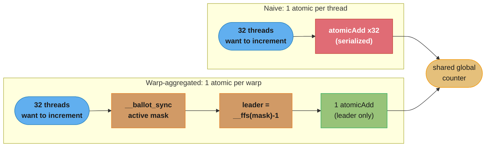
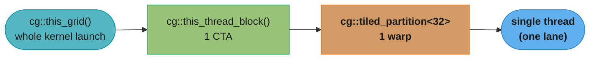
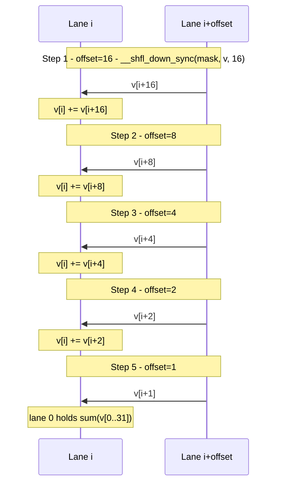
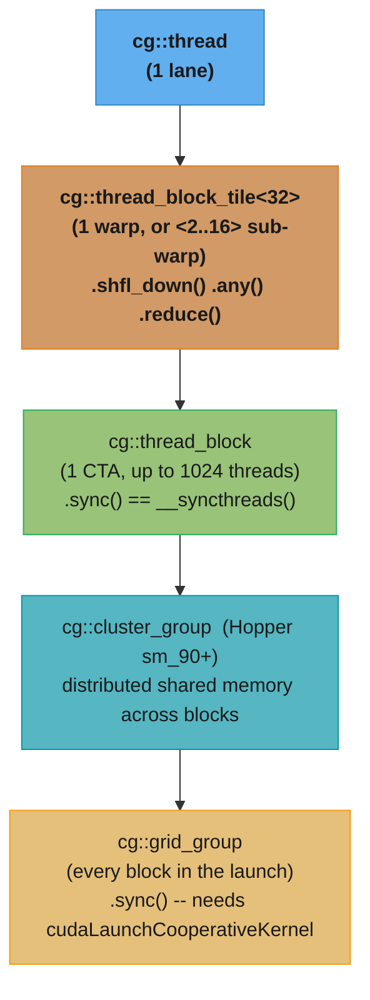
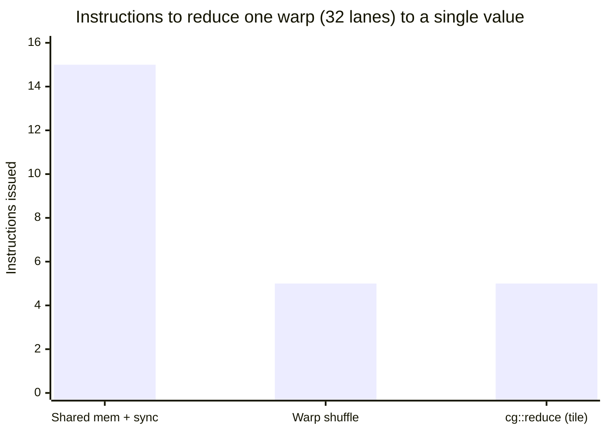
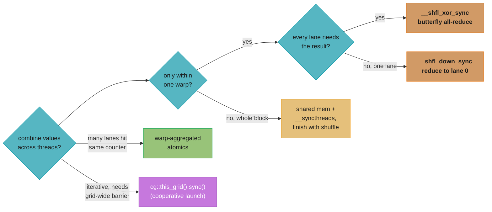

# Warp-Level Primitives & Cooperative Groups

## 1. Concept Overview

Every optimization technique studied so far in Phase 3 — coalescing, shared-memory tiling,
occupancy tuning, atomics — treats the warp as an opaque unit of 32 lockstep threads and
moves data through **memory** (global or shared) to combine their results. Warp-level
primitives break that assumption open: because the 32 lanes of a warp execute the *same*
instruction on the *same* clock, a lane can read another lane's **register** directly,
with no shared-memory allocation, no `__syncthreads()`, and no round trip through the
memory hierarchy at all. `__shfl_down_sync`, `__shfl_xor_sync`, `__ballot_sync`, and their
relatives are the instructions that expose this register-to-register exchange to the
programmer.

**Cooperative Groups** is the C++ library (`cooperative_groups.h`, CUDA 9+) that wraps
these raw intrinsics — and the coarser-grained `__syncthreads()`/grid-launch model — into a
single, composable abstraction. A `thread_block_tile<32>` is a named handle on "my warp"
with `.shfl_down()`/`.any()`/`.all()` methods; a `thread_block_tile<8>` is the same idea for
an 8-lane sub-warp; a `grid_group` is a handle that lets **every thread in the entire
kernel launch** synchronize at a single barrier — something no pre-Cooperative-Groups CUDA
program could do without ending the kernel and launching a new one. This module covers
both layers: the raw warp intrinsics that make register-level communication possible, and
the Cooperative Groups API that makes that communication (and grid-wide synchronization)
safe and composable.

---

## 2. Intuition

> **One-line analogy**: Warp shuffle is 32 people in a huddle instantly reading numbers off
> each other's jerseys — no whiteboard (shared memory), no "everyone stop and look"
> (`__syncthreads`) required, because they are already moving in perfect lockstep.

**Mental model**: A warp's 32 threads are not 32 independent workers coordinating through a
shared bulletin board (shared memory) — they are lanes of a single SIMT instruction stream
that happen to hold different data. Since the hardware issues one instruction to all 32
lanes on the same cycle, the crossbar that feeds each lane's ALU can also be wired to read a
neighboring lane's register on that same cycle. `__shfl_down_sync(mask, val, offset)` is
that crossbar exposed as an intrinsic: lane `i` receives lane `i + offset`'s value for
`val`, for free, in one instruction — no address computed, no memory transaction issued.
Cooperative Groups then generalizes "lockstep group that can synchronize and exchange data"
one level at a time: warp (32) -> tile (2-32) -> thread block (up to 1024) -> grid (every
block in the launch) -> cluster (Hopper+, groups of blocks with distributed shared memory).

**Why it matters**: The reduction, scan, and histogram patterns from
[parallel_patterns_reduction_scan_histogram](../parallel_patterns_reduction_scan_histogram/)
bottom out, in their fastest form, at a warp shuffle — and nearly every high-performance
kernel in cuBLAS, cuDNN, CUB, and FlashAttention has a warp-shuffle reduction at its
innermost loop (row-max and row-sum in softmax, partial dot products in GEMM epilogues,
per-warp histogram bins). An engineer who cannot write a correct `__shfl_down_sync`
reduction, or explain why the `_sync` mask exists, will visibly stall on the single most
common "optimize this kernel" follow-up question in a senior GPU interview: *"can you avoid
shared memory for the last warp?"*

**Key insight**: A 32-lane warp reduction needs exactly **`log2(32) = 5`** shuffle steps
(offsets 16, 8, 4, 2, 1) to collapse 32 values into one — with **zero** shared-memory
traffic and **zero** `__syncthreads()` calls, because the lanes never leave lockstep. The
one thing you must never forget is the **mask**: since Volta's independent thread
scheduling, lanes are no longer guaranteed to reconverge on their own, so every `_sync`
intrinsic takes an explicit 32-bit participation mask (`0xffffffff` for "the whole warp") —
omitting it, or using the wrong mask after a divergent branch, is undefined behavior, not a
performance bug.

---

## 3. Core Principles

- **Register-to-register exchange, not memory traffic.** A warp shuffle reads a source
  lane's register value through the SM's shuffle crossbar in the same instruction that
  issues it — no shared-memory bank is touched, no global-memory transaction is issued, and
  no address is ever computed.
- **Lockstep is the reason no barrier is needed.** All 32 lanes of a warp execute the shuffle
  instruction on the same cycle, so by construction every lane has produced its input before
  any lane consumes another's output. This is why a warp-shuffle reduction needs no
  `__syncthreads()` — the synchronization is inherent to how a warp executes, not something
  you add.
- **The `_sync` mask is mandatory, not optional, since Volta (compute capability 7.0).**
  Volta introduced independent thread scheduling: divergent branches no longer guarantee
  automatic reconvergence at the next opportunity, so the hardware needs an explicit
  32-bit mask telling it exactly which lanes participate in the exchange. `0xffffffff` means
  "all 32 lanes of the warp"; after a divergent branch, the correct mask is whatever
  `__activemask()` returns for the currently active lanes, not `0xffffffff`.
- **Vote functions collapse a per-lane predicate to a warp-wide answer in one instruction.**
  `__ballot_sync` returns a 32-bit mask of which lanes satisfied a condition; `__any_sync`/
  `__all_sync` collapse that further to a single boolean — "did any lane see X" / "did every
  lane see X" — without a shared-memory flag or an atomic.
- **Warp-aggregated atomics trade 32 contending atomics for 1.** Rather than every thread in
  a warp hitting the same global atomic counter (serializing 32-way), the warp elects one
  leader lane, warp-reduces the total contribution, and only the leader issues a single
  `atomicAdd` — cutting atomic-unit contention by up to 32x.
- **Cooperative Groups make the synchronization scope an explicit, typed object.** Instead of
  implicit warp-synchronous assumptions or a bare `__syncthreads()`, you obtain a
  `thread_block_tile<32>` (or `<16>`, `<8>`, ...), a `thread_block`, or a `grid_group`
  object and call `.sync()`/`.shfl_down()`/`.reduce()` on it — the scope of synchronization
  is visible in the type, not buried in a comment.
- **Grid-wide synchronization requires a cooperative launch.** `cg::this_grid().sync()` is
  only legal if the kernel was launched with `cudaLaunchCooperativeKernel` (not `<<<...>>>`),
  and only if the *entire* grid can be simultaneously resident on the device — occupancy
  bounds how many blocks you may launch, or the grid sync deadlocks waiting for blocks that
  will never be scheduled.

---

## 4. Types / Architectures / Strategies

**The shuffle family** (`__shfl_*_sync`, all take a `mask` and a `width` defaulting to 32):

| Intrinsic | Behavior | Typical use |
|-----------|----------|-------------|
| `__shfl_down_sync(mask, val, delta)` | Lane `i` gets lane `i + delta`'s `val` (lanes past the warp edge get their own `val` back, or 0 depending on width) | Reduction — collapse toward lane 0 |
| `__shfl_up_sync(mask, val, delta)` | Lane `i` gets lane `i - delta`'s `val` | Inclusive/exclusive prefix scan |
| `__shfl_xor_sync(mask, val, laneMask)` | Lane `i` gets lane `i XOR laneMask`'s `val` | Butterfly all-reduce — every lane ends with the same total |
| `__shfl_sync(mask, val, srcLane)` | Every participating lane gets `srcLane`'s `val` | Broadcast (e.g. distribute lane 0's pivot to all lanes) |

**The vote/ballot family:**

| Intrinsic | Returns | Typical use |
|-----------|---------|-------------|
| `__ballot_sync(mask, predicate)` | 32-bit mask, bit `i` set if lane `i`'s predicate was true | Leader election (`__ffs` of the mask), warp-aggregated atomics, compaction |
| `__any_sync(mask, predicate)` | `1` if any participating lane's predicate is true | Early-exit checks ("does any lane in this warp need the slow path?") |
| `__all_sync(mask, predicate)` | `1` if every participating lane's predicate is true | Uniform-branch detection |
| `__activemask()` | 32-bit mask of lanes active *at this instruction*, no `_sync` needed | Computing the correct mask to pass to a later `_sync` call inside divergent code |

**Warp-aggregated atomics** — a pattern, not a single intrinsic: ballot to find which lanes
want to increment a counter, elect the lowest-numbered active lane as leader via
`__ffs(mask) - 1`, warp-reduce the per-lane contributions with shuffles, and have only the
leader call `atomicAdd`. Used throughout CUB (`cub::WarpReduce`), Thrust, and histogram/
compaction kernels.



The naive path serializes 32 atomic-unit operations against the same address; the
aggregated path replaces them with one ballot, one leader-election, and a single
`atomicAdd` — the up-to-32x contention reduction described in §6.5.

**Cooperative Groups tiers** (`cooperative_groups.h`, namespace `cg`):

| Group type | Size | Obtained via |
|------------|------|--------------|
| `thread_block_tile<N>` | Compile-time `N` in {2,4,8,16,32} | `cg::tiled_partition<N>(cg::this_thread_block())` |
| `coalesced_group` | Runtime-determined active lanes | `cg::coalesced_threads()` (inside divergent code) |
| `thread_block` | The full CTA (up to 1024 threads) | `cg::this_thread_block()` |
| `grid_group` | Every thread in the kernel launch | `cg::this_grid()` — **requires cooperative launch** |
| `cluster_group` | A cluster of thread blocks (Hopper+, `sm_90`) | `cg::this_cluster()` |

Each tier exposes the same shape of API — `.sync()`, `.shfl_down(val, delta)`, `.any(pred)`,
`.reduce(val, op)` — so a reduction written against a `thread_block_tile<32>` reads
identically whether the tile happens to be a full warp or an 8-lane sub-warp.



This is the decomposition view — start from the whole kernel launch and zoom in one
tier at a time to a single lane; §5's sync-cost ladder below walks the same tiers in the
opposite direction, from cheapest (tile) to most expensive (grid) to synchronize.

---

## 5. Architecture Diagrams

### The warp-shuffle reduction butterfly (centerpiece)

A 32-lane warp reduces to a single value in exactly 5 `__shfl_down_sync` steps
(`log2(32) = 5`), with offsets 16, 8, 4, 2, 1. Every step is one instruction, register to
register — no shared memory, no `__syncthreads()`. The diagram below shows which lane reads
from which lane at each step; after step *k*, only the lowest `32 / 2^k` lanes still hold a
value anyone will read again, so the "active width" telescopes 32 -> 16 -> 8 -> 4 -> 2 -> 1.

```
Lane index (before step 1), each lane holds a partial value v[i]:

  L0  L1  L2  L3  L4  L5  L6  L7  L8  L9 L10 L11 L12 L13 L14 L15
  L16 L17 L18 L19 L20 L21 L22 L23 L24 L25 L26 L27 L28 L29 L30 L31

step 1  offset=16   v[i] += __shfl_down_sync(0xffffffff, v[i], 16)   for i = 0..15
  L0<-L16   L1<-L17   L2<-L18   L3<-L19   L4<-L20   L5<-L21   L6<-L22   L7<-L23
  L8<-L24   L9<-L25  L10<-L26  L11<-L27  L12<-L28  L13<-L29  L14<-L30  L15<-L31
  (lanes 16-31 computed a shuffle too, but nothing reads their result again)

step 2  offset=8    v[i] += __shfl_down_sync(0xffffffff, v[i], 8)    for i = 0..7
  L0<-L8    L1<-L9    L2<-L10   L3<-L11   L4<-L12   L5<-L13   L6<-L14   L7<-L15

step 3  offset=4    v[i] += __shfl_down_sync(0xffffffff, v[i], 4)    for i = 0..3
  L0<-L4    L1<-L5    L2<-L6    L3<-L7

step 4  offset=2    v[i] += __shfl_down_sync(0xffffffff, v[i], 2)    for i = 0..1
  L0<-L2    L1<-L3

step 5  offset=1    v[0] += __shfl_down_sync(0xffffffff, v[0], 1)
  L0<-L1

  ==> L0 now holds sum(v[0..31]) — 5 instructions, 0 bytes of shared memory, 0 barriers
```

The mask `0xffffffff` is passed identically at every step because the warp has not
diverged — all 32 lanes are active from entry to exit of this loop. If the reduction sits
downstream of a divergent branch, replace `0xffffffff` with `__activemask()`, captured
*before* the branch narrows the active set (see §10).

### The same reduction as an operation sequence

The ASCII grid above shows *which* lane reads from *which* lane; the sequence view below
shows the same 5 steps as an ordered chain of register exchanges between a representative
low lane `i` and its partner `i + offset` — offset halving 16 -> 8 -> 4 -> 2 -> 1 each step.



Every arrow is one `__shfl_down_sync` instruction — a register read, not a message over
any bus — and every step happens in the same instruction slot for all 32 lanes at once,
which is why no `__syncthreads()` appears anywhere in this chain.

### Cooperative Groups hierarchy



Each level up the hierarchy costs more to synchronize: a tile sync is free (lockstep, no
instruction at all for a full warp), a block sync is one `bar.sync` PTX instruction, a
cluster sync uses the Hopper distributed-shared-memory fabric, and a grid sync requires
every block in the launch to be resident simultaneously — the occupancy-bounded, cooperative-
launch case covered in §6.

---

## 6. How It Works — Detailed Mechanics

### 6.1 The warp-shuffle reduction

```cpp
// Reduces 32 lane values to one, in-register, in 5 instructions.
// Every lane must call this with the SAME mask (0xffffffff = full warp,
// or __activemask() if this runs after a divergent branch).
__device__ __forceinline__ float warpReduceSum(float val) {
    for (int offset = 16; offset > 0; offset >>= 1) {
        val += __shfl_down_sync(0xffffffff, val, offset);
    }
    return val;  // only lane 0's return value is the true sum
}

__global__ void rowSumKernel(const float* __restrict__ in, float* __restrict__ out, int n) {
    int lane = threadIdx.x & 31;                 // lane index within the warp
    float v = (blockIdx.x * blockDim.x + threadIdx.x < n)
                  ? in[blockIdx.x * blockDim.x + threadIdx.x]
                  : 0.0f;
    float warpSum = warpReduceSum(v);
    if (lane == 0) {
        atomicAdd(out, warpSum);                 // one atomic per warp, not per thread
    }
}
```

### 6.2 Butterfly all-reduce with `__shfl_xor_sync`

`__shfl_down_sync` leaves the answer only in lane 0; `__shfl_xor_sync` performs the same
`log2(32)` step count but every lane ends up holding the total — no broadcast step needed
afterward:

```cpp
__device__ __forceinline__ float warpAllReduceSum(float val) {
    for (int mask = 16; mask > 0; mask >>= 1) {
        val += __shfl_xor_sync(0xffffffff, val, mask);
    }
    return val;  // every lane now holds the same total
}
```

This is the pattern FlashAttention-style kernels use for row-max and row-sum inside the
softmax: every lane in the warp needs the row's max/sum to rescale its own partial output,
so the all-reduce form is used instead of the down-and-broadcast form.

### 6.3 Prefix scan with `__shfl_up_sync`

```cpp
// Inclusive warp-level prefix sum (Hillis-Steele), 5 steps.
__device__ __forceinline__ int warpInclusiveScan(int val) {
    int lane = threadIdx.x & 31;
    for (int offset = 1; offset < 32; offset <<= 1) {
        int n = __shfl_up_sync(0xffffffff, val, offset);
        if (lane >= offset) val += n;
    }
    return val;
}
```

### 6.4 Vote functions: `__ballot_sync`, `__any_sync`, `__all_sync`, `__activemask`

```cpp
__global__ void voteDemo(const int* flags) {
    int lane = threadIdx.x & 31;
    bool pred = flags[blockIdx.x * blockDim.x + threadIdx.x] != 0;

    unsigned mask = __ballot_sync(0xffffffff, pred);   // bit i set <=> lane i's pred is true
    bool anyTrue  = __any_sync(0xffffffff, pred);      // did ANY lane in the warp see true?
    bool allTrue  = __all_sync(0xffffffff, pred);      // did EVERY lane see true?

    if (pred) {
        // Inside a divergent branch, the active set has already narrowed —
        // capture it BEFORE using any further _sync intrinsic in this path.
        unsigned active = __activemask();
        int leader = __ffs(active) - 1;                // lowest-numbered active lane
        // ... warp-aggregated work using `active`, not 0xffffffff ...
    }
}
```

### 6.5 Warp-aggregated atomics

```cpp
// One atomicAdd per warp instead of one per thread — up to 32x less atomic-unit contention.
__device__ int warpAggregatedAtomicAdd(int* counter, bool active) {
    unsigned mask   = __ballot_sync(0xffffffff, active);
    int      leader = __ffs(mask) - 1;                 // lowest-numbered active lane leads
    int      count  = __popc(mask);                    // how many lanes want to increment
    int      base   = 0;
    int      lane   = threadIdx.x & 31;
    if (lane == leader) {
        base = atomicAdd(counter, count);               // ONE atomic for the whole warp
    }
    base = __shfl_sync(mask, base, leader);              // broadcast the base index to all
    // rank of this lane among active lanes = popcount of active lanes below it
    int rank = __popc(mask & ((1u << lane) - 1));
    return active ? base + rank : -1;
}
```

### 6.6 Cooperative Groups: tiled partitions and `cg::reduce`

```cpp
#include <cooperative_groups.h>
#include <cooperative_groups/reduce.h>
namespace cg = cooperative_groups;

__global__ void tiledReduceKernel(const float* __restrict__ in, float* __restrict__ out, int n) {
    cg::thread_block block = cg::this_thread_block();
    cg::thread_block_tile<32> warp = cg::tiled_partition<32>(block);

    int idx = blockIdx.x * blockDim.x + threadIdx.x;
    float v = (idx < n) ? in[idx] : 0.0f;

    // cg::reduce replaces the manual 5-step shuffle loop; the library picks the
    // fastest available instruction sequence for the tile size and op.
    float warpSum = cg::reduce(warp, v, cg::plus<float>());

    if (warp.thread_rank() == 0) {
        atomicAdd(out, warpSum);
    }
}

// A smaller tile — e.g. 8 lanes computing 8 independent 4-wide dot products per warp.
__global__ void subWarpTileKernel(const float* __restrict__ a, float* __restrict__ out) {
    cg::thread_block block = cg::this_thread_block();
    auto tile8 = cg::tiled_partition<8>(block);
    float v = a[block.thread_rank()];
    float groupSum = cg::reduce(tile8, v, cg::plus<float>());
    if (tile8.thread_rank() == 0) out[block.thread_rank() / 8] = groupSum;
}
```

### 6.7 Grid-wide synchronization: cooperative launch + `cg::this_grid().sync()`

Grid sync lets one kernel do what previously required *two* kernel launches (compute
partial block sums, end kernel, launch a second kernel to combine them). But it only works
if every block the grid needs is resident on the device **at the same time** — the launch
must go through `cudaLaunchCooperativeKernel`, and the block count must not exceed what
the device can run concurrently.

```cpp
__global__ void gridReduceKernel(const float* __restrict__ in, float* __restrict__ blockSums,
                                  float* __restrict__ result, int n) {
    cg::grid_group grid = cg::this_grid();
    cg::thread_block block = cg::this_thread_block();
    cg::thread_block_tile<32> warp = cg::tiled_partition<32>(block);

    int idx = blockIdx.x * blockDim.x + threadIdx.x;
    float v = (idx < n) ? in[idx] : 0.0f;
    float warpSum = cg::reduce(warp, v, cg::plus<float>());

    __shared__ float smem[32];
    if (warp.meta_group_rank() == 0 && warp.thread_rank() == 0) smem[0] = 0.0f; // init once
    __syncthreads();
    if (warp.thread_rank() == 0) atomicAdd(&smem[0], warpSum);
    __syncthreads();
    if (threadIdx.x == 0) blockSums[blockIdx.x] = smem[0];

    grid.sync();  // EVERY block in the launch reaches this line before any proceeds past it

    if (blockIdx.x == 0 && threadIdx.x == 0) {
        float total = 0.0f;
        for (int b = 0; b < gridDim.x; ++b) total += blockSums[b];
        *result = total;
    }
}

// Host side: cooperative launches CANNOT use the <<<...>>> syntax.
void launchGridReduce(const float* d_in, float* d_blockSums, float* d_result,
                      int n, int threads) {
    int device;
    cudaGetDevice(&device);
    int smCount;
    cudaDeviceGetAttribute(&smCount, cudaDevAttrMultiProcessorCount, device);

    int blocksPerSM;
    cudaOccupancyMaxActiveBlocksPerMultiprocessor(&blocksPerSM, gridReduceKernel, threads, 0);
    int maxCoopBlocks = blocksPerSM * smCount;  // hard ceiling for a cooperative launch

    int wantedBlocks = (n + threads - 1) / threads;
    int blocks = min(wantedBlocks, maxCoopBlocks);   // must fit — grid.sync() cannot
                                                      // wait for a block that never runs

    void* args[] = {&d_in, &d_blockSums, &d_result, &n};
    cudaLaunchCooperativeKernel((void*)gridReduceKernel,
                                dim3(blocks), dim3(threads), args);
}
```

### 6.8 Numba mapping (where the concept maps cleanly)

Numba CUDA exposes the shuffle and vote intrinsics with the same semantics, dropping the
mask argument's name but keeping the participation-mask requirement:

```python
from numba import cuda

@cuda.jit(device=True)
def warp_reduce_sum(val):
    mask = 0xFFFFFFFF
    offset = 16
    while offset > 0:
        val += cuda.shfl_down_sync(mask, val, offset)
        offset >>= 1
    return val

@cuda.jit
def row_sum_kernel(inp, out):
    idx = cuda.grid(1)
    lane = cuda.threadIdx.x & 31
    v = inp[idx] if idx < inp.size else 0.0
    warp_sum = warp_reduce_sum(v)
    if lane == 0:
        cuda.atomic.add(out, 0, warp_sum)
```

Numba does not expose Cooperative Groups' `grid_group`/tiled-partition API directly — grid-
wide synchronization and sub-warp tiles are a CUDA C++-only concept in practice, which is
why §6.6-6.7 above stay C++.

---

## 7. Real-World Examples

- **cuDNN / cuBLAS epilogues** use warp-shuffle reductions to combine per-thread partial
  dot products into a tile's output element without ever writing partials to shared memory.
- **FlashAttention** kernels compute the running row-max and row-sum of the online softmax
  with a warp all-reduce (`__shfl_xor_sync` pattern, §6.2) — every lane needs the row
  statistic to rescale its own accumulator, so the butterfly (all-lanes-get-the-answer) form
  is used, not the down-shuffle (lane-0-only) form.
- **CUB's `cub::WarpReduce` and `cub::BlockReduce`** are the library-grade, tuned
  implementations of exactly the patterns in §6.1-6.2 — most production kernels call CUB
  rather than hand-roll the shuffle loop, but the loop is what CUB compiles down to.
- **Histogram and stream-compaction kernels** use warp-aggregated atomics (§6.5) to avoid
  the atomic-contention wall covered in
  [synchronization_and_atomics](../synchronization_and_atomics/) — Thrust's
  `unique`/`copy_if` and CUB's `DeviceHistogram` both use this leader-election pattern
  internally.
- **Iterative solvers (Jacobi, multigrid smoothers)** written as a single persistent kernel
  use `cg::this_grid().sync()` between iterations instead of ending and re-launching the
  kernel each pass, removing the ~5-10us kernel-launch overhead per iteration.
- **PyTorch's native CUDA reduction kernels** (`at::native::gpu_reduce_kernel`) template a
  warp-shuffle reduction as the base case of a larger block/grid reduction hierarchy nearly
  identical to §6.7.

---

## 8. Tradeoffs

| Approach | Memory traffic | Barrier | Instructions (32-lane reduce) | When it wins |
|----------|-----------------|---------|-------------------------------|---------------|
| Shared memory + `__syncthreads()` | 32 shared-mem writes + reads per step | Yes, every step | ~5 steps x (store + sync + load) | Reducing across an entire *block* (>32 threads), not just one warp |
| Warp shuffle (`__shfl_down_sync`) | None | None (lockstep) | 5 instructions | Reducing within a single warp — always prefer this for the last 32 elements |
| `cg::reduce` on a tile | None (compiles to shuffles) | None | Same as hand-written, chosen by the library | Same as shuffle, with readable code and portability across tile sizes |
| Plain per-thread atomics | 1 atomic transaction per thread | N/A | 32 atomics, serialized at the contended address | Low-contention counters where 32-way serialization is not the bottleneck |
| Warp-aggregated atomics | 1 atomic transaction per warp | None extra | 1 ballot + 1 popcount + 1 atomic + 1 broadcast shuffle | High-contention shared counters (histograms, compaction) |
| Grid sync (`cg::this_grid().sync()`) | Global-memory round trip for the partials being combined | Yes, whole grid | One kernel, occupancy-bounded block count | Iterative algorithms that would otherwise re-launch a kernel every pass |
| Two separate kernel launches | Global-memory round trip | Implicit (kernel end is a barrier) | Two launches (~5-10us overhead each) | Any block count, no occupancy ceiling — the safe default when grid sync's bound is a problem |



The shared-memory path pays roughly 5 steps of store + `__syncthreads()` + load
(~15 instructions and 5 barriers, per the table above); the shuffle path is 5
register-to-register instructions and zero barriers, and `cg::reduce` compiles down to
the same 5 shuffles behind a library call.

---

## 9. When to Use / When NOT to Use



This decision tree summarizes the "use when" rules below: warp-only reductions pick a
shuffle form by how many lanes need the answer, block-wide reductions fall back to
shared memory for the upper stages, contended counters call for warp-aggregated atomics,
and only a true iterative grid-wide barrier justifies a cooperative launch.

**Use warp shuffle when:**
- The reduction, scan, or broadcast only needs to combine values *within* a single warp —
  this is nearly always the last stage of a larger block-level reduction.
- You are already inside a warp-uniform code path (no unresolved divergence) so a single
  `0xffffffff` mask is correct.
- Avoiding shared memory matters for occupancy — freeing the shared-memory allocation a
  block-level reduction would have used lets more blocks be resident simultaneously (see
  [occupancy_and_launch_configuration](../occupancy_and_launch_configuration/)).

**Use `cg::tiled_partition<N>` (N < 32) when:**
- The natural unit of work is smaller than a warp — e.g., 8 lanes computing one 8-wide dot
  product each, four such groups per warp — and you want named, reusable sync/reduce
  semantics instead of manually masking shuffles to sub-ranges.

**Use warp-aggregated atomics when:**
- Many threads across many warps are incrementing the *same* global counter or histogram
  bin, and per-thread atomics are visibly contended in Nsight Compute (§11).

**Use grid sync (`cg::this_grid().sync()`) when:**
- The algorithm is iterative and every iteration needs a true global barrier (Jacobi-style
  solvers, multi-pass reductions), *and* you can prove (via
  `cudaOccupancyMaxActiveBlocksPerMultiprocessor`) that all required blocks fit resident on
  the device simultaneously.

**Do NOT use grid sync when:**
- The block count you need exceeds what the device can run concurrently — two ordinary
  kernel launches (with the implicit barrier at kernel end) is the safe, unbounded
  alternative, and the ~5-10us overhead is often noise next to what grid sync would have to
  do anyway.
- A single block-level reduction (`__syncthreads()` + one final warp shuffle) already
  solves the problem — reaching for cooperative groups' grid tier for a plain reduction is
  solving a harder problem than you have.

---

## 10. Common Pitfalls

**BROKEN — shared-memory + `__syncthreads()` for the last warp of a block reduction**

```cpp
// BROKEN: pays a shared-memory round trip and a barrier for the final 32 elements,
// even though a single warp could finish this with 5 register-only instructions.
__global__ void blockReduceBroken(float* data) {
    __shared__ float smem[256];
    int tid = threadIdx.x;
    smem[tid] = data[blockIdx.x * 256 + tid];
    __syncthreads();

    for (int s = 128; s > 0; s >>= 1) {
        if (tid < s) smem[tid] += smem[tid + s];
        __syncthreads();          // <-- still paying a full block barrier down to s = 1
    }
    if (tid == 0) data[blockIdx.x] = smem[0];
}
```

```cpp
// FIX: stop the shared-memory loop at 32 (one warp's worth), then finish with shuffles.
// Removes the last 5 __syncthreads() calls and all shared-memory traffic below s = 32.
__global__ void blockReduceFixed(float* data) {
    __shared__ float smem[256];
    int tid = threadIdx.x;
    smem[tid] = data[blockIdx.x * 256 + tid];
    __syncthreads();

    for (int s = 128; s > 32; s >>= 1) {
        if (tid < s) smem[tid] += smem[tid + s];
        __syncthreads();
    }
    if (tid < 32) {
        float v = smem[tid] + smem[tid + 32];
        for (int offset = 16; offset > 0; offset >>= 1) {
            v += __shfl_down_sync(0xffffffff, v, offset);
        }
        if (tid == 0) data[blockIdx.x] = v;
    }
}
```

**BROKEN — implicit warp-synchronous shuffle with no mask**

```cpp
// BROKEN: pre-Volta code (or code copied from a pre-CUDA-9 tutorial) that assumes
// the warp is always fully converged. Undefined behavior on Volta and newer —
// independent thread scheduling does not guarantee lockstep reconvergence for free.
__device__ float warpReduceLegacy(float val) {
    for (int offset = 16; offset > 0; offset >>= 1) {
        val += __shfl_down(val, offset);     // no mask argument — removed API, or UB shim
    }
    return val;
}
```

```cpp
// FIX: use the _sync intrinsic with an explicit mask. If the call site is guaranteed
// warp-uniform, 0xffffffff is correct; inside a divergent branch, capture the real
// active set first.
__device__ float warpReduceFixed(float val, unsigned mask = 0xffffffff) {
    for (int offset = 16; offset > 0; offset >>= 1) {
        val += __shfl_down_sync(mask, val, offset);
    }
    return val;
}
```

**Other pitfalls:**

- **Using `0xffffffff` after a divergent branch.** If only some lanes reached the shuffle
  call (e.g. inside `if (predicate)`), the correct mask is `__activemask()` captured at that
  point — passing `0xffffffff` asks lanes that never arrived to participate, which is
  undefined behavior, not merely "wastes a few lanes."
- **Forgetting that a down-shuffle reduction only produces the answer in lane 0.** Code that
  needs *every* lane to see the total (e.g. rescaling a per-lane accumulator by the row sum)
  must use the `__shfl_xor_sync` all-reduce form (§6.2) or an explicit broadcast shuffle
  afterward, not the down-shuffle form.
- **Launching a grid-sync kernel without checking `cudaOccupancyMaxActiveBlocksPerMultiprocessor`.**
  If the requested block count exceeds what can be simultaneously resident,
  `cg::this_grid().sync()` waits forever for blocks the scheduler will never place — a silent
  hang, not a crash, that is easy to misdiagnose as a logic bug.
- **Assuming a tile smaller than 32 behaves identically to a full-warp shuffle for `width`.**
  `__shfl_down_sync`'s optional `width` parameter (default 32) partitions the warp into
  independent sub-groups of that width; forgetting to set `width` when using raw intrinsics
  for sub-warp tiles (instead of `cg::tiled_partition`) silently reduces across the wrong
  boundary.

---

## 11. Technologies & Tools

| Tool | What it gives you here |
|------|--------------------------|
| CUB (`cub::WarpReduce`, `cub::BlockReduce`) | Tuned, portable reduction/scan templates built on the same shuffle instructions shown in §6 — prefer this over hand-rolled shuffles in production code |
| Cooperative Groups (`cooperative_groups.h`) | The `thread_block_tile`/`grid_group`/`cluster_group` API in §6.6-6.7; ships with the CUDA toolkit, no extra dependency |
| Nsight Compute | "Warp Execution Efficiency" and atomic-throughput metrics reveal when a plain-atomic kernel is contention-bound and a candidate for warp-aggregation |
| `compute-sanitizer --tool synccheck` | Flags illegal or divergent uses of `__syncthreads()`/cooperative-groups sync, including barriers reached by a subset of threads |
| `cudaOccupancyMaxActiveBlocksPerMultiprocessor` | The API call that computes the hard ceiling on block count for any cooperative (grid-sync) launch |
| Numba CUDA (`cuda.shfl_down_sync`, `cuda.ballot_sync`) | Python-side access to the same warp intrinsics (§6.8) — no Cooperative Groups grid/tile API |

---

## 12. Interview Questions with Answers

**Q: Why must every `__shfl_*_sync` intrinsic take an explicit participation mask on Volta and newer GPUs?**
Volta introduced independent thread scheduling, so divergent lanes are no longer guaranteed to reconverge automatically before the next instruction. The mask tells the hardware exactly which lanes are exchanging data at this instruction; omitting it (or using a pre-Volta implicit-warp-synchronous shuffle) is undefined behavior, not just a style issue.

**Q: What mask should you use inside a divergent branch, and why is `0xffffffff` wrong there?**
Use `__activemask()`, captured at that point in the code, because `0xffffffff` claims all 32 lanes are participating when only the lanes that took this branch actually are. Passing the wrong mask can hang the warp or silently corrupt the shuffled values.

**Q: How many `__shfl_down_sync` steps does a full 32-lane warp reduction need, and why?**
Exactly 5 steps, because `log2(32) = 5` and each step halves the number of lanes whose value still needs combining. The offsets used are 16, 8, 4, 2, then 1.

**Q: Does a warp-shuffle reduction use any shared memory or `__syncthreads()`?**
No — it uses zero bytes of shared memory and zero barriers, because all 32 lanes execute the shuffle instruction in lockstep by construction. This is the single biggest reason it beats a shared-memory reduction for the final warp of any block-level reduction.

**Q: What replaces the pre-Volta assumption that a warp is always fully synchronized?**
`__activemask()` — it returns the actual set of lanes active at the current instruction, which must be passed to any subsequent `_sync` intrinsic in that code path instead of guessing `0xffffffff`.

**Q: What is a warp-aggregated atomic, and why is it faster than a plain per-thread atomic?**
It elects one leader lane per warp (via `__ballot_sync` + `__ffs`) to issue a single `atomicAdd` for the whole warp's combined contribution, cutting the number of atomic-unit operations by up to 32x versus every thread hitting the counter individually. This is the standard fix when Nsight Compute shows an atomic-heavy kernel bottlenecked on contention.

**Q: How do you elect a leader lane inside a warp?**
Take the active-lane mask from `__ballot_sync`, then `__ffs(mask) - 1` gives the index of the lowest-numbered active lane, which becomes the leader. Any deterministic, mask-derived choice works as long as every lane agrees on the same leader.

**Q: What is the difference between `__shfl_down_sync` and `__shfl_xor_sync` for a reduction?**
`__shfl_down_sync` collapses the sum toward lane 0 only — other lanes hold stale partial sums after the loop — while `__shfl_xor_sync` performs a butterfly exchange that leaves every lane holding the same final total. Use xor when every lane needs the answer (e.g. softmax row-sum rescaling), down when only one lane needs it (e.g. before an `atomicAdd`).

**Q: When would you use `__shfl_up_sync` instead of `__shfl_down_sync`?**
For a prefix scan (running sum/max), where lane `i` needs contributions only from lower-indexed lanes — `__shfl_up_sync(mask, val, offset)` reads from lane `i - offset`, which is exactly the Hillis-Steele scan recurrence. A reduction, in contrast, only cares about the final total and conventionally uses the down-shuffle.

**Q: What does `cg::tiled_partition<32>` give you beyond raw warp intrinsics?**
A named C++ object with `.shfl_down()`, `.any()`, `.all()`, and `.reduce()` methods that generalizes cleanly to sub-warp tile sizes (2, 4, 8, 16) without hand-computing masks. It is the same underlying instructions with a safer, composable API.

**Q: What is `cg::reduce`, and what does it save you from writing?**
A library function that reduces a value across an entire Cooperative Groups group (warp, tile, or block) using the fastest available instruction sequence for that group's size, replacing the manual `log2(N)`-step shuffle loop with one call. It supports operators like `cg::plus`, `cg::less`, and `cg::greater` out of the box.

**Q: What has to be true before you can call `cg::this_grid().sync()`?**
The kernel must be launched with `cudaLaunchCooperativeKernel` (never the `<<<...>>>` syntax), and the launch's total block count must not exceed the number of blocks the device can run simultaneously. If either condition is violated, the grid sync either fails to launch or hangs waiting for blocks that will never be scheduled.

**Q: How do you compute the maximum safe block count for a cooperative (grid-sync) launch?**
Call `cudaOccupancyMaxActiveBlocksPerMultiprocessor` for the kernel and multiply by the device's SM count (`cudaDevAttrMultiProcessorCount`) — that product is the hard ceiling on concurrently resident blocks. Launching more than this for a grid-sync kernel is a silent-hang bug, not a crash.

**Q: Why would you replace two separate kernel launches with one kernel using `cg::this_grid().sync()`?**
To remove the per-launch overhead (roughly 5-10us each) and the global-memory round trip of writing/reading intermediate results between launches, which matters for iterative algorithms like Jacobi solvers that repeat many short passes. The tradeoff is the occupancy ceiling above — grid sync only wins when the block count already fits.

**Q: What is the difference between `__any_sync`/`__all_sync` and `__ballot_sync`?**
`__ballot_sync` returns the full 32-bit per-lane predicate mask, while `__any_sync`/`__all_sync` collapse that mask to a single boolean answering "did any/all participating lanes see true." Use ballot when you need per-lane detail (e.g. leader election), any/all when you only need a warp-wide yes/no (e.g. an early-exit check).

**Q: Can `cg::tiled_partition` create groups smaller than a full warp, and why would you want that?**
Yes — `tiled_partition<8>` or `<16>` partitions a warp into 4 or 2 independent sub-groups respectively, useful when the natural unit of work (e.g. an 8-wide dot product) is smaller than 32 elements. Each sub-tile gets its own `.reduce()`/`.shfl_down()` scoped to just its lanes.

**Q: Does replacing shared memory with `__syncwarp()` alone remove the memory-hierarchy cost that shuffle removes?**
No — `__syncwarp()` only removes the cross-warp barrier semantics of `__syncthreads()`; the shared-memory reads/writes and their bank-conflict/latency cost still happen. Only `__shfl_*_sync` removes the memory access itself by reading the source lane's register directly.

---

## 13. Best Practices

- Reach for `cub::WarpReduce`/`cub::BlockReduce` or `cg::reduce` before hand-writing a
  shuffle loop in production code — they are tuned per architecture and read more clearly;
  hand-write the loop only when learning the mechanics or when the library's API does not
  fit (see §6.1-6.2 for the two you should still be able to write from memory).
- Always pass an explicit mask; default to `0xffffffff` only when you can prove the call
  site is warp-uniform, and use `__activemask()` immediately after any branch that could
  have diverged.
- Prefer the xor-butterfly all-reduce over "down-shuffle then broadcast" whenever every lane
  needs the result — it is the same instruction count with one fewer conceptual step.
- Profile before reaching for warp-aggregated atomics — the pattern adds a ballot, a
  popcount, and a broadcast shuffle, which only pays off when Nsight Compute shows the plain
  atomic is actually contended.
- Before writing a grid-sync kernel, compute
  `cudaOccupancyMaxActiveBlocksPerMultiprocessor(...) * smCount` and clamp your launch to
  that ceiling; if the natural problem size needs more blocks than that, fall back to two
  ordinary kernel launches rather than fight the occupancy bound.
- Name your Cooperative Groups objects for the scope they represent
  (`warp`, `tile8`, `block`, `grid`) — the type already documents the synchronization scope,
  so let variable names reinforce it instead of re-deriving it from a bare `__syncthreads()`.
- Run `compute-sanitizer --tool synccheck` on any kernel using cooperative-groups sync or
  raw `__syncthreads()` inside a conditionally-reached path — it catches barrier-divergence
  bugs before they become an intermittent production hang.

---

## 14. Case Study

**Scenario**: A histogram kernel bins 100M sensor readings into 256 buckets. The first
implementation has every thread call `atomicAdd(&histogram[bucket], 1)` directly against
global memory. Profiling on an A100 shows the kernel is almost entirely atomic-unit-bound:
Nsight Compute reports over 90% of warps stalled on "atomic conflict," and the kernel is
8x slower than the achievable memory-bandwidth-bound time for reading 100M 4-byte values.


**BROKEN — one atomic per thread:**

```cpp
__global__ void histogramBroken(const unsigned char* data, int* hist, int n) {
    int idx = blockIdx.x * blockDim.x + threadIdx.x;
    if (idx < n) {
        atomicAdd(&hist[data[idx]], 1);   // up to 32 threads per warp hit the same
                                           // bucket address and serialize
    }
}
```

**FIX — warp-aggregated atomics, one per warp per distinct bucket value present:**

```cpp
__global__ void histogramFixed(const unsigned char* data, int* hist, int n) {
    int idx = blockIdx.x * blockDim.x + threadIdx.x;
    if (idx >= n) return;

    unsigned char bucket = data[idx];
    unsigned mask = __match_any_sync(0xffffffff, bucket);  // lanes sharing this bucket value
    int leader = __ffs(mask) - 1;
    int count  = __popc(mask);
    int lane   = threadIdx.x & 31;
    if (lane == leader) {
        atomicAdd(&hist[bucket], count);   // ONE atomic for every lane sharing this bucket
    }
}
```

`__match_any_sync` (Volta+) groups lanes by equal value directly, which is a cleaner leader-
election primitive than `__ballot_sync` when the aggregation key (the bucket value) varies
across lanes rather than being a simple true/false predicate.

**Metrics after the fix (A100, 100M readings, 256 buckets, uniform random distribution):**

| Metric | Broken (per-thread atomics) | Fixed (warp-aggregated) |
|--------|------------------------------|----------------------------|
| Kernel time | 41.2 ms | 5.1 ms |
| Atomic-unit stall (Nsight Compute) | 91% | 12% |
| Achieved DRAM throughput | 9% of peak | 71% of peak |
| Atomic operations issued | ~100,000,000 | ~3,900,000 (avg 32/warp collapsed to ~1.25 per warp under 256-way spread) |

**Discussion Questions:**
1. Why does `__match_any_sync` outperform a manual `__ballot_sync` + equality-check loop here?
2. If the bucket distribution were highly skewed (one bucket gets 90% of hits), would warp-
   aggregation still help, and what would you reach for next?
3. How would you extend this pattern to a block-level (not just warp-level) aggregation, and
   what would that cost in shared memory?
4. What Nsight Compute metric would you check first to confirm the fix actually removed
   atomic contention rather than just moving the bottleneck elsewhere?

See also: [warps_and_simt_execution](../warps_and_simt_execution/) for the divergence and
active-mask mechanics this module builds on;
[synchronization_and_atomics](../synchronization_and_atomics/) for the plain-atomic
contention problem this case study's fix addresses;
[parallel_patterns_reduction_scan_histogram](../parallel_patterns_reduction_scan_histogram/)
for the full reduction/scan/histogram ladder this module's shuffle step completes; and
[../case_studies/implement_high_performance_reduction.md](../case_studies/implement_high_performance_reduction.md)
for the end-to-end principal-template case study built on the warp-shuffle reduction in §6.1.
