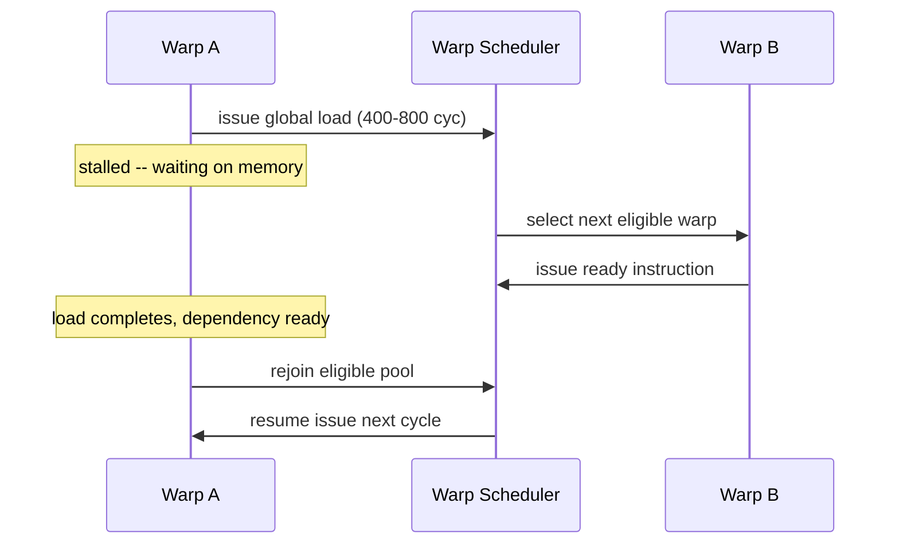
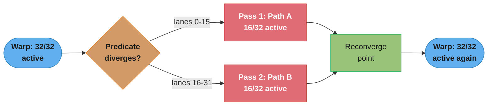
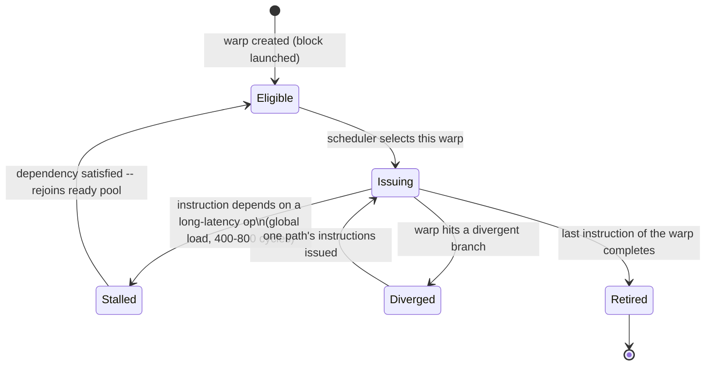
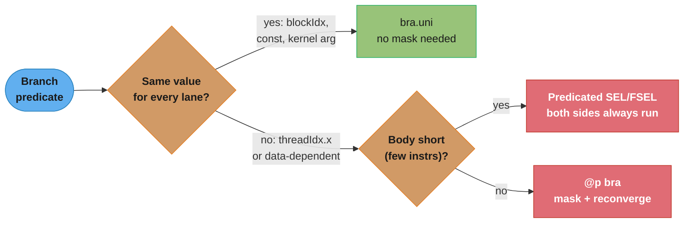
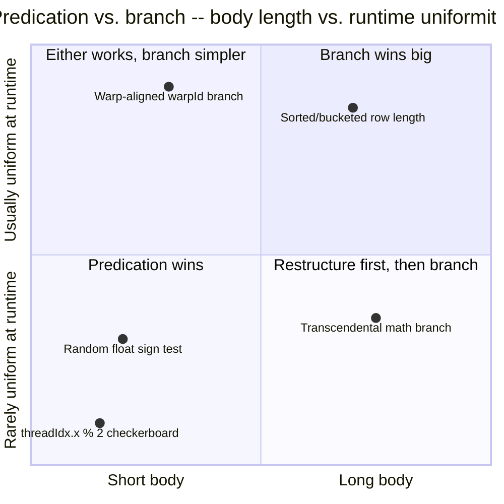

# Warps & SIMT Execution

## 1. Concept Overview

A **warp** is the unit of execution the GPU hardware actually schedules: a group of exactly **32 threads** launched together from the same block, executed together, and retired together. CUDA's programming model lets you write code as if you had `blockDim.x` independent threads, but the streaming multiprocessor (SM) never issues an instruction for a single thread — it issues one instruction for an entire warp, and every lane (the hardware's word for a thread's slot within a warp) either executes that instruction or sits masked out. This execution style is called **SIMT** (Single Instruction, Multiple Threads): the *appearance* of independent scalar threads, built on top of the *reality* of one instruction stream shared by 32 lanes.

Understanding warps is the hinge between "I can write a CUDA kernel" and "I can make a CUDA kernel fast." Every downstream performance topic in this section — memory coalescing (a warp's 32 addresses, not one thread's), shared-memory bank conflicts (a warp's 32 accesses hitting 32 banks), occupancy (how many *warps* are resident, not how many threads) — is defined in terms of the warp, not the thread. Get the warp model wrong and every later optimization is built on sand.

This module covers: why 32 is the magic number, how the warp scheduler hides memory latency by juggling many resident warps, what happens when threads in a warp disagree about which branch to take (**divergence**), how the compiler and hardware handle that disagreement (**predication** and **reconvergence**), the **active mask** that tracks which lanes are "live" at any instruction, and the biggest gotcha in modern CUDA: **Independent Thread Scheduling** (Volta, compute capability 7.0+), which gives each thread its own program counter and quietly invalidates code that used to rely on threads in a warp being in lockstep without an explicit synchronization point.

---

## 2. Intuition

> **One-line analogy**: A warp is 32 rowers in one boat sharing one drum beat — every rower can hold their oar still (masked out) but nobody can row to a different rhythm; if half the rowers need to row forward and half need to row backward, the boat does one stroke count for "forward" with half the crew resting, then a second stroke count for "backward" with the other half resting — twice the strokes for the same distance covered.

**Mental model**: Picture the SM's warp scheduler as a conductor who can only wave the baton for one instruction at a time per warp, but has many warps (choirs) available. When a warp is waiting on a slow global-memory load — a choir member gone to fetch sheet music, taking 400-800 cycles — the conductor doesn't wait: it instantly turns to another resident warp that's ready to sing. This costs the conductor essentially nothing (the "gone" warp's state — registers, program counter — lives untouched in the register file, unlike a CPU context switch which must save and restore state to memory). This is **latency hiding through oversubscription**: keep enough warps resident that there is always another one ready when the current one stalls.

**Why it matters**: Divergence and scheduling are not academic — they are the single biggest reason two kernels that "do the same amount of work" run at wildly different speeds. A kernel where every warp takes a uniform path runs at full SIMT efficiency; the same computation with a data-dependent branch that splits each warp roughly 50/50 can run at half throughput for that region, and a genuinely 32-way divergent branch (every lane takes a different path) can serialize down to roughly 1/32 of peak — the entire premise of a GPU (parallel lanes doing the same instruction) evaporates lane by lane.

**Key insight**: Divergence cost is not proportional to the group of threads that disagree — it is a property of whether a **warp** (the scheduling unit) is uniform or not. Two branches with an identical 50/50 split can cost completely different amounts depending on *which* 50% of threads takes which path: if the split lands entirely within single warps (thread 0 and thread 1 of every warp disagree — a "checkerboard" pattern), every warp in the kernel diverges and pays the 2x tax. If the very same 50/50 split instead falls along warp boundaries (the first half of all warps takes path A, the second half takes path B), **zero warps diverge** — each warp is internally uniform, even though the kernel as a whole is a perfect 50/50 split. Divergence is a per-warp property, not a global-percentage property, and this is exactly what the checkerboard BROKEN→FIX in §10 exploits.

---

## 3. Core Principles

- **Warp = 32 threads, fixed, queryable via `warpSize`.** Every NVIDIA GPU generation to date (Tesla through Blackwell) uses a 32-thread warp; `warpSize` is a compile-time-visible built-in so code can be portable if this ever changes, but treat 32 as a hard constant in practice.
- **SIMT, not SIMD.** SIMD (CPU AVX/SSE) exposes fixed-width vector registers that the *programmer* packs explicitly — one instruction, one vector operand. SIMT presents a *per-thread* programming model — each lane has its own registers, its own memory addresses, and (Volta+) its own program counter — while the hardware transparently groups lanes into warps and masks divergence. You write scalar-looking code; the hardware makes it vector-shaped.
- **One instruction, all active lanes, every cycle.** The warp scheduler issues a single instruction for the warp; every lane whose bit is set in the **active mask** executes it (or is predicated to have no effect); masked-out lanes hold their state and wait.
- **Divergence forces serialization.** When lanes disagree on control flow (an `if`/`else`, a loop with a data-dependent trip count, a `switch`), the hardware executes each taken path as a separate pass over the warp, with only the lanes on that path active. N distinct paths cost roughly N passes.
- **Reconvergence restores full-warp execution.** After the divergent region, hardware (a reconvergence point, tracked historically via an explicit SIMT stack, and on Volta+ via a scheduler-managed convergence optimizer) reunites the lanes so the warp resumes lockstep for subsequent uniform code.
- **Predication trades a branch for arithmetic.** For short conditional bodies, the compiler emits predicated instructions instead of a real branch: every lane executes the instruction, but a per-lane predicate register suppresses the write-back for lanes where the condition is false. No branch, no reconvergence bookkeeping — at the cost of every lane always paying for both outcomes.
- **The active mask is real, inspectable state.** `__activemask()` returns the 32-bit mask of lanes currently active at that program point; warp-vote and warp-shuffle intrinsics (`__ballot_sync`, `__shfl_sync`, …) take an explicit mask argument so the programmer states which lanes must participate — see [Warp-Level Primitives & Cooperative Groups](../warp_level_primitives_and_cooperative_groups/).
- **Independent Thread Scheduling (Volta+, compute capability ≥ 7.0) gives each thread its own PC and call stack.** Threads in a warp can now make progress independently through divergent code — the hardware guarantees forward progress for every thread — but this also means the old assumption "all lanes are always at the same instruction unless I branched" is gone; **any code relying on implicit warp-synchronous behavior now needs an explicit `__syncwarp()`.**
- **Latency hiding is a scheduling property, not a divergence property.** A warp stalled on a memory load (400-800 cycles) costs the SM ~0 extra cycles to swap out, provided another resident warp is ready to issue — this is why occupancy (enough resident warps) matters even for kernels with no divergence at all; see [Occupancy & Launch Configuration](../occupancy_and_launch_configuration/).

---

## 4. Types / Architectures / Strategies

### 4.1 Warp scheduling policies

- **Round-robin / Loose Round-Robin (LRR)** — cycles through resident warps in order each time it needs to issue; simple, fair, but can leave a just-issued warp waiting behind many others before its dependency is ready.
- **Greedy-Then-Oldest (GTO)** — keeps issuing from the same warp until it stalls, then falls back to the oldest ready warp; improves cache/locality behavior versus strict round-robin and is closer to what modern SM warp schedulers approximate.
- Each SM has multiple warp schedulers (4 per SM on most recent architectures), each capable of issuing (and often dual-issuing) one instruction per cycle from a different warp — the schedulers pick among their assigned resident warps using policies like the above.

### 4.2 Divergence handling across generations

- **Pre-Volta: explicit SIMT stack.** The hardware maintained a per-warp stack of (reconvergence PC, active mask) pairs. On a divergent branch it pushed both paths' masks and PCs, executed one path fully to its reconvergence point, popped, executed the other. Guaranteed lockstep *within* each path — this is what let old code write warp-synchronous shared-memory reductions with no `__syncwarp()`.
- **Volta+: Independent Thread Scheduling (ITS).** Each thread gets its own program counter and call stack; the hardware still executes lanes in groups when it can (there is no additional bandwidth cost simply from having ITS), but it now interleaves divergent branches at finer granularity and guarantees every thread eventually makes progress (no starvation), even letting a thread waiting on another thread within the *same warp* — e.g. spin-waiting for a peer to write shared memory — actually complete, something the old lockstep model could deadlock on.
- Both models pay the same **instruction-issue cost** for divergence (still roughly N passes for N distinct paths) — ITS changes the *scheduling/interleaving/progress guarantees*, not the fundamental "divergence serializes" economics.

### 4.3 Mitigation strategies for divergence

- **Predication** — for short, cheap bodies, let the compiler convert `if`/`else` into predicated select instructions (or write the select explicitly) so there's no branch at all; both outcomes are computed, one is discarded per lane.
- **Warp-aligned branching** — restructure indexing so the predicate is uniform *within* a warp (decide by `warpId`, `blockIdx`, or a precomputed bucket, not by `threadIdx.x % small_number`); zero divergence even with an unbalanced global split.
- **Data reordering / sorting / compaction** — sort or bucket work items by predicate before launch (e.g., separate a sparse matrix's short rows from its long rows) so each warp's work is internally uniform; classic technique in sparse linear algebra and ray tracing.
- **Warp-vote-guided compaction** — use `__ballot_sync`/`__activemask()` to detect at runtime whether a warp is actually uniform for a given predicate, and skip the divergent path entirely when it is (see [Warp-Level Primitives & Cooperative Groups](../warp_level_primitives_and_cooperative_groups/)).
- **Persistent-thread / work-queue kernels** — launch exactly as many warps as there are physical resident slots and have each pull uniform-sized work items from a queue, decoupling "how much work" from "how divergent the control flow is."

---

## 5. Architecture Diagrams

### Warp-Divergence Mask — 32 Lanes, Checkerboard Branch

The canonical worst case: `if (threadIdx.x % 2 == 0)`. Every warp contains both even and odd lanes, so **every warp in the kernel diverges**, even though the predicate splits the whole grid exactly 50/50.

```
Warp divergence mask -- branch: if (threadIdx.x % 2 == 0)   (checkerboard predicate)

lane index (tens):  00000000001111111111222222222233
lane index (ones):  01234567890123456789012345678901
                    +--------------------------------+
if-path A (even):   |V.V.V.V.V.V.V.V.V.V.V.V.V.V.V.V.V|   16 active, 16 masked
else-path B (odd):  |.V.V.V.V.V.V.V.V.V.V.V.V.V.V.V.V.|   16 masked, 16 active
                    +--------------------------------+
                     V = active (executing)   . = masked (idle, holding state)

Execution order (serialized -- one pass per path):
  pass 1: issue path-A instructions -- 16 lanes execute,  16 lanes idle
  pass 2: issue path-B instructions -- 16 lanes execute,  16 lanes idle
  -> 2 instruction passes to cover work a non-divergent warp does in 1 pass.

Fully divergent worst case (32 distinct paths, one per lane):
  32 passes, 1 lane active per pass -- up to 32x serialization for that region.
```

Caption: the mask shows *which* lanes are live on each path, not how much work each path does — even a 31-versus-1 split still costs two full passes, because divergence cost depends on the *number of distinct paths taken by the warp*, not the ratio of lanes on each side.

The cost the caption describes has an exact closed form:

```
passes                    = number of distinct paths taken by lanes of this warp
warp_execution_efficiency = (sum of active lanes over all passes) / (32 x passes)
```

**What this actually says.** "The warp pays one full issue pass per distinct path, and every
lane still does exactly its own one path's work — so efficiency is simply one over the number
of passes."

| Symbol | What it is |
|--------|------------|
| `passes` | Distinct control-flow paths any lane of this warp takes. `1` = no divergence |
| sum of active lanes | Always exactly `32` — each lane is live in exactly one pass |
| `32 x passes` | Lane-slots the hardware issued and paid for, live or masked |
| efficiency | Useful lane-slots over paid-for lane-slots; what Nsight reports as warp exec eff |
| `32` | Warp size, and therefore the hard ceiling on `passes` |

**Walk one example.** The numerator never moves, which is the whole trick:

```
  branch shape              lanes per pass       passes  active sum  efficiency
  ------------------------- -------------------- ------- ----------- ------------
  uniform (no divergence)   32                     1        32        100.000 %
  checkerboard  16 / 16     16, 16                 2        32         50.000 %
  lopsided      31 /  1     31, 1                  2        32         50.000 %
  4-way switch  8x4         8, 8, 8, 8             4        32         25.000 %
  fully divergent 32-way    1 x 32                32        32          3.125 %

  Active sum is 32 on EVERY row -- each lane runs its own path exactly once, always.
  So efficiency collapses to 1/passes, and NOTHING ELSE. The 31/1 row is the one that
  surprises people: 31 lanes agreeing buys you nothing, because one dissenter still
  forces a second pass, and a second pass alone already halves efficiency.
```

**Why lane balance is the wrong thing to optimize.** The natural instinct on seeing 50% warp
execution efficiency is to rebalance the split — make it 24/8, or 30/2 — and the table above
says that is wasted effort: `passes` is unchanged, so efficiency is unchanged. The only
lever that moves the denominator is making whole warps agree, which is precisely what the
`warpId % 2` fix in §10 does: it drives `passes` from 2 back to 1 and recovers the full 2x.

### Lockstep SIMT Execution — Divergent vs. Non-Divergent Warp

```
Lockstep SIMT -- warp with NO divergence (all 32 lanes take the same path)

  cycle 1:  I1            [ 32/32 lanes active -- full-warp instruction ]
  cycle 2:  I2            [ 32/32 lanes active -- full-warp instruction ]
  cycle 3:  I3            [ 32/32 lanes active -- full-warp instruction ]
  -> 3 instructions retire the whole warp together: 1x cost, 100% lane utilization.

Divergent SIMT -- same warp, but body has a 2-way branch (checkerboard predicate)

  cycle 1:  I1  (shared, before the branch)   [ 32/32 lanes active ]
  cycle 2:  I2_A (if-body)                    [ 16/32 lanes active, 16 masked ]
  cycle 3:  I2_B (else-body)                  [ 16/32 lanes active, 16 masked ]
  cycle 4:  I3  (shared, after reconvergence) [ 32/32 lanes active ]
  -> the branch region alone costs 2 cycles of issue for 1 cycle of useful
     work per lane -- reconvergence at I3 restores full-warp lockstep.
```

Caption: a non-divergent warp spends every cycle at full lane utilization; a divergent region costs one issue pass per distinct path, and the warp only returns to 100% utilization once hardware reconvergence reunites the lanes.

### Warp Scheduler Hiding Memory Latency



Caption: swapping to Warp B costs the scheduler no saved/restored state (both warps' registers stay resident), so the stall on Warp A's load is fully hidden as long as at least one other warp is ready to issue.

### Divergent Branch: Serialize Then Reconverge



Caption: both paths execute as separate serialized passes with only their own lanes active, and hardware reconvergence is what restores full-warp lockstep for the uniform code that follows.

### Warp Lifecycle on an SM Warp Scheduler



Caption: swapping a stalled warp out costs the scheduler effectively zero cycles — its registers and program counter stay resident in the register file — which is why having many warps `Eligible` at once (high occupancy) is what actually hides the 400-800 cycle memory latency, independent of whether any individual warp diverges.

---

## 6. How It Works — Detailed Mechanics

### The warp is the unit of everything

```cuda
// warpSize is a built-in, read-only variable — always 32 on current hardware
__global__ void warpBasics() {
    int tid    = blockIdx.x * blockDim.x + threadIdx.x;
    int warpId = threadIdx.x / warpSize;        // which warp within the block
    int lane   = threadIdx.x % warpSize;        // 0-31, position within the warp
    // warpSize itself: compile-time constant 32 on every current architecture
}
```

A block of 256 threads is exactly 8 warps (`256 / 32`); a block of 100 threads is padded to 4 warps (128 lanes reserved, 28 permanently masked off — wasted occupancy, one reason block sizes should be multiples of 32).

```
warps_per_block  = ceil(threads_per_block / 32)
lanes_reserved   = warps_per_block x 32
lanes_wasted     = lanes_reserved - threads_per_block
```

**Stated plainly.** "The hardware only knows how to reserve whole warps, so a block's cost is
always rounded up to the next multiple of 32 — and you are charged for the rounding."

| Symbol | What it is |
|--------|------------|
| `threads_per_block` | What you asked for in `<<<grid, block>>>` |
| `ceil(... / 32)` | The rounding-up that the warp-slot allocator performs, unavoidably |
| `lanes_reserved` | Warp slots actually consumed on the SM, expressed in lanes |
| `lanes_wasted` | Lanes that hold state and count against occupancy but never execute |

**Walk one example.** Two different waste percentages fall out, and they answer two different
questions:

```
  threads   warps   lanes      idle    waste of the       waste of the
  /block    /block  reserved   lanes   WHOLE BLOCK        LAST WARP
  --------- ------- ---------- ------- ------------------ ------------------
    32        1        32        0       0.000 %            0.00 %
   100        4       128       28      21.875 %           87.50 %
   128        4       128        0       0.000 %            0.00 %
   256        8       256        0       0.000 %            0.00 %
  1000       32      1024       24       2.344 %           75.00 %
  1024       32      1024        0       0.000 %            0.00 %

  The 87.5% figure quoted above is the LAST warp's own idle fraction (28 of its 32 lanes).
  Spread across the whole 100-thread block it is 28/128 = 21.875% of reserved capacity.
  Both are true; the first is the more alarming number, the second is what occupancy loses.
```

Notice that 1000 threads/block wastes only 2.34% while 100 wastes 21.875% — the penalty is a
fixed shortfall of at most 31 lanes divided by the block size, so it hurts small blocks most.
It never disappears on its own, though: rounding the launch to a multiple of 32 is free, and
it is the only version of this arithmetic where `lanes_wasted` is zero.

### A divergent branch, instruction by instruction

```cuda
__global__ void divergentAdd(float* data, int n) {
    int idx = blockIdx.x * blockDim.x + threadIdx.x;
    if (idx >= n) return;

    float x = data[idx];
    if (x > 0.0f) {
        // Path A -- only lanes with x > 0.0f are active here
        x = sqrtf(x) * 2.0f;          // ~4-8 instructions
    } else {
        // Path B -- only lanes with x <= 0.0f are active here
        x = -x * 0.5f;                // ~2-3 instructions
    }
    data[idx] = x;
}
```

If a warp's 32 values of `x` are a mix of positive and negative, the SM issues Path A's instructions with the negative lanes masked off, then issues Path B's instructions with the positive lanes masked off — both passes happen even though each individual lane only "does" one of them, because the warp scheduler works at warp granularity, not lane granularity.

### Predication — replacing a branch with a select

```cuda
__device__ __forceinline__ float expensiveEvenPath(float x) { return sqrtf(x) * 2.0f; }
__device__ __forceinline__ float expensiveOddPath(float x)  { return -x * 0.5f; }

__global__ void predicatedKernel(float* data, int n) {
    int idx = blockIdx.x * blockDim.x + threadIdx.x;
    if (idx >= n) return;

    float x = data[idx];
    bool takeEven = (x > 0.0f);

    // Predication: BOTH results are computed unconditionally by every lane
    // (no branch, no reconvergence stack push/pop) — the ternary compiles
    // to a predicated select (SASS `SEL` / `FSEL`), not a branch instruction.
    float evenResult = expensiveEvenPath(x);
    float oddResult  = expensiveOddPath(x);
    data[idx] = takeEven ? evenResult : oddResult;
}
```

Predication is a **compiler decision**, not something you can force with syntax alone — `nvcc`/`ptxas` predicate short conditional bodies (roughly single-digit instruction counts, architecture-dependent) automatically, whether written as `if`/`else` or a ternary. It costs every lane the full price of *both* branches every time, which only pays off when both bodies are cheap; for expensive bodies, an explicit branch that lets a **uniform** warp skip an entire path for free is strictly better — see §9.

### Uniform branches vs. divergence-capable branches — what the compiler can prove

Not every `if` is a divergence risk. The compiler distinguishes branches whose predicate is **provably the same for every thread in a warp** — statically uniform, decided by `blockIdx`, a `__constant__`, or a kernel-launch parameter — from branches whose predicate is **data-dependent per lane** (`threadIdx.x`, or any value loaded from memory). Only the second kind needs the mask/reconvergence machinery at all.

```cuda
__global__ void twoBranches(float* data, int n, int mode) {
    int idx = blockIdx.x * blockDim.x + threadIdx.x;
    if (idx >= n) return;

    // UNIFORM branch: every thread in every warp evaluates the exact same
    // `mode` value (a kernel argument, identical for the whole grid). The
    // compiler can prove this at compile time and emits a `bra.uni` in PTX
    // — a plain branch with NO active-mask bookkeeping, because divergence
    // is structurally impossible here.
    if (mode == 1) {
        data[idx] *= 2.0f;
    } else {
        data[idx] += 1.0f;
    }

    // DIVERGENCE-CAPABLE branch: the predicate depends on threadIdx.x (or
    // on a per-lane value loaded from `data`), so different lanes of the
    // SAME warp can disagree. The compiler must emit a real conditional
    // branch (`@p bra`) with reconvergence handling, because it cannot
    // prove uniformity.
    if (threadIdx.x < 16) {
        data[idx] = sqrtf(fabsf(data[idx]));
    }
}
```

Illustrative PTX contrast (simplified):

```ptx
// Uniform branch on `mode` — no predicate register, no divergence handling:
setp.eq.s32 %p1, %r_mode, 1;
bra.uni     BRANCH_TAKEN;      // .uni tells the hardware EVERY thread agrees

// Divergence-capable branch on threadIdx.x — predicated / masked branch:
setp.lt.s32 %p2, %r_tid, 16;
@%p2 bra    BRANCH_TAKEN;      // hardware tracks active mask + reconvergence PC
```

This is the deeper reason the checkerboard fix in §10 works: rewriting the predicate from `threadIdx.x % 2` to `warpId % 2` does not just "reduce" divergence risk, it moves the branch from the divergence-capable category into the *effectively* uniform category for every individual warp (all 32 lanes of a given warp share the same `warpId`), even though `nvcc` cannot prove that as statically as a `mode`-style kernel argument.

### Compiler Decision: Which PTX Branch Form Gets Emitted



Caption: a uniform predicate skips mask bookkeeping entirely (`bra.uni`), while a data-dependent predicate costs either a fixed predication tax (short bodies) or full branch-and-reconverge overhead (long bodies) — the warp-aligned fix in §10 works by moving a predicate from the right branch of this tree to the left.

### The active mask and `__activemask()`

```cuda
__global__ void activeMaskDemo(int* leaderFlags) {
    int lane = threadIdx.x % warpSize;

    if (lane < 20) {                      // only lanes 0-19 enter this region
        unsigned mask = __activemask();   // mask of lanes active AT THIS LINE
        // mask == 0x000FFFFF (bits 0-19 set) for this warp, this instruction
        int leaderLane = __ffs(mask) - 1; // lowest set bit -> elected leader
        leaderFlags[threadIdx.x] = (lane == leaderLane) ? 1 : 0;
    }
}
```

`__activemask()` reflects the *hardware truth* of which lanes are live at that exact instruction — it is the mechanism that makes warp-vote and warp-shuffle intrinsics correct under divergence: functions like `__ballot_sync(mask, pred)` take the mask as an explicit argument precisely so the caller states which lanes must be present, rather than the intrinsic silently guessing. Full treatment of shuffle/vote/ballot-based patterns lives in [Warp-Level Primitives & Cooperative Groups](../warp_level_primitives_and_cooperative_groups/).

### Warp-aggregated atomics — the active mask paying for itself

A histogram or counter kernel where every thread does its own `atomicAdd` makes all 32 lanes of a warp contend for the same memory location on every pass through that line. The active mask gives a cheap way to have one lane do the work for the whole warp instead:

```cuda
__device__ int histogramBinIndex(float value);   // maps a value to a bin id

__global__ void histogramNaive(const float* values, int* bins, int n) {
    int idx = blockIdx.x * blockDim.x + threadIdx.x;
    if (idx >= n) return;
    int bin = histogramBinIndex(values[idx]);
    // BROKEN-ish (not incorrect, just slow): up to 32 lanes issue 32
    // separate atomicAdd instructions to the SAME address if they land
    // in the same bin — full serialization of the atomic unit.
    atomicAdd(&bins[bin], 1);
}

__global__ void histogramWarpAggregated(const float* values, int* bins, int n) {
    int idx = blockIdx.x * blockDim.x + threadIdx.x;
    if (idx >= n) return;
    int bin = histogramBinIndex(values[idx]);

    // Ask: which OTHER active lanes in this warp want the same bin?
    unsigned activeMask = __activemask();
    unsigned sameBinMask = __match_any_sync(activeMask, bin);
    int leaderLane = __ffs(sameBinMask) - 1;
    int count = __popc(sameBinMask);          // how many lanes share this bin

    // Only the leader lane issues ONE atomic for the whole matching group.
    if ((threadIdx.x % warpSize) == leaderLane) {
        atomicAdd(&bins[bin], count);
    }
}
```

`__match_any_sync` (Volta+) returns a mask of every active lane whose value equals the calling lane's own value — here, every lane targeting the same histogram bin. Collapsing up to 32 atomics into 1 is exactly the technique CUB and Thrust use internally for warp-aggregated atomics, and it is a direct application of the same active-mask machinery that drives divergence bookkeeping, just aimed at reducing atomic contention instead of branch cost.

### `__syncwarp()` and Independent Thread Scheduling

```cuda
// LEGACY idiom (pre-Volta, compute capability < 7.0): relied on IMPLICIT
// warp-synchronous execution. No __syncwarp() call anywhere, because every
// lane in a warp was guaranteed to be at the same instruction every cycle,
// so a write by lane L was automatically visible to lane L+1 next line.
__device__ int warpReduceSum_legacy(volatile int* sdata, int tid) {
    // BROKEN on Volta+ (compute capability 7.0+): Independent Thread
    // Scheduling means lanes are no longer guaranteed to reach this line
    // in the same cycle -- a lane can read sdata[tid+8] before the lane
    // that was supposed to write it has actually written it.
    sdata[tid] += sdata[tid + 16];
    sdata[tid] += sdata[tid + 8];
    sdata[tid] += sdata[tid + 4];
    sdata[tid] += sdata[tid + 2];
    sdata[tid] += sdata[tid + 1];
    return sdata[tid];
}

// FIX: make every step's cross-lane dependency explicit with __syncwarp().
// This forces every active lane in the mask to reach the sync point before
// any of them proceeds, restoring the guarantee the legacy code assumed
// for free.
__device__ int warpReduceSum_fixed(volatile int* sdata, int tid) {
    sdata[tid] += sdata[tid + 16]; __syncwarp();
    sdata[tid] += sdata[tid + 8];  __syncwarp();
    sdata[tid] += sdata[tid + 4];  __syncwarp();
    sdata[tid] += sdata[tid + 2];  __syncwarp();
    sdata[tid] += sdata[tid + 1];  __syncwarp();
    return sdata[tid];
}
```

`__syncwarp(mask = 0xFFFFFFFF)` (mask defaults to "all lanes") is a warp-scoped barrier plus memory fence: every thread named in `mask` must arrive before any of them continues past the call, and the compiler is forbidden from reordering shared-memory accesses across it. On current architectures the *preferred* fix for this exact reduction pattern is not `volatile` + `__syncwarp()` at all but a warp-shuffle reduction (`__shfl_down_sync`), which needs no shared memory and no explicit sync — see [Warp-Level Primitives & Cooperative Groups](../warp_level_primitives_and_cooperative_groups/) — but the `__syncwarp()` form here is the minimal fix for legacy code that cannot be rewritten immediately.

### Numba CUDA — the same warp mechanics in Python

```python
from numba import cuda
import numpy as np

@cuda.jit
def warp_demo(out):
    tid = cuda.threadIdx.x
    lane = cuda.laneid                     # 0-31, position within the warp

    # Same anti-pattern as the CUDA C++ checkerboard example: lane parity
    # forces every warp in the launch to take both branches.
    if lane % 2 == 0:
        val = lane * 2                     # path A -- only even lanes active
    else:
        val = lane * 3                     # path B -- only odd lanes active

    out[tid] = val
    cuda.syncwarp()                        # Numba binding for __syncwarp()

out = np.zeros(32, dtype=np.int32)
warp_demo[1, 32](out)

print(out)
# Expected: [0 3 4 9 8 15 12 21 16 27 20 33 24 39 28 45 32 51 36 57 40 63 44 69 48 75
#            52 81 56 87 60 93]
# Even lanes (0,2,4,...) -> lane*2; odd lanes (1,3,5,...) -> lane*3 -- exactly
# the same 50/50 checkerboard split that diverges every warp in the CUDA C++
# version, expressed here in Numba's Python dialect of the same hardware model.
```

`cuda.laneid` and `cuda.syncwarp()` compile down to the identical PTX (`mov.u32 %r, %laneid;` and `bar.warp.sync`) that the CUDA C++ intrinsics emit — Numba is a thin JIT layer over the same SIMT hardware model, not a different execution semantics.

### Concrete numbers to memorize

- **Warp size: 32 threads**, fixed across every current architecture (Tesla → Blackwell).
- **Independent Thread Scheduling: Volta (compute capability 7.0) and later** — each thread gets its own program counter and call stack.
- **Fully divergent 32-way branch: up to 32x serialization** for that code region (one issue pass per distinct path, worst case one lane per pass).
- **A stalled warp swaps out in ~0 extra cycles** if another resident warp is ready — no save/restore of register state, unlike a CPU context switch.
- **Global memory latency: ~400-800 cycles** — the latency that resident-warp oversubscription is hiding.
- **Warp schedulers per SM: 4** on most recent architectures, each capable of issuing to a different resident warp per cycle.

---

## 7. Real-World Examples

- **Sparse matrix-vector multiply (SpMV, CSR format)** — row lengths vary per row; a naive "one thread per row" kernel diverges badly because threads in a warp loop different numbers of times over their row's nonzeros. The CSR-vector method (one *warp* per row, with warp-shuffle reduction across the row's elements) restructures the problem so divergence only comes from row-length variance *between* warps, not within one.
- **BVH/ray-tracing traversal** — rays in the same warp can traverse completely different tree paths (hit vs. miss, different node depths); production renderers (e.g., OptiX) use warp-aware traversal scheduling and ray reordering/sorting to keep warps coherent.
- **Radix sort and bitonic sort** — both have *structured* divergence (compare-exchange networks with predictable, warp-aligned stride patterns at each stage) rather than data-dependent divergence, which is why they parallelize efficiently on GPUs versus a naive comparison sort with data-dependent branching.
- **FlashAttention kernels** — deliberately avoid any data-dependent branching inside the hot loop; the causal mask is applied via arithmetic (adding `-inf` to masked score positions) rather than an `if`, keeping every warp uniform — see [Flash Attention internals](../../llm/foundations_and_architecture/attention_mechanisms.md) for the algorithm and this section's [Occupancy & Launch Configuration](../occupancy_and_launch_configuration/) for the tiling/occupancy tuning that goes with it.
- **Thrust / CUB warp-aggregated atomics** — instead of every lane doing its own `atomicAdd` (contending with the other 31 lanes), CUB's block/warp-level primitives use `__ballot_sync` to have one leader lane issue a single aggregated atomic for the whole warp, which is a divergence-adjacent optimization built directly on the active-mask machinery in §6.
- **Video codec motion estimation kernels** — per-macroblock early-exit heuristics ("this block is a clear match, stop searching") are a classic divergence trap: some lanes in a warp exit a search loop after 1 iteration while neighbors continue for 16, so production encoders (e.g., NVENC-adjacent research kernels) restructure the search to a fixed iteration count per warp with predicated early-exit instead of a per-lane `break`.
- **N-body / molecular dynamics neighbor-list kernels** — each particle's neighbor count varies with local density, so a naive per-thread neighbor loop diverges exactly like the CSR-SpMV case in §14; production codes (e.g., GROMACS's GPU kernels) bucket particles into cells with bounded neighbor counts specifically to keep the inner loop warp-uniform.

---

## 8. Tradeoffs

| Dimension | Branch (real divergence) | Predication (select) |
|-----------|---------------------------|------------------------|
| Instructions issued when warp IS divergent | 1 pass per distinct path (N paths ≈ N passes) | Both paths' instructions, always |
| Instructions issued when warp is NOT divergent (uniform) | Only the taken path — the other path costs ~0 | Both paths' instructions, always (no runtime skip) |
| Overhead | Reconvergence bookkeeping (stack push/pop, or ITS scheduling) | None — no branch at all |
| Best for | Long bodies, especially when uniform at runtime is common | Short bodies (few instructions), where branch overhead exceeds the waste |
| Compiler control | `if`/`else`, `switch` — compiler picks branch when bodies are large | `?:`/short `if` — compiler auto-predicates below an instruction-count threshold |

| Dimension | Pre-Volta SIMT stack | Volta+ Independent Thread Scheduling |
|-----------|----------------------|----------------------------------------|
| Per-thread state | Shared PC per active path (explicit stack of masks/PCs) | Independent PC + call stack per thread |
| Warp-synchronous code (no `__syncwarp`) | Worked implicitly (lockstep guaranteed within a path) | **Unsafe** — must add explicit `__syncwarp()` |
| Forward-progress guarantee | Not guaranteed across intra-warp dependencies | Guaranteed — a thread can wait on a peer in the same warp without deadlock |
| Divergence instruction cost | ~N passes for N paths | ~N passes for N paths (same fundamental cost — ITS changes scheduling flexibility, not issue economics) |

| Dimension | SIMD (CPU, e.g. AVX-512) | SIMT (GPU warp) |
|-----------|--------------------------|-------------------|
| Vector width | Fixed register width, packed explicitly by the programmer/compiler | 32-wide warp, but programmer writes scalar-looking per-thread code |
| Masking | Explicit mask registers (`k0-k7` on AVX-512), programmer-managed | Implicit active mask, hardware-managed, exposed via `__activemask()` |
| Divergent control flow | Programmer manually blends/selects — no automatic serialization | Hardware automatically serializes divergent paths |
| Programming model | Data-parallel, vector-explicit | Thread-parallel, vector-implicit |

---

## 9. When to Use / When NOT to Use



Caption: predication only wins in the bottom-left (short body, rarely uniform); everything to the right or top favors either restructuring the predicate to be warp-uniform or accepting a real branch, since a uniform warp skips the untaken path for free.

**Favor predication (or let the compiler auto-predicate) when:**
- Both branch bodies are short (a handful of instructions) — the always-pay-for-both cost of predication is smaller than a branch's reconvergence overhead.
- The predicate is truly data-dependent and unpredictable per-lane, so there's no way to restructure it to be warp-uniform (e.g., `x > 0.0f` on essentially random floating-point data).
- You are hand-tuning a hot inner loop and want to guarantee no branch instruction appears in the generated SASS (verify with Nsight Compute or `cuobjdump --dump-sass`).

**Favor an explicit branch (and invest in warp-uniform restructuring) when:**
- Branch bodies are long or contain expensive operations (transcendental math, memory transactions, nested loops) — predication would force every lane to pay for both, while a genuinely uniform warp at runtime skips the untaken path entirely.
- The predicate *can* be made warp-uniform by restructuring (sorting/bucketing input, deciding by `warpId`/`blockIdx` instead of `threadIdx.x % k`) — this is almost always worth doing before reaching for predication, because zero divergence beats even a cheap predicated select.
- You are inside a loop with a data-dependent trip count (e.g., variable-length rows) — restructure so the loop bound is warp-uniform (pad to the max, or bucket by length) rather than predicating every iteration.

**Do NOT reach for `__syncwarp()` as a substitute for restructuring:** it makes legacy warp-synchronous code *correct* under Independent Thread Scheduling, but it does not remove any divergence cost — a warp that is genuinely split across a branch still pays the multi-pass tax with or without `__syncwarp()` calls inside it. Also do not assume checkerboard-style divergence is "only a compute problem" — the same `threadIdx.x % 2` anti-pattern that causes divergence here frequently also breaks memory coalescing when it drives an address computation; always check both angles — see [Memory Coalescing & Access Patterns](../memory_coalescing_and_access_patterns/).

**Do NOT chase divergence in cold, rarely-executed code paths.** A bounds-check `if (idx >= n) return;` or an error-handling branch that is taken by at most one partial warp at the grid's edge costs a negligible fraction of total kernel time; restructuring is worth its complexity only for divergence inside a kernel's hot, high-iteration-count region — always let a profiler (§11) tell you which branch that is before investing effort.

---

## 10. Common Pitfalls

**BROKEN — checkerboard divergence (`threadIdx.x % 2`)**

```cuda
// BROKEN: every warp in the entire grid contains both even and odd lanes,
// so every single warp diverges, every single time this kernel runs.
__global__ void checkerboardKernel(float* data, int n) {
    int idx = blockIdx.x * blockDim.x + threadIdx.x;
    if (idx >= n) return;

    if (threadIdx.x % 2 == 0) {
        data[idx] = expensiveEvenPath(data[idx]);   // ~40 instructions
    } else {
        data[idx] = expensiveOddPath(data[idx]);     // ~40 instructions
    }
}
```

Nsight Compute on this kernel shows **warp execution efficiency near 50%** (roughly half the issued instructions are wasted on masked lanes) even though the *aggregate* even/odd split across the whole grid is a perfectly balanced 50/50 — the problem is entirely about *where* the 50/50 split falls, not that it exists.

**FIX 1 — warp-aligned branching (decide by warp, not by lane parity)**

```cuda
// FIX: decide the path by warpId, so all 32 lanes of a given warp agree.
// Still a 50/50 split of warps overall, but each warp is now internally
// uniform -- zero divergence.
__global__ void warpAlignedKernel(float* data, int n) {
    int idx = blockIdx.x * blockDim.x + threadIdx.x;
    if (idx >= n) return;

    int warpId = threadIdx.x / warpSize;
    if (warpId % 2 == 0) {
        data[idx] = expensiveEvenPath(data[idx]);    // whole warp takes this path
    } else {
        data[idx] = expensiveOddPath(data[idx]);     // whole warp takes this path
    }
}
```

**FIX 2 — precompute a permutation so the layout itself is warp-uniform**

```cuda
// FIX: partition indices by predicate BEFORE launch (host- or device-side
// compaction), then launch on the compacted arrays -- both kernels below
// have zero divergence because every element in each array satisfies the
// same predicate.
__global__ void evenOnlyKernel(float* evenData, int nEven) {
    int idx = blockIdx.x * blockDim.x + threadIdx.x;
    if (idx >= nEven) return;
    evenData[idx] = expensiveEvenPath(evenData[idx]);   // no branch at all
}
__global__ void oddOnlyKernel(float* oddData, int nOdd) {
    int idx = blockIdx.x * blockDim.x + threadIdx.x;
    if (idx >= nOdd) return;
    oddData[idx] = expensiveOddPath(oddData[idx]);      // no branch at all
}
```

Measured effect of this class of fix on a checkerboard-bound kernel: warp execution efficiency rises from ~50% toward ~100%, and wall-clock time for that region drops by close to 2x — the theoretical ceiling for a 2-way divergence, now realized because no warp actually diverges anymore. Nsight Compute's `smsp__thread_inst_executed_per_inst_executed` family of metrics makes this visible directly:

```
Kernel: checkerboardKernel                     Kernel: warpAlignedKernel
----------------------------------------       ----------------------------------------
  Warp Execution Efficiency     50.1%            Warp Execution Efficiency     99.8%
  Branch Efficiency             50.0%            Branch Efficiency            100.0%
  Achieved Occupancy            62.3%            Achieved Occupancy            63.1%
  Duration                     412 us            Duration                     218 us
----------------------------------------       ----------------------------------------
```

Occupancy barely moves between the two kernels (it is governed by registers/shared-memory/block-size limits — see [Occupancy & Launch Configuration](../occupancy_and_launch_configuration/)) while warp and branch efficiency move from roughly 50% to roughly 100%, confirming the fix eliminated divergence rather than merely changing some unrelated resource limit.

```mermaid
xychart-beta
    title "Checkerboard vs. warp-aligned: Nsight Compute metrics"
    x-axis ["Warp exec eff", "Branch eff", "Duration (us, inv)"]
    y-axis "Percent (duration inverted to 100=fastest)" 0 --> 100
    bar "checkerboardKernel" [50.1, 50.0, 52.9]
    bar "warpAlignedKernel" [99.8, 100.0, 100.0]
```



Caption: warp and branch efficiency roughly double while duration (plotted inverted, so taller = faster) nearly doubles in the other direction — the same 2x the ASCII lockstep diagram in §5 predicts for a 2-way divergence.

**The idea behind it.** "Efficiency nearly doubled and runtime nearly halved — and the small
gap between those two 'nearlys' is a measurement, not a rounding error: it tells you what
fraction of the kernel was actually inside the divergent region."

| Symbol | What it is |
|--------|------------|
| efficiency ratio | Fixed metric over broken metric, `99.8 / 50.1` — the local win in the branch |
| speedup | Broken duration over fixed duration, `412 / 218` — the win you actually shipped |
| inverted duration | `218 / 412` as a percent — how the chart plots time so taller = faster |
| `f` | Fraction of the original runtime spent in the divergent region (Amdahl's fraction) |

**Walk one example.** Push the four measured numbers through:

```
  efficiency ratio  = 99.8 / 50.1 = 1.992 x   (divergence essentially fully removed)
  wall-clock speedup = 412 / 218  = 1.890 x   (what the kernel actually got faster by)
  chart bar, inverted = 218 / 412 = 52.9 %    (this is where the 52.9 in the plot comes from)

  Amdahl, solved backwards for the divergent fraction f:
      speedup = 1 / ((1 - f) + f / efficiency_ratio)
      1.890   = 1 / ((1 - f) + f / 1.992)
      f       = (1 - 1/1.890) / (1 - 1/1.992) = 0.9455

  So ~94.6% of the original 412 us sat inside the divergent branch, and the other ~5.4%
  (index math, the guard, the load and store) was never going to speed up at all.
```

That 1.890 was never going to reach 1.992, and reporting the gap as "close enough" throws
away the useful part. The gap *is* the non-divergent 5.4% of the kernel, and it also sets the
ceiling on any further work here: even eliminating the branch entirely cannot beat 1.992x, so
the next optimization has to come from somewhere other than divergence.

**BROKEN — implicit warp-synchronous code with no `__syncwarp()` on Volta+**

```cuda
// BROKEN on compute capability >= 7.0 (Volta+): this shared-memory warp
// reduction has no synchronization between steps. It happened to work on
// Pascal and earlier because the SIMT stack guaranteed lockstep within a
// path -- Independent Thread Scheduling removes that guarantee.
__device__ int warpReduce_broken(volatile int* sdata, int tid) {
    sdata[tid] += sdata[tid + 16];
    sdata[tid] += sdata[tid + 8];
    sdata[tid] += sdata[tid + 4];
    sdata[tid] += sdata[tid + 2];
    sdata[tid] += sdata[tid + 1];
    return sdata[tid];
}
```

**FIX — explicit `__syncwarp()` between every cross-lane dependency**

```cuda
__device__ int warpReduce_fixed(volatile int* sdata, int tid) {
    sdata[tid] += sdata[tid + 16]; __syncwarp();
    sdata[tid] += sdata[tid + 8];  __syncwarp();
    sdata[tid] += sdata[tid + 4];  __syncwarp();
    sdata[tid] += sdata[tid + 2];  __syncwarp();
    sdata[tid] += sdata[tid + 1];  __syncwarp();
    return sdata[tid];
}
```

`compute-sanitizer --tool synccheck` (see [Debugging, Correctness & Numerics](../debugging_correctness_and_numerics/)) is the tool that catches this class of bug automatically — it flags illegal or missing warp/block synchronization rather than relying on the bug manifesting as an intermittent wrong answer, which is otherwise exactly what a missing `__syncwarp()` looks like: correct 999 times out of 1000, then silently wrong under a different scheduling interleave.

Other common pitfalls:
- **Block sizes not a multiple of 32** — a 100-thread block still occupies 4 full warps (128 slots), permanently wasting 28 lanes of the last warp on every launch.
- **Assuming `__syncwarp()` with no mask argument is free** — it still enforces a memory fence and a convergence point; do not sprinkle it where no cross-lane dependency exists.
- **Treating `__activemask()` as "all lanes of the warp"** — inside already-divergent code it returns only the *currently* active subset, not all 32; passing the wrong mask to `__shfl_sync`/`__ballot_sync` produces undefined behavior for lanes not present in that mask.
- **Data-dependent loop trip counts** — a per-thread `for` loop whose bound depends on input data (e.g., neighbor-list length) diverges exactly like an `if`/`else`, just with more paths; pad to a common bound or restructure as a warp-cooperative loop.

---

## 11. Technologies & Tools

| Tool | Purpose | Notes |
|------|---------|-------|
| Nsight Compute | Per-kernel metrics: warp execution efficiency, achieved occupancy, branch efficiency | The `smsp__thread_inst_executed_per_inst_executed` family of metrics directly measures divergence |
| `compute-sanitizer --tool synccheck` | Detects illegal/missing warp and block synchronization | Catches the missing-`__syncwarp()`-on-Volta+ class of bug deterministically |
| `cuobjdump --dump-sass` | Inspect generated SASS | Confirms whether the compiler chose a predicated `SEL`/`FSEL` or a real branch for a given conditional |
| `__activemask()` / `__ballot_sync()` | Query or broadcast the active mask | Foundation for warp-vote patterns; see [Warp-Level Primitives & Cooperative Groups](../warp_level_primitives_and_cooperative_groups/) |
| `__syncwarp(mask)` | Warp-scoped barrier + memory fence | Required on Volta+ for any code that used to assume implicit lockstep |
| `cuda.laneid` / `cuda.syncwarp()` (Numba) | Python bindings for lane id and warp sync | Compiles to the same PTX as the CUDA C++ intrinsics |
| Cooperative Groups `coalesced_threads()` | Captures the *currently* active/converged set of threads as a group object | Safer, more portable alternative to hand-rolling `__activemask()` in new code |
| PTX ISA reference (`bar.warp.sync`, `vote.sync`) | Underlying instructions `__syncwarp`/`__ballot_sync` compile to | Useful when reading `nvcc --ptx` output to verify sync placement |

---

## 12. Interview Questions with Answers

**Q: What is warp divergence, and why does a checkerboard predicate (`threadIdx.x % 2`) make it worse than the same split done another way?**
Warp divergence is when the 32 threads of a warp disagree on which branch to take, forcing the hardware to execute each taken path as a separate serialized pass. A checkerboard predicate guarantees every warp in the kernel contains both outcomes, so every warp pays the divergence cost — whereas the identical 50/50 global split, if aligned to warp boundaries instead, produces zero diverging warps.

**Q: Does warp divergence cost scale with the ratio of threads on each side of the branch?**
No — divergence cost depends on the number of distinct paths a warp must execute, not on how the threads are distributed across those paths. A 31-versus-1 split inside one warp still costs two full instruction-issue passes, exactly like a 16-versus-16 split, because the hardware must issue each path's instructions at least once regardless of how many lanes are active on it.

**Q: What is Independent Thread Scheduling, and which architecture introduced it?**
Independent Thread Scheduling (ITS), introduced with Volta (compute capability 7.0), gives each thread in a warp its own program counter and call stack, rather than one shared per-warp PC. This lets threads within a warp interleave divergent execution more flexibly and guarantees forward progress for every thread, including threads waiting on a peer within the same warp — something the old shared-PC model could not safely support.

**Q: Why did `__syncwarp()` become necessary on Volta and later, when older code never needed it?**
Pre-Volta hardware executed all active lanes of a warp in strict lockstep within a divergent path, so a value written by one lane was implicitly visible to another lane on the very next instruction. Independent Thread Scheduling removes that implicit guarantee, so any code relying on cross-lane visibility within a warp (classic shared-memory warp reductions) must add an explicit `__syncwarp()` between steps, or it can silently read stale data.

**Q: What breaks if you keep using implicit warp-synchronous code (no `__syncwarp()`) on a Volta+ GPU?**
A lane can read a shared-memory or `volatile` value before a peer lane in the same warp has actually written it, producing an intermittently wrong result. Independent Thread Scheduling no longer guarantees all lanes reach the same instruction on the same cycle, so this is a heisenbug class — it often runs correctly and fails only under a different scheduling interleave, block size, or GPU load — which is exactly the pattern `compute-sanitizer --tool synccheck` is built to catch.

**Q: What is predication, and how does the compiler decide between a branch and a predicated select?**
Predication converts a conditional into instructions every lane executes unconditionally, with a per-lane predicate register suppressing the write-back for lanes where the condition is false. This avoids a real branch and its reconvergence bookkeeping entirely; `nvcc`/`ptxas` auto-predicate short conditional bodies (roughly single-digit instruction counts) because the always-pay-for-both cost is cheaper than branch overhead at that size, while longer bodies compile to a real branch so a warp that happens to be uniform at runtime can skip the untaken path for free.

**Q: What is the "active mask," and how do you inspect it inside a kernel?**
The active mask is the 32-bit hardware record of which lanes of a warp are currently live (not masked out) at a given instruction, retrievable via `__activemask()`. Warp-vote and warp-shuffle intrinsics (`__ballot_sync`, `__shfl_sync`) take an explicit mask argument specifically so the caller states which lanes must participate, rather than silently assuming all 32 are present under possible divergence.

**Q: Can two threads in the same warp genuinely execute different instructions at the same instant under Independent Thread Scheduling?**
No — the SM still issues exactly one instruction per warp per cycle, so two lanes never execute genuinely different SASS instructions simultaneously. What ITS changes is that the scheduler can interleave which path's instructions it issues from cycle to cycle far more flexibly than the old single-shared-PC model, and it guarantees every thread's PC eventually advances rather than one path starving; the net divergence cost (roughly one pass per distinct path) is unchanged — only the scheduling flexibility and forward-progress guarantee are new.

**Q: Why is a stalled warp's context switch essentially free on a GPU, unlike a CPU thread context switch?**
A GPU's register file (64K 32-bit registers per SM) holds the full state of every resident warp at once, so switching warps needs no save or restore at all. A CPU thread switch, by contrast, must spill and reload registers plus flush pipeline state, which is why CPUs favor few, fast threads while GPUs favor many, latency-tolerant warps.

**Q: What is the difference between SIMD and SIMT in one sentence?**
SIMD requires the programmer to explicitly pack data into fixed-width vector registers and manage masks by hand. SIMT lets the programmer write ordinary-looking per-thread scalar code instead, while the hardware transparently groups 32 threads into a warp and manages the active mask for them — this is why GPU kernels read like scalar C++ despite executing 32-wide underneath.

**Q: How does the warp scheduler hide the ~400-800 cycle latency of a global memory load?**
The scheduler keeps many warps resident on the SM simultaneously and instantly switches to any warp that is ready to issue the moment the current warp stalls on a long-latency operation. This keeps the SM's ALUs busy as long as at least one resident warp has a ready instruction, which is why occupancy (how many warps are resident, not how many threads exist in total) is the metric that predicts latency-hiding capacity — see [Occupancy & Launch Configuration](../occupancy_and_launch_configuration/).

**Q: Is a data-dependent loop trip count (e.g., each thread processing a different-length row) a divergence problem?**
Yes — a loop whose iteration count varies per thread causes shorter-running lanes to finish and sit masked while longer-running lanes in the same warp keep going. This is functionally identical to branch divergence, just spread across many iterations instead of one branch; the standard fix is to restructure the work so the loop bound is warp-uniform — pad every thread to the row length, or assign one *warp* per row (CSR-vector SpMV) so length variance only occurs between warps, not within one.

**Q: How do warp-vote functions like `__ballot_sync` relate to divergence?**
Warp-vote functions let a warp query, at runtime, exactly which lanes satisfy a predicate, returning a 32-bit mask built from the same active-mask machinery that drives divergence bookkeeping. Code can use this to detect that a warp happens to be uniform for a given predicate at runtime and skip a divergent path entirely, or to elect a single "leader" lane to perform a warp-aggregated operation (e.g., one atomic instead of 32 contending ones) — see [Warp-Level Primitives & Cooperative Groups](../warp_level_primitives_and_cooperative_groups/).

**Q: Why can predication be the wrong choice for expensive branch bodies, even though it "avoids divergence"?**
Predication does not avoid the cost of both paths — it guarantees every lane always executes both paths' instructions, every single time, regardless of whether the warp is actually divergent at runtime. A real branch, by contrast, lets a warp that happens to be uniform (all lanes take the same side) skip the other path's instructions entirely for free — a win predication can never capture, which is why predication is reserved for short bodies where the always-pay-for-both cost is small.

**Q: What tool would you use to confirm whether a suspected divergence problem is real, before rewriting the kernel?**
Nsight Compute's warp execution efficiency and branch efficiency metrics quantify exactly how many issued instructions were wasted on masked lanes versus how many warps took a divergent path. This turns a suspicion into a measured number before investing engineering time in a restructure — profile first, restructure second, since a kernel that looks divergent in source code may still show near-100% warp efficiency if the actual runtime data happens to keep warps uniform.

**Q: Give a concrete example of restructuring data to eliminate warp divergence rather than relying on predication.**
Sparse matrix-vector multiply in CSR format has per-row nonzero counts that vary, causing a naive one-thread-per-row kernel to diverge on the inner loop bound. The CSR-vector method instead assigns one *warp* per row and has all 32 lanes cooperatively stride across that row's nonzeros with a warp-shuffle reduction at the end — divergence now only comes from row-length variance between different warps' rows, not within any single warp's execution.

**Q: Why is `warpSize` a runtime-readable variable instead of a hardcoded literal `32` in portable CUDA code?**
`warpSize` is a built-in that the compiler and runtime expose precisely so kernels are not silently wrong if NVIDIA ever ships a different warp width. Every architecture from Tesla through Blackwell has used 32, so in practice treating it as a constant is safe, but library code (CUB, Thrust, cooperative groups) still reads `warpSize` rather than hardcoding 32 as defensive future-proofing.

**Q: How did hardware reconvergence work before Independent Thread Scheduling, and what replaced it?**
Pre-Volta hardware tracked divergence with an explicit per-warp SIMT stack that pushed both paths' active masks and reconvergence program counters on a divergent branch. It executed one path fully, popped the stack, then executed the other before resuming lockstep; Volta+ replaces that explicit stack with a scheduler-managed convergence mechanism plus per-thread program counters, giving the same reconvergence outcome but with finer-grained, more flexible interleaving and an explicit forward-progress guarantee.

**Q: Why should `cooperative_groups::coalesced_threads()` be preferred over hand-rolling `__activemask()` in new code?**
`coalesced_threads()` captures the currently converged set of active threads as a typed group object that shuffle, reduce, and vote operations can consume directly and safely. This avoids manually threading a raw 32-bit mask through every intrinsic call by hand, which reduces the chance of passing a stale or incorrect mask to a shuffle/vote intrinsic — one of the more common Volta+ correctness bugs in newly written warp-cooperative code.

---

## 13. Best Practices

1. **Size blocks in multiples of 32.** Any block size not divisible by `warpSize` wastes lanes in its last warp permanently — pick 128, 256, or 512, not 100 or 200.
2. **Profile before restructuring.** Use Nsight Compute's warp/branch efficiency metrics to confirm a suspected divergence problem is real and quantify its cost before spending engineering time on a fix.
3. **Prefer warp-aligned restructuring over predication when bodies are non-trivial.** Sorting/bucketing data so a predicate is warp-uniform beats predication's "pay for both paths always" cost whenever the bodies are more than a handful of instructions.
4. **Add `__syncwarp()` to every warp-synchronous idiom you maintain on Volta+ hardware.** Do not assume old lockstep-reliant code (shared-memory reductions, spin-waits on a peer lane) is still safe; verify with `compute-sanitizer --tool synccheck`.
5. **Prefer warp-shuffle primitives over `volatile` shared-memory tricks for new code.** `__shfl_down_sync` and friends need no explicit `__syncwarp()` and no shared memory at all for intra-warp reductions — see [Warp-Level Primitives & Cooperative Groups](../warp_level_primitives_and_cooperative_groups/).
6. **Pass the correct active mask to warp intrinsics.** Never assume `0xFFFFFFFF` inside already-divergent code; use `__activemask()` or `cooperative_groups::coalesced_threads()` to get the true live set.
7. **Restructure data-dependent loop trip counts before optimizing anything else in that kernel.** Padding to a common bound or reassigning work per-warp (not per-thread) removes an entire class of divergence that predication cannot fix.
8. **Check for coupled coalescing problems whenever you find a divergence problem driven by `threadIdx.x % k`.** The same modulo pattern that causes divergence frequently also produces a strided (non-coalesced) memory access — see [Memory Coalescing & Access Patterns](../memory_coalescing_and_access_patterns/).
9. **Verify predicate-vs-branch compiler decisions on hot loops with `cuobjdump --dump-sass` before trusting intuition.** Whether a given `if` compiled to a predicated `SEL`/`FSEL` or a real branch with reconvergence handling is an architecture- and optimization-level-dependent compiler decision, not something you can reliably predict from source code alone.
10. **Reach for warp-aggregated atomics before block-level or global atomics when many lanes are likely to target the same address.** Collapsing up to 32 redundant atomics into 1 via `__match_any_sync`/`__ballot_sync` (§6) removes contention at its source, rather than relying on the atomic unit's own arbitration to absorb it.

---

## 14. Case Study

**Scenario:** A sparse linear-algebra kernel computes `y = A * x` where `A` is a `100,000 × 100,000` matrix stored in CSR format with highly variable row lengths (most rows have 5-20 nonzeros, but a small fraction — hub nodes in a graph-derived matrix — have 2,000+). A naive one-thread-per-row SpMV kernel is profiled at 38 GB/s effective bandwidth on an A100 (peak HBM bandwidth ~2 TB/s), far below the memory-bound roofline expectation.

**Diagram — the divergence source:**

```
One thread per row (BROKEN layout):

  warp lanes:   0    1    2    3   ...  30   31
  row lengths: [8]  [6]  [2100][9] ... [7]  [2050]

  Lane 2 and lane 31 loop ~2000+ times over their row's nonzeros while
  lanes 0,1,3..30 finish after ~6-9 iterations and sit MASKED for the
  remaining ~2000 iterations of the warp's total execution -- the warp's
  wall-clock cost is set by its SLOWEST lane, every iteration after the
  short rows finish is 30/32 wasted lane-cycles.
```

**Broken kernel:**

```cuda
// BROKEN: one thread per row -- diverges massively whenever row lengths
// vary within a warp (exactly the hub-node case described above).
__global__ void spmvNaive(const int* rowPtr, const int* colIdx,
                           const float* values, const float* x,
                           float* y, int numRows) {
    int row = blockIdx.x * blockDim.x + threadIdx.x;
    if (row >= numRows) return;

    float sum = 0.0f;
    int rowStart = rowPtr[row];
    int rowEnd   = rowPtr[row + 1];
    for (int i = rowStart; i < rowEnd; i++) {          // data-dependent trip count
        sum += values[i] * x[colIdx[i]];
    }
    y[row] = sum;
}
```

**Fix — CSR-vector method: one warp per row, warp-shuffle reduction**

```cuda
// FIX: one WARP per row. All 32 lanes stride across the row's nonzeros
// together (warp-uniform loop bound relative to the longest remaining
// row this warp is working on, not per-lane), then reduce with
// __shfl_down_sync -- no shared memory, no __syncwarp() needed, no
// divergence from row-length variance WITHIN a warp's single row.
__global__ void spmvCsrVector(const int* rowPtr, const int* colIdx,
                               const float* values, const float* x,
                               float* y, int numRows) {
    int warpId = (blockIdx.x * blockDim.x + threadIdx.x) / warpSize;
    int lane   = threadIdx.x % warpSize;
    if (warpId >= numRows) return;

    int rowStart = rowPtr[warpId];
    int rowEnd   = rowPtr[warpId + 1];

    float sum = 0.0f;
    for (int i = rowStart + lane; i < rowEnd; i += warpSize) {
        sum += values[i] * x[colIdx[i]];
    }

    // Warp-shuffle reduction: every lane converges on the row's total sum.
    for (int offset = warpSize / 2; offset > 0; offset >>= 1) {
        sum += __shfl_down_sync(0xFFFFFFFF, sum, offset);
    }
    if (lane == 0) {
        y[warpId] = sum;
    }
}
```

**Metrics — before vs. after:**

| Metric | Naive (one thread/row) | CSR-vector (one warp/row) |
|--------|--------------------------|------------------------------|
| Effective bandwidth | 38 GB/s | 410 GB/s |
| Warp execution efficiency (Nsight Compute) | 11% | 89% |
| Kernel time (100K × 100K, ~1.2M nonzeros) | 4.8 ms | 0.41 ms |
| Divergence source | Per-lane row length (data-dependent) | Only between-warp row-length variance remains |

The remaining divergence in the fixed kernel — some warps process a 2,000-nonzero row while others process an 8-nonzero row — is now a **load-imbalance** problem between warps (solvable with row-length binning so warps are grouped by similar row length, launching separate kernels per bin) rather than an **intra-warp SIMT divergence** problem, and those are different fixes at different layers.

**Discussion questions:**
1. Why does moving from one-thread-per-row to one-warp-per-row change this from a "divergence" problem into a "load imbalance" problem — and why are those genuinely different things to fix?
2. The fixed kernel still has warps that finish in a handful of cycles (short rows) sitting idle while a warp assigned to a 2,000-nonzero row keeps running. Is this itself a divergence issue, an occupancy issue, or neither — and what would you check in Nsight Compute to tell the difference?
3. If row lengths were known ahead of time (a static matrix, factorized once), what preprocessing step would let you eliminate even the between-warp imbalance, and what would that cost in extra memory or a preprocessing pass?
4. Would predication ever have been a viable fix for the original naive kernel instead of restructuring to one-warp-per-row? Justify your answer using the "short vs. long body" rule from §9.

---

**See also:** [Warp-Level Primitives & Cooperative Groups](../warp_level_primitives_and_cooperative_groups/) for shuffle/vote/ballot-based warp reductions that build directly on the active-mask model in this module; [Memory Coalescing & Access Patterns](../memory_coalescing_and_access_patterns/) for the closely related failure mode where a `threadIdx.x`-derived stride breaks coalescing instead of (or in addition to) causing divergence; [Occupancy & Launch Configuration](../occupancy_and_launch_configuration/) for how resident-warp count determines latency-hiding capacity independent of any divergence in the kernel.
