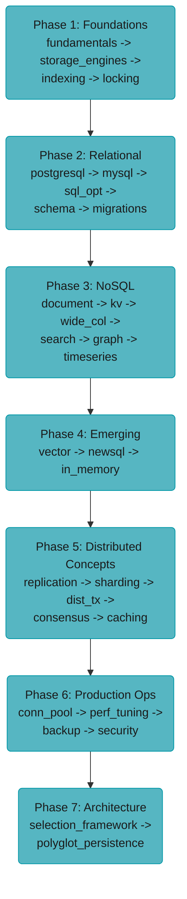

# Database Engineering — Principal Engineer & Interview Prep Guide

A laser-focused, principal-engineer-level reference for database internals, selection strategies, production operations, distributed systems, and real-world case studies. Covers relational, NoSQL, emerging, and distributed database concepts with concrete numbers, production war stories, and interview preparation.

---

## Learning Path — 7 Phases

```
Phase 1: Foundations
  database_fundamentals → storage_engines_internals → indexing_deep_dive → concurrency_control_and_locking

Phase 2: Relational Databases
  postgresql_internals → mysql_innodb_internals → sql_query_optimization → schema_design_and_normalization → database_migrations_zero_downtime

Phase 3: NoSQL Databases
  document_databases → key_value_stores → wide_column_databases → search_engines → graph_databases → time_series_databases

Phase 4: Emerging Databases
  vector_databases → newsql_and_distributed_sql → in_memory_databases

Phase 5: Distributed Database Concepts
  replication_and_high_availability → sharding_and_partitioning → distributed_transactions → consistency_models_and_consensus → database_caching_patterns

Phase 6: Production Operations
  connection_pool_management → database_performance_tuning → backup_recovery_and_disaster_recovery → database_security_and_compliance

Phase 7: Architecture & Selection
  database_selection_framework → polyglot_persistence_patterns
```

---

## Module Table

### Phase 1 — Foundations

| Module | Level | Q&As | Key Concepts |
|--------|-------|------|--------------|
| [Database Fundamentals](database_fundamentals/README.md) | Intermediate | 15 | ACID, BASE, CAP, PACELC, isolation levels, MVCC |
| [Storage Engines Internals](storage_engines_internals/README.md) | Expert | 18 | B+tree, LSM-tree, WAL, buffer pool, row vs columnar |
| [Indexing Deep Dive](indexing_deep_dive/README.md) | Advanced | 18 | B+tree, GIN, BRIN, covering, partial, composite, index bloat |
| [Concurrency Control & Locking](concurrency_control_and_locking/README.md) | Advanced | 15 | MVCC, deadlocks, gap locks, SELECT FOR UPDATE, advisory locks |

### Phase 2 — Relational Databases

| Module | Level | Q&As | Key Concepts |
|--------|-------|------|--------------|
| [PostgreSQL Internals](postgresql_internals/README.md) | Expert | 18 | VACUUM, autovacuum, EXPLAIN, TOAST, replication slots, partitioning |
| [MySQL InnoDB Internals](mysql_innodb_internals/README.md) | Advanced | 15 | Clustered index, redo/undo log, binary log, online DDL, GTID |
| [SQL Query Optimization](sql_query_optimization/README.md) | Advanced | 18 | Join algorithms, CBO statistics, keyset pagination, N+1, window functions |
| [Schema Design & Normalization](schema_design_and_normalization/README.md) | Intermediate | 15 | Normal forms, temporal data, audit trails, multi-tenancy, JSONB — with 1 deep-dive sub-file ([surrogate vs natural keys](schema_design_and_normalization/surrogate_vs_natural_keys.md)) |
| [Database Migrations (Zero Downtime)](database_migrations_zero_downtime/README.md) | Intermediate | 12 | Flyway, Liquibase, expand-contract, gh-ost, ADD INDEX CONCURRENTLY |

### Phase 3 — NoSQL Databases

| Module | Level | Q&As | Key Concepts |
|--------|-------|------|--------------|
| [Document Databases](document_databases/README.md) | Advanced | 15 | MongoDB WiredTiger, embedding vs referencing, aggregation, sharding, change streams |
| [Key-Value Stores](key_value_stores/README.md) | Expert | 18 | Redis data structures, persistence (RDB/AOF), Cluster, Streams, Redlock |
| [Wide-Column Databases](wide_column_databases/README.md) | Advanced | 15 | Cassandra ring, partition key, compaction, consistency levels, tombstones |
| [Search Engines](search_engines/README.md) | Advanced | 15 | Inverted index, BM25, Elasticsearch ILM, aggregations, deep pagination |
| [Graph Databases](graph_databases/README.md) | Intermediate | 12 | Property graph, Neo4j index-free adjacency, Cypher, fraud detection |
| [Time-Series Databases](time_series_databases/README.md) | Intermediate | 12 | TimescaleDB, InfluxDB, ClickHouse, Prometheus, Gorilla compression |

### Phase 4 — Emerging Databases

| Module | Level | Q&As | Key Concepts |
|--------|-------|------|--------------|
| [Vector Databases](vector_databases/README.md) | Advanced | 15 | HNSW, IVF, PQ, pgvector, hybrid search, multi-tenancy, RAG integration |
| [NewSQL & Distributed SQL](newsql_and_distributed_sql/README.md) | Expert | 15 | Spanner TrueTime, CockroachDB Raft, TiDB, YugabyteDB, global ACID |
| [In-Memory Databases](in_memory_databases/README.md) | Intermediate | 10 | Redis vs Memcached, VoltDB, Ignite, eviction, durability modes |

### Phase 5 — Distributed Database Concepts

| Module | Level | Q&As | Key Concepts |
|--------|-------|------|--------------|
| [Replication & High Availability](replication_and_high_availability/README.md) | Expert | 18 | Sync vs async, Patroni, split-brain, replication slots, multi-region |
| [Sharding & Partitioning](sharding_and_partitioning/README.md) | Expert | 18 | Consistent hashing, shard key selection, Vitess, hotspot, resharding |
| [Distributed Transactions](distributed_transactions/README.md) | Expert | 18 | 2PC, Saga, outbox pattern, idempotency, XA, distributed locks |
| [Consistency Models & Consensus](consistency_models_and_consensus/README.md) | Expert | 15 | Linearizability, Raft, Paxos, CRDTs, vector clocks, fencing tokens |
| [Database Caching Patterns](database_caching_patterns/README.md) | Advanced | 15 | Cache-aside, write-through, write-behind, stampede, hot key, invalidation |

### Phase 6 — Production Operations

| Module | Level | Q&As | Key Concepts |
|--------|-------|------|--------------|
| [Connection Pool Management](connection_pool_management/README.md) | Advanced | 15 | HikariCP internals, pool sizing, PgBouncer, ProxySQL, K8s connection storm |
| [Database Performance Tuning](database_performance_tuning/README.md) | Expert | 18 | shared_buffers, work_mem, checkpoint tuning, lock monitoring, slow queries |
| [Backup, Recovery & Disaster Recovery](backup_recovery_and_disaster_recovery/README.md) | Intermediate | 12 | PITR, WAL-G, pg_basebackup, RPO/RTO, restore drills |
| [Database Security & Compliance](database_security_and_compliance/README.md) | Intermediate | 12 | RLS, scram-sha-256, pgAudit, Vault, GDPR erasure, TDE |

### Phase 7 — Architecture & Selection

| Module | Level | Q&As | Key Concepts |
|--------|-------|------|--------------|
| [Database Selection Framework](database_selection_framework/README.md) | Expert | 18 | Selection matrix, benchmark traps, TCO, migration risk, vertical vs horizontal |
| [Polyglot Persistence Patterns](polyglot_persistence_patterns/README.md) | Advanced | 15 | CQRS, CDC (Debezium), dual-write, event sourcing, data mesh |

---

## Phase Diagram (ASCII)



---

## Learning Paths

This section is exhaustive by design — 29 modules spanning storage internals, relational and NoSQL engines, distributed-systems theory, and production operations. That is the right depth for a reference and the wrong shape for someone two weeks from a database-heavy interview. So there are **two ways through it**; the browser learning game's **Study** view surfaces both as a **Full / Interview** toggle (Full is the default).

### Full Path (29 modules)

The complete curriculum in the order above — see [Phase Diagram (ASCII)](#phase-diagram-ascii). Use it for genuine mastery: every phase from storage internals through full NoSQL breadth (document, wide-column, search, graph, time-series), the emerging-database frontier (NewSQL, in-memory), and the complete production-operations depth (connection pooling, performance tuning, backup/DR, security/compliance, polyglot persistence). Nothing is dropped.

<!-- study-path-table senior -->
### Senior Path (19 modules)

| # | Module | Files |
|---|--------|-------|
| 1 | [database_fundamentals](database_fundamentals/) | README only |
| 2 | [storage_engines_internals](storage_engines_internals/) | README only |
| 3 | [indexing_deep_dive](indexing_deep_dive/) | README only |
| 4 | [concurrency_control_and_locking](concurrency_control_and_locking/) | README only |
| 5 | [postgresql_internals](postgresql_internals/) | README only |
| 7 | [sql_query_optimization](sql_query_optimization/) | README only |
| 8 | [schema_design_and_normalization](schema_design_and_normalization/) | 2 files |
| 9 | [database_migrations_zero_downtime](database_migrations_zero_downtime/) | README only |
| 10 | [document_databases](document_databases/) | README only |
| 11 | [key_value_stores](key_value_stores/) | README only |
| 12 | [wide_column_databases](wide_column_databases/) | README only |
| 16 | [vector_databases](vector_databases/) | README only |
| 19 | [replication_and_high_availability](replication_and_high_availability/) | README only |
| 20 | [sharding_and_partitioning](sharding_and_partitioning/) | README only |
| 21 | [distributed_transactions](distributed_transactions/) | README only |
| 22 | [consistency_models_and_consensus](consistency_models_and_consensus/) | README only |
| 24 | [connection_pool_management](connection_pool_management/) | README only |
| 25 | [database_performance_tuning](database_performance_tuning/) | README only |
| 26 | [backup_recovery_and_disaster_recovery](backup_recovery_and_disaster_recovery/) | README only |

**Not in this path** (10 of 29, Full Path only): `mysql_innodb_internals`, `search_engines`, `graph_databases`, `time_series_databases`, `newsql_and_distributed_sql`, `in_memory_databases`, `database_caching_patterns`, `database_security_and_compliance`, `database_selection_framework`, `polyglot_persistence_patterns`
<!-- /study-path-table -->

A ruthless cut to what a **senior backend / database-heavy interview** actually probes: the storage-and-concurrency vocabulary everything else depends on, PostgreSQL as the default RDBMS, the two NoSQL stores and the vector-search topic that come up most, and the distributed-systems and selection-framework questions that close almost every round. Same learning order, a strict subset of the Full Path.

| Group | Why it's tested |
|-------|-----------------|
| Storage & Concurrency Foundations | ACID/BASE/CAP vocabulary, B+tree vs LSM-tree tradeoffs, how an index actually narrows a scan, and MVCC/deadlock/gap-lock mechanics — the foundation every later answer builds on |
| Relational Depth | PostgreSQL is the default RDBMS in almost every interview; EXPLAIN plan reading, join-algorithm choice, and normalize-vs-denormalize tradeoffs drive nearly every schema-design prompt |
| NoSQL & Vector Stores | Embedding-vs-referencing and Redis data-structure choice are the two most common non-relational deep dives; HNSW/pgvector now appears in any RAG-adjacent design round |
| Distributed Systems Core | Replication topology, shard-key selection, 2PC/Saga, and Raft/linearizability are the spine of every "design a globally available database" question |
| Caching & Selection | Cache-aside vs write-through, and the "which database, and why" decision framework, are what close almost every database interview |

<!-- study-path-table principal -->
### Principal Path (13 modules)

| # | Module | Files |
|---|--------|-------|
| 2 | [storage_engines_internals](storage_engines_internals/) | README only |
| 8 | [schema_design_and_normalization](schema_design_and_normalization/) | 2 files |
| 9 | [database_migrations_zero_downtime](database_migrations_zero_downtime/) | README only |
| 12 | [wide_column_databases](wide_column_databases/) | README only |
| 17 | [newsql_and_distributed_sql](newsql_and_distributed_sql/) | README only |
| 19 | [replication_and_high_availability](replication_and_high_availability/) | README only |
| 20 | [sharding_and_partitioning](sharding_and_partitioning/) | README only |
| 21 | [distributed_transactions](distributed_transactions/) | README only |
| 22 | [consistency_models_and_consensus](consistency_models_and_consensus/) | README only |
| 26 | [backup_recovery_and_disaster_recovery](backup_recovery_and_disaster_recovery/) | README only |
| 27 | [database_security_and_compliance](database_security_and_compliance/) | README only |
| 28 | [database_selection_framework](database_selection_framework/) | README only |
| 29 | [polyglot_persistence_patterns](polyglot_persistence_patterns/) | README only |

**Not in this path** (16 of 29, Full Path only): `database_fundamentals`, `indexing_deep_dive`, `concurrency_control_and_locking`, `postgresql_internals`, `mysql_innodb_internals`, `sql_query_optimization`, `document_databases`, `key_value_stores`, `search_engines`, `graph_databases`, `time_series_databases`, `vector_databases`, `in_memory_databases`, `database_caching_patterns`, `connection_pool_management`, `database_performance_tuning`
<!-- /study-path-table -->

A different cut, not senior-plus-extras. The Principal Path probes the decisions that outlive a schema: engine and topology selection, the migration path off a wrong choice, and the failure modes that only appear at production scale. Roughly half of it is material the Senior Path never covers, and it is usually the smaller list -- depth of judgment, not depth of syllabus.

---

## Knowledge-Question Map

The highest-frequency database *knowledge* questions mapped to the file that answers them. For *system design* ("design X") questions, use the interview-prep shortcuts in [case_studies/README.md](case_studies/README.md).

| Interview question | Where the answer lives |
|--------------------|------------------------|
| ACID vs BASE — what do you give up moving from one model to the other? | [Database Fundamentals](database_fundamentals/README.md) |
| State the CAP theorem, then explain what PACELC adds when there's no partition. | [Database Fundamentals](database_fundamentals/README.md) |
| B+tree vs LSM-tree — which write/read pattern favors each, and why do LSM-trees need compaction? | [Storage Engines Internals](storage_engines_internals/README.md) |
| What does the write-ahead log (WAL) guarantee, and how does it drive crash recovery? | [Storage Engines Internals](storage_engines_internals/README.md) |
| When does a covering index eliminate a heap lookup, and why does composite-index column order matter? | [Indexing Deep Dive](indexing_deep_dive/README.md) |
| What is MVCC, and why can a reader never block a writer under it? | [Concurrency Control & Locking](concurrency_control_and_locking/README.md) |
| Walk through how two transactions deadlock, and how the database detects and breaks the cycle. | [Concurrency Control & Locking](concurrency_control_and_locking/README.md) |
| What does PostgreSQL's VACUUM reclaim, and what happens when autovacuum falls behind on a hot table? | [PostgreSQL Internals](postgresql_internals/README.md) |
| How do you read an EXPLAIN ANALYZE plan to tell a planner misestimate from a missing index? | [SQL Query Optimization](sql_query_optimization/README.md) |
| Why does keyset (seek) pagination outperform OFFSET pagination as a table grows, and what is the N+1 query problem? | [SQL Query Optimization](sql_query_optimization/README.md) |
| When do you denormalize a schema, and what invariant do you give up by doing it? | [Schema Design & Normalization](schema_design_and_normalization/README.md) |
| Embedding vs referencing in a document database — what decides which one to use? | [Document Databases](document_databases/README.md) |
| Which Redis data structure fits a leaderboard, and which fits a dedup/membership check? | [Key-Value Stores](key_value_stores/README.md) |
| How does HNSW trade memory for recall, and what does IVF+PQ trade instead? | [Vector Databases](vector_databases/README.md) |
| Synchronous vs asynchronous replication — what do you trade, and what causes split-brain? | [Replication & High Availability](replication_and_high_availability/README.md) |
| How do you choose a shard key, and what access pattern creates a write hotspot? | [Sharding & Partitioning](sharding_and_partitioning/README.md) |
| Two-phase commit vs the Saga pattern — when does each fit, and what does each give up? | [Distributed Transactions](distributed_transactions/README.md) |
| What is linearizability, and how does Raft reach consensus when a node fails? | [Consistency Models & Consensus](consistency_models_and_consensus/README.md) |
| Cache-aside vs write-through vs write-behind — what does each guarantee (or not) on a crash, and what is cache stampede? | [Database Caching Patterns](database_caching_patterns/README.md) |
| How do you build a database-selection decision matrix, and what's a classic benchmark trap? | [Database Selection Framework](database_selection_framework/README.md) |

---

## Study Plan

A 6-week plan over the Senior Path. Each week pairs modules with one case study to rehearse the "design X" format.

| Week | Focus | Modules | Case study |
|------|-------|---------|------------|
| 1 | Storage & Concurrency Foundations | Database Fundamentals, Storage Engines Internals, Indexing Deep Dive, Concurrency Control & Locking | [Banking Ledger](case_studies/design_banking_ledger/README.md) (SERIALIZABLE isolation, locking, ACID under load) |
| 2 | Relational Depth | PostgreSQL Internals, SQL Query Optimization, Schema Design & Normalization | [Multi-Tenant SaaS Database](case_studies/design_multitenant_saas_database/README.md) (RLS, schema-per-tenant, connection pooling) |
| 3 | NoSQL & Vector Stores | Document Databases, Key-Value Stores, Vector Databases | [Social Media Feed Storage](case_studies/design_social_media_feed_storage/README.md) (Cassandra wide-rows, Redis leaderboards) |
| 4 | Distributed Systems I — Replication & Sharding | Replication & High Availability, Sharding & Partitioning | [Real-Time Analytics Platform](case_studies/design_realtime_analytics_platform/README.md) (partitioned columnar storage, replica reads) |
| 5 | Distributed Systems II — Transactions & Consensus | Distributed Transactions, Consistency Models & Consensus | [Monolith to Polyglot Migration](case_studies/design_monolith_to_polyglot_migration/README.md) (CDC dual-write, idempotency, cutover consistency) |
| 6 | Caching & Selection | Database Caching Patterns, Database Selection Framework | [E-Commerce Catalog](case_studies/design_ecommerce_catalog/README.md) (Redis inventory counters, polyglot selection rationale) |

---

## Case Studies

| Case Study | Scenario | Key Databases | Level |
|------------|----------|---------------|-------|
| [Banking Ledger](case_studies/design_banking_ledger/README.md) | Double-entry bookkeeping, 10K TPS, global ACID, immutable audit | PostgreSQL, Redis | Expert |
| [E-Commerce Catalog](case_studies/design_ecommerce_catalog/README.md) | 50M SKUs, full-text search, faceted filtering, inventory counters | PostgreSQL, Elasticsearch, Redis | Advanced |
| [Social Media Feed Storage](case_studies/design_social_media_feed_storage/README.md) | 500M users, fan-out on write/read, trending posts | Cassandra, Redis, PostgreSQL | Advanced |
| [Real-Time Analytics Platform](case_studies/design_realtime_analytics_platform/README.md) | 1B events/day, sub-second dashboards, 90-day retention | ClickHouse, Kafka, Redis | Expert |
| [Multi-Tenant SaaS Database](case_studies/design_multitenant_saas_database/README.md) | 10K tenants, varying sizes, isolation, compliance | PostgreSQL (RLS), PgBouncer | Advanced |
| [Monolith to Polyglot Migration](case_studies/design_monolith_to_polyglot_migration/README.md) | Migrate 5TB MySQL monolith without downtime | Debezium, dual-write, CDC | Expert |

---

## Database Version Matrix

| Database | Version | Notable Changes |
|----------|---------|-----------------|
| PostgreSQL | 16 (2023) | Parallel workers for logical replication, pg_stat_io |
| PostgreSQL | 17 (2024) | Incremental backup, MAINTAIN privilege, JSON_TABLE |
| PostgreSQL | 18 (2025) | Asynchronous I/O (up to 3x faster reads), `uuidv7()`, virtual generated columns, B-tree skip scan, OAuth 2.0 auth |
| MySQL | 8.4 (2024-LTS) | Replication improvements, GTID enhancements |
| MySQL | 9.7 (2026-LTS) | Hypergraph optimizer, JSON duality, in-database JavaScript, OpenID auth, replication applier metrics in Community |
| MongoDB | 8.0 (2024) | ~25% better throughput, 54% faster bulk inserts, Queryable Encryption range queries, faster resharding |
| MongoDB | 8.3 (2026) | Current stable series |
| Redis | 7.4 (2024) | Hash field expiration (HEXPIRE) |
| Redis | 8.x (2025+) | AGPLv3 option, JSON/time-series/vector-set and probabilistic types in core, Redis Query Engine, new I/O threading |
| Cassandra | 5.0 (2024) | Storage-Attached Indexes (SAI), vector type + ANN search, trie memtables/SSTables, dynamic data masking |
| Elasticsearch | 9.x (2025+) | Lucene 10, Better Binary Quantization GA, ES\|QL JOIN, search/IO parallelism |
| ClickHouse | 26.x (2026) | Calendar versioning (YY.M); latest stable 26.5 |

---

## Cross-Reference Map

| Topic | Primary Module | See Also |
|-------|---------------|----------|
| ACID transactions | [database_fundamentals](database_fundamentals/README.md) | [distributed_transactions](distributed_transactions/README.md) |
| B+tree internals | [storage_engines_internals](storage_engines_internals/README.md) | [indexing_deep_dive](indexing_deep_dive/README.md), [postgresql_internals](postgresql_internals/README.md) |
| LSM-tree | [storage_engines_internals](storage_engines_internals/README.md) | [wide_column_databases](wide_column_databases/README.md), [key_value_stores](key_value_stores/README.md) |
| MVCC | [concurrency_control_and_locking](concurrency_control_and_locking/README.md) | [postgresql_internals](postgresql_internals/README.md) |
| N+1 query problem | [sql_query_optimization](sql_query_optimization/README.md) | Backend: spring_data_jpa |
| Consistent hashing | [sharding_and_partitioning](sharding_and_partitioning/README.md) | [wide_column_databases](wide_column_databases/README.md) |
| Raft consensus | [consistency_models_and_consensus](consistency_models_and_consensus/README.md) | [newsql_and_distributed_sql](newsql_and_distributed_sql/README.md), [replication_and_high_availability](replication_and_high_availability/README.md) |
| Outbox pattern | [distributed_transactions](distributed_transactions/README.md) | [polyglot_persistence_patterns](polyglot_persistence_patterns/README.md) |
| CDC / Debezium | [polyglot_persistence_patterns](polyglot_persistence_patterns/README.md) | [distributed_transactions](distributed_transactions/README.md) |
| Connection pool | [connection_pool_management](connection_pool_management/README.md) | Backend: connection_pooling_deep_dive |
| Sharding | [sharding_and_partitioning](sharding_and_partitioning/README.md) | HLD: database_sharding |
| CAP theorem | [database_fundamentals](database_fundamentals/README.md) | HLD: cap_theorem, [consistency_models_and_consensus](consistency_models_and_consensus/README.md) |
| Replication | [replication_and_high_availability](replication_and_high_availability/README.md) | [postgresql_internals](postgresql_internals/README.md), [mysql_innodb_internals](mysql_innodb_internals/README.md) |
| Vector search | [vector_databases](vector_databases/README.md) | LLM: embeddings_and_similarity_search |
| Cache patterns | [database_caching_patterns](database_caching_patterns/README.md) | Backend: caching_strategies_deep_dive, [key_value_stores](key_value_stores/README.md) |
| HNSW / ANN | [vector_databases](vector_databases/README.md) | LLM: embeddings_and_similarity_search |
| Schema migration | [database_migrations_zero_downtime](database_migrations_zero_downtime/README.md) | Backend: database_migrations |

---

## Quick Interview Reference

### "Which database for...?"

```
OLTP relational, ACID                → PostgreSQL
High-write, simple access patterns   → Cassandra / DynamoDB
Full-text search, faceted filter     → Elasticsearch / OpenSearch
Semantic / vector similarity         → pgvector / Pinecone / Qdrant
Graph traversal, relationship queries → Neo4j / Amazon Neptune
Time-series, IoT, metrics            → ClickHouse / TimescaleDB / InfluxDB
Session, cache, leaderboard          → Redis
Document, flexible schema            → MongoDB / Firestore
Global ACID at horizontal scale      → Spanner / CockroachDB / TiDB
HTAP (hybrid tx + analytics)         → TiDB / AlloyDB / BigQuery
```

### Latency Reference Numbers

```
L1 cache hit        ~1 ns
L2 cache hit        ~5 ns
RAM access          ~100 ns
Redis GET           ~0.5 ms
PostgreSQL query    ~1-50 ms
Cassandra read      ~1-5 ms (local DC)
Elasticsearch query ~10-100 ms
Cross-region DB     ~100-300 ms
```

### Common Production Mistakes

1. Missing `idle_in_transaction_session_timeout` — locks held indefinitely
2. Replication slot left behind — WAL accumulates, disk fills at 3 AM
3. ORM generating N+1 queries in production — fix with JOIN FETCH or batch loading
4. No VACUUM tuning on high-write tables — table bloat degrades performance
5. Sequential primary keys in distributed SQL — creates insert hotspot on single shard
6. Pool size set too large — contention on DB server exceeds gains
7. No partial index on soft-delete active rows — scans entire table including deleted
8. Missing index on foreign key — full scan on every DELETE to parent table (MySQL behavior)

---

## Related Sections

- [Backend Engineering](../backend/README.md) — Phase 4 has database modules; see this section for deeper coverage
- [HLD](../hld/README.md) — CAP theorem, consistent hashing, database sharding at system design level
- [LLM](../llm/README.md) — embeddings_and_similarity_search for vector database context
