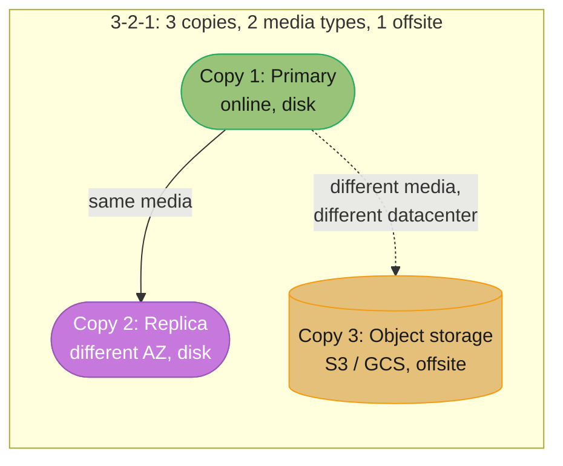
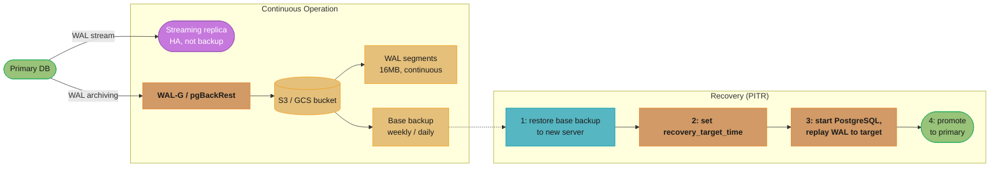
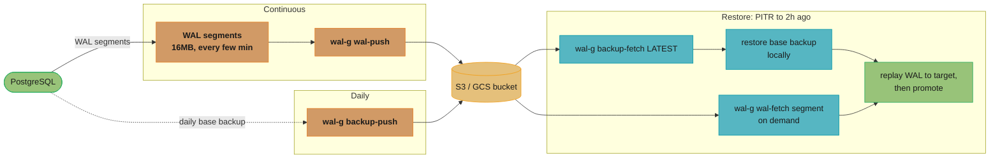
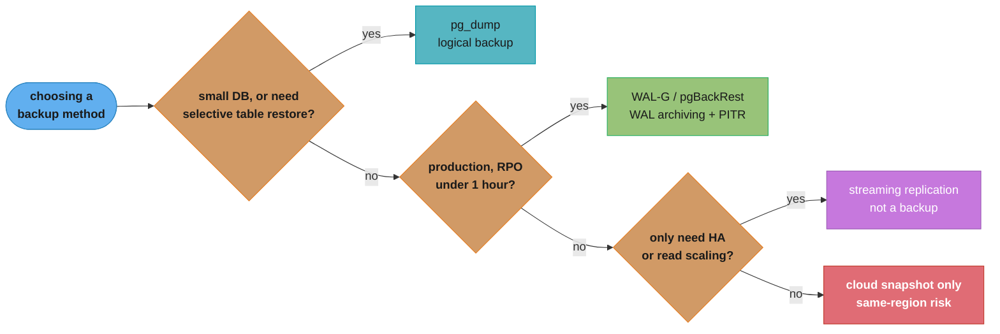
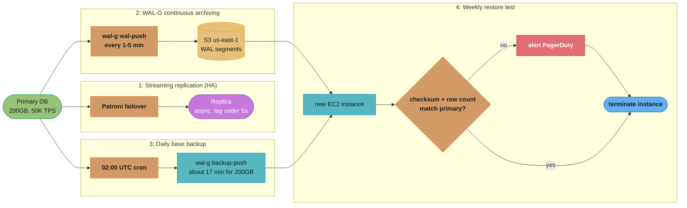

# Backup, Recovery, and Disaster Recovery

## 1. Concept Overview

Backup and recovery is the discipline of ensuring that a database's data can be restored to a consistent, known-good state after a failure. The failure modes span a wide spectrum: disk failure, operator error (accidental DROP TABLE), software bugs, datacenter disasters, and ransomware. Each requires a different recovery approach. The key metrics are RPO (Recovery Point Objective — how much data loss is acceptable) and RTO (Recovery Time Objective — how long can the service be unavailable).

A streaming replica is not a backup. `DROP TABLE` replicates instantly to all replicas. A true backup is a point-in-time copy that is stored separately and can survive any failure affecting the primary.

---

## 2. Intuition

Backups are like insurance policies: boring and costly to maintain, catastrophic to discover you don't have when you need them. A replica is a live copy of the database — if the original burns down, so does the replica (logically speaking). A backup is a snapshot stored somewhere safe that represents the database as it was at a specific point in time. Recovery is the process of using that snapshot, possibly combined with subsequent logs, to reconstruct any desired point in time.

---

## 3. Core Principles

**RPO and RTO are business requirements**: Engineering chooses techniques to meet them; business defines the acceptable values. Before designing a backup strategy, get explicit answers: how many minutes of data loss is acceptable? How many hours of downtime?

**3-2-1 backup rule**: 3 copies, 2 different media types, 1 offsite. For databases: primary (online), replica (different AZ), cold backup in object storage (S3, GCS) — different datacenter.



The rule made concrete for databases: the online primary and an AZ-local replica are copies 1 and 2, both on disk media in the same region, while the object-storage backup is copy 3 on a different medium in a different datacenter — the only one of the three that survives a full-region failure.

**Backups must be tested**: An untested backup has unknown reliability. Restore drills catch encoding issues, permission problems, and software version mismatches before they occur at 3 AM.

**WAL archiving enables PITR**: Base backup + all WAL since that backup = the ability to replay the database to any point in time. This is the foundation of PostgreSQL point-in-time recovery.

---

## 4. Types / Architectures / Strategies

```
Backup Type     | Mechanism                     | Lock?  | Size      | RTO
----------------|-------------------------------|--------|-----------|----------
Logical (pg_dump)| SQL/COPY output              | No     | Compressed| Hours
Physical base   | Raw file copy (pg_basebackup) | No     | Full DB   | Minutes
WAL archiving   | Continuous WAL segment archive| No     | Incremental| Minutes
PITR            | Base backup + WAL replay      | No     | Full + WAL| Minutes
Snapshot (cloud)| Storage volume snapshot       | No     | Full disk | Minutes
Percona XtraBackup| Hot physical backup MySQL  | No     | Full DB   | Minutes
```

---

## 5. Architecture Diagrams

**PostgreSQL PITR Architecture**



The primary streams WAL continuously to a replica for HA and separately archives WAL to object storage via WAL-G/pgBackRest; recovery restores the latest base backup, replays archived WAL to a target timestamp, and promotes. RPO is roughly the time since the last archived WAL segment (typically seconds); RTO is base-backup restore time plus WAL replay time (typically 30 minutes to 4 hours).

**WAL-G Backup Flow**



WAL segments stream to S3/GCS continuously as they fill (every few minutes under write load) while a full base backup is pushed daily; restoring to two hours ago fetches the latest base backup plus the WAL segments needed to replay forward to the target time, then promotes.

**Backup Verification**

```mermaid
flowchart LR
    classDef io      fill:#61afef,stroke:#2e86c1,color:#1a1a1a,font-weight:bold
    classDef frozen  fill:#c678dd,stroke:#9b59b6,color:#fff
    classDef train   fill:#98c379,stroke:#27ae60,color:#1a1a1a
    classDef mathOp  fill:#d19a66,stroke:#e67e22,color:#1a1a1a,font-weight:bold
    classDef lossN   fill:#e06c75,stroke:#c0392b,color:#fff,font-weight:bold
    classDef req     fill:#56b6c2,stroke:#0097a7,color:#1a1a1a
    classDef base    fill:#e5c07b,stroke:#f39c12,color:#1a1a1a

    Start(["weekly trigger"]) --> Pull["1: pull latest<br/>base backup from S3"]
    Pull --> Replay3["2: replay WAL to<br/>latest segment"]
    Replay3 --> Checksum["3: checksum query<br/>vs primary"]
    Checksum --> Smoke["4: application<br/>smoke tests"]
    Smoke --> Check{"5: failure or<br/>mismatch?"}
    Check -->|"yes"| Alert["alert PagerDuty"]
    Check -->|"no"| Decom(["6: decommission<br/>test instance"])
    Alert --> Decom

    class Start io
    class Pull,Replay3 req
    class Checksum,Smoke,Check mathOp
    class Alert lossN
    class Decom io
```



The weekly restore drill pulls the latest base backup, replays WAL to the newest archived segment, checksums against the primary, and runs smoke tests before deciding whether to alert on failure; the test instance is torn down either way.

---

## 6. How It Works — Detailed Mechanics

### pg_dump (Logical Backup)

```bash
# Full database dump (SQL format)
pg_dump \
    --host=localhost \
    --port=5432 \
    --username=postgres \
    --dbname=mydb \
    --format=custom \          # custom binary format (fastest restore)
    --compress=9 \             # gzip compression level 9
    --no-password \
    --file=/backups/mydb_$(date +%F).dump

# Parallel dump (uses multiple worker processes)
pg_dump \
    --format=directory \
    --jobs=4 \                 # 4 parallel workers
    --file=/backups/mydb_dir_$(date +%F)/

# Restore
pg_restore \
    --host=new-server \
    --port=5432 \
    --username=postgres \
    --dbname=mydb \
    --jobs=4 \                 # parallel restore
    /backups/mydb_$(date +%F).dump

# Time for 100GB database:
#   pg_dump: 20-60 minutes (depends on I/O)
#   pg_restore: 30-90 minutes (index rebuilding)
# Limitation: no PITR (only restores to dump time)
```

### WAL-G (Physical Backup with PITR)

```bash
# WAL-G configuration (environment variables or config file)
export WALG_S3_PREFIX=s3://my-db-backups/postgres/production
export AWS_REGION=us-east-1
export PGHOST=localhost
export PGPORT=5432
export PGUSER=postgres

# Configure PostgreSQL to archive WAL to WAL-G:
# postgresql.conf:
#   archive_mode = on
#   archive_command = 'wal-g wal-push %p'
#   wal_level = replica

# Take base backup:
wal-g backup-push /var/lib/postgresql/15/main
# Creates compressed, encrypted backup in S3

# List available backups:
wal-g backup-list

# Restore to specific point in time:
# 1. Stop PostgreSQL
# 2. Clear data directory
rm -rf /var/lib/postgresql/15/main/*
# 3. Restore base backup
wal-g backup-fetch /var/lib/postgresql/15/main LATEST
# 4. Configure recovery
cat > /var/lib/postgresql/15/main/postgresql.auto.conf << EOF
restore_command = 'wal-g wal-fetch "%f" "%p"'
recovery_target_time = '2025-12-01 14:30:00 UTC'
recovery_target_action = 'promote'
EOF
# 5. Create recovery signal file
touch /var/lib/postgresql/15/main/recovery.signal
# 6. Start PostgreSQL — it replays WAL and stops at target time
pg_ctl start -D /var/lib/postgresql/15/main
```

### pgBackRest (Enterprise-Grade Backup Tool)

```ini
# /etc/pgbackrest/pgbackrest.conf

[global]
repo1-path=/var/lib/pgbackrest
repo1-s3-bucket=my-backups
repo1-s3-region=us-east-1
repo1-s3-key=...
repo1-s3-key-secret=...
repo1-type=s3
repo1-retention-full=4        # Keep last 4 full backups
repo1-retention-diff=7        # Keep last 7 differential backups

# Encryption
repo1-cipher-type=aes-256-cbc
repo1-cipher-pass=supersecretpassword

[mydb]
pg1-path=/var/lib/postgresql/15/main
pg1-user=postgres

# Commands:
# Full backup:
pgbackrest --stanza=mydb backup --type=full

# Differential backup (since last full):
pgbackrest --stanza=mydb backup --type=diff

# Incremental backup (since last any backup):
pgbackrest --stanza=mydb backup --type=incr

# Restore to specific time:
pgbackrest --stanza=mydb restore \
    --target="2025-12-01 14:30:00" \
    --target-action=promote
```

### Percona XtraBackup (MySQL Hot Backup)

```bash
# Install Percona XtraBackup
apt install percona-xtrabackup-80

# Full backup (hot — no table locks)
xtrabackup \
    --user=backup_user \
    --password=... \
    --host=localhost \
    --backup \
    --target-dir=/backups/full_$(date +%F_%H%M)

# Prepare backup (apply redo log — makes it consistent)
xtrabackup \
    --prepare \
    --target-dir=/backups/full_2025-12-01_1400

# Restore
# 1. Stop MySQL
# 2. Clear data directory
rm -rf /var/lib/mysql/*
# 3. Restore
xtrabackup \
    --copy-back \
    --target-dir=/backups/full_2025-12-01_1400
chown -R mysql:mysql /var/lib/mysql
# 4. Start MySQL

# Incremental backup:
xtrabackup \
    --backup \
    --target-dir=/backups/incr_$(date +%F_%H%M) \
    --incremental-basedir=/backups/full_2025-12-01_1400
```

### RPO and RTO Definitions and Testing

```
RPO (Recovery Point Objective):
  Definition: Maximum acceptable data loss measured in time
  Measurement: How old is the most recent recovery point?

  With async replication:         RPO = replication lag (seconds to minutes)
  With WAL archiving:             RPO = time since last archived segment (seconds to minutes)
  With synchronous replication:   RPO = 0 (no committed data loss)
  With daily pg_dump:             RPO = up to 24 hours

RTO (Recovery Time Objective):
  Definition: Maximum acceptable downtime (from failure detection to service restoration)
  Measurement: Time from failure event to full service restoration

  Streaming replica promotion:    RTO = 15-30 seconds (Patroni)
  WAL-G PITR restore (100GB):     RTO = 30-90 minutes (restore + WAL replay)
  pg_dump restore (100GB):        RTO = 60-180 minutes
  Cloud snapshot restore:         RTO = 10-30 minutes

Testing RPO and RTO:
  - Simulate failure: terminate primary, stop archiving at a specific WAL segment
  - Measure: when is the last recoverable point? Calculate RPO.
  - Execute recovery procedure and time it: from failure notification to service restored = RTO
  - Do this quarterly with production-size data; document results; compare against SLA
```

### Backup Encryption

```bash
# WAL-G with AES-256 encryption
export WALG_LIBSODIUM_KEY_TRANSFORM=scrypt
export WALG_LIBSODIUM_KEY=my_32_byte_encryption_key_here

# pgBackRest with AES-256-CBC
repo1-cipher-type=aes-256-cbc
repo1-cipher-pass=${BACKUP_ENCRYPTION_PASSWORD}  # from Vault/Secrets Manager

# AWS: use S3 server-side encryption (SSE-S3 or SSE-KMS) as additional layer
# GCS: default encryption at rest; customer-managed keys via CMEK
```

---

## 7. Real-World Examples

**GitLab**: Restored production data after an accidental deletion incident (January 2017). The DBA accidentally deleted the wrong directory (`pg_drop`). Only 5-hour-old pg_dump backups were available (WAL archiving was misconfigured). ~6 hours of production data lost. RTO was 18 hours. Led to open-sourcing their backup procedures and creating the "GitLab.com Recovery" public documentation.

**Tesla**: Uses automated PITR testing: every 24 hours, automated jobs restore the previous day's backup to an isolated cluster, run a suite of data integrity checks, and report results to an internal dashboard. This verifies that backups are restorable.

**Stripe**: Employs a two-datacenter strategy: production data in US-EAST-1 with real-time replication to US-WEST-2. WAL archiving to a third location (S3 with cross-region replication). Recovery tests quarterly with full RTO measurement.

---

## 8. Tradeoffs

```
Method              | RPO         | RTO          | Storage    | Complexity
--------------------|-------------|--------------|------------|------------
pg_dump daily       | 24 hours    | Hours        | Low        | Low
WAL archiving (WAL-G)| Seconds    | 30-90 min    | Medium     | Medium
Streaming replica   | Seconds     | 15-30s       | Full DB    | Medium
Cloud snapshot      | 5-60 min    | 10-30 min    | Full disk  | Low
Synchronous rep.    | 0           | 15-30s       | Full DB    | Medium
Multi-region active | 0           | 0            | 2× DB      | Very High
```

---

## 9. When to Use / When NOT to Use

**Use pg_dump** for: small databases (< 100GB), selective table restores, cross-version migrations, schema-only exports, periodic archival copies for audit.

**Use WAL archiving (WAL-G / pgBackRest)** for: any production database where RPO < 1 hour and data must survive disk failure. This should be the standard for all production PostgreSQL.

**Use streaming replication** for: HA and read scaling. Not as a backup — DO replicate drop/truncate.

**Never rely solely on snapshots**: cloud volume snapshots are consistent at a point in time but are stored in the same cloud region. Region failure destroys both DB and snapshot.



Backup-method selection as a decision chain: small databases or selective-restore needs point to logical pg_dump; production systems needing sub-hour RPO and disk-failure survival point to WAL-based PITR; and streaming replication or a lone snapshot are HA/DR tools, not backups, since a replicated DROP TABLE or a region failure takes them down too.

---

## 10. Common Pitfalls

**"We have replicas" mistaken for "we have backups"**: A team drops a large table in production. The DROP TABLE replicates to all replicas within milliseconds. No backup was taken. All data is gone. There is no recovery. Fix: WAL archiving with retention, so you can replay WAL to the point before the DROP TABLE.

**Backup exists, restore was never tested**: Six months after setting up WAL-G, a disk failure requires recovery. The team discovers the backup configuration has a permission error — WAL segments were never actually uploaded to S3. The backup is empty. Fix: automated weekly restore tests that alert on failure.

**RPO/RTO defined by engineering, not by business**: The team sets up WAL archiving, assuming RPO = minutes is fine. After a failure, the business discovers they lost 8 minutes of payment transactions. Compliance requires RPO = 0 for payment data. Fix: RPO and RTO requirements must come from business stakeholders and compliance before the backup strategy is designed.

**Backup encryption key in the backup**: Team encrypts backups and stores the key in the backup directory alongside the backup. Ransomware encrypts both the database and the backup. Neither is accessible without the key. The key is gone with everything else. Fix: encryption keys in a separate system (Vault, AWS KMS, AWS Secrets Manager); the key must survive independent of the database and backups.

**Long PITR replay during RTO window**: A 5TB database with 30 minutes of WAL to replay. Base backup restore takes 45 minutes; WAL replay takes another 90 minutes. Total RTO = 2.25 hours, exceeding the 1-hour SLA. Fix: use streaming replication as primary HA (15-30s RTO); WAL archiving as backup (high-RPO recovery scenario). Or: take base backups more frequently (every 4 hours) to reduce WAL replay window.

---

## 11. Technologies & Tools

| Tool              | DB           | Purpose                              |
|-------------------|--------------|--------------------------------------|
| WAL-G             | PostgreSQL   | WAL archiving + base backup to S3/GCS|
| pgBackRest        | PostgreSQL   | Enterprise backup with PITR, encryption|
| pg_dump           | PostgreSQL   | Logical backup (SQL/custom format)   |
| pg_basebackup     | PostgreSQL   | Physical base backup                 |
| Percona XtraBackup| MySQL/Percona| Hot physical backup with PITR        |
| mydumper          | MySQL        | Fast parallel logical dump           |
| AWS RDS Automated | RDS/Aurora   | Managed PITR, 35-day retention       |
| AWS Backup        | Any on AWS   | Cross-service backup policy          |
| Barman            | PostgreSQL   | Backup and recovery manager          |
| Velero            | Kubernetes   | K8s PVC snapshot backup              |

---

## 12. Interview Questions with Answers

**Q: What is the difference between RPO and RTO and how do you test them?**
RPO (Recovery Point Objective) is the maximum acceptable data loss measured in time: if RPO=1 hour, you can lose at most 1 hour of data. RTO (Recovery Time Objective) is the maximum acceptable service downtime from failure to full restoration. Testing RPO: stop WAL archiving or replication at a known time, wait, then simulate failure and check the timestamp of the most recent recoverable state. Testing RTO: execute the full recovery procedure (including failure detection, notification, and restoration) and measure elapsed time from failure event to service-restored state. Both tests must use production-sized data and production hardware to be meaningful. Run quarterly; document results; compare against SLA commitments.

**Q: Why is a streaming replica not a substitute for backups?**
A streaming replica is a live copy of the primary database. Any data-destroying operation — `DROP TABLE`, `TRUNCATE`, a bug that `DELETE`s all rows — replicates to the replica within milliseconds. By the time the operator discovers the mistake, all replicas have the same corrupted or empty state. A backup, by contrast, captures the state at a specific point in time and does not change when the live database changes. PITR (point-in-time recovery) enables restoring to any moment before the destructive operation. Keep backups with retention long enough to detect and recover from logical errors (human mistakes typically discovered within days).

**Q: How does WAL archiving enable point-in-time recovery?**
WAL (Write-Ahead Log) records every change made to the database in sequential order. WAL archiving copies each 16MB WAL segment to object storage (S3, GCS) as it is filled. A base backup captures the full database files at a specific LSN (log sequence number). To recover to any point in time: (1) restore the base backup that precedes the target time, (2) configure PostgreSQL to fetch WAL segments from archive, (3) set `recovery_target_time` to the desired moment, (4) start PostgreSQL — it replays WAL records up to the target time, then promotes. This can recover to within seconds of any historical moment.

**Q: What is the difference between logical and physical backups?**
Logical backups (`pg_dump`, `mysqldump`) export the database as SQL statements or structured data. They are portable (can restore to different hardware, OS, or PostgreSQL minor version), support selective restore (individual tables), and can restore to a different database name. They are slow to create and restore for large databases (> 100GB). Physical backups (`pg_basebackup`, XtraBackup, volume snapshots) copy the raw database files. They are faster to create (streaming copy) and restore, support PITR when combined with WAL archiving, but must be restored to an identical or compatible database version and storage layout. Use logical backups for migrations and selective restores; physical backups for production PITR recovery.

**Q: How do you verify that a backup is valid?**
Automated restore testing: (1) Daily: verify that WAL segments are being successfully uploaded by checking the archive command exit code and monitoring S3 object counts vs expected WAL segment rate. (2) Weekly: restore the most recent base backup to an isolated test instance, replay WAL to the latest available segment, run `ANALYZE` to rebuild statistics, execute a suite of data integrity queries (row counts, checksum queries on critical tables), compare results against known-good values from the primary. Alert on any mismatch or restore failure. (3) Quarterly: execute a full DR runbook drill — simulate region failure, restore to a different region from S3, run smoke tests, measure RTO against SLA.

**Q: How does pg_dump handle transactions and consistency?**
`pg_dump` takes a consistent snapshot of the database by starting a transaction with `REPEATABLE READ` isolation before reading any data. This transaction snapshot ensures that all tables are read as of the same moment, even if the dump takes an hour to complete. Active writes during the dump are not captured in the snapshot — they are committed after the dump's snapshot time, and will not appear in the restored database. This is intentional: `pg_dump` produces a consistent point-in-time snapshot without interrupting write traffic. For a 100GB database, the dump takes 20–60 minutes; the snapshot point is the moment the `pg_dump` command started.

**Q: What is pgBackRest's advantage over WAL-G?**
Both WAL-G and pgBackRest provide PITR-capable PostgreSQL backup to object storage. Key differences: (1) pgBackRest supports delta restores — it can restore only the blocks that changed since a previous backup, much faster for large databases. (2) pgBackRest has built-in parallel restore with configurable worker count. (3) pgBackRest supports standby backup — taking the backup from a replica to avoid primary I/O impact. (4) WAL-G is simpler to configure (environment variables) and has broader cloud storage support out of the box. For most use cases, either is appropriate. pgBackRest's delta restore is a significant advantage for databases > 1TB where full restore time would otherwise exceed the RTO.

**Q: How do you handle backup retention and storage costs?**
Tiered retention strategy: (1) Keep full backups for 7 days in standard S3 (high access, moderate cost). (2) After 7 days, transition to S3 Infrequent Access or Glacier Instant Retrieval (lower cost, slightly higher retrieval latency). (3) After 30 days, transition to Glacier Deep Archive (lowest cost, 12-hour retrieval — for compliance only). WAL segments: retain at least as long as the oldest full backup you want to use for PITR. If you keep full backups for 7 days, keep WAL for 8 days. pgBackRest `repo1-retention-full=4` keeps 4 full backups and automatically removes older backups and associated WAL. Regularly audit backup storage costs against your RTO/RPO requirements.

**Q: What is a DR runbook and what should it contain?**
A disaster recovery runbook is a step-by-step procedure document for restoring service after a catastrophic failure. It must be: (1) Written in advance, before the emergency. (2) Tested and updated regularly. (3) Accessible offline (not just in the production system that failed). Content: failure detection signals and thresholds; escalation procedure (who to call, in what order); step-by-step recovery commands (exact commands, not descriptions); DNS/load balancer update procedure; verification queries to confirm data integrity; rollback procedure if recovery fails; communication templates for status page and stakeholders. Time the drill to validate RTO assumptions. A runbook not executed in practice is unreliable.

**Q: How does Percona XtraBackup differ from mysqldump for MySQL backup?**
`mysqldump` is a logical backup: it reads data from MySQL and writes SQL INSERT statements. It locks tables (with some options) or uses transactions for InnoDB consistency. It is slow for large databases (> 100GB can take hours) and creates large output files. Percona XtraBackup is a physical hot backup: it copies InnoDB data files directly from disk while MySQL is running, without taking table locks. It applies the InnoDB redo log during a `--prepare` phase to make the backup consistent. Results: XtraBackup is 5–10× faster for backup and restore of large databases, does not interrupt production writes, and supports incremental backups. Use XtraBackup for production MySQL backups; mysqldump for small databases and selective table restores.

**Q: What is the recovery model for AWS RDS and Aurora?**
AWS RDS automatically takes daily snapshots and continuously archives transaction logs to S3. RDS supports PITR to any second within the backup retention window (1–35 days). To restore: select the instance, choose "Restore to point in time," specify the target time — RDS creates a new instance and replays transaction logs to the specified moment. RTO for RDS PITR: 10–45 minutes depending on database size. Aurora has continuous backup to Aurora's shared storage layer; snapshots are taken by copying storage layer pointers (instantaneous, no performance impact). Aurora PITR restores to a new cluster. Both RDS and Aurora support cross-region snapshot copies for DR to a different region.

**Q: How do you perform a cross-version PostgreSQL upgrade with minimal downtime?**
Use logical replication for zero-downtime major version upgrades: (1) Set up a new PostgreSQL 17 server. (2) Create a logical publication on the PG 15 primary for all tables. (3) Create a logical subscription on the PG 17 server. (4) Wait for PG 17 to fully catch up (replication lag < 1 second). (5) Put the application in read-only mode briefly (or use traffic shaping to drain writes). (6) Wait for PG 17 lag to reach 0. (7) Update application database connection string to PG 17. (8) Remove the subscription and publication. Limitation: logical replication does not replicate sequences automatically — sync sequences from PG 15 to PG 17 before cutover. Alternative: `pg_upgrade --link` (faster, but requires downtime for the pg_upgrade process itself).

**Q: How do you protect backups from ransomware that also compromises production credentials?**
Ransomware that steals production database credentials can reach and destroy backups stored in the same account, so backup isolation must be a first-class security control, not an afterthought. Store backups in a separate cloud account or subscription from production, with IAM policies that prevent the production service account from deleting or overwriting historical backups (S3 Object Lock in compliance mode, or a write-only IAM role for the backup uploader). Enable versioning and MFA-delete on the backup bucket so even a compromised write credential cannot purge existing objects. Combine this with air-gapped or offline copies for the most critical data, and test the restore path from the isolated account quarterly as part of the DR runbook. Treat the backup account's credentials as more sensitive than production's, since it is the last line of defense when production itself is compromised.

**Q: How do you encrypt backups and where should encryption keys be stored?**
Backup encryption uses AES-256 (WAL-G via libsodium, pgBackRest via aes-256-cbc) applied before or during upload to object storage, with the encryption key managed entirely outside the backup path. Storing the key in the same directory or bucket as the backup is a common mistake: ransomware or an attacker that reaches the backup also gets the key, making the encryption pointless. Keep keys in a dedicated secrets system (HashiCorp Vault, AWS KMS, AWS Secrets Manager) that the backup and restore jobs authenticate to separately from the storage layer, and enable automatic key rotation on a schedule independent of the backup cycle. Layer storage-level encryption (S3 SSE-KMS, GCS CMEK) on top of application-level encryption for defense in depth. Always verify that a restore using only the KMS-stored key succeeds end-to-end during routine restore drills.

**Q: What went wrong in GitLab's January 2017 data loss incident and what fix did it drive?**
GitLab's incident began when an engineer accidentally deleted the production database directory, and the only backups on hand were five hours old because WAL archiving had silently failed. The team discovered during the actual outage that none of their several backup and replication mechanisms were verified as working, turning a routine mistake into roughly six hours of permanent data loss and an eighteen-hour recovery. The core lesson was that untested backups are not backups at all: a misconfigured archive command had gone unnoticed for weeks because nothing alerted on archive failures. GitLab responded by open-sourcing their incident review and building automated, alerting restore drills as a standing practice rather than a one-time setup step. The postmortem remains one of the most cited examples of why "we have backups" must be proven continuously, not assumed.

**Q: How do you choose backup frequency to bound your worst-case recovery time?**
Base backup frequency directly caps the WAL replay window in a PITR recovery, so a database taking daily backups can require replaying up to 24 hours of WAL before it is usable again. For a 5TB database where a single base backup restore already takes 45 minutes, replaying 90 minutes of accumulated WAL pushes total RTO to 2.25 hours, blowing past a 1-hour SLA even though nothing failed except the backup schedule itself. Taking base backups every 4 hours instead of daily bounds the maximum WAL replay to 4 hours' worth of changes, trading additional storage and network cost for a predictable, shorter recovery window. The right frequency is derived backwards from the RTO SLA: divide the acceptable recovery time budget between base-backup restore time and WAL replay time, then pick an interval that keeps replay within budget at worst case. Recalculate this interval whenever write volume grows, since WAL generation rate is what determines how much replay a given interval implies.

---

## 13. Best Practices

- **Test restores automatically and regularly** — a backup that has never been tested is a backup you cannot trust.
- **Archive WAL continuously** — archive_command must succeed on every segment or you will have gaps in PITR coverage.
- **Keep backups in a separate cloud account** — if ransomware compromises your production account, it should not reach your backup account.
- **Encrypt backups with externally stored keys** — keys in KMS or Vault; never alongside backups.
- **Define RPO and RTO before designing the backup strategy** — technical choices follow business requirements.
- **Never delete old base backups manually** — use retention policies in your backup tool; manual deletion risks removing WAL dependencies.
- **Monitor WAL archive success rate** — alert on any archive failure immediately; a silent failure means PITR coverage is broken.
- **Document the runbook and practice it** — the first time you execute a DR runbook should not be during an actual disaster.

---

## 14. Case Study

**Scenario**: A fintech startup has a 200GB PostgreSQL database with 50K TPS. Business requires RPO = 5 minutes, RTO = 30 minutes. Currently uses only pg_dump (daily backup). Last week's drill showed: daily pg_dump restores in 3 hours (violates RTO) and cannot recover to within the last 24 hours (violates RPO).

**New backup architecture**:



Four independent components close the gap: Patroni promotes a replica in 15-30 seconds for hardware failure; WAL-G archives continuously for a 1-5 minute RPO; a daily 02:00 UTC base backup pushes the 200GB database at roughly 200MB/s, finishing in about 17 minutes; and a weekly restore drill on a fresh EC2 instance verifies checksums and row counts before alerting or tearing down. Retention keeps WAL for 14 days (twice the recovery window) and 7 full backups, transitioning WAL to S3 Infrequent Access after 7 days for a 50% storage-cost reduction.

**DR scenario test results**:
- Simulated: disk failure + 3 hours of silent WAL archive failure (max risk scenario)
- Recovery target: latest archived WAL segment (3 hours before failure)
- Restore: 18 minutes (200GB from S3 to EC2)
- WAL replay: 8 minutes (3 hours of WAL replayed at ~22 minutes of WAL/minute)
- Total RTO: 26 minutes (< 30-minute target)
- Data loss: 3 hours (worst case; normal WAL archive lag = 1-5 minutes → RPO = 5 minutes met)
- Action item: add WAL archive failure alerting to catch the 3-hour gap scenario
