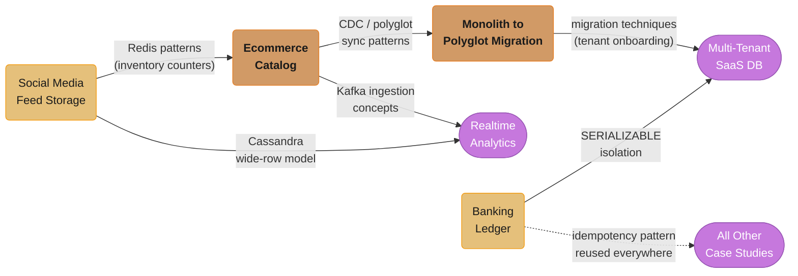

# Database Engineering — Case Studies

Six end-to-end database design case studies, each covering a real-world scenario with production-grade architecture decisions, schema design, implementation details, tradeoffs, and interview discussion points.

---

## Quick Start

If you only have time for three case studies, read these first:

| File | Why |
|------|-----|
| [Banking Ledger](design_banking_ledger/) | The hardest database problem: SERIALIZABLE isolation, double-entry bookkeeping, RPO=0, and immutable audit trail. Patterns here apply to any financial system. |
| [Monolith to Polyglot Migration](design_monolith_to_polyglot_migration/) | Teaches the CDC (Debezium) + dual-write migration pattern that every senior engineer needs for zero-downtime database migrations. |
| [Multi-Tenant SaaS Database](design_multitenant_saas_database/) | Covers all three isolation tiers (row/schema/database), RLS, and connection pooling at SaaS scale — comes up in nearly every platform-engineering interview. |

---

## Full Learning Path

Grouped by primary engineering concern:

### ACID, Consistency & Transactions

| Case Study | Primary Concern | What It Teaches |
|------------|----------------|----------------|
| [Banking Ledger](design_banking_ledger/) | SERIALIZABLE isolation, double-entry, idempotency | How to implement a correct double-entry ledger: SERIALIZABLE vs REPEATABLE READ tradeoffs at scale; advisory locks for account-level serialization; immutable event log as the source of truth; RPO=0 replication setup with Patroni. |

### Multi-Tenancy & Isolation

| Case Study | Primary Concern | What It Teaches |
|------------|----------------|----------------|
| [Multi-Tenant SaaS Database](design_multitenant_saas_database/) | Row-level security, schema isolation, connection pooling | When to choose row-per-tenant vs schema-per-tenant vs database-per-tenant; PostgreSQL RLS policy design with `SET app.tenant_id`; PgBouncer session pooling for schema-per-tenant; connection storm prevention in K8s. |

### Polyglot Persistence & Read Scalability

| Case Study | Primary Concern | What It Teaches |
|------------|----------------|----------------|
| [E-Commerce Catalog](design_ecommerce_catalog/) | Polyglot: OLTP + search + analytics + cache | How to serve 50M SKUs with OLTP writes, full-text search, faceted filtering, and sub-millisecond inventory reads: CDC sync from PostgreSQL to Elasticsearch; Redis counters for inventory; ClickHouse for analytics aggregations. |
| [Social Media Feed Storage](design_social_media_feed_storage/) | Cassandra wide-rows, fan-out, Redis leaderboards | Fan-out-on-write vs fan-out-on-read at 500M users; Cassandra TWCS for time-ordered feeds; Redis ZADD for trending posts with HyperLogLog for unique count; celebrity problem mitigation. |

### Analytics & Real-Time Aggregations

| Case Study | Primary Concern | What It Teaches |
|------------|----------------|----------------|
| [Real-Time Analytics Platform](design_realtime_analytics_platform/) | ClickHouse columnar storage, Kafka ingestion, materialized views | Columnar storage vs row storage for 1B events/day; ReplacingMergeTree for deduplication; materialized views for pre-aggregated dashboards; tenant isolation in shared ClickHouse cluster; HyperLogLog for cardinality. |

### Migration & Schema Evolution

| Case Study | Primary Concern | What It Teaches |
|------------|----------------|----------------|
| [Monolith to Polyglot Migration](design_monolith_to_polyglot_migration/) | CDC, dual-write, zero-downtime migration | How to migrate 5 TB MySQL monolith without downtime: Debezium CDC for change capture; dual-write phase with shadow reads for validation; strangler fig at the database layer; cutover checklist with rollback plan. |

---

## Cross-Cutting / Shared Primitives

No `cross_cutting/` directory here — the shared primitives live as deep-dive modules in the section itself. The same primitives recur across these case studies; read the deep dive once, then recognize it everywhere:

| Primitive | Used By | Deep Dive | Phase |
|---|---|---|---|
| SERIALIZABLE isolation + advisory locks | Banking Ledger | `../concurrency_control_and_locking/README.md` | 1 — Foundations |
| Idempotency (request + consumer) | all six | `../distributed_transactions/README.md` | 5 — Distributed |
| Immutable event log / double-entry | Banking Ledger | `../schema_design_and_normalization/README.md` | 2 — Relational |
| RLS + `SET app.tenant_id` | Multi-Tenant SaaS | `../database_security_and_compliance/README.md` | 6 — Production Ops |
| PgBouncer pooling at scale | Multi-Tenant SaaS | `../connection_pool_management/README.md` | 6 |
| CDC (Debezium) + dual-write validation | Migration, E-Commerce Catalog | `../polyglot_persistence_patterns/README.md` | 7 — Architecture |
| Redis counters / leaderboards / HyperLogLog | E-Commerce, Feed Storage, Analytics | `../key_value_stores/README.md` | 3 — NoSQL |
| Cassandra wide rows + TWCS | Feed Storage | `../wide_column_databases/README.md` | 3 |
| Columnar storage + materialized views | Real-Time Analytics | `../time_series_databases/README.md`, `../storage_engines_internals/README.md` | 3 / 1 |
| Replication + RPO=0 failover (Patroni) | Banking Ledger, Migration | `../replication_and_high_availability/README.md` | 5 |

---

## Dependency Map

*Arrows point from the case study that originates a pattern to the one that reuses it. The dotted edge marks the banking ledger's idempotency pattern threading through every other case study, while the solid chain from ecommerce_catalog through monolith_to_polyglot_migration into multitenant_saas_database shows how CDC and migration techniques compound.*

---

## Interview Prep Shortcuts

| "Design X" Interview Question | Best Case Study |
|-------------------------------|----------------|
| Design a payment ledger / financial accounting system | [design_banking_ledger](design_banking_ledger/) |
| Design a multi-tenant SaaS database | [design_multitenant_saas_database](design_multitenant_saas_database/) |
| Design a product catalog for e-commerce | [design_ecommerce_catalog](design_ecommerce_catalog/) |
| Design a social media feed storage layer | [design_social_media_feed_storage](design_social_media_feed_storage/) |
| Design a real-time analytics dashboard | [design_realtime_analytics_platform](design_realtime_analytics_platform/) |
| Design a zero-downtime database migration | [design_monolith_to_polyglot_migration](design_monolith_to_polyglot_migration/) |
| Design a polyglot persistence architecture | [design_ecommerce_catalog](design_ecommerce_catalog/) + [design_monolith_to_polyglot_migration](design_monolith_to_polyglot_migration/) |
| Design a CDC pipeline | [design_monolith_to_polyglot_migration](design_monolith_to_polyglot_migration/) |
| Design a leaderboard / trending system | [design_social_media_feed_storage](design_social_media_feed_storage/) |
| Design a time-series / metrics storage system | [design_realtime_analytics_platform](design_realtime_analytics_platform/) |

---

## Back to Database Section

[Database Engineering Master Index](../README.md)
