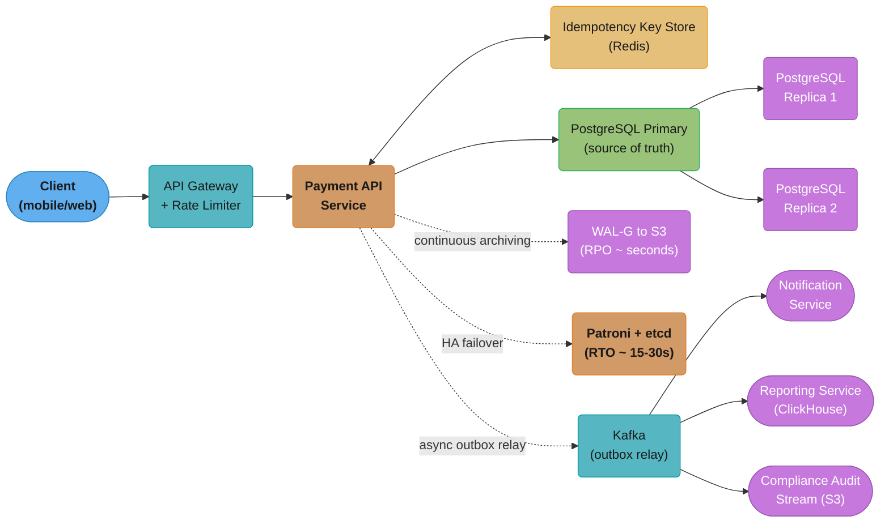
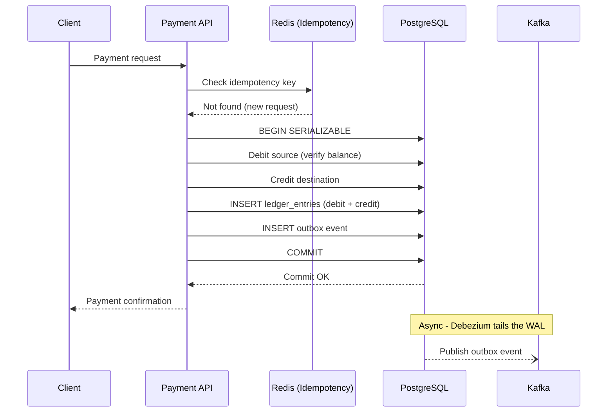
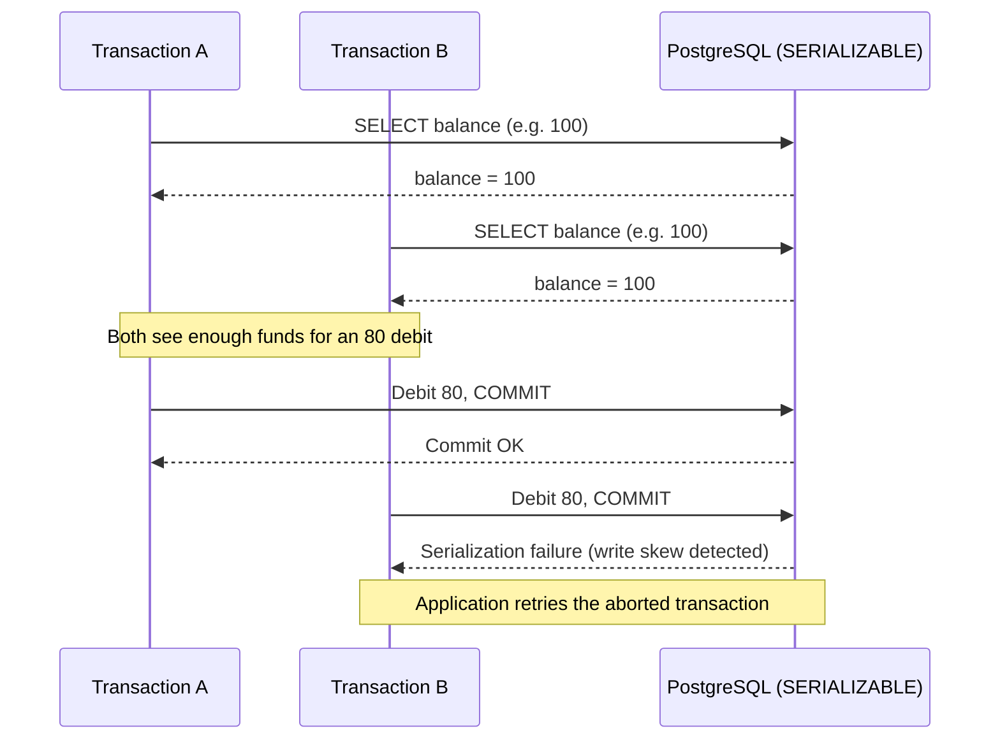
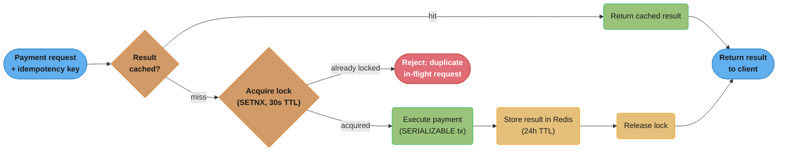

# Case Study: Design a Banking Ledger

## Problem Statement

Design a double-entry accounting ledger system for a global payments company processing 10,000 transactions per second with the following requirements:

- Immutable audit trail of all financial movements (regulatory requirement)
- ACID guarantees: no money created or destroyed; every credit has a corresponding debit
- Idempotent payment API: retries must not cause double charges
- Balance queries must be consistent with completed transactions
- Point-in-time balance queries (what was account balance at timestamp T?)
- Multi-currency support
- Sub-100ms P99 latency for payment processing
- 5 years of transaction history retained online
- RPO = 0 (no committed transaction can ever be lost)
- RTO = 30 seconds (HA failover, not DR restore)

---

## Architecture Overview



*System topology: the synchronous request path (solid arrows) runs Client to Payment API to the PostgreSQL primary and the Redis idempotency store; WAL archiving, Patroni/etcd failover, and the Kafka outbox relay all sit off the hot path (dotted arrows) so they never add latency to a payment.*

**Request flow (payment):**



*The double-entry write and the idempotency check both happen inside one SERIALIZABLE transaction before the client gets a response; the outbox event reaches Kafka afterward and asynchronously, so a slow or down Kafka never blocks a payment.*

---

## Key Design Decisions

### 1. Double-Entry Bookkeeping Schema

```sql
-- Accounts table
CREATE TABLE accounts (
    id             UUID PRIMARY KEY DEFAULT gen_random_uuid(),
    account_number VARCHAR(20) UNIQUE NOT NULL,
    currency       CHAR(3) NOT NULL,
    created_at     TIMESTAMPTZ DEFAULT now(),
    status         VARCHAR(20) DEFAULT 'ACTIVE'
    -- NOTE: No balance column — balance is derived from ledger_entries
    -- This prevents balance/ledger divergence
);

-- Ledger entries: the immutable heart of the system
CREATE TABLE ledger_entries (
    id              UUID PRIMARY KEY DEFAULT gen_random_uuid(),
    transaction_id  UUID NOT NULL,             -- groups debit + credit entries
    account_id      UUID NOT NULL REFERENCES accounts(id),
    amount          DECIMAL(19, 4) NOT NULL,   -- positive = credit, negative = debit
    currency        CHAR(3) NOT NULL,
    entry_type      VARCHAR(10) NOT NULL CHECK (entry_type IN ('DEBIT', 'CREDIT')),
    description     TEXT,
    created_at      TIMESTAMPTZ DEFAULT now() NOT NULL,
    -- Immutable: no UPDATE or DELETE allowed on this table
    CONSTRAINT positive_credit CHECK (entry_type = 'DEBIT' OR amount > 0),
    CONSTRAINT negative_debit  CHECK (entry_type = 'CREDIT' OR amount < 0)
) PARTITION BY RANGE (created_at);

-- Partitioned by month for efficient archiving
CREATE TABLE ledger_entries_2025_01 PARTITION OF ledger_entries
    FOR VALUES FROM ('2025-01-01') TO ('2025-02-01');
-- pg_partman manages monthly partition creation automatically

-- Transactions: groups the debit and credit ledger_entries
CREATE TABLE transactions (
    id              UUID PRIMARY KEY DEFAULT gen_random_uuid(),
    idempotency_key UUID UNIQUE NOT NULL,      -- client-provided, prevents double processing
    source_account  UUID NOT NULL REFERENCES accounts(id),
    dest_account    UUID NOT NULL REFERENCES accounts(id),
    amount          DECIMAL(19, 4) NOT NULL CHECK (amount > 0),
    currency        CHAR(3) NOT NULL,
    status          VARCHAR(20) DEFAULT 'COMPLETED',
    created_at      TIMESTAMPTZ DEFAULT now() NOT NULL,
    metadata        JSONB
);

-- Outbox for reliable event publishing
CREATE TABLE outbox (
    id              UUID PRIMARY KEY DEFAULT gen_random_uuid(),
    aggregate_type  VARCHAR(50) NOT NULL,      -- 'Transaction'
    aggregate_id    UUID NOT NULL,
    event_type      VARCHAR(50) NOT NULL,      -- 'TransactionCompleted'
    payload         JSONB NOT NULL,
    status          VARCHAR(20) DEFAULT 'PENDING',
    created_at      TIMESTAMPTZ DEFAULT now()
);

-- Indexes
CREATE INDEX idx_ledger_account_date ON ledger_entries (account_id, created_at DESC);
CREATE INDEX idx_transactions_idempotency ON transactions (idempotency_key);
CREATE INDEX idx_transactions_source ON transactions (source_account, created_at DESC);
CREATE UNIQUE INDEX idx_outbox_pending ON outbox (id) WHERE status = 'PENDING';
```

### 2. SERIALIZABLE Isolation for Payment Transactions

```java
@Service
public class PaymentService {

    @Transactional(isolation = Isolation.SERIALIZABLE)
    public Transaction processPayment(PaymentRequest req) {
        // Step 1: Idempotency check (within same SERIALIZABLE transaction)
        Optional<Transaction> existing = txRepo.findByIdempotencyKey(req.idempotencyKey());
        if (existing.isPresent()) {
            return existing.get();  // Return previous result, do not process again
        }

        // Step 2: Lock source account and verify balance
        // SELECT FOR UPDATE prevents concurrent withdrawals from same account
        Account source = accountRepo.findByIdForUpdate(req.sourceAccountId());
        BigDecimal balance = ledgerRepo.calculateBalance(req.sourceAccountId(), req.currency());

        if (balance.compareTo(req.amount()) < 0) {
            throw new InsufficientFundsException("Balance: " + balance + " < " + req.amount());
        }

        // Step 3: Create transaction record
        Transaction tx = Transaction.builder()
            .idempotencyKey(req.idempotencyKey())
            .sourceAccount(req.sourceAccountId())
            .destAccount(req.destAccountId())
            .amount(req.amount())
            .currency(req.currency())
            .build();
        tx = txRepo.save(tx);

        // Step 4: Double-entry ledger entries
        // Debit source account (money leaves)
        ledgerRepo.save(LedgerEntry.debit(tx.getId(), req.sourceAccountId(),
            req.amount().negate(), req.currency()));

        // Credit destination account (money arrives)
        ledgerRepo.save(LedgerEntry.credit(tx.getId(), req.destAccountId(),
            req.amount(), req.currency()));

        // Step 5: Verify double-entry integrity
        // Sum of all entries for this transaction must be zero
        BigDecimal sum = ledgerRepo.sumByTransactionId(tx.getId());
        if (sum.compareTo(BigDecimal.ZERO) != 0) {
            throw new LedgerIntegrityException("Double-entry sum != 0: " + sum);
        }

        // Step 6: Outbox event for downstream consumers
        outboxRepo.save(OutboxEvent.transactionCompleted(tx));

        return tx;
    }
}
```

**Why SERIALIZABLE — the write-skew race it blocks:**



*Under READ COMMITTED, both transactions would read the same starting balance and both debits would commit, driving the account negative. SERIALIZABLE detects that A and B read and wrote the same row and aborts B with a serialization failure, so the application-level retry is the only path forward — the 10-20% throughput cost from the first Q&A below buys this guarantee.*

### 3. Balance Calculation (Derived from Ledger)

```sql
-- Current balance (derived, not stored)
CREATE OR REPLACE FUNCTION get_balance(p_account_id UUID, p_currency CHAR(3))
RETURNS DECIMAL(19, 4) AS $$
    SELECT COALESCE(SUM(amount), 0)
    FROM ledger_entries
    WHERE account_id = p_account_id
      AND currency = p_currency;
$$ LANGUAGE SQL STABLE;

-- Point-in-time balance (as of a specific timestamp)
CREATE OR REPLACE FUNCTION get_balance_at(
    p_account_id UUID,
    p_currency CHAR(3),
    p_at TIMESTAMPTZ
) RETURNS DECIMAL(19, 4) AS $$
    SELECT COALESCE(SUM(amount), 0)
    FROM ledger_entries
    WHERE account_id = p_account_id
      AND currency = p_currency
      AND created_at <= p_at;
$$ LANGUAGE SQL STABLE;

-- Example: Account balance on 2025-06-15 at 14:00 UTC
SELECT get_balance_at('account-uuid-here', 'USD', '2025-06-15 14:00:00+00');
```

**Performance consideration**: Summing all entries for a large account (millions of transactions) is slow. Two optimization approaches:

```sql
-- Approach 1: Materialized balance checkpoints (daily snapshots)
CREATE TABLE balance_checkpoints (
    account_id  UUID NOT NULL,
    currency    CHAR(3) NOT NULL,
    balance     DECIMAL(19, 4) NOT NULL,
    as_of_date  DATE NOT NULL,
    created_at  TIMESTAMPTZ DEFAULT now(),
    PRIMARY KEY (account_id, currency, as_of_date)
);

-- Current balance = last checkpoint balance + entries since checkpoint
CREATE OR REPLACE FUNCTION get_balance_optimized(p_account_id UUID, p_currency CHAR(3))
RETURNS DECIMAL(19, 4) AS $$
DECLARE
    v_checkpoint_balance DECIMAL(19,4) := 0;
    v_checkpoint_date    DATE := '1970-01-01';
    v_delta              DECIMAL(19,4) := 0;
BEGIN
    SELECT balance, as_of_date
    INTO v_checkpoint_balance, v_checkpoint_date
    FROM balance_checkpoints
    WHERE account_id = p_account_id AND currency = p_currency
    ORDER BY as_of_date DESC LIMIT 1;

    SELECT COALESCE(SUM(amount), 0)
    INTO v_delta
    FROM ledger_entries
    WHERE account_id = p_account_id
      AND currency = p_currency
      AND created_at > v_checkpoint_date::TIMESTAMPTZ;

    RETURN v_checkpoint_balance + v_delta;
END;
$$ LANGUAGE plpgsql STABLE;
```

### 4. Row-Level Security for Account Isolation

```sql
-- Multi-tenant banking: each user/org can only see their own accounts
ALTER TABLE accounts ENABLE ROW LEVEL SECURITY;
ALTER TABLE ledger_entries ENABLE ROW LEVEL SECURITY;

CREATE POLICY account_owner ON accounts
    USING (id = ANY(current_setting('app.authorized_accounts')::UUID[]));

CREATE POLICY ledger_owner ON ledger_entries
    USING (account_id = ANY(current_setting('app.authorized_accounts')::UUID[]));

-- Application sets the user's authorized accounts before any query:
-- SET LOCAL app.authorized_accounts = '{uuid1, uuid2}';
```

---

## Implementation

### CQRS: Separate Balance Read Model

```java
// Write model: SERIALIZABLE transaction in PostgreSQL
@Transactional(isolation = Isolation.SERIALIZABLE)
public Transaction processPayment(PaymentRequest req) { /* ... */ }

// Read model: balance queries use read replica + Redis cache
@Service
public class BalanceQueryService {

    public AccountBalance getBalance(UUID accountId, String currency) {
        String cacheKey = "balance:" + accountId + ":" + currency;

        // L1: Redis cache (5-second TTL — balance changes frequently)
        BigDecimal cached = redis.opsForValue().get(cacheKey);
        if (cached != null) {
            return AccountBalance.of(accountId, currency, cached);
        }

        // L2: Read replica (slightly stale — eventually consistent)
        // Route balance reads to replica to offload primary
        BigDecimal balance = readReplicaLedgerRepo.calculateBalance(accountId, currency);
        redis.opsForValue().set(cacheKey, balance, Duration.ofSeconds(5));

        return AccountBalance.of(accountId, currency, balance);
    }

    // Invalidate cache after a successful payment
    public void invalidateBalance(UUID accountId, String currency) {
        redis.delete("balance:" + accountId + ":" + currency);
    }
}
```

### Idempotency Key Lifecycle

```java
@Component
public class IdempotencyService {

    // Check before processing; store result after processing
    public <T> T executeIdempotent(UUID idempotencyKey, Supplier<T> operation) {
        String lockKey = "idempotency:lock:" + idempotencyKey;
        String resultKey = "idempotency:result:" + idempotencyKey;

        // Check if already processed (Redis fast path)
        String cachedResult = redis.opsForValue().get(resultKey);
        if (cachedResult != null) {
            return deserialize(cachedResult);
        }

        // Acquire distributed lock to prevent concurrent duplicate processing
        boolean locked = redis.opsForValue()
            .setIfAbsent(lockKey, "1", Duration.ofSeconds(30));
        if (!locked) {
            throw new ConcurrentRequestException("Duplicate in-flight request");
        }

        try {
            T result = operation.get();  // Execute the actual payment
            // Store result in Redis (24-hour TTL — matches client retry window)
            redis.opsForValue().set(resultKey, serialize(result), Duration.ofHours(24));
            return result;
        } finally {
            redis.delete(lockKey);
        }
    }
}
```

**Idempotent execution — the decision tree behind `executeIdempotent`:**



*The Redis result cache is the fast path (top); the distributed lock only guards the narrow window where two retries race before either has written a cached result — losing that race gets rejected outright rather than double-processing the payment.*

---

## Tradeoffs and Alternatives

| Decision | Choice | Alternative | Reason |
|----------|--------|-------------|--------|
| Isolation | SERIALIZABLE | READ COMMITTED | Prevents write skew (phantom double-spend) |
| Balance storage | Derived (sum entries) | Stored column | Stored column can diverge from entries; derived is always correct |
| Partitioning | Monthly by created_at | Annual | Easier archival; faster partition drop for compliance |
| Idempotency | DB idempotency_key + Redis | DB only | Redis fast path avoids DB round-trip for duplicate detection |
| Event delivery | Outbox + Debezium | Direct Kafka write | Outbox guarantees event delivery even if Kafka is down at commit time |
| Replication | Synchronous (RPO=0) | Asynchronous | Financial data cannot tolerate data loss; latency tradeoff accepted |

---

## Interview Discussion Points

**Q: Why SERIALIZABLE isolation instead of READ COMMITTED for payment processing?**
SERIALIZABLE prevents write skew — the scenario where two concurrent transactions each read a balance, both see sufficient funds, and both debit, resulting in a negative balance. READ COMMITTED allows write skew because both transactions can read the same committed value before either commits their debit. SERIALIZABLE detects conflicting patterns (both transactions read and write the same balance) and aborts one with a serialization failure error. The application retries the aborted transaction. The overhead of SERIALIZABLE (typically 10–20% throughput reduction) is justified for financial correctness.

**Q: Why is balance derived from ledger entries instead of stored as a column?**
A stored balance column creates a risk of ledger/balance divergence — if a bug or direct DB manipulation changes the balance column without corresponding ledger entries, the account has incorrect money. Deriving balance by summing all ledger entries means the balance is always mathematically consistent with the transaction history. Balance checkpoints (daily snapshots) optimize query performance for accounts with millions of entries. The double-entry constraint (sum of entries per transaction = 0) provides a further integrity check.

**Q: How does the idempotency key prevent double-charging on network retries?**
The client generates a UUID before initiating a payment. If the network fails after the server processes the payment but before the client receives the response, the client retries with the same UUID. The server checks the `idempotency_key` UNIQUE constraint on the transactions table. If a row already exists with that key, the server returns the stored result without executing the payment again. The idempotency check happens within the SERIALIZABLE transaction, so even concurrent duplicate requests are serialized correctly (one proceeds; the other finds the committed result).

**Q: How do you achieve RPO=0 without degrading write throughput significantly?**
Use synchronous replication to exactly one standby replica within the same datacenter: `synchronous_standby_names = 'FIRST 1 (replica1)'`. The primary waits for replica1 to flush the WAL before returning commit success. On LAN, this adds 1–2ms per transaction — acceptable for banking (< 100ms P99 target). For cross-datacenter standby (DR), use asynchronous replication — this does not prevent local-datacenter data loss but does prevent cross-region write latency of 50–200ms. Additionally, WAL archiving to S3 (WAL-G) provides a second durability layer.

**Q: How do you handle the case where a ledger grows to billions of entries?**
Monthly range partitioning on `created_at` allows efficient partition pruning for date-range queries and fast partition detachment for archiving old data. After the regulatory retention period (5 years), old partitions are detached and moved to cold storage (S3 as Parquet via COPY TO, then the partition is dropped). Balance queries are optimized by daily checkpoint materialization — instead of summing 5 years of entries, sum the last checkpoint plus the current month's entries. The checkpoint table is small (one row per account per day) and can be fully cached in memory.
