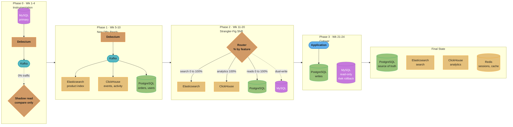
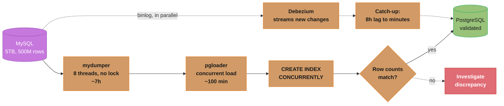
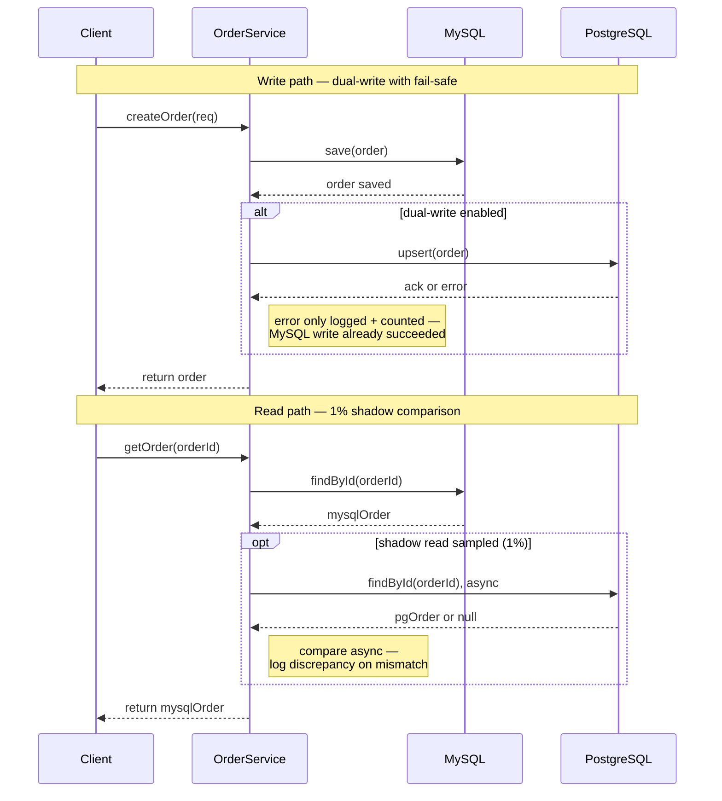
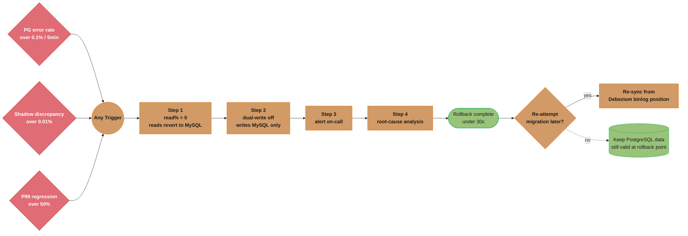

# Case Study: Monolith to Polyglot Migration

## Problem Statement

Migrate a 5TB MySQL monolith to purpose-built databases without downtime:

- Current state: a 5-year-old e-commerce platform with a 5TB MySQL 5.7 database
- 500M rows in the orders table; 2B rows in the events/activity table
- Problems:
  - Database CPU at 85% during peak; P99 query latency 2+ seconds
  - Full-text product search using LIKE queries (catastrophically slow)
  - Analytics queries (daily reports) saturate the primary during business hours
  - 90% of reads hit a 1TB orders + events dataset; 10% hit everything else
- Migration targets:
  - Product search → Elasticsearch
  - Orders/user data → PostgreSQL (better ACID, JSON support, extensions)
  - Events/activity log → ClickHouse (columnar, 100x compression for time-series)
  - Sessions/cache → Redis (already partially done)
- Constraints:
  - Zero planned downtime (< 5 minutes total unavailability acceptable)
  - Rollback capability: must be able to revert to MySQL for 4 weeks post-migration
  - Data integrity: not a single order can be lost
  - 6-month timeline for full migration

---

## Architecture Overview



*Four phases over 24 weeks fan CDC out from MySQL to three purpose-built stores while the strangler-fig router shifts traffic percentage by percentage; MySQL ends as a 4-week, read-only rollback safety net before decommission.*

---

## Key Design Decisions

### 1. CDC Setup: Debezium on MySQL

```yaml
# Debezium MySQL connector configuration
{
  "name": "mysql-ecommerce-connector",
  "config": {
    "connector.class": "io.debezium.connector.mysql.MySqlConnector",
    "database.hostname": "mysql-primary",
    "database.port": "3306",
    "database.user": "debezium",
    "database.password": "${DEBEZIUM_PASSWORD}",
    "database.server.name": "ecommerce",
    "database.include.list": "ecommerce_db",
    "table.include.list": "ecommerce_db.orders,ecommerce_db.users,ecommerce_db.products,ecommerce_db.events",

    "snapshot.mode": "initial",  -- Take initial snapshot, then stream binlog
    "snapshot.locking.mode": "minimal",  -- Minimal lock duration during snapshot
    "include.schema.changes": "true",

    "transforms": "route",
    "transforms.route.type": "org.apache.kafka.connect.transforms.ReplaceField$Value",

    "database.history.kafka.bootstrap.servers": "kafka:9092",
    "database.history.kafka.topic": "schema-changes.ecommerce"
  }
}
```

```
MySQL requirements for Debezium CDC:
  log_bin = ON              -- Binary logging enabled
  binlog_format = ROW       -- Row-based (not statement-based) binary log
  binlog_row_image = FULL   -- Full row image (before + after values)
  expire_logs_days = 7      -- Retain binlog for 7 days (replay window)

Debezium binlog position tracking:
  Debezium stores its position in Kafka (committed offset)
  On restart: resumes from last committed Kafka offset → reads binlog from that position
  If Kafka is unavailable: Debezium buffers internally until Kafka reconnects
```

### 2. Initial Data Migration

```bash
# Phase 1a: Historical data migration (run in parallel with Debezium streaming)

# Orders table: 500M rows (largest concern)
# Strategy: full dump to PostgreSQL in batches to avoid lock/memory issues

# 1. pg_dump is not applicable here (source is MySQL)
# Use mydumper (parallel MySQL dump) + pgloader (fast PostgreSQL load)

# Step 1: Dump from MySQL to CSV (mydumper — parallel, no lock on InnoDB)
mydumper \
    --host=mysql-primary \
    --user=backup_user \
    --password=... \
    --database=ecommerce_db \
    --tables-list=orders,order_items,users,products \
    --outputdir=/backups/ecommerce/ \
    --rows=500000 \          # 500K rows per file (parallel dump)
    --threads=8 \            # 8 parallel dump threads
    --compress \             # Compress output files
    --verbose 3

# Duration estimate: 5TB / 200MB/s dump speed = ~7 hours

# Step 2: Load into PostgreSQL (pgloader — concurrent load)
pgloader \
    --type csv \
    /backups/ecommerce/orders*.csv \
    postgresql://postgres@pg-primary:5432/ecommerce

# Duration estimate: 500M rows at 5M rows/minute = ~100 minutes

# Step 3: Build indexes after load (faster than building during load)
psql -c "CREATE INDEX CONCURRENTLY idx_orders_user_date ON orders (user_id, created_at DESC)"
psql -c "CREATE INDEX CONCURRENTLY idx_orders_status ON orders (status, created_at DESC)"
# CONCURRENTLY: builds index without blocking reads/writes

# Step 4: Verify row counts
mysql -e "SELECT COUNT(*) FROM orders"  -- e.g., 500,123,456
psql -c "SELECT COUNT(*) FROM orders"   -- must match ± Debezium lag
```



*The historical dump/load (~7h + ~100min) runs in parallel with live Debezium streaming, so PostgreSQL only has to close an 8-hour delta — a few minutes of catch-up — instead of replaying the full 5TB history.*

### 3. Dual-Write Period (Write to Both MySQL and PostgreSQL)

```java
@Service
public class OrderService {

    @Autowired
    private MigrationConfig migrationConfig;

    public Order createOrder(CreateOrderRequest req) {
        // Always write to MySQL (source of truth during dual-write period)
        Order order = mysqlOrderRepo.save(new Order(req));

        // Conditionally write to PostgreSQL (feature flag controlled)
        if (migrationConfig.isDualWriteEnabled()) {
            try {
                postgresOrderRepo.save(order);  // with idempotency: upsert by order_id
            } catch (Exception e) {
                // Log but DO NOT fail the request
                // MySQL is still the source of truth; PG failure is non-critical
                log.error("Dual-write to PostgreSQL failed for order {}", order.getId(), e);
                dualWriteFailureCounter.increment();
            }
        }

        return order;
    }

    // Shadow reads: compare MySQL vs PostgreSQL responses
    public Order getOrder(UUID orderId) {
        Order mysqlOrder = mysqlOrderRepo.findById(orderId).orElseThrow();

        if (migrationConfig.isShadowReadEnabled() && random.nextDouble() < 0.01) {
            // 1% of reads: compare with PostgreSQL (async, non-blocking)
            CompletableFuture.runAsync(() -> {
                Order pgOrder = postgresOrderRepo.findById(orderId).orElse(null);
                if (pgOrder == null || !pgOrder.equals(mysqlOrder)) {
                    shadowReadDiscrepancyCounter.increment();
                    log.warn("Shadow read discrepancy for order {}", orderId);
                }
            });
        }

        return mysqlOrder;
    }
}
```



*MySQL stays authoritative on both paths: a PostgreSQL write failure is logged and counted but never fails the request, and the 1% shadow read compares asynchronously without blocking the response to the client.*

### 4. Traffic Cutover (Percentage-Based)

```java
@Component
public class MigrationRouter {

    // Feature flag from LaunchDarkly/config
    // Gradually increase: 0% → 1% → 5% → 10% → 25% → 50% → 100%
    @Value("${migration.pg.read.percentage:0}")
    private int pgReadPercentage;

    public Order getOrder(UUID orderId) {
        if (shouldUsePg()) {
            try {
                return postgresOrderRepo.findById(orderId).orElseThrow();
            } catch (Exception e) {
                // Automatic fallback to MySQL on any PostgreSQL error
                log.error("PostgreSQL read failed, falling back to MySQL", e);
                return mysqlOrderRepo.findById(orderId).orElseThrow();
            }
        }
        return mysqlOrderRepo.findById(orderId).orElseThrow();
    }

    private boolean shouldUsePg() {
        return ThreadLocalRandom.current().nextInt(100) < pgReadPercentage;
    }
}
```

### 5. Validation and Checksum Queries

```sql
-- Row count parity check (run every 15 minutes during migration)
-- MySQL:
SELECT COUNT(*) AS order_count,
       MAX(created_at) AS latest_order,
       SUM(total_amount) AS total_revenue
FROM orders
WHERE created_at >= '2025-01-01';

-- PostgreSQL (same query):
SELECT COUNT(*) AS order_count,
       MAX(created_at) AS latest_order,
       SUM(total_amount) AS total_revenue
FROM orders
WHERE created_at >= '2025-01-01';

-- Alert if counts differ by > 0.01% (Debezium lag is expected but bounded)

-- Sample record checksum (100K random orders):
-- MySQL:
SELECT MD5(GROUP_CONCAT(
    CONCAT(id, user_id, total_amount, status, created_at) ORDER BY id
)) AS checksum
FROM (SELECT id, user_id, total_amount, status, created_at FROM orders
      WHERE id IN (SELECT id FROM orders ORDER BY RAND() LIMIT 100000)) t;

-- PostgreSQL equivalent:
SELECT MD5(STRING_AGG(
    CONCAT(id::TEXT, user_id::TEXT, total_amount::TEXT, status, created_at::TEXT),
    '' ORDER BY id
)) AS checksum
FROM (SELECT id, user_id, total_amount, status, created_at FROM orders
      TABLESAMPLE BERNOULLI(0.02)) t;  -- ~0.02% sample of 500M rows ≈ 100K rows

-- Business invariant checks:
-- Every order must have at least one order_item:
SELECT COUNT(*) FROM orders o
WHERE NOT EXISTS (SELECT 1 FROM order_items oi WHERE oi.order_id = o.id);
-- Expected: 0 (alert if > 0)
```

### 6. Rollback Triggers and Procedure



*Any one of the three automated triggers fires the same four-step rollback, completing in under 30 seconds via Redis-propagated feature flags; PostgreSQL data is never deleted, only re-synced from the Debezium binlog position if migration resumes.*

---

## Implementation: Schema Transformation (MySQL → PostgreSQL)

```sql
-- MySQL schema: orders
CREATE TABLE orders (
    id          BIGINT AUTO_INCREMENT PRIMARY KEY,  -- Must change to UUID
    user_id     BIGINT NOT NULL,
    status      ENUM('PENDING','PAID','SHIPPED','DELIVERED','CANCELLED'),
    total       DECIMAL(10,2),
    metadata    JSON,                                -- MySQL JSON
    created_at  DATETIME                            -- No timezone
);

-- PostgreSQL schema: transformed
CREATE TABLE orders (
    id          UUID PRIMARY KEY DEFAULT gen_random_uuid(),
    legacy_id   BIGINT UNIQUE,                       -- Keep MySQL ID for foreign key resolution
    user_id     UUID NOT NULL,
    status      VARCHAR(20) CHECK (status IN ('PENDING','PAID','SHIPPED','DELIVERED','CANCELLED')),
    total       DECIMAL(12,2),
    metadata    JSONB,                               -- PostgreSQL JSONB (better indexing)
    created_at  TIMESTAMPTZ DEFAULT now()            -- With timezone
);

-- Migration challenge: MySQL AUTO_INCREMENT IDs → UUID
-- Solution: pre-generate UUID mapping table
CREATE TABLE id_mapping (
    entity_type  VARCHAR(50) NOT NULL,
    mysql_id     BIGINT NOT NULL,
    pg_uuid      UUID NOT NULL DEFAULT gen_random_uuid(),
    PRIMARY KEY (entity_type, mysql_id)
);

-- Populate during initial load:
INSERT INTO id_mapping (entity_type, mysql_id)
SELECT 'orders', id FROM mysql.orders;

-- Use mapping to transform IDs during pgloader load
-- pgloader transformation function handles ID mapping lookup
```

---

## Tradeoffs and Alternatives

| Decision | Choice | Alternative | Reason |
|----------|--------|-------------|--------|
| CDC tool | Debezium | Manual dual-write | Debezium captures all changes atomically, including those from batch jobs; manual dual-write misses non-application writes |
| Migration strategy | Strangler fig | Big-bang | Big-bang requires planned downtime (hours) for 5TB; strangler fig is zero-downtime |
| Rollback mechanism | Feature flags | DNS switching | Feature flags provide < 30s rollback; DNS TTL takes 5+ minutes |
| Data validation | Checksums + counts | Trust Debezium | Debezium has occasional known edge cases; checksums catch any discrepancy |
| Primary key migration | MySQL ID preserved as legacy_id | Generate new UUIDs only | Foreign key resolution during migration requires original IDs; legacy_id bridges both systems |
| Dual-write failure | Log and continue | Fail the request | MySQL is source of truth; PostgreSQL failure should not impact user experience during migration |

---

## Interview Discussion Points

**Q: How do you handle the initial data migration for 500M rows without downtime?**
The initial migration runs offline (no application downtime required): (1) Use `mydumper` for parallel MySQL dump (8 threads, no table locks on InnoDB). Duration: ~7 hours for 5TB. (2) Load into PostgreSQL with `pgloader` (concurrent, 5M rows/minute). Duration: ~100 minutes for 500M orders. (3) During the dump and load, Debezium is simultaneously streaming new changes from the MySQL binlog. By the time the load completes, PostgreSQL may be 8 hours behind MySQL. (4) Debezium catches up the remaining 8 hours of changes (time-series: delta is proportional to new writes, not historical data). This catch-up takes minutes, not hours. Application traffic still hits MySQL; PostgreSQL is a shadow database until validated.

**Q: What rollback triggers should be set up and how does rollback work?**
Automated rollback triggers: (1) PostgreSQL error rate > 0.1% for 5 consecutive minutes (measured per request). (2) Shadow read discrepancy rate > 0.01% (Prometheus counter on shadow comparison failures). (3) P99 latency regression > 50% vs baseline. Rollback mechanism: feature flags stored in Redis, read on every request with 1-second TTL. Setting `migration.pg.read.percentage = 0` routes all reads back to MySQL within 1 second of Redis propagation. Dual-write is independently controlled — stop dual-write to MySQL or PostgreSQL independently. The rollback procedure is practiced in staging before production cutover, with all engineers on-call during the migration window.

**Q: How do you validate data parity between MySQL and PostgreSQL?**
Multi-level validation: (1) Row count comparison per table every 15 minutes — counts should match within Debezium lag (typically < 100 rows difference). (2) Business invariant queries: "every order has at least one order_item," "sum of payments for each order matches order total" — run against both databases, results must match. (3) Random sample checksums: select 100K random order IDs, compute MD5 of critical fields, compare between MySQL and PostgreSQL. Tolerance: 0% discrepancy (any mismatch investigated before increasing traffic percentage). (4) Shadow reads: 1% of production reads are answered by both MySQL and PostgreSQL; responses are compared. Discrepancy triggers an alert and is logged for investigation.

**Q: What happens to MySQL after the full cutover?**
MySQL is kept in read-only mode for 4 weeks (the rollback window). The application no longer writes to MySQL. MySQL continues receiving CDC from PostgreSQL via a reverse CDC setup (Debezium tailing PostgreSQL WAL → MySQL) during the rollback window. This ensures MySQL stays current in case rollback is needed. After 4 weeks without rollback triggers: (1) Decommission the reverse CDC. (2) Take a final MySQL backup for archival (7-year retention for compliance). (3) Remove MySQL from the application configuration. (4) Terminate the MySQL RDS instances. (5) Close the migration project.
