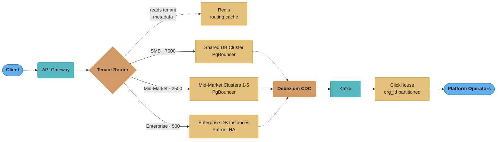
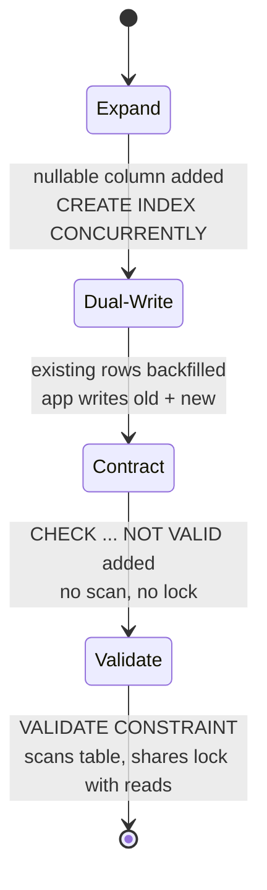
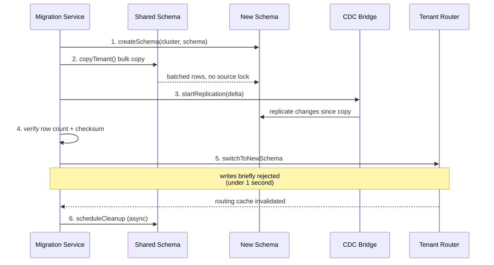

# Case Study: Design a Multi-Tenant SaaS Database

## Problem Statement

Design the database architecture for a B2B SaaS CRM platform:

- 10,000 tenant organizations (customers), ranging from:
  - 7,000 small businesses (SMB): 1–10 users, < 10K records each
  - 2,500 mid-market: 10–500 users, 10K–1M records each
  - 500 enterprise: 500–50,000 users, 1M–100M records per tenant
- Total: ~200 billion records across all tenants
- Requirements:
  - Strict data isolation: tenant A cannot see tenant B's data (compliance, contractual)
  - Enterprise tenants need custom schemas (additional columns, custom entities)
  - Cross-tenant analytics for platform operators (not visible to tenants)
  - Compliance: GDPR, SOC 2 Type II, some tenants require HIPAA
  - Tenant migration: ability to move a tenant to a dedicated database
  - Zero-downtime schema migrations for shared tenants
  - Connection pooling: 10K tenants × N users = massive concurrent connections
- Sub-100ms P99 latency for CRM record CRUD operations

---

## Architecture Overview



Three isolation tiers sit behind one Redis-cached tenant router: 7,000 SMB tenants share one RLS-protected cluster, 2,500 mid-market tenants get schema-per-tenant across 5 clusters, and 500 enterprise tenants get dedicated Patroni-HA instances. A separate Debezium → Kafka → ClickHouse pipeline mirrors writes into an operator-only, org_id-partitioned analytics store that tenants cannot query.

---

## Key Design Decisions

### 1. Shared Schema with RLS (SMB Tier)

```sql
-- Shared schema: all SMB tenants in one PostgreSQL database
-- Every table has tenant_id column; RLS enforces isolation

CREATE TABLE organizations (
    id          UUID PRIMARY KEY DEFAULT gen_random_uuid(),
    name        VARCHAR(200) NOT NULL,
    tier        VARCHAR(20) NOT NULL DEFAULT 'SMB',  -- SMB, MID, ENTERPRISE
    created_at  TIMESTAMPTZ DEFAULT now(),
    db_schema   VARCHAR(100),   -- NULL for SMB (shared), schema name for mid-market
    db_host     VARCHAR(200),   -- NULL for shared, host for enterprise
    db_name     VARCHAR(100)
);

-- CRM contacts (shared schema example)
CREATE TABLE contacts (
    id          UUID PRIMARY KEY DEFAULT gen_random_uuid(),
    org_id      UUID NOT NULL REFERENCES organizations(id),
    first_name  VARCHAR(100),
    last_name   VARCHAR(100),
    email       VARCHAR(200),
    phone       VARCHAR(50),
    custom_data JSONB DEFAULT '{}',  -- tenant-specific custom fields
    created_at  TIMESTAMPTZ DEFAULT now(),
    updated_at  TIMESTAMPTZ DEFAULT now()
) PARTITION BY HASH (org_id);  -- 16 hash partitions for load distribution

-- Hash partitioning ensures each tenant's data is in one partition
-- Queries with WHERE org_id = ? hit only 1 of 16 partitions
CREATE TABLE contacts_p0 PARTITION OF contacts FOR VALUES WITH (MODULUS 16, REMAINDER 0);
-- ... contacts_p1 through contacts_p15

-- Indexes (on each partition, propagated from parent in PG 11+)
CREATE INDEX idx_contacts_org_email ON contacts (org_id, email);
CREATE INDEX idx_contacts_org_name ON contacts (org_id, last_name, first_name);
CREATE INDEX idx_contacts_custom ON contacts USING gin(custom_data)
    WHERE custom_data != '{}';

-- Row-Level Security: application-enforced tenant isolation
ALTER TABLE contacts ENABLE ROW LEVEL SECURITY;
ALTER TABLE contacts FORCE ROW LEVEL SECURITY;

CREATE POLICY tenant_isolation ON contacts
    USING (org_id = current_setting('app.current_org_id')::UUID)
    WITH CHECK (org_id = current_setting('app.current_org_id')::UUID);

-- Role: application user (cannot bypass RLS)
CREATE ROLE app_user WITH LOGIN;
GRANT SELECT, INSERT, UPDATE, DELETE ON contacts TO app_user;
-- app_user does NOT have BYPASSRLS
```

### 2. Schema-per-Tenant (Mid-Market Tier)

```sql
-- Each mid-market tenant gets their own PostgreSQL schema
-- Schemas are on dedicated clusters (5 clusters, ~500 tenants each)

-- Template schema (applied to each new tenant)
CREATE SCHEMA tenant_template;
CREATE TABLE tenant_template.contacts (LIKE public.contacts INCLUDING ALL);
CREATE TABLE tenant_template.deals (LIKE public.deals INCLUDING ALL);
-- ... all CRM tables

-- Provision new mid-market tenant:
CREATE SCHEMA tenant_abc123;
-- Copy template tables to new schema
-- Create tenant-specific views, functions, custom tables

-- Tenant-specific custom columns (mid-market can add fields without JSONB):
ALTER TABLE tenant_abc123.contacts
    ADD COLUMN linkedin_url TEXT,
    ADD COLUMN account_manager_id UUID;

-- No RLS needed: the schema itself is the isolation boundary
-- Application connects to specific schema: SET search_path = tenant_abc123

-- Connection string per tenant:
-- jdbc:postgresql://mid-cluster-1:5432/crm_db?currentSchema=tenant_abc123
```

### 3. Database-per-Tenant (Enterprise Tier)

```sql
-- Each enterprise tenant gets a dedicated PostgreSQL instance (or RDS instance)
-- Full isolation: separate process, separate storage, separate HA
-- Tenant can have custom schema extensions PostgreSQL extensions

-- Enterprise tenant database setup:
-- 1. Provision dedicated RDS or EC2 PostgreSQL
-- 2. Apply base schema via Flyway migrations
-- 3. Register in organizations table
-- 4. Configure in tenant routing table

-- Enterprise can have truly custom schemas:
-- Custom entity types (not just custom fields)
-- Custom PostgreSQL extensions (PostGIS for geo-CRM, pgvector for AI search)
-- Custom indexing strategies
-- Custom retention policies

-- Enterprise backup: dedicated WAL-G instance → dedicated S3 prefix
-- Enterprise HA: dedicated Patroni cluster
-- Enterprise isolation for HIPAA: dedicated database + separate KMS key
```

### 4. Tenant Routing

```java
@Component
public class TenantRoutingService {

    // Cached in Redis (5 minute TTL)
    public DataSource getDataSource(String orgId) {
        String cacheKey = "tenant:routing:" + orgId;
        TenantRoute route = redis.opsForValue().get(cacheKey);

        if (route == null) {
            // Fetch from control plane database (separate PostgreSQL)
            route = controlPlaneRepo.findTenantRoute(orgId);
            redis.opsForValue().set(cacheKey, route, Duration.ofMinutes(5));
        }

        return switch (route.getTier()) {
            case "SMB" -> {
                // Shared cluster — set RLS context after acquiring connection
                DataSource ds = sharedClusterPool.getDataSource();
                yield new TenantContextDataSource(ds, orgId);
            }
            case "MID_MARKET" -> {
                // Dedicated cluster, specific schema
                yield midMarketPools.get(route.getClusterId())
                    .getSchemaDataSource(route.getSchemaName());
            }
            case "ENTERPRISE" -> {
                // Dedicated database instance
                yield enterprisePools.get(orgId).getDataSource();
            }
            default -> throw new IllegalStateException("Unknown tier: " + route.getTier());
        };
    }
}

// Wraps DataSource to set tenant context for RLS on each connection
public class TenantContextDataSource implements DataSource {

    @Override
    public Connection getConnection() throws SQLException {
        Connection conn = delegate.getConnection();
        // Set RLS tenant context
        try (Statement stmt = conn.createStatement()) {
            stmt.execute("SET LOCAL app.current_org_id = '" + orgId + "'");
        }
        return conn;
    }
}
```

### 5. Connection Pool Management Across 10K Tenants

```
Challenge: 10,000 tenants × users per tenant = massive connection demand

SMB tier (shared cluster):
  7,000 tenants share 1 PostgreSQL cluster
  7,000 tenants × 10 users avg = 70,000 potential connections
  PostgreSQL max_connections = 500
  Solution: PgBouncer in transaction mode
    - 70,000 PgBouncer client connections → 100 PostgreSQL server connections
    - Transaction mode: connection released after each transaction
    - RLS context set per transaction: SET LOCAL is transaction-scoped
    - Prepared statements: DISABLED (incompatible with transaction mode + RLS SET LOCAL)

  Configuration:
    max_client_conn = 10000
    server_pool_size = 100  (100 PostgreSQL backend connections total)
    pool_mode = transaction

Mid-market tier (5 clusters):
  2,500 tenants × 500 users avg = 1,250,000 potential connections
  Per cluster: 500 tenants, 250,000 potential
  PgBouncer: 50,000 client → 200 server connections per cluster
  Each schema connection carries schema context in connection string

Enterprise tier (500 dedicated):
  500 enterprises × 50,000 users = 25M potential
  Each enterprise has dedicated PgBouncer (sized to their usage)
  SLA-based: enterprise contracts specify max connections
  e.g., Fortune 500 enterprise: PgBouncer max_client=5000, server_pool=50
```

### 6. Zero-Downtime Schema Migrations



Each phase of the expand-contract pattern is its own low-lock deployment, so a breaking change to the shared `contacts` table never blocks the 7,000 SMB tenants reading and writing it; only the final Validate phase takes a table scan, and it shares its lock with concurrent reads.

```sql
-- Migration for shared schema (affects all SMB tenants simultaneously)
-- Must use expand-contract pattern for breaking changes

-- Example: Add required column to contacts

-- Phase 1 (EXPAND): Add nullable column (no lock on large table)
-- Run in one deployment:
ALTER TABLE contacts ADD COLUMN company_size INT;  -- nullable, no default
CREATE INDEX CONCURRENTLY idx_contacts_company_size ON contacts (org_id, company_size)
    WHERE company_size IS NOT NULL;

-- Phase 2: Application writes both old and new (dual-write)
-- Code supports reading without company_size AND writing company_size

-- Phase 3 (CONTRACT): After all records populated, add NOT NULL constraint
-- Use a CHECK CONSTRAINT (non-enforced initially):
ALTER TABLE contacts ADD CONSTRAINT company_size_not_null
    CHECK (company_size IS NOT NULL) NOT VALID;
-- NOT VALID: validates new rows but doesn't scan existing rows (no lock)

-- Phase 4: Validate constraint (in a low-traffic window)
ALTER TABLE contacts VALIDATE CONSTRAINT company_size_not_null;
-- Scans table to verify all existing rows comply (shares lock with reads)

-- Mid-market/Enterprise: use Flyway per-schema migration
-- Each tenant schema has its own flyway_schema_history table
-- Migrations run in background, schema by schema (not all at once)
```

---

## Implementation

### Tenant Provisioning Service

```java
@Service
@Transactional
public class TenantProvisioningService {

    public Organization provisionTenant(CreateTenantRequest req) {
        Tier tier = determineTier(req.getExpectedUsers(), req.getExpectedRecords());

        Organization org = Organization.builder()
            .name(req.getName())
            .tier(tier.name())
            .build();

        switch (tier) {
            case SMB -> {
                // No schema work needed — shared schema with RLS
                org.setDbSchema(null);
                org.setDbHost(null);
            }
            case MID_MARKET -> {
                // Provision new schema on the least-loaded mid-market cluster
                String cluster = clusterSelector.leastLoaded();
                String schema = "tenant_" + org.getId().toString().replace("-", "");
                schemaProvisioner.createSchema(cluster, schema);
                org.setDbSchema(schema);
                org.setDbHost(cluster);
            }
            case ENTERPRISE -> {
                // Provision dedicated database (async, takes minutes)
                String host = databaseProvisioner.provisionAsync(org.getId());
                org.setDbHost(host);
                org.setDbName("crm_" + org.getId().toString().replace("-", ""));
            }
        }

        Organization saved = orgRepo.save(org);
        // Invalidate routing cache
        redis.delete("tenant:routing:" + saved.getId());
        return saved;
    }
}
```

### Tenant Migration (SMB → Mid-Market upgrade)



The source schema stays fully writable through steps 1-4 (background bulk copy plus CDC delta catch-up); only step 5's routing switch pauses writes, and for well under one second.

```java
@Service
public class TenantMigrationService {

    // Migrate tenant from shared schema to dedicated schema (tier upgrade)
    public void migrate(UUID orgId, String targetCluster) {
        // Step 1: Create new schema on target cluster
        String newSchema = "tenant_" + orgId.toString().replace("-", "");
        schemaProvisioner.createSchema(targetCluster, newSchema);

        // Step 2: Copy data using PostgreSQL COPY or pg_dump/pg_restore
        // Use a background job to copy in batches (no lock on source)
        dataCopier.copyTenant(orgId, targetCluster, newSchema);

        // Step 3: Set up CDC replication from shared to new schema
        // Catch up delta during copy: capture changes via outbox events
        cdcBridge.startReplication(orgId, targetCluster, newSchema);

        // Step 4: Verify data parity (row count + checksum on sample)
        migrationVerifier.verify(orgId, targetCluster, newSchema);

        // Step 5: Switch routing (brief read-only moment)
        // Application briefly rejects writes for this tenant (< 1 second)
        tenantRouter.switchToNewSchema(orgId, targetCluster, newSchema);

        // Step 6: Clean up shared schema data (async, after verification)
        sharedCleaner.scheduleCleanup(orgId);
    }
}
```

---

## Tradeoffs and Alternatives

| Decision | Choice | Alternative | Reason |
|----------|--------|-------------|--------|
| SMB isolation | RLS (shared schema) | Schema-per-tenant | 7000 schemas on one cluster is operationally complex; RLS provides isolation with lower overhead |
| Mid-market isolation | Schema-per-tenant | Shared schema + RLS | Mid-market tenants need custom columns; schema isolation allows ALTER TABLE per-tenant |
| Enterprise isolation | Database-per-tenant | Schema-per-tenant | Enterprise requires HIPAA isolation, dedicated resources, custom extensions |
| Custom fields (SMB) | JSONB | EAV / new columns | JSONB allows flexible custom fields without schema changes; GIN index supports queries |
| Connection pooling | PgBouncer transaction mode | Session mode | Transaction mode allows 100 PostgreSQL connections to serve 10K tenant connections |
| Migrations (shared) | Expand-contract | Big-bang ALTER | Big-bang ALTER TABLE on 200B rows across all tenants would take hours with locks |

---

## Interview Discussion Points

**Q: How do you choose between shared schema, schema-per-tenant, and database-per-tenant?**
The choice is driven by tenant size, isolation requirements, and operational cost: (1) Shared schema + RLS for small tenants (SMB) — minimal operational overhead, good isolation via RLS, limited customization. (2) Schema-per-tenant for medium tenants — allows per-tenant schema customization (custom columns), schema-level isolation without full database overhead, manageable at a few thousand schemas per cluster. (3) Database-per-tenant for large tenants — full isolation (separate process, storage, HA), HIPAA/FedRAMP compliance, custom PostgreSQL extensions, dedicated performance. The tiering approach is common in production SaaS: auto-upgrade tenants as they grow.

**Q: How do you handle connection pooling for 10,000 tenants?**
PgBouncer in transaction mode is essential. Without it: 10K tenants × 10 connections each = 100K PostgreSQL backends — impossible (max_connections=500, and each backend uses 5–10MB RAM). With PgBouncer: 100K client connections → 100 PostgreSQL server connections (1000:1 multiplexing). Transaction mode enables this because a server connection is released after each transaction and reused by another client. The RLS tenant context (`SET LOCAL app.current_org_id`) must be set within the transaction (not the session) because transaction mode does not guarantee the same server connection across transactions.

**Q: What happens if a tenant's data needs to be deleted (GDPR right to erasure)?**
For SMB (shared schema): `DELETE FROM all_tables WHERE org_id = ?` — requires careful ordering to respect foreign keys; use CASCADE or deferred constraints. Then delete the organization record. Historical data in ClickHouse: same `WHERE org_id = ?` deletion, but ClickHouse bulk deletion is expensive — use TTL with the erasure date or mark the partition for deletion. For mid-market (schema-per-tenant): `DROP SCHEMA tenant_abc123 CASCADE` — instant, removes all tenant data atomically. For enterprise (database-per-tenant): `DROP DATABASE; terminate RDS instance; delete S3 backup prefix`. Document: GDPR erasure is effective immediately in live data; backup data erased within retention window (verified to compliance team).

**Q: How do you perform cross-tenant analytics for the platform operator without exposing tenant data to tenants?**
CDC pipeline: Debezium tails the WAL of all database tiers and publishes change events to Kafka, keyed by org_id. A ClickHouse consumer aggregates events in a separate, operator-only database partitioned by org_id. ClickHouse queries always filter by org_id — but platform operators can query across all org_ids. Tenant users never have access to this ClickHouse instance (separate credentials, separate network segment, separate API). The ClickHouse instance contains only aggregated metrics (event counts, record counts, usage patterns) — not raw customer record data. This addresses both privacy (no raw CRM data in analytics) and compliance (platform operators see only aggregated metrics, not individual contact records).
