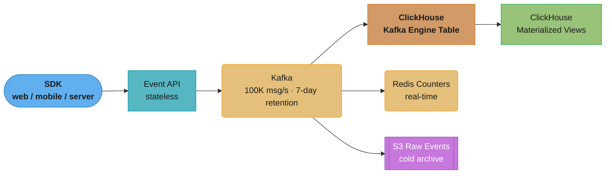
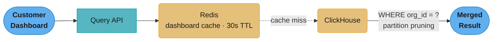
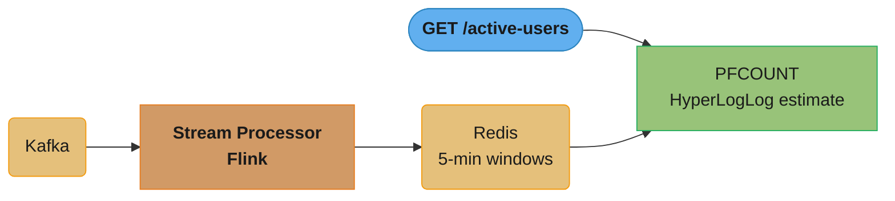
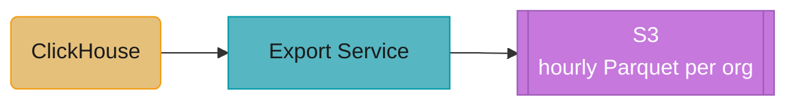
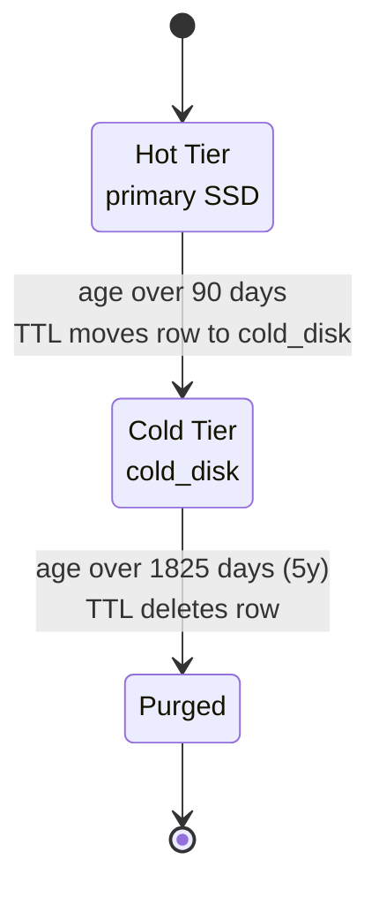
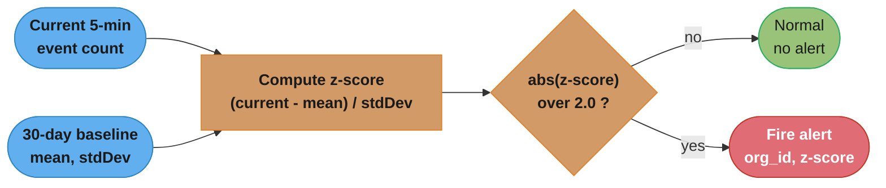

# Case Study: Design a Real-Time Analytics Platform

## Problem Statement

Design the database architecture for a real-time analytics platform for a SaaS product:

- 1 billion events per day ingested from web, mobile, and server-side SDKs (11,500 events/second average; 100K events/second peak)
- Events: page views, clicks, API calls, purchases, custom events
- Queries: sub-second dashboards for the last 24 hours; < 5 second for last 30 days; < 30 seconds for last 365 days
- Real-time counters: active users right now (last 5 minutes), events per second
- 90-day "hot" retention online; 5-year "cold" archive
- 10,000 customer organizations, each querying only their own data
- Dashboard queries: user-defined dimensions, metrics, filters (ad-hoc)
- Anomaly detection: alert when metric deviates > 2σ from 30-day baseline
- Export: hourly exports to customer-managed S3 buckets

---

## Architecture Overview


*Ingest path — one Kafka topic (100 partitions, 100K msg/s peak) fans out to three independent consumers: the ClickHouse Kafka Engine table for durable storage, Redis for real-time counters, and S3 for a raw cold archive.*


*Query path — dashboards hit the 30-second Redis cache first; on a miss, ClickHouse serves the query, but every query is required to filter on `org_id`, which prunes the scan to that tenant's partitions only.*


*Real-time counters — Flink maintains a 5-minute sliding window per org_id in Redis; reads use `PFCOUNT` against a HyperLogLog for an O(1), ±1% cardinality estimate of active users.*


*Export — hourly batch jobs read ClickHouse and write one Parquet file per org directly to that customer's S3 bucket.*

---

## Key Design Decisions

### 1. Kafka for Ingest Buffer

```
Kafka configuration:
  Topics: events (100 partitions — one per event_type + hash of org_id)
  Replication factor: 3
  Retention: 7 days (replay window for re-processing)
  Compression: LZ4 (CPU-efficient, 5x compression for JSON events)
  Batch size: 1MB (producer batches for throughput)
  Linger.ms: 10 (wait 10ms to accumulate batch)
  Max poll records: 10000 (consumer batch size)

Event schema (Avro + Schema Registry):
{
  "org_id": "uuid",
  "user_id": "string",
  "session_id": "string",
  "event_type": "page_view|click|purchase|custom",
  "event_name": "string",
  "properties": {"key": "value"},
  "timestamp_ms": "long",
  "ip_address": "string",
  "user_agent": "string"
}

Producer SDK pattern:
  1. Validate event (required fields, size < 64KB)
  2. Add server-side timestamp, org_id (from API key)
  3. Produce to Kafka (async, fire-and-forget from client's perspective)
  4. Return 202 Accepted immediately (no wait for Kafka ack)
```

### 2. ClickHouse as the Analytics Engine

```sql
-- Main events table (ClickHouse)
CREATE TABLE events (
    org_id          UUID,
    event_type      LowCardinality(String),  -- compresses repeated values efficiently
    event_name      LowCardinality(String),
    user_id         String,
    session_id      String,
    timestamp       DateTime64(3),
    properties      Map(String, String),      -- flexible key-value properties
    date            Date MATERIALIZED toDate(timestamp)  -- computed column for partitioning
)
ENGINE = ReplacingMergeTree(timestamp)  -- deduplicate by (org_id, event_type, user_id, timestamp)
PARTITION BY (org_id, toYYYYMM(date))  -- partition by org + month for pruning + tenant isolation
ORDER BY (org_id, event_type, timestamp, user_id)  -- primary index = clustered sort
SETTINGS index_granularity = 8192;    -- one sparse index entry per 8192 rows

-- TTL: automatically move data between storage tiers
ALTER TABLE events MODIFY TTL
    date + INTERVAL 90 DAY TO DISK 'cold_disk',    -- after 90 days: move to cold SSD
    date + INTERVAL 1825 DAY DELETE;               -- after 5 years: delete

-- Kafka Engine table: reads directly from Kafka
CREATE TABLE events_kafka (
    org_id     UUID,
    event_type String,
    event_name String,
    user_id    String,
    timestamp  DateTime64(3),
    properties String
) ENGINE = Kafka()
SETTINGS
    kafka_broker_list = 'kafka:9092',
    kafka_topic_list = 'events',
    kafka_group_name = 'clickhouse-consumer',
    kafka_format = 'Avro',
    kafka_num_consumers = 16;   -- 16 threads consuming 100 partitions

-- Materialized view: move from Kafka engine to main table
CREATE MATERIALIZED VIEW events_mv TO events AS
SELECT
    toUUID(org_id)           AS org_id,
    event_type,
    event_name,
    user_id,
    session_id,
    parseDateTime64BestEffort(timestamp) AS timestamp,
    toDate(timestamp)        AS date,
    JSONExtractKeysAndValues(properties, 'String') AS properties
FROM events_kafka;
```


*The `MODIFY TTL` clause above drives every row through the same lifecycle automatically — 90 days on primary SSD for sub-second dashboards, then `cold_disk` until the 5-year (1825-day) mark, then deletion, with no manual archival job required.*

### 3. Pre-Aggregated Materialized Views for Dashboard Speed

```sql
-- Hourly event counts (pre-aggregated for fast dashboard queries)
CREATE MATERIALIZED VIEW events_hourly
ENGINE = SummingMergeTree()
PARTITION BY (org_id, toYYYYMM(hour))
ORDER BY (org_id, event_type, event_name, hour)
AS SELECT
    org_id,
    event_type,
    event_name,
    toStartOfHour(timestamp) AS hour,
    count()                  AS event_count,
    countDistinct(user_id)   AS unique_users,
    countDistinct(session_id) AS unique_sessions
FROM events
GROUP BY org_id, event_type, event_name, hour;

-- Query dashboard (last 24 hours by hour):
SELECT
    hour,
    event_name,
    sum(event_count)    AS events,
    sum(unique_users)   AS users
FROM events_hourly
WHERE org_id = 'customer-uuid'
  AND hour >= now() - INTERVAL 24 HOUR
GROUP BY hour, event_name
ORDER BY hour ASC;
-- Hits pre-aggregated view: 1-2 seconds (vs 10-30s on raw events)

-- Daily aggregates for 365-day queries
CREATE MATERIALIZED VIEW events_daily
ENGINE = SummingMergeTree()
PARTITION BY (org_id, toYear(day))
ORDER BY (org_id, event_type, event_name, day)
AS SELECT
    org_id,
    event_type,
    event_name,
    toDate(timestamp) AS day,
    count()           AS event_count,
    countDistinct(user_id) AS unique_users
FROM events
GROUP BY org_id, event_type, event_name, day;

-- Query dashboard (last 365 days):
SELECT day, event_name, sum(event_count) AS events
FROM events_daily
WHERE org_id = 'customer-uuid'
  AND day >= today() - 365
GROUP BY day, event_name
ORDER BY day;
-- Hits daily aggregates: < 1 second for 365 days
```

### 4. Redis for Real-Time Counters

```
Real-Time Active Users (last 5 minutes):
  Flink (reading from Kafka):
    - Sliding window: 5 minutes, slide 1 minute
    - For each org_id: HyperLogLog.add(user_id)
    - After window: PFADD active_users:{org_id} {hll_value}
    - EXPIRE active_users:{org_id} 600 (10 minutes)

  API:
    GET /api/active-users → PFCOUNT active_users:{org_id}
    Returns cardinality estimate (±1% error) in O(1)

Events Per Second (EPS):
  Flink: INCR events_per_second:{org_id}:{epoch_second}
         EXPIRE events_per_second:{org_id}:{epoch_second} 120
  API: GET events last 60 seconds → sum of 60 keys
       MGET events_per_second:{org_id}:{epoch-59} ... events_per_second:{org_id}:{epoch}

Real-Time Top Events (last 5 minutes):
  Flink: ZINCRBY top_events:{org_id}:{window_key} 1 {event_name}
  API: ZREVRANGE top_events:{org_id}:{current_window} 0 9
  Window key = epoch_seconds / 300 (5-minute buckets)
```

### 5. Tenant Isolation

```sql
-- Multi-tenant isolation in ClickHouse:
-- Every query MUST include org_id in WHERE clause
-- ClickHouse partition by (org_id, toYYYYMM(date)) means:
--   SELECT ... WHERE org_id = ? AND date >= ? AND date < ?
--   → Partition pruning: only reads the relevant org's partitions
--   → Other tenants' data is in different partitions (different files on disk)
--   → No row-level scanning of other tenants' data

-- Application enforcement:
-- QueryAPI validates that org_id in JWT matches org_id in query
-- No query executes without a bound org_id parameter

-- Row-level: ClickHouse does not have RLS natively
-- Application layer enforces: every query builder prepends WHERE org_id = ?
-- Regular security audit: scan query logs for queries missing org_id filter

-- Quota enforcement: per-org query limits
-- Redis key: query_quota:{org_id}:{date} with daily limits
-- Rate limit by: max_queries_per_hour, max_rows_scanned_per_day
```

---

## Implementation

### Event Ingest API

```java
@RestController
@RequestMapping("/v1/events")
public class EventIngestController {

    @PostMapping("/batch")
    @ResponseStatus(HttpStatus.ACCEPTED)  // 202: accepted, not yet processed
    public void ingestBatch(@RequestHeader("X-API-Key") String apiKey,
                            @RequestBody List<EventDto> events) {
        // Validate API key → get org_id (cached in Redis, 60s TTL)
        String orgId = apiKeyService.getOrgId(apiKey);

        // Validate events (max 1000/batch, max 64KB/event)
        validateBatch(events);

        // Add server-side fields (timestamp, org_id)
        List<AnalyticsEvent> enriched = events.stream()
            .map(e -> AnalyticsEvent.builder()
                .orgId(orgId)
                .timestamp(Instant.now())
                .eventType(e.getEventType())
                .eventName(e.getEventName())
                .userId(e.getUserId())
                .properties(e.getProperties())
                .build())
            .collect(toList());

        // Async Kafka produce (fire-and-forget; client gets 202 immediately)
        kafkaProducer.send(new ProducerRecord<>("events", orgId, enriched));
        // Returns immediately — no wait for Kafka acknowledgment
    }
}
```

### Dashboard Query Service

```java
@Service
public class DashboardQueryService {

    public DashboardResult query(QueryRequest req) {
        // Validate org_id from JWT matches request
        String orgId = securityContext.getOrgId();

        // Build ClickHouse query (parameterized — no SQL injection)
        String sql = buildQuery(req, orgId);

        // Check query cache (Redis, 30s TTL for dashboards)
        String cacheKey = "dashboard:" + orgId + ":" + hashQuery(sql, req.getParams());
        DashboardResult cached = redis.opsForValue().get(cacheKey);
        if (cached != null) return cached;

        // Execute against ClickHouse
        DashboardResult result = clickhouseClient.query(sql, req.getParams());

        // Cache for 30 seconds (dashboards refresh every 30s)
        redis.opsForValue().set(cacheKey, result, Duration.ofSeconds(30));
        return result;
    }

    private String buildQuery(QueryRequest req, String orgId) {
        // Select the appropriate pre-aggregated table based on time range
        String table = switch (req.getGranularity()) {
            case HOUR -> req.getDays() <= 7 ? "events_hourly" : "events_daily";
            case DAY  -> "events_daily";
            case RAW  -> "events";  // Only allowed for < 24 hour range
        };

        // Always include org_id — tenant isolation enforced here
        return """
            SELECT {dimensions}, {metrics}
            FROM {table}
            WHERE org_id = {orgId}
              AND {time_filter}
              AND {custom_filters}
            GROUP BY {dimensions}
            ORDER BY {order_by}
            LIMIT {limit}
            """.formatted(/* params */);
    }
}
```

### Anomaly Detection


*Every 5-minute window's event count is compared against its 30-day baseline; a z-score beyond ±2σ — the `Math.abs(zScore) > 2.0` check below — fires an alert instead of silently folding into the baseline.*

```java
// Flink stream: compare current 5-min window vs 30-day baseline
public class AnomalyDetector extends ProcessWindowFunction<EventCount, Alert, String, TimeWindow> {

    @Override
    public void process(String key, Context ctx, Iterable<EventCount> events, Collector<Alert> out) {
        EventCount current = events.iterator().next();
        String orgId = extractOrgId(key);
        String eventName = extractEventName(key);

        // Fetch 30-day baseline from Redis (pre-computed by nightly job)
        BaselineStats baseline = redis.opsForValue().get("baseline:" + key);
        if (baseline == null) return;

        double zScore = (current.getCount() - baseline.getMean()) / baseline.getStdDev();
        if (Math.abs(zScore) > 2.0) {
            out.collect(Alert.anomaly(orgId, eventName, current.getCount(),
                baseline.getMean(), zScore));
        }
    }
}
```

---

## Tradeoffs and Alternatives

| Decision | Choice | Alternative | Reason |
|----------|--------|-------------|--------|
| Analytics DB | ClickHouse | PostgreSQL, BigQuery | ClickHouse 10-100x faster for aggregations; self-hosted; column compression |
| Ingest buffer | Kafka | Direct ClickHouse write | Kafka absorbs burst traffic; provides replay; decouples ingest from storage |
| Real-time counters | Redis HyperLogLog | Exact COUNT DISTINCT | HLL provides ±1% estimate in O(1) space and O(1) time; exact count would require storing all user_ids |
| Pre-aggregation | Materialized views | Ad-hoc on raw | Raw queries on 1B events/day are too slow for dashboards; pre-aggregation provides sub-second latency |
| Cold storage tier | ClickHouse TTL → cold disk | S3 Parquet | ClickHouse can query cold disk transparently; S3 requires Athena or separate read path |
| Tenant isolation | Partition by org_id | RLS | ClickHouse doesn't have RLS; partition pruning provides equivalent isolation at query time |

---

## Interview Discussion Points

**Q: How does ClickHouse achieve sub-second query performance on billions of events?**
ClickHouse uses a columnar storage format where each column is stored separately on disk. For a query aggregating `event_count` by `event_name` over 30 days, ClickHouse reads only the `event_name`, `timestamp`, and `org_id` columns — skipping all other columns entirely. This reduces I/O by 90%+ compared to row storage. Additionally: (1) Sparse primary index (one entry per 8192 rows) allows instant range skipping. (2) Data is sorted by the ORDER BY key, so range queries on `timestamp` are sequential reads (no random I/O). (3) Vectorized execution processes 1024 rows per SIMD instruction. (4) Pre-aggregated materialized views reduce the dataset from 1B events/day to 1M hourly aggregations.

**Q: Why use Kafka as an intermediate layer instead of writing directly to ClickHouse?**
Direct ClickHouse writes from 100K events/second across thousands of SDK clients would create: (1) Connection overhead (ClickHouse connection per SDK is expensive). (2) Write amplification (small inserts trigger merges frequently — ClickHouse prefers large batches). (3) No replay capability — if ClickHouse is down or the schema needs changing, events are lost. Kafka provides: (1) A write buffer that absorbs burst traffic up to 7-day retention. (2) Consumer groups for multiple downstream systems (ClickHouse + Redis + S3). (3) Replay capability for re-processing events when the ClickHouse schema changes. (4) Decoupling: SDK clients return 202 Accepted immediately; Kafka absorbs the writes asynchronously.

**Q: How do you handle schema evolution as new event properties are added?**
ClickHouse's `Map(String, String)` column for properties allows flexible key-value pairs without schema changes. New properties appear as new keys in the map — no ALTER TABLE needed. For properties that need to be filterable as first-class dimensions (high-cardinality attributes added later), add materialized columns:

```sql
ALTER TABLE events
ADD COLUMN country LowCardinality(String)
MATERIALIZED JSONExtractString(properties, 'country');
```

The materialized column is computed from the existing properties map for new rows and can be backfilled. For the Avro schema registry: backward-compatible additions (new optional fields with defaults) allow old consumers to continue processing new events.

**Q: How do you prevent one tenant's heavy queries from impacting others?**
ClickHouse resource quotas: `CREATE QUOTA tenant_{org_id} FOR INTERVAL 1 HOUR MAX QUERIES 1000, MAX READ ROWS 10000000000`. Each tenant's queries are assigned to their quota profile. When a tenant exceeds their quota, ClickHouse returns an error to their API requests rather than degrading service for others. Additionally: (1) Query complexity limits: reject queries scanning > 10B rows per tenant per day. (2) Materialized views ensure most dashboard queries hit pre-aggregated data, not raw events. (3) Query caching (Redis): repeated identical queries serve from cache without hitting ClickHouse again.
