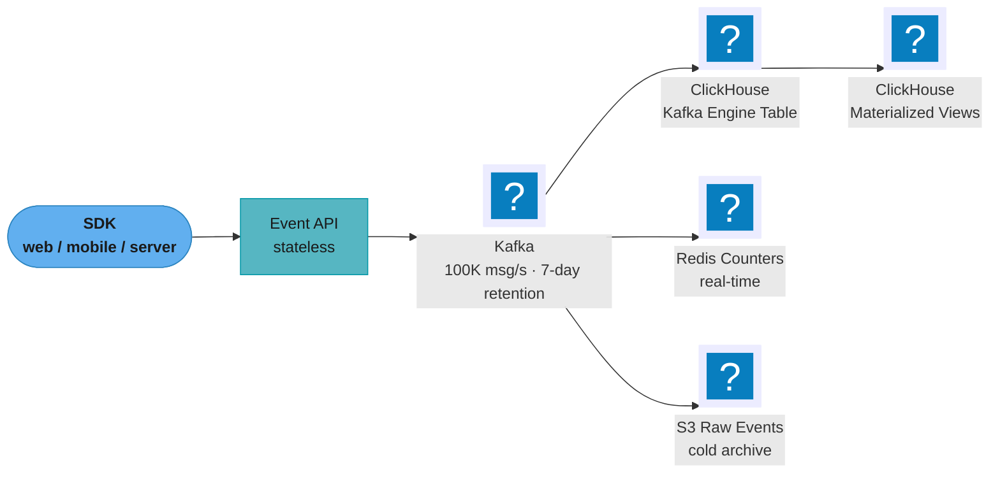
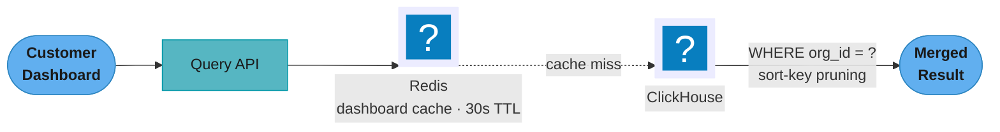
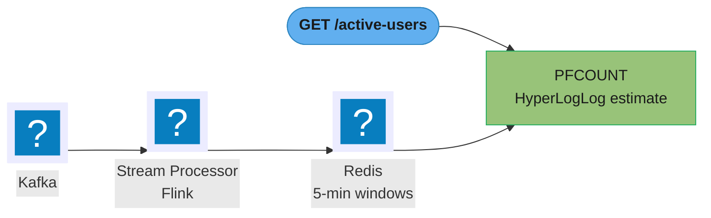
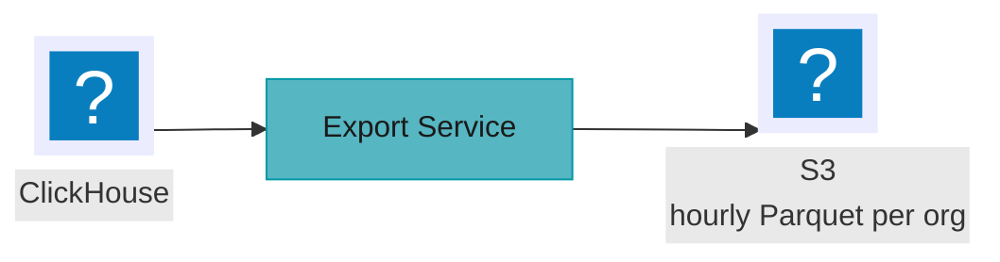
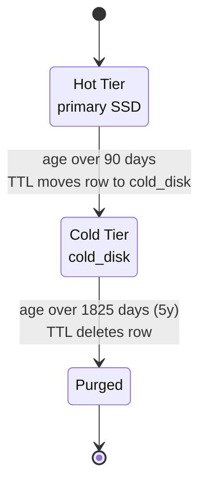
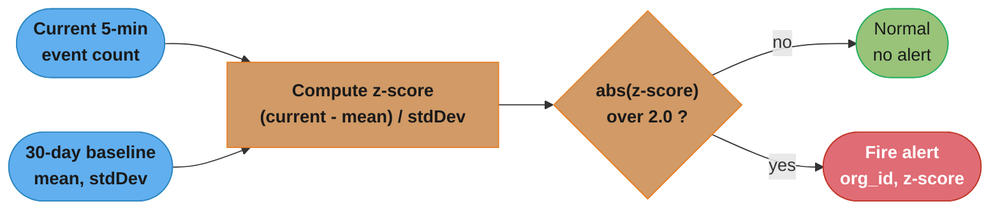

# Case Study: Design a Real-Time Analytics Platform

<!-- tiers: principal -->

## Problem Statement

Design the database architecture for a real-time analytics platform for a SaaS product:

- 1 billion events per day ingested from web, mobile, and server-side SDKs (11,500 events/second average; 100K events/second peak)
- Events: page views, clicks, API calls, purchases, custom events
- Queries: sub-second dashboards for the last 24 hours; < 5 second for last 30 days; < 30 seconds for last 365 days
- Real-time counters: active users right now (last 5 minutes), events per second
- 90-day "hot" retention online; 5-year "cold" archive
- 10,000 customer organizations, each querying only their own data
- Dashboard queries: user-defined dimensions, metrics, filters (ad-hoc)
- Anomaly detection: alert when metric deviates > 2σ from 30-day baseline
- Export: hourly exports to customer-managed S3 buckets

---

## Architecture Overview


```mermaid
flowchart LR
    classDef io      fill:#61afef,stroke:#2e86c1,color:#1a1a1a,font-weight:bold
    classDef frozen  fill:#c678dd,stroke:#9b59b6,color:#fff
    classDef train   fill:#98c379,stroke:#27ae60,color:#1a1a1a
    classDef mathOp  fill:#d19a66,stroke:#e67e22,color:#1a1a1a,font-weight:bold
    classDef lossN   fill:#e06c75,stroke:#c0392b,color:#fff,font-weight:bold
    classDef req     fill:#56b6c2,stroke:#0097a7,color:#1a1a1a
    classDef base    fill:#e5c07b,stroke:#f39c12,color:#1a1a1a

    sdk(["SDK<br/>web / mobile / server"]) --> api["Event API<br/>stateless"]
    api --> kafka
    kafka --> ckhkafka
    kafka --> rediscounters
    kafka --> s3raw
    ckhkafka --> mvs

    kafka@{ icon: "logos:kafka", form: "square", label: "Kafka<br/>100K msg/s · 7-day retention", pos: "b", h: 44 }
    ckhkafka@{ icon: "simple-icons:clickhouse", form: "square", label: "ClickHouse<br/>Kafka Engine Table", pos: "b", h: 44 }
    rediscounters@{ icon: "logos:redis", form: "square", label: "Redis Counters<br/>real-time", pos: "b", h: 44 }
    s3raw@{ icon: "logos:aws-s3", form: "square", label: "S3 Raw Events<br/>cold archive", pos: "b", h: 44 }
    mvs@{ icon: "simple-icons:clickhouse", form: "square", label: "ClickHouse<br/>Materialized Views", pos: "b", h: 44 }

    class sdk io
    class api req
```
*Ingest path — one Kafka topic (100 partitions, 100K msg/s peak) fans out to three independent consumers: the ClickHouse Kafka Engine table for durable storage, Redis for real-time counters, and S3 for a raw cold archive.*


```mermaid
flowchart LR
    classDef io      fill:#61afef,stroke:#2e86c1,color:#1a1a1a,font-weight:bold
    classDef frozen  fill:#c678dd,stroke:#9b59b6,color:#fff
    classDef train   fill:#98c379,stroke:#27ae60,color:#1a1a1a
    classDef mathOp  fill:#d19a66,stroke:#e67e22,color:#1a1a1a,font-weight:bold
    classDef lossN   fill:#e06c75,stroke:#c0392b,color:#fff,font-weight:bold
    classDef req     fill:#56b6c2,stroke:#0097a7,color:#1a1a1a
    classDef base    fill:#e5c07b,stroke:#f39c12,color:#1a1a1a

    dash(["Customer<br/>Dashboard"]) --> qapi["Query API"]
    qapi --> rcache
    rcache -.->|"cache miss"| ckh
    ckh -->|"WHERE org_id = ?<br/>sort-key pruning"| merged(["Merged<br/>Result"])

    rcache@{ icon: "logos:redis", form: "square", label: "Redis<br/>dashboard cache · 30s TTL", pos: "b", h: 44 }
    ckh@{ icon: "simple-icons:clickhouse", form: "square", label: "ClickHouse", pos: "b", h: 44 }

    class dash,merged io
    class qapi req
```
*Query path — dashboards hit the 30-second Redis cache first; on a miss, ClickHouse serves the query, but every query is required to filter on `org_id`, the leading column of the sorting key, which prunes the scan to that tenant's granules.*


```mermaid
flowchart LR
    classDef io      fill:#61afef,stroke:#2e86c1,color:#1a1a1a,font-weight:bold
    classDef frozen  fill:#c678dd,stroke:#9b59b6,color:#fff
    classDef train   fill:#98c379,stroke:#27ae60,color:#1a1a1a
    classDef mathOp  fill:#d19a66,stroke:#e67e22,color:#1a1a1a,font-weight:bold
    classDef lossN   fill:#e06c75,stroke:#c0392b,color:#fff,font-weight:bold
    classDef req     fill:#56b6c2,stroke:#0097a7,color:#1a1a1a
    classDef base    fill:#e5c07b,stroke:#f39c12,color:#1a1a1a

    kafka2 --> flink
    flink --> rwin
    getreq(["GET /active-users"]) --> hll["PFCOUNT<br/>HyperLogLog estimate"]
    rwin --> hll

    kafka2@{ icon: "logos:kafka", form: "square", label: "Kafka", pos: "b", h: 44 }
    flink@{ icon: "simple-icons:apacheflink", form: "square", label: "Stream Processor<br/>Flink", pos: "b", h: 44 }
    rwin@{ icon: "logos:redis", form: "square", label: "Redis<br/>5-min windows", pos: "b", h: 44 }

    class getreq io
    class hll train
```
*Real-time counters — Flink `PFADD`s each minute's user ids into a per-org, per-minute HyperLogLog; a read `PFCOUNT`s the last five buckets at once, which Redis answers as the union cardinality with a 0.81% standard error.*


```mermaid
flowchart LR
    classDef io      fill:#61afef,stroke:#2e86c1,color:#1a1a1a,font-weight:bold
    classDef frozen  fill:#c678dd,stroke:#9b59b6,color:#fff
    classDef train   fill:#98c379,stroke:#27ae60,color:#1a1a1a
    classDef mathOp  fill:#d19a66,stroke:#e67e22,color:#1a1a1a,font-weight:bold
    classDef lossN   fill:#e06c75,stroke:#c0392b,color:#fff,font-weight:bold
    classDef req     fill:#56b6c2,stroke:#0097a7,color:#1a1a1a
    classDef base    fill:#e5c07b,stroke:#f39c12,color:#1a1a1a

    ckh2 --> exp["Export Service"]
    exp --> s3out

    ckh2@{ icon: "simple-icons:clickhouse", form: "square", label: "ClickHouse", pos: "b", h: 44 }
    s3out@{ icon: "logos:aws-s3", form: "square", label: "S3<br/>hourly Parquet per org", pos: "b", h: 44 }

    class exp req
```
*Export — hourly batch jobs read ClickHouse and write one Parquet file per org directly to that customer's S3 bucket.*

---

## Key Design Decisions

### 1. Kafka for Ingest Buffer

```
Kafka configuration:
  Topics: events (100 partitions — one per event_type + hash of org_id)
  Replication factor: 3
  Retention: 7 days (replay window for re-processing)
  Compression: LZ4 (CPU-efficient, 5x compression for JSON events)
  Batch size: 1MB (producer batches for throughput)
  Linger.ms: 10 (wait 10ms to accumulate batch)
  Max poll records: 10000 (consumer batch size)

Event schema (Avro + Schema Registry):
{
  "org_id": "uuid",
  "user_id": "string",
  "session_id": "string",
  "event_type": "page_view|click|purchase|custom",
  "event_name": "string",
  "properties": {"key": "value"},
  "timestamp_ms": "long",
  "ip_address": "string",
  "user_agent": "string"
}

Producer SDK pattern:
  1. Validate event (required fields, size < 64KB)
  2. Add server-side timestamp, org_id (from API key)
  3. Produce to Kafka (async, fire-and-forget from client's perspective)
  4. Return 202 Accepted immediately (no wait for Kafka ack)
```

### 2. ClickHouse as the Analytics Engine

```sql
-- Main events table (ClickHouse)
CREATE TABLE events (
    org_id          UUID,
    event_type      LowCardinality(String),  -- compresses repeated values efficiently
    event_name      LowCardinality(String),
    user_id         String,
    session_id      String,
    timestamp       DateTime64(3),
    properties      Map(String, String),      -- flexible key-value properties
    date            Date MATERIALIZED toDate(timestamp)  -- computed column for partitioning
)
ENGINE = ReplacingMergeTree(timestamp)  -- deduplicates rows sharing the ORDER BY key
PARTITION BY toYYYYMM(date)  -- month only; see the note below on why NOT org_id
ORDER BY (org_id, event_type, timestamp, user_id)  -- primary index = clustered sort
SETTINGS index_granularity = 8192;    -- one sparse index entry per 8192 rows

-- Do NOT add org_id to the partition key. With 10,000 orgs and a 90-day hot
-- window that is 30,000 live partitions, and any INSERT block spanning more than
-- max_partitions_per_insert_block (default 100) orgs is rejected outright:
--   "Too many partitions for single INSERT block (more than 100) ... Recommended
--    total number of partitions for a table is under 1000..10000 ... partitioning
--    is not intended to speed up SELECT queries (ORDER BY key is sufficient)."
-- Tenant pruning is already handled by org_id leading the ORDER BY key: the sparse
-- primary index seeks straight to that org's granules. Partitioning exists for bulk
-- data manipulation (DROP PARTITION, TTL moves), not for per-tenant scan reduction.

-- TTL: automatically move data between storage tiers
ALTER TABLE events MODIFY TTL
    date + INTERVAL 90 DAY TO DISK 'cold_disk',    -- after 90 days: move to cold SSD
    date + INTERVAL 1825 DAY DELETE;               -- after 5 years: delete

-- Kafka Engine table: reads directly from Kafka.
-- Its columns must mirror the Avro record on the wire, NOT the target table:
-- every column the materialized view selects has to exist here, and each type has
-- to be the type the format decodes to, or the view fails to create.
CREATE TABLE events_kafka (
    org_id       String,
    event_type   String,
    event_name   String,
    user_id      String,
    session_id   String,
    timestamp_ms Int64,
    properties   Map(String, String)
) ENGINE = Kafka()
SETTINGS
    kafka_broker_list = 'kafka:9092',
    kafka_topic_list = 'events',
    kafka_group_name = 'clickhouse-consumer',
    kafka_format = 'Avro',
    kafka_num_consumers = 16;   -- 16 threads consuming 100 partitions

-- Materialized view: move from Kafka engine to main table.
-- `date` is deliberately absent: it is a MATERIALIZED column on `events`, and
-- selecting it here fails with "Cannot insert column date, because it is
-- MATERIALIZED column" — ClickHouse recomputes it from timestamp on insert.
CREATE MATERIALIZED VIEW events_mv TO events AS
SELECT
    toUUID(org_id)                         AS org_id,
    event_type,
    event_name,
    user_id,
    session_id,
    fromUnixTimestamp64Milli(timestamp_ms) AS timestamp,
    properties
FROM events_kafka;
```


```mermaid
stateDiagram-v2
    state "Hot Tier<br/>primary SSD" as Hot
    state "Cold Tier<br/>cold_disk" as Cold

    [*] --> Hot
    Hot --> Cold: age over 90 days<br/>TTL moves row to cold_disk
    Cold --> Purged: age over 1825 days (5y)<br/>TTL deletes row
    Purged --> [*]
```
*The `MODIFY TTL` clause above drives every row through the same lifecycle automatically — 90 days on primary SSD for sub-second dashboards, then `cold_disk` until the 5-year (1825-day) mark, then deletion, with no manual archival job required.*

### 3. Pre-Aggregated Materialized Views for Dashboard Speed

```sql
-- Hourly event counts (pre-aggregated for fast dashboard queries).
--
-- Engine choice is load-bearing. SummingMergeTree adds numbers on merge, which is
-- right for a count and WRONG for a distinct count: one user seen in three
-- separate insert blocks yields three partial rows of unique_users = 1, and the
-- merge sums them to 3. AggregatingMergeTree stores the sketch itself, so
-- uniqMerge() unions the three partials back to the true 1.
CREATE MATERIALIZED VIEW events_hourly
ENGINE = AggregatingMergeTree()
PARTITION BY toYYYYMM(hour)
ORDER BY (org_id, event_type, event_name, hour)
AS SELECT
    org_id,
    event_type,
    event_name,
    toStartOfHour(timestamp) AS hour,
    countState()             AS event_count,
    uniqState(user_id)       AS unique_users,
    uniqState(session_id)    AS unique_sessions
FROM events
GROUP BY org_id, event_type, event_name, hour;

-- Query dashboard (last 24 hours by hour):
SELECT
    hour,
    event_name,
    countMerge(event_count) AS events,
    uniqMerge(unique_users) AS users
FROM events_hourly
WHERE org_id = 'customer-uuid'
  AND hour >= now() - INTERVAL 24 HOUR
GROUP BY hour, event_name
ORDER BY hour ASC;
-- Reads at most 24 hours x event_name rows for one org: tens of milliseconds,
-- against 10-30s for the same aggregation over raw events

-- Daily aggregates for 365-day queries
CREATE MATERIALIZED VIEW events_daily
ENGINE = AggregatingMergeTree()
PARTITION BY toYear(day)
ORDER BY (org_id, event_type, event_name, day)
AS SELECT
    org_id,
    event_type,
    event_name,
    toDate(timestamp)  AS day,
    countState()       AS event_count,
    uniqState(user_id) AS unique_users
FROM events
GROUP BY org_id, event_type, event_name, day;

-- Query dashboard (last 365 days):
SELECT day, event_name, countMerge(event_count) AS events
FROM events_daily
WHERE org_id = 'customer-uuid'
  AND day >= today() - 365
GROUP BY day, event_name
ORDER BY day;
-- Hits daily aggregates: < 1 second for 365 days
```

### 4. Redis for Real-Time Counters

```
Real-Time Active Users (last 5 minutes):
  Redis owns the sketch; Flink only feeds it. PFADD takes ELEMENTS, not a
  serialized HLL, so there is no way to compute an HLL in Flink and push it in
  (PFMERGE is the only command that combines existing sketches).

  Flink (reading from Kafka):
    - Tumbling window: 1 minute, keyed by org_id
    - PFADD active_users:{org_id}:{minute_bucket} {user_id} {user_id} ...
    - EXPIRE active_users:{org_id}:{minute_bucket} 600 (10 minutes)

  API:
    GET /api/active-users →
      PFCOUNT active_users:{org}:{m-4} ... active_users:{org}:{m}
    Multi-key PFCOUNT returns the cardinality of the UNION of the five one-minute
    buckets — exactly "active in the last 5 minutes" — with a 0.81% standard
    error. Note the cost: single-key PFCOUNT is O(1) off a cached estimate, but
    multi-key merges on the fly, cannot cache, and lands in the millisecond range.
    Every bucket is 12 KB dense, so the whole window is 60 KB per org.

Events Per Second (EPS):
  Flink: INCR events_per_second:{org_id}:{epoch_second}
         EXPIRE events_per_second:{org_id}:{epoch_second} 120
  API: GET events last 60 seconds → sum of 60 keys
       MGET events_per_second:{org_id}:{epoch-59} ... events_per_second:{org_id}:{epoch}

Real-Time Top Events (last 5 minutes):
  Flink: ZINCRBY top_events:{org_id}:{window_key} 1 {event_name}
  API: ZRANGE top_events:{org_id}:{current_window} 0 9 REV
  Window key = epoch_seconds / 300 (5-minute buckets)
```

### 5. Tenant Isolation

```sql
-- Multi-tenant isolation in ClickHouse:
-- Every query MUST include org_id in WHERE clause
-- org_id leads the ORDER BY key, so:
--   SELECT ... WHERE org_id = ? AND date >= ? AND date < ?
--   → Primary-key index seek: only that org's granules are read
--   → date range then prunes months via the partition key
--   → Other tenants' rows are never decompressed
-- This is index pruning, not physical separation. Two tenants share the same
-- parts on disk, so isolation here is a query-shape guarantee that the
-- application must enforce — it is not a storage-level boundary.

-- Application enforcement:
-- QueryAPI validates that org_id in JWT matches org_id in query
-- No query executes without a bound org_id parameter

-- Row-level: ClickHouse does not have RLS natively
-- Application layer enforces: every query builder prepends WHERE org_id = ?
-- Regular security audit: scan query logs for queries missing org_id filter

-- Quota enforcement: per-org query limits
-- Redis key: query_quota:{org_id}:{date} with daily limits
-- Rate limit by: max_queries_per_hour, max_rows_scanned_per_day
```

### 6. Hourly Export to Customer-Managed S3

The export requirement is the one place tenant data leaves the platform, and doing it
from the application layer would mean streaming a billion rows a day through a JVM.
ClickHouse writes Parquet directly to the customer's bucket instead:

```sql
-- One hour, one org, one Parquet object, written by ClickHouse itself.
INSERT INTO FUNCTION s3(
    'https://{customer_bucket}.s3.amazonaws.com/events/dt={date}/hour={hh}/part.parquet',
    '{scoped_access_key}', '{scoped_secret}', 'Parquet')
SELECT org_id, event_type, event_name, user_id, session_id, timestamp, properties
FROM events
WHERE org_id   = {org_id:UUID}
  AND timestamp >= {hour_start:DateTime64(3)}
  AND timestamp <  {hour_start:DateTime64(3)} + INTERVAL 1 HOUR
SETTINGS s3_truncate_on_insert = 1;   -- reruns overwrite, so retries stay idempotent
```

Three details make this safe to operate:

- **Credentials are the customer's, scoped to one prefix.** The exporter assumes a
  role the customer granted (`sts:AssumeRole` with an external ID), so a compromised
  exporter cannot reach any other tenant's bucket, and revocation is the customer's
  to perform.
- **The hour must be closed before it is exported.** Kafka lag means events for
  13:59 can land at 14:02, so the job for hour H runs at H+1 plus a watermark delay,
  not on the hour. Exporting early silently ships short files.
- **`s3_truncate_on_insert = 1` makes a rerun idempotent.** Without it a retried
  export appends, and the customer's next load double-counts the hour.

Failed exports are retried with backoff and surfaced on the customer's own status
page — a silent export failure is indistinguishable from an hour with no traffic.

---

## Implementation

### Event Ingest API

```java
@RestController
@RequestMapping("/v1/events")
public class EventIngestController {

    @PostMapping("/batch")
    @ResponseStatus(HttpStatus.ACCEPTED)  // 202: accepted, not yet processed
    public void ingestBatch(@RequestHeader("X-API-Key") String apiKey,
                            @RequestBody List<EventDto> events) {
        // Validate API key → get org_id (cached in Redis, 60s TTL)
        String orgId = apiKeyService.getOrgId(apiKey);

        // Validate events (max 1000/batch, max 64KB/event)
        validateBatch(events);

        // Add server-side fields (timestamp, org_id)
        List<AnalyticsEvent> enriched = events.stream()
            .map(e -> AnalyticsEvent.builder()
                .orgId(orgId)
                .timestamp(Instant.now())
                .eventType(e.getEventType())
                .eventName(e.getEventName())
                .userId(e.getUserId())
                .properties(e.getProperties())
                .build())
            .collect(toList());

        // Async Kafka produce (fire-and-forget; client gets 202 immediately)
        kafkaProducer.send(new ProducerRecord<>("events", orgId, enriched));
        // Returns immediately — no wait for Kafka acknowledgment
    }
}
```

### Dashboard Query Service

```java
@Service
public class DashboardQueryService {

    public DashboardResult query(QueryRequest req) {
        // Validate org_id from JWT matches request
        String orgId = securityContext.getOrgId();

        // Build ClickHouse query (parameterized — no SQL injection)
        String sql = buildQuery(req, orgId);

        // Check query cache (Redis, 30s TTL for dashboards)
        String cacheKey = "dashboard:" + orgId + ":" + hashQuery(sql, req.getParams());
        DashboardResult cached = redis.opsForValue().get(cacheKey);
        if (cached != null) return cached;

        // Execute against ClickHouse
        DashboardResult result = clickhouseClient.query(sql, req.getParams());

        // Cache for 30 seconds (dashboards refresh every 30s)
        redis.opsForValue().set(cacheKey, result, Duration.ofSeconds(30));
        return result;
    }

    private String buildQuery(QueryRequest req, String orgId) {
        // Select the appropriate pre-aggregated table based on time range
        String table = switch (req.getGranularity()) {
            case HOUR -> req.getDays() <= 7 ? "events_hourly" : "events_daily";
            case DAY  -> "events_daily";
            case RAW  -> "events";  // Only allowed for < 24 hour range
        };

        // Always include org_id — tenant isolation enforced here
        return """
            SELECT {dimensions}, {metrics}
            FROM {table}
            WHERE org_id = {orgId}
              AND {time_filter}
              AND {custom_filters}
            GROUP BY {dimensions}
            ORDER BY {order_by}
            LIMIT {limit}
            """.formatted(/* params */);
    }
}
```

### Anomaly Detection


```mermaid
flowchart LR
    classDef io      fill:#61afef,stroke:#2e86c1,color:#1a1a1a,font-weight:bold
    classDef frozen  fill:#c678dd,stroke:#9b59b6,color:#fff
    classDef train   fill:#98c379,stroke:#27ae60,color:#1a1a1a
    classDef mathOp  fill:#d19a66,stroke:#e67e22,color:#1a1a1a,font-weight:bold
    classDef lossN   fill:#e06c75,stroke:#c0392b,color:#fff,font-weight:bold
    classDef req     fill:#56b6c2,stroke:#0097a7,color:#1a1a1a
    classDef base    fill:#e5c07b,stroke:#f39c12,color:#1a1a1a

    cur(["Current 5-min<br/>event count"]) --> z["Compute z-score<br/>(current - mean) / stdDev"]
    baseline(["30-day baseline<br/>mean, stdDev"]) --> z
    z --> dec{"abs(z-score)<br/>over 2.0 ?"}
    dec -->|"no"| normal(["Normal<br/>no alert"])
    dec -->|"yes"| alert(["Fire alert<br/>org_id, z-score"])

    class cur,baseline io
    class z,dec mathOp
    class normal train
    class alert lossN
```
*Every 5-minute window's event count is compared against its 30-day baseline; a z-score beyond ±2σ — the `Math.abs(zScore) > 2.0` check below — fires an alert instead of silently folding into the baseline.*

```java
// Flink stream: compare current 5-min window vs 30-day baseline
public class AnomalyDetector extends ProcessWindowFunction<EventCount, Alert, String, TimeWindow> {

    @Override
    public void process(String key, Context ctx, Iterable<EventCount> events, Collector<Alert> out) {
        EventCount current = events.iterator().next();
        String orgId = extractOrgId(key);
        String eventName = extractEventName(key);

        // Fetch 30-day baseline from Redis (pre-computed by nightly job)
        BaselineStats baseline = redis.opsForValue().get("baseline:" + key);
        if (baseline == null) return;

        double zScore = (current.getCount() - baseline.getMean()) / baseline.getStdDev();
        if (Math.abs(zScore) > 2.0) {
            out.collect(Alert.anomaly(orgId, eventName, current.getCount(),
                baseline.getMean(), zScore));
        }
    }
}
```

---

## Tradeoffs and Alternatives

| Decision | Choice | Alternative | Reason |
|----------|--------|-------------|--------|
| Analytics DB | ClickHouse | PostgreSQL, BigQuery | ClickHouse 10-100x faster for aggregations; self-hosted; column compression |
| Ingest buffer | Kafka | Direct ClickHouse write | Kafka absorbs burst traffic; provides replay; decouples ingest from storage |
| Real-time counters | Redis HyperLogLog | Exact COUNT DISTINCT | HLL holds any cardinality in a fixed 12 KB with a 0.81% standard error; an exact count would have to store every user_id seen in the window |
| Pre-aggregation | Materialized views | Ad-hoc on raw | Raw queries on 1B events/day are too slow for dashboards; pre-aggregation provides sub-second latency |
| Cold storage tier | ClickHouse TTL → cold disk | S3 Parquet | ClickHouse can query cold disk transparently; S3 requires Athena or separate read path |
| Tenant isolation | org_id first in the ORDER BY key + mandatory `WHERE org_id` | RLS, or partition by org_id | ClickHouse has no RLS, and partitioning by org_id would create ~30,000 live partitions and trip `max_partitions_per_insert_block`; the sorting key prunes per tenant at no such cost |

---

## Interview Discussion Points

**Q: How does ClickHouse achieve sub-second query performance on billions of events?**
ClickHouse uses a columnar storage format where each column is stored separately on disk. For a query aggregating `event_count` by `event_name` over 30 days, ClickHouse reads only the `event_name`, `timestamp`, and `org_id` columns — skipping all other columns entirely. This reduces I/O by 90%+ compared to row storage. Additionally: (1) Sparse primary index (one entry per 8192 rows) allows instant range skipping. (2) Data is sorted by the ORDER BY key, so range queries on `timestamp` are sequential reads (no random I/O). (3) Vectorized execution: rows move through the pipeline in blocks of tens of thousands (`max_block_size` defaults to 65,409), so the per-column inner loops are tight enough for the compiler to emit SIMD instructions and the per-row interpreter overhead of a row engine disappears. (4) Pre-aggregated materialized views collapse the working set: 10,000 orgs x roughly 20 distinct event names x 24 hours is about 5M hourly rows per day, against 1B raw events.

**Q: Why use Kafka as an intermediate layer instead of writing directly to ClickHouse?**
Direct ClickHouse writes from 100K events/second across thousands of SDK clients would create: (1) Connection overhead (ClickHouse connection per SDK is expensive). (2) Write amplification (small inserts trigger merges frequently — ClickHouse prefers large batches). (3) No replay capability — if ClickHouse is down or the schema needs changing, events are lost. Kafka provides: (1) A write buffer that absorbs burst traffic up to 7-day retention. (2) Consumer groups for multiple downstream systems (ClickHouse + Redis + S3). (3) Replay capability for re-processing events when the ClickHouse schema changes. (4) Decoupling: SDK clients return 202 Accepted immediately; Kafka absorbs the writes asynchronously.

**Q: How do you handle schema evolution as new event properties are added?**
ClickHouse's `Map(String, String)` column for properties allows flexible key-value pairs without schema changes. New properties appear as new keys in the map — no ALTER TABLE needed. For properties that need to be filterable as first-class dimensions (high-cardinality attributes added later), add materialized columns:

```sql
ALTER TABLE events
ADD COLUMN country LowCardinality(String)
MATERIALIZED properties['country'];
```

`properties` is a `Map(String, String)`, so it is subscripted, not parsed. Reaching
for `JSONExtractString(properties, 'country')` here is a trap worth knowing: the
`ALTER` is accepted, and the failure only surfaces on the next `SELECT` that touches
the column, as `ILLEGAL_TYPE_OF_ARGUMENT ... illegal type: Map(String, String)`.
A missing key yields `''`, not NULL, so filter on `country != ''` rather than
`isNotNull(country)`.

The materialized column is computed from the existing properties map for new rows and can be backfilled. For the Avro schema registry: backward-compatible additions (new optional fields with defaults) allow old consumers to continue processing new events.

**Q: How do you prevent one tenant's heavy queries from impacting others?**
ClickHouse resource quotas: `CREATE QUOTA tenant_{org_id} FOR INTERVAL 1 HOUR MAX queries = 1000, read_rows = 10000000000 TO tenant_role`. Each tenant's queries are assigned to their quota profile. When a tenant exceeds their quota, ClickHouse returns an error to their API requests rather than degrading service for others. Additionally: (1) Query complexity limits: the quota above already caps a tenant at 10B rows read per hour, so add a per-query `max_rows_to_read` so one runaway query cannot burn the whole hourly budget in a single shot. (2) Materialized views ensure most dashboard queries hit pre-aggregated data, not raw events. (3) Query caching (Redis): repeated identical queries serve from cache without hitting ClickHouse again.
