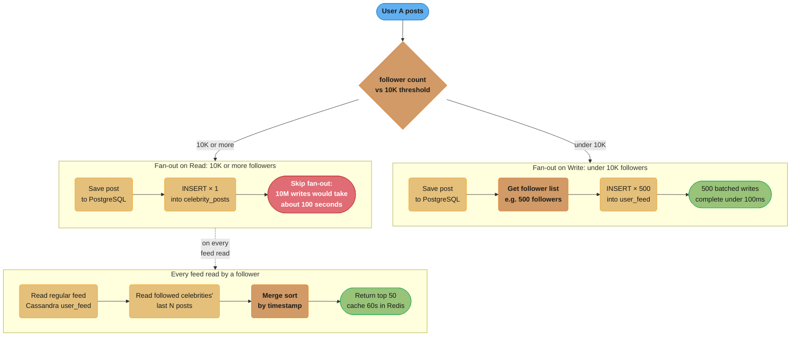
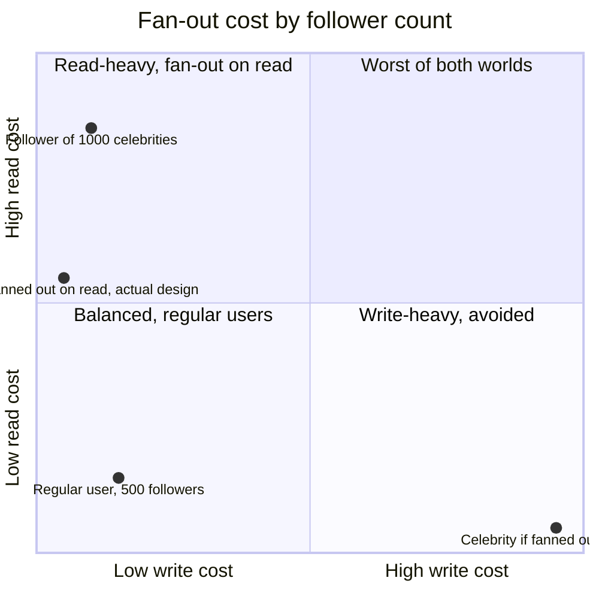
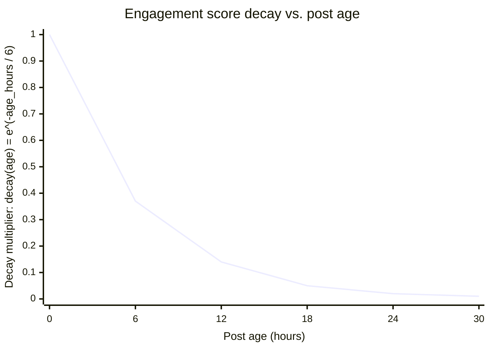

# Case Study: Design Social Media Feed Storage

## Problem Statement

Design the database architecture for a social media platform's feed system:

- 500 million registered users; 100 million daily active users (DAU)
- Users follow other users; average follower count = 500; median = 50; top celebrities = 100M followers
- Every user has a home feed showing posts from people they follow, newest first
- Users post 300 million new posts per day (3,500 posts/second)
- Feed reads: each DAU views feed 3x per day = 300M feed reads/day (3,500 reads/second average; 50K peak)
- Feed must load within 200ms P99
- Posts older than 30 days can be excluded from feed (shows recent content only)
- Trending posts (global + per-category) computed in near-real-time
- Post like/comment counts visible on feed (approximate acceptable)

---

## Architecture Overview

```mermaid
flowchart TD
    classDef io      fill:#61afef,stroke:#2e86c1,color:#1a1a1a,font-weight:bold
    classDef frozen  fill:#c678dd,stroke:#9b59b6,color:#fff
    classDef train   fill:#98c379,stroke:#27ae60,color:#1a1a1a
    classDef mathOp  fill:#d19a66,stroke:#e67e22,color:#1a1a1a,font-weight:bold
    classDef lossN   fill:#e06c75,stroke:#c0392b,color:#fff,font-weight:bold
    classDef req     fill:#56b6c2,stroke:#0097a7,color:#1a1a1a
    classDef base    fill:#e5c07b,stroke:#f39c12,color:#1a1a1a

    subgraph postFlow["POST new post"]
        direction LR
        pClient(["Client"]) --> pApi("API") --> pPg[("PostgreSQL<br/>posts, user_profiles")]
        pApi -.->|"outbox event<br/>PostCreated"| pFanout{"Fan-out Service<br/>reads follower list"}
        pFanout -->|"under 10K followers<br/>fan-out on write"| pCass[("Cassandra<br/>write to each<br/>follower's feed")]
        pFanout -->|"10K or more followers<br/>fan-out on read"| pAgg("Aggregate at read time<br/>celebrity feed + regular feed")
    end

    subgraph readFlow["READ feed"]
        direction LR
        rClient(["Client"]) --> rApi("API") --> rRedis[("Redis feed cache<br/>top 50 posts, 60s TTL")]
        rRedis -->|"cache hit"| rReturn(["Return to client"])
        rRedis -.->|"cache miss"| rCass[("Cassandra<br/>user_feed partition")]
        rCass --> rPaginate("Paginate by<br/>timestamp cursor") --> rFetch("Fetch post details<br/>Redis or PostgreSQL") --> rMerge("Merge celebrity posts<br/>fan-out on read") --> rReturn
    end

    subgraph trendFlow["Trending pipeline"]
        direction LR
        tPost(["Post created"]) --> tKafka(["Kafka"]) --> tAgg("Trending Aggregator") --> tScore{"score = likes + comments<br/>+ shares, decay function"} --> tZset[("Redis Sorted Set<br/>trending:global, trending:tech")]
    end

    class pClient,rClient,rReturn,tPost io
    class pApi,rApi,tKafka req
    class pPg,pCass,rRedis,rCass,tZset base
    class pFanout,rPaginate,rFetch,rMerge,tAgg,tScore mathOp
    class pAgg frozen
```



Three independent flows share the same stores: writes fan out synchronously for regular users (under 10K followers) but defer to read-time aggregation for celebrities; reads check the Redis feed cache before falling back to Cassandra; and engagement events score posts into a decaying Redis Sorted Set for trending.

---

## Key Design Decisions

### 1. PostgreSQL for User Profiles and Post Metadata

```sql
-- User profiles: structured, relational, low write rate
CREATE TABLE users (
    id              UUID PRIMARY KEY DEFAULT gen_random_uuid(),
    username        VARCHAR(50) UNIQUE NOT NULL,
    display_name    VARCHAR(100),
    bio             TEXT,
    follower_count  INT DEFAULT 0,
    following_count INT DEFAULT 0,
    post_count      INT DEFAULT 0,
    created_at      TIMESTAMPTZ DEFAULT now(),
    is_celebrity    BOOLEAN GENERATED ALWAYS AS (follower_count >= 10000) STORED
);

-- Social graph: who follows whom
CREATE TABLE follows (
    follower_id UUID NOT NULL REFERENCES users(id),
    followee_id UUID NOT NULL REFERENCES users(id),
    created_at  TIMESTAMPTZ DEFAULT now(),
    PRIMARY KEY (follower_id, followee_id)
);
CREATE INDEX idx_follows_followee ON follows (followee_id, follower_id);

-- Posts: source of truth for post content
CREATE TABLE posts (
    id          UUID PRIMARY KEY DEFAULT gen_random_uuid(),
    author_id   UUID NOT NULL REFERENCES users(id),
    content     TEXT NOT NULL,
    media_urls  TEXT[],
    created_at  TIMESTAMPTZ DEFAULT now(),
    is_deleted  BOOLEAN DEFAULT FALSE
) PARTITION BY RANGE (created_at);
-- Monthly partitions; posts older than 1 year moved to cold storage

CREATE INDEX idx_posts_author_date ON posts (author_id, created_at DESC)
    WHERE is_deleted = FALSE;
```

### 2. Cassandra for Feed Storage (Time-Series, Write-Heavy)

```sql
-- Cassandra CQL schema
CREATE KEYSPACE social WITH replication = {
    'class': 'NetworkTopologyStrategy',
    'us-east': 3, 'eu-west': 3
};

-- Home feed: each user's personalized feed
-- Partition key: user_id (all feed entries for a user on same node)
-- Clustering key: created_at DESC, post_id (time-ordered within partition)
CREATE TABLE social.user_feed (
    user_id    UUID,
    created_at TIMESTAMP,
    post_id    UUID,
    author_id  UUID,
    PRIMARY KEY (user_id, created_at, post_id)
) WITH CLUSTERING ORDER BY (created_at DESC)
  AND default_time_to_live = 2592000  -- 30 days TTL (posts auto-expire from feed)
  AND compaction = {
      'class': 'TimeWindowCompactionStrategy',
      'compaction_window_unit': 'DAYS',
      'compaction_window_size': 1
  };

-- Celebrity posts: celebrities' posts stored separately (fan-out on read)
CREATE TABLE social.celebrity_posts (
    author_id  UUID,
    created_at TIMESTAMP,
    post_id    UUID,
    PRIMARY KEY (author_id, created_at)
) WITH CLUSTERING ORDER BY (created_at DESC)
  AND default_time_to_live = 2592000;

-- Read feed for user 42: get last 50 posts
SELECT post_id, author_id, created_at
FROM social.user_feed
WHERE user_id = ?
ORDER BY created_at DESC
LIMIT 50;

-- This query hits a single Cassandra node (partition key = user_id)
-- O(log N) within the partition via clustering key ordering
-- Latency: 5-15ms
```

### 3. Fan-Out Strategy: Write vs Read



The 10K-follower threshold is configurable: a user who crosses it keeps existing fan-out-on-write feed entries while new posts switch to fan-out-on-read, so the backlog drains gradually rather than migrating all at once.



Fan-out-on-write is cheap for regular users but would push a celebrity's 10M followers into the worst-case top-right cell; switching celebrities to fan-out-on-read trades that for elevated read cost, which becomes extreme for a user following 1000 celebrities — the scenario the caching and batching mitigations below exist to solve.

### 4. Redis for Trending and Leaderboards

```
Trending posts (decay-based scoring):

Score = likes + (2 × comments) + (3 × shares) × decay(age)
decay(age) = e^(-age_hours / 6)  -- half-life of 6 hours

Redis Sorted Sets:
  Key: trending:global
  Members: post_id
  Score: above formula, updated on each like/comment/share event

  ZADD trending:global <score> <post_id>   -- update on engagement event
  ZREVRANGE trending:global 0 9            -- top 10 trending posts
  ZREMRANGEBYSCORE trending:global 0 <threshold>  -- cleanup old low-score posts

Per-category trending:
  trending:tech, trending:sports, trending:music, ...
  Same structure; posts tagged with category

Like counts (approximate, Redis INCR):
  INCR post:likes:{post_id}
  EXPIRE post:likes:{post_id} 86400  -- 24-hour TTL; sync to PostgreSQL nightly

Follower-specific trending (N personalized leaderboards):
  Not practical for 500M users; use global trending as proxy for feed discovery
```



The decay multiplier applied to likes, comments, and shares falls to about a third by hour 6 and under 5% by hour 18, so old posts naturally drop out of contention — ZREMRANGEBYSCORE only has to sweep the near-zero tail rather than actively rank every post by age.

---

## Implementation

### Feed Service

```java
@Service
public class FeedService {

    public List<Post> getFeed(UUID userId, String cursor, int limit) {
        String cacheKey = "feed:" + userId + ":" + cursor;

        // L1: Redis feed cache (60s TTL)
        List<UUID> cachedPostIds = redis.opsForList().range(cacheKey, 0, limit - 1);
        if (cachedPostIds != null && !cachedPostIds.isEmpty()) {
            return postService.fetchByIds(cachedPostIds);
        }

        // L2: Cassandra regular feed
        LocalDateTime cursorTime = parseCursor(cursor);
        List<FeedEntry> regularFeed = feedRepo.getUserFeed(userId, cursorTime, limit);

        // L2b: Fetch celebrity posts and merge
        List<UUID> followedCelebrities = userRepo.getCelebrityFollowees(userId);
        List<FeedEntry> celebrityFeed = fetchCelebrityPosts(followedCelebrities, cursorTime);

        // Merge sort by timestamp (in-memory, small lists)
        List<FeedEntry> merged = mergeSortByTime(regularFeed, celebrityFeed);
        List<UUID> postIds = merged.stream()
            .limit(limit)
            .map(FeedEntry::getPostId)
            .collect(toList());

        // Populate cache
        if (!postIds.isEmpty()) {
            redis.opsForList().rightPushAll(cacheKey, postIds);
            redis.expire(cacheKey, Duration.ofSeconds(60));
        }

        return postService.fetchByIds(postIds);
    }
}
```

### Fan-Out Service

```java
@Service
public class FanOutService {

    @Async("fanOutExecutor")  // Async thread pool: 50 threads
    public void fanOut(UUID postId, UUID authorId, Instant createdAt) {
        User author = userRepo.findById(authorId).orElseThrow();

        if (author.isCelebrity()) {
            // Celebrity: only write to celebrity_posts table (fan-out on read)
            celebrityPostsRepo.save(authorId, createdAt, postId);
            return;
        }

        // Regular user: fan-out to all followers
        // Stream followers in pages to avoid loading all into memory
        followerRepo.streamFollowers(authorId)
            .buffer(500)  // Batch 500 Cassandra writes at a time
            .forEach(batch -> {
                feedRepo.batchInsert(batch.stream()
                    .map(follower -> FeedEntry.of(follower.getId(), createdAt, postId, authorId))
                    .collect(toList())
                );
            });
    }
}
```

### Engagement Events and Like Counts

```java
@Service
public class EngagementService {

    public void likePost(UUID userId, UUID postId) {
        // Fast path: Redis INCR (atomic, sub-millisecond)
        String likeKey = "post:likes:" + postId;
        long newLikeCount = redis.opsForValue().increment(likeKey);
        redis.expire(likeKey, Duration.ofDays(1));

        // Update trending score (async)
        double score = computeTrendingScore(postId);
        redis.opsForZSet().add("trending:global", postId.toString(), score);

        // Persist like relationship (eventual, async via Kafka)
        kafkaTemplate.send("engagement.events",
            EngagementEvent.like(userId, postId, Instant.now()));
    }

    // Background job: sync Redis like counts to PostgreSQL nightly
    @Scheduled(cron = "0 2 * * *")
    public void syncLikeCounts() {
        Set<String> keys = redis.keys("post:likes:*");
        for (String key : keys) {
            Long count = redis.opsForValue().get(key);
            UUID postId = extractPostId(key);
            postRepo.updateLikeCount(postId, count);
        }
    }
}
```

---

## Tradeoffs and Alternatives

| Decision | Choice | Alternative | Reason |
|----------|--------|-------------|--------|
| Feed storage | Cassandra | PostgreSQL partitioned | Cassandra's partition-by-user_id puts each user's feed on one node; 3,500 writes/second easily handled; 30-day TTL built-in |
| Fan-out threshold | 10K followers | No threshold (always read) | Full fan-out on read for all users requires fetching N followees' posts; for 500 followees = 500 Cassandra queries per feed read |
| Like counts | Redis INCR | PostgreSQL UPDATE | PostgreSQL UPDATE at 50K likes/second creates hot row contention; Redis is 100x faster for counters |
| Celebrity detection | Static threshold | Dynamic | Dynamic threshold adds complexity; 10K is a reasonable Cassandra write budget per post |
| TWCS | TWCS compaction | STCS | TWCS optimizes for time-series access; drops entire time windows at TTL efficiently |
| Trending | Redis Sorted Set | PostgreSQL queries | Trending requires real-time score updates and top-N queries; Redis Sorted Set is O(log N) for updates and O(K) for top-K |

---

## Interview Discussion Points

**Q: Why Cassandra instead of PostgreSQL for feed storage?**
Feed writes are 3,500 posts/second × average 500 followers = 1.75M Cassandra writes/second (fan-out on write for non-celebrities). PostgreSQL cannot handle this write throughput on a single node. Cassandra's leaderless architecture distributes writes across the cluster. The feed access pattern is a perfect match for Cassandra's data model: partition by user_id (all of a user's feed on one node), cluster by created_at DESC (natural time-ordered retrieval). The 30-day TTL is handled by Cassandra natively — no need for explicit deletion jobs. TWCS compaction efficiently drops old data windows.

**Q: How does fan-out on write vs fan-out on read work and when do you switch?**
Fan-out on write: when a user posts, write the post ID to each follower's feed partition in Cassandra immediately. Fast reads (single Cassandra query), but write amplification = N writes per post (N = follower count). For a user with 500 followers: 500 writes, manageable. For a celebrity with 10M followers: 10M writes takes 3+ hours — unacceptable. Fan-out on read: don't pre-populate followers' feeds. At read time, query the author's posts table and merge with the user's regular feed. Scales writes (1 write per post) at the cost of read complexity (N queries to celebrities' post tables, in-memory merge). Switch at the point where fan-out on write latency or cost is prohibitive (~10K followers is a common threshold).

**Q: How do you handle a user who follows 1000 celebrities?**
A user following 1000 celebrities would require 1000 Cassandra reads per feed load (one per celebrity's post table). Mitigation: (1) Cap celebrity follows at 500 for feed computation (UI allows following more, but feed only shows top 500 by engagement). (2) Batch the celebrity post fetches into parallel requests (10 batches of 50, each batched as a Cassandra `IN` query). (3) Cache the merged celebrity feed in Redis per user (60s TTL) — repeat feed loads within 60s are served from cache. (4) Pre-compute celebrity feed merges asynchronously for high-engagement users, storing the result in Redis before the user requests it.

**Q: How do you design for viral posts that exceed the 30-day feed TTL?**
The 30-day TTL means posts older than 30 days disappear from feeds. For viral posts: (1) Posts are still in PostgreSQL (source of truth, no TTL). (2) If a post goes viral after 30 days, it can be promoted to trending (Redis Sorted Set has no TTL — scores just decay). (3) Users can still access the post directly via URL or profile browse. (4) The feed design intentionally shows recent content — viral old posts appear through other discovery mechanisms (trending, recommendations, direct shares).
