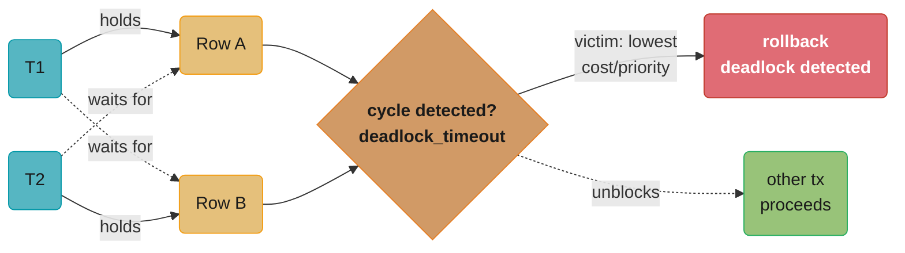
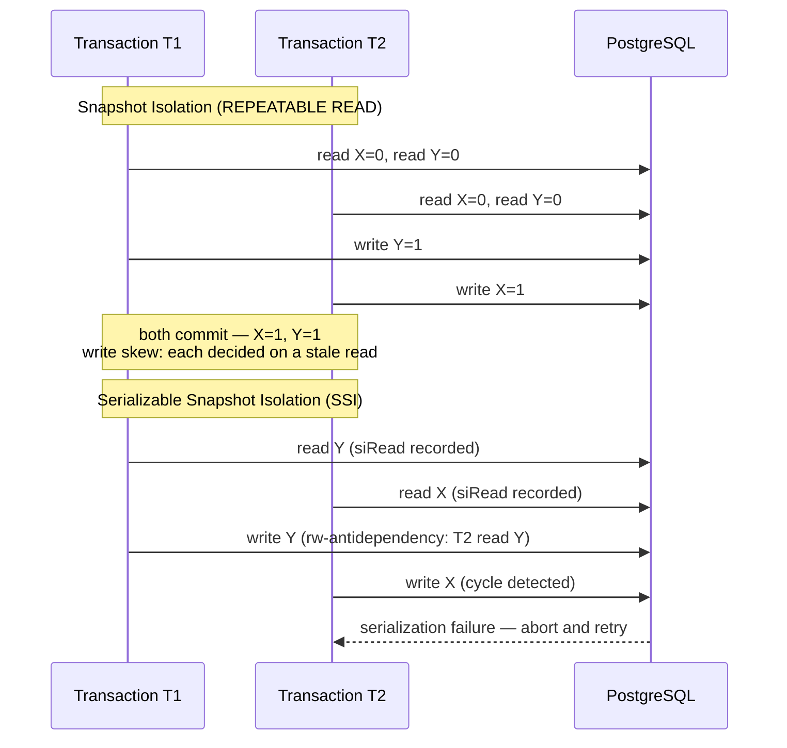
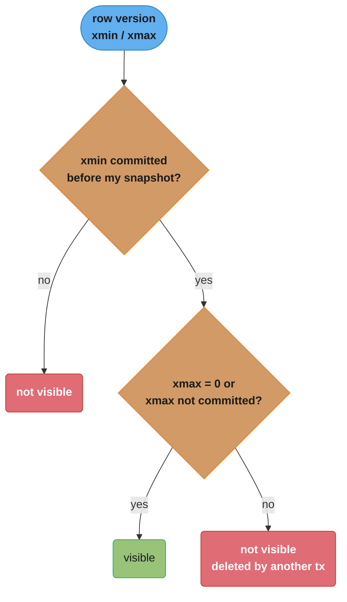
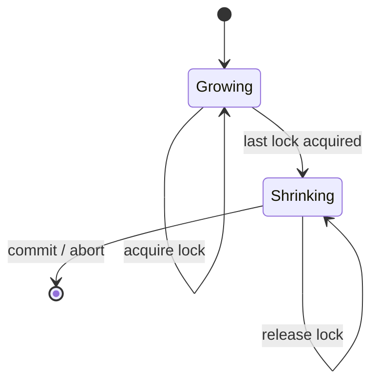

# Concurrency Control and Locking

## 1. Concept Overview

Concurrency control ensures that concurrent database transactions produce results equivalent to some serial execution. Two main approaches: pessimistic (locking — block conflicting operations) and optimistic (MVCC — allow concurrent reads/writes, detect conflicts at commit). Understanding when each wins, and the specific lock types and anomalies involved, is critical for building correct concurrent applications.

---

## 2. Intuition

- **Pessimistic locking** is like a bathroom with a key: only one person at a time, everyone else waits at the door.
- **MVCC** is like a document with version history: readers see the last committed version while writers create a new one — no waiting.
- **Key insight**: Most read-heavy workloads benefit enormously from MVCC (readers never block). Write-heavy workloads with conflicting keys still require row-level locks even in MVCC systems.

---

## 3. Core Principles

### Lock Compatibility Matrix

```
           S (Shared)   X (Exclusive)   U (Update)
S            Yes           No              Yes
X            No            No              No
U            Yes           No              No

IS (Intent Shared)    compatible with: IS, IX, S, U
IX (Intent Exclusive) compatible with: IS, IX
SIX (Share + IX)      compatible with: IS

Intent locks (IS, IX) are placed on parent objects (table, page)
to prevent conflicting locks on children without scanning all child locks.
```

**What this actually says.** "Any number of readers may share a row, but a writer needs it to itself — so the only 'Yes' in the whole matrix is the one where nobody intends to modify anything."

The matrix looks like nine independent facts, but it collapses to a single rule: `S` conflicts only with `X`; `X` conflicts with everything. Everything else in the table is bookkeeping that lets the engine reach that answer without walking every child lock.

| Symbol | What it is |
|--------|------------|
| `S` (Shared) | Read lock. Held while a transaction reads a row it must not see change |
| `X` (Exclusive) | Write lock. Held while a transaction modifies a row |
| `U` (Update) | "I am reading this, and I intend to upgrade to `X`." Blocks other `U` holders so two readers cannot both decide to upgrade |
| `IS` / `IX` | Intent locks on the *parent* (table, page): "somewhere below me an `S`/`X` exists" |
| `SIX` | Shared on the whole object plus intent-exclusive below it — reading everything, writing a part |
| "Yes" / "No" | Whether the row lock and the column lock can be held simultaneously by different transactions |

**Walk one example.** Two transactions reaching for the same row, and then the same table:

```
  row level
    T1 holds S, T2 wants S    ->  Yes    both read, neither blocks
    T1 holds S, T2 wants X    ->  No     T2 waits for T1 to commit
    T1 holds U, T2 wants S    ->  Yes    reading is still fine
    T1 holds U, T2 wants U    ->  No     only one transaction may plan to upgrade

  table level, without intent locks
    T2 wants a table-wide X on a 50,000,000-row table
    -> must scan every row's lock state to know if any S exists    = 50,000,000 checks

  table level, with intent locks
    T1 already placed IS on the table when it took its row S
    T2 asks: is table-X compatible with IS?  -> No                 = 1 check
```

**Why `U` exists at all.** Without it, the classic upgrade deadlock is unavoidable: two transactions both take `S` on a row (compatible, both succeed), then both try to upgrade to `X`, and each waits for the other to release its `S` — a cycle with no victim-free exit. The `U` lock breaks the symmetry up front by being incompatible with itself, so the second transaction blocks *before* it has acquired anything, where blocking is harmless.

### MVCC Overview (PostgreSQL)

```
Transaction T1 starts: snapshot = {min_xid=100, max_xid=105, active=[102,103]}
Visible row version: xmin committed AND xmin < max_xid AND xmax not committed or xmax > max_xid

Row versions:
+--------+------+-------+------+
| xmin   | xmax | data  | ctid |
+--------+------+-------+------+
|  99    |  0   | Alice | ...  |  ← visible (xmin=99 committed before snapshot, xmax=0 means not deleted)
|  102   |  0   | Bob   | ...  |  ← NOT visible (xmin=102 is in active list = not committed when snapshot taken)
|  104   |  0   | Carol | ...  |  ← NOT visible (xmin=104 >= max_xid=105... actually visible, 104 < 105 and committed)
+--------+------+-------+------+
```

**Read it like this.** "Show me a row version only if the transaction that created it had already finished when I started, and the transaction that deleted it had not."

MVCC never asks "what is the current value?" It asks "what was true at my snapshot instant?" Reads therefore need no locks at all — the answer is a property of the snapshot, and no concurrent writer can change history.

| Symbol | What it is |
|--------|------------|
| `xmin` | Transaction ID that **created** this row version |
| `xmax` | Transaction ID that **deleted** or superseded it. `0` means still live |
| `min_xid` (100) | Every transaction below this had already committed when the snapshot was taken |
| `max_xid` (105) | The snapshot's ceiling. Anything at or above it started after me and is invisible by definition |
| `active=[102,103]` | Transactions that were still in flight at snapshot time — invisible even though their IDs are below the ceiling |
| `ctid` | Physical location of this version. How the version chain is linked, not part of visibility |

**Walk one example.** The snapshot `100:105:102,103` against the three row versions above:

```
  snapshot: min_xid = 100, max_xid = 105, active = [102, 103]

  Carol row, xmin = 104, xmax = 0
    is 104 >= max_xid 105?        no      -> not a future transaction
    is 104 in active [102,103]?   no      -> was not in flight at snapshot time
    is 104 committed?             yes     -> creator finished before me
    is xmax = 0?                  yes     -> nobody has deleted it
    VISIBLE

  Bob row, xmin = 102, xmax = 0
    is 102 in active [102,103]?   YES     -> in flight when I took my snapshot
    NOT VISIBLE                            (fails at the first gate, no further checks)

  Alice row, xmin = 99, xmax = 0
    is 99 < min_xid 100?          yes     -> committed long ago, no lookup needed
    is xmax = 0?                  yes
    VISIBLE
```

Note the shortcut on Alice: anything below `min_xid` skips the commit-status lookup entirely, because the snapshot's lower bound is a promise that all such transactions are already committed. This is why `min_xid` is carried around at all — it turns the common case into an integer comparison instead of a `pg_xact` probe.

**What breaks without `xmax`.** A row would only ever be created, never retired, so a `DELETE` would have to physically remove the tuple — and any older snapshot still entitled to see it would find a hole. Storing the deleter's transaction ID instead lets one physical row serve readers on both sides of the delete simultaneously. The cost is that dead versions accumulate until `VACUUM` reclaims them, which is the direct price MVCC pays for lock-free reads.

---

## 4. Types / Architectures / Strategies

### Optimistic Concurrency Control

Read without locks, validate at commit time that no conflicting writes occurred.

```sql
-- Optimistic: version-based
BEGIN;
SELECT stock, version FROM products WHERE id = 42;
-- Read: stock=5, version=7

-- Application logic: decrement stock
UPDATE products SET stock = 4, version = 8
WHERE id = 42 AND version = 7;  -- will fail if another tx changed version

-- Check: if rows_affected = 0, conflict detected → retry
COMMIT;
```

Best for: low-conflict workloads (most reads succeed without conflicting writes). Higher throughput, no blocking. More complex retry logic in application.

The "low-conflict" qualifier is quantifiable. If `p` is the probability a given attempt loses the version check, the expected number of attempts is:

```
  E[attempts] = 1 / (1 - p)
```

**The idea behind it.** "Optimistic control is free when conflicts are rare and ruinous when they are not — and the crossover is much sharper than the word 'optimistic' suggests."

| Symbol | What it is |
|--------|------------|
| `p` | Probability that another transaction bumped `version` between your `SELECT` and your `UPDATE` |
| `1 - p` | Probability an attempt succeeds — the `rows_affected = 1` case |
| `E[attempts]` | Average number of full read-modify-write cycles per logical operation |
| `version` | The optimistic token. Any monotonic value works; a timestamp or a row hash serves the same role |
| `rows_affected = 0` | The conflict signal. Not an error — the `WHERE version = 7` predicate simply matched nothing |

**Walk one example.** The same code path at five different contention levels:

```
    p        E[attempts]      wasted work
  0.01         1.0101            1.0%       rare conflict, optimistic is nearly free
  0.05         1.0526            5.3%
  0.10         1.1111           11.1%       still comfortably better than blocking
  0.30         1.4286           42.9%       nearly half the database work is discarded
  0.50         2.0000          100.0%       every operation runs twice on average
  0.90        10.0000          900.0%       collapse: 10 round trips per success
```

At `p = 0.9` the pattern is not merely slow — it is actively harmful, because each doomed attempt still consumed a connection, a snapshot, and a round trip. That is the regime where `SELECT FOR UPDATE` wins: one transaction waits quietly instead of ten burning capacity.

**Where `p` comes from.** It is roughly the chance two concurrent transactions pick the same row, so it rises with write concurrency and falls with key cardinality. Decrementing stock on a catalog of 100,000 products has a tiny `p`; decrementing stock on the one product in a flash sale has `p` near 1. Same code, same schema — opposite correct answers, which is why the optimistic-vs-pessimistic choice belongs to the access pattern rather than to the table.

### Pessimistic Concurrency Control

Lock before reading to prevent conflicts.

```sql
-- Pessimistic: lock before modify
BEGIN;
SELECT stock FROM products WHERE id = 42 FOR UPDATE;  -- Takes X lock
-- No other transaction can modify this row until commit
UPDATE products SET stock = stock - 1 WHERE id = 42;
COMMIT;
```

Best for: high-conflict workloads (frequent contention on same rows), short transactions, when retry cost is high (external API calls inside transaction).

### SELECT FOR UPDATE Variants

```sql
-- Standard: wait for lock
SELECT * FROM jobs WHERE status = 'pending' ORDER BY created_at LIMIT 1 FOR UPDATE;

-- SKIP LOCKED: skip rows already locked (job queue pattern)
SELECT * FROM jobs WHERE status = 'pending' ORDER BY created_at LIMIT 1
FOR UPDATE SKIP LOCKED;
-- Returns next available job that isn't being processed by another worker
-- If all pending jobs are locked, returns empty result

-- NOWAIT: fail immediately if locked
SELECT * FROM jobs WHERE id = 42 FOR UPDATE NOWAIT;
-- Raises: ERROR: could not obtain lock on row in relation "jobs"
-- Useful when you want to try-lock without waiting
```

### Advisory Locks

Application-defined locks via PostgreSQL functions. Not tied to table rows — used for distributed coordination.

```sql
-- Session-level advisory lock (held until released or session ends)
SELECT pg_advisory_lock(12345);  -- Blocks if another session holds it
-- ... critical section ...
SELECT pg_advisory_unlock(12345);

-- Transaction-level (auto-released at end of transaction)
SELECT pg_advisory_xact_lock(12345);

-- Try-lock (non-blocking)
SELECT pg_try_advisory_lock(12345);  -- Returns true if acquired, false if not
-- Use case: ensure only one cron worker runs at a time
-- SELECT pg_try_advisory_lock(hashtext('generate_monthly_report'))

-- With bigint pair for namespacing
SELECT pg_advisory_lock(class_id, object_id);
```

---

## 5. Architecture Diagrams

**Deadlock detection (wait-for graph).** T1 holds Row A and waits for Row B; T2 holds Row B and waits for Row A — that mutual wait is the cycle every deadlock detector looks for.



PostgreSQL's background process checks for this cycle every `deadlock_timeout` (1s default) and aborts the lowest-cost/priority transaction with `ERROR: deadlock detected`; InnoDB instead detects continuously (no timeout) and picks the victim holding the fewest row locks to minimize rollback cost.

```
GAP LOCKS AND NEXT-KEY LOCKS (InnoDB REPEATABLE READ):

Existing rows: [10, 20, 30, 50]
Query: SELECT * FROM t WHERE id BETWEEN 15 AND 45 FOR UPDATE;

Locks acquired:
  Gap lock: (10, 20) — prevents insert of 11-19
  Record lock: row 20 — prevents modification
  Next-key lock: (20, 30] — locks gap + record 30
  Next-key lock: (30, 50] — locks gap + record 50 (even though 50 > 45)

Purpose: prevent phantom reads at REPEATABLE READ
Any INSERT of id=25 or id=35 is blocked until this transaction commits.
```

**Stated plainly.** "To stop a row that does not exist yet from appearing, InnoDB has to lock the empty space where it would go — so a range query locks intervals, not just rows."

A record lock protects a value; a gap lock protects an absence. Phantom prevention is impossible with record locks alone, because there is no record to lock. This single fact explains every surprising gap-lock outage.

| Symbol | What it is |
|--------|------------|
| `(a, b)` | Gap lock — the open interval strictly between two existing keys. Blocks inserts, locks no actual row |
| `[b]` | Record lock — one existing row, blocking modification of it |
| `(a, b]` | Next-key lock — gap plus the record at its upper bound. InnoDB's default unit under REPEATABLE READ |
| existing keys | The index entries that define where the gaps are. Gaps are a property of the **index**, not the query |
| phantom | A row that did not exist at first read but appears on re-read, because someone inserted into the range |

**Walk one example.** Rows `[10, 20, 30, 50]`, query `WHERE id BETWEEN 15 AND 45 FOR UPDATE`:

```
  index keys:      10        20        30        50
  gaps:         ...  (10,20)   (20,30)   (30,50)  ...

  query range 15..45 touches:

    (10, 20)    gap lock        blocks inserts of 11..19    covers where 15 would land
    [20]        record lock     row 20 is in range
    (20, 30]    next-key lock   blocks inserts 21..29, plus row 30
    (30, 50]    next-key lock   blocks inserts 31..49, plus row 50

  effective blocked insert range:  11 .. 49       = 39 values
  values the query actually asked for: 15 .. 45   = 31 values
  over-locking:  39 - 31 = 8 extra values, and row 50 which is outside the range entirely
```

The lock reaches to `50` even though the query stopped at `45`, because `(30, 50]` is the smallest next-key unit containing `45` — InnoDB cannot lock "up to 45" without knowing 45 is a boundary, and it is not one. Gap width is set by the data, not the predicate.

**Why this is an availability risk, not just a correctness detail.** Sparse indexes make gaps enormous. If the orders table has one row per day and a reporting query takes `FOR UPDATE` over a month, the gaps between those daily keys cover every possible insert for the month — which is precisely the 80% insert-rate collapse described in Pitfall 3. Dropping to `READ COMMITTED` removes gap locks entirely (accepting phantoms) and is the standard fix for read-only reporting connections.

**MVCC snapshot isolation vs. SSI (write skew).** Two transactions each read `X=0, Y=0`, each write only the variable the other didn't touch, and both commit cleanly under plain snapshot isolation — yet the combined result violates an invariant neither transaction could see alone.



Plain snapshot isolation lets the write skew through because neither transaction re-reads the other's write; PostgreSQL's SSI additionally tracks rw-antidependencies between concurrent transactions and aborts one side the moment those dependencies close into a cycle.

**MVCC row-visibility decision logic.** The visibility rule from the MVCC overview above — xmin committed AND xmin before the snapshot's max_xid AND xmax not committed or beyond max_xid — reads as a formula, but it is really just two yes/no checks.



A row version is visible only when both checks pass: its creator committed before the snapshot was taken, and its deleter — if any — had not committed by that same snapshot; miss either check and the reader falls through to a different, still-committed version instead of blocking.

**Two-phase locking (2PL): growing vs. shrinking phase.** 2PL is the mechanism underlying every lock-based scheme above — it guarantees serializability by forbidding a transaction from acquiring any new lock once it has released one.



Once a transaction crosses into the shrinking phase it can only give locks back, never take a new one — that one-way switch is what rules out the interleavings that would break serializability. Strict 2PL, what most databases actually run, delays the entire shrinking phase until commit or abort, trading extra contention for freedom from cascading aborts.

---

## 6. How It Works — Detailed Mechanics

### Lock Escalation (SQL Server / Oracle)

Row-level locks consume memory. If a transaction acquires too many row locks, the engine may escalate to a page lock, then a table lock to reduce lock overhead. Dangerous: one large update holds a table lock, blocking all other queries.

PostgreSQL does NOT escalate locks automatically. It uses intent locks (IS/IX at table level) + row locks, never escalating to table level based on row count.

### MVCC in PostgreSQL: Transaction Snapshot

```sql
-- Check your current transaction snapshot
SELECT * FROM txid_current_snapshot();
-- Returns: 100:105:102,103
-- Meaning: xmin=100 (all xacts < 100 are committed)
--          xmax=105 (my txid, all xacts >= 105 are future)
--          in-progress: [102, 103] (not committed when my snapshot was taken)

-- Row visibility:
-- xmin < 100: definitely visible (committed before my snapshot)
-- xmin in [102,103]: NOT visible (in-progress at my snapshot time)
-- xmin in [100,105) excluding [102,103]: check pg_xact for commit status
-- xmin >= 105: NOT visible (future transaction)
```

### Deadlock Example and Prevention

```sql
-- Common deadlock pattern:
-- Session 1: UPDATE accounts SET balance = balance - 100 WHERE id = 1; (holds lock on id=1)
--            UPDATE accounts SET balance = balance + 100 WHERE id = 2; (waits for id=2)
-- Session 2: UPDATE accounts SET balance = balance - 100 WHERE id = 2; (holds lock on id=2)
--            UPDATE accounts SET balance = balance + 100 WHERE id = 1; (waits for id=1)
-- → Deadlock!

-- Fix: Always acquire locks in consistent global order
-- Application enforces: always update lower id first
BEGIN;
UPDATE accounts SET balance = balance - 100 WHERE id = MIN(1, 2);  -- id=1 first
UPDATE accounts SET balance = balance + 100 WHERE id = MAX(1, 2);  -- id=2 second
COMMIT;
```

**What it means.** "A deadlock needs two transactions to disagree about the order of the same locks — so if every transaction sorts its locks the same way, disagreement becomes impossible and the deadlock rate drops to exactly zero."

This is a stronger guarantee than tuning `deadlock_timeout` or adding retries. Those manage deadlocks; consistent ordering eliminates the precondition that creates them.

| Symbol | What it is |
|--------|------------|
| `k` | Number of rows a transaction locks in one unit of work |
| `k!` | Number of distinct orders it could take them in, if the order is left to chance |
| `1 / k!` | Probability two independent transactions happen to choose the same order |
| `1 - 1/k!` | Probability they disagree — the window in which a cycle can form |
| global order | Any total ordering all code agrees on. Primary key ascending is the usual choice |

**Walk one example.** Two transactions touching the same `k` rows, with and without an enforced order:

```
   k     possible orders    P(agree) = 1/k!    P(disagree) = deadlock window
   2            2              0.50000              0.50000
   3            6              0.16667              0.83333
   4           24              0.04167              0.95833
   5          120              0.00833              0.99167

  With a global lock order enforced:
    possible orders = 1    ->    P(agree) = 1.0    ->    deadlock window = 0
```

The window does not merely grow with `k` — it approaches certainty. At `k = 5`, better than 99 in 100 concurrent pairs are ordered such that a cycle can form; the only reason production does not deadlock constantly is that the two transactions must also interleave within the same narrow time window. Add load and that saving grace disappears, which is why deadlocks characteristically appear at peak traffic and vanish in staging.

**Why the ORM case (Pitfall 5) is the common one.** Hibernate flushes a batch of dirty entities in whatever order its internal collection yields, so `k` is the batch size and the order is effectively random per transaction — the `1 - 1/k!` column above, applied to every flush. Sorting entities by primary key before the flush collapses `k!` to `1` at zero runtime cost, which is why it is the standard fix rather than raising the retry count.

### Write Skew Example and Fix

```sql
-- Write skew: doctors on-call system
-- Constraint: at least one doctor must be on-call

-- Broken (REPEATABLE READ / Snapshot Isolation):
-- T1: SELECT COUNT(*) FROM oncall WHERE on_duty=true → 2
-- T2: SELECT COUNT(*) FROM oncall WHERE on_duty=true → 2 (same snapshot)
-- T1: UPDATE oncall SET on_duty=false WHERE id=1;
-- T2: UPDATE oncall SET on_duty=false WHERE id=2;
-- Both commit → 0 doctors on call (constraint violated)

-- Fix 1: SERIALIZABLE isolation
BEGIN ISOLATION LEVEL SERIALIZABLE;
SELECT COUNT(*) FROM oncall WHERE on_duty=true;
-- ... make decision ...
UPDATE oncall SET on_duty=false WHERE id = :my_id;
COMMIT;
-- PostgreSQL SSI detects the rw-antidependency cycle → one transaction aborted

-- Fix 2: Explicit lock (SELECT FOR UPDATE)
BEGIN;
SELECT * FROM oncall WHERE on_duty=true FOR UPDATE;  -- Lock all on-call rows
-- Now COUNT > 1 → can go off-call
UPDATE oncall SET on_duty=false WHERE id = :my_id;
COMMIT;
```

---

## 7. Real-World Examples

- **Job queue** (`SELECT FOR UPDATE SKIP LOCKED`): Used by Sidekiq, Good Job (Rails), pg-boss (Node.js). Multiple workers claim jobs from the same table without contention — each gets a different row, locked exclusively.
- **Distributed lock via advisory lock**: Ensure only one instance of a batch job runs: `SELECT pg_try_advisory_lock(hashtext('nightly_cleanup'))`. Cron fires on 5 nodes, only one acquires the lock, others return immediately.
- **Banking transfer**: Always lock lower account ID first to prevent deadlocks. Lock both accounts before transferring.
- **InnoDB gap locks**: An e-commerce site using REPEATABLE READ found inserts being blocked by gap locks from a long-running SELECT. Fixed by switching to READ COMMITTED (no gap locks) or shortening transaction duration.
- **SERIALIZABLE for booking**: Flight booking system where "last seat" logic must be atomic. Two concurrent `SELECT count(*) = 0` + `INSERT booking` under SERIALIZABLE — one gets serialization failure and retries.

---

## 8. Tradeoffs

| Approach | Throughput | Complexity | Anomalies Prevented | Best For |
|----------|-----------|------------|---------------------|---------|
| Optimistic (MVCC) | High | Medium (retry logic) | Dirty reads, lost updates (with version check) | Read-heavy, low conflict |
| Pessimistic (S+X locks) | Lower (blocking) | Low | All, depending on level | Write-heavy, high conflict |
| SELECT FOR UPDATE | Medium | Low | Lost updates | Critical sections, queues |
| SERIALIZABLE (SSI) | Lower (aborts) | High (retry) | All, including write skew | Financial, booking |
| Advisory locks | High | Medium | Application-defined | Distributed coordination |

---

## 9. When to Use / When NOT to Use

**SELECT FOR UPDATE**: Use for read-modify-write patterns where the read value affects the write. Do not use when you don't need to read the current value before writing.

**SKIP LOCKED**: Use for job/task queue implementations where multiple workers process the same queue. Do not use when order of processing matters.

**Advisory locks**: Use for application-level distributed locking (cron exclusion, task coordination). Do not use as a substitute for row-level locks on data tables.

**SERIALIZABLE**: Use for financial transactions, seat booking, any logic with cross-row invariants. Do not use as a default — it causes higher abort rates and retry overhead.

**Optimistic concurrency**: Use when conflicts are rare and retry cost is low (simple DB operations). Do not use when the critical section includes external side effects (sending emails, charging credit cards) that cannot be safely retried.

---

## 10. Common Pitfalls

**Pitfall 1: Long-running transaction holding locks**
A data migration script ran a single transaction updating 50M rows. For 3 hours, every INSERT into that table was blocked by the implicit table-level lock. Fix: batch updates with explicit COMMIT every N rows. Set `lock_timeout = '5s'` to prevent indefinite waits.

**Pitfall 2: Missing lock in check-then-act**
```sql
-- Broken:
BEGIN;
SELECT COUNT(*) FROM seats WHERE flight_id=1 AND status='available'; -- Returns 1
-- Application: count > 0, proceed to book
INSERT INTO bookings (flight_id, seat_id) VALUES (1, 42);
UPDATE seats SET status='booked' WHERE flight_id=1 AND id=42;
COMMIT;
-- Two concurrent transactions both see count=1, both book the same seat

-- Fixed:
BEGIN;
SELECT id FROM seats WHERE flight_id=1 AND status='available' LIMIT 1 FOR UPDATE;
-- Now other transactions cannot also get this seat
INSERT INTO bookings ...;
UPDATE seats SET status='booked' WHERE id = :locked_id;
COMMIT;
```

**Pitfall 3: InnoDB gap locks blocking inserts**
Production alert: insert rate dropped 80% on an orders table. Root cause: a reporting query ran `SELECT * FROM orders WHERE created_at BETWEEN ... FOR UPDATE` (accidentally left FOR UPDATE). This took gap locks across the entire date range, blocking all INSERTs for new orders in that range. Fix: remove FOR UPDATE from read-only reporting queries. Use `READ COMMITTED` isolation for reporting connections.

**Pitfall 4: Advisory lock not released on exception**
```java
// Broken: exception skips unlock
jdbcTemplate.queryForObject("SELECT pg_advisory_lock(1)", Integer.class);
doSomethingThatThrows(); // Exception thrown here
jdbcTemplate.queryForObject("SELECT pg_advisory_unlock(1)", Integer.class); // Never called

// Fixed: use transaction-level advisory lock (auto-released)
jdbcTemplate.queryForObject("SELECT pg_advisory_xact_lock(1)", Integer.class);
// Or use try-finally in application code
```

**Pitfall 5: Deadlock due to inconsistent lock ordering in ORM**
Hibernate/JPA batched updates in arbitrary entity ordering. Two transactions updating the same set of records in different orders caused deadlocks. Fix: sort entities by primary key before updating, or use `@Lock(LockModeType.PESSIMISTIC_WRITE)` with consistent ordering.

---

## 11. Technologies & Tools

| Tool | Purpose |
|------|---------|
| `pg_locks` | View current locks held and waited-for |
| `pg_stat_activity` | See blocking/blocked queries |
| `lock_timeout` | Fail fast if lock not acquired in N ms |
| `deadlock_timeout` | How long PostgreSQL waits before deadlock check (1s default) |
| `pg_blocking_pids()` | Find which PID is blocking a given PID |
| `SELECT pg_cancel_backend(pid)` | Cancel a query (gentle) |
| `SELECT pg_terminate_backend(pid)` | Terminate a connection (forceful) |
| MySQL `SHOW ENGINE INNODB STATUS` | View lock waits and deadlock history |
| MySQL `performance_schema.data_locks` | Detailed lock information (MySQL 8) |

---

## 12. Interview Questions with Answers

**Q: What is the difference between pessimistic and optimistic concurrency control, and when does each win?**
Pessimistic: acquire locks before reading/writing to prevent conflicts. Optimistic: read without locks, validate at commit that no conflicts occurred, retry if conflict detected. Pessimistic wins when: conflict rate is high (many transactions compete for the same rows), retry cost is high (external side effects), transaction duration is long. Optimistic wins when: conflict rate is low (most transactions touch different rows), reads greatly outnumber writes, retry cost is low (pure DB operations). MVCC databases (PostgreSQL, InnoDB) implement optimistic concurrency for reads and pessimistic only when explicitly requested (SELECT FOR UPDATE).

**Q: Explain the MVCC xmin/xmax visibility mechanism in PostgreSQL.**
Every row version has xmin (ID of the transaction that inserted it) and xmax (ID of the transaction that deleted/updated it, or 0 if still current). A reading transaction takes a snapshot at start: it sees rows where xmin is committed before the snapshot AND xmax is either 0 or not committed yet in the snapshot. This means: reads never block on writes (reader sees old version while writer creates new version). Dead tuples (with committed xmax) accumulate until VACUUM reclaims them. The overhead: storage for multiple versions and background VACUUM process.

**Q: What is SELECT FOR UPDATE SKIP LOCKED and why is it ideal for job queues?**
SELECT FOR UPDATE SKIP LOCKED atomically locks and returns the first N rows not currently locked by another transaction. In a job queue: worker A runs `SELECT * FROM jobs WHERE status='pending' ORDER BY id LIMIT 1 FOR UPDATE SKIP LOCKED` — gets job 1, locks it. Concurrently, worker B runs the same query — skips locked job 1, gets job 2. No worker waits, no deadlocks, no double-processing. Without SKIP LOCKED, all workers would queue on the same lock. This pattern scales linearly with worker count up to the number of pending jobs.

**Q: How does PostgreSQL detect and resolve deadlocks?**
PostgreSQL runs a deadlock detector when a lock wait exceeds `deadlock_timeout` (default 1 second). The detector builds a wait-for graph: directed edges from "waiting transaction" to "transaction it waits for." If the graph has a cycle, a deadlock is detected. PostgreSQL selects a victim transaction (based on lock count and priority) and aborts it with "ERROR: deadlock detected." The victim's transaction is rolled back, releasing its locks, allowing the cycle to break. Best practice: design transactions to acquire locks in a consistent global order to prevent cycles from forming.

**Q: What is write skew and what are the two ways to prevent it?**
Write skew: two concurrent transactions each read a set of rows, make decisions based on the total state, and write changes that are individually consistent but together violate an invariant. Example: two concurrent doctor go-offline requests each see "2 doctors on call" and both proceed — result is 0 doctors on call. Prevention: (1) SERIALIZABLE isolation — PostgreSQL's Serializable Snapshot Isolation (SSI) tracks rw-antidependencies and aborts one of the conflicting transactions with "could not serialize access due to concurrent update." Application must retry. (2) SELECT FOR UPDATE on the rows that represent the shared state — both transactions contend for the same lock, serializing execution.

**Q: Explain gap locks in InnoDB and when they cause problems.**
Gap locks in InnoDB (at REPEATABLE READ) lock the gap between index entries, preventing phantom inserts. Example: `SELECT * FROM t WHERE id BETWEEN 10 AND 20 FOR UPDATE` locks the gap before 10, each gap between rows 10-20, and the gap after 20 — preventing any INSERT into this range until the transaction commits. Problem: a long-running OLAP query with FOR UPDATE (accidentally or intentionally) holding gap locks across large ranges blocks all new inserts for that range. Fix: (1) Use READ COMMITTED isolation for reporting — no gap locks. (2) Remove unintended FOR UPDATE from read queries. (3) Reduce transaction duration.

**Q: What are advisory locks and how would you use them to prevent duplicate cron job execution?**
Advisory locks are application-defined integer locks (not tied to table rows) managed by PostgreSQL. `pg_advisory_lock(key)` acquires a session-level lock — blocks if another session holds it. `pg_try_advisory_lock(key)` is non-blocking. Pattern for cron job exclusion: `SELECT pg_try_advisory_lock(hashtext('generate_daily_report'))`. If returns true: this instance got the lock, proceed with job, lock auto-releases when session ends. If returns false: another instance is running, exit. This is safe: the lock is held for the duration of the database session (or until explicitly released), preventing concurrent execution even across multiple application servers.

**Q: How does InnoDB's next-key lock differ from a record lock?**
A record lock locks exactly one row. A next-key lock = record lock on an existing row + gap lock on the gap before that row. InnoDB uses next-key locks at REPEATABLE READ to prevent phantom reads: `SELECT * FROM t WHERE id = 5` locks the record with id=5 AND the gap before 5, preventing insert of any row that would return under this query if re-executed. Record locks exist in all isolation levels. Next-key locks only at REPEATABLE READ and above. READ COMMITTED: only record locks (no gap locks) — allows phantom reads but better INSERT concurrency.

**Q: What is a lost update anomaly and how do three different mechanisms prevent it?**
Lost update: T1 and T2 both read a value (V=10), both compute new value (T1: V-1=9, T2: V+1=11), T2 commits V=11, T1 commits V=9 — T2's update is lost. Prevention mechanisms: (1) Atomic UPDATE: `UPDATE SET stock = stock - 1 WHERE id=? AND stock > 0` — no separate read; the modification is atomic at the engine level. (2) SELECT FOR UPDATE: T1 reads with exclusive lock — T2 blocks until T1 commits. (3) Optimistic concurrency with version: T1 updates WHERE version=N, T2 updates WHERE version=N — one gets rows_affected=0 and retries with new version.

**Q: What happens to MVCC row versions when a long-running transaction holds an old snapshot?**
Old row versions (dead tuples) cannot be cleaned up by VACUUM while any active transaction's snapshot is older than the xmin of those rows. The oldest active transaction ID (xmin horizon) determines how far back VACUUM can clean. A 4-hour reporting transaction that started at xid=1000 prevents VACUUM from cleaning any dead tuples from transactions 1000+. During those 4 hours, all UPDATE/DELETE operations accumulate dead tuples. Table size grows. Eventually, the table bloats to 2-5x its normal size. Fix: set `idle_in_transaction_session_timeout = '5min'` to abort stale transactions. Use read replicas for long-running reports (they have their own xmin, not affecting primary).

**Q: Explain the difference between row-level, page-level, and table-level locking.**
Row-level locks: finest granularity, maximum concurrency. Lock only the specific rows being accessed. Memory overhead: ~40 bytes per lock in PostgreSQL's lock table (pg_locks). Table-level locks: entire table blocked. Used for DDL (ALTER TABLE takes ACCESS EXCLUSIVE), explicit LOCK TABLE, or bulk operations. Page-level locks: intermediate, used by some systems (SQL Server's lock escalation) when row lock count gets too high. PostgreSQL: row locks + intent locks at table level (IS/IX) — no page-level locks. InnoDB: row locks + intent locks at table level. SQL Server: row → page → table escalation at 5,000+ locks per statement.

**Q: How do you find and kill blocking queries in PostgreSQL?**
```sql
-- Find blocking and blocked queries:
SELECT
  blocked_locks.pid AS blocked_pid,
  blocked_activity.query AS blocked_query,
  blocking_locks.pid AS blocking_pid,
  blocking_activity.query AS blocking_query,
  now() - blocked_activity.query_start AS blocked_duration
FROM pg_locks blocked_locks
JOIN pg_stat_activity blocked_activity ON blocked_activity.pid = blocked_locks.pid
JOIN pg_locks blocking_locks ON blocking_locks.locktype = blocked_locks.locktype
  AND blocking_locks.relation IS NOT DISTINCT FROM blocked_locks.relation
  AND blocking_locks.granted = true AND blocked_locks.granted = false
JOIN pg_stat_activity blocking_activity ON blocking_activity.pid = blocking_locks.pid;

-- Simpler: use pg_blocking_pids()
SELECT pid, pg_blocking_pids(pid), query FROM pg_stat_activity
WHERE cardinality(pg_blocking_pids(pid)) > 0;

-- Kill the blocker (graceful):
SELECT pg_cancel_backend(blocking_pid);
-- If that doesn't work (not in a cancellable state):
SELECT pg_terminate_backend(blocking_pid);
```

**Q: What is two-phase locking (2PL) and how does it guarantee serializability?**
2PL: a transaction acquires locks as needed (growing phase) and releases them only after all locks are acquired and operations complete (shrinking phase). No lock is released before the transaction commits or aborts. This guarantees serializability: if two transactions conflict, one must wait for the other to complete before acquiring the conflicting lock, creating a serial order. Strict 2PL (used by most databases): all locks held until commit/abort, preventing cascading aborts. Downside: high lock contention, possible deadlocks, reduced concurrency vs MVCC for read-heavy workloads.

**Q: How does SELECT FOR UPDATE interact with MVCC in PostgreSQL?**
Under MVCC, a SELECT normally reads a snapshot without acquiring any locks. SELECT FOR UPDATE adds an explicit exclusive row lock on the current (latest committed) version of each selected row — regardless of the snapshot. This means: even in REPEATABLE READ, SELECT FOR UPDATE sees the current committed state of the rows being locked (not the snapshot state), preventing a lock on a stale version that another transaction has already updated. If the locked row has been updated by a concurrent transaction that committed after your snapshot, PostgreSQL re-evaluates the query on the new version and either locks it or applies the filter predicates to the new version.

**Q: What is the difference between lock_timeout and statement_timeout in PostgreSQL?**
`lock_timeout`: if a statement cannot acquire a lock within this duration, it fails with "ERROR: canceling statement due to lock timeout." The transaction is not rolled back (only that statement fails). Use to prevent long blocking: `SET lock_timeout = '5s'` in application connections. `statement_timeout`: if a statement takes longer than this (including lock wait time), it is canceled. More aggressive — also catches long-running queries. `idle_in_transaction_session_timeout`: cancels sessions that have been in a transaction without activity for this long. Use all three together in production: lock_timeout prevents indefinite lock waits, statement_timeout prevents long queries, idle_in_transaction prevents zombie transactions holding locks.

---

## 13. Best Practices

1. Set `lock_timeout = '5s'` and `idle_in_transaction_session_timeout = '30s'` for all application connections.
2. Always acquire locks in a consistent global order (lower ID first) to prevent deadlocks.
3. Use `SELECT FOR UPDATE SKIP LOCKED` for job queues — never `SELECT FOR UPDATE` without SKIP LOCKED.
4. Use advisory locks for distributed cron exclusion rather than database-level locks on dummy rows.
5. Use SERIALIZABLE isolation for financial transactions; accept that serialization failures require retry.
6. Keep transactions short — the longer a transaction, the more lock contention it causes.
7. Use read replicas for long-running reports to avoid blocking VACUUM on the primary.
8. Monitor `pg_stat_activity WHERE wait_event_type = 'Lock'` in production alerting.
9. Test concurrency-related bugs with `pgbench` or jMeter with concurrent workers before release.
10. For MVCC dead tuple management: ensure autovacuum cost settings allow it to keep pace with write load.

---

## 14. Case Study

**Scenario**: An e-commerce platform's checkout service experiences periodic 10-second spikes where all checkout requests fail. Investigation shows "lock timeout" errors for 30-60 seconds every few hours. Table: `inventory`, 50M rows.

**Root cause investigation**:
```sql
SELECT pid, query, wait_event_type, wait_event, state, query_start
FROM pg_stat_activity
WHERE wait_event_type = 'Lock';
-- Shows: 200 connections waiting for lock on inventory table
-- One connection: SELECT * FROM inventory FOR UPDATE (entire table)
-- From: a background "inventory reconciliation" job running at 2 AM and 2 PM
```

The reconciliation job ran:
```sql
BEGIN;
SELECT * FROM inventory FOR UPDATE; -- Locks ALL rows
-- ... 45-second Python processing ...
UPDATE inventory SET reconciled_at = now();
COMMIT;
```

**Fixes applied**:

1. Remove `FOR UPDATE` from the SELECT (reconciliation only reads, doesn't need write lock):
```sql
BEGIN;
SELECT * FROM inventory; -- No lock
-- Process in application memory
UPDATE inventory SET reconciled_at = now() WHERE id = ANY(:ids_to_update);
COMMIT;
```

2. Batch the updates (process 1000 rows at a time, commit after each batch):
```sql
-- Application processes in chunks of 1000 rows
FOR chunk IN SELECT id FROM inventory ORDER BY id LIMIT 1000 OFFSET :offset:
    BEGIN;
    UPDATE inventory SET reconciled_at = now() WHERE id = ANY(:chunk);
    COMMIT;
```

3. Set lock timeout for the reconciliation job:
```sql
SET lock_timeout = '2s'; -- Fail fast if lock not acquired
SET statement_timeout = '10s'; -- No single statement runs too long
```

**Result**: Checkout failures during reconciliation: 0. Reconciliation time: unchanged (25 minutes total). The key insight: the long transaction holding FOR UPDATE on all rows was unnecessary — the application only needed read access for its computation, and the subsequent UPDATE was idempotent and could be batched.
