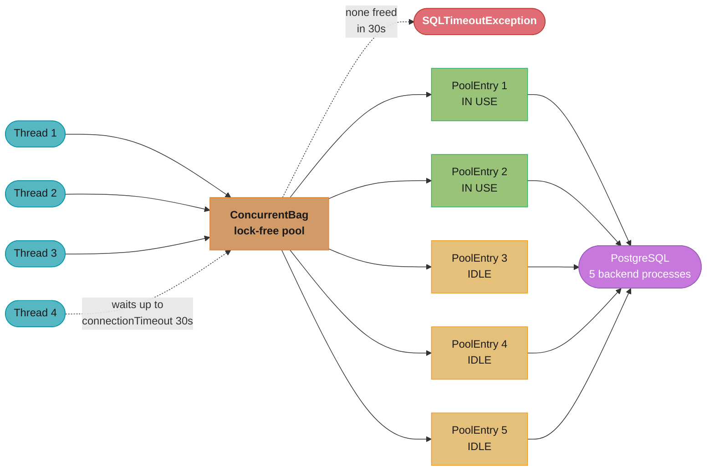
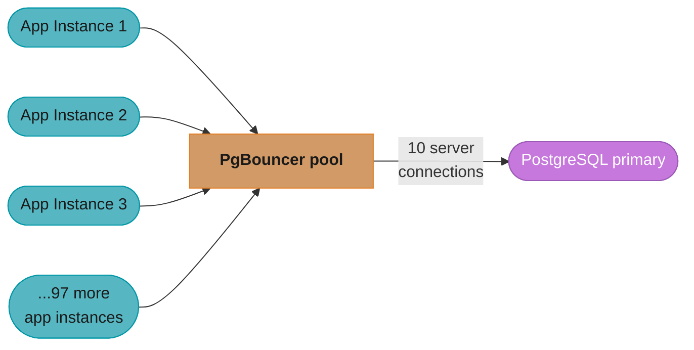
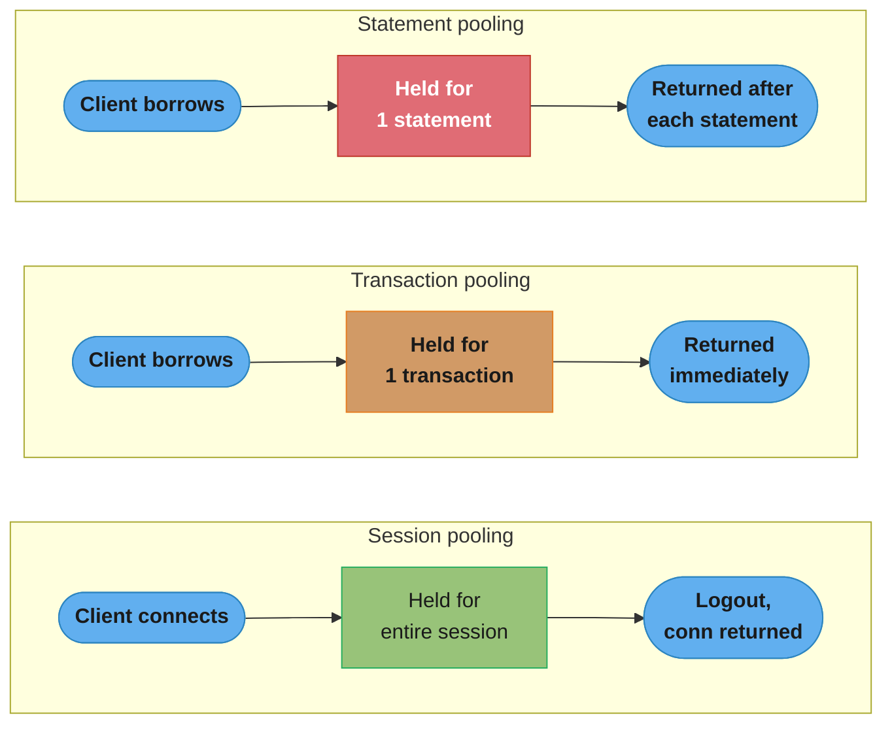
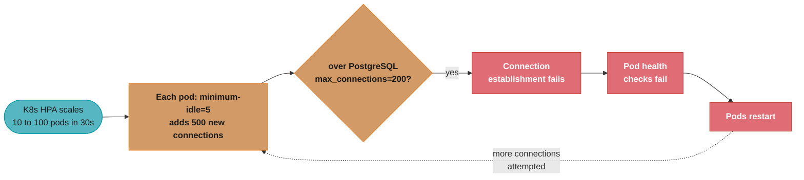
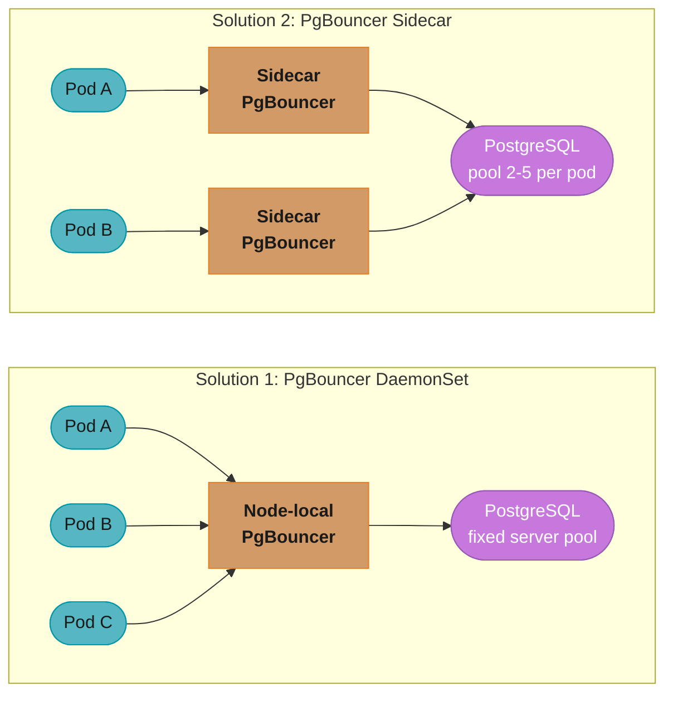
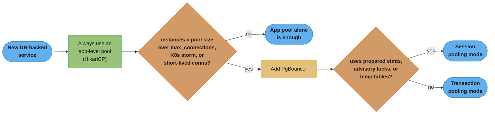
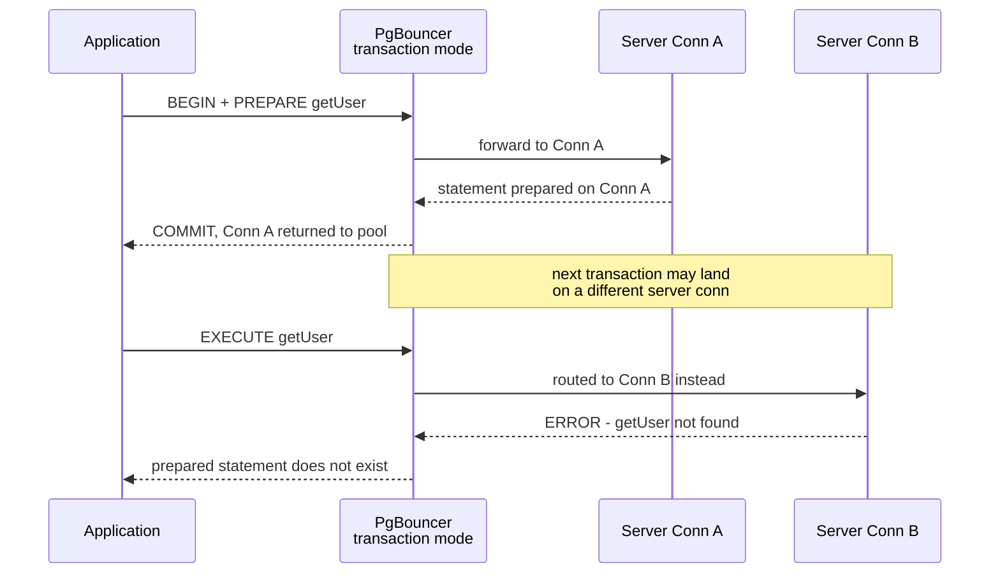
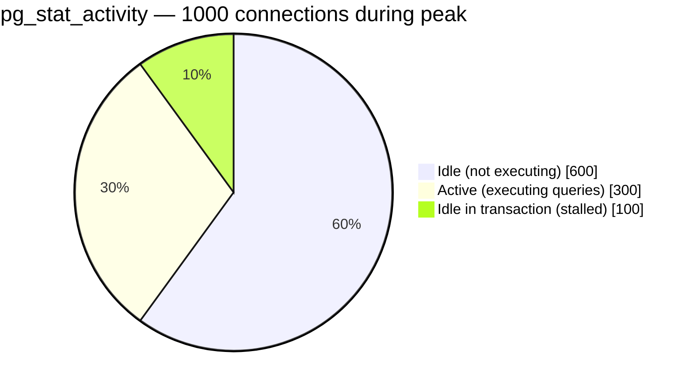

# Connection Pool Management

## 1. Concept Overview

A database connection is expensive: TCP handshake (~0.3ms), TLS negotiation (~1ms), PostgreSQL authentication + session init (~2–5ms) add up to ~5–10ms per connection. Under load, establishing a new connection per request would consume more time than many queries take. A connection pool maintains a pre-established set of connections that are checked out, used, and returned — amortizing the connection overhead across thousands of requests.

At production scale, connection pool sizing and configuration become critical: too few connections cause request queuing; too many connections overwhelm the database server (PostgreSQL: 5–10MB RAM per backend process, plus scheduling overhead). The right pool size is a function of your database server's CPU count, I/O characteristics, and application concurrency.

---

## 2. Intuition

A connection pool is like a taxi fleet. Each taxi (connection) takes time to summon (connection setup). A pool pre-stations N taxis at the building (pre-established connections). When a passenger (request) arrives, they grab an available taxi instantly. When done, the taxi returns to the station. If all taxis are in use, new passengers wait. Too many taxis idle at the station waste space; too few and passengers queue.

---

## 3. Core Principles

**Pool sizing: small is better than large**: Counter-intuitively, larger pools beyond a certain point reduce throughput. The database processes queries using OS threads or processes. Beyond its concurrency capacity, additional simultaneous connections cause context switching and I/O wait overhead. The HikariCP documentation cites the formula: `(core_count × 2) + effective_spindle_count`.

**Connection validation**: A pooled connection may become invalid (network timeout, DB server restart, idle TCP RST). Pools validate connections before handing them out (test-on-borrow) or periodically (keep-alive heartbeat).

**Pool per service instance**: In Kubernetes with N pods each holding a pool of M connections, the database receives N×M simultaneous connections. With 100 pods and pool size 10, that is 1000 connections to PostgreSQL — which has a default max_connections=100. PgBouncer as a proxy is essential.

---

## 4. Types / Architectures / Strategies

```
Layer                | Technology          | Role
---------------------|---------------------|---------------------------
Application pool     | HikariCP, c3p0,     | Per-application-instance pool
                     | DBCP2               | Java-managed connections
External proxy pool  | PgBouncer           | Multiplexes many app connections
                     | ProxySQL            | to few DB connections
                     | Odyssey             |
Pooling modes        | Session pooling      | 1 server conn per client session
(PgBouncer)          | Transaction pooling  | Server conn released after each txn
                     | Statement pooling    | Server conn released after each stmt
```

---

## 5. Architecture Diagrams

**HikariCP Connection Pool — Internal Structure**



Three threads hold checked-out PoolEntries from the lock-free `ConcurrentBag`; a fourth thread waits up to `connectionTimeout` (30s) and throws `SQLTimeoutException` if none free up in time. HikariCP evicts entries in the background via `idleTimeout` (10 min) and `maxLifetime` (30 min), and sends a keepalive query every `keepaliveTime` (30s) to prevent TCP RST.

**PgBouncer Transaction Pooling — Multiplexing**



Transaction pooling: Client 1 borrows a server connection, executes its transaction, and returns it; Client 2 immediately gets that same connection for its own transaction. 100 client connections share 10 server connections — a 10:1 multiplexing ratio.

**Connection Pool Sizing — Kubernetes Scale-Out Problem**

```mermaid
xychart-beta
    title "PostgreSQL Connections: Pod Scale-Out With vs Without PgBouncer"
    x-axis ["50 pods", "200 pods (peak)"]
    y-axis "PostgreSQL connections" 0 --> 2000
    bar "Without PgBouncer" [500, 2000]
    bar "With PgBouncer" [50, 50]
```



Without PgBouncer, 50 pods at HikariCP pool size 10 already sit at PostgreSQL's `max_connections=500` limit, and scaling to 200 pods during peak drives 2000 connections — a crash. With PgBouncer (DaemonSet or sidecar), the same 50-to-200 pod scale-out only grows PgBouncer's client-side connections; `server_pool_size=50` keeps actual PostgreSQL connections flat at 50.

The two bars come from two different arithmetics:

```
  without PgBouncer :  db_connections = pods x pool_size_per_pod
  with PgBouncer    :  db_connections = pgbouncer_instances x server_pool_size
```

**Stated plainly.** "Without a pooler, every pod you add multiplies straight through to the database; with one, the database sees a constant that has nothing to do with your pod count."

| Symbol | What it is |
|--------|------------|
| `pods` | Application replicas, set by the HPA — a number that changes on its own during traffic spikes |
| `pool_size_per_pod` | HikariCP `maximum-pool-size` inside each pod |
| `pgbouncer_instances` | PgBouncer processes, typically one per Kubernetes node (DaemonSet) — grows with nodes, not pods |
| `server_pool_size` | PgBouncer's cap on real PostgreSQL connections per user+database pair |
| `max_connections` | The PostgreSQL-side ceiling both formulas are measured against |

**Walk one example.** The scale-out drawn in the chart, `pool_size = 10` and `max_connections = 500`:

```
                    pods    pool     db connections     vs max_connections = 500
  without PgBouncer   50  x   10  =        500          exactly at the limit
  without PgBouncer  200  x   10  =       2000          4x over -> refused, crash

  with PgBouncer (server_pool_size = 50, one instance per node)
                      50      --            50          10% of the limit
                     200      --            50          unchanged
```

The difference is not that PgBouncer is more efficient. It is that `pods` left the equation entirely. The first formula has an input the platform's autoscaler controls; the second has only inputs you control.

**Why the sidecar variant fails.** Running PgBouncer inside each pod rather than per node puts `pods` right back into the formula — `200 pods x server_pool_size 5 = 1000` connections, still double the limit. The multiplexing only pays off when the pooler is *shared*, which is what the DaemonSet placement in Section 6 buys.

---

## 6. How It Works — Detailed Mechanics

### HikariCP Configuration

```yaml
# Spring Boot application.yml — HikariCP settings
spring:
  datasource:
    url: jdbc:postgresql://db:5432/mydb
    username: app_user
    password: ${DB_PASSWORD}
    driver-class-name: org.postgresql.Driver
    hikari:
      # Pool sizing
      maximum-pool-size: 10        # Total connections in pool
      minimum-idle: 5              # Minimum idle connections maintained

      # Connection lifecycle
      connection-timeout: 30000    # Max wait for connection (30s); throw if exceeded
      idle-timeout: 600000         # Idle connections removed after 10 min
      max-lifetime: 1800000        # Connection forcibly replaced after 30 min (prevent stale conns)
      keepalive-time: 30000        # Send keepalive query every 30s to prevent TCP RST

      # Validation
      connection-test-query: SELECT 1  # Validation query (for old JDBC drivers)
      # PostgreSQL driver supports isValid() — no need for test-query with PG JDBC 42+

      # Leak detection (development only — high overhead)
      leak-detection-threshold: 60000  # Warn if connection held > 60s

      # Pool name for JMX/metrics
      pool-name: HikariPool-Main
```

**Pool sizing formula**:
```
For a CPU-bound PostgreSQL workload:
  pool_size = (cpu_cores × 2) + effective_spindle_count

  CPU: 8 cores, SSD (spindle_count=1):
    pool_size = 8 × 2 + 1 = 17 (round to 20)

  CPU: 4 cores, no spindle (pure SSD):
    pool_size = 4 × 2 + 1 = 9 (round to 10)

Note: This is per-database-instance, not per-app-instance.
  If 10 app instances each need to talk to this DB:
  each instance pool_size = 20 / 10 = 2  (very small per-instance!)
  → Justify using PgBouncer instead of per-app pools
```

**In plain terms.** "A database can only genuinely run as many queries at once as it has cores to run them on, plus a couple more to keep the disks busy while the others wait on I/O."

The formula sizes the pool to the *server's* capacity to execute, not to the application's desire to submit. That inversion is the whole point: a pool is a throttle protecting the database, not a buffer serving the app.

| Symbol | What it is |
|--------|------------|
| `pool_size` | Total connections the pool will ever hold open to one database instance |
| `cpu_cores` | Physical cores on the **database** server — not the application server |
| `× 2` | Oversubscription factor. One query runs while a second waits on I/O, so a core sustains about two in-flight queries |
| `effective_spindle_count` | Number of independent disks that can seek in parallel. `1` for a single SSD or an EBS volume |
| `+ spindle_count` | The extra connections that stay useful purely because storage can overlap with compute |

**Walk one example.** Three server shapes, same arithmetic:

```
                        cpu_cores x 2      + spindles      pool_size
  8-core, single SSD       8 x 2 = 16          + 1            17      -> round to 20
  4-core, single SSD       4 x 2 =  8          + 1             9      -> round to 10
 16-core, single SSD      16 x 2 = 32          + 1            33

  A 16-core database wants about 33 connections. Not 500.
```

Note how slowly the answer grows: quadrupling the cores from 4 to 16 moves the pool only from 9 to 33. This is why "we added more pods so we raised the pool size" is always the wrong reflex — pool size tracks the database, and the database did not change.

**Why the `× 2` and not `× 1`.** With exactly one connection per core, every time a query blocks on a disk read the core sits idle. The second connection gives the scheduler something to run during that stall. Push to `× 4` or `× 8` and the reverse happens: the runnable set exceeds what the scheduler can usefully rotate, and context-switching plus per-backend memory (PostgreSQL forks a 5-10MB process per connection) eats the capacity you were trying to buy.

### Sizing From Demand — Little's Law

The formula above caps the pool from the database's side. The workload sets the floor from the application's side, and the two must be reconciled:

```
  connections_needed = QPS x avg_query_duration_seconds

  Then apply headroom:
    pool_size = connections_needed x 1.5 to 2.0
```

**What the formula is telling you.** "The number of connections busy at any instant equals how fast requests arrive multiplied by how long each one holds a connection."

This is Little's Law (`L = lambda x W`) applied to a pool: `L` is connections in use, `lambda` is arrival rate, `W` is holding time. Nothing about it is database-specific, which is exactly why it is trustworthy — it is a conservation identity, not a heuristic.

| Symbol | What it is |
|--------|------------|
| `QPS` | Queries per second reaching the database — `request_rate × queries_per_request`, not request rate alone |
| `avg_query_duration_seconds` | How long a connection stays checked out, in seconds. Use p99, not the mean, when the distribution has a slow tail |
| `connections_needed` | Average number of connections in flight. The floor, before any burst headroom |
| `× 1.5 to 2.0` | Headroom multiplier absorbing arrival bursts and duration variance |

**Walk one example.** The same traffic, with a fast query and then a slow one:

```
  Traffic: 1000 req/s, 2 queries per request  ->  QPS = 2000

  fast queries, 5 ms each
    L = 2000 x 0.005 s              =  10 connections busy on average
    pool = 10 x 1.5 .. 10 x 2.0     =  15 to 20

  slow queries, 50 ms each          (10x slower, identical traffic)
    L = 2000 x 0.050 s              = 100 connections busy on average
    pool = 100 x 1.5 .. 100 x 2.0   = 150 to 200
```

Query duration and pool demand move together, one for one. A 10x regression in query latency creates a 10x increase in connection demand from traffic that never changed — which is why a single un-indexed query can exhaust a pool that was correctly sized last week.

**Where the two numbers collide.** The 8-core server above supports about 17 connections; the slow-query workload demands 150. There is no pool size that satisfies both, and raising the pool only moves the queue from the application into the database. The only real fixes are to shrink `W` (fix the query) or add database capacity — a lesson the case study in Section 14 pays for the hard way.

### Pool Exhaustion Diagnosis

```java
// HikariCP exposes metrics via Micrometer
// Prometheus metrics:
//   hikaricp_connections_active    → connections in use
//   hikaricp_connections_idle      → idle connections
//   hikaricp_connections_pending   → threads waiting for connection
//   hikaricp_connections_timeout_total → timed-out connection requests

// Alert: hikaricp_connections_pending > 0 for > 30 seconds → pool exhausted
// Alert: hikaricp_connections_timeout_total rate > 0 → requests failing

// JMX monitoring (development):
// Connect JConsole to app → HikariCP MBean → view pool stats
```

**Pool exhaustion causes**:
1. Pool size too small for QPS
2. Slow queries holding connections for too long
3. Connection leak (connection not returned to pool after use)
4. Database slow-down causing queries to take longer, pooling up connections

**Why exhaustion arrives suddenly rather than gradually.** Pool utilization and acquisition wait are related by a queueing law, not a straight line:

```
  utilization  rho = (QPS x avg_query_duration) / pool_size

  acquisition wait grows roughly as   1 / (1 - rho)
```

**Read it like this.** "As the pool approaches fully busy, the wait to get a connection does not creep up — it runs away, because the last sliver of free capacity has to absorb every arrival that shows up at a bad moment."

| Symbol | What it is |
|--------|------------|
| `rho` | Fraction of the pool busy on average. `0.5` = half the connections in use |
| `pool_size` | Connections available to hand out |
| `1 / (1 - rho)` | The blow-up term. At `rho = 0.9` it is `10`; at `rho = 0.99` it is `100` |
| acquisition wait | Time a thread sits in `hikaricp_connections_pending` before it gets a connection |
| total latency | Acquisition wait + the query's own duration — what the caller actually experiences |

**Walk one example.** A 10-connection pool serving 5 ms queries, driven to progressively higher utilization:

```
   rho      busy conns     acquisition wait     total latency (wait + 5 ms query)
  0.50         5.0             0.04 ms                 5.04 ms
  0.70         7.0             0.37 ms                 5.37 ms
  0.80         8.0             1.02 ms                 6.02 ms
  0.90         9.0             3.34 ms                 8.34 ms
  0.95         9.5             8.26 ms                13.26 ms
  0.99         9.9            48.19 ms                53.19 ms

  0.50 -> 0.90 : utilization x1.8, latency x1.7    (feels linear, looks fine)
  0.90 -> 0.99 : utilization x1.1, latency x6.4    (cliff)
```

The last 9% of utilization costs more latency than the first 90% did. This is why a pool dashboard that looks healthy at 90% is not reassuring, and why `hikaricp_connections_pending > 0` is treated as an alert rather than a metric to watch trend upward — by the time the trend is visible, you are already past the knee.

**What breaks without headroom.** Sizing a pool to exactly `connections_needed` puts `rho` at `1.0`, where the formula divides by zero and reality produces an unbounded queue. The `1.5-2.0x` headroom multiplier from Little's Law above exists precisely to hold `rho` near `0.5-0.65`, on the flat part of this curve, where a traffic spike costs microseconds instead of tens of milliseconds.

**Leak detection**:
```java
// Set leak-detection-threshold = 60000 (60s)
// HikariCP logs WARN when a connection is held > 60s with stack trace
// Shows exactly which code path leaked the connection

// Common leak pattern:
Connection conn = dataSource.getConnection();
// ... exception thrown before conn.close() ...
// conn is never returned to pool

// Fix: always use try-with-resources
try (Connection conn = dataSource.getConnection()) {
    // conn auto-closed on exit, even on exception
}
```

### PgBouncer Configuration

```ini
# pgbouncer.ini
[databases]
mydb = host=localhost port=5432 dbname=mydb

[pgbouncer]
listen_addr = 0.0.0.0
listen_port = 6432
auth_type = scram-sha-256
auth_file = /etc/pgbouncer/userlist.txt

# Pooling mode — critical decision
pool_mode = transaction    # Connection returned after each transaction

# Server connection limits
server_pool_size = 20      # Max server connections per user+database pair
max_client_conn = 1000     # Max total client connections accepted

# Server connection lifecycle
server_idle_timeout = 600  # Remove idle server connections after 10 min
server_lifetime = 3600     # Replace server connections after 1 hour
server_connect_timeout = 15

# Client connection
client_login_timeout = 60
query_timeout = 0          # 0 = no timeout (use PostgreSQL statement_timeout)
```

**Transaction pooling vs session pooling**:


Session pooling holds a server connection for the client's entire session; if 100 clients connect but only 10 are active, 90 server connections sit wasted. Transaction pooling borrows a server connection only for the duration of one transaction — 100 clients can share 10 server connections if transactions are short — but breaks anything bound to a single server connection: `SET LOCAL` session variables, `PREPARE` statements, temporary tables, and session-level advisory locks (`pg_advisory_lock`). Statement pooling is the most restrictive mode (connection returned after each statement, no multi-statement transactions) and is rarely used.

### ProxySQL for MySQL

```ini
# proxysql.cnf — MySQL read/write split
mysql_servers:
  - address: primary-host
    port: 3306
    hostgroup: 10   # Write hostgroup

  - address: replica1-host
    port: 3306
    hostgroup: 20   # Read hostgroup

  - address: replica2-host
    port: 3306
    hostgroup: 20   # Read hostgroup

mysql_query_rules:
  - rule_id: 1
    match_pattern: "^SELECT"
    destination_hostgroup: 20   # Route SELECT to read hostgroup
    apply: 1

  - rule_id: 2
    match_pattern: ".*"
    destination_hostgroup: 10   # Route all else to write hostgroup
    apply: 1

# Connection pool per hostgroup
mysql_hostgroup_attributes:
  - hostgroup_id: 10
    max_num_online_servers: 1    # Only one primary
  - hostgroup_id: 20
    max_num_online_servers: 10   # Up to 10 read replicas
```

### Connection Storm on Kubernetes Scale-Out



The problem is a feedback loop: an HPA scale-out from 10 to 100 pods adds 500 new connections against a `max_connections=200` ceiling, so connection establishment itself starts failing — which fails pod health checks, which restarts pods, which attempts even more connections, cascading into a full outage.



DaemonSet placement (one PgBouncer per node, shared over a localhost socket by every pod on that node) keeps a fixed server pool regardless of pod count — scale-out only adds PgBouncer clients. Sidecar placement (one PgBouncer per pod, `pool_size=2-5`) barely helps: 100 pods × 5 still yields 500 PostgreSQL connections, since each pod's PgBouncer is not shared. DaemonSet is the better default; sidecar rarely reduces connection count.

**Solution 3: Connection ramp-up limit** — set HikariCP `minimum-idle=1` (start with fewer connections) and `initializationFailTimeout=60000` (longer startup tolerance), then deploy pods with a startup delay (Kubernetes `maxSurge=25%`) to distribute connection establishment over time instead of all at once.

---

## 7. Real-World Examples

**Zalando**: Uses PgBouncer in transaction mode in front of every PostgreSQL cluster. Standard setup: 500 PgBouncer client connections → 50 PostgreSQL server connections (10:1 multiplexing). Maximum application pool size per service is set based on service-level concurrency needs, not arbitrary defaults.

**Instagram**: Used Gevent (Python async) + PgBouncer. The async model meant thousands of concurrent requests per process, but each released the DB connection immediately after the query. PgBouncer transaction mode was essential for this pattern.

**GitHub**: Uses ProxySQL in front of MySQL for read/write splitting. ProxySQL routes SELECT statements to replicas automatically, reducing primary write node load by 70% during read-heavy operations.

---

## 8. Tradeoffs

```
Concern              | No pooling          | App-level pool     | PgBouncer proxy
---------------------|---------------------|--------------------|-----------------
Connection overhead  | Per-request         | Amortized          | Amortized (lower)
DB connections held  | 1 per active req    | pool_size per inst | server_pool_size
Prepared statements  | Per connection      | Per connection     | Lost in txn mode
Session variables    | Per connection      | Per connection     | Lost in txn mode
Operational overhead | None               | Low                | Medium (extra service)
Kubernetes compat.   | Poor               | Medium             | Good (DaemonSet)
```

---

## 9. When to Use / When NOT to Use

**Always use connection pooling** — no production application should open a new database connection per request.

**Use HikariCP** as the application-level pool for Java/Spring Boot applications. It is the fastest and most widely deployed.

**Add PgBouncer when**: (1) Application instances × pool size exceeds PostgreSQL max_connections, (2) Kubernetes horizontal scaling causes connection storms, (3) Short-lived connections (serverless functions, scripts) that would otherwise connect/disconnect frequently.

**Avoid PgBouncer transaction mode when**: Application uses PostgreSQL prepared statements bound to server connections, session-level advisory locks, or temporary tables. Use session pooling in those cases.

**Do You Need PgBouncer?**



Always start with an application-level pool; only add PgBouncer once one of the three triggers above is true, and only fall back to session pooling when the workload actually needs prepared statements, advisory locks, or temporary tables — transaction pooling is the default otherwise.

---

## 10. Common Pitfalls

**Pool size too large**: A team sets maximum-pool-size=50 on 20 application instances → 1000 connections to PostgreSQL. PostgreSQL spawns 1000 backend processes (5MB each = 5GB RAM). Context switching degrades query throughput. Database CPU drops to serving background overhead instead of queries. Rule: start with pool_size = (CPU cores × 2) + 1 per database instance, then measure.

**Connection leak with manual `getConnection()`**: Service code calls `dataSource.getConnection()` inside a utility method. An exception path exits without calling `close()`. Connections accumulate in "active" state, eventually exhausting the pool. Fix: always use try-with-resources; enable `leakDetectionThreshold` in HikariCP to catch leaks during testing.

**PgBouncer transaction mode with prepared statements**: Application uses `PreparedStatement` (JDBC) in PgBouncer transaction mode. PgBouncer does not forward `PREPARE` statements to the server in transaction mode (each transaction can go to a different server connection). The prepared statement is not found → `PREPARE "X" does not exist` error. Fix: either use `prepareThreshold=0` in PostgreSQL JDBC driver (disables server-side prepared statements, uses client-side), or switch PgBouncer to session pooling for this use case.



The `PREPARE` lands on Server Conn A, but PgBouncer returns that connection to the pool as soon as the transaction commits; the next `EXECUTE` can be routed to a completely different server connection (Conn B) where the statement was never prepared, producing the error above.

**max_connections exhaustion during deployment restart**: Rolling deployment restarts 100 pods, each establishing connections. Old pods hold connections while new pods establish new ones. During the window, connection count doubles. Fix: use lifecycle hooks to drain connections before pod termination (`preStop: sleep 15s`), and set `minimum-idle=1` to reduce baseline connections.

**idle_in_transaction connections**: A connection is checked out from the pool, begins a transaction, then the application code stalls (waiting for an external API call). The connection sits in `idle in transaction` state in PostgreSQL, holding locks and preventing VACUUM. Set `idle_in_transaction_session_timeout = 30000` (30 seconds) in PostgreSQL to kill stale idle-in-transaction connections. HikariCP's `connection-timeout` does not cover this — it only covers initial acquisition.

---

## 11. Technologies & Tools

| Tool          | Language | Purpose                              |
|---------------|----------|--------------------------------------|
| HikariCP      | Java     | Application-level connection pool    |
| c3p0          | Java     | Older application pool (use HikariCP)|
| DBCP2         | Java     | Apache Commons DB pool               |
| PgBouncer     | C        | PostgreSQL connection pooler/proxy   |
| Odyssey       | C        | PostgreSQL advanced pooler (by Yandex)|
| ProxySQL      | C++      | MySQL-compatible pool + routing      |
| pgpool-II     | C        | PostgreSQL pool + HA (older)         |
| AWS RDS Proxy | Managed  | Managed connection pooler for RDS    |

---

## 12. Interview Questions with Answers

**Q: Why does increasing connection pool size beyond a certain point hurt throughput?**
A database server processes queries using OS threads or processes. Each additional concurrent connection beyond the server's natural concurrency capacity (roughly 2× CPU cores for I/O-bound queries) causes increased context switching and memory pressure. PostgreSQL spawns a backend process per connection (~5–10MB RAM each). At 500 simultaneous connections on a 16-core server, the OS scheduler juggles 500 processes but can only run 16 at once — most of the scheduler's time is spent context switching rather than executing queries. Benchmarks consistently show throughput peaking around pool_size = (cores × 2) + 1 and declining with larger pools.

**Q: What is the difference between PgBouncer transaction mode and session mode and why does it matter for prepared statements?**
Session mode: a client connection maps to a dedicated server connection for its entire lifetime. All session-level features (prepared statements, SET variables, temporary tables, advisory locks) work correctly. Transaction mode: a client connection borrows a server connection only for the duration of each transaction and returns it afterward. The same client connection can execute subsequent transactions on different server connections. Prepared statements are bound to server connections — in transaction mode, a `PREPARE` is executed on one server connection, but the subsequent `EXECUTE` may arrive on a different server connection where the prepared statement does not exist. Fix: set PostgreSQL JDBC `prepareThreshold=0` to disable server-side prepared statements, using client-side parameter binding instead.

**Q: How do you handle connection storms during Kubernetes pod scale-out?**
Three strategies: (1) PgBouncer as DaemonSet: one PgBouncer per Kubernetes node; pods connect to the local PgBouncer (Unix socket or localhost). The DaemonSet maintains a fixed server pool to PostgreSQL, so pod scale-out adds PgBouncer client connections without increasing PostgreSQL connections. (2) Slow pod startup: configure HikariCP `minimumIdle=1` so each pod starts with only one connection; connections increase gradually under load rather than all at startup. Use Kubernetes pod readiness probes to stagger traffic cutover. (3) AWS RDS Proxy: managed connection pooler that absorbs connection surges, especially for Lambda-to-RDS scenarios where thousands of function invocations would otherwise create thousands of connections.

**Q: What is HikariCP's ConcurrentBag and why is it faster than other pool implementations?**
ConcurrentBag is HikariCP's custom lock-free data structure for managing pool entries. Traditional pools use blocking queues or synchronized collections that require monitors and context switches for every borrow/return. ConcurrentBag uses thread-local caching: each thread gets a list of connections it has previously used and tries to borrow from its own list first (without any locking). Only if no thread-local connection is available does it check the shared bag (using a compare-and-set operation). This eliminates lock contention on the critical hot path of connection borrow/return. Benchmarks show HikariCP is 10–100x faster than c3p0 or DBCP for high-concurrency borrow/return cycles.

**Q: How do you monitor connection pool health in production?**
With Micrometer (Spring Boot Actuator) and Prometheus: (1) `hikaricp_connections_active`: connections currently in use — alert if consistently at maximum. (2) `hikaricp_connections_pending`: threads waiting for a connection — any sustained non-zero value indicates pool exhaustion. (3) `hikaricp_connections_timeout_total`: total connection acquisition timeouts — alert on any occurrence. (4) `hikaricp_connection_acquired_nanos` (P99 and P999): time to acquire a connection — alert if P99 > 500ms. (5) PostgreSQL `pg_stat_activity`: `state = 'idle in transaction'` count — alert if persistent idle-in-transaction sessions. Dashboard these four metrics together; pool exhaustion typically shows as a correlated spike in pending + timeout metrics.

**Q: What happens when a pooled connection becomes invalid (TCP RST, DB restart)?**
Without connection validation, the invalid connection is returned to the pool as apparently idle. The next request checks it out, attempts a query, receives a `Connection reset by peer` or `JDBC Communication link failure`. The application sees a sporadic database error on what should be a healthy request. HikariCP mitigates this: (1) `keepaliveTime`: sends a keepalive query (`SELECT 1`) every N seconds to keep the TCP connection alive. (2) `maxLifetime`: forcibly replaces connections older than N milliseconds to prevent long-lived connections from accumulating state or hitting server-side idle timeouts. (3) `connectionTestQuery` / `isValid()`: validates the connection before handing it to the application. Choose keepalive + maxLifetime over test-on-borrow (which adds latency to every borrow).

**Q: What is the connection overhead of PostgreSQL and why does it matter for serverless workloads?**
Establishing a PostgreSQL connection requires: TCP three-way handshake (~0.3ms), TLS handshake (~1–2ms), PostgreSQL authentication (md5/scram-sha-256 challenge-response, ~1–2ms), PostgreSQL session initialization (process fork, shared memory setup, pg_hba.conf check, ~2–3ms). Total: 5–10ms per connection establishment. For a Lambda function with a 5ms execution time that establishes a new PostgreSQL connection per invocation, connection setup is 2× the function's own execution time. With 1000 Lambda invocations/second, 1000 connections are established/torn down per second — PostgreSQL forks and kills 1000 backend processes per second, overwhelming the server. Fix: AWS RDS Proxy or a long-lived PgBouncer instance absorbs Lambda connection spikes.

**Q: How does idle_in_transaction_session_timeout protect the database?**
A connection in `idle in transaction` state has begun a transaction but is waiting (possibly indefinitely) without executing statements. While waiting, it holds: (1) row-level locks on any rows it has written or locked with `SELECT FOR UPDATE`; (2) transaction ID (XID) open, preventing VACUUM from collecting dead tuples older than this XID. A stalled `idle in transaction` connection can block other transactions and cause table bloat accumulation. Setting `idle_in_transaction_session_timeout = 30000` (30 seconds) in PostgreSQL automatically terminates any connection in this state for longer than 30 seconds, releasing its locks and XID. This is separate from `statement_timeout` (kills running statements) and `lock_timeout` (kills statements waiting for locks).

**Q: How do you right-size a connection pool for a microservice with mixed query types?**
Profile the workload: (1) Measure the average query duration under production load. (2) Calculate required QPS: queries/second = request_rate × queries_per_request. (3) Calculate minimum connections: connections = QPS × avg_query_duration_seconds. Example: 1000 req/s × 2 queries/req × 0.005s avg = 10 connections minimum. (4) Apply headroom factor (1.5–2×): pool_size = 15–20 to absorb bursts. (5) Verify against the database's capacity: if 10 app instances × 20 connections = 200, check PostgreSQL max_connections. For mixed fast (1ms) and slow queries (500ms), the slow queries dominate pool occupancy — profile p99 query duration, not average.

**Q: What is Odyssey and how does it differ from PgBouncer?**
Odyssey is a PostgreSQL connection pooler developed by Yandex, designed for higher performance and more advanced routing than PgBouncer. Key differences: (1) Multi-threaded architecture: Odyssey uses event-driven I/O on multiple threads, handling more client connections per CPU than PgBouncer's single-threaded model. (2) Per-user/database pool configuration: fine-grained pool rules per user+database combination. (3) Built-in TLS termination and certificate-based auth. (4) Advanced client routing: route different users or query patterns to different server pools. PgBouncer remains simpler to configure and operate; Odyssey is preferred when PgBouncer becomes a throughput bottleneck (typically > 10K client connections).

**Q: Explain AWS RDS Proxy and when to use it.**
AWS RDS Proxy is a managed connection pooler that sits between your application and an RDS/Aurora database. It uses IAM authentication for security, stores database credentials in Secrets Manager, and maintains a persistent connection pool to the database. Applications (especially Lambda functions) connect to the Proxy endpoint, which handles pooling transparently. Key features: (1) Absorbs Lambda connection spikes (thousands of function invocations → dozens of database connections). (2) Automatic failover: RDS Proxy preserves client connections during RDS Multi-AZ failover, reducing application-visible downtime. (3) IAM authentication: no database passwords in application code. Use when: Lambda-to-RDS, ECS tasks that scale rapidly, or any workload where managing PgBouncer infrastructure is undesirable.

**Q: How do you configure HikariCP for optimal performance with Spring Data JPA?**
Spring Boot auto-configures HikariCP when `spring-boot-starter-data-jpa` is on the classpath. Key settings for JPA: (1) `maximum-pool-size`: match to concurrency needs, not JPA default (10). (2) `max-lifetime = 1800000` (30 min): prevents connections from staling; should be less than PostgreSQL's `tcp_keepalives_idle` and any firewall idle timeout. (3) `connection-timeout = 20000` (20s): shorter than typical HTTP request timeout to fail fast. (4) Disable `autoCommit = false` if using JPA transactions (Spring manages transactions explicitly). (5) JPA `spring.jpa.open-in-view = false`: prevents holding connections during view rendering (common source of pool exhaustion in web apps). The Open Session in View anti-pattern holds a connection from the start of the HTTP request to the end of view rendering — potentially blocking for seconds while HTML is rendered.

**Q: How does ProxySQL differ from PgBouncer, and when do you need ProxySQL's extra capabilities?**
PgBouncer is a pure connection pooler for PostgreSQL: it multiplexes client connections onto a smaller pool of server connections but does not inspect or route individual queries. ProxySQL, built for MySQL, does both pooling and layer-7 query routing: it parses each statement and can send `SELECT` traffic to read replicas (hostgroup 20) while sending everything else to the primary (hostgroup 10), all defined declaratively in `mysql_query_rules`. This makes ProxySQL a combined connection pool and read/write splitter, whereas PgBouncer requires a separate tool or application-level logic to achieve read/write splitting. Choose ProxySQL when the read/write split needs to be transparent to the application and query-pattern-aware; choose PgBouncer, paired with a separate router or application routing, when you only need connection multiplexing on PostgreSQL. GitHub's use of ProxySQL to cut primary write-node load by 70% during read-heavy operations is a direct result of this query-routing capability that PgBouncer does not have.

**Q: How does a connection pool behave when the database primary fails over, and what breaks?**
When Patroni or RDS Multi-AZ promotes a replica to primary, every checked-out pool connection still points at the demoted or dead old primary, and reusing it fails silently or hangs. HikariCP does not automatically detect a failover mid-transaction; the application sees a connection error only when it next tries to use that pooled connection, which can be seconds after the actual failover completed. Pools sitting behind a virtual IP or DNS name that Patroni updates on failover recover automatically once idle connections are evicted and re-established, but connections held open through the failover moment must be closed and replaced rather than reused. Mitigate this with a short `max-lifetime`, well under typical failover detection time, so stale connections are proactively cycled, and set `connection-timeout` low enough that a hung connection fails fast instead of queuing behind it. AWS RDS Proxy handles this transparently by holding client connections open across a Multi-AZ failover while it re-establishes the backend connection, which is the main reason teams adopt it for Lambda-to-RDS failover resilience.

**Q: What does PgBouncer's SHOW POOLS command tell you, and how do you diagnose pool exhaustion from it?**
PgBouncer's `SHOW POOLS` reports per-pool counters such as `cl_active`, `cl_waiting`, `sv_active`, and `sv_idle` that reveal whether client demand is outrunning the server-side pool. `cl_active` counts client connections currently executing a query, `cl_waiting` counts clients queued because no server connection is free, `sv_active` counts server connections in use, and `sv_idle` counts server connections sitting ready. A healthy pool keeps `cl_waiting` at zero with a comfortable margin of `sv_idle`; sustained `cl_waiting > 0` means `server_pool_size` needs to grow or queries are holding connections too long. If `sv_idle` stays near zero while `cl_active` is also low, connections are likely leaking — not returned promptly after each transaction in transaction-pooling mode. Compare `cl_active` to `sv_active` as a multiplexing ratio: many clients mapped to few server connections confirms PgBouncer is working, while a ratio near 1:1 means multiplexing isn't happening at all; feed `SHOW POOLS` into a metrics pipeline on a fixed interval rather than checking it only after something breaks.

**Q: How do you size and isolate connection pools in a multi-tenant database serving many services?**
Each tenant sharing a single PostgreSQL instance competes for the same fixed `max_connections` budget, so naive per-service pools multiplied across dozens of tenants quickly exceed it. The fix is a shared pooling layer (PgBouncer) with a separate pool per database or per tenant schema, each capped by a `server_pool_size` proportional to that tenant's actual concurrency needs rather than a uniform default. For noisy-neighbor protection, set per-pool `max_client_conn` limits so one high-traffic tenant cannot starve server connections away from smaller tenants, and consider a dedicated PgBouncer instance for tenants with strict latency SLAs. Monitor per-pool `cl_waiting` independently so exhaustion in one tenant's pool is visible without being masked by healthy aggregate metrics across the whole cluster. This isolation mirrors the RLS-based data isolation used elsewhere in multi-tenant systems — connection pooling needs the same per-tenant boundary thinking, not just a bigger shared pool.

---

## 13. Best Practices

- **Never use default pool sizes in production** — the default `maximum-pool-size=10` in HikariCP is rarely correct; calculate based on your concurrency and query duration.
- **Monitor pending connections continuously** — any sustained pool waiters indicate under-provisioning or slow queries.
- **Set `max-lifetime` below the database/firewall idle timeout** — prevents connections from being silently closed by a firewall or DB server timeout.
- **Enable `leak-detection-threshold` in development** — catches connection leaks before they reach production.
- **Deploy PgBouncer before Kubernetes scale-out** — add PgBouncer as infrastructure before your application scales past a handful of instances.
- **Use try-with-resources for all JDBC operations** — prevents connection leaks on exception paths.
- **Set `idle_in_transaction_session_timeout` at the PostgreSQL level** — defend against application bugs that leave transactions open.
- **Run `SHOW POOLS` in PgBouncer regularly** — check the ratio of `cl_active` (client connections in use) to `sv_active` (server connections in use) to verify multiplexing is working.

---

## 14. Case Study

**Scenario**: A Spring Boot e-commerce application with 50 Kubernetes pods, each with HikariCP pool size 20. Total: 1000 connections to PostgreSQL. PostgreSQL `max_connections = 500` — at twice the limit. Developers observe sporadic `ConnectionAcquisitionTimeoutException` errors during peak traffic. Database CPU is 90% even though QPS is only 5K/second (a 4-core database should handle 20K+ QPS).

**Root cause analysis**:


PostgreSQL backend count: 1000 processes × 8MB RAM = 8GB RAM consumed by connections alone; context-switching overhead comes from the scheduler juggling 1000 processes on 4 cores. The 100 idle-in-transaction connections are stalled transactions: application code calls an external payment API with a 30s timeout while holding a DB connection inside a `@Transactional` method, so 100 connections are stuck for 30s each — blocked permanently during high load.

**Fixes applied**:
1. PgBouncer DaemonSet (4 nodes × 1 PgBouncer each):
   - Each PgBouncer: `server_pool_size = 25` → 4 PgBouncer × 25 = 100 PostgreSQL connections
   - App pods connect to node-local PgBouncer (Unix socket)
   - PostgreSQL connections: 1000 → 100

2. HikariCP reconfigured:
   - `maximum-pool-size = 5` (per pod to PgBouncer — PgBouncer handles multiplexing)
   - `connection-timeout = 10000` (fail fast — don't queue for 30s)
   - `leak-detection-threshold = 30000`

3. Application fix:
   - External API calls moved outside `@Transactional` boundary
   - `idle_in_transaction_session_timeout = 10000` added to PostgreSQL

4. PostgreSQL:
   - `max_connections = 200` (sufficient for 100 PgBouncer + 100 direct admin connections)

**Results**:
- PostgreSQL backend processes: 1000 → 100 (80% RAM reduction)
- Database CPU: 90% → 35%
- Connection timeout errors: 0 (during normal operations)
- P99 query latency: 450ms → 25ms (context switching eliminated)

**Put simply.** "Every number in this incident falls out of one multiplication — pods times pool size — and every fix is an attempt to take one of those two factors out of the application's hands."

| Symbol | What it is |
|--------|------------|
| `pods × pool_size` | Connections the database is asked to hold. `50 × 20 = 1000` here |
| `backends × RAM_per_backend` | Memory PostgreSQL burns on connection state alone, before caching a single page |
| `pgbouncers × server_pool_size` | Connections the database actually holds after the fix. `4 × 25 = 100` |
| multiplexing ratio | Client connections ÷ server connections. How many app-side connections each real backend serves |
| `idle_in_txn × stall_duration` | Connection-seconds destroyed by holding a transaction open across a remote API call |

**Walk one example.** The before and after, one line at a time:

```
  BEFORE
    connections   50 pods x 20 pool          = 1000   vs max_connections 500  -> 2x over
    memory        1000 backends x 8 MB       = 8000 MB = 7.81 GiB of pure connection state
    scheduling    1000 processes on 4 cores  =  250 runnable per core
    of those 1000 : 300 active, 600 idle, 100 idle-in-transaction

  AFTER
    connections   4 PgBouncer x 25           =  100   vs max_connections 200  -> 50% headroom
    memory        100 backends x 8 MB        =  800 MB = 0.78 GiB
    multiplexing  1000 client / 100 server   =   10:1

  DELTA
    connections   1000 -> 100                = 90% fewer
    memory        7.81 -> 0.78 GiB           = 7.03 GiB returned to the buffer cache
    p99 latency   450 ms -> 25 ms            = 18x faster
```

**Where the 100 stalled connections came from.** Each `@Transactional` method calling a payment API with a 30 s timeout holds its connection for the full 30 s, so `100 connections × 30 s = 3000 connection-seconds` are consumed per stall wave. Against a healthy pool that only ever needed `2000 QPS × 0.005 s = 10` connections, those 100 stalled connections represent ten times the entire legitimate working set — held by code that is not talking to the database at all. This is why moving the external call outside the transaction boundary mattered as much as PgBouncer did: PgBouncer shrinks the connection count, but only the application fix shrinks `W`, and Little's Law says `W` is half the product.
