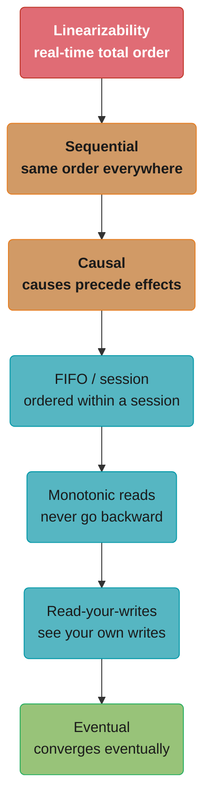
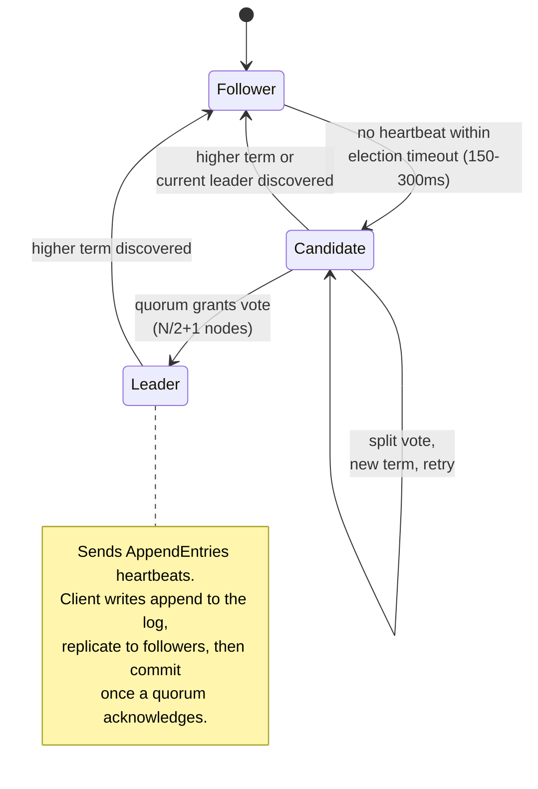
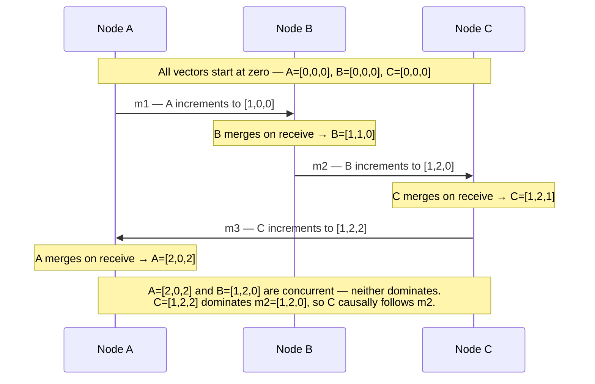
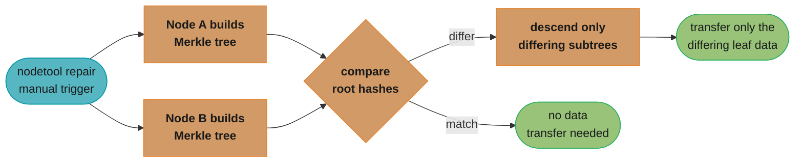
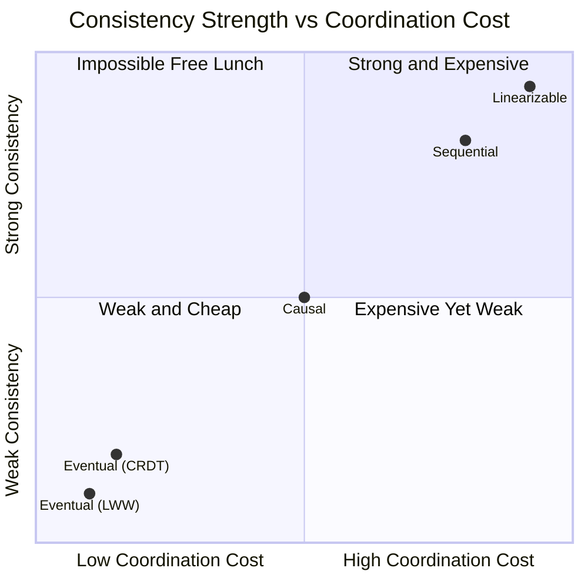
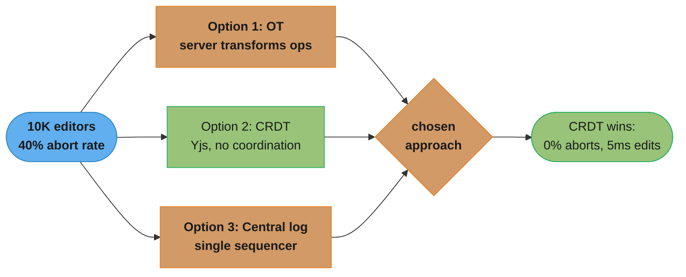

# Consistency Models and Consensus

## 1. Concept Overview

Consistency models define the rules about which values a distributed system may return for read operations and in what order writes become visible to concurrent readers. They form a spectrum from strong (expensive, high coordination) to weak (cheap, higher concurrency). Consensus algorithms (Paxos, Raft) are the mechanisms distributed systems use to agree on the order of events despite node failures and network delays.

Understanding consistency models is essential because you cannot have linearizability without coordination, and coordination costs latency. Every system makes an implicit consistency choice — knowing the model helps you reason about the correctness guarantees your system actually provides versus what you assume it provides.

---

## 2. Intuition

Imagine five distributed employees each keeping a copy of a shared notebook. Linearizability means: if you call an employee and ask them to write something, everyone's copy updates instantly in a universally agreed order — as if there is one shared notebook. Eventual consistency means: everyone will eventually agree on the notebook contents, but right after a write, some copies may still show the old value.

Consensus is the mechanism for these employees to agree: "We all confirm: entry #42 says X." Without consensus, two employees might simultaneously decide entry #42 says X and Y, and they cannot agree on which is correct.

---

## 3. Core Principles

**Consistency is not durability**: Consistency is about what value a read returns relative to concurrent writes. Durability is about whether committed data survives crashes. These are orthogonal concerns.

**The consistency-latency tradeoff**: Stronger consistency requires more coordination between nodes. Coordination requires network round trips. Network round trips add latency. You cannot have both linearizability and sub-millisecond latency across data centers.

**Happened-before ordering**: In a distributed system, there is no global clock. The happened-before relation (→) defines causal ordering: if event A causes event B, then A → B. Consistency models differ in how strictly they enforce happened-before ordering.

**Consensus is the foundation**: Any distributed system that needs to agree on a single value (leader, committed log entry, shard assignment) requires a consensus algorithm. Consensus requires a quorum to function.

---

## 4. Types / Architectures / Strategies

```
Model                | Guarantee                                  | Cost
---------------------|--------------------------------------------|-----------
Linearizability      | Reads see the most recent write; total     | Highest
                     | order consistent with real time            |
Sequential           | All nodes see operations in the same order | High
                     | (not necessarily real-time ordered)        |
Causal               | Causally related ops seen in causal order  | Medium
                     | Concurrent ops may differ across nodes     |
Read-your-writes     | A client always sees its own writes        | Low
Monotonic reads      | Reads never go backward in time            | Low
Eventual             | All replicas converge to same value        | Lowest
                     | (no timing guarantee)                      |
```

---

## 5. Architecture Diagrams

**Consistency Hierarchy (strongest to weakest)**



Strongest (red, top) to weakest (green, bottom) — color tracks the coordination cost from the Section 4 table, where red is the highest cost and green is the lowest.

**Raft Consensus — Leader Election and Log Replication**



Randomized election timeouts keep followers from becoming candidates simultaneously; a candidate that wins votes from a quorum (N/2+1) becomes leader and drives every future write through its log.

```
Log Replication:
  Leader log:   [1:set x=1] [2:set y=2] [3:set x=3] ← committed up to 3
  Follower A:   [1:set x=1] [2:set y=2] [3:set x=3] ← in sync
  Follower B:   [1:set x=1] [2:set y=2]              ← one entry behind
                                                         (will receive on next AE)
```

Column alignment shows the divergence directly: Follower B is missing entry 3 and will catch up on the next AppendEntries RPC.

**Vector Clocks**



Three nodes exchange messages while each maintains its own vector clock; merging on receive (element-wise max) lets a node detect causal dependency, while two incomparable vectors reveal a pair of concurrent, unordered events.

---

## 6. How It Works — Detailed Mechanics

### Linearizability vs Serializability

These terms are frequently confused:

```
Linearizability:
  - About single-object operations (reads/writes to one key/register)
  - Real-time ordering: if op A completes before op B starts, A appears before B
  - No concept of transactions
  - Used in distributed systems (Zookeeper, etcd, Spanner reads)

Serializability:
  - About multi-object transactions
  - Transactions appear to execute in some serial order
  - Order need not match real time (only internal consistency)
  - Used in databases (SERIALIZABLE isolation level)

Strict Serializability (= Linearizable + Serializable):
  - Transactions are serializable AND the serial order matches real time
  - The gold standard; what Spanner and CockroachDB provide
  - Expensive: requires distributed coordination for every transaction
```

### Raft Deep Dive

Raft was designed to be understandable. It decomposes consensus into three sub-problems: leader election, log replication, and safety.

**Leader election**:
- All nodes start as followers with an election timeout (randomized 150–300ms to avoid simultaneous elections)
- If a follower does not receive a heartbeat within its timeout, it becomes a candidate
- Candidates increment their term, vote for themselves, and send `RequestVote` RPCs
- A node grants a vote only if: (1) the candidate's term is ≥ the voter's term, and (2) the candidate's log is at least as up-to-date as the voter's log
- A candidate becomes leader upon receiving votes from N/2+1 nodes

**Log replication**:
- All client writes go to the leader
- Leader appends the write to its log (assigned index and current term)
- Leader sends `AppendEntries` RPC to all followers
- A log entry is committed once N/2+1 nodes have it in their logs
- Leader applies committed entries to the state machine and responds to the client

`N/2+1` is the single most-quoted expression in distributed systems, and the number it *doesn't* produce is the interesting one:

```
quorum(N)             = floor(N/2) + 1
failures_tolerated(N) = N - quorum(N) = ceil(N/2) - 1
overlap guarantee     : any two quorums share at least 1 node
```

**What it means.** "A majority is the smallest group that cannot be assembled twice from disjoint nodes, so any two decisions ever made must have consulted at least one node in common." That overlap is the entire safety argument — not the voting, not the terms. It is why a partitioned minority can never commit anything the majority does not know about.

| Symbol | What it is |
|--------|------------|
| `N` | Total nodes in the consensus group — a fixed configured membership, not "nodes currently up" |
| `floor(N/2)` | Half the cluster, rounded down |
| `quorum(N)` | Smallest set that is strictly more than half. `3` for `N=5` |
| `failures_tolerated` | `N - quorum`. Nodes that may die while the cluster still commits |
| Overlap | Two majorities of the same `N` must intersect (pigeonhole): `2 x quorum > N` |

**Walk one example.** Every cluster size, and the reason odd counts are the standard advice:

```
   N   quorum   tolerates   note
  ---  ------   ---------   -------------------------------------------
   1      1         0       no redundancy at all
   2      2         0       WORSE than 1: needs both, either death stops it
   3      2         1       the minimum useful cluster
   4      3         1       one extra machine, ZERO extra tolerance
   5      3         2       the common production default
   6      4         2       again: one extra machine, no extra tolerance
   7      4         3       for clusters that must survive a rack loss

  the overlap proof, N = 5:
    two quorums of 3 from 5 nodes -> 3 + 3 = 6 > 5
    by pigeonhole at least 6 - 5 = 1 node is in both
    that node remembers the earlier decision and blocks the conflicting one
```

Read the `N=4` and `N=6` rows again. Adding a node to an odd cluster buys nothing but cost and one more thing that can break — every even size tolerates exactly the same number of failures as the odd size below it, while needing one more vote to make progress. That is the whole argument behind Section 13's "run odd node counts."

**Why growing the cluster is not how you get availability.** Quorum size rises with `N`, so a bigger cluster needs *more* nodes reachable, and every commit waits on a larger set. Going from 3 to 7 nodes doubles tolerance from 1 to 3 but also means every write must reach 4 machines instead of 2. Consensus clusters are sized for fault tolerance and then stop; read throughput is scaled with followers or leases, never by widening the voting membership.

**Safety**:
- A leader never overwrites its log; it only appends
- A committed entry will always be present in the logs of future leaders (log matching property)
- Only nodes with up-to-date logs can become leaders (election restriction)

```java
// Simplified Raft log entry structure
record LogEntry(
    long term,   // leader term when entry was appended
    long index,  // position in log (1-indexed)
    byte[] data  // command/payload
) {}

// Committed index: the highest index for which a quorum has acknowledged
// Applied index: the highest index applied to the state machine
// commitIndex >= appliedIndex always holds
```

Commit latency follows from the quorum rule, and it is an order statistic rather than an average or a maximum:

```
commit_latency = leader_fsync + kth_fastest(follower_RTT + follower_fsync)
where k = quorum(N) - 1                       (the leader votes for itself)

Paxos rounds:  classic = 2 RTT (prepare + accept)
               multi-Paxos with a stable leader = 1 RTT (accept only)
               Raft with a stable leader        = 1 RTT (AppendEntries)
```

**The idea behind it.** "A write commits the moment the `k`-th quickest follower answers — the slowest members of the cluster are not on the critical path at all." This is the property that makes geographically spread consensus viable: you can place a replica somewhere far away for durability without every write paying that distance.

| Symbol | What it is |
|--------|------------|
| `leader_fsync` | Leader durably writing its own log entry before it can count itself, ~0.1-1ms on NVMe |
| `follower_RTT` | Network round trip leader to follower and back |
| `k` | `quorum - 1` acknowledgments needed from followers; the leader supplies the last vote |
| `kth_fastest(...)` | The `k`-th smallest response time, not the mean and not the max |
| RTT per decision | `1` once a leader is established; `2` for classic Paxos, which re-runs Prepare every time |

**Walk one example.** A 5-node Raft group spread across regions — `quorum = 3`, so `k = 2`:

```
  node             role       RTT + fsync
  --------------   --------   -----------
  leader (A)       self         0.5 ms      (its own fsync)
  follower B       same AZ      1.0 ms
  follower C       same region  2.0 ms
  follower D       far region  80.0 ms
  follower E       far region  95.0 ms

  sort follower responses : 1.0, 2.0, 80.0, 95.0
  k = quorum - 1 = 2      -> take the 2nd fastest = 2.0 ms

  commit_latency = 0.5 + 2.0 = 2.5 ms

  D and E are 40x and 47x slower than the deciding follower and cost the write NOTHING.
  Kill B and C, though, and k = 2 now lands on 80.0 ms  ->  commit = 80.5 ms, a 32x jump.
```

The lesson placement engineers act on: keep `quorum` nodes close together and the rest wherever durability demands. A 5-node group with 3 nodes in one region commits at regional speed while the two distant replicas still hold full copies for disaster recovery — but note the flip side the example shows. The moment the two nearby followers are down, the far replicas *become* the quorum and latency jumps 32x. That cliff is not a bug; it is the system correctly choosing consistency over latency, and it is what a PC/EC system in Section 12's PACELC answer feels like in production.

### CRDTs — Conflict-Free Replicated Data Types

CRDTs are data structures designed so that concurrent updates from multiple replicas can always be merged without conflict, achieving eventual consistency without coordination.

**G-Counter (Grow-only Counter)**:
```
Each node maintains a vector where index i = count incremented on node i
Node A vector: [5, 3, 2]  (node A incremented 5 times, node B 3, node C 2)
Node B vector: [5, 4, 2]  (node B incremented once more)

Merge (element-wise max):  [5, 4, 2]
Total value: sum = 11

Properties: monotonically increasing, merge is commutative (A merge B = B merge A),
  associative ((A merge B) merge C = A merge (B merge C)),
  and idempotent (A merge A = A)
```

**PN-Counter (Increment/Decrement)**:
```
Two G-Counters: P (positive increments) and N (negative increments)
Value = sum(P) - sum(N)
```

**LWW-Register (Last-Write-Wins)**:
```
Each write carries a timestamp (Lamport or wall clock)
On conflict: the write with the higher timestamp wins
Risk: relies on clock synchronization; Cassandra uses server-side microsecond timestamps
```

**OR-Set (Observed-Remove Set)**:
```
Each element carries a unique tag when added
Remove only removes elements with specific tags seen at remove time
Concurrent add and remove: the add wins (because the add tag is not in the remove set)
```

### Paxos vs Raft

```
Aspect              | Paxos                       | Raft
--------------------|-----------------------------|--------------------------
Design goal         | Correctness proof            | Understandability
Leader              | Not required (multi-Paxos   | Required (all writes via
                    | adds it), flexible           | leader)
Log gaps            | Allowed                      | Not allowed (sequential)
Phases per write    | 2 (prepare + accept)         | 1 (AppendEntries after
                    |                              | leader established)
Implementation      | Many correct variants exist  | Canonical implementation
Understanding       | Hard (many edge cases)       | Easier (structured)
Used in             | Google Spanner, Chubby       | etcd, CockroachDB, TiKV
```

### Read Repair and Anti-Entropy

In leaderless systems (Cassandra, DynamoDB), replicas can diverge. Two mechanisms reconcile divergence:

Whether divergence is even *visible* to a reader is governed by one inequality:

```
w + r > n              <- read set and write set must intersect

overlap        = w + r - n          (nodes guaranteed common to both sets)
write_tolerance = n - w             (replicas that may be down and writes still succeed)
read_tolerance  = n - r             (replicas that may be down and reads still succeed)
```

**What this actually says.** "Write to enough copies and read from enough copies that the two groups cannot avoid each other; the shared node is the one holding the newest value." Nothing here is about time or clocks — the guarantee is purely set-theoretic, which is why it survives arbitrary delays that a lag-based argument would not.

| Symbol | What it is |
|--------|------------|
| `n` | Replication factor — how many copies of each key exist |
| `w` | Replicas that must acknowledge a write before the client is told "committed" |
| `r` | Replicas contacted for a read before answering |
| `w + r - n` | Size of the guaranteed intersection. Must be at least `1` |
| `n - w` | Failure headroom for writes. Higher `w` means stronger reads and weaker write availability |
| `n - r` | Failure headroom for reads. `w` and `r` trade against each other along a fixed budget |

**Walk one example.** Every configuration a 3-replica Cassandra keyspace can be set to:

```
   n   w   r   w+r   overlap   safe?   write survives   read survives
  ---  --  --  ----  -------   -----   --------------   -------------
   3   1   1     2      -1     NO      2 down           2 down     <- fastest, stale reads
   3   2   1     3       0     NO      1 down           2 down     <- ties, still broken
   3   1   2     3       0     NO      2 down           1 down     <- ties, still broken
   3   2   2     4      +1     yes     1 down           1 down     <- QUORUM/QUORUM
   3   3   1     4      +1     yes     0 down           2 down     <- write-all, read-one
   3   1   3     4      +1     yes     2 down           0 down     <- write-one, read-all

  n = 5, watch the same boundary move:
   5   2   2     4      -1     NO      3 down           3 down
   5   2   3     5       0     NO      3 down           2 down     <- EXACTLY equal, breaks
   5   3   3     6      +1     yes     2 down           2 down     <- QUORUM/QUORUM
```

**Why `>` and not `>=` — the row that catches everyone.** Look at `n=5, w=2, r=3`. The sum is 5, which *feels* like full coverage, and it is not:

```
  replicas : R1 R2 R3 R4 R5
  write goes to  {R1, R2}
  read comes from {R3, R4, R5}
  intersection = {} -> the reader sees none of the nodes that took the write
```

Two disjoint sets can exactly partition `n` nodes when `w + r = n`. Only strict inequality forces them to share a member. That off-by-one is the most common quorum bug in configuration files, and it is why Cassandra's `QUORUM` is defined as `floor(RF/2) + 1` on *both* sides — `2+2 > 3` and `3+3 > 5` are satisfied by construction.

**What `w + r > n` still does not give you.** It guarantees the reader *touches* a node with the newest value; it does not guarantee the reader can *tell* which value is newest. That job falls to the conflict-resolution rule — LWW timestamps in Cassandra, version vectors in Dynamo — which is exactly the clock-skew failure mode Section 10 describes. Quorum overlap and conflict resolution are two separate guarantees, and you need both.

**Read repair**: When a coordinating node reads from multiple replicas (quorum read), it detects differences and asynchronously writes the most recent value back to the lagging replica. No additional read latency in the happy path.

**Anti-entropy**: A background process (Merkle tree-based in Cassandra) compares replica data hashes to detect divergence, then syncs the differing portions. This catches divergence that read repair misses (data not recently read).



nodetool repair manually triggers this Merkle-tree comparison; comparing root hashes lets Cassandra skip identical subtrees and transfer only the diverged leaf data, far cheaper than re-syncing an entire token range.

---

## 7. Real-World Examples

**etcd (Raft)**: The most widely deployed Raft implementation. Used by Kubernetes, Patroni, Consul (in some modes), and CockroachDB's range metadata. etcd provides linearizable reads via `quorumRead` (reads go through the leader's log), or serializable reads (stale but fast, from any node).

**Google Spanner (Paxos)**: Uses Paxos for per-shard replication, with TrueTime enabling external consistency (strict serializability) across shards.

**Cassandra (Eventual + LWW)**: Uses eventual consistency with Last-Write-Wins (LWW) for conflict resolution. Lightweight transactions (IF NOT EXISTS, IF condition) use Paxos for linearizable operations on single rows.

**DynamoDB (Quorum-based)**: DynamoDB replicates to 3 storage nodes. Strong reads (ConsistentRead=true) read from 2 of 3 nodes and return the latest; eventually consistent reads (ConsistentRead=false) read from 1 node and may see stale data.

---

## 8. Tradeoffs

```
Model              | Availability | Latency  | Throughput | Complexity
-------------------|--------------|----------|------------|------------
Linearizable       | CP           | High     | Low        | High
Sequential         | CP           | High     | Low-Medium | High
Causal             | Available    | Medium   | Medium     | Medium
Eventual (CRDT)    | Available    | Low      | High       | Medium
Eventual (LWW)     | Available    | Low      | High       | Low (with clock sync)
```



Plotting the Latency/Complexity ratings from the table above onto coordination cost vs. consistency strength shows a straight diagonal band: Linearizable and Sequential sit in the expensive-but-strong corner, Eventual sits in the cheap-but-weak corner, and the top-left "free lunch" quadrant stays empty because no real system escapes this tradeoff.

---

## 9. When to Use / When NOT to Use

**Use linearizability when**: Your application cannot tolerate stale reads (distributed locks, leader election, counter increments that must be exact). Examples: etcd lock, ZooKeeper leader election, Spanner financial transactions.

**Use causal consistency when**: You need to preserve cause-and-effect ordering (e.g., a reply to a comment must be seen after the comment) but can tolerate concurrent unrelated operations being seen in different orders. Most social/collaborative applications fall here.

**Use eventual consistency when**: Maximum availability and performance are required; data conflicts are rare or can be resolved by LWW or CRDTs; the business operation can tolerate brief inconsistency windows. Examples: DNS, shopping cart (Amazon), social media likes/views.

**Use CRDTs when**: Multiple replicas must accept writes without coordination, and the data type has a natural merge operation (counters, sets, registers). Not suitable for arbitrary data types.

---

## 10. Common Pitfalls

**Assuming distributed caches are linearizable**: A team assumes their Redis replica read is up-to-date. Redis async replication means the replica lags behind the primary by 1–100ms. If they check a rate limit counter on the replica, the counter may be under-reported, allowing rate limit bypass. Fix: for rate limiting, always read from the Redis primary.

**Clock skew invalidating LWW**: Cassandra uses server-side timestamps for LWW conflict resolution. Two servers with a 500ms clock skew can cause "future" writes to be overwritten by "past" writes. NTP is not precise enough for microsecond timestamp ordering. Fix: use Cassandra's lightweight transactions for true linearizable updates when correctness is critical.

**Raft split-vote delaying election**: In a 5-node Raft cluster, all nodes have the same election timeout (bad configuration). All 5 become candidates simultaneously. None gets a majority. Election repeats. System is unavailable for seconds. Fix: randomize election timeouts (Raft's design assumes randomization, e.g., 150–300ms random range). Production: etcd uses 1000–2000ms randomized range.

Raft's own paper states the condition that makes split votes rare, as a chain of inequalities rather than a single constant:

```
broadcastTime  <<  electionTimeout  <<  MTBF

P(split vote per election)  ~  (N - 1) x broadcastTime / randomization_range
expected elections to elect =  1 / (1 - P_split)
```

**Put simply.** "Detect a dead leader far slower than you can talk to a live one, and far faster than machines actually fail." Both inequalities are load-bearing in opposite directions, and violating either produces a different outage: too small a timeout gives you constant spurious elections, too large a one gives you a long unavailability window on every real failure.

| Symbol | What it is |
|--------|------------|
| `broadcastTime` | Time for the leader to reach every follower and get replies, ~0.5-20ms |
| `electionTimeout` | Follower's patience before declaring the leader dead, 150-300ms in the paper |
| `randomization_range` | Width of the random window (`300 - 150 = 150ms`). The split-vote antidote |
| MTBF | How long a node runs between failures — days to months |
| `P_split` | Chance two or more candidates start close enough together to divide the vote |
| `(N-1)` | Every other node is another chance to collide; larger clusters split more easily |

**Walk one example.** The 5-node cluster from this pitfall, at four settings:

```
  randomization    broadcast    P_split                    expected
  range            time         = (N-1) x B / range        elections
  --------------   ----------   ------------------------   ---------
  0 ms (bug)         20 ms      4 x 20 / 0     -> 1.000    never converges
  150 ms (paper)     20 ms      4 x 20 / 150   = 0.533     1 / 0.467 = 2.14
  150 ms             0.5 ms     4 x 0.5 / 150  = 0.013     1 / 0.987 = 1.01
  1000 ms (etcd)     20 ms      4 x 20 / 1000  = 0.080     1 / 0.920 = 1.09

  the misconfiguration in this pitfall is the first row: identical timeouts, so all
  5 nodes fire together, every term, forever.

  the full inequality with etcd's production numbers:
    broadcastTime      20 ms
    electionTimeout  1000 ms      1000 / 20 = 50x  larger        OK
    MTBF          90 days = 7,776,000 s
                                 7,776,000 / 1.0 = 7.8M x larger  OK
```

Row 2 versus row 4 is the reason etcd widened the range beyond the paper's suggestion: the paper's 150ms window assumes a fast local network, and on a 20ms cloud network it still splits the vote in half of all elections. Randomization does not have to make collisions impossible — each retry redraws, so a 0.533 split rate still elects a leader in 2.14 elections on average. It only has to make the collision probability strictly less than 1, which a zero-width range fails to do.

**Monotonic reads violated by load balancer round-robin**: A user submits a form. The POST goes to replica 1. The redirect reads from replica 2 (next request in round-robin). Replica 2 has not received the update yet. User sees stale data. Fix: sticky sessions (route all requests from one session to one replica) or read from primary for write-following reads.

---

## 11. Technologies & Tools

| System       | Consensus    | Consistency Model Default     |
|--------------|--------------|-------------------------------|
| etcd         | Raft         | Linearizable reads (quorum)   |
| ZooKeeper    | Zab (Paxos)  | Sequential consistency        |
| Consul       | Raft         | Linearizable (default)        |
| CockroachDB  | Raft         | Strict serializability        |
| Spanner      | Paxos+TrueTime| Strict serializability       |
| Cassandra    | None/Paxos(LWT)| Eventual (tunable with CL)  |
| DynamoDB     | Quorum-based | Eventual (ConsistentRead=false) or Strong |
| Redis        | None (async) | Eventual (replica reads)     |

---

## 12. Interview Questions with Answers

**Q: What is the difference between linearizability and serializability?**
Linearizability is a consistency model for single-object operations: once a write completes, all subsequent reads (from any node) must return that value or a later one, and the ordering of all operations must be consistent with real-world time. Serializability is an isolation level for multi-object transactions: concurrent transactions must produce a result equivalent to some serial execution order, but that order need not match wall-clock time. Strict serializability combines both: transactions are serializable AND the serial order is consistent with real time. Spanner and CockroachDB provide strict serializability.

**Q: Explain how Raft achieves consensus and what happens when the leader fails.**
Raft maintains a replicated log. The leader receives all writes, appends them to its log, and sends AppendEntries RPCs to followers. An entry is committed once a quorum (N/2+1) acknowledges it. When the leader fails: followers stop receiving heartbeats, their election timeouts expire (randomized 150–300ms), and one becomes a candidate. The candidate increments its term and sends RequestVote RPCs. Other nodes grant votes only if the candidate's log is at least as up-to-date as theirs. The candidate with the most up-to-date log wins, ensuring no committed entries are lost. A new leader is elected within one election timeout period (150–300ms + network RTT).

**Q: What are CRDTs and when would you use them over a strongly consistent system?**
CRDTs (Conflict-Free Replicated Data Types) are data structures whose merge operation is commutative, associative, and idempotent, ensuring that any two replicas can be merged without conflicts regardless of update order. Examples: G-Counter (grow-only counter), PN-Counter (inc/dec), OR-Set (observed-remove set), LWW-Register (last-write-wins). Use CRDTs when: multiple replicas must accept writes simultaneously without coordination (multi-region active-active), network partitions are common, and the data type has a natural merge (counters, sets). Avoid when: the application requires exact agreement (bank balances, inventory counts requiring exact accuracy at all times).

**Q: What is causal consistency and how is it implemented with vector clocks?**
Causal consistency guarantees that causally related operations are seen in the same order by all nodes. If Alice posts a comment and Bob replies, every node must see Alice's comment before Bob's reply. Causally concurrent operations (no happens-before relationship) may be seen in different orders on different nodes. Vector clocks implement causality tracking: each node maintains a vector of logical timestamps (one per node). When sending a message, a node increments its own counter and attaches the vector. The receiver updates its vector (element-wise max) and processes the message only if all causally preceding messages have been received (the sender's vector ≤ receiver's current vector).

**Q: Explain the difference between read-your-writes and monotonic reads consistency.**
Read-your-writes guarantees that a client always sees the effects of its own prior writes. If you update your profile, you will see the updated profile on your next read, even if it was replicated asynchronously. Monotonic reads guarantee that a client's reads never go backward: if you see a write at time T, you will never subsequently see a state from before T. Read-your-writes and monotonic reads are orthogonal: a system can provide one without the other. Sticky sessions (always reading from the same replica) provide monotonic reads; routing post-write reads to the primary provides read-your-writes.

**Q: What is the CAP theorem and what does "you can only choose 2 of 3" mean in practice?**
CAP theorem states that a distributed system can provide at most two of: Consistency (every read returns the most recent write), Availability (every request receives a response, not an error), and Partition tolerance (the system continues to operate despite network partitions). "Partition tolerance" is not optional in real networks — partitions happen. Therefore the real choice is between Consistency and Availability during a partition: CA systems (choose consistency) reject or block writes when a partition is detected (etcd, ZooKeeper, CockroachDB); AP systems (choose availability) accept writes on both sides of a partition and reconcile later (Cassandra, DynamoDB, CouchDB). In practice: pick your consistency model based on which failure mode is more tolerable for your business.

**Q: How does eventual consistency work in Cassandra and what are its failure modes?**
Cassandra uses a tunable consistency model. Each write goes to the Snitch-determined replica nodes; the coordinator waits for `CL` responses before returning success. With `CL=ONE`, success requires only 1 replica to acknowledge — if that replica crashes and the write was not replicated, it is lost until anti-entropy reconciles. With `CL=QUORUM` (RF/2+1), a majority must acknowledge, ensuring no data loss on single-node failure. Failure modes of eventual consistency: (1) Stale reads: with CL=ONE reads and CL=ONE writes, a read may return old data if the owning replica lagged. (2) LWW conflicts: concurrent writes resolved by timestamp; clock skew can cause "future" writes to overwrite "newer" ones. (3) Tombstone accumulation: delete markers persist and must be garbage-collected by compaction.

**Q: What is the PACELC theorem and how does it extend CAP?**
PACELC extends CAP by noting that the latency-consistency tradeoff exists even in the absence of partitions. CAP only addresses the partition scenario. PACELC says: during a Partition (P), choose between Availability (A) and Consistency (C); Else (E, no partition), choose between Latency (L) and Consistency (C). Example: Cassandra is PA/EL — during partitions it chooses availability; in normal operation it sacrifices consistency for low latency. CockroachDB is PC/EC — during partitions it chooses consistency (rejects writes without quorum); in normal operation it sacrifices latency (Raft coordination) for consistency.

**Q: Explain Paxos phases and how it differs from Raft.**
Paxos has two phases per decision (Classic Paxos): Phase 1 (Prepare/Promise) — the proposer sends a Prepare(n) with a ballot number n to acceptors; acceptors promise not to accept ballots < n and return the highest accepted value they know. Phase 2 (Accept/Accepted) — if a quorum promises, the proposer sends Accept(n, value) with the highest-valued promised value; acceptors accept if no higher ballot was promised. Multi-Paxos adds a leader who runs Phase 1 once and uses Phase 2 for subsequent decisions, reducing to 1 RTT per decision (same as Raft). Raft is more prescriptive: one leader, strict log ordering (no gaps), and a well-defined leader election algorithm — Raft is easier to implement correctly.

**Q: What is the split-brain problem in consensus systems and how is it prevented?**
Split-brain occurs when two nodes simultaneously believe they are the leader and accept writes, causing divergent state. In Raft, this cannot happen with a correct quorum: a leader can only be elected if a quorum votes for it. If the network partitions and both partitions try to elect a leader, only the partition with N/2+1 or more nodes can elect a leader; the minority partition's candidate cannot receive a quorum of votes. Writes to the minority partition's stale leader will fail because AppendEntries responses will not form a quorum. In practice: always run an odd number of nodes (3, 5, 7) to ensure a clear majority partition exists.

**Q: What are fencing tokens in the context of distributed consensus?**
A fencing token is a monotonically increasing number issued by the consensus system (e.g., etcd) when granting a lock or lease. The token is included in every write request to the protected resource (database, file system). The resource layer tracks the highest token it has seen and rejects writes with a stale (lower) token. If a lock holder pauses (GC, OS preemption) and loses its lease, the new lock holder gets a higher token. When the old holder resumes and sends writes with its stale token, the resource rejects them. Fencing tokens make distributed locks safe against process pauses, which TTL-based locks alone cannot prevent.

**Q: What is quorum and how does it enable consistent distributed operations?**
A quorum is the minimum number of nodes that must agree on an operation for it to be considered valid: N/2 + 1 for N nodes. Quorum ensures that any two quorums share at least one node (pigeonhole principle), so any two operations that both achieve quorum will have a node in common that knows about both. This prevents two conflicting values from both being "committed." In Raft: commits require N/2+1 AppendEntries acknowledgments. In Cassandra: CL=QUORUM requires ⌊RF/2⌋+1 acknowledgments. For a 5-node Raft cluster: quorum=3; the system tolerates 2 simultaneous node failures (3 nodes can still form quorum).

**Q: How do vector clocks differ from Lamport timestamps?**
Lamport timestamps are a single monotonically increasing counter per node. They provide partial ordering: if A → B (A causally precedes B), then timestamp(A) < timestamp(B). But if timestamp(A) < timestamp(B), it does NOT mean A → B (concurrent events can have any timestamp relation). Vector clocks solve this: each node maintains a vector of N counters (one per node). If vector(A) ≤ vector(B) (every element of A ≤ corresponding B element), then A → B. If neither dominates, A and B are concurrent. Vector clocks detect concurrency exactly; Lamport timestamps cannot.

**Q: What is the Zab protocol and how does it relate to Paxos?**
Zab (ZooKeeper Atomic Broadcast) is the consensus protocol underlying ZooKeeper. It is similar to Multi-Paxos but optimized for primary-backup replication: a single leader (primary) handles all writes, broadcasts them to followers, and waits for a quorum to acknowledge before committing. Zab has two phases: leader election (similar to Paxos Phase 1) and active messaging (similar to Multi-Paxos Phase 2 with the leader established). Key difference from Raft: Zab's leader election protocol is more complex and allows leaders to have gaps in their logs (unlike Raft which requires a contiguous committed log). ZooKeeper's consistency guarantee is sequential consistency (not linearizable by default, though linearizable reads can be achieved with `sync()` before read).

**Q: How does DynamoDB implement tunable consistency?**
DynamoDB replicates each item to 3 storage nodes across 3 Availability Zones. For writes: the coordinator sends the write to all 3 nodes; a quorum of 2 must acknowledge before returning success. For reads: ConsistentRead=false (eventual) reads from any 1 node — may see data 1–2 seconds stale. ConsistentRead=true reads from 2 of 3 nodes — guarantees the most recent committed write is returned. The cost: ConsistentRead=true consumes 2× read capacity units and has slightly higher latency. DynamoDB global tables (multi-region active-active) use last-write-wins conflict resolution — there is no linearizable cross-region guarantee.

---

## 13. Best Practices

- **Default to the weakest consistency model** that the business operation can tolerate — weaker models are faster and more available.
- **Use linearizable reads for distributed locks and leader election** — stale reads can grant two clients the same lock.
- **Implement monotonic reads** for user-facing applications by using sticky sessions or primary reads for write-following reads.
- **Never assume wall-clock ordering** in distributed systems — use logical clocks (Lamport, vector, HLC) where ordering matters.
- **Test with network partitions** — Jepsen tests, Toxiproxy, or similar tools; consistency violations often only appear under partition scenarios.
- **Run Raft/Paxos clusters with odd node counts** — 3, 5, or 7 nodes to ensure a clear quorum majority exists during any single partition.
- **Monitor consensus leader stability** — frequent leader elections in Raft indicate network instability, resource contention, or misconfigured timeouts.
- **Use CRDTs for counters and sets in high-contention, multi-region scenarios** where coordination is impractical.

---

## 14. Case Study

**Scenario**: A collaborative document editing service uses a single PostgreSQL database for document storage. Multiple users can edit simultaneously. The team uses optimistic locking (version counter). As the service scales to 10K concurrent editors, PostgreSQL's serializable isolation causes 40% transaction abort rates on popular documents due to write-write conflicts. The team evaluates alternatives.

A 40% abort rate does not cost 40% more work — retries retry, and the multiplier is nonlinear:

```
expected_attempts_per_commit = 1 / (1 - p)
db_write_load                = commit_rate x expected_attempts
```

**Read it like this.** "Every aborted transaction comes back and competes again, so the database load is the useful work divided by the fraction of attempts that survive." The division is what bites: abort rate climbs slowly and load climbs slowly with it, right up to the knee, after which a few more percent of contention multiplies the load without bound.

| Symbol | What it is |
|--------|------------|
| `p` | Probability a transaction aborts on conflict, `0.40` here |
| `1 - p` | Success probability per attempt — the fraction of work that is not thrown away |
| `1/(1-p)` | Expected attempts to land one commit (geometric distribution mean) |
| `commit_rate` | Useful throughput the application actually needs |
| `db_write_load` | What the database sees, including every doomed retry |

**Walk one example.** The abort-rate curve, and where 10K concurrent editors sat on it:

```
   abort rate p    1/(1-p)     attempts per successful commit
   ------------    -------     ------------------------------
     0.40           1.67       the measured state at 10K editors
     0.50           2.00
     0.90          10.00
     0.95          20.00
     0.99         100.00       one commit costs a hundred attempts

  the wasted fraction at p = 0.40:
    attempts       = 1.67 per commit
    wasted work    = 1.67 - 1.00 = 0.67 attempts, i.e. 40% of all DB work discarded
```

The measured result (`40K/s` of PostgreSQL writes collapsing to `1K/s`, a `40x` reduction) is bigger than retries alone explain — retry elimination accounts for the `1.67x`, and the remaining reduction comes from the architectural change: with Yjs, edits no longer touch PostgreSQL at all, and a background worker persists merged state periodically instead of once per keystroke. That is why the same change also cut edit latency `200ms -> 5ms`, a `40x` win on a completely different axis.

**Why contention is the variable that matters, not concurrency.** `p` is not set by editor count directly — it is set by how many editors touch the *same* document. Two thousand editors on two thousand documents abort almost never; ten editors on one popular document abort constantly. CRDTs win here because they drive `p` to exactly `0` by construction: the merge is commutative, associative, and idempotent, so there is no such thing as a conflicting pair of edits to abort on.

**Analysis of consistency options**:

```
Option 1: Operational Transformation (OT)
  - Client sends operations (not full document state)
  - Server transforms concurrent operations to be compatible
  - Applied by Google Docs
  - Consistency model: causal (operations ordered per session)
  - Implementation: complex transformation logic per operation type

Option 2: CRDTs for document structure
  - Document modeled as a CRDT (e.g., RGA — Replicated Growable Array)
  - Each character insertion tagged with unique site/timestamp
  - Concurrent insertions merged deterministically (by site ID ordering)
  - No coordination needed: each client applies operations locally
  - Sync: broadcast operations to peers via pubsub; merge locally
  - Consistency model: eventual (causal for operations from same client)
  - Example: Yjs library (JavaScript CRDT for collaborative text)

Option 3: Centralized append-only log with OT server
  - All edits sent to server in order
  - Server is the single sequencer
  - Consistency model: sequential consistency
  - Clients apply operations in server-assigned order
  - Simpler than full CRDT; server is bottleneck for high-concurrency documents
```

**Decision**: Use Yjs (CRDT) for real-time collaborative editing with peer-to-peer merging. Store the canonical document state in PostgreSQL (with the merged CRDT state serialized), updated via a background persistence worker. PostgreSQL consistency level relaxed to READ COMMITTED (no SERIALIZABLE needed — conflicts are handled by CRDT merge, not database isolation).



All three options trace back to the same 10K-editor, 40%-abort-rate problem; CRDTs win because each client merges locally with no server round trip, which is why the abort-rate and edit-latency numbers below both collapse.

**Result**:
- Transaction abort rate: 40% → 0% (CRDT merge never conflicts)
- Edit latency: 200ms (DB round-trip) → 5ms (local CRDT apply + async sync)
- PostgreSQL write load: 40K/s (optimistic lock retries) → 1K/s (persistence worker)
- Tradeoff accepted: eventual consistency — users may briefly see different document states; CRDT merge guarantees convergence within 100–500ms of network sync
