# Database Caching Patterns

## 1. Concept Overview

Database caching places a fast, in-memory store (typically Redis or Memcached) between the application and the database to reduce database load and lower read latency. A cache hit returns data in ~0.5ms versus ~5–50ms for a database read. At high throughput, effective caching can reduce database read QPS by 90–99%, enabling a single database to serve traffic that would otherwise require 10–100× the compute.

The key engineering decisions: which data to cache, how long to cache it (TTL), when to invalidate it, and which read/write pattern to use. Every caching choice trades consistency for performance.

---

## 2. Intuition

A database is a filing cabinet: reliable, complete, but slow to access. A cache is a sticky-note collection on your desk: fast to access, limited space, and you must remember to update the sticky note when the filing cabinet changes. If you forget to update the sticky note, someone reads stale information. The art of caching is deciding which sticky notes to keep, how long to trust them, and when to throw them away.

---

## 3. Core Principles

**Cache hit rate is the primary metric**: A 90% hit rate means 10% of requests hit the database. A 99% hit rate means 1%. Going from 90% to 99% reduces database load by 10x.

**TTL is the consistency dial**: A shorter TTL keeps data fresher but increases cache miss rate and database load. A longer TTL reduces database load but increases the stale data window.

**Cache invalidation is one of the hardest problems in CS**: Invalidating a cache entry at exactly the right time without missing invalidations or over-invalidating is fundamentally hard. Design for bounded staleness (TTL) rather than exact invalidation when possible.

**Cold cache amplifies failures**: After a deployment, cache flush, or Redis restart, every request is a cache miss. The database receives traffic equivalent to 100× its normal load. Plan for graceful cache warming.

---

## 4. Types / Architectures / Strategies

```
Pattern         | Read Path                  | Write Path            | Consistency
----------------|----------------------------|-----------------------|-------------
Cache-aside     | App checks cache, on miss  | App writes to DB only | Eventual (TTL)
(Lazy loading)  | reads DB, populates cache  |                       |
Read-through    | Cache checks DB on miss    | App writes to DB only | Eventual (TTL)
Write-through   | Cache checks DB on miss    | App writes to both    | Strong (on write)
Write-behind    | Cache checks DB on miss    | App writes to cache,  | Eventual (async)
(Write-back)    |                            | async persist to DB   |
Write-around    | App reads from DB (bypass) | App writes to DB only | N/A (no cache for writes)
```

---

## 5. Architecture Diagrams

**Cache-Aside (Most Common)**

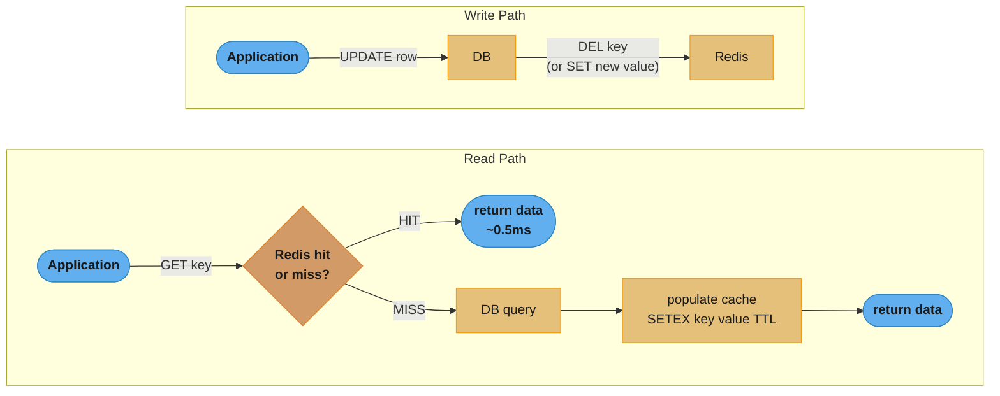

Reads check Redis first and fall through to the database only on a miss, repopulating the cache with a TTL; writes go straight to the database and then invalidate (or update) the cache key.

**Write-Through**

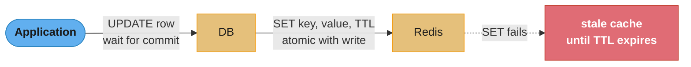

The write is atomic with the DB commit; if the Redis SET fails after the DB commit, the cache stays stale until TTL expiry (the red path above).

**Write-Behind (Write-Back)**

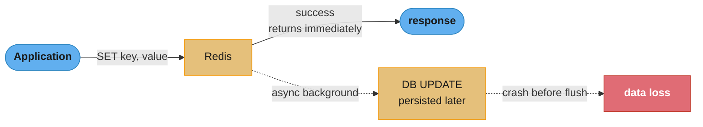

Use for write-heavy counters and analytics, not financial data: if Redis crashes before the async persist completes, the unsynced writes are lost.

**Cache Stampede Prevention — Unprotected**

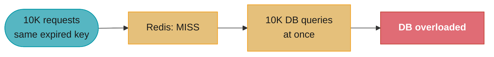

When a popular key expires, every concurrent request misses the cache at the same instant and queries the database simultaneously, overloading it.

**Cache Stampede Prevention — Techniques**

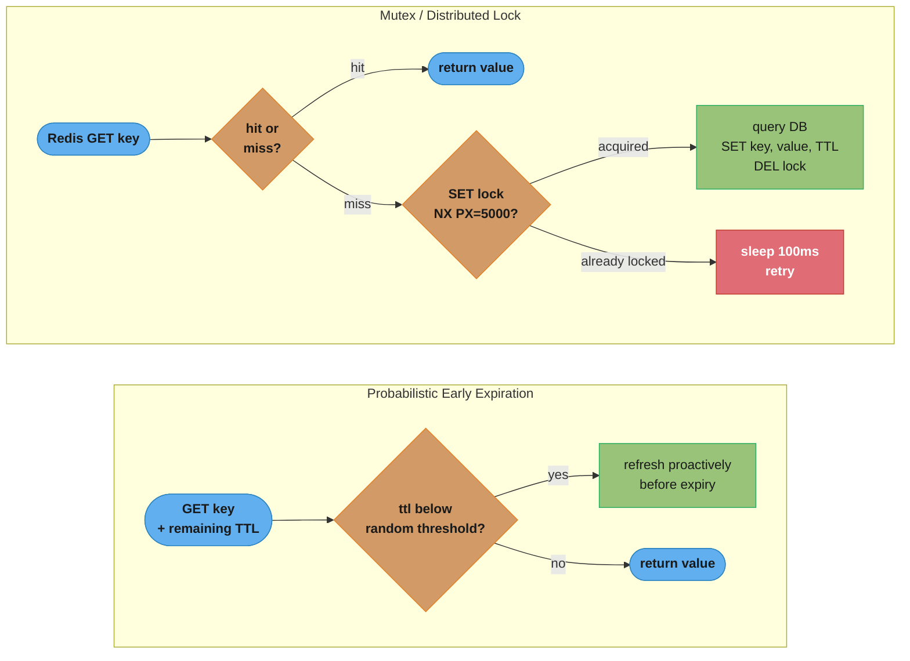

Probabilistic early expiration refreshes a key proactively before it expires once the remaining TTL drops below a random cutoff, so refreshes spread out instead of clustering; the mutex lock lets only the request that acquires the lock query the database, while every other concurrent request sleeps and retries instead of piling onto the database.

---

## 6. How It Works — Detailed Mechanics

### Cache-Aside (Lazy Loading) in Java

```java
@Service
public class UserService {

    private final RedisTemplate<String, User> redis;
    private final UserRepository db;
    private static final Duration TTL = Duration.ofMinutes(30);

    public User getUser(long userId) {
        String key = "user:" + userId;

        // 1. Check cache
        User cached = redis.opsForValue().get(key);
        if (cached != null) {
            return cached;  // cache hit: ~0.5ms
        }

        // 2. Cache miss: query DB
        User user = db.findById(userId)
            .orElseThrow(() -> new NotFoundException("User " + userId));

        // 3. Populate cache
        redis.opsForValue().set(key, user, TTL);  // expires in 30 minutes
        return user;
    }

    public void updateUser(long userId, UpdateUserRequest req) {
        // 1. Update DB (source of truth)
        User updated = db.save(/* ... */);

        // 2. Invalidate or update cache
        String key = "user:" + userId;
        redis.delete(key);  // invalidate; next read populates fresh
        // Alternative: redis.opsForValue().set(key, updated, TTL); // update
    }
}
```

**Delete vs update on write**: Deleting the cache key is safer than updating it because update requires the new value to be computed correctly (risk: stale data from a race if two concurrent updates write different values). Delete ensures the next read fetches fresh data from DB. Update avoids one DB round-trip but introduces a race window.

### Write-Through

```java
@Transactional
public void updateProduct(long productId, ProductUpdate req) {
    // 1. Write to DB (atomic)
    Product product = productRepository.findById(productId)
        .orElseThrow();
    product.apply(req);
    productRepository.save(product);

    // 2. Update cache synchronously (before returning success)
    String key = "product:" + productId;
    redis.opsForValue().set(key, product, Duration.ofHours(1));
}
// Risk: if Redis fails, the DB has the new data but cache is stale/old
// Fix: use cache.delete() as fallback if SET fails (degraded but safe)
```

### Write-Behind Pattern

```java
// Write immediately to cache
public void incrementPageView(long articleId) {
    String key = "pageviews:" + articleId;
    redis.opsForValue().increment(key);
    // No DB write here — fast path
}

// Background job persists to DB every 30 seconds
@Scheduled(fixedDelay = 30_000)
public void flushPageViews() {
    Set<String> keys = redis.keys("pageviews:*");
    for (String key : keys) {
        Long views = redis.opsForValue().get(key);
        if (views != null) {
            long articleId = extractId(key);
            db.updatePageViews(articleId, views);
            // Note: do NOT delete the key — counter continues accumulating
            // Alternatively: use GETSET to atomically read and reset
        }
    }
}
// Risk: Redis crash between increments and flush = lost view counts
// Acceptable for analytics; NOT acceptable for financial counters
```

### Cache Stampede — The Thundering Herd

A cache stampede occurs when a popular cache entry expires and many concurrent requests simultaneously miss the cache, all query the database, and all try to repopulate the cache at the same time.

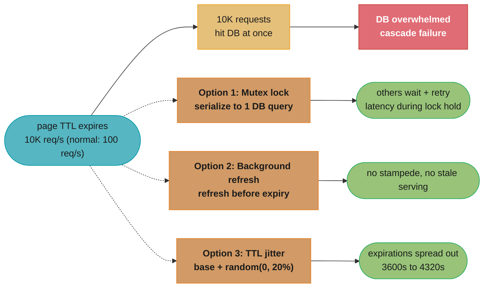

Without protection, 10K requests per second hit the database at once when a popular page's TTL expires (versus a normal load of 100 req/s), overwhelming it; mutex locking, background refresh, and TTL jitter each prevent the pile-up in a different way.

### Hot Key Problem

A hot key is a cache key accessed at a rate far exceeding what a single Redis node can handle (typically > 100K ops/second per key).

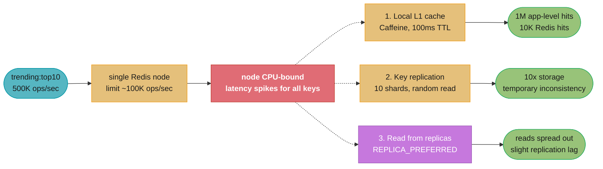

A single key at 500K ops/second exceeds one Redis node's ~100K ops/second limit and makes that node CPU-bound; a local L1 cache, key replication across shards, and reading from replicas each redistribute the load differently.

### Cache Invalidation Strategies

```
Strategy              | Mechanism                           | Tradeoff
----------------------|-------------------------------------|----------------------------
TTL (time-based)      | Entry expires after N seconds       | Simple; bounded staleness
Event-driven          | Write event triggers cache DEL       | Low latency; complex routing
CDC-based             | DB change → Debezium → cache DEL    | Accurate; infrastructure cost
Version-based keys    | key = "user:42:v7" (include version)| No invalidation needed; old
                      | Version in DB, incremented on write | versions naturally expire
Two-level (L1+L2)     | Caffeine (local) + Redis (shared)   | High hit rate; stale risk
```

**Version-based key approach**:
```java
// DB stores: user_version alongside user data
public User getUser(long userId) {
    // 1. Get current version (lightweight — cached separately or from DB)
    int version = versionCache.get(userId); // short TTL

    String key = "user:" + userId + ":v" + version;
    User cached = redis.opsForValue().get(key);
    if (cached != null) return cached;

    User user = db.findById(userId).orElseThrow();
    redis.opsForValue().set("user:" + userId + ":v" + user.getVersion(), user, TTL);
    return user;
}

public void updateUser(long userId, UpdateUserRequest req) {
    // DB: UPDATE users SET ... , version = version + 1 WHERE id = userId
    db.updateWithVersionIncrement(userId, req);
    // Old cache keys become unreachable (version changed) and expire via TTL
    // No explicit delete needed
}
```

### CDN as Cache Tier

For read-heavy content (product pages, static assets, API responses for public data), CDN functions as a distributed HTTP cache.

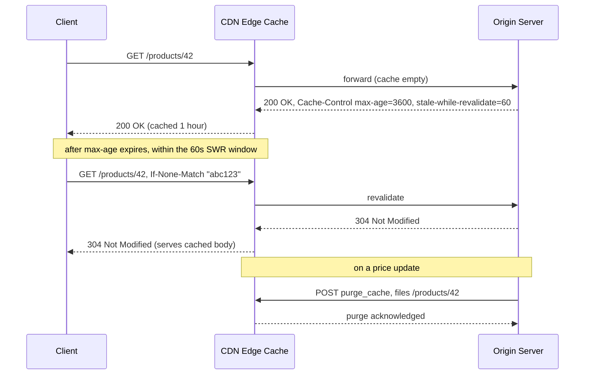

The first request is a cache miss and gets a fresh response carrying Cache-Control directives (1-hour max-age plus a 60-second stale-while-revalidate window); a later conditional GET with the ETag returns 304 without re-sending the body; the origin can force-evict one URL via the purge API on a price update. `Cache-Control: private, no-store` skips the CDN tier entirely for user-specific responses.

---

## 7. Real-World Examples

**Facebook**: TAO (The Associations and Objects) cache is a write-through cache of the social graph. Over 1 billion reads per second with ~99% cache hit rate. Write-through ensures cache is always consistent with the database on writes.

**Twitter**: Used a multi-level cache: Memcached for tweet objects, Redis for timelines (sorted sets), and CDN for media. Timeline cache precomputed fan-out at write time for users with < 10K followers.

**Stack Overflow**: Relies on SQL Server in-memory OLTP tables + application-layer cache (Redis/Memcached). 99.9% of traffic served from cache; database handles only cache misses and writes.

**Shopify**: Uses Redis with cache-aside pattern. Every cache key has TTL-based expiration. Critical data (product prices, inventory) uses shorter TTL (60 seconds); static data (product descriptions) uses longer TTL (1 hour).

---

## 8. Tradeoffs

```
Pattern          | Consistency     | Write Latency | Read Latency  | Complexity
-----------------|-----------------|---------------|---------------|------------
Cache-aside      | Eventual (TTL)  | DB only       | Cache + DB on miss | Low
Read-through     | Eventual (TTL)  | DB only       | Cache + DB on miss | Medium
Write-through    | Strong on write | Cache + DB    | Cache only    | Medium
Write-behind     | Eventual        | Cache only    | Cache only    | High
Write-around     | N/A             | DB only       | DB only       | Low
```

---

## 9. When to Use / When NOT to Use

**Use caching for**: Read-heavy data with tolerable staleness (user profiles, product catalogs, configuration). Computationally expensive queries whose results change infrequently. Rate limiting (Redis counters). Session state.

**Avoid caching for**: Data requiring strict freshness (financial balances, real-time inventory for checkout). Data that is never read twice (unique per-request). Very large objects that don't fit in a cache tier cost-effectively. Data where cache inconsistency causes correctness bugs that the business cannot tolerate.

**Cache-aside vs write-through**: Cache-aside is simpler; the cache is populated on demand. Write-through ensures the cache is always warm after writes. Choose write-through when read latency on cache misses is unacceptable (e.g., initial user session load must be < 50ms).

**Which caching pattern should I use?**

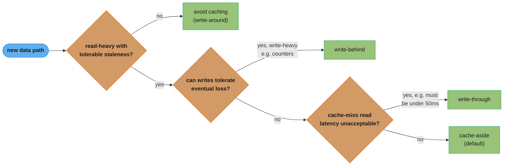

A quick decision path from the guidance above: tolerance for write loss favors write-behind, an unacceptable cache-miss read latency favors write-through, and everything else defaults to cache-aside.

---

## 10. Common Pitfalls

**Cache stampede on Black Friday**: A popular product page cached for 5 minutes. At midnight, the TTL was set identically for all products loaded in one batch. At exactly 00:05, all 1 million product cache entries expire simultaneously. 50K requests/second all miss cache and query the database. Database saturates. Fix: TTL jitter (`base_ttl + random(0, base_ttl * 0.2)`) prevents synchronized expiration.

**Thundering herd after Redis restart**: Redis is restarted for maintenance. All 10M cache keys are gone. Application traffic continues at full rate. Every request hits the database. Database saturates within seconds. Fix: pre-warm cache before cutting traffic back; use blue-green Redis with data migration; implement circuit breaker on DB if Redis is unavailable.

**Write-behind losing financial data**: Team uses write-behind (async persist) for order counts. Redis server crashes before the 30-second flush. 3 minutes of order count increments are lost. Financial reports are incorrect. Fix: write-behind is only appropriate for data where loss is acceptable (view counts, non-critical analytics). Financial data must use write-through or cache-aside with synchronous DB writes.

**Hot key causing Redis node saturation**: A "flash sale active" flag is checked on every request (100K/second). All requests go to one Redis key on one node. That node hits 100% CPU. Other keys on that node also slow down. Fix: cache the flag locally in the application process (Caffeine/Guava cache) with a 100ms TTL; check Redis only on miss. This reduces Redis reads for that key by 99%.

**Cache invalidation race condition**: Application reads user from DB, starts writing to cache. Simultaneously, another request updates the user in DB and deletes the cache key. The first request finishes and writes the OLD user to cache (the delete happened before the write). Cache now has stale data until TTL. Fix: use `SET NX` (set only if not exists) when repopulating after a delete, or use version-based keys.

```mermaid
sequenceDiagram
    participant A as Request A (reader)
    participant B as Request B (writer)
    participant DB as Database
    participant R as Redis

    A->>DB: read user (cache miss)
    Note over A,DB: A's read is in flight (slow)
    B->>DB: UPDATE user to v2
    DB-->>B: commit ok
    B->>R: DEL user key
    R-->>B: ack
    DB-->>A: return user v1
    A->>R: SET user key = v1
    Note over R: delete already ran first;<br/>cache now holds stale v1 until TTL expiry
```

Request A's read started first but is slow; Request B's update-and-delete completes while A's read is still in flight, so A's stale v1 arrives after the delete and repopulates the cache, leaving stale data until TTL expiry (the fix above: SET NX, or version-based keys).

---

## 11. Technologies & Tools

| Tool          | Purpose                          | Key Feature                    |
|---------------|----------------------------------|--------------------------------|
| Redis         | Primary cache store              | Rich data structures, Cluster  |
| Memcached     | Simple string cache              | Multi-threaded, low overhead   |
| Caffeine      | JVM in-process cache (L1)        | W-TinyLFU algorithm, high hit  |
| Ehcache       | JVM in-process cache             | JCache (JSR-107) compatible    |
| Varnish       | HTTP reverse proxy cache         | VCL configuration language     |
| Nginx         | HTTP caching + proxy             | proxy_cache, fastcgi_cache     |
| CloudFront    | CDN for HTTP responses           | Global edge caching            |
| Hazelcast     | Distributed in-memory cache grid | Near-cache, partition-aware    |

---

## 12. Interview Questions with Answers

**Q: What is a cache stampede and how do you prevent it?**
A cache stampede (thundering herd) occurs when a popular cache entry expires and many concurrent requests simultaneously miss the cache, all query the database at once. With 10K requests/second hitting the database instead of 100 (normal non-cached load), the database saturates. Prevention strategies: (1) Mutex lock: only one request queries the database when a key is missing; others wait and retry. (2) Background refresh: detect entries nearing expiration and refresh before they expire, serving stale data to current requests. (3) TTL jitter: add random variance to TTL so bulk-loaded entries don't all expire at the same time. (4) Local L1 cache: a short-TTL in-process cache means cache misses are rare even when Redis is unavailable.

**Q: When would you use write-behind caching and what are the durability risks?**
Write-behind (write-back) caches writes in Redis and asynchronously persists them to the database. Use it when write throughput far exceeds database capacity and the data can tolerate loss — view counts, like counts, non-financial analytics counters. The durability risk: if Redis crashes before the async persist completes, all unsynced writes are lost. For a 30-second flush interval, up to 30 seconds of data is at risk. Never use write-behind for financial transactions, inventory counts that affect checkout, or any data where loss causes business or compliance issues.

**Q: How do you invalidate cache entries in a microservices architecture where multiple services write to the same data?**
Options: (1) Event-driven invalidation: the service that owns the data publishes a change event to a message bus (Kafka); all services with cached copies subscribe and invalidate. (2) CDC-based invalidation: Debezium tails the database WAL, detects row changes, publishes invalidation events to Kafka; a cache invalidation service consumes events and deletes keys. (3) TTL-only: accept bounded staleness (e.g., 60-second TTL) and rely on TTL expiration. (4) Version-based keys: the DB version column is part of the cache key; old versions expire naturally. Event-driven is most accurate but requires reliable message delivery and idempotent consumers. TTL-only is simplest and handles most cases.

**Q: Explain the difference between cache-aside and read-through caching.**
Cache-aside: the application manages the cache explicitly. On a read miss, the application queries the database, then populates the cache. On a write, the application updates the database and optionally invalidates/updates the cache. The cache is populated on demand. Read-through: the cache layer transparently queries the database on a miss, returning the result and caching it. The application interacts only with the cache interface. Difference: cache-aside gives the application full control (useful for complex caching logic or non-standard data types); read-through is simpler for the application (implemented by frameworks like Spring Cache, Caffeine LoadingCache) but requires the cache layer to know how to query the database.

**Q: What is the hot key problem in Redis and how do you solve it?**
A hot key is a single Redis key receiving more traffic than a single Redis node can handle (typically > 100K ops/second). Since Redis keys are pinned to specific nodes in a cluster, one node becomes a CPU bottleneck regardless of cluster size. Solutions: (1) Local in-process cache (Caffeine with 100–500ms TTL): application checks in-process cache before Redis; reduces Redis access rate by 99% for hot keys. (2) Key sharding: replicate the hot key across N Redis keys (e.g., trending:1 through trending:10), read from a randomly chosen shard, write to all. (3) Read from Redis replicas: use `ReadFrom.REPLICA_PREFERRED` to distribute reads across primary and replicas. (4) Use Redis Cluster's read-from-replica mode.

**Q: How does the write-through pattern ensure cache consistency?**
Write-through updates both the database and the cache synchronously during each write, ensuring the cache always reflects the current database state for any key that was previously cached. If the write to the database succeeds but the cache update fails, the cache entry should be explicitly deleted (fallback) to prevent stale data. The benefit: any key in the cache is guaranteed to be current as of the last write. The cost: every write pays the latency of updating both the database and cache; writes are slower than pure cache-aside (which only writes to the database). Most appropriate when cache misses are expensive and reads far outnumber writes.

**Q: How do you handle cache warming after a Redis restart?**
Strategies: (1) Lazy warming: let the cache fill naturally from cache misses. Use a circuit breaker on the database to shed load while the cache warms. (2) Pre-warming script: before cutting traffic over, run a script that reads frequently accessed keys from the database and populates the cache. Identify hot keys from historical access logs. (3) Redis persistence: configure RDB or AOF so Redis restores its state from disk on restart — no warming needed for data that was cached before shutdown. (4) Blue-green cache: maintain a second Redis instance, gradually shift traffic while the new instance warms from the primary's replication stream. (5) Staggered deployment: deploy to a subset of servers, let them warm the cache, then expand.

**Q: What metrics indicate caching is working and when it is degrading?**
Primary metric: cache hit rate = hits / (hits + misses). Target: ≥ 95% for frequently accessed data. Alert if it drops below 90%. Secondary metrics: (1) Cache eviction rate — high evictions (from Redis INFO: evicted_keys) indicate cache is undersized. (2) Average cache miss latency — a spike indicates the database is slow on cache misses. (3) Key TTL distribution — if most keys have very short TTL, they expire before being accessed, contributing to low hit rate. (4) Memory usage vs maxmemory — if approaching 90%, add capacity or reduce TTL. (5) Per-key access frequency (Redis --hotkeys flag) — identify hot keys for dedicated treatment.

**Q: What is the stale-while-revalidate CDN pattern?**
`stale-while-revalidate` is an HTTP Cache-Control directive that tells CDN edge nodes: serve the stale (expired) cached version immediately to the current request while simultaneously revalidating (fetching a fresh copy) in the background. This eliminates the latency spike that occurs when an entry expires and the CDN must wait for the origin server to respond before serving the request. The syntax: `Cache-Control: max-age=3600, stale-while-revalidate=60` means: fresh for 1 hour; after expiry, serve stale for up to 60 more seconds while revalidating. The user always gets a fast response; the stale-serving window is bounded to 60 seconds.

**Q: How does Spring Cache abstraction simplify caching?**
Spring Cache (`@Cacheable`, `@CachePut`, `@CacheEvict`) provides declarative caching as an AOP-based abstraction. Annotate methods; Spring intercepts calls, checks the cache, and either returns cached results or calls the method and caches the result. The backing store (Redis, Caffeine, EhCache) is swappable via `CacheManager` configuration.

```java
@Cacheable(value = "products", key = "#productId", unless = "#result == null")
public Product getProduct(long productId) {
    return productRepository.findById(productId).orElse(null);
}

@CacheEvict(value = "products", key = "#product.id")
public void updateProduct(Product product) {
    productRepository.save(product);
}

@CachePut(value = "products", key = "#result.id")
public Product createProduct(CreateProductRequest req) {
    return productRepository.save(new Product(req));
}
```
Limitation: Spring Cache does not handle distributed stampede prevention, TTL per-entry, or cache-aside logic for complex multi-key operations.

**Q: What is the N+1 caching problem and how do you fix it?**
The N+1 caching problem occurs when an application fetches N entity IDs and then makes N individual cache lookups (one per ID). With 100 entities, this is 100 separate Redis round trips (N×RTT). Fix: use `MGET` (Redis multi-get) to fetch all N keys in a single round trip. The cache miss handling: for missing keys, query the database in a single `WHERE id IN (...)` query (not N individual queries). Then populate all N missing keys with a pipeline of SET commands.

```java
public List<User> getUsers(List<Long> userIds) {
    List<String> keys = userIds.stream().map(id -> "user:" + id).toList();

    // Single MGET: one network round trip for all N keys
    List<User> cached = redis.opsForValue().multiGet(keys);

    // Find which IDs had cache misses
    List<Long> missingIds = new ArrayList<>();
    for (int i = 0; i < userIds.size(); i++) {
        if (cached.get(i) == null) missingIds.add(userIds.get(i));
    }

    if (!missingIds.isEmpty()) {
        // Single DB query for all missing IDs
        List<User> dbUsers = userRepository.findAllById(missingIds);

        // Populate cache for misses (pipeline: single round trip)
        Map<String, User> toCache = dbUsers.stream()
            .collect(toMap(u -> "user:" + u.getId(), identity()));
        redis.opsForValue().multiSet(toCache);

        // Merge DB results into cached list
        Map<Long, User> dbMap = dbUsers.stream().collect(toMap(User::getId, identity()));
        for (int i = 0; i < userIds.size(); i++) {
            if (cached.get(i) == null) {
                cached.set(i, dbMap.get(userIds.get(i)));
            }
        }
    }
    return cached;
}
```

**Q: How do you prevent cache-related security issues (cache poisoning)?**
Cache poisoning: a malicious user causes an incorrect response to be cached and served to other users. Prevention: (1) Never cache responses that vary per-user or include authorization — use `Cache-Control: private` or `Vary: Authorization`. (2) Validate all cache keys: if the cache key contains user input, sanitize it to prevent key collision between users. (3) Use separate cache namespaces per tenant in multi-tenant systems: key prefix = `tenant:{tenant_id}:user:{user_id}`. (4) For CDN: validate `X-Forwarded-Host` and `X-Forwarded-For` headers before using them in cache keys — these can be spoofed to poison other users' caches.

**Q: How does two-level caching (L1 + L2) work?**
L1 (local in-process cache, e.g., Caffeine) is checked first. L2 (shared distributed cache, e.g., Redis) is checked on L1 miss. Database is queried only on L2 miss.

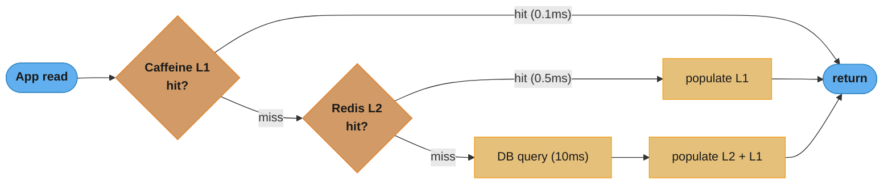

L1 is checked first and returns in about 0.1ms; an L1 miss falls through to L2 (about 0.5ms), which repopulates L1; only an L2 miss reaches the database (about 10ms), which then repopulates both cache levels.

L1 caches ultra-hot data locally, reducing Redis network traffic by 90%+ for the hottest keys. Tradeoff: L1 entries on different application instances may be stale relative to each other for up to the L1 TTL. On L2 invalidation (explicit delete), L1 entries continue serving stale data until their own TTL expires. Acceptable for configuration data and slowly changing reference data; not acceptable for user-facing profile data that must reflect writes quickly.

**Q: What causes the cache invalidation race condition where a stale read repopulates the cache after a delete?**
A slow read that started before a write can finish after the write's cache delete, so it repopulates the cache with the old value and leaves it stale until the next TTL expiry. Request A begins reading the database while it's still slow to respond; meanwhile Request B updates the database and deletes the cache key; Request A's read then finally completes and writes the pre-update value back into what is now an empty cache slot, and nothing triggers another invalidation until TTL. Fix: use `SET NX` so the repopulating write only succeeds if the key is still absent, or use version-based keys so a stale write targets a version that's already obsolete and never gets read back.

**Q: What is write-around caching and when should you use it?**
Write-around sends writes straight to the database and bypasses the cache entirely, so a key is only populated later by a normal read (cache-aside style) rather than at write time. This differs from write-through, which populates the cache immediately on every write — write-around deliberately avoids caching data that may never be read again, which suits write-heavy, rarely-re-read data such as bulk imports, audit logs, or write-once event records. The tradeoff is that the very first read after a write is always a cache miss, a cold read that pays full database latency, which makes write-around a poor fit for data that's read immediately after being written. Use write-around for write-heavy data with low read-after-write likelihood, and pair it with cache-aside to handle the read path.

**Q: What is negative caching and why does it need a shorter TTL than a normal cache entry?**
Negative caching stores the fact that a lookup found nothing — a `null` or a sentinel value for a missing user ID or a 404 response — so repeated requests for that same absent key stop reaching the database. Without it, a client retrying a bad ID, or an attacker enumerating IDs that don't exist, sends every single request straight through to the database because a cache-aside layer only populates on a hit; caching the miss itself closes that gap. The catch is that negative entries need a much shorter TTL than positive ones — 30-60 seconds rather than the 10+ minutes typical for real data — because the underlying row can be created moments later, and a long-lived negative entry would then mask genuinely new data as still-missing. Apply negative caching to any high-cardinality lookup key exposed to retries or scans, and keep its TTL an order of magnitude shorter than the positive-entry TTL for the same cache.

---

## 13. Best Practices

- **Monitor cache hit rate continuously** and alert on drops below 90% — a silent hit rate drop means the database absorbs unexpected load.
- **Set maxmemory and an appropriate eviction policy** (allkeys-lfu for general caches) before production; never run without memory limits.
- **Add TTL jitter** to all bulk-loaded cache entries to prevent synchronized expiration.
- **Use MGET/pipeline** for bulk cache operations — individual round trips for N keys cost N×RTT.
- **Cache at the right granularity** — cache full objects rather than individual fields; avoid partial object caching which leads to inconsistency.
- **Implement circuit breaker** on the database layer for cache miss path — if the database is slow, don't let cache misses cascade into database overload.
- **Test cache failure modes** — disable Redis and verify the application degrades gracefully (slower, not broken).
- **Never cache unbounded results** — cache paginated results, not full table scans; set reasonable value size limits.

---

## 14. Case Study

**Scenario**: An e-commerce platform with 2M daily active users serves product detail pages at 50K requests/second. Each page requires: product data (DB), inventory count (DB), pricing data (DB), and user-specific discount (DB with user_id). Database handles 8K queries/second at 70% CPU utilization. A seasonal event will triple traffic to 150K requests/second in 2 days.

**Before caching**: 4 DB queries per page × 50K req/s = 200K DB queries/second. Impossible.

**Caching design**:

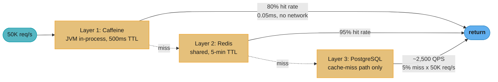

Product and pricing keys are cached in both layers; user-specific discounts vary per user and live only in Caffeine (Layer 1), while inventory keys live only in Layer 2 (Redis) with acceptable 60-second staleness. The design projects roughly 2,500 database queries per second at 50K req/s — a 5% miss rate cascading through both cache layers.

**Cache invalidation**:
- Product data updated: outbox event → Debezium → Kafka → cache invalidation service deletes Redis key
- Pricing updated: delete Redis key; Caffeine entries expire within 500ms
- Inventory updated: delete Redis key; show 60-second staleness for inventory (acceptable)

**Results at 50K req/s**:
- Caffeine hit rate: 82% (41K requests served from JVM)
- Redis hit rate: 94% of remaining 9K (8.5K from Redis)
- DB QPS: 500 (from 200K theoretical; 99.75% reduction)
- DB CPU: 8% (from 70%)

**At 150K req/s (3× event)**:
- Caffeine: 123K requests
- Redis: 24.3K requests
- DB QPS: 1,500 (well within capacity)
- Action: increase Redis memory from 16GB to 32GB for larger working set; no DB scaling needed
