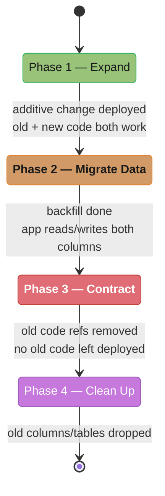
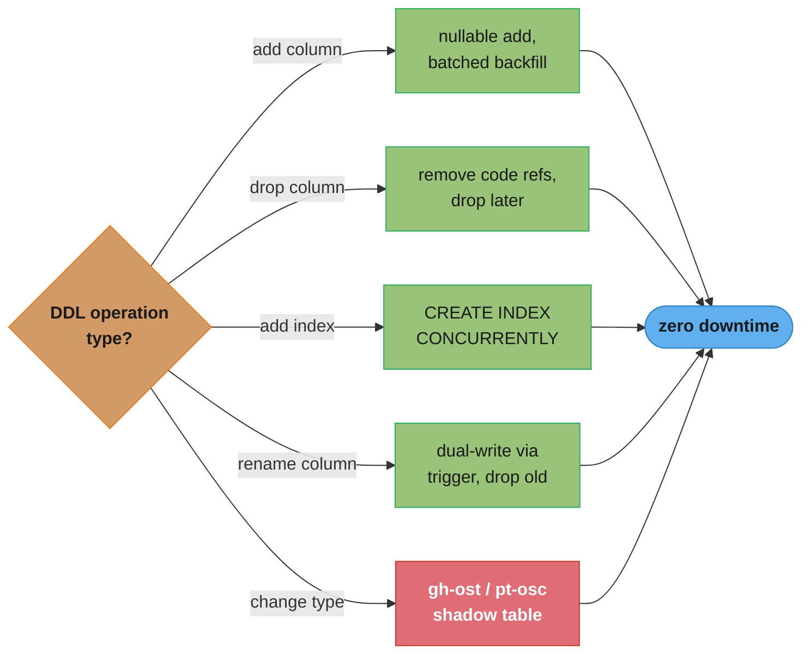
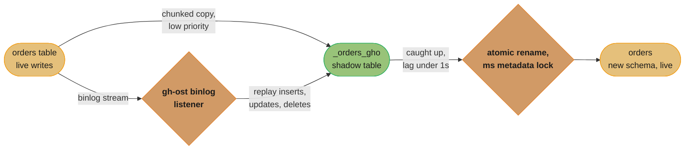
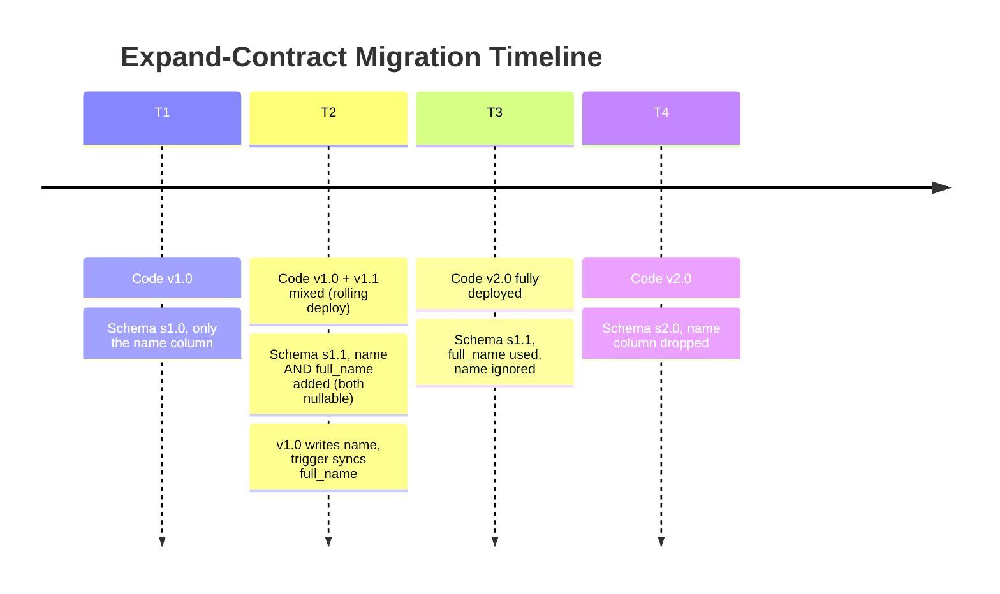
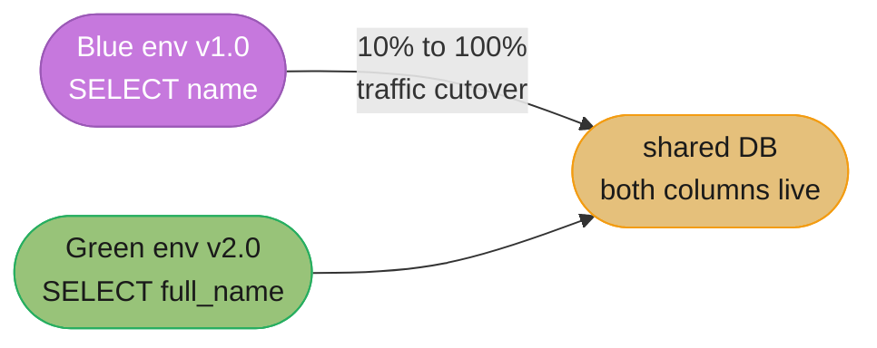

# Database Migrations — Zero Downtime

## 1. Concept Overview

Database migrations are changes to the database schema (adding columns, dropping tables, creating indexes, changing types) applied in a controlled, versioned manner. Zero-downtime migrations allow continuous application deployments without read or write outages. The core challenge: database and application code must be compatible during the deployment transition when both old and new code versions run simultaneously.

---

## 2. Intuition

A production database migration is like changing an airplane engine mid-flight. You cannot stop the plane (downtime), so you must perform changes while traffic flows through. The expand-contract pattern is the fundamental technique: first expand the schema to support both old and new code, then contract once all old code is gone.

- **Key insight**: Most migration failures happen because developers test against their local single-version environment. In production, N replicas may run old code while N replicas run new code simultaneously during a rolling deploy. The schema must satisfy both versions at once.

---

## 3. Core Principles

### Expand-Contract (Parallel Change) Pattern

The canonical zero-downtime migration pattern:



Each phase is a one-way gate: expand adds the new schema element so both code versions work simultaneously, migrate backfills and dual-writes, contract retires the old code paths (the riskiest step — see Pitfall 1), and only clean-up physically drops the old columns.

### Migration Tools

**Flyway**: SQL-first migration tool. Each migration is a versioned SQL file (V1__create_users.sql, V2__add_email_index.sql). On startup, checks which migrations have been applied (stored in `flyway_schema_history`), applies any pending migrations in order. Checksum verification catches file tampering.

**Liquibase**: XML/YAML/JSON/SQL changelogs. Supports rollback (undo) migrations. More flexible change tracking. Can generate SQL for review before applying.

```xml
<!-- Liquibase changeSet example -->
<changeSet id="20240115-add-phone-column" author="dev@company.com">
    <addColumn tableName="users">
        <column name="phone" type="varchar(20)" defaultValue=""/>
    </addColumn>
</changeSet>
```

---

## 4. Types / Architectures / Strategies

### Zero-Downtime DDL by Operation Type



The safe technique depends entirely on the operation type: additive changes (add column, add index) are nearly free, while renames and type changes need dual-write or a shadow-table tool to avoid a blocking table rewrite.

**ADD COLUMN — with DEFAULT**:
```sql
-- PostgreSQL 11+: INSTANT for columns with non-volatile defaults
ALTER TABLE users ADD COLUMN phone TEXT DEFAULT '';
-- PostgreSQL < 11: rewrites entire table (hours for large tables)
-- Solution for PG < 11: add nullable first, backfill, add default/constraint later
ALTER TABLE users ADD COLUMN phone TEXT;  -- Instant (nullable, no default)
-- Deploy new code that writes phone
-- Backfill: UPDATE users SET phone = '' WHERE phone IS NULL; (batched)
-- Add NOT NULL constraint: ALTER TABLE users ALTER COLUMN phone SET NOT NULL; -- PG 11+: instant check from stats
```

**DROP COLUMN — safe approach**:
```sql
-- Step 1: Remove all code references to the column (deploy)
-- Step 2: Mark as unused (PostgreSQL: column not physically removed yet, but ignored)
-- Optional: ALTER TABLE users ALTER COLUMN old_field TYPE TEXT USING NULL; -- set to NULL to free space
-- Step 3: Drop after confirming no code references:
ALTER TABLE users DROP COLUMN old_field;
-- Risk if dropped prematurely: new code deploys fine, old code can't find column → ERROR
```

**ADD INDEX CONCURRENTLY**:
```sql
-- Standard: takes ShareLock, blocks writes
CREATE INDEX idx_users_email ON users (email);  -- BLOCKS writes for hours on large table

-- Concurrent: no write locks, safe in production
CREATE INDEX CONCURRENTLY idx_users_email ON users (email);
-- Takes ~3x longer, but no table lock
-- Risk: if it fails, leaves INVALID index → must DROP INDEX CONCURRENTLY and retry
-- Monitor: SELECT * FROM pg_stat_progress_create_index;

-- MySQL equivalent:
ALTER TABLE users ADD INDEX idx_email (email), ALGORITHM=INPLACE, LOCK=NONE;
```

**RENAME COLUMN — dual-write period**:
```sql
-- Dangerous: rename column and deploy app simultaneously = downtime if deploy is partial
-- Safe pattern:
-- Step 1: Add new column
ALTER TABLE users ADD COLUMN full_name TEXT;

-- Step 2: Copy data + keep in sync via trigger
CREATE OR REPLACE FUNCTION sync_name() RETURNS TRIGGER AS $$
BEGIN
    NEW.full_name = NEW.name;
    RETURN NEW;
END;
$$ LANGUAGE plpgsql;
CREATE TRIGGER sync_name_trigger BEFORE INSERT OR UPDATE ON users
FOR EACH ROW EXECUTE FUNCTION sync_name();

-- Step 3: Backfill
UPDATE users SET full_name = name WHERE full_name IS NULL;

-- Step 4: Deploy new code using full_name
-- Step 5: Deploy to remove trigger, drop old column
DROP TRIGGER sync_name_trigger ON users;
ALTER TABLE users DROP COLUMN name;
```

**ALTER COLUMN TYPE — most dangerous**:
```sql
-- Incompatible type change (e.g., INT → BIGINT) requires table rewrite in most databases
-- Use gh-ost or pt-osc for large tables:

-- gh-ost (GitHub's Online Schema Change):
gh-ost \
  --host=primary-host \
  --database=mydb \
  --table=orders \
  --alter="MODIFY COLUMN user_id BIGINT NOT NULL" \
  --execute

-- gh-ost process:
-- 1. Creates _orders_gho shadow table with new schema
-- 2. Sets up binlog listener on primary
-- 3. Copies rows from orders → _orders_gho in chunks
-- 4. Applies ongoing changes from binlog to shadow table
-- 5. When caught up: RENAME TABLE orders → _orders_del, _orders_gho → orders (atomic, ms)
```



The shadow table is built from a chunked copy plus a live binlog replay so it never falls far behind; the final `RENAME TABLE` swap is the only moment that touches the real table name, and it completes in milliseconds.

### Schema Registry for Event-Driven Systems

When using Kafka/schema-based messaging, the message schema is separate from the database schema. Confluent Schema Registry enforces Avro/Protobuf/JSON schema compatibility.

```
Avro schema evolution compatibility modes:
BACKWARD:  New schema can read data written with old schema (new readers, old writers)
           Adding fields with defaults = backward compatible
           Removing required fields = NOT backward compatible

FORWARD:   Old schema can read data written with new schema (old readers, new writers)
           Adding required fields = not forward compatible
           Removing fields = forward compatible

FULL:      Both backward and forward compatible
           Only add/remove fields with defaults
```

---

## 5. Architecture Diagrams



At T2, some pods still run v1.0 while others already run v1.1 — both versions work because schema s1.1 carries both columns and the v1.1 trigger keeps `full_name` in sync with every `name` write. Only at T4, once every pod is on v2.0, is it safe to drop `name`.



During the cutover the database must satisfy both queries at once: at 10% and 50% traffic on green, `name` and `full_name` both stay populated; only once green carries 100% of traffic can `name` be dropped.

---

## 6. How It Works — Detailed Mechanics

### Flyway Migration Locking

Flyway acquires a distributed lock in the database before running migrations. If multiple application instances start simultaneously, only one runs migrations; others wait.

```sql
-- Flyway schema history table:
CREATE TABLE flyway_schema_history (
    installed_rank INT NOT NULL,
    version VARCHAR(50),
    description VARCHAR(200),
    type VARCHAR(20) NOT NULL,  -- SQL, BASELINE, etc.
    script VARCHAR(1000) NOT NULL,
    checksum INT,
    installed_by VARCHAR(100) NOT NULL,
    installed_on TIMESTAMP NOT NULL DEFAULT now(),
    execution_time INT NOT NULL,
    success BOOLEAN NOT NULL,
    CONSTRAINT flyway_schema_history_pk PRIMARY KEY (installed_rank)
);
```

### NOT NULL Column Addition — PostgreSQL Version Differences

```sql
-- PostgreSQL 11+: ADD COLUMN with constant default = INSTANT
-- PostgreSQL stores the default in pg_attrdef, rewrites on first access
ALTER TABLE users ADD COLUMN score INT NOT NULL DEFAULT 0;
-- Returns immediately for ANY table size

-- PostgreSQL 10 and below: ADD COLUMN NOT NULL = FULL TABLE REWRITE
-- For a 100M-row table: takes hours, holds AccessExclusiveLock

-- Safe approach for PG < 11:
BEGIN;
ALTER TABLE users ADD COLUMN score INT;  -- Nullable, instant
COMMIT;
-- Backfill in batches (no downtime):
DO $$
DECLARE v_batch_size INT := 10000;
        v_max_id BIGINT;
        v_cursor BIGINT := 0;
BEGIN
    SELECT MAX(id) INTO v_max_id FROM users;
    WHILE v_cursor < v_max_id LOOP
        UPDATE users SET score = 0
        WHERE id BETWEEN v_cursor AND v_cursor + v_batch_size
          AND score IS NULL;
        v_cursor := v_cursor + v_batch_size;
        PERFORM pg_sleep(0.01); -- Throttle to reduce I/O pressure
    END LOOP;
END$$;
-- After backfill: add NOT NULL constraint (fast if all values present)
ALTER TABLE users ALTER COLUMN score SET NOT NULL;  -- PG 11+: validates from stats
```

---

## 7. Real-World Examples

- **GitHub**: Uses pt-online-schema-change (pt-osc) and gh-ost for large MySQL schema changes. gh-ost was developed in-house specifically because pt-osc triggers caused production incidents.
- **Stripe**: Expand-contract for every schema change. New code must write both old and new column formats for at least one full deployment cycle.
- **Shopify**: Blue-green deployments with schema compatibility requirements. Any migration that's not backward-compatible requires a separate pre-migration deployment.
- **Airbnb**: Maintains a migration compatibility matrix — every migration labeled as "backward compatible" or "requires expand-contract" before approval.

---

## 8. Tradeoffs

| Migration Approach | Downtime Risk | Speed | Complexity |
|------------------|---------------|-------|------------|
| Standard ALTER TABLE | High (locks) | Fast | Low |
| CREATE INDEX CONCURRENTLY | None | Slow (3x) | Low |
| gh-ost / pt-osc | Very Low | Slow | High |
| Expand-contract | None | Slow (multiple deploys) | High |
| Flyway/Liquibase | Low (schema migration only) | Fast | Low (tool manages it) |

---

## 9. When to Use / When NOT to Use

**Expand-contract REQUIRED for**:
- Renaming a column or table
- Changing a column's data type incompatibly
- Removing a column/table

**Standard ALTER TABLE safe when**:
- Adding a nullable column (instant in all modern databases)
- Dropping an unused constraint
- Short maintenance window acceptable

**CREATE INDEX CONCURRENTLY**:
- Always use in production for new indexes on tables > 100K rows

**gh-ost / pt-osc**:
- Use for any table rewrite on tables > 1GB in production
- Do not use for small tables (overhead exceeds benefit)

---

## 10. Common Pitfalls

**Pitfall 1: Deploying app and migration simultaneously**
Team deployed a migration (drops old column) simultaneously with the new code (that doesn't use the old column) in a rolling deploy. Old pods (still deployed) failed because the column they read was gone. Fix: always deploy migrations before new code, maintain backward compatibility for at least one deployment.

**Pitfall 2: INVALID index left after failed CONCURRENTLY**
`CREATE INDEX CONCURRENTLY` failed midway (OOM, timeout). Left an INVALID index that wastes space and slows writes. Detection: `SELECT indexname FROM pg_indexes WHERE NOT pg_index.indisvalid` (join with pg_class). Fix: `DROP INDEX CONCURRENTLY idx_name` then rebuild.

**Pitfall 3: Flyway checksum mismatch**
A developer edited a past migration file directly to fix a typo. On next deployment, Flyway detected checksum mismatch and refused to start the application. Fix: never edit applied migration files — add a new migration to correct the data. Use `flyway repair` to update the stored checksum if the edit was intentional and safe.

**Pitfall 4: gh-ost running during high write period**
gh-ost reduces lag by pausing chunk copy when binlog lag grows. During a marketing campaign (10x normal write rate), gh-ost paused for 4 hours, keeping the shadow table permanently behind. Fix: schedule large online schema changes during lowest write periods. Set `--max-load="Threads_running=80"` to pause gh-ost when system is under load.

**Pitfall 5: Not testing rollback of migrations**
A migration created a new NOT NULL column. The deployment was rolled back due to a bug in new code. The rollback code (old code) didn't know about the new column and tried to INSERT without providing a value → constraint violation. Fix: test rollback scenarios explicitly. For critical rollbacks, prepare a matching rollback migration or ensure the column has a DEFAULT value that satisfies old code.

---

## 11. Technologies & Tools

| Tool | Use Case |
|------|---------|
| Flyway | SQL-versioned migrations, Spring Boot integration |
| Liquibase | XML/YAML changelogs, rollback support |
| gh-ost | Online MySQL schema changes (GitHub's tool) |
| pt-online-schema-change | Percona's online schema change for MySQL |
| `CREATE INDEX CONCURRENTLY` | PostgreSQL online index creation |
| `REINDEX CONCURRENTLY` | PostgreSQL online index rebuild (PG 12+) |
| `pg_partman` | Automated partition management/creation |
| Atlas | Schema-as-code, drift detection, migration planning |
| Skeema | MySQL schema management as code (git-workflow) |

---

## 12. Interview Questions with Answers

**Q: How do you add a NOT NULL column to a 500M-row production table without downtime?**
In PostgreSQL 11+: `ALTER TABLE t ADD COLUMN col TYPE NOT NULL DEFAULT value` is instant — PostgreSQL stores the default in the catalog (pg_attrdef) and returns the default for any existing row that doesn't have the value stored yet, without rewriting the table. In PostgreSQL 10 and below, or when the default is not constant: (1) Add column as nullable (instant). (2) Backfill in batches with commit every 10,000 rows (no long transaction). (3) After all rows populated, add NOT NULL constraint — PostgreSQL 12+ can use `NOT VALID` first to skip the full scan, then `VALIDATE CONSTRAINT` during a low-traffic window. (4) After validation, add `SET NOT NULL` (fast on PG 11+ since it checks pg_statistic for null fractions).

**Q: What is the expand-contract pattern and which schema operations require it?**
Expand-contract: (1) Expand: add new schema elements that both old and new code can coexist with. (2) Contract: remove old elements after all code is updated. Required for: renaming columns (add new name, write both, remove old), changing column type incompatibly (add new column with new type, migrate data, switch reads, drop old), removing columns or tables (stop writing, verify no reads, then drop). Not required for: adding a nullable column, adding an index, adding a new table. The key rule: a migration that can cause existing queries to fail is not zero-downtime without the expand-contract pattern.

**Q: How does gh-ost avoid the full table lock that ALTER TABLE causes?**
gh-ost (GitHub's Online Schema Change) avoids locks by never using `ALTER TABLE` directly. Instead: (1) Creates a "ghost" table with the desired schema. (2) Listens to the binary log for all changes to the original table. (3) Copies data from original → ghost in small chunks at low priority. (4) Applies all binlog changes (new inserts/updates/deletes during copy) to the ghost table in real-time. (5) When the ghost table is fully caught up (< a few seconds behind), executes an atomic `RENAME TABLE original → _original_del, ghost → original`. The rename takes a metadata lock for milliseconds, not the full copy duration. This is safer than pt-online-schema-change which uses triggers (can cause issues with high-write tables and row-based replication).

**Q: What is schema registry and why is it important for event-driven systems?**
A schema registry (e.g., Confluent Schema Registry) stores the schema definitions for messages produced to a message broker (Kafka). Producers include a schema ID in each message; consumers use the ID to fetch the schema and deserialize. Importance: (1) Enforces schema evolution rules (BACKWARD, FORWARD, FULL compatibility) — rejects incompatible changes at producer time. (2) Enables consumers to handle older and newer message versions gracefully. (3) Eliminates schema embedded in every message (bandwidth savings). (4) Required for zero-downtime microservice deployments where producers and consumers are deployed independently. Without schema registry: a producer schema change breaks all existing consumers immediately.

**Q: What are Flyway and Liquibase and how do they differ?**
Both are database migration tools that track which migrations have been applied (stored in a version table) and apply pending ones in order. Flyway: SQL-first, simple, each migration is a `.sql` file named with version prefix (V1__, V2__). Very opinionated, minimal configuration, excellent Spring Boot integration. Does not support rollback (undo migrations require manual reverse SQL). Liquibase: supports XML/YAML/JSON/SQL changelog formats, supports rollback tags, more flexible change tracking (each changeSet has an id, author, and checksum). More complex to set up. Liquibase supports "diff" against database to generate migrations. Choice: use Flyway for simplicity in new projects; Liquibase for complex enterprise projects needing rollback or multi-format changelogs.

**Q: How do you handle a migration that must run on a table receiving 50,000 writes per second?**
For index creation: `CREATE INDEX CONCURRENTLY` — takes 3x longer but allows continuous writes. For column addition (PostgreSQL 11+): instant for constant defaults. For column type changes: use gh-ost. Deploy gh-ost during the lowest write period. gh-ost self-throttles when replication lag or system load exceeds thresholds — it will pause and resume automatically. For table rebuilds: test gh-ost on a staging environment first. Plan for gh-ost to take 2-4 hours for large tables at high write rates. Communicate expected duration to on-call team. Have a rollback plan (gh-ost creates a separate ghost table — the original is untouched until the final rename, making rollback trivial: just drop the ghost table).

**Q: What happens if a Flyway migration fails midway through?**
Flyway marks the migration as failed in the `flyway_schema_history` table (`success = false`). On next startup, Flyway sees the failed migration and refuses to start the application (fail-fast behavior). Manual recovery: (1) Assess the state — how much of the migration ran before failure. (2) Manually apply the remaining SQL or roll back the partial changes. (3) After the database is in a consistent state, run `flyway repair` to either mark the migration as successful (if the final state is correct) or delete the failed entry (to allow re-running the migration). (4) Fix the root cause of the failure (disk full, permission error, constraint violation). Lesson: always test migrations against a production-sized database copy before deploying.

**Q: How do you perform a zero-downtime major database version upgrade (e.g., PostgreSQL 14 → 16)?**
Logical replication approach: (1) Set up a PostgreSQL 16 instance. (2) Create a logical replication publication on PG14 for all tables. (3) Create a subscription on PG16 — it copies all data and applies ongoing changes. (4) Verify PG16 is caught up (replication lag < 1s). (5) Stop all write traffic to PG14 (maintenance page, load balancer cutover). (6) Wait for PG16 to apply remaining lag (< 1s). (7) Promote PG16 to primary. (8) Update application connection string to PG16. (9) Resume traffic. Downtime: seconds. Alternative: `pg_upgrade --link` (hard links, fast) but requires stopping PG14 first (longer downtime). The logical replication approach enables sub-minute downtime for any table sizes.

**Q: How do you validate that a migration didn't break anything before rolling it to production?**
Pre-production validation: (1) Run migration against a production data clone (real data volumes and distributions). (2) Verify query plans didn't regress: capture EXPLAIN output for top-20 queries before and after migration — compare plans. (3) Run the application's test suite (integration tests, acceptance tests) against the migrated schema. (4) Check for INVALID indexes after CONCURRENTLY operations. (5) Run `ANALYZE` and compare row estimates. Production validation: (1) Canary deployment: apply migration to 10% of read replicas, observe error rates and query latency. (2) Monitor `pg_stat_statements` for new slow queries. (3) Check `pg_stat_user_tables` for bloat after migration (large updates can create dead tuples). (4) Alert threshold: rollback if p99 latency increases > 50%.

**Q: What is the minimum downtime approach for renaming a table in production?**
Renaming a table causes immediate breakage for any query using the old name. Zero-downtime approach: (1) Create a view with the old name pointing to the new table: `CREATE VIEW old_name AS SELECT * FROM new_name`. This allows all SELECT queries to continue working through the view. (2) Deploy new code that writes to `new_name`. (3) For writes through old name: either use a INSTEAD OF trigger on the view to redirect writes, or update all write paths simultaneously with the view creation. (4) After all code updated, drop the view. The view approach works for reads but write compatibility requires either triggers (complex) or simultaneous code + schema change (requires careful coordination). Most teams accept a brief maintenance window for table renames because triggers add complexity.

**Q: How do you batch a backfill UPDATE on a large table without harming production?**
Backfill in primary-key-ordered batches of roughly 1,000-10,000 rows, committing after each batch with a short sleep between them, never as one giant UPDATE. A single 500M-row UPDATE holds one enormous transaction: it blocks vacuum from cleaning dead tuples for its whole duration, produces a dead tuple for every row updated (potentially doubling table size through bloat), inflates the WAL, and can stall replicas. Batching by id range (`WHERE id BETWEEN cursor AND cursor + batch_size`) with a `pg_sleep(0.01)` throttle keeps each transaction short, lets autovacuum keep pace, and bounds replication lag. Monitor `pg_stat_user_tables.n_dead_tup` during the run, and size batches so each one completes in well under a second.

**Q: Why does gh-ost use binlog streaming instead of triggers like pt-online-schema-change?**
Triggers add synchronous overhead inside every production write transaction and cannot be paused, while gh-ost's binlog stream is asynchronous and fully throttleable. pt-osc installs three triggers (insert/update/delete) on the source table, so every write pays the trigger cost in-line — write amplification and extra lock contention on hot tables, plus no way to suspend the migration without dropping the triggers. gh-ost instead connects like a replica and reads row events from the binary log, so when replication lag or `Threads_running` crosses a threshold it simply pauses copying with zero impact on the application. GitHub built gh-ost precisely because pt-osc triggers had caused production incidents. Prefer gh-ost for high-write MySQL tables; pt-osc remains fine where binlog access is unavailable or row-based binlog format cannot be enabled.

**Q: What happens if CREATE INDEX CONCURRENTLY fails midway, and how do you recover?**
A failed CREATE INDEX CONCURRENTLY leaves behind an INVALID index that queries never use but that every write still has to maintain. Because the concurrent build runs in multiple transactions, PostgreSQL cannot simply roll the whole thing back on failure (OOM, deadlock, statement timeout, or a unique violation discovered mid-build), so the half-built index stays in the catalog marked `indisvalid = false` — wasting disk and slowing every INSERT/UPDATE for no benefit. Detect it by joining `pg_index` on `indisvalid = false`; recover with `DROP INDEX CONCURRENTLY idx_name` and retry the build. Track long builds via `pg_stat_progress_create_index`, and make an INVALID-index check a standard post-migration verification step.

**Q: Why should every DDL migration script set lock_timeout, and what value is sensible?**
Setting `lock_timeout` to a few seconds (commonly 5s) makes DDL give up quickly instead of queueing behind a long transaction while every other query queues behind the DDL. The failure mode without it: `ALTER TABLE` requests an AccessExclusiveLock and waits behind a long-running SELECT or an idle-in-transaction session — and PostgreSQL's lock queue means all new queries on that table, even plain reads, wait behind the waiting DDL, turning a "fast" migration into a full table outage. With `lock_timeout = '5s'` the ALTER aborts after 5 seconds and you retry in a loop with backoff until it wins a quiet moment. Pair it with `statement_timeout` as a backstop for runaway statements, but raise or disable that for `CREATE INDEX CONCURRENTLY`, which legitimately runs for hours. Bake both settings into your migration tool's session defaults so no author forgets them.

**Q: How does logical replication enable a blue-green cutover for risky schema changes?**
You build a green database with the new schema, keep it synchronized from the blue primary via logical replication, and cut traffic over only when lag is near zero. Logical replication decodes row-level changes rather than shipping physical blocks, so blue and green do not need identical physical schemas — green can carry the new column types, indexes, or partitioning (and even a different major version) while still applying blue's stream. Cutover: stop or pause writes, wait for lag under a second, switch the application's connection target, and optionally start reverse replication from green back to blue so you can roll back by pointing traffic back. The costs: double infrastructure for the duration, plus logical replication caveats (sequences and DDL are not replicated and must be synced manually). Reserve this pattern for changes too risky to run in place — it converts a dangerous migration into a rehearsable switch with a rollback path.

**Q: How do you add a foreign key or CHECK constraint to a busy table without a long blocking scan?**
Add the constraint as NOT VALID first, then run VALIDATE CONSTRAINT as a separate step — the two-step split moves the full-table scan off the blocking lock. A plain `ALTER TABLE orders ADD FOREIGN KEY (user_id) REFERENCES users(id)` must scan every existing row to verify references while holding locks on BOTH tables — minutes to hours of blocked writes on a large table. With `ADD CONSTRAINT ... NOT VALID`, the ALTER is a metadata-only change that returns instantly, and the constraint is enforced for all NEW inserts and updates immediately; `ALTER TABLE ... VALIDATE CONSTRAINT` then scans existing rows holding only a SHARE UPDATE EXCLUSIVE lock, so reads and writes continue throughout — on 500M rows the scan may run 30+ minutes with zero outage. The same pattern applies to CHECK constraints and (PG 12+) as the preparation step for `SET NOT NULL`. Always split constraint addition into NOT VALID plus an off-peak VALIDATE, and wrap both in the usual lock_timeout discipline.

---

## 13. Best Practices

1. Never edit an already-applied migration file — add a new migration instead.
2. Every migration must be backward-compatible with the previous version of the application code.
3. Test migrations against production-sized data in staging before deploying.
4. Use `CREATE INDEX CONCURRENTLY` for all index operations on tables > 100K rows.
5. For large table alterations (> 10GB), use gh-ost or pt-osc, never direct `ALTER TABLE`.
6. Set `lock_timeout = '5s'` in migration scripts to prevent DDL from blocking indefinitely.
7. Add `CONCURRENTLY` to `REINDEX` operations on production.
8. Include a rollback plan in every migration PR — how to undo the change if needed.
9. Monitor migration execution time in staging and add a circuit breaker (timeout) for production.
10. Use schema version labels in code (e.g., `@Column(name="full_name") -- added V47`) for traceability.

---

## 14. Case Study

**Scenario**: A fintech startup needs to expand their `transactions` table primary key from INT (4 bytes, max 2.1B) to BIGINT (8 bytes) — they've reached 1.8B records and are 90 days from exhaustion. Table: 500GB. Write rate: 30,000 transactions/second. 24/7 system with no acceptable maintenance window.

**Risk**: Standard `ALTER TABLE transactions MODIFY COLUMN id BIGINT` takes an exclusive lock for ~6 hours on 500GB table. 6 hours of downtime is unacceptable.

**Solution using gh-ost**:
```bash
# 1. Dry run to estimate timing:
gh-ost \
  --host=primary.db.internal \
  --user=ghost \
  --database=fintech \
  --table=transactions \
  --alter="MODIFY COLUMN id BIGINT NOT NULL AUTO_INCREMENT" \
  --dry-run

# Output: Estimated 4.5 hours at current write rate

# 2. Schedule for lowest write period (2-4 AM, ~15K TPS instead of 30K)
# 3. Execute:
gh-ost \
  --host=primary.db.internal \
  --user=ghost \
  --database=fintech \
  --table=transactions \
  --alter="MODIFY COLUMN id BIGINT NOT NULL AUTO_INCREMENT" \
  --max-load="Threads_running=50" \        # Pause if DB is stressed
  --chunk-size=2000 \                      # Rows per copy batch
  --default-retries=120 \                  # Retry failed chunks
  --initially-drop-ghost-table \
  --execute

# 4. Monitor:
# gh-ost provides: --status-interval=30s showing progress percentage, lag, ETA
# Set alert: if gh-ost pauses for > 30 min, page on-call

# 5. Cutover (atomic rename, ~100ms):
# gh-ost auto-executes when caught up
# RENAME TABLE transactions TO _transactions_del, _transactions_gho TO transactions
```

**Result**: Migration completed in 3.2 hours during the low-traffic window. Zero downtime. All 30,000 TPS were served throughout. The old table (`_transactions_del`) was verified for 24 hours then dropped. INT exhaustion crisis averted.

**Lessons learned**:
1. Monitor `AUTO_INCREMENT` exhaustion: `SELECT MAX(id), 2147483647 - MAX(id) AS remaining FROM transactions` — alert when remaining < 100M.
2. Run large gh-ost operations during lowest write periods.
3. Test gh-ost on a production replica first to validate timing estimates.
4. Use BIGINT for all ID columns from the start on high-volume tables.
